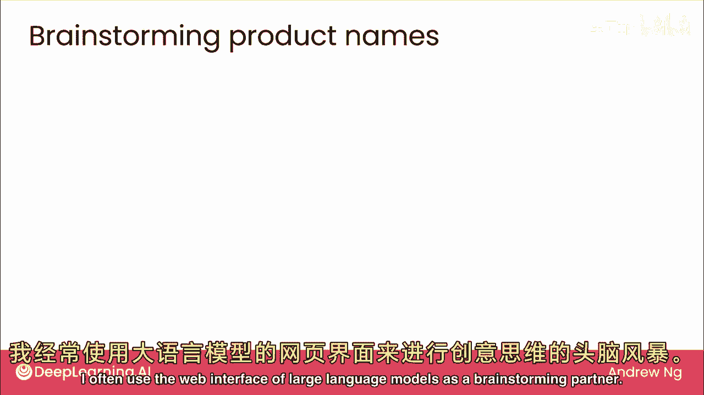
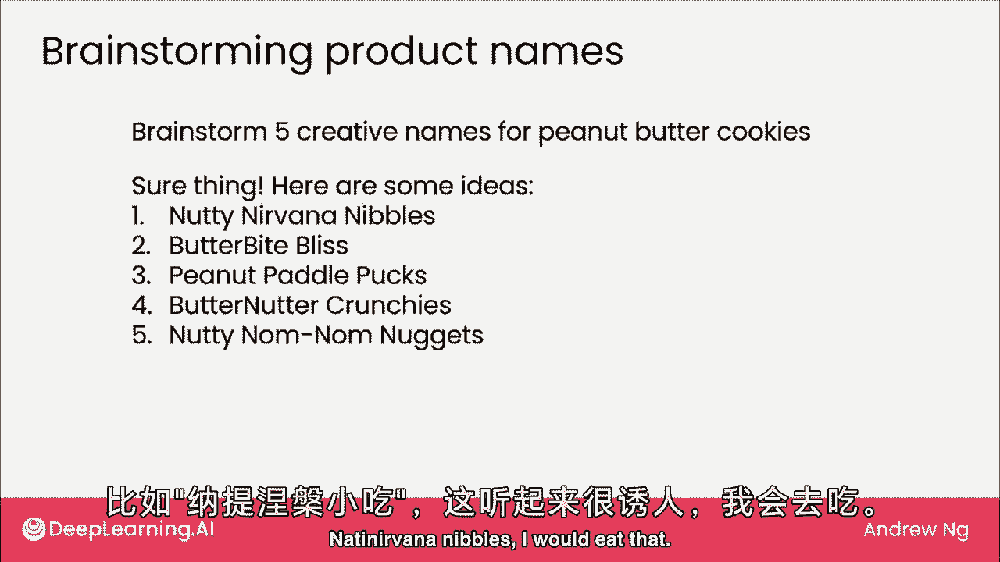
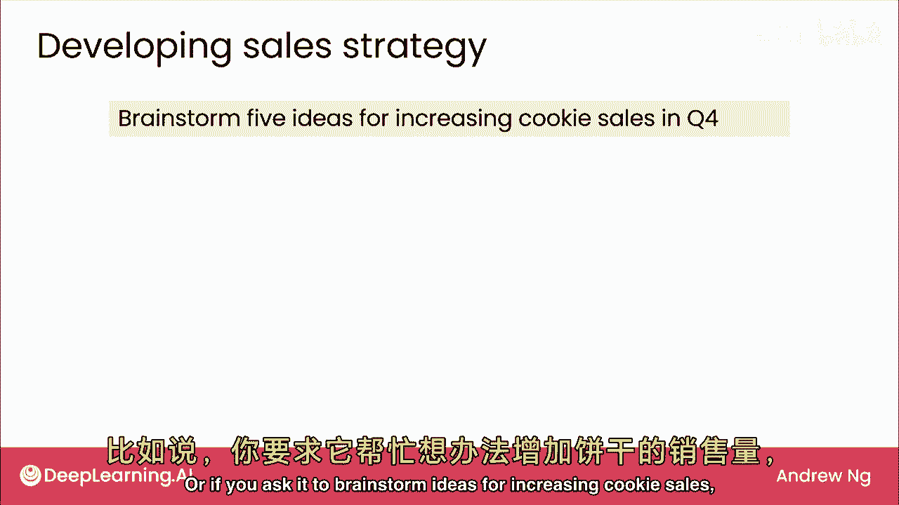
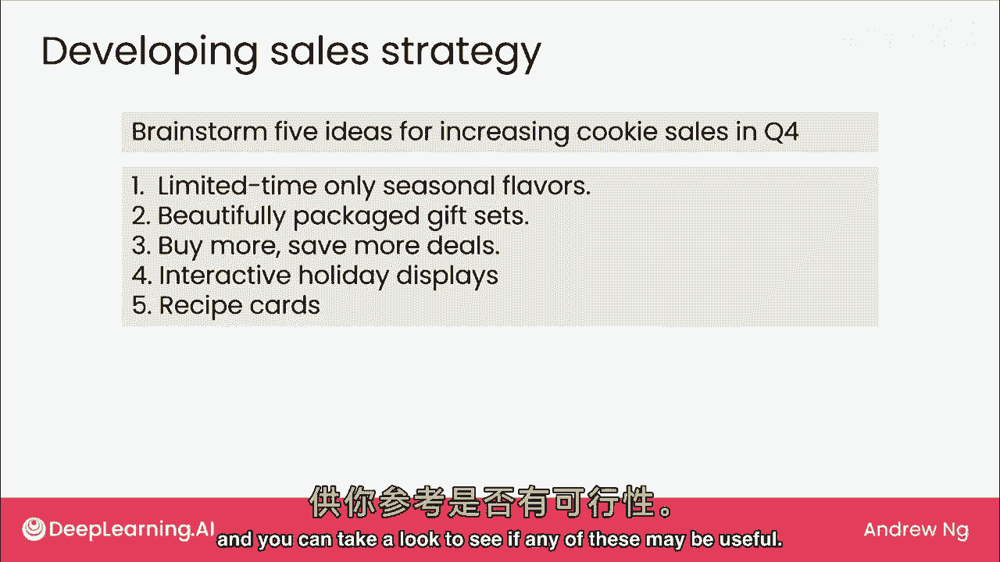
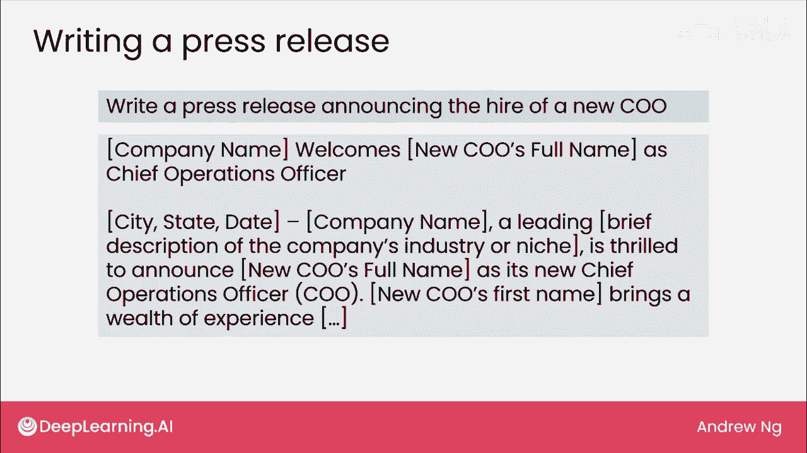
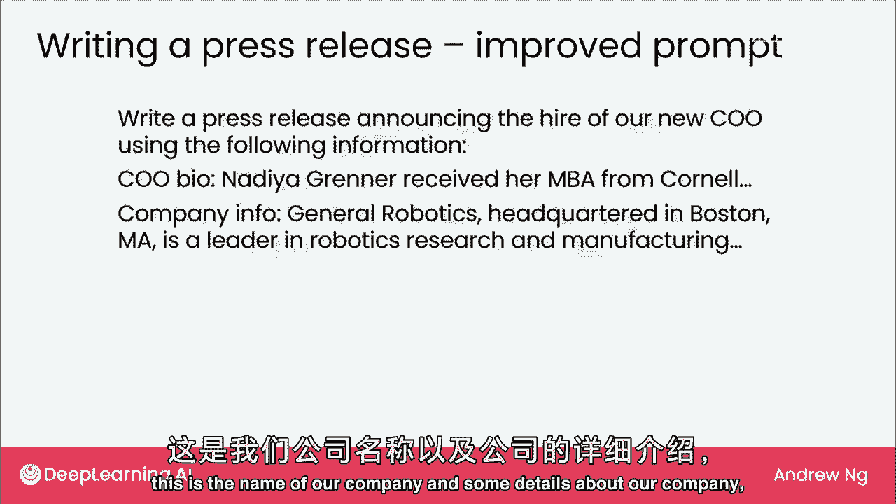
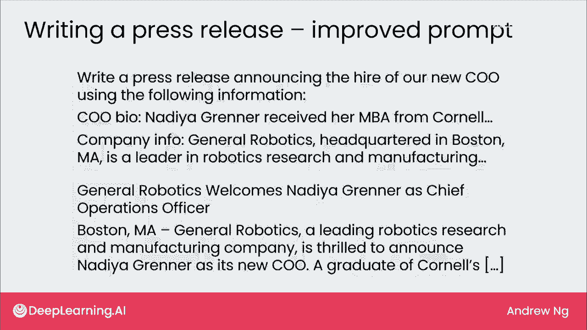
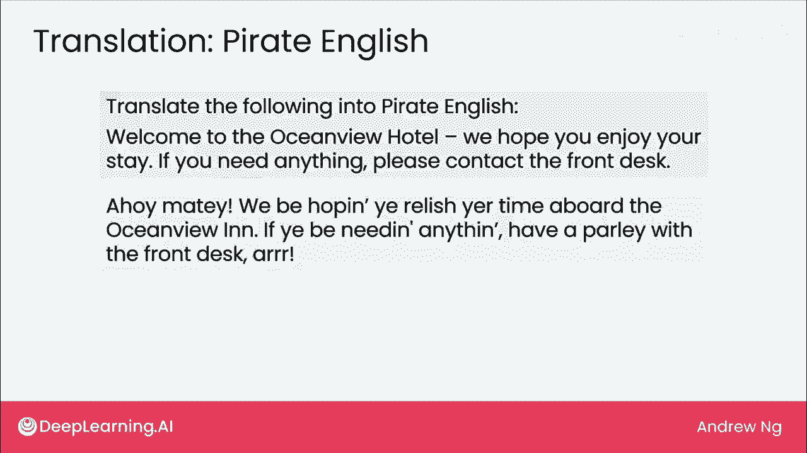

# (超爽中英!) 2024吴恩达0基础【面向所有人的生成式AI】 DeepLearning.AI - P5：5 - 生成式 AI 应用 - 写作 - 吴恩达大模型 - BV19S421R7VR

上期视频讨论了写作，阅读和聊天是三大任务，大型语言模型被训练来预测下一个单词，它们擅长写作并不奇怪，许多写作任务可通过网页界面完成，希望你喜欢这个视频，但我们将深入探讨写作任务，立即开始。

对写作任务有用，广泛地，我们将从提示开始，使用相对短的提示来写作，或生成更长的文本，让我们看看一些写作应用，我经常使用大型语言模型的网页界面作为头脑风暴伙伴。

如果你要求头脑风暴五个花生酱曲奇饼的名字，它实际上会想出一些很有创意的名字，尼尼瓦纳纳比尔斯。

我会吃那个，或者如果你要求它为增加曲奇饼销售量头脑风暴想法。

然后它会想出几个想法，你可以看看是否有任何可能有用。

你还可以再次使用大型语言模型，可能是网页界面版本来为你写一些副本，让我们从一个例子开始，如果你要求它写一份新闻稿，宣布新首席运营官（COO）的雇用，你公司的新的首席运营官，公司名称欢迎新COO全名等。

这是一个很通用的新闻稿，在写提示时，你会发现如果你能给出大型语言模型更多上下文或更多背景信息，那么它将为你写更具体和更好的副本，如果大型语言模型此时看到的只是写一份新闻稿，它不知道关于你的公司。

关于新COO的名字或他们的资格，所以它最终写了一些非常通用的内容，如果你最终像这样提示大型模型，这不是问题，你可能会意识到你最终得到了一份非常通用的新闻稿，并决定更新提示。

以提供更多信息，所以如果我们提示它并说，使用以下信息写新闻稿，这是COO的PIO，这是我们公司的名称和一些公司细节，然后它将写一份更详细和有见地的新闻稿。

专门针对加入这家公司的COO，我发现当提示LM时，我经常不会得到提示，我经常会调整提示，一次做对，就像我们刚才看到的，我们发布新闻稿的地方，宣布新员工入职，没有提供任何上下文，这完全没问题。

如果结果不是你想要的，只需修改提示并重试，本周晚些时候我会在视频中详细说明，当我们讨论编写向量属性的提示时，让我们再看一个例子。

我有时使用LMS进行翻译的另一项写作任务，实际上，您可以通过Web访问的一些大型语言模型，UI在竞争中甚至更好，比现有的专用机器翻译引擎，特别是对于互联网上有大量文本的语言，因此。

大型语言模型有很多数据可以学习，如何生成特定语言中的文本，它在语言表现不佳，也称为低资源语言，互联网上该语言文本较少，但如果你经营一家酒店，并想将欢迎信息翻译成正式的手稿，欢迎客人。

那么大型语言模型可能能够为您输出这样的文本，不幸的是，我不会说印地语，我希望我会，但事实证明这个翻译仅如此，前台一词，翻译成前台的桌子，而不是你知道的接待处，这是我们所说的，当我们说酒店的前台。

所以如果你和一个印地语说话者一起工作，当我准备幻灯片时，然后他们可能会给你一些提示说，哦，这是一种不太正式印地语，但如果你告诉它翻译成正式的口语印地语，然后它更新文本使前台翻译成，印地语中接待处的单词。

这是一个更好的翻译，最近在AI社区看到一件有趣的事，我们中许多从事翻译工作的人，经常需要将文本翻译成我们自己不会说的语言，我们如何知道大型语言模型是否在做合理的事情，实际上。

即使您团队中只有一名印地语说话者，团队其他成员若不懂印地语，他们如何了解情况，我所见，AI社区多团队将文本译为海盗英语测试，因此，若提示大型语言模型将此译为海盗英语，得到，啊哈，愿你享受海景房时光。

听起来像相当不错的一部分英语。

那么，伟大模型如何用于写作。