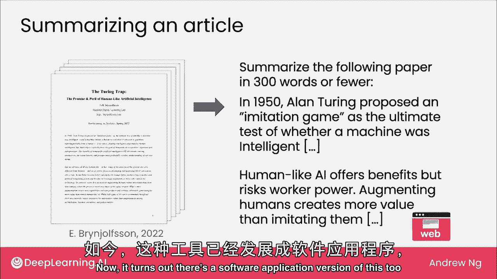
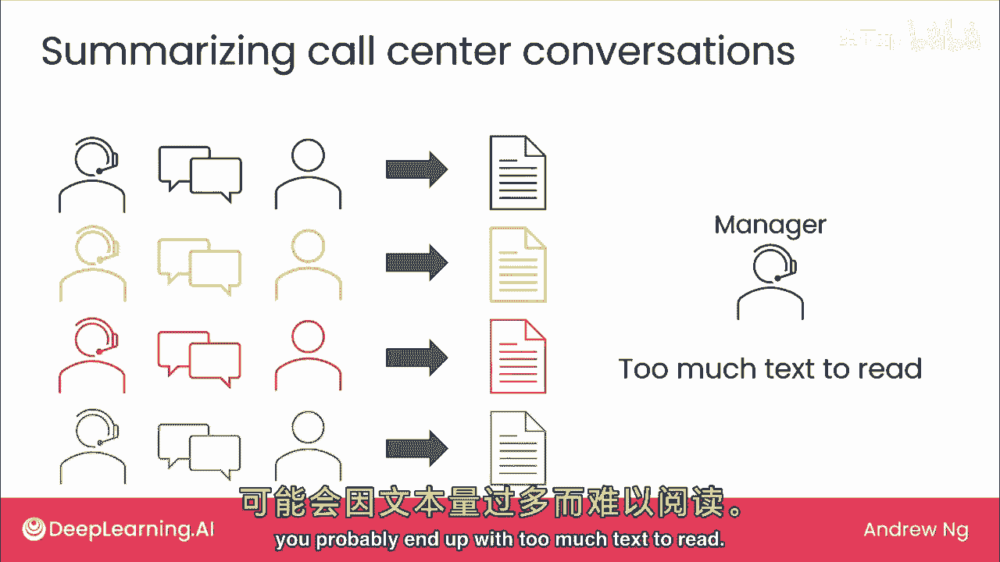
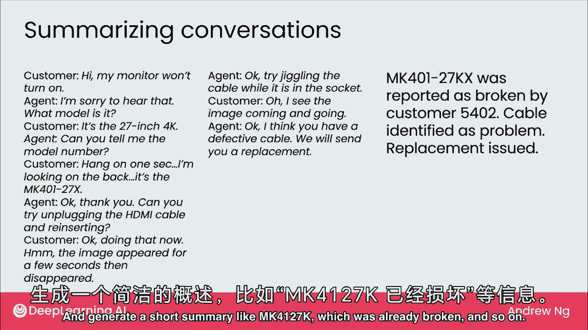
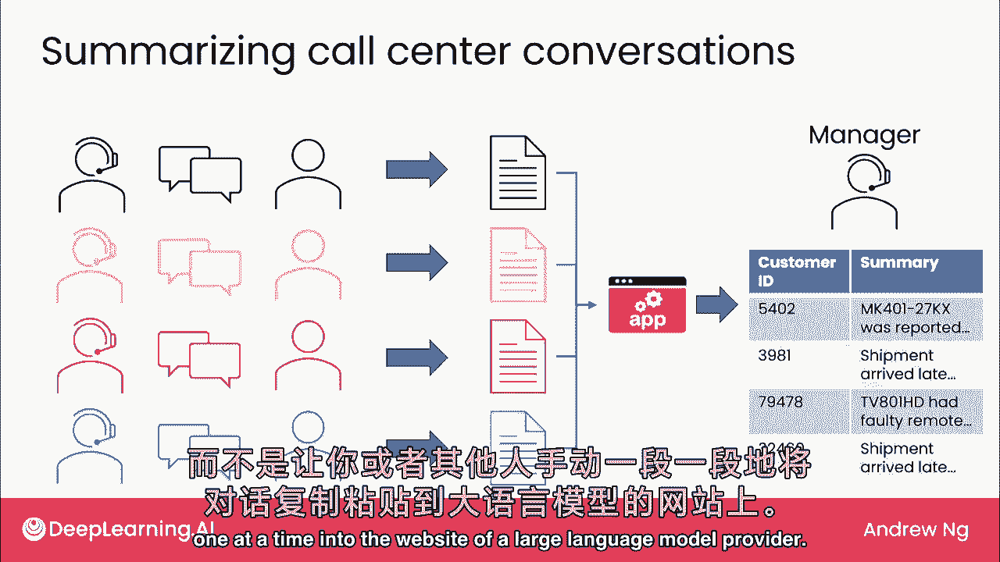
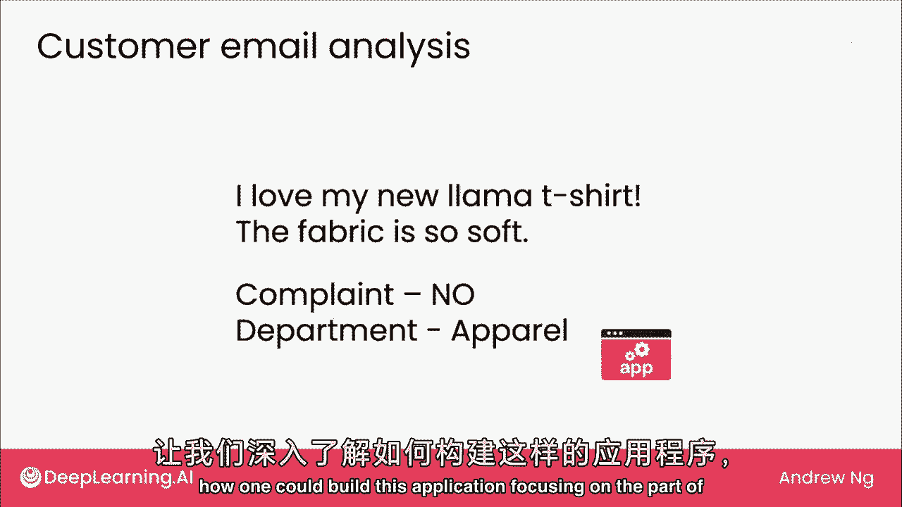
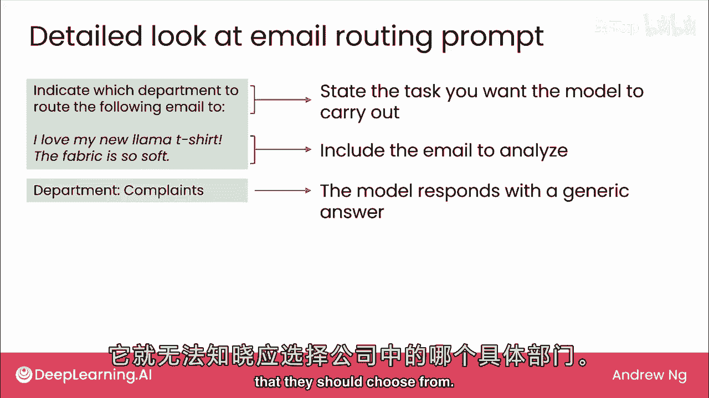
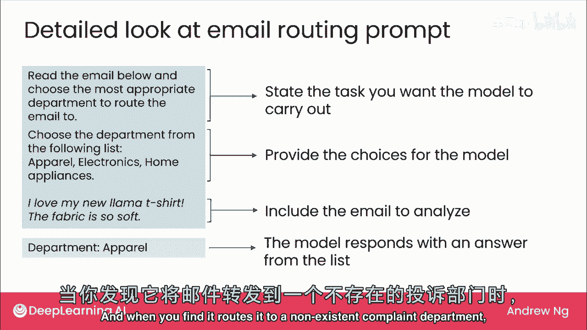
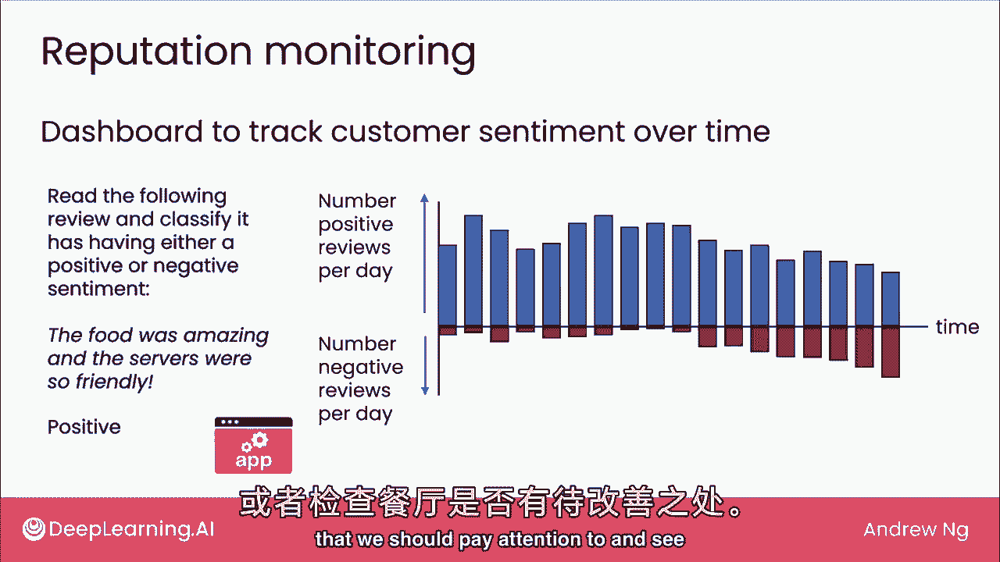

# (超爽中英!) 2024吴恩达0基础【面向所有人的生成式AI】 DeepLearning.AI - P6：6 - 生成式 AI 应用 - 阅读 - 吴恩达大模型 - BV19S421R7VR

在上个视频中，在上个视频中，我们研究了写作任务，其中您将指定最后一个语言模型的提示，我们研究了写作任务，其中您将指定最后一个语言模型的提示，生成较长的输出，生成较长的输出，事实证明。

LMS对许多阅读任务也有用，事实证明，LMS对许多阅读任务也有用，指的是你输入提示的任务，指的是你输入提示的任务，然后生成通常长度相当或更短的输出，然后生成通常长度相当或更短的输出。

让我们看看一些阅读任务，让我们看看一些阅读任务，从我每天都在用的东西开始，从我每天都在用的东西开始，多次校对是证明，多次校对是证明，如果我正在写一段文字，如果我正在写一段文字，我会仔细阅读。

我会仔细阅读，自己检查3-4遍拼写和语法，自己检查3-4遍拼写和语法，尽管我认为自己检查得很仔细，尽管我认为自己检查得很仔细，大型语言模型仍会发现我遗漏的错误，大型语言模型仍会发现我遗漏的错误。

这是一个你可以尝试的预读提示，这是一个你可以尝试的预读提示，如果你告诉它文本的用途，如果你告诉它文本的用途，这是为儿童毛绒玩具网站准备的文本，这是为儿童毛绒玩具网站准备的文本。

有时我会让它检查拼写和语法错误，有时我会让它检查拼写和语法错误，以及不流畅的句子，以及不流畅的句子，然后让它改正并重写，然后让它改正并重写，这是一段有错误的文本，这是一段有错误的文本。

大型语言模型修正拼写，大型语言模型修正拼写，并修正这里的语法，并修正这里的语法，当我自己写文本时，当我自己写文本时，我希望相当自信，我希望相当自信，无拼写和语法错误，无拼写和语法错误。

有时还有别扭的句子，有时还有别扭的句子，实际上我用这个来证明，实际上我用这个来证明。

我写第二项任务，大型语言模型常用于，我写第二项任务，大型语言模型常用于，总结长文章，总结长文章，我的一个合作者，我的一个合作者，埃里克·布莱纳伦，埃里克·布莱纳伦，一位网络教授，一位网络教授。

曾给我发邮件，附上一篇他写的文章，名为《巡回陷阱》，曾给我发邮件，附上一篇他写的文章，名为《巡回陷阱》，我知道那是一篇好文章，我知道那是一篇好文章，但文章很长，但文章很长，在回复他邮件前，我没时间读完。

在回复他邮件前，我没时间读完，实际上，我使用了以下提示，实际上，我使用了以下提示，并将他的整篇文章复制粘贴到一个大型语言模型的网络界面，并将他的整篇文章复制粘贴到一个大型语言模型的网络界面。

让它快速生成一个摘要给我，让它快速生成一个摘要给我，他写的论文讨论AI类人化带来的好处，他写的论文讨论AI类人化带来的好处，让AI增强人类而非自动化，还有很多工作要做，让AI增强人类而非自动化。

还有很多工作要做，布赖夫关于图灵陷阱的文章要点是，布赖夫关于图灵陷阱的文章要点是，他主张不要让AI自动化或取代人类工作，他主张不要让AI自动化或取代人类工作，而应更努力让AI补充或增强人类工作。

而应更努力让AI补充或增强人类工作，通过大型行动模型总结这篇长文，通过大型行动模型总结这篇长文，我比阅读整篇文章自己更快地回到了正轨，我比阅读整篇文章自己更快地回到了正轨，顺便说一句，这是一篇好文章。

顺便说一句，这是一篇好文章，最终我还是自己阅读了整篇文章，最终我还是自己阅读了整篇文章，我真的很喜欢它，我真的很喜欢它，但今天我有时使用大语言模型，但今天我有时使用大语言模型，为我总结没时间读的内容。

为我总结没时间读的内容，你可以去大型语言模型的，你可以去大型语言模型的，Web界面之一快速使用，Web界面之一快速使用，现在有一个软件应用版本，现在有一个软件应用版本。

也在企业中流行，也在企业中流行，让我举例说明，让我举例说明，假设你是客服中心经理，假设你是客服中心经理，有许多客服人员如左图所示，有许多客服人员如左图所示，戴着耳机与客户通话，戴着耳机与客户通话。

如右图所示的人，如右图所示的人，若获准录音通话，若获准录音通话，可运行通话语音识别，可运行通话语音识别，获取对话文本记录，获取对话文本记录，若客服人员多对话，若客服人员多对话，将积累大量文本记录。

将积累大量文本记录，若要审查呼叫中心情况，若要审查呼叫中心情况，可能文本太多难以阅读，可能文本太多难以阅读。

如客户与代理对话记录，如客户与代理对话记录，可了解通话实际内容，可了解通话实际内容，大型语言模型的用途之一，大型语言模型的用途之一，总结此对话，生成类似mk四的简短摘要，总结此对话。

生成类似mk四的简短摘要。

一，一，二，二，七k x（损坏等），七k x（损坏等），如果你收集所有这些不同的文本记录，如果你收集所有这些不同的文本记录，并有一个软件应用程序生成摘要，并有一个软件应用程序生成摘要，那么，那么。

作为此经理，作为此经理，可以快速浏览所有摘要，可能发现，可以快速浏览所有摘要，可能发现，如有问题或趋势需关注，如有问题或趋势需关注，此系统将作为软件应用实现，使用大型语言模型，此系统将作为软件应用实现。

使用大型语言模型，复制粘贴这些对话并无意义，复制粘贴这些对话并无意义，对于客服交互，逐个输入大型语言模型提供商的网站，对于客服交互，逐个输入大型语言模型提供商的网站。

大型语言模型也用于客户邮件分析，大型语言模型也用于客户邮件分析，在早期视频中，在早期视频中，你看到一个客户邮件示例，你看到一个客户邮件示例，并决定是否为投诉，并决定是否为投诉，在这种情况下。

在这种情况下，否，以及将此邮件路由至哪个部门，否，以及将此邮件路由至哪个部门，这是另一个使用大型语言模型的软件应用，这是另一个使用大型语言模型的软件应用，让我们深入探讨如何构建此应用。

让我们深入探讨如何构建此应用，专注于决定将此邮件路由到哪个部分，专注于决定将此邮件路由到哪个部分。

你可以编写一个提示，告诉LM阅读邮件，你可以编写一个提示，告诉LM阅读邮件，并决定将其路由到哪个部门，并决定将其路由到哪个部门，因此，您可以指定任务并提供邮件，因此，您可以指定任务并提供邮件。

但事实证明，使用这样的提示，但事实证明，使用这样的提示，您可能会发现算法将其路由到投诉部门，您可能会发现算法将其路由到投诉部门，在这种情况下，在这种情况下，这可能或可能不是您组织中存在的部门。

这可能或可能不是您组织中存在的部门，这就是LM被给予示例的地方，这就是LM被给予示例的地方，上下文不足，无法知晓，上下文不足，无法知晓，公司中应选择的实际部门名称，公司中应选择的实际部门名称。

相比之下，相比之下，若更新问题如下，若更新问题如下，我们说，我们说，阅读邮件，阅读邮件，选择最合适的部门，选择最合适的部门，浏览它，浏览它，仅从以下列表中选择部门，仅从以下列表中选择部门，在这种情况下。

在这种情况下，根据您想选择的选项集，根据您想选择的选项集，正确路由到服装部门，正确路由到服装部门，在构建应用程序的过程中，在构建应用程序的过程中，再次使用大型语言模型，再次使用大型语言模型。

第一次编写问题并不完全正确并不罕见，第一次编写问题并不完全正确并不罕见，当你发现它，当你发现它，路由到不存在的投诉部门，路由到不存在的投诉部门。

然后只需更新提示即可解决问题，然后只需更新提示即可解决问题，我想触及的最后一个应用是声誉监控，我想触及的最后一个应用是声誉监控，您可以使用LM构建仪表板来跟踪客户情绪。

您可以使用LM构建仪表板来跟踪客户情绪，您业务或产品的正面或负面随时间变化，您业务或产品的正面或负面随时间变化，例如，例如，如果您经营餐厅，偶尔客户会在线撰写评论或发送电子邮件描述他们的体验。

如果您经营餐厅，偶尔客户会在线撰写评论或发送电子邮件描述他们的体验，然后您可以使用这样的提示，然后您可以使用这样的提示，阅读以下评论，阅读以下评论，并分类为正面和负面情绪以自动决定。

并分类为正面和负面情绪以自动决定，每篇评论是正面还是负面，每篇评论是正面还是负面，在这种情况下，在这种情况下，如果食物很棒或服务友好，如果食物很棒或服务友好，将被分类为具有正面情绪。

将被分类为具有正面情绪，然后通过软件计算每天正面评论的数量，然后通过软件计算每天正面评论的数量，以及每天负面评论的数量，以及每天负面评论的数量，您可以构建一个仪表板来跟踪每天或随时间。

您可以构建一个仪表板来跟踪每天或随时间，情绪趋势，情绪趋势，看起来客户情绪相当积极，看起来客户情绪相当积极，但如果它开始呈负面趋势，但如果它开始呈负面趋势，像这样，更多负面评论，像这样，更多负面评论。

然后此仪表板可以提醒您，然后此仪表板可以提醒您，可能有些事情我们应该注意，可能有些事情我们应该注意。

看看是否有我们需要在餐厅解决的问题，看看是否有我们需要在餐厅解决的问题，在本视频中，我们查看了一些阅读应用程序，在本视频中，我们查看了一些阅读应用程序，包括校对，包括校对，摘要，摘要，电子邮件路由。

电子邮件路由，餐厅评论，餐厅评论，情感分析，情感分析，如果您能想到任务，希望有人能阅读一段文本，如果您能想到任务，希望有人能阅读一段文本，然后说几句话，然后说几句话，或给出该文本中内容的几个快速指示。

或给出该文本中内容的几个快速指示，这可能是个阅读任务的好选择，为你找下一张专辑，让我们继续看下一个视频，看看聊天功能。

