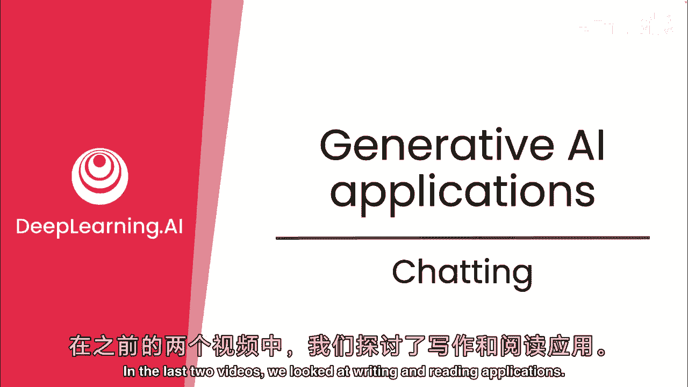
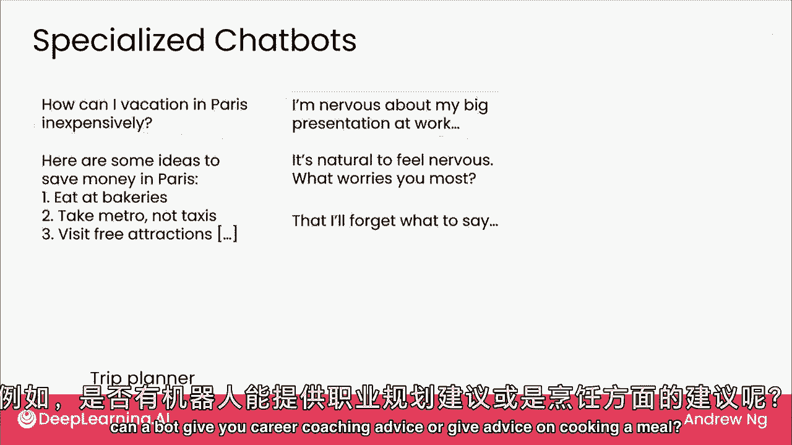
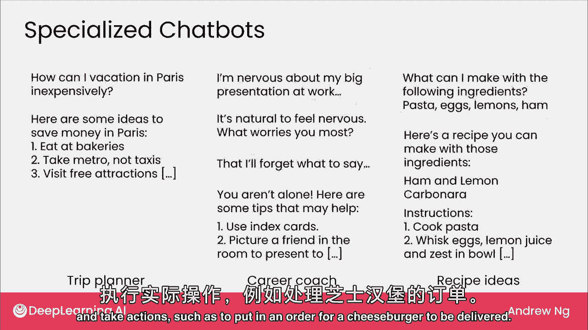
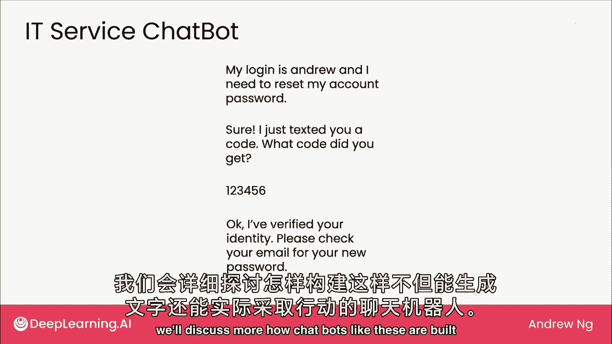
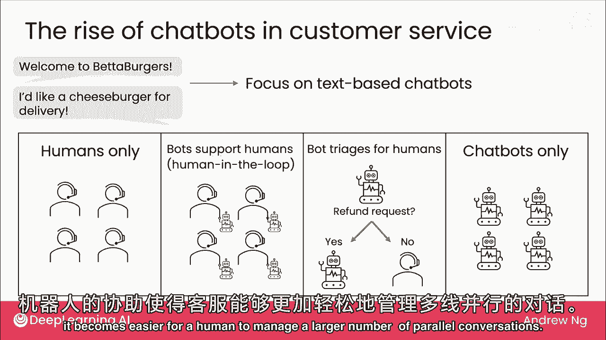
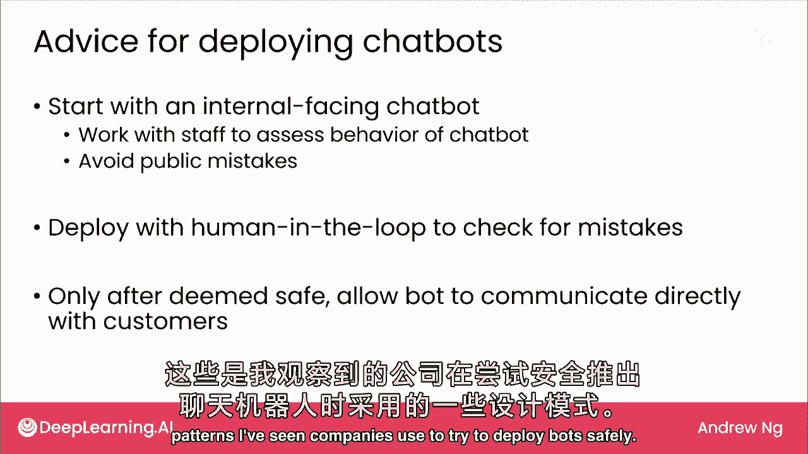

# (超爽中英!) 2024吴恩达0基础【面向所有人的生成式AI】 DeepLearning.AI - P7：7 - 生成式 AI 应用 - 聊天 - 吴恩达大模型 - BV19S421R7VR

前两视频看读写应用，本视频看聊天应用，除通用聊天机器人，许多公司考虑建专聊天应用，若公司多人与客户互动，或同类对话，可考虑是否用专聊天机器人，帮助这类对话，先看看，已看客服聊天机器人例。

可能会订芝士汉堡，一个专业聊天机器人的例子将是专注于帮助你规划旅行的，如何在巴黎度假便宜，机器人可以构建为具有关于旅行的专业知识，今天，许多公司正在探索广泛的建议机器人，例如。

机器人能给你职业指导建议或烹饪餐点的建议吗。

因此，许多擅长回答一件事的专门机器人正在由不同的公司开发，今天，一些这些机器人能够进行对话并提供建议，其中一些机器人只能进行对话并提供建议，这些酒吧可与公司其他软件系统交互并采取行动。

如订购芝士汉堡送餐，另一个可能采取行动的例子是客户服务聊天机器人，许多IT部门收到大量密码重置请求，如果机器人能处理，可能会减轻IT部门的工作量，需要发送短信验证身份并实际重置密码的机器人。

这是一个需要被赋予实际行动能力的机器人，例如发送短信给下周某人，这样的机器人需要能够发送短信，我们将讨论如何构建这样的聊天机器人。

不仅仅是生成文本，而是可以实际采取行动，由于许多客户服务组织正在探索使用聊天机器人，我想与您分享不同企业使用的常见设计点范围，对于此幻灯片，我想专注于基于文本的聊天，而不是语音或电话。

在光谱的一端将是只有人类的客户服务中心，因此，您将有人类服务代理来回发送消息，例如，欢迎来到更好的汉堡，让我为您播放一个，在光谱的另一端将是只有聊天机器人，软件直接回应客户。

人类键盘打字或聊天机器人两端，仅有几处常见设计点，一为机器人支持人类，机器人生成建议消息，人类客服阅读消息，若合适则批准，或有机会编辑消息再回复客户，此设计常称人为介入，因人类在循环中。

这是消息发送回客户前的过程一部分，这是减轻聊天机器人风险的一种方式，可能说错话，因为人类可以检查，在下一视频中实际发送回客户之前，当我们讨论LMS能做什么和不能做什么时。

我们将回顾LMS有时会犯的一些错误，这种设计有助于防止LMS的错误，在自动化光谱的更远处将是，如果你有一个机器人来为人类筛选消息，或许机器回答简单消息，但升级人类处理未准备好处理的事。

曾领导团队建自动检测机器，客户是否请求退款，结果占我们总通话量的10%，仅检测并自动给客户指示，分流约10%流量远离人类代理，节省代理大量时间，让人类专注于处理困难请求。

分流类型设计也常用于节省人类服务代理时间，只需关注他们更胜任的难题，在许多客服中心，一人可能同时与4或8人聊天，在某些极端情况下，甚至可能同时与16位客户交流，有了机器人的支持。

人类管理更多并行对话变得容易。

考虑到机器人，有时会讲错话，我想分享，构建和部署机器人的，公司常想安全地做这事，公司会先开发内部聊天机器人，我常建聊天机器人，但只让团队用，说，回答旅行问题，或机器人该做的事，假设内部团队更同情错误。

更宽容，若机器人一时说错，给你时间评估机器人行为，避免公开错误，以免公司尴尬，在看起来足够安全后，下一步通常是有人工介入的部署，让人工检查许多消息，在实际上发给客户之前，如果可以的话。

在这样做了一段时间后，如果机器人的消息看起来通常可以安全发送给客户，然后你可以允许机器人直接与客户交流，当然，细节非常商业化，首先，对于某些应用，人类检查每条消息可能不实际，因为流量巨大。

但取决于机器人说错话的风险以及流量，因此，人类参与循环是否可行，这是我看到公司使用的设计模式。

试图安全部署机器人的尝试总结，我们看到了LMS如何用于写作，阅读和聊天，这三大类并不意味着LMS可以做的全部，但它们只是你可能想要使用它们的几个广泛类别，LMS可以做很多。

但它们不能做所有事情在下一个视频中，让我们看看LMS可以做什么和不能做什么，更好地理解限制。