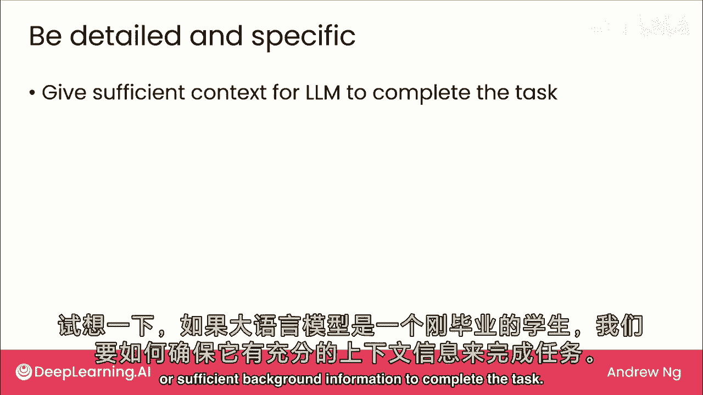
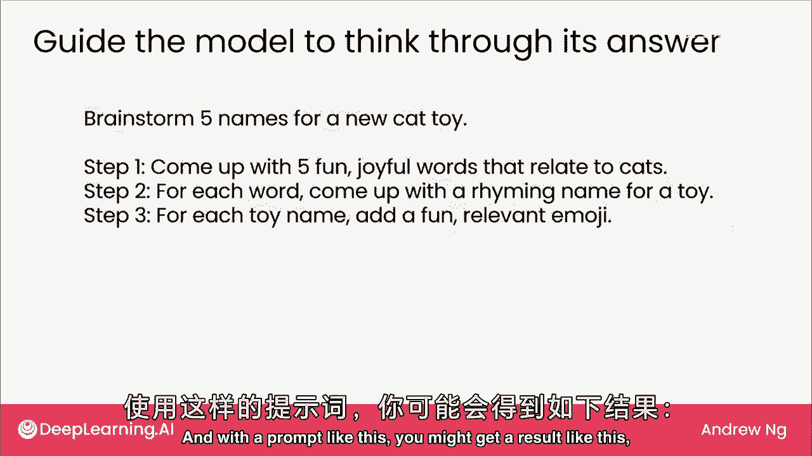
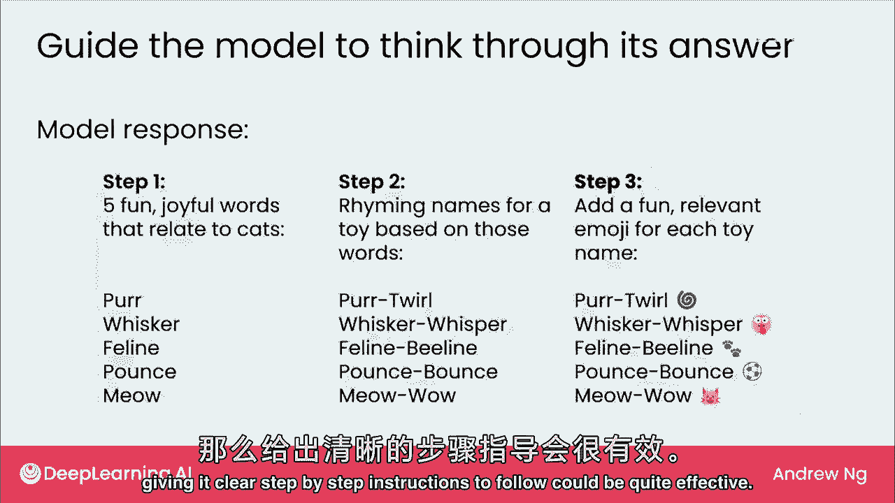
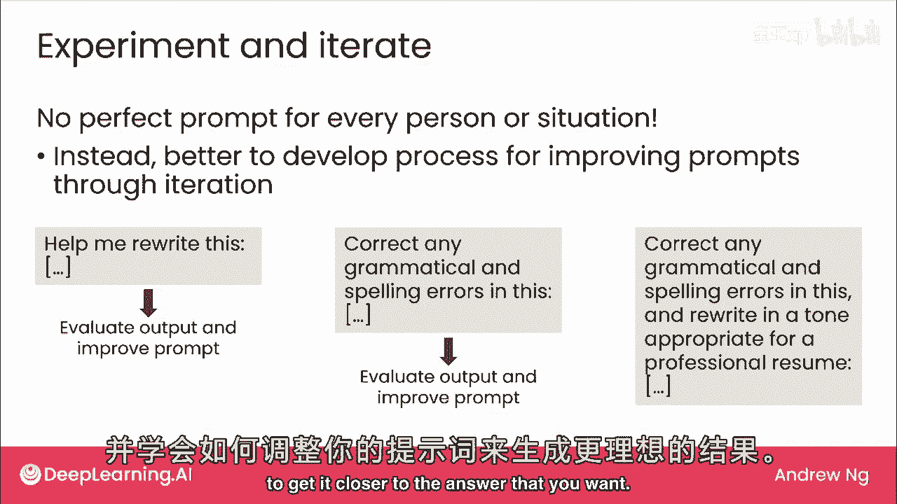
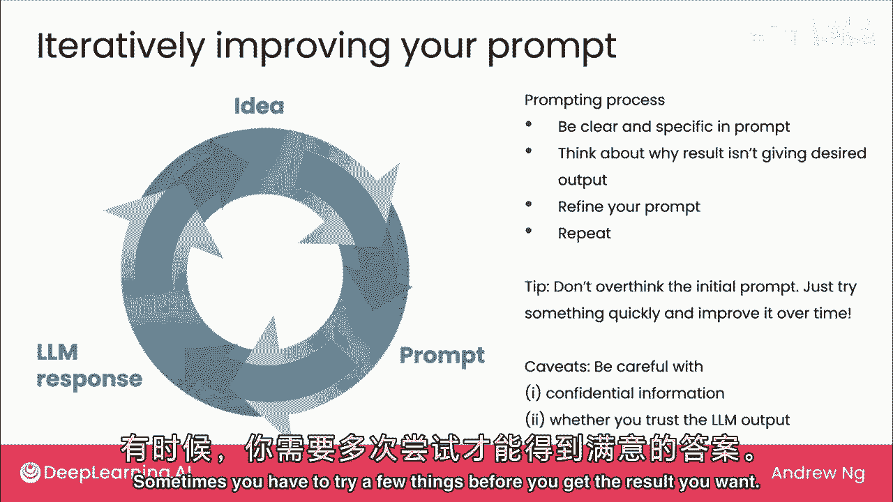

# (超爽中英!) 2024吴恩达0基础【面向所有人的生成式AI】 DeepLearning.AI - P9：9 - 生成式 AI 应用 - 高效提示词撰写技巧 - 吴恩达大模型 - BV19S421R7VR

与你分享大型语言模型的提示，若使用LM提供商的网页界面，希望这些提示马上对你有用，类似提示对构建使用LM的软件也有用，若参与构建使用LM的软件，让我们在这视频中深入，将通过三个主要提示进行。

首先详细且具体，其次引导模型思考答案，最后实验并迭代，从详细且具体开始，以新鲜大学毕业生为例，我会思考如何确保LM有足够上下文，或足够背景信息完成任务。

例如，若你问它，写封邮件请求分配到法律文档项目，嗯，仅凭这样的提示，它不知道如何写有说服力的案例，为你争取分配到那个项目的理由，但若你提供额外上下文，如我将申请法律文档项目的工作，检查法律文档。

有丰富的提示算法经验以获得准确文本，专业语气，这给LM更多相关上下文写那封邮件，进一步帮助你请求分配到项目，若你能详细描述所需任务，若你告诉它，而不是说，帮我写封邮件，若你问它，写一段文本。

解释为何我的背景使我成为该项目的强候选人，候选人的倡导者，这种提示不仅提供足够上下文，还清楚地告诉你想要做什么，这更可能得到你想要的结果。

第二个提示是引导模型思考答案，若你告诉它，为新的猫玩具头脑风暴五个名字，它实际上可以做得很好，但若你心里想，你想要一个押韵的猫玩具名字和一个相关表情符号，这是我可能会尝试的，我可能会告诉它。

头脑风暴五个名字并告诉它，步骤一为猫想出五个快乐词汇，然后为每个词想出一个押韵的名字，每个玩具名都有相关表情，如提示这样。

可能得到这样的结果，模型遵循你的指示，第一个带每根胡须等，然后专业轻声猫线加有趣表情，若已有获取答案的过程，明确给予指示。

分步跟随有效，社交媒体上看过很多文章，如20个必知问题，或17个助你职业发展问题，这不适合所有人，我更觉得有用的是，有过程写提示生成结果，我提示自己时，常实验迭代尝试，如帮助重写这个，若不喜欢结果。

我会澄清，纠正语法拼写错误，若仍不想要结果，进一步澄清说正确弹簧错误，以专业简历语气书写，提示过程非从正确提示开始，而是从某处开始，看结果是否满意，知道如何调整提示接近答案。

我把提示过程想成这样，从你想让模型做的事开始，在提示中表达，基于提示，模型会回应，可能不是你想要的，若如此很好完成，若不满意，初始回应帮你塑造想法修改提示，迭代，可能几次才得到想要结果。

我认为提示过程是，开始时尽量清晰具体，但为节省时间，常从简短提示开始，可能比这设计少具体，但只想快速开始，得到结果后，若非想要，思考为何结果不是预期输出，基于此，优化提示以澄清说明，并不断重复。

直到希望得到想要的回复，我想分享一个小贴士，我看到有些人过度思考初始提示，我认为最好，通常快速尝试一下，如果结果不是你想要的，没关系，继续并批准它，随着时间的推移，你不会因为。

不小心有一个稍微错误措辞的提示而破坏互联网，所以继续尝试你想要的两大注意事项首先，如果你拥有高度机密的信息，我会确保我理解大型语言模型提供商如何使用或不使用，或保持该信息机密，在。

将高度机密信息复制粘贴到大型语言模型的Web用户界面之前，正如我们在上一个视频中看到的，与律师陷入麻烦提交由现在编造的，事实组成的法庭文件之前，你可能值得再次检查并决定自己。

是否可以信任并采取行动TM的输出，但有了这两个注意事项，当提示时，我经常只是跳进去尝试一些东西，看看它是否有效，但然后使用初始结果来决定如何细化提示以获得更好的结果。

这就是我们说提示是一个高度迭代过程的原因，有时你需要尝试一些东西才能得到你想要的结果。

所以这就是关于提示的所有提示，我希望你访问一些大型语言模型提供商的Web用户界面，并尝试一下这些想法你自己，在这门课程中，我们提供了一些流行LM提供商的链接，我希望你去玩它们并享受它们。

这让我们结束了本周的主要视频集，有一个可选的后续视频，在那里我将稍微谈谈图像生成或扩散模型，看看那个，如果你想，我期待下周见到你，我们将更多地谈论如何使用大型语言模型构建项目。

