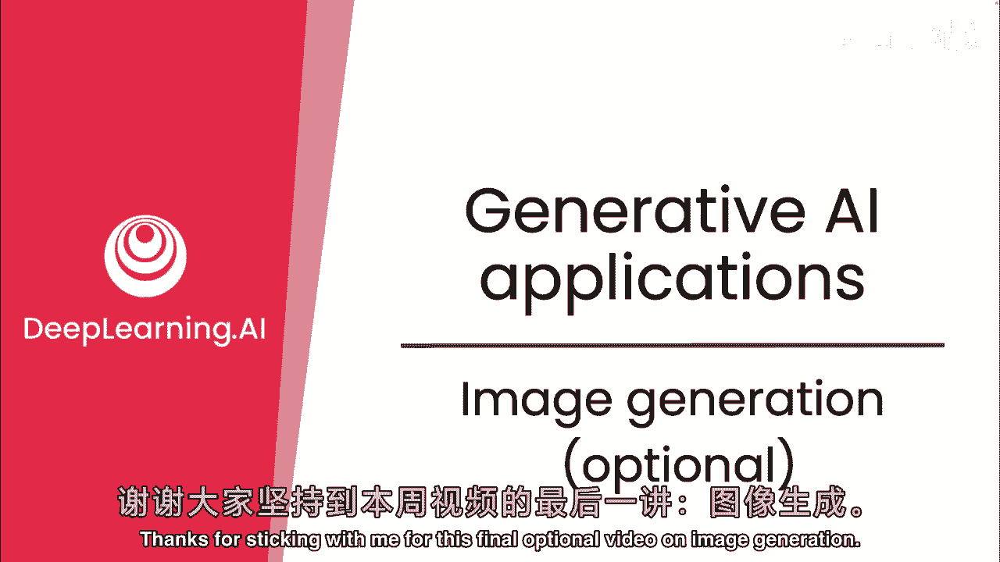
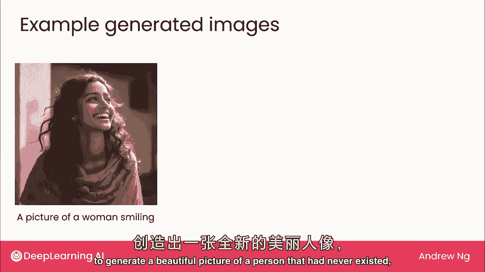
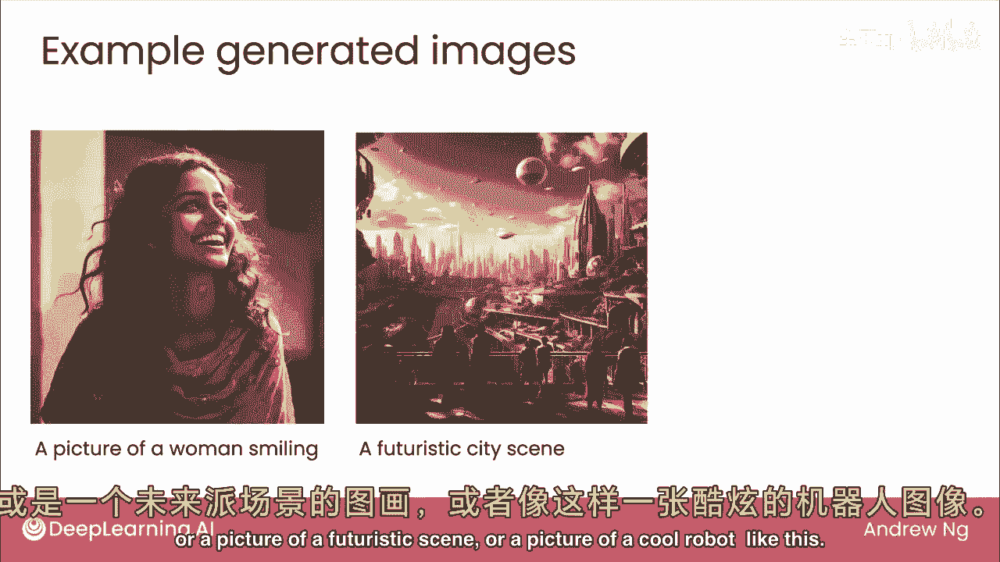
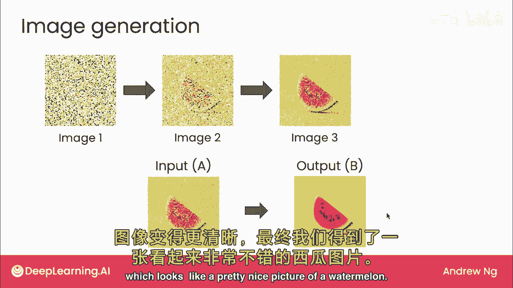
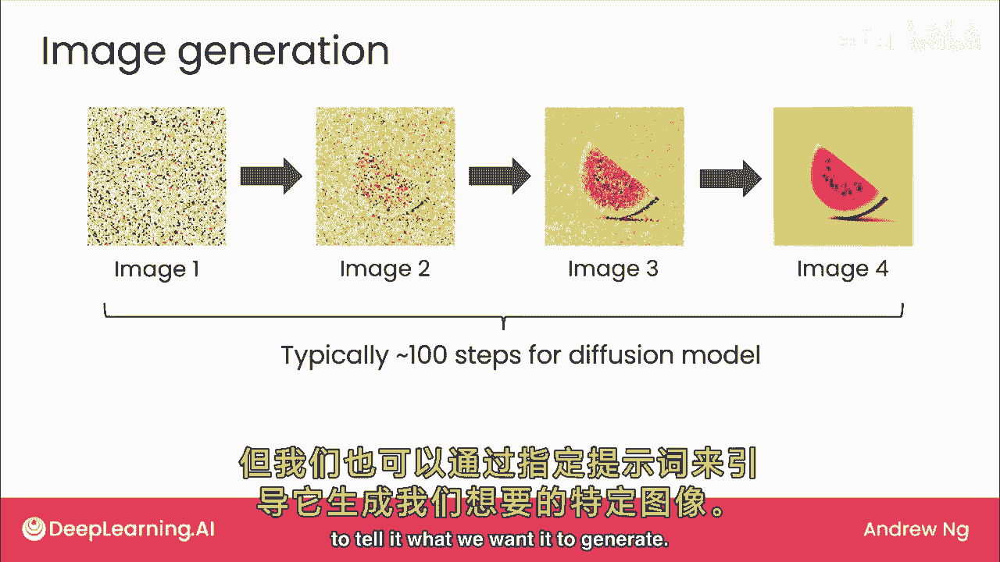
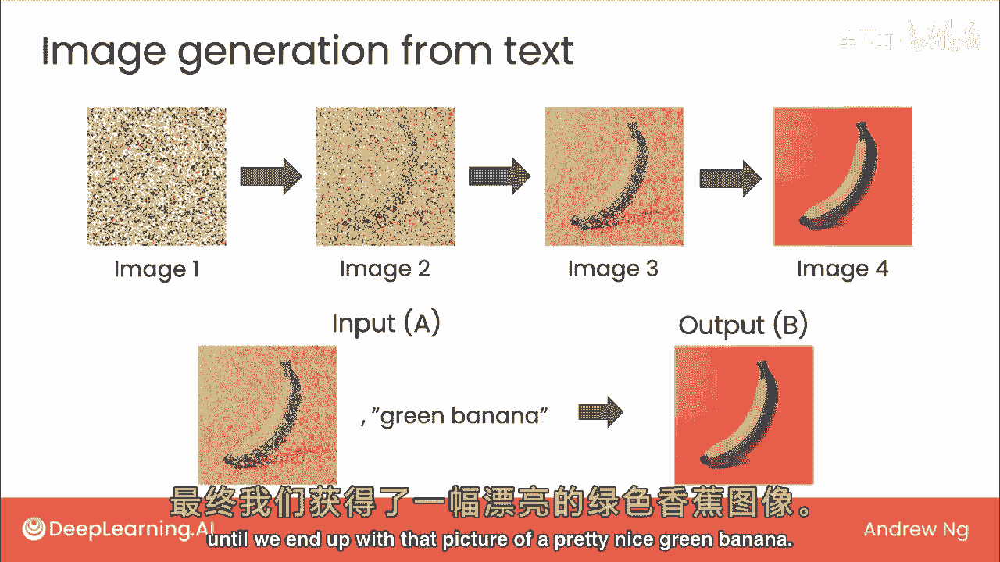

# (超爽中英!) 2024吴恩达0基础【面向所有人的生成式AI】教程！附课件代码 DeepLearning.AI - P10：10 - 生成式 AI 应用 - 图像生成 - 吴恩达大模型 - BV19S421R7VR

感谢本周坚持观看图像生成的最后一个可选视频，我们将重点关注生成，文本生成是许多用户正在使用的，并且对生成式AI的所有不同工具产生最大的影响，但生成式AI的兴奋点之一也是图像生成。

并且也开始出现一些可以生成文本或图像的模型，这些有时被称为多模态模型，因为你可以在多个模态下操作，文本或图像，在这段视频中我想与您分享，图像生成如何工作，仅用提示看看。

可用AI种类生成从未存在的人的美图。

或未来场景图或酷机器人图。

这项技术如何工作，当前图像生成主要通过扩散模型，未来模型已从互联网等处的大量图像中学习，扩散模型的核心是监督学习，这是它的工作原理，假设，算法在网找类似苹果图片，学习如何生成图像，第一步逐渐加噪音。

从漂亮苹果图变噪，更噪，最终纯噪音图，像素随机选择，完全不像苹果，扩散模型用此图学习，监督学习输入噪图，输出稍不嘈杂图像，具体将创建数据集，若给定第二张输入图像，我们想要。

监督学习算法做是学习输出更清晰苹果，这是另一个数据点，给定第三张更嘈杂图像，我们希望算法学习输出稍不嘈杂版本，最后给定纯噪声图像，我们希望学习输出稍不嘈杂图片，这暗示有苹果存在，在训练了数百万张图片后。

类似病毒的过程，当你想要生成新图片时，这就是运行方法。

从纯噪声图像开始，先拍张每像素都随机选取的照片，然后将此图片输入之前训练的监督学习算法，输入纯噪声时，它会学习去除一点噪声，你可能得到这样一幅图，暗示中间某种水果，但根据第二幅图。

我们还不太确定它是什么，我们再次将其输入模型，然后它去除了一点噪音，现在看起来我们能看见一个西瓜的噪点图，然后如果你再应用一次，我们最终得到这张第四幅图，看起来像一张很漂亮的西瓜图片。

我用前一张幻灯片的4步添加噪音和本幻灯片的4步去除噪音来演示这个过程，使用10个片段，4步添加噪音，4步去除噪音，实践中约百步更典型，此算法可随机生成图片，但需控制生成图像，通过指定提示告知生成内容。

描述算法修改以添加文本，或添加提示以训练数据生成，给定如苹果的图片，及描述或提示生成此苹果，我有文本描述，说这是红苹果，然后我们会像之前一样，为这张图片添加噪音，直到得到这张第四张图片，这是纯噪音。

但我们将改变构建学习算法的方法，即，不是输入轻微噪点图片并期望生成清晰图片，相反，将输入a到监督学习算法b中的噪点图片，以及可能生成此图片的文本说明或提示，即红苹果，给定此输入。

我们现在希望算法输出这个干净的苹果图片，同样，我们使用其他噪点图像为算法生成额外数据点，每次给定一个噪点图像和红色苹果的文本提示，我们希望算法学会生成一个不太噪点的红色苹果图片。

因此，从大量数据集中学习后，当你想将这个算法应用于生成时，比如说，一个绿色的香蕉，你做的和之前一样，从纯噪点图像开始，因此，每个像素都是完全随机选择的，如果你想生成一个绿色的香蕉。

你输入到监督学习算法的图片是纯噪点，连同绿色香蕉的提示，既然知道你要绿香蕉，希望算法输出类似图片，看不清香蕉，但中间可能有绿色水果暗示，这是图像生成的第一步，下一步是取右图，这是输出b。

现在作为输入a再次输入，提示绿香蕉生成稍清晰图片，现在清晰看出是绿香蕉，但一个相当嘈杂的，我们再做一次，最终去除大部分噪音，直到我们得到那张漂亮的绿色香蕉图片。

这就是扩散模型如何生成图像，在这个真正神奇的过程中，生成美丽图片的核心，仍然是监督学习，感谢您坚持观看这段可选视频，期待下周见到你，在那里我们将深入探讨使用生成性。

