# (超爽中英!) 2024吴恩达0基础【面向所有人的生成式AI】教程！附课件代码 DeepLearning.AI - P8：8 - 生成式 AI 应用 - 大语言模型的能力与局限 - 吴恩达大模型 - BV19S421R7VR

AI的种子技术很惊人，AI的种子技术很惊人，但本视频不能涵盖所有，但本视频不能涵盖所有，我们将仔细看看LMS能做什么和不能做什么，我们将仔细看看LMS能做什么和不能做什么。

我们将从一个有用的心理模型开始，我们将从一个有用的心理模型开始，关于它能做什么，关于它能做什么，然后让我们一起看看LMS的一些具体限制，然后让我们一起看看LMS的一些具体限制，理解这些限制可以降低。

理解这些限制可以降低，你可能会被绊倒的风险，你可能会被绊倒的风险，试图使用它们做它们并不擅长的事情，试图使用它们做它们并不擅长的事情，那么让我们深入探讨，那么让我们深入探讨。

如果你在尝试弄清楚LMS提示能做什么，如果你在尝试弄清楚LMS提示能做什么，我发现有一个问题提供了一个有用的心理框架，我发现有一个问题提供了一个有用的心理框架，那就是我问自己，那就是我问自己。

仅遵循指令和提示，一名大学毕业生能否完成你想要的任务，仅遵循指令和提示，一名大学毕业生能否完成你想要的任务，例如，例如，一名大学毕业生能否遵循指示阅读电子邮件以确定。

一名大学毕业生能否遵循指示阅读电子邮件以确定，电子邮件是否是投诉，电子邮件是否是投诉，嗯，嗯，我认为一名大学毕业生可能能做到这一点，我认为一名大学毕业生可能能做到这一点，LMS提示也能做得很好。

LMS提示也能做得很好，或者一名大学毕业生，或者一名大学毕业生，能否阅读餐厅评论以确定其是正面还是负面情绪，能否阅读餐厅评论以确定其是正面还是负面情绪，我认为他们能做得相当好，我认为他们能做得相当好。

同样，LMS提示也能做到，同样，LMS提示也能做到，这里还有一个例子，这里还有一个例子，一名大学毕业生能否在不了解公司或公司的情况下撰写新闻稿，一名大学毕业生能否在不了解公司或公司的情况下撰写新闻稿。

嗯，嗯，这名大学毕业生刚刚大学毕业，这名大学毕业生刚刚大学毕业，他们刚刚认识你，对你或你的业务一无所知，他们刚刚认识你，对你或你的业务一无所知，所以他们能做到的最好就是，所以他们能做到的最好就是。

可能写一篇非常通用且不太令人满意的新闻稿，像这样，可能写一篇非常通用且不太令人满意的新闻稿，像这样，但另一方面，但另一方面。

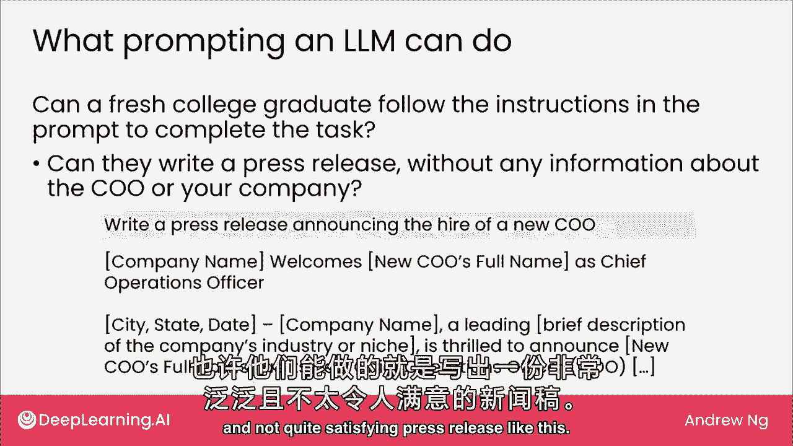

如果你能给他们更多的上下文，如果你能给他们更多的上下文，关于你的业务和首席执行官，关于你的业务和首席执行官，然后我们可以问，然后我们可以问，这名大学毕业生能否在给定基本相关上下文的情况下撰写新闻稿。

这名大学毕业生能否在给定基本相关上下文的情况下撰写新闻稿，我认为他们可能做得相当好，我认为他们可能做得相当好，同样，当你在想象，同样，当你在想象。

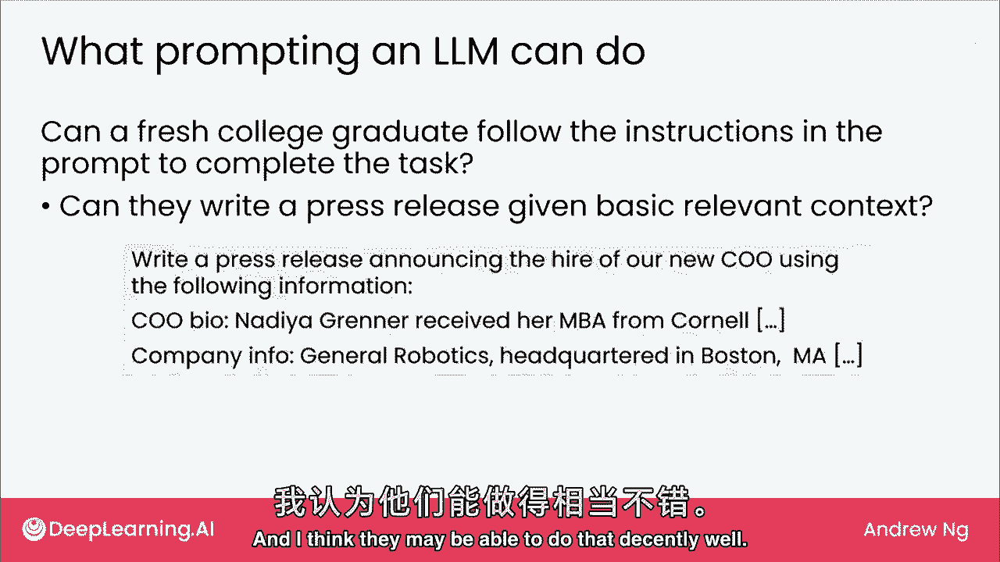

LMS在做许多一名大学毕业生可能能做到的事情时，LMS在做许多一名大学毕业生可能能做到的事情时，把这个大学毕业生想象成拥有很多背景知识，把这个大学毕业生想象成拥有很多背景知识，他们知道，他们知道。

很多来自互联网的通用知识，很多来自互联网的通用知识，但他们必须在没有访问网络搜索引擎的情况下完成这项任务，但他们必须在没有访问网络搜索引擎的情况下完成这项任务。

并且他们对你或你的业务一无所知（为了清晰起见），并且他们对你或你的业务一无所知（为了清晰起见），这个心理模型思想实验，这个心理模型思想实验。

大学毕业生必须在没有针对你公司或业务的特定培训的情况下完成任务，大学毕业生必须在没有针对你公司或业务的特定培训的情况下完成任务，并且每次你提示你的LMS时，LMS实际上并没有记住之前的对话。

并且每次你提示你的LMS时，LMS实际上并没有记住之前的对话，所以每次你得到一个任务时，就好像你得到了一个不同的大学毕业生，所以每次你得到一个任务时，就好像你得到了一个不同的大学毕业生。

所以你无法随着时间的推移训练他们，所以你无法随着时间的推移训练他们，所以想象一下，LMS在做许多一名大学毕业生可能能做到的事情，所以想象一下，LMS在做许多一名大学毕业生可能能做到的事情。

关于业务细节或风格，关于业务细节或风格，让他们写这条经验法则，询问大学毕业生能做什么，让他们写这条经验法则，询问大学毕业生能做什么，是不完美的经验法则，是不完美的经验法则，有新生能做的事。

有新生能做的事，榆树不能，反之亦然，榆树不能，反之亦然，但我发现这是思考能做和不能做的有用起点，但我发现这是思考能做和不能做的有用起点，虽然我们下周关注提示LM能做什么的幻灯片。

虽然我们下周关注提示LM能做什么的幻灯片，当我们谈论生成式AI项目时，当我们谈论生成式AI项目时，我们将讨论一些稍强大的技术，我们将讨论一些稍强大的技术，可能能够扩展你能用生成式AI做的事情。

超越这个大学毕业生概念，可能能够扩展你能用生成式AI做的事情，超越这个大学毕业生概念，现在，现在，让我们看看LMS的更多具体限制，让我们看看LMS的更多具体限制。

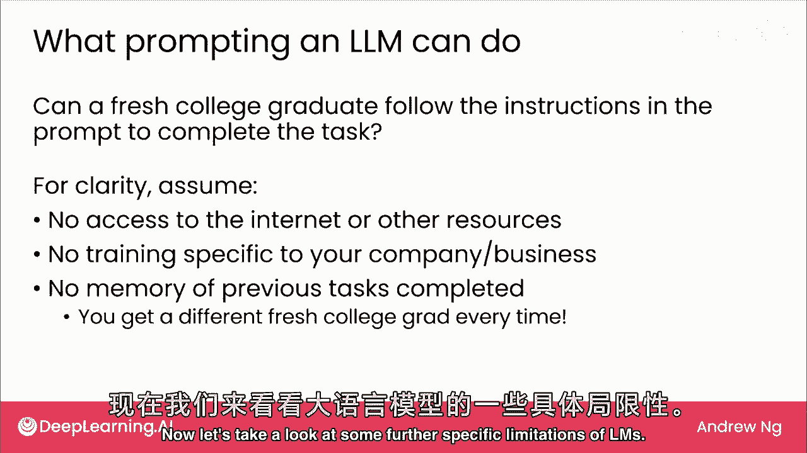

首先是知识断点，首先是知识断点，他的世界知识不会冻结在训练时间，他的世界知识不会冻结在训练时间，更确切地说，一个基于2022年1月之前互联网数据抓取的模型，更确切地说。

一个基于2022年1月之前互联网数据抓取的模型，将不会有关于最近事件的信息，将不会有关于最近事件的信息，因此，给定这样的模型，因此，给定这样的模型，如果你问它，如果你问它。

2022年票房最高的电影是什么，2022年票房最高的电影是什么，它会说不知道，它会说不知道，尽管现在已过2022，尽管现在已过2022，我们知道那是红宝石化身，我们知道那是红宝石化身。

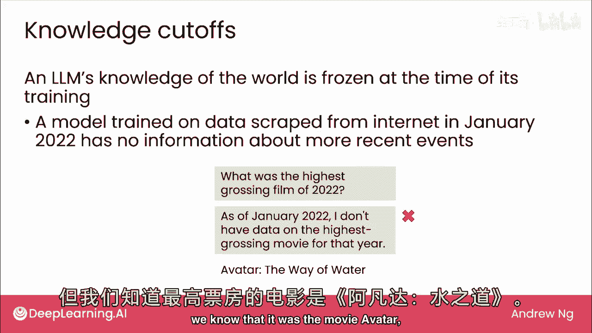

水之道，水之道，7月最卖座电影，7月最卖座电影，有研究室称发现室温超导体LK-99，有研究室称发现室温超导体LK-99，你可能在新闻中见过这图，你可能在新闻中见过这图，该声明并不完全正确。

该声明并不完全正确，若问LM关于LK-99，若问LM关于LK-99，尽管新闻广泛报道，尽管新闻广泛报道，若LM仅从网上文本学习，若LM仅从网上文本学习，截至2022年1月，截至2022年1月。

它将对此一无所知，它将对此一无所知，因此称为知识截止，因此称为知识截止，LM对世界了解，LM对世界了解，仅截至训练时的某个时刻，仅截至训练时的某个时刻，或从互联网下载文本的最后时间用于训练。

或从互联网下载文本的最后时间用于训练。

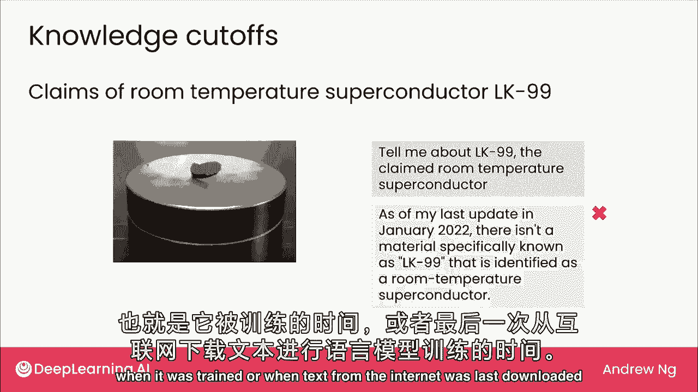

OIS的第二个限制，OIS的第二个限制，它们有时会编造东西，它们有时会编造东西，我们称这些为幻觉，我们称这些为幻觉，我发现如果要求LM给出一些引言，我发现如果要求LM给出一些引言，历史名人名言。

历史名人名言，常组成引言，常组成引言，例如，例如，若你问，若你问，莎士比亚关于碧昂斯，莎士比亚关于碧昂斯，写了三等式，写了三等式，莎士比亚生卒于碧昂斯前，莎士比亚生卒于碧昂斯前，莎士比亚未提碧昂斯。

莎士比亚未提碧昂斯，但会自信回你引言，但会自信回你引言，如她歌声，如她歌声，如阳光般闪耀，如阳光般闪耀，向女王致敬，向女王致敬，她最值得爱，她最值得爱。

这些都是幻觉，这些都是幻觉，莎士比亚名言，莎士比亚名言，或若要求列出法庭案件，或若要求列出法庭案件，加州审理AI案件，加州审理AI案件，可能会给出权威的回答，可能会给出权威的回答，在这种情况下。

第一个案件是Waymo诉Uber案，在这种情况下，第一个案件是Waymo诉Uber案，但我未能找到Ingersoll诉Chevron案，但我未能找到Ingersoll诉Chevron案。

第二种情况是幻觉，第二种情况是幻觉，有时AI会幻想或编造，有时AI会幻想或编造，听起来权威的内容，听起来权威的内容，这可能误导人们认为，这可能误导人们认为，虚构的东西可能是真实的。

虚构的东西可能是真实的，一位律师不幸使用ChatGPT，一位律师不幸使用ChatGPT，生成法律案件文本，生成法律案件文本，并将其提交给法院，并将其提交给法院，不知道他提交给法院的是。

不知道他提交给法院的是，非法内容，包含大量虚构案件，非法内容，包含大量虚构案件，依赖AI的律师说他未理解聊天机器人，依赖AI的律师说他未理解聊天机器人，可能误导他，可能误导他。

这位律师因提交虚假法庭文件被处罚，这位律师因提交虚假法庭文件被处罚，理解其限制很重要，理解其限制很重要，若用于重要文档，若用于重要文档。

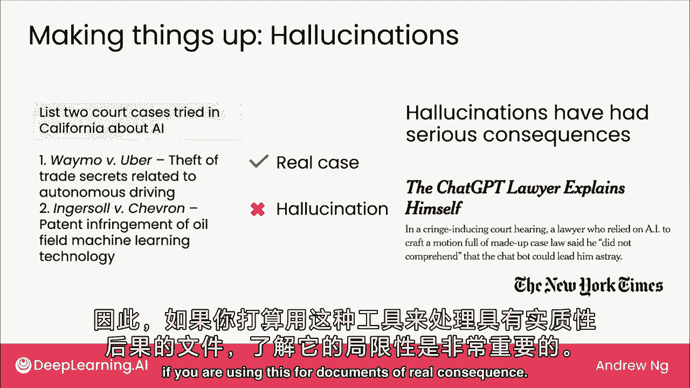

LMS也有技术限制，LMS也有技术限制，输入长度有限，即提示长度，输入长度有限，即提示长度，因此，可生成文本的输出长度也受限，因此，可生成文本的输出长度也受限，LMS可将提示设为仅数千字。

LMS可将提示设为仅数千字，因此，可提供的总上下文有限，因此，可提供的总上下文有限，若要总结论文，若要总结论文，若论文长于输入限制，若论文长于输入限制，模型可能拒绝处理，模型可能拒绝处理。

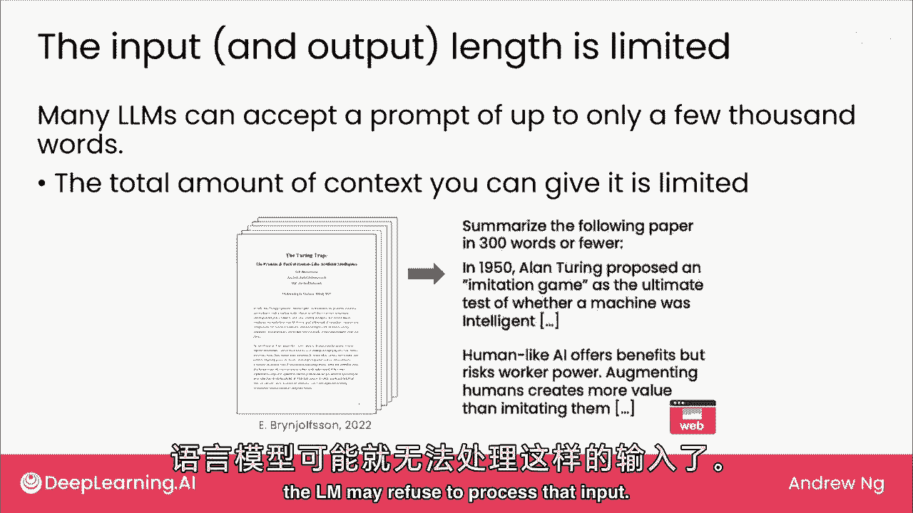

可分次给其论文部分，可分次给其论文部分，分次总结论文部分，分次总结论文部分，或可找输入限制长的模型，或可找输入限制长的模型，有些支持数万单词，有些支持数万单词，技术上，模型有上下文长度限制，技术上。

模型有上下文长度限制，上下文长度是总输入输出限制，上下文长度是总输入输出限制，使用模型时，使用模型时，我很少让它产生这么多输出以至于遇到限制，我很少让它产生这么多输出以至于遇到限制，确实关于输出长度。

确实关于输出长度，但我确实遇到输入长度限制，但我确实遇到输入长度限制，有时如果我有很多，有时如果我有很多。

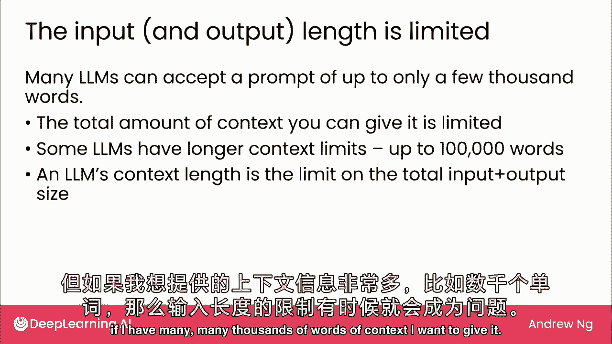

成千上万的上下文单词，成千上万的上下文单词，我想给它一个生成AI的主要限制，我想给它一个生成AI的主要限制，它们目前不擅长处理结构化数据和我的结构化数据，它们目前不擅长处理结构化数据和我的结构化数据。

我的意思是表格数据，我的意思是表格数据，就像你可能存储在Excel或谷歌表格中的所有数据，就像你可能存储在Excel或谷歌表格中的所有数据，例如，例如，这是一张房价表，包括房屋面积和房价数据，以及房价。

如果你把这些数字输入到noem中，然后问它，我有一千平方英尺的房子，你认为什么价格合适，Lms并不擅长这个，相反，如果你称房屋面积为输入a，房价为输入b，输出b，监督学习更好，估计大小价格。

结构化数据示例，不同访客访问网站，是否购买，同样，监督学习优于，尝试复制，将所有时间、价格和购买信息粘贴到大语言模型的提示中。

与结构化数据相比，生成式AI更适合处理非结构化数据，结构化数据指表格数据，如您会在电子表格中存储的数据，而非结构化数据指文本、图像等。

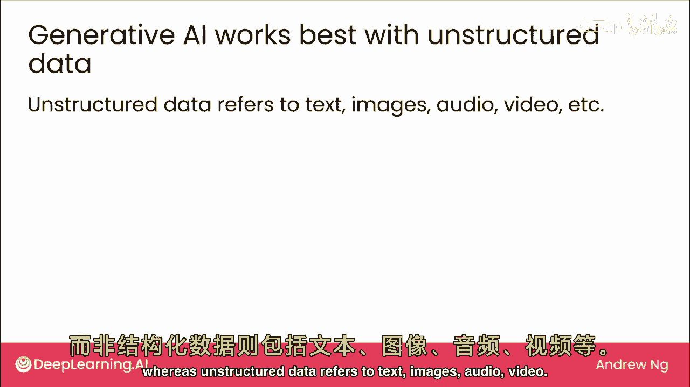

音频，视频，AI适用于所有这些类型的数据，尽管影响最大，这也是本课程主要关注文本数据的原因。

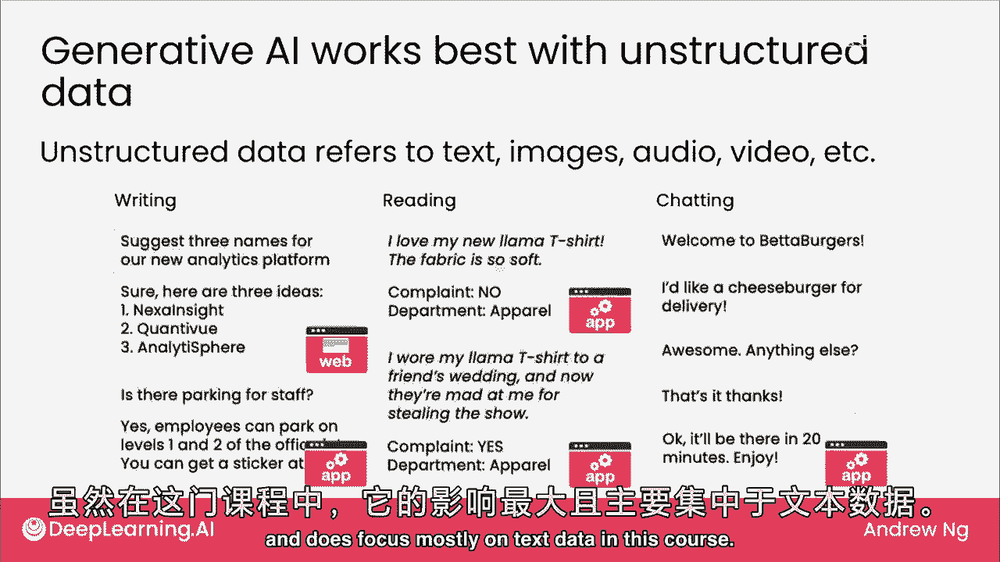

最后，大型语言模型可能产生偏见输出，有时输出有害言论，例如，大型语言模型基于互联网文本训练，不幸的是，互联网文本可能反映社会偏见，若要nlm完成句子，鲟鱼走向停车场并取出，可能会输出他的车钥匙。

或说护士走向停车场并取出，可能说她的手机，在此例中，lm假设外科医生是男性，护士是女性，我们清楚外科医生和护士，可以是任何性别，若在应用中，这种偏见可能造成伤害，我会小心提示和应用语言模型，确保不助长。

这种不良偏见，最后，某些元素，偶尔会输出有害的言论，例如，某些语言模型，使用主要LM提供商的Web界面，实际上变得越来越难，让他们输出这类有害言论。

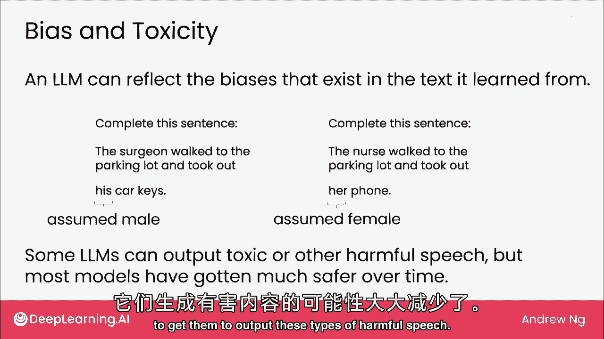

总结了对LM的提示可做和不可做，如我下周提到的，我们将看看一些技术来克服这些限制，使LM所能做的更广泛、更强大，但首先让我们看看一些提示LM的技巧，我希望我在下一个视频中分享的技巧，马上对你使用有帮助。

