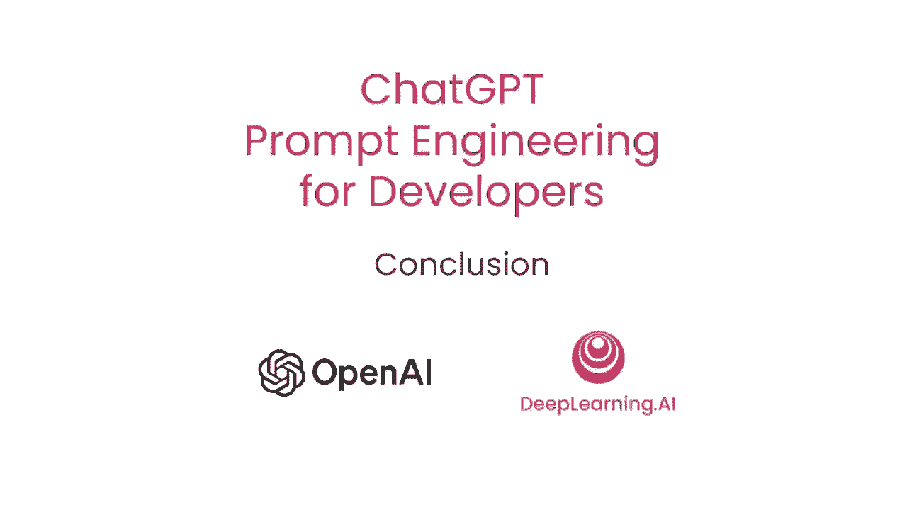
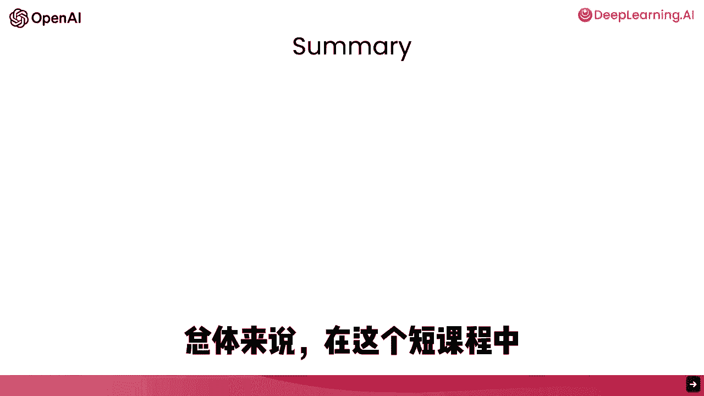
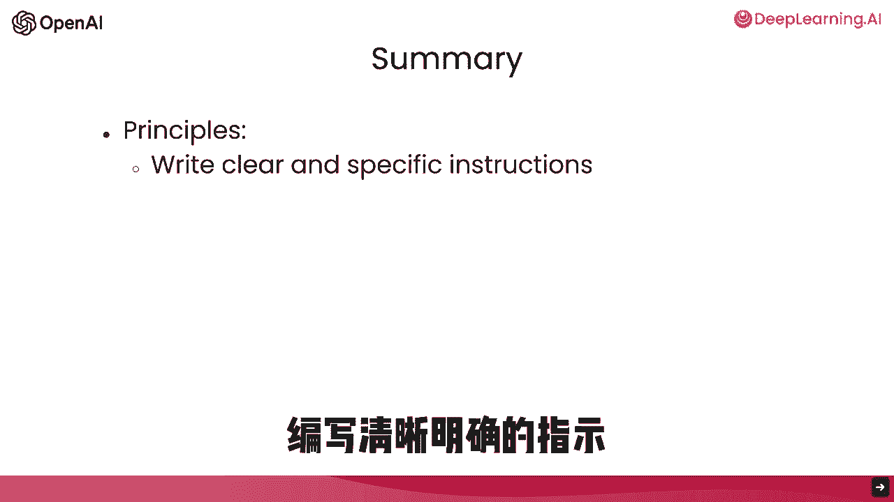
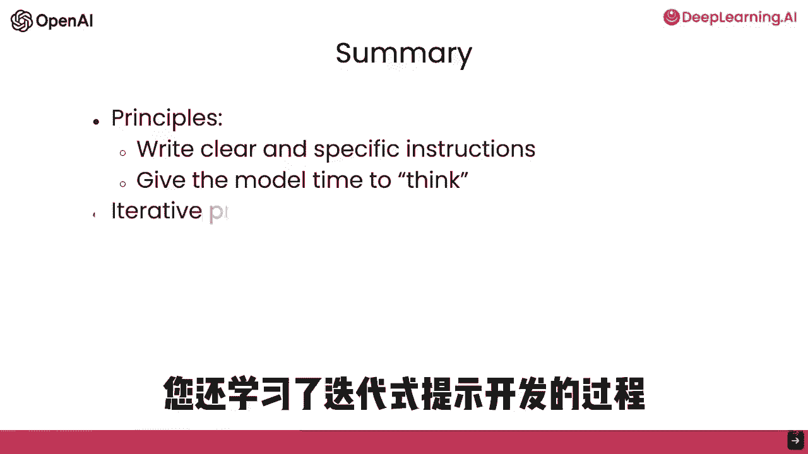
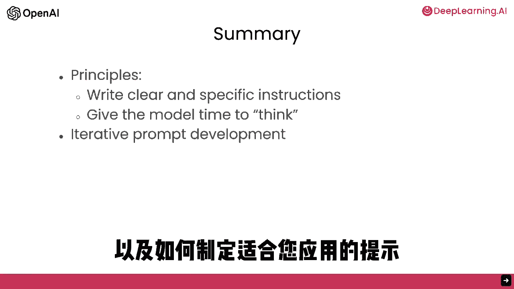
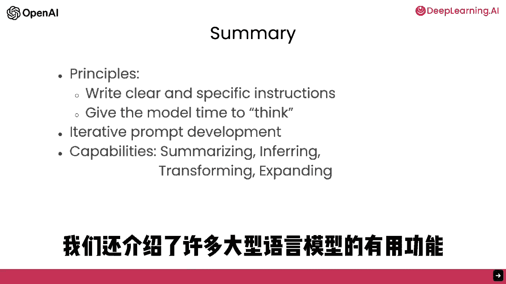
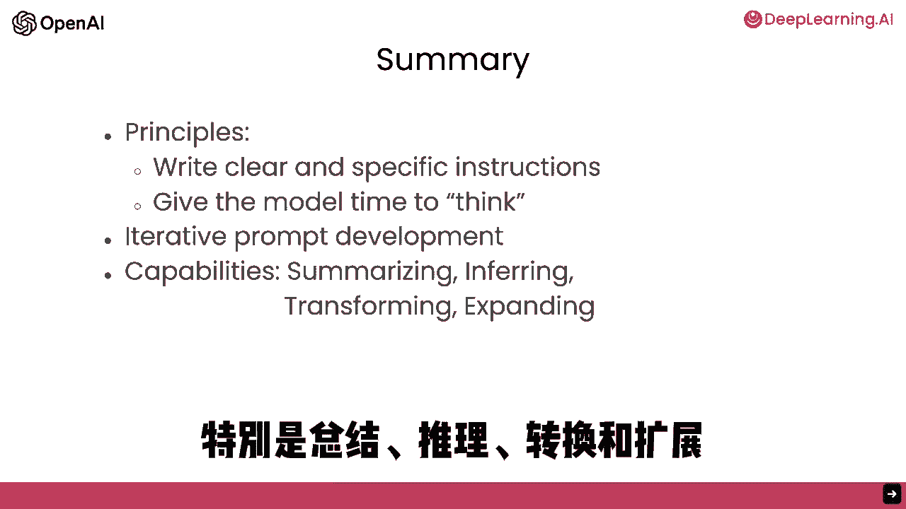

# (超爽中英!) 2024吴恩达最好的【ChatGPT提示词工程师】教程！附课件代码 DeepLearning.AI - P9：第9集 总结 - 吴恩达大模型 - BV1Wf421q7cd

祝贺完成本短课程，总结。

在这短课程中，你学习了两种关键提示原则，写清晰具体指令。

在适当情况下，给模型思考时间，你还学习了迭代提示开发。

以及有一个过程找到提示是正确的，对于你的应用是关键。

我们还浏览了大型语言模型的一些有用功能。

特别是总结，推理，转换和扩展。

你也看到了如何构建自定义聊天机器人，那很多，你在短短一课中学到的，我希望你喜欢浏览这些材料，我们希望你能想出一些你可以自己构建的应用想法，请尝试并让我们知道，你想到的，没有应用太小。

你知道从一个小项目开始很好，也许有一点实用性，或者甚至根本没用，只是有趣，是的，我发现玩这些模型实际上很有趣，所以去玩吧，是的，我同意这是一个很好的周末活动，基于经验，嗯，你知道。

请使用你第一个项目的学习来构建更好的第二个项目，也许甚至更好的第三个项目等等，这就是我自己使用这些模型成长的方式，或者如果你有一个更大的项目想法，已经，就去做吧，嗯，作为一个提醒。

这些大型语言模型是非常强大的技术，所以不用说，我们要求你负责任地使用它们，并且请只构建那些将产生积极影响的东西，完全同意，我认为在这个时代，构建人工智能系统的人可以对他人产生巨大影响，因此。

我们所有人都负责任地使用这些工具比以往任何时候都更重要，嗯，我认为构建大型语言模型基于的应用是一个令人兴奋和不断增长的领域，现在你已经完成了这门课程，我认为你现在拥有丰富的知识来构建。

今天很少有人知道如何构建的东西，希望你也帮助我们宣传，鼓励他人参加这门课程，最后，希望你学得开心，感谢你完成这门课程。

