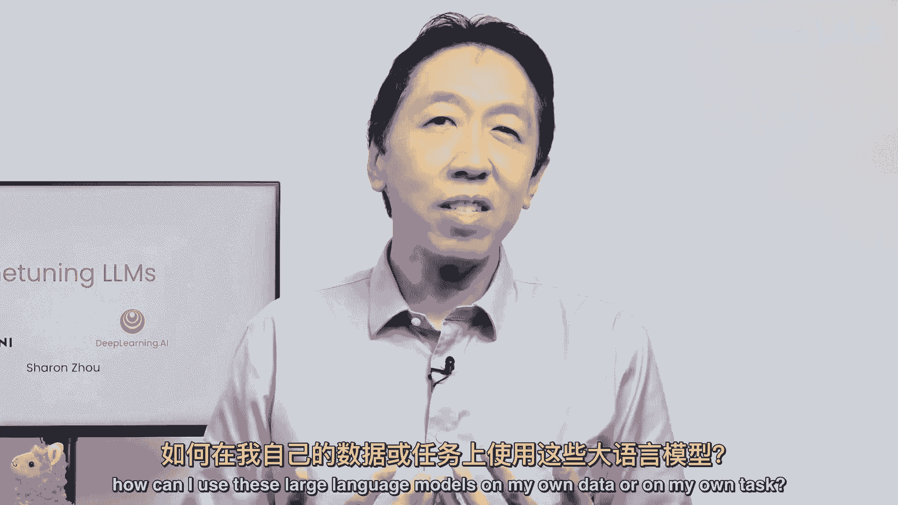
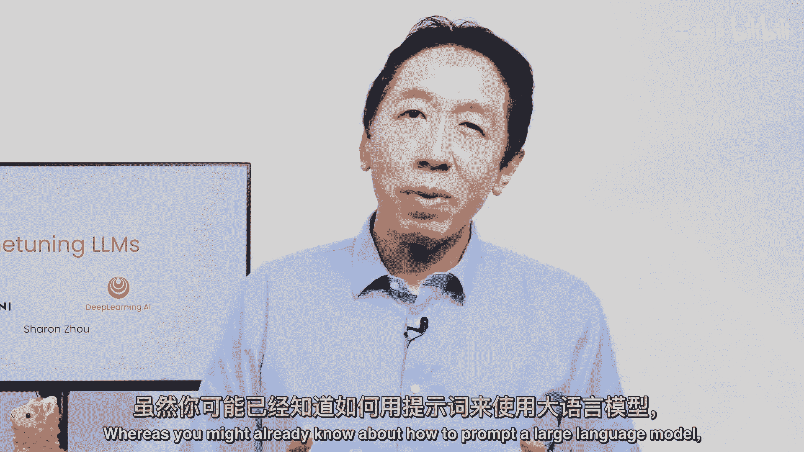
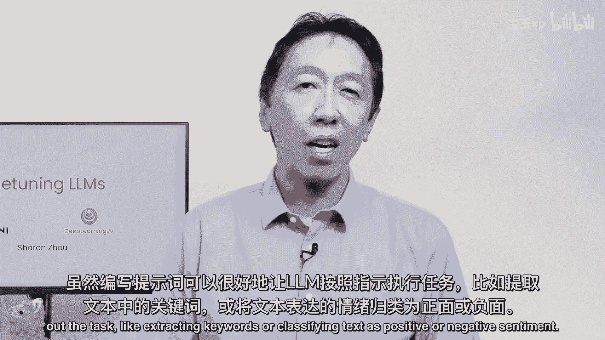
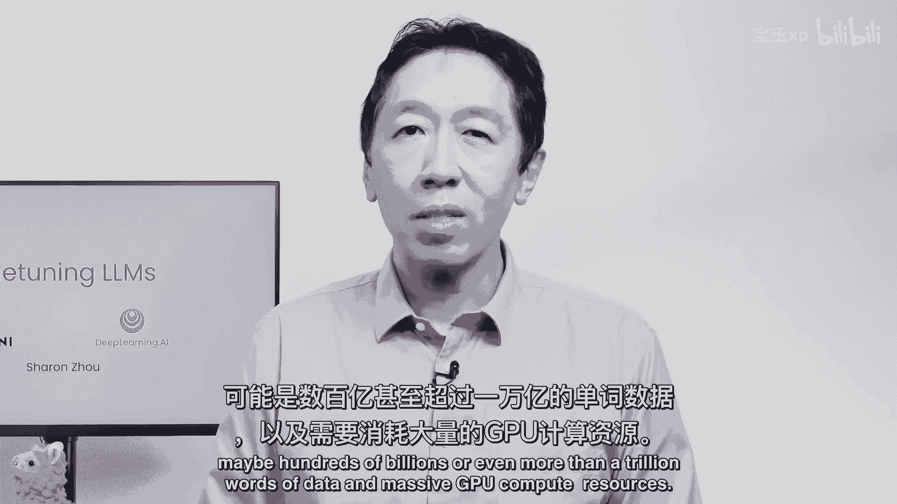
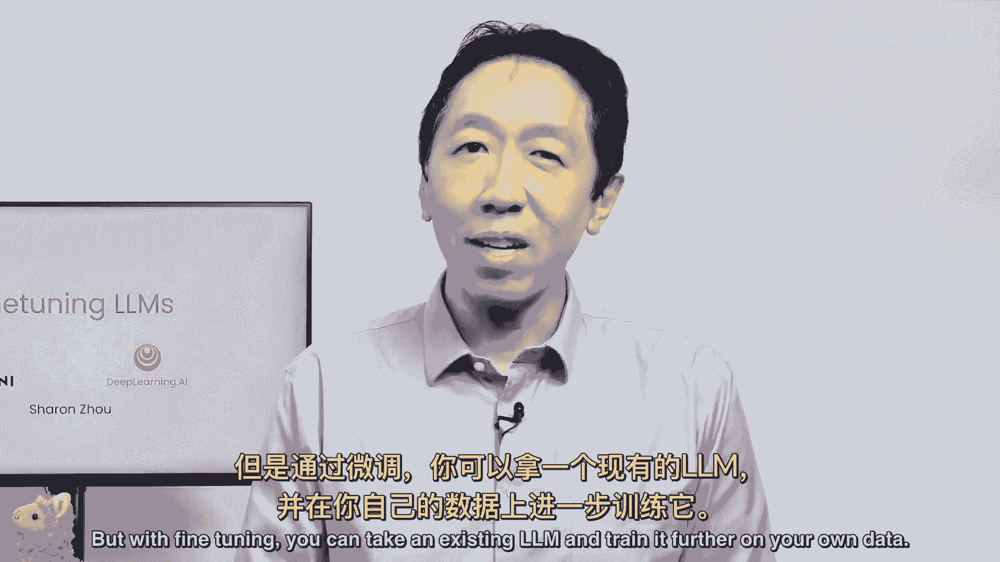
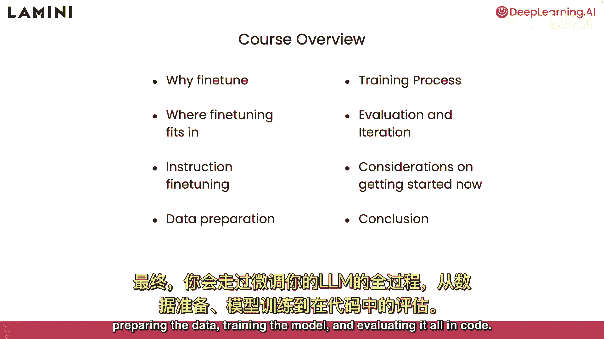
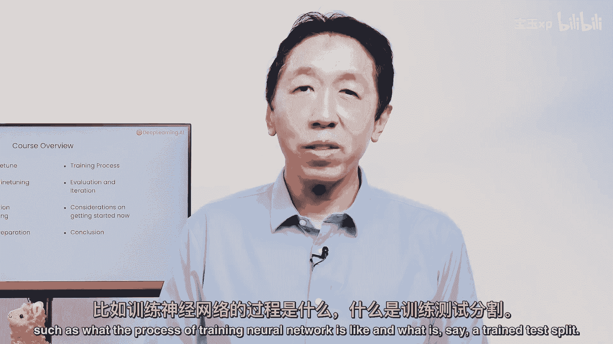
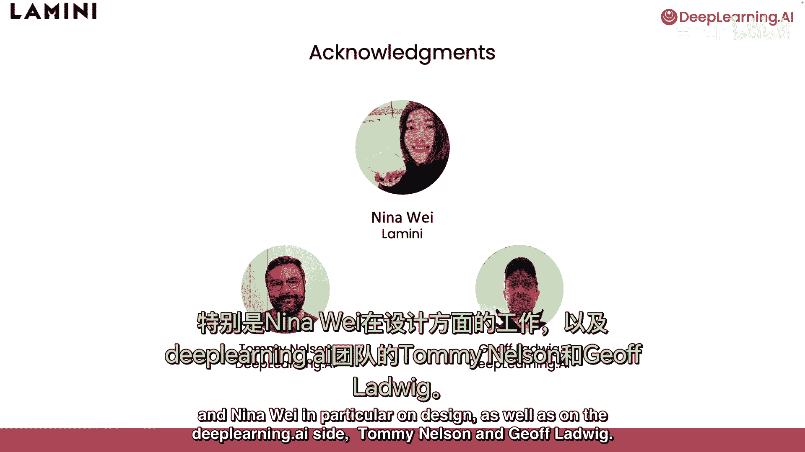

# (超爽中英!) 2024吴恩达最好的【大模型微调】教程！附课件代码 DeepLearning.AI - P1：1-介绍 - 吴恩达大模型 - BV1mT421a78i

欢迎微调，周莎伦教授的大型语言模型，很高兴来到这里，当我和不同的团体一起参观时，我经常听到人们问，如何在自己的数据或任务中使用这些大型语言模型。

而您可能已经知道如何提示大型语言模型。

本课程讨论了另一个重要的工具，专门对它们进行微调，如何服用，假设一个开源LM，并在您自己的数据上进一步训练它，在写提示符时，可以很好地让LM按照指示执行任务，比如提取关键词或将文本分为积极或消极的情绪。

如果你微调，然后你可以让lm更加始终如一地做你想做的事情，我发现它促使NLM以某种风格说话，比如更乐于助人或更有礼貌，还是简洁与冗长，在一定程度上，这也可能具有挑战性，微调。

原来也是一个很好的方法来调整一个lm的语气，人们现在意识到聊天的惊人功能，GBT和其他流行的LLMS回答关于广泛主题的问题，但是个人和公司希望拥有与他们自己相同的界面，私人和专有数据。

其中一个方法是用你的数据训练一个LLM，当然，训练一个基础LM需要大量的数据，可能是数千亿甚至超过万亿字的数据，和海量的GPU计算资源。

但通过微调，您可以利用现有的lm并根据自己的数据进一步训练它。

所以在本课程中，你将学习什么是微调，当它可能对您的应用程序有帮助时，微调如何适应训练，它与即时工程或检索有何不同，单独增强型，以及这些技术如何与微调一起使用，你将深入到一个特定的微调变体。

GPT三进入聊天，GBT称为指令微调，它教导一个LLM遵循指示，最后，你将经历微调你自己的LLM的步骤，准备数据，训练模型，并在代码中评估这一切。

本课程是为熟悉Python的人设计的，但是要理解所有的代码，有助于进一步掌握深度学习的基础知识，比如训练的过程是什么，神经网络就像。

说什么呢，列车测试分裂，这门课做了很多艰苦的工作，我们要感谢拉米尼团队和魏妮娜，尤其是在设计方面，以及深度学习，艾方，汤米·尼尔森和杰夫·洛德维大约一个小时后。

通过这个短暂的课程，你对如何建立自己的LM有了更深的理解，通过微调和现有的LM对您自己的数据。