# (超爽中英!) 2024吴恩达最好的【构建高级RAG应用】可商用落地教程！附全套代码_LLM_Langchain_Llama - P3：3. 第二篇 - RAG 指标三元组(RAG Triad of metrics) 中英文字幕 - 吴恩达大模型 - BV1hMameREN3

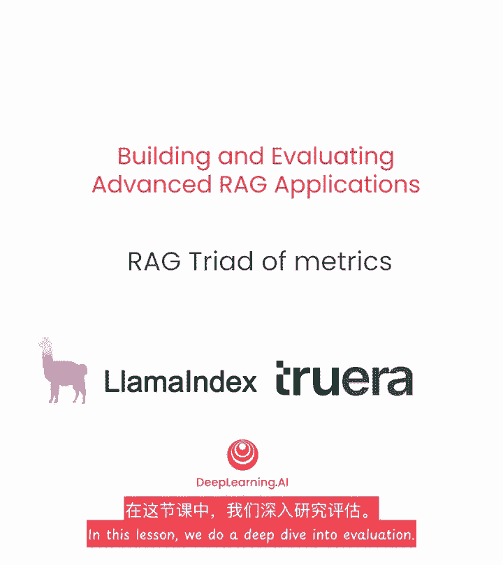

在本课中，我们将深入探讨，在本课中，我们将深入探讨，评估，我们将带您了解一些，评估，我们将带您了解一些，关于如何评估 rag 系统的核心概念，关于如何评估 rag 系统的核心概念，具体来说，我们将介绍。

具体来说，我们将介绍，rag Triad，这是，rag Triad，这是，R 执行上下文的三个主要步骤的指标三元组。相关性 这些是，相关性 这些是，反馈功能的可扩展框架的示例 对。

llm 应用程序的编程评估 然后我们将向您展示如何在给，定任何非结构化语料库的情况下综合生成评估数据集，定任何非结构化语料库的情况下综合生成评估数据集，让我们，让我们，现在开始 我将使用笔记本来引导。

现在开始 我将使用笔记本来引导，您完成 rag Triad 答案，您完成 rag Triad 答案，相关性、上下文相关性和，相关性、上下文相关性和。

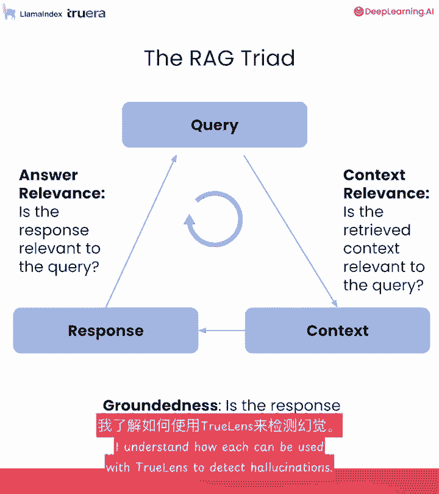

基础性，以了解如何将每个内容，基础性，以了解如何将每个内容，与真实镜头一起使用来检测，与真实镜头一起使用来检测，幻觉，此时您，幻觉，此时您，已经安装了真实镜头 val 和。

已经安装了真实镜头 val 和。

llama 索引文本，所以我不会向您展示，llama 索引文本，所以我不会向您展示，该步骤，您的第一步将是，该步骤，您的第一步将是，设置开放式 AI API，设置开放式 AI API。

密钥 开放式 AI 密钥用于，密钥 开放式 AI 密钥用于，完成抹布步骤并，完成抹布步骤并，使用真实镜头进行评估，使用真实镜头进行评估，因此这里有一个代码片段可以实现，因此这里有一个代码片段可以实现。

这一点，现在您已经完成了，这一点，现在您已经完成了，开放式密钥的设置，开放式密钥的设置，下一节我将快速回顾一下，使用 llama 索引构建查询引擎 Jerry 已经在第一，课中详细介绍了这一点。

我们将在，课中详细介绍了这一点，我们将在，很大程度上以该课为基础，很大程度上以该课为基础，对象，对象，我们是 将导入 true，我们是 将导入 true，类，然后我们将设置一个 true 对象，类。

然后我们将设置一个 true 对象，然后该对象将用于，然后该对象将用于，重置，重置，数据库，该数据库稍后将用于，数据库，该数据库稍后将用于，记录，记录，Llama Index，Llama Index。

应用程序的提示响应中间结果 以及，应用程序的提示响应中间结果 以及，我们将，我们将，使用 true，使用 true，阅读器，以便，阅读器，以便，上帝的这段代码从 Andrew 编写的。

上帝的这段代码从 Andrew 编写的，关于如何在 AI 领域建立职业生涯的目录中读取此 PDF 文档，关于如何在 AI 领域建立职业生涯的目录中读取此 PDF 文档，然后将此，然后将此。

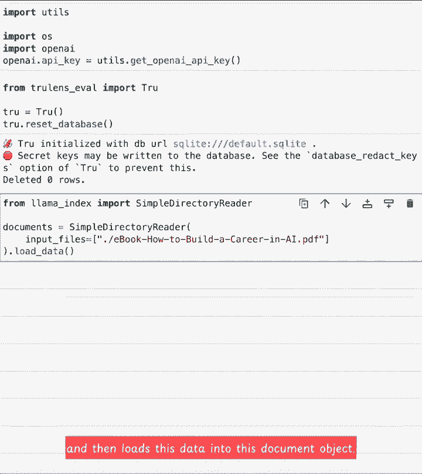

数据加载到此文档对象中下一步，数据加载到此文档对象中下一步，是将，是将，所有这些内容合并到一个，所有这些内容合并到一个，大文档中，而不是，大文档中，而不是，每页一个文档（这是默认。

每页一个文档（这是默认。

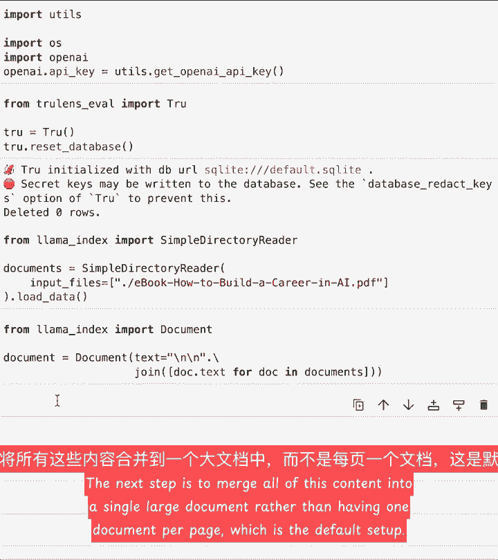

设置）接下来我们，设置）接下来我们。

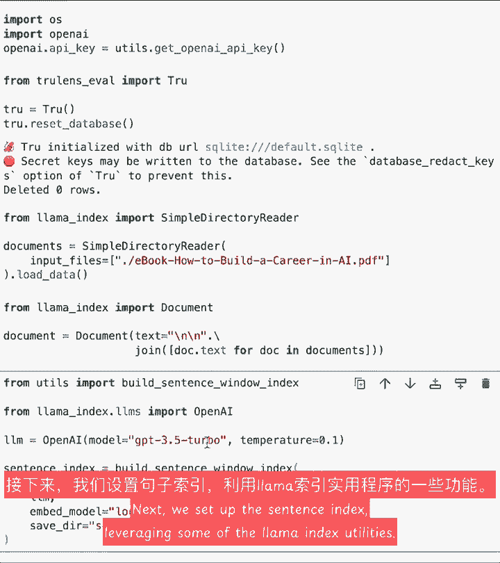

利用一些 Llama 索引，利用一些 Llama 索引，实用程序设置句子索引，以便 您可以在这里看到，我们，实用程序设置句子索引，以便 您可以在这里看到，我们，使用，温度为，温度为，0。

1 的开放 AI GPD 3。5 涡轮作为将用于，0。1 的开放 AI GPD 3。5 涡轮作为将用于。

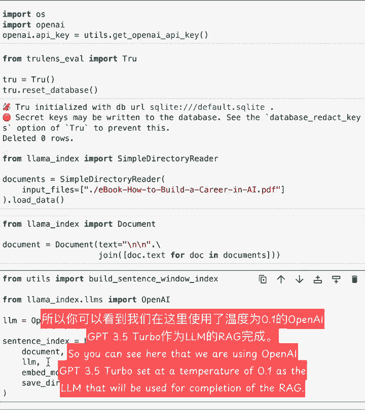

完成，完成，rag 的 llm，嵌入模型设置为 BGE，rag 的 llm，嵌入模型设置为 BGE，小，版本，小，版本，1。5，所有这些内容都被，1。5，所有这些内容都被。

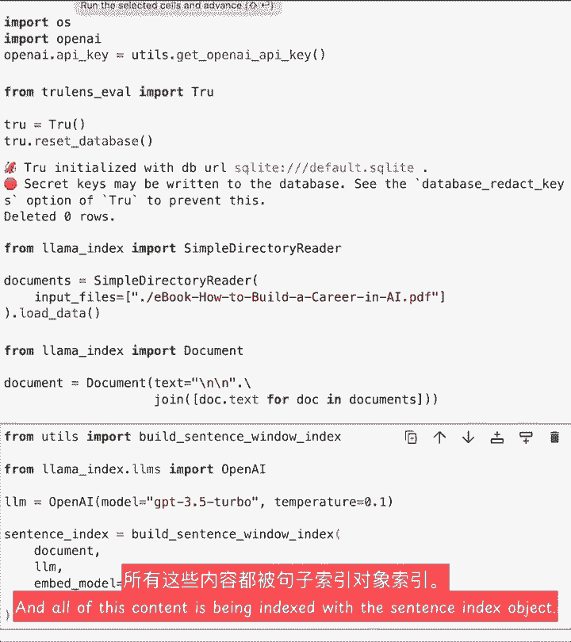

索引 接下来，通过句子索引，索引 接下来，通过句子索引，对象，对象，我们设置了句子窗口，我们设置了句子窗口，引擎，这是，引擎，这是，稍后将用于，稍后将用于，从该高级 rag，从该高级 rag。

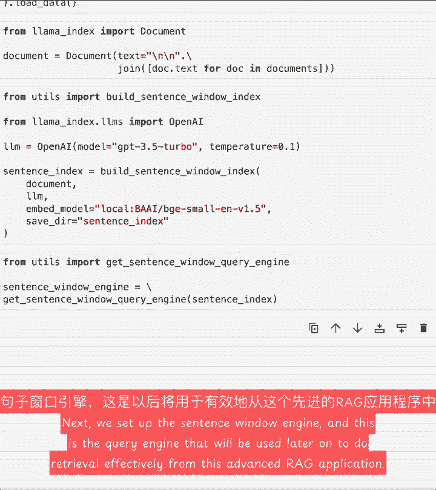

应用程序进行有效检索的查询引擎，现在我们已经，应用程序进行有效检索的查询引擎，现在我们已经，为基于句子窗口的 rag 设置了查询引擎，为基于句子窗口的 rag 设置了查询引擎，让我们看看 通过实际。

让我们看看 通过实际。

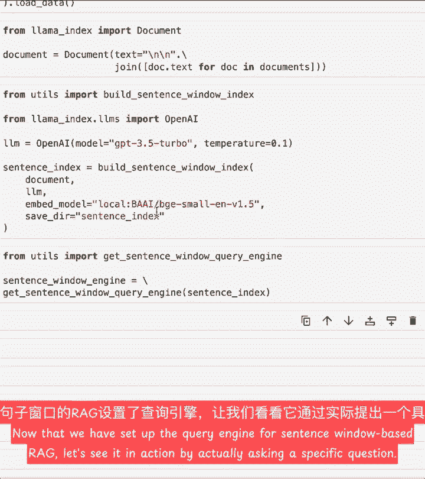

询问一个具体问题来实际操作如何，询问一个具体问题来实际操作如何，创建 AI 投资组合这将，创建 AI 投资组合这将，返回一个完整的对象，其中包含，返回一个完整的对象，其中包含，来自，来自。

llm 的最终响应、检索到的上下文的中间片段，llm 的最终响应、检索到的上下文的中间片段。

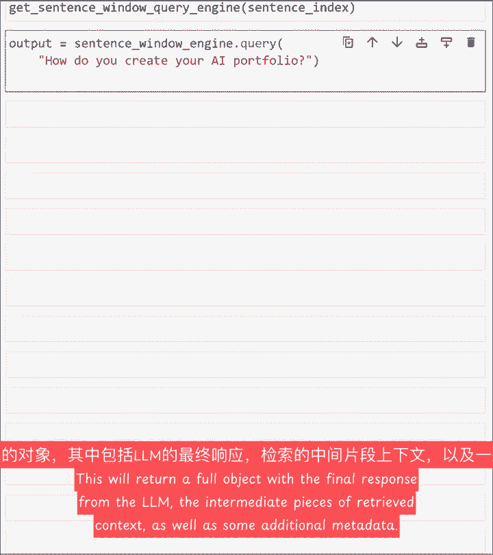

以及一些其他，以及一些其他，元数据让我们看看，元数据让我们看看。

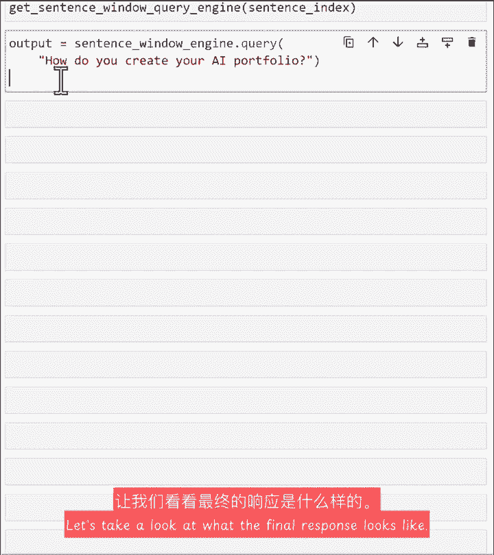

像这样，在这里你可以看到，像这样，在这里你可以看到，从这句话，从这句话，基于窗口的抹布中得出的最终响应，它，基于窗口的抹布中得出的最终响应，它，在，在，表面上为“如何，表面上为“如何。

创建人工智能投资组合”这个问题提供了一个很好的答案，稍后我们，创建人工智能投资组合”这个问题提供了一个很好的答案，稍后我们，将看到如何评估这个答案，现在我们有，现在我们有，一个对此，一个对此。

问题的回答示例，表面上看起来相当不错，问题的回答示例，表面上看起来相当不错，我们将看到如何利用，我们将看到如何利用，反馈功能，例如 现在我们已经设置了基于句子窗口的拖动应用程序。

现在我们可以使用 rag，反馈功能，例如 现在我们已经设置了基于句子窗口的拖动应用程序，现在我们可以使用 rag，Triad 来更深入地评估这种响应，Triad 来更深入地评估这种响应，识别故障模式。

识别故障模式。

并建立信心或迭代以，并建立信心或迭代以，改进 llm，改进 llm，应用程序，让我们看看如何使用，让我们看看如何使用，rag，rag。

Triad 来评估它 首先，我们将做一些，Triad 来评估它 首先，我们将做一些，内务处理，第一步，内务处理，第一步，是这段代码片段，它让我们，是这段代码片段，它让我们。

从笔记本内部启动一个流盖仪表板，从笔记本内部启动一个流盖仪表板，稍后您将看到，稍后您将看到，我们将使用该仪表板来，我们将使用该仪表板来，查看结果 评估并，查看结果 评估并，运行实验来查看不同的。

运行实验来查看不同的，应用程序选择，看看哪个应用程序，应用程序选择，看看哪个应用程序，做得更好，我们初始化 iiz 打开 AI GPD，做得更好，我们初始化 iiz 打开 AI GPD，3。

5 Turbo 作为我们评估的默认提供程序，3。5 Turbo 作为我们评估的默认提供程序，该提供程序将，该提供程序将，用于实现不同的反馈，用于实现不同的反馈，功能或，功能或，诸如上下文相关性、。

诸如上下文相关性、，答案相关性和，答案相关性和，基础性之类的评估现在让我们更深入地了解，基础性之类的评估现在让我们更深入地了解，抹布三合会的每个评估，抹布三合会的每个评估，我们将在，我们将在。

幻灯片和笔记本之间来回切换，以便首先为，幻灯片和笔记本之间来回切换，以便首先为。

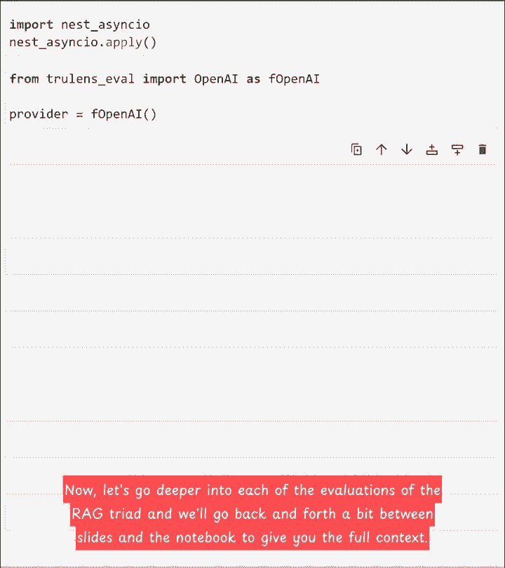

您提供完整的，您提供完整的。

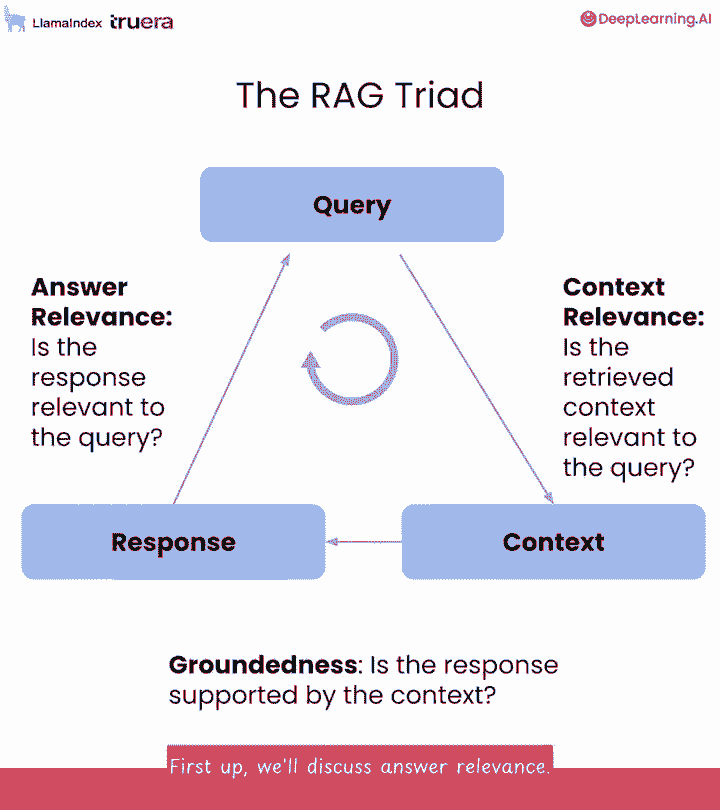

上下文，我们将讨论答案，上下文，我们将讨论答案，相关性回想一下，答案相关性，相关性回想一下，答案相关性，是检查最终响应是否与。

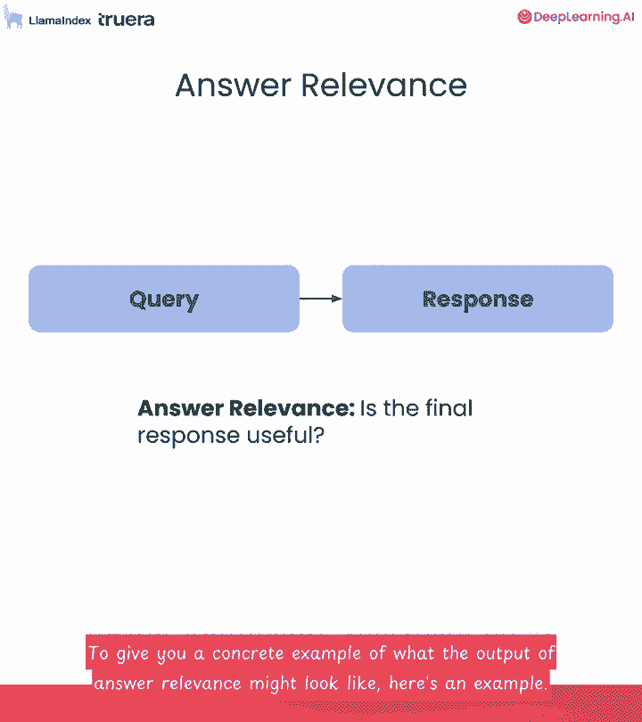

用户提出的查询相关，为您提供一个具体示例，说明，用户提出的查询相关，为您提供一个具体示例，说明，答案相关性的输出，答案相关性的输出，可能是什么样子，这，可能是什么样子，这，是，是，用户提出的问题“。

用户提出的问题“，如何利他主义”的示例 这对于建立，如何利他主义”的示例 这对于建立，职业生涯是有益的，这是，职业生涯是有益的，这是，从 rag，从 rag，应用程序中得出的响应，答案相关性。

应用程序中得出的响应，答案相关性，评估会产生两个输出，评估会产生两个输出，一个是 0 到 1 范围内的分数，一个是 0 到 1 范围内的分数，答案被评估为高度，答案被评估为高度，相关。

因此获得了分数 0。9 的想法，相关，因此获得了分数 0。9 的想法，第二部分是支持，第二部分是支持，证据或基本原理或，评估产生此分数背后的思想链推理，评估产生此分数背后的思想链推理。

因此在这里您可以看到，因此在这里您可以看到，在答案本身中找到的支持证据，这向，在答案本身中找到的支持证据，这向，llm 评估表明这，llm 评估表明这，是一个有意义的 和相关答案我。

是一个有意义的 和相关答案我，还想利用这个机会，还想利用这个机会，介绍反馈函数的抽象答案，介绍反馈函数的抽象答案，相关性是，相关性是，反馈函数的具体示例，更，反馈函数的具体示例，更，一般地说，反馈函数。

一般地说，反馈函数，在，在。

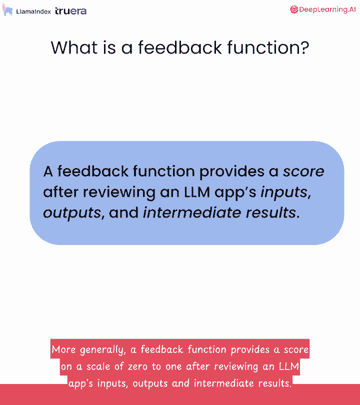

审查 llm 应用程序输入输出后提供 0 到 1 的分数 和，审查 llm 应用程序输入输出后提供 0 到 1 的分数 和，中间，中间，结果现在让我们，结果现在让我们，使用答案，使用答案。

相关性反馈函数作为，相关性反馈函数作为，具体，具体，示例来查看反馈函数的结构，第一个组件是，示例来查看反馈函数的结构，第一个组件是，提供者，在本例中我们可以看到，提供者，在本例中我们可以看到。

我们正在使用来自开放 AI 的 llm 来，我们正在使用来自开放 AI 的 llm 来，实现这些反馈，实现这些反馈，函数 请注意，反馈功能，函数 请注意，反馈功能，不一定要，不一定要。

使用 llms 来实现，我们还可以使用 Bert 模型，使用 llms 来实现，我们还可以使用 Bert 模型，和其他类型的机制来，和其他类型的机制来，实现反馈功能，我将，实现反馈功能，我将。

在本课后面更详细地讨论这一点。在本课后面更详细地讨论这一点。该提供者我们将，该提供者我们将，实现一个反馈功能，在这种，实现一个反馈功能，在这种，情况下，这就是相关性反馈，情况下，这就是相关性反馈，功能。

我们给它一个名称，一个人类，功能，我们给它一个名称，一个人类，可读的名称，稍后将显示在，可读的名称，稍后将显示在，我们的评估仪表板中，对于这个，我们的评估仪表板中，对于这个，特定的反馈功能，我们。

特定的反馈功能，我们，在用户输入上运行它 用户查询，在用户输入上运行它 用户查询，它还将应用，它还将应用，程序的最终输出或响应作为输入，因此给定，程序的最终输出或响应作为输入，因此给定，用户问题和。

用户问题和，rag 的最终答案，此反馈功能将，rag 的最终答案，此反馈功能将，利用 llm，利用 llm，提供程序（例如 open AI GPD，提供程序（例如 open AI GPD，3。

5）来得出分数 了解，3。5）来得出分数 了解。

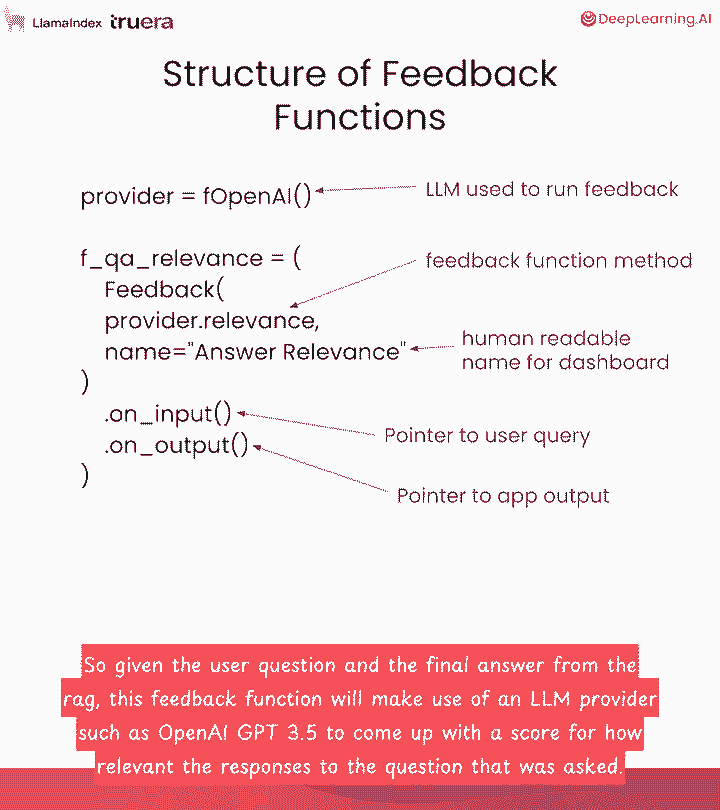

回答与，回答与，所提出问题的相关性，此外，它还将，所提出问题的相关性，此外，它还将，提供支持证据或，提供支持证据或，思想链推理来证明，思想链推理来证明，该分数的合理性，现在让我们，该分数的合理性。

现在让我们。

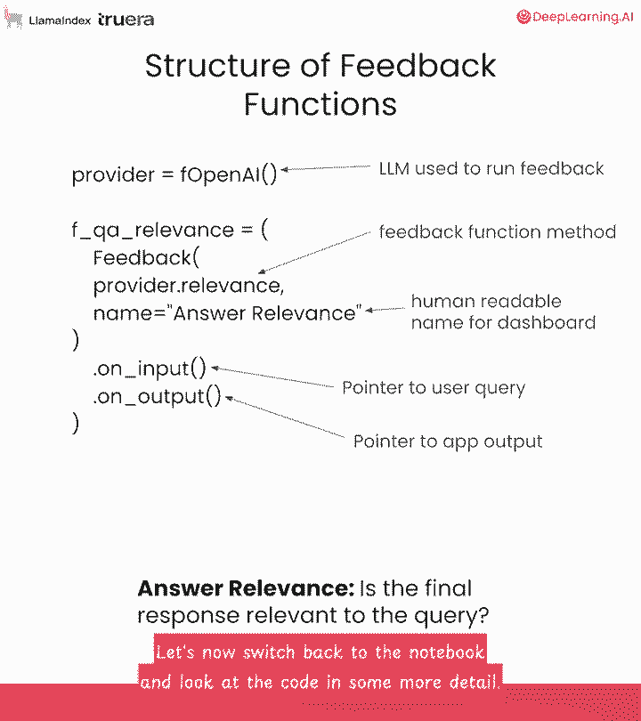

切换回笔记本并，切换回笔记本并，更，更，详细地查看代码 看看如何在真实lensel的代码中定义，详细地查看代码 看看如何在真实lensel的代码中定义，问题答案相关性反馈，问题答案相关性反馈，函数。

函数，我们将导入，我们将导入，反馈，反馈，类然后我们设置我们刚刚讨论的，类然后我们设置我们刚刚讨论的。

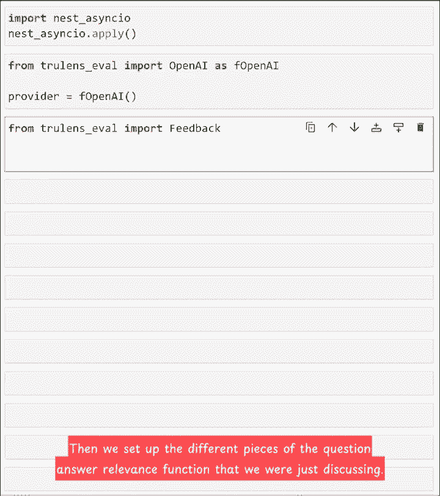

问题答案相关性函数的不同部分，我们有，我们有，开放AI GPD的提供者 3。5 我们设置了，开放AI GPD的提供者 3。5 我们设置了，这个，这个，特定的反馈函数，特定的反馈函数，相关性分数也将。

相关性分数也将，通过思想链推理得到增强，通过思想链推理得到增强，我们给这个反馈函数一个，我们给这个反馈函数一个，人类可以理解的名称，我们称之为，人类可以理解的名称，我们称之为，答案相关性，这将在。

答案相关性，这将在，稍后显示 在仪表板中，使，稍后显示 在仪表板中，使，用户可以轻松了解，用户可以轻松了解，反馈功能的设置，然后我们，反馈功能的设置，然后我们，还将让提要反馈，还将让提要反馈。

功能访问输入（即，功能访问输入（即。

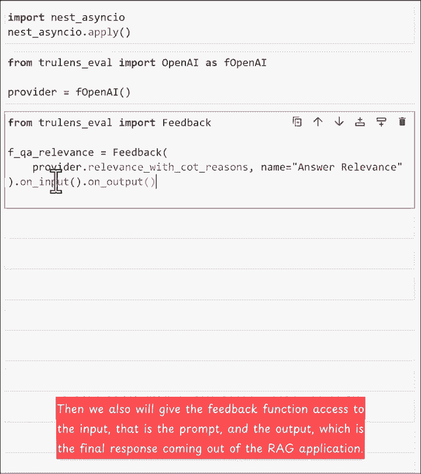

提示）和输出（即，提示）和输出（即，来自 rag，来自 rag，应用程序的最终响应） 稍后在笔记本中进行设置，应用程序的最终响应） 稍后在笔记本中进行设置，我们将看到如何，我们将看到如何。

在一组记录上应用此反馈功能，在一组记录上应用此反馈功能，获取相关答案的评估分数，获取相关答案的评估分数，以及，以及，为什么该，为什么该，特定答案的判断，特定答案的判断。

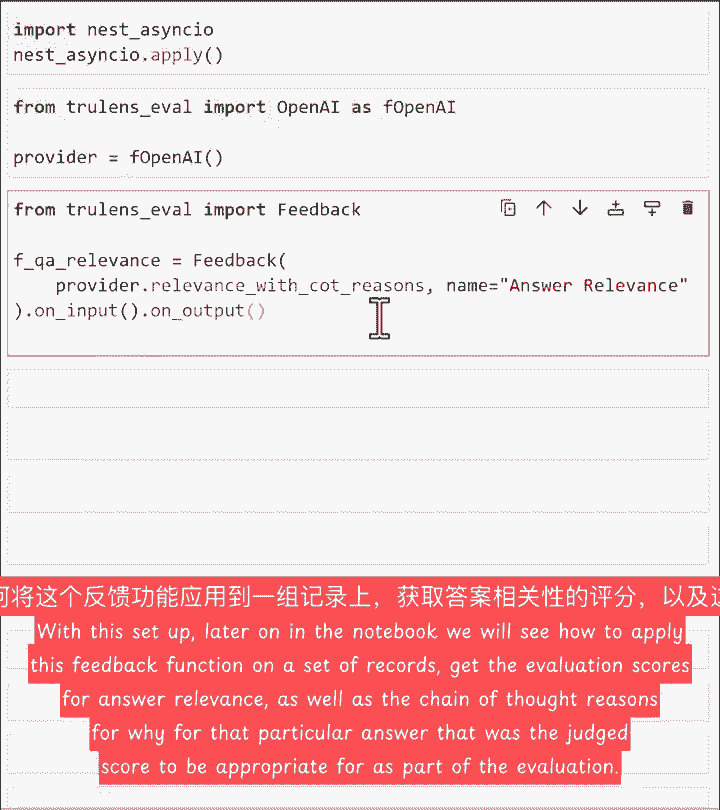

分数适合的思考链原因 作为，分数适合的思考链原因 作为，评估的一部分，我们将深入研究的下一个反馈功能，评估的一部分，我们将深入研究的下一个反馈功能，是上下文，是上下文，相关性回想一下，上下文相关性。

相关性回想一下，上下文相关性，正在检查给定，正在检查给定，查询的检索过程的好坏，我们将，查询的检索过程的好坏，我们将，查看从向量数据库中检索到的每条连续，查看从向量数据库中检索到的每条连续，文本，文本。

并，并，进行评估 该，进行评估 该。

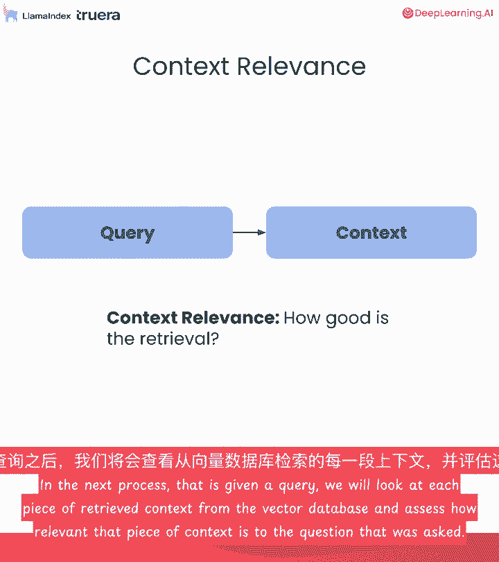

上下文与所，上下文与所，提出的问题的相关程度如何让我们看一个简单的，提出的问题的相关程度如何让我们看一个简单的，示例，这里的问题或，示例，这里的问题或，用户的提示是利他主义如何有。

用户的提示是利他主义如何有，利于建立，利于建立，职业生涯这是检索，职业生涯这是检索，上下文和评估后的两个部分 具有，上下文和评估后的两个部分 具有，上下文相关性，检索，上下文相关性，检索。

上下文的每个部分，上下文的每个部分，都会获得 0 到 1 之间的分数，您，都会获得 0 到 1 之间的分数，您，可以在此处看到左侧上下文的，可以在此处看到左侧上下文的，相关分数为 0。5，右侧上下文的。

相关分数为 0。5，右侧上下文的，相关分数为 0。7，因此，相关分数为 0。7，因此，评估为与该，评估为与该，特定内容更相关 查询，然后平均，特定内容更相关 查询，然后平均，上下文相关性得分是。

上下文相关性得分是，这些检索到的上下文中的每一个的相关得分的平均值，该得分也被报告，该得分也被报告，出来。现在让我们看看，出来。现在让我们看看，相关性的反馈函数的结构，该结构的各个部分。

相关性的反馈函数的结构，该结构的各个部分，类似于，类似于，我们几分钟前回顾过的答案高度结构，我们几分钟前回顾过的答案高度结构，有一个，有一个，开放，开放，Ai 的提供者，反馈功能是利用，Ai 的提供者。

反馈功能是利用，该提供者来实现，该提供者来实现，上下文相关性反馈，上下文相关性反馈，功能，差异在于，功能，差异在于，该特定反馈，该特定反馈，功能的输入以及 用户输入，功能的输入以及 用户输入，或提示。

我们还与此，或提示，我们还与此，反馈函数共享一个指向检索，反馈函数共享一个指向检索，上下文的指针，该检索上下文是，上下文的指针，该检索上下文是，执行 rag 应用程序的中间结果。

我们为每个检索到的上下文片段返回一个分数，我们为每个检索到的上下文片段返回一个分数，评估，评估，该上下文的相关性或良好程度，该上下文的相关性或良好程度，对于所提出的查询，对于所提出的查询，然后我们。

然后我们，在所有检索的上下文中聚合并平均这些分数，在所有检索的上下文中聚合并平均这些分数，以获得最终分数现在您，以获得最终分数现在您，会注意到，在答案相关性，会注意到，在答案相关性。

反馈功能中我们只使用了，反馈功能中我们只使用了，原始输入 以及，此反馈函数中抹布的最终响应，我们，此反馈函数中抹布的最终响应，我们，利用用户的输入或提示，利用用户的输入或提示，以及中间结果检索。

以及中间结果检索，上下文集来，上下文集来，评估，评估，这两个示例之间的检索质量，这两个示例之间的检索质量，反馈函数的全部功能，反馈函数的全部功能，通过使用 rag 应用程序的输入输出和。

通过使用 rag 应用程序的输入输出和，中间结果，中间结果。

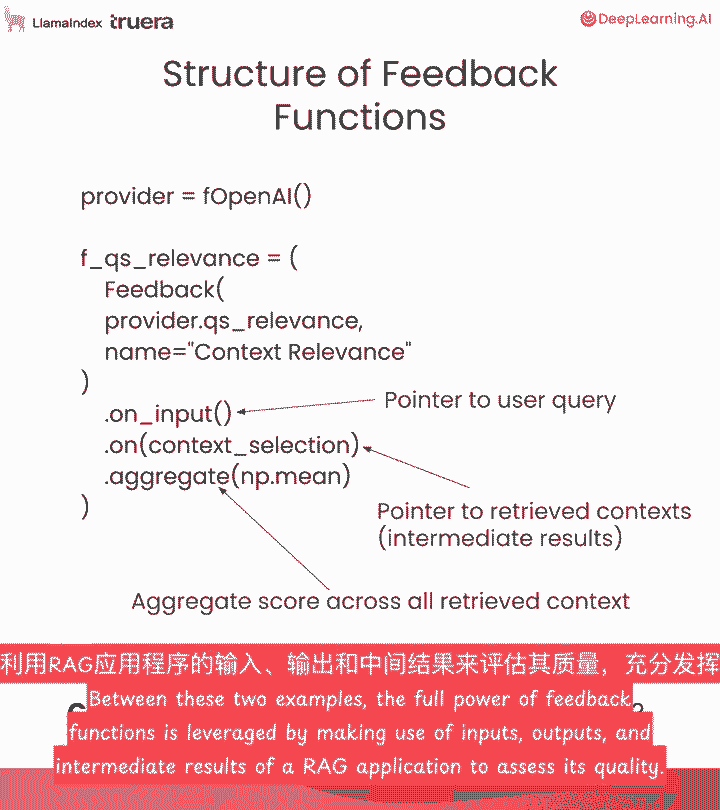

来评估其，来评估其，质量现在我们已经有了上下文，质量现在我们已经有了上下文，选择设置，我们可以。

在代码中定义上下文相关性反馈函数，您会发现它，在代码中定义上下文相关性反馈函数，您会发现它，几乎是 我，几乎是 我，在幻灯片上演练的代码段 我们仍然，在幻灯片上演练的代码段 我们仍然。

使用 openai 作为提供者 GPD 3。5 作为，使用 openai 作为提供者 GPD 3。5 作为，评估 llm 我们调用，评估 llm 我们调用，问题陈述或上下文相关，问题陈述或上下文相关。

反馈函数 它获取输入，反馈函数 它获取输入。

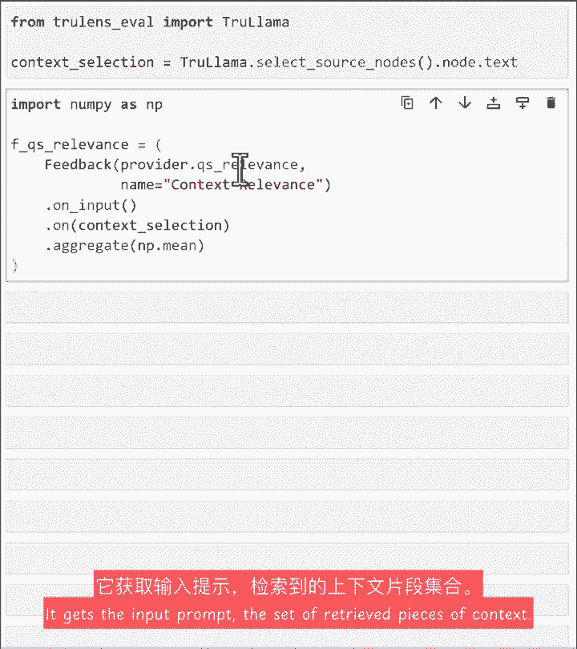

提示 检索上下文片段集，提示 检索上下文片段集，它运行评估，它运行评估，每个检索上下文片段的函数，每个检索上下文片段的函数，分别获取每个片段的分数，分别获取每个片段的分数。

然后对它们进行平均以报告最终的，然后对它们进行平均以报告最终的，连接分数。现在，连接分数。现在，如果您愿意，您还可以使用一个附加变体，如果您愿意，您还可以使用一个附加变体，除了报告，除了报告。

每个片段的上下文相关分数之外，每个片段的上下文相关分数之外，检索上下文的一部分，您还可以，检索上下文的一部分，您还可以，使用思想链推理来增强它，以便，使用思想链推理来增强它，以便。

评估 llm 不仅提供分数，还提供，其评估分数的理由或解释，并且，其评估分数的理由或解释，并且，可以通过思想链推理方法的 Qs 相关性来完成，并且如果 我给你一个具体，并且如果 我给你一个具体，的例子。

你可以看到，的例子，你可以看到，这里的问题或用户提示，这里的问题或用户提示。

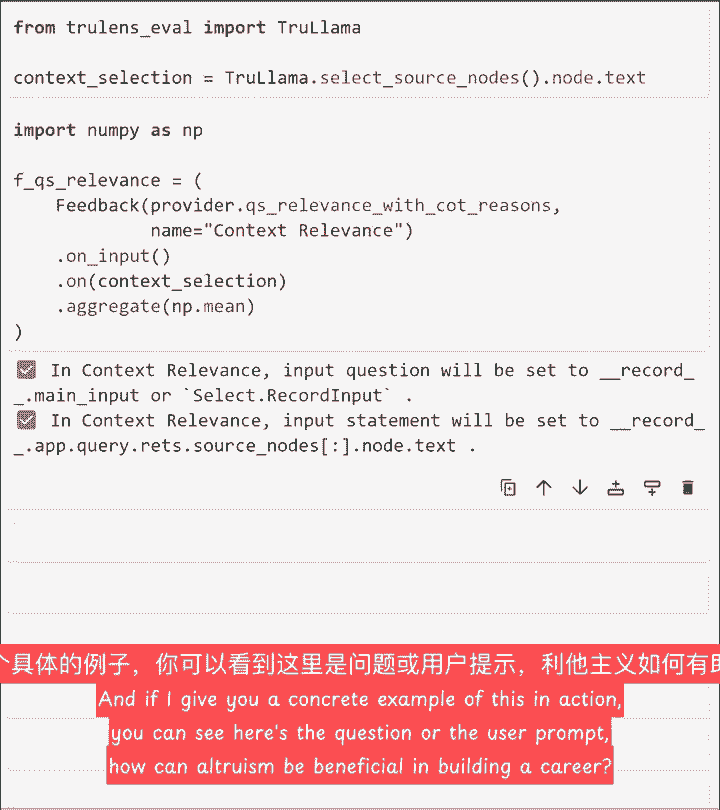

利他主义如何有利于，利他主义如何有利于，建立职业生涯，这是一个检索到的上下文的例子，它从，它从，安德鲁关于这个主题的文章中取出了一大块内容 您可以，安德鲁关于这个主题的文章中取出了一大块内容 您可以。

看到上下文相关性反馈，看到上下文相关性反馈，函数在，函数在，0 到 1 的范围内为这段检索到的，0 到 1 的范围内为这段检索到的，上下文给出 0。7 的分数，并且因为我们还在。

评估 llm 上调用了思想链推理，所以它，评估 llm 上调用了思想链推理，所以它，提供了，提供了，为什么分数是这样的理由。为什么分数是这样的理由。0。7 现在让我向您展示，0。7 现在让我向您展示。

用于设置接地反馈，用于设置接地反馈，功能的代码片段，我们以，功能的代码片段，我们以，与之前，与之前，利用 llm 提供程序进行评估的反馈功能大致相同的方式启动它。

利用 llm 提供程序进行评估的反馈功能大致相同的方式启动它。

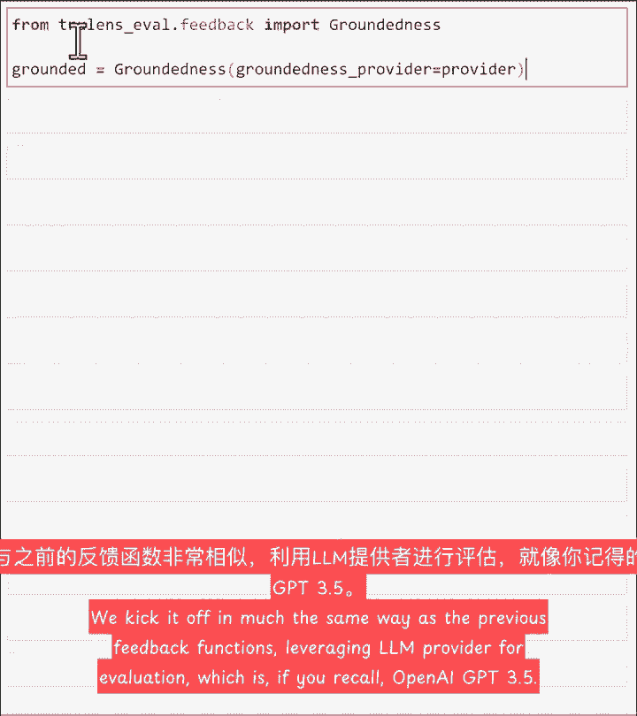

3。5，那么我们定义接地，3。5，那么我们定义接地，反馈 这个定义在，反馈 这个定义在，结构上与，结构上与。

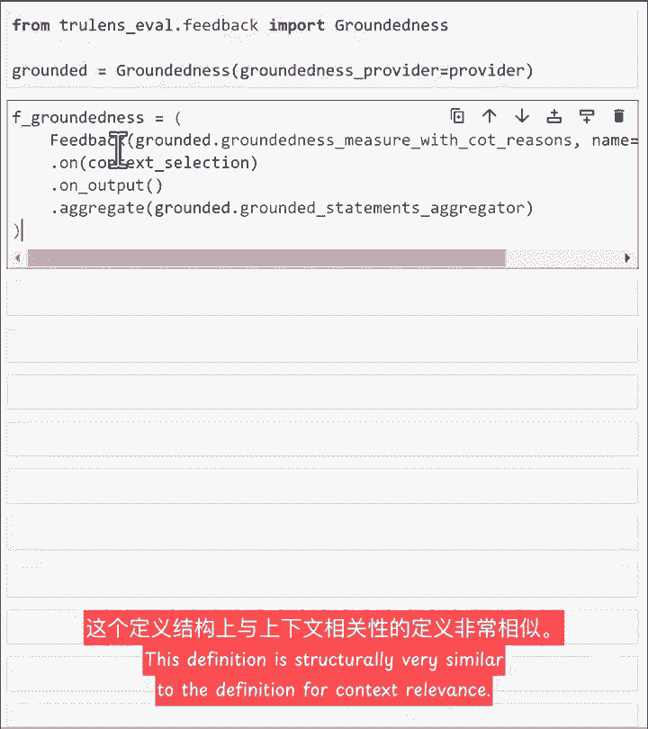

上下文相关性的定义非常相似，接地性，上下文相关性的定义非常相似，接地性。

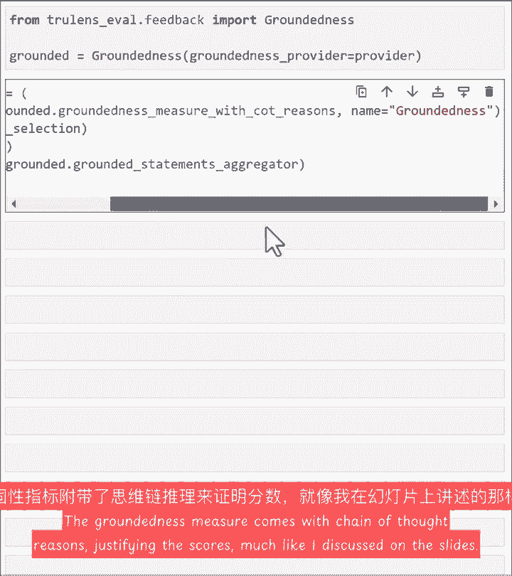

度量带有思想链，度量带有思想链，原因，证明分数的合理性，就像，原因，证明分数的合理性，就像，我在幻灯片上讨论的那样，我们给它，我在幻灯片上讨论的那样，我们给它，命名为“接地性”，它很容易。

命名为“接地性”，它很容易。

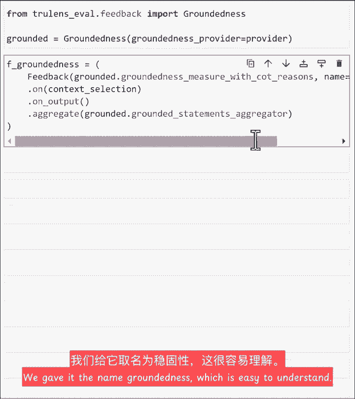

理解，并且可以访问，理解，并且可以访问，该集合，该集合，rag，rag，应用程序中检索到的上下文的数量非常类似于上下文，应用程序中检索到的上下文的数量非常类似于上下文，相关性以及 rag 的最终输出或。

相关性以及 rag 的最终输出或，响应，然后，响应，然后，最终响应中的每个句子都会获得一个，最终响应中的每个句子都会获得一个，接地分数，并将这些分数进行，接地分数，并将这些分数进行，汇总平均以产生。

汇总平均以产生，完整的最终接地分数，完整的最终接地分数，响应这里的上下文选择与，用于设置上下文，用于设置上下文。

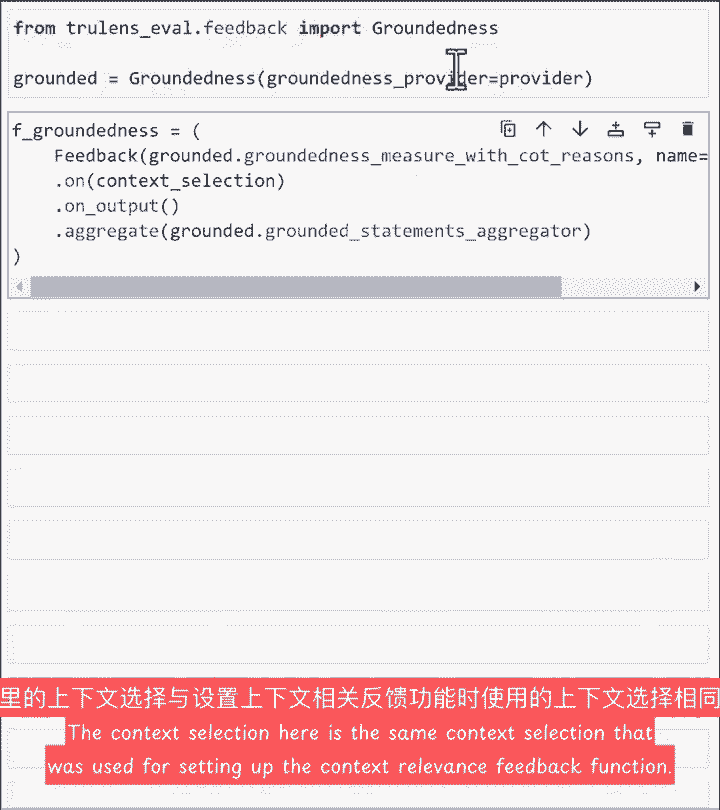

相关性反馈功能的上下文选择相同，因此如果您还，相关性反馈功能的上下文选择相同，因此如果您还，记得，只是，记得，只是，从，从，抹布的检索步骤中获取一组检索到的上下文片段。

抹布的检索步骤中获取一组检索到的上下文片段，然后可以访问其中的每个节点，然后可以访问其中的每个节点，列表，列表，从该节点恢复上下文的文本，并继续，从该节点恢复上下文的文本，并继续，使用它来进行上下文。

使用它来进行上下文，相关性以及基础性，相关性以及基础性。

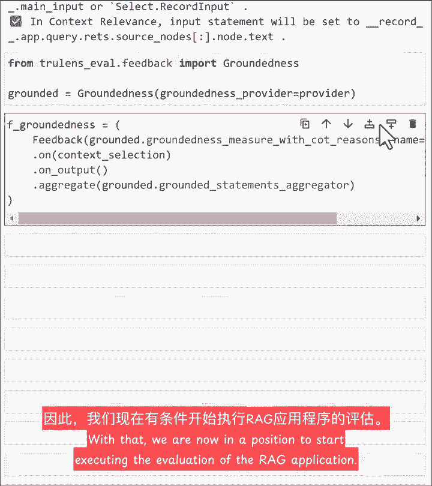

评估，我们，评估，我们。

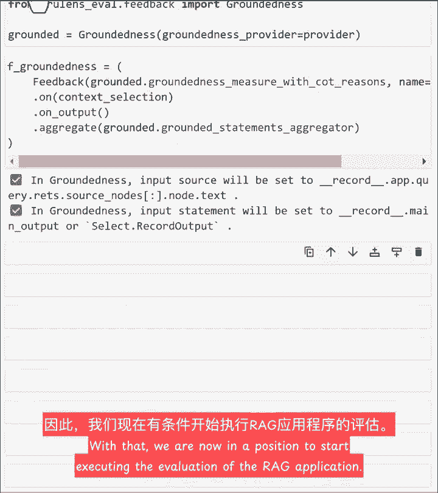

现在可以开始，现在可以开始，执行对我们已经设置了所有三个的，执行对我们已经设置了所有三个的，rag 应用程序的评估，rag 应用程序的评估，反馈，反馈，功能回答相关性、上下文，功能回答相关性、上下文。

相关性和基础性，我们，相关性和基础性，我们，需要的是一个评估集，我们，需要的是一个评估集，我们，可以在该评估集上运行应用程序和，可以在该评估集上运行应用程序和，评估，看看它们的表现如何，评估。

看看它们的表现如何，以及它们是否有机会进一步迭代和，以及它们是否有机会进一步迭代和，改进它们，改进它们，现在让我们看看，现在让我们看看。

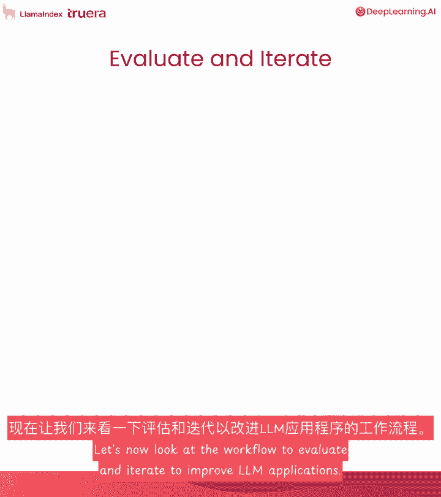

工作流程 为了评估和迭代以，工作流程 为了评估和迭代以，改进 llm 应用程序，我们将从上一课中介绍的，改进 llm 应用程序，我们将从上一课中介绍的，基本 llama 指数抹布开始。

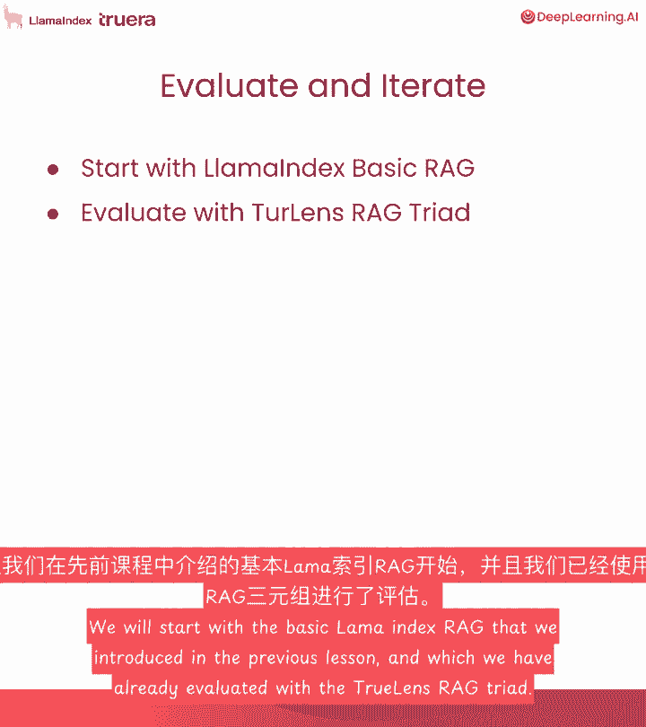

，我们已经，我们已经，使用真正的镜头抹布三合一对其进行了评估，使用真正的镜头抹布三合一对其进行了评估，我们将重点关注与，我们将重点关注与，上下文相关的故障模式，上下文相关的故障模式，然后我们将使用。

然后我们将使用，高级抹布技术迭代基本抹布，高级抹布技术迭代基本抹布，Llama 索引句子窗口抹布 接下来我们，Llama 索引句子窗口抹布 接下来我们，将使用。

真正的镜头抹布三合一重新评估这种新的高级抹布，重点关注，真正的镜头抹布三合一重新评估这种新的高级抹布，重点关注，这些类型的问题，我们是否在上下文相关性方面看到了，这些类型的问题。

我们是否在上下文相关性方面看到了。

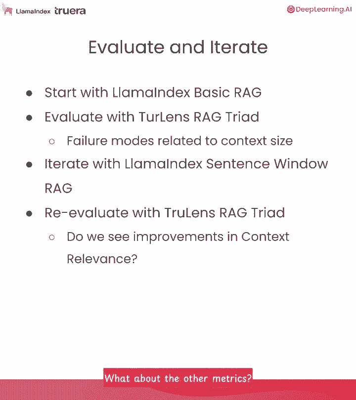

具体的改进 那么，具体的改进 那么，其他指标呢？其他指标呢？我们关注上下文相关性的原因，我们关注上下文相关性的原因，是，由于上下文太小，经常会出现失败模式。是，由于上下文太小，经常会出现失败模式。

一旦将，一旦将，上下文增加到某个，上下文增加到某个，点，您可能会看到，点，您可能会看到，上下文相关性的改进，此外，当，上下文相关性的改进，此外，当，上下文相关性经常上升时。

我们可能会看到上下文相关性的改善。 发现，上下文相关性经常上升时，我们可能会看到上下文相关性的改善。 发现，基础性方面的改进，基础性方面的改进，因为完成步骤中的 llm，因为完成步骤中的 llm。

有足够的相关上下文来生成，有足够的相关上下文来生成，摘要，当它没有足够的，摘要，当它没有足够的，相关上下文时，它倾向于利用，预训练数据集中的内部知识来，预训练数据集中的内部知识来。

尝试填补这些空白 这会，尝试填补这些空白 这会，导致失去，导致失去，基础性 最后，我们将尝试，基础性 最后，我们将尝试，不同的窗口大小，以，不同的窗口大小，以，找出哪种窗口大小会产生最佳。

找出哪种窗口大小会产生最佳，评估，评估，指标 回想一下，如果窗口，指标 回想一下，如果窗口，大小太小，则可能没有，大小太小，则可能没有，足够的相关，足够的相关，上下文来获得良好的分数 上下文。

上下文来获得良好的分数 上下文，相关性和基础性，如果窗口，相关性和基础性，如果窗口，大小变得太大，另一方面，大小变得太大，另一方面，不相关的上下文可能会渗透到，不相关的上下文可能会渗透到，最终响应中。

导致，最终响应中，导致。

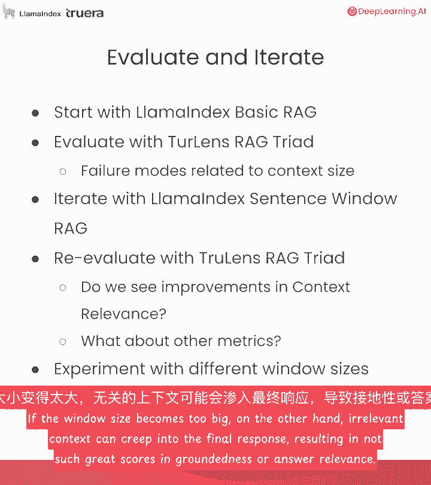

基础性或答案元素的分数不那么高，基础性或答案元素的分数不那么高，我们浏览了，我们浏览了，评估或反馈功能的三个示例上下文，评估或反馈功能的三个示例上下文，相关性答案，相关性答案，相关性和，相关性和。

我们笔记本中的基础性这三个都是，我们笔记本中的基础性这三个都是，通过llm，通过llm，评估来实现的，我确实想指出，评估来实现的，我确实想指出，反馈功能可以，反馈功能可以，通过不同的，通过不同的。

方式来实现，我们经常看到从业者，方式来实现，我们经常看到从业者，从基础事实评估开始，从基础事实评估开始，收集这些评估可能会很昂贵，但仍然是一个，收集这些评估可能会很昂贵，但仍然是一个，很好的，很好的。

起点，我们也 看到，起点，我们也 看到，人们利用人类来进行，人们利用人类来进行，评估，这也是有帮助和，评估，这也是有帮助和，有意义的，但在实践中很难扩展，有意义的，但在实践中很难扩展。

地面真实评估只是为了给，地面真实评估只是为了给，你一个具体的，你一个具体的，例子想想一个总结用，例子想想一个总结用，例，其中有一个大段落，例，其中有一个大段落，然后法学硕士会产生，然后法学硕士会产生。

一个人类专家会产生的总结 然后给，一个人类专家会产生的总结 然后给，该摘要一个分数，表明它有多好，该摘要一个分数，表明它有多好，这也可以用于其他类型，这也可以用于其他类型，的用例，例如聊天机器人之类的。

的用例，例如聊天机器人之类的，用例，甚至分类，用例，甚至分类，用，用，例。人类评估在某些，例。人类评估在某些，方面与 vals 的基本事实相似，因​​为，方面与 vals 的基本事实相似，因​​为。

llm 产生一个输出，或者 rag，llm 产生一个输出，或者 rag，应用程序产生一个输出，应用程序产生一个输出，该应用程序的人类用户将，该应用程序的人类用户将，为该输出提供一个评级，它有多。

为该输出提供一个评级，它有多，好，与真实水平的区别，好，与真实水平的区别，在于，这些人类用户，在于，这些人类用户，可能不是这方面的专家。可能不是这方面的专家。作为产生，作为产生，策划的基本事实。

策划的基本事实，评估的主题，它仍然是一个非常，评估的主题，它仍然是一个非常，有意义的评估，它的规模会，有意义的评估，它的规模会，比基本事实值更好一些，比基本事实值更好一些，但我们对其的置信度。

但我们对其的置信度，较低，较低，研究文献中的一个非常有趣的结果，研究文献中的一个非常有趣的结果，是： 如果你让一组，是： 如果你让一组，人对一个问题进行评分，大约有，人对一个问题进行评分，大约有。

80% 的人同意，有趣的，80% 的人同意，有趣的，是，当你使用 llm 进行，是，当你使用 llm 进行，评估时，llm，评估时，llm，评估和人类评估之间的一致性，评估和人类评估之间的一致性。

也约为 80% 到 85%，因此这，也约为 80% 到 85%，因此这，表明 llm 评估与应用它们的，基准数据集的人类评估相当相似，因此反馈函数为我们提供了，因此反馈函数为我们提供了。

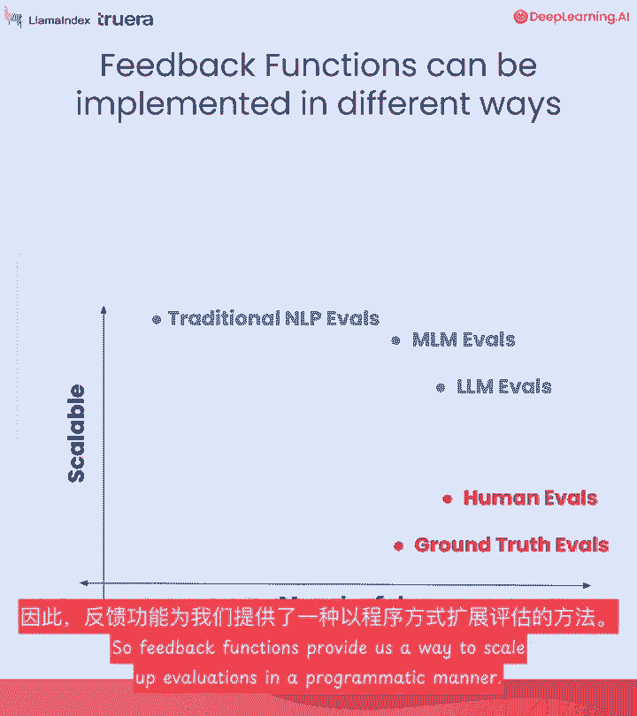

一种以编程方式扩展评估的方法，一种以编程方式扩展评估的方法，除了，除了，llm 评估之外，您已经，llm 评估之外，您已经，看到反馈函数也提供了可以，看到反馈函数也提供了可以。

be imp 可以实现传统的 NLP，be imp 可以实现传统的 NLP。

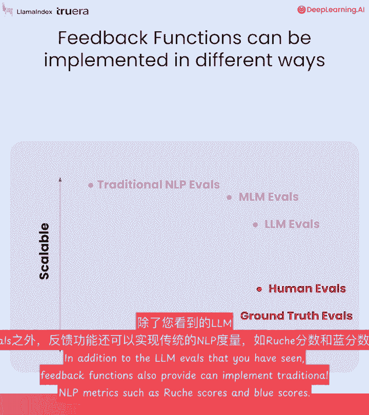

指标，例如 rou 分数和 blue，指标，例如 rou 分数和 blue，分数，它们在某些情况下可能会有所帮助，分数，它们在某些情况下可能会有所帮助，但它们的一个弱点，但它们的一个弱点。

是它们非常注重语法，是它们非常注重语法。

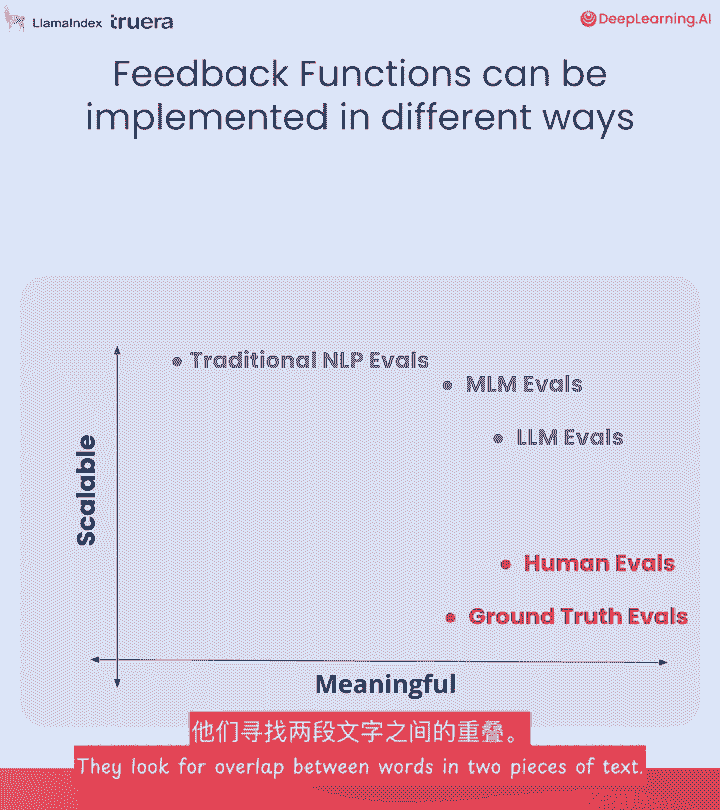

它们会寻找，它们会寻找，两段文本中的两个单词之间的重叠，两段文本中的两个单词之间的重叠，例如，如果 你有一段，例如，如果 你有一段，文本指的是河岸，文本指的是河岸，另一段文本指的是金融银行，从。

另一段文本指的是金融银行，从，语法上讲，它们可能被视为，语法上讲，它们可能被视为，相似，并且这些引用最终可能会被，传统的 NLP，传统的 NLP，评估视为相似的引用，而舍入上下文，评估视为相似的引用。

而舍入上下文，将习惯于，将习惯于，当您使用，当您使用，大型语言模型（例如 GPD，大型语言模型（例如 GPD，4）或中型语言模型（例如，4）或中型语言模型（例如。

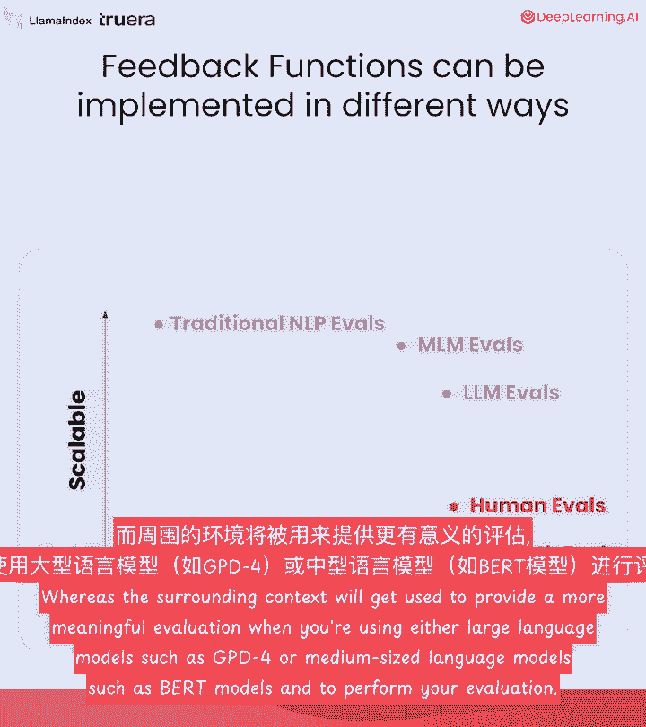

鸟类模型）时，提供更有意义的评估，并执行，鸟类模型）时，提供更有意义的评估，并执行，评估，同时在课程中我们为，评估，同时在课程中我们为，您提供了三个反馈，您提供了三个反馈，函数和，函数和。

评估答案相关性的示例 上下文，评估答案相关性的示例 上下文，相关性和接地性真实，相关性和接地性真实，长度提供了更广泛的，长度提供了更广泛的，评估集，以确保您，评估集，以确保您。

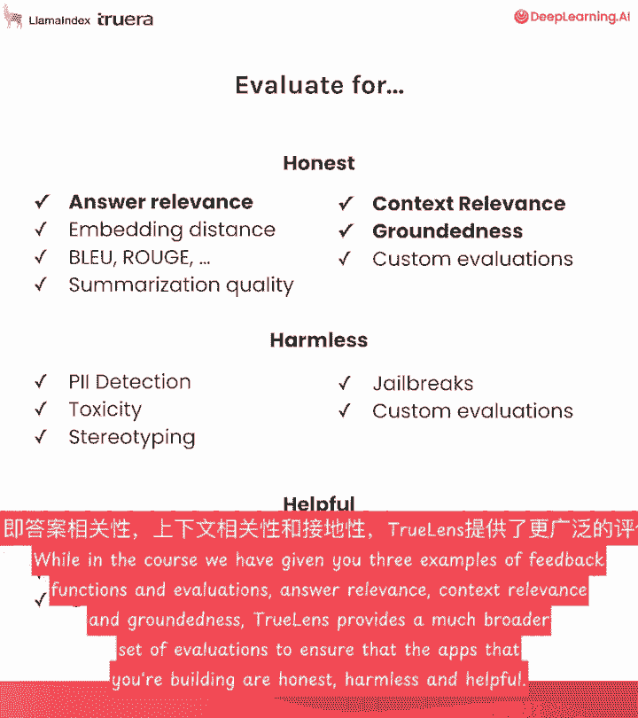

正在构建的应用程序是诚实无害，正在构建的应用程序是诚实无害，且有用的，这些都可以在，且有用的，这些都可以在，开源库中找到，我们，开源库中找到，我们，鼓励您在工作时使用它们，鼓励您在工作时使用它们。

通过课程并，通过课程并。

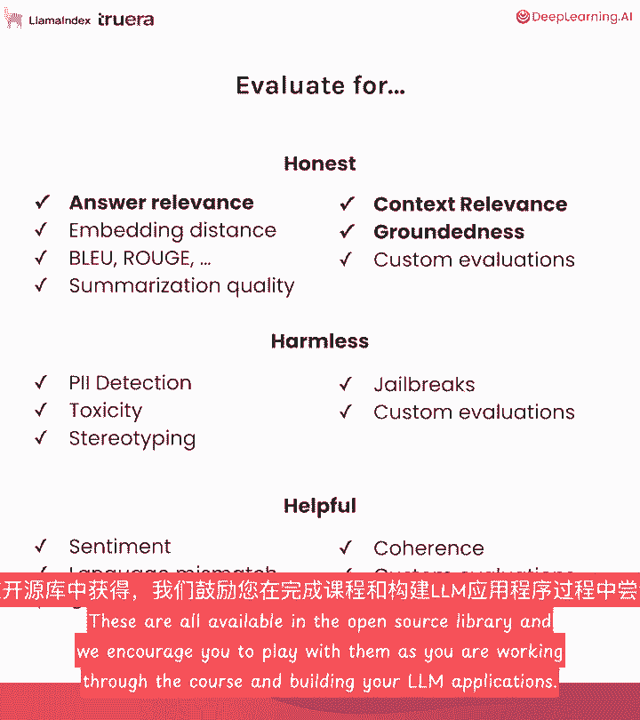

构建您的 llm，构建您的 llm，应用程序现在我们已经设置了所有，应用程序现在我们已经设置了所有，反馈功能，我们可以设置一个，反馈功能，我们可以设置一个。

对象来开始记录，该对象将，对象来开始记录，该对象将，用于记录，用于记录。

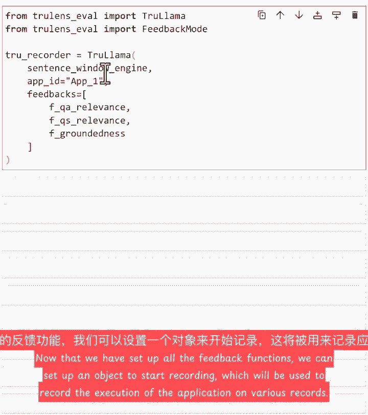

应用程序在各种，应用程序在各种，记录上的执行情况，因此您将在这里看到我们，记录上的执行情况，因此您将在这里看到我们，导入这个真正的 Lama 类，导入这个真正的 Lama 类。

通过这个真正的 Lama 类的记录器创建一个对象，通过这个真正的 Lama 类的记录器创建一个对象，这是我们将，这是我们将，真实镜头与 llama 索引的集成，它，真实镜头与 llama 索引的集成。

它，从，从，我们之前创建的 Lama 索引中获取句子窗口引擎，设置，我们之前创建的 Lama 索引中获取句子窗口引擎，设置，应用程序 ID 并利用这三个。

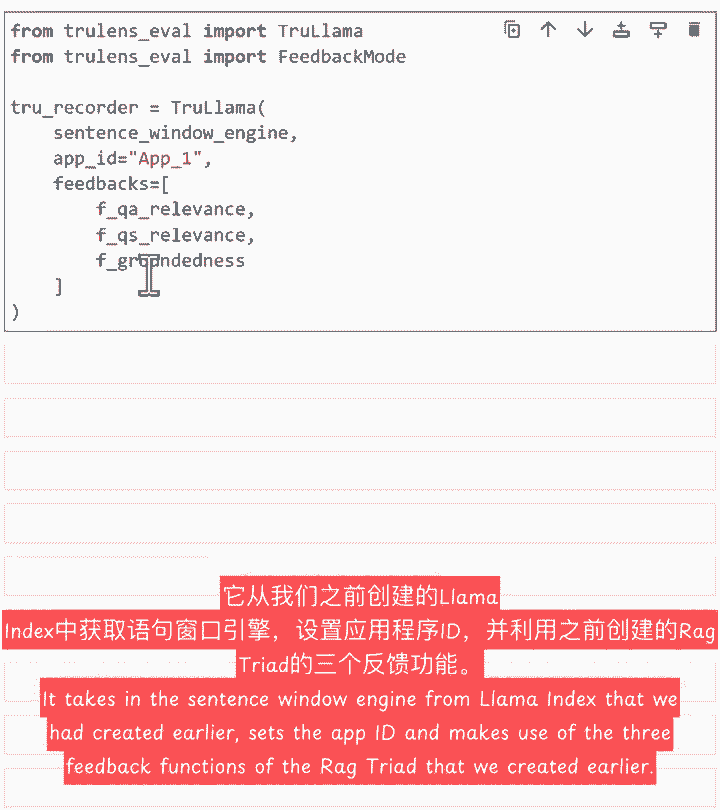

之前创建的 rag Triad 的反馈函数这个真正的记录器对象将，之前创建的 rag Triad 的反馈函数这个真正的记录器对象将，稍微用于，稍微用于，运行 Llama 索引，运行 Llama 索引。

应用程序以及，应用程序以及，这些反馈函数的评估，这些反馈函数的评估。

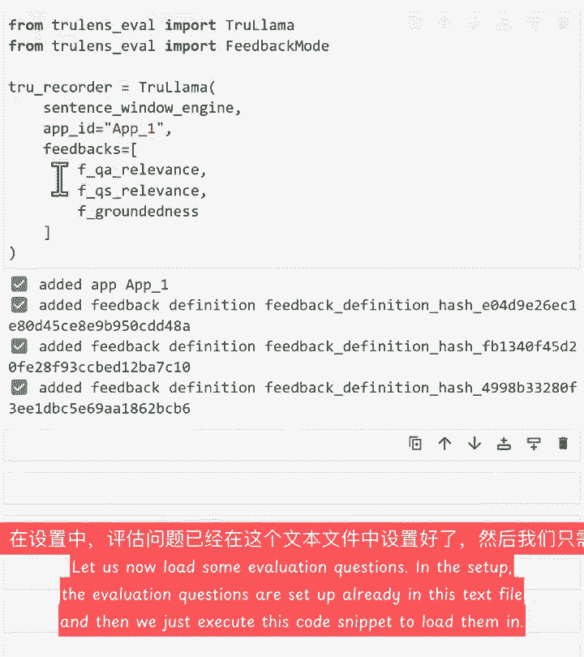

数据库中，现在让我们加载，数据库中，现在让我们加载，设置中的一些评估问题评估，设置中的一些评估问题评估，问题已在此文本文件中设置，问题已在此文本文件中设置，然后我们只需执行此，然后我们只需执行此。

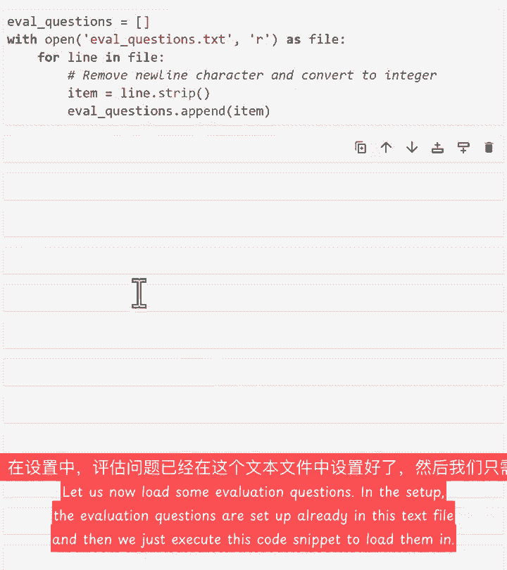

代码即可加载它们，代码即可加载它们。

让我们快速浏览一下，让我们快速浏览一下，评估的这些问题可以看到关键是什么，评估的这些问题可以看到关键是什么，在，在，人工智能等方面建立职业生涯，您可以自己编辑此文件，人工智能等方面建立职业生涯。

您可以自己编辑此文件，并添加您自己的问题，并添加您自己的问题，您可能希望从安德鲁那里获得答案，您可能希望从安德鲁那里获得答案，或者您也可以通过这种方式直接附加到，或者您也可以通过这种方式直接附加到。

EV 问题列表，现在让我们看一下，EV 问题列表，现在让我们看一下，Val 问题列表，Val 问题列表，您可以看到这个问题已，您可以看到这个问题已，添加到最后，继续添加，添加到最后，继续添加，您自己的。

您自己的，问题，现在我们已经完成了所有设置，可以，使用此代码来执行此笔记本中最令人兴奋的步骤，我们，使用此代码来执行此笔记本中最令人兴奋的步骤，我们，可以执行 我们刚刚查看的，可以执行 我们刚刚查看的。

评估问题列表中的每个问题的句子窗口引擎。

然后使用真实记录器，我们将，然后使用真实记录器，我们将，针对抹布三合会运行每条记录，我们，针对抹布三合会运行每条记录，我们，将在真实数据库中记录提示响应，将在真实数据库中记录提示响应，中间结果和评估。

中间结果和评估。

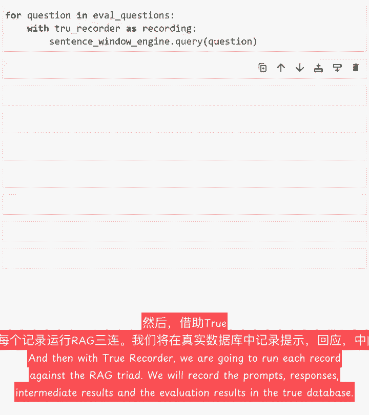

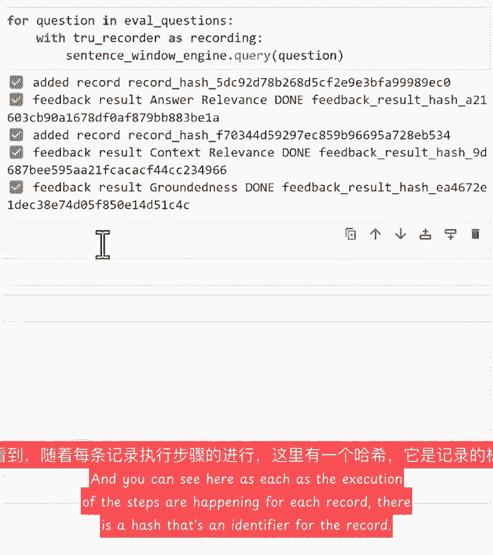

您可以在此处看到，当，每条，每条，记录执行步骤时，都会有一个哈希值，它是，添加记录时记录的标识符，我们这里有一个指示器，表明，除了反馈，除了反馈，结果或答案之外，该步骤已有效执行 相关性已完成。

结果或答案之外，该步骤已有效执行 相关性已完成，现在我们已经完成，现在我们已经完成，了记录，我们可以，了记录，我们可以，通过，通过，获取记录和，获取记录和。

反馈并执行此代码，反馈并执行此代码，片段来查看笔记本中的日志，我不希望您，片段来查看笔记本中的日志，我不希望您。

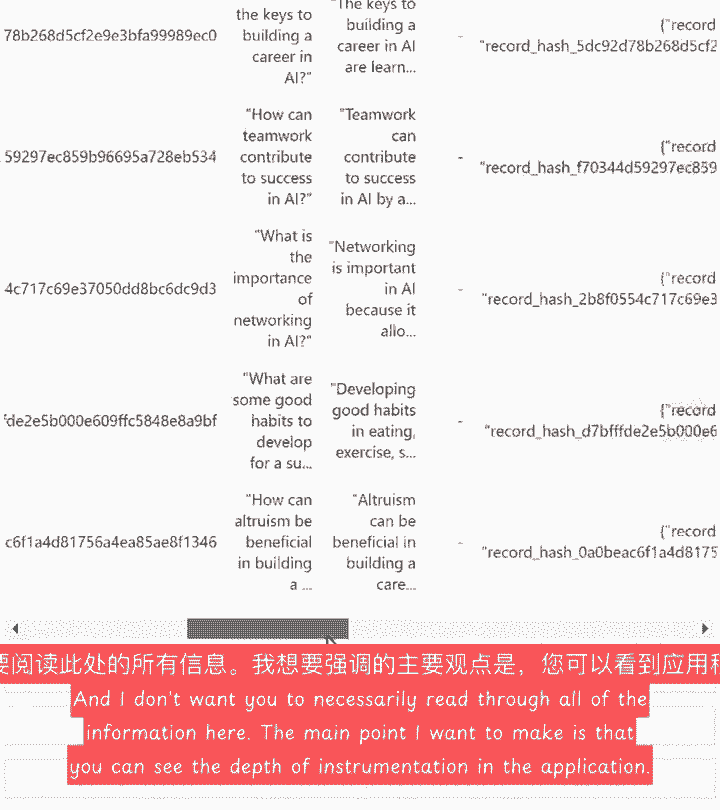

一定要阅读 通过，一定要阅读 通过。

这里的所有信息，我想说的要点，这里的所有信息，我想说的要点，是，您可以看到，是，您可以看到。

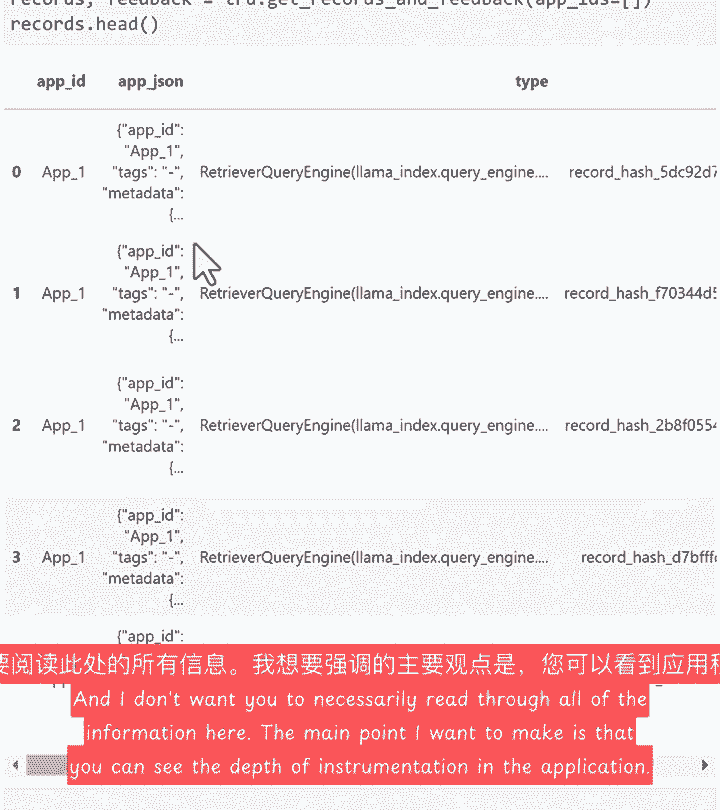

仪器和应用程序的深度，仪器和应用程序的深度。

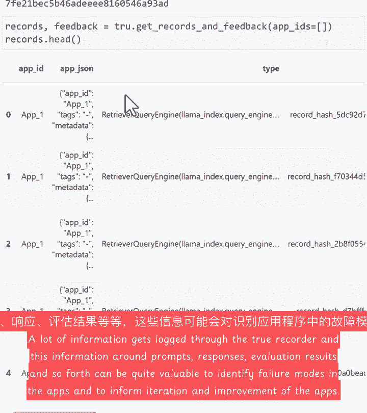

通过，通过，真实，真实，记录器记录大量信息，并且这些围绕，记录器记录大量信息，并且这些围绕。

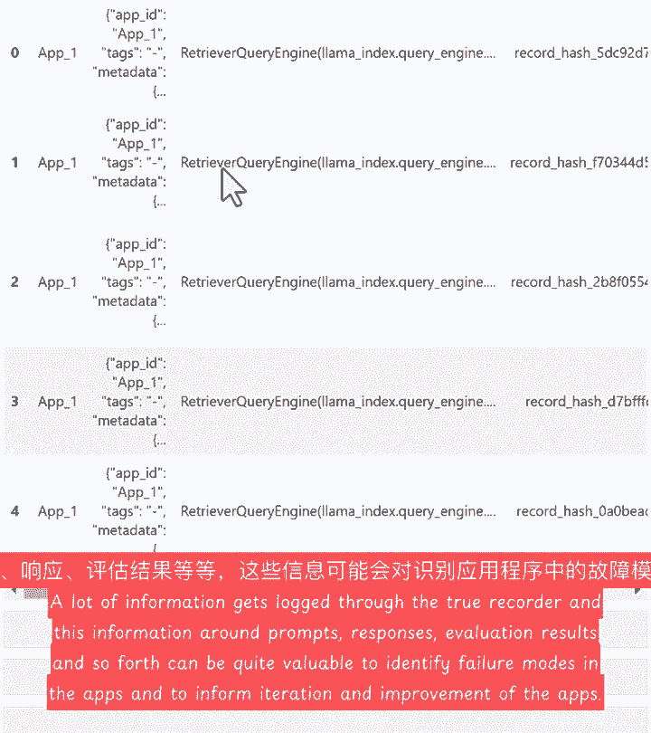

提示、响应、评估结果，提示、响应、评估结果，等的信息可能非常有价值 为了，等的信息可能非常有价值 为了，识别应用程序中的故障模式并，识别应用程序中的故障模式并。

通知应用程序的迭代和改进，通知应用程序的迭代和改进，所有这些信息都，所有这些信息都。

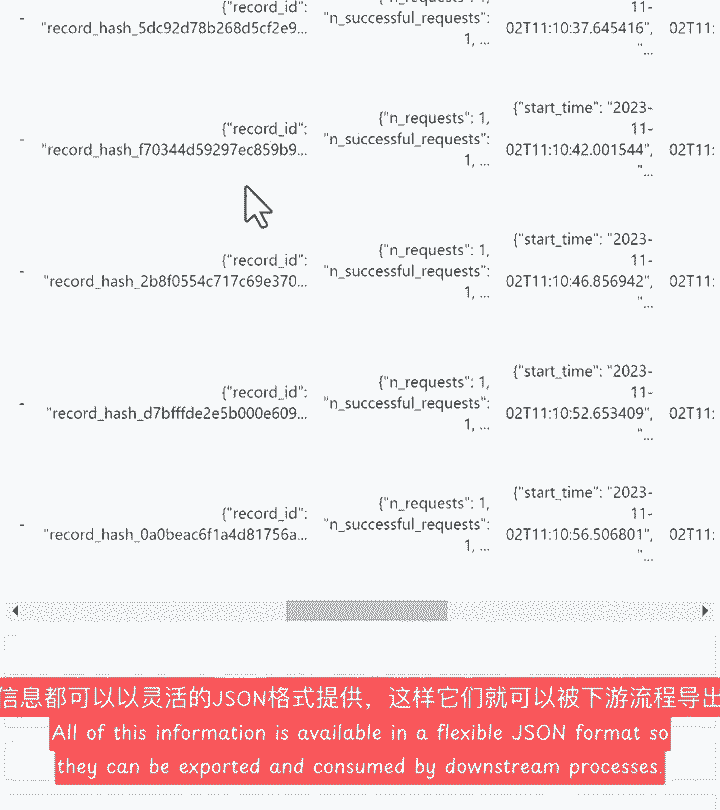

以灵活的 Json 格式提供，因此，以灵活的 Json 格式提供，因此。

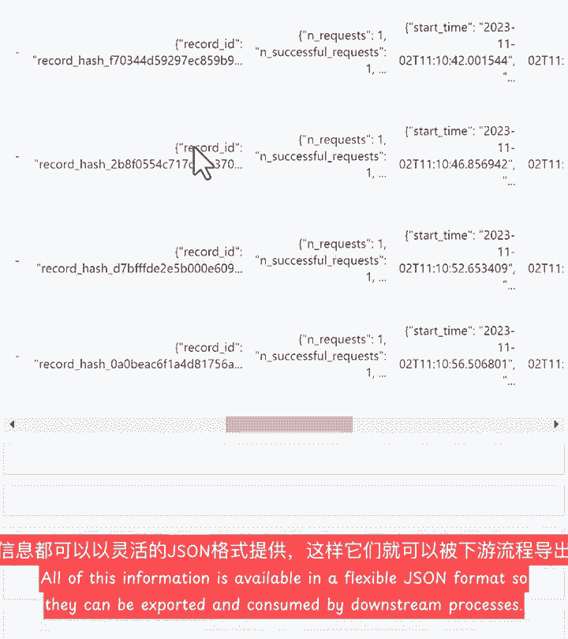

它们可以由下游进程导出和使用，它们可以由下游进程导出和使用。

接下来让我们看一些，接下来让我们看一些，更易于理解的提示格式，更易于理解的提示格式。

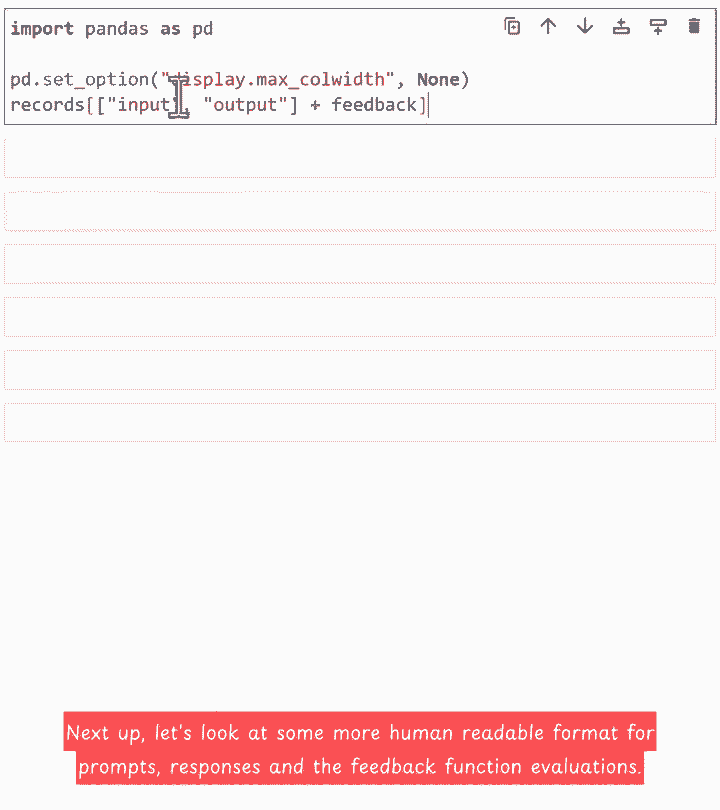

使用此代码进行响应和反馈函数评估，您，使用此代码进行响应和反馈函数评估，您，可以看到，对于每个输入提示或，可以看到，对于每个输入提示或，问题，我们都会看到输出以及，问题，我们都会看到输出以及。

上下文相关性，上下文相关性。

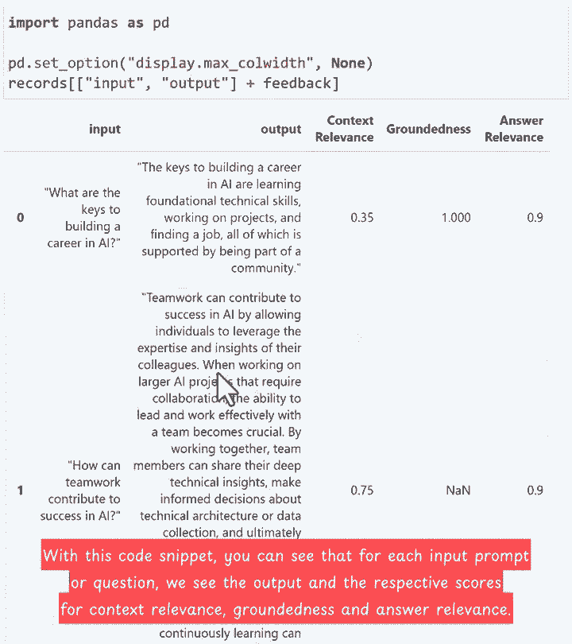

基础和答案相关性的相应分数，并且，基础和答案相关性的相应分数，并且。

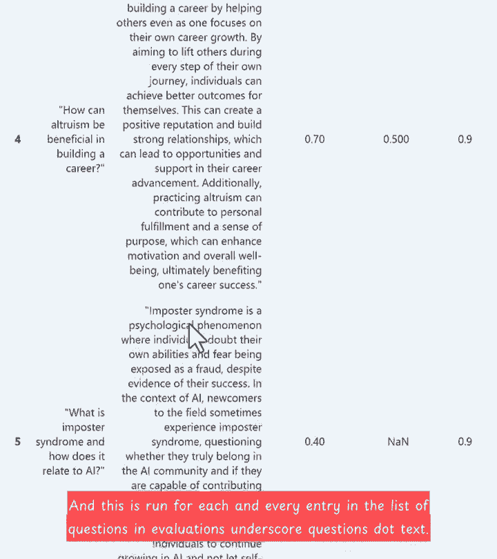

这是针对问题列表中的每个条目运行的，这是针对问题列表中的每个条目运行的，在评估，在评估，非核心，非核心。

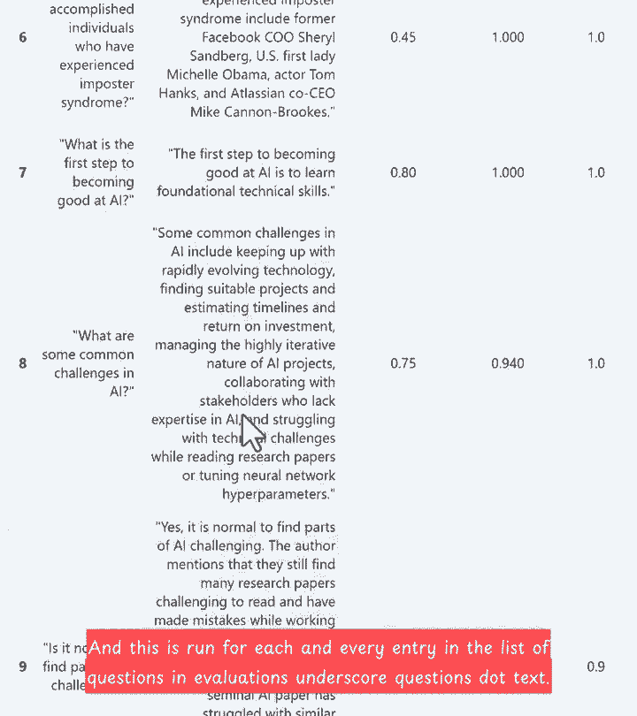

问题中。问题中。你可以在这里看到的文本最后一个问题，你可以在这里看到的文本最后一个问题，是我如何才能在，是我如何才能在。

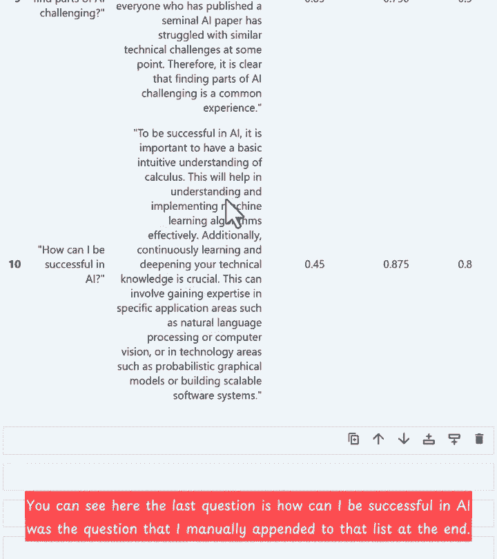

人工智能方面取得成功，这是我在最后手动，人工智能方面取得成功，这是我在最后手动。

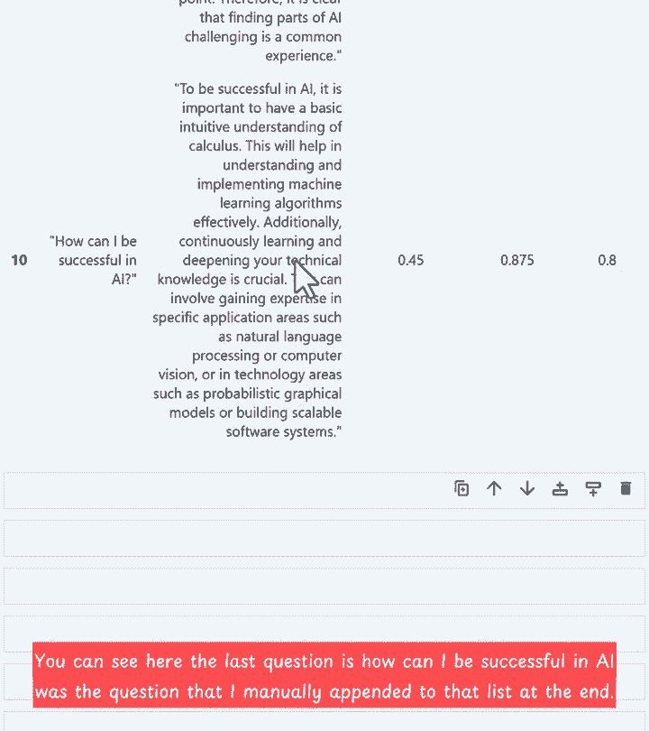

有时在运行评估时，有时在运行评估时，你可能会看到一个可能会发生的问题，你可能会看到一个可能会发生的问题。

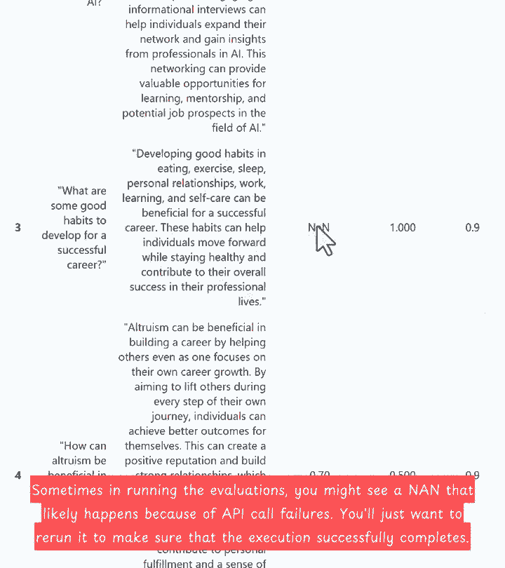

因为 API 高尔夫 faur 你会只是，因为 API 高尔夫 faur 你会只是。

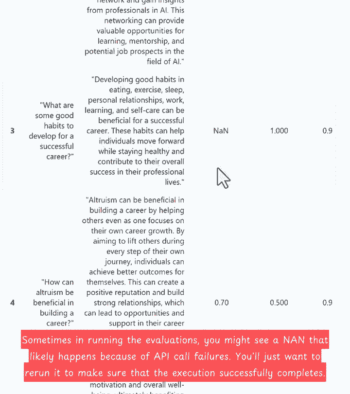

想要重新运行它以确保，想要重新运行它以确保。

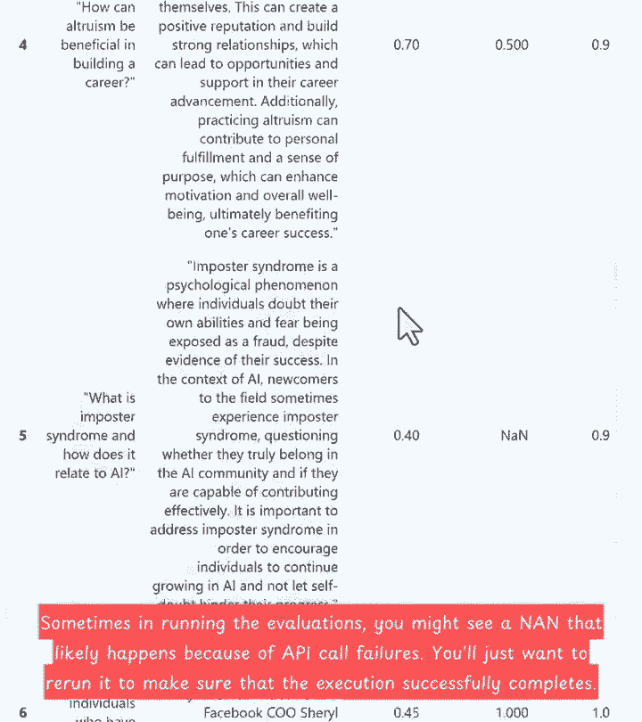

执行成功，执行成功，完成我刚刚向您展示了评估的记录，完成我刚刚向您展示了评估的记录，级别，级别，视图提示，视图提示，响应和，响应和，评估现在让我们，评估现在让我们。

在排行榜中获得一个聚合视图，在排行榜中获得一个聚合视图，该视图聚合所有，该视图聚合所有，这些单独的记录并生成，这些单独的记录并生成，平均值，平均值，该数据库中 10 条记录的得分，以便您可以。

该数据库中 10 条记录的得分，以便您可以，在排行榜中看到我们，所说的所有 10 条记录的聚合视图 应用程序 id2 app1，所说的所有 10 条记录的聚合视图 应用程序 id2 app1。

平均上下文相关性为 0。56，平均上下文相关性为 0。56，类似地，他们的，类似地，他们的，接地性答案相关性和，接地性答案相关性和，所有延迟的平均得分 向，所有延迟的平均得分 向，rag，rag。

应用程序询问的 10 条记录，然后成本是，应用程序询问的 10 条记录，然后成本是，这 10 条记录中以美元为单位的总成本，这 10 条记录中以美元为单位的总成本，获取此，获取此，聚合视图非常有用。

可以了解您的应用程序的性能，聚合视图非常有用，可以了解您的应用程序的性能。

以及，以及，延迟和成本水平，延迟和成本水平，TR Lens 还提供了，TR Lens 还提供了，一个本地简化的应用程序仪表板，一个本地简化的应用程序仪表板，您可以使用它检查正在构建的应用程序。

您可以使用它检查正在构建的应用程序，查看，查看，评估结果 深入到，评估结果 深入到，记录级别，记录级别，视图中，以获得有关您的性能的汇总和详细，视图中，以获得有关您的性能的汇总和详细。

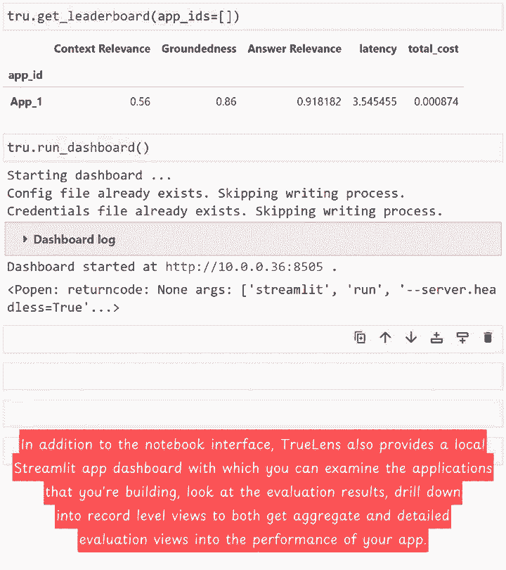

评估视图，评估视图，应用程序，这样我们就可以让仪表板，应用程序，这样我们就可以让仪表板，与真实情况一致。 运行仪表板，与真实情况一致。 运行仪表板，方法，这会，方法，这会，在某个，在某个。

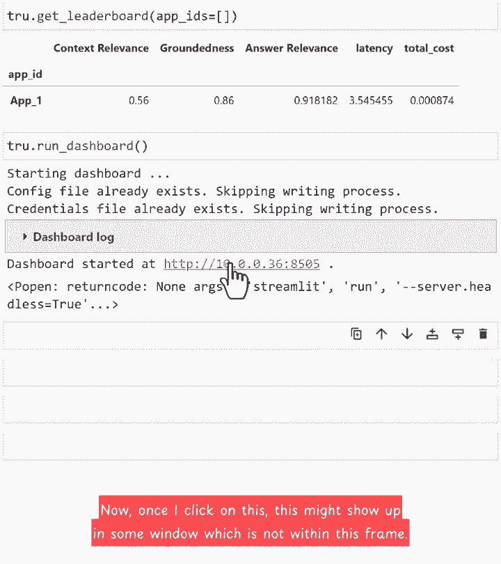

URL 处设置本地数据库，一旦我单击此按钮，这可能会，URL 处设置本地数据库，一旦我单击此按钮，这可能会，显示在不在该框架内的某个窗口中，让我们花几分钟时间浏览一下，让我们花几分钟时间浏览一下，该。

该，仪表板，您可以在此处看到聚合，仪表板，您可以在此处看到聚合，视图 应用程序性能 11 条记录，视图 应用程序性能 11 条记录，由应用程序处理并进行了评估，由应用程序处理并进行了评估。

平均延迟为 3。55 秒 我们，平均延迟为 3。55 秒 我们，得到了 llms 处理的令牌总数的总成本，然后为 rag Triad 的，然后为 rag Triad 的，上下文相关性评分。

上下文相关性评分，接地性为 0。56 86 答案相关性是，接地性为 0。56 86 答案相关性是，92 我们可以在此处选择该应用程序，以获得，92 我们可以在此处选择该应用程序，以获得。

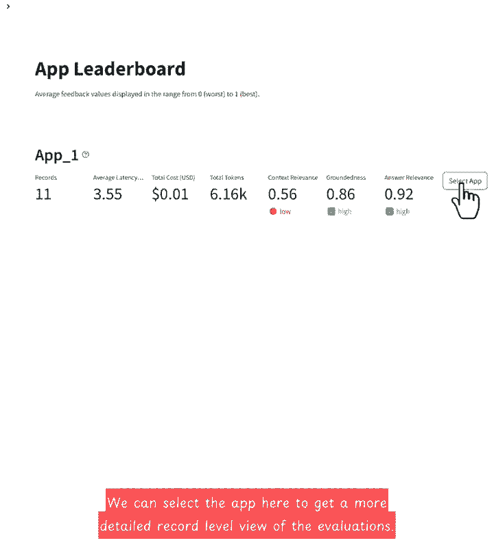

评估视图，您，评估视图，您。

可以看到用户输入的每条记录 提示，可以看到用户输入的每条记录 提示，响应 有，响应 有。

元数据 Tim 标记，然后是，元数据 Tim 标记，然后是，答案相关性的分数，答案相关性的分数，已经记录的上下文相关性和基础性，已经记录的上下文相关性和基础性，以及延迟，以及延迟。

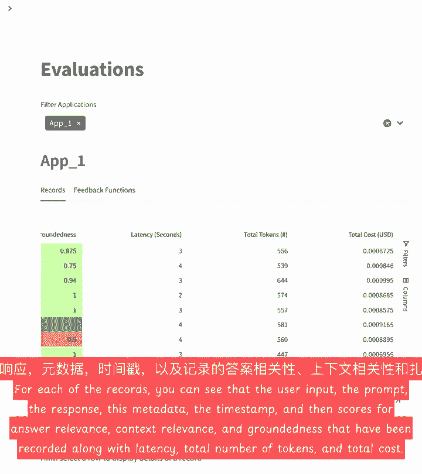

令牌总数和总，令牌总数和总，成本让我选择一行，其中 llm，成本让我选择一行，其中 llm，表示评估，表示评估。

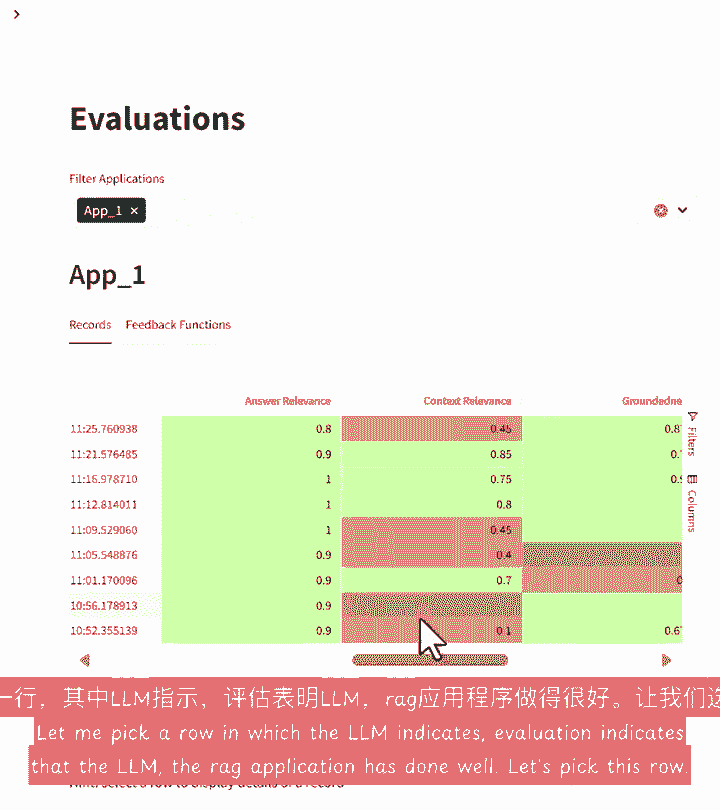

表明呃，表明呃。

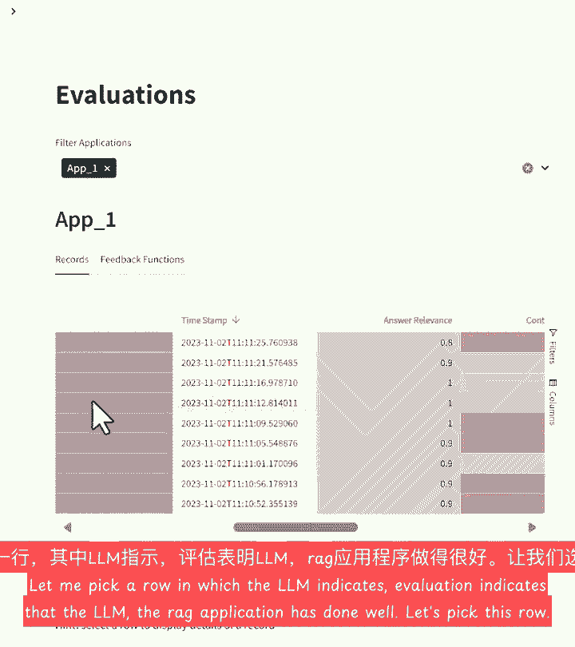

llm rag 应用程序做得很好，llm rag 应用程序做得很好，让我们在单击 AR 后选择这一行，让我们在单击 AR 后选择这一行。

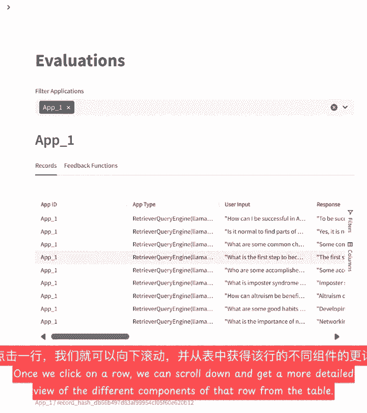

可以向下滚动并从表格中更，可以向下滚动并从表格中更，详细地了解，详细地了解，该行的不同组件，因此，该行的不同组件，因此，这里的问题提示是，这里的问题提示是，成为擅长人工智能的第一步是什么。

成为擅长人工智能的第一步是什么，抹布的最终回应是，抹布的最终回应是。

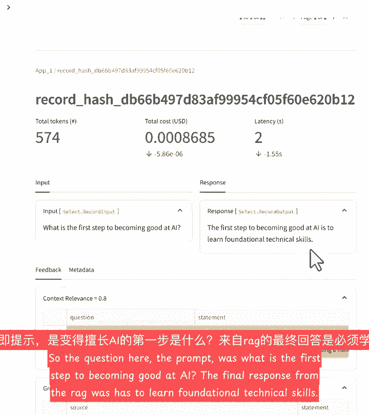

学习基础技术，学习基础技术，技能 在下面，您可以，技能 在下面，您可以，看到答案，看到答案，相关性被视为，相关性被视为，0 到 1 的范围内的 1，这是与此处提出的问题相关的非常。

0 到 1 的范围内的 1，这是与此处提出的问题相关的非常，相关的答案，相关的答案，您可以看到，您可以看到，上下文相关性，平均上下文，上下文相关性，平均上下文，相关性得分为 0。8，相关性得分为 0。

8，检索到的，检索到的，两条上下文都分别获得了 0。8 的分数，两条上下文都分别获得了 0。8 的分数，我们可以看到，我们可以看到，llm 评估在检索步骤中对来自 rag 的。

llm 评估在检索步骤中对来自 rag 的，特定 uh 响应给出 0。8 uh 分数的思想链原因。

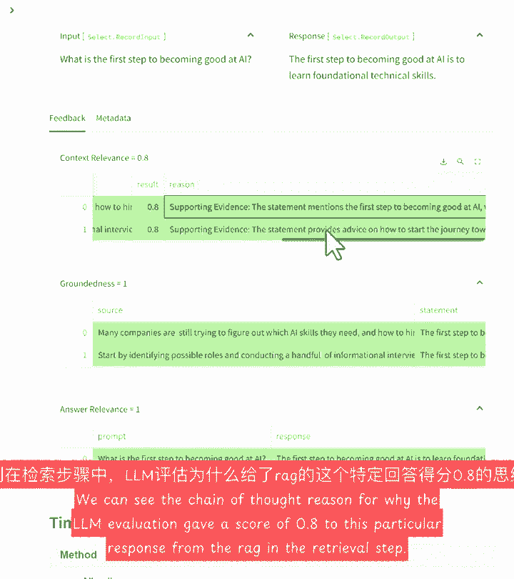

然后 在下面你，然后 在下面你，可以看到基础性评估，所以，可以看到基础性评估，所以，这是最终答案中的条款之一，这是最终答案中的条款之一。

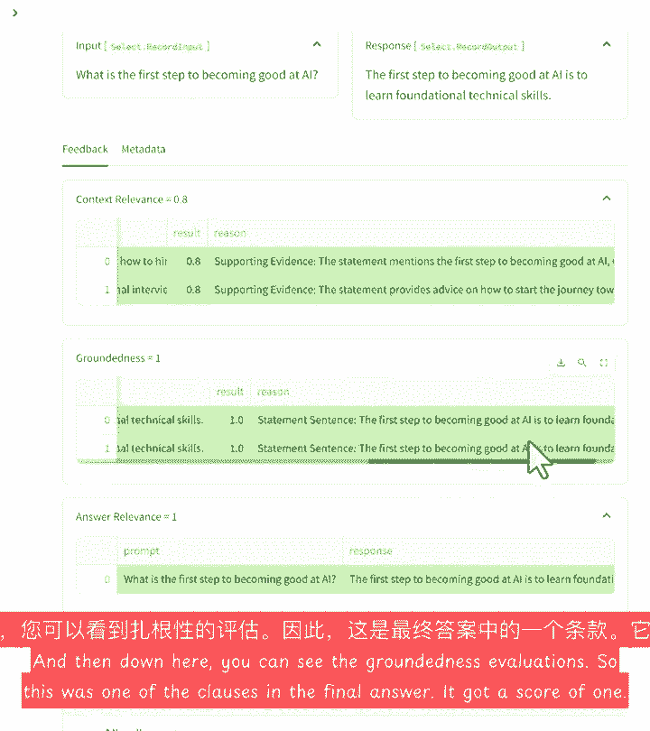

呃它得到了一分，呃它得到了一分，在这里是该分数的原因你，在这里是该分数的原因你，可以看到这是陈述句，可以看到这是陈述句，和支持，和支持，证据支持它 所以它，证据支持它 所以它。

在 0 到 1 的范围内得到 1 分满分，在 0 到 1 的范围内得到 1 分满分。

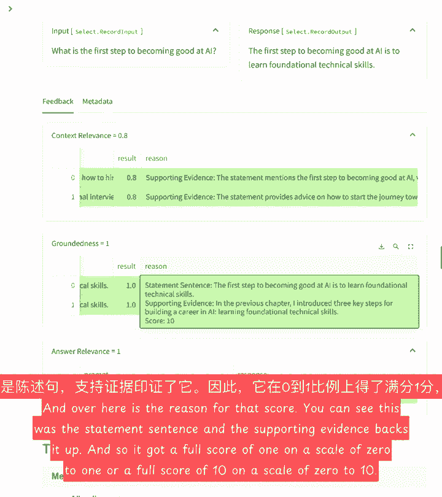

或者在 0 到 10 的范围内得到 10 分满分，或者在 0 到 10 的范围内得到 10 分满分，所以之前，所以之前。

我们，我们，通过幻灯片和笔记本讨论的推理和信息现在，通过幻灯片和笔记本讨论的推理和信息现在，你可以看到 在，你可以看到 在。

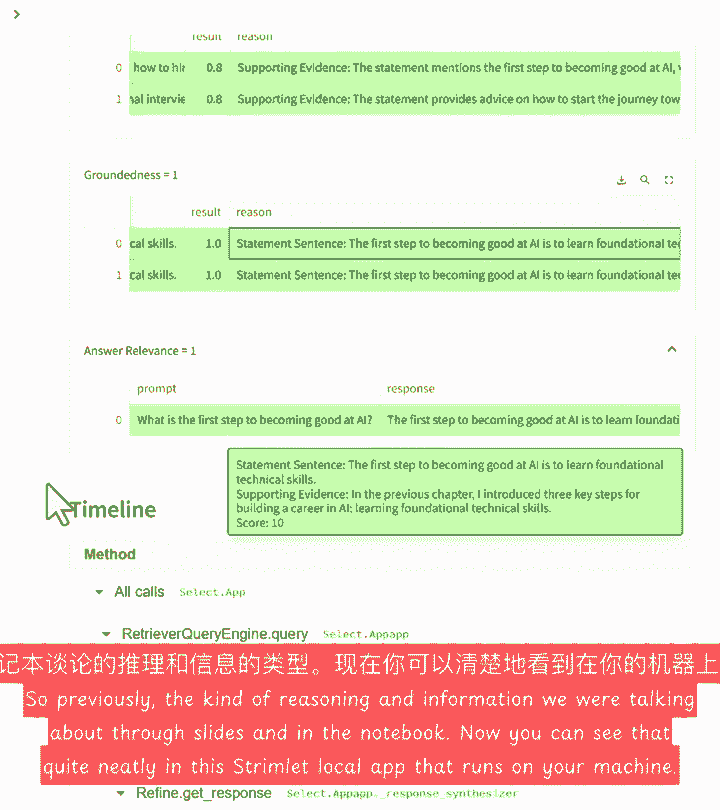

您的计算机上运行的这个 Streamlet 本地应用程序中，您的计算机上运行的这个 Streamlet 本地应用程序中，您还可以非常整齐地获得，时间线的详细视图以及访问，时间线的详细视图以及访问。

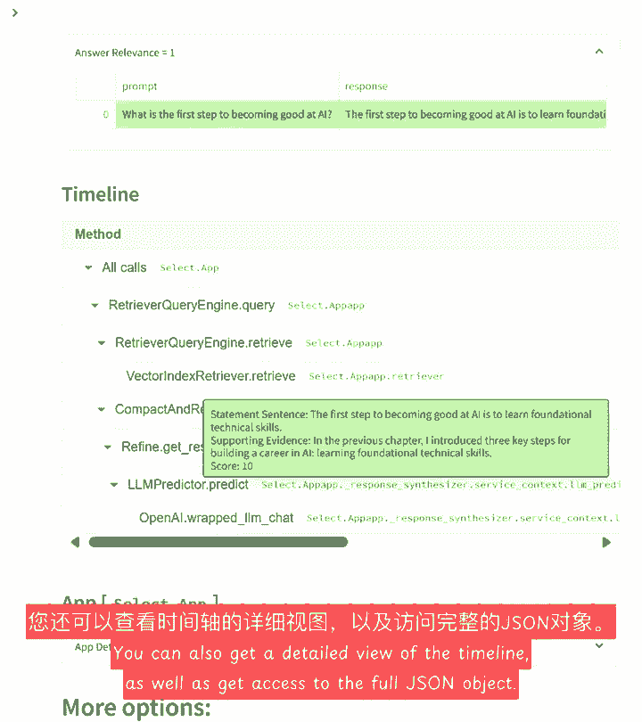

完整的 Json，完整的 Json，对象，现在让我们看一个示例，对象，现在让我们看一个示例，其中抹布做得不太好，所以我，其中抹布做得不太好，所以我，查看评估，我看到这一，查看评估，我看到这一。

行的接地性分数为 0。5，行的接地性分数为 0。5。

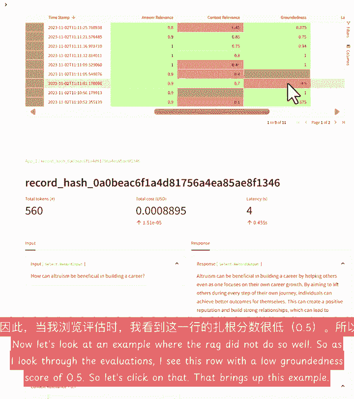

所以让我们点击该行，显示，所以让我们点击该行，显示，此，此，示例。问题是利他主义如何有，示例。问题是利他主义如何有，利于建立职业生涯，利于建立职业生涯。

答案是，如果我向下滚动，答案是，如果我向下滚动，到接地性，到接地性，评估 然后，呃，这两个，评估 然后，呃，这两个，句子和最后的回答都有，句子和最后的回答都有。

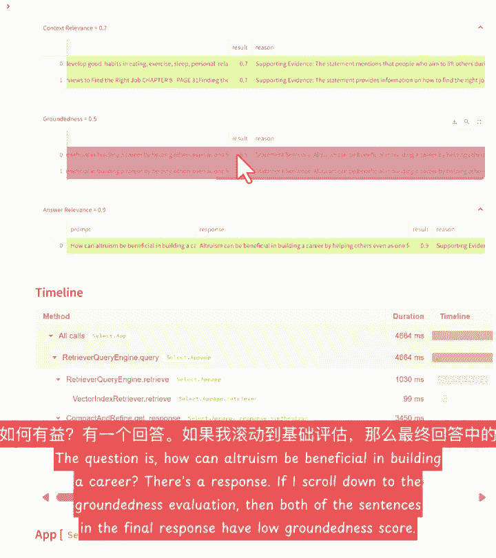

较低的接地性分数，让我们选择其中一个，较低的接地性分数，让我们选择其中一个，看看为什么接地性，看看为什么接地性，分数很低，这样你就可以看到，分数很低，这样你就可以看到，整体回答被分解为。

整体回答被分解为，四个陈述，前两个是，四个陈述，前两个是，好的 但最后两个，好的 但最后两个，在检索上下文方面没有很好的支持证据，在检索上下文方面没有很好的支持证据，特别是如果你，特别是如果你，看最后。

看最后，一个，法学硕士的最终输出表明，一个，法学硕士的最终输出表明，另外练习利他主义可以，另外练习利他主义可以，有助于个人成就感和，有助于个人成就感和，使命感，从而增强，使命感，从而增强。

动力 整体幸福感，动力 整体幸福感，最终有利于一个人的职业，最终有利于一个人的职业，成功，虽然情况很可能是，成功，虽然情况很可能是，这样，但，这样，但，在检索到的上下文中没有发现支持证据来。

在检索到的上下文中没有发现支持证据来，支持该陈述，支持该陈述，这就是为什么我们的，这就是为什么我们的，低分，您可以考虑一下，低分，您可以考虑一下，仪表板并探索一些，仪表板并探索一些，其他示例，其中。

其他示例，其中，llm 呃最终的 rag，llm 呃最终的 rag，输出 uh 表现不佳，无法很好地了解，当您使用 rag 应用程序时非常常见的故障模式，当您使用 rag 应用程序时非常常见的故障模式。

其中一些将得到，其中一些将得到，解决 当我们进入有关，解决 当我们进入有关，更先进的拖动，更先进的拖动，技术的课程时，这些技术可以在，技术的课程时，这些技术可以在。

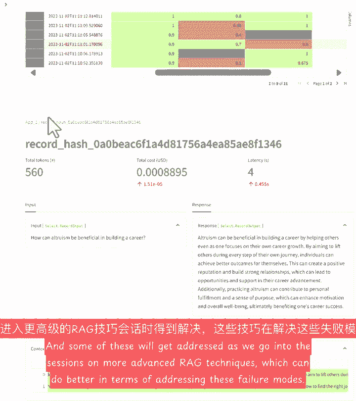

解决这些故障模式方面做得更好，解决这些故障模式方面做得更好，第二课是一个总结，在下一，第二课是一个总结，在下一，课中，我们将介绍，课中，我们将介绍，基于句子窗口的，基于句子窗口的。

检索机制和先进的机架技术，检索机制和先进的机架技术，并且 向您展示如何评估，并且 向您展示如何评估，利用。

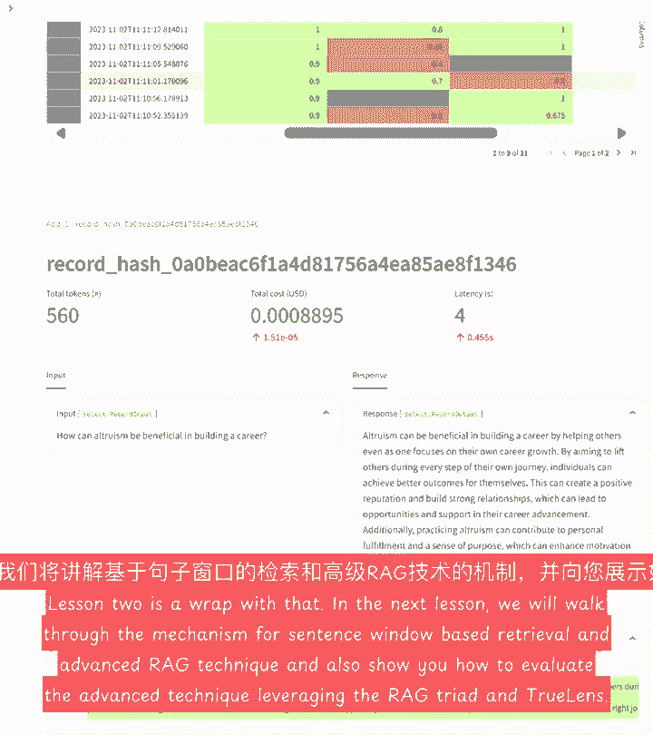