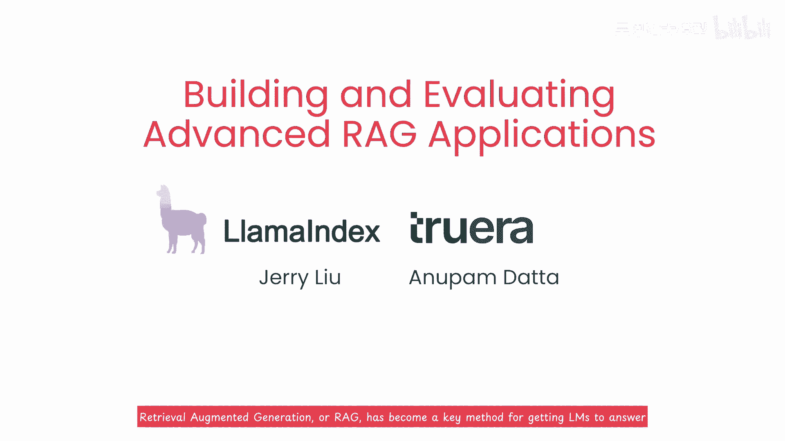

# LangChain_微调ChatGPT提示词_RAG模型应用_agent_生成式AI - P19：《构建和评估高级的RAG模型应用》1. 开篇 - 介绍(Introduction) 中英文字幕 - 吴恩达大模型 - BV1gLeueWE5N

检索，增强生成或RAG已成为获取LMS的关键方法，用户自有数据上的回答问题，但实际构建和生产高质量RAG系统，拥有有效的检索技术很有帮助，为专辑提供高度相关的上下文以生成他的答案。

并且还要有一个有效的评估框架，帮助您高效迭代和改进您的RAG系统，不仅在初始开发期间，而且在部署后维护期间，本课程涵盖两种高级检索方法，句子窗口检索和自动沉浸检索，提供比简单方法更好的上下文给LM。

还涵盖如何用3个评估指标评估你的LM问答系统，上下文相关性，基础性和答案相关性，很高兴介绍Jerry，Jerryu的联合创始人兼CEO，以及True Era的新数据联合创始人兼首席科学家，长期关注。

Jerry和Llama Index在社交媒体上，获取进化Rap实践的提示，因此，我期待他的到来，所以，我期待他，更系统地教授这些知识，这里有一个新泵，在CMU任教授，研究可信AI已超十年，以及如何监控。

评估和优化效果，谢谢安德鲁，很高兴在这里，很高兴与你同在，安德鲁句子窗口检索提供更好的上下文，通过检索不仅仅是相关性最高的句子，句子前后窗口，在文档中，自动检索组织文档为树状，每个父节点。

文本分给子节点，未识别足够相关子节点，则父节点全文本作上下文，听起来步骤多，别担心，代码中细讲，但主要收获是，这提供了一种动态获取更连贯文本块的方法，比评估基于rag的llm应用的简单方法更有效。

rag三元组，用于rag执行三个主要步骤的三元组指标非常有效，例如，我们将详细讲解如何计算上下文相关性。

这衡量的是。

检索的文本块与用户问题的相关性如何。

这有助于你识别和调试系统检索上下文可能出现的问题。

在QA系统中为llm，但这只是整体QA系统的一部分。

我们还将涵盖其他评估指标。

如基于事实性和答案相关性，这让你系统地分析系统哪些部分有效，哪些部分尚未有效。

这样你就可以有针对性地改进需要最多工作的部分，这有相似之处，我发现，采取这种系统化方法能让你更有效地构建可靠的QA系统。

这门课程的目标是帮助你构建生产就绪的，基于ride的llm应用，使系统生产就绪的一个重要部分是系统化迭代，在这门课程的后半部分，你将通过这些检索方法和评估方法获得实际操作经验。

你还会看到如何使用系统实验跟踪建立基线，然后快速改进，我们还将分享一些基于我们经验的建议，帮助构建rag应用的合作伙伴，许多人参与了这门课程的制作，我想感谢在lma索引方面。

Logan markowitz，以及在truer方面，Shayen，Joshua rae和barbara lewis来自深度学习，Ai eddie shu和tiala，作为团队也为这门课程做出了贡献。

下一课将概述你将看到的内容，在课程的其余部分，你将尝试使用句子窗口检索，或自动合并检索的问答系统，并比较它们在rag三联上的性能，联系相关性，基于事实性和答案无关性听起来不错，让我们开始吧。

我认为你能够真正清理这些rag，东西，笑了。