# LangChain_微调ChatGPT提示词_RAG模型应用_agent_生成式AI - P45：4——输入处理： 思考链推理 - 吴恩达大模型 - BV1gLeueWE5N

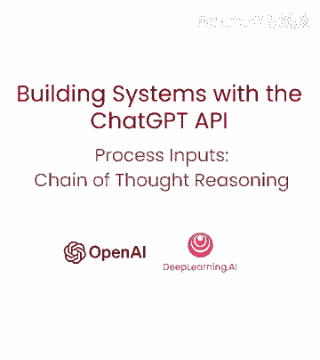

本节内容，将处理输入的任务为重点，我，E，输入并生成有用输出的任务，通常需经过一系列步骤，在回答特定问题前，详细推理问题有时很重要，如果你上过我们之前的课程——开发者CBT提示工程。

你将看到许多这样的例子，有时模型会因仓促得出错误结论而犯推理错误，因此，我们可以重新构建查询，要求模型在提供最终答案之前进行一系列相关推理，这样它就可以更长时间、更系统地思考问题。

我们通常将这种让模型逐步推理问题的策略，称为链式思维推理，适用于某些应用，模型用于得出最终答案的推理过程，不适合与用户分享，例如，在辅导应用中，我们可能希望鼓励学生自己解决问题。

但模型关于学生解决方案的推理，可能会以独白的形式向学生透露答案，这是一种可以缓解这种情况的策略，这只是一个花哨的说法，意思是向用户隐藏模型的推理，关于，独白，是，指示模型将输出中。

打算隐藏给用户的部分放入结构化格式中，以便轻松传递，然后在向用户呈现输出之前，输出被传递，只有输出的一部分可见，请记住上一个视频中关于分类问题的讨论，我们要求模型将客户查询分类为主次类别，基于该分类。

我们可能想要采取不同的指令，想象客户查询已被分类为产品信息类别，在接下来的指令中，我们将想要包含有关我们可用产品的信息，因此在这种情况下，分类将是主要，一般查询，次要产品信息。

那么让我们从那里深入一个例子，所以让我们从我们通常的设置开始。

所以对于这。

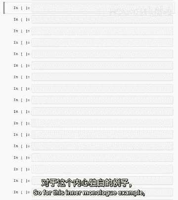

独白，示例，或从我们一直在使用的相同分隔符开始。

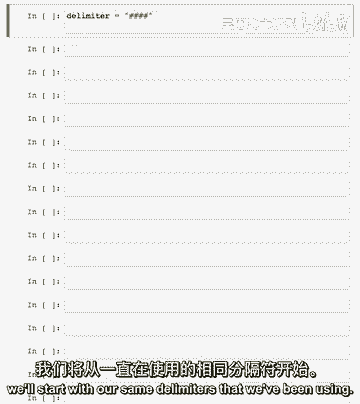

现在让我们浏览系统消息，我们在这里做的是要求模型推理答案，在得出结论之前，因此，按这些步骤回答客户问题，客户查询将以四个井号分隔，我们的分隔符，因此，我们将其拆分为步骤，因此。

第一步是决定用户是否在询问特定产品或产品，产品类别不算第二步，因此，如果用户在询问特定产品，确定产品是否在以下列表中，现在，我们包含了一个可用产品列表，这里有五种产品，都是笔记本电脑的变种。

这些都是虚构产品，实际上由gpt生成，四，在步骤三，如果消息包含上述列表中的产品，列出用户在消息中做出的任何假设，例如，笔记本电脑x比笔记本电脑y大，或笔记本电脑z有两年保修，例如。

步骤四是用户是否假设，根据产品信息判断假设是否正确，步骤五是先礼貌纠正客户的错误假设，如适用，仅提及或参考五款可用产品，因为这些是商店销售的仅有的五款产品，并以友好语气回答客户。

这些非常吹毛求疵的指示可能没有必要，对于像gbt四这样的高级语言模型，然后我们会要求模型使用以下格式，第一步分隔符，其推理，第二步分隔符推理等，使用分隔符，意味着稍后更容易向客户提供此响应。

并切断之前的一切，所以现在让我们尝试一个示例用户消息，所以我们的消息是蓝色波浪Chromebook，比Tech Pro台式机贵多少，所以让我们看看这两个产品，蓝色波浪Chromebook 2499。

99，Teo台式机实际9999。99，这实际上不正确，让我们看看模型如何处理此用户请求，因此我们将格式化为我们的消息数组，我们将获取我们的响应，然后我们会打印它，因此我们希望模型采取所有这些不同的步骤。

并意识到用户做出了错误的假设，然后遵循最后一步礼貌地纠正用户，因此，在这一个提示中，我们实际上维护了系统可能处于的多个不同复杂状态，所以你知道在任何给定时刻可能会有与前一步不同的输出。

我们想要做不同的事情，例如，如果用户在步骤三中没有做出任何假设，那么在步骤四，我们实际上不会有任何输出，这是一个对模型的相当复杂的指令，让我们看看它是否做对了，所以步骤一。

用户正在询问关于特定产品的信息，他们询问这两款产品之间的价格差异，用户假设蓝色波浪Chromebook比Textbook Pro更贵，这个假设实际上是不正确的，它通过花更长的时间来思考问题进行推理。

就像人类也会花一些时间来推理答案一样，对于任何给定的问题，如果模型也有时间思考，它会表现得更好，因此，对用户的最终响应是，实际上蓝色波浪Chromebook比Textbook Pro更便宜。

Textbook Pro台式机售价999。99美元，而蓝色波浪Chromebook售价249。99美元，让我们看看另一个用户消息的例子。

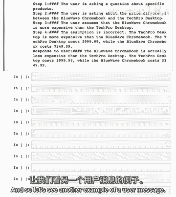

并且在此处随时可以暂停视频并尝试自己的消息，所以让我们格式化这个用户消息，所以问题是你们卖电视吗，如果你记得我们的产品列表，我们只列出了不同的电脑，所以让我们看看模型怎么说。

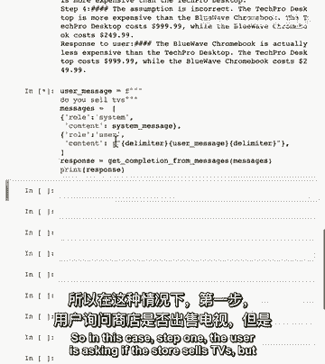

所以在这种情况下步骤一用户询问商店是否卖电视，但电视不在可用的产品列表中，所以你可以看到模型，然后跳过了回复用户步骤，因为它意识到中间步骤实际上是不必要的，我会说我们确实要求以这种特定格式输出。

所以从技术上讲模型并没有完全遵循我们的请求，更先进的模型将更好地做到这一点，所以在这种情况下我们对用户的回应是，很抱歉，但我们不在商店卖电视，然后它列出了可用产品，所以再次欢迎尝试您自己的回复。

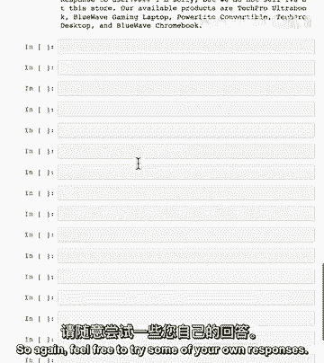

所以现在我们只真正需要这个响应的一部分，我们不想向用户显示早期部分。

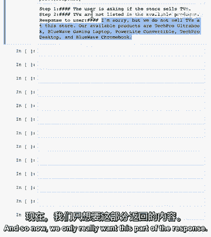

所以我们可以做的是实际上只是剪切字符串。

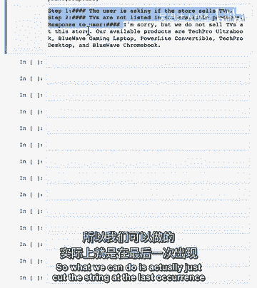

在最后一个分隔符标记或四个井号字符串处。

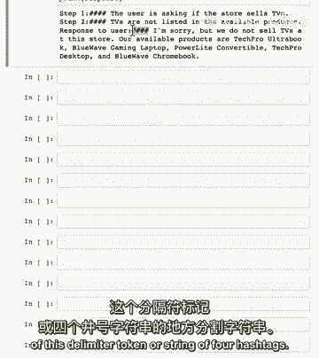

然后只打印模型输出的最后部分。

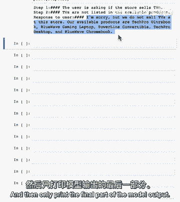

所以让我们编写一些代码来获取这个字符串的最后一部分。

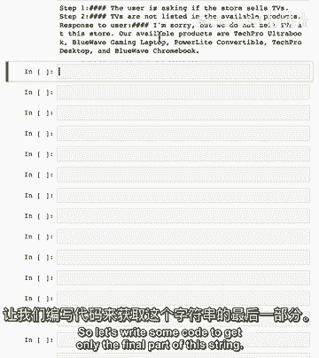

因此我们将使用try accept块来优雅地处理错误。

模型若有不可预测输出。

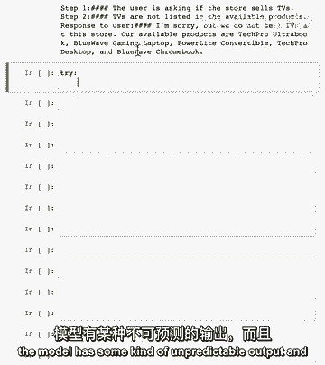

实际可能不使用这些字符，最终响应为响应。

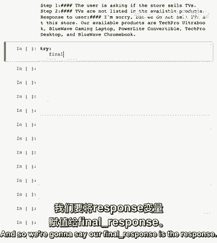

然后按分隔符分割字符串。

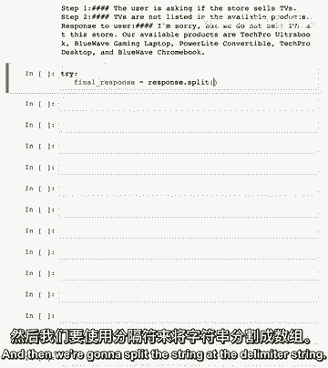

因要最后出现，只需获取输出列表的最后一项，然后去除任何空格。

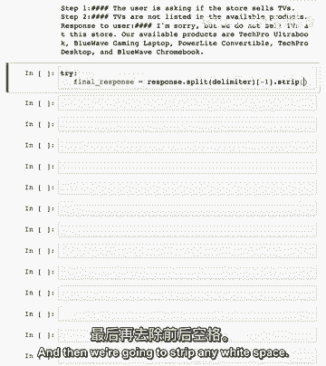

如您所见，字符后可能有空格，捕获任何错误，并设置备选响应。

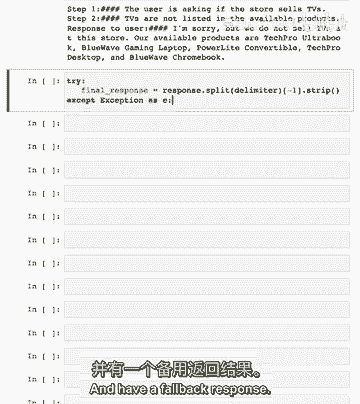

抱歉，我正在，我正在遇到麻烦，请尝试问另一个问题。

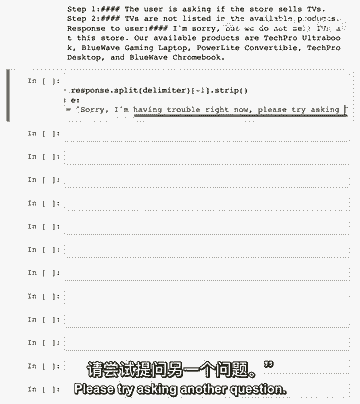

然后打印最终响应。

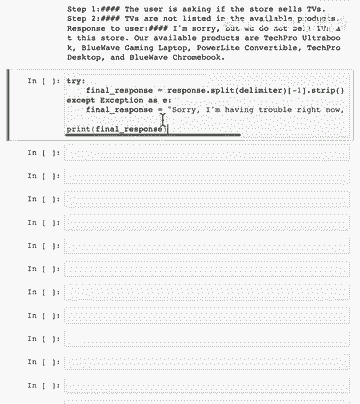

因此如您所见，我们仅切割字符串以获取此最终输出，这就是我们会向用户展示的内容，如果我们正在将此构建到应用程序中，总体上，我想指出此提示可能稍微复杂，您可能实际上不需要所有这些中间步骤。

那么为什么不试试看，您是否可以找到更简单的方法来完成相同的任务，通常，在提示复杂性中找到最佳权衡需要一些实验，所以绝对好，尝试多个不同的提示，然后再决定使用哪一个，在下一个视频中。

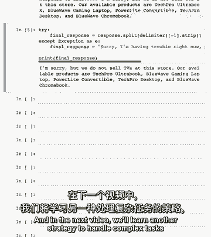

我们将学习另一种策略来处理复杂任务，通过将这些复杂任务拆分为一系列简单的子任务。

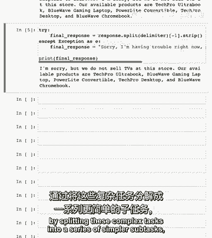

