# LangChain_微调ChatGPT提示词_RAG模型应用_agent_生成式AI - P46：5——输入处理： 链式提示 - 吴恩达大模型 - BV1gLeueWE5N

本视频中，将学习如何将复杂任务拆分为一系列简单子任务，通过串联多个提示，你可能想知道为何要将任务拆分为多个提示，当你能用一个提示和思维链推理实现时，如我们之前，在视频中展示的。

语言模型非常擅长遵循复杂指令，特别是像gbt四这样的高级模型，让我用两个类比解释为何这样做，比较思维链推理和连续提示，类比一：烹饪复杂餐点一次完成与分阶段，烹饪的区别。

使用一条长而复杂的指令就像试图一次烹饪复杂餐点，需要管理多种食材，烹饪技巧和时间，同时，很难跟踪一切并确保每个部分都烹饪得完美，连续提示，另一方面，如烹饪分阶段，一次专注于一个部分。

确保每部分煮好再继续，这种方法分解任务复杂性，使其更容易管理，减少错误。

然而，对简单食谱可能多余复杂。

同一事物的稍好比喻是，阅读所有在一长文件中的意大利面代码与简单模块程序的区别，使意大利面代码糟糕和难以调试的东西，逻辑各部分间歧义和复杂依赖，复杂单步任务提交给语言模型亦如此，串接提示是强大策略。

用于工作流程，可维持系统任一点状态，依当前状态采取不同行动，取决于当前状态，当前状态示例为，分类入站客户查询后。

状态为分类，因此是账户问题。

或为产品问题，根据状态，你可能做不同的事。

每个子任务仅包含完成单一任务状态所需的指令，使系统更容易管理，确保模型有执行任务所需的所有信息，并降低错误的可能性，如我所说，这种方法也能降低成本，因为更长的提示，包含更多标记，运行成本更高。

列出所有步骤可能多余，在某些情况下，这种方法的另一个优点是更容易测试哪些步骤可能更常失败。

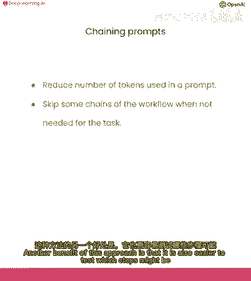

或在特定步骤中加入人类，因此总结一下，因为这个解释很长。

而不是用几十个要点描述整个复杂的工作流程，或在一个提示中写几段。

就像在之前的视频中，可能最好在外部跟踪状态，然后按需注入相关指令，什么使问题复杂。

我认为总的来说，一个问题很复杂，如果有许多不同的指令，并且可能所有这些都适用于任何给定情况。

因为这些是模型难以推理该做什么的情况，随着您更多地构建和与这些模型交互，您将获得何时使用这种策略与之前的直觉。

还有一个额外的优点我还没有提到，是它还可以在流程的某些点上使用外部工具。

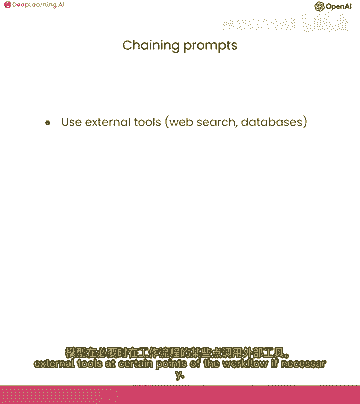

如果有必要，例如，它可能会决定在产品目录中查找一些东西或调用API或搜索知识库。

这是使用单个提示无法实现的事情。

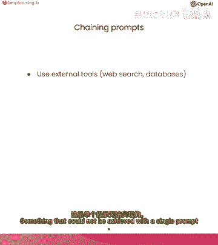

所以让我们深入一个例子，我们将使用与前一个视频中相同的示例，其中我们要回答客户关于特定产品的疑问。

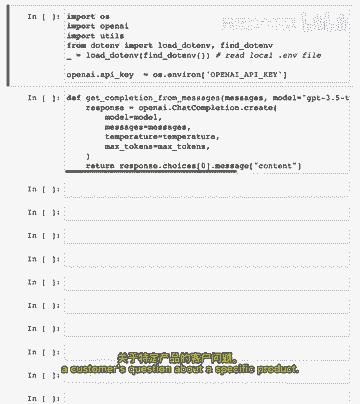

但这次我们将使用更多产品，并将步骤分解为多个不同的提示。

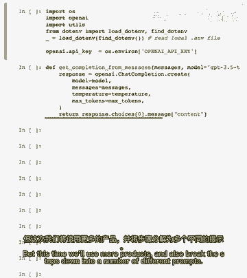

我们将使用在前几个视频中使用的相同分隔符。

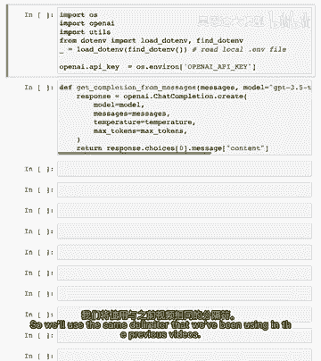

让我们阅读我们的系统消息，您将收到客户服务查询，客户服务查询将由井号字符分隔，输出Python列表的对象，其中每个对象具有以下格式：类别，这是这些预定义字段之一或产品。

这是必须在允许产品下找到的产品列表，类别和产品必须在客户服务查询中找到，如果提到产品，它必须在允许产品下的正确类别中，如果没有找到产品或类别，输出空列表，所以现在我们有允许的产品列表，所以我们有类别。

然后是这些类别中的产品，我们的最终指示是只输出对象列表，其他什么都不输出，所以接下来我们有用户消息，所以这个消息是告诉我关于SmartX和PhotoSnap相机，DSLR的也告诉我关于你们的电视。

所以我们正在询问两个特定产品，还有这类电视，这两款产品都在允许产品列表中，然后我们也有电视部分，然后我们格式化系统消息和用户消息到消息数组中，然后我们从模型获取完成，所以如你所见，对于我们的输出。

我们有一个对象列表，每个对象都有类别和产品，我们有小x Pro手机和PhotoSnap DSLR相机，然后在最后一个对象中我们实际上只有类别，因为我们没提特定电视，因此，输出结构化响应的优点是。

我们可以读取到列表中，在Python中，非常不错，那么让我们尝试另一个例子，所以我们的第二个用户消息。

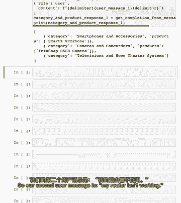

我的路由器不工作了，如果你注意到列表中，实际上我们没有路由器，然后正确格式化并完成，如你所见，这种情况下输出为空列表。

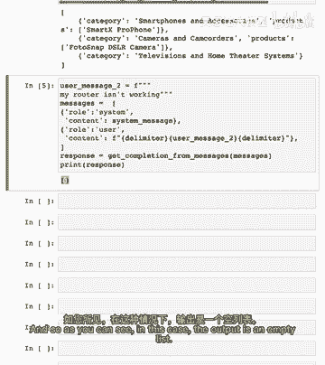

现在我们有步骤识别分类产品，若发现分类中的产品。

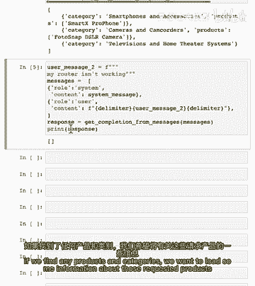

我们想加载有关请求的产品和类别的信息到提示中。

以便更好地回答客户问题，因此在我们的工作流程中，此提示运行后的状态是产品已列出或未列出，产品已列出或未列出。

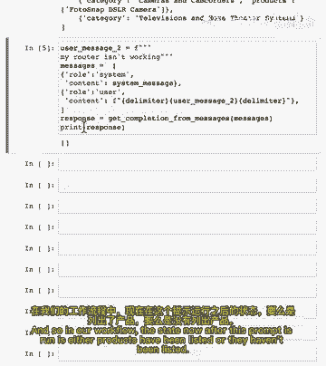

这种情况下我们不会尝试查找任何东西，因为没有东西可查找。

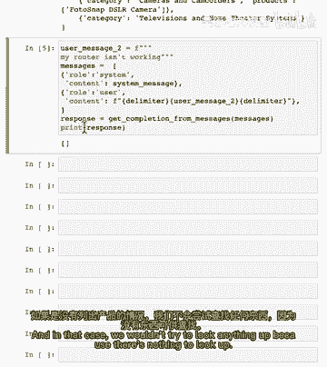

实际上构建这个系统时，我可能使用类别名称，也许类似电脑和笔记本电脑，或避免任何空格和特殊字符的奇怪之处，但目前应该可行，现在我们要查找用户提及的产品信息，关于这部手机，关于这台相机，关于电视总体情况。

因此我们需要某种产品目录来查找这些信息。

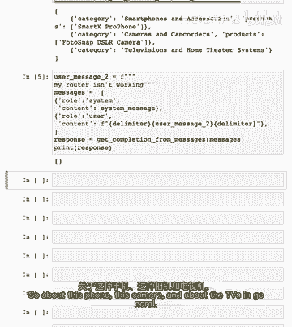

从这儿我们有我刚粘贴的产品信息，所以如你所见，我们有大量产品，在商店有售，所有这些产品都是假的，实际上是由GPT生成的，因此对于每个产品，我们有一些不同的字段，我们有名称，类别，品牌，保修等。

产品仅是名称到该对象的字典，包含产品信息，注意每个产品都有分类，所以记住我们要查找用户询问的产品信息。

因此我们需要定义一些辅助函数以允许我们按产品名称查找产品信息。

因此让我们创建一个函数，按名称获取产品，我们输入名称。

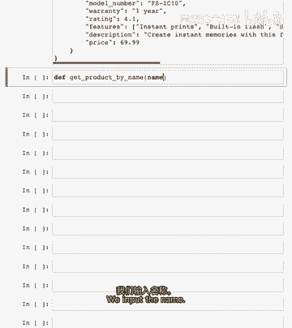

然后返回产品字典，获取以名称作为键的项的值。

我们的备选方案就是None，因此我们还想定义另一个辅助函数，获取特定类别的所有产品，例如，当用户询问关于电视时，我们想要加载所有关于不同电视的信息，按类别获取产品，输入，类别名称字符串。

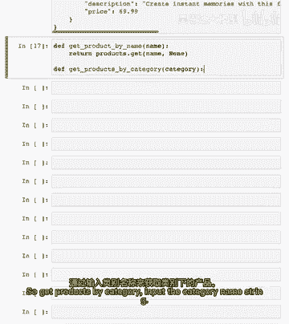

为此，遍历产品字典中的所有产品。

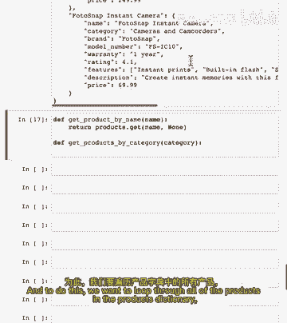

检查每个产品，看类别是否等于输入类别。

如果是，则返回该产品，我们将这样做。

首先，我们要遍历每个产品并获取值。

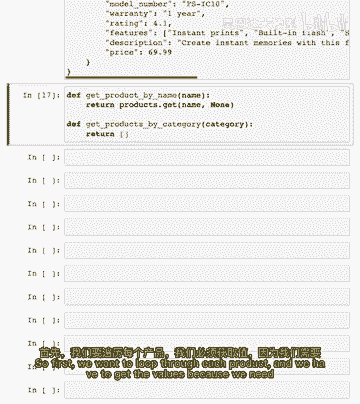

因为我们需要实际访问类别，它在值中。

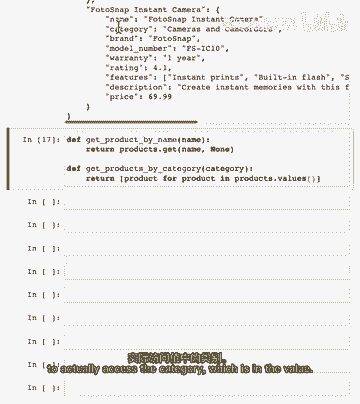

如果产品等于我们的输入类别，则返回该产品。

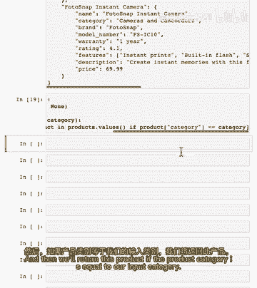

让我们为每个辅助函数举例子，首先我们有一个名为Tech Pro Ultra Book的产品，让我们按名称获取产品信息。

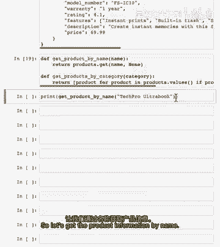

所以你可以看到，我们刚刚获取了所有产品信息，让我们举一个例子来获取所有类别的产品。

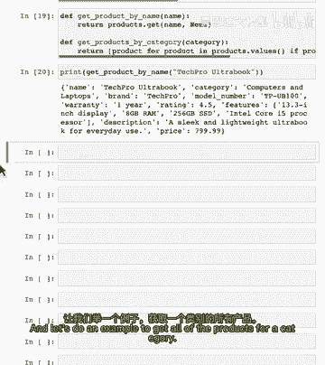

让我们获取计算机和笔记本电脑类别中的所有产品。

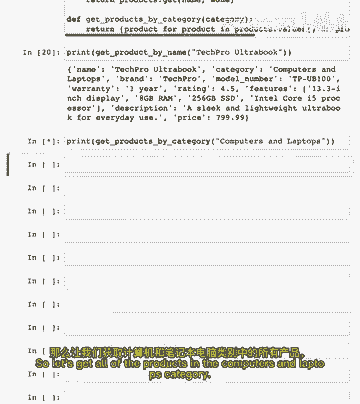

所以你可以看到，我们获取了所有此类别的产品，让我们继续我们的例子，并记住我们在哪里。

打印用户消息，用户消息是告诉我关于SmartX Pro、相机和电视。

然后模型第一步的初始输出是。

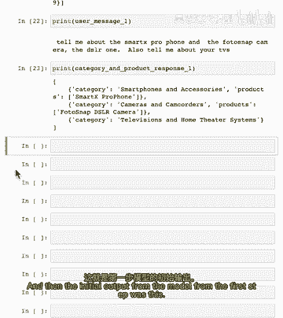

所以我们还需要做的是读取模型的这个输出。

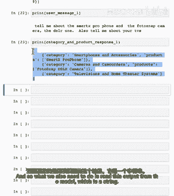

这是一个字符串，我们需要将其传递到一个列表中，以便我们可以将其用作我们刚刚编写的辅助函数的输入。

这就是为什么我有一个函数来做这件事。

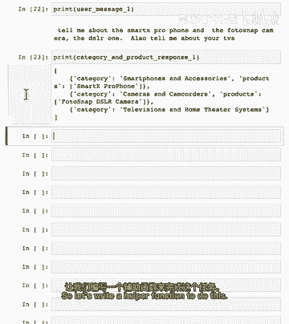

我们将使用Python的模块。

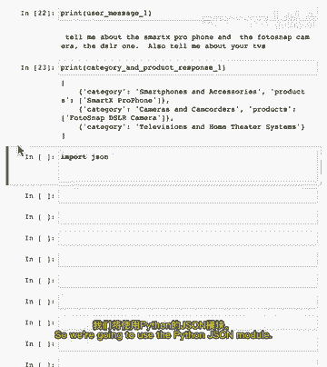

我们将编写一个名为read_string_to_list的函数，非常描述性的标题。

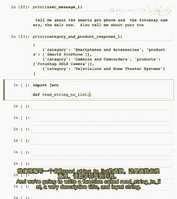

输入字符串，首先检查输入字符串是否为空。

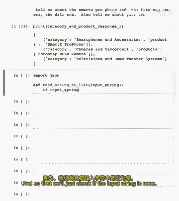

以防前一步失败，将返回空。

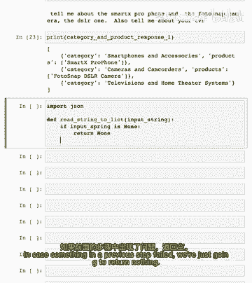

现在将使用try except块确保捕获任何错误。

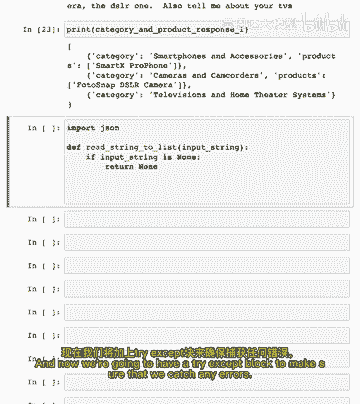

首先将输入字符串中的单引号替换为双引号，以确保可以传递JSON，然后使用 loads函数读取输入字符串，到数组或列表中。

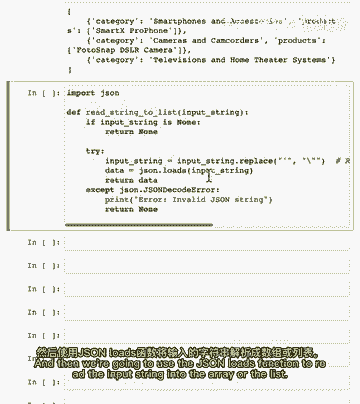

然后返回这个，如果有解码错误。

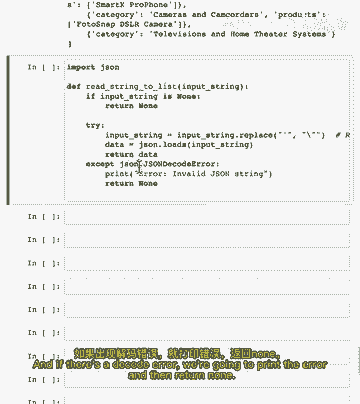

将打印错误并返回空。

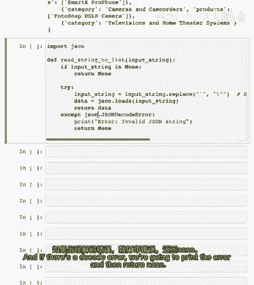

让我们尝试使用示例，所以。

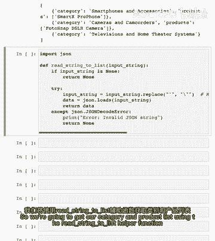

我们将使用读取字符串到列表助手函数获取类别和产品列表，并将其应用于模型的响应，然后打印此列表，所以它应该看起来一样，让我先运行这个，正如您所看到的，它只是相同的东西。

除了现在此变量的类型实际上是列表而不是字符串，我们正在做的整个目的是将产品信息放入列表中，我们可以将其添加到模型的下一个指令中，这将是我们要求它回答用户问题的指令，因此要做到这一点。

我们需要将产品信息放入漂亮的字符串格式中，我们可以将其添加到提示中，因此让我们也创建一个助手函数来做这件事，我们将称之为生成输出字符串。

它将接受我们刚刚创建的列表数据，即这个。

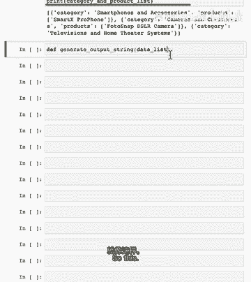

然后我将复制一些代码，然后我们将走过它在做什么。

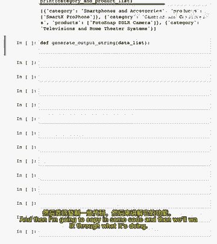

现在我将粘贴一些代码并向您展示一个示例，然后我们将讨论这个函数的作用，我们将从我们的第一个用户消息中获取产品信息，因此我们将使用此助手函数，生成输出字符串对我们的类别和产品列表，如果还记得，这是这个。

这里我们有所有提及的产品信息，在用户消息中，所以他们提到的手机，他们提到的相机，然后我们有所有电视产品的产品信息，这些信息对模型将是有帮助的，能够回答用户的最初问题，如果您对如何工作感兴趣。

我将给出简要概述，但您可以随时暂停视频并仔细阅读，所以它基本上只是遍历这个列表中的所有对象，并首先检查是否有产品，若如此，获取每产品信息，然后检查是否有分类，若无产品，因此，针对此对象，例如。

然后获取该分类下所有产品信息，并添加到此字符串，然后返回该结果，此时已找到相关产品信息回答用户问题，现在模型该实际回答问题了，所以有系统消息。

这是指令，您是大型电子产品店的客服助理，以友好和有帮助的语气回复，尽量使用简洁答案，确保询问用户相关后续问题，因此，希望为用户提供互动体验，所以再次提醒，这是最初的用户消息。

我将再次添加，所以现在我们有消息数组。

这是模型的输入，所以让我们逐一查看，我们有第一条消息，通常为系统消息，用户消息，然后有这个。

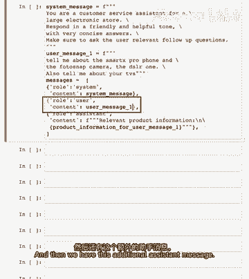

附加助手消息，这是包含我们刚查找的所有产品信息的消息。

所以说是相关产品信息，换行，然后是我们刚找到的产品信息，所以现在模型有相关上下文，需要能够回答用户的问题，所以让我们获取最终回复并打印。

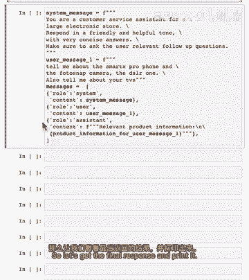

我们希望模型能使用产品信息中的相关信息，以帮助方式回答用户，所以首先告诉用户关于智能X Pro，告诉用户关于照片，快照相机，然后谈论我们库存中的不同电视，然后问后续问题，如您所见，通过分解为一系列步骤。

我们能够加载与用户查询相关的信息，给模型提供回答问题所需的上下文，所以它需要有效地回答问题，您可能会想，为什么我们选择性地加载产品描述到提示中，而不是包含所有并让模型使用所需信息，我的意思是。

为何不将所有产品信息包含在提示中，我们就不必费心处理那些中间步骤，实际上查找产品信息，但有几个原因，首先，包含所有产品描述可能会使上下文对模型更混乱，就像一个人试图同时处理大量信息一样。

我会说这个对更先进的模型如gpt四来说不那么相关。

特别是当上下文结构良好时，就像这个例子，模型足够聪明，只需忽略明显不相关的信息，下一个原因更有说服力，第二个原因是语言模型有上下文限制，I，E，固定数量的标记允许输入和输出，所以如果你有很多产品。

想象你有一个巨大的产品目录，甚至无法将所有描述放入上下文窗口，最后一个原因是包含所有产品描述可能很昂贵，因为你按标记付费使用语言模型，所以通过选择性地加载信息，你可以减少生成响应的成本。

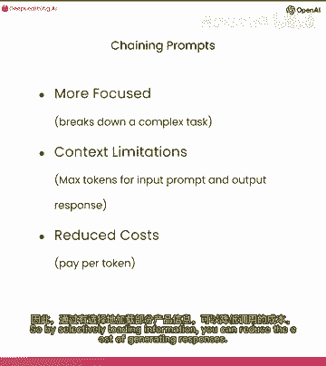

和，总的来说，确定何时动态加载信息到模型的上下文中，并允许模型决定何时需要更多信息，是增强这些模型能力的最佳方式之一。

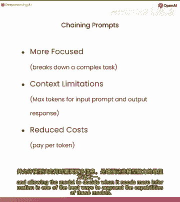

重申，你应该把语言模型看作是一个推理代理，需要必要上下文以得出有用结论和执行有用任务，所以在这种情况下，我们不得不给模型产品信息，然后它就能推理关于该产品信息以创建对用户有用的答案。

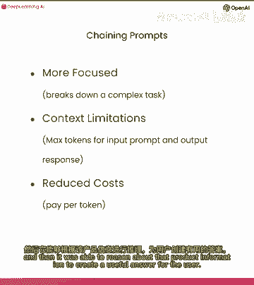

在这个例子中，我们只添加了一个调用特定函数或函数以获取产品描述的调用。

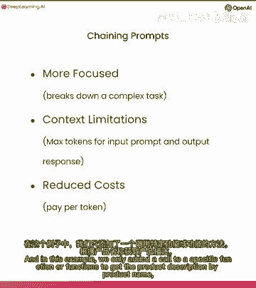

或按类别名称获取类别产品的调用，但实际上模型擅长决定何时使用各种不同的工具，并能在指导下正确使用它们，这就是chat gbt插件背后的想法，我们告诉模型它可以访问哪些工具以及它们的作用。

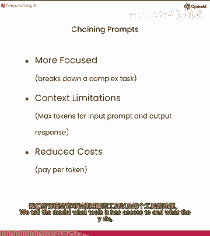

它选择在需要从特定来源获取信息时使用它们，或想采取其他适当行动。

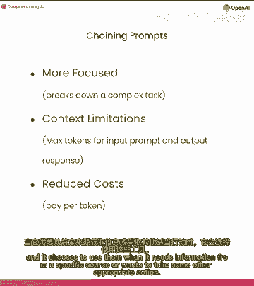

在我们的例子中，我们只能通过精确的产品和类别名称匹配来查找信息。

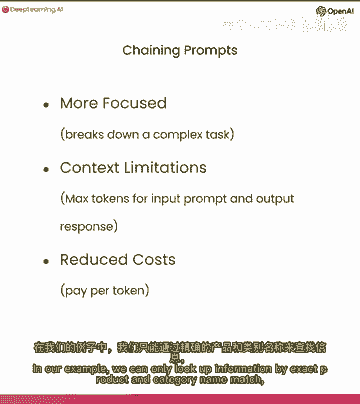

但也有更先进的信息检索技术。

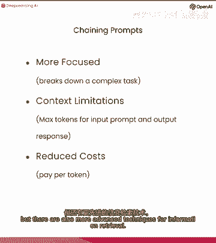

最有效的方式之一是使用文本嵌入，嵌入可以用于在大语料库中实现高效的知识检索。

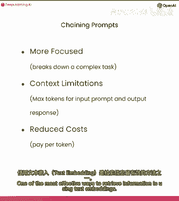

可以用于实现高效的知识检索，查找相关查询信息。

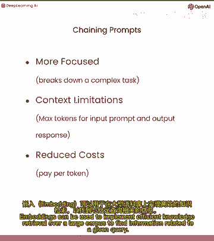

使用文本嵌入的关键优势之一是它们允许模糊，或语义搜索，允许您找到相关信息而无需使用确切关键词，因此在我们的示例中，我们不一定需要产品的确切名称，但我们可以进行更一般的搜索，使用更通用的查询，如手机。

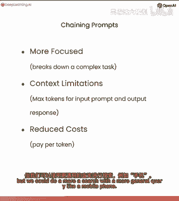

我们计划创建一个全面的课程，介绍如何使用嵌入式技术应用于各种应用程序。

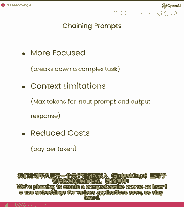

很快，所以请保持关注，就这样，让我们继续下一个视频。

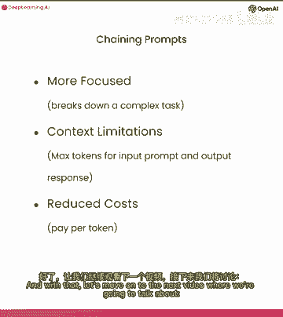