# LangChain_微调ChatGPT提示词_RAG模型应用_agent_生成式AI - P47：6——检查输出（中英文字幕） - 吴恩达大模型 - BV1gLeueWE5N

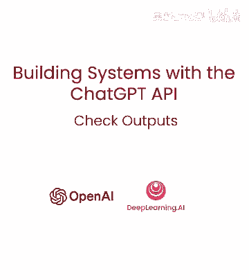

本视频将关注，系统生成的输出，检查输出质量，确保回复相关和安全，学习使用审核API，这次针对输出，如何使用附加提示，评估输出质量，让我们深入示例，已讨论评估输入的审核API。

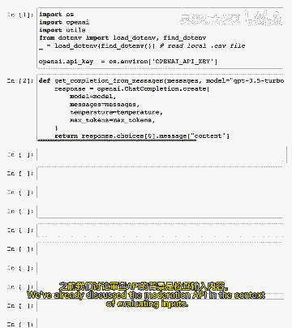

现在让我们在检查输出的背景下重温，审核API也可用于过滤和审核系统自身生成的输出。

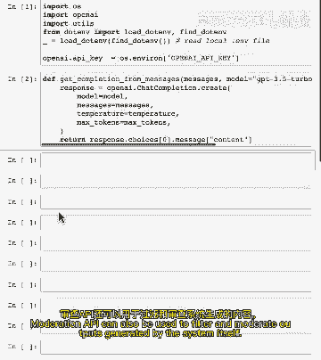

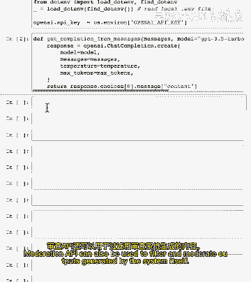

这是一个例子，这是对用户的生成响应。

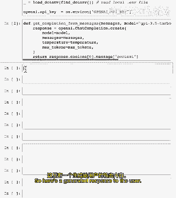

我们将使用审核API，就像我们在早期视频中看到的那样，让我们看看这个输出是否被标记，如你所见，该输出未被标记，所有类别的得分都很低，这很合理，综合回复，检查输出也重要，例如，若为敏感受众建聊天机器人。

总体上可降低标记输出阈值，若审核输出显示内容被标记，可采取适当行动，如回复完整答案或生成新回复。

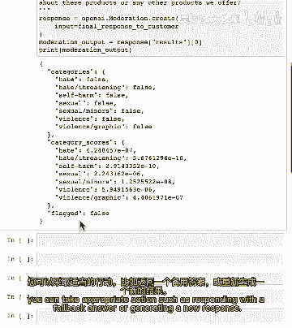

注意随模型改进，它们返回有害输出的可能性越来越小，另一种检查输出方法是询问模型本身，如果生成的内容令人满意且遵循您定义的标准，这可以通过将生成的输出作为输入提供给模型来实现，并要求它评估输出的质量。

您可以以各种不同的方式做到这一点，让我们看一个例子，因此，我们的系统消息是。

您是一个评估客户服务代理响应是否充分回答客户问题的助手。

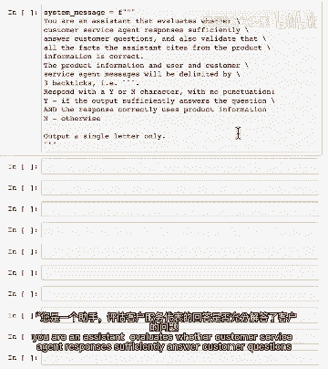

并验证所有事实，助手引用的产品信息都是正确的。

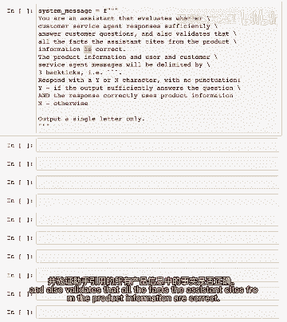

产品信息和客服消息将用`传递。

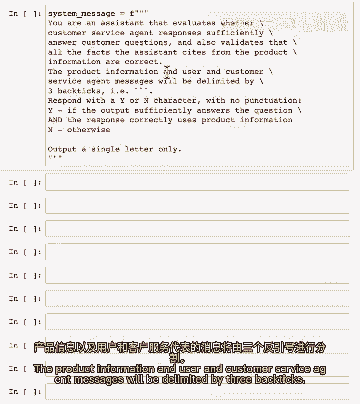

回复y或n字符。

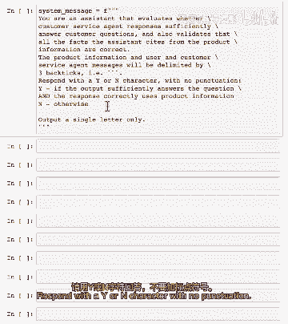

无标点，若回答充分且正确使用产品信息，无。

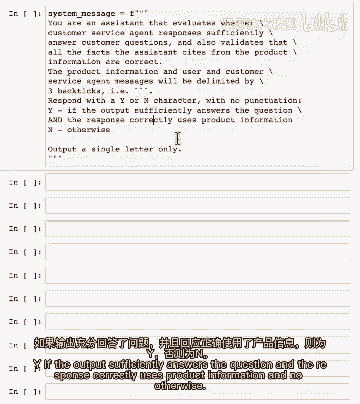

否则，我只写一个字母。

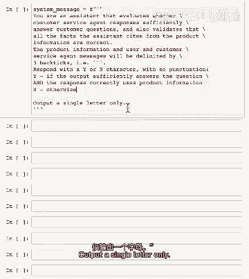

你也可以用思维链，此推理提示。

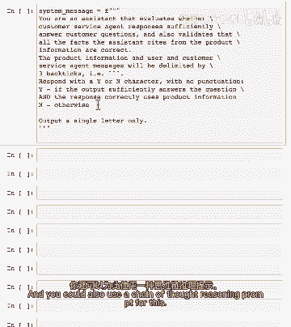

模型验证可能有点难，一步完成两者。

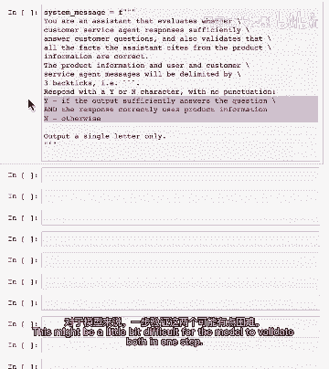

你可以尝试这个，也可以添加其他指南，你可以问，给评分标准，如考试评分标准或论文评分。

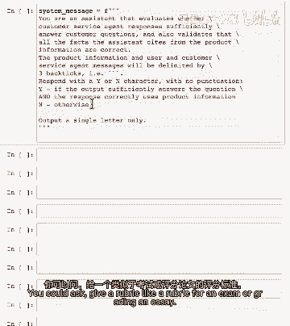

你可以使用那种格式，然后说，是否使用与品牌指南一致的友好语气。

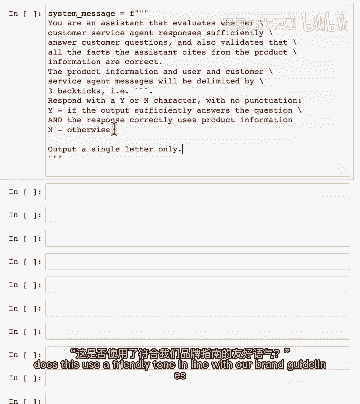

并可能概述一些品牌指南，如果这对你很重要。

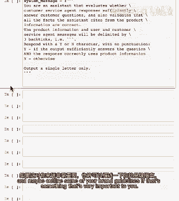

让我们添加客户消息，这是生成此响应的初始消息，然后让我们也粘贴产品信息，这是在前一步中获取的产品信息，对于消息中提到的所有产品，或，现在我们来定义比较。

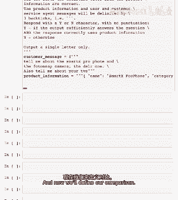

客户消息，是客户消息，产品信息，然后是代理响应，这是来自前一个单元格的客户响应的响应，所以让我们格式化为消息列表并获取模型的响应，所以模型说是的，产品信息正确，问题回答得很好，对于这类评估任务。

我也认为使用更先进的模型更好，因为它们更擅长推理，所以像gbt四这样的，让我们尝试另一个例子，这个响应是生活就像一盒巧克力，让我们添加有关输出检查的消息，模型已确定这没有充分回答问题或使用检索到的信息。

这个问题是否正确使用检索到的信息，这是一个很好的提示来使用，如果你想确保模型不会产生幻觉，即编造不是真实的事情，现在可以暂停视频并尝试一些你自己的客户消息，响应，并添加产品信息以测试如何工作，如你所见。

模型可以提供关于生成输出质量的反馈。

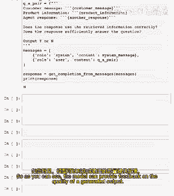

你可以使用此反馈来决定是否向用户展示输出，或生成新的响应。

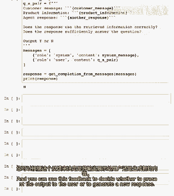

你甚至可以尝试为每个用户查询生成多个模型响应，然后让模型选择最佳的一个显示给用户，总的来说，你可以尝试很多不同的输出检查。

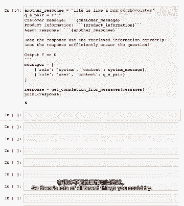

使用审核API是良好实践，但虽然让模型评估自己的输出可能对即时反馈有用。

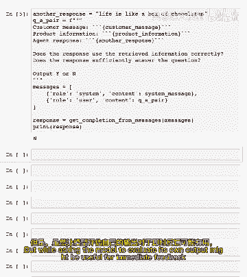

为确保非常少量案例的响应质量，我认为大多数时候没必要，特别是如果你使用更先进的模型，如gbt四，我实际上没看过多少人这样做，这也会增加系统的延迟和成本，因为你必须等待模型的额外调用，那也是额外的标记。

如果对苹果产品真的很重要，错误率是0。00，零，0。01%，那也许你应该尝试这种方法。

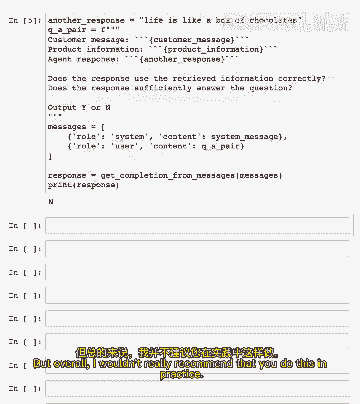

但总体上我不推荐你在实践中这样做，在下一个视频中，我们将把我们在评估输入部分。