# LangChain_微调ChatGPT提示词_RAG模型应用_agent_生成式AI - P57：6：构建与大语言模型交互的聊天应用 - 吴恩达大模型 - BV1gLeueWE5N

最后一课建聊天App，开源Llm falcon四B，最佳开源模型之一，我很兴奋，希望你也一样，最后一课建开源聊天App。

Llm，可能已与ChatGPT聊过，运行成本高且僵化，定制Llm可本地运行，在您数据上微调或云上更便宜，本课将使用推理端点，运行Falcon进行Beinstruct，最佳开源大型语言模型之一。

本地使用文本生成推理库容易运行。

当然，您也可以使用Gradient创建仅基于API的接口。

LLM，不仅是开源，您还可以使用Radio构建，为ChiPT或Claude构建UI。

本课程将聚焦开源。

Lm falcon for tb，设置令牌和辅助函数。

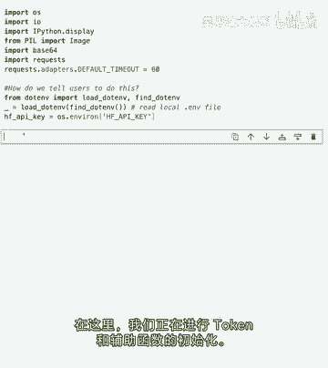

使用不同库，使用文本生成库。

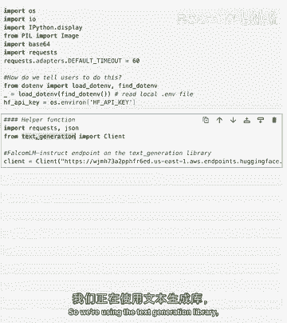

处理开源lllamp的精简库，可加载API，如我们正在做的，也可运行本地lln，询问模型马特发明或发现，这是模型的完成，我们要求最多256个标记，有时答案更简洁，可能少于最大标记，他回答了我们的问题。

很好，但我们可能不想只和LLM聊天，通过更新输入变量，这不是聊天，对吧，不能问后续问题，如果只改这里输入，回到第2课，我们有一个简单的无线电接口，带有文本框输入和输出。

所以这里我们将与我们的llm聊天时使用非常相似的东西，让我们再次复制，我们的提示，在这里我们可以决定多少个令牌，可能让我们少一点，所以我们就测试一下，你可以看到它在中间切断了答案。

因为我们要求它只有二十个令牌，但我可以改变，那很酷，这是一种很容易在llm中质疑的方式。

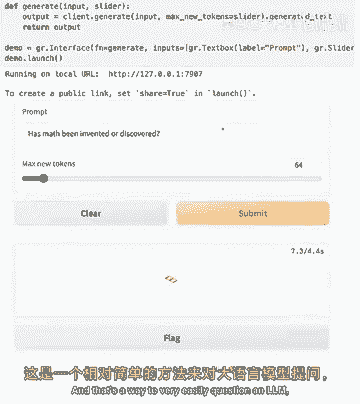

但我们还没有聊天，因为再次，如果你问后续问题，它将无法理解或保持此上下文，所以如果我会，如果我要问，为什么它不知道，我刚说了它不知道我们刚谈了什么。

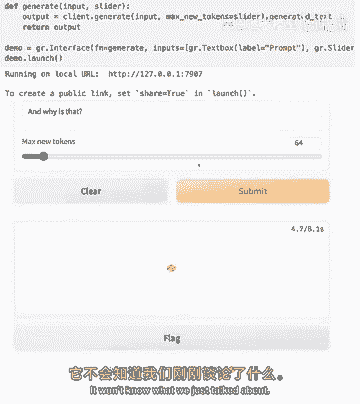

所以你会看到它实际上对此抱怨，它说没有额外上下文我无法提供响应，我们无法继续问后续问题的原因，是因为模型没有记忆，模型不知道我们刚给它发送了一个问题，然后我们现在在问后续问题。

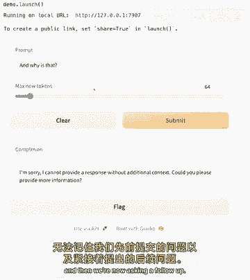

所以为了构建对话，我们必须始终向模型发送。

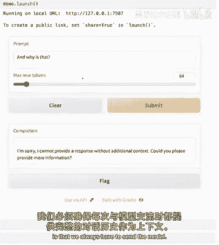

我们对话的上下文，所以基本上我们必须做的是我们必须向模型发送我们的先前问题，它自己的答案，然后是后续问题，但构建所有这一切会有点麻烦，这就是梯度聊天机器人组件的作用，因为它允许我们简化向模型发送。

对话历史的过程，所以我们实际上想修复那个，为此我们将引入一个新的梯度组件。

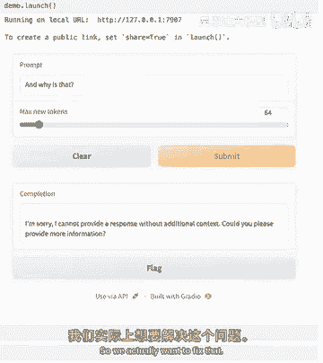

那就是梯度聊天机器人。

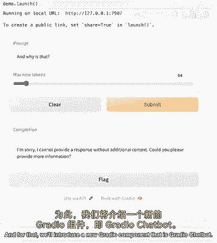

所以让我们开始使用无线电聊天机器人组件。

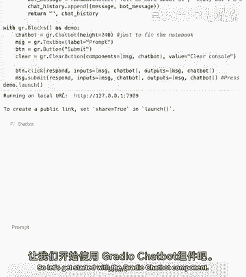

我实例化了一个带有文本框提示和提交按钮的gradichatbot组件。

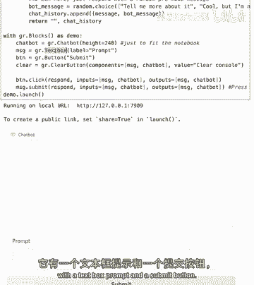

一个非常简单的，Ui 这里让我们说你好。

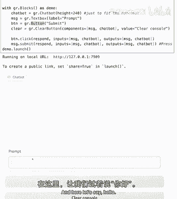

酷 你可以看到它回复了一些酷的东西。

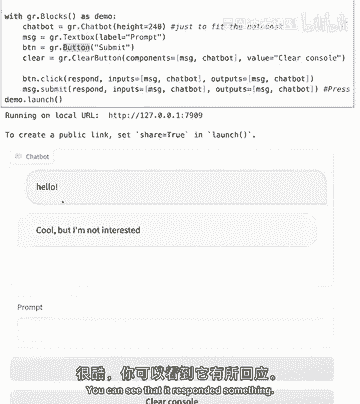

但我们还没有和llm聊天，我刚刚选择了三个随机的预设响应，并将它们附加到聊天历史中，我的消息和机器人消息，所以这里你可以看到我可以说任何话，它基本上会随机循环这三种响应。

但这里我想向你展示无线电聊天机器人功能的工作原理，所以现在让我们将其与我们的llm连接起来，所以这里我们有相同的ui。

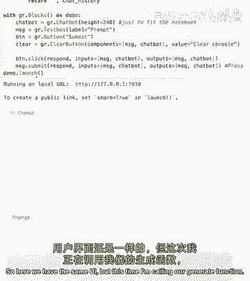

但这次我正在调用我们的generate函数并发送用户发送的消息，所以现在，如果我们问生命的意义是什么。

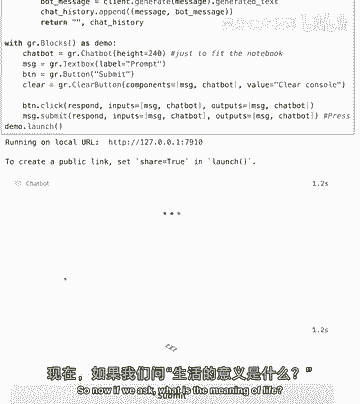

嗯，模型不想回顾它的秘密，但没关系 让我们问问概念，为什么这样，哦不，我们遇到了同样的问题，模型仍无先前对话的上下文，这里发生了什么，我们可以看到我给模型发送了，用户发送的消息。

所以在这里我们可以看到在提示中，我将它发送给模型和输入作为消息，基本上我们犯了和之前一样的错误，我在发送模型，仅用户发送的消息，未发送整个上下文，我们如何修复这个问题，要修复它，我们必须格式化聊天提示。

我定义了这个格式，聊天提示函数，所以这里我们想做的就是我们要格式化我们的提示，以包含聊天历史，这样LLM就知道上下文，但这还不够，我们仍需告诉它哪些消息来自用户，哪些消息来自自己。

我们正在调用的LM本身，助手，因此我们设置了我们的格式检查提示函数，在聊天历史的每一轮中，它包含一个用户和一个助手消息，以精确启用我们的模型回答后续问题，现在我们将格式化的提示传递给我们的API，所以。

这样做，这里只是为了让我们可以看到这个格式化的提示看起来如何，我也把它打印在屏幕上，所以我们的聊天机器人应该能够回答。

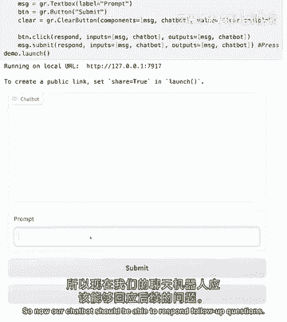

后续问题，所以如果我们问它，生命的意义是什么。

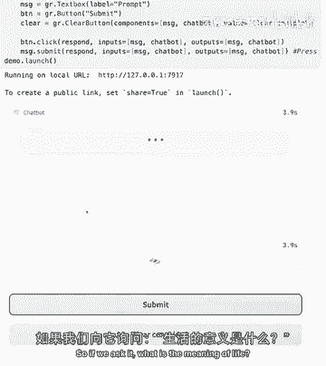

它给了我们一个答案，这不是我想要答案，但没关系，但我可以问后续问题，但为什么，酷。

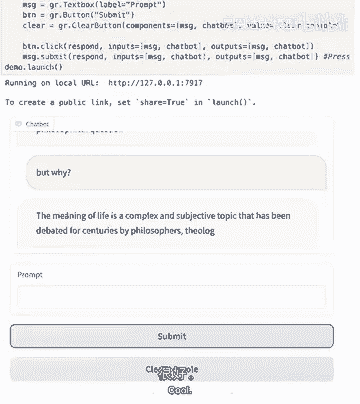

所以我们可以看到我们发送给它一个上下文，所以我们发送了我们的消息，然后要求它完成，一旦我们进入另一个迭代循环，我们发送给它我们整个上下文，然后要求它完成那个学校，但如果我们像这样永远继续下去。

在某个时刻。

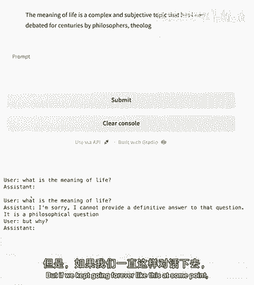

所以它会达到模型在一次对话中可以接受的限制。

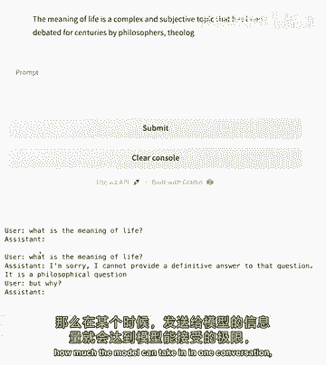

因为我们总是给它越来越多的先前对话，为充分利用模型，可设最大新标记为124，这是硬件允许的最大值，允许进行带几个后续问题的对话，但内容窗口会加载，现在有1024标记的对话。

开始关于生活在草原的动物的对话。

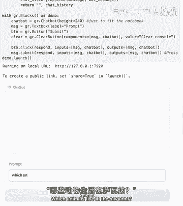

库奥，最强的是哪种动物，它继续并模仿我们，它以用户身份提问，自己作为助手回答，这也许很酷，但不是我们想要的，为防止此类情况，可添加停止序列，停止序列确保新行用户，即指示来自我们的消息。

而非模型试图生成时停止，模型将停止，这样可确保模型在此例中停止，草原上最强动物是什么，是大象，若想问后续问题，如为何大象，是草原上的强动物，或其他我们选择的后续问题。

关键是后续问题应来自用户而非助手AI，我们构建了一个简单但强大的与AI聊天UI。

若要获取Gracan的最佳表现，可构建包含更多功能的UI。

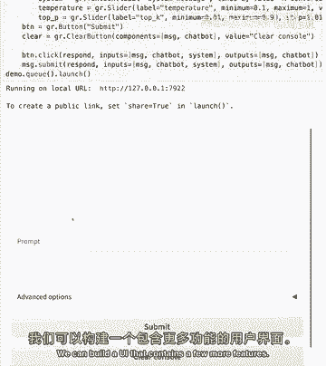

这里有高级选项，包括可发送模式到AI的系统消息，在系统消息中可以说，例如你是一个有帮助的助手，或可给它特定语气，特定语调，你想让它更幽默，更严肃，实际上可以玩系统消息。

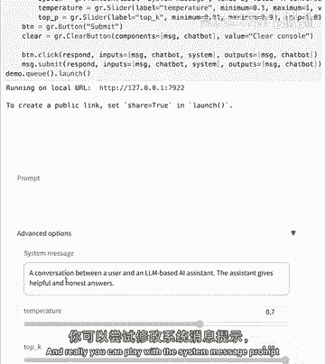

提示并看其如何影响消息，有些人可能想给AI一个角色。

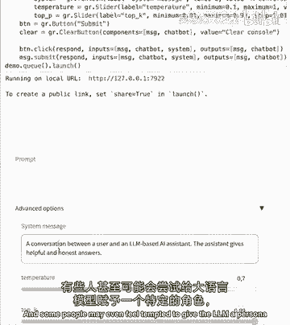

如你是一名提供法律建议的律师，或是一名提供医疗建议的医生，但请注意AI可能提供事实错误信息，听起来真实的方式，所以尽管在Falcon for TB上实验探索很有趣，在现实场景中。

对于此类用例还需采取进一步的安全措施。

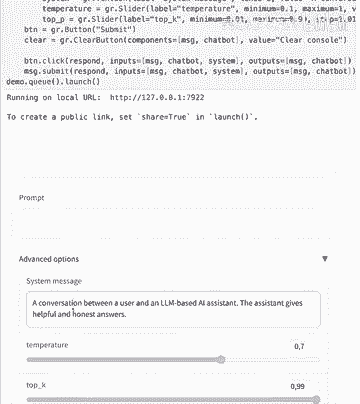

和其他高级参数如温度，温度本质上是你想要模型有多少变化。

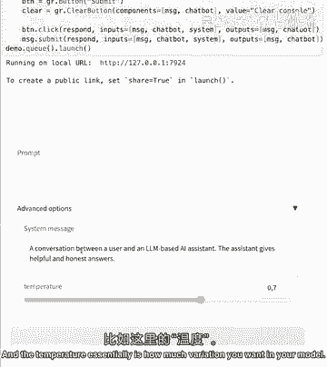

若将温度设为0，模型倾向于对相同输入给出相同回复。

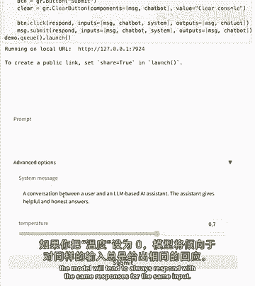

所以相同的问题，相同的答案，温度越高，消息的变化就越大，但如果温度太高，可能会开始给出无意义的答案。

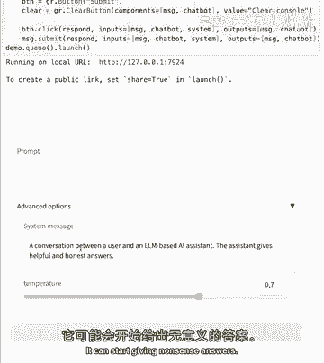

所以0。7是一个不错的默认参数，但我们鼓励你尝试一下。

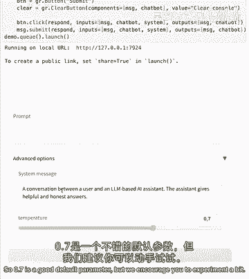

此外，UI让我们做了一件很酷的事。

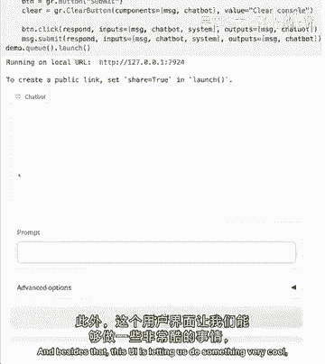

即流式响应，如果我在这里问，亚马逊有哪些动物。

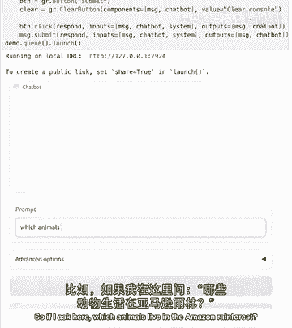

热带雨林。

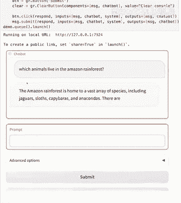

所以你可以看到我们的模型流式回答了，它是逐个发送标记的，我们可以实时完全看到它，我们不需要等到整个答案准备好，这里我们可以看到它是如何做到的，别担心，如果你不明白这里面的所有内容。

因为这里的想法是用一个非常完整的UI结束课程，包含LLM方面所有可能的东西，所以在这个格式化聊天提示中，这是我们之前添加新元素之前的那个函数，即系统指令，所以在开始有那个用户助手对话之前。

我们有一个系统在上面，它有指令，所以基本上在发送给模型的每条消息的开始时，它将会有我们设置的系统消息，这里我们正在调用文本生成库的生成流函数，生成字符串函数的作用是逐个标记生成响应，所以在这个循环中。

正在发生的是它逐个标记生成响应，它将添加到聊天历史中，并返回给函数，这里我们只有一个带有可折叠面板的渐变块，用于高级选项，就像我们之前学过的，有一个提交按钮和一个清除按钮，在我走之前，我想建议你玩一玩。

如果你想改变，也许UI，也许你想重新排列东西。

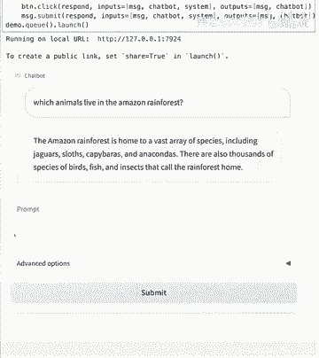

现在你知道如何使用列和行构建渐变块，在这个演示中，我鼓励你改变系统消息，也许你可以让它用外语回答，它能说法语吗，我不知道，也许我们可以要求它用法语回答，或者，既然我们谈论动物和森林。

也许你可以要求它解释，仿佛是生物学家，会增加吗？信息的具体性，会告诉你动物学名吗？我不知道。