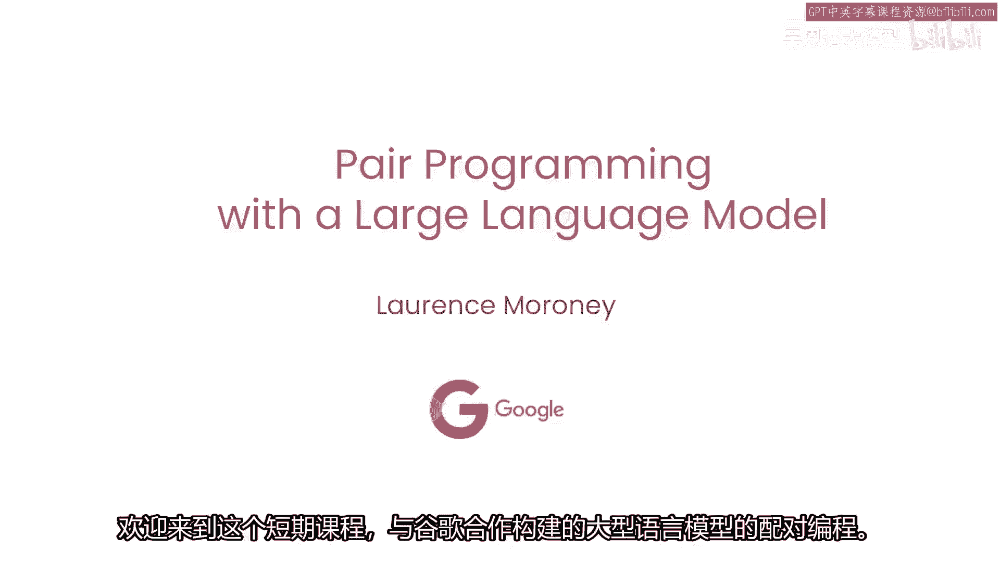
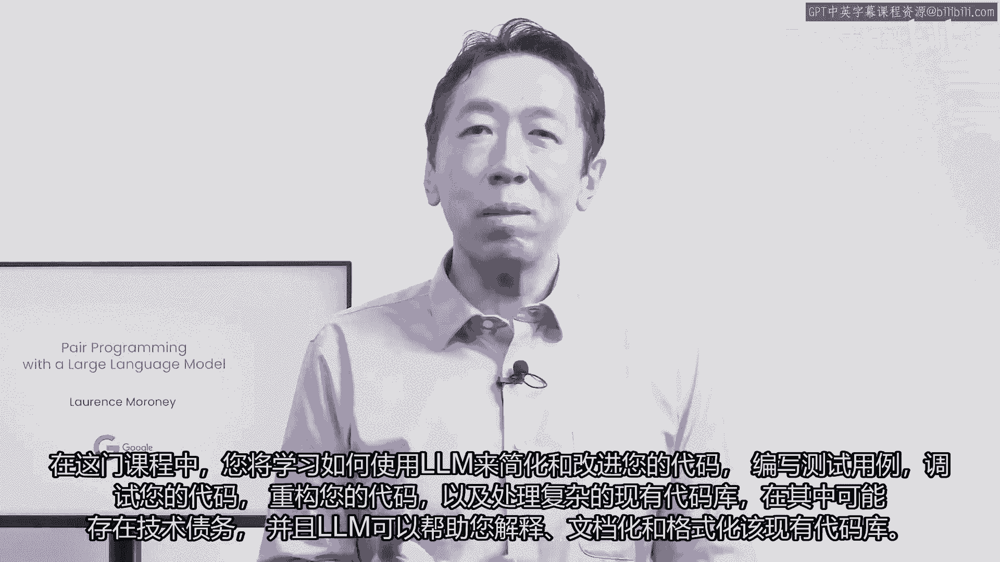
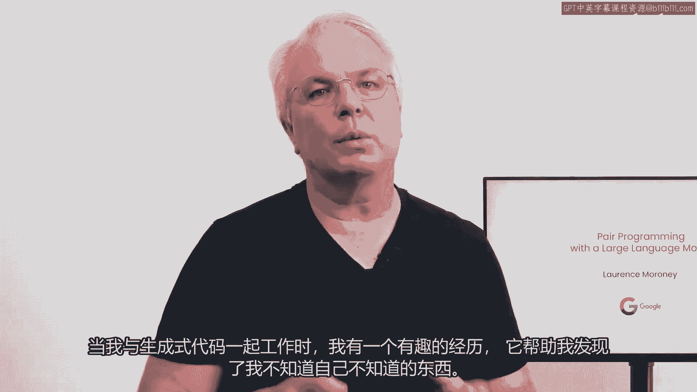
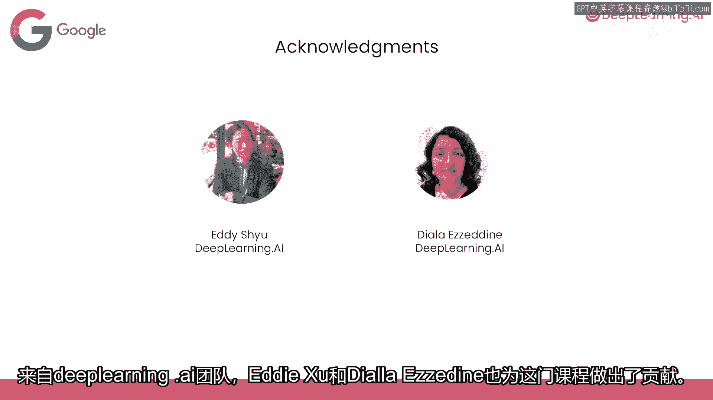
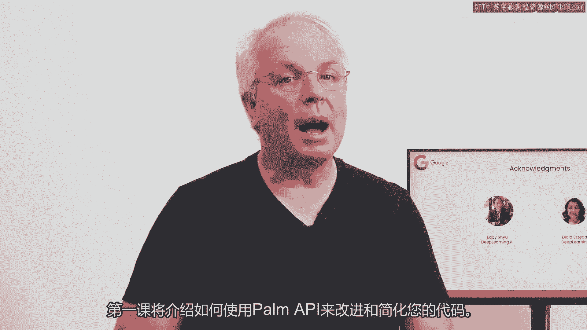

# LangChain_微调ChatGPT提示词_RAG模型应用_agent_生成式AI - P58：《使用大型语言模型进行配对编程》 1.SC-Laurence_Intro_v02.zh - 吴恩达大模型 - BV1gLeueWE5N

欢迎参加这门课程，与谷歌合作构建的大型语言模型配对编程，LMS正在改变，我们如何编写代码，当我为翻译深度学习AI内容的基于LM的翻译软件原型时，我不得不使用一些不熟悉的Python库，而不是阅读文档。

我有一个LM，尝试编写代码的第一稿，然后我修复它，经验丰富的开发人员正在以许多方式使用LMS来加快我们的工作，在这门课程中，您将了解这些新兴最佳实践，包括如何让LM帮助您处理错误，性能改进，还有很多。

我很高兴这门课程的讲师是我老朋友劳伦斯·莫罗尼，他是谷歌AI的首席倡导者，非常感谢安德鲁，我也非常兴奋能与您和您的团队合作，在这门课程中，您将学习如何使用LM简化并改进您的代码，编写测试用例。

调试您的代码并重构您的代码，与复杂的现有代码库合作，其中可能存在技术债务，LM可以帮助您解释。

文档和格式化现有代码库 劳伦斯将通过这些概念，使用Palm API，我自己也用过，所以我相信您也会喜欢玩它的，这就是我对生成式AI和大型语言模型的兴奋之处，如果我们只把它们看作是创造从零开始的东西。

比如代码，我们实际上错过了它们可以带来的许多价值，希望我们今天讨论的一些例子，激发您自己的编码之旅，并帮助您成为一名更高效的软件工程师，当我与生成代码合作时，有一次很有趣的经历。

它帮助我发现了一些我不知道的，我不知道来自深度学习AI团队的事情，艾迪·舒和迪亚拉·阿齐内也参与了这门课程。

第一课将是如何开始使用，使用Palm API改进和简化您的代码。

听起来不错。