# LangChain_微调ChatGPT提示词_RAG模型应用_agent_生成式AI - P59：2.SC-Laurence_L1_v05.zh - 吴恩达大模型 - BV1gLeueWE5N

本课程第一课，将了解如何。

现在开始使用Palm API进行代码生成，当然，要能做任何事情。

需要一些必要的设置，我会指导你，Palm API及其相关工具在Google，生成式AI网站持续更新，包括Maker Suite，一种快速、简单的方式让你使用生成式AI提示原型，以及Vertex AI。

提供可扩展性和企业级。

隐私安全，以及更多，本课程重点将放在Palm API上，通过编码接口访问谷歌的大型语言模型，你将在这门课程中亲手编写使用此API的代码，所以让我们深入看看你需要什么，如你所见，清单相当简单。

首先，你需要一个API密钥，在实际操作中，你会从我之前展示的网站上获得，Developers。Generative AI。Google，为了这门课程，你实际上不需要担心，我们已经为你制作了一个。

但这是你需要记住的事情，接下来，你需要谷歌的生成式AI库，在拍摄时，它们可在Node。js、Swift和Python中使用，以及带有curl接口，但在这门课程中我将使用Python。

并会展示如何进行pip安装，当然，不用说，你可能需要一些Python技能，如果没有，可以查看，Learnpython。org，如果你有点迷失，但大部分我所做的是相当基础的。

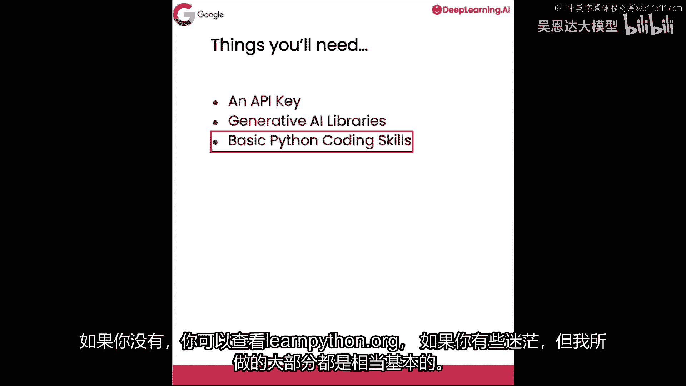

Palm有很多，包括许多不同目的的后端模型，探索它们和它们的命名很有趣，特别是你将看到很多动物名称，一般来说，动物越大，模型越大。

首先让我们看看如何获取你的API密钥，我们为你提供了一个，但你需要一个工具来获取它，这里有一个辅助函数，我将获取API密钥以获取辅助函数，现在下一个单元格，我将导入谷歌的生成AI库。

我们将称它们为palm，然后使用API密钥配置它，好的，所以现在我已经完成了这些，我将运行这个单元格，好的，我已导入密钥，如我之前所提，我正在导入谷歌退化AI，我将称之为palm和palms。

配置传递API密钥参数为API密钥的结果，好的，所以现在我们可以使用这些了，如果你要在没有后端系统的自己的系统中做这件事，您将需要pip安装谷歌生成AI的东西和pip安装，正如你所知，它就像那样工作。

如果你想安静地做，谷歌生成AI，它就像那样工作，所以接下来我将探索其中的一些模型，我将做一个列表for m n palm dot lists models，这是palm API中的一个函数，允许你。

顾名思义，列出所有模型，而不是让你看着我输入所有内容，我将粘贴接下来会发生的事情，然后我们将只打印名称，描述和支持的方法，所以让我们运行这个单元格看看我们得到什么，好的。

我们看到我们正在获取聊天野牛文本，野牛和嵌入，壁虎，猜猜哪个是大型模型，猜猜哪个是小型的，所以我们可以看到有两个野牛，还有一个壁虎，但今天我们要做的是生成文本，我们将看到聊天野牛支持生成消息。

但文本野牛支持生成文本，这真的很棒，我们知道我们将使用这个模型，但你可以在这里使用另一个函数是。

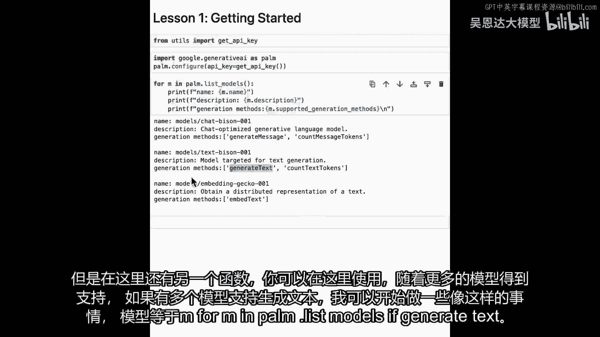

随着更多模型的支持，如果有模型，例如，如果有多个模型支持生成文本，我可以开始做一些像models等于m for m in palm dot list models，如果生成，Oops生成文本。

所以我在此说的是，如果生成的文本实际在支持的方法中，对，我们在m。supported_generation看到生成方法，方法，然后我将只是打印，好的，或仅显示那些模型，然后如果我运行这个。

现在我们可以看到更多关于这个模型的细节，Text Bison是唯一实际支持它的，这仅是一些你可以开始使用Palm API来理解正在发生的事情的方式，随着API的增长，和支持的模型增长。

您可能会在这里获得不同的结果，您可能能够尝试不同的模型并玩得更有趣，正如我们所见，我们有大约三个模型最终被列出，有Chat Bison 001，Text Bison 001。

和Embedding Gecko 001，所以你可以想象Gecko会更小，我提到它是基于动物大小，随着你长时间使用，您可能会在这里看到更多被添加，现在你可能会听到很多的问题是。

Chat Bison和Text Bison的区别是什么，Chat Bison背后的目标，是它更优化于聊天场景，它会跟踪上下文，所以你会问它一些东西，它会给出一个答案，你可能会跟进，它会给出另一个答案。

而你可能会再次跟进，而Text Bison则更优化于单次射击，你会给它一个提示，你会得到一个答案，然后你会继续，我们今天将使用那个，因为你知道那个通常对代码工作得更好。

所以现在我们只有一个模型支持生成文本，所以我将只创建一个指向它的变量，我将称之为model_bison，当然，它是我们模型列表中的第一个，对，所以如果我只想输出mobison，只是为了确保我得到正确的。

我运行这段代码，我们看到我得到了相同的输出，现在我们有模型了，让我们创建另一个辅助函数，这个辅助函数将生成文本，这样我们就不必重复写相同的代码，避免重复总是好的，避免重复总是好的，避免重复总是好的。

从google。api_core导入retry开始。

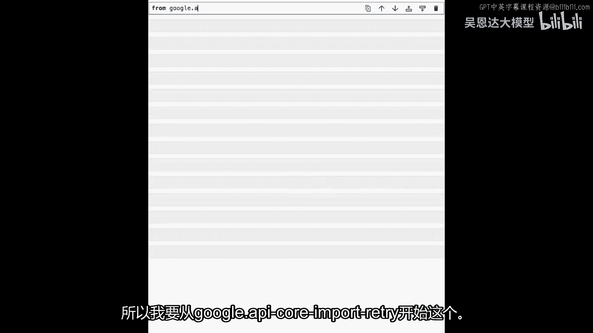

retry库的作用，当你做后端时，比如我们正在做的与llm数据库的交互，有时事情可能会不同步，有时你的调用，可能会在某个地方丢失，而不是你写一堆代码，来重试并不断重试。

这个可以用一个非常简单的装饰器完成，像这样retry retry。

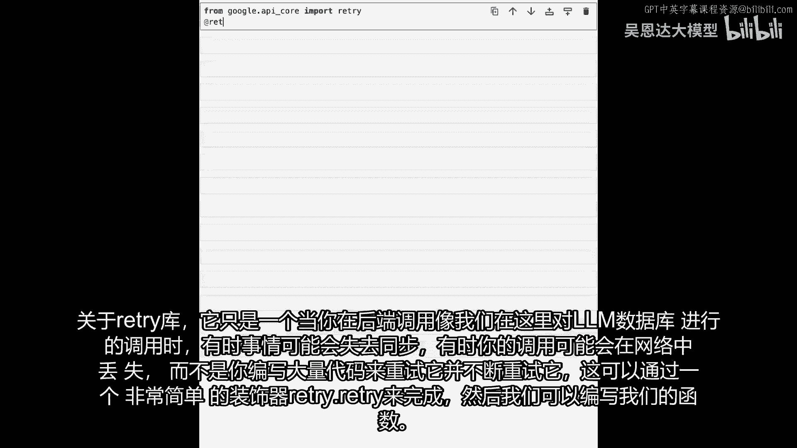

然后我们可以编写我们的函数，我们的函数将被称为生成文本，生成文本将接受，我的提示和我想使用的模型，我们已经创建了一些我们称之为model bison的东西，然后我将使用一个温度，模型的默认温度是0。7。

但使用0。0的温度，它将是一个更确定的模型，所以无论提示是什么，从提示中得到的任何结果，你应该看到相同的，当然，如果你使用的是较晚的版本甚至较晚的模型，它可能会有所不同，一旦我们完成了这一点。

现在我们只想返回，Palm将给我们什么，所以palm。generate_text并传递相同的东西，所以提示等于提示模型等于模型，温度等于温度，这帮助我们有一个很好的辅助函数贯穿我们的代码。

这样我们就不必不断重新发明轮子了，让我运行这个单元格，确保一切都好，看起来不错，现在我们已经创建了生成文本函数，这个辅助函数你将要做，我想简要地谈谈并简要地展示一些幻灯片关于如何。

你将能够使用提示来生成代码，使用这个生成文本函数，这个辅助函数。

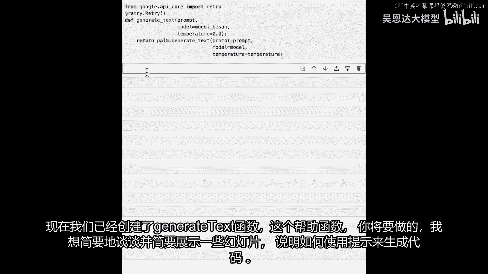

我将简要地谈谈并展示一些幻灯片，现在开始编写代码，使用Palm API，我喜欢这个模式。

所有示例将遵循，在这门短课中。

流程如下：首先创建提示，从简单的静态字符串开始，稍后展示如何模板化以增强，包含发送给LLM的基本命令，以指导它，为我们生成输出，然后使用刚创建的生成文本函数，和选定的模型获取完成，注意。

通常使用llms时，模型输出的文本是预测的，下一组标记将是，所以，当你输入一个问题，下一组标记通常是答案，因此它完成了你开始的引号字符串，这就产生了术语补全，与答案相对，或其他稍不精确的东西，当然。

最后输出补全结果。

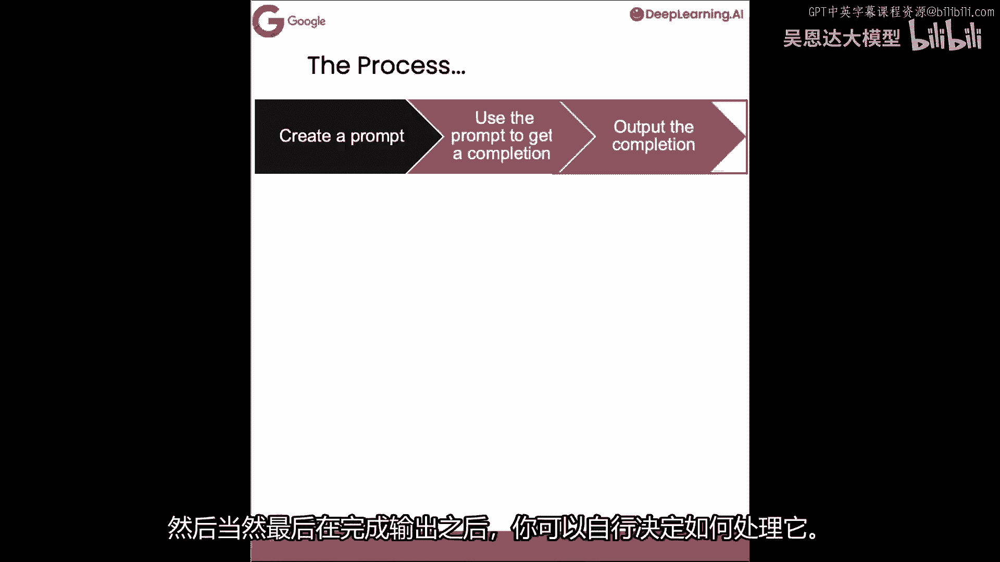

如何做取决于你，在本课程中，我们将在jupyter笔记本中打印出来，但在实际应用中，你可能正在向IDE注入代码，保存到仓库中。

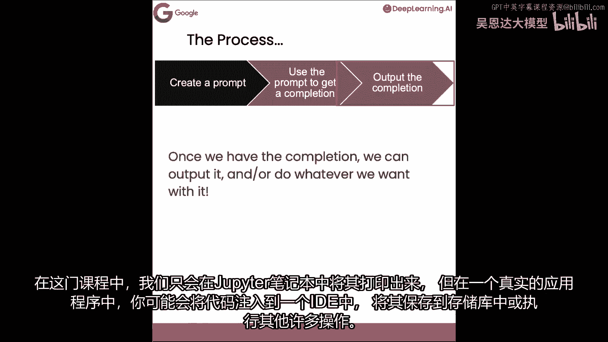

或其他许多事情，让我们探索这些步骤的代码，以使用palm进行基本的代码生成。

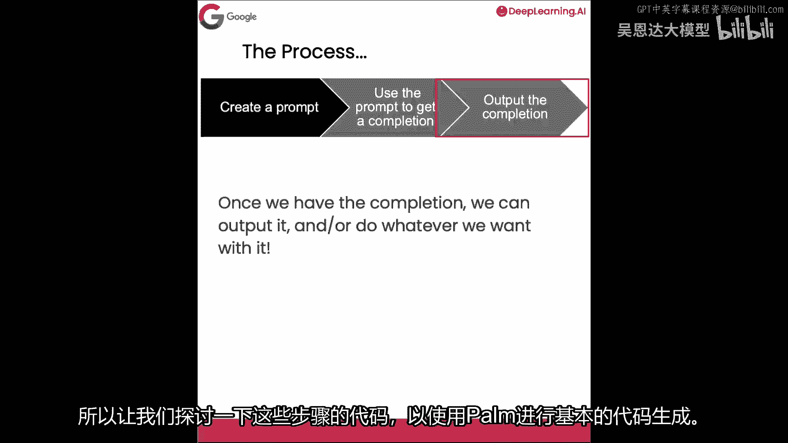

现在我们完成了这个，让我们做一些非常基本的代码生成，我将给它一个非常简单的提示，提示等于m，如何遍历列表？在Python中交叉列表听起来像一首歌，不是吗？那将是我的提示，砰！这里假设了很多，对吧。

因为它假设有一个列表，它假设它在Python中完成，假设有这么多事，你知道这看起来会怎样，让我们看看，所以，若我说完成=生成文本并传递该提示，你认为会发生什么，好吧，让我运行一下，它将需要一点时间。

因为它正在实例化API，正在调用后端，后端正在生成内容，一切就绪，如果不是看录像，而是在自己的笔记本上做，笔记本旁边会有一颗星，当星变成单元格编号，就可以继续，然后可以打印完成结果和鼓声。

将看到这样的结果，它在Python中让我们遍历列表，你可以使用for循环，语法像这样，比如你有列表abc，你的for循环for item in my_list，print item将输出abc。

但这也非常有用的一点是，它还能找到其他方法，例如，有enumerate函数，你可以看到，enumerate函数正在处理列表，抱歉屏幕裁剪，但看代码，将明白如何为你工作。

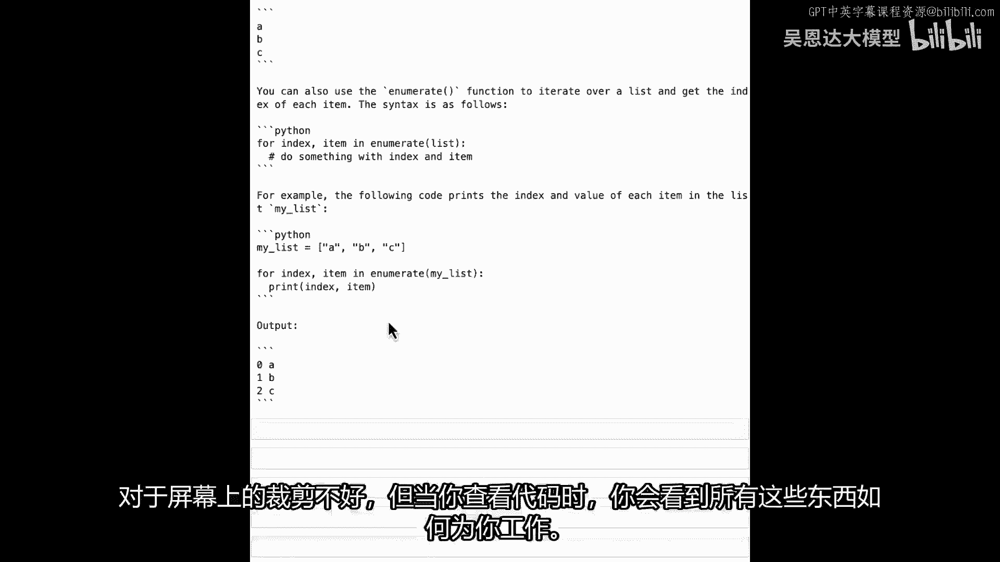

再次，非常简单的，基础代码生成，但不止创建代码，因我要求遍历列表，所以给出代码，并解释，它不仅给我代码，还展示给我，这是第一部分，这是非常基础的代码生成，如我所展示。

我让它展示如何在Python中遍历列表，我们得到了很多额外的东西，当然，典型的代码生成可能只是类似于，编写遍历Python列表的代码，然后运行，然后让我，我要偷懒，我就要复制这些嘟嘟嘟。

我的完成是生成文本，然后打印完成结果，让我们看看现在给我什么，你可以看到它只给了我代码，我有注释，我有注释创建列表，苹果，香蕉樱桃，然后它将逐项打印列表项，它只给了我一种方法迭代，使用for循环。

有时这就是你提示和思考如何表达的方式，你的大型语言模型将接受你问的，非常字面的问题，你知道，如果你要求它写代码，它会写代码，如果它问你，如果你要求它展示如何做某事，你可能会得到一些更有价值的东西。

就像我们在这里做的，它给了我各种选项去做并解释给我听。

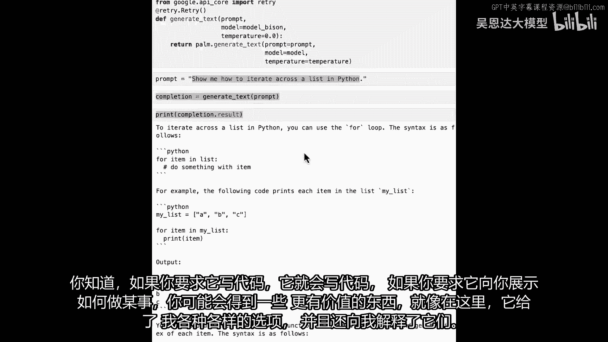

所以为了好玩，我们也可以拿一些它输出的代码，例如这里，这是Python，给我一个列表abc并遍历它，我们可以把它粘贴到一个单元格中。

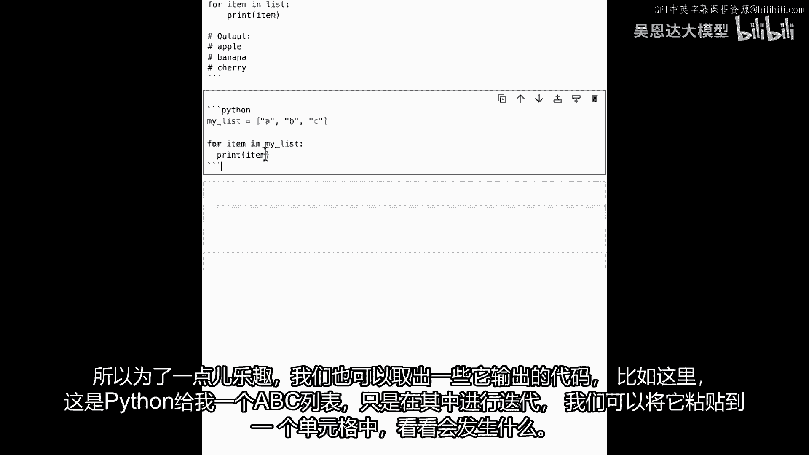

看看会发生什么 砰，它给了我一个错误，因为我，我用反引号引入了这些东西。

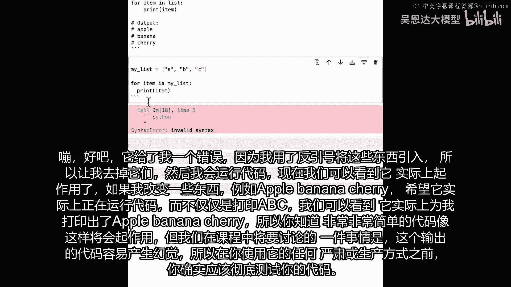

所以让我去掉那些，然后我将运行代码，现在我们可以看到它实际上已经工作了。

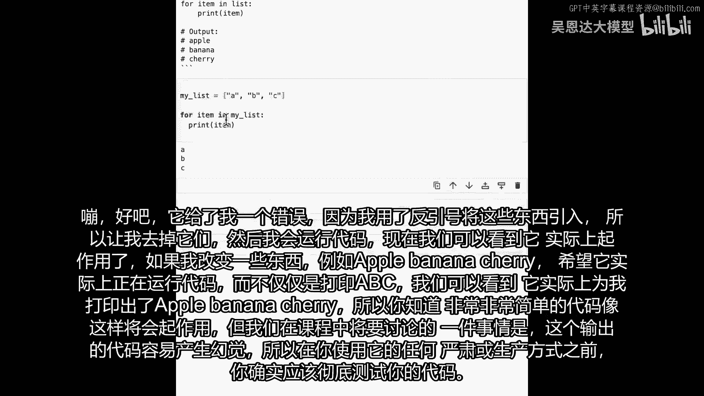

如果我改变一些东西，例如苹果，香蕉，樱桃，希望，它实际上正在运行代码，而不仅仅是打印abc，我们可以看到它实际上打印出苹果香蕉，樱桃给我，所以你知道，像这样非常简单的代码将会工作。

但在课程中我们将讨论很多的一件事，是输出代码容易产生幻觉，所以你真的真的应该彻底测试你的代码，然后再以任何方式使用它。

比如生产或任何类似的东西，现在轮到你了，也许你可以尝试一些。

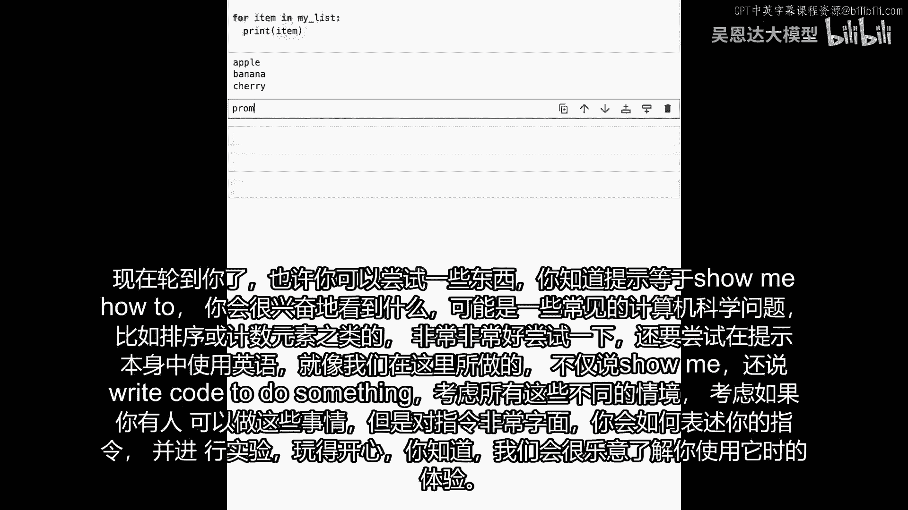

你知道，提示等于展示给我如何，你想看到什么。

会是一些常见的计算机科学问题，如排序或计数元素，或任何类似的东西，和它真正真正地玩是很好的，也要尝试英语语言在提示本身中，如我们所做，不是这样说，给我看，也在说写代码做某事，考虑所有不同情况，想想你。

如果你有能做这些事的人，但是，在那些指令中非常字面化，你会如何用这些指令与他们交流并尝试，玩得开心，并想了解你使用它的经历。

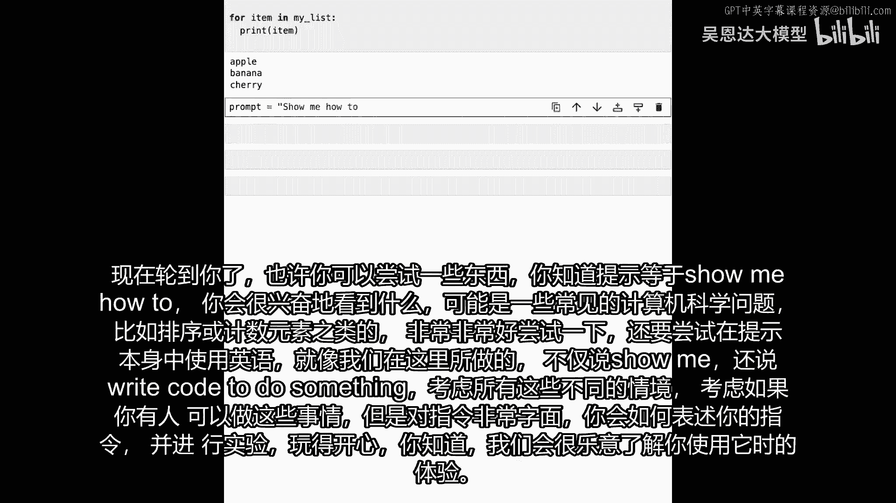

所以在你尝试过之后，并想出了一些有趣的代码之类的东西，看看你做了什么会很有趣，我们很想得到你的反馈，在下节课，我们要看的是如何，让这提示更有效率。

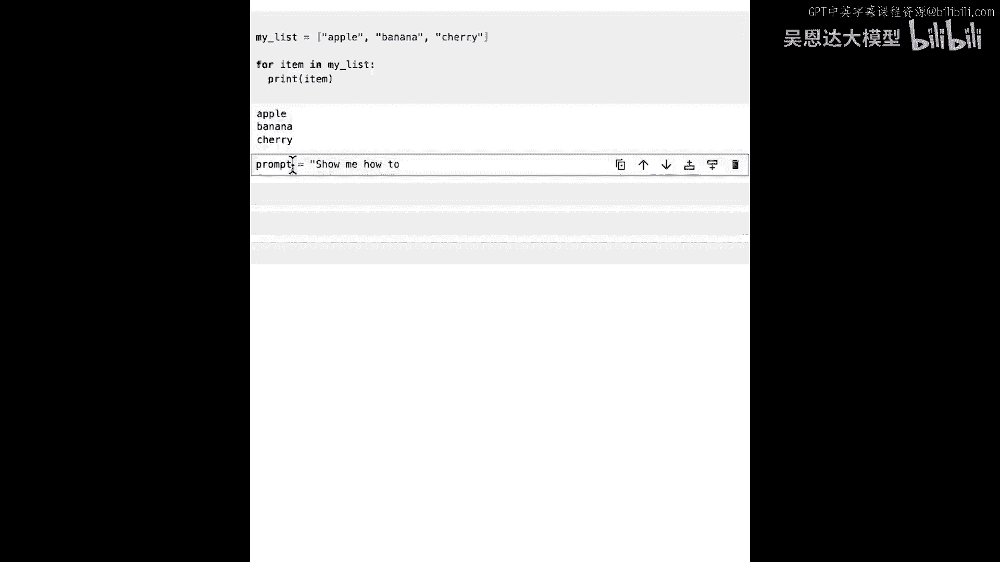