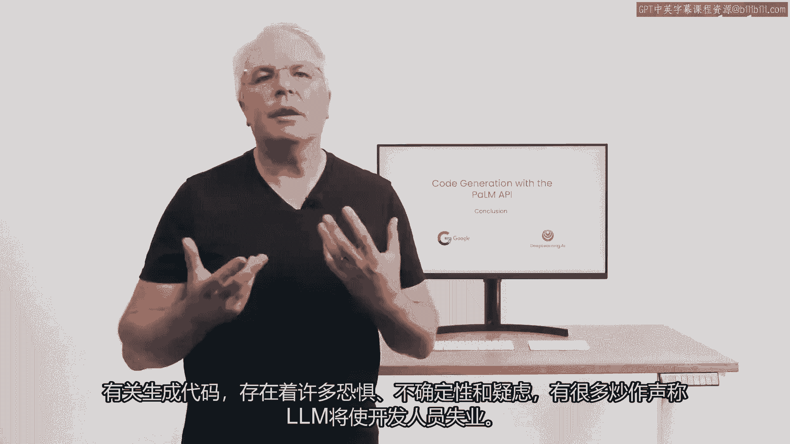

# LangChain_微调ChatGPT提示词_RAG模型应用_agent_生成式AI - P63：6.SC-Laurence_Conclusion_v01.zh - 吴恩达大模型 - BV1gLeueWE5N

有很多恐惧，当涉及到生成代码时，存在不确定性和怀疑，而且有很多炒作说llms会使开发者失业。

我个人反对这种观点。

我想指出，llms可以对开发者有很大的帮助，使你在这个课程中更有效率。

我将介绍一些你可以使用llms的方式，这些方式超过了简单的代码生成。

并且可以帮助你成为更好的软件工程师。

