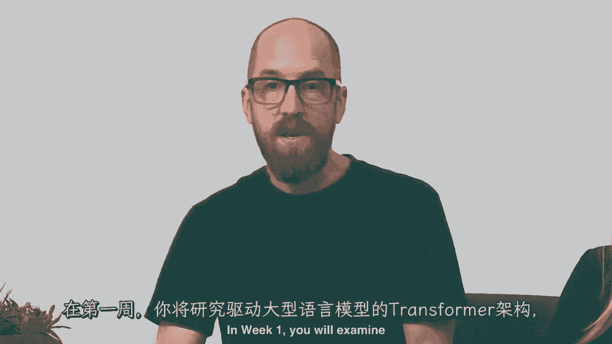
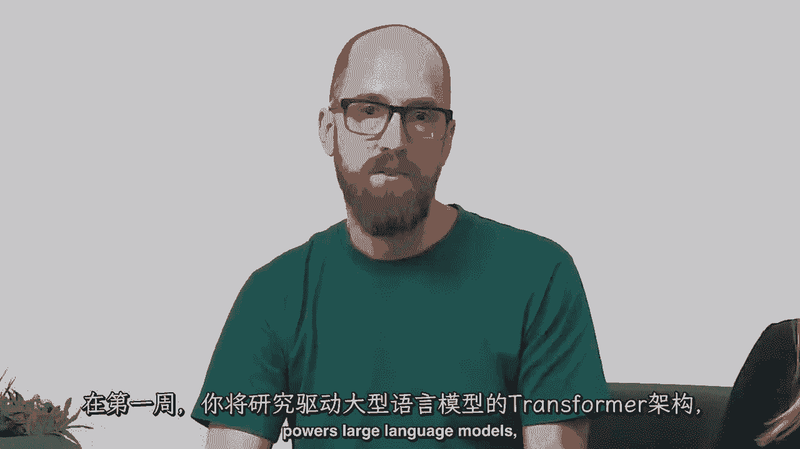
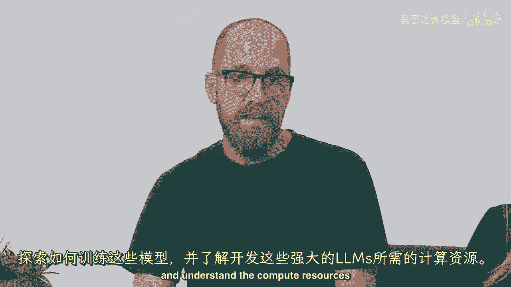
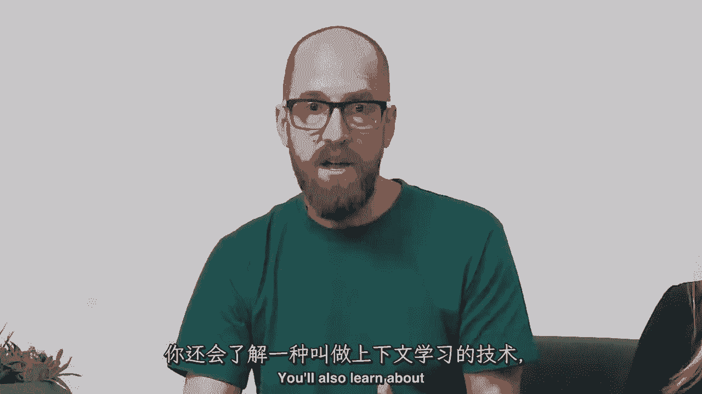
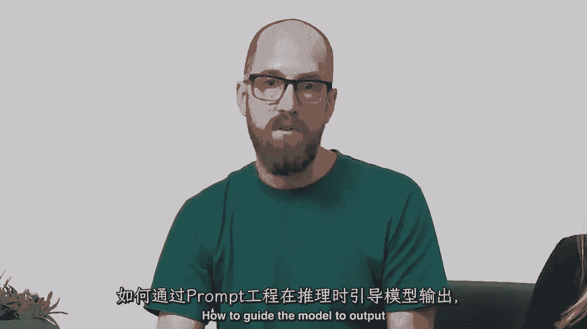
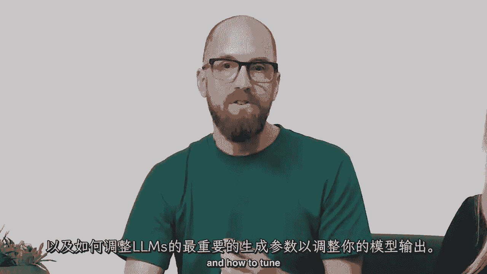
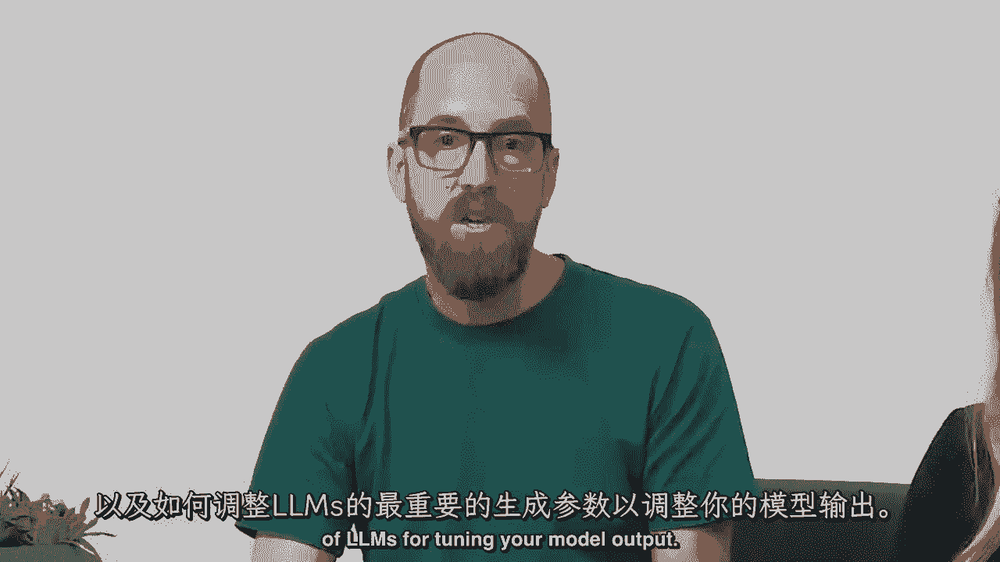
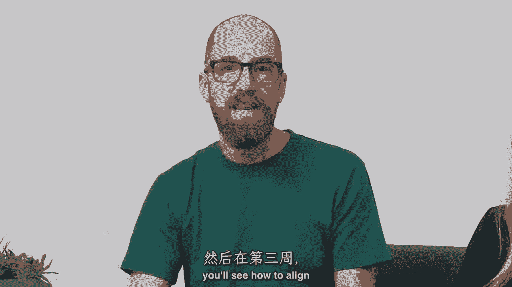
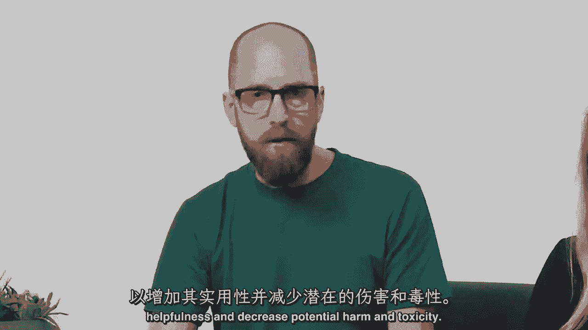

# LangChain_微调ChatGPT提示词_RAG模型应用_agent_生成式AI - P64：《大语言模型与生成式AI》-介绍LLM和生成式AI项目的生命周期 1——课程介绍 - 吴恩达大模型 - BV1gLeueWE5N

欢迎参加这门关于大规模语言模型生成式人工智能的课程，大规模语言模型或LLMs是一种非常令人兴奋的技术，尽管有所有的喧嚣和炒作，许多人仍然低估了他们作为开发者的力量，具体来说。

有许多机器学习和AI应用以前需要我几个月才能构建，你现在可以在几天内构建，或者甚至几周的小数，这门课程将与您深入探讨LLM技术如何实际工作，包括通过许多技术细节，如模型训练，指令，调整，微调。

生成式AI项目生命周期框架，以帮助您规划并执行项目，等等，生成式AI和LLMs特别是一种通用技术，这意味着，类似于其他通用技术，如深度学习和电力，是有用的，不仅限于单个应用。

但对于许多跨越经济各个角落的不同应用，因此，类似于深度学习大约十五年前的开始，或如此，有许多重要的工作在我们面前等待，需要许多人在许多年里完成，我希望，包括您来识别用例并构建特定应用。

因为许多这种技术都是如此新，而且很少有人真正知道如何使用它们，许多公司现在也正在，忙于寻找和雇佣真正知道如何构建LLM应用的人，我希望这门课程也能帮助您，如果您希望更好地定位自己以获得这些工作。

我很高兴能为您带来这门课程，以及由AWS团队组成的一群出色的讲师，Aa Bath Mike Chambers Shall Be Eigenberg，今天与我一起在这里，以及第四个讲师。

Chris Freely，他将呈现一些实验室，Auntie和Mike都是生成式AI开发者倡导者，Shelby和Chris都是Jenai解决方案架构师，所以他们都有很多经验，帮助许多不同的公司构建许多。

许多创新的应用使用LLMs，我期待他们都能分享他们在这门课程中丰富的实践经验，并开发这门课程的内容，以许多亚马逊AWS、Hugging Face和世界各地顶尖大学的行业专家和应用科学家的输入。

为这门课程，Andrew，你能再多说一些关于这门课程的事情吗，当然，Andrew，很高兴再次与您合作完成这门课程，以及这个关于大规模语言模型生成式AI的课程的激动人心领域。

我们创建了一系列旨在吸引AI爱好者的 lessons，"想要学习如何LLMs工作技术基础的工程师或数据科学家"，"除了培训的最佳实践之外"，"根据前提条件进行调优和部署"。

我们假设你已经熟悉Python编程，"如果你对PyTorch或TensorFlow有一些经验"，"这在这门课程中应该足够了"，"你将详细探索构成典型生成式人工智能项目生命周期的步骤"。

"从定义问题和选择语言模型开始"，"优化模型以部署和集成到您的应用程序中"，这门课程不仅覆盖了所有主题，而且会深入探讨，但会花时间确保你离开时对所有这些技术有深入的理解。

并且能够真正了解你在构建自己生成式ai项目时的工作，这将使你在实践中处于有利地位，米克，当你构建自己生成式ai项目时，为什么不告诉我们一些关于学习者将在每周看到的更多细节，在每个星期，当然，安塔，谢谢。

所以，在第一周。

你将研究驱动大型语言模型的变换器架构。

探索这些模型如何训练，并理解开发这些强大llms所需的计算资源。

你还将学习一种叫做上下文学习的技术。

如何通过提示工程引导模型在推理时输出。

以及如何调整llms中最重要的生成参数以调整您模型的输出。

在第二周，你将探索适应预训练模型到特定任务和数据集的选项，通过被称为指令微调的过程，然后在第三周，你将看到如何将语言模型的输出与人类价值观对齐。

为了增加帮助性和减少潜在的伤害和毒性。

但我们不局限于理论，每周都包括一次动手实验，在那里，你将有机会亲自尝试这些技术，在一个包括所有必要资源以处理大型模型的aws环境中，对你来说免费，谢莉，你能告诉我们一些关于动手实验的更多信息吗。

当然可以，迈克，在第一次动手实验中，你将构建以比较给定生成任务的不同提示和输入，在这种情况下，对话，摘要，你还将探索不同的分类参数和采样策略，以获得更深入的理解，如何进一步改进生成模型的响应。

在第二个实践实验室，你将微调Hugging Face上现有的大型语言模型，一个你既将全参数微调又将参数高效利用的开源模型库，微调或简称pep，你将看到peft如何让你的工作流程更加高效，在第三个实验室。

你将通过人类反馈或rlhf来接触强化学习，你将构建一个奖励模型分类器来标记模型响应，并将其标记为有毒或不有毒，所以不要担心，如果你还不理解所有这些术语和概念，在接下来的课程中。

你将对这些主题进行更深入的探讨，所以我非常高兴有ana mike和chris将，为您呈现这门深入技术探讨lms的课程，你从这门课程中离开，已经实践了如何构建或使用lms的许多不同具体代码示例。

我确信许多代码片段最终都将直接有用于您自己的工作，我希望您喜欢这门课程，并将所学用于构建一些真正令人兴奋的应用程序，所以，让我们继续到下一个视频，在那里，我们将开始深入探讨如何使用lms来构建应用程序。

