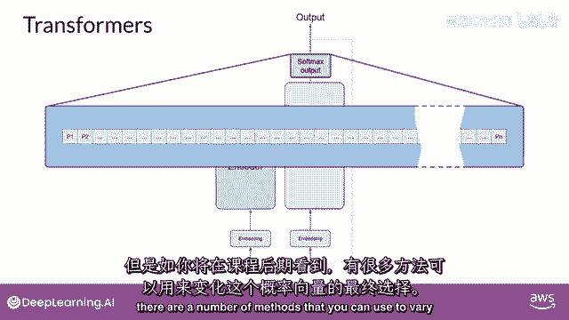
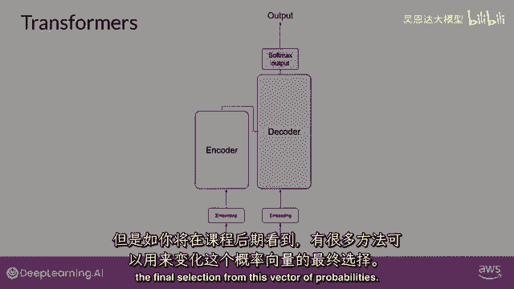

# LangChain_微调ChatGPT提示词_RAG模型应用_agent_生成式AI - P69：介绍LLM和生成式AI项目的生命周期6——Transformer架构 - 吴恩达大模型 - BV1gLeueWE5N

使用Transformer架构构建大型语言模型，显著提高了自然语言任务相对于早期RNN一代的性能，并导致了生成能力的爆炸，Transformer架构的力量在于其能够学习，句子中每个词的相关性和上下文。

不仅仅是你看到的那样，对每个词旁边的词，但对句子中的所有其他词，并应用注意力权重到这些关系，以便模型学习每个词对其他词的相关性，无论它们在输入中的位置在哪里，这给了算法学习谁有这本书的能力。

谁可能拥有这本书，以及它是否与文档的更广泛上下文相关，这些注意力权重是在LLM训练期间学习的，你将了解更多关于这一点，这周晚些时候，这个图被称为注意力图。

并且可以用于说明每个词与每个其他词之间的注意力权重，在这里的示例中，你可以看到单词'书'与单词'教师'之间有很强的联系或注意力，这就是自我注意力，以及这种学习方式的能力。

在整个输入中显著提高模型的语言编码能力，现在，你已经看到了Transformer架构的关键属性之一，自我注意力让我们从高处概述，在这里，模型的工作方式是一个简化的Transformer架构图。

以便你可以专注于这些过程在哪里发生，Transformer架构被分为两个 distinct 部分，编码器和解码器，这些组件相互协作，并且它们共享许多相似之处，请注意这里。

你看到的图是从原始注意力图派生的，这就是你需要的纸张，注意模型的输入位于底部，并且可能的输出位于顶部，我们将尽力在整个课程中保持这一点，机器学习模型只是巨大的统计计算器，它们与数字工作，而不是单词。

所以在将文本输入模型进行处理之前，您必须首先分词单词，简单地说，这是将单词转换为数字，每个数字代表模型可以工作的所有可能单词的字典中的一个位置，你可以选择多种分词方法，例如。

与完整单词匹配的token id，或使用token id来表示单词的部分，如图所示，重要的是，一旦你选择了一种分词器来训练模型，在生成文本时，你必须使用相同的分词器，现在，你的输入已经被表示为数字。

你可以将其传递给嵌入层，这一层是一个可训练的向量嵌入空间，其中每个标记都被表示为一个向量，并在该空间中占据一个唯一的位置，词汇表中的每个标记ID都被匹配到一个多维向量，直觉是。

这些向量学习如何编码输入序列中单个标记的意义和上下文，嵌入向量空间已经在自然语言处理中被使用一段时间，之前的语言生成算法，如词到向量，使用了这个概念，不要担心，如果你不熟悉这个。

在整个课程中你将看到例子，并且在本周末阅读练习的末尾有一些额外的资源链接，回顾样本序列，在这个简单情况下，你可以看到，每个单词都被匹配到一个标记ID。

并且每个标记都被映射到原始Transformer论文中的向量，向量的大小实际上是512，比我们在这个图像中可以fit的要大得多，只是为了简单起见，如果你想象向量大小只有3。

你可以将单词映射到一个三维空间，并看到你现在可以看到的词汇之间的关系，如何将位于嵌入空间中靠近的词汇相关联，以及如何计算单词之间的距离作为角度，这给了模型理解语言的数学能力。

当你将标记向量添加到编码器的基础，或者解码器，你也添加位置信息编码，模型并行处理输入标记，因此，通过添加位置信息编码，你保留了关于单词顺序的信息，并不失去句子中单词位置的相关性。

一旦你总结了输入标记和位置信息编码的结果，你将结果向量传递给这里的自注意力层，模型分析输入序列中标记之间的关系，如你所见，这允许模型关注输入序列的不同部分，如前所述，以更好地捕获单词之间的上下文依赖性。

在训练期间学习的自注意力权重，并存储在这些层中，反映了输入序列中每个单词的重要性，对于序列中的所有其他单词，但这并不局限于Transformer架构实际上有多头自注意力。

这意味着多个自注意力权重或头被独立地学习并行，注意力层中包含的自注意力头的数量从模型到模型有所不同，但12到100之间的数字是常见的，直觉是，每个自注意力头都将学习语言的不同方面，例如。

一个头可能看到句子中的人实体之间的关系，而另一个头可能专注于句子的活动，尽管另一个头可能专注于其他属性，例如，如果单词押韵，重要的是要注意，你不提前指定，语言的哪些方面，注意力头将学习。

每个头的权重随机初始化，并给予足够的训练数据，并且时间每个将学习语言的不同方面，虽然一些注意力图容易解释，像这里讨论的例子，但其他的可能现在不容易，因为你已经将所有注意力权重应用到你输入的数据上。

输出通过全连接前馈网络处理，这个层的输出是一个逻辑向量，与每个标记在词典化字典中的概率得分成正比，你可以将这些逻辑值传递给最后的softmax层，在那里它们被归一化为每个词的概率得分。

这个输出包括对词汇表中每个单词的概率，所以这里可能会有数千的分数，一个单个标记的分数将高于其余的，这是最有可能预测的标记，但你将在课程后期看到，有许多方法你可以使用。

