# LangChain_微调ChatGPT提示词_RAG模型应用_agent_生成式AI - P70：介绍LLM和生成式AI项目的生命周期7——用Transformer生成文本 - 吴恩达大模型 - BV1gLeueWE5N

到这个阶段，你已经看到了变压器架构中的一些主要组件的高级概述，但你还没有看到从开始到结束的整体预测过程是如何工作的，所以让我们通过一个简单的例子来走一遍，在这个例子中。

你将看一个翻译任务或序列到序列任务。

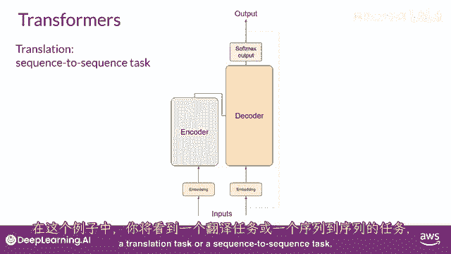

顺便说一句，这是变压器架构设计师的原始目标。

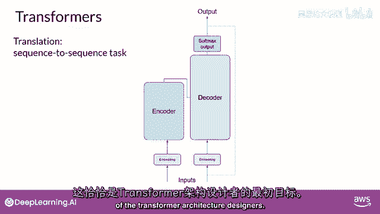

你将使用变压器模型来翻译法语短语，Jem le presage automatic que into english。

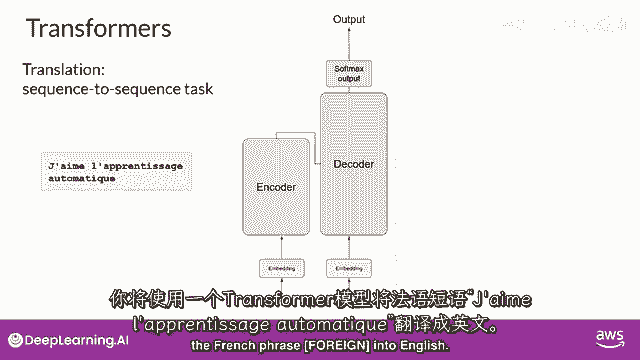

首先，你将对输入单词进行分词，使用训练网络时使用的相同分词器。

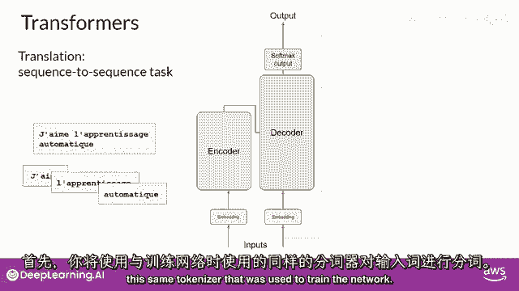

这些标记然后添加到网络的输入端，通过嵌入层，然后输入到多头注意力层。

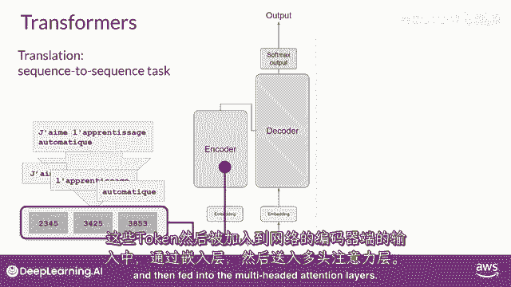

多头注意力层的输出，被馈送到前馈网络以输出编码器。

到这个点，离开编码器的数据是对输入序列的深度表示，并且含义。

"这个表示被插入到解码器的中间"，"影响解码器的自我注意力机制"。

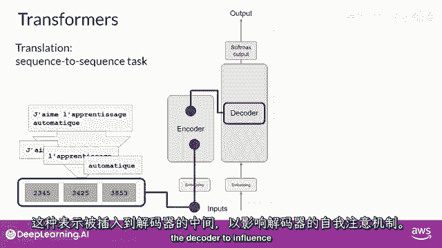

下一个，"在解码器的输入中添加一个序列开始的标记"。

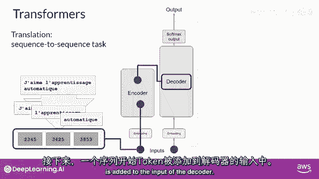

这触发解码器预测下一个标记，"这是基于编码器提供的上下文理解，它这样做"。

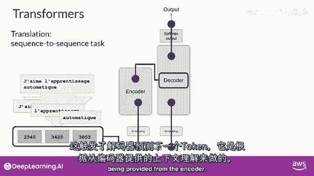

"解码器的自注意力层的输出将被传递给解码器"，反馈前馈网络，"并通过一个最后的Softmax输出层"。

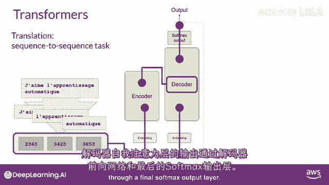

"到这个时候"，我们有我们的第一个标记，你将继续这个循环，将输出标记返回给输入，以触发下一个标记的生成，直到模型预测序列结束的标记。

在这个点上，最终的标记序列可以解标记化为单词。

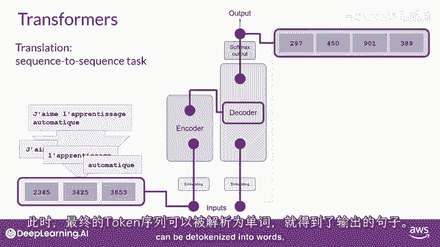

在这种情况下，你有你的结果。

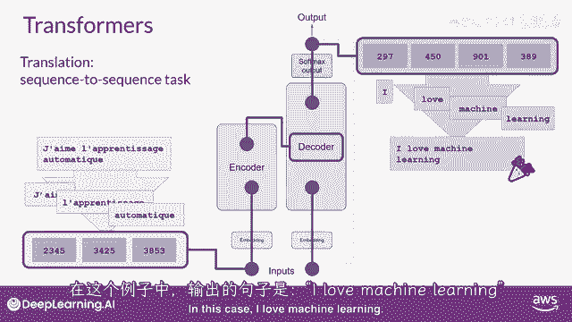

我热爱机器学习，有若干种方式，你可以使用softmax层的输出来预测下一个标记。

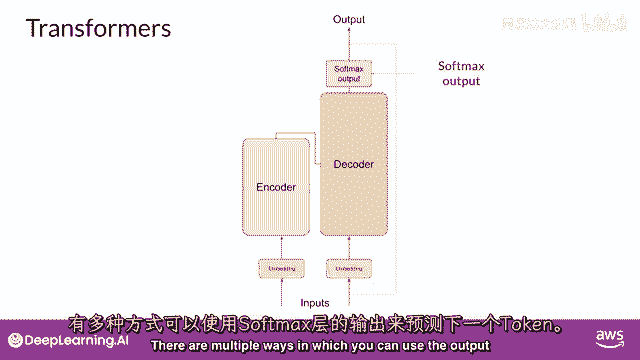

这些可以影响你生成的文本的创造性。

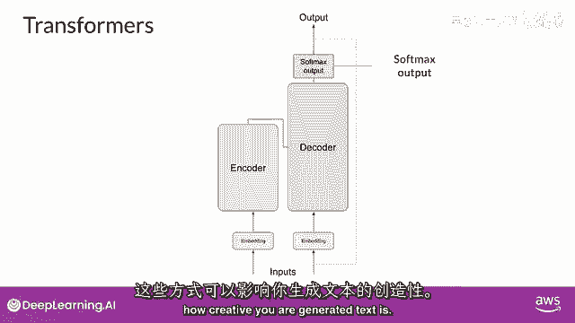

你们将在本周晚些时候详细查看这些。

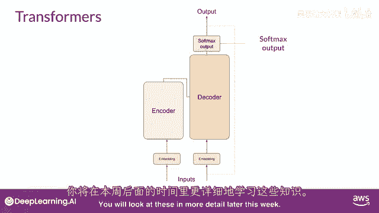

所以让我们总结一下你们到目前为止看到的，完整的Transformer架构由编码器和解码器组件组成。

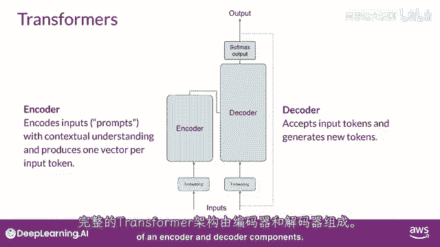

编码器将输入序列编码为一个深层次的输入结构及其意义的表示。

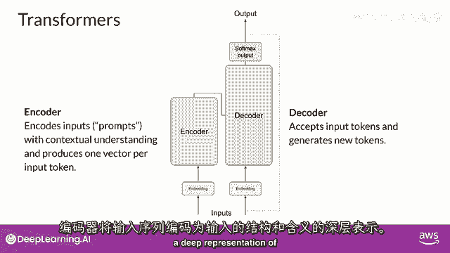

从输入标记开始工作的解码器，使用编码器的上下文理解来生成新的标记。

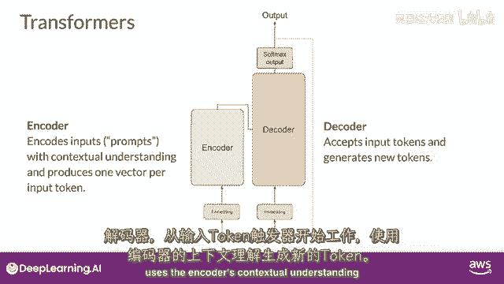

并且它这样做，直到满足某个停止条件。

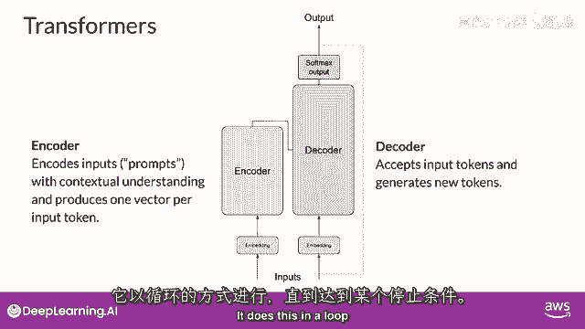

而你在这里探索的翻译示例，使用了变压器的编码器和解码部分，你可以将这些组件分开，以变化为架构，仅编码器模型也作为序列到序列模型工作。

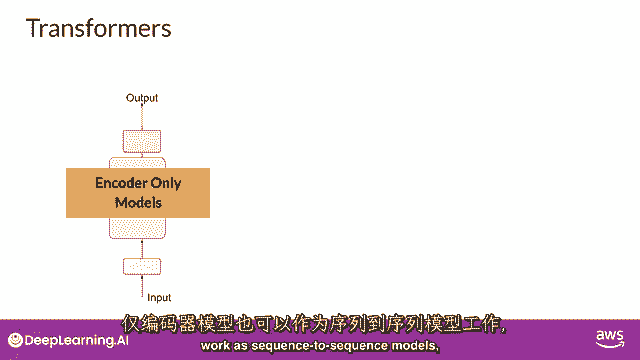

但未经进一步修改，输入序列和输出序列的长度相同。

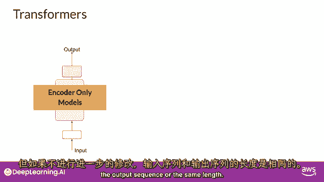

它们的使用现在较少，但通过向架构中添加额外的层。

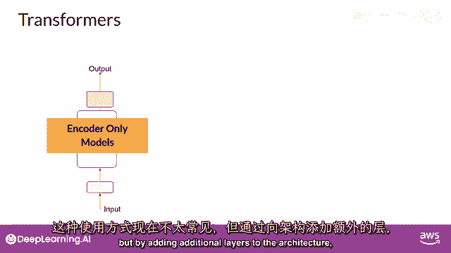

你可以训练仅编码器模型来执行分类任务，例如，情感分析。

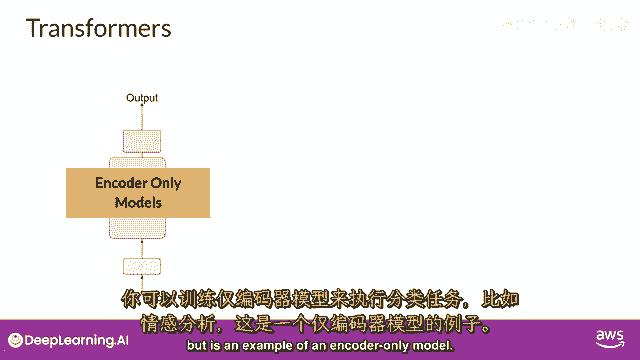

BERT是仅编码器的一个例子，编码解码模型，如你所见，在序列到序列任务如翻译中表现良好。

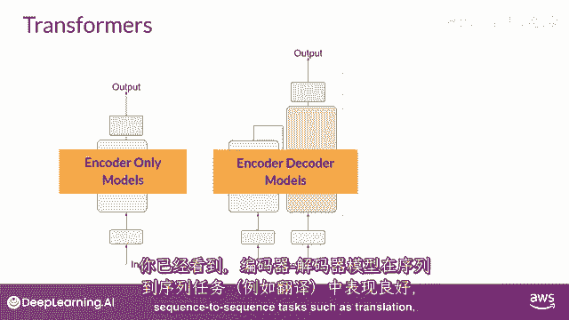

其中，输入序列和输出序列的长度可能不同。

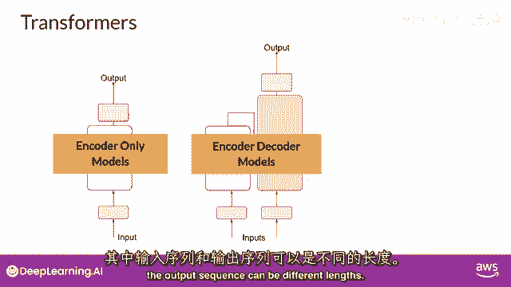

你也可以扩展和训练这种模型来执行一般文本生成任务。

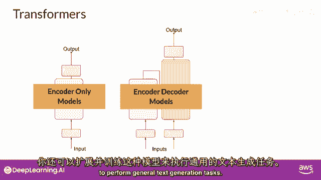

编码解码模型的例子包括bart，与burt和t five相反，你在这门课程实验室中将要使用的模型。

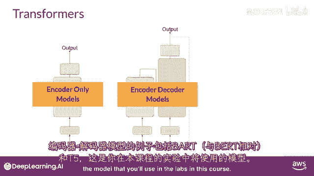

最后，仅解码模型是今天最常使用的一些，再次。

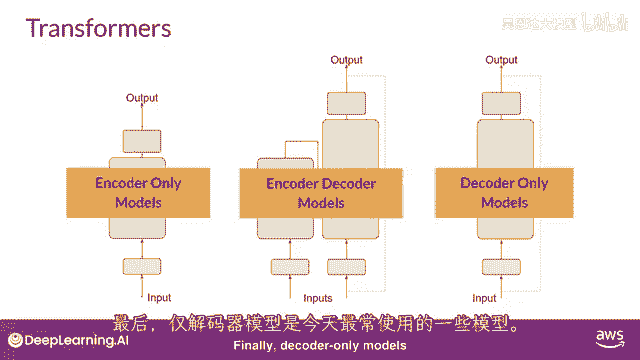

因为它们已经扩展了。

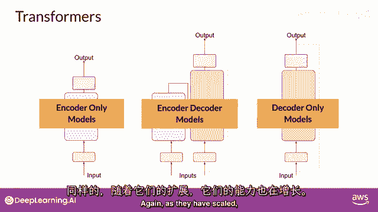

其能力已经增长，并且这些模型现在可以泛化到大多数任务，流行的仅解码模型包括GPT家族模型，Bloom，Jurassic llama，以及许多更多你将学习到这些不同种类的变压器的更多信息。

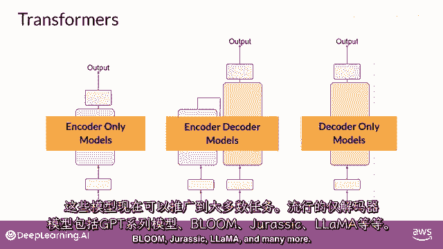

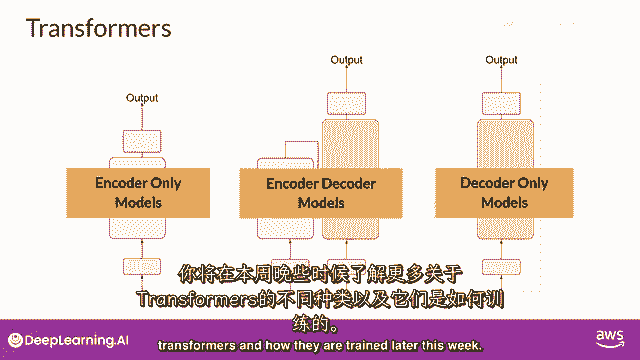

并且我们将在下周晚些时候学习如何训练它们，所以，那是相当多的，Transformer模型概述的主要目标是给你足够的背景，以便理解世界上正在使用的各种模型之间的差异，并能够阅读模型文档，我想强调的是。

你不需要担心记住在这里看到的所有细节，因为你可以随时回来查看这一解释，只要你需要，记住，你将通过自然语言与Transformer模型交互，创建提示，使用书面文字，而不是代码。

你不需要理解所有底层架构的细节来做到这一点，这被称为提示工程，并且这就是你在这门课程的下一部分将探索的内容。

