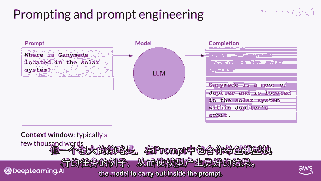
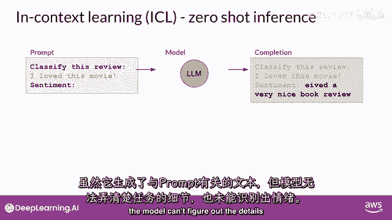
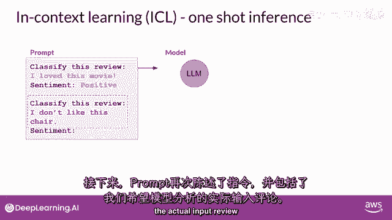
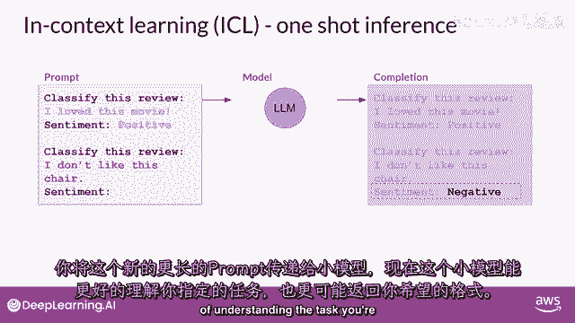
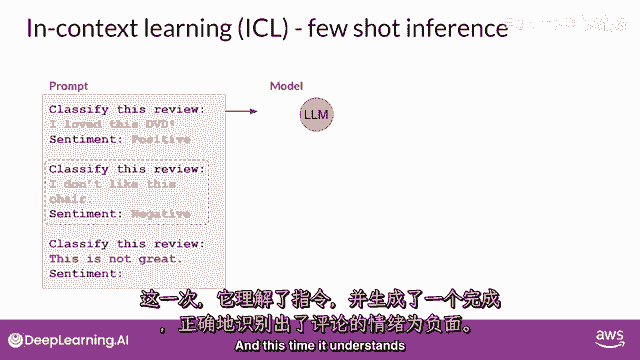
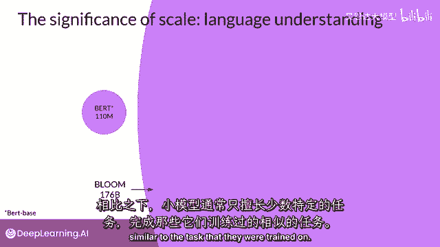

# LangChain_微调ChatGPT提示词_RAG模型应用_agent_生成式AI - P71：介绍LLM和生成式AI项目的生命周期8——Prompt和提示工程 - 吴恩达大模型 - BV1gLeueWE5N

好的，只是想提醒你一些术语，你输入到模型中的文本是被称为提示的文本，生成文本的行为被称为推理，并且输出文本被称为完成，完整的文本，或者可用来生成提示的记忆量被称为上下文窗口。

尽管这里的例子显示了模型表现良好，你经常会遇到模型没有产生的情况，你想要在第一次尝试中的结果，你可能需要修订你的提示语言，或者修改它几次的写作方式，以使模型行为，在。

你想要这项工作如何发展和改进的提示方式被称为提示工程，这是一个大主题，但是有一种强大的策略可以使模型产生更好的结果，是在内容窗口中包含你想要模型执行的任务示例。

在内容窗口中提供示例被称为上下文学习，让我们来看看这个术语的含义与上下文学习，你可以帮助lms学习更多关于任务的信息，在提示中包括例子或附加数据被要求，在这里，提示中显示了一个具体的例子。

你要求模型分类一篇评论的情感，所以，这部电影的评论是积极的还是消极的，提示由指令组成，分类这个评论，紧随其后的是一些上下文，在这个情况下，上下文是评论文本本身和一条指示，要求在末尾产生情感，这种方法。

将您的数据输入包含在提示中，被称为零-shot推断，最大的llms在这个方面出乎意料的好，在这个例子中，理解要完成的任务并返回一个好的答案，模型正确识别情感为积极，较小的模型，另一方面。

可能在这个方面遇到困难，由gpt two生成的一个完成示例，一个更早的较小版本，该模型驱动chgt，正如你可以看到，模型没有遵循指令，尽管它能生成与提示有些关系的文本，模型无法理解任务的细节。

也不能识别情感。

这是提供提示中示例的地方，在这里提供示例可以提高性能，你可以看到提示文本更长，现在开始以一个完成的示例来演示任务，以便模型理解，在指定模型应该分类评论后，提示文本包括一个样本评论，我爱这部电影。

接着进行完成的情感分析，在这种情况下，评论是积极的，然后，提示再次陈述指令，并包括我们要模型分析的实际输入评论。

你将这个新的更长的提示传递给较小的模型，现在，这个模型有更好的机会理解任务。

你正在指定，以及你想要的响应格式，一个例子的包含被称为一次射击推理，与您之前提供的零-shot提示相反，有时，一个例子可能不足以让模型学习你想要它做的事情，你可以将提供单个例子的概念扩展到包括多个例子。

这被称为少数示例推理，在这里，您正在与一个甚至更小的模型一起工作，该模型未能进行良好的情感分析，通过少数示例推理，相反，您将尝试少数示例推理，通过包括第二个例子，这次是一个负面评价。

包括不同输出类别的示例可以帮助模型理解它需要做什么，你将新的提示传递给模型，而这次，它理解了指令。

并生成了一个正确识别评论情感为负面的完成，所以总结一下，你可以通过设计提示来鼓励模型通过示例学习，虽然最大的模型在没有示例的情况下在零-shot推理方面表现良好。

较小的模型可以从包含所需行为的一-shot或几-shot推理中受益，但是记住上下文窗口，因为你对模型可以传递的上下文学习量有限，如果你发现你的模式表现不佳，当说，包括五个或六个例子。

你应该尝试微调你的模式，相反，微调对模型进行额外的训练，使用新数据使其能够更好地执行你想要它执行的任务，在本课程第二周中，你将详细探索微调，随着越来越大的模式被训练，已经清楚，模型的多任务能力。

以及它们完成这些任务的效果，很大程度上取决于模型的规模，正如您在课程中 earlier 听到的那样，参数更多的模型能够捕获更多的语言理解，最大的模型出人意料地对零-shot 推断表现良好。

并能够推断并成功完成许多他们没有专门训练过的任务，相比之下，较小的模型通常只对少数任务表现良好，通常是与他们训练的任务相似的任务。

您可能需要尝试几个模型来找到适合您用例的那个，一旦你找到了适合你的模式，你可以尝试一些设置，以影响模型生成的完成结构和风格。

