# LangChain_微调ChatGPT提示词_RAG模型应用_agent_生成式AI - P72：介绍LLM和生成式AI项目的生命周期9——生成配置 - 吴恩达大模型 - BV1gLeueWE5N

在这个视频中，你将检查一些你可以使用的方法和相关的配置参数，以影响模型如何做出关于下一个词生成的最终决定，如果你在playgrounds中使用过llms，例如。

在hugging face网站上或在aws上，你可能已经看到了这些控制来调整llm的行为。

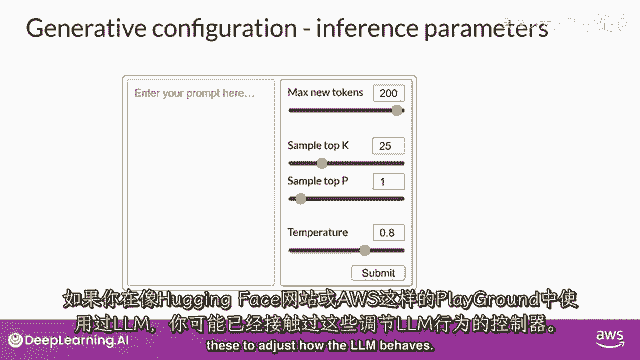

每个模型都暴露一组可以影响模型在推理期间输出的配置参数。

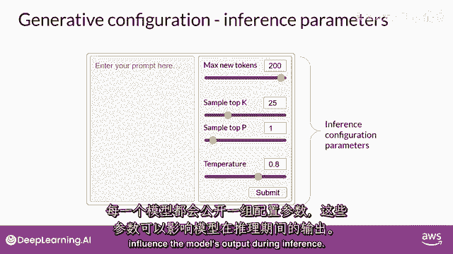

请注意，这与训练参数不同，这些参数是在训练时间学习的。

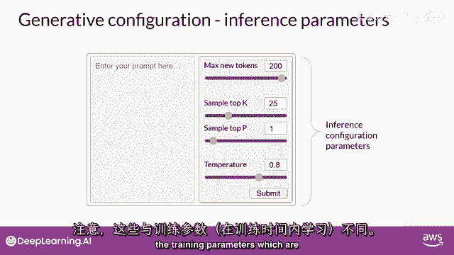

相反，这些配置参数是在推理时间被调用的，并赋予你对如完成中的最大token数进行控制的能力，以及输出创意度的程度。

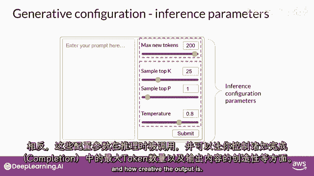

最大新token数可能是这些参数中最简单的一个。

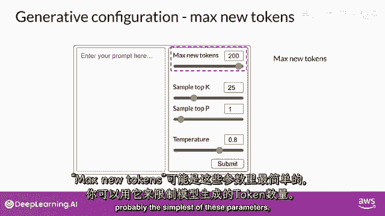

你可以用它来限制模型将生成的token数，你可以把这个想成是设置了一个上限，模型将通过选择过程的次数。

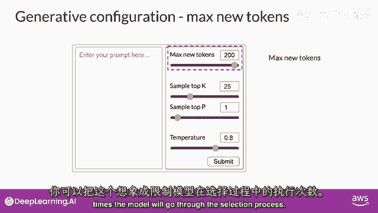

在这里，你可以看到max new tokens被设置为一百的示例。

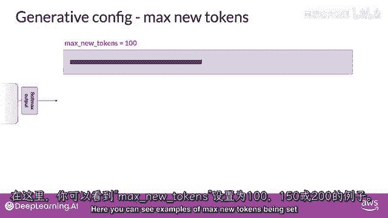

一百五十或两百，但请注意，在两百的示例中，完成的长度较短。

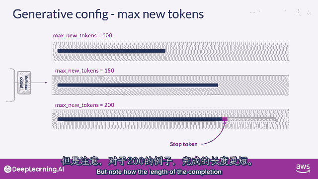

这是因为另一个停止条件已经被达到，例如，预测序列结束标记的模型。

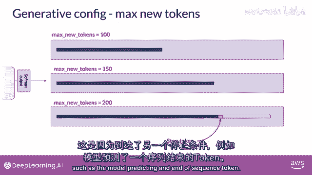

记住它是最大新词的，不是生成输出时硬性的新词数量。

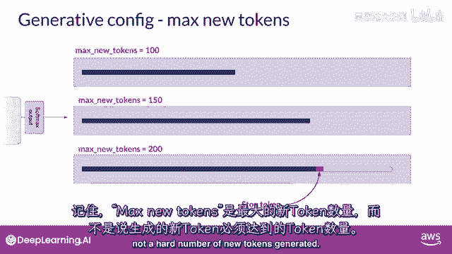

Softmax层在这里是模型使用的所有单词词典上的概率分布。

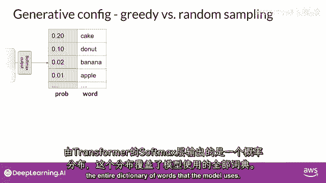

你可以看到旁边有一些单词和他们的概率得分。

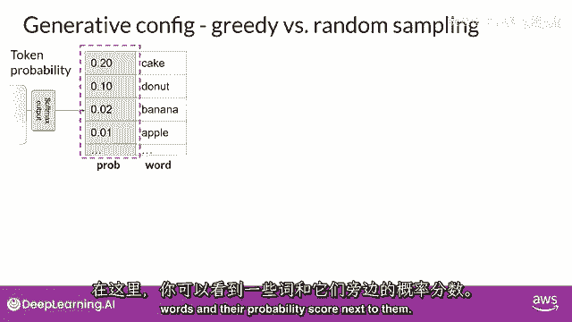

虽然我们这里只显示了四个单词，想象这是一个延伸到完整词典的列表。

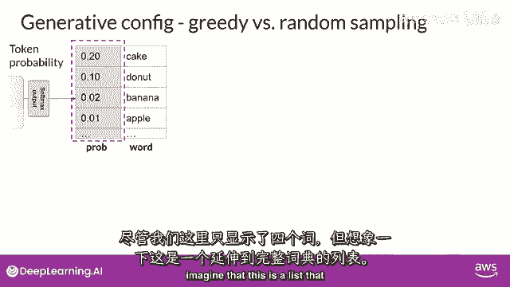

大多数大型语言模型默认会以所谓的贪婪解码方式运行。

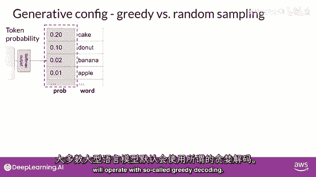

这是下一词预测的最简单形式，其中，模型将始终选择概率最高的单词，这种方法对于短文本生成非常有效，但容易受到重复单词或重复词序的影响。

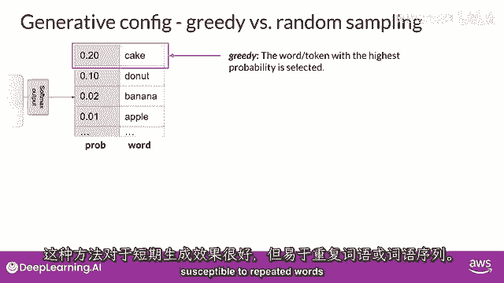

如果你想生成更自然的文本，更具创意的文本，并避免重复单词，你需要使用一些其他控制。

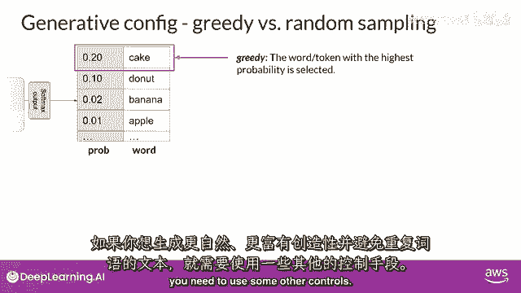

随机采样是最简单的方法之一，用于引入一些变化。

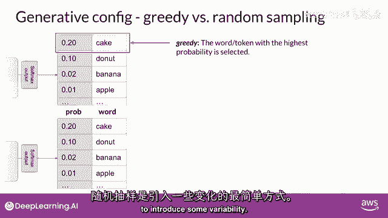

而不是每次使用随机采样时都选择最可能的单词，模型随机选择一个输出单词，使用概率分布来加权选择。

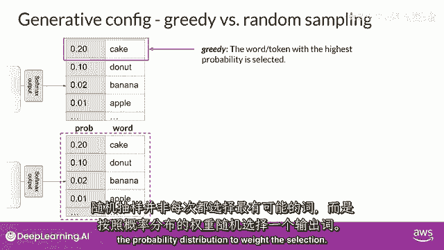

例如，在图中，'香蕉'这个词的概率得分为零点零二，所以通过随机采样，这相当于有百分之二的机会选到这个词，使用这种采样技术，我们可以减少单词被重复的可能性。

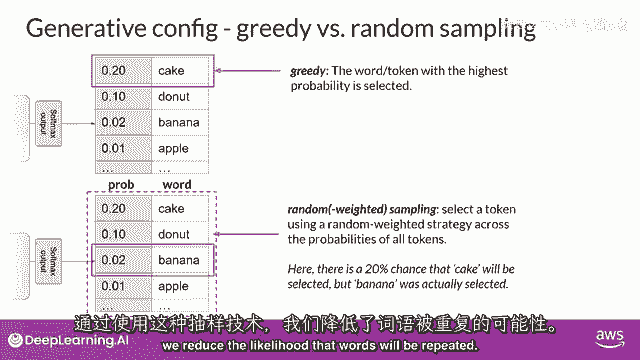

但是，根据设置，输出可能有可能过于创新，生成导致生成偏离主题的词语。

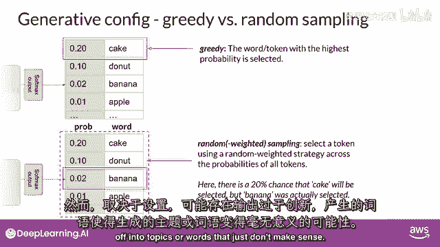

或无意义的词语，请注意在一些实现中，你可能需要明确地禁用贪婪并启用随机采样。

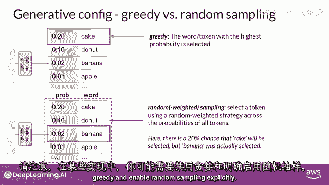

例如，我们在实验室中使用的hugging face transformers实现需要设置，Do sample等于true。

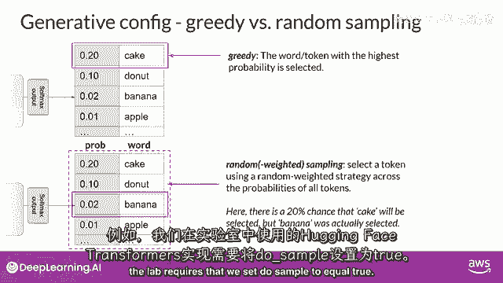

让我们探索top k和top p采样技术，以帮助限制随机采样，并增加输出可能理解性的机会。

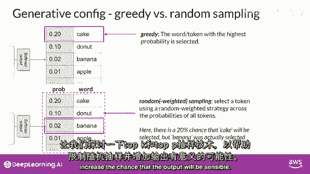

两个设置，Top p和top k是帮助我们限制随机采样的技术，并增加输出可能理解性的机会，以限制选项。

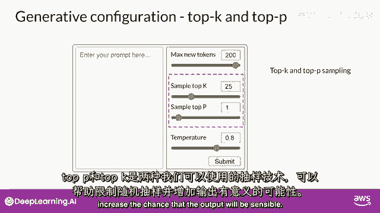

同时允许一些变化，你可以指定一个top k值，这告诉模型从概率最高的k个标记中选择。

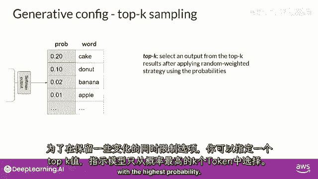

在这个例子中，这里k被设置为三，所以你在限制模型从这三个选项中选择。

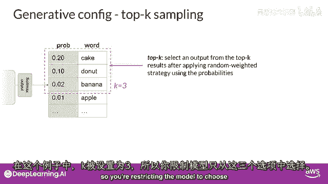

模型然后从这些选项中选择，使用概率加权，在这种情况下，它选择donut作为下一个词。

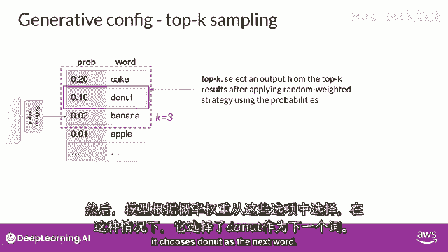

这种方法可以帮助模型有一些随机性，同时防止选择高度不可能的完成词。

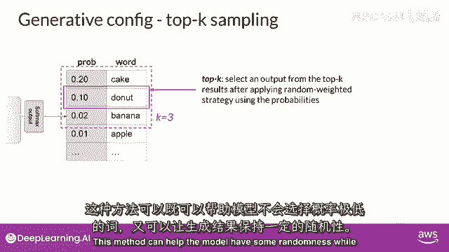

这反过来使你的文本生成更可能听起来合理，有意义。

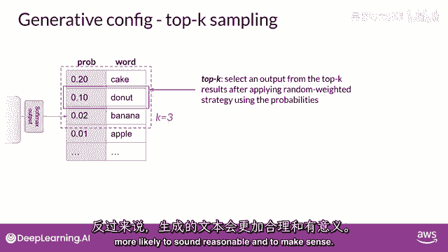

相反，你可以使用top p设置来限制随机采样。

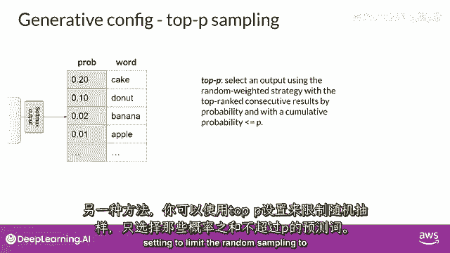

到预测概率不超过p的组合，例如，如果你将p设置为等于0。3，选项是蛋糕和donut，因为它们的零点二和零点一的概率加起来等于零点三。

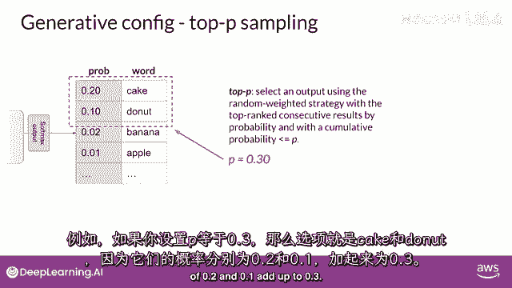

模型然后使用随机概率加权方法从这些标记中选择，所以与top k相比，你指定要从随机选择的标记中的数量，与top p相比，你指定模型要选择的总概率。

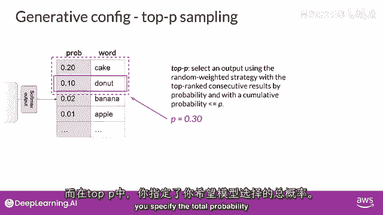

一，另一个可以控制模型输出随机性的参数被称为温度。

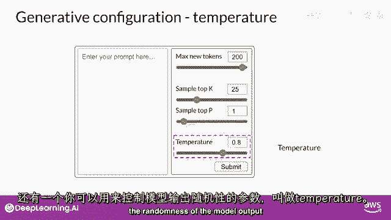

这个参数影响模型计算下一个标记的概率分布。

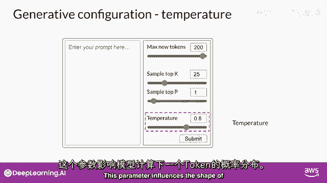

总的来说，温度越高，随机性越高，温度越低，随机性越低，温度值是一个缩放因子，它在模型的最终softmax层中被应用，它影响下一个标记的概率分布的形状。

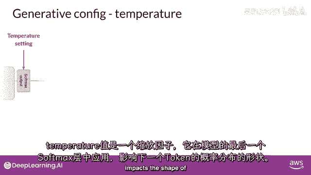

与top k和top p参数相比，改变温度实际上改变了模型将做出的预测。

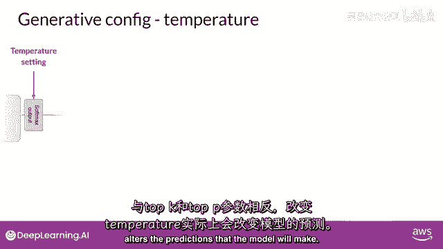

如果你选择较低的温度，说小于一，softmax层产生的概率分布更加尖锐峰顶，概率集中在较少的词汇上。

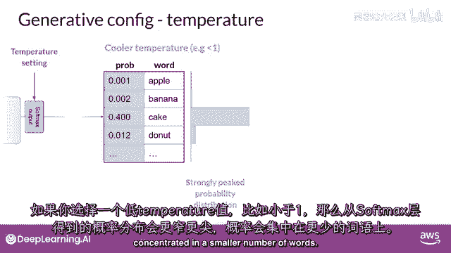

你可以在这里看到，蓝色条形图位于表格的一侧，它显示了一个侧卧的概率条形图。

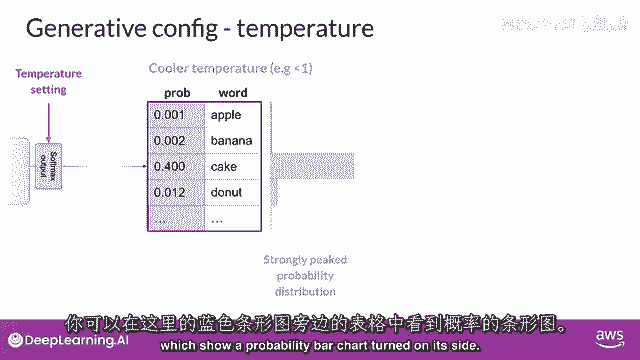

这里的大部分概率都集中在单词'蛋糕'上，模型将从这个分布中随机采样，因此产生的文本将不那么随机，并将更紧密地跟随模型在训练期间学习的最可能词序。

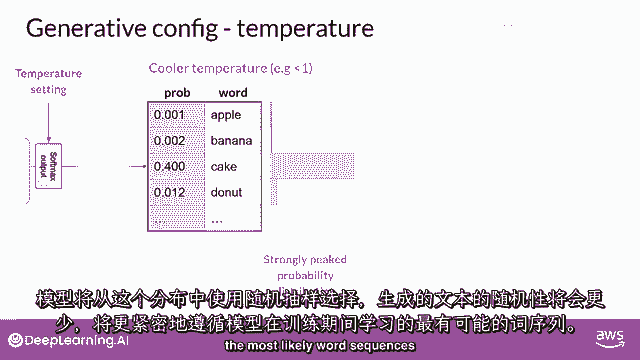

如果你将温度设置为更高的值，例如，大于一，然后模型将为下一个标记计算一个更宽更平的概率分布。

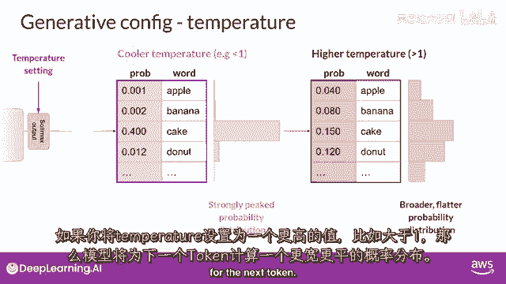

注意，与蓝色条形图相比，概率在标记之间更均匀地分布。

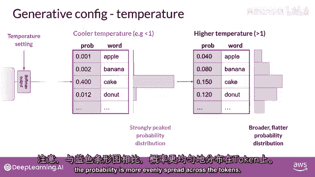

这导致模型生成包含更高随机度的文本，并且输出结果的变异性更高，与冷却的温度设置相比，这可以帮助你生成听起来更创新的文本，如果你将温度值设置为一，这将留下softmax函数的默认设置。

并将未改变的概率分布用于，所以你已经覆盖了很多地面，到目前为止，你已经考察了lms能够执行的任务类型，并了解了transformers，驱动这些令人惊叹工具的模型架构。

你还探索了如何通过提示工程从这些模型中获取最佳性能，并在下一个视频中通过尝试不同的在ference配置参数来实验，你将开始建立在此基础知识上。

