# LangChain_微调ChatGPT提示词_RAG模型应用_agent_生成式AI - P76：使用指令对LLM进行微调3——对单一任务进行微调 - 吴恩达大模型 - BV1gLeueWE5N

虽然LLMs因其能够在单个模型中执行许多不同语言任务而闻名，您的应用程序可能只需要执行单个任务，在这种情况下，您可以微调一个预先训练的模型来提高对您感兴趣的任务的性能，例如。

使用该任务的示例数据集进行摘要，有趣的是，使用相对较少的示例就可以获得良好的结果。

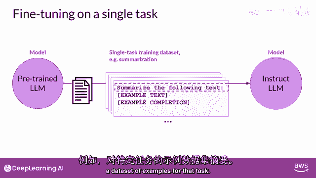

通常，只有五百到一千个示例就可以导致良好的性能。

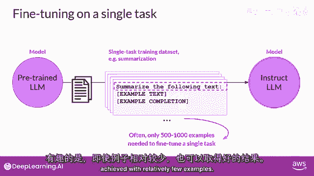

这与模型在预训练期间看到的数十亿个文本片段形成鲜明对比，然而，微调单个任务也存在潜在的缺点。

这个过程可能会导致一种现象叫做灾难性遗忘。

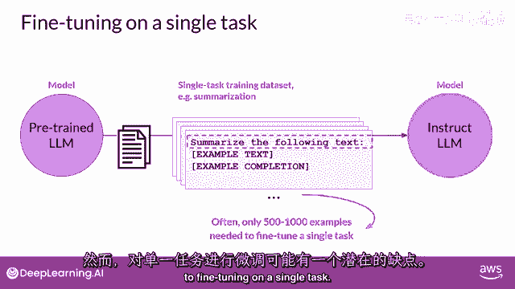

灾难性遗忘发生。

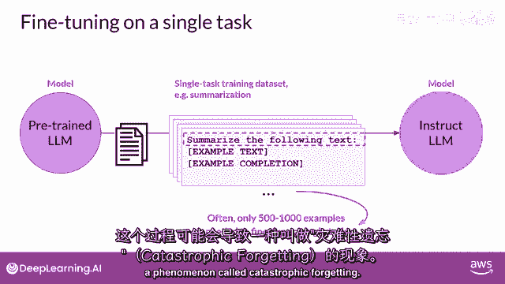

因为完整的微调过程修改的原始LLM的权重，虽然这导致在单个微调任务上的性能大大提高。

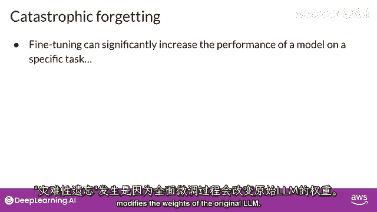

但它可能会降低在其他任务上的性能。

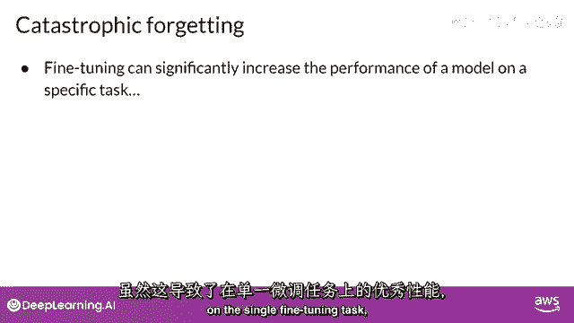

例如，虽然微调可以提高模型执行评论情感分析的能力，并产生高质量的完成。

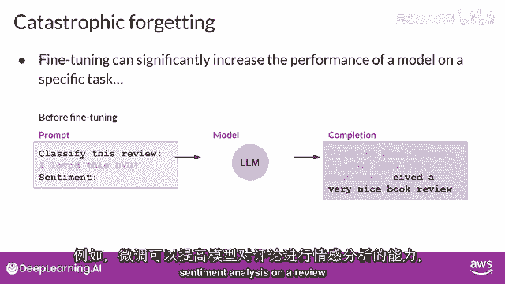

但模型可能会忘记如何执行其他任务，这个模型在微调之前知道如何执行命名实体识别。

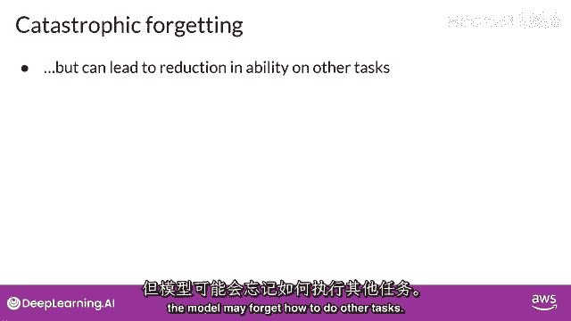

正确识别句子中的'查理'是猫的名字，但在微调后。

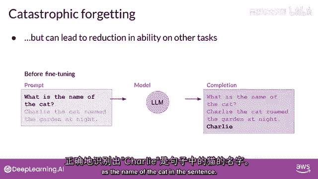

模型无法执行这项任务，混淆它应该识别的实体，并表现出与新任务相关的行为。

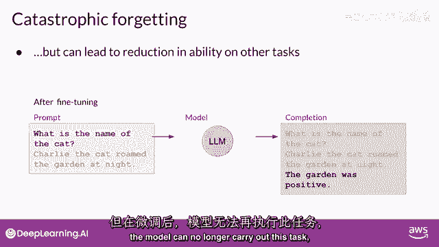

所以，你有哪些选项可以避免灾难性遗忘。

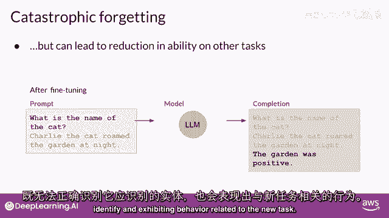

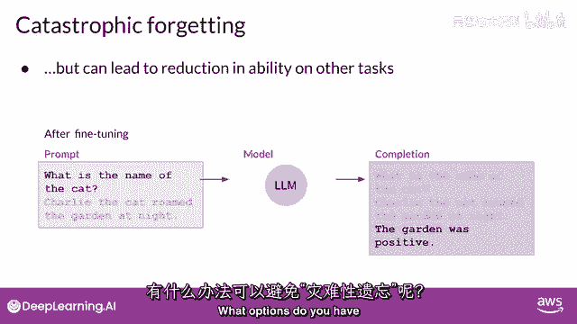

首先，重要的是决定灾难性遗忘是否影响您的使用案例，如果您只需要在您微调的单个任务上可靠地性能。

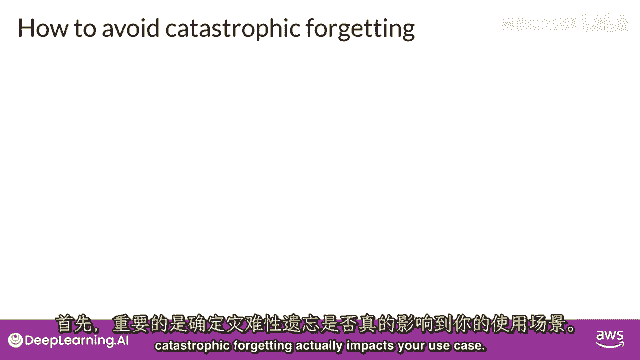

它可能不是模型无法泛化到其他任务的问题，如果您想要或需要模型保持其多任务泛化能力，您可以一次微调多个任务。

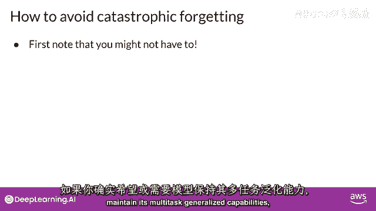

好的多任务微调可能需要五十到一百万个例子横跨许多任务，并且需要更多的数据和计算来训练。

我们将稍后详细讨论这个选项，另一个选项是进行参数高效的微调或盗窃，简称Peft。

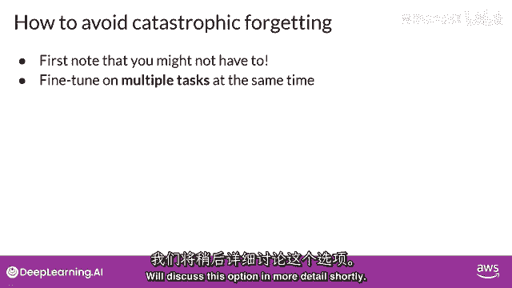

而不是完整的，微调。

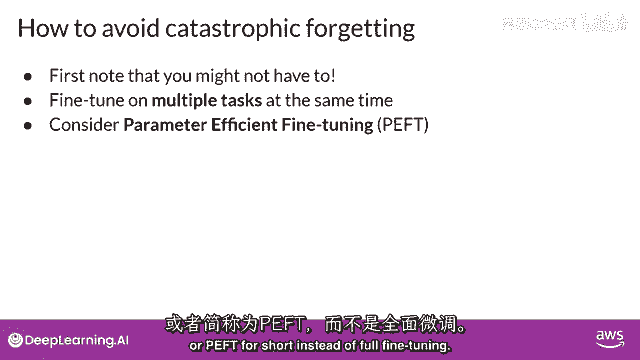

盗窃是一种技术，它保留了原始LLM的权重，并只训练了少数任务特定的适配层和参数，Peft对灾难性遗忘的抵抗力更强。

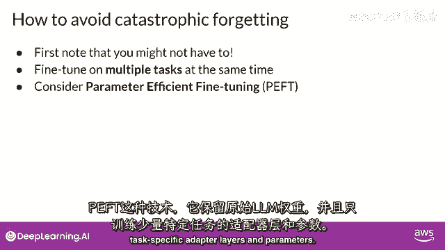

因为大多数预训练的权重都被保留了，Peft是一个令人兴奋且活跃的研究领域，我们将在本周晚些时候覆盖。

在 meantime，让我们继续下一个视频，更深入地了解多任务，微调。