# LangChain_微调ChatGPT提示词_RAG模型应用_agent_生成式AI - P80：参数高效微调1——参数高效微调（PEFT） - 吴恩达大模型 - BV1gLeueWE5N

正如你在课程培训的第一周所看到的，Llms是计算密集型的，全量微调不仅需要存储模型，还需要在训练过程中所需的各种其他参数，即使你电脑可以持有模型权重。

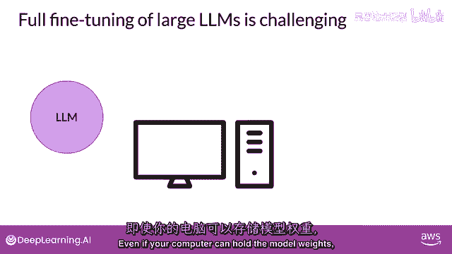

这些权重对于最大的模型现在已经达到了数百吉字节的规模。

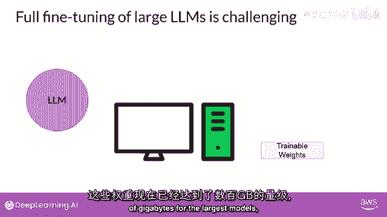

你也必须能够为优化器状态分配内存。

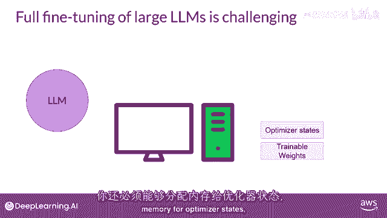

梯度，前向激活和训练过程中临时内存，这些额外的组件可以比模型大得多。

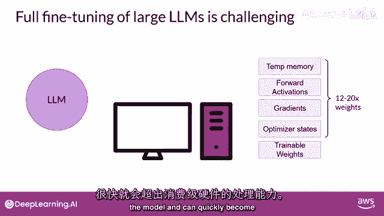

并且可以迅速变得过大以至于在消费者硬件上难以处理，与全面精细调整不同，在那里每个模型权重都会在监督学习参数中更新。

高效的精细调整方法只会更新参数集的一个小部分。

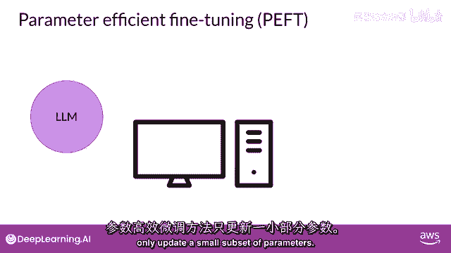

一些高效技术会冻结模型的大部分权重并专注于精细调整，例如，一个现有模型参数的子集，例如，特定的层或组件。

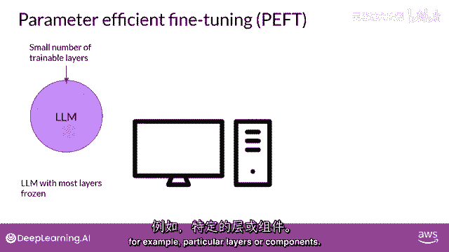

其他技术根本不接触原始的模型权重，而是添加一些新的参数或层，并仅对使用peft最的新组件进行精细调整。

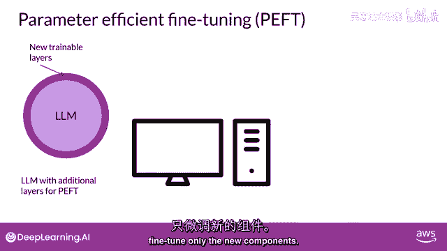

如果所有的llm权重都没有被冻结，因此，训练的参数数量远小于原始llm的参数数量。

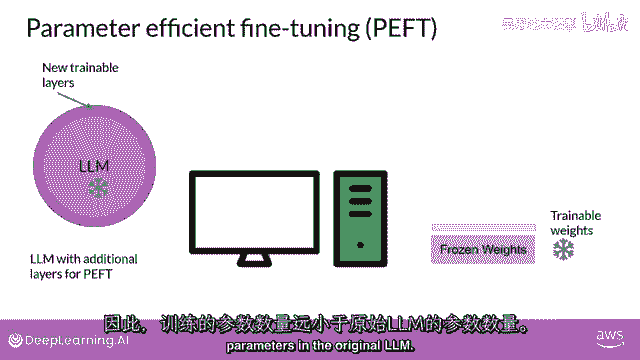

而且在一些情况下，只有原始llm权重的十五到二十分之一。

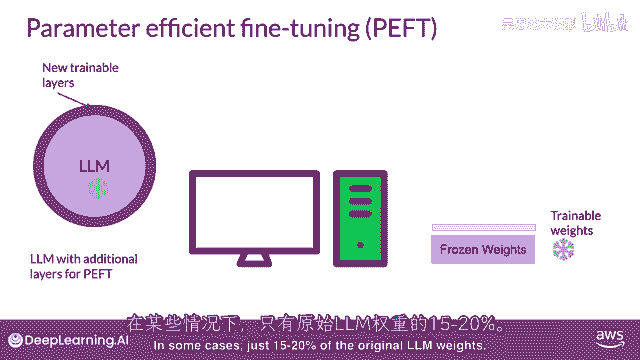

这使得训练所需的内存要求更加可管理，实际上，Peft往往可以在单个gpu上进行。

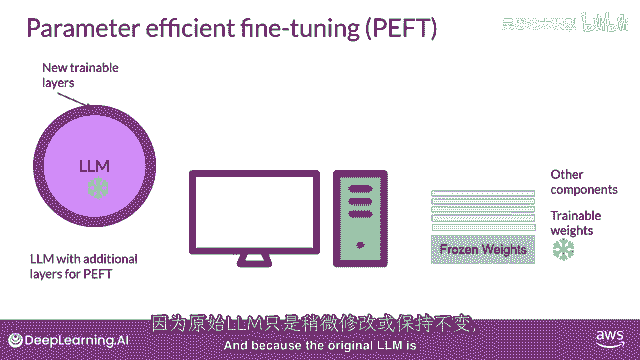

因为原始llm只是被稍微修改或保持不变，盗窃更不容易受到灾难性的。

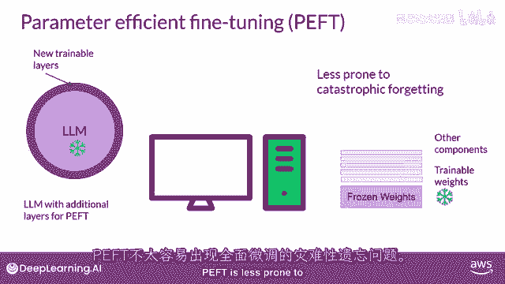

全精细调整忘记问题的问题，全面的微调将产生针对您训练的所有任务的新模型版本。

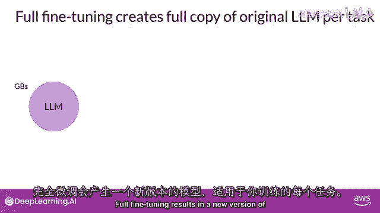

这些每个都与原始模型相同大小。

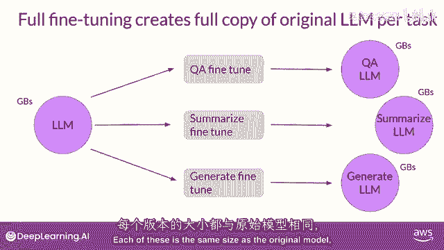

因此，如果您为多个任务进行微调，可能会出现昂贵的存储问题。

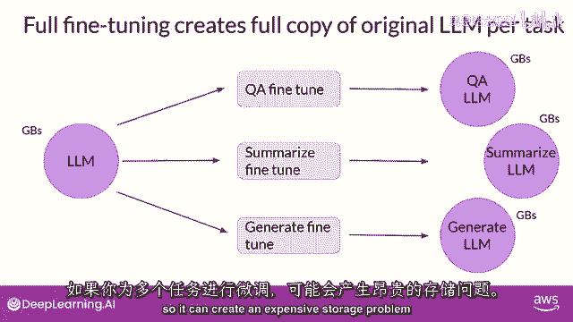

让我们看看如何使用路径来改善这种情况，以参数高效的微调。

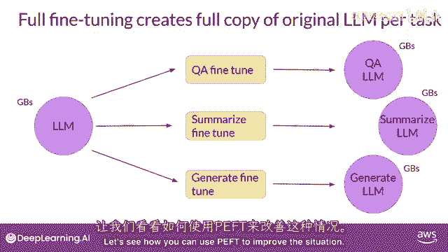

您只训练一小部分权重。

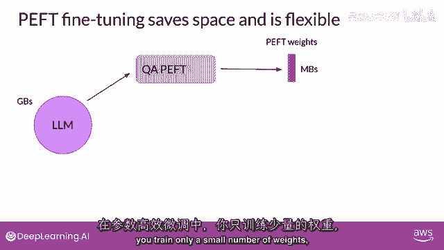

这导致足迹大大减小，总的来说，小到兆字节。

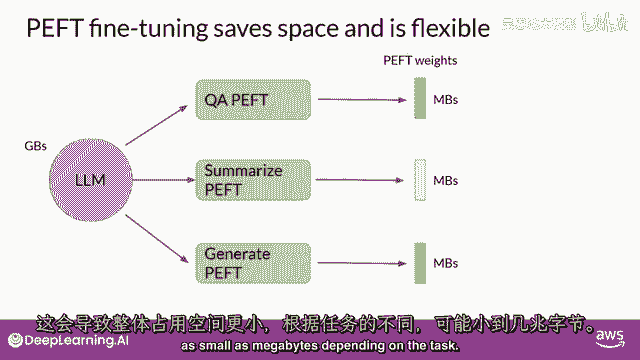

取决于任务，新的参数与原始llm权重结合用于推理。

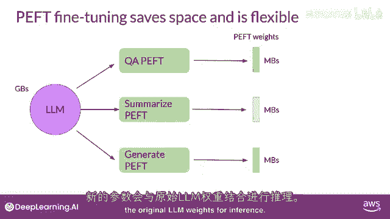

对于每个任务，都有专门的轻量级权重进行训练，并且可以在推理时轻易地替换出来。

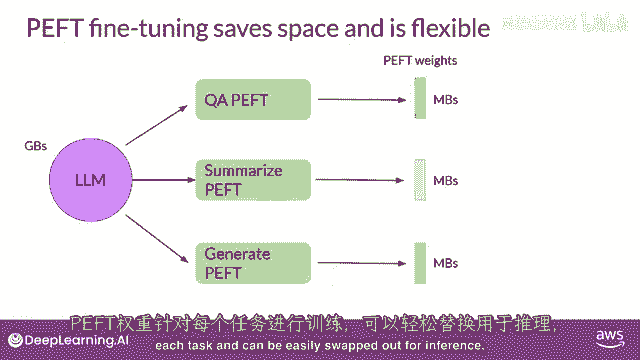

允许原始模型高效地适应多个任务。

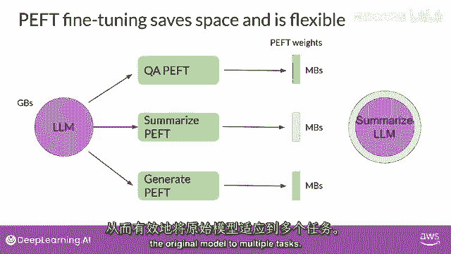

对于参数高效的方法，你有几种可以使用的。

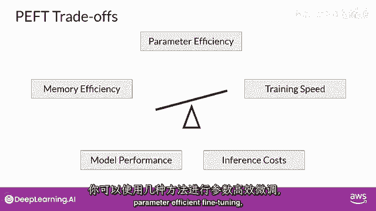

微调，每种方法都有在参数效率上的权衡，内存效率，训练速度，模型质量和推理成本。

让我们来看看轻量级权重方法的三种主要类别，选择性方法只精细调整原始llm参数的一部分。

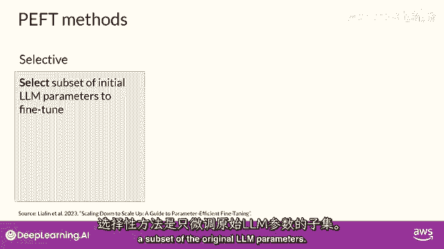

你可以采取几种方法来确定你想要更新的参数，你有选择仅训练模型特定组件或层的选项，甚至特定参数类型。

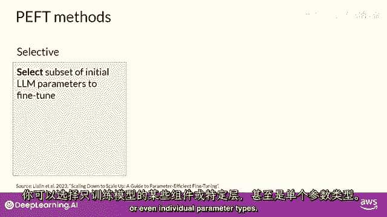

研究人员发现这些方法的性能参差不齐，并且在参数效率和计算效率之间存在显著的权衡。

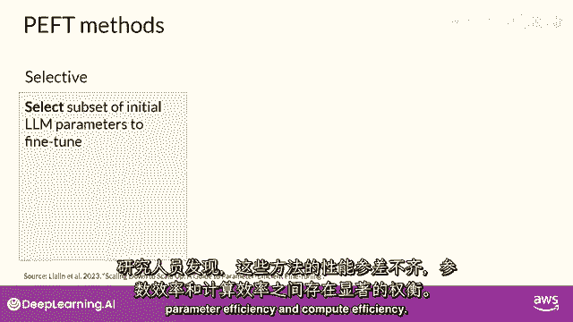

因此，我们在这门课程中不会专注于它们，重新参数化方法也工作于原始llm参数。

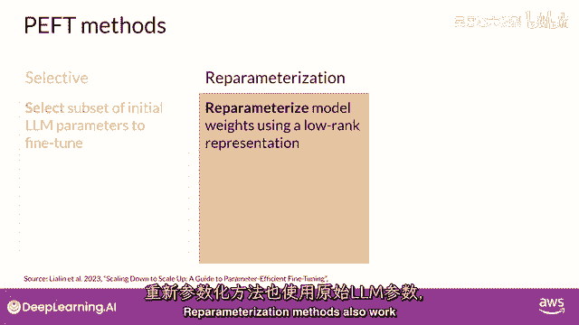

但通过创建新的参数来减少需要训练的参数数量，原始网络权重的低秩变换。

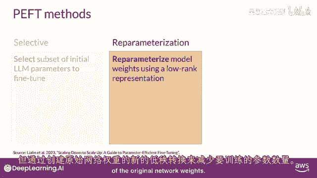

这种技术的一种常见方法是laura。

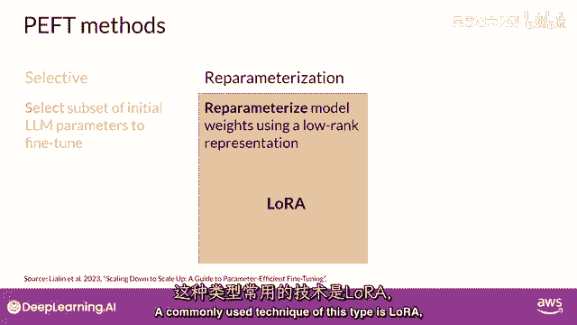

你将在下一个视频中详细探索它，附加方法，通过保持所有原始llm权重冻结来进行微调，并在这里引入新的可训练组件，主要有两种方法，适配器方法。

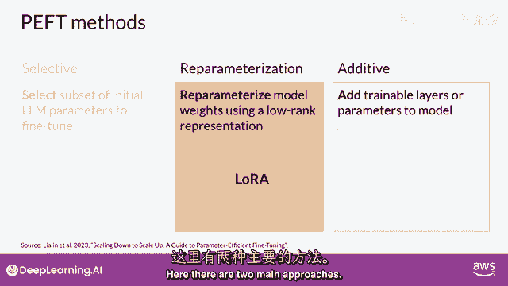

在模型架构中添加新的可训练层，通常在内部编码器或解码器的组件中，注意力或前馈层之后。

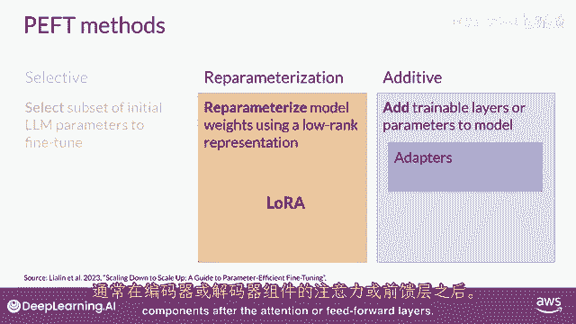

软提示方法，另一方面，保持模型架构固定和冻结，专注于操纵输入以实现更好的性能。

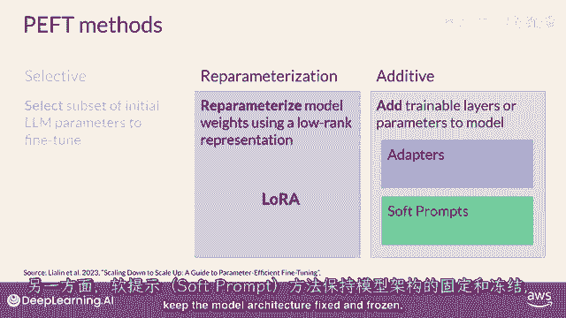

这可以通过向提示嵌入添加可训练参数来实现，或保持输入固定，重新训练嵌入权重。

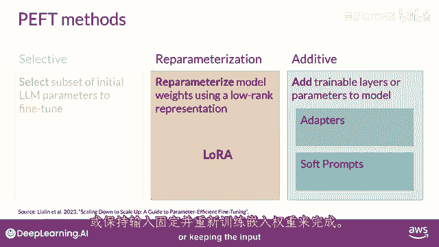

在这堂课中。

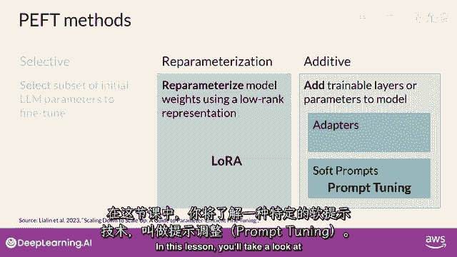

你将首先看一下一种特定的软提示技术叫做提示微调，让我们继续到下一个视频，更深入地了解lora方法。