# LangChain_微调ChatGPT提示词_RAG模型应用_agent_生成式AI - P81：参数高效微调2——PEFT技术1 - LoRA（低秩适应） - 吴恩达大模型 - BV1gLeueWE5N

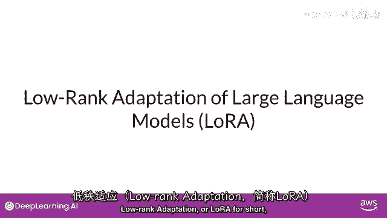

低秩适应，或劳拉，简言之，是一种参数高效微调技术，属于重参数化类别，让我们快速回顾一下它是如何工作的，这是您在课程早期看到的变压器架构图。

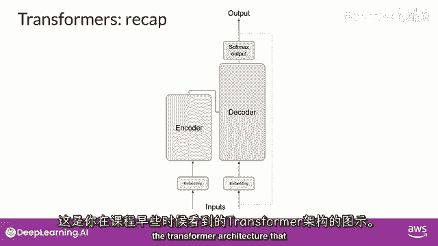

输入提示被转换为标记。

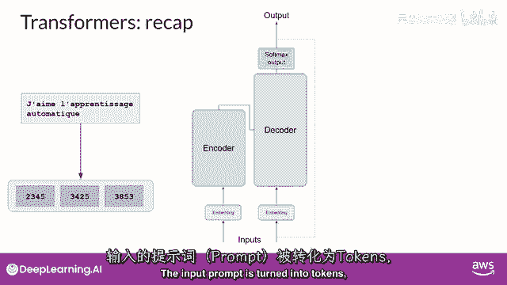

然后转换为嵌入向量，并传递到变压器编码器或解码器部分。

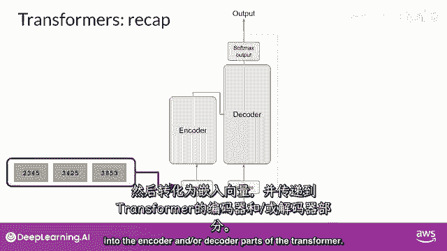

在这两个组件中，有两种神经网络，自注意力和前馈网络。

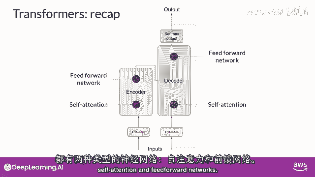

这些网络的权重在预训练时学习，嵌入向量创建后，输入到自注意层，应用一系列权重计算全微调时的注意力得分，这些层的每个参数都会更新。

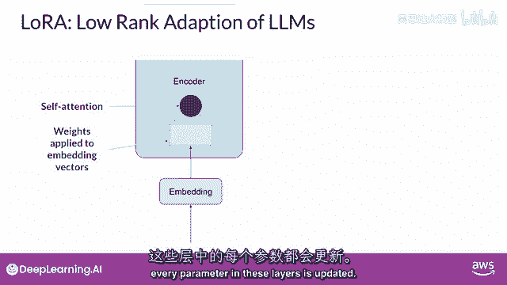

Laura策略减少微调时需训练的参数数，通过冻结原始模型的所有参数，并在原始权重旁边注入一对秩分解矩阵。

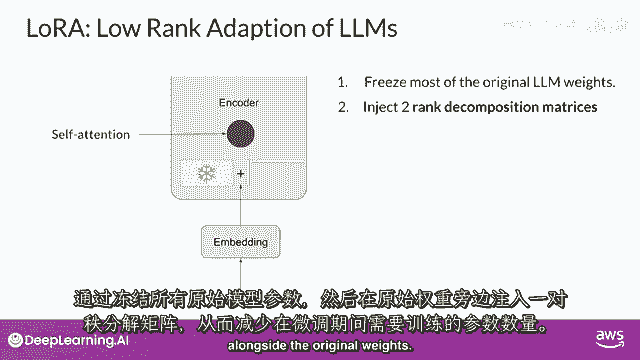

小矩阵尺寸已设，使乘积矩阵与待修改权重尺寸相同。

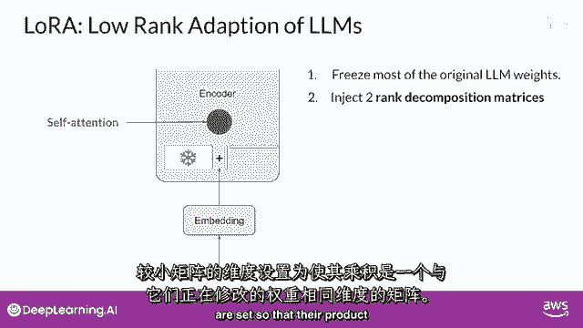

你。

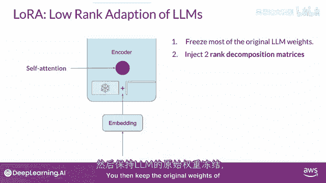

然后冻结LLM原始权重，训练这些小矩阵。

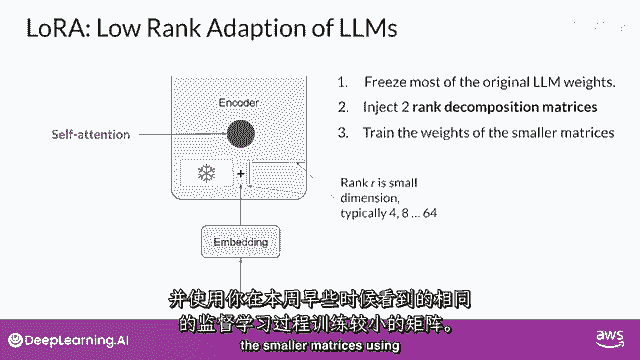

使用本周早些时候看到的监督学习过程进行推断。

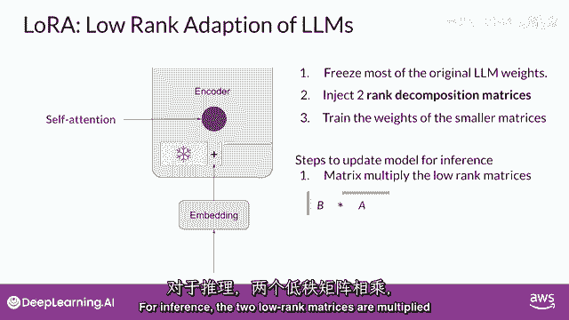

两个低秩矩阵相乘，生成与冻结权重相同尺寸的矩阵。

然后将其添加到原始权重并替换模型中的这些更新值。

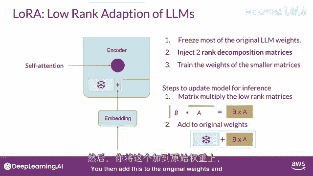

现在有一个Lora微调模型可执行特定任务，因为此模型与原始模型参数数量相同。

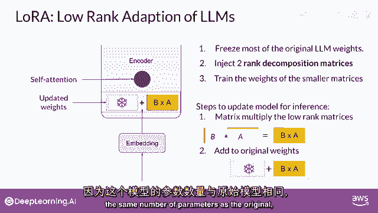

对推理延迟影响甚微。

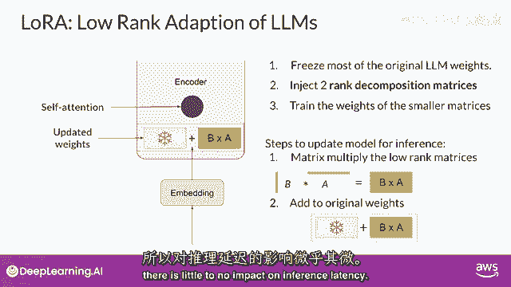

研究人员发现仅将Laura应用于自我，模型中的注意力层通常足以微调任务并实现性能提升，然而，原则上，也可在其他组件如前馈层使用Laura。

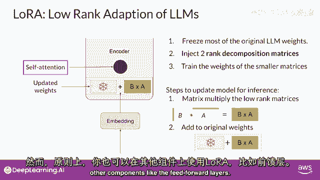

但大多数LLM参数在注意力层。

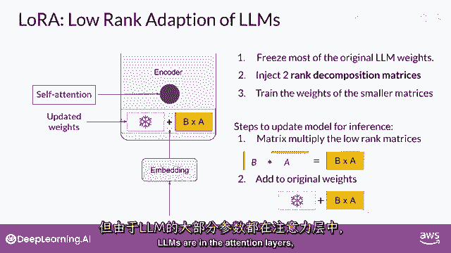

应用Laura到这些权重，可节省最多可训练参数，矩阵，让我们看个实际例子，基于注意力机制的Transformer架构。

论文指出Transformer权重为500，乘12乘64。

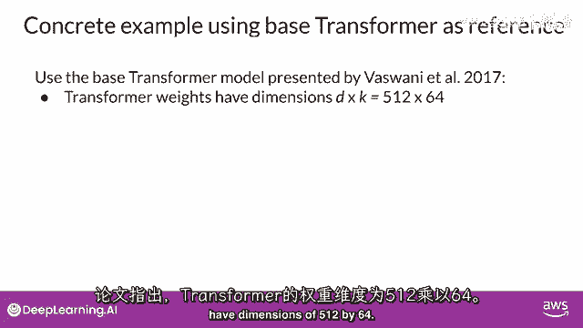

这意味着每个权重矩阵有32，768个参数。

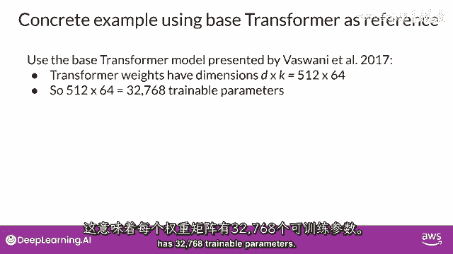

三千二百，七百六十八，若使用Laura微调，秩为8，将训练两个小的秩分解矩阵，小维为8。

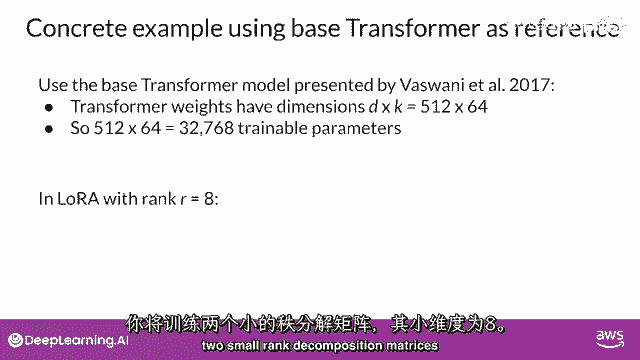

这意味着矩阵A为8乘64，共512个参数。

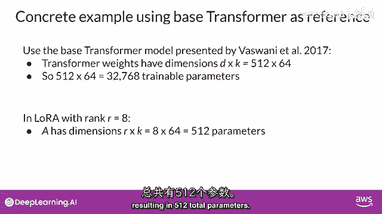

矩阵b尺寸为512x8，或4096个可训练参数。

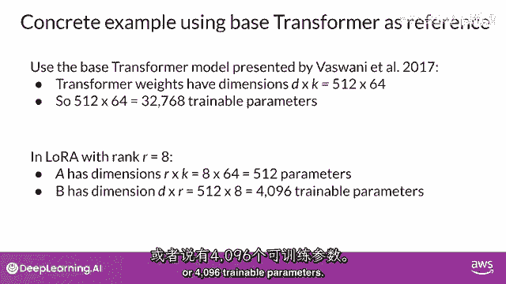

通过更新这些低秩矩阵的权重，而不是原始权重，你将训练4000，608个参数而非32000，768，88。6%的减少，因为Laura可大幅减少可训练参数，通常可单用GPU进行参数高效微调。

避免需要分布式GPU集群，因分解矩阵尺寸小。

可为每个任务训练不同集合，并在推理时更新权重切换。

假设为特定任务训练一对Laura矩阵。

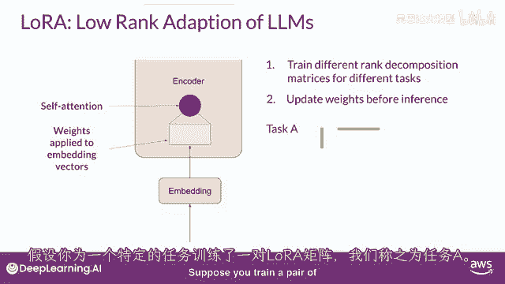

称为任务A进行推理。

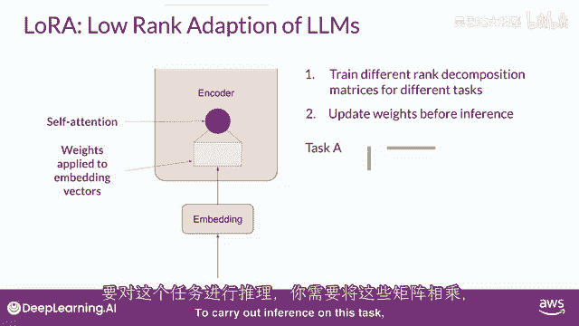

将这两个矩阵相乘，然后将结果矩阵加到原始冻结权重。

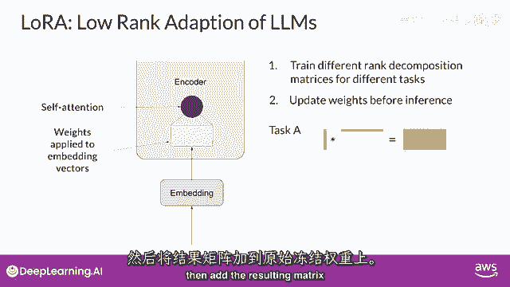

然后取这个新总和权重矩阵，替换模型中出现的原始权重。

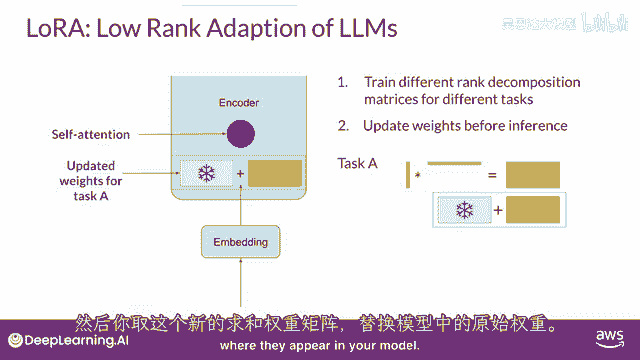

然后可用此模型进行任务A推理。

若要执行不同任务，如任务B，只需取为该任务训练的Laura矩阵。

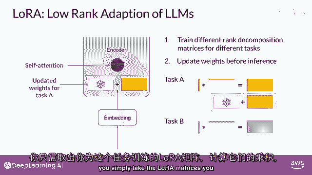

计算其乘积，然后将此矩阵加到原始权重并更新模型。

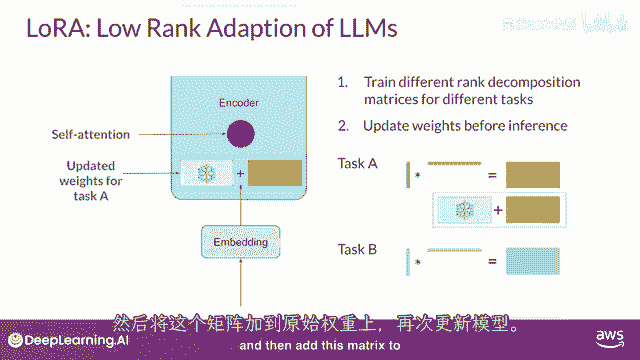

存储这些Laura矩阵所需内存很小，原则上可用Laura为许多任务训练。

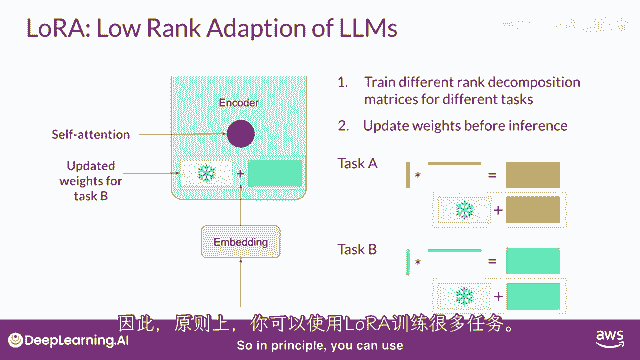

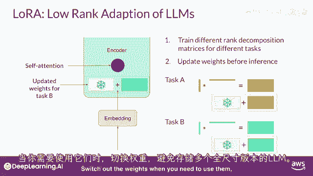

避免存储多个完整大小的LLM版本，这些模型表现如何，使用本周早些时候学习的ROUGE指标，比较Laura微调模型，与原始基础模型和完整微调版本的性能，专注于对Flat Five进行对话摘要微调。

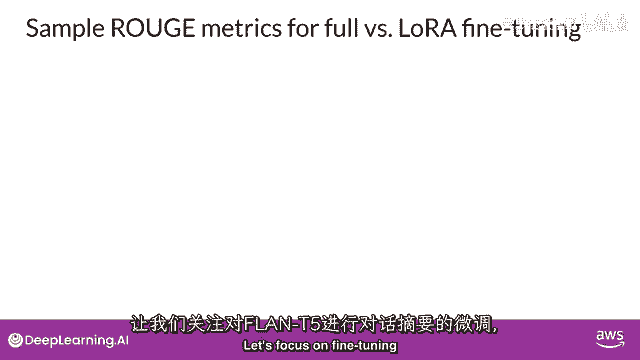

这是本周早些时候探索的内容。

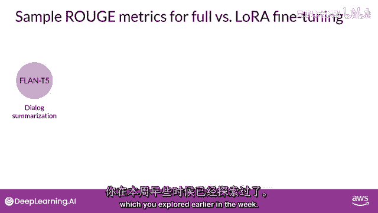

提醒一下，Flat Five基础模型已进行初步完整微调。

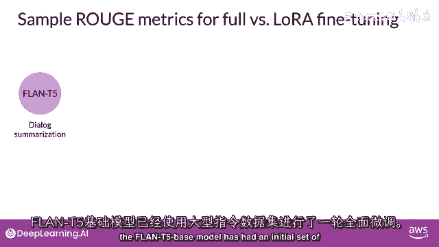

使用大型指令数据集首先，为Flat Five基础模型和讨论的摘要数据集设置基准分数，以下是基础模型的根分数。

分数越高表示性能越好，讨论中应关注ROUGE 1分数，但可用于比较的任何这些分数，如您所见，分数相当低，接下来看模型分数。

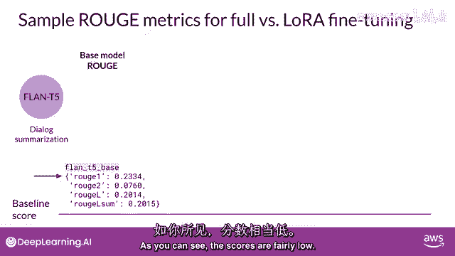

该模型已进行额外完整对话摘要微调，记住。

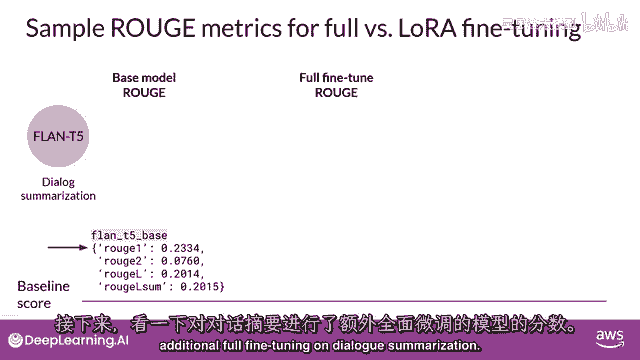

尽管Flat Five是一个能力模型，仍可针对特定任务进行全面微调以获益。

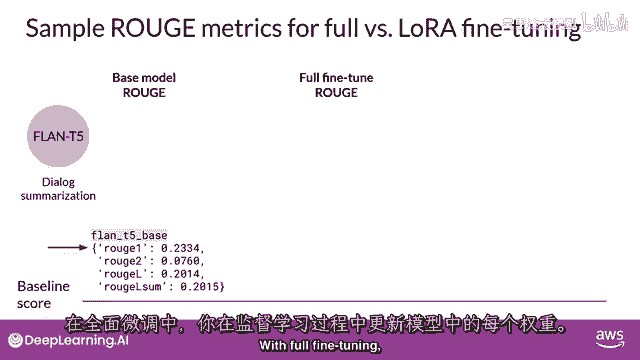

监督学习中更新模型所有权重，这导致ROUGE 1得分大幅提升。

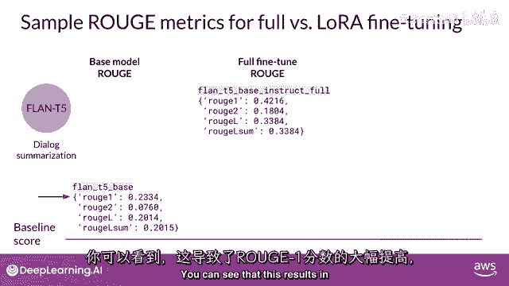

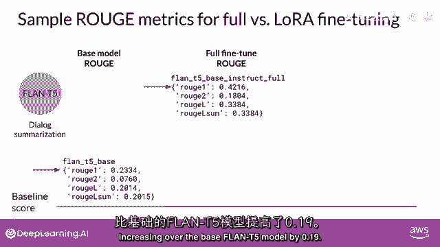

模型提高0。19，额外一轮微调极大改善。

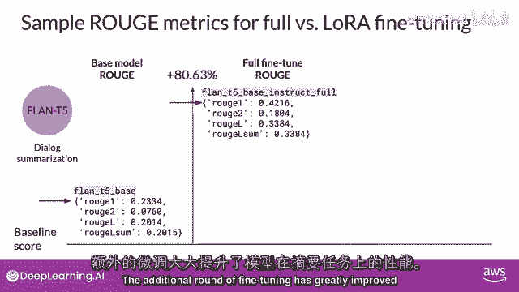

模型在摘要任务上的性能，现在看看Laura微调模型的得分。

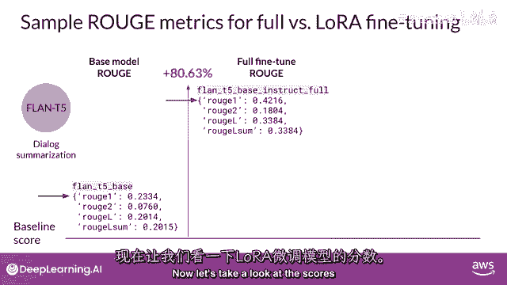

此过程也带来显著性能提升。

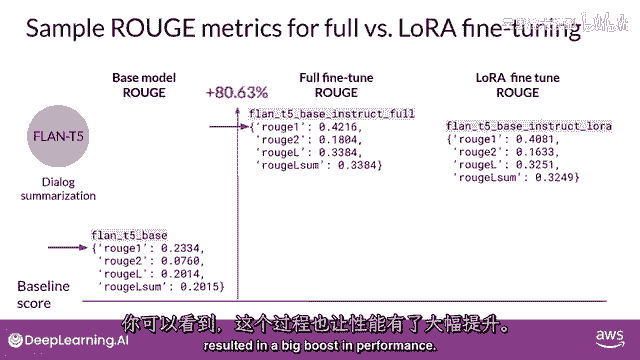

ROUGE 1得分较基准提高0。17。

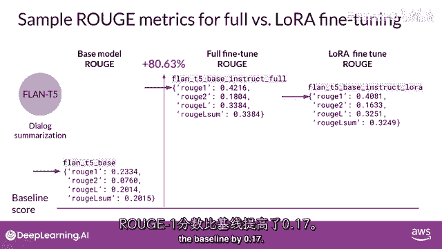

略低于全面微调，但不多，然而，使用Laura微调训练了远少于完全微调的参数。

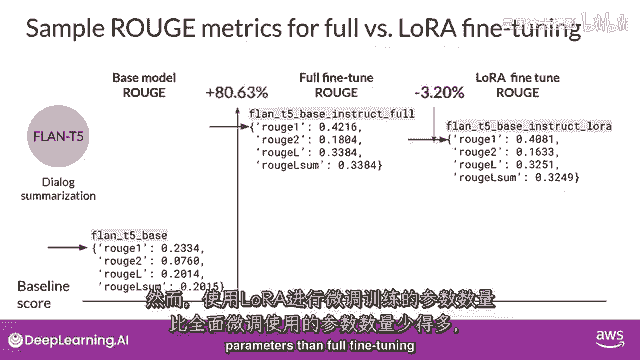

使用更少的计算，因此，这种性能的小幅下降可能非常值得。

你可能想知道如何选择Laura矩阵的秩，这是一个好问题，原则上仍是一个活跃的研究领域，秩越小，可训练参数越少，计算节省越大，然而，需要考虑一些与模型性能相关的问题，在论文中。

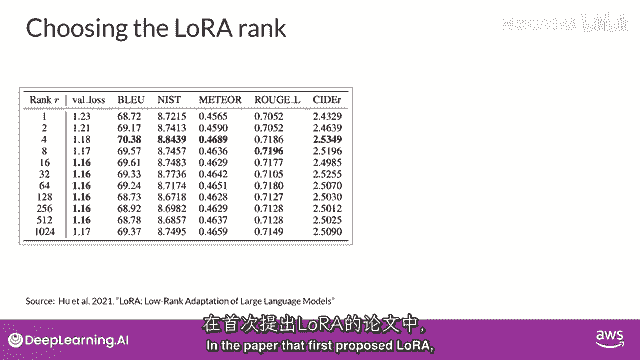

那首次提议的劳拉，微软研究人员探索了不同排名选择对模型性能的影响。

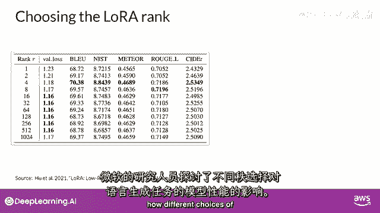

在语言生成任务中，结果总结见下表。

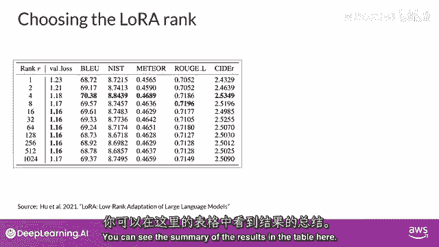

表格显示第一列中Laura矩阵的排名。

模型最终损失值，不同指标得分，包括BLEU和Bruges。

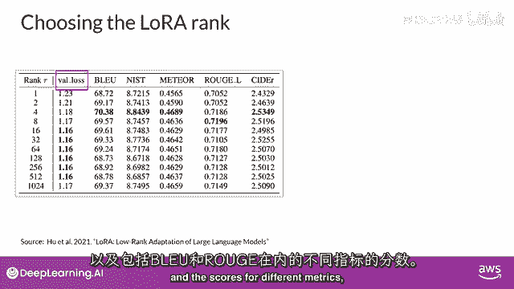

粗体值表示每个指标的最佳得分。

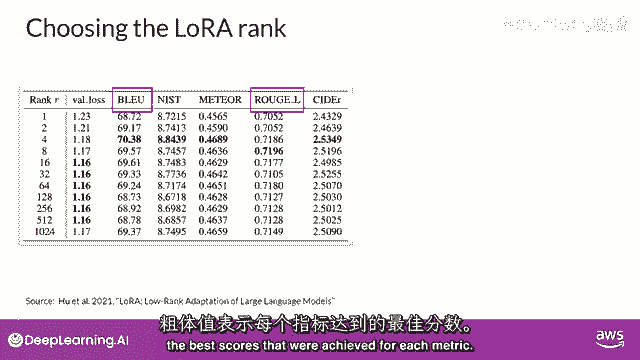

作者发现排名大于16时，损失值达到平稳，换句话说，使用大矩阵无改善。

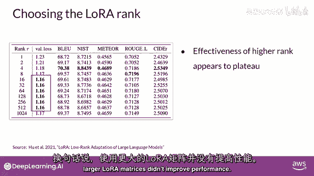

要点是4至3的秩，2可平衡减少参数和保留性能。

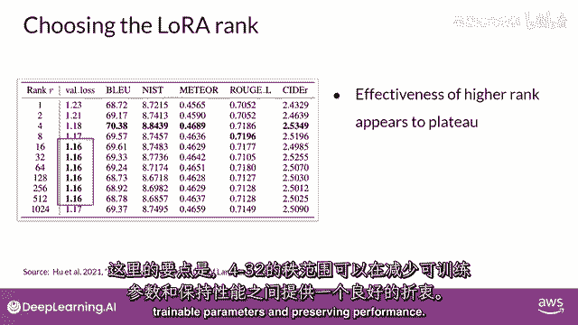

优化秩选择是研究领域，随着更多实践者使用laura，最佳实践可能演变，Laura是强大的微调方法，性能优异，方法原理不仅适用于训练llms，也适用于其他领域的模型，本周探索的最终peft方法。

完全不改变LLM，而是专注于训练输入文本。