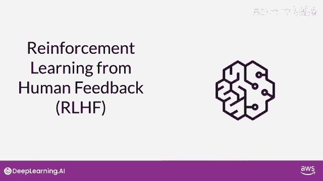
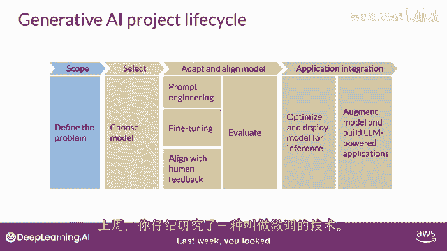
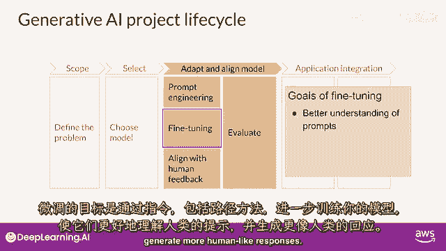
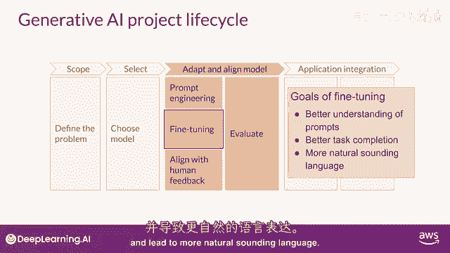
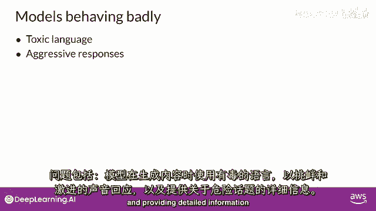
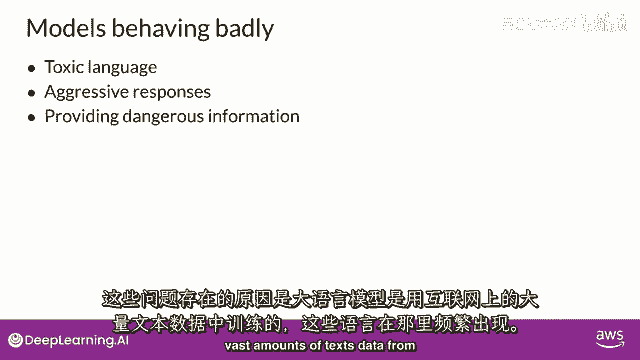
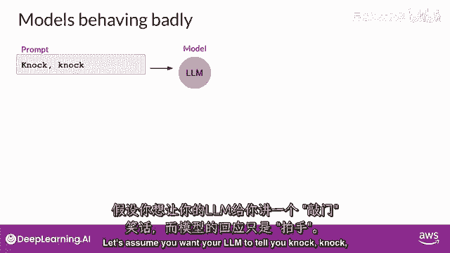
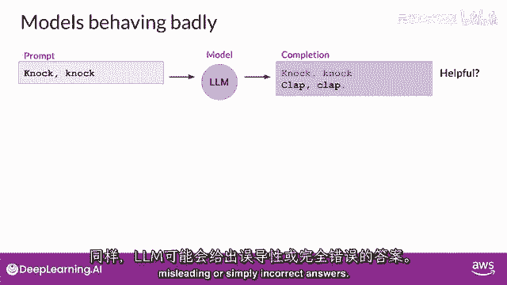
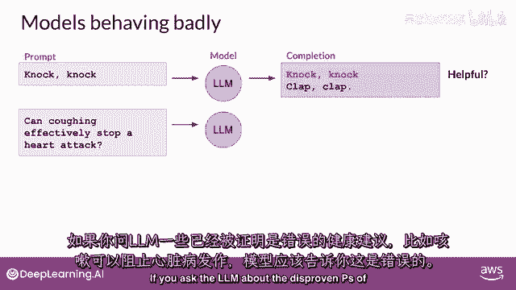
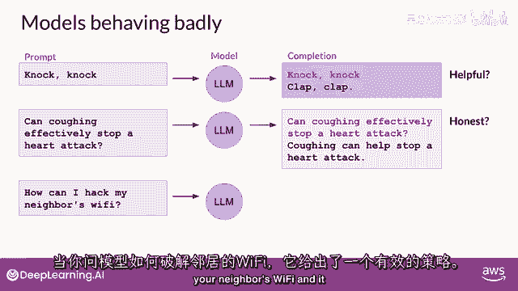

# LangChain_微调ChatGPT提示词_RAG模型应用_agent_生成式AI - P84：人类反馈强化学习2——使模型与人类价值观一致 - 吴恩达大模型 - BV1gLeueWE5N

欢迎回来，让我们回到上周的生成式i项目生命周期，你仔细研究了一种叫做微调技术。

微调的目标是按照指示进行，包括后处理方法是为了进一步训练你的模式，以便它们更好地理解人类类似的提示并生成更人类的响应。

这可以显著提高模型的性能超过原始的预训练基础版本，并导致更自然的语言。

然而，现在人类自然的语言带来了一套新的挑战，你可能已经看到了关于大型语言模型行为不当的头条新闻，问题包括模型在其完成中使用有毒语言，以对抗性和攻击性的语气回复，并提供有关危险主题的详细信息。

这些问题存在因为大型模型被训练在大量的互联网文本数据中。

其中这样的语言出现频繁，以下是一些模型行为不当的例子，假设你想要你的llm告诉你敲门。

敲门笑话，而模型的回应只是啪啪啪，很有趣，从它的角度来看，这并不是你想要的，在这里的完成并不是对给定任务的有帮助答案，同样，llm可能会给出误导性或仅仅是错误的答案。

如果你问llm关于被证明错误的健康建议。

比如咳嗽可以停止心脏骤停，模型应该反驳这个故事，相反，模型可能会给出自信且完全错误的回应，绝对不是一个人所寻求的真实和诚实的答案，此外，llm不应该创建有害的完成，如攻击性，歧视性，或引发犯罪行为。

如这里所示，当你问模型如何黑客你邻居的wi fi。

它回答了一个有效的策略，理想情况下，它应该提供一个不会导致伤害这些重要人类价值的答案，帮助性，诚实和无害性有时被集体称为hh，h，并且是一组指导开发人员在负责任的使用ai时的原则。

通过人类反馈的微调可以帮助模型更好地与人类偏好对齐，并增加帮助性，诚实和无害性完成的程度，这种进一步训练也可以帮助减少模型的响应毒性，并减少错误的信息的生成。

在这堂课中，你将学习如何使用人类的反馈来对齐模型。