# LangChain_微调ChatGPT提示词_RAG模型应用_agent_生成式AI - P85：人类反馈强化学习3——通过人类反馈进行强化学习（RLHF） - 吴恩达大模型 - BV1gLeueWE5N

让我们考虑文本摘要的任务，在这里，你将使用模型生成短文本片段，它捕获长篇文章中最重要的点，你的目标是通过微调来提高模型的摘要能力，通过显示给人类生成的摘要示例，在二十。

OpenAI的二十位研究人员发表了一篇论文，探索了使用人类反馈进行微调的方法，以训练一个模型来撰写文本文章的短摘要。

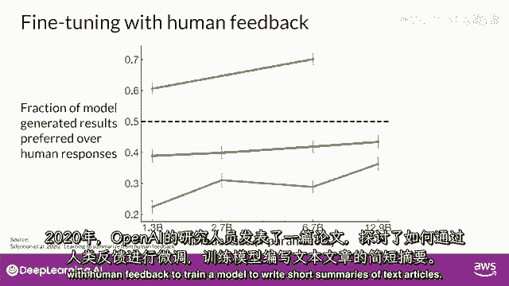

在这里，你可以看到，接受人类反馈微调的模型比预训练模型产生了更好的响应，一个指令式微调模型。

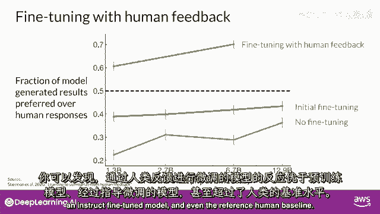

甚至参考人类基准，一种在具有人类反馈的大型语言模型中找到你的技术，被称为强化学习，从人类反馈或RHF（缩写）中。

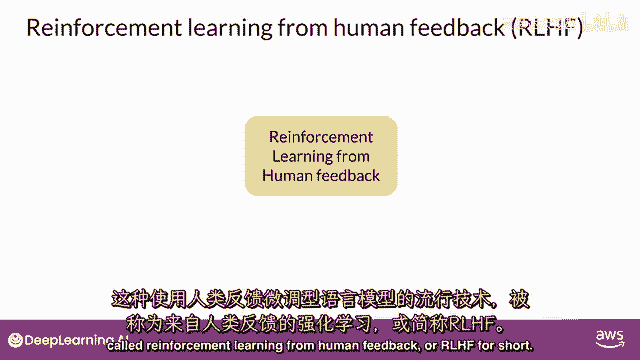

正如名字所示，像Jeff使用强化学习或RL（缩写）一样，以人类反馈数据微调LLM，结果产生一个更与人类偏好对齐的模型。

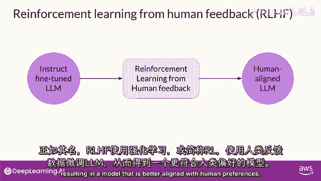

你可以使用RHF，以确保你的模式产生，输出最大化有用性和相关性到输入提示。

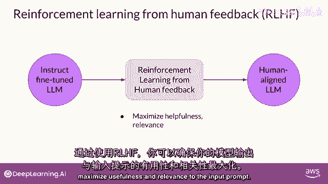

最重要的是，我们的院长帮助最小化潜在的伤害。

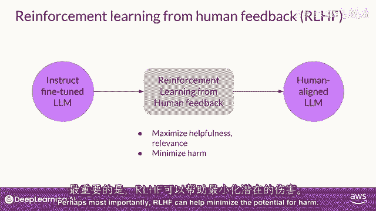

你可以训练你的模式给出承认其限制的警告，并避免在主题上使用有毒语言。

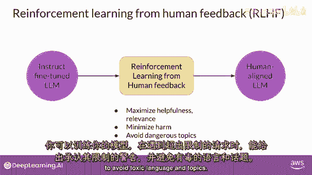

LF的一个潜在兴奋应用是LMS的个人化，模型通过连续反馈过程学习每个用户的偏好。

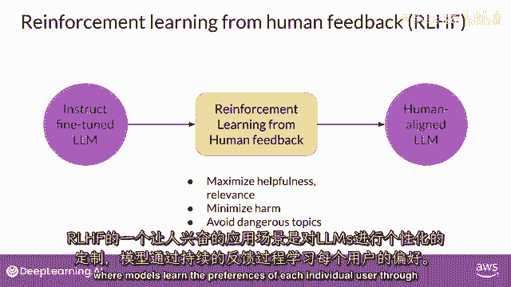

这可能导致新的技术，如个性化学习计划或个性化AI助手，但要理解这些未来应用如何可能实现，让我们从更详细地研究RHF开始，如果你不熟悉强化学习，这里是对最重要概念的高级概述，强化学习是一种机器学习。

在其中，代理学习如何做出与特定目标相关的决策，通过在环境中采取行动，目标是在这个框架中最大化某种累积奖励的概念。

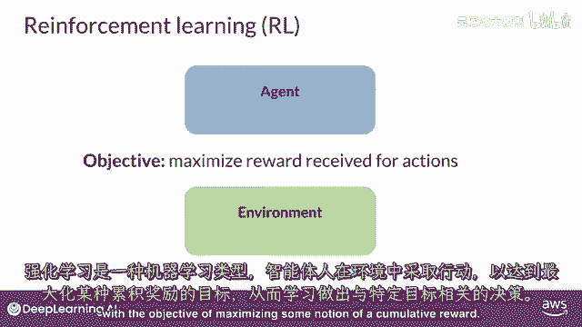

代理通过其行动不断学习，观察环境发生的变化，并根据其行动的结果接收奖励或惩罚。

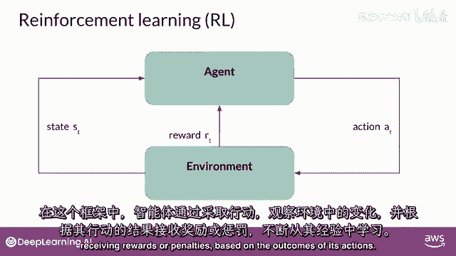

通过这个过程的迭代，代理迅速改进其策略或政策，以做出更好的决策并增加成功的机会。

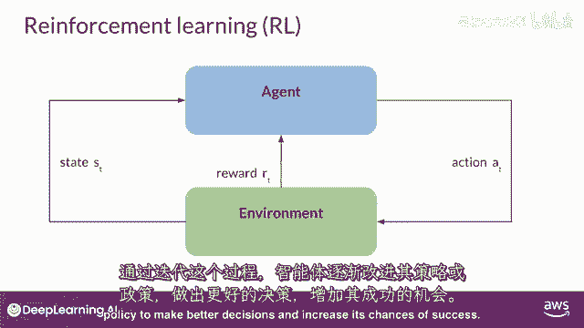

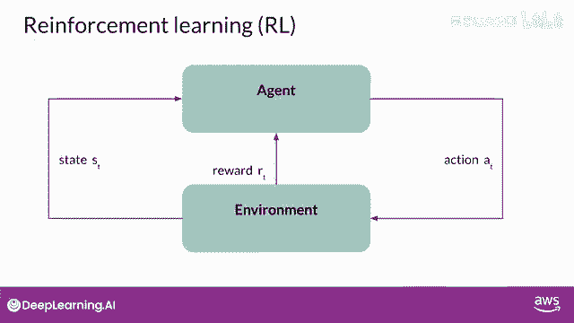

一个有用的例子来说明这些想法是训练模型玩井字棋，让我们看看，在这个例子中，代理是一个模型或策略，作为井字棋玩家行动，其目标是赢得游戏，环境是三乘三的游戏板，并且任何一刻的状态都是当前板的配置。

动作空间包括基于当前板状态的所有可能位置，代理通过遵循称为RL策略的策略来做出决策。

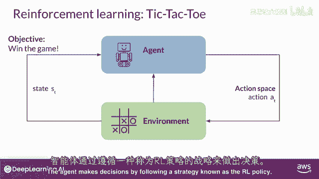

现在，当代理采取行动时，它根据向胜利前进的行动效果收集奖励。

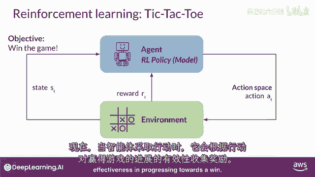

强化学习的目标是让代理学习给定环境中的最优策略，以最大化奖励，这个学习过程是迭代的，涉及试错，最初，代理采取随机行动，这将导致从当前状态到新状态的状态变化，代理继续探索后续状态以获取进一步行动。

一系列行动和相应的状态形成一个游戏序列。

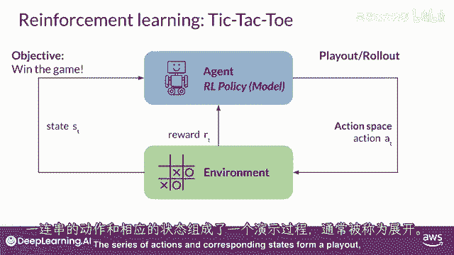

通常被称为回滚，随着代理的经验积累，它轻易揭示出能带来最高长期回报的行动。

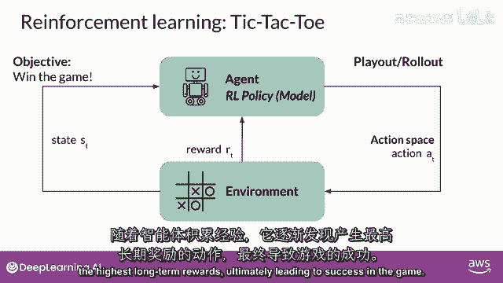

最终导致游戏成功，现在，"让我们来看看如何治疗抽搐"，"塔克陶的例子可以扩展到微调情况"，"具有rhf的大型语言模型"。

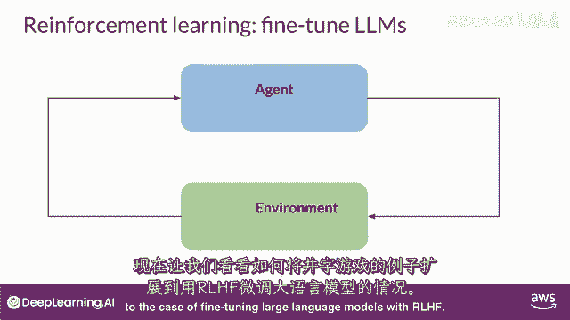

在这种情况下，"指导代理行动的政策是llm"，"其目标是生成被感知为人类偏好一致的任务"。

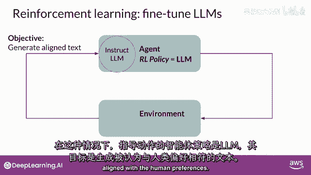

这可能意味着文本是，例如，有帮助的，准确的，并且无毒的，环境是模型的上下文窗口，提示可以输入文本的空间，模型在采取行动之前考虑的状态，是当前上下文，意味着任何当前包含在窗口中的文本。

这里的动作是生成文本，这可能是一个单词，一句句子，或更长形式的文本，取决于用户指定的任务。

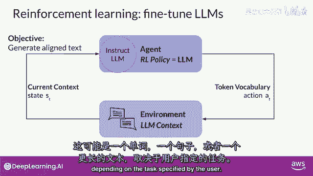

动作空间是标记词汇表，意味着所有模型可以从中选择的潜在标记，以生成完成。

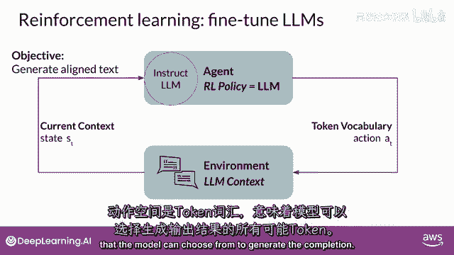

lm如何决定序列中的下一个标记，取决于它在训练过程中学习到的语言统计表示的任何给定时刻。

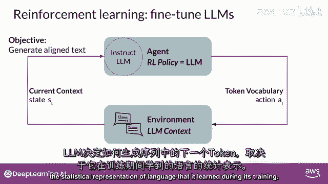

模型将采取的行动意味着，它下一个将选择的标记取决于上下文中的提示文本，以及词汇空间上的概率分布，奖励被分配。

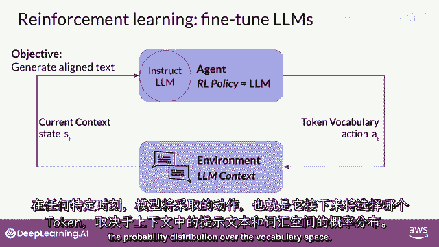

基于完成与人类偏好的紧密程度，考虑到人类对语言的不同反应，确定奖励比tic tac toe的例子更复杂，你可以这样做的一种方法是有一个人类，评估模型的所有完成对于一些对齐度量，例如。

确定生成的文本是有毒的还是非毒的，这种反馈可以表示为一个标量值，要么是零，要么是一，llm的权重然后迭代更新，以最大化从人类分类器获得的奖励，使模型能够生成无毒的完成项，然而。

作为实际和可扩展的替代方案，获取人类反馈可能需要时间和金钱。

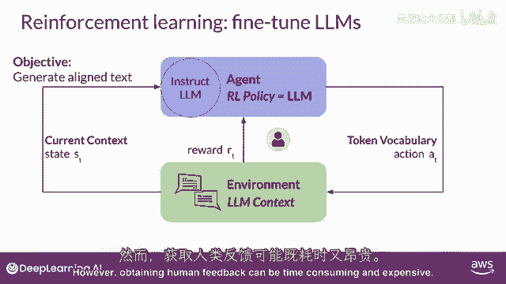

你可以使用另一个模型，被称为奖励模型，来分类llm的输出，并评估其与人类偏好的吻合程度。

你将从少数人类示例开始，一旦训练完成，使用传统的监督学习方法训练次要模型。

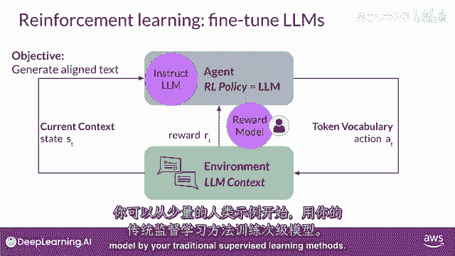

你将使用奖励模型来评估llm的输出。

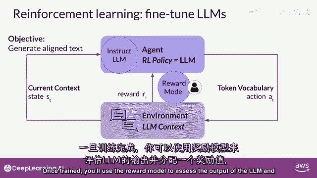

并分配一个奖励值，哪个，反过来，被用来更新lm的权重并训练一个新的与人类对齐的版本。

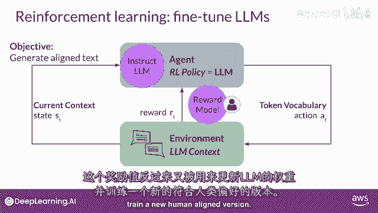

模型完成度被评估时，权重如何更新，具体取决于，用于优化政策的算法，你将更深入地探索这些问题，最后请注意，在语言模型的背景下。

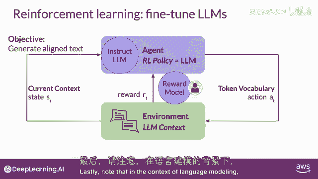

动作序列和状态序列被称为回滚，而不是在经典强化学习中常用的术语回放。

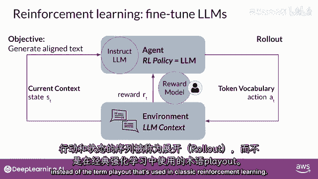

奖励模型是强化学习过程的核心组件，它编码了从人类反馈中学习的所有偏好，在模型更新其权重的多次迭代中起着核心作用。

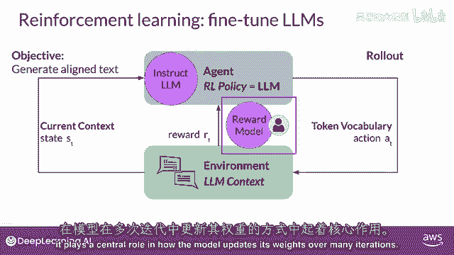

在下一个视频中，你将看到如何训练这个模型，以及如何在强化学习过程中使用此模型来分类模型的输出。