# LangChain_微调ChatGPT提示词_RAG模型应用_agent_生成式AI - P87：人类反馈强化学习5——RLHF - 奖励模型 - 吴恩达大模型 - BV1gLeueWE5N

好的，目前阶段，你已拥有训练奖励模型的所有必要内容，虽然到达这一点花费了相当多的人力，当你完成训练奖励模型时，将不再需要将人类纳入循环中，相反，奖励模型将有效地脱离人类标注者。

并在ARHF过程中自动选择首选完成。

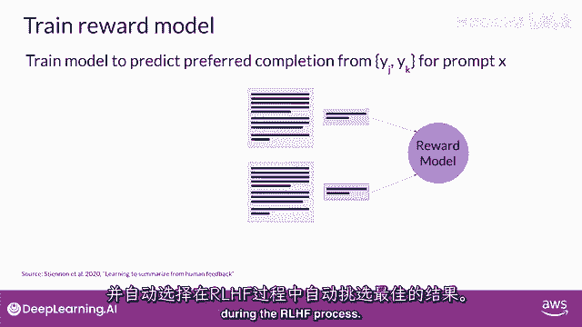

此奖励模型通常也是一个语言模型，例如，使用监督学习方法训练的鸟，基于你准备的成对比较数据。

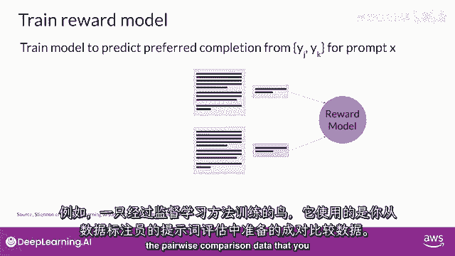

从人类标注者对给定提示x的评价，奖励模型学会偏爱人类首选完成y_j，同时最小化奖励差异r_j减去r_k的对数sigmoid，如上一页所示。

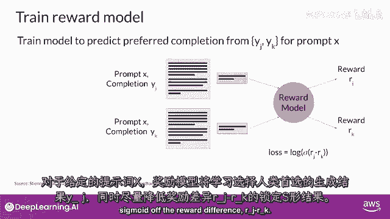

人类首选选项始终是第一个标记为y_j的，一旦模型在人类排名提示完成对上进行训练。

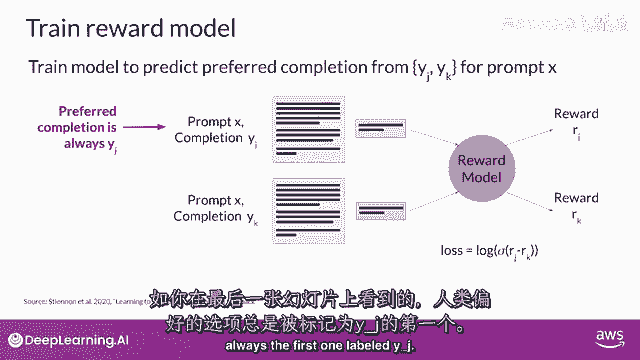

你可以将奖励模型用作二元分类器。

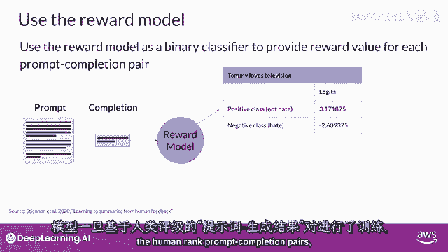

为正负类提供一系列逻辑。

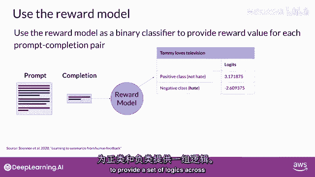

逻辑是未应用任何激活函数的模型输出，假设你想净化你的LLM。

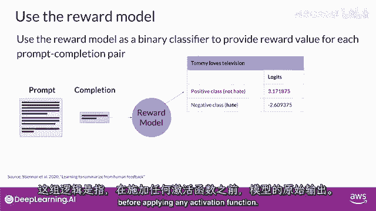

并且奖励模型需要识别完成是否包含仇恨言论，在这种情况下。

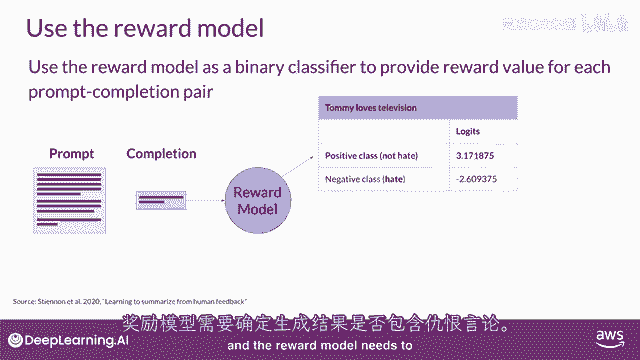

两个类别将是非仇恨，即你最终希望优化的正面类别，和仇恨，即你想避免的负面类别。

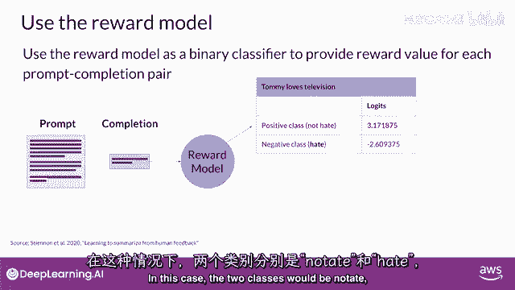

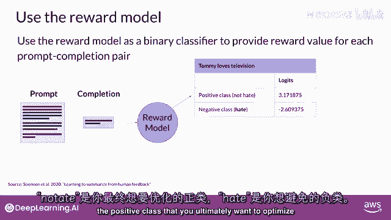

正面类别的逻辑值是你在RHF中使用的奖励值，提醒一下，如果你对逻辑应用softmax函数。

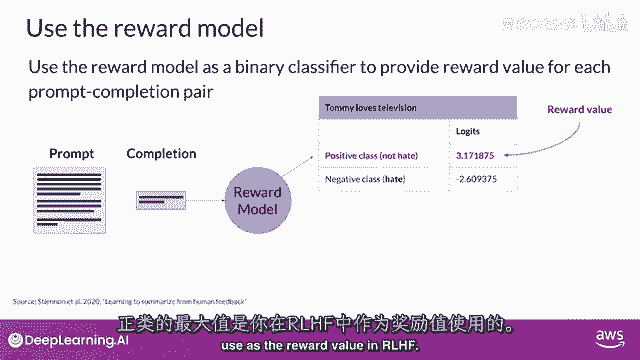

你将获得概率，此示例显示了对非毒性完成的良好奖励。

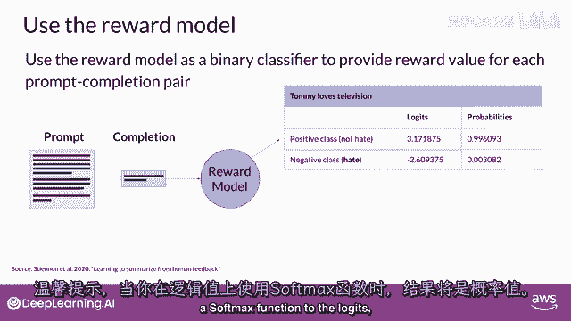

第二个示例显示了对毒性完成的糟糕奖励，嘿嘿。

我知道这节课到目前为止已经涵盖了大量内容，但此时你拥有了一个强大的工具——奖励模型，用于对齐你的LLM，下一步是探索奖励模型如何在强化学习过程中使用，以训练你的人类对齐LLM，加入我在下一个视频中。

看看这是如何工作的，在下一节中。