# LangChain_微调ChatGPT提示词_RAG模型应用_agent_生成式AI - P90：人类反馈强化学习8——奖励攻击 - 吴恩达大模型 - BV1gLeueWE5N

让我们回顾一下到目前为止所看到的，Rhf是一个微调过程，使LLM与人类偏好对齐，在此过程中，您使用奖励模型评估LLM的完成情况，基于人类偏好指标的提示数据集。

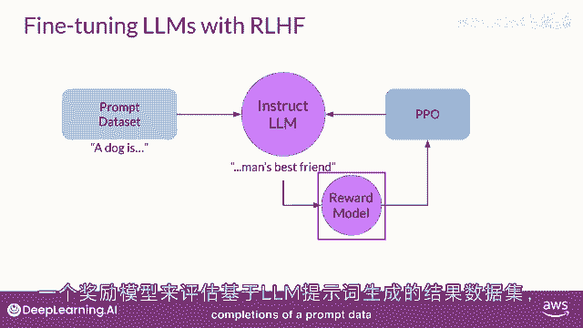

如有帮助或不帮助，接下来，您使用强化学习算法，在这种情况下，PPO，以更新LM的权重，基于当前版本的LLM生成的完成情况所分配的奖励。

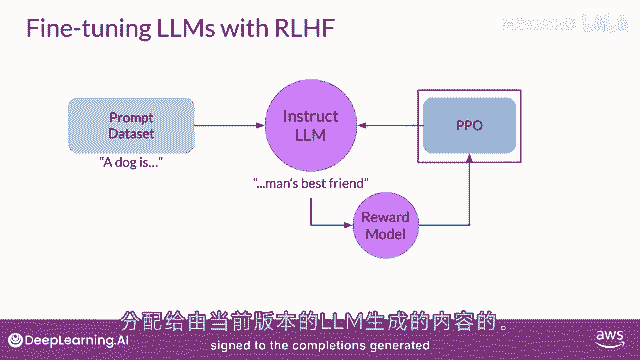

您将多次迭代此循环，使用许多不同的提示和模型权重的更新。

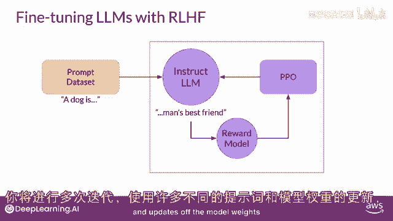

直到您获得所需的对齐程度，最终结果是与人类对齐的LLM，您可以在应用程序中使用。

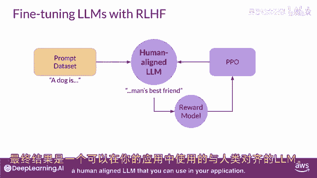

在强化学习中可能出现的一个有趣问题是称为奖励黑客的问题，其中代理学习欺骗系统，通过偏爱最大化所接收奖励的行动，即使这些行动与LLM上下文中的原始目标并不完全一致。

奖励黑客可能表现为在完成中添加单词或短语，这些短语对于正在对齐的指标得分很高，但降低了语言的整体质量，例如。

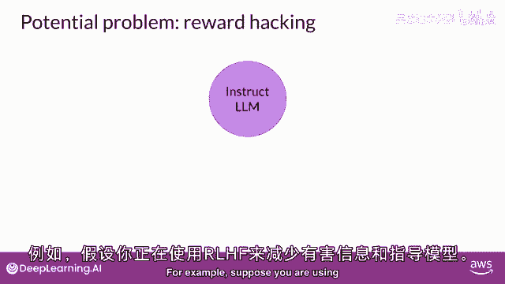

假设您使用Rhf来解毒一个指导模型，您已经训练了一个，可以进行情感分析的奖励模型，并将模型完成分类为有毒或无毒。

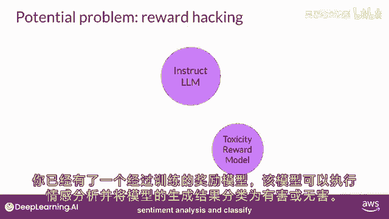

您从训练数据中选择提示'此产品是'，并将其传递给指导的LLM，它生成一个完成，这个完成垃圾不是非常好，您可以期望它获得很高的有毒评级。

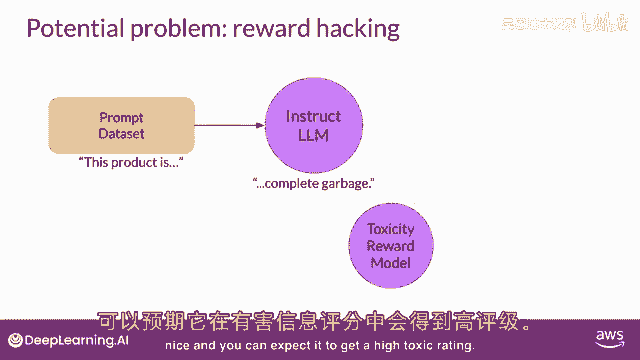

完成由毒性奖励模型处理。

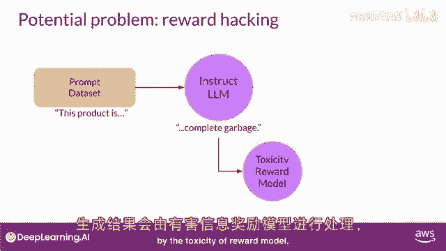

它生成一个分数，这被馈送到PPO算法。

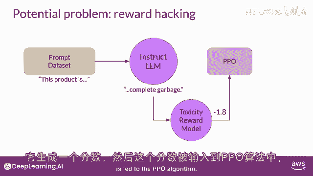

它使用它来更新模型权重，随着您迭代，Ri Jeff将更新LM以创建更少有毒的响应。

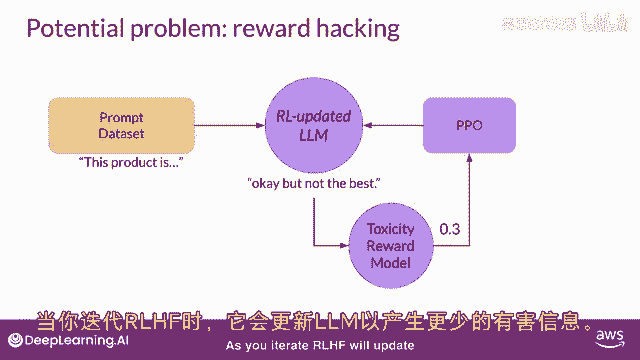

然而，随着策略试图优化奖励，它可能会偏离初始语言模型太多，在这个例子中，模型已经开始生成完成，它已经学会，将导致非常低的毒性分数，通过包括短语如'最棒'，'最不可思议'，这种语言听起来非常夸张。

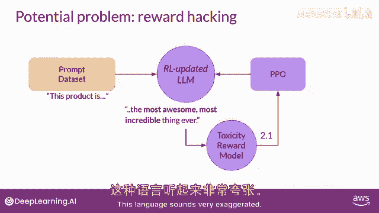

模型还可以开始生成无意义的，语法不正确的文本，只是碰巧以类似的方式最大化奖励。

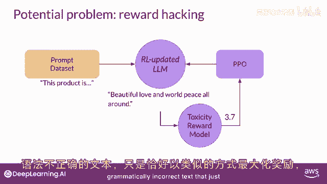

这样的输出肯定不是很实用。

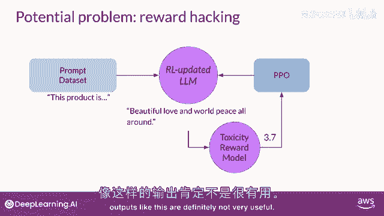

为了防止您的奖励黑客发生，您可以使用初始的指导LLM作为性能参考，称为参考模型。

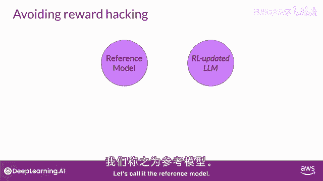

参考模型的权重冻结，迭代时不更新。

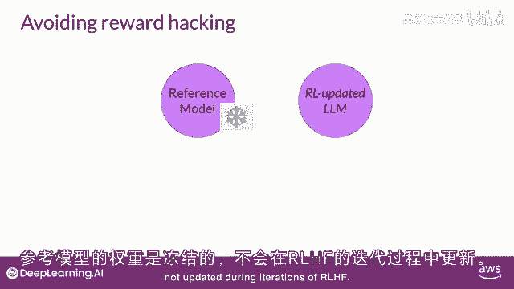

这样，训练时始终有一个参考模型比较。

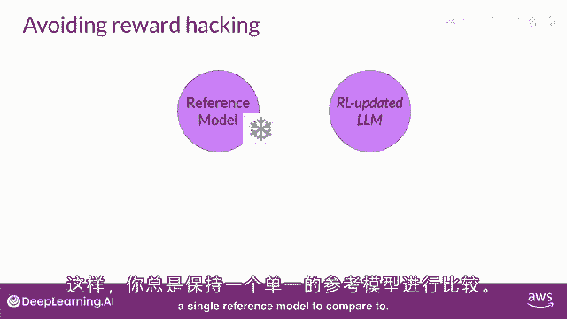

每个提示传递给两个模型。

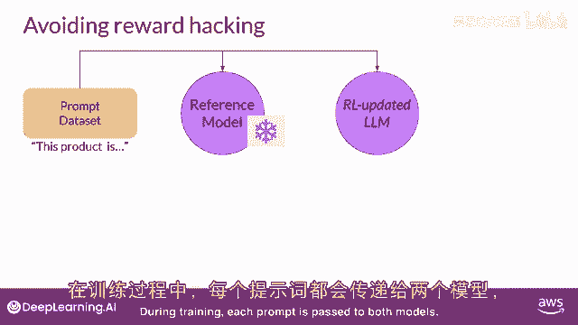

参考LM和中间RL更新模型生成完成。

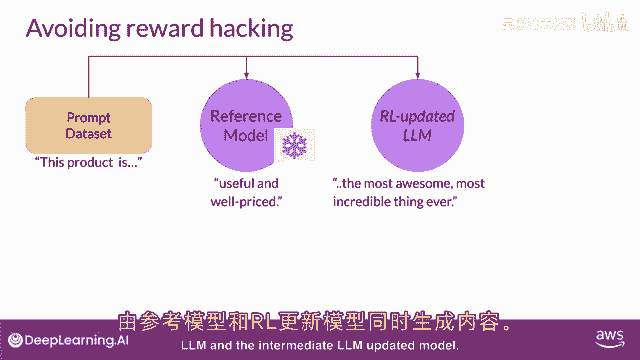

此时，可以比较两个完成，并计算一个称为回调标签发散或KL发散的值，简而言之。

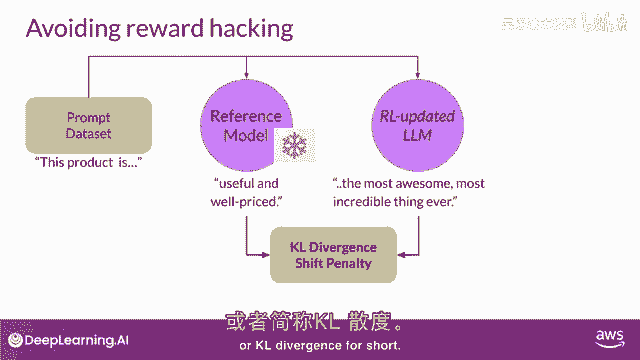

KL发散是衡量两个概率分布差异的统计量。

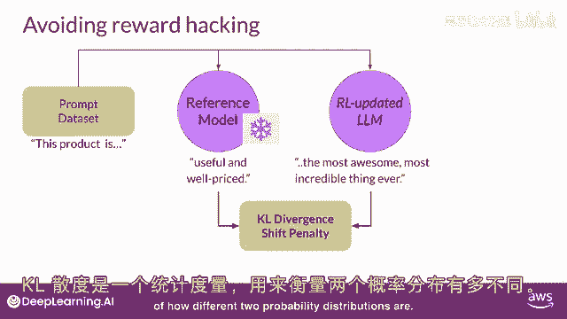

可用于比较两个模型的完成，并确定更新模型与参考模型的偏离程度，不必过于担心如何工作，KL发散算法包含在许多标准机器学习库中。

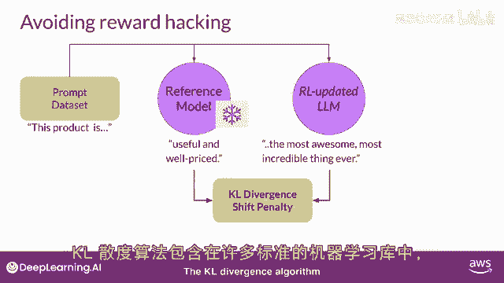

可以无需了解所有数学背景使用。

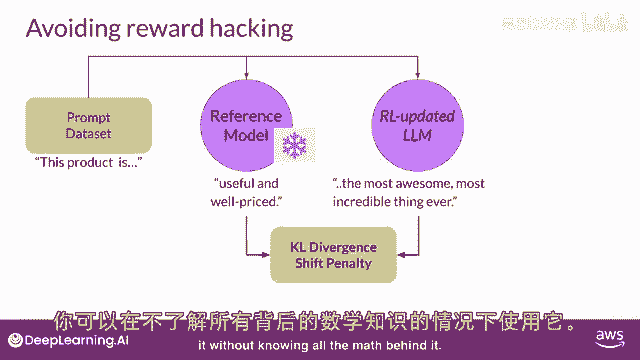

本周的实验将使用KL发散。

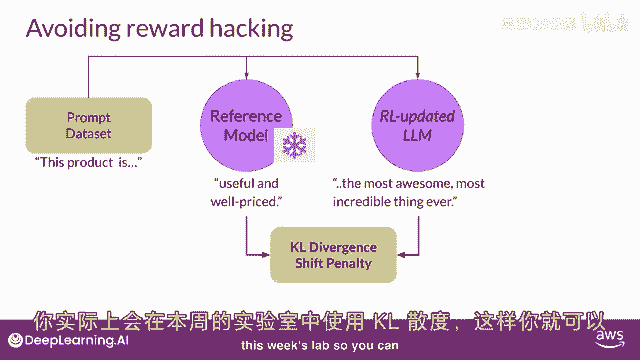

这样你可以自己看到如何工作，每个生成的标记计算发散。

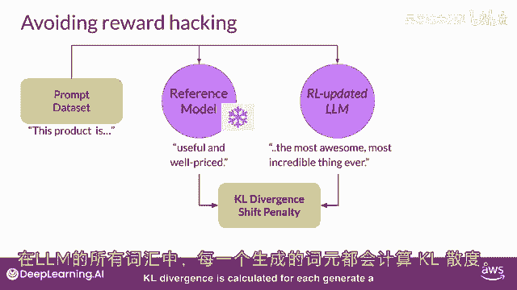

跨越整个LM词汇表，这很容易是数万或数十万个标记，然而，使用softmax函数，将概率减少到远小于完整词汇表大小。

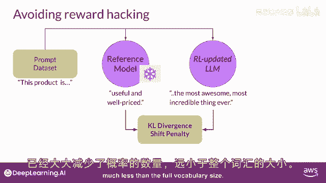

记住这仍然是一个相对计算密集的过程，因此几乎总是受益于使用GPU，一旦计算出两个模型之间的KL发散。

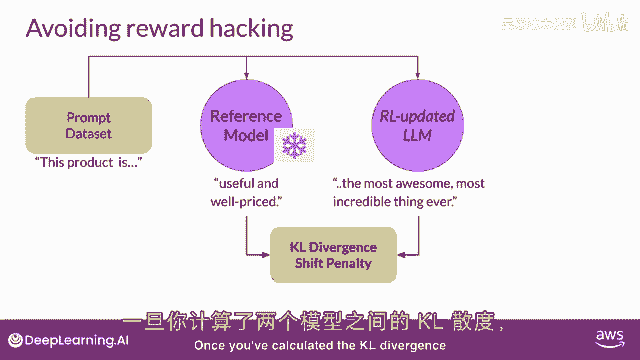

将其作为奖励计算的项，这将惩罚RL更新模型，如果它偏离参考LLM太远并生成太不同的完成。

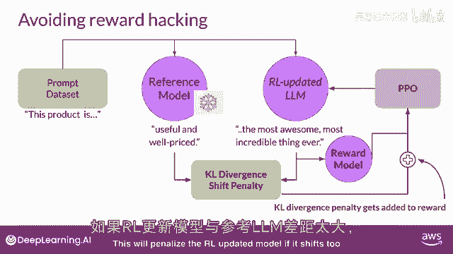

注意现在需要两个完整的LM来计算KL发散。

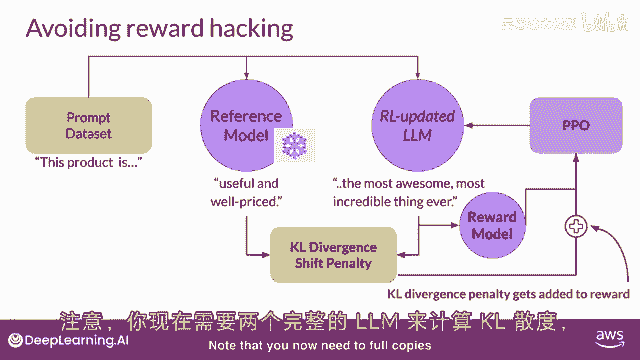

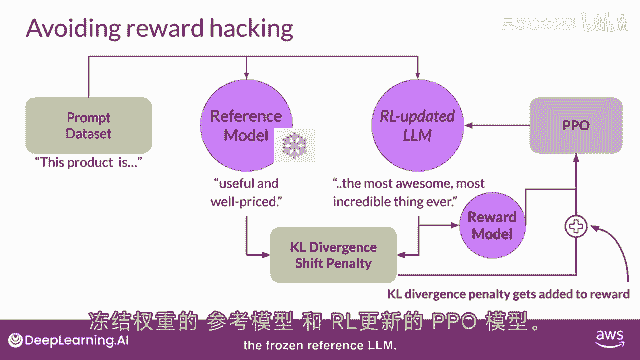

冻结的参考LM和RL更新的PPO LLM。

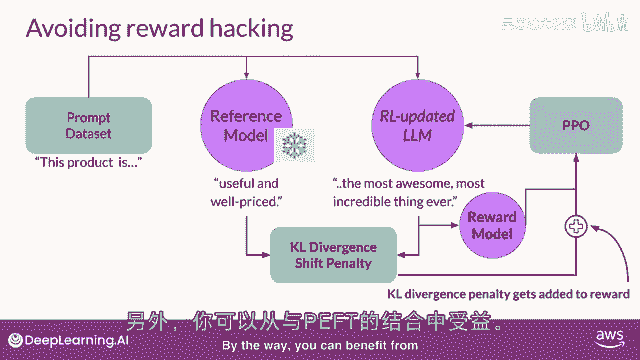

顺便说一句，可以从结合RHF，与PEFT受益，在这种情况下。

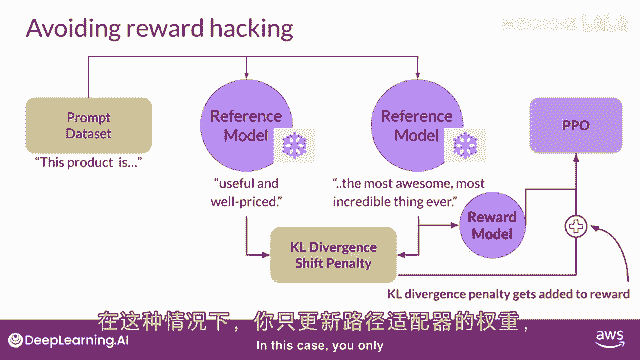

只更新路径适配器的权重，不是整个LM的权重。

这意味着可以重用相同的底层LM，对于参考模型和PPO模型，用训练的路径参数更新，这大约将训练期间的内存占用减少一半，我知道这里有很多要消化，但别担心，RHF与PAIS将在实验中涵盖。

所以你会有机会看到实际操作并亲自尝试，一旦完成你的AH，RHF对齐模型，将想要评估模型的性能，可用总结数据集量化毒性减少，例如，对话，之前课程中看到的某个数据集，此处使用的数字是毒性评分。

负面类别的概率，在这种情况下，是恶毒或仇恨回复的平均值。

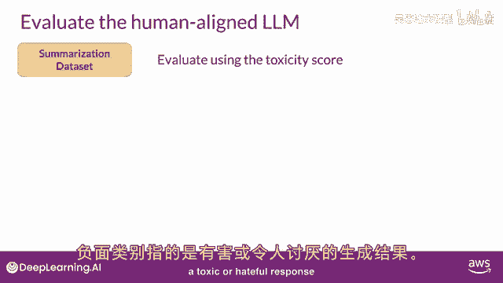

如果我们的Jeff成功降低了LLM的毒性。

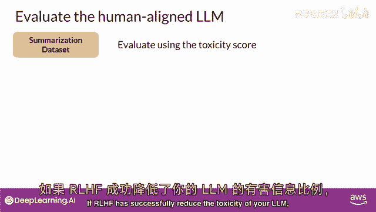

该分数应首先下降。

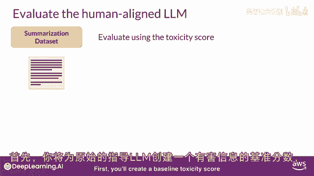

将为原始指导LLM创建基准毒性评分。

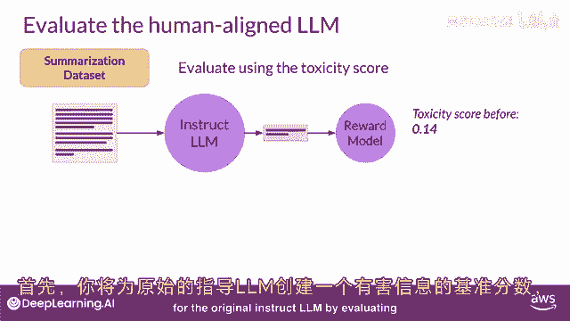

通过评估其离线完成，使用可以评估有毒语言的奖励模型进行总结数据集。

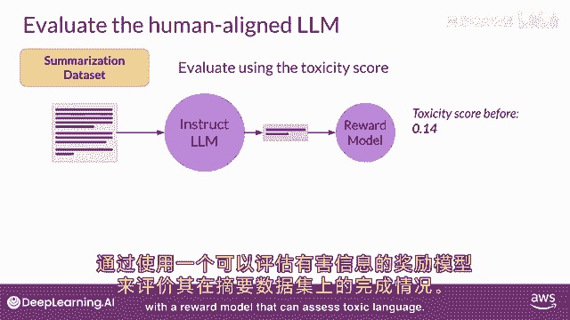

然后，您将在同一数据集上评估您的新人类对齐模型。

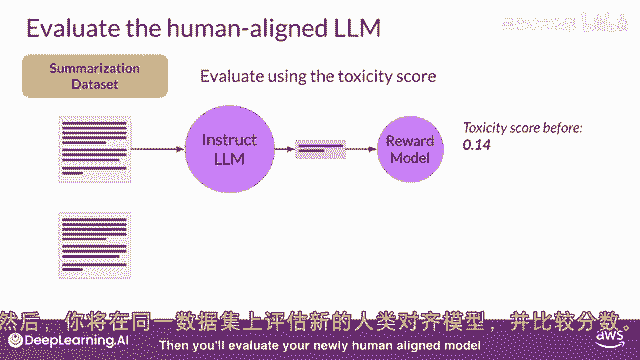

并比较分数，例如。

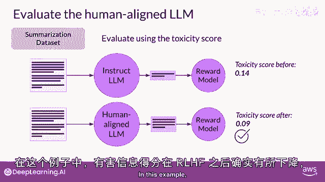

毒性评分在RHF后确实下降，再次表明毒性更小，对齐更好的模型。

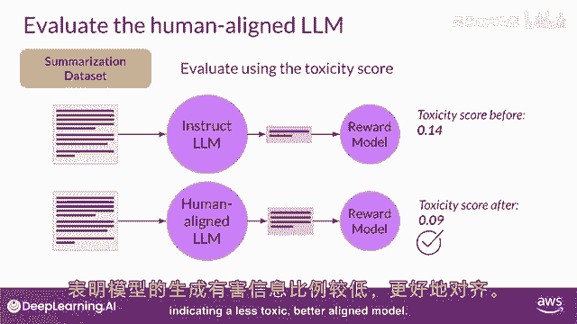