# LangChain_微调ChatGPT提示词_RAG模型应用_agent_生成式AI - P95：4.L3-dense retrieval.zh - 吴恩达大模型 - BV1gLeueWE5N

欢迎来到第三堂关于密集检索的课，现在，我们已经在之前的课程中学习了嵌入式，让我们学习如何使用它们进行语义搜索或搜索。

按照意义，这堂课将分为两部分，在第一部分，我们将连接到我们在第一课中使用的同一数据库。

但是，而不是做关键词搜索，我们将做向量搜索，使用嵌入式进行语义搜索，然后在第二部分，我们已经对已经为我们准备的向量数据库感到舒适，我们将从文本的开始处处理，并看看如何从零开始构建一个向量索引。

让我们使用之前的代码加载我们的API密钥，所以在我们做语义搜索之前，让我们首先将cohere移植过来并设置cohere的Python SDK，我们说，去这里，那个客户端，然后。

我们就将API密钥访问代码粘贴上去，我们会像设置UV一样做同样的事情，连接八个客户端，连接到那个精确的数据库，到现在为止，没有什么是新的，现在，在我们开始编写基于嵌入式或密集检索的搜索代码之前。

让我们根据我们在嵌入式课程中学到的内容来理解它，所以我们有查询，加拿大的首都是什么，我们有，假设，在我们的档案中，有五个可能的回应或句子，加拿大的首都是渥太华，法国的首都是巴黎。

我们可以像处理嵌入一样绘制这些，并且我们可以看到，意义相似的句子，在图中将靠近彼此，所以如果我们绘制所有这些五个，我们可以看到，关于加拿大和法国的首都的句子彼此靠近，然后。

关于颜色的这些句子在顶部紧密地排列在一起，现在就在这里，这个查询应该在哪里，如果我们将其投影到相同的嵌入空间中，如果我们使用优化为搜索的嵌入模型，它将最接近那个查询的答案，因此。

当我们问加拿大的首都是什么时，它将最接近这个点，说加拿大首都是奥托的句子，这就是我们如何使用我们在嵌入中学到的东西，将这些相似性和距离的特性用于搜索，这就是密集检索，语义搜索的两种主要方式之一。

另一种是后锚点，让我们看看如何使用weave ate进行密集检索，这是代码，对你来说会很熟悉，如果你已经完成了第一课，这是we v eight API调用，这里的主要区别是。

我们不再使用bm two five，我们说的是近文本，在这里，我们将查询传递给，所以我们将查询放入这个Python字典，我们称它为近文本，然后我们将这个变量传递给查询，这就是我们如何获取响应。

这就是we v eight如何进行向量搜索，而不是pm two five的关键词搜索，一旦我们执行了这个，我们可以开始发送查询并查看结果，所以现在让我们运行一些查询并看数据库返回什么。

假设我们有这个查询谁写了哈姆雷特，我们可以运行它，这是第一个结果，发生了什么，是所有文本的嵌入都被查询匹配了吗，这是查询最相似的文本，在这里，我们可以看到它谈论莎士比亚写哈姆雷特。

所以这是归档中最相关的文本，对于这个查询，我们也可以在第二个结果中看到，它提到了莎士比亚和写作，所以这是这里另一个相关的结果，uv eight返回这个距离数字，这表明查询与这里的文本有多近。

现在让我们尝试另一个查询，这可能有点困难，所以让我们说加拿大的首都是什么，我们搜索，第一个结果是来自维基百科的渥太华页面，这是加拿大的首都，让我们看看关键词搜索如何比较。

让我们导入我们在第一课中构建的关键词搜索函数，并将相同的查询传递给这个函数，让我们看看我们的结果是什么。

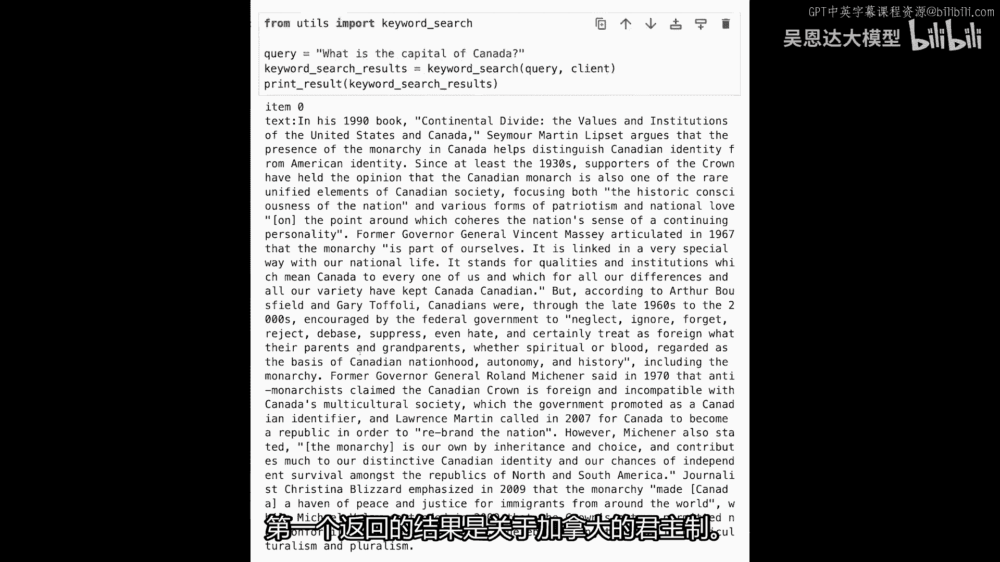

但不是真的很加拿大的首都。

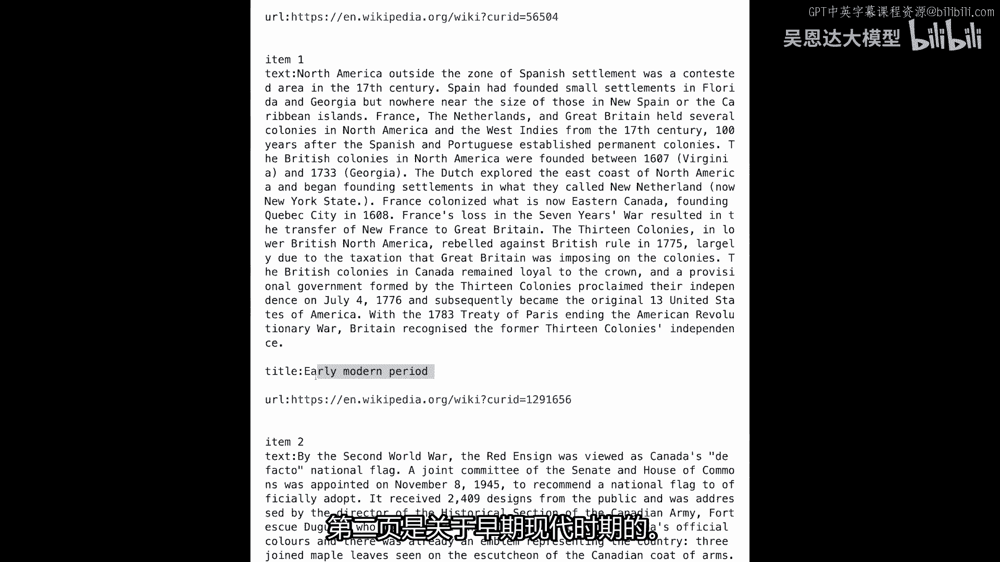

第二个页面是关于早期现代时期的，第三个结果是关于加拿大国旗的，所以也在同一空间，也许不是这个一个，但不是我们想要查询的答案。

也不是数据集对于这个查询最相关的段落，让我们再看一个例子，在另一个查询上，我们再次比较关键词搜索和时态检索，所以让我们说，我们现在想要查看的查询是，历史上最高的人，如果我们对这个进行关键词搜索。

我们将得到关于日本的历史信息。

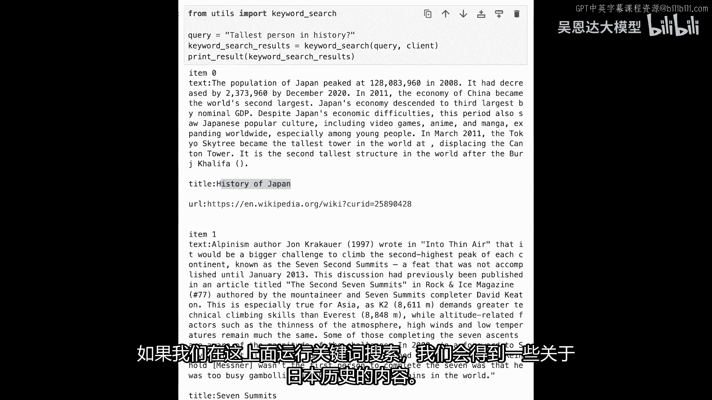

我们将得到七座高峰，我们还得到了有关哈梅德·本·哈利法·阿尔·坦尼的信息，这些并不完全与我们现在的查询相关。

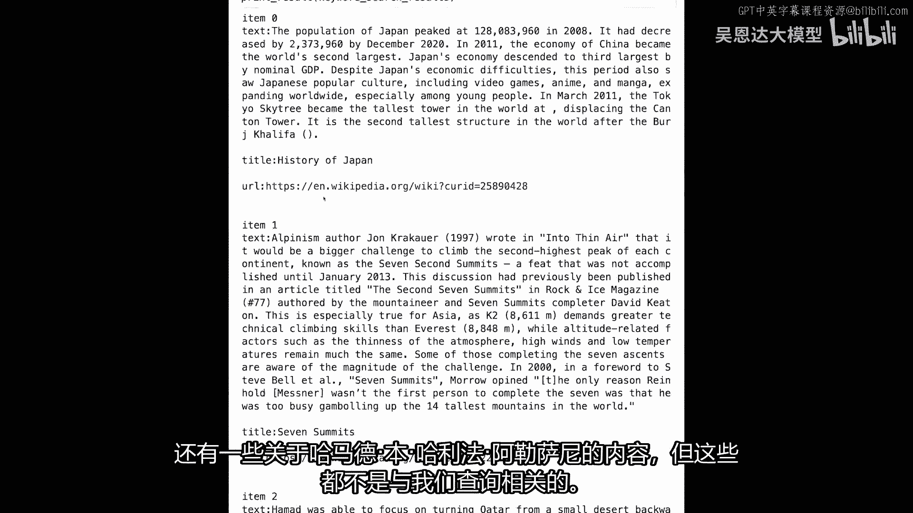

如果你这样做密集检索。

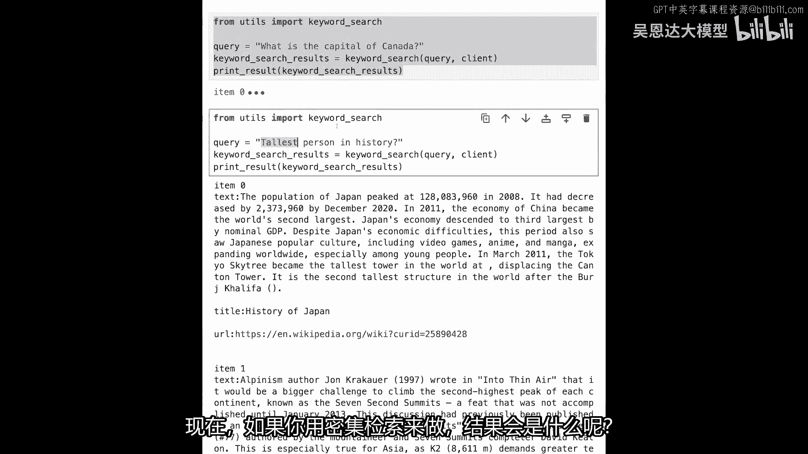

结果会是什么，让我们复制代码，然后只是更改查询，让我们说，历史上最高的人，然后检索能够给我们罗伯特·沃德洛，他是谁，他是有记录以来最高的人，对于 whom 有无可争议的证据，所以这是另一个例子。

在哪里密集检索真正能够捕获查询的意图，并返回最佳结果，在这里要展示的另一件事，密集检索在多语言方面真正有帮助的是，所以这就是你如何支持多语言搜索的，所以让我们说，我们从前有过同样的查询。

但如果我们用另一种语言写，我们一直在使用的模型，这是一个多语言模型，所以它能够匹配在德语中的查询，以任何其他语言的结果，我们可以选择结果语言，它可以接受查询的任何语言，所以让我们使用阿拉伯语的翻译。

让我们说，对于这个相同的查询，所以这将像这样，当我们执行这个，这是历史上最高的人，只是它用阿拉伯语写，它能够返回给我们相同的结果，另一个真的很酷的事情，我喜欢在嵌入式搜索中做的一件事是探索。

所以你可以说关于时间旅行悖论的电影，你可以探索你返回的结果，所以这是一部关于时间的电影，嗯，让我们说，还有一个叫做时间机器的电影，这可能基于小说，嗯，关于时间再次，你可以花很多时间探索像这样的数据集。

我发现这非常有趣，我花费大量的时间使用语义搜索探索数据集，像这样，所以现在是一个开始花几分钟探索的好时机，你可以通过更改查询并在维基百科内部查找各种页面来使用语义搜索，这就是第一部分。

我们只是消费向量数据库的结束，现在让我们开始第二部分，实际上构建我们自己的向量搜索数据库，所以让我们从导入一些库开始，我们需要主要的一个，这里是一个叫做annoy的库，这是一个最近邻库，有点像我们绕过。

但稍微简单些，我们将讨论最近邻库和向量数据库之间的差异，然后，我们将导入Python的一些著名库，因为这个是简单的例子，我们将使用星际页面的文本，所以让我们复制一大段这个文本，并将它粘贴到笔记本中。

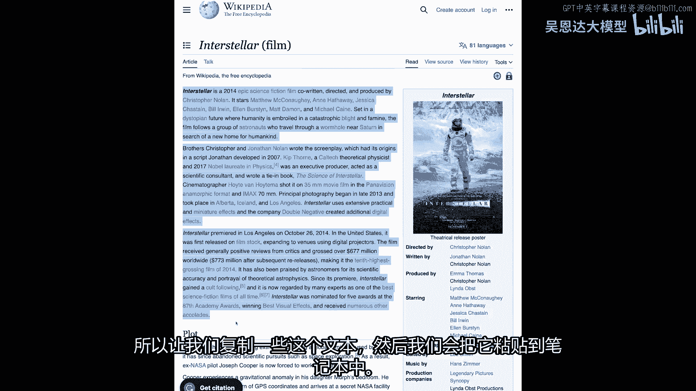

这是我们从维基百科复制过来的文本，我们只是将它添加到这个叫做text的变量中，这就是简单地复制和粘贴，然后，我们进入关于语义搜索的一个重要问题，所以我们需要将这段文本分解成块，但这些块的大小是多少。

我们是将其分成句子，还是分成段落，或者如何最好地分解它，这是一个经常被问到的问题，而且答案对于每个任务都是不同的，一些常见的方法是分割，假设在每个点处，所以我们知道这个文本非常干净。

所有的句子都由句号分隔，所以我们可以在句号上分割，但在现实生活中，如果你正在处理大量的嘈杂文本，你可能需要在处理之前稍微处理一下，然后你可能也需要使用实际在句子分割上使用的库。

比仅仅在句号上分割更复杂或高级的方式，所以这是一种选择，让我们看看如果我们执行它会发生什么，所以现在这些文本是什么，所以我们可以看到，列表中的每一句话都是一个字符串，所以这就是一种分块的方式。

其中每一句话都是一个列表。

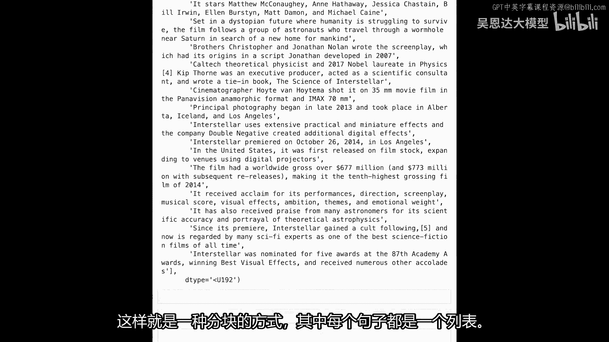

现在，实际数据集的方式，我们一直在处理的开源数据集，实际上是按段落分割的，所以我们没有做句号，我们做段落，因此，每个块实际上现在是一个完整的段落，哪一段最适合你，这通常取决于情况。

您希望每个块可能包含一个想法，但这实际上取决于您的应用场景，但这是一种做它的方式，让我们回到句子分割，我想在这里向您展示一些东西，所以让我们假设我们按句子分割，您看到这句话吗。

它说因其表演指导、剧本、音乐分数、视觉效果、雄心主题和情感重量而受到赞誉，剧本，音乐分数，视觉效果，雄心主题和情感重量，现在，这个句子缺乏上下文，如果您只是嵌入这个句子，我们只是将这个发送到嵌入模型。

它实际上不知道您在谈论什么，现在，维基百科的好处是我们有标题，所以我们可以添加标题，我们可以在句子后面添加页面标题。

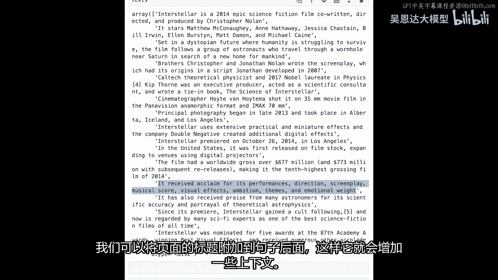

所以它给它提供了一些上下文，为了添加这个上下文。

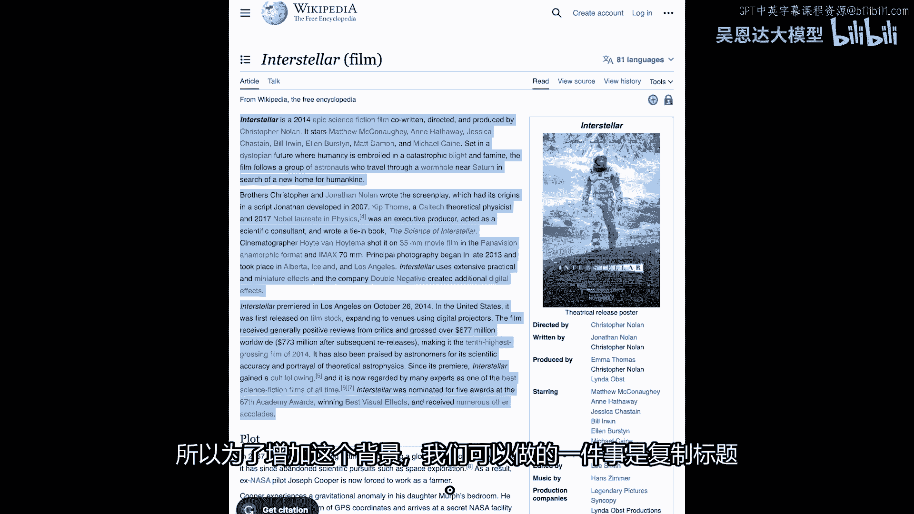

我们可以在做完标题复制后复制标题，我们可以将这个添加到这个变量中，然后只需在每个这些块前面添加它，然后它看起来像这样，所以，它因其表演受到赞誉，我们知道这现在是关于星际的，填充，这是一个启发式。

我们在这里为维基百科做的，但然后，对于每个数据库或数据集，你需要考虑这些，这些设计选择来总结一下我们关于分块的讨论，让我们回顾一下我们与分块讨论过的一些设计选择。

我们有一个维基百科页面，我们可以将其分解为段落或句子，然后，我们将每个一个嵌入，我们将继续查看代码来实现这一点，所以，每个这些都有自己的嵌入，向量，一旦我们有我们的查询，我们将嵌入该查询，然后。

搜索只是找到最近的邻居，或查询在嵌入空间中最近的文章，在这种情况下，如果我们问，变压器是否有循环结构，这篇文章是概述那个的，并且包含了回答那个查询的答案。

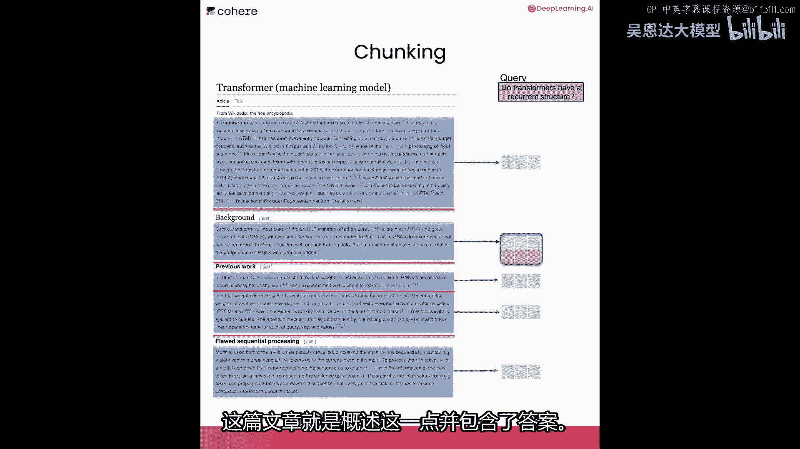

现在我们有了我们的片段，让我们继续到下一步，这是嵌入文本以使用连贯API的步骤，我们说代码嵌入，我们给它文本，例如，文本点列表，点嵌入，现在，这个响应包含代表我们过去有的这些文本的向量。

让我们看看它看起来像什么，所以让我们说embeds等于，我希望能够与numpy数组工作，嗯，因为我们可以像这样检查它们，并查看它们的维度，所以我们有十五句话，然后。

每句话都由一个包含四千个数字的向量表示，那是捕获这些句子意义的向量，现在我们有了这些嵌入，我们可以将它们扔给搜索库，并开始能够搜索它们，这是annoy的代码，我们定义索引，然后，我们遍历我们有的嵌入。

并将它们插入到搜索索引中，然后，我们有它，构建它们，然后，将索引保存到文件并写入磁盘，所以这是test，ann和ann代表annoy，但它也代表近似最近邻，这样，我们就有了我们的向量搜索索引就绪。

我们可以向它发送查询，它将能够返回给我们从它拥有的十五篇文档中的最近结果，现在让我们定义基本搜索，这里是它做什么的，我们将发送一个查询，它将嵌入该查询，所以它将查询发送到语言模型并获取查询的嵌入。

该嵌入然后发送到因子搜索索引，然后，我们获取前三个结果，所以，这个查询的最近三个邻居，在这里，我们只是格式化它们并打印它们，让我们运行这个代码，然后开始显示一些查询，这是一个问题。

我们可以问这部电影赚了多少钱，我们有十五句话关于这部电影，Interstellar我们能否找到谈论票房的句子，即使它不使用那些关键词，我们打印了结果两次，所以我们检索到了前三个结果，这是它的全部文本。

所以第一个结果说这部电影的全球票房超过六七亿七百万，这是我们正在寻找的正确事情，在这里我们也打印了一次，显示距离，所以我们有这个评分机制，衡量文本与查询的接近程度。

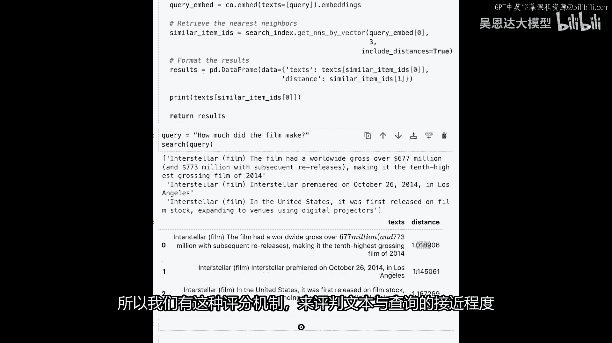

现在，我们已经看到了如何进行密集检索，让我们谈谈使用像Oy这样的工具进行向量搜索，我们刚刚看到的那个是近似最近邻，并谈谈它与这种其他类型的向量搜索工具的比较，被称为向量数据库。

密集检索真正通过找到搜索查询的近邻来工作，为了优化速度，我们现在实际上搜索近似最近邻，所以找到精确最近邻是耗时的计算，但我们有许多高度优化的算法可以获取你，近似最近邻，这就是他们被称为ann的原因。

或近似最近邻，我们谈论了ann库，但还有其他一些也是开源的，所以ann来自Spotify，Feist是Facebook的另一个热门选择，Scan来自Google，都是近似最近邻向量搜索库的选择。

另一方面，向量数据库有很多更多的变化和选择，所以我们v eight是其中之一，还有其他一些也是在线服务的，如pine，Cone和一些其他开源的，一些常见的选择包括quadrant，Vespa。

Chroma，但如果你对数据库如PostgreSQL熟悉，PostgreSQL有扩展可以进行向量搜索，现在，一个常见的问题是想知道这些两者之间的差异，所以，近似最近邻向量搜索库通常设置起来更容易。

你看到如何设置ann，和安装它可能比其他选择更容易，这些向量搜索库也倾向于只存储向量，所以它们不存储与示例文本相关的文本，你看到我们给它了一个搜索查询，它返回给我们文本，所以它管理这个，并存储文本。

它能够检索我们要的文本，所以它做了一点更多，它稍微更丰富一些，另一个主要区别这些库和向量数据库是，数据库更新更容易，数据库比这些库更容易更新，所以，如果你在使用库时想要添加新记录或修改记录。

你需要重建你的索引，而如果你在使用数据库，数据库会为你处理这些，向量数据库也允许我们过滤和执行更复杂的查询，就像我们看到的，通过过滤语言，嗯。

这些都是向量数据库现在让我们在现实世界中可以做的一些有用的事情，你不需要真正完全替换关键词搜索与向量搜索，它们相互补充，你可以在同一个流水线中使用它们作为混合搜索，这意味着当你收到一个查询时。

你会同时对它进行关键词搜索和向量搜索，你可以看到语言模型如何驱动向量搜索组件，这两个搜索组件都将给出一个分数，为文本档案中的每个文档分配一个分数，然后，我们可以聚合这些分数并呈现最佳结果。

你看到这些其他信号在右边吗，这里是你可以将其他信号注入搜索结果的地方，Google，例如，有它的著名PageRank算法，为其他网页和网站分配权威分数，基于它们链接到的其他网页的数量。

所以你可以视为另一个信号，搜索引擎有数十，数百，有时甚至数千个信号，它们输入到决定如何排序搜索结果的决策中，这就是你如何将文本相关性与其他信号结合在一起的方式，通过下一个课程的聚合步骤。

你将看到重排如何融入搜索步骤，并了解它如何大大提高排名，以及查询与搜索结果之间的相关性，如果你想了解更多关于过去几年密集检索的历史，这是一个非常好的资源，它是一本书和一篇论文。

叫做预训练变压器用于文本排名BERT和 beyond，我强烈推荐你去看看，如果你对过去几年这些模型的发展感兴趣，现在，我们已经看到了密集检索的工作方式，这是其中一种主要使用语言模型的语义搜索方式。

让我们去下一个课程，我们将学习第二种类型，被称为重排。

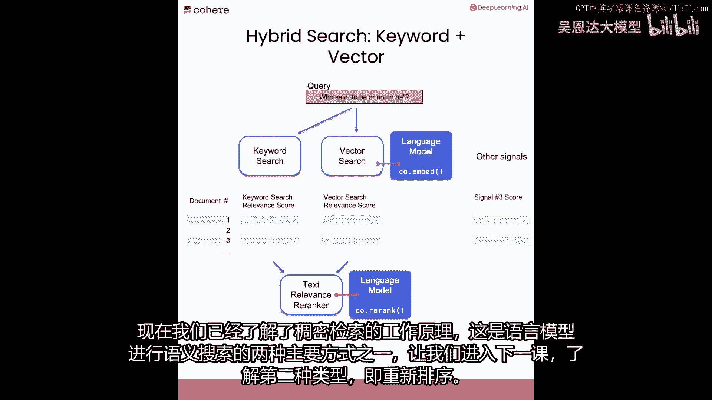