# P12：12.Week 7 – Lecture Energy based models and self-supervised learning - 大佬的迷弟的粉丝 - BV1o5411p7AB

对，所以我们将讨论基于能量的模型，基本上，对，所以我们将讨论基于能量的模型，基本上，我们可以通过它来表达很多不同的学习的农场弧，我们可以通过它来表达很多不同的学习的农场弧，算法不是那种简单的算法。

就像我们在，算法不是那种简单的算法，就像我们在，有监督的运行，但事情有些复杂和复杂，有监督的运行，但事情有些复杂和复杂，它包含了许多艺术方法，但有点，它包含了许多艺术方法，但有点，更容易理解。

我认为那可能是病态的方法，可能是病态的，更容易理解，我认为那可能是病态的方法，可能是病态的，如果您想减少能源消耗，方法确实是一种特殊情况，如果您想减少能源消耗，方法确实是一种特殊情况，模型。

我认为这有点非正式，模型，我认为这有点非正式，从某种意义上讲它很有启发性，它解释了很多看起来非常，从某种意义上讲它很有启发性，它解释了很多看起来非常，当您无法获得事物的这种统一视图时，会有所不同。

当您无法获得事物的这种统一视图时，会有所不同，我要说的是，首先在监督学习中同样适用，我要说的是，首先在监督学习中同样适用，有些人称之为有监督的跑步，或者我们称之为自我监督的跑步。

有些人称之为有监督的跑步，或者我们称之为自我监督的跑步，我们今天要谈一点，基本上是我们要谈的。

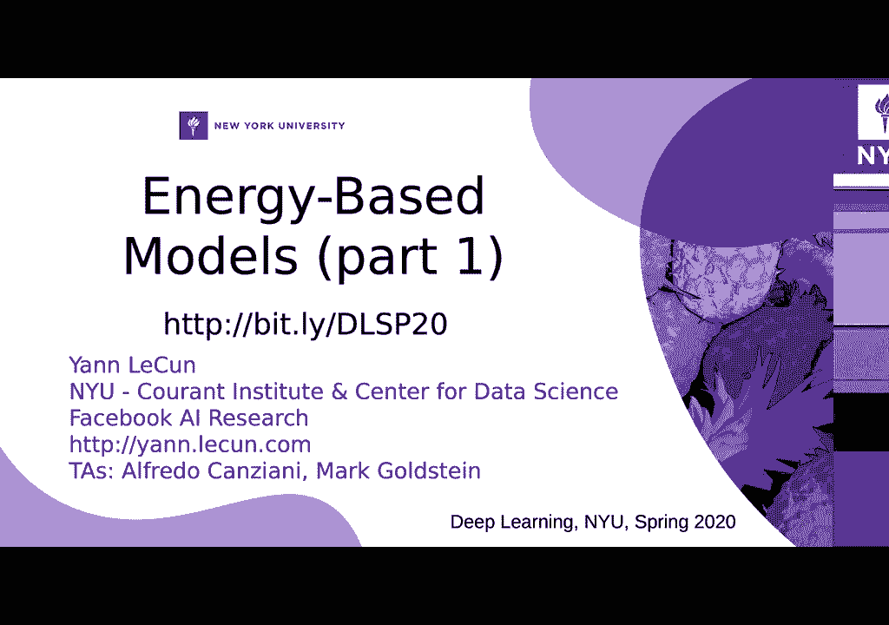

我们今天要谈一点，基本上是我们要谈的，关于观察到一组变量X的模型，我们问这个模型。

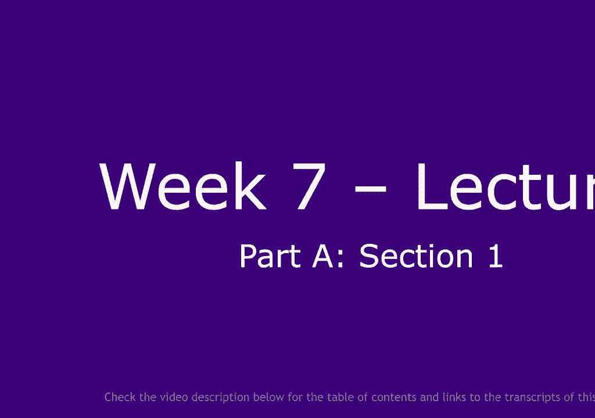

关于观察到一组变量X的模型，我们问这个模型，预测变量Y的集合，但我没有指定X是图像还是，预测变量Y的集合，但我没有指定X是图像还是，无论什么，Y是一个离散变量，例如对于分类Y，无论什么。

Y是一个离散变量，例如对于分类Y，就像整数Y和X可能是访谈或X可能是图像而Y a，就像整数Y和X可能是访谈或X可能是图像而Y a，描述它或X的一段文字可能是一种语言的句子。

描述它或X的一段文字可能是一种语言的句子，另一种语言的Y句子X可以是整个文本，而Y可以是，另一种语言的Y句子X可以是整个文本，而Y可以是，该文本或摘要的简化版本，因此可以是任何真的。

该文本或摘要的简化版本，因此可以是任何真的，我不是在这里指定Sara Lee，但它来自于以下事实：我不是在这里指定Sara Lee，但它来自于以下事实：前馈模型是否存在这两个问题。

前馈模型是否存在这两个问题，神经网络或其他无关紧要的经典模型先于您，神经网络或其他无关紧要的经典模型先于您，如果您知道有限的固定数量的计算会产生输出，如果您知道有限的固定数量的计算会产生输出。

有一个多层，你知道有固定数量的，有一个多层，你知道有固定数量的，层，即使您拥有经常性网，对多少层也有一定的限制，层，即使您拥有经常性网，对多少层也有一定的限制，次您可以展开它。

因此您基本上知道了固定的计算量，次您可以展开它，因此您基本上知道了固定的计算量，但是有两个问题并不完全适合，但是有两个问题并不完全适合，第一个或两个情况第一个情况是计算时。

第一个或两个情况第一个情况是计算时，输出需要一些更复杂的计算，而只是虚拟加权，输出需要一些更复杂的计算，而只是虚拟加权，推论为时的一种有限数之和与非线性，推论为时的一种有限数之和与非线性，复杂。

第二种情况是当我们尝试训练机器，复杂，第二种情况是当我们尝试训练机器，产生的不是单个输出而是一组可能的输出，因此在这种情况下，产生的不是单个输出而是一组可能的输出，因此在这种情况下，根据分类。

我们实际上是在训练机器以生产多种，根据分类，我们实际上是在训练机器以生产多种，我们正在训练它的输出以针对每种可能的情况产生单独的分数，我们正在训练它的输出以针对每种可能的情况产生单独的分数，理想情况下。

我们知道的系统中的类别，理想情况下，我们知道的系统中的类别，得出正确班级的最佳成绩，并且您知道是否需要，得出正确班级的最佳成绩，并且您知道是否需要，在实践中，其他人的分数很小。

您知道我们运行输出时的情况，在实践中，其他人的分数很小，您知道我们运行输出时的情况，普通到软最大的分数会产生一种分数，我们只选择一个，普通到软最大的分数会产生一种分数，我们只选择一个，分数很高。

但基本上我们告诉机器要做的是，分数很高，但基本上我们告诉机器要做的是，产生每个类别的分数，然后我们将选择最好的，产生每个类别的分数，然后我们将选择最好的，当输出是连续的高维时是不可能的，所以。

当输出是连续的高维时是不可能的，所以，输出是说一个图像，我们在图像上没有柔和的最大值，好吧，输出是说一个图像，我们在图像上没有柔和的最大值，好吧，没有列出所有可能的图像的方法，那么您知道规范化。

没有列出所有可能的图像的方法，那么您知道规范化，分布在它们上，因为它是高维连续空间，即使它，分布在它们上，因为它是高维连续空间，即使它，是一个真正合理的连续空间，我们将不可能，是一个真正合理的连续空间。

我们将不可能，将该连续空间划分为离散的离散垃圾箱，然后进行最大交换，将该连续空间划分为离散的离散垃圾箱，然后进行最大交换，在那上面，但是效果不是很好，在那上面，但是效果不是很好。

它只能在小尺寸上以低尺寸工作，所以当我们有高尺寸时，它只能在小尺寸上以低尺寸工作，所以当我们有高尺寸时，维连续空间，我们可以做soft max，我们不能要求系统给出，维连续空间。

我们可以做soft max，我们不能要求系统给出，我们为所有可能的输出得到类似的分数，即使它是离散的，但，我们为所有可能的输出得到类似的分数，即使它是离散的，但，可能是无限的。

所以像我们生成文本文本之类的东西是，可能是无限的，所以像我们生成文本文本之类的东西是，组成，并且有非常非常多的，组成，并且有非常非常多的，给定长度的可能文本，我们不能只对所有内容做一些零食。

给定长度的可能文本，我们不能只对所有内容做一些零食，可能的文本存在相同的问题，所以我们如何表示分布或，可能的文本存在相同的问题，所以我们如何表示分布或，紧凑形式的所有可能的文本得分。

紧凑形式的所有可能的文本得分，那就是基于能量的模型出现或可能寻求模型的地方，那就是基于能量的模型出现或可能寻求模型的地方，但特别是能源业务模型以及基于能源的解决方案。

但特别是能源业务模型以及基于能源的解决方案，模型给我们一个想法，我们将使用隐式函数，模型给我们一个想法，我们将使用隐式函数，换句话说，我们不会去得分系统来产生为什么，换句话说。

我们不会去得分系统来产生为什么，我们只是想问您一个X和特定的Y是否会，我们只是想问您一个X和特定的Y是否会，表明它彼此兼容，所以这是该文本的一个不错的翻译，表明它彼此兼容。

所以这是该文本的一个不错的翻译，文字听起来不错，因为我们要怎么走，文字听起来不错，因为我们要怎么走，与文本或机器进行比较，但让我们按住，与文本或机器进行比较，但让我们按住，这有点好。

所以我们是XY的忍者函数f将取x，这有点好，所以我们是XY的忍者函数f将取x，在葡萄酒上，它将告诉我们这两个值是否兼容，在葡萄酒上，它将告诉我们这两个值是否兼容，其他还是不好。

所以如果是为什么图像X的一个好的标签是y且，其他还是不好，所以如果是为什么图像X的一个好的标签是y且，高度故事的高分辨率版本低分辨率图像（如果Y很好），高度故事的高分辨率版本低分辨率图像（如果Y很好）。

该句子的德语翻译等，现在推论程序，该句子的德语翻译等，现在推论程序，将给定一个X，找到一个Y，该Y产生一个较低的值，为此XY，将给定一个X，找到一个Y，该Y产生一个较低的值，为此XY，产生一个低值。

换句话说，最终Y与X兼容，产生一个低值，换句话说，最终Y与X兼容，因此，在可能的明智位置上搜索y值，该值会产生一个，因此，在可能的明智位置上搜索y值，该值会产生一个，XY的f好的。

所以我们看到通过最小化某些函数来影响的想法，XY的f好的，所以我们看到通过最小化某些函数来影响的想法，几乎每个模型都可能暗示您坚持使用了什么，几乎每个模型都可能暗示您坚持使用了什么。

人们能想到会以这种方式工作吗，我的意思是除了你，人们能想到会以这种方式工作吗，我的意思是除了你，用神经网络分类多类分类或，用神经网络分类多类分类或，通过基本找到，通过基本找到，得分最高的课程。

您可以将其视为，得分最高的课程，您可以将其视为，最低的能量，所以基本上我们将尝试找到一个输出，最低的能量，所以基本上我们将尝试找到一个输出，满足一堆约束条件，这些约束条件由，满足一堆约束条件。

这些约束条件由，XY的这个功能f很好，如果您听说过图形模型，XY的这个功能f很好，如果您听说过图形模型，您知道所有的贝叶斯网络，甚至经典的AI或Sat，您知道所有的贝叶斯网络，甚至经典的AI或Sat。

它们基本上可以用这些术语表述为问题，它们基本上可以用这些术语表述为问题，一组变量的值，这些变量将由某些要测量的函数来表示，一组变量的值，这些变量将由某些要测量的函数来表示，他们的兼容性好。

所以我们现在不谈论运行好，他们的兼容性好，所以我们现在不谈论运行好，我们只是在讨论推论，我们假设给出了XY的这个函数f，我们只是在讨论推论，我们假设给出了XY的这个函数f，给你。

我们将谈论稍后如何学习它，好吧，给你，我们将谈论稍后如何学习它，好吧，能量功能不是我们对运动进行异化的意思，而是缓解眼睛的问题，能量功能不是我们对运动进行异化的意思，而是缓解眼睛的问题，在推论过程中。

推论是从X竞争Y，所以这种能量，在推论过程中，推论是从X竞争Y，所以这种能量，函数是标量值，当Y与X兼容且，函数是标量值，当Y与X兼容且，当Y与X不兼容时，可以使用更高的值，因此您希望此函数。

当Y与X不兼容时，可以使用更高的值，因此您希望此函数，具有这样的形状：对于给定的X，所有Y的值，具有这样的形状：对于给定的X，所有Y的值，与此X兼容的能量低并且所有不兼容的值。

与此X兼容的能量低并且所有不兼容的值，与给定的X兼容具有更高的能量，这就是您所需要的，因为，与给定的X兼容具有更高的能量，这就是您所需要的，因为，那么推论程序将找到写在这里的YY检查。

那么推论程序将找到写在这里的YY检查，y的值使XY的F最小化，不是，y的值使XY的F最小化，不是，将是一个值，因为可能存在多个值，并且您的推断，将是一个值，因为可能存在多个值，并且您的推断。

算法实际上可能会经历多个值或检查多个，算法实际上可能会经历多个值或检查多个，在给您一个或几个好的值之前，让我们举一个例子，在给您一个或几个好的值之前，让我们举一个例子，一个简单的例子。

当标量变量的维数为X时，这里是一个实数，一个简单的例子，当标量变量的维数为X时，这里是一个实数，值和Y是一个实数值，这里的蓝点是数据点，那么，值和Y是一个实数值，这里的蓝点是数据点，那么，您想要的是。

如果您想捕获依赖关系，您想要的是，如果您想捕获依赖关系，数据中的x和y之间是您想要的能量函数，数据中的x和y之间是您想要的能量函数，这个形状或那个形状或其他形状，但是，这个形状或那个形状或其他形状。

但是，这样，如果您采用x的特定值，则，这样，如果您采用x的特定值，则，天气有上升的值是在蓝点附近的蓝点附近，天气有上升的值是在蓝点附近的蓝点附近，数据点还可以，所以像这样的函数捕获了x之间的依赖关系。

数据点还可以，所以像这样的函数捕获了x之间的依赖关系，和y现在推断给定X的最佳y是什么，如果您有一个，和y现在推断给定X的最佳y是什么，如果您有一个，这样的功能，您可以使用梯度下降。

所以如果我给你一个X，这样的功能，您可以使用梯度下降，所以如果我给你一个X，可以得出与该X对应的y的最佳值是多少，可以得出与该X对应的y的最佳值是多少，一些随机的Y，然后回到正态，找到函数的最小值。

一些随机的Y，然后回到正态，找到函数的最小值，你会掉下来的笨蛋，这可能会有点困难，你会掉下来的笨蛋，这可能会有点困难，但是从表征之间的依赖的角度来看，但是从表征之间的依赖的角度来看。

这两个变量这两个能量函数几乎和每个变量一样好，这两个变量这两个能量函数几乎和每个变量一样好，其他我来解决这个离散情况，当y是离散的是容易的，其他我来解决这个离散情况，当y是离散的是容易的，好吧，好了。

我们已经讨论过了，我会重新制定，好吧，好了，我们已经讨论过了，我会重新制定，这在能量方面有兴趣几分钟，这在能量方面有兴趣几分钟，因此，FIFO模型是显式函数，因为它计算预测Y，因此。

FIFO模型是显式函数，因为它计算预测Y，从X开始，但它只能做出一个预测我们可以在这种情况下作弊，从X开始，但它只能做出一个预测我们可以在这种情况下作弊，的离散值，但输出对应于，的离散值，但输出对应于。

每种可能的分类都附有花样，但效果很好，但您不能使用它，每种可能的分类都附有花样，但效果很好，但您不能使用它，高维连续值或合成值的技巧，高维连续值或合成值的技巧，前面说过。

所以动画是模型实际上是一个隐式函数，所以请记住，前面说过，所以动画是模型实际上是一个隐式函数，所以请记住，你知道在微积分中的隐函数，你想要一个方程，你知道在微积分中的隐函数，你想要一个方程。

圈是x和y的函数，而你不能将Y写成X的函数，圈是x和y的函数，而你不能将Y写成X的函数，写一个方程，说你知道X平方加y平方等于1，写一个方程，说你知道X平方加y平方等于1，您单位圆确定。

所以XY加y平方等于1是我的意思是s，您单位圆确定，所以XY加y平方等于1是我的意思是s，平方加y平方减1不是它的隐式函数，当您求解时，平方加y平方减1不是它的隐式函数，当您求解时，它等于零。

你得到你得到的圆圈，所以这是，它等于零，你得到你得到的圆圈，所以这是，这里的另一个例子再次是x和y的标量值，这里的黑点是，这里的另一个例子再次是x和y的标量值，这里的黑点是，数据点。

因此对于红色条表示的x的三个值，存在，数据点，因此对于红色条表示的x的三个值，存在，y的多个兼容值，其中一些实际上是排序的，y的多个兼容值，其中一些实际上是排序的，值的连续性，因此我们希望能量函数成为。

值的连续性，因此我们希望能量函数成为，看起来基本上是在这里，我有点画水平，看起来基本上是在这里，我有点画水平，该能量函数的集合，因此它在数据点上消耗低能量，该能量函数的集合，因此它在数据点上消耗低能量。

在更高能量的情况下，这是一个稍微复杂一些的版本，在更高能量的情况下，这是一个稍微复杂一些的版本，我之前展示的3D模型的模块类型，问题是，我之前展示的3D模型的模块类型，问题是，我们是否要对系统进行训练。

使其适应环境，从而计算出能量函数，我们是否要对系统进行训练，使其适应环境，从而计算出能量函数，实际上具有适当的形状，当y连续时F光滑是很好的，实际上具有适当的形状，当y连续时F光滑是很好的，且可微。

因此我们可以使用基于梯度的推理算法，且可微，因此我们可以使用基于梯度的推理算法，对，所以如果我们有这样的函数，我给你一个XY点，你可以，对，所以如果我们有这样的函数，我给你一个XY点，你可以。

通过梯度下降知道您可以在任何下降的数据上找到要点，通过梯度下降知道您可以在任何下降的数据上找到要点，最接近它或类似的东西，如果我给你一个价值，最接近它或类似的东西，如果我给你一个价值，对于x。

您可以知道沿y方向通过梯度下降进行搜索，对于x，您可以知道沿y方向通过梯度下降进行搜索，一个最小化它的值，这就是推理算法，一个最小化它的值，这就是推理算法，很抱歉，算法真的是一个处方，那么算法是。

很抱歉，算法真的是一个处方，那么算法是，您将其最小化，为此，存在各种不同的方法，您将其最小化，为此，存在各种不同的方法，基于梯度的方法就是其中之一，各种各样的方法，基于梯度的方法就是其中之一。

各种各样的方法，在F复杂的情况下，您可能没有可能，在F复杂的情况下，您可能没有可能，依靠搜索方法，因此您可能不得不使用其他技巧，依靠搜索方法，因此您可能不得不使用其他技巧，在大多数情况下，尽管它简化了。

但对于那些，在大多数情况下，尽管它简化了，但对于那些，知道图形模型是图形模型基本上是基于能量的模型，知道图形模型是图形模型基本上是基于能量的模型，能量函数分解为能量项和每个能量的总和。

能量函数分解为能量项和每个能量的总和，turn考虑到您正在处理的变量的子集，因此，turn考虑到您正在处理的变量的子集，因此，F和某些FS集合的信标会占用Y的子集，F和某些FS集合的信标会占用Y的子集。

取x和y等的子集的其他人，如果他们组织在一个，取x和y等的子集的其他人，如果他们组织在一个，特定形式，然后有有效的推理算法来找到最小值，特定形式，然后有有效的推理算法来找到最小值。

这些条款的总和与您感兴趣的变量有关，这些条款的总和与您感兴趣的变量有关，推断，这就是您所知道的牛肉应用，所有这些算法都可以做到，推断，这就是您所知道的牛肉应用，所有这些算法都可以做到，在图形模型中。

如果您不知道我是什么，这是您无需考虑的，在图形模型中，如果您不知道我是什么，这是您无需考虑的，谈论无关紧要，正如我所说的，您可能想要的情况，谈论无关紧要，正如我所说的，您可能想要的情况。

当影响力比您所知道的要复杂得多时，使用它，当影响力比您所知道的要复杂得多时，使用它，当输出为高维时，通过几层神经网络运行，当输出为高维时，通过几层神经网络运行，并具有序列或C或图像或图像序列的结构。

并具有序列或C或图像或图像序列的结构，当输出具有构图结构时，无论是，当输出具有构图结构时，无论是，文本动作序列，您知道诸如此类的内容或应在何时使用applet，文本动作序列。

您知道诸如此类的内容或应在何时使用applet，从服务器的长链推理中解决，这不只是您知道我，从服务器的长链推理中解决，这不只是您知道我，可以只计算您需要某种解决约束满足的输出。

可以只计算您需要某种解决约束满足的输出，基本产生e输出的问题，或者您知道做某种长链，基本产生e输出的问题，或者您知道做某种长链。

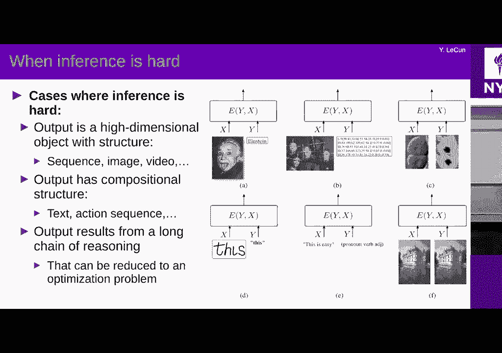

推理，好的，这是基于能量的模型的一种特殊类型。

好的，这是基于能量的模型的一种特殊类型，他们开始变得有趣起来是能量基础模型并涉及潜在，他们开始变得有趣起来是能量基础模型并涉及潜在，变量好吧，所以根据潜在变量对主动性进行建模，变量好吧。

所以根据潜在变量对主动性进行建模，在这种情况下，书面变量EVM我们不仅取决于您所使用的变量，在这种情况下，书面变量EVM我们不仅取决于您所使用的变量，观察X和变量Y想要预测Y但我们也依赖于。

观察X和变量Y想要预测Y但我们也依赖于，没有人告诉您okay的价值和使用方式的额外变量Z，没有人告诉您okay的价值和使用方式的额外变量Z，这个潜在的变量是您以这样的方式构建模型：

这个潜在的变量是您以这样的方式构建模型：这取决于潜在变量，如果您使用此潜在值，这取决于潜在变量，如果您使用此潜在值，变量，推断问题将变得更加容易，所以假设您要，变量，推断问题将变得更加容易。

所以假设您要，确实赢得了团队的认可，我喜欢我告诉您的这个例子，确实赢得了团队的认可，我喜欢我告诉您的这个例子，如果您知道角色在哪里，就已经阅读了，如果您知道角色在哪里，就已经阅读了，好多了，好吧。

这里的主要问题是，好多了，好吧，这里的主要问题是，单词不仅是阅读单个字符，而且您实际上会发现，单词不仅是阅读单个字符，而且您实际上会发现，角色是什么样的，一个角色在哪里结束，另一个角色在哪里。

角色是什么样的，一个角色在哪里结束，另一个角色在哪里，一个开始，如果我要告诉你，这对你来说会容易得多，一个开始，如果我要告诉你，这对你来说会容易得多，如果我很擅长于阅读，请阅读以阅读该词。

如果我很擅长于阅读，请阅读以阅读该词，如果您懂英语，请在此处阅读此字符序列（英文），如果您懂英语，请在此处阅读此字符序列（英文），可以解析它，您可能可以找出单词边界在哪里，可以解析它。

您可能可以找出单词边界在哪里，因为您具有这种高级知识，无论是否知道，因为您具有这种高级知识，无论是否知道，单词是英文的，我想对你来说，同样的道理，单词是英文的，我想对你来说，同样的道理，除非你会说法语。

否则不知道边界这个词会怎样，除非你会说法语，否则不知道边界这个词会怎样，在这种情况下，电池一词以及顶部的字符边界为，在这种情况下，电池一词以及顶部的字符边界为，对于解决问题很有用，例如。

对于解决问题很有用，例如，字符识别以将各个字符识别器应用于每个字符，字符识别以将各个字符识别器应用于每个字符，性格，但你不知道他们在哪里，所以你怎么知道如何解决，性格，但你不知道他们在哪里。

所以你怎么知道如何解决，这个问题，所以如果我告诉你，那将是一个有用的潜在变量，这个问题，所以如果我告诉你，那将是一个有用的潜在变量，所以对于语音识别，问题在于您不知道其他人在哪里，所以对于语音识别。

问题在于您不知道其他人在哪里，单词之间的边界是不知道的，单词之间的边界是不知道的，音素要么是语音，要么非常像连续文本，音素要么是语音，要么非常像连续文本，连续语音，我们可以解析单词。

因为我们知道单词在哪里，连续语音，我们可以解析单词，因为我们知道单词在哪里，因为我们了解该语言，但有人说的是您不懂的语言，因为我们了解该语言，但有人说的是您不懂的语言，了解您有一个非常模糊的想法。

其中“边界”一词是，了解您有一个非常模糊的想法，其中“边界”一词是，当您无法使用英语没有压力的语言时，当您无法使用英语没有压力的语言时，之所以容易，是因为单词上有重音，所以如果您能找出重音，之所以容易。

是因为单词上有重音，所以如果您能找出重音，是您大概可以弄清楚单词边界在哪里，是您大概可以弄清楚单词边界在哪里，没有压力的法国人，您无法想像没有办法，没有压力的法国人，您无法想像没有办法，现在。

您的视频phasma不会说确定，只有一种字体可以向右移动，现在，您的视频phasma不会说确定，只有一种字体可以向右移动，所以你知道这是一种连续的音素串，所以你知道这是一种连续的音素串，除非您知道边界。

否则很难说出边界在哪里，除非您知道边界，否则很难说出边界在哪里，语言，这将是一个可行的联系，因为如果，语言，这将是一个可行的联系，因为如果，有人告诉你这些界限在哪里，那么你将能够。

有人告诉你这些界限在哪里，那么你将能够，做该任务，所以这就是您使用潜在变量的方式，做该任务，所以这就是您使用潜在变量的方式，这种使用潜变量的方法潜变量已经在数十年中使用了。

这种使用潜变量的方法潜变量已经在数十年中使用了，自然语言处理环境中的语音识别环境，自然语言处理环境中的语音识别环境，在我所说的OCR和许多，在我所说的OCR和许多，不同的其他应用程序。

特别是涉及序列的应用程序，不同的其他应用程序，特别是涉及序列的应用程序，而且在计算机视觉方面，所以像您这样的事情知道您想要检测，而且在计算机视觉方面，所以像您这样的事情知道您想要检测，一个人在哪里。

但您不知道该人的穿着或穿着什么，一个人在哪里，但您不知道该人的穿着或穿着什么，人在这样的事情上的位置，所以你知道那些是变量，人在这样的事情上的位置，所以你知道那些是变量，如果您知道我愿意的话，尽管。

如果您知道我愿意的话，尽管，如今，视觉效果还可以，所以如果您有一些可变模型，这是，如今，视觉效果还可以，所以如果您有一些可变模型，这是，如何进行推理，所以您现在有了一个新的能量函数，称为FG。

如何进行推理，所以您现在有了一个新的能量函数，称为FG，XYZ的值，因此在法国，您要1703相对于Z和Y最小化它，XYZ的值，因此在法国，您要1703相对于Z和Y最小化它。

所以你问系统给我y＆z的变量组合，所以你问系统给我y＆z的变量组合，意思是这个能量函数我实际上只在乎ZI的值，意思是这个能量函数我实际上只在乎ZI的值，关心y的值，但是我必须同时进行最小化，关心y的值。

但是我必须同时进行最小化，我稍后再给你一些具体的例子，我稍后再给你一些具体的例子，实际上，这等效于定义新能量，新能量函数f，实际上，这等效于定义新能量，新能量函数f。

我在这里称F无穷大仅取决于X和y XY的F无穷大是最小值，我在这里称F无穷大仅取决于X和y XY的F无穷大是最小值，在XYZ的Z上，您得到XYZ的函数，则找到了最小值，在XYZ的Z上。

您得到XYZ的函数，则找到了最小值，现在可以消除ZZ上的函数，而得到x和y函数，现在可以消除ZZ上的函数，而得到x和y函数，在实践中，您永远不会那样做，所以我没有练习尽量减少尊重，在实践中。

您永远不会那样做，所以我没有练习尽量减少尊重，到y17历史中的Z，因为我们不知道如何表示一个函数，但是，到y17历史中的Z，因为我们不知道如何表示一个函数，但是。

有一个替代方法是在这里用她定义f我写F的，有一个替代方法是在这里用她定义f我写F的，XY的beta或FF指数beta相对beta日志为负1，因此我在Z上为整数或整数。

XY的beta或FF指数beta相对beta日志为负1，因此我在Z上为整数或整数，e到XYZ的负beta e的一点点，e到XYZ的负beta e的一点点，提香（Titian）您会看到。

如果将Beta设为无穷大，这种，提香（Titian）您会看到，如果将Beta设为无穷大，这种，beta收敛到F无穷大，这就是为什么我称它为F无穷大，我去了，beta收敛到F无穷大。

这就是为什么我称它为F无穷大，我去了，如果beta是，如果beta是，非常大，唯一重要的是XYZ de的Y项，非常大，唯一重要的是XYZ de的Y项，最低值是所有值中最低的值，最低值是所有值中最低的值。

Z的可能值正确，因为其他所有值都将很大，Z的可能值正确，因为其他所有值都将很大，更大，因为Beta非常非常大，所以即使，更大，因为Beta非常非常大，所以即使，指数不会真正计算唯一要。

指数不会真正计算唯一要，计数是具有最低值的那个，所以如果您只有一个学期，计数是具有最低值的那个，所以如果您只有一个学期，其中XYZ的e是Z的值，产生最小的Z，其中XYZ的e是Z的值，产生最小的Z，值。

则对数会取消指数值和beta值的负1，值，则对数会取消指数值和beta值的负1，无法取消负的beta，而您的平均值仅等于XYZ的Z，无法取消负的beta，而您的平均值仅等于XYZ的Z，好的。

这就是您在上面看到的极限，所以如果我在此定义XY的f，好的，这就是您在上面看到的极限，所以如果我在此定义XY的f，一遍又一遍，然后我回到了前面的问题，就是最小化F的，一遍又一遍，然后我回到了前面的问题。

就是最小化F的，XY相对于Y进行推断，好吧，我认为H型可行模型对您没有太大的影响，好吧，我认为H型可行模型对您没有太大的影响，关于要做的潜在变量有一个额外的最小化，关于要做的潜在变量有一个额外的最小化。

比那还好，所以允许潜伏也有很大的优势，比那还好，所以允许潜伏也有很大的优势，通过改变集合中的潜在变量可以说的变量，通过改变集合中的潜在变量可以说的变量，系统的预测输出也会在一个集合上变化，所以这是一个。

系统的预测输出也会在一个集合上变化，所以这是一个，X进入我称为预测变量的特定体系结构，X进入我称为预测变量的特定体系结构，这是一种神经网络，它产生一些表示特征，这是一种神经网络，它产生一些表示特征。

X表示，然后X和Z表示，我将涉及的内容很少，X表示，然后X和Z表示，我将涉及的内容很少，这就是我在这里所说的解码器，它产生一个预测Y轴，好吧，这就是我在这里所说的解码器，它产生一个预测Y轴，好吧。

我们要预测的变量Y的预测，我们要预测的变量Y的预测，此处的能量函数只是比较Y bar和y，它只是，此处的能量函数只是比较Y bar和y，它只是，他们好吧，您对这种图很熟悉，我们讨论过有关它们的内容。

他们好吧，您对这种图很熟悉，我们讨论过有关它们的内容，较早，所以如果我选择在一个集合上改变Z，我们假设二维正方形，较早，所以如果我选择在一个集合上改变Z，我们假设二维正方形，在此以该灰色图表示。

然后预测Y条将，在此以该灰色图表示，然后预测Y条将，在这种情况下，也会随着一组变化而变化，在这种情况下，也会随着一组变化而变化，功能区，基本上可以拥有一台机器，现在我可以，功能区。

基本上可以拥有一台机器，现在我可以，通过改变潜变量可以产生多个输出，我可以有这个，通过改变潜变量可以产生多个输出，我可以有这个，机器产生多种输出，而不仅仅是至关重要的输出，机器产生多种输出。

而不仅仅是至关重要的输出，好的，假设您要制作视频，好的，假设您要制作视频，预测，所以有很多原因可能导致您想要制作视频，预测，所以有很多原因可能导致您想要制作视频，预测。

其中一个很好的理由是建立非常好的视频压缩，预测，其中一个很好的理由是建立非常好的视频压缩，例如，压缩系统的另一个很好的原因是您正在尝试的视频，例如，压缩系统的另一个很好的原因是您正在尝试的视频。

预测当您正在从挡风玻璃观看的视频时，预测当您正在从挡风玻璃观看的视频时，驾驶汽车，您希望能够预测您周围的汽车，驾驶汽车，您希望能够预测您周围的汽车，这是fray正在进行的工作，因此成为。

这是fray正在进行的工作，因此成为，能够在发生之前预测会发生什么，能够在发生之前预测会发生什么，实际上，这是智慧的本质，实际上，这是智慧的本质，现在预测，你现在正在看着我，现在预测，你现在正在看着我。

片刻，您正在看着我，我在说，您对，片刻，您正在看着我，我在说，您对，几秒钟后我的嘴里就会冒出一个字，几秒钟后我的嘴里就会冒出一个字，我将要做的手势还是一些想法或要朝什么方向移动。

我将要做的手势还是一些想法或要朝什么方向移动，但是不是一个精确的想法，所以如果您训练自己的神经网络来制作一个，但是不是一个精确的想法，所以如果您训练自己的神经网络来制作一个，从现在起两秒钟。

我对我的预测只有一个，从现在起两秒钟，我对我的预测只有一个，如果您训练自己，就无法做出准确的预测，如果您训练自己，就无法做出准确的预测，最小二乘，好吧，我们应该训练一个可以预测的东西，最小二乘，好吧。

我们应该训练一个可以预测的东西，我在这里的看法Willie square系统能做的最好的事情就是产生一个，我在这里的看法Willie square系统能做的最好的事情就是产生一个，我的图像模糊。

因为它不知道我要向左还是向右移动，我的图像模糊，因为它不知道我要向左还是向右移动，不知道我的手会像这样或那样，所以它会，不知道我的手会像这样或那样，所以它会，得出所有可能结果的平均值，那将是。

得出所有可能结果的平均值，那将是，图像模糊，所以预测变量无论是什么都非常重要，图像模糊，所以预测变量无论是什么都非常重要，能够处理不确定性并能够做出多种预测，能够处理不确定性并能够做出多种预测。

参数化预测集的方法是通过一个小变量，参数化预测集的方法是通过一个小变量，而不是谈论分布或可能病态的模型，这是这个，而不是谈论分布或可能病态的模型，这是这个，在我们谈论这个问题之前，还可以吗？

在我们谈论这个问题之前，还可以吗？苏茜·禅又不是一个不是一个，苏茜·禅又不是一个不是一个，参数不是权重，而是每个样本都会改变的值，因此，参数不是权重，而是每个样本都会改变的值，因此。

基本上在培训期间我们还没有谈论培训，但是在培训期间，基本上在培训期间我们还没有谈论培训，但是在培训期间，训练，我给你X，而你找到Z，训练，我给你X，而你找到Z，能量与电流的关系，能量与电流的关系。

这些神经网络的参数值是最好的，这些神经网络的参数值是最好的，您最好猜出Z的值是多少，然后将其馈给一些损失，您最好猜出Z的值是多少，然后将其馈给一些损失，您要针对参数最小化的功能。

您要针对参数最小化的功能，网络Ross函数不一定是平均值不一定，网络Ross函数不一定是平均值不一定，能量可能还可以，能量可能还可以，实际上大多数时候是另外一回事，所以从这个意义上说，您运行Z。

实际上大多数时候是另外一回事，所以从这个意义上说，您运行Z，信息Z好的，您不想使用跑步一词，因为学习意味着您拥有，信息Z好的，您不想使用跑步一词，因为学习意味着您拥有。

您在这里为Z所获得的整个训练集所学到的所有氛围的一个价值，您在这里为Z所获得的整个训练集所学到的所有氛围的一个价值，对于您的训练集中的每个样本或每次放置您的样本具有不同的价值。

对于您的训练集中的每个样本或每次放置您的样本具有不同的价值，测试站点就可以了，这样就不会学到它们了，测试站点就可以了，这样就不会学到它们了，他们被推断是的，另一个例子是他的翻译，所以翻译。

他们被推断是的，另一个例子是他的翻译，所以翻译，有一个很大的问题是语言翻译，因为没有一个，有一个很大的问题是语言翻译，因为没有一个，通常将一段文本正确地从一种语言翻译成另一种语言。

通常将一段文本正确地从一种语言翻译成另一种语言，表达相同想法的方式有很多，为什么，表达相同想法的方式有很多，为什么，您选择了一个，所以如果有某种方法可以很好，您选择了一个，所以如果有某种方法可以很好。

将系统可以翻译的所有可能的翻译私有化，将系统可以翻译的所有可能的翻译私有化，想要与给定文本相对应的产品（德语），想要与给定文本相对应的产品（德语），翻译成英文可能有多种翻译您需要列出。

翻译成英文可能有多种翻译您需要列出，全部正确，并且通过更改一些潜在变量，您可能知道更改，全部正确，并且通过更改一些潜在变量，您可能知道更改。

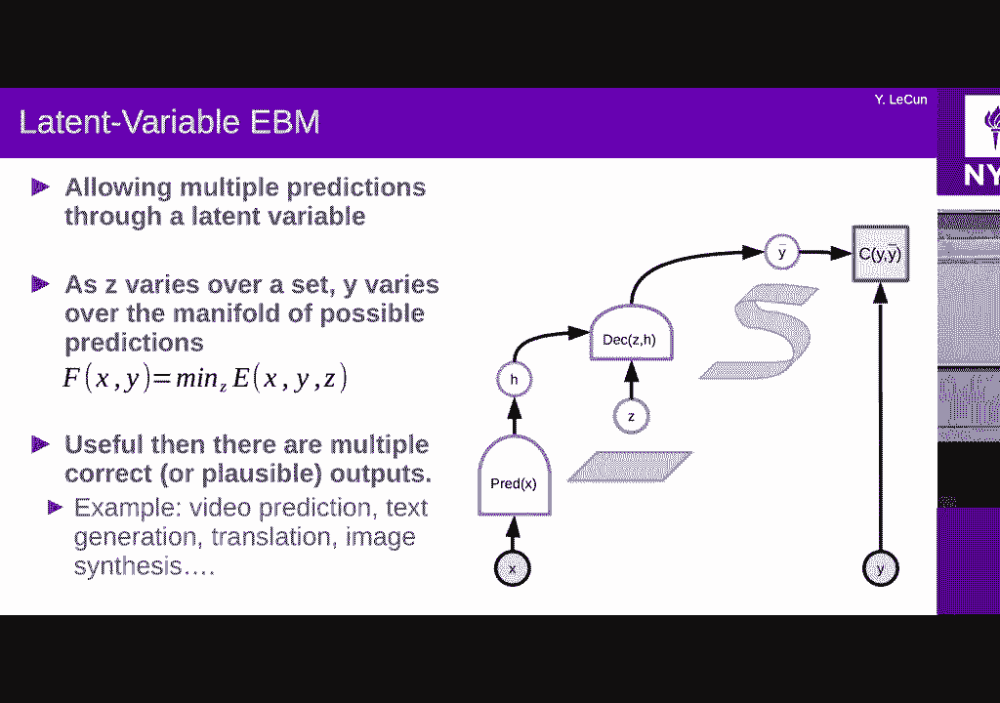

翻译产生的很好，现在让我们将其与概率联系起来，翻译产生的很好，现在让我们将其与概率联系起来，定价模型中有一种转化能量的方法，您可以将其视为一种。

定价模型中有一种转化能量的方法，您可以将其视为一种，如果您愿意，因为低能量好而氢不好则需要负分数，如果您愿意，因为低能量好而氢不好则需要负分数，将能量转化为概率以及通往二十种幻觉的方法。

将能量转化为概率以及通往二十种幻觉的方法，我们已经讨论过的概率，我们已经讨论过的概率，使用所谓的吉布斯·波尔兹曼分布，使用所谓的吉布斯·波尔兹曼分布，您知道的这可以追溯到19世纪的古典统计物理学。

您知道的这可以追溯到19世纪的古典统计物理学，世纪和我们得到的同伴X是指数减去beta，其中beta是，世纪和我们得到的同伴X是指数减去beta，其中beta是，一些恒定的x和y能量。

然后您想要使所有那些，一些恒定的x和y能量，然后您想要使所有那些，能量成正数，我们取一个数字的指数，能量成正数，我们取一个数字的指数，它为正，负号在那里使低能量返回高能量，它为正。

负号在那里使低能量返回高能量，概率，反之亦然，我正在使用此约定，概率，反之亦然，我正在使用此约定，因为这是上个世纪物理学家一直使用的，因为这是上个世纪物理学家一直使用的，世纪半，以指数为单位，您将。

世纪半，以指数为单位，您将，能量变成正数，然后归一化，所以在，能量变成正数，然后归一化，所以在，pyx在Y上正确归一化分布的方式，pyx在Y上正确归一化分布的方式，使其为y的正确分布正态分布除以。

使其为y的正确分布正态分布除以，整数或总和，如果它在e的Y到负beta F之间离散，整数或总和，如果它在e的Y到负beta F之间离散，XY的坐标与顶部相同，不同之处在于您将所有，XY的坐标与顶部相同。

不同之处在于您将所有，现在，如果计算Y上Y的积分，则Y的可能值等于，现在，如果计算Y上Y的积分，则Y的可能值等于，一个是因为很明显，您会在顶部获得积分，一个是因为很明显，您会在顶部获得积分，底部。

这是一个常数，您会得到一个确定，从而确认这是，底部，这是一个常数，您会得到一个确定，从而确认这是，这种具有满足概率分布公理，这种具有满足概率分布公理，它必须是正数，必须与一个整数相乘，它必须是正数。

必须与一个整数相乘，有很多方法可以将类似函数的功能转换为，有很多方法可以将类似函数的功能转换为，通过两种方式集成到与某个功能相对的一个，通过两种方式集成到与某个功能相对的一个，有趣的属性。

这些属性不会通过，但对应于，有趣的属性，这些属性不会通过，但对应于，所谓的最大熵分布，所谓的最大熵分布，beta参数是任意的，这是您校准自己的方法，beta参数是任意的，这是您校准自己的方法。

概率是能量的函数，因此beta越大，概率是能量的函数，因此beta越大，某种二进制或您的概率将是给定能量函数的，某种二进制或您的概率将是给定能量函数的，beta非常大，基本上只是XY的U。

beta非常大，基本上只是XY的U，产生最低能量的Y将具有较高的概率，产生最低能量的Y将具有较高的概率，其他一切都将具有非常低的概率，并且对于，其他一切都将具有非常低的概率，并且对于，小测试版。

那么您会在，小测试版，那么您会在，物理术语是一个逆温度，所以beta变为，物理术语是一个逆温度，所以beta变为，无限等于零温度，好一点数学，告诉您公式的位置并不可怕，好一点数学。

告诉您公式的位置并不可怕，F beta来自我之前提到的内容，所以让我们慢慢来，F beta来自我之前提到的内容，所以让我们慢慢来，这里给定x的y和z的P的联合概率好吧，我应用了相同的bossman。

这里给定x的y和z的P的联合概率好吧，我应用了相同的bossman，给出了我以前使用的玻尔兹曼分布公式，除了现在是一个联合，给出了我以前使用的玻尔兹曼分布公式，除了现在是一个联合，分布在y＆z上。

而不仅仅是分布在Y上，分布在y＆z上，而不仅仅是分布在Y上，潜变量模型好吧，所以它是e减去XYZ的能量，然后我，潜变量模型好吧，所以它是e减去XYZ的能量，然后我。

必须规范化我必须在y和z的分母中进行积分，必须规范化我必须在y和z的分母中进行积分，这样我就可以在y＆z的联合域上得到归一化分布，这样我就可以在y＆z的联合域上得到归一化分布，那是左上角的公式。

我可以边际化，所以如果我将y的P积分，那是左上角的公式，我可以边际化，所以如果我将y的P积分，和z给定x，我将其与Z积分，得到Y的P，好，和z给定x，我将其与Z积分，得到Y的P，好。

在右上角的边际化公式，所以现在如果我写YX的P，在右上角的边际化公式，所以现在如果我写YX的P，只是左上角的Z的整数，只是左上角的Z的整数，第二行，所以在顶部，我们对零的e积分为负，第二行，所以在顶部。

我们对零的e积分为负，XYZ的beta能量，在e的Z上方的y积分的底部积分到，XYZ的beta能量，在e的Z上方的y积分的底部积分到，XYZ的负beta e好吧，现在我要做的非常。

XYZ的负beta e好吧，现在我要做的非常，偷偷摸摸的没有愚蠢的是，我要把这个公式的对数减去，偷偷摸摸的没有愚蠢的是，我要把这个公式的对数减去，Beta超过1，然后x减去Beta。

然后将所有这些东西取指数，Beta超过1，然后x减去Beta，然后将所有这些东西取指数，取消确定，日志取消beta之前的负号-1，取消确定，日志取消beta之前的负号-1，取消减正beta的权利。

所以我对此e并没有做任何事情，取消减正beta的权利，所以我对此e并没有做任何事情，减去beta倍后的beta减去负1我什么也没做，减去beta倍后的beta减去负1我什么也没做，因为一切都会取消。

我在底部和看到的内容都做同样的事情，因为一切都会取消，我在底部和看到的内容都做同样的事情，现在，对于我来说，存储在支架中的东西以前是F beta，现在，对于我来说，存储在支架中的东西以前是F beta。

X y在beta上等于负1，对数Z上等于您将e的0移到，X y在beta上等于负1，对数Z上等于您将e的0移到，减去XYZ的beta e，所以我可以重写这种可怕的复杂，减去XYZ的beta e。

所以我可以重写这种可怕的复杂，此处的公式为XY的负beta F theta的e除以Y的积分，此处的公式为XY的负beta F theta的e除以Y的积分。

ETA减去XY的beta F表示这意味着如果您有一个，ETA减去XY的beta F表示这意味着如果您有一个，潜在可行模型，并且您想要消除潜在的Z变量，潜在可行模型，并且您想要消除潜在的Z变量。

以概率正确的方式来变量，您实际上只是在能量中发现了这一点。以概率正确的方式来变量，您实际上只是在能量中发现了这一点。F作为V或XYZ的函数，您完成了就可以了，F作为V或XYZ的函数，您完成了就可以了。

有点捷径，因为实际计算起来可能很难，可以，有点捷径，因为实际计算起来可能很难，可以，实际上很棘手，在大多数情况下可能很棘手，实际上很棘手，在大多数情况下可能很棘手，我想念一个-分母是正确的。

所以最后几张幻灯片，我想念一个-分母是正确的，所以最后几张幻灯片，就是说，如果您有一个愉快的体验，则可以将自己的内部空间最小，就是说，如果您有一个愉快的体验，则可以将自己的内部空间最小，模型。

或者您有一个小变量要边缘化，模型，或者您有一个小变量要边缘化，您可以通过这种方式定义这个新的this能量函数来完成，您可以通过这种方式定义这个新的this能量函数来完成。

并且记忆对应于该公式的无限贝塔极限，并且记忆对应于该公式的无限贝塔极限，可以做的很好，我的意思是只是要在，可以做的很好，我的意思是只是要在，第二行好吧第二行的最后两个术语被替换了。

第二行好吧第二行的最后两个术语被替换了，由XY的F theta决定，因为我只是这样定义了一些XY，所以，由XY的F theta决定，因为我只是这样定义了一些XY，所以，就是这样定义。

如果我这样定义XY的f，那么给定X的Y的P是，就是这样定义，如果我这样定义XY的f，那么给定X的Y的P是，只是很棒的礼物和公式权利的应用，而Z一直是，只是很棒的礼物和公式权利的应用，而Z一直是。

在可以的范围内隐性地边缘化，因此物理学家称其为自由，在可以的范围内隐性地边缘化，因此物理学家称其为自由，能量，这就是为什么我称它为“好”，所以这里是能量，F为，能量，这就是为什么我称它为“好”。

所以这里是能量，F为，自由能，所以区别在于您基本上没有预后模型，所以区别在于您基本上没有预后模型，选择要最小化的目标函数，并且必须保持真实，选择要最小化的目标函数，并且必须保持真实，从某种意义上来说。

标记的可能性是，从某种意义上来说，标记的可能性是，操作必须是您可能近似的正态分布，操作必须是您可能近似的正态分布，使用变分方法或这里所说的任何东西，最终我想要的是，使用变分方法或这里所说的任何东西。

最终我想要的是，让您知道要使用这些模型做什么是决策和，让您知道要使用这些模型做什么是决策和，如果您要构建驾驶汽车的系统，如果您要构建驾驶汽车的系统，告诉您您知道我需要在游览中向左转，向右转。

告诉您您知道我需要在游览中向左转，向右转，适合您指向您将要向左转的事实是，适合您指向您将要向左转的事实是，第二点和第八点的概率与你无关，第二点和第八点的概率与你无关，想要做出最好的决定，因为您必须做出。

想要做出最好的决定，因为您必须做出，一个决定，你被迫做出决定，所以如果你想要一个这样的系统，一个决定，你被迫做出决定，所以如果你想要一个这样的系统，因此，如果您想做出正确的决定，那么概率就完全没有用了。

因此，如果您想做出正确的决定，那么概率就完全没有用了，您想将自动化系统的输出与另一个用于，您想将自动化系统的输出与另一个用于，例如人类或其他系统，而该系统尚未经过培训，例如人类或其他系统。

而该系统尚未经过培训，在一起，但他们已经过单独训练，在一起，但他们已经过单独训练，然后您想要的是校准其过程，以便您可以将，然后您想要的是校准其过程，以便您可以将，对两个系统的分数做出正确的决定。

只有一种方法可以，对两个系统的分数做出正确的决定，只有一种方法可以，校准分数，并通过其他方式将其转化为概率，校准分数，并通过其他方式将其转化为概率，是劣等的还是等效的，但是如果您要训练系统。

是劣等的还是等效的，但是如果您要训练系统，端到端地做出决策，然后知道您的任何计分功能，端到端地做出决策，然后知道您的任何计分功能，只要可以给最佳分数最高的决策，使用就可以了。

只要可以给最佳分数最高的决策，使用就可以了，决定让您有更多选择的方式来选择所有模型，决定让您有更多选择的方式来选择所有模型，您如何训练它的选择您使用什么目标函数，您如何训练它的选择您使用什么目标函数。

基本上，如果您坚持要让模型具有概率性，就必须这样做，基本上，如果您坚持要让模型具有概率性，就必须这样做，因此，我们基本上必须以某种方式训练您的模型，因此，我们基本上必须以某种方式训练您的模型。

给数据的概率最大，好吧，问题是，给数据的概率最大，好吧，问题是，仅在您的模型正确且，仅在您的模型正确且，从某种意义上讲，您的模型永远都不正确，因为您知道有一个著名的退出，从某种意义上讲。

您的模型永远都不正确，因为您知道有一个著名的退出，著名的美容师盒子说所有模型都错了，但有些有用，著名的美容师盒子说所有模型都错了，但有些有用，所以可能是病态的模型，尤其是高维度的艺术模型。

所以可能是病态的模型，尤其是高维度的艺术模型，通讯分钟或较旧的情况下，例如空间和可能生病的模型，通讯分钟或较旧的情况下，例如空间和可能生病的模型，诸如此类的文字和事物，我们的近似模型在。

诸如此类的文字和事物，我们的近似模型在，一种方法，如果您尝试将它们标准化，则会使它们更加错误，从而使您更好，一种方法，如果您尝试将它们标准化，则会使它们更加错误，从而使您更好，有点不规范他们。

实际上还有一点，有点不规范他们，实际上还有一点，很重要，我回到这个小图表上，有了这个，所以这是，很重要，我回到这个小图表上，有了这个，所以这是，意味着是一个能量函数，捕获了x和y之间的依赖关系。

意味着是一个能量函数，捕获了x和y之间的依赖关系，好吧，这就像山脉，如果你想，好吧，这就像山脉，如果你想，值是黑点所在的位置，这些是数据点，然后，值是黑点所在的位置，这些是数据点，然后。

如果您尝试用以下方法改进模型，那么周围到处都是山脉，如果您尝试用以下方法改进模型，那么周围到处都是山脉，想象一下，这些点实际上是在，想象一下，这些点实际上是在，无限地无限薄的流形，好吧，所以数据分布。

无限地无限薄的流形，好吧，所以数据分布，黑点的白点实际上只是一条线，黑点的白点实际上只是一条线，为它们的线排三行，如果您愿意，它们没有任何宽度，为它们的线排三行，如果您愿意，它们没有任何宽度。

如果您想以此为生病模型，则可能为生病模型，如果您想以此为生病模型，则可能为生病模型，应该给你密度模型应该告诉你什么时候，应该给你密度模型应该告诉你什么时候，流形，输出应该是无限的，密度是无限的，流形。

输出应该是无限的，密度是无限的，只是实际上在那边应该是零好，那将是，只是实际上在那边应该是零好，那将是，正确的模型分布，这是一块薄板，正确的模型分布，这是一块薄板，不是立即应该是无限的。

而是它的整数应该可以，不是立即应该是无限的，而是它的整数应该可以，这不仅在计算机上很难实现，这不仅在计算机上很难实现，不可能，因为假设您要通过某种方式来计算此函数，不可能。

因为假设您要通过某种方式来计算此函数，网络的神经网络必须具有无限的权重和无限的，网络的神经网络必须具有无限的权重和无限的，以这种方式校准输出的积分的方式，以这种方式校准输出的积分的方式。

该系统在整个域中的数量为1，这基本上是不可能的，该系统在整个域中的数量为1，这基本上是不可能的，有准确的概率模型准确的正确的可能粘模型，有准确的概率模型准确的正确的可能粘模型。

对于我刚刚告诉您的特定数据，这是不可能的，对于我刚刚告诉您的特定数据，这是不可能的，我们希望您生产的可能性最大，并且，我们希望您生产的可能性最大，并且，我可以计算出这个世界，所以实际上它甚至没有意思。

因为，我可以计算出这个世界，所以实际上它甚至没有意思，因为，想象一下，对于我刚才的密度，您有一个完美的密度模型，想象一下，对于我刚才的密度，您有一个完美的密度模型，提到这是XY空间中的一块薄板，如果我。

提到这是XY空间中的一块薄板，如果我，给你x的值，我问你y的最佳值在哪里，给你x的值，我问你y的最佳值在哪里，之所以能够找到它，是因为Y的所有值（一组概率为0的概率除外），之所以能够找到它。

是因为Y的所有值（一组概率为0的概率除外），概率为0，只是您知道一些值，例如，概率为0，只是您知道一些值，例如，x的值有3个可能的值，x的值有3个可能的值，而且现在无限，所以他将无法找到它们。

而且现在无限，所以他将无法找到它们，推理算法，可让您找到它们，因为它们是六翼天使，推理算法，可让您找到它们，因为它们是六翼天使，他们只是派生函数，嘿，你怎么找到他，所以你唯一的办法，他们只是派生函数。

嘿，你怎么找到他，所以你唯一的办法，如果使对比度函数平滑且，如果使对比度函数平滑且，可区分的，然后您知道您可以从任何点开始并且非常渐变，可区分的，然后您知道您可以从任何点开始并且非常渐变，下降。

对于x的任何值，您都可以找到y的一个好值，但这不是，下降，对于x的任何值，您都可以找到y的一个好值，但这不是，如果分布是，则确实是一个很好的概率分布模型，如果分布是，则确实是一个很好的概率分布模型。

我提到的类型还可以，所以这里是坚持要保持良好状态的情况，我提到的类型还可以，所以这里是坚持要保持良好状态的情况，政治模型实际上不好，最大可能性很糟糕，所以如果，政治模型实际上不好，最大可能性很糟糕。

所以如果，你是一个真正的贝叶斯人，你说哦，但是就像你知道你可以通过我纠正这个问题，你是一个真正的贝叶斯人，你说哦，但是就像你知道你可以通过我纠正这个问题，想想先验，先验表明您的密度函数必须是，想想先验。

先验表明您的密度函数必须是，平滑，并且您知道可以将其视为先验，因此，平滑，并且您知道可以将其视为先验，因此，这样做，贝叶斯项就取其对数忘了，这样做，贝叶斯项就取其对数忘了，归一化。

您将获得基于能量的模型，因此基于能量的模型具有，归一化，您将获得基于能量的模型，因此基于能量的模型具有，与您的能量函数相加的正则化器，与您的能量函数相加的正则化器，贝叶斯模型。

其中似然是能量和能量的混合指数，贝叶斯模型，其中似然是能量和能量的混合指数，现在，您知道的能量乘以指数，就得到一个指数项，现在，您知道的能量乘以指数，就得到一个指数项，正则化器，所以它等于指数能量。

正则化器，所以它等于指数能量，加上正则化器，如果删除指数，则基于能量，加上正则化器，如果删除指数，则基于能量，有加法正则化的模型，所以有一种对应关系，有加法正则化的模型，所以有一种对应关系。

您知道之间可能在那寻找入侵方法，但坚持认为，您知道之间可能在那寻找入侵方法，但坚持认为，有时最大的可能性对您不利，特别是在高维度，有时最大的可能性对您不利，特别是在高维度，政治模型非常错误的空间。

社区或空间，政治模型非常错误的空间，社区或空间，在离散分布中非常错误，可以，在离散分布中非常错误，可以，但在那种情况下，您知道这确实是一个模型，所有模型都是错误的，所以，但在那种情况下。

您知道这确实是一个模型，所有模型都是错误的，所以。

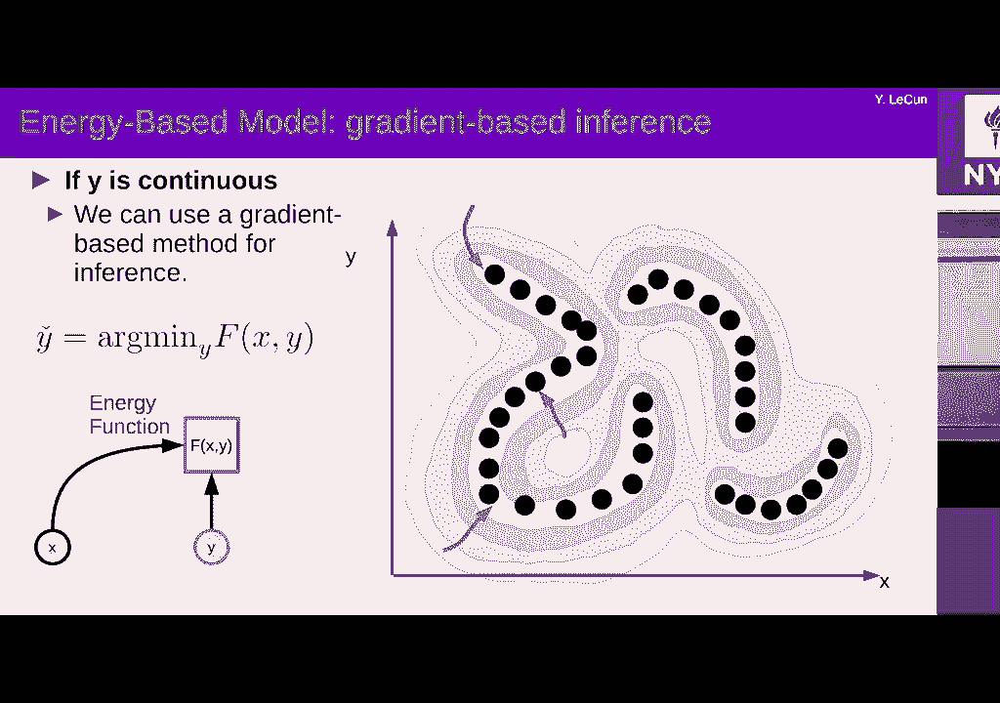

有一种学习形式，我将在此详细讨论，有一种学习形式，我将在此详细讨论。

未来的讲座称为有监督的跑步，这真的是，未来的讲座称为有监督的跑步，这真的是，首先包括有监督的跑步，但也包括人们，首先包括有监督的跑步，但也包括人们，曾经被称为无监督跑步和很多东西，我认为这是。

曾经被称为无监督跑步和很多东西，我认为这是，实际上，机器学习的未来是在超监督运行中，您可以开始，实际上，机器学习的未来是在超监督运行中，您可以开始，看到这些日子，你知道过去一年半以来，看到这些日子。

你知道过去一年半以来，由于Bert之类的系统，NLP取得了巨大的进步，由于Bert之类的系统，NLP取得了巨大的进步，尝试使用子监督运行特定形式的东西精氨酸，尝试使用子监督运行特定形式的东西精氨酸。

称为降噪自动编码器，我们将要讨论的还有，称为降噪自动编码器，我们将要讨论的还有，在过去三个月左右的时间里，在过去三个月左右的时间里，使用一些监督学习来训练系统来学习视觉系统来学习。

使用一些监督学习来训练系统来学习视觉系统来学习，您知道的所有功能都是受监督的借口任务及其目的，您知道的所有功能都是受监督的借口任务及其目的，这种监督学习的方法是训练系统学习良好的表象。

这种监督学习的方法是训练系统学习良好的表象，输入，以便您随后可以使用这些表示形式，输入，以便您随后可以使用这些表示形式，作为监督任务或强化学习任务的输入，作为监督任务或强化学习任务的输入。

问题是系统可以使用更多信息。

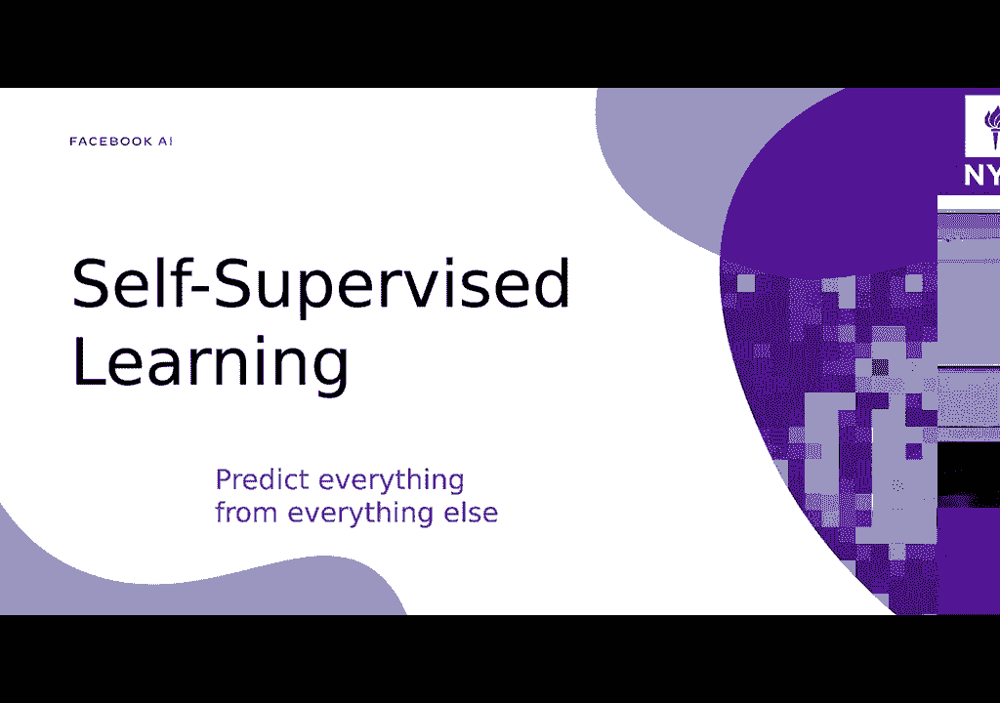

问题是系统可以使用更多信息，这种有监督的跑步的背景，所以如果你告诉我我的意思，这种有监督的跑步的背景，所以如果你告诉我我的意思，有监督的学习，所以对不起中毒是有人给你很多，有监督的学习。

所以对不起中毒是有人给你很多，数据，您将训练系统来预测给定的数据，数据，您将训练系统来预测给定的数据，另一段数据还可以，例如，我给你一段视频，另一段数据还可以，例如，我给你一段视频。

要求您使用视频的前半部分并训练模型来预测后半部分，要求您使用视频的前半部分并训练模型来预测后半部分，该视频的一半为什么会很好，该视频的一半为什么会很好，为什么在视觉系统的学习功能方面会很好。

为什么在视觉系统的学习功能方面会很好，例如，如果我训练自己以预测世界将会怎样，例如，如果我训练自己以预测世界将会怎样，就像我剃光头到，就像我剃光头到，左边关于如何改变视图的最好解释是每一点。

左边关于如何改变视图的最好解释是每一点，在太空中，距离我们的眼睛一定深度，在太空中，距离我们的眼睛一定深度，事实上，如果我以某种方式推断出每个点都与我有一段距离，事实上。

如果我以某种方式推断出每个点都与我有一段距离，那么我可以很简单地解释当我移动时世界是如何变化的，因为，那么我可以很简单地解释当我移动时世界是如何变化的，因为，远处的事物比远处的事物具有更多的产品运动。

远处的事物比远处的事物具有更多的产品运动，让这类人知道透视变形等等，让这类人知道透视变形等等，有这样的想法，如果我训练系统来预测是否，有这样的想法，如果我训练系统来预测是否，看起来如果我移动相机。

系统将隐式运行，看起来如果我移动相机，系统将隐式运行，您不会拥有的深度您将不必训练它来预测深度，您不会拥有的深度您将不必训练它来预测深度，以监督的方式，它必须在内部发现，以监督的方式，它必须在内部发现。

如果您想在那个预测中做好，那就是深度，如果您想在那个预测中做好，那就是深度，意味着您不必硬性连接世界是，意味着您不必硬性连接世界是，三维将通过预测高位视图在几分钟内学习。

三维将通过预测高位视图在几分钟内学习，世界发生了变化，但您知道一旦系统，世界发生了变化，但您知道一旦系统，已经发现，每个点在世界上都有深度，然后，已经发现，每个点在世界上都有深度，然后。

在背景前面有不同的对象会立即弹出，在背景前面有不同的对象会立即弹出，上升，因为物体的移动与物体的移动有所不同，上升，因为物体的移动与物体的移动有所不同，没有任何东西会立即弹出，这是因为。

没有任何东西会立即弹出，这是因为，现在看不到被另一个人隐藏或仍然存在，好吧，只是你，现在看不到被另一个人隐藏或仍然存在，好吧，只是你，没有看到它们，因为它们在后面，但是这个物体仍然存在的概念。

没有看到它们，因为它们在后面，但是这个物体仍然存在的概念，当您看不到它们时就存在，这并不完全清楚您周围的婴儿，当您看不到它们时就存在，这并不完全清楚您周围的婴儿，这真的很早，但尚不清楚确切的时间。

因为我们可以，这真的很早，但尚不清楚确切的时间，因为我们可以，衡量他们很小的时候，但它可能很快学到了，衡量他们很小的时候，但它可能很快学到了，一旦确定了对象的这种概念，也许您会发现。

一旦确定了对象的这种概念，也许您会发现，世界上很多物体不会自发地移动，所以那里，世界上很多物体不会自发地移动，所以那里，是无生命的物体，然后有一些物体的轨迹不是，是无生命的物体。

然后有一些物体的轨迹不是，完全可预测，并且它们是有生命的物体或其他类型的，完全可预测，并且它们是有生命的物体或其他类型的，您知道的对象以不像您一样的完全可预测的方式移动。

您知道的对象以不像您一样的完全可预测的方式移动，知道水在水中的波浪，但没有动画，这是莎莉之类的，知道水在水中的波浪，但没有动画，这是莎莉之类的，一棵树的叶子，然后过了一会儿，你也意识到，一棵树的叶子。

然后过了一会儿，你也意识到，通常具有可预测轨迹的物体，通常具有可预测轨迹的物体，如果不受支持，不要漂浮在空中，默认可以，这样您就可以，如果不受支持，不要漂浮在空中，默认可以，这样您就可以。

开始学习关于重力的如此直观的物理学，开始学习关于重力的如此直观的物理学，婴儿大约在9个月大时就开始跑步，所以这不是您所需要的，婴儿大约在9个月大时就开始跑步，所以这不是您所需要的，和你生在一起的时候。

你大约九个月不能跑，和你生在一起的时候，你大约九个月不能跑，引力是你不知道的事情，所以产生这种动力，引力是你不知道的事情，所以产生这种动力，监督学习，这是我认为这种监督学习的原因之一，监督学习。

这是我认为这种监督学习的原因之一，确实是机器学习的未来，所以在AI的未来，确实是机器学习的未来，所以在AI的未来，动物和人类似乎拥有大量的背景知识，动物和人类似乎拥有大量的背景知识。

仅仅通过观察就可以基本了解自己对世界的预测，仅仅通过观察就可以基本了解自己对世界的预测，因此，在AI中，一个大问题实际上是我几乎专门讨论的问题，因此，在AI中，一个大问题实际上是我几乎专门讨论的问题。

我们该怎么做好呢，我们还没有找到完整的答案，我们该怎么做好呢，我们还没有找到完整的答案，没错，所以我给你一个数据，它是一个视频，机器将，没错，所以我给你一个数据，它是一个视频，机器将。

假装有一个看不见的数据，然后另一个，假装有一个看不见的数据，然后另一个，它要调味的部分，它将尝试预测它看不到的部分，它要调味的部分，它将尝试预测它看不到的部分，从视频中看起来还不错的未来朋友们的作品中。

从视频中看起来还不错的未来朋友们的作品中，预测句子中缺少的单词，或者我给你一个句子，我阻止了，预测句子中缺少的单词，或者我给你一个句子，我阻止了，单词和系统会自动预测缺少的单词或。

单词和系统会自动预测缺少的单词或，当我向您展示一些视频的帧时，我会向您展示一堆视频，当我向您展示一些视频的帧时，我会向您展示一堆视频，图像中某些帧的一部分，对于您知道的某些帧，图像中某些帧的一部分。

对于您知道的某些帧，预测现在知道的右边一半中的不足一半，预测现在知道的右边一半中的不足一半，只看到我的右侧，但是即使您从未见过我的左侧，您也可以，只看到我的右侧，但是即使您从未见过我的左侧，您也可以。

或多或少地预测了我反面的样子大多数人或多或少，或多或少地预测了我反面的样子大多数人或多或少，除恐怖的好莱坞人物外，不那么对称。

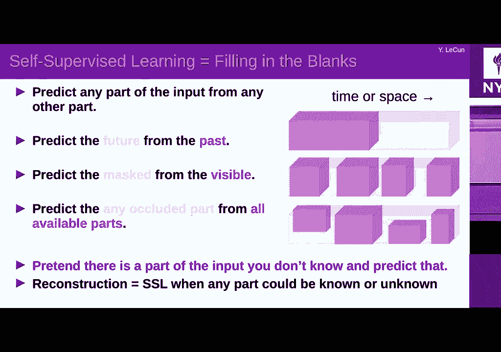

除恐怖的好莱坞人物外，不那么对称，因此，当我们如此惊讶时，赚取的收益令人难以置信，因此，当我们如此惊讶时，赚取的收益令人难以置信，它只发生在过去的一年半是文本，所以文本使用。

它只发生在过去的一年半是文本，所以文本使用，一种特殊的类型是一种称为降噪自动编码器的监督学习，一种特殊的类型是一种称为降噪自动编码器的监督学习，因此，您读一段文字后，通常会删除一些单词。

通常是15到15，因此，您读一段文字后，通常会删除一些单词，通常是15到15，百分之二十的单词，所以您替换标记表示单词，百分之二十的单词，所以您替换标记表示单词，基本上是空白。

然后您训练一些巨人和所有这些来预测，基本上是空白，然后您训练一些巨人和所有这些来预测，遗漏的单词是系统无法准确定位，遗漏的单词是系统无法准确定位，预测缺少哪些单词。

因此您可以通过以下方式将其训练为分类器，预测缺少哪些单词，因此您可以通过以下方式将其训练为分类器，对每个词产生一个很大的softmax因子，它对应于一个概率，对每个词产生一个很大的softmax因子。

它对应于一个概率，单词上的概率分布还可以，训练完该系统后，您将切下最后一层，然后使用，训练完该系统后，您将切下最后一层，然后使用，第二层是您输入的所有文字的代表，第二层是您输入的所有文字的代表。

该网络的特定体系结构使其运作良好，但是，该网络的特定体系结构使其运作良好，但是，与我们现在要说的观点无关，与我们现在要说的观点无关，我们上周讨论的变压器网络有点，但是，我们上周讨论的变压器网络有点。

但是，合理完成任务填空任务，合理完成任务填空任务，删除一些单词训练系统以预测哪些单词，删除一些单词训练系统以预测哪些单词，尽管现在我们输入的内容仍然有效，但这种缺失效果仍然很好。

尽管现在我们输入的内容仍然有效，但这种缺失效果仍然很好，他们具有所有基准测试中最好的性能，基本上是经过预先训练的，他们具有所有基准测试中最好的性能，基本上是经过预先训练的，使用这样的方法，最酷的是。

您知道自己拥有，使用这样的方法，最酷的是，您知道自己拥有，在网络上根据需要输入尽可能多的文本来预训练那些不需要的系统，在网络上根据需要输入尽可能多的文本来预训练那些不需要的系统。

标注任何东西都很便宜在计算方面非常昂贵，标注任何东西都很便宜在计算方面非常昂贵，因为这些网络对于他们来说运作良好非常重要，但实际上，因为这些网络对于他们来说运作良好非常重要，但实际上，好吧。

人们马上尝试翻译，好吧，人们马上尝试翻译，图像的成功与之类似，所以说我拍了一张图像，图像的成功与之类似，所以说我拍了一张图像，分解其中的一部分，然后训练一些商业网之类的东西，分解其中的一部分。

然后训练一些商业网之类的东西，预测图像中的缺失部分，结果非常好，预测图像中的缺失部分，结果非常好，失望真的没有用，我的意思是在某种意义上说效果很好，失望真的没有用，我的意思是在某种意义上说效果很好。

图像完成时，您知道有意义的事情，但是如果，图像完成时，您知道有意义的事情，但是如果，您使用内部表示形式学习这种方式作为输入计算机，您使用内部表示形式学习这种方式作为输入计算机，视觉系统。

您无法击败经过预先培训的计算机视觉系统，视觉系统，您无法击败经过预先培训的计算机视觉系统，在图像网上进行监督，有什么区别，在图像网上进行监督，有什么区别，您知道为什么它适用于LP，而不适用于图像，这是。

您知道为什么它适用于LP，而不适用于图像，这是，区别在于NLP是离散的，也可以是图像或连续的人，区别在于NLP是离散的，也可以是图像或连续的人，尝试对视频执行此操作。

就像两个想法都接受视频替换的单词一样，尝试对视频执行此操作，就像两个想法都接受视频替换的单词一样，帧，所以这里的视频可以改变照明系统或类似的东西，帧，所以这里的视频可以改变照明系统或类似的东西。

删除一些框架或框架块，然后训练系统以，删除一些框架或框架块，然后训练系统以。

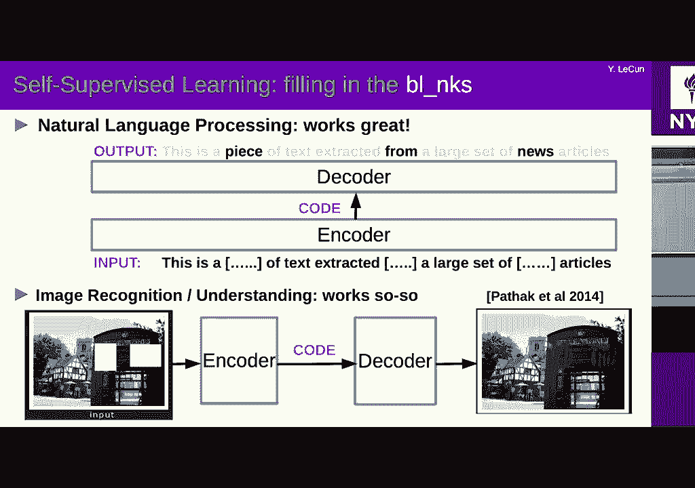

预测缺少的帧以及您获得或不那么出色的功能，预测缺少的帧以及您获得或不那么出色的功能，所以不同的是，事物似乎在离散的世界中运作，所以不同的是，事物似乎在离散的世界中运作，似乎无法在连续世界中工作。

原因是因为在，似乎无法在连续世界中工作，原因是因为在，在离散的世界中，我们不必大幅度地表示不确定性，在离散的世界中，我们不必大幅度地表示不确定性，在连续空间中单词上的softmax向量我们不是这样的。

如果我想训练一个，在连续空间中单词上的softmax向量我们不是这样的，如果我想训练一个，系统进行视频制作我不知道如何表示概率，系统进行视频制作我不知道如何表示概率，分布在多个视频帧上，嗯。

这是我们可能只想使用主管并进行交易的另一个原因，嗯，这是我们可能只想使用主管并进行交易的另一个原因，充满不确定性，这也是她父亲在母亲身上工作的原因，充满不确定性，这也是她父亲在母亲身上工作的原因。

事实上，我们希望我们的机器能够，事实上，我们希望我们的机器能够，关于世界的原因可以预测会发生什么，所以我之前告诉过你，关于世界的原因可以预测会发生什么，所以我之前告诉过你，示例。

在哪里可以建造可以驱动您自己的汽车的机器，示例，在哪里可以建造可以驱动您自己的汽车的机器，可能能够预测周围的原因可能是个好主意，可能能够预测周围的原因可能是个好主意，能够预测您在开车时将要做什么？

能够预测您在开车时将要做什么？你在开车，你在悬崖上，然后向右转动方向盘，你想要，你在开车，你在悬崖上，然后向右转动方向盘，你想要，预先预测您的汽车将驶出悬崖，而您不会，预先预测您的汽车将驶出悬崖。

而您不会，您可以，如果您可以预测自己不会这样做，那么，如果您有，您可以，如果您可以预测自己不会这样做，那么，如果您有，良好的世界预测模型系统将预测下一个状态，良好的世界预测模型系统将预测下一个状态。

世界现状与世界现状的函数，世界现状与世界现状的函数，您可以采取的行动然后就可以做，可以做得好，您可以采取的行动然后就可以做，可以做得好，您需要其他组件来明智地执行操作，但我会回到这一点。

您需要其他组件来明智地执行操作，但我会回到这一点，但同样，这种预测能力是智能的本质，但同样，这种预测能力是智能的本质，你知道一些动物很聪明是因为它们真的，你知道一些动物很聪明是因为它们真的。

一个更好的世界模型，其结果是更善于采取行动，一个更好的世界模型，其结果是更善于采取行动，这个世界-我能得到他们想要的结果，所以这个世界的问题是，这个世界-我能得到他们想要的结果，所以这个世界的问题是。

这个世界不是确定性的，或者我是说它是确定性的，但是我们，这个世界不是确定性的，或者我是说它是确定性的，但是我们，无法确切预测将要发生的情况，因此确定性的事实，无法确切预测将要发生的情况。

因此确定性的事实，是否无关紧要或容量有限或计算机具有，是否无关紧要或容量有限或计算机具有，容量有限，我们无法准确预测会发生什么，容量有限，我们无法准确预测会发生什么，发生。

所以我们需要能够训练我们的系统来训练我们的大脑，发生，所以我们需要能够训练我们的系统来训练我们的大脑，训练我们的AI系统在存在不确定性的情况下进行预测，这就是。

训练我们的AI系统在存在不确定性的情况下进行预测，这就是，我们今天需要解决的最困难的问题，以取得重大进展，我们今天需要解决的最困难的问题，以取得重大进展，在AI中如何训练系统以进行高维预测。

在AI中如何训练系统以进行高维预测，不确定性，这里有这种不确定性，不确定性，这里有这种不确定性，就像我之前说过的，寻找模型基本上是gopis好的，所以让我们，就像我之前说过的。

寻找模型基本上是gopis好的，所以让我们。

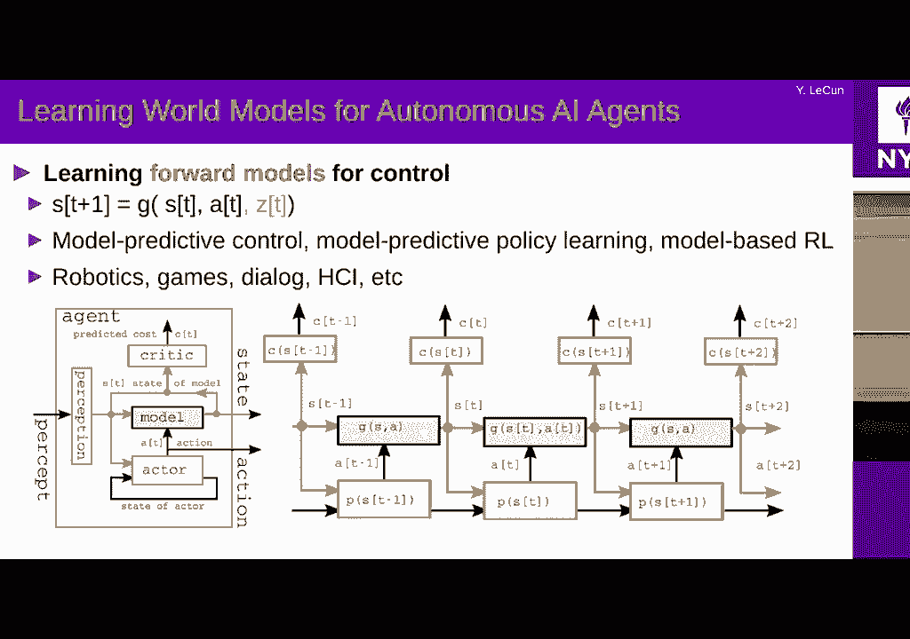

以视频预测为例，这里有四个帧，以视频预测为例，这里有四个帧，这些框架的延续是什么，所以很难看到那个小女孩，这些框架的延续是什么，所以很难看到那个小女孩，即将在她的生日蛋糕上长大。

如果您训练神经网络的最少。

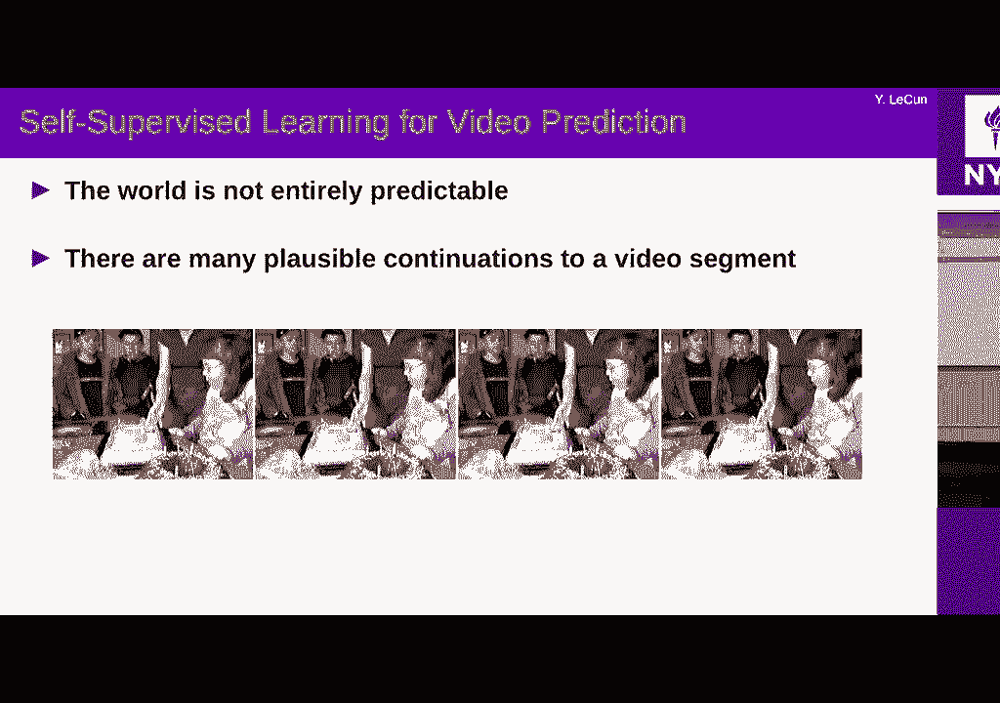

即将在她的生日蛋糕上长大，如果您训练神经网络的最少，进行预测，以便您在数千种此类视频中进行训练，进行预测，以便您在数千种此类视频中进行训练，如果不是数百万，这是一种预测，您会变得非常模糊。

如果不是数百万，这是一种预测，您会变得非常模糊，系统无法准确预测将要发生的情况，因此可以预测平均值，系统无法准确预测将要发生的情况，因此可以预测平均值，在所有可能的期货中，这是最小化平方误差的最佳方法。

在所有可能的期货中，这是最小化平方误差的最佳方法，好吧，如果您想要某种模型版本，可以说整个，好吧，如果您想要某种模型版本，可以说整个，训练集包括某人将笔放在桌子上然后放开。

训练集包括某人将笔放在桌子上然后放开，人们总是以相同的方式将钢笔完全放在同一位置，人们总是以相同的方式将钢笔完全放在同一位置，当您进行实验时，笔落入您知道的方向，当您进行实验时，笔落入您知道的方向。

所以每个训练样本的X基本上都相同，但是Y不同，所以每个训练样本的X基本上都相同，但是Y不同，因为笔可以朝任何方向折叠，而且可能均匀，因为笔可以朝任何方向折叠，而且可能均匀，分布，因此。

如果您尝试并花一些时间来预测波莉广场，您将获得，分布，因此，如果您尝试并花一些时间来预测波莉广场，您将获得，所有可能的预测的平均值，它是透明笔，所有可能的预测的平均值，它是透明笔，你知道整个圈子。

这不是一个好的预测，你知道整个圈子，这不是一个好的预测，这就是为什么您需要潜在变量模型的原因，所以如果您进行预测，这就是为什么您需要潜在变量模型的原因，所以如果您进行预测，由系统，但您有潜在变量。

这些变量指示您没有，由系统，但您有潜在变量，这些变量指示您没有，知道这个世界好吧，所以X是你所知道的，知道这个世界好吧，所以X是你所知道的，好吧，这是某人放一支笔的视频的初始片段，好吧。

这是某人放一支笔的视频的初始片段，当那个人给出这个数字时，笔会掉下来，但是你不知道，当那个人给出这个数字时，笔会掉下来，但是你不知道，因此，您希望系统告诉您的方向是特定的，因此。

您希望系统告诉您的方向是特定的，在这里从x 2h h开始表示，在这里从x 2h h开始表示，告诉你一分钱将在桌子上，但我可以告诉你，告诉你一分钱将在桌子上，但我可以告诉你，在哪个方向上。

然后Z将具有互补变量，这里是，在哪个方向上，然后Z将具有互补变量，这里是，笔实际掉落的方向，然后将两者结合，笔实际掉落的方向，然后将两者结合，您可以从观测和事物中提取的信息。

您可以从观测和事物中提取的信息，您不能给您预测Y栏，希望它接近，您不能给您预测Y栏，希望它接近，实际上发生的很好，所以您使用这种方式的方式就不会用于，实际上发生的很好。

所以您使用这种方式的方式就不会用于，我的意思是，如果您想使用它来对特定情况进行评分，请给它X，我的意思是，如果您想使用它来对特定情况进行评分，请给它X，您给它Y然后问它最小化Z变量的值是多少。

您给它Y然后问它最小化Z变量的值是多少，我模型中的预测误差，然后得出的预测误差为，我模型中的预测误差，然后得出的预测误差为，能量及其建模的方式来评估x和y之间的兼容性。

能量及其建模的方式来评估x和y之间的兼容性，您想预测智慧，但必须要做的就是观察X​​，然后，您想预测智慧，但必须要做的就是观察X​​，然后，梦到某个域内的y值，并产生y bar和，梦到某个域内的y值。

并产生y bar和，然后幻想Z的另一个值，它将产生它并产生另一个，然后幻想Z的另一个值，它将产生它并产生另一个，y条，您可以生成整套Y条，但我有点画多个，y条，您可以生成整套Y条，但我有点画多个。

设置或分布内的Z值很好，所以如果，设置或分布内的Z值很好，所以如果，您预测的是观察其他过去和未来的框架，您预测的是观察其他过去和未来的框架，当前框架（如增加您）意味着增加过去的框架。

当前框架（如增加您）意味着增加过去的框架，看着一点，但你知道一段时间后事情会发生，看着一点，但你知道一段时间后事情会发生，那真的不依赖于我的意思是关于将要发生的信息。

那真的不依赖于我的意思是关于将要发生的信息，过去的朋友们真的不存在新的未来，所以在这个，过去的朋友们真的不存在新的未来，所以在这个，在特定情况下，必须进行变量才能做出良好的预测，在特定情况下。

必须进行变量才能做出良好的预测，但是X信息不存在，所以问题是墙是什么，但是X信息不存在，所以问题是墙是什么，Z真的像您知道不会在x和y之间实现约束，Z真的像您知道不会在x和y之间实现约束。

或其他一些东西，在此示例中，我展示了潜在的，或其他一些东西，在此示例中，我展示了潜在的，变量我应该举几个例子吧，变量我应该举几个例子吧，我展示的示例是字符识别，如果您知道，我展示的示例是字符识别。

如果您知道，字符是识别字符的任务，字符是识别字符的任务，更容易，因此可以推断出您知道角色的位置，更容易，因此可以推断出您知道角色的位置，先生，您可以帮助您建立系统，您可以通过这种方式来构建系统，先生。

您可以帮助您建立系统，您可以通过这种方式来构建系统，可以在这种特殊情况下使用它在这里的作用不同，可以在这种特殊情况下使用它在这里的作用不同，潜在变量基本上是对可能输出的集合进行参数化。

潜在变量基本上是对可能输出的集合进行参数化，可能发生，最后您想要Z包含，可能发生，最后您想要Z包含，有关X为何不存在的原因的信息，所以，有关X为何不存在的原因的信息，所以，有关您的信息。

知道我下一步要去的地方，我要向左移动，有关您的信息，知道我下一步要去的地方，我要向左移动，还是对，这不存在于您现在可以观察到的任何东西中，还是对，这不存在于您现在可以观察到的任何东西中，大脑。

你能知道吗，你可以说是的，我的意思是现在在这里，大脑，你能知道吗，你可以说是的，我的意思是现在在这里，除了您知道的X以外，其他任何东西都是大型神经网络，具有装饰性，除了您知道的X以外。

其他任何东西都是大型神经网络，具有装饰性，代理正在。

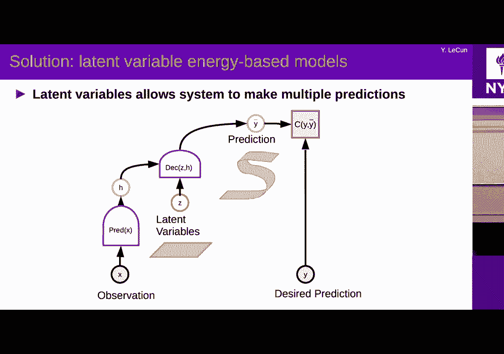

好的，这有点像一个能源格局可视化的例子，好的，这有点像一个能源格局可视化的例子，我们基本上训练了神经网络来计算能量函数，我们基本上训练了神经网络来计算能量函数，这不是神经网络，实际上是捕获。

这不是神经网络，实际上是捕获，两个变量x和y之间的相关性以及数据点都与此相关，两个变量x和y之间的相关性以及数据点都与此相关，这里的螺旋很小，因此数据点沿此均匀地采样，这里的螺旋很小。

因此数据点沿此均匀地采样，螺旋运动，然后我们训练一个系统，使您能量达到这些点，螺旋运动，然后我们训练一个系统，使您能量达到这些点，和更高的能量给其他所有事物现在这两种形式存在。

和更高的能量给其他所有事物现在这两种形式存在，有条件的，但您可以调用有条件的能量基础模型，有条件的，但您可以调用有条件的能量基础模型，有两套可行的X＆Y，而您正在尝试根据X预测Y，有两套可行的X＆Y。

而您正在尝试根据X预测Y，但这也是无条件的基于能量的模型的另一种形式，但这也是无条件的基于能量的模型的另一种形式，只有Y否X好，所以您正在尝试预测，只有Y否X好，所以您正在尝试预测。

Y的各个组成部分之间的依赖关系，Y的各个组成部分之间的依赖关系，如果您想要但没有X ok，这是您不想使用的，如果您想要但没有X ok，这是您不想使用的，您想无条件地说图像生成，您想无条件地说图像生成。

是否只想知道事物之间的相互依存关系，但是，是否只想知道事物之间的相互依存关系，但是，您不知道自己在任何时候都不知道，您不知道自己在任何时候都不知道，观察为什么选择挪威-或全都不选。

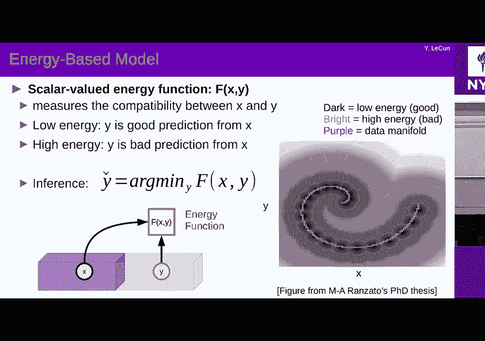

数学真的是一样的。

好的，那么您将如何交易这些能源呢？好的，那么您将如何交易这些能源呢？事情变得有趣，这是培训的问题，所以培训应该，事情变得有趣，这是培训的问题，所以培训应该，做一些像顶部顶部的真实动画一样的事情。

做一些像顶部顶部的真实动画一样的事情，能量函数，因为或机器现在确信能量函数为，能量函数，因为或机器现在确信能量函数为，X的函数以及为什么它应该以这样的方式塑造能量函数。

X的函数以及为什么它应该以这样的方式塑造能量函数，数据点的能量比其他所有能量都低，因为那是，数据点的能量比其他所有能量都低，因为那是，如果y的正确值确实较低，则推断将起作用的方式。

如果y的正确值确实较低，则推断将起作用的方式，比不正确的Y值或发现的推理算法的能量，比不正确的Y值或发现的推理算法的能量，产生最低能量的y的值会正常工作，所以我们需要，产生最低能量的y的值会正常工作。

所以我们需要，遮盖能量功能，使您在给定的能量下拥有明智的能量，遮盖能量功能，使您在给定的能量下拥有明智的能量，X和给定X的高能量到坏Y，它来自我们的意思，它来自您要扩展的任何域是，它来自我们的意思。

它来自您要扩展的任何域是，那是salli，所以这个模型实际上是一个潜在变量模型，那是salli，所以这个模型实际上是一个潜在变量模型，您可能非常熟悉这里使用的模型的能量是k均值。

您可能非常熟悉这里使用的模型的能量是k均值，所以这是怎么产生的，好吧，好吧，让我延迟一下，好吧，但这是，所以这是怎么产生的，好吧，好吧，让我延迟一下，好吧，但这是，加的斯的能量面。

这是一个潜在的变量模型，让我们保持，加的斯的能量面，这是一个潜在的变量模型，让我们保持，暂时搁置一小段可行的事情，您会想到，暂时搁置一小段可行的事情，您会想到，因为您的能量f为XY，并且潜在的潜在潜能。

因为您的能量f为XY，并且潜在的潜在潜能，变量，如果现在从字面上看是相关的，那么有两类，变量，如果现在从字面上看是相关的，那么有两类，训练基于能量的模型的方法，并且可能再次寻求方法都是各种各样的。

训练基于能量的模型的方法，并且可能再次寻求方法都是各种各样的，你们知道那一类中的特殊情况称为对比方法，你们知道那一类中的特殊情况称为对比方法，这个想法很自然，请选择您的训练样本XX超过XIYI。

这个想法很自然，请选择您的训练样本XX超过XIYI，更改能量函数的参数，使其能量下降，更改能量函数的参数，使其能量下降，好吧，足够容易，反之，将数据外的其他点取走，好吧，足够容易，反之。

将数据外的其他点取走，所以有一些选择给定X的过程，让你选择一个不好的Y，所以有一些选择给定X的过程，让你选择一个不好的Y，然后如果您继续使用Rost函数将其推开，然后如果您继续使用Rost函数将其推开。

考虑到那些不同的不同能量，然后能量，考虑到那些不同的不同能量，然后能量，功能将采用某种形状，以使正确的电线具有较低的，功能将采用某种形状，以使正确的电线具有较低的，比价值明智的低能量好吧，继续压低。

比价值明智的低能量好吧，继续压低，Y不断推高Y的无效值，因此将其称为对比，Y不断推高Y的无效值，因此将其称为对比，方法和它们都因您选择上推Y的方式而异，它们，方法和它们都因您选择上推Y的方式而异，它们。

所有功能都因您使用的最后一个功能而异，所有功能都因您使用的最后一个功能而异，这样做会推高和推低第二种方法，这样做会推高和推低第二种方法，在您建立能量函数的情况下，我将其称为架构方法。

在您建立能量函数的情况下，我将其称为架构方法，XY的f，因此低能量区域的体积受到限制或，XY的f，因此低能量区域的体积受到限制或，通过正则化最小化，因此您以如下方式构建模型，通过正则化最小化。

因此您以如下方式构建模型，无论您降低数据能量的多少，其余的都会增加更多，或者，无论您降低数据能量的多少，其余的都会增加更多，或者，会自动减少，因为我可以吸收能量的细胞数量有限，会自动减少。

因为我可以吸收能量的细胞数量有限，或通过一些正则化将其最小化，这是非常广泛的概念，可以，或通过一些正则化将其最小化，这是非常广泛的概念，可以，是的，这是一套技术，但是有很多，所以有一套，是的。

这是一套技术，但是有很多，所以有一套，例如得分匹配之类的方法，它表示能量的梯度，例如得分匹配之类的方法，它表示能量的梯度，样本周围应为零，二阶导数应与，样本周围应为零，二阶导数应与。

可能粗麻布的痕迹应该很大，所以基本上你是在说，可能粗麻布的痕迹应该很大，所以基本上你是在说，你知道吗，使每个数据点的能量降到最低，你知道吗，使每个数据点的能量降到最低，确保能量在重新训练的样品周围卷曲。

这很难很难，确保能量在重新训练的样品周围卷曲，这很难很难，在实践中应用，因为您必须计算相对于，在实践中应用，因为您必须计算相对于，相对于能量函数的Hessian轨迹的浪费。

相对于能量函数的Hessian轨迹的浪费，输入意味着要计算L，但是对简单模型而言，通过触摸即可完成，输入意味着要计算L，但是对简单模型而言，通过触摸即可完成，是的，像线性模型一样简单的模型。

但是我要远离，是的，像线性模型一样简单的模型，但是我要远离，没关系，所以这里有很多不同的策略说是七种策略，没关系，所以这里有很多不同的策略说是七种策略，但我可以将Isis分为这两种对比方法。

但我可以将Isis分为这两种对比方法，建筑方法，分为三个子类别，但是您知道，建筑方法，分为三个子类别，但是您知道，即使是建筑中的子类别也可以形成对比，即使是建筑中的子类别也可以形成对比。

还有一些您可能会认识的名称或语音算法，还有一些您可能会认识的名称或语音算法，其他一些你可能不知道这是好的，我要去，其他一些你可能不知道这是好的，我要去，通过其中一些，现在我需要做的就是所谓的得分匹配。

现在我需要做的就是所谓的得分匹配，第二，哎呀，好吧，所以c1对比技术使每个人都降低了数据点的能量，好吧，所以c1对比技术使每个人都降低了数据点的能量，推高其他地方，这就是最大可能性和最大可能性。

推高其他地方，这就是最大可能性和最大可能性，可能性将数据点的能量降低到负无穷大并推，可能性将数据点的能量降低到负无穷大并推，将其他点的能量增加到无穷大，这是我们遇到的问题，将其他点的能量增加到无穷大。

这是我们遇到的问题，之前只是在谈论，所以这是发生了什么，所以你有这个，之前只是在谈论，所以这是发生了什么，所以你有这个，礼物老板联合分配给，礼物老板联合分配给，给定X的Y的可能性。

对于特定数据点y IXI，给定X的Y的可能性，对于特定数据点y IXI，您的模型给出y的特定值的概率I，您的模型给出y的特定值的概率I，原谅XI，你知道指数减去β能量，原谅XI，你知道指数减去β能量。

除以指数减去贝塔，所有方向上的能量积分都可以，除以指数减去贝塔，所有方向上的能量积分都可以，如果您想最大化，那么假设您是一堆数据点，如果您想最大化，那么假设您是一堆数据点，想最大化，所以在这里不写X。

因为没关系，你想要，想最大化，所以在这里不写X，因为没关系，你想要，最大化您的模型赋予您想要的y的特定价值的贫困，最大化您的模型赋予您想要的y的特定价值的贫困，使Y的能量变小，这意味着您要将e变为。

使Y的能量变小，这意味着您要将e变为，减去beta这样大的能量，您想要在底部进行填充，减去beta这样大的能量，您想要在底部进行填充，尽可能小，而不是最大化Y的P，尽可能小，而不是最大化Y的P。

最小化Y的负对数P好的，所以Y的负对数P，所以如果我取这个的对数，最小化Y的负对数P好的，所以Y的负对数P，所以如果我取这个的对数，我要死的比率我要得到这两个词的差，我要死的比率我要得到这两个词的差。

差异的日志，您知道这两个术语的日志，差异的日志，您知道这两个术语的日志，该比率是对数的差，所以我得到e的对数为负，该比率是对数的差，所以我得到e的对数为负，Y的beta e。

然后我想我吃的Y减去对数积分，Y的beta e，然后我想我吃的Y减去对数积分，YI的Y表示我否定这一点，是因为我想尽量减少问题，所以，YI的Y表示我否定这一点，是因为我想尽量减少问题，所以。

负对数概率是我想要的Levis，我得到了最后一个函数，负对数概率是我想要的Levis，我得到了最后一个函数，在底部，我将所有内容都除以beta，到目前为止没有任何区别，在底部。

我将所有内容都除以beta，到目前为止没有任何区别，就最小而言，好吧，所以从顶部公式转到底部，就最小而言，好吧，所以从顶部公式转到底部，公式中减去顶级公式的对数，然后除以Beta。

公式中减去顶级公式的对数，然后除以Beta，所以现在我们有一个给我们损失函数的函数，这就是我们的函数，所以现在我们有一个给我们损失函数的函数，这就是我们的函数，我们记住它表示使数据点y的能量尽可能低。

我们记住它表示使数据点y的能量尽可能低，Y的yi应该小，并使第二项尽可能小，Y的yi应该小，并使第二项尽可能小，意味着这意味着使该指数内的能量减去，意味着这意味着使该指数内的能量减去，尽可能大。

所以第二个学期将推动每个人的精力，尽可能大，所以第二个学期将推动每个人的精力，现在，如果我计算此物镜的梯度，则包括数据点，现在，如果我计算此物镜的梯度，则包括数据点，功能，所以这是贫困线方法好的。

谢谢美国，所以请计算一下，功能，所以这是贫困线方法好的，谢谢美国，所以请计算一下，这个骑师功能的梯度，我得到的能量梯度，这个骑师功能的梯度，我得到的能量梯度，数据点y还可以-这里的公式是对的Y的期望值。

数据点y还可以-这里的公式是对的Y的期望值，我的模型给定Y的概率由给定骑手给定，我的模型给定Y的概率由给定骑手给定，分布，并用作权重系数梯度的系数，分布，并用作权重系数梯度的系数。

这个位置的能量函数还可以，所以这里的第二项是，这个位置的能量函数还可以，所以这里的第二项是，基本上是梯度的期望值，基本上是梯度的期望值，能量函数在每个点上的权重都是，能量函数在每个点上的权重都是。

模型给我特定的Y，然后计算该加权和，模型给我特定的Y，然后计算该加权和，本质上，如果Y是离散的，则谨慎一些连续的，本质上，如果Y是离散的，则谨慎一些连续的，积分，所以第一个项所以现在。

如果我使用另一个随机梯度，积分，所以第一个项所以现在，如果我使用另一个随机梯度，梯度算法的第一项将尝试使我的能量，梯度算法的第一项将尝试使我的能量，数据点，第二项将推出，数据点，第二项将推出。

每个点的能量为什么还可以，每个点的能量为什么还可以，问题是我可以完全算出这个积分吗？问题是我可以完全算出这个积分吗？概率建模中诚实的出版物与，概率建模中诚实的出版物与，您如何计算此估算值或近似值，因为。

您如何计算此估算值或近似值，因为，在Y的空间是整数的情况下，积分是有趣的。在Y的空间是整数的情况下，积分是有趣的。我无法在所有可能的图像上计算积分，我无法在所有可能的图像上计算积分。

除非能量函数或能量函数的梯度非常大，除非能量函数或能量函数的梯度非常大，非常简单好吧，大多数情况下，如果要复杂，非常简单好吧，大多数情况下，如果要复杂，模型来捕获世界的依赖关系不会那么简单。

模型来捕获世界的依赖关系不会那么简单，这将是一个大的神经网络，所以这个积分将是，这将是一个大的神经网络，所以这个积分将是，完全难解，因为这是，完全难解，因为这是，期望值，因此要计算近似值和期望值。

期望值，因此要计算近似值和期望值，可以计算有限数量样本的平均值，所以如果我采样为什么，可以计算有限数量样本的平均值，所以如果我采样为什么，是从这个分布，这就是我的模型给Y的分布，是从这个分布。

这就是我的模型给Y的分布，我计算了这些样本的梯度平均值，得到了一些有限值，我计算了这些样本的梯度平均值，得到了一些有限值，它的近似值称为蒙特卡洛方法好吧，称为蒙特卡洛方法。

它的近似值称为蒙特卡洛方法好吧，称为蒙特卡洛方法，当物理学家试图，当物理学家试图，在40年代制造定时炸弹还有其他基于理性的方法，在40年代制造定时炸弹还有其他基于理性的方法，方法。

所以我真的不知道如何计算PI不能计算城市世界，方法，所以我真的不知道如何计算PI不能计算城市世界，但假设我用另一个我无法计算的分布Q替换了K，但假设我用另一个我无法计算的分布Q替换了K。

这个平均值让我们说高斯之类的东西，然后我试着让你成为，这个平均值让我们说高斯之类的东西，然后我试着让你成为，尽可能接近P，这就是所谓的变分方法，尽可能接近P，这就是所谓的变分方法。

任何时候都听到这个词是基本的想法，任何时候都听到这个词是基本的想法，您可以通过替换，您可以通过替换，通过您可以实际计算的东西进行分布，然后尝试使，通过您可以实际计算的东西进行分布，然后尝试使。

该可计算的分布尽可能接近使用，该可计算的分布尽可能接近使用，某种程度的KL散度对，所以这里是k均值。

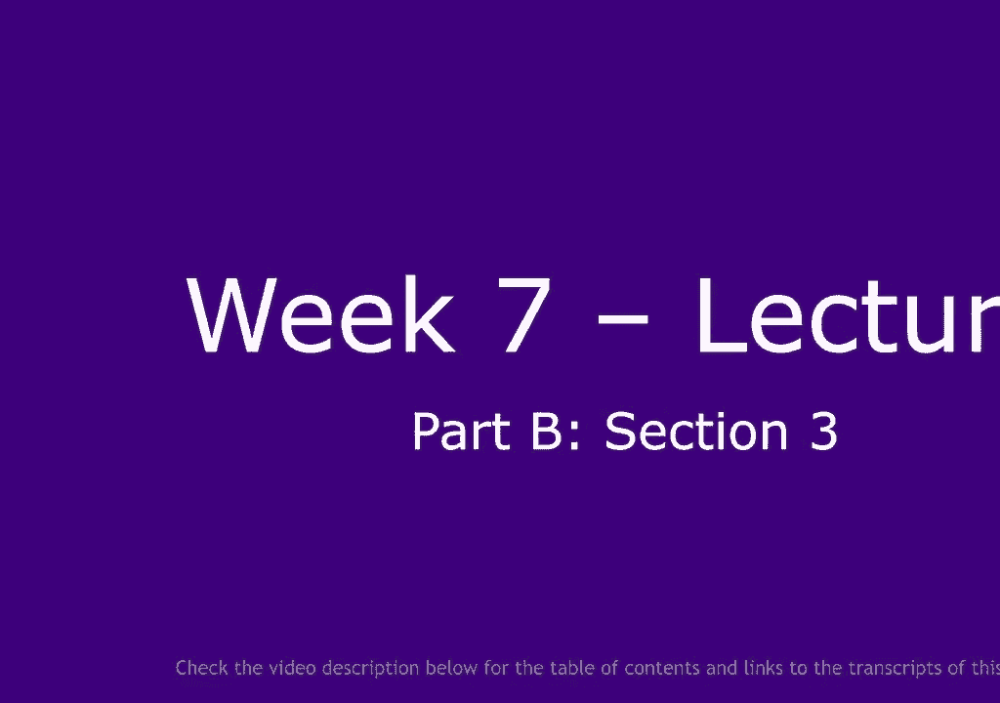

某种程度的KL散度对，所以这里是k均值，将k均值视为基于能量的模型您可以解释基于能量的模型，将k均值视为基于能量的模型您可以解释基于能量的模型，糖果就此模型而言，凯恩斯是什么人可以吗。

或者您忘记了我们可以使用此功能，凯恩斯是什么人可以吗，或者您忘记了我们可以使用此功能，好的，所以k均值就是这个非常简单的聚类算法，好的，所以k均值就是这个非常简单的聚类算法，功能，如果您从未听说过。

这是一种解释他的意思的方法，功能，如果您从未听说过，这是一种解释他的意思的方法，能量函数写在顶部，这里YZ的y是y减去WZ，其中W是，能量函数写在顶部，这里YZ的y是y减去WZ，其中W是，矩阵。

Z是一个热向量的集合，矩阵，Z是一个热向量的集合，具有K个可能值的变量，它是一个带有一个，具有K个可能值的变量，它是一个带有一个，分量等于1，所有其他分量等于0，所以您将Z乘以，分量等于1。

所有其他分量等于0，所以您将Z乘以，矩阵W的作用是，您获得的产品是，矩阵W的作用是，您获得的产品是，W的列ok乘以Z的分量，W的列ok乘以Z的分量，等于1是我们生产的，其他所有东西，等于1是我们生产的。

其他所有东西，一切正常，以便产品从光束中选择W列中的一列，一切正常，以便产品从光束中选择W列中的一列，被称为原型好吧，如果我给你一个Y的方式，被称为原型好吧，如果我给你一个Y的方式。

推论是您找出Z的K个可能向量中的哪个Z，推论是您找出Z的K个可能向量中的哪个Z，最小化重建误差，实现之间的平方距离，最小化重建误差，实现之间的平方距离，W的对应列和我正在查看的数据点以及。

W的对应列和我正在查看的数据点以及，能量只是两者之间的距离还可以，现在能量函数，能量只是两者之间的距离还可以，现在能量函数，看到在此图表中表示的位置，您在这里看到的是某种，看到在此图表中表示的位置。

您在这里看到的是某种，黑色斑点，对应于，W的每个原型周围都有二次方井，因此他拥有的系统，W的每个原型周围都有二次方井，因此他拥有的系统，受过训练，他将W的列沿训练流形放置，受过训练。

他将W的列沿训练流形放置，样本，这就是所有训练样本所在的螺旋，样本，这就是所有训练样本所在的螺旋，选择，并且训练方法非常简单，您只需记住，选择，并且训练方法非常简单，您只需记住。

预计训练集的平均能量可以，所以基本上我给，预计训练集的平均能量可以，所以基本上我给，您为什么为什么要训练样本，却发现Z使能量最小？您为什么为什么要训练样本，却发现Z使能量最小？您会找到最接近Y的原型。

最接近Y的逗号W和，您会找到最接近Y的原型，最接近Y的逗号W和，然后他们执行梯度下降的一步，所以您将向量移到接近，然后他们执行梯度下降的一步，所以您将向量移到接近，将Y靠近Y，然后再选择另一个Y。

选择W的哪列最接近，将Y靠近Y，然后再选择另一个Y，选择W的哪列最接近，并将其移到更靠近Y的位置，然后继续这样做，并将其移到更靠近Y的位置，然后继续这样做，并非完全是KB的算法，这是一种随机梯度。

并非完全是KB的算法，这是一种随机梯度，k均值算法的形式实际上是真正的k均值算法，k均值算法的形式实际上是真正的k均值算法，如果您愿意的话，可以选择某种坐标下降，这样整个下降都会失败，如果您愿意的话。

可以选择某种坐标下降，这样整个下降都会失败，训练集并为每个数据点找出W的哪一列最接近，训练集并为每个数据点找出W的哪一列最接近，到它，然后在完成此操作后，您将计算每个数据点，到它，然后在完成此操作后。

您将计算每个数据点，角W是与其关联的所有数据点的平均值，角W是与其关联的所有数据点的平均值，如果以这种方式进行，相对于随机梯度，速度会更快一些，但是，如果以这种方式进行，相对于随机梯度，速度会更快一些。

但是，最终相同的结果使最小的能量平均，最终相同的结果使最小的能量平均，训练很好，所以这是一个例子，如果有一个问题，训练很好，所以这是一个例子，如果有一个问题，较早的潜在变量就是潜在变量模型的一个例子。

较早的潜在变量就是潜在变量模型的一个例子，解码器是线性的简单模型不依赖于X以及您所要，解码器是线性的简单模型不依赖于X以及您所要，只是想做的是对Y的分布进行建模，这里y是。

只是想做的是对Y的分布进行建模，这里y是，二维，你只是想说你知道我是否做一个y值，二维，你只是想说你知道我是否做一个y值，你能告诉我我是否知道为什么你能告诉我有关你的方式的任何事情。

你能告诉我我是否知道为什么你能告诉我有关你的方式的任何事情，y2，一旦你有了这个能量函数，我就可以给你一个，y2，一旦你有了这个能量函数，我就可以给你一个，可以预测y 2的值应该是多少我给你一个随机点。

可以预测y 2的值应该是多少我给你一个随机点，只需搜索一下就能告诉我任何一天的最接近点，只需搜索一下就能告诉我任何一天的最接近点，对于最接近的原型基本上还可以，所以他的意思是这里所解释的属于建筑方法。

所以他的意思是这里所解释的属于建筑方法，这不是一种对比方法，您可以观察到我并没有推动，这不是一种对比方法，您可以观察到我并没有推动，能量的一切，我只是压低了k均值的能量，能量的一切。

我只是压低了k均值的能量，这样，空间中只有K个点可以为零，这样，空间中只有K个点可以为零，能量和其他所有能量都将具有更高的能量，能量和其他所有能量都将具有更高的能量，这样就对了，所以一旦我决定了K。

这样就对了，所以一旦我决定了K，限制Y形空间的体积，它们可以消耗低能量，因为，限制Y形空间的体积，它们可以消耗低能量，因为，只有K点的能量为零，当我离开它们时，其他所有事物都以平方增长，当我离开它们时。

其他所有事物都以平方增长，如果还有很多其他方法，这些是我最喜欢的方法，如果还有很多其他方法，这些是我最喜欢的方法，最终每个人都会使用架构方法，但是现在，最终每个人都会使用架构方法，但是现在。

可以在图像中工作的东西本身是可以对比的，所以可以对比。

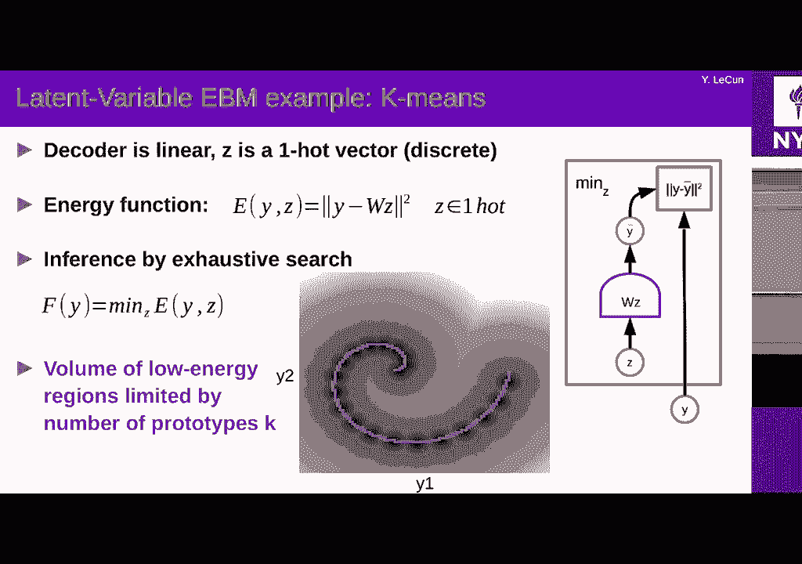

可以在图像中工作的东西本身是可以对比的，所以可以对比，方法我有数据点，我的模型计算能量函数，方法我有数据点，我的模型计算能量函数，假设看起来像这样，所以我很酷，我正在绘制相等的轮廓，假设看起来像这样。

所以我很酷，我正在绘制相等的轮廓，成本还可以，就像地形图一样，显然模型不好，成本还可以，就像地形图一样，显然模型不好，因为它为您在这些点上提供能量，因为它为您在这些点上提供能量，能量，他们不应该。

然后这些点具有高能量，它们，能量，他们不应该，然后这些点具有高能量，它们，不应该，如果我接受，我应该怎么做显然，不应该，如果我接受，我应该怎么做显然，在这里训练样本，然后更改XY的FF参数，以便。

在这里训练样本，然后更改XY的FF参数，以便，能量下降真的是要移动功能才能拥有Canha，能量下降真的是要移动功能才能拥有Canha，在该区域设置较低的值，但这可能还不够，因为它可能是。

在该区域设置较低的值，但这可能还不够，因为它可能是，我的能量函数是允许上升的，以至于它可能是平坦的，我的能量函数是允许上升的，以至于它可能是平坦的，可能在任何地方都为零，所以我需要明确地推高其他地方。

可能在任何地方都为零，所以我需要明确地推高其他地方，因此，一个好的推高位置的地方将是这些红色的位置，因此，一个好的推高位置的地方将是这些红色的位置，是我的模型为您提供能量的位置，但不应低能量。

是我的模型为您提供能量的位置，但不应低能量，好吧，所以让我们说这是我现在的训练样本吧，好吧，所以让我们说这是我现在的训练样本吧，这里的大黑点是我的训练样本，我可以尝试进行对比的一种方式。

这里的大黑点是我的训练样本，我可以尝试进行对比的一种方式，系统就是说我要降低那一点的能量，而我，系统就是说我要降低那一点的能量，而我，将通过某种方式破坏它来检索该点，将通过某种方式破坏它来检索该点。

噪音，我们将增加接近身体的能量，噪音，我们将增加接近身体的能量，我要做几次，这足够多次，最终能量函数将卷曲，这足够多次，最终能量函数将卷曲，围绕每个样本，因为我修改了样本，并且推高了您知道我腐败了。

围绕每个样本，因为我修改了样本，并且推高了您知道我腐败了，它有点，我推高了校正后的样本的能量，它有点，我推高了校正后的样本的能量，对比样本，因此最终能量将以正确的速度前进，对比样本。

因此最终能量将以正确的速度前进，有点聪明，而不是随机干扰，有点聪明，而不是随机干扰，特里尼（Trini）样品由您知道我将要使用的周围扰动，特里尼（Trini）样品由您知道我将要使用的周围扰动。

梯度下降到能量表面的某种下降，然后我要，梯度下降到能量表面的某种下降，然后我要，理解这一点并将其向上推，这很有意义，因为我要，理解这一点并将其向上推，这很有意义，因为我要，对于这里的摇摆机。

我知道系统可以找到要点，对于这里的摇摆机，我知道系统可以找到要点，系统给了她当前的能量，并且向上推，所以，系统给了她当前的能量，并且向上推，所以，程序在这里是训练样本，在能量表面向下移动。

您会发现具有较低能量的y值，在能量表面向下移动，您会发现具有较低能量的y值，而不是您开始的那个，然后是合同规定的样本，而不是您开始的那个，然后是合同规定的样本，向下推原始样品向上推这个新样品。

向下推原始样品向上推这个新样品，可能很昂贵，您的能量功能可能很复杂，可能很昂贵，您的能量功能可能很复杂，局部最小值，这是另一种技术，另一种技术是从，局部最小值，这是另一种技术，另一种技术是从。

相同的训练样本，并想象这个表面就像是一个，相同的训练样本，并想象这个表面就像是一个，像你那光滑的山脉，然后随意踢一下这个大理石，像你那光滑的山脉，然后随意踢一下这个大理石，将其视为大理石。

您将随机将其踢出，将其视为大理石，您将随机将其踢出，方向，您将模拟为大理石滚落下来，方向，您将模拟为大理石滚落下来，能量表面，所以说我要朝这个方向踢，能量表面，所以说我要朝这个方向踢。

朝这个方向走一会儿，然后它就会下降，朝这个方向走一会儿，然后它就会下降，一段时间后切断能量，你在这所教堂的尽头得到了一点，实际上把它推高了，所以我，你在这所教堂的尽头得到了一点，实际上把它推高了。

所以我，非常非正式地执行此操作，但实际上取决于您的操作方式，非常非正式地执行此操作，但实际上取决于您的操作方式，这是我在解释这些方法的原理，但实际上，这是我在解释这些方法的原理，但实际上。

您对制作建模感兴趣，并且您对所做的事情感兴趣，您对制作建模感兴趣，并且您对所做的事情感兴趣，您需要做的最大可能性是根据，您需要做的最大可能性是根据，您的模型将样本赋予同一事物的概率为。

您的模型将样本赋予同一事物的概率为，以概率比的方式运行这些算法的方法，以概率比的方式运行这些算法的方法，您将用它来选择两个样本，它们对应于，您将用它来选择两个样本，它们对应于，您在模型中给定的概率。

这就是，您在模型中给定的概率，这就是，基本上是由您知道如何实施此类操作的细节，基本上是由您知道如何实施此类操作的细节，轨迹，基本上就像你过去的噪音一样，他也是，轨迹，基本上就像你过去的噪音一样，他也是。

给你起这个名字好吧，随机噪声e对应于，给你起这个名字好吧，随机噪声e对应于，称为降噪自动编码器的算法，Fredo会告诉您更多，称为降噪自动编码器的算法，Fredo会告诉您更多，关于这一点。

梯度下降和随机踢版本随机踢，关于这一点，梯度下降和随机踢版本随机踢，那叫，对比差异及其形式，如果您进行搜索，对比差异及其形式，如果您进行搜索，通过一种随机扰动来尝试寻找低能量空间的空间。

通过一种随机扰动来尝试寻找低能量空间的空间，有噪声，这是蒙特卡罗方法的特例，如果是连续的，有噪声，这是蒙特卡罗方法的特例，如果是连续的，轨迹或不连续，但如果轨迹是离散的，则为，轨迹或不连续。

但如果轨迹是离散的，则为，称为马尔可夫链蒙特卡罗方法，或CMC（如果它在连续空间中），或CMC（如果它在连续空间中），在这种情况下，您可以使用一种称为“随机踢”方法的滚动球，在这种情况下。

您可以使用一种称为“随机踢”方法的滚动球，汉密尔顿蒙特卡洛代理商，有一个问题是，您让时间在哪里，汉密尔顿蒙特卡洛代理商，有一个问题是，您让时间在哪里，我只是说说去噪自动编码器，所以Dino在。

我只是说说去噪自动编码器，所以Dino在，入门编码器，这是一种特殊的基于能量的模型，您将从，入门编码器，这是一种特殊的基于能量的模型，您将从，一个Y，这样您只有Y离开，所以从为什么损坏它开始，一个Y。

这样您只有Y离开，所以从为什么损坏它开始，所以这是我之前显示的小图，您可以对此示例进行更正，所以这是我之前显示的小图，您可以对此示例进行更正，好吧，您得到另一个我不打电话的样品，您将其通过，好吧。

您得到另一个我不打电话的样品，您将其通过，一个编码器是一个神经网络，一个解码器是另一个神经网络，并且，一个编码器是一个神经网络，一个解码器是另一个神经网络，并且，然后将输出与Y进行比较，这就是。

然后将输出与Y进行比较，这就是，在古典形式中，这是y和y bar平方的距离，在古典形式中，这是y和y bar平方的距离，好的，您会在网络上的此处看到，好的，您会在网络上的此处看到，左边只是一些神经网络。

您可以训练腐败是由，左边只是一些神经网络，您可以训练腐败是由，手好吧，它没有受过训练，那怎么办，手好吧，它没有受过训练，那怎么办，为您做这实际上可以增加腐败点的能量，所以在这里。

为您做这实际上可以增加腐败点的能量，所以在这里，能量就是这样，这就是您训练系统的方式，但是实际的系统却没有，能量就是这样，这就是您训练系统的方式，但是实际的系统却没有，有腐败。

你给它一个为什么要通过编码器和，有腐败，你给它一个为什么要通过编码器和，解码器并测量重建误差好吧，所以完全一样，解码器并测量重建误差好吧，所以完全一样，图表，没有损坏，所以损坏是为了训练，这是，图表。

没有损坏，所以损坏是为了训练，这是，您如何使用它，对您有什么用？您如何使用它，对您有什么用？数据点取Y点并将其破坏，数据点取Y点并将其破坏，好的，现在您可以在此编码器/解码器上训练新的内容，好的。

现在您可以在此编码器/解码器上训练新的内容，重建这个损坏的点-从损坏的点产生，重建这个损坏的点-从损坏的点产生，原始点原始训练点好的，所以神经网络，原始点原始训练点好的，所以神经网络。

函数将要映射到该点到该点好吧，函数将要映射到该点到该点好吧，这是否意味着当您在此处插入向量时，为什么并且，这是否意味着当您在此处插入向量时，为什么并且，每个培训样本都可以做到这一点。

而且还可以进行大量的腐败检查，每个培训样本都可以做到这一点，而且还可以进行大量的腐败检查，这意味着当您在输入上在此处插入点Y时，您，这意味着当您在输入上在此处插入点Y时，您，测量它的能量，这是重建误差。

测量它的能量，这是重建误差，在菜单上，如果它在菜单上，则将数据全部重建为，在菜单上，如果它在菜单上，则将数据全部重建为，因此，它本身的能量在这里是重建空气，将为零，因此，它本身的能量在这里是重建空气。

将为零，好的，如果他受过适当的训练，而如果您输入的是，好的，如果他受过适当的训练，而如果您输入的是，在歧管外部，它将被重建为最接近的点，在歧管外部，它将被重建为最接近的点，多方面的。

因为它一直在尝试这样做，因此重建，多方面的，因为它一直在尝试这样做，因此重建，这里的错误将是这个距离还可以，这意味着，这里的错误将是这个距离还可以，这意味着，现在，这个错觉所计算出的能量流向了编码器。

现在，这个错觉所计算出的能量流向了编码器，当您远离数据流时，它呈二次方增长，当您远离数据流时，它呈二次方增长，经过适当的训练好吗，这就是对比方法的一个例子，因为，经过适当的训练好吗。

这就是对比方法的一个例子，因为，你你说所有的流形事物都应该为零重建能量，你你说所有的流形事物都应该为零重建能量，歧管外部应为零，歧管外部应为零，能量应该是到医疗的距离还可以。

能量应该是到医疗的距离还可以，这个很大，所以除了空间是离散的以外，这只鸟是这样训练的，这个很大，所以除了空间是离散的以外，这只鸟是这样训练的，他们会进来Oriel，因为这是文字和腐败技术。

他们会进来Oriel，因为这是文字和腐败技术，包括掩盖一些单词，然后进行重建，包括掩盖一些单词，然后进行重建，在于预测单词的缺失，在于预测单词的缺失，您可以随时复制不遗漏的单词，因此您无需这样做。

您可以随时复制不遗漏的单词，因此您无需这样做，好吧，这是您随身携带的特例，好吧，这是您随身携带的特例，编码器实际上称为遮罩旋转编码器，因为，编码器实际上称为遮罩旋转编码器，因为。

您所做的损坏会掩盖输入的所有内容，没时间了，您所做的损坏会掩盖输入的所有内容，没时间了，下次我们将讨论更多这些技术。

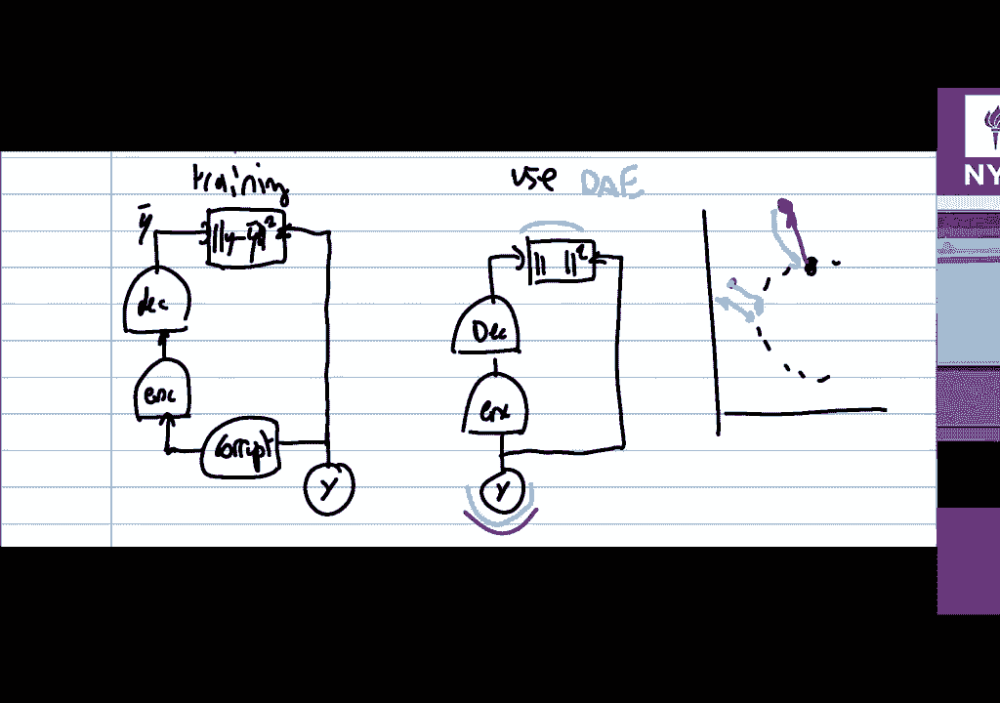