# P19：19.Week 10 – Practicum_ The Truck Backer-Upper - 大佬的迷弟的粉丝 - BV1o5411p7AB

你去过纽约龙虾烤宽面条的isoldi不，我没去过，你去过纽约龙虾烤宽面条的isoldi不，我没去过，意大利我通常去两个地方，一个叫诺玛，它在33号和3号，意大利我通常去两个地方，一个叫诺玛。

它在33号和3号，我爱的只是西西里人的地道，我爱的只是西西里人的地道，它是另一个绝对是，它是另一个绝对是，世界上最好的披萨，世界上最好的披萨，靠近纽约大学，披萨就像那不勒斯一样，就像您找不到。

靠近纽约大学，披萨就像那不勒斯一样，就像您找不到，这个星球上有什么更好的东西，所以你知道你应该去下面的首尔，如果，这个星球上有什么更好的东西，所以你知道你应该去下面的首尔，如果，你提到我的名字。

你就可以享受折扣，是的，我有特殊的能力，你提到我的名字，你就可以享受折扣，是的，我有特殊的能力，是的，芝加哥披萨不是披萨，所以如果您称呼它，是的，芝加哥披萨不是披萨，所以如果您称呼它，芝加哥派很棒。

这不是比萨饼那不勒斯比萨饼是唯一的比萨饼，芝加哥派很棒，这不是比萨饼那不勒斯比萨饼是唯一的比萨饼。

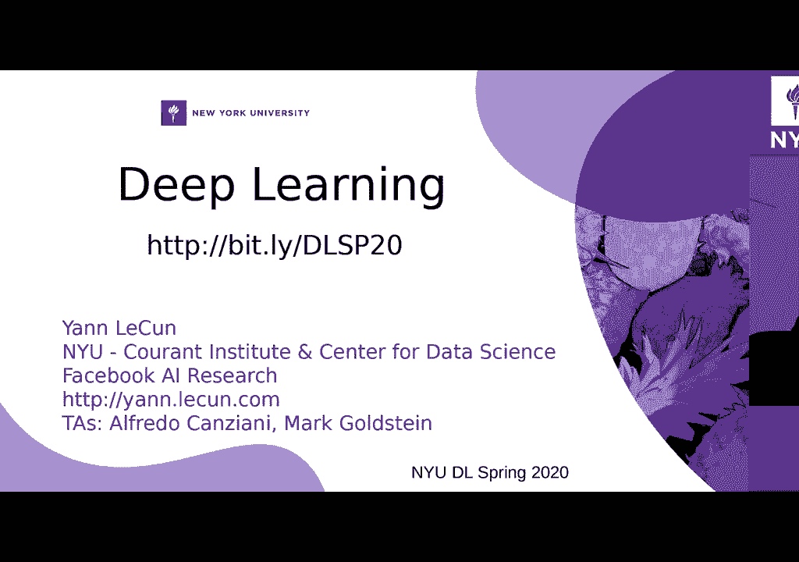

好吧，所以我们今天谈论什么今天我们谈论一些事情，好吧，所以我们今天谈论什么今天我们谈论一些事情，叫田径乞r说唱歌手，我们今天在本讲座中要做什么。

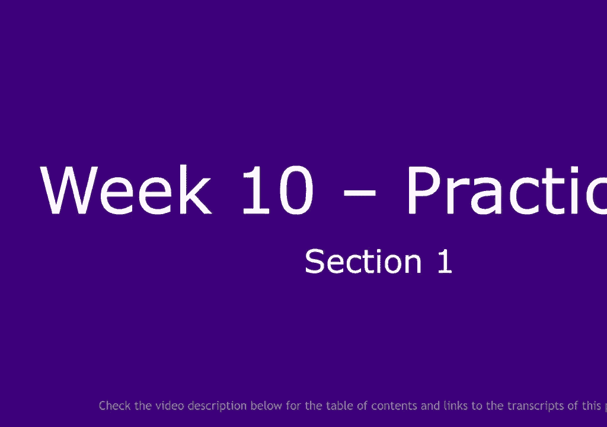

叫田径乞r说唱歌手，我们今天在本讲座中要做什么，这是您将帮助我基本上与您一起阅读的第一堂课，这是您将帮助我基本上与您一起阅读的第一堂课，再次写在论文中，这样我们就可以弄清楚事情是否有意义。

再次写在论文中，这样我们就可以弄清楚事情是否有意义，这就是我们如何在您没有的研究领域中自我教育，这就是我们如何在您没有的研究领域中自我教育，一定一直都在你身边，所以你不得不看报纸，而你。

一定一直都在你身边，所以你不得不看报纸，而你，必须弄清楚那里写的东西，通常我会再次抄写，必须弄清楚那里写的东西，通常我会再次抄写，返回类型或斧头只是为了解决我脑海中的主要话题。

返回类型或斧头只是为了解决我脑海中的主要话题，承诺正确的时间，以便我可以检查，承诺正确的时间，以便我可以检查，我可以稍后查看发生了什么，所以让我们开始吧，这是什么设置，我可以稍后查看发生了什么。

所以让我们开始吧，这是什么设置，我们在这里试图做什么，所以我们试图通过自我学习来设计，我们在这里试图做什么，所以我们试图通过自我学习来设计，非线性控制器来控制拖车的转向，非线性控制器来控制拖车的转向。

从任意初始位置备份到装卸码头，从任意初始位置备份到装卸码头，允许，那么这意味着我们要做什么，允许，那么这意味着我们要做什么，学习如何驾驶卡车，如果没有的话，这可能并不复杂，学习如何驾驶卡车。

如果没有的话，这可能并不复杂，您向前走，但我们正在尝试停放一条路，所以它只能向后走，您向前走，但我们正在尝试停放一条路，所以它只能向后走，向后，所以您知道如果您尝试将车辆停在并行停车场中，向后。

所以您知道如果您尝试将车辆停在并行停车场中，有时可能有点复杂，但并非总是可以做到，有时可能有点复杂，但并非总是可以做到，一个动作，如果您的背上装有拖车，那是一团糟，一个动作，如果您的背上装有拖车。

那是一团糟，我们很快就会解决这个问题，您怎么知道拖车，我们很快就会解决这个问题，您怎么知道拖车，我们有两个项目，我们有一个出租车，它是右上角的伙伴，所以我们，我们有两个项目，我们有一个出租车。

它是右上角的伙伴，所以我们，驾驶室的驾驶室相对于x轴有一个角度，驾驶室的驾驶室相对于x轴有一个角度，驾驶室和拖车之间的连接处的坐标x和y，驾驶室和拖车之间的连接处的坐标x和y，好吧，那么在下面的部分中。

我们有预告片，因此我们喜欢，好吧，那么在下面的部分中，我们有预告片，因此我们喜欢，拖车轨道背面的X＆Y位置，然后有theta拖车，拖车轨道背面的X＆Y位置，然后有theta拖车。

告诉我们这辆拖车相对于卡车的角度是多少，告诉我们这辆拖车相对于卡车的角度是多少，x轴，我们的目标是将这个家伙向后推动，直到，x轴，我们的目标是将这个家伙向后推动，直到。

拖车基本上击中了用X表示的码头位置，拖车基本上击中了用X表示的码头位置，码头和Y狗协调，此外，我们希望有theta预告片，码头和Y狗协调，此外，我们希望有theta预告片，拖车的角度是0。

这样拖车基本上是，拖车的角度是0，这样拖车基本上是，垂直于扩展坞，基本上是后部或后部，垂直于扩展坞，基本上是后部或后部，但是前面，我们是前面的一部分，我们后面是对的，但是前面，我们是前面的一部分。

我们后面是对的，我说的是英语，我想这是正确的，所以我们是，我说的是英语，我想这是正确的，所以我们是，拖车的轨道应与扩展坞平行，并与，拖车的轨道应与扩展坞平行，并与，可能到目前为止码头的位置对吧，是的。

好的，可能到目前为止码头的位置对吧，是的，好的，因此，让我们为他们阅读一些本文，以便我们了解一些，因此，让我们为他们阅读一些本文，以便我们了解一些，状态变量有六个，这不完全是我想这可能不是。

状态变量有六个，这不完全是我想这可能不是，更正我们将很快解决的问题，因此状态变量为theta cab，更正我们将很快解决的问题，因此状态变量为theta cab，这是轨道的角度。

然后是X cab和y car，这是笛卡尔，这是轨道的角度，然后是X cab和y car，这是笛卡尔，叉架的位置，它是驾驶室后面的部分，然后您有x + y，叉架的位置，它是驾驶室后面的部分。

然后您有x + y，拖车，这是拖车的后部位置D Plus拖车，拖车，这是拖车的后部位置D Plus拖车，这是拖车的角度还可以，所以基本上它的前进方向是，这是拖车的角度还可以，所以基本上它的前进方向是。

遵循整个过程如下，遵循整个过程如下，跟踪备份，直到它撞到码头，然后停下来，跟踪备份，直到它撞到码头，然后停下来，目标是使拖车后退，使其与装载锁定装置平行，目标是使拖车后退，使其与装载锁定装置平行。

正确停靠，所以目标是让拖车的背面，正确停靠，所以目标是让拖车的背面，与扩展坞平行，然后将x-rail ER和白色，与扩展坞平行，然后将x-rail ER和白色，拖车的位置拖车背面的位置应尽可能靠近X。

拖车的位置拖车背面的位置应尽可能靠近X，停靠，为什么狗还可以和我在一起？停靠，为什么狗还可以和我在一起？所以初始位置将被随机设置，然后我们必须备份，所以初始位置将被随机设置，然后我们必须备份。

直到我们看到要备份的目标，直到我们撞到拖车和码头，直到我们看到要备份的目标，直到我们撞到拖车和码头，与拖车的背面，我们就像正交好吧，有一个，与拖车的背面，我们就像正交好吧，有一个，几个困难。

我们现在要弄清楚什么是，几个困难，我们现在要弄清楚什么是，这些好了，所以我们去CD工作密钥表PTL，现在去Conda激活PDL。

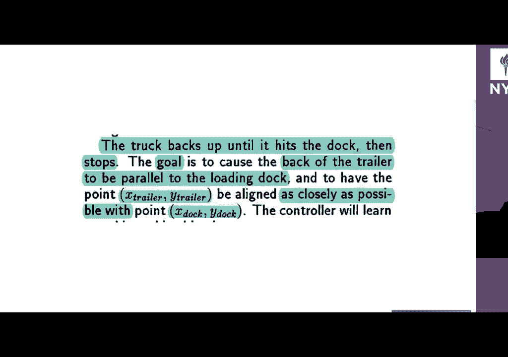

这些好了，所以我们去CD工作密钥表PTL，现在去Conda激活PDL，现在在这里，我们有一个木星不工作，所以在这种情况下，我们将，现在在这里，我们有一个木星不工作，所以在这种情况下，我们将。

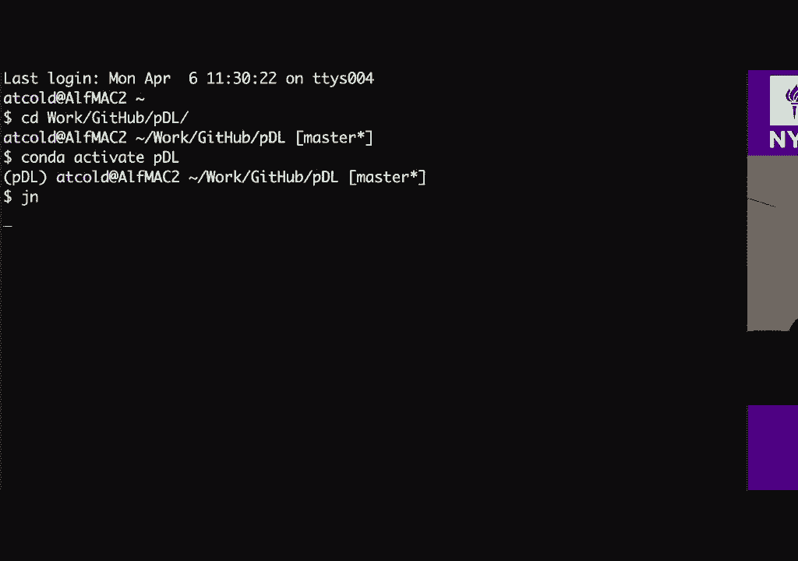

遍历这些履带式说唱歌手，所以我真的很喜欢在，遍历这些履带式说唱歌手，所以我真的很喜欢在，使用Jupiter笔记本的人实际上是您知道Unicode的人，因为我们正在使用。

使用Jupiter笔记本的人实际上是您知道Unicode的人，因为我们正在使用，Python 3我们可以正确使用unicode以便在那里写PI。

Python 3我们可以正确使用unicode以便在那里写PI，我刚刚告诉反斜杠Pi，然后按Tab键，您会满意，或者，我刚刚告诉反斜杠Pi，然后按Tab键，您会满意，或者。

可以做Alpha Beat好吧，这不是编码，这不是好书，所以您可以，可以做Alpha Beat好吧，这不是编码，这不是好书，所以您可以，做这样的丑事好，所以我只是初始化一些库，做这样的丑事好。

所以我只是初始化一些库。

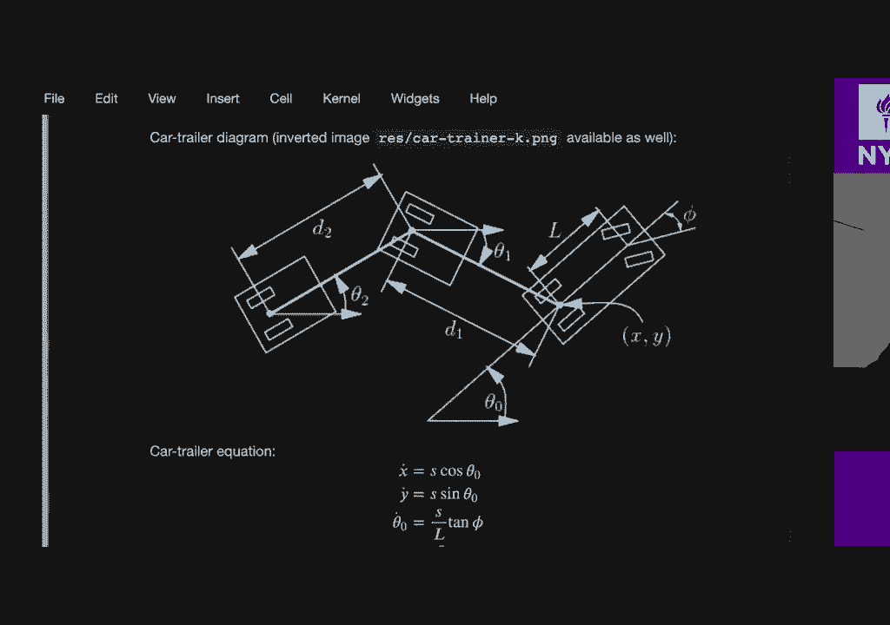

我们的设置我在这里初始化一些对象，我们现在不在乎，我们从。

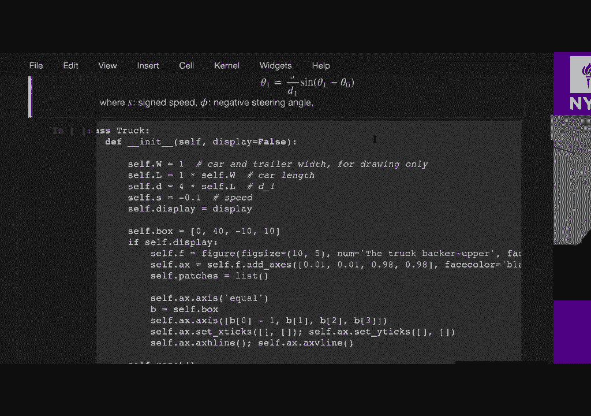

我们的设置我在这里初始化一些对象，我们现在不在乎，我们从，可以看到这个家伙，我想我可以放大一点，可以看到这个家伙，我想我可以放大一点，因为您看不到酷，所以现在我们开始我们想要的交互式部分。

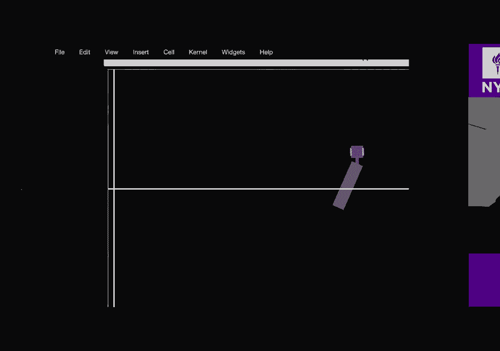

因为您看不到酷，所以现在我们开始我们想要的交互式部分，画这个家伙，所以让我走吧，比如说方向盘的角度为零，画这个家伙，所以让我走吧，比如说方向盘的角度为零，而且我一直保持让您知道执行此操作的正确性。

所以这个家伙一直，而且我一直保持让您知道执行此操作的正确性，所以这个家伙一直，然后下一步之后发生的事情是我的电脑，然后下一步之后发生的事情是我的电脑，现在会被抱怨，然后你走了，所以你走的路是。

现在会被抱怨，然后你走了，所以你走的路是，刻痕是什么意思，这意味着轨道已经被刻痕了。刻痕是什么意思，这意味着轨道已经被刻痕了。跟踪，因为您吸引了自己，这很有趣，但是您可以，跟踪，因为您吸引了自己。

这很有趣，但是您可以，好好用这些卡车在自己里面开车，让我用，好好用这些卡车在自己里面开车，让我用，有点像样的事情，也许好吧，只是有人让志愿者做些什么，有点像样的事情，也许好吧，只是有人让志愿者做些什么。

现在将成为您希望我引导您可以给我的方向盘的角度，现在将成为您希望我引导您可以给我的方向盘的角度，从0到45度的任何东西，我认为都为负10，所以我去为负10，这将会，从0到45度的任何东西。

我认为都为负10，所以我去为负10，这将会，向右转10度，然后我走1 2 3 4 5 6 7 8 9 10步确定，向右转10度，然后我走1 2 3 4 5 6 7 8 9 10步确定，是的。

如果我继续前进，您很快就会被劫持的，所以我应该怎么办，是的，如果我继续前进，您很快就会被劫持的，所以我应该怎么办，现在就去做别人吧，或者也许你还是上课15好吧，让我们尝试加15，现在就去做别人吧。

或者也许你还是上课15好吧，让我们尝试加15，我们继续进行两三四五五六七八八九十嗯嗯，接下来的节目是什么，我们继续进行两三四五五六七八八九十嗯嗯，接下来的节目是什么。

你继续前进是的1 2 3 4 5 6 7 8 9 10我们将成为，你继续前进是的1 2 3 4 5 6 7 8 9 10我们将成为，离开屏幕可能是交替的正负，如果，离开屏幕可能是交替的正负，如果。

我一直这样走，你可以看到这条路要走到外面，我一直这样走，你可以看到这条路要走到外面，我们将成为您基本上要结束比赛，所以您没有开车的机会，我们将成为您基本上要结束比赛，所以您没有开车的机会，许可。

所以减去15好的，您是否同意我应该与减去一起使用，许可，所以减去15好的，您是否同意我应该与减去一起使用，15我减负15 1 2 3 4 5 6 7 8 9 10好的，现在我们不能开车前行。

15我减负15 1 2 3 4 5 6 7 8 9 10好的，现在我们不能开车前行，加45我们搞砸了不，不，我不认为你搞砸了，我认为还是不错的，加45我们搞砸了不，不，我不认为你搞砸了。

我认为还是不错的，零，有人说零，让我们尝试零，还不，你想要什么，零，有人说零，让我们尝试零，还不，你想要什么，我去加45好的再加45我可以继续前进，但是那我们就可以了。

我去加45好的再加45我可以继续前进，但是那我们就可以了，是的，再减去44，好吧，我们走吧-45两次，然后再两倍，我是，是的，再减去44，好吧，我们走吧-45两次，然后再两倍，我是，要走了，哦，等等。

没有六个，对不起，好10 1 2 3 4 5 6好，要走了，哦，等等，没有六个，对不起，好10 1 2 3 4 5 6好，因此，如果我继续这样下去，我们将离开屏幕，所以我，因此，如果我继续这样下去。

我们将离开屏幕，所以我，以为您看对了图片，是否两倍以上，不是，它是旧的，以为您看对了图片，是否两倍以上，不是，它是旧的，消息，好的意思是，这个东西有点棘手，消息，好的意思是，这个东西有点棘手。

你可以得到我，你可以得到它的手，也许它会像，你可以得到我，你可以得到它的手，也许它会像，最终的解决方案将是像我们继续前进一样，最终的解决方案将是像我们继续前进一样，然后再往另一个方向旋转加号。

然后再往另一个方向旋转加号，10，然后在这里会互相残杀，所以也许还有25或者，10，然后在这里会互相残杀，所以也许还有25或者，让我们来看看，B加20 C，这样我们就可以掉头了。

现在我们基本上应该撤消此操作，B加20 C，这样我们就可以掉头了，现在我们基本上应该撤消此操作，所以，如果我像我想的那样加40，就可以，所以，如果我像我想的那样加40，就可以。

然后我们基本上可以直接偷东西20也许还可以，然后我们可以，然后我们基本上可以直接偷东西20也许还可以，然后我们可以，去零，看到我一直在教这个，所以你知道我实际上可以开车，去零，看到我一直在教这个。

所以你知道我实际上可以开车，这个东西好吧，所以你去那里，是的，我可以在那儿物理化学去看看哦，我的，这个东西好吧，所以你去那里，是的，我可以在那儿物理化学去看看哦，我的，天哪，我实际上正在设法做到这一点。

我们不得不修复一点香港的问题，天哪，我实际上正在设法做到这一点，我们不得不修复一点香港的问题，鸣喇叭我实际上在那里有我的喇叭，所以我们不得不实际上哦，他妈的，鸣喇叭我实际上在那里有我的喇叭。

所以我们不得不实际上哦，他妈的，他妈的，他妈的，他妈的，哦，不，不，对不起，好吧，所以这实际上认为是成功的好吧，现在我的电脑是，好吧，所以这实际上认为是成功的好吧，现在我的电脑是，抱怨，因为有一些滞后。

我应该先转一下，抱怨，因为有一些滞后，我应该先转一下，无论如何，关键是它没有做好，无论如何，关键是它没有做好，关键是要弄清楚它并不是很简单，关键是要弄清楚它并不是很简单，找出驱动这个家伙的方法。

因为它是高度非线性的，所以我们不得不，找出驱动这个家伙的方法，因为它是高度非线性的，所以我们不得不，找出如何实现高非线性系统的方法，找出如何实现高非线性系统的方法，运动学模型，基本上。

如果我们有运动学模型，您会知道，运动学模型，基本上，如果我们有运动学模型，您会知道，如果反转运动学模型，车辆在执行操作后将表现正确，如果反转运动学模型，车辆在执行操作后将表现正确。

你弄清楚你想采取什么行动才能知道驾驶，你弄清楚你想采取什么行动才能知道驾驶，到最终目的地，但由于我们不知道如何分析，到最终目的地，但由于我们不知道如何分析，也许我们不知道，我们可以在您的网上训练睡衣。

然后，也许我们不知道，我们可以在您的网上训练睡衣，然后，我们可以简单地弄清楚我们是否可以做一些您知道的我们可以学习如何，我们可以简单地弄清楚我们是否可以做一些您知道的我们可以学习如何。

我们是否可以学习如何知道向后开车好吗，您兴奋吗？我们是否可以学习如何知道向后开车好吗，您兴奋吗？你很有趣，知道我们该怎么做，你很有趣，知道我们该怎么做，是的，好吧，让我想一想，总体而言，它们基本上都是。

是的，好吧，让我想一想，总体而言，它们基本上都是，目标是给定这张地图的初始位置，目标是给定这张地图的初始位置，我想知道一个初始位置是什么动作序列，我想知道一个初始位置是什么动作序列。

基本上应该是我应该应用的车轮转向角的顺序，基本上应该是我应该应用的车轮转向角的顺序，这个六维空间对，所以不仅仅是D，因为D，这个六维空间对，所以不仅仅是D，因为D，屏幕将是2D屏幕，但是您有六个值。

屏幕将是2D屏幕，但是您有六个值，拖车的XY的两个角都有XY，所以你有六个，拖车的XY的两个角都有XY，所以你有六个，维空间，然后在这六个维空间中，您想害怕，维空间，然后在这六个维空间中，您想害怕。

喜欢您的，或者您想的是，您会得到一个告诉您此情况的网络，喜欢您的，或者您想的是，您会得到一个告诉您此情况的网络，轨道或拖车轨道的具体配置，轨道或拖车轨道的具体配置，输出此特定值是回归网络。

输出此特定值是回归网络，如何将输出的标量从负45变为，如何将输出的标量从负45变为，加45我认为是的-是的，我认为，所以我认为这是每个，加45我认为是的-是的，我认为，所以我认为这是每个，位置正确。

所以我们的目标是训练一个神经网络，位置正确，所以我们的目标是训练一个神经网络，在这个六维空间中指向一个标量，它将成为标量，在这个六维空间中指向一个标量，它将成为标量，那让我知道你知道一个标量序列。

所以一个，那让我知道你知道一个标量序列，所以一个，当时的标量，以便您想将这些轨道向后推到，当时的标量，以便您想将这些轨道向后推到，最终目的地，我是否有意义？最终目的地，我是否有意义？也许我很困惑。

是他还好吧，所以让我们弄清楚如何获得，也许我很困惑，是他还好吧，所以让我们弄清楚如何获得，所有这些东西都可以追溯到滑梯训练热潮，可以，所以，所有这些东西都可以追溯到滑梯训练热潮，可以，所以。

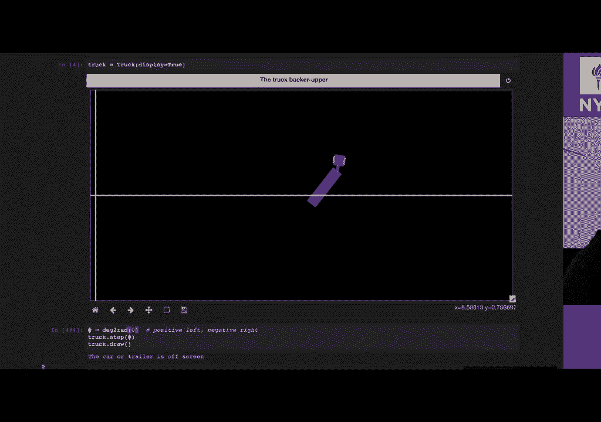

培训涉及两个阶段，第一个阶段是我们必须训练网络，培训涉及两个阶段，第一个阶段是我们必须训练网络，您要成为卡车和拖车运动学的仿真器，这就是，您要成为卡车和拖车运动学的仿真器，这就是，这些人做的正确的论文。

这不是唯一的选择，而是，这些人做的正确的论文，这不是唯一的选择，而是，我们接下来要做的是第二阶段的神经训练，我们接下来要做的是第二阶段的神经训练，网络控制器来控制模拟器，基本上，网络控制器来控制模拟器。

基本上，做我们现在正在做的任务，当我们知道要提出，做我们现在正在做的任务，当我们知道要提出，该转向角的值，以便我们可以到达目的地并且您，该转向角的值，以便我们可以到达目的地并且您。

知道成功之类的目的地是由两个因素决定的，知道成功之类的目的地是由两个因素决定的，到扩展坞的距离以及交易者的方向，所以这就是，到扩展坞的距离以及交易者的方向，所以这就是，总体示意图。

您可以使用神经网络作为控制器吗？总体示意图，您可以使用神经网络作为控制器吗？通过聊天遵循您的建议，为您提供此功能，通过聊天遵循您的建议，为您提供此功能，在时间k离散时间间隔k处的转向信号。

那么我们有一个，在时间k离散时间间隔k处的转向信号，那么我们有一个，拖车运动学的方程式让我知道，拖车运动学的方程式让我知道，告诉你轨道的下一个配置是什么，告诉你轨道的下一个配置是什么。

鉴于您在内部提供了前一个状态，因此可以给您下一个状态，鉴于您在内部提供了前一个状态，因此可以给您下一个状态，那么转向信号和这里的Delta就是，那么转向信号和这里的Delta就是，正确的时间延迟。

它告诉您这是下一个状态，这是，正确的时间延迟，它告诉您这是下一个状态，这是，以前的状态这些有点像，以前的状态这些有点像，电子设备，例如电气工程图，因此您将看到，电子设备，例如电气工程图，因此您将看到。

那就是你知道，过去没有计算机科学，那就是你知道，过去没有计算机科学，因此状态ok被馈送到提供转向信号ok的控制器，因此状态ok被馈送到提供转向信号ok的控制器，在这种情况下，负1到轨道加1之间。

因此他们使用10 H，在这种情况下，负1到轨道加1之间，因此他们使用10 H，在每个时间周期的时间索引K处的输出处，叉车都固定，在每个时间周期的时间索引K处的输出处，叉车都固定，是一个很小的距离。

所以这些是拖车轨道的方程式，是一个很小的距离，所以这些是拖车轨道的方程式，几条音轨，您已经确定了笔帽X＆Y的位置，然后，几条音轨，您已经确定了笔帽X＆Y的位置，然后，就像您知道距离，驾驶室长度以及。

就像您知道距离，驾驶室长度以及，的拖车之一，两个等等，你可以估计你知道什么，的拖车之一，两个等等，你可以估计你知道什么，由Phi输入的角度的变化就是这个负角度，由Phi输入的角度的变化就是这个负角度。

对，因为它在右侧，所以我们有s是正弦速度，对，因为它在右侧，所以我们有s是正弦速度，所以你可以前进和后退，然后Phi是这个负转向角，所以你可以前进和后退，然后Phi是这个负转向角，正大正角在右侧。

所以就像，正大正角在右侧，所以就像，交换扫描，然后x和y是驾驶室后面的位置，交换扫描，然后x和y是驾驶室后面的位置，现在注意，基本上您在拖车的x和y位置是，现在注意，基本上您在拖车的x和y位置是。

实际上由驾驶室的x和y位置以及距离d1确定，实际上由驾驶室的x和y位置以及距离d1确定，和theta没关系，所以在我出售之前，我告诉你我们有，和theta没关系，所以在我出售之前，我告诉你我们有。

状态的六个值，但是从现在起您可以知道，我们只需要四个值，状态的六个值，但是从现在起您可以知道，我们只需要四个值，正确，你有x和y现在你有theta 0，那你知道吗，正确。

你有x和y现在你有theta 0，那你知道吗，驾驶室的角度，然后是θ1，即拖车的第一个角度，驾驶室的角度，然后是θ1，即拖车的第一个角度，所以这些X＆Y只有四个独立的值，所以这些X＆Y只有四个独立的值。

给定这些其他值，拖车的高度完全确定，给定这些其他值，拖车的高度完全确定，问题不是这些速度，所以这些是方程式，所以这是，问题不是这些速度，所以这些是方程式，所以这是，位置如何正确改变，所以这些都是速度。

但是无论何时，位置如何正确改变，所以这些都是速度，但是无论何时，具有状态，在这种情况下，状态为XY theta 0 theta 1，然后每当，具有状态，在这种情况下。

状态为XY theta 0 theta 1，然后每当，你想写运动方程，你想写运动方程，你会写道，你知道时间的变化，所以，你会写道，你知道时间的变化，所以，X速度超过Y的速度以及该家伙和。

X速度超过Y的速度以及该家伙和，这些问题将表示另一个人的角速度，这些问题将表示另一个人的角速度，连续的时间，因为我们使用的是，连续的时间，因为我们使用的是，计算机，但这是的。

我们将如何表达您对动态模型的了解，计算机，但这是的，我们将如何表达您对动态模型的了解。

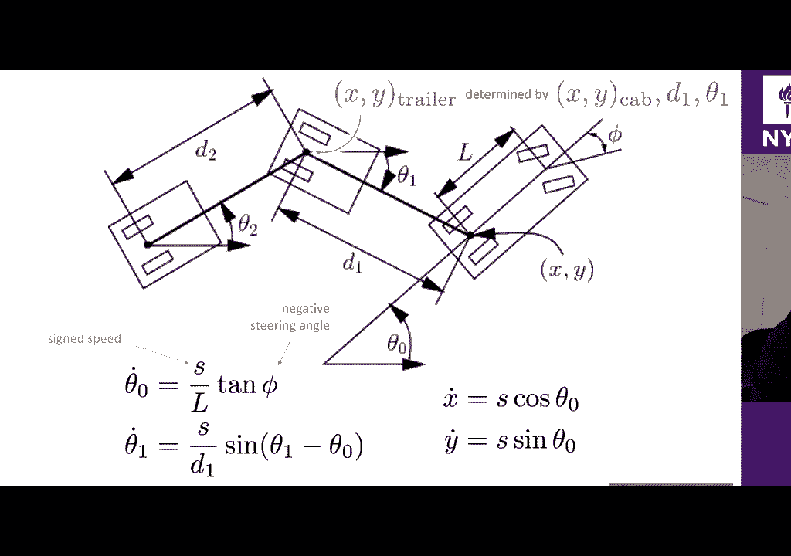

就像一个随时间变化的模型，所以我们有了方程式，就像一个随时间变化的模型，所以我们有了方程式，现在弄清楚我们如何训练这些网络，这就是我们如何训练。

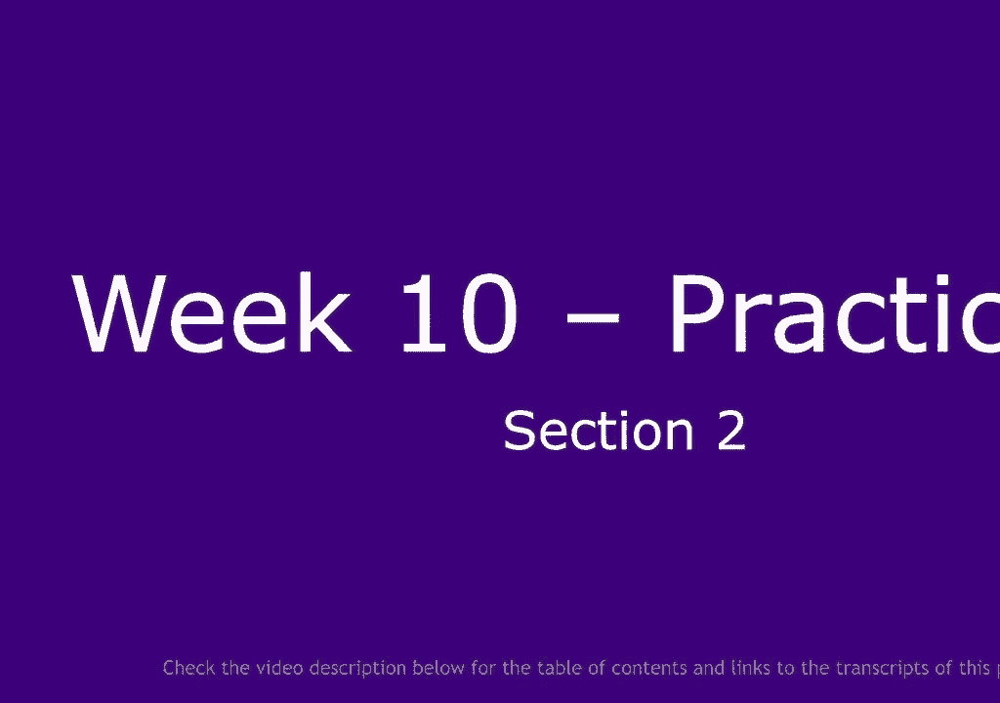

现在弄清楚我们如何训练这些网络，这就是我们如何训练，网络，用于模拟左侧的履带式拖车运动学，网络，用于模拟左侧的履带式拖车运动学，手边，我们提供了一个将要像的随机输入，手边。

我们提供了一个将要像的随机输入，转向角的随机初始值，然后我们提供，转向角的随机初始值，然后我们提供，轨道动力学的随机转向角会告诉我，轨道动力学的随机转向角会告诉我，前一个状态是什么，下一个状态将是什么。

然后在，前一个状态是什么，下一个状态将是什么，然后在，底部我将拥有我的第一个网络，该网络将被训练为，底部我将拥有我的第一个网络，该网络将被训练为，回归回归器，它将试图使差异最小化，回归回归器。

它将试图使差异最小化，在您知道实际的下一个状态和预测的状态之间，在您知道实际的下一个状态和预测的状态之间，预测和实际使用的地面实况之间的差异，预测和实际使用的地面实况之间的差异。

为了和他们称这些适应为术语，他们正在使用的文章是适应，为了和他们称这些适应为术语，他们正在使用的文章是适应，该网络的权重基本上就是您知道的训练网络，因此，该网络的权重基本上就是您知道的训练网络，因此。

您如何更新网络的权重网络的权重，您如何更新网络的权重网络的权重，通过使用此错误进行更新，因此现在的问题是，通过使用此错误进行更新，因此现在的问题是，会为您服务什么样的损失函数。

会为您服务什么样的损失函数，使用这里，因为用于更新这些权重的信号实际上是，使用这里，因为用于更新这些权重的信号实际上是，目标与实际预测之间的差异，目标与实际预测之间的差异，您现在应该可以告诉我。

实际上是在中期，您现在应该可以告诉我，实际上是在中期，问题之一，MSE之所以称为MSE，是因为如果您计算MSE的导数，则会得到，MSE之所以称为MSE，是因为如果您计算MSE的导数，则会得到。

目标和您的井之间的差异，您将获得差异，目标和您的井之间的差异，您将获得差异，在您的预测和目标权利之间，因此该div，在您的预测和目标权利之间，因此该div，此处正确交换的差异实际上是在此处用于更改。

此处正确交换的差异实际上是在此处用于更改，在我们的课程中，我们会正确执行梯度下降，因此您得到了，在我们的课程中，我们会正确执行梯度下降，因此您得到了，正面Delta您所预测的正面-地面真相和您。

正面Delta您所预测的正面-地面真相和您，用那个来计算偏导数，然后减去，用那个来计算偏导数，然后减去，编写参数，以便您在相反的方向上走动，编写参数，以便您在相反的方向上走动。

实际上在此预测中使用反正弦符号-地面，实际上在此预测中使用反正弦符号-地面，事实是你知道因素，你知道适应，你知道改变，事实是你知道因素，你知道适应，你知道改变，这些参数，但基本上是同一件事。

这是一个问题，为什么我们，这些参数，但基本上是同一件事，这是一个问题，为什么我们，如果您已经有轨道运动的模型，请培训模拟器，如果您已经有轨道运动的模型，请培训模拟器，同样，这是一个很好的问题。

因为在这种情况下，我们有一个问题，同样，这是一个很好的问题，因为在这种情况下，我们有一个问题，因此我们实际上可以通过这些得到偏导数，因此我们实际上可以通过这些得到偏导数，问题，但您可能没有正确的方程式。

假设您有一个，问题，但您可能没有正确的方程式，假设您有一个，更复杂的系统，您可能会观察到一些专家驾驶，更复杂的系统，您可能会观察到一些专家驾驶，您知道复杂的系统，然后您实际上通过以下顺序。

您知道复杂的系统，然后您实际上通过以下顺序，基本上是轨迹，在这个位置序列上，基本上是轨迹，在这个位置序列上，状态变量，您可以学习能够模仿什么的网络，状态变量，您可以学习能够模仿什么的网络。

这些动力学是这个系统的运动学不好，这些动力学是这个系统的运动学不好，那是约瑟夫好酷的答案，所以现在让我们看看，那是约瑟夫好酷的答案，所以现在让我们看看，继续前进哦，也许我们应该检查他们。

让我实际上切换到，继续前进哦，也许我们应该检查他们，让我实际上切换到。

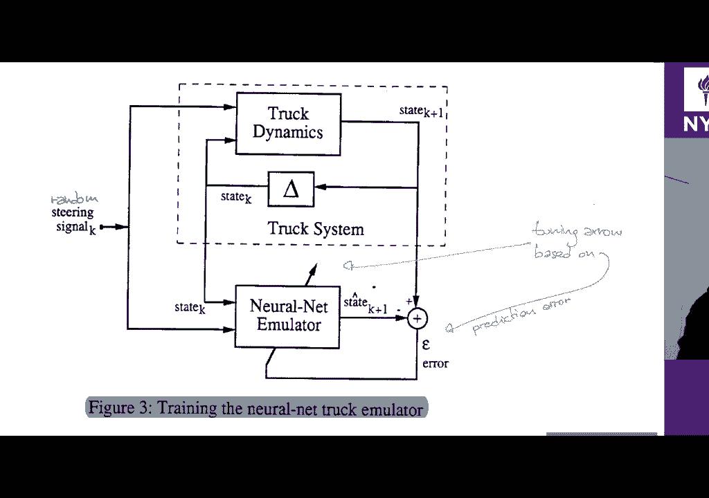

2d这个家伙就在这里，所以让我们实际开始训练这个东西吧，我们，2d这个家伙就在这里，所以让我们实际开始训练这个东西吧，我们，像往右走一样，然后我们将在，像往右走一样，然后我们将在，开始。

所以这里发生的事情将是你，开始，所以这里发生的事情将是你。

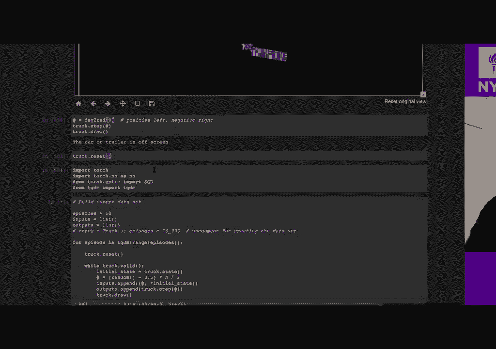

知道我们提供一些随机的初始转向角，然后您知道我们使用，知道我们提供一些随机的初始转向角，然后您知道我们使用，运动学模型，以了解先前状态之间的联系，运动学模型，以了解先前状态之间的联系，下一个状态。

只要轨道走到外面，我们就杀死它，下一个状态，只要轨道走到外面，我们就杀死它，直到我们有足够的分数以便我们可以，直到我们有足够的分数以便我们可以，训练这些网络以再次模拟拖车运动学的轨迹。

训练这些网络以再次模拟拖车运动学的轨迹，在这种情况下就没有必要了，因为我可以得到方程式，但是，在这种情况下就没有必要了，因为我可以得到方程式，但是，假设我们没有方程式，但是我们只知道观测值。

假设我们没有方程式，但是我们只知道观测值，从真实的现实世界中，那么您实际上必须知道自己，从真实的现实世界中，那么您实际上必须知道自己，必须学习那些功能，以便我们可以区别于正确的事物，必须学习那些功能。

以便我们可以区别于正确的事物，可以正常运行渐变，所以如果我们继续这样操作，我的计算机将崩溃，可以正常运行渐变，所以如果我们继续这样操作，我的计算机将崩溃。

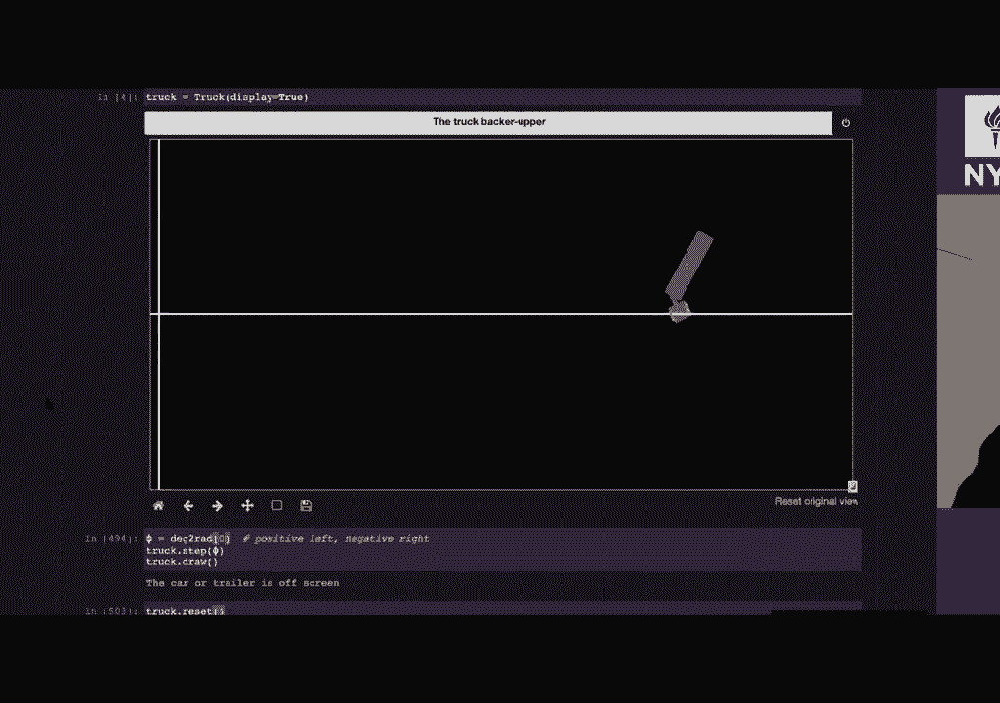

所以现在你可以看到这是永远的，为什么是永远的，所以现在你可以看到这是永远的，为什么是永远的。

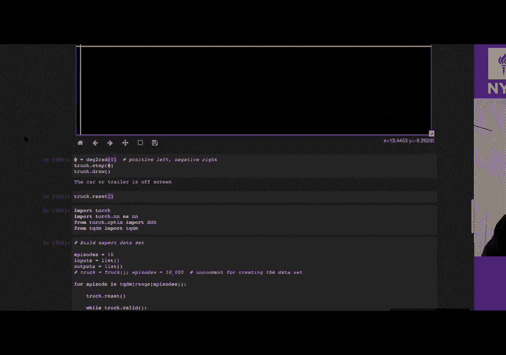

因为有这种可视化功能，所以在这种情况下，我关闭了，因为有这种可视化功能，所以在这种情况下，我关闭了，可视化，这样它就不会在那里画东西，然后我现在可以运行，可视化，这样它就不会在那里画东西。

然后我现在可以运行。

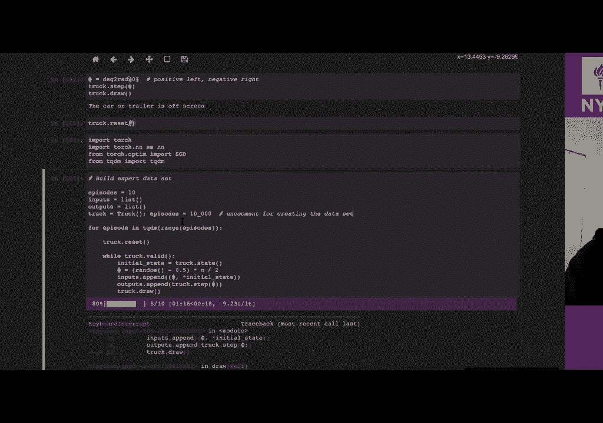

一万次吧，好吧，这是因为我打断了，一万次吧，好吧，这是因为我打断了，没事，没关系，多么可爱，没事，没关系，多么可爱，好的繁荣，这是非常正确的，因为它没有图形，好的繁荣，这是非常正确的，因为它没有图形。

对不起，渲染好了，您正在模拟哪些播放器，所以模拟器，对不起，渲染好了，您正在模拟哪些播放器，所以模拟器。

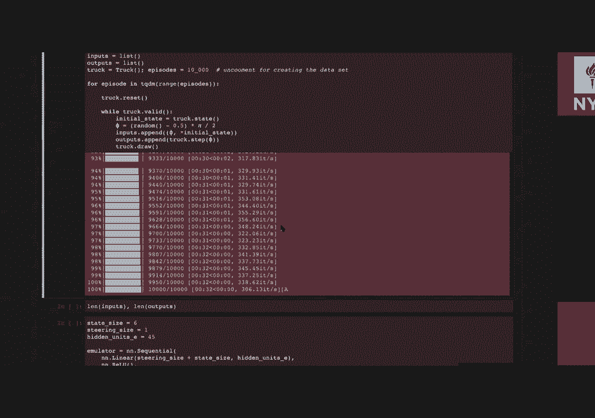

让我告诉你这里的模拟器将试图了解什么是，让我告诉你这里的模拟器将试图了解什么是，给定下一个状态，给定上一个状态，我提供特定的随机，给定下一个状态，给定上一个状态，我提供特定的随机，转向信号在这里。

所以给定状态并给定转向角，我尝试，转向信号在这里，所以给定状态并给定转向角，我尝试，学习下一个状态是什么，这来自于地面真理，学习下一个状态是什么，这来自于地面真理，这个盒子在这里好吧。

这不是经常性的网络，这只是正常现象，这个盒子在这里好吧，这不是经常性的网络，这只是正常现象，净你知道一个输入是状态加动作，然后输出是，净你知道一个输入是状态加动作，然后输出是，只需采取行动。

现在就不会复发了，只需采取行动，现在就不会复发了，每一步的转向信号总是随机的，每一步的转向信号总是随机的，状态我输入随机转向角时收集了整个轨迹，状态我输入随机转向角时收集了整个轨迹，好吧。

一个很长的问题要做的是，这件事太长了吗，好吧，一个很长的问题要做的是，这件事太长了吗，您收集的数据与，您收集的数据与，人工测试时间动作您正在收集的数据会迅速改变方向。

人工测试时间动作您正在收集的数据会迅速改变方向，经常，所以没有没有没有时间我的训练，经常，所以没有没有没有时间我的训练，我们还没有谈论培训，但是我在这里，这将是一个公正，我们还没有谈论培训。

但是我在这里，这将是一个公正，给定输入状态的正常神经网络将其映射到，给定输入状态的正常神经网络将其映射到，给定车轮特定角度的输出状态，没有时间了，所以您，给定车轮特定角度的输出状态，没有时间了，所以您。

有一个状态，你有一个角度，就是输出，现在没有时间好了，有一个状态，你有一个角度，就是输出，现在没有时间好了。

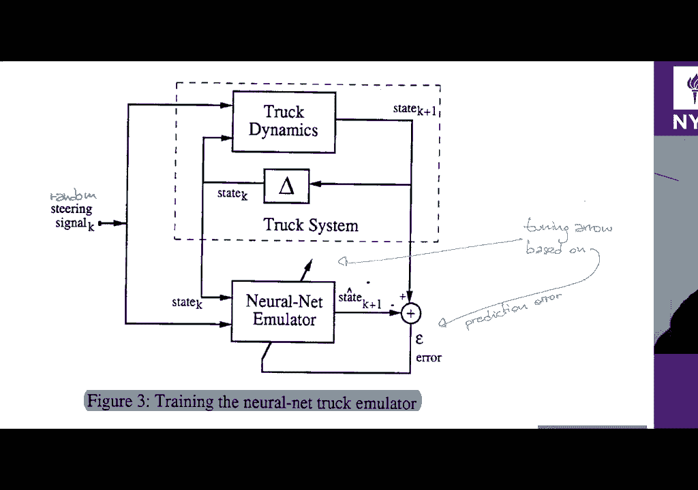

好吧，我们去这里，这些是我的输入和我收集的输出，好吧，我们去这里，这些是我的输入和我收集的输出，在这些轨迹上，所以如果您在这里查看，我只有首字母缩写，在这些轨迹上，所以如果您在这里查看。

我只有首字母缩写。

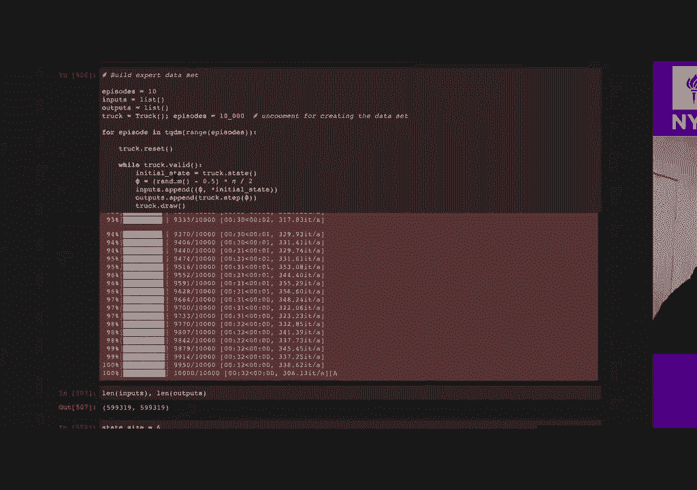

初始状态，我从赛道上获得状态，然后有一个Phi，这是我的你，初始状态，我从赛道上获得状态，然后有一个Phi，这是我的你，知道角度将是随机减去0。5之间的某个值，知道角度将是随机减去0。5之间的某个值。

负5从45到负45到加45然后我有输入内容，负5从45到负45到加45然后我有输入内容，你知道状态加上角度，然后输出将是，你知道状态加上角度，然后输出将是，跟踪器轨迹的输出。

该跟踪器的步距为所有角度Phi，跟踪器轨迹的输出，该跟踪器的步距为所有角度Phi。

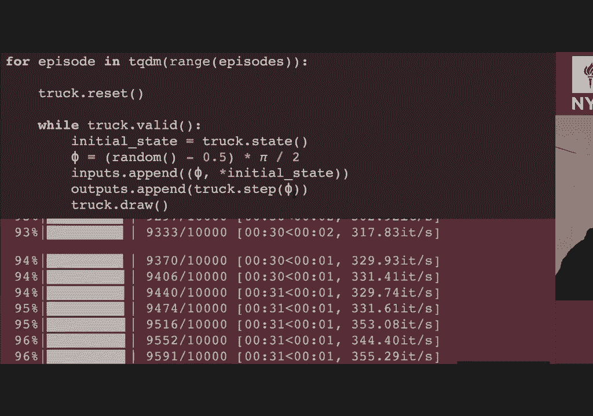

对，所以我们在这里有这个东西，我可以拆分，可以创建我的网络，然后我，对，所以我们在这里有这个东西，我可以拆分，可以创建我的网络，然后我。

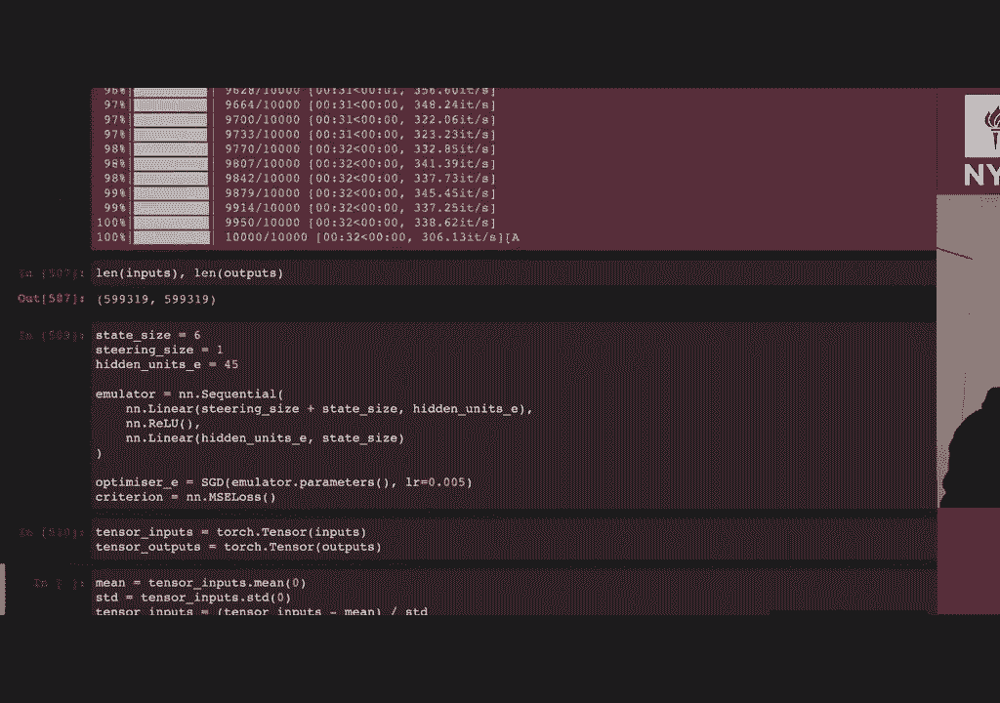

可以开始，训练我的网络和区域将一直持续到永远，但是基本上。

训练我的网络和区域将一直持续到永远，但是基本上，在这里，我们正在尝试获得一个神经网络，这里仅是几层。

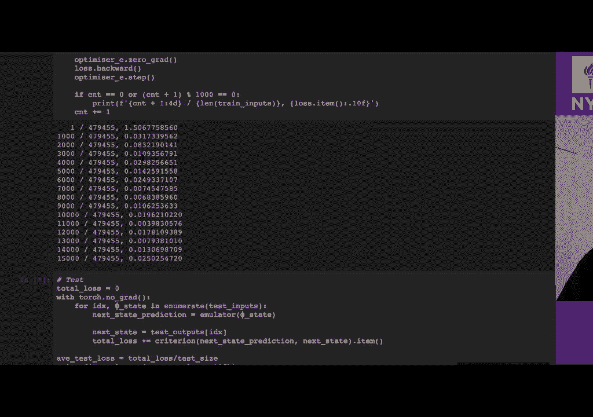

在这里，我们正在尝试获得一个神经网络，这里仅是几层，对，所以线性真的线性，我们从转向Engle状态Terry开始，对，所以线性真的线性，我们从转向Engle状态Terry开始。

转向的转向尺寸为1加上状态尺寸为，转向的转向尺寸为1加上状态尺寸为，像x和y以及角度都为6一样，所以x和y以及角度都为，像x和y以及角度都为6一样，所以x和y以及角度都为，包括驾驶室和拖车。

那么您都有许多隐藏的单元，包括驾驶室和拖车，那么您都有许多隐藏的单元，现在将在论文中进行描述，然后将其设置为非常低，然后您将，现在将在论文中进行描述，然后将其设置为非常低，然后您将，最终内部输出。

MSC和您都知道STD，让我们回到计算机演示中。

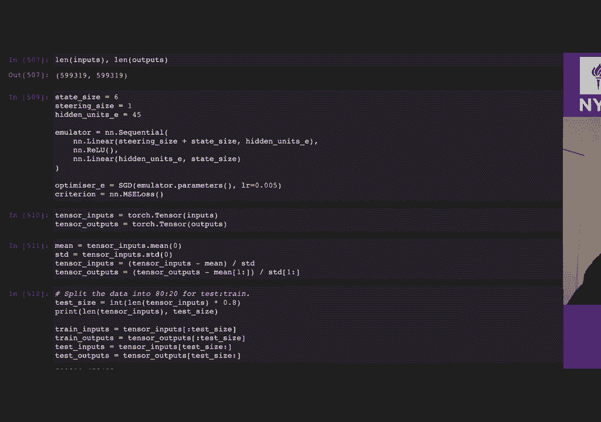

MSC和您都知道STD，让我们回到计算机演示中，图3是这个图，显示了火车如何训练模拟器，因此，图3是这个图，显示了火车如何训练模拟器，因此，跟踪轨道随机地乞求，模拟器学习生成下一个，跟踪轨道随机地乞求。

模拟器学习生成下一个，给定当前状态向量和转向信号的位置状态向量，给定当前状态向量和转向信号的位置状态向量，您现在可以听到我的计算机风扇旋转，因为它正在训练中，对不起，您现在可以听到我的计算机风扇旋转。

因为它正在训练中，对不起，对于音频质量不好的问题，所以这就是我们训练该系统的方式，对于音频质量不好的问题，所以这就是我们训练该系统的方式，控制器，所以这是状态转换流程图，请参见，控制器。

所以这是状态转换流程图，请参见，控制器Sue的另一个神经网络，而T代表卡车，控制器Sue的另一个神经网络，而T代表卡车，拖车模拟器，因此所有卡车运动学或拖车模拟器，拖车模拟器。

因此所有卡车运动学或拖车模拟器，要么如此，这件事如何运作，现在如何将时间添加到，要么如此，这件事如何运作，现在如何将时间添加到，系统，所以我们从此控制器开始，请参阅此控制器。系统。

所以我们从此控制器开始，请参阅此控制器。卡车或卡车仿真器的转向角是多少，控制器，卡车或卡车仿真器的转向角是多少，控制器，提供给定的角度，该角度与初始状态权有关，其中，提供给定的角度。

该角度与初始状态权有关，其中，我们可以将其称为k的H减去一个时间戳，如果我们提供，我们可以将其称为k的H减去一个时间戳，如果我们提供，这些以前对控制器的状态以及我们基本得到的轨迹。

这些以前对控制器的状态以及我们基本得到的轨迹，下一个状态，因此您可以考虑这两个家伙，因为您只知道一个，下一个状态，因此您可以考虑这两个家伙，因为您只知道一个，没有输入或者可能有输入的循环网络的元素。

没有输入或者可能有输入的循环网络的元素，但是没有输入没有正确连接，所以就像，但是没有输入没有正确连接，所以就像，我们通常在循环网络中看到的多个单元格，但是有一个不同的。

我们通常在循环网络中看到的多个单元格，但是有一个不同的，里面的图表，所以我们如何训练这是您已经知道的项目，里面的图表，所以我们如何训练这是您已经知道的项目，正确的答案，所以您可以在这里得到答案。

我们没有任何输入，正确的答案，所以您可以在这里得到答案，我们没有任何输入，没错，然后再堆叠一个，再堆叠一个，然后，没错，然后再堆叠一个，再堆叠一个，然后，然后继续前进，直到您真正从，然后继续前进。

直到您真正从，跟踪哪个是初始隐藏状态或基本上是初始状态，跟踪哪个是初始隐藏状态或基本上是初始状态，正确跟踪位置和配置，然后在右侧进行跟踪，正确跟踪位置和配置，然后在右侧进行跟踪，在右边，你一直往右走。

然后一直走到最后，在右边，你一直往右走，然后一直走到最后，您到达终点的最终条件可能是，您到达终点的最终条件可能是，在用完折刀或第三部分后，您碰到了边缘之一，在用完折刀或第三部分后，您碰到了边缘之一。

那我检查一下你的背部和对接之间的距离是多少，那我检查一下你的背部和对接之间的距离是多少，站，然后检查您的角度范围或方向，站，然后检查您的角度范围或方向，跟踪应该应该水平的好吗，所以这些是答案。

跟踪应该应该水平的好吗，所以这些是答案，问题终端条件是什么有三个终端，问题终端条件是什么有三个终端，在任何情况下都无法满足需要的条件，在任何情况下都无法满足需要的条件，您碰到了一条边缘。

现在想尝试将其实际最小化，您碰到了一条边缘，现在想尝试将其实际最小化，扩展坞与您要尝试的路径之间的距离，扩展坞与您要尝试的路径之间的距离，尽量减少适合拖车的角度，尽量减少适合拖车的角度，很酷。

所以图五在您进行反向传播训练控制器时，很酷，所以图五在您进行反向传播训练控制器时，如上图中所示，我们正在尝试，如上图中所示，我们正在尝试，训练模拟器，我们已经看到一些与此反馈类似的东西，训练模拟器。

我们已经看到一些与此反馈类似的东西，循环最终状态，以便在您知道完成整个轨迹之后，循环最终状态，以便在您知道完成整个轨迹之后，最终状态将以某些特定配置结束，我强制执行此操作，最终状态将以某些特定配置结束。

我强制执行此操作，最终状态尽可能接近我的目标状态，这意味着您需要，最终状态尽可能接近我的目标状态，这意味着您需要，让您知道X拖车尽可能靠近宽广的狗拖车，让您知道X拖车尽可能靠近宽广的狗拖车。

拖车尽可能靠近步行道，为什么是doc，然后是最终角度，拖车尽可能靠近步行道，为什么是doc，然后是最终角度，您知道水平等于0的预告片让您有所作为，然后发送，您知道水平等于0的预告片让您有所作为。

然后发送，差额基本上可以绑架这些重量，但当然不是，差额基本上可以绑架这些重量，但当然不是，整条线都经过它，因此您可以像平常一样使用链式规则，整条线都经过它，因此您可以像平常一样使用链式规则，对。

所以它实际上通过了所有以前的TCS，所以它进入了内部，对，所以它实际上通过了所有以前的TCS，所以它进入了内部，可视化显示的模块显示，只有see控制器块是，可视化显示的模块显示，只有see控制器块是。

也会根据最终错误按比例更新，这意味着MSc会再次丢失，也会根据最终错误按比例更新，这意味着MSc会再次丢失，我们在冷静之前想到的另一件事，我们在冷静之前想到的另一件事，因此初始位置是随机设置的。

因此曲目会一直备份直到最终停止，因此初始位置是随机设置的，因此曲目会一直备份直到最终停止，错误仅用于反向传播，这是随着时间的反向传播，错误仅用于反向传播，这是随着时间的反向传播，展开周期k正确。

因此权重C，展开周期k正确，因此权重C，控制器被作为临时变化的总和是什么，控制器被作为临时变化的总和是什么，这句话的意思很好，现在您也许会理解为什么PI火炬是，这句话的意思很好。

现在您也许会理解为什么PI火炬是，每次看到该点时都会累积梯度，因此在这种情况下，您会得到，每次看到该点时都会累积梯度，因此在这种情况下，您会得到，这个梯度从未来回到过去，然后，这个梯度从未来回到过去。

然后，有意义的事情是要累积所有这些梯度，有意义的事情是要累积所有这些梯度，因为当您执行时，我们已经多次重用了相同的模块，因为当您执行时，我们已经多次重用了相同的模块。

反向传播这种反向传播将累加事物的次数是我们的，反向传播这种反向传播将累加事物的次数是我们的，经历了你知道这个模块的权利，经历了你知道这个模块的权利，这就是为什么PI火炬在您计算背景时会累积梯度的原因。

这就是为什么PI火炬在您计算背景时会累积梯度的原因，就是您知道计算它们并替换之前的内容，就是您知道计算它们并替换之前的内容，那么您只需拥有所有焊工中最高的最旧迭代的梯度。

那么您只需拥有所有焊工中最高的最旧迭代的梯度，退回过去最右边的那个，而不是这种情况，退回过去最右边的那个，而不是这种情况，这里写的是，所有的暂时性改变都是你知道的，这里写的是。

所有的暂时性改变都是你知道的，在一起意味着您知道随着时间的推移逐渐积累了梯度，好酷，在一起意味着您知道随着时间的推移逐渐积累了梯度，好酷，最后重复另一个初始位置，直到他停止这样做为止。

最后重复另一个初始位置，直到他停止这样做为止，网络细节，这是您知道网络的体系结构图，网络细节，这是您知道网络的体系结构图，上世纪90年代的架构，您从状态x的六个值开始，上世纪90年代的架构。

您从状态x的六个值开始，和Y和theta x和Y和theta这两个项目，那么您就可以通过这些，和Y和theta x和Y和theta这两个项目，那么您就可以通过这些，如果将它们称为电位器。

如果将它们称为电位器，基本可变的电阻，这些电阻又代表了这些可变的，基本可变的电阻，这些电阻又代表了这些可变的，权重可变权重，如可以调整的权重，所以这些，权重可变权重，如可以调整的权重，所以这些。

可调权重，这样神经网络中的权重就可以了，但这又是符号，可调权重，这样神经网络中的权重就可以了，但这又是符号，对于可调重量和可达到的电阻，您有24 325个，对于可调重量和可达到的电阻。

您有24 325个，所以从6到25，然后从25到1，这是一个转向信号，所以从6到25，然后从25到1，这是一个转向信号，所以第一次仿射变换壁球第二次仿射变换壁球。

所以第一次仿射变换壁球第二次仿射变换壁球，然后这个家伙将成为模拟器，所以您从七个开始，然后这个家伙将成为模拟器，所以您从七个开始，六种状态加上2：45的转向角，因此您可以进行精细转换，六种状态加上2：

45的转向角，因此您可以进行精细转换，挤压，然后从这最后的45个仿射变换为6个，挤压，然后从这最后的45个仿射变换为6个，正确的是定义，你知道下一个状态很酷，正确的是定义，你知道下一个状态很酷。

就是这样，类似于具有多个仿射的神经网络，就是这样，类似于具有多个仿射的神经网络，转换等于烘焙步骤数的4倍，因此每次转换，转换等于烘焙步骤数的4倍，因此每次转换，每个轨迹的时间，我们训练一个网。

您知道它的长度是，每个轨迹的时间，我们训练一个网，您知道它的长度是，取决于此特定跟踪要达到多少时间，取决于此特定跟踪要达到多少时间，你没有人停下来，你称之为停下来是什么世界状况，你没有人停下来。

你称之为停下来是什么世界状况，正确停止是的，我想停止条件还可以，所以步数，正确停止是的，我想停止条件还可以，所以步数，随拖车的初始位置或轨道在，随拖车的初始位置或轨道在，拖车正确，所以您可以训练核心。

拖车正确，所以您可以训练核心，该网络的项目具有多个步骤，因此具有几层长度，该网络的项目具有多个步骤，因此具有几层长度，这些网络变化基于每个特定的情节，然后我们对此进行训练。

这些网络变化基于每个特定的情节，然后我们对此进行训练，反向传播的东西，每个模块都是相同的模块，反向传播的东西，每个模块都是相同的模块，多次，因此梯度必须是一些，多次，因此梯度必须是一些，当您正确通过时。

这就是PI火炬的意义所在，当您正确通过时，这就是PI火炬的意义所在，嗯，这些是您从此初始位置开始的一些示例，嗯，这些是您从此初始位置开始的一些示例，然后经过几步，网络设法到达另一个目的地，然后经过几步。

网络设法到达另一个目的地，一个是在这里，他们从拖车指向​​远离码头的地方开始，一个是在这里，他们从拖车指向​​远离码头的地方开始，您可以在这里看到我们如何设法环顾四周并让您知道。

您可以在这里看到我们如何设法环顾四周并让您知道，回到最终状态的正确位置又是地平线和雨，回到最终状态的正确位置又是地平线和雨，这样就好像它看起来几乎是水平的，这样就好像它看起来几乎是水平的。

垂直于折刀的位置，就像混蛋一样，垂直于折刀的位置，就像混蛋一样，尽管如此，网络可以弄清楚如何解决这个问题，尽管如此，网络可以弄清楚如何解决这个问题，知道搞砸了配置，然后这也是你知道真的很烦。

知道搞砸了配置，然后这也是你知道真的很烦，但您知道网络不会抱怨您的网络不像，但您知道网络不会抱怨您的网络不像。

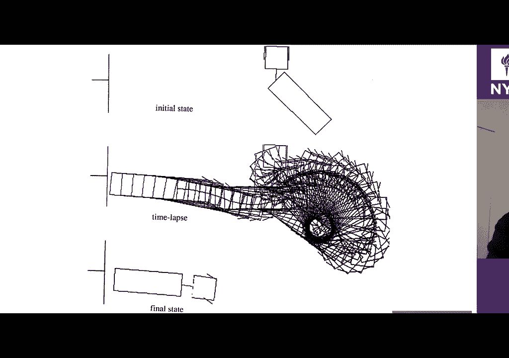

开玩笑，好吧，这里提供了其他资源的完整工作演示，因此。

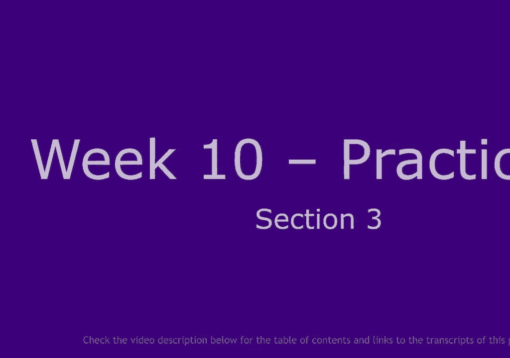

好吧，这里提供了其他资源的完整工作演示，因此，我将向您显示此链接，因为在笔记本电脑中，冷气停止了，我将向您显示此链接，因为在笔记本电脑中，冷气停止了。

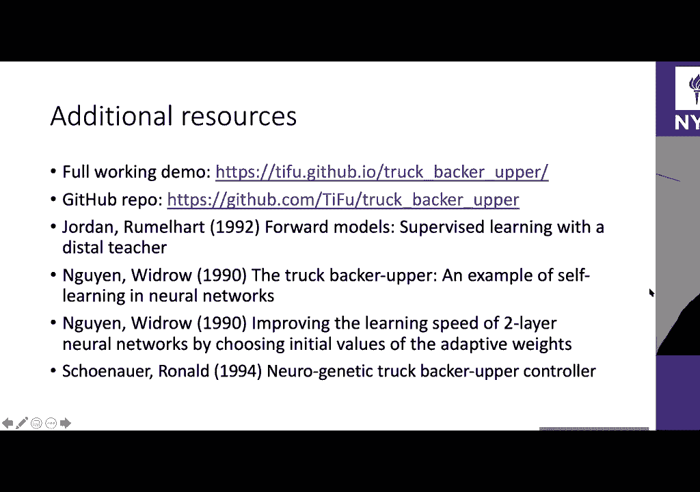

在这里，我只向您展示如何训练模拟器，我们就像，在这里，我只向您展示如何训练模拟器，我们就像。

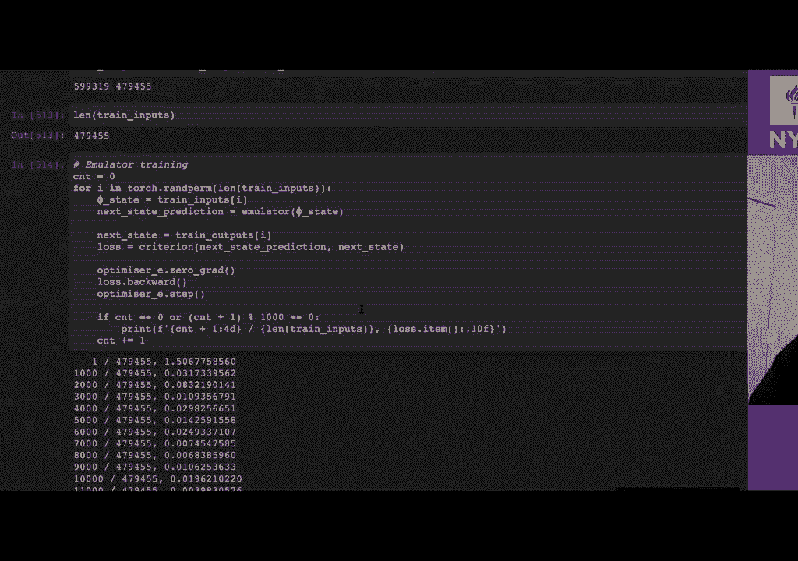

MSc损失降至非常小的体积，例如零点。

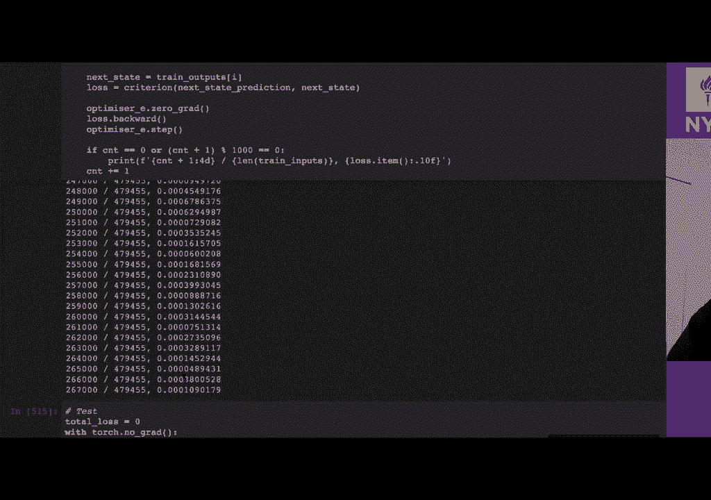

MSc损失降至非常小的体积，例如零点，这是那里还是好的，您可以正确阅读此号码，然后这是我的，这是那里还是好的，您可以正确阅读此号码，然后这是我的，正确的测试站点的值，因此如果是。

则为38 micro MSE，正确的测试站点的值，因此如果是，则为38 micro MSE，如果有人想获得额外的成绩，您想在这里称呼它，也许您可​​以添加，如果有人想获得额外的成绩，您想在这里称呼它。

也许您可​​以添加，训练控制器的代码，并不是那么简单，因为我的意思是我们，训练控制器的代码，并不是那么简单，因为我的意思是我们，讲解如何使其在课堂上发挥作用，但有点挑剔，所以我只展示。

讲解如何使其在课堂上发挥作用，但有点挑剔，所以我只展示，您可以确定最终版本，甚至可以从这里复制，我真的很喜欢。

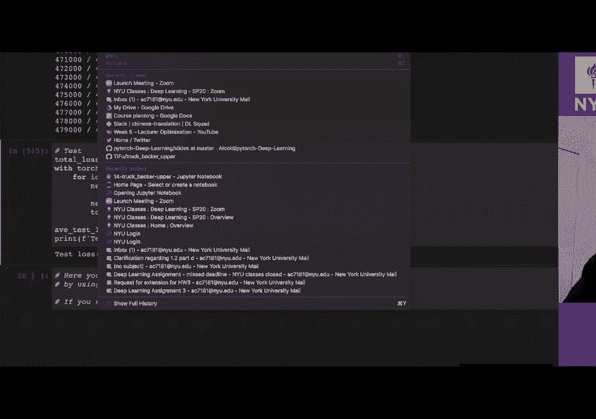

您可以确定最终版本，甚至可以从这里复制，我真的很喜欢。

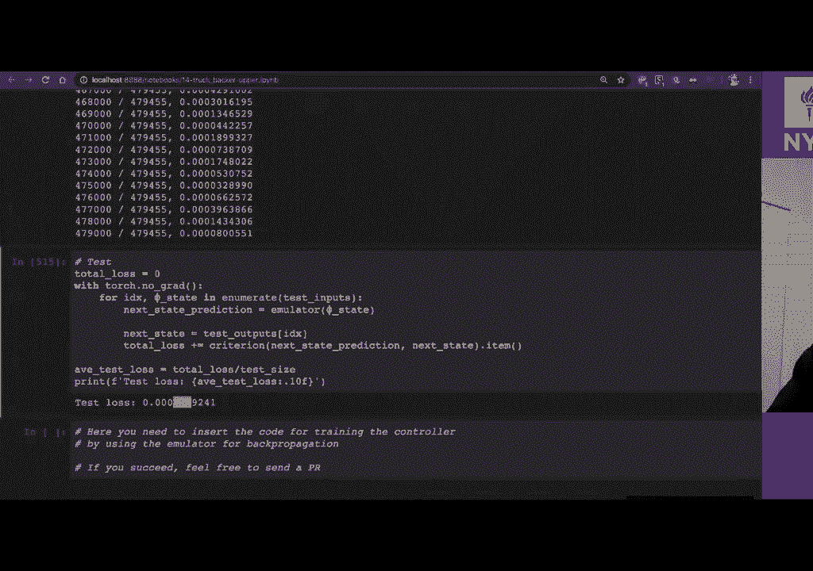

如果您可以提交将是很好，我的意思是您可以让您知道很好的奖励，所以，如果您可以提交将是很好，我的意思是您可以让您知道很好的奖励，所以，在这里，我们可以从一个随机位置开始，然后您可以使用，在这里。

我们可以从一个随机位置开始，然后您可以使用，控制器，让我们增加速度，然后动臂另一个随机位置，控制器，让我们增加速度，然后动臂另一个随机位置，太简单了，让我们做点让您知道的烦人的事情，所以预告片开始吧。

太简单了，让我们做点让您知道的烦人的事情，所以预告片开始吧，这个比方说180度，让这个零变化角好，这个比方说180度，让这个零变化角好，这真的很烦人，去看看巴克和，这真的很烦人，去看看巴克和，在那里。

我们进入繁荣状态，所以在这里，您的代码正在您的浏览器中训练，在那里，我们进入繁荣状态，所以在这里，您的代码正在您的浏览器中训练，也可以在此页面的底部，并且您在github中有此源，因此。

也可以在此页面的底部，并且您在github中有此源，因此。

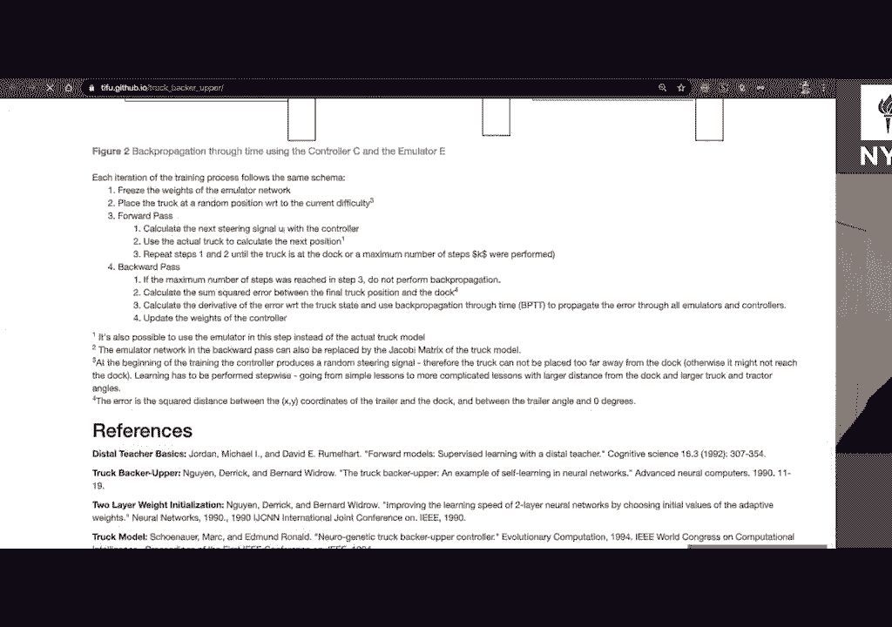

你甚至可以知道鼓励在这里移植这个项目，你甚至可以知道鼓励在这里移植这个项目，用JavaScript进行PI焊炬，这对您来说将是非常非常好的练习，用JavaScript进行PI焊炬。

这对您来说将是非常非常好的练习，了解我们会实际运行笔记本，您知道该作为，了解我们会实际运行笔记本，您知道该作为。

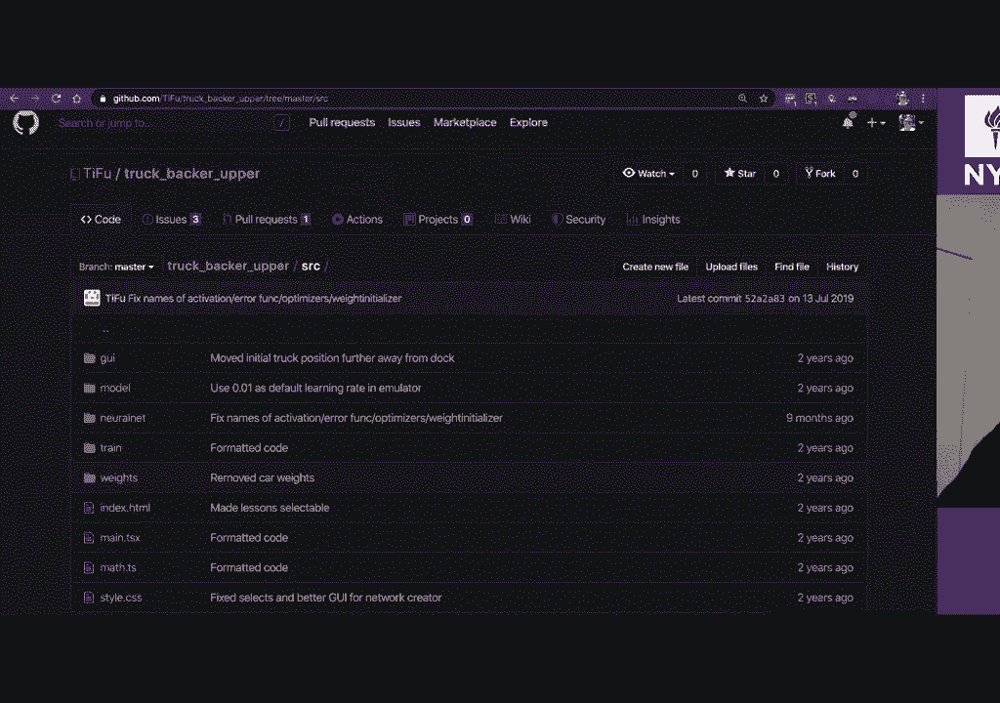

一项适合您的运动，您会忘记其他很棒的东西，所以。

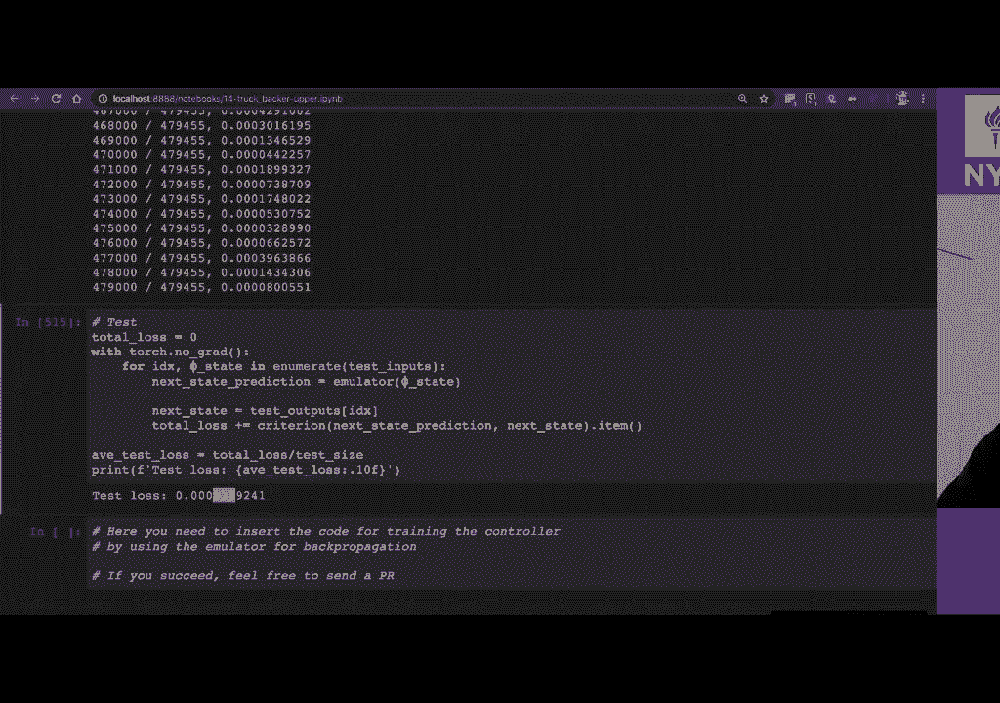

一项适合您的运动，您会忘记其他很棒的东西，所以，是今天的课，希望您喜欢我让我看看是否有，是今天的课，希望您喜欢我让我看看是否有，问题，但是如果我们训练政策梯度，是的，我们不了解我们，问题。

但是如果我们训练政策梯度，是的，我们不了解我们，我对强化学习一无所知，我对强化学习一无所知，强化学习对不起，我仍然对体系结构感到困惑，我们可以，强化学习对不起，我仍然对体系结构感到困惑，我们可以。

再次看图，当然，这里基本上，再次看图，当然，这里基本上。

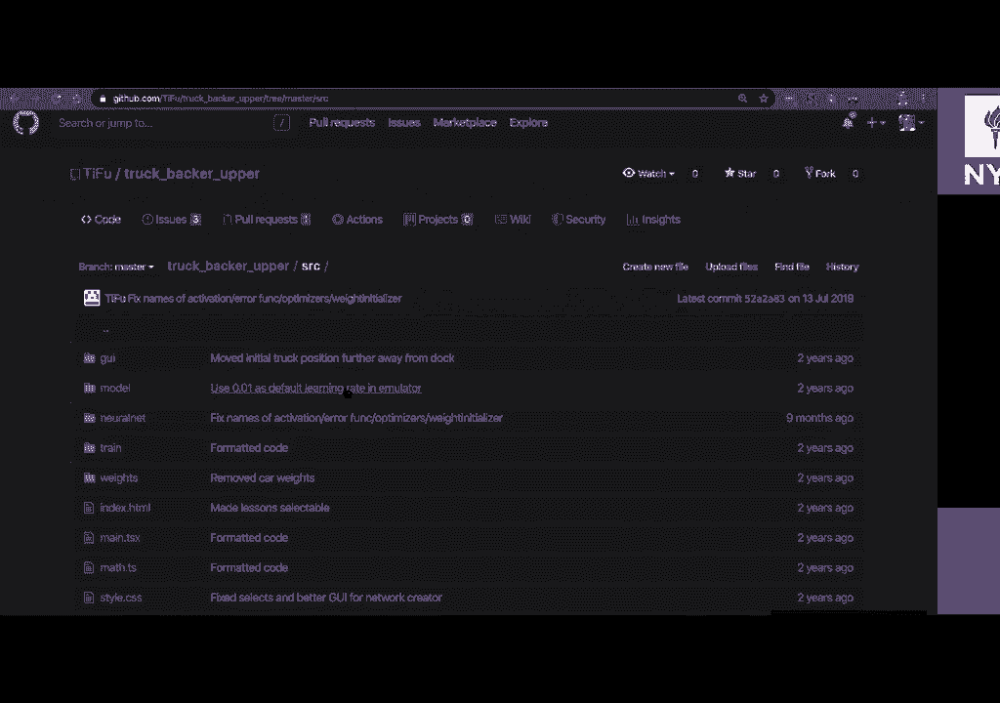

控制器从6变到25，然后从25变到1，他们使用某种，控制器从6变到25，然后从25变到1，他们使用某种，激活您的年龄是有限的，所以6到25 25到1，这就是控制器，激活您的年龄是有限的。

所以6到25 25到1，这就是控制器，而对于拖车，拖车卡车仿真器我们从7开始，而对于拖车，拖车卡车仿真器我们从7开始，X和Y的右边是6，角度乘以2的边是6加1 7，所以从，X和Y的右边是6。

角度乘以2的边是6加1 7，所以从，7到45，然后是45到6，所以这是我的预测模型，7到45，然后是45到6，所以这是我的预测模型，可以根据实际输入操作中的过去来预测未来，这就是。

可以根据实际输入操作中的过去来预测未来，这就是，我在这里如何实现这一点，所以我的状态大小是6x和Y。

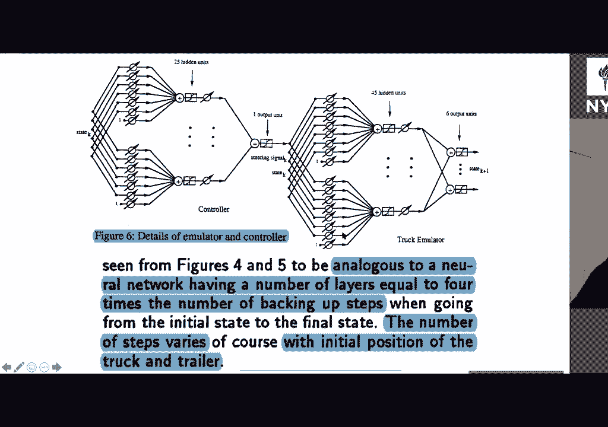

我在这里如何实现这一点，所以我的状态大小是6x和Y，θ乘以2，转向角是1，只是角度，我们说有45个单位，θ乘以2，转向角是1，只是角度，我们说有45个单位，所以这里有45个单位，所以这里有45个单位。

留下叹息g72这45然后我有真正的哦，留下叹息g72这45然后我有真正的哦。

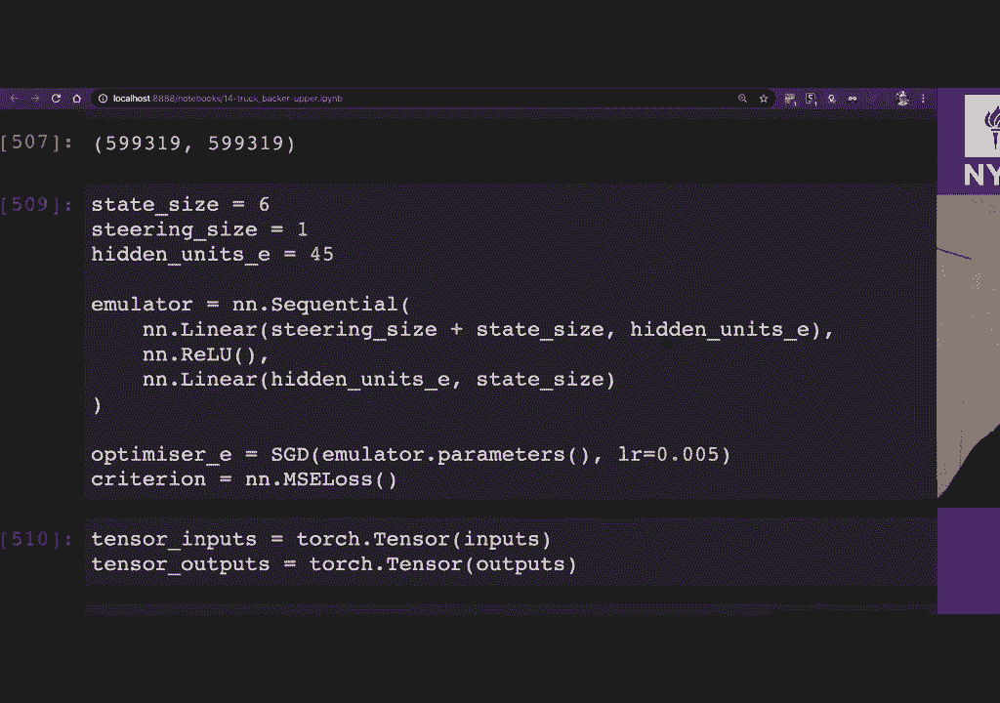

再次，看起来他们在这里使用了一段时间，好吧，你可以写H，再次，看起来他们在这里使用了一段时间，好吧，你可以写H。

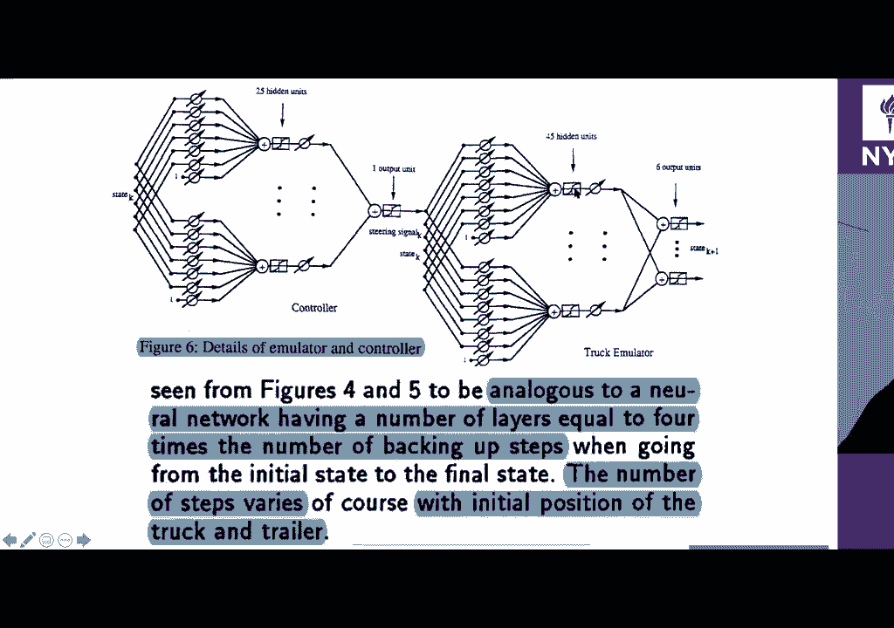

在这里，然后你有一个线性的，从这45到状态大小，在这里，然后你有一个线性的，从这45到状态大小。

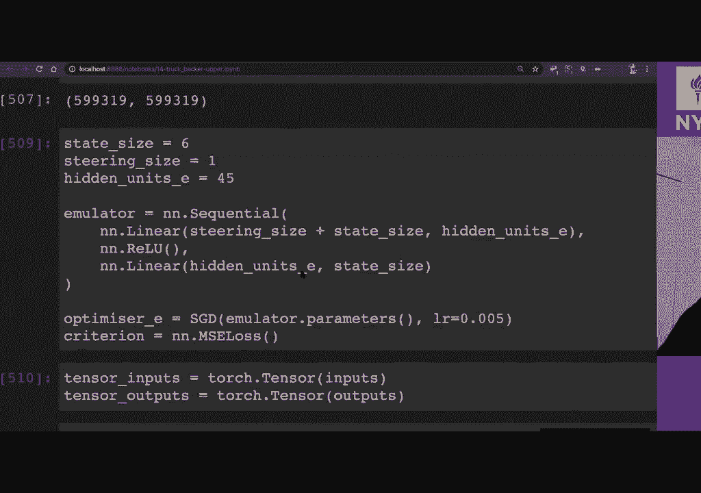

是6这将是这里的下一个输出，所以有一个。

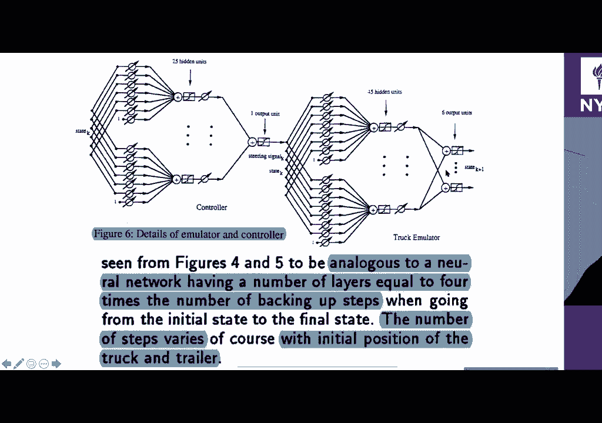

是6这将是这里的下一个输出，所以有一个，线性输出，这也是我们刚刚放入的，线性输出，这也是我们刚刚放入的，我是说我现在就给你期中答案，我是说我现在就给你期中答案，基本上，所以您在模拟器中实际模拟的方式是。

基本上，所以您在模拟器中实际模拟的方式是。

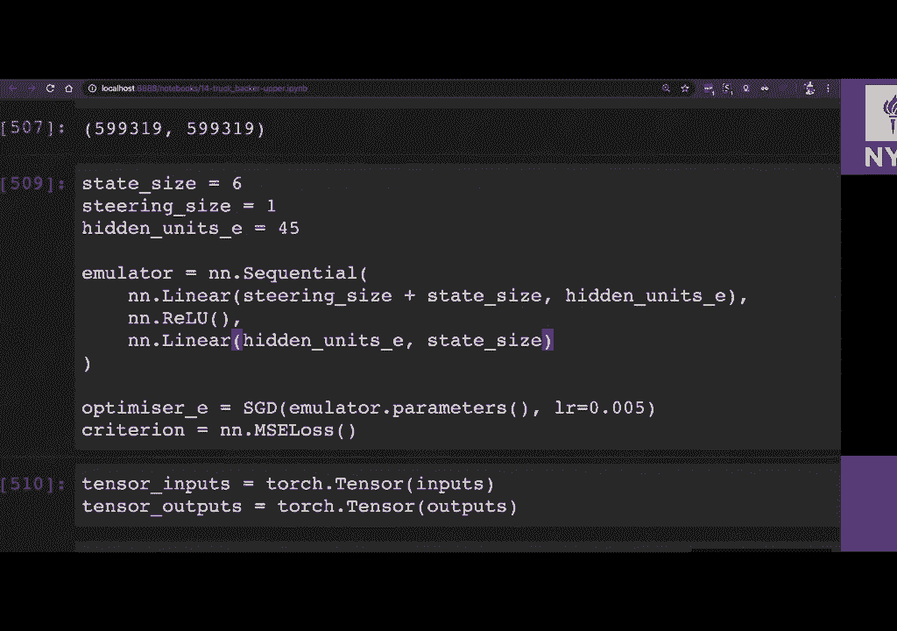

村民以它的工作方式工作，是的，所以模拟器培训是的，我们。

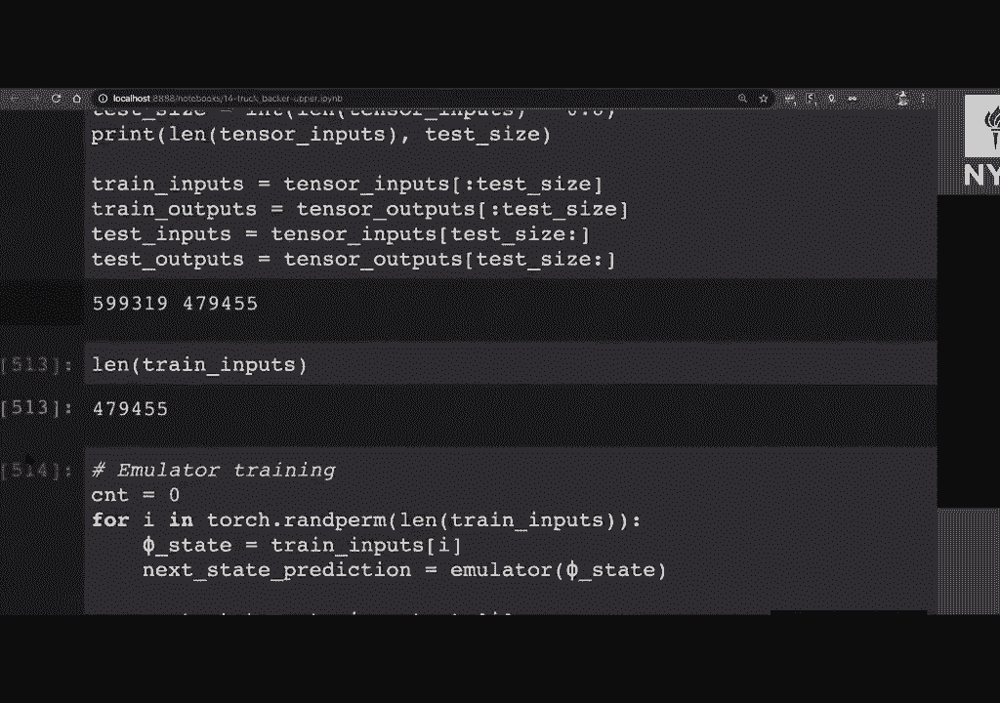

村民以它的工作方式工作，是的，所以模拟器培训是的，我们，没II没有给你看这个你是对的，所以在这里我就知道，没II没有给你看这个你是对的，所以在这里我就知道，训练输入的长度，我得到一个随机排列。

所以我选择，训练输入的长度，我得到一个随机排列，所以我选择，你随机知道，所以我有我的档案，我的角度和状态，你随机知道，所以我有我的档案，我的角度和状态，将要从这些冰的位置中选取七个坐标。

将要从这些冰的位置中选取七个坐标，培训输入，这些培训输入从这里开始，培训输入，这些培训输入从这里开始，每当我提取干燥物，以便您有训练投入时，每当我提取干燥物，以便您有训练投入时。

追加到此列表是此列表的右侧输入列表，您可以追加，追加到此列表是此列表的右侧输入列表，您可以追加，文件是转向角，然后是来自的初始状态，文件是转向角，然后是来自的初始状态，轨道，所以这是我的输入。

然后输出将是我的下一个，轨道，所以这是我的输入，然后输出将是我的下一个，输出步骤，例如，对不起轨迹的输出状态，所以如果您返回，输出步骤，例如，对不起轨迹的输出状态，所以如果您返回，在这里。

您可以找到角度和状态，这将是，在这里，您可以找到角度和状态，这将是，这个训练输入在这个位置还可以，对不起训练输入的冰块，这个训练输入在这个位置还可以，对不起训练输入的冰块，然后得到下一个状态预测将是。

然后得到下一个状态预测将是，该仿真器具有线性层作为输出，很酷，该仿真器具有线性层作为输出，很酷，那么您将拥有下一个状态，该状态将是，那么您将拥有下一个状态，该状态将是，冰的位置，现在您损失了。

这是MSc的标准，冰的位置，现在您损失了，这是MSc的标准，标准MSE，这样您就可以在下一个，标准MSE，这样您就可以在下一个，状态预测，这是下一个状态，然后是真正的下一个状态，状态预测。

这是下一个状态，然后是真正的下一个状态，我基本上是在centrai中随机进行的，我清理了看到的渐变，我基本上是在centrai中随机进行的，我清理了看到的渐变，您基本上是在训练模拟器，然后再训练其余的。

您基本上是在训练模拟器，然后再训练其余的，下一个哦，我只训练模拟器，所以我们先训练两个模型，下一个哦，我只训练模拟器，所以我们先训练两个模型，训练模拟器，然后每当训练模拟器时就训练，训练模拟器。

然后每当训练模拟器时就训练，驱动仿真器但仿真器不再训练控制器的控制器，驱动仿真器但仿真器不再训练控制器的控制器，模拟器只接受过一次培训，然后我们才能使用网络，模拟器只接受过一次培训。

然后我们才能使用网络，训练控制器，以便您首先训练模拟器，然后，训练控制器，以便您首先训练模拟器，然后，使用您训练为模拟器的网络进行控制，使用您训练为模拟器的网络进行控制，对，是的，所以无论何时我在这里。

我都觉得我已经训练了这辆拖车。

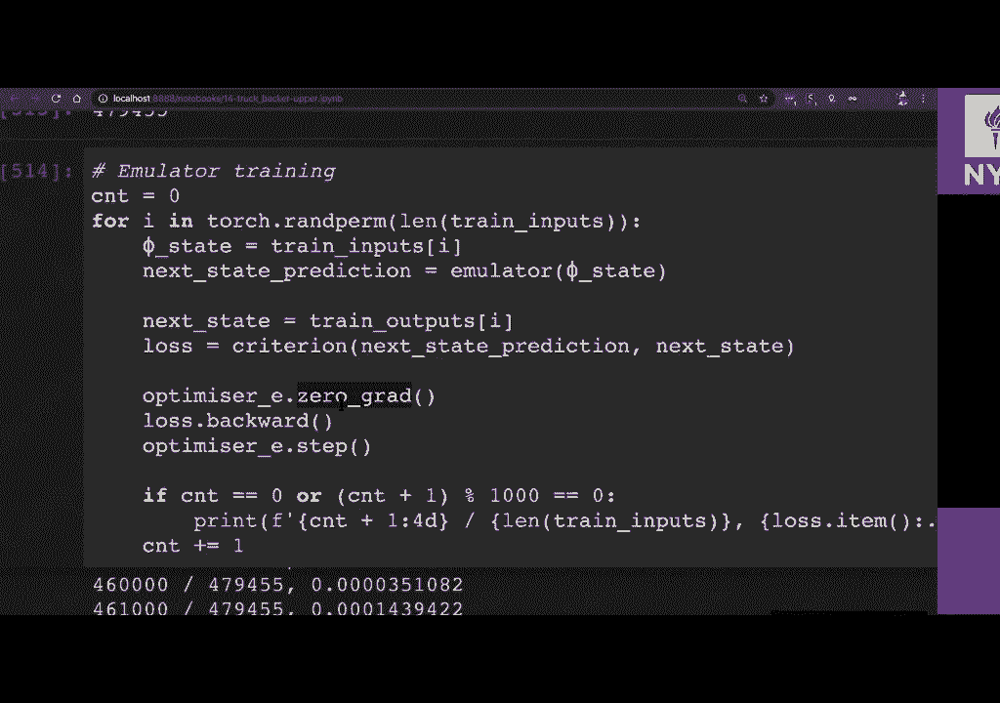

对，是的，所以无论何时我在这里，我都觉得我已经训练了这辆拖车，您稍后再对，以便像我现在向您展示的那样训练模拟器，您稍后再对，以便像我现在向您展示的那样训练模拟器，然后我也可以向您展示这张幻灯片。

所以很好，这是，然后我也可以向您展示这张幻灯片，所以很好，这是，在仿真器中，给定先前状态的下一个状态的运动学，在仿真器中，给定先前状态的下一个状态的运动学，角度，然后您强制此模拟器学习基本做一个，角度。

然后您强制此模拟器学习基本做一个，回归，当您完成以下操作后，您尝试复制输出FinFET 5，回归，当您完成以下操作后，您尝试复制输出FinFET 5，完成后，您实际上就去训练控制器来训练控制器，完成后。

您实际上就去训练控制器来训练控制器，基本上，您知道这条链是控制器和，基本上，您知道这条链是控制器和，拖车式卡车做了轨道网络，然后您就知道基本上，拖车式卡车做了轨道网络，然后您就知道基本上，轨迹。

然后您强制执行最终位置和最终方向，轨迹，然后您强制执行最终位置和最终方向，这个轨迹必须是您知道对接站，角度为0，这个轨迹必须是您知道对接站，角度为0，现在您在整个事物链中进行反向传播，因此它是背景。

现在您在整个事物链中进行反向传播，因此它是背景，为了适应使用的需要，本文确定了适应这个词，为了适应使用的需要，本文确定了适应这个词，控制器的权重，以便它设法映射原始的初始，控制器的权重。

以便它设法映射原始的初始，运行位置到最终目标位置，运行位置到最终目标位置，和定位配置，我们称之为配置，因此我们从，和定位配置，我们称之为配置，因此我们从，与位置相对应的随机初始配置，您知道。

与位置相对应的随机初始配置，您知道，角度，然后您强制执行此序列的最终输出，您知道序列，角度，然后您强制执行此序列的最终输出，您知道序列，的模块将为您提供最终的扩展坞，而模块上的0。

的模块将为您提供最终的扩展坞，而模块上的0，轨道的背面还可以，所以这是培训的两个部分，首先，轨道的背面还可以，所以这是培训的两个部分，首先，模拟器Phoenix完成了对控制器的培训，以便遵循。

模拟器Phoenix完成了对控制器的培训，以便遵循，实际上达到了特定的目标，此处红色框的数量是可变的，实际上达到了特定的目标，此处红色框的数量是可变的，这取决于每个情节，因为您不知道会走多少步。

这取决于每个情节，因为您不知道会走多少步，您需要在每四个给定的初始条件下到达目的地，因此，您需要在每四个给定的初始条件下到达目的地，因此，我说了很多话，哦，天哪，是的，很好，很好，我说了很多话，哦。

天哪，是的，很好，很好，下一个问题，所以有人确实问了我们为什么需要训练，下一个问题，所以有人确实问了我们为什么需要训练，模拟器，而不只是使用您知道的模型，是的，答案是，模拟器，而不只是使用您知道的模型。

是的，答案是，每次您实际遇到对象的问题时，每次您实际遇到对象的问题时，运动学对，所以让我们说，这将在下一课，运动学对，所以让我们说，这将在下一课，想想每当我要谈论自己的研究时，我都会想一想。

想想每当我要谈论自己的研究时，我都会想一想，知道当您在高速公路上行驶时其他汽车的行为，但我不能，知道当您在高速公路上行驶时其他汽车的行为，但我不能，控制其他汽车我不知道其他汽车的行为如何。

控制其他汽车我不知道其他汽车的行为如何，因此，我了解其他汽车如何对自己的行为做出反应的唯一方法是，因此，我了解其他汽车如何对自己的行为做出反应的唯一方法是，通过观察，因此我们像您知道的那样运行。

我们有一些，通过观察，因此我们像您知道的那样运行，我们有一些，安装在30层建筑物上的摄像机看着你知道在看高速公路，安装在30层建筑物上的摄像机看着你知道在看高速公路，站在高速公路路段。

然后您基本上会弄清楚什么是，站在高速公路路段，然后您基本上会弄清楚什么是，车辆之间的相互作用，因此我们必须学习这四个，车辆之间的相互作用，因此我们必须学习这四个，我们的模型称为预测模型，它可以预测出。

我们的模型称为预测模型，它可以预测出，是其他车辆对您自己的行为做出的反应，所以在这种情况下，是的，是其他车辆对您自己的行为做出的反应，所以在这种情况下，是的，您不需要模拟器，但是他们训练这些模拟器，使。

您不需要模拟器，但是他们训练这些模拟器，使，更通用，您不再需要微分方程，更通用，您不再需要微分方程，好的，还有一个问题是，当您说这种反复发作的时间，好的，还有一个问题是，当您说这种反复发作的时间。

网络将是可变的，大约有四个，网络将是可变的，大约有四个，乘以步数或类似内容的长度，乘以步数或类似内容的长度，多一点，所以在这里我们假设，多一点，所以在这里我们假设，每个情节都是大写的K。

所以小蛋糕的小写字母K是实际的，每个情节都是大写的K，所以小蛋糕的小写字母K是实际的，索引你去的地方像零一二三四五，索引你去的地方像零一二三四五，您知道大写K的步数正确吗，所以大写K。

您知道大写K的步数正确吗，所以大写K，每个情节都不同，所以这两个项目都在这里，每个情节都不同，所以这两个项目都在这里，这里必须仿射变换，这里的这个人必须仿射，这里必须仿射变换，这里的这个人必须仿射。

转变，使您成为整个网络，转变，使您成为整个网络，看到这里有四个仿射变换乘以大写K，看到这里有四个仿射变换乘以大写K，哦，我知道，基本上这是您的网络权利，因此是一个神经网络，哦，我知道。

基本上这是您的网络权利，因此是一个神经网络，它甚至不是递归神经网络，而仅仅是前馈神经网络，它甚至不是递归神经网络，而仅仅是前馈神经网络，进行四倍大写的K仿射变换，现在您可以训练。

进行四倍大写的K仿射变换，现在您可以训练，使用后置支撑以强制始终执行相同的目标，因此，使用后置支撑以强制始终执行相同的目标，因此，看到这种方式真的很有趣，所以您有一个神经网络，其中标签或。

看到这种方式真的很有趣，所以您有一个神经网络，其中标签或，目标将始终保持不变，但网络可以更改长度，目标将始终保持不变，但网络可以更改长度，输入的内容可以不同，所以您拥有一个网络，输入的内容可以不同。

所以您拥有一个网络，网络中您输入了不同的东西，您可以更改长度，高度，网络中您输入了不同的东西，您可以更改长度，高度，网络的深度，但是这里您始终具有相同的目标，因此，网络的深度。

但是这里您始终具有相同的目标，因此，通常，当您进行回归或分类时，我们拥有固定的网络，通常，当您进行回归或分类时，我们拥有固定的网络，您在此处输入了不同的输入，现在在此处有不同的目标。

您在此处输入了不同的输入，现在在此处有不同的目标，正确的目标或类别（如果您正在进行分类或正确的标签），正确的目标或类别（如果您正在进行分类或正确的标签），在这种情况下，您有不同的输入，目标总是固定的。

而您有，在这种情况下，您有不同的输入，目标总是固定的，而您有，知道不同的长度，因此您可以使用，知道不同的长度，因此您可以使用，可变的输入和固定的目标那有多酷，可变的输入和固定的目标那有多酷。

我们当然会像II的最大长度那样执行吗？我们当然会像II的最大长度那样执行吗？否则，您可以移动为什么我们需要模拟器来训练神经网络，否则，您可以移动为什么我们需要模拟器来训练神经网络。

仿真器是让神经网络仿真器具有可区分性的关键，仿真器是让神经网络仿真器具有可区分性的关键，是的，这就是要点，整个要点是，是的，这就是要点，整个要点是，模拟器并非总是如此，如果您知道只有。

模拟器并非总是如此，如果您知道只有，观测值，那么就没有渐变，只有观测值，观测值，那么就没有渐变，只有观测值，您想学习一个网络，该网络可以告诉您什么将是，您想学习一个网络，该网络可以告诉您什么将是。

雅各宾派，当您回去时，我还有更多问题，雅各宾派，当您回去时，我还有更多问题，与实施mmmm有关，似乎对于培训，与实施mmmm有关，似乎对于培训，控制器，我们冻结了茶叶的重量，所以，但我们仍然需要通过。

控制器，我们冻结了茶叶的重量，所以，但我们仍然需要通过，渐变以自由更新真正的每个单元格，渐变以自由更新真正的每个单元格，猜想我们在定义优化器时会想要，猜想我们在定义优化器时会想要，只是给它控制器参数。

但是当我们调用，只是给它控制器参数，但是当我们调用。

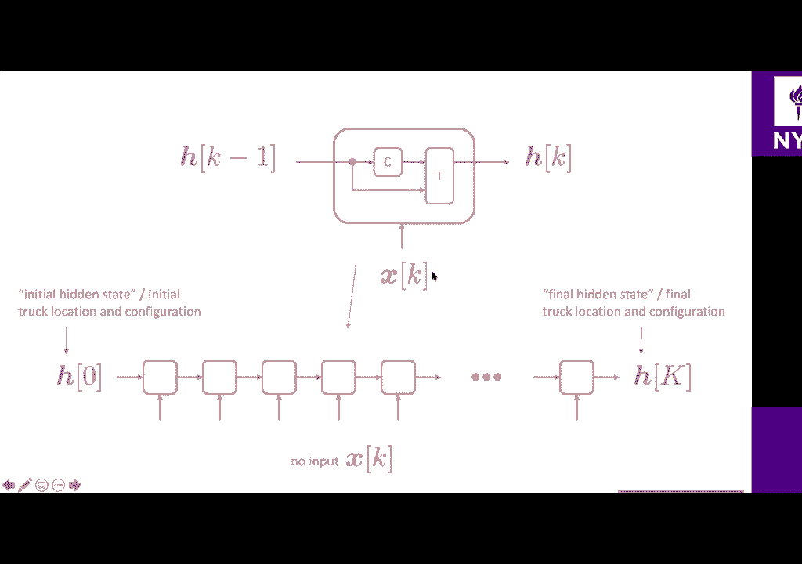

向后，它们仍然连接到同一网络，向后，它们仍然连接到同一网络，这是废话，这正是为什么我们看到过的火炬例子，这是废话，这正是为什么我们看到过的火炬例子。

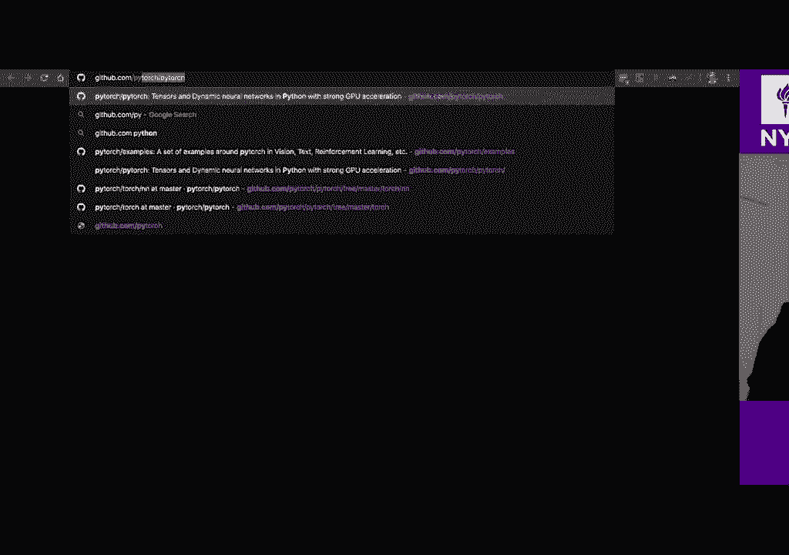

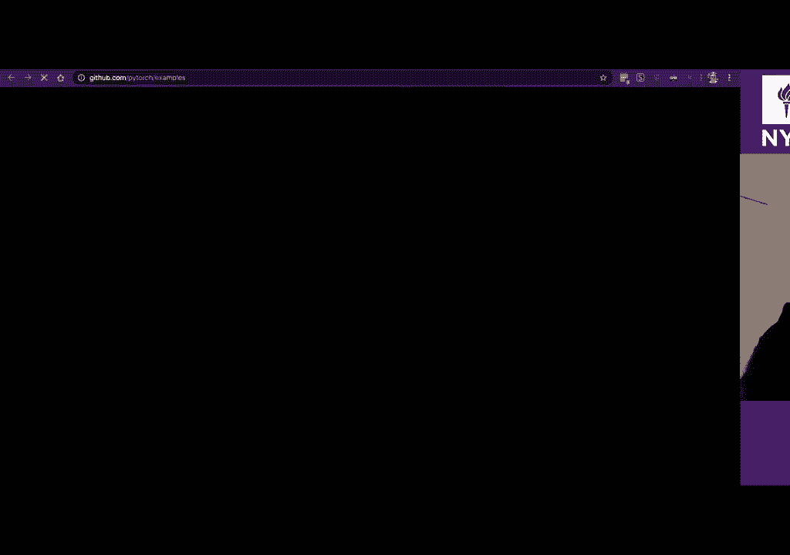

上周，当我们使用直流电枪时，您就像一个优化器持有人，上周，当我们使用直流电枪时，您就像一个优化器持有人，是的，所以您将拥有一个网络中的优化程序，而我，是的，所以您将拥有一个网络中的优化程序，而我。

只要有培训，就有一个针对其他网络的优化器，只要有培训，就有一个针对其他网络的优化器，在这种情况下，当您训练生成器时，您实际上受到了两种不同的训练，在这种情况下，当您训练生成器时。

您实际上受到了两种不同的训练，在您网络上的地址上，两个网络都处于同一循环中，但是，在您网络上的地址上，两个网络都处于同一循环中，但是，您可以先了解一个培训内容，然后从第一个网络开始。

您可以先了解一个培训内容，然后从第一个网络开始，然后你们下面所有的人都会拥有另一个，然后你们下面所有的人都会拥有另一个，其他网络步骤就在那里，所以您不需要优化器，其他网络步骤就在那里。

所以您不需要优化器，你知道如果你在本文中使用这个词，那么采用权重a，你知道如果你在本文中使用这个词，那么采用权重a，不同的时间实际上是两个不同的网络，不同的时间实际上是两个不同的网络，同时训练。

因此您首先训练预测模型，同时训练，因此您首先训练预测模型，每次完成模型完成时，都用它作为回传的手段，每次完成模型完成时，都用它作为回传的手段，从未来到未来的渐变我们如何选择资本K。

从未来到未来的渐变我们如何选择资本K，大写的K是为了使您能够进行迭代所需的迭代次数，大写的K是为了使您能够进行迭代所需的迭代次数，到达任何边缘，只要回头就回去直到碰到东西，到达任何边缘。

只要回头就回去直到碰到东西，这是资本收益，所以实际上无论何时我们前进，这是资本收益，所以实际上无论何时我们前进，使用运动学模型，使您拥有真实的感觉，我们知道，使用运动学模型，使您拥有真实的感觉。

我们知道，位置，然后为了向后运行渐变，您将需要，位置，然后为了向后运行渐变，您将需要，使用仿真器网络，以便您使用运动学模型进行正向，使用仿真器网络，以便您使用运动学模型进行正向，通过。

您使用仿真器网络进行反向传递，通过，您使用仿真器网络进行反向传递，认为这可以通过政策梯度更好地完成，任何模型，认为这可以通过政策梯度更好地完成，任何模型，好吧，我们对RL尚不了解，我没有道理，好吧。

我们对RL尚不了解，我没有道理，只要重复老板说的话，您就可以尝试正确，您肯定可以尝试，只要重复老板说的话，您就可以尝试正确，您肯定可以尝试，看看它是否再次起作用，这东西是在90年代完成的，所以。

看看它是否再次起作用，这东西是在90年代完成的，所以，是的，这就是所有东西，但总是你知道我称之为相关，是的，这就是所有东西，但总是你知道我称之为相关，您会遇到更多问题，嗨。

阿尔弗雷德（Alfred）是关于控制员和，您会遇到更多问题，嗨，阿尔弗雷德（Alfred）是关于控制员和。

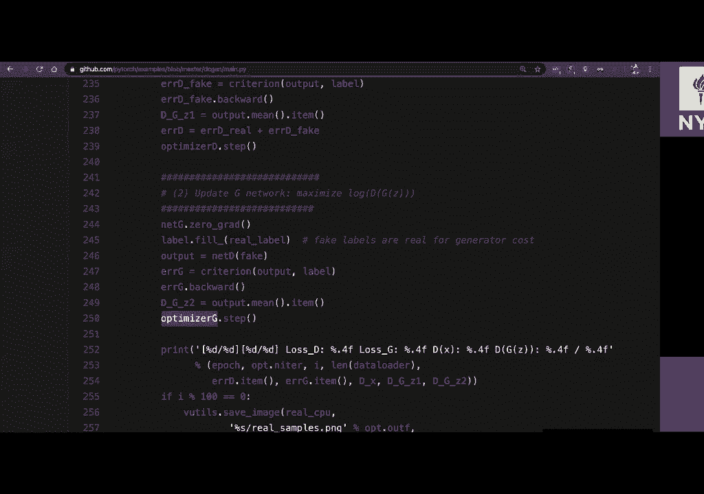

枚举器，因此每次刺穿都会对枚举器进行训练，因为我们，枚举器，因此每次刺穿都会对枚举器进行训练，因为我们，比较预测采取预测状态与原因是对的，比较预测采取预测状态与原因是对的，因此。

我们每次都会更新任何单词的参数，因此，我们每次都会更新任何单词的参数，如果您愿意，也可以进行批处理，但也可以进行随机渐变，如果您愿意，也可以进行批处理，但也可以进行随机渐变，没关系。

所以您可以提供您所知道的样品，没关系，所以您可以提供您所知道的样品，然后您更新示例更新程序，依此类推，否则您实际上可以，然后您更新示例更新程序，依此类推，否则您实际上可以，几步之后就知道一步步好吧好吧。

当我们打，几步之后就知道一步步好吧好吧，当我们打，好吧，我们只是我们不，这与模拟器无关，没有大写的K，好吧，我们只是我们不，这与模拟器无关，没有大写的K，在这里，这就像我很困惑，因为这就像我们为。

在这里，这就像我很困惑，因为这就像我们为，首先枚举，然后当我们到达终止状态时，我们不做背景，首先枚举，然后当我们到达终止状态时，我们不做背景，对于控制器，所以首先您要训练此网络，然后完成第二步。

对于控制器，所以首先您要训练此网络，然后完成第二步，训练控制器接下来下一个下一个好吧，所以您首先训练第一个，训练控制器接下来下一个下一个好吧，所以您首先训练第一个，用随机数将这个与随机数联系起来。

用随机数将这个与随机数联系起来，在信号期间，这里没有控制器，是的，很酷，所以您先，在信号期间，这里没有控制器，是的，很酷，所以您先，训练有素的模拟器，以便可以复制这些动态，然后，训练有素的模拟器。

以便可以复制这些动态，然后，第二部分将训练控制器，并且控制器被训练，第二部分将训练控制器，并且控制器被训练，通过这种方式，您可以提供初始条件，并将此初始值前馈，通过这种方式，您可以提供初始条件。

并将此初始值前馈，您基本上会以每个都知道的几个轨迹结束，您基本上会以每个都知道的几个轨迹结束，直到您达到三个最终条件之一为止，直到您达到三个最终条件之一为止，令人费解的是快要用完了，或者您实际上撞墙了。

令人费解的是快要用完了，或者您实际上撞墙了，如果您碰壁，则会通过该网络反向传播，如果您碰壁，则会通过该网络反向传播，那么您确实喜欢自己就在中心位置，而现在您正在做伟大的事。

那么您确实喜欢自己就在中心位置，而现在您正在做伟大的事，关于控制器只看到是是是好的好吧是的我知道了，关于控制器只看到是是是好的好吧是的我知道了，谢谢，好吧，那太棒了，我想是这样，谢谢，好吧，那太棒了。

我想是这样。

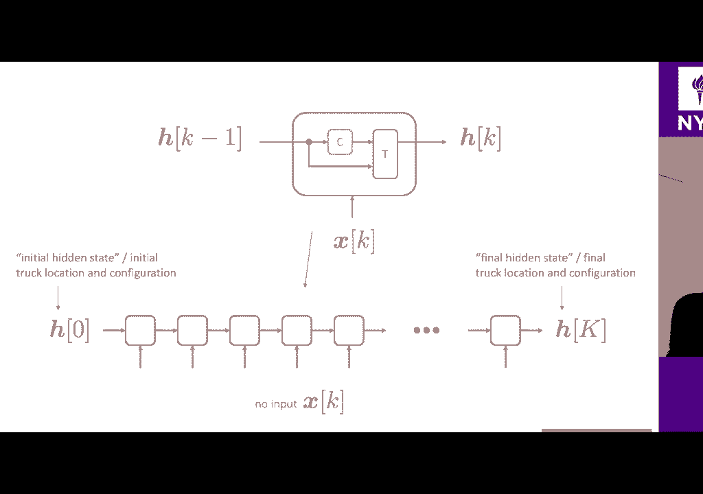

您做到了，直到课程结束，恭喜您，那么您如何，您做到了，直到课程结束，恭喜您，那么您如何，更好地了解我们今天涵盖的内容，所以有几件事，更好地了解我们今天涵盖的内容，所以有几件事。

您可以做一些事情以保持正确的理解，您可以做一些事情以保持正确的理解，在下面的评论部分问他们，如果您，在下面的评论部分问他们，如果您，在alpha CN z下在Twitter上关注我。

因为我可以获取最新信息，在alpha CN z下在Twitter上关注我，因为我可以获取最新信息，如果您订阅该频道并打开它们，则将其发布到在线更新中，如果您订阅该频道并打开它们，则将其发布到在线更新中。

通知回来，您将不会丢失我在此处发布的任何视频，通知回来，您将不会丢失我在此处发布的任何视频，如果您喜欢这部影片以及我的内容和所有内容，请再次感谢，如果您喜欢这部影片以及我的内容和所有内容，请再次感谢。

如果您在影片搜寻中加入喜欢，我真的很感激吗？如果您在影片搜寻中加入喜欢，我真的很感激吗？每个视频都有可以搜索的英文抄本，就是您，每个视频都有可以搜索的英文抄本，就是您，可以在下面的视频说明中找到它。

可以在下面的视频说明中找到它，语言SEPA Italiano hablas espanol equation普京gua你会说韩语。

语言SEPA Italiano hablas espanol equation普京gua你会说韩语，土耳其语，我们现在可以为您提供所有这些翻译，土耳其语，我们现在可以为您提供所有这些翻译。

表示您想添加更多语言是我们有志愿者PI火炬，表示您想添加更多语言是我们有志愿者PI火炬，有一个具体的理解并更好地消化这个话题，我高度重视，有一个具体的理解并更好地消化这个话题，我高度重视。

建议您尝试自己训练控制器，如果他在为您工作，建议您尝试自己训练控制器，如果他在为您工作，知道您可以提交拉取请求，这实际上是下一步，所以，知道您可以提交拉取请求，这实际上是下一步，所以。

这样我们现在就会有一个笔记本，它将运行，这样我们现在就会有一个笔记本，它将运行，控制器，以便再次作为练习留给您，以便您可以，控制器，以便再次作为练习留给您，以便您可以，真正掌握了这个主题，好吧。

再次感谢您的收听，我再见，真正掌握了这个主题，好吧，再次感谢您的收听，我再见。

