# P2：2. Week 1 – Practicum - Classification, linear algebra, and visualisation - 大佬的迷弟的粉丝 - BV1o5411p7AB

感谢您在这里回家，我们今天只听到15分钟的声音，所以我们，感谢您在这里回家，我们今天只听到15分钟的声音，所以我们，尽量不挤太多，尽量不挤太多，每次我们开始时，我和你之间都会有一个小协议。

每次我们开始时，我和你之间都会有一个小协议，上课，所以下面是我要与之交流的协议，上课，所以下面是我要与之交流的协议，您说对了，所以我在这里，因为我想每次您发送信息，您说对了，所以我在这里。

因为我想每次您发送信息，不知道发生了什么你以为我在糊涂你不能，不知道发生了什么你以为我在糊涂你不能，了解我的英语，你知道我有很浓重的意大利口音，你知道我，了解我的英语，你知道我有很浓重的意大利口音。

你知道我，妈妈是的，不，是的，我开玩笑，所以不要，妈妈是的，不，是的，我开玩笑，所以不要，如果我在说你，我说的是真实的话，如果我在说你，我说的是真实的话，或任何我在开玩笑的事情。

如果我在说你都知道深度网络，或任何我在开玩笑的事情，如果我在说你都知道深度网络，通常是可靠的，是的，所以要点就像，通常是可靠的，是的，所以要点就像，时间你不知道发生了什么事就阻止我打电话给我我知道。

时间你不知道发生了什么事就阻止我打电话给我我知道，无论在这里发生什么主意，请停止重复，再次向我解释，无论在这里发生什么主意，请停止重复，再次向我解释，如果您不了解，请向您解释多次，如果您不了解。

请向您解释多次，几乎是我99。9％的错，因为我，几乎是我99。9％的错，因为我，尚未考虑您的背景，您知道我正在跳过一些步骤，尚未考虑您的背景，您知道我正在跳过一些步骤。

也许是因为我不习惯您可能知道这堂课或您的背景，也许是因为我不习惯您可能知道这堂课或您的背景，无论如何再次如此我在这里是为了教育以便交流，无论如何再次如此我在这里是为了教育以便交流，如果你不能帮助我。

我就无法做到，所以如果我问一个问题，你，如果你不能帮助我，我就无法做到，所以如果我问一个问题，你，明白我在说什么，您应该点头，因为如果您，明白我在说什么，您应该点头，因为如果您。

像是对我的笑话或问题没有反应，那么我遇到了一些问题，像是对我的笑话或问题没有反应，那么我遇到了一些问题，了解您是否明白我在说什么，了解您是否明白我在说什么，分心，我会尝试用眼睛喉咙cho不来，我们没有。

分心，我会尝试用眼睛喉咙cho不来，我们没有，正确的选择，我想我可以尝试标记，但也许，正确的选择，我想我可以尝试标记，但也许，不适合今天的大学生，不适合今天的大学生，大人。

所以您应该能够知道接下来的45个清醒状态，大人，所以您应该能够知道接下来的45个清醒状态，分钟左右不会关闭，因为如果您关闭，我将无法，分钟左右不会关闭，因为如果您关闭，我将无法，在那里，带你再次摇晃你。

你不再是大学了，在那里，带你再次摇晃你，你不再是大学了，你是大人，你们中有些人在无神之下，你是大人，你们中有些人在无神之下，好吧，我想出你在哪里，如果我能来和你摇摇，但对于其他人，好吧，我想出你在哪里。

如果我能来和你摇摇，但对于其他人，您应该可以在接下来的15分钟内保持清醒状态，我知道这很晚，您应该可以在接下来的15分钟内保持清醒状态，我知道这很晚，晚上，所以上课前尽量不要吃东西。

这样你就不会像以后知道的那样，晚上，所以上课前尽量不要吃东西，这样你就不会像以后知道的那样，晚餐很重要，所以不要太在意我，我是意大利人。晚餐很重要，所以不要太在意我，我是意大利人。所以如此鼓舞人心。

就像为什么我们在这里采取一个也许所以这是一个，所以如此鼓舞人心，就像为什么我们在这里采取一个也许所以这是一个，最终，我们将要进行一场竞争性比赛，最终，我们将要进行一场竞争性比赛。

害怕我们不仅喜欢考虑您在最终排名中的表现如何，害怕我们不仅喜欢考虑您在最终排名中的表现如何，我们还会考虑您的工作做得如何，所以有时候，我们还会考虑您的工作做得如何，所以有时候，不太有效。

但您仍然会自己动手，所以实际上，不太有效，但您仍然会自己动手，所以实际上，仍然很重要，如果您真的赢得了挑战，那么您可能会有一些礼物，仍然很重要，如果您真的赢得了挑战，那么您可能会有一些礼物，和礼物。

是我们的，是的，和礼物，是我们的，是的，另外，如果您的成绩非常好，您可能会来，并且您知道要加入实验室，另外，如果您的成绩非常好，您可能会来，并且您知道要加入实验室，也许是下个学期的年轻人，所以说你知道。

也许是下个学期的年轻人，所以说你知道，好成绩，所以你以后可以服务以色列好吧，开玩笑，很神经质。

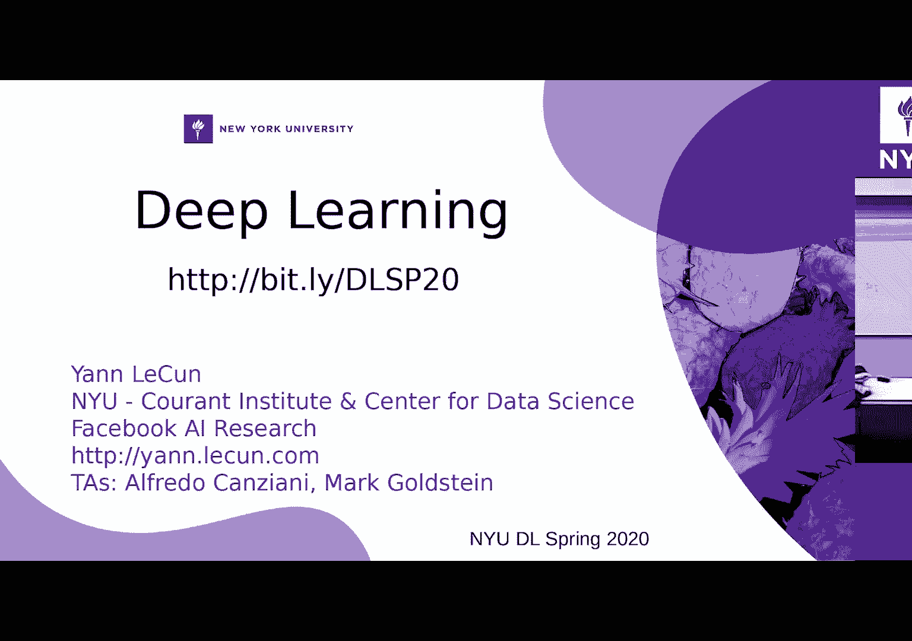

好成绩，所以你以后可以服务以色列好吧，开玩笑，很神经质，我们昨天上次见到的神经网络是什么样的，我们昨天上次见到的神经网络是什么样的，知道的，所以我想我们提到了一些应用，其中之一是。

知道的，所以我想我们提到了一些应用，其中之一是，分类，所以让我简要概述一下什么分类，分类，所以让我简要概述一下什么分类，是这样的，分类是什么？我为这些东西拍照，是这样的，分类是什么？我为这些东西拍照。

正确的假设我要用一台黑胶相机和一台百万像素相机拍照，正确的假设我要用一台黑胶相机和一台百万像素相机拍照，许多维度将是我的图像，所以如果我拍摄图像，我可以考虑我的图像，许多维度将是我的图像。

所以如果我拍摄图像，我可以考虑我的图像，这将有RGB平面，并且会很重，像是，这将有RGB平面，并且会很重，像是，垂直像素和一千个像素，或者在电视上，所以您将拥有，垂直像素和一千个像素，或者在电视上。

所以您将拥有，总共100万像素，所以一个百万像素具有RGB，那么多少，总共100万像素，所以一个百万像素具有RGB，那么多少，像素您将拥有3百万个值，好酷，这样您就可以思考，像素您将拥有3百万个值。

好酷，这样您就可以思考，关于此图像，可以认为是这种三层堆栈是，关于此图像，可以认为是这种三层堆栈是，在这300万维空间和这300万维空间中，在这300万维空间和这300万维空间中。

尺寸空间真的非常非常非常大，可以移动，尺寸空间真的非常非常非常大，可以移动，周围什么都没有发生，所以假设我给狗拍了张照片，周围什么都没有发生，所以假设我给狗拍了张照片，我这里有只狗的照片。

假设我拍了只猫的照片，我这里有只狗的照片，假设我拍了只猫的照片，会在这里或这里成为猫的图片不好意思，好吧，为谁的东西举手，会在这里或这里成为猫的图片不好意思，好吧，为谁的东西举手。

如果这是我的猫狗认为另一种剪裁在这里，那是很酷的事情，如果这是我的猫狗认为另一种剪裁在这里，那是很酷的事情，好吧，也许昨天您实际上在注意谁在想，好吧，也许昨天您实际上在注意谁在想。

谁认为另一点会在这里好吗谁认为另一点是，谁认为另一点会在这里好吗谁认为另一点是，会在这里很棒，所以你实际上是在做正确的事，会在这里很棒，所以你实际上是在做正确的事，一切都在太空中该死的同一地点。

一切都在太空中该死的同一地点，一切实际上有意义的一切都在这里，其他一切都只是，一切实际上有意义的一切都在这里，其他一切都只是，垃圾，所以我们必须占用空间去这里，移到这里，垃圾。

所以我们必须占用空间去这里，移到这里，您如何移动点，您是否已采用线性代数？您如何移动点，您是否已采用线性代数？关于线性代数，您可能知道或不知道，我确实有，关于线性代数，您可能知道或不知道，我确实有。

Twitter，我在Twitter上很烦人，因为我经常说话，所以让我们，Twitter，我在Twitter上很烦人，因为我经常说话，所以让我们。

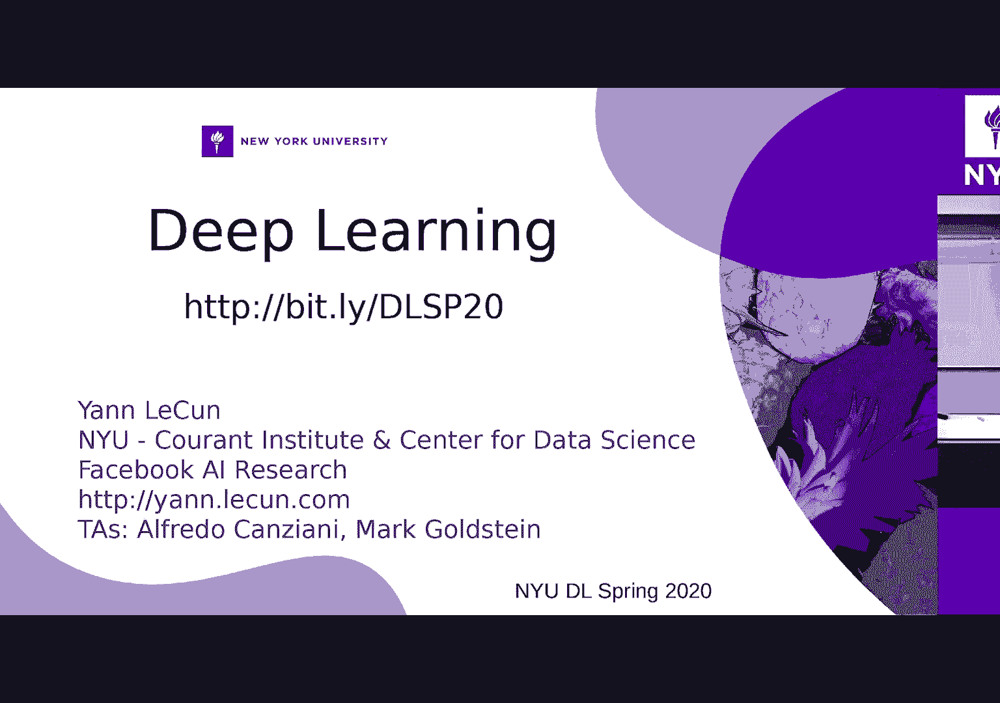

看到Twitter可以正常打开Twitter，所以在这里我无法缩放，所以twitter。com正确，看到Twitter可以正常打开Twitter，所以在这里我无法缩放，所以twitter。com正确。

所以你走了哦，没有互联网看到哈，所以你走了哦，没有互联网看到哈，让我们连接Wi-Fi是的，我几乎可以正常连接，所以你想要，让我们连接Wi-Fi是的，我几乎可以正常连接，所以你想要，进行搜索。

然后进行线性，胸罩，你在这里什么都看不到，胸罩，你在这里什么都看不到，一定要在这里见到变焦，好吧，所以您不要在右上方，您正在搜索，一定要在这里见到变焦，好吧，所以您不要在右上方，您正在搜索，线性的。

胸罩他们从我身上做括号我会看到说，好的，这就是你，胸罩他们从我身上做括号我会看到说，好的，这就是你，找出有关电表的问题，只需在Twitter上检查一下，找出有关电表的问题。

只需在Twitter上检查一下。

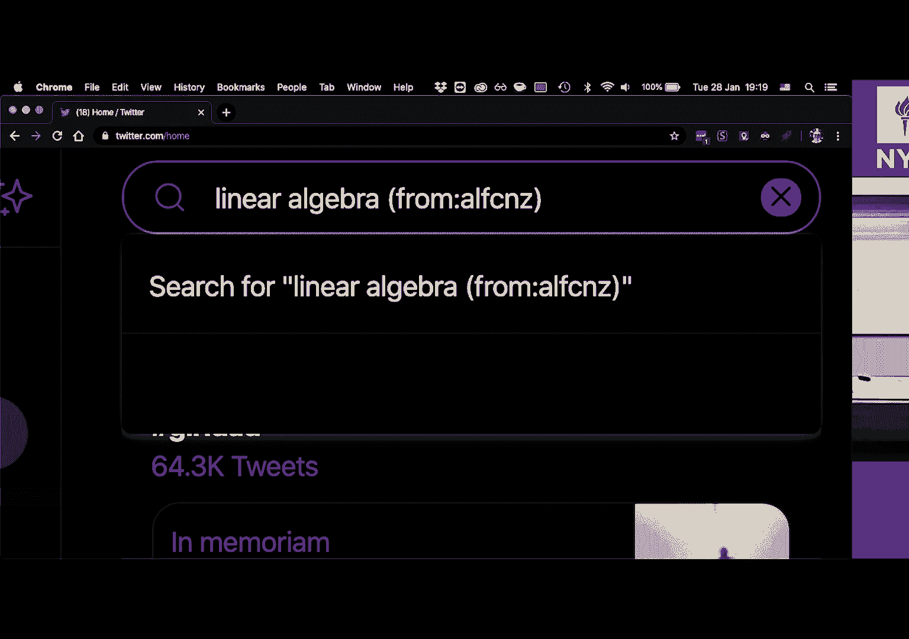

通常是的，那里有泄漏的东西，所以在这里你有这些实际上是非常，通常是的，那里有泄漏的东西，所以在这里你有这些实际上是非常。

吉尔伯特·斯特朗（Gilbert Strang）的这本书对线性代数的介绍很好，所以您可以，吉尔伯特·斯特朗（Gilbert Strang）的这本书对线性代数的介绍很好，所以您可以，想知道您查找这些东西。

但是另一个是这里的那个，所以您会，想知道您查找这些东西，但是另一个是这里的那个，所以您会，我想在这里查看第三条推文，向您展示线性代数的精髓，我想在这里查看第三条推文，向您展示线性代数的精髓，我承认。

如果您不太了解，您可能认识这个人Brian Sanders，我承认，如果您不太了解，您可能认识这个人Brian Sanders，现在应该知道，只需检查一下此链接即可，此链接将向您显示，现在应该知道。

只需检查一下此链接即可，此链接将向您显示，你如何移动东西，好吧，这是今天的第一个链接，怎么办，你如何移动东西，好吧，这是今天的第一个链接，怎么办，您在一个空间中移动事物，而实际上却不知道该如何。

您在一个空间中移动事物，而实际上却不知道该如何，能量线性代数的作品，你只管说起就举手吧，好吧，能量线性代数的作品，你只管说起就举手吧，好吧，矩阵乘法佛陀的edo旋转，矩阵乘法佛陀的edo旋转，好吧。

首先矩阵乘法是什么样的变导，好吧，首先矩阵乘法是什么样的变导，变换好吗确定旋转一圈的线性变换是什么，变换好吗确定旋转一圈的线性变换是什么，拉直好吧棒极了，然后第三次拉伸缩放，我想让我们看看。

拉直好吧棒极了，然后第三次拉伸缩放，我想让我们看看，然后把这个数字缩放到第二，如果行列式为负，那么你有什么？如果行列式为负，那么你有什么？然后又可以吗，我想我们现在应该有三个，然后又可以吗。

我想我们现在应该有三个，再等一遍，以便正确缩放，这样就可以缩放，再等一遍，以便正确缩放，这样就可以缩放，这样他有那样的缩放比例，然后你有旋转，然后你有，这样他有那样的缩放比例，然后你有旋转，然后你有。

反射，如果在那里，当您有反射时，纳米身份无济于事，反射，如果在那里，当您有反射时，纳米身份无济于事，对，所以可以旋转表示矩阵是，对，所以可以旋转表示矩阵是，正常正常凉爽第二个你有缩放的时候。

正常正常凉爽第二个你有缩放的时候，好吧，我希望你一切都好，我们有四个权利，所以我们有，好吧，我希望你一切都好，我们有四个权利，所以我们有，旋转，我们可以通过这种方式进行缩放，然后就可以进行剪切，旋转。

我们可以通过这种方式进行缩放，然后就可以进行剪切，每当你有负面行列式时，我仍然会思考，每当你有负面行列式时，我仍然会思考，您移动物体是运动平移是线性操作否是，您移动物体是运动平移是线性操作否是。

你也可以不用举手，你也可以不用举手，添加标量正在添加缩放器线性操作嗯不确定，因为，添加标量正在添加缩放器线性操作嗯不确定，因为，0，仅当0映射到0时，0才映射到右侧，则您有一个，0，仅当0映射到0时。

0才映射到右侧，则您有一个，线性变换无论如何，所以你有翻译是，线性变换无论如何，所以你有翻译是，如果使用仿射变换，则在第五次操作中执行第四次操作，如果使用仿射变换，则在第五次操作中执行第四次操作。

那些好东西，你会没事的，好吧，所以检查那些东西，那些好东西，你会没事的，好吧，所以检查那些东西，无论如何都很有用，所以最后我们弄清楚，如果我在这里拥有所有东西，我们，无论如何都很有用。

所以最后我们弄清楚，如果我在这里拥有所有东西，我们，剪了河马狗，我想把它们砍下来，剪了河马狗，我想把它们砍下来，翻译正确，是，和我说话，不，你不说话，还不错，翻译正确，是，和我说话，不，你不说话。

还不错，对，所以我们要使用翻译，然后您翻译，对，所以我们要使用翻译，然后您翻译，在z行中，所以您在这里拥有所有东西，然后如何将它们分开，在z行中，所以您在这里拥有所有东西，然后如何将它们分开。

分开的东西，所以他们都高高在一起，我怎么能提到，分开的东西，所以他们都高高在一起，我怎么能提到，五种不同的四种不同的转化是线性的，五种不同的四种不同的转化是线性的。

变换确实缩放了如何使用对角矩阵缩放事物，变换确实缩放了如何使用对角矩阵缩放事物，太棒了，太棒了，所以我们如何对角矩阵矩阵哈，太棒了，太棒了，所以我们如何对角矩阵矩阵哈，第二个问题。

您可以确定是否检查Twitter，以便我们打开一个新的，第二个问题，您可以确定是否检查Twitter，以便我们打开一个新的，我们再次进入Twitter的页面我们在右上角应该记下如何操作。

我们再次进入Twitter的页面我们在右上角应该记下如何操作，这些东西不是SVD括号，来自所有新西兰，这些东西不是SVD括号，来自所有新西兰。

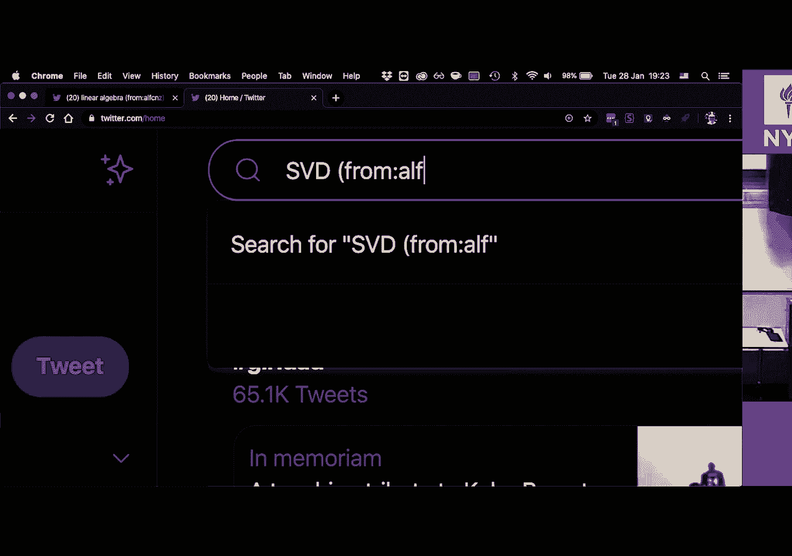

现在你去，如果你去这里是像或SVD，所以这也是吉尔伯特对，所以。

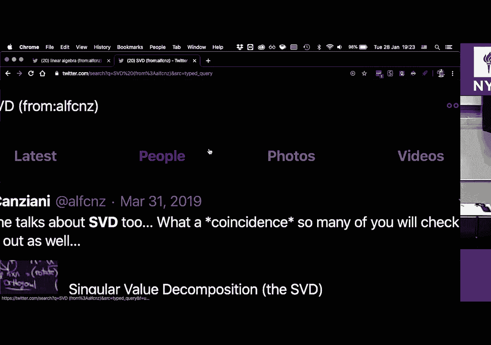

现在你去，如果你去这里是像或SVD，所以这也是吉尔伯特对，所以，如果您单击此处，您还希望对其进行检查，它将更多，如果您单击此处，您还希望对其进行检查，它将更多，去年有关我的任期信息哦，好吧。

您知道太多了。

去年有关我的任期信息哦，好吧，您知道太多了，好的，所以无论如何您都想检查一下这些东西，我们会找出来的，好的，所以无论如何您都想检查一下这些东西，我们会找出来的，通过使用矩阵和标量，您可以移动事物。

然后可以缩放，通过使用矩阵和标量，您可以移动事物，然后可以缩放，是的，所以我的一切都崩溃了，我无能为力，所以我，是的，所以我的一切都崩溃了，我无能为力，所以我，用翻译记下来，是的，不要用脑袋做这样的事。

用翻译记下来，是的，不要用脑袋做这样的事，不，你跟在那儿，是的，不是，很无聊，不是，所以你，不，你跟在那儿，是的，不是，很无聊，不是，所以你，您放下翻译然后将其放大的原因，您放下翻译然后将其放大的原因。

带有对角线的矩阵，也许带有一些奇异的值，带有对角线的矩阵，也许带有一些奇异的值，然后是什么，所以我把这个东西放大了，所以分类，然后是什么，所以我把这个东西放大了，所以分类，现在，我想分配您如何进行分类？

现在，我想分配您如何进行分类？标签，但是您要怎么做，所以无论您想做什么，标签，但是您要怎么做，所以无论您想做什么，基本上将这些点移动到不同区域，基本上将这些点移动到不同区域，然后将它们切成薄片。

所以这是下一个问题，然后将它们切成薄片，所以这是下一个问题，上课，现在我只是向您展示神经网络是如何做到的，希望您，上课，现在我只是向您展示神经网络是如何做到的，希望您。

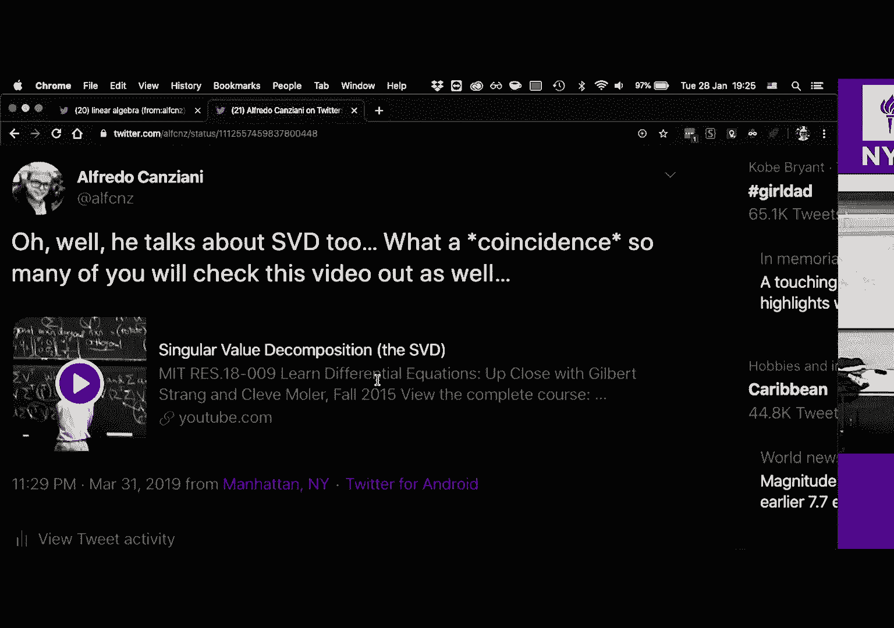

如果我发现光标还可以的话，会很喜欢这个视频，所以我们开始，如果我发现光标还可以的话，会很喜欢这个视频，所以我们开始。

从这里看屏幕也许没问题，所以您能看到任何东西吗？从这里看屏幕也许没问题，所以您能看到任何东西吗？关灯，有人能弄清楚怎么办哦，也许，关灯，有人能弄清楚怎么办哦，也许，是的，没有晚安，好晚安。

所以至少我会把它打开，是的，没有晚安，好晚安，所以至少我会把它打开，返回，所以我们从螺旋的这五个分支开始，您可以看到，返回，所以我们从螺旋的这五个分支开始，您可以看到，每个点都将基本表示为您如何。

每个点都将基本表示为您如何，代表这些点中的每一个都没有颜色，这些点在哪里，代表这些点中的每一个都没有颜色，这些点在哪里，居住在2D平面右侧，所以这是此屏幕的2D平面，所以每个，居住在2D平面右侧。

所以这是此屏幕的2D平面，所以每个，点表示为a是表示X和，点表示为a是表示X和，y坐标，则那里的颜色代表第三个维度，y坐标，则那里的颜色代表第三个维度，将基本上代表这些点中的每一个的类。

将基本上代表这些点中的每一个的类，属于，这里我们有五个不同的螺旋分支，所以这是，属于，这里我们有五个不同的螺旋分支，所以这是，输入到我的网络将是一堆没有颜色的点，然后。

输入到我的网络将是一堆没有颜色的点，然后，我要求我的网络按颜色将点分开，可以吗？我要求我的网络按颜色将点分开，可以吗？任务我问我的网络，你可以授权你的手，因为我看不见，任务我问我的网络。

你可以授权你的手，因为我看不见，没错，所以你必须大喊大叫，因为我，没错，所以你必须大喊大叫，因为我，没看到您，您理解的正确，如果对不起，这是怎么回事，没看到您，您理解的正确，如果对不起，这是怎么回事。

现在，我们从这个家伙开始，这只是一个螺旋的五个分支，现在，我们从这个家伙开始，这只是一个螺旋的五个分支，网络目前看不到颜色，网络将尝试将，网络目前看不到颜色，网络将尝试将，颜色分开。

这就是我的网络要做的事，颜色分开，这就是我的网络要做的事，面料的表现就像太空面料的拉伸一样，面料的表现就像太空面料的拉伸一样。

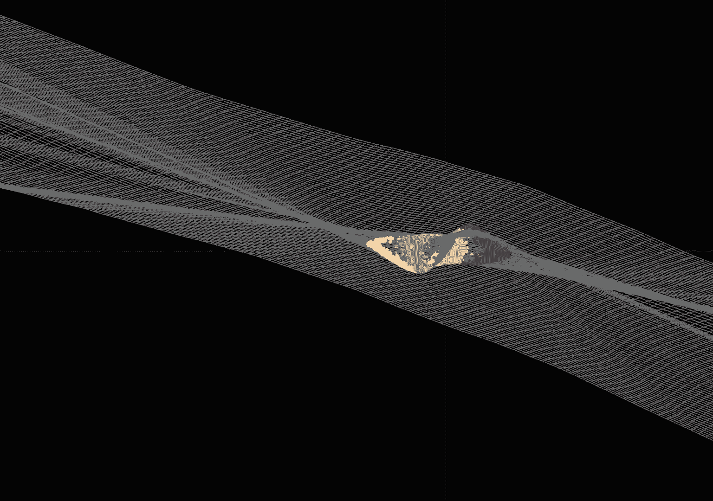

声音，你应该喜欢哦，哦，好吧，是的，我们必须做多次，声音，你应该喜欢哦，哦，好吧，是的，我们必须做多次，迭代，我认为这是您的第一堂课，害羞还可以，所以，迭代，我认为这是您的第一堂课，害羞还可以，所以。

这是我的网络，基本上是在扩展空间结构，以便，这是我的网络，基本上是在扩展空间结构，以便，将所有属于相同颜色的点归为同一类别，将所有属于相同颜色的点归为同一类别，在这个最终流形的相同子空间中。

以便一旦我们到达，在这个最终流形的相同子空间中，以便一旦我们到达，收敛，因此只要我们到达此动画的结尾，您就拥有了所有，收敛，因此只要我们到达此动画的结尾，您就拥有了所有，属于不同螺旋的点非常可分离。

所以现在您可以，属于不同螺旋的点非常可分离，所以现在您可以，使用logistic回归权或与之相对的所有回归，使用logistic回归权或与之相对的所有回归，我不知道，所以我的意思是这是最后一个矩阵。

我不知道，所以我的意思是这是最后一个矩阵，那五个箭头在那里那五个箭头代表一个矩阵，那五个箭头在那里那五个箭头代表一个矩阵，多少行多少列，所以我的输出尺寸是多少，多少行多少列，所以我的输出尺寸是多少。

这个网络我们在这种情况下要试图推断出多少个类，这个网络我们在这种情况下要试图推断出多少个类，类有五个，所以这个矩阵的行数是五个，类有五个，所以这个矩阵的行数是五个，因为它们是矩阵的高度。

它们是您拍摄时的相同尺寸，因为它们是矩阵的高度，它们是您拍摄时的相同尺寸，一分为二，矩阵的宽度代表您所处的空间，一分为二，矩阵的宽度代表您所处的空间，从右边射击，这将是我的宽度，从右边射击。

这将是我的宽度，这个矩阵-对，所以这个矩阵将是2的高倍，因为我们，这个矩阵-对，所以这个矩阵将是2的高倍，因为我们，朝着五个维度射击，这五个颜色在那儿，然后，朝着五个维度射击，这五个颜色在那儿，然后。

到两列就可以了，到两列就可以了，基本上是箭头尖的两个坐标，它们只是居中，基本上是箭头尖的两个坐标，它们只是居中，在零，我们将在后面讨论更多关于那个交集的信息，在零。

我们将在后面讨论更多关于那个交集的信息，课程，如果我实际上可以设法制作有关该视频的视频，但您能看到吗，课程，如果我实际上可以设法制作有关该视频的视频，但您能看到吗，那种可爱的十字路口，你见过那种。

那种可爱的十字路口，你见过那种，你洗过澡前的路口我的意思是，是的，你洗过澡前的路口我的意思是，是的，每当您有多个气泡接触在一起时，它看起来就像，每当您有多个气泡接触在一起时，它看起来就像。

也许不是我不知道它对我来说还不错，也许不是我不知道它对我来说还不错，第一个网络还可以，这就是这些网络如何工作的网络，第一个网络还可以，这就是这些网络如何工作的网络，基本上采用太空结构，然后进行某种转换。

基本上采用太空结构，然后进行某种转换，仍然被矩阵参数化，所以我有很多矩阵，仍然被矩阵参数化，所以我有很多矩阵，为什么需要很多矩阵，或者为什么需要非线性，为什么需要很多矩阵，或者为什么需要非线性。

我可以把灯打开吗，哦，你还是喜欢看吗？我可以把灯打开吗，哦，你还是喜欢看吗？翻转所有权利，所以这里基本上，这个家伙会成为一个，翻转所有权利，所以这里基本上，这个家伙会成为一个。

有两个矩阵的网络我的第一个矩阵映射了我所居住的输入，有两个矩阵的网络我的第一个矩阵映射了我所居住的输入，将两个尺寸间隔到100个尺寸的中间层，将两个尺寸间隔到100个尺寸的中间层，我的网络架构如下。

所以我在这里遇到了两个神经元，我的网络架构如下，所以我在这里遇到了两个神经元，一二一二三等等在这里我有100个然后我有一些非线性，一二一二三等等在这里我有100个然后我有一些非线性，将只是积极的一面。

然后从这个人那里，我做，将只是积极的一面，然后从这个人那里，我做，我不知道的一些可爱，有趣或怪异的东西，因此从这里我映射到，我不知道的一些可爱，有趣或怪异的东西，因此从这里我映射到，好吧。

在我说这是我的网络之后，我该怎么办，好吧，在我说这是我的网络之后，我该怎么办，是网络Phi的最后一层，但是有多少个维度，是网络Phi的最后一层，但是有多少个维度，屏幕，所以我该如何绘图我不说PCIe。

所以我确实可以听，屏幕，所以我该如何绘图我不说PCIe，所以我确实可以听，这样我就可以向您展示这两者之间的干预插值，这样我就可以向您展示这两者之间的干预插值，在这里，在这种情况下，我称其为嵌入。

但这只是我所说的一种方式，在这里，在这种情况下，我称其为嵌入，但这只是我所说的一种方式，现在的东西，我的输入还可以，好了，差不多了，所以这是我的神经网络只有一个输入层，好了，差不多了。

所以这是我的神经网络只有一个输入层，一个隐藏层一种不执行任何操作的嵌入层，并输出，一个隐藏层一种不执行任何操作的嵌入层，并输出，一层好吧，所以它有一个隐藏的，总的来说，我认为这是三层，一层好吧。

所以它有一个隐藏的，总的来说，我认为这是三层，神经网络精确，因为它是一二，然后这东西是线性的，神经网络精确，因为它是一二，然后这东西是线性的，那么为什么我们需要非线性和，在没有非线性的情况下。

一层可以说什么呢？在没有非线性的情况下，一层可以说什么呢？单层神经网络和单层神经网络，或者您能做什么，单层神经网络和单层神经网络，或者您能做什么，缩放平移旋转反射，我想剪切正确，缩放平移旋转反射。

我想剪切正确，好吧，我想这节课的下一部分是什么，让我们，好吧，我想这节课的下一部分是什么，让我们，检查一个带有一层的线性单网络如何工作，好吗，所以，检查一个带有一层的线性单网络如何工作，好吗，所以。

远处也有，只是在屏幕上显示更多内容，远处也有，只是在屏幕上显示更多内容，再次提问不要举手，你可以和我说话，你可以听到我的声音吗，再次提问不要举手，你可以和我说话，你可以听到我的声音吗，那里一切都还好。

很棒，谢谢，那里一切都还好，很棒，谢谢，您的批准，所以这两个点代表我输入点的坐标，所以这两个点代表我输入点的坐标，这将是我的输入空间的x坐标我的y坐标，这将是我的输入空间的x坐标我的y坐标。

将是这些嵌入空间的x坐标和y坐标，将是这些嵌入空间的x坐标和y坐标，鉴于我知道我获得了100％的收益，这是线性可分离的，鉴于我知道我获得了100％的收益，这是线性可分离的，培训的准确性。

我们还没有谈到培训，但是可以，培训的准确性，我们还没有谈到培训，但是可以，毫无疑问，我给你的答案是的，所以这只是一种方法，毫无疑问，我给你的答案是的，所以这只是一种方法，可视化两个维度中的五个维度。

而不是仅仅执行PCA，可视化两个维度中的五个维度，而不是仅仅执行PCA，PCA保持未完成，因为我想看看网络输出是什么，PCA保持未完成，因为我想看看网络输出是什么，看起来好像是二维的。

那么为什么是真的还是假的呢？看起来好像是二维的，那么为什么是真的还是假的呢？下次它不会缩小，因为您可以再次看到那两个乘积，下次它不会缩小，因为您可以再次看到那两个乘积。

他们一起看起来像一个奇异矩阵一个单一矩阵，他们一起看起来像一个奇异矩阵一个单一矩阵，实际上，这在以后的课程中会更好地解决这个问题，实际上，这在以后的课程中会更好地解决这个问题，将会感动这个好吧。

我们还有一些时间，将会感动这个好吧，我们还有一些时间，好的，所以我是怎么制作这些动画的，我是魔术师，好的，所以我是怎么制作这些动画的，我是魔术师，当你在笑的时候这是真的。

但是无论如何我知道如何使用matplotlib，当你在笑的时候这是真的，但是无论如何我知道如何使用matplotlib，我已经上过三堂课了，但是我从来没有通过，我已经上过三堂课了，但是我从来没有通过。

三个三个全部三个都是对的我没上过课但没关系，三个三个全部三个都是对的我没上过课但没关系，我的意思是我去过另一边，所以这不是魔术，所以这是，我的意思是我去过另一边，所以这不是魔术，所以这是。

只需在PI火炬中使用matplotlib免费开放源代码进行可视化，只需在PI火炬中使用matplotlib免费开放源代码进行可视化，将成为我们的图书馆，将用于，将成为我们的图书馆，将用于，在这些模型中。

非常非常方便的是，在这些模型中，非常非常方便的是，我的学生我想是在2016年，所以你知道我在开玩笑吗，我的学生我想是在2016年，所以你知道我在开玩笑吗，您现在可以变得更加酷，好吧，更多的问题好了。

所以现在我们实际上，您现在可以变得更加酷，好吧，更多的问题好了，所以现在我们实际上，可以去更具体的部分，所以这是我给你的抽象，可以去更具体的部分，所以这是我给你的抽象，一些有趣的，你知道美味。

我想开胃菜让我们开始，一些有趣的，你知道美味，我想开胃菜让我们开始，课程，让​​我们看看如何真正开始吧，好吧，一切，课程，让​​我们看看如何真正开始吧，好吧，一切。

您将在我的班级或github存储库中看到，您将在我的班级或github存储库中看到，现在被迫开始我只是在开玩笑，但如果你不开始，我会，现在被迫开始我只是在开玩笑，但如果你不开始，我会，注意没事吧。

起床冷静/加点冷，这样冷就可以保持奇怪的状态。

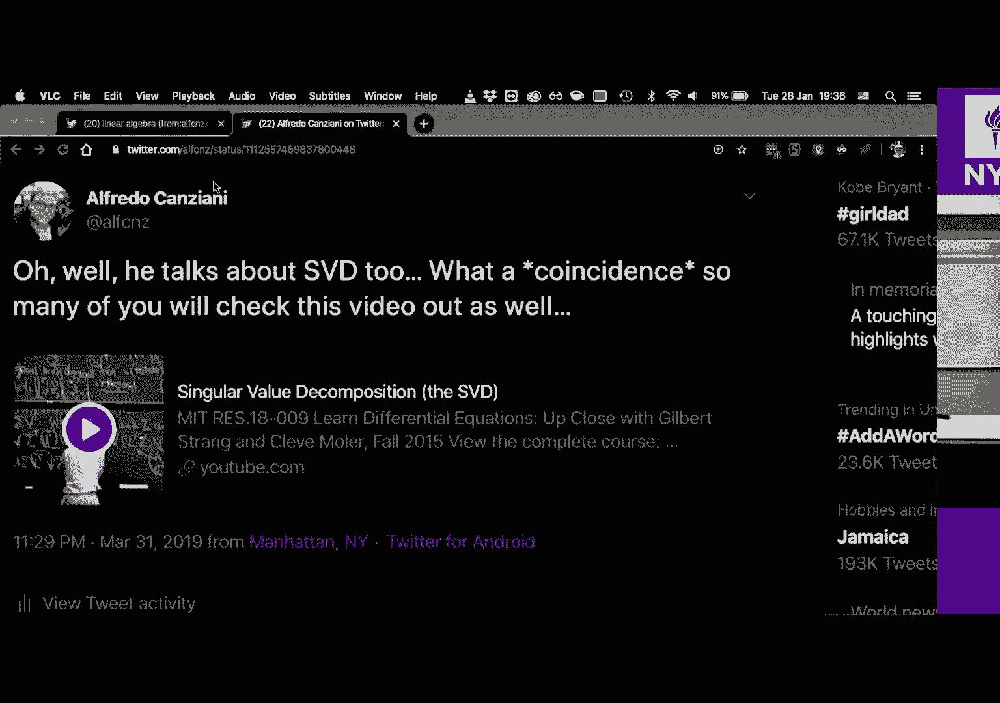

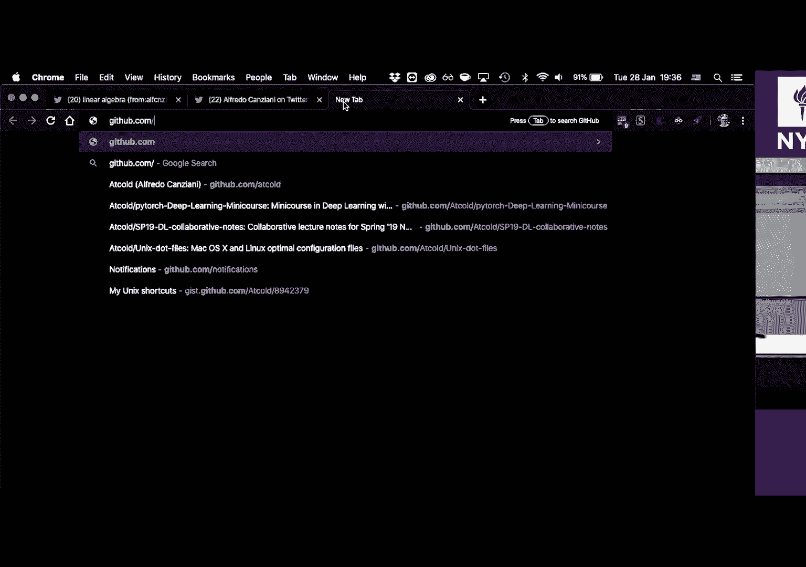

注意没事吧，起床冷静/加点冷，这样冷就可以保持奇怪的状态，我的意大利名字是阿尔弗雷多·弗雷多（Alfredo Fredo）可能意味着寒冷。

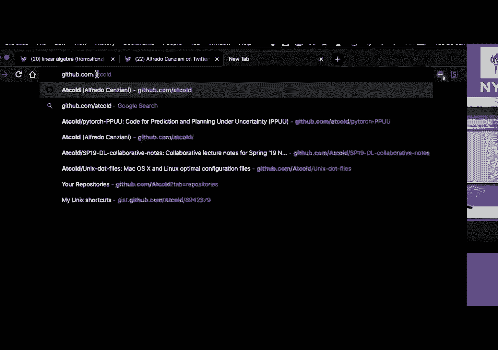

我的意大利名字是阿尔弗雷多·弗雷多（Alfredo Fredo）可能意味着寒冷，Al可以说出它的名字，以至于寒冷就像是音译，Al可以说出它的名字，以至于寒冷就像是音译，我的名字，你去那儿真冷。

这是我多么可爱，第一个和我在一起。

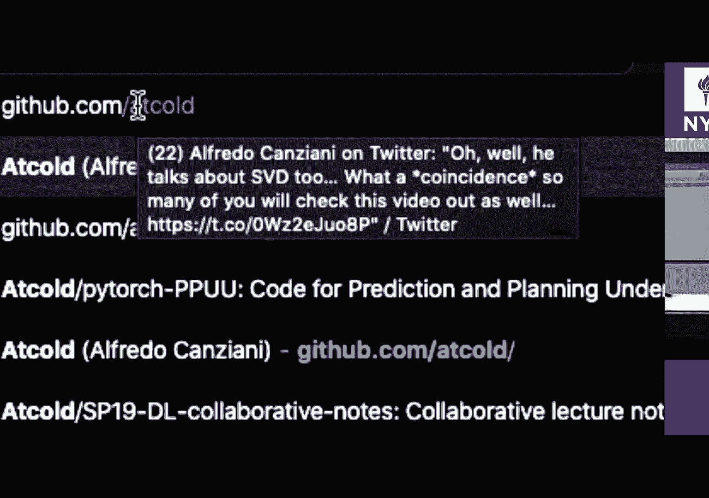

我的名字，你去那儿真冷，这是我多么可爱，第一个和我在一起，一千零三百颗星，我想你有两百颗，所以我应该，一千零三百颗星，我想你有两百颗，所以我应该，到今晚1500，这不是该课程的课程库。

到今晚1500，这不是该课程的课程库，所以如果没有的话，那你应该会成为，所以我应该像一个UNIX我，所以如果没有的话，那你应该会成为，所以我应该像一个UNIX我。

我知道我的手电筒在Windows上工作正常，或者我不使用Windows，所以我没有，我知道我的手电筒在Windows上工作正常，或者我不使用Windows，所以我没有，想法。

但是如果您使用Mac或Linux机器，则一切正常，如果，想法，但是如果您使用Mac或Linux机器，则一切正常，如果，你有一个Windows，它应该也可以正常工作，我还没有尝试过，那你怎么办。

你有一个Windows，它应该也可以正常工作，我还没有尝试过，那你怎么办，访问此内容，您将在此处访问该页面的网站，访问此内容，您将在此处访问该页面的网站，一旦我们真正做到这一点，我们将实际上正在研究。

一旦我们真正做到这一点，我们将实际上正在研究，如果我们还有时间，我们很抱歉在第二号笔记本上做了，如果我们还有时间，我们很抱歉在第二号笔记本上做了，也可以查看张量教程的一些更基本的介绍。

也可以查看张量教程的一些更基本的介绍，你们中的许多人不知道是什么numpy或numpy，无论您想称呼它为什么，你们中的许多人不知道是什么numpy或numpy，无论您想称呼它为什么，最终不要害羞。

所以我现在改变了我的问题吗，最终不要害羞，所以我现在改变了我的问题吗，上课知道有关numpy的知识，是否曾使用过它？上课知道有关numpy的知识，是否曾使用过它？你的手只是摇了摇头。

所以谁也不知道是什么麻木，你的手只是摇了摇头，所以谁也不知道是什么麻木，以及它是如何工作的，并且在您知道它发生之前从未使用过Python，以及它是如何工作的。

并且在您知道它发生之前从未使用过Python，笑吧，因为如果您不知道那还有零零，笑吧，因为如果您不知道那还有零零，在课堂上您从头实现事情，但我想太多了，在课堂上您从头实现事情，但我想太多了，回来。

所以我想第一名也许不太值得我们回顾一下，回来，所以我想第一名也许不太值得我们回顾一下，看看我们是否还有时间，基本上可以给您一些介绍，看看我们是否还有时间，基本上可以给您一些介绍。

关于如何使用基本的高扭矩例程创建张量，关于如何使用基本的高扭矩例程创建张量，基本上是放大器I中的多维数组，因此它会生成张量乘法，基本上是放大器I中的多维数组，因此它会生成张量乘法。

张量它只是初始化创建随机的东西，所以它没有什么不同，张量它只是初始化创建随机的东西，所以它没有什么不同，从numpy再次，我们可以检查出来，如果我们可以检查出来，从numpy再次，我们可以检查出来。

如果我们可以检查出来，如果我们有一些时间，否则它将像留下来一样，如果我们有一些时间，否则它将像留下来一样，分配去做这件事应该很容易温柔地介绍如何，分配去做这件事应该很容易温柔地介绍如何。

开始使用API​​可以抱怨这不哇您是害羞还是，开始使用API​​可以抱怨这不哇您是害羞还是，太好了，好吧，你没笑好吧，好吧，我在开玩笑，但你不是，太好了，好吧，你没笑好吧，好吧，我在开玩笑，但你不是。

开个玩笑很好，另一个广告是Aura这种类型的广告，或者，开个玩笑很好，另一个广告是Aura这种类型的广告，或者。

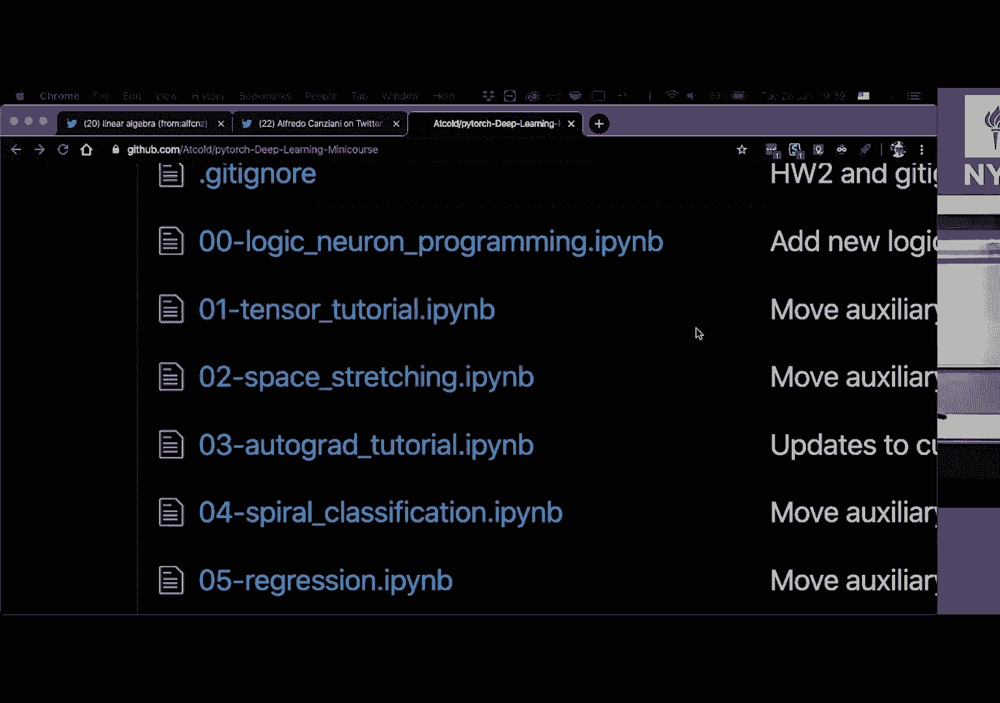

我非常喜欢的是Markdown编辑器，您可以在其中写下您的，我非常喜欢的是Markdown编辑器，您可以在其中写下您的，乳胶和降价的注释正确，因此您可以编写例如，乳胶和降价的注释正确。

因此您可以编写例如，您知道要学习的任何软arcamax，您知道要学习的任何软arcamax，关于这种方式，您可以在markdown文件中使用乳胶，关于这种方式，您可以在markdown文件中使用乳胶。

看起来很好，例如我在这里我注释文章II，我读得很好，所以这，看起来很好，例如我在这里我注释文章II，我读得很好，所以这，被称为管道或类型o RA好的，就是您知道促销，被称为管道或类型o RA好的。

就是您知道促销。

信息我没有得到报酬，所以你知道这是佛朗哥好吧，那我们怎么办，信息我没有得到报酬，所以你知道这是佛朗哥好吧，那我们怎么办，开始那里，我们打开终端，我们进行缩放，以便您可以看到一些东西。

开始那里，我们打开终端，我们进行缩放，以便您可以看到一些东西，所以我们可以例如进入内部，或者这将有所不同，例如我们，所以我们可以例如进入内部，或者这将有所不同，例如我们。

里面那个仓库图标里面的那个地方会是我的，里面那个仓库图标里面的那个地方会是我的，笔记本，然后是我的视频，还有一些视频课程，所以您将，笔记本，然后是我的视频，还有一些视频课程，所以您将。

基本上运行Conda会激活深度学习迷你课程，而一切都只是，基本上运行Conda会激活深度学习迷你课程，而一切都只是，如果已安装并且已按照自述文件中的说明进行操作。

如果已安装并且已按照自述文件中的说明进行操作，好吧，现在就输入ipython，好吧，现在就输入ipython，与pylab的ipython打开它，你可以做进口火炬例如只是为了看看。

与pylab的ipython打开它，你可以做进口火炬例如只是为了看看，是否一切正常，然后您可以输入例如火炬点R和，是否一切正常，然后您可以输入例如火炬点R和，五，这将要输入创建一个具有五个数字的张量。

五，这将要输入创建一个具有五个数字的张量，是从零到一个均匀分布随机选择的，所以这是，是从零到一个均匀分布随机选择的，所以这是，只是为了检查一切是否正常，如果可以正常工作，那么我们可以。

只是为了检查一切是否正常，如果可以正常工作，那么我们可以，开始玩笔记本电脑，您不是那种人，我是说您可以尝试，开始玩笔记本电脑，您不是那种人，我是说您可以尝试，跟着计算机一起上课。

但我宁愿我认为这对您来说更好，跟着计算机一起上课，但我宁愿我认为这对您来说更好，真正跟随我在这里做什么你知道我是一个小丑，真正跟随我在这里做什么你知道我是一个小丑，如果与计算机隔离开来，也许有时。

如果与计算机隔离开来，也许有时，丢掉我给你的一些金块，看起来就像是一切，丢掉我给你的一些金块，看起来就像是一切，在这里工作，所以我要打开。

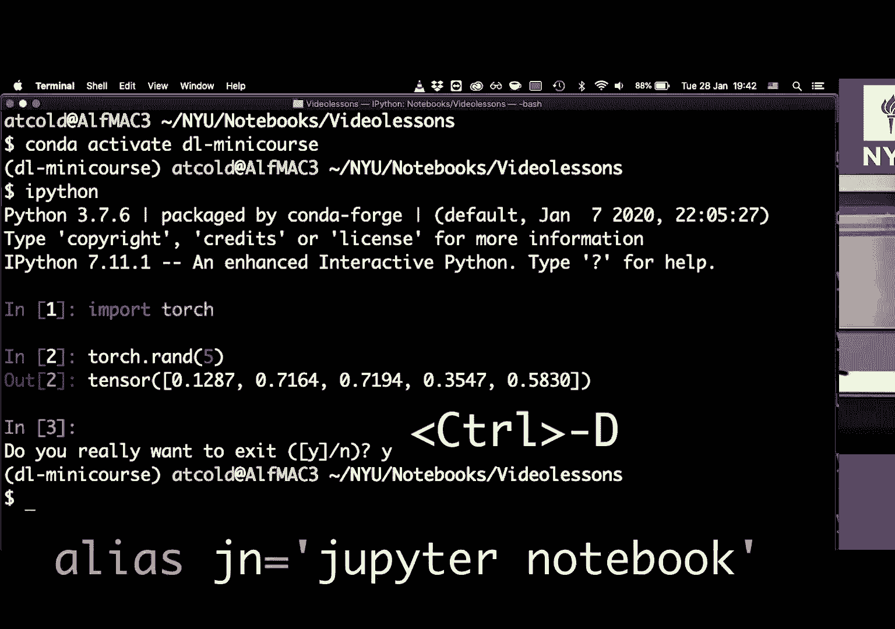

在这里工作，所以我要打开，木星笔记本和东西都是黑色的，因为我这样喜欢它们，是的，黑色。

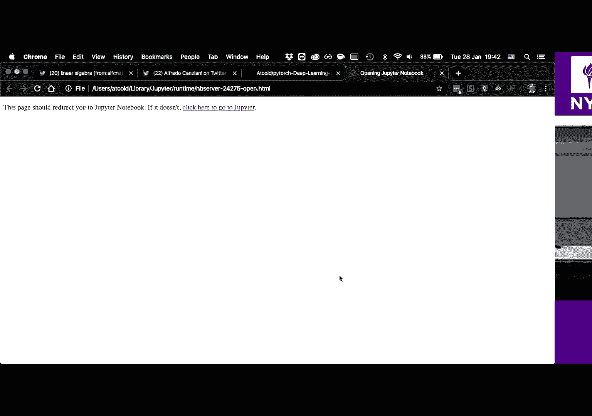

木星笔记本和东西都是黑色的，因为我这样喜欢它们，是的，黑色，很好，所以我们要看到这个随机投影开始了，是的，很好，所以我们要看到这个随机投影开始了，是的。

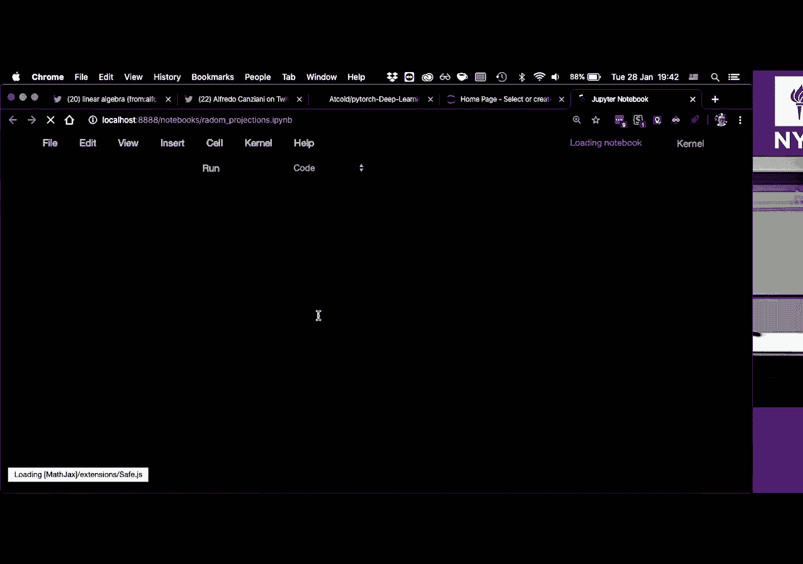

我让我全屏观看，如果您看不到东西，应该抱怨，我让我全屏观看，如果您看不到东西，应该抱怨，对，我有点知道你看到了什么，不知道你看到了什么，对，我有点知道你看到了什么，不知道你看到了什么，没有看到。

但是如果您实时提供反馈，就像我什么也看不懂。

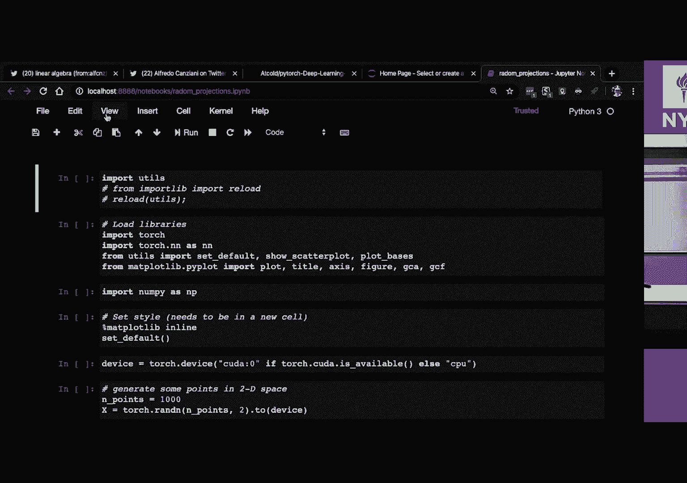

没有看到，但是如果您实时提供反馈，就像我什么也看不懂，你关掉灯也很有用，所以要打断我，你关掉灯也很有用，所以要打断我，跟我说话，你知道他还好吗，是的，不，谢谢。

跟我说话，你知道他还好吗，是的，不，谢谢。

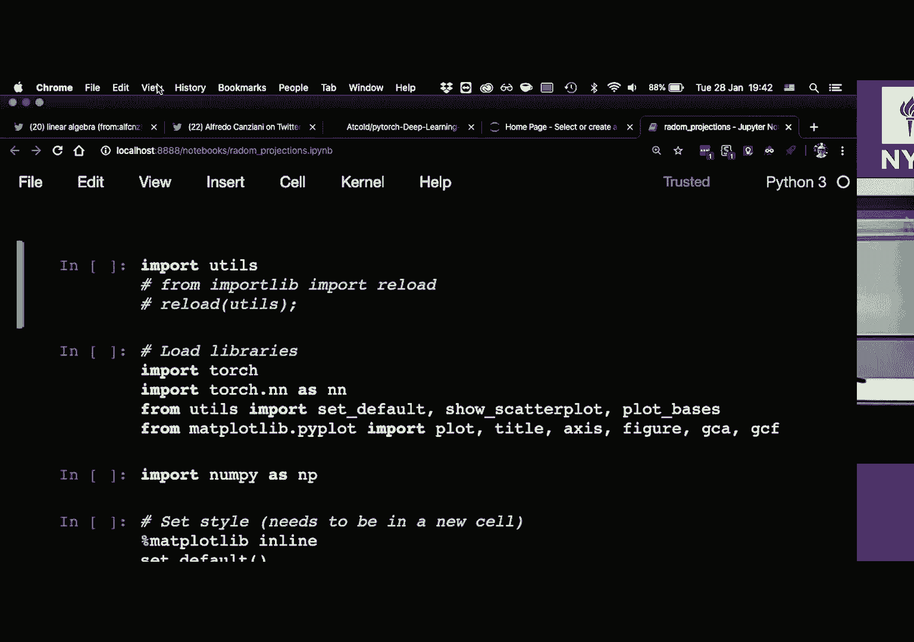

好吧，让我关闭该功能-好吧，所以我在这里我就是我要做的，好吧，让我关闭该功能-好吧，所以我在这里我就是我要做的，在这里，我将导入一些我发现的用于绘图的实用程序，然后，在这里。

我将导入一些我发现的用于绘图的实用程序，然后，在这里，我只是导入火炬，然后从火炬导入这个NN库，在这里，我只是导入火炬，然后从火炬导入这个NN库，只是我要导入矩阵乘法和我们的加法。

只是我要导入矩阵乘法和我们的加法，向量好，所以矩阵乘法将是线性运算加上，向量好，所以矩阵乘法将是线性运算加上，偏见，但加上翻译，我们有仿射变换，即，偏见，但加上翻译，我们有仿射变换，即。

我们正在讨论五个不同的转换，然后，我们正在讨论五个不同的转换，然后，重要的是，我猜还有一些非线性函数，重要的是，我猜还有一些非线性函数，从applet导入留下那些东西用于绘图，我也很重要。

从applet导入留下那些东西用于绘图，我也很重要。管道是PI上的NP非松树，我不知道它是numpy数字还是孟买。

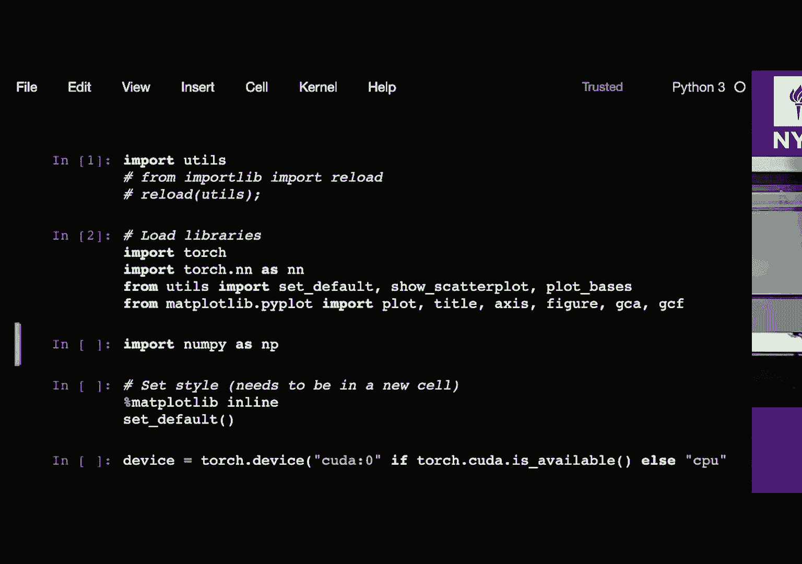

管道是PI上的NP非松树，我不知道它是numpy数字还是孟买。

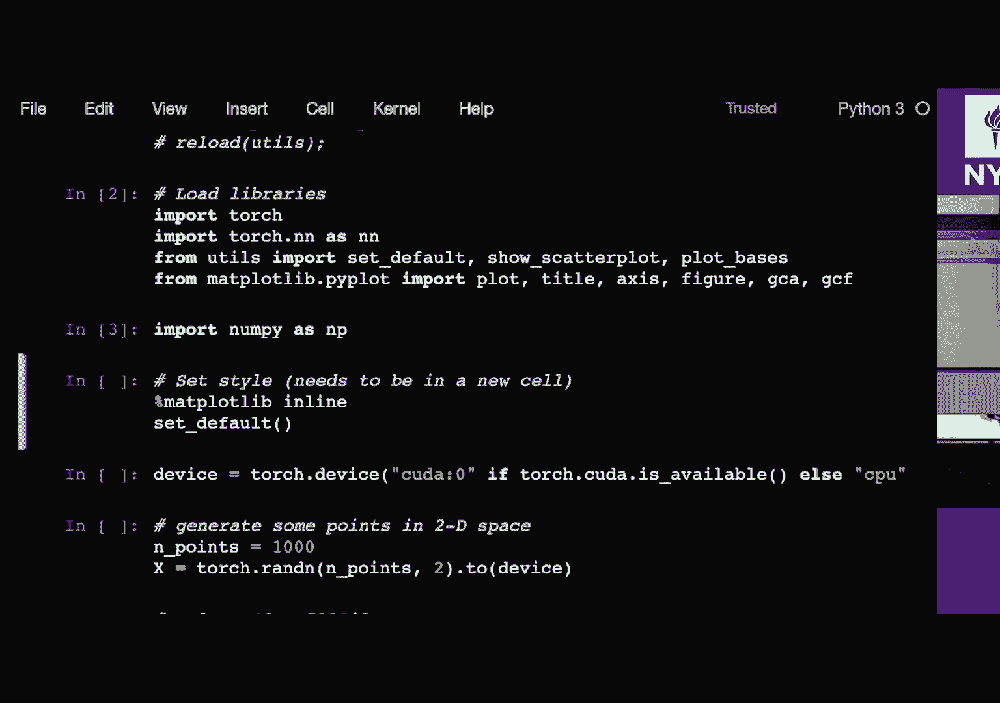

无论如何，数字人抱怨原子，所以我使用一些默认的东西，无论如何，数字人抱怨原子，所以我使用一些默认的东西。

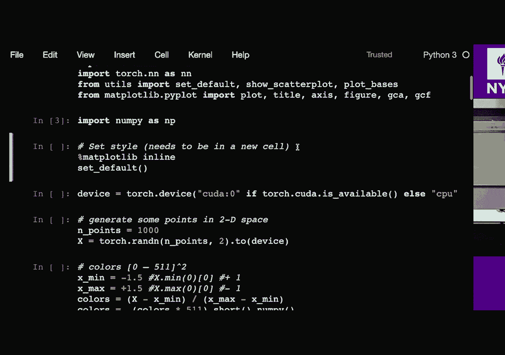

好吧，这是第一行火炬线，所以这将成为设备，好吧，这是第一行火炬线，所以这将成为设备，等于割炬点设备CUDA（如果CUDA可用），否则为0，否则CPU是什么？等于割炬点设备CUDA（如果CUDA可用）。

否则为0，否则CPU是什么？我正在自动具有GPU的计算机上的芯片上运行这些示例，我正在自动具有GPU的计算机上的芯片上运行这些示例，门廊将在GPU内存上运行，因此您的计算机具有。

门廊将在GPU内存上运行，因此您的计算机具有，一个仅顺序执行一个接一个的CPU，一个仅顺序执行一个接一个的CPU，发霉可能非常非常非常快，但它依旧顺序排列，就像您的，发霉可能非常非常非常快。

但它依旧顺序排列，就像您的，大脑一次只能做一件事，大脑一次只能做一件事，如果您尝试开车，吸烟和放克，请打个电话，是的，您可能不会，如果您尝试开车，吸烟和放克，请打个电话，是的，您可能不会，明天在这里。

所以您一次只能做一件事，明天在这里，所以您一次只能做一件事，对，就像计算机的CPU，然后您有一些本地计算机，对，就像计算机的CPU，然后您有一些本地计算机，作为主存储器的存储器称为RAM随机存取存储器。

作为主存储器的存储器称为RAM随机存取存储器，另一方面，如果您想加快速度，可以使用，另一方面，如果您想加快速度，可以使用，慢得多的GPU（称为GPU），为什么要使用比，慢得多的GPU（称为GPU）。

为什么要使用比，一个CPU来加快您的计算速度，因为它非常非常，一个CPU来加快您的计算速度，因为它非常非常，速度较慢，它可以同时执行许多很多其他的计算，速度较慢，它可以同时执行许多很多其他的计算，因此。

如果CPU就像从一侧快速运行到，因此，如果CPU就像从一侧快速运行到，另一个会击败您的GPU很多次，但是GPU确实可以，另一个会击败您的GPU很多次，但是GPU确实可以，好吧。

因此GPU将有一个称为设备内存的内存，好吧，因此GPU将有一个称为设备内存的内存，我认为它们现在生活在GPU上，他们正计划访问，我认为它们现在生活在GPU上，他们正计划访问。

我认为GPU正在处理CPU中来自CPU的主内存，我认为GPU正在处理CPU中来自CPU的主内存，认为仍未解决，如果您使用GPU，则必须创建自己的，认为仍未解决，如果您使用GPU，则必须创建自己的。

吉普车中的张量可以在GPU内存中维护，但不必，吉普车中的张量可以在GPU内存中维护，但不必，只要您在开始时在那边指定那个东西就担心，只要您在开始时在那边指定那个东西就担心，您的代码，我的火炬会小心处理。

并将您的张量放在正确的位置，您的代码，我的火炬会小心处理，并将您的张量放在正确的位置，您将要使用ATP的位置，您就是张量处理单元，您将要使用ATP的位置，您就是张量处理单元。

同样来自Google的pi火炬将张量放到顶端，同样来自Google的pi火炬将张量放到顶端，q接近实际处理单元的内存，q接近实际处理单元的内存，使您知道的运算速度更快，所以这是一个愚蠢的单例。

使您知道的运算速度更快，所以这是一个愚蠢的单例，行，但是很重要，关于PI火炬材料，您将在期中考试中再次进行测试是，关于PI火炬材料，您将在期中考试中再次进行测试是，将主要是关于数学的，这项研究对于实际。

将主要是关于数学的，这项研究对于实际，设法在最终项目中取得成功，所以，如果您想击败其他人，设法在最终项目中取得成功，所以，如果您想击败其他人，在使用CPU而在使用GPU的时候，您知道好运，是的。

在使用CPU而在使用GPU的时候，您知道好运，是的。

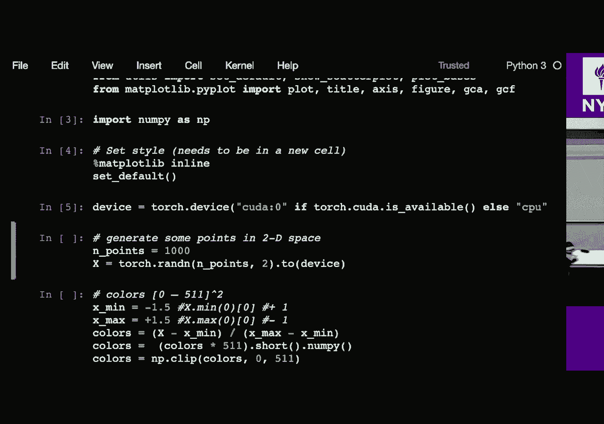

具有讽刺意味的是，但你知道人们尝试过然后抱怨，然后我不想。

具有讽刺意味的是，但你知道人们尝试过然后抱怨，然后我不想，抱怨好吧，所以我们在这里创造了1000分，实际上，抱怨好吧，所以我们在这里创造了1000分，实际上，这个一好，所以一个下划线零零零等于一千。

这个一好，所以一个下划线零零零等于一千，但是最好阅读，所以在这里我有1，000分，我的X大写X是，但是最好阅读，所以在这里我有1，000分，我的X大写X是，将成为我的设计矩阵，它将有1，000行和两列。

将成为我的设计矩阵，它将有1，000行和两列，它是从我们的随机分布和分布中取样的，所以如果您去这里，请按，它是从我们的随机分布和分布中取样的，所以如果您去这里，请按，Shift标签页，您将要打开此文件。

然后单击此处。

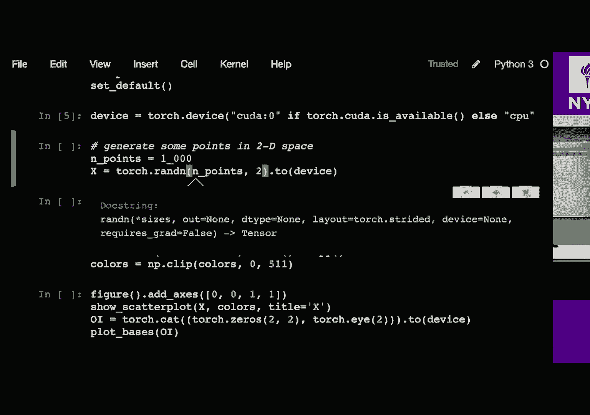

Shift标签页，您将要打开此文件，然后单击此处，你会看到正确的东西，所以R和R最终会是，你会看到正确的东西，所以R和R最终会是，能够将正态分布中具有随机数的张量场变为。

能够将正态分布中具有随机数的张量场变为，均值0和方差1也称为标准正态分布，均值0和方差1也称为标准正态分布，我打开帮助了吗？您知道这些东西您曾经使用过笔记本吗，我打开帮助了吗？

您知道这些东西您曾经使用过笔记本吗，您是第一次看到此帮助之前，您知道其中一些人可能已经看到，您是第一次看到此帮助之前，您知道其中一些人可能已经看到，这是第一次好，那么这些资本X的样子如何。

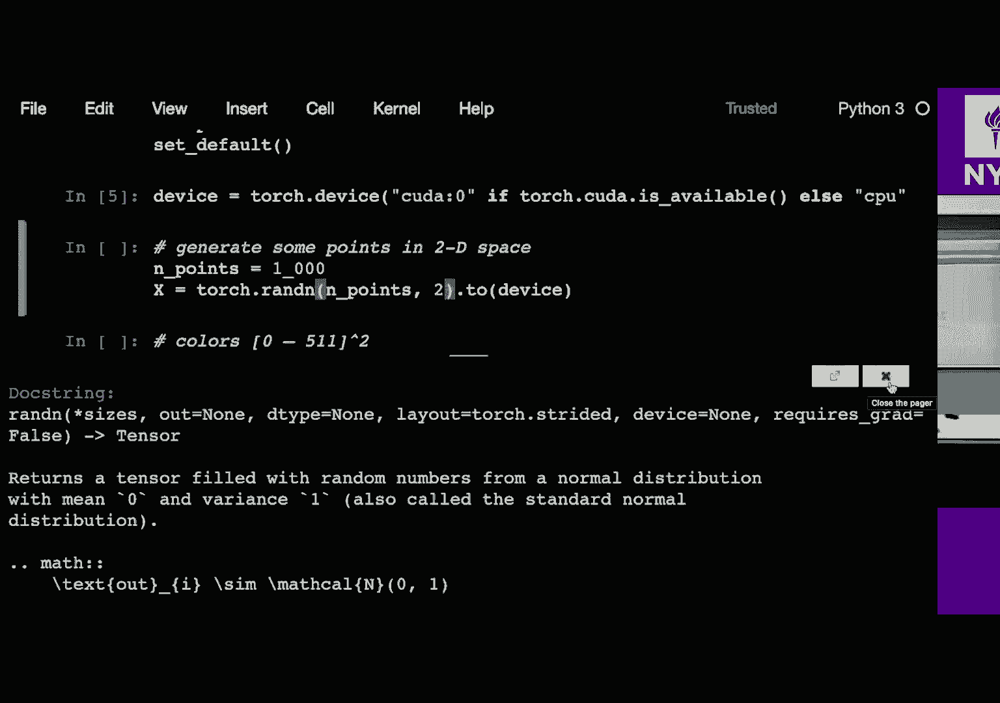

这是第一次好，那么这些资本X的样子如何，这些要点是什么？您对此点的期望是什么，这些要点是什么？您对此点的期望是什么，你应该互动，小值接近零好吧，所以你将有一个点云是什么，小值接近零好吧。

所以你将有一个点云是什么，将是你的云的半径，我不只是说一次，因为我不喜欢要发行的发行版，我不只是说一次，因为我不喜欢要发行的发行版，像一堆点，基本上会以某种方式循环，像一堆点，基本上会以某种方式循环。

分布我想知道这个斑点1/2的平均半径是多少，分布我想知道这个斑点1/2的平均半径是多少，战争或多或少为零平均值，因此您可以期望平方，战争或多或少为零平均值，因此您可以期望平方，期望值的X平方的右平方根。

期望值的X平方的右平方根，平方和的平方根的期望值，好的，有人，平方和的平方根的期望值，好的，有人，说1/2酷家伙再一次击败第二或那一秒，所以你有，说1/2酷家伙再一次击败第二或那一秒，所以你有。

标准偏差将为1，所以您会得到超出，标准偏差将为1，所以您会得到超出，标准偏差与否，您知道钟形曲线正确在哪里，标准偏差与否，您知道钟形曲线正确在哪里，靠近中心的标准偏差比远离中心大多少。

靠近中心的标准偏差比远离中心大多少，标准差是响铃，可以大致尝试猜测只是拍摄数字，标准差是响铃，可以大致尝试猜测只是拍摄数字，没关系，我还不判断你，不，你太害羞了，好，我的学生答案在哪里，没关系。

我还不判断你，不，你太害羞了，好，我的学生答案在哪里，我找不到你很好，不好，我们去了。

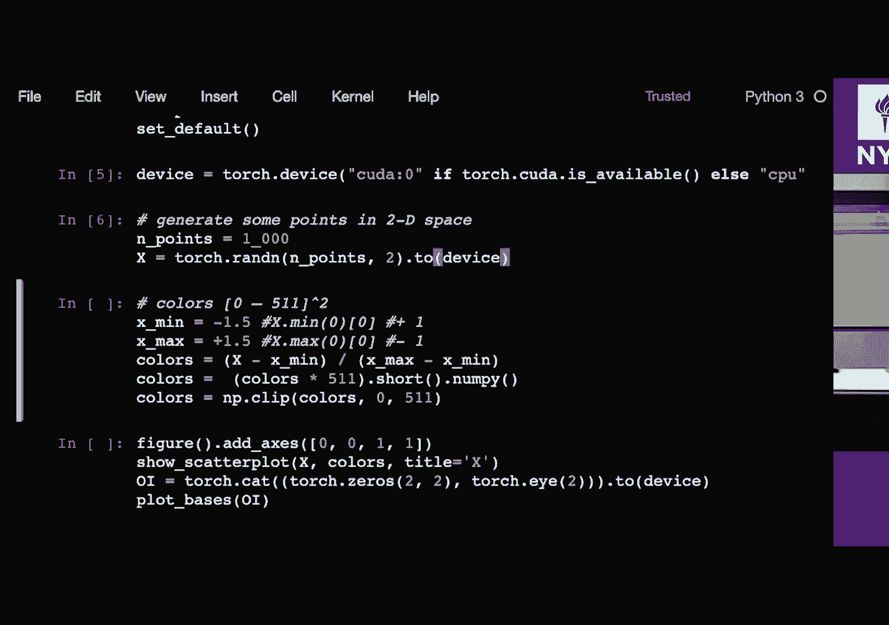

我找不到你很好，不好，我们去了，这东西是什么，很可爱我知道你能看到让我放下的东西吗，这东西是什么，很可爱我知道你能看到让我放下的东西吗，没关系，只要有埃里克在场的人，我都会降低灯光，没关系。

只要有埃里克在场的人，我都会降低灯光，录音会抱怨，但是，好吧，我还是不知道该如何关闭第一件事，好吧，我还是不知道该如何关闭第一件事，那里的红色和绿色箭头是什么，你能猜对吗，我。

那里的红色和绿色箭头是什么，你能猜对吗，我，别咬你，斧头太棒了，哪个轴是什么，别咬你，斧头太棒了，哪个轴是什么，这些东西的长度需要正确，所以这些是单位向量，这些东西的长度需要正确，所以这些是单位向量。

Y y1是红色，另一个是绿色，好吧，奇妙的是X是X，好吧，奇妙的是X是X，红色的原因是因为您具有RGB，而正确的原因是您已经拍摄了一些，红色的原因是因为您具有RGB，而正确的原因是您已经拍摄了一些。

在此之前的图形，因此R将永远是正确的，它将永远是，在此之前的图形，因此R将永远是正确的，它将永远是，x轴绿色永远是y轴，x轴绿色永远是y轴，这些是单位向量，因此这点云大致花费了，这些是单位向量。

因此这点云大致花费了，是这里的平均半径，您能猜到大概三个吗，是这里的平均半径，您能猜到大概三个吗，太棒了，这是一个好的答案，所以您的点云大约很大，太棒了，这是一个好的答案，所以您的点云大约很大。

三权一律均匀地循环分布，三权一律均匀地循环分布，雨有点凉，所以我们现在要跑步。

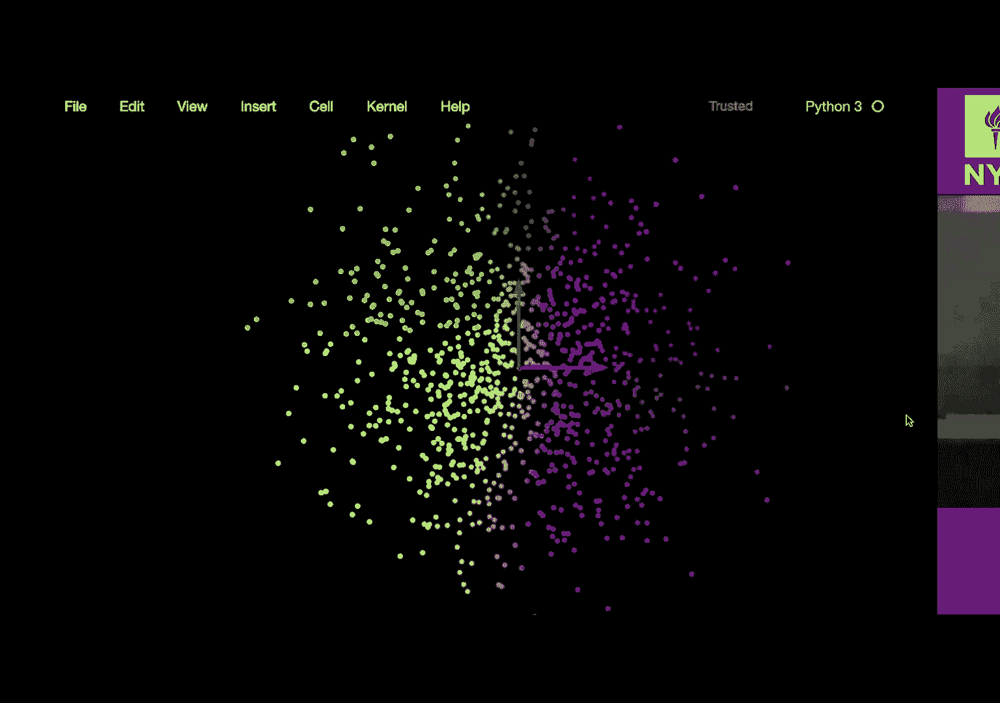

雨有点凉，所以我们现在要跑步，您可以尝试像这样的箭头在这里放一个箭头在这里再放一个箭头，您可以尝试像这样的箭头在这里放一个箭头在这里再放一个箭头，你那里有三个箭头好吧或多或少我是物理学家，是的。

你那里有三个箭头好吧或多或少我是物理学家，是的，以后我将成为仪师，现在我是数学家，所以意识到你知道，以后我将成为仪师，现在我是数学家，所以意识到你知道，转换参见此处，我再次计算SVD奇异值分解。

转换参见此处，我再次计算SVD奇异值分解，有我之前指出的视频，所以我要乘这个。

有我之前指出的视频，所以我要乘这个，点云由矩阵组成，那么矩阵对这些圆形斑点有什么作用。

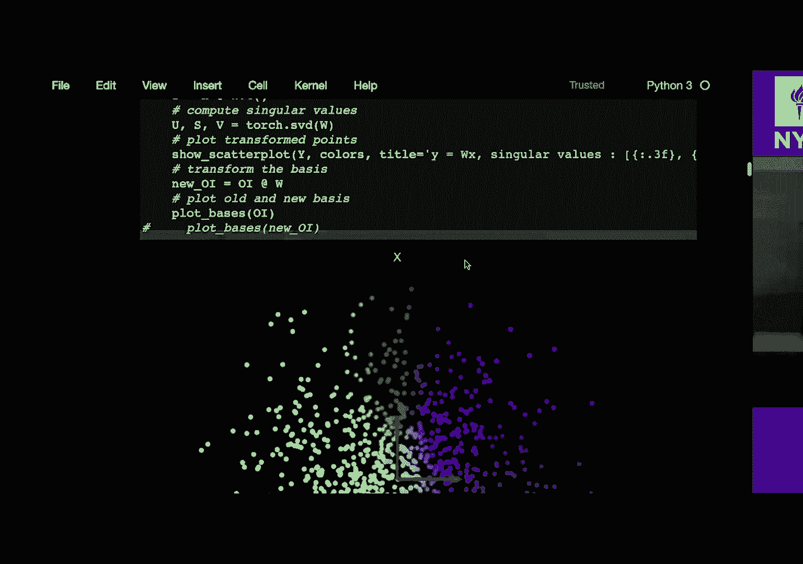

点云由矩阵组成，那么矩阵对这些圆形斑点有什么作用，来吧，你知道这玩意儿，到目前为止你会重复三遍，来吧，你知道这玩意儿，到目前为止你会重复三遍，希望在这里看到你有一个圈子，你以后希望看到什么。

希望在这里看到你有一个圈子，你以后希望看到什么，马铃薯是正确的，所以首先是马铃薯，这是非常压碎的马铃薯，为什么他，马铃薯是正确的，所以首先是马铃薯，这是非常压碎的马铃薯，为什么他。

在这里发生了什么在y方向发生了什么，在这里发生了什么在y方向发生了什么，好吧，这个矩阵怎么样呢，它是一个可爱的矩阵，旋转矩阵是，好吧，这个矩阵怎么样呢，它是一个可爱的矩阵，旋转矩阵是，烦人的矩阵。

特征值是多少奇异值看起来在这里看一个奇异值，特征值是多少奇异值看起来在这里看一个奇异值，几乎接近于0，所以这是我们几乎奇异的矩阵，所以这是，几乎接近于0，所以这是我们几乎奇异的矩阵，所以这是。

发生了什么事，它会杀死一个维度，而这个维度还没有杀死它，发生了什么事，它会杀死一个维度，而这个维度还没有杀死它，但基本上，您拥有对角线的尺寸，但基本上，您拥有对角线的尺寸，奇异值分解表示您在。

奇异值分解表示您在，不同的方向，然后前两个矩阵第一个和最后一个，不同的方向，然后前两个矩阵第一个和最后一个，代表这些指标适用于其他指标的轮换，代表这些指标适用于其他指标的轮换，一个方向上的因数为2。

另一个方向上的因数为零，所以您得到，一个方向上的因数为2，另一个方向上的因数为零，所以您得到，这东西在这里哦，别的坚持了，所以这里有蓝绿色黄色，这东西在这里哦，别的坚持了，所以这里有蓝绿色黄色，红色对。

所以我们我们的G单独不，这里没有订单，我们有蓝色绿色黄色，红色对，所以我们我们的G单独不，这里没有订单，我们有蓝色绿色黄色，红色，然后这里是蓝色红色黄色绿色所以这里发生了什么，红色。

然后这里是蓝色红色黄色绿色所以这里发生了什么，行列式否定的原因是什么，为什么，因为您的反思是，行列式否定的原因是什么，为什么，因为您的反思是，纠正好吧，我会继续前进，你可以看到，纠正好吧，我会继续前进。

你可以看到，这里有不同的东西，所以您这里有更多土豆，这实际上是，这里有不同的东西，所以您这里有更多土豆，这实际上是，放大很多，你只有一点三这也有点放大，放大很多，你只有一点三这也有点放大，好吧。

这个人什么也没做好吧，无聊吧，好吧，这是怎么回事，好吧，这个人什么也没做好吧，无聊吧，好吧，这是怎么回事，这些指标怎么会是奇异的，几乎您可以看到，这些指标怎么会是奇异的，几乎您可以看到。

一个奇异值将是零点零，三个它很小，一个奇异值将是零点零，三个它很小，看到这些是单位向量，这里有很大的箭头，这意味着，看到这些是单位向量，这里有很大的箭头，这意味着，向右挤压，第一个是0 6。

另一个是0 0 3，因此您可以，向右挤压，第一个是0 6，另一个是0 0 3，因此您可以，基本上在这里几乎杀死了一个尺寸，依此类推，所以没什么，基本上在这里几乎杀死了一个尺寸，依此类推，所以没什么。

无论如何，现在您可以使用PI Torch进行相同的操作，所以这可以，无论如何，现在您可以使用PI Torch进行相同的操作，所以这可以。

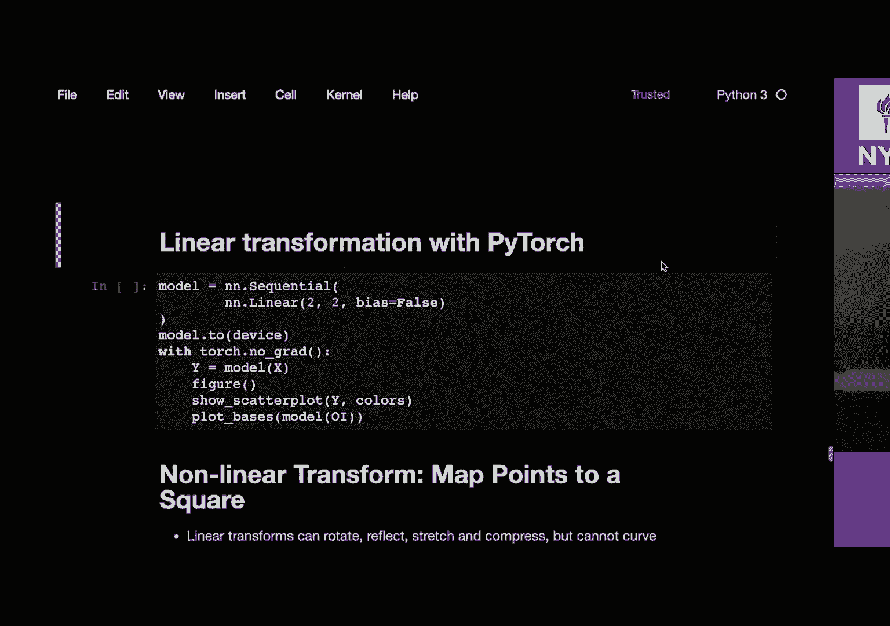

您将被告知有关pi火炬的第一条说明，所以我在这里做模型是，您将被告知有关pi火炬的第一条说明，所以我在这里做模型是，将是一个顺序的，基本上是一个容器，我可以在其中放置一个，将是一个顺序的。

基本上是一个容器，我可以在其中放置一个，几个接一个的模块，而我的第一个模块将是NN，几个接一个的模块，而我的第一个模块将是NN，线性意味着什么，然后线性意味着不意味着线性，线性意味着什么。

然后线性意味着不意味着线性，转型，因为这些人是客座程序员，所以您知道他们没有，转型，因为这些人是客座程序员，所以您知道他们没有，知道我猜这是仿射变换，但实际上是，知道我猜这是仿射变换，但实际上是。

线性变换，因为我说偏差等于错误，所以这是，线性变换，因为我说偏差等于错误，所以这是，实际上只是一个矩阵乘法，所以它是线性变换，实际上只是一个矩阵乘法，所以它是线性变换，从0到0，然后对设备进行建模。

然后将模型运送到GPU的内存。

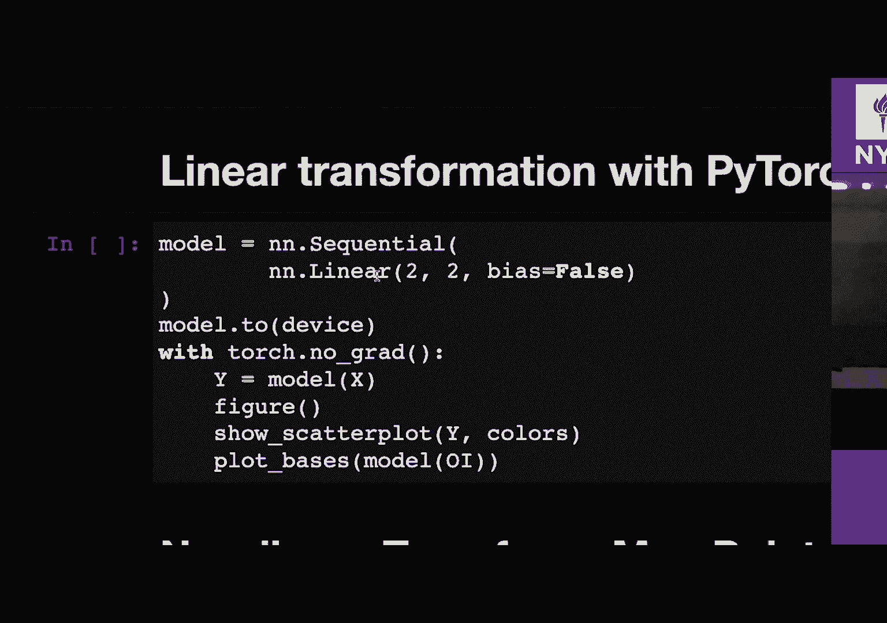

从0到0，然后对设备进行建模，然后将模型运送到GPU的内存，然后我删除下周您要弄清楚的渐变，然后我删除下周您要弄清楚的渐变，是我要赌到这里我的Y是我要输出的模型的输出。

是我要赌到这里我的Y是我要输出的模型的输出，输入X，然后生成图并绘制图形，以便显示。

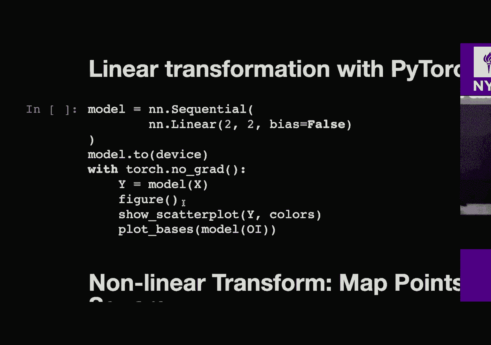

输入X，然后生成图并绘制图形，以便显示，您还可以通过饼图旅行获得奇异矩阵，您还可以通过饼图旅行获得奇异矩阵，这不，没意思吧，我是说你可以看到，这不，没意思吧，我是说你可以看到。

您可以使用PI Torch包将数据乘以矩阵矩阵，因此我们，您可以使用PI Torch包将数据乘以矩阵矩阵，因此我们。

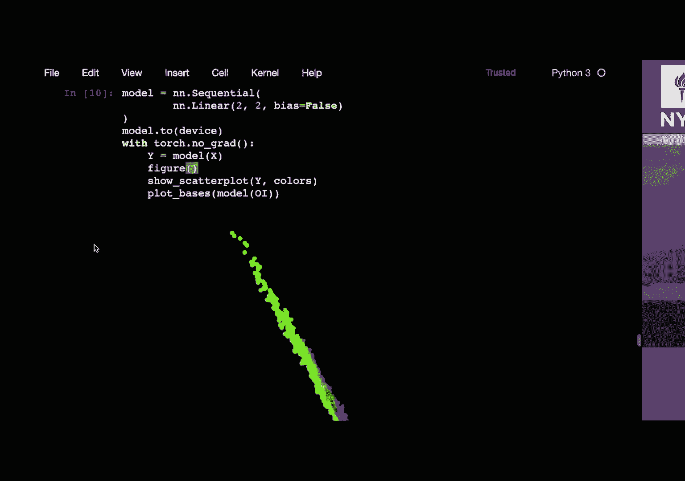

必须创建一个模型顺序容器，我们将其放入线性，必须创建一个模型顺序容器，我们将其放入线性。

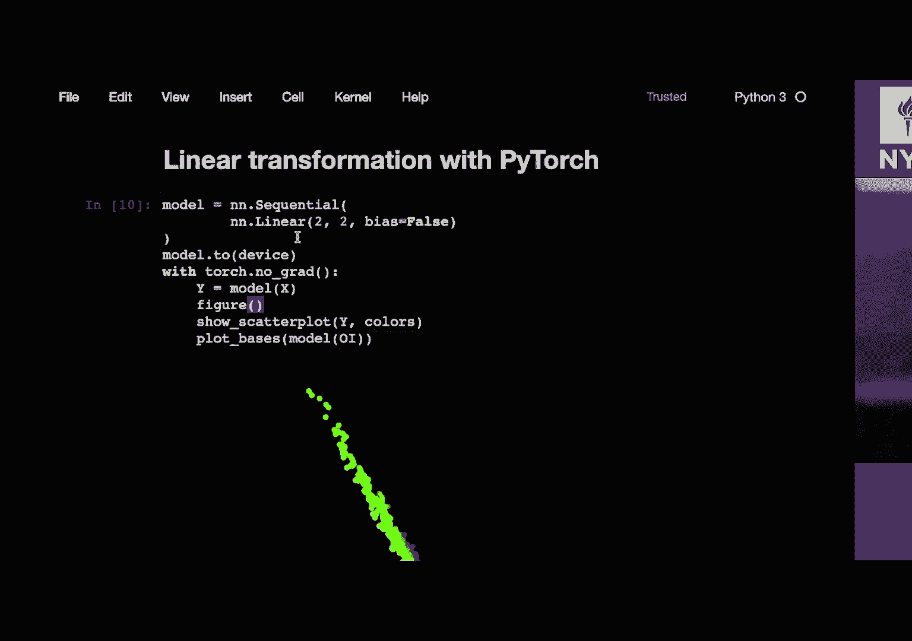

模块，我们消除了翻译的偏见，您明白了为什么，模块，我们消除了翻译的偏见，您明白了为什么，我是否删除了翻译，因为否则我必须先获取它，然后翻译，我是否删除了翻译，因为否则我必须先获取它，然后翻译，在屏幕外。

所以我将其保持在中央好吧，让我们拥有这个，在屏幕外，所以我将其保持在中央好吧，让我们拥有这个。

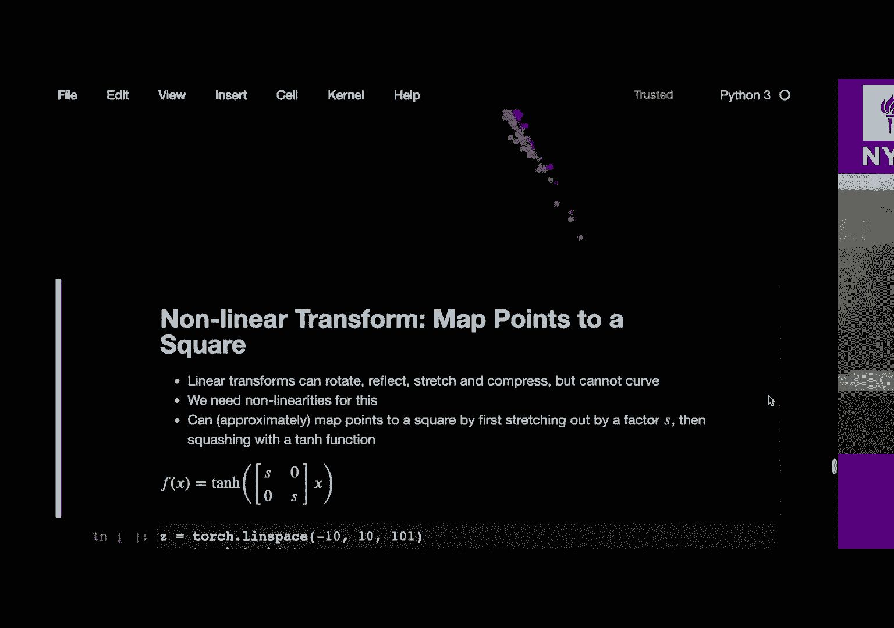

所以现在我将只使用以下内容，我只使用一个矩阵，所以现在我将只使用以下内容，我只使用一个矩阵，认为我没有选择卷曲，不然它将是身份矩阵，认为我没有选择卷曲，不然它将是身份矩阵。

对角线中的项目由相同的项目由相同的值，然后我将。

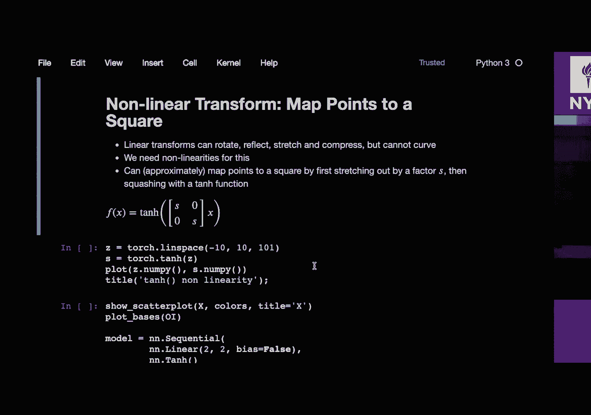

对角线中的项目由相同的项目由相同的值，然后我将，非线性函数，所以我的非线性函数如下。

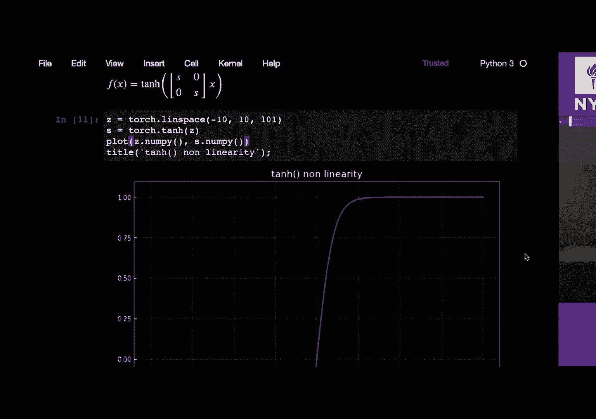

非线性函数，所以我的非线性函数如下，一个双曲线正切值，当您越过负2。5时大约变为负1，一个双曲线正切值，当您越过负2。5时大约变为负1，在底部，当您越过时，放置权将大致归一，在底部，当您越过时。

放置权将大致归一，再加上2。5好的，所以这个东西映射了整个实际穿的衣服，所以，再加上2。5好的，所以这个东西映射了整个实际穿的衣服，所以，加无穷大为1，减无穷大直到达到，加无穷大为1，减无穷大直到达到。

线性区域大约为负两点五到两点五，线性区域大约为负两点五到两点五，在这些数字中提及这个名字，因为有时候你会把你的名字，在这些数字中提及这个名字，因为有时候你会把你的名字，模型内部的鼻子不是训练。

而您仍然想弄清楚，模型内部的鼻子不是训练，而您仍然想弄清楚，在数量级上，您知道数字的大概，在数量级上，您知道数字的大概，与这些非线性的纽结相关联，所以我只创建，与这些非线性的纽结相关联，所以我只创建。

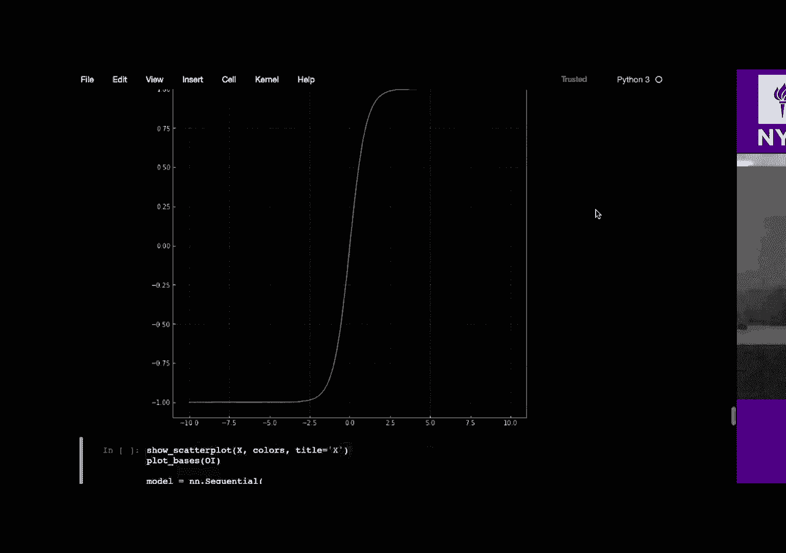

这跟我之前给你看的东西非常相似，这跟我之前给你看的东西非常相似。

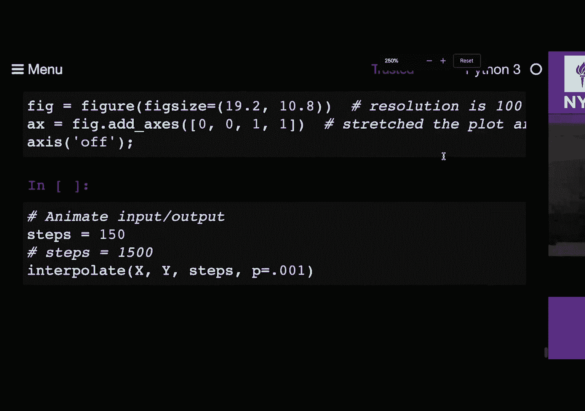

在这里有它的位置，所以在这里我有我的顺序，即，在这里有它的位置，所以在这里我有我的顺序，即，操作中，我首先使用矩阵，所以线性到两个，然后应用吨位，操作中，我首先使用矩阵，所以线性到两个，然后应用吨位。

然后我增加了对角矩阵的乘数，然后我增加了对角矩阵的乘数。

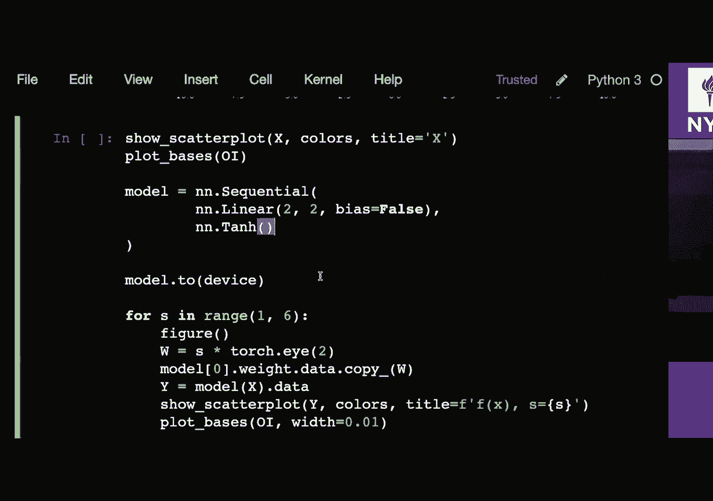

那就是你得到的，所以这就是我的云，你期望看到我的云，所以，那就是你得到的，所以这就是我的云，你期望看到我的云，所以，我们说的这个云的范围是多少，大概是从负3到，我们说的这个云的范围是多少。

大概是从负3到，再加上3对，扭结在哪里发生，因此，在这两个五点减去两个五点两个二加之外的所有内容，因此，在这两个五点减去两个五点两个二加之外的所有内容，两点五框将被映射为一个留在里面的东西。

两点五框将被映射为一个留在里面的东西，大致相同，这是正确的，因此您希望在此图像后看到什么，大致相同，这是正确的，因此您希望在此图像后看到什么，在这里，您希望收件箱中有您的数据，但是什么是，在这里。

您希望收件箱中有您的数据，但是什么是，确定是这个盒子的大小吗，确定是这个盒子的大小吗，所以建议是从负二点五到二点五，所以建议是从负二点五到二点五，盒子将是2减1 2加1所以减1减1我是说所有盒子。

盒子将是2减1 2加1所以减1减1我是说所有盒子，从负1到正1，然后里面的点，从负1到正1，然后里面的点，根据我们之前提到的映射进行映射，根据我们之前提到的映射进行映射，负两点五到二点五被线性压缩。

然后，负两点五到二点五被线性压缩，然后，两点五号以外的东西将被压缩到，两点五号以外的东西将被压缩到，基本上这个盒子的边缘好吗，你准备好看看如何装箱普通，基本上这个盒子的边缘好吗。

你准备好看看如何装箱普通，分布你兴奋吗，好两个人，分布你兴奋吗，好两个人，只是说我的意思是我们很兴奋来吧，请给我一些满足感吧，只是说我的意思是我们很兴奋来吧，请给我一些满足感吧，你不跟我玩，好吧。

我明白我在努力对你好，你不跟我玩，好吧，我明白我在努力对你好，哦，至少谢谢您的工作正常，所以这是第一个，所以在这种情况下，哦，至少谢谢您的工作正常，所以这是第一个，所以在这种情况下，在这里。

我只向您展示我的身份矩阵，我什么也没做，在这里，我只向您展示我的身份矩阵，我什么也没做，事物看起来是什么样的分布，这是什么意思，事物看起来是什么样的分布，这是什么意思，看起来像加油吗。

哦是减号1到加号之间的一种统一形式，看起来像加油吗，哦是减号1到加号之间的一种统一形式，如果我开始做一点工作，那么2d中的1幻境现在会发生什么，如果我开始做一点工作，那么2d中的1幻境现在会发生什么。

开始相乘而不是有单位矩阵现在我有2 2，开始相乘而不是有单位矩阵现在我有2 2，矩阵或3 3或4 455点再次将进一步，矩阵或3 3或4 455点再次将进一步，边缘，所以您将看到这些以及这些以及这些。

最后这个，边缘，所以您将看到这些以及这些以及这些，最后这个，哦，库诺，所以在这里，我们遇到了我们的云，就像循环进入，哦，库诺，所以在这里，我们遇到了我们的云，就像循环进入，这种四四方方的东西。

现在这些小问题非常非常好，这种四四方方的东西，现在这些小问题非常非常好，分散开来，所以您实际上可以告诉他们是否分开，例如，分散开来，所以您实际上可以告诉他们是否分开，例如。

最后在最后一分钟对东西进行分类，然后我就让你走了。

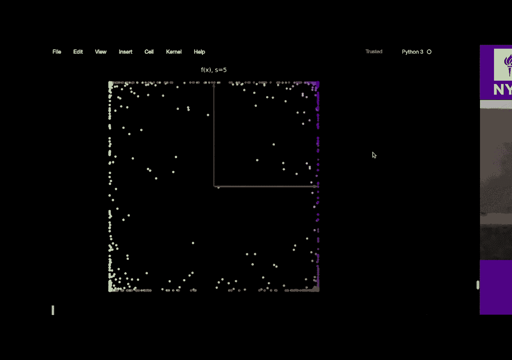

最后在最后一分钟对东西进行分类，然后我就让你走了，使用随机矩阵，但是以这种方式，所以在这里我要按顺序。

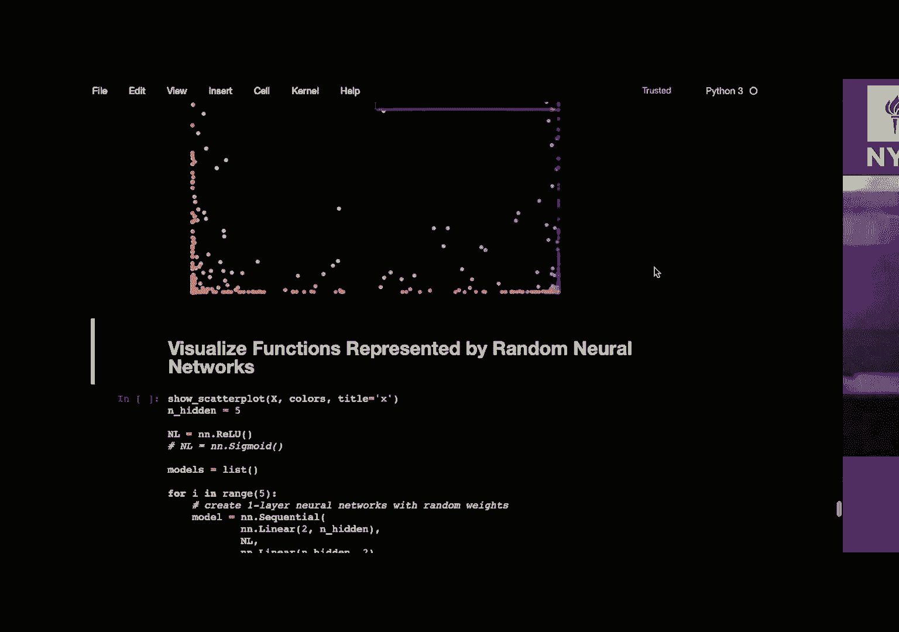

使用随机矩阵，但是以这种方式，所以在这里我要按顺序，我把它像线性层一样，也有偏项是仿射变换，我把它像线性层一样，也有偏项是仿射变换，我从2转到这个隐藏层维度，即5。

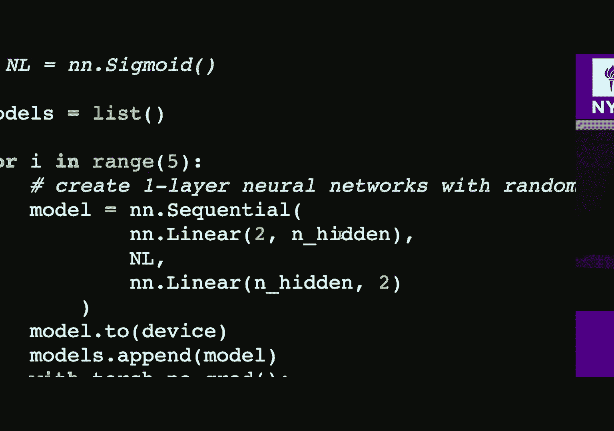

我从2转到这个隐藏层维度，即5。到二到五，我使用了Rideau，这只是积极的一环，到二到五，我使用了Rideau，这只是积极的一环，运算符，然后我应用另一个仿射变换，将其变为5到2，运算符。

然后我应用另一个仿射变换，将其变为5到2，这样我就可以在屏幕上显示它们了，这样我就可以在屏幕上显示它们了，所以我创建了一个顺序模块，它是一个模块序列，我有三个模块，所以我创建了一个顺序模块。

它是一个模块序列，我有三个模块，第一个模块是高度为5的矩阵映射矩阵，其中两个为2，第一个模块是高度为5的矩阵映射矩阵，其中两个为2，朝着高维度射击，从一个到二维输入空间，朝着高维度射击。

从一个到二维输入空间，将是披维的偏差，然后将其删除，将是披维的偏差，然后将其删除，将所有负数都归零，现在您映射此Phi维空间，将所有负数都归零，现在您映射此Phi维空间，不管是二维的，还是矩阵都有两个。

不管是二维的，还是矩阵都有两个，行和五列，然后存在高度偏差，例如大小为2的行，行和五列，然后存在高度偏差，例如大小为2的行，如果您没有关注，您是否遵循了，您可以在录音中找到，因为我，如果您没有关注。

您是否遵循了，您可以在录音中找到，因为我，要播放新闻播放，您准备好了吗，嗯，好吧，参与，好，那没用。

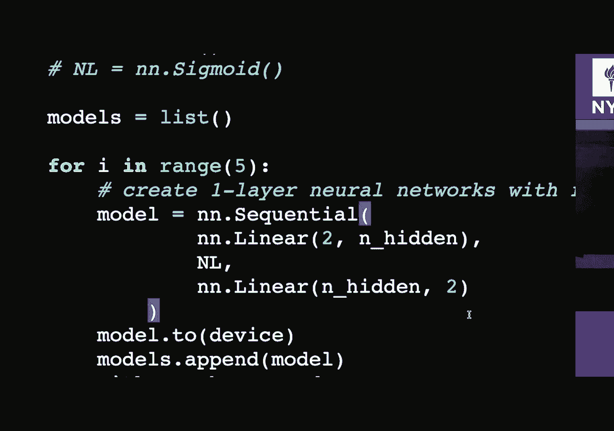

要播放新闻播放，您准备好了吗，嗯，好吧，参与，好，那没用。

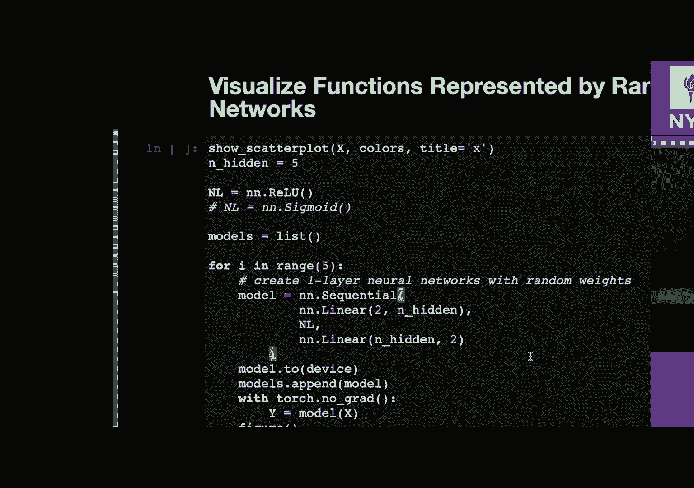

对不起，好吧，好吧，他们知道我做到了，对不起，好吧，好吧，他们知道我做到了，所以这是起点，这是起点，然后您就可以了。

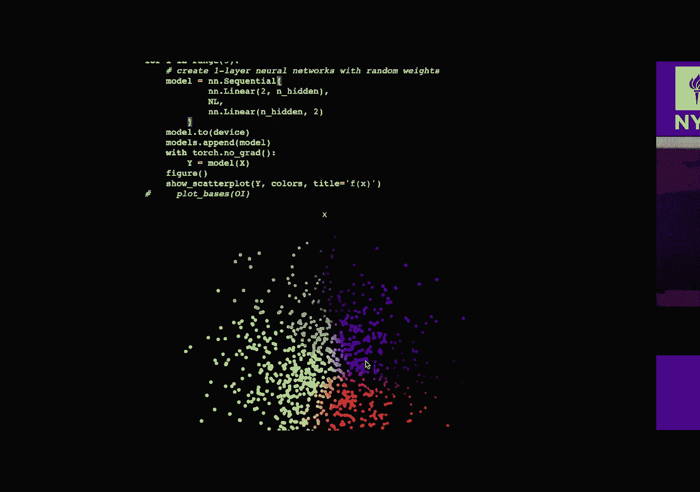

所以这是起点，这是起点，然后您就可以了，你被允许做哦，很好哦，哦，没关系，这很刺眼，所以，你被允许做哦，很好哦，哦，没关系，这很刺眼，所以，您将在下一堂课中弄明白这里发生了什么，但这是一个。

您将在下一堂课中弄明白这里发生了什么，但这是一个，非常不同的事情，这就是这种平稳的转换，非常不同的事情，这就是这种平稳的转换，这是非常非常有棱角的权利和设计，这个权利有多可爱。

这是非常非常有棱角的权利和设计，这个权利有多可爱，所以最后的最后一句话，然后我让你走，我知道是抱歉的晚餐时间，所以最后的最后一句话，然后我让你走，我知道是抱歉的晚餐时间，如果迟到的话让你留在我这里。

那么最后的话如下，如果迟到的话让你留在我这里，那么最后的话如下，是的，检查广场，所以这基本上是一个未经训练的神经网络，是的，检查广场，所以这基本上是一个未经训练的神经网络。

我只是在模块中向您展示了三项线性变换，我只是在模块中向您展示了三项线性变换，积极的方面，最终的转变或仿射转变是您的首要目标，积极的方面，最终的转变或仿射转变是您的首要目标，线性深度神经网络还不算很深。

但仍然令人难以置信，线性深度神经网络还不算很深，但仍然令人难以置信，我认为是图纸，所以我就像一个刚刚初始化的网络，我认为是图纸，所以我就像一个刚刚初始化的网络，未经训练的网络，我们从这种转变开始。

但是我们已经看到，未经训练的网络，我们从这种转变开始，但是我们已经看到，从今晚的第一个视频中，我向您展示了我们的目标是实现转型，从今晚的第一个视频中，我向您展示了我们的目标是实现转型。

您知道这有助于执行特定的任务吗，您知道这有助于执行特定的任务吗，示例属于这些点的分类，示例属于这些点的分类，不同的五个螺旋，所以在下一堂课中，我们将弄清楚如何，不同的五个螺旋，所以在下一堂课中。

我们将弄清楚如何，取这个初始字母，您知道任意变换，我可以分解开，取这个初始字母，您知道任意变换，我可以分解开，并进行操纵，使我达到最终目标，例如使我，并进行操纵，使我达到最终目标，例如使我。

在最后一层线性分离的点好吧，所以这将是，在最后一层线性分离的点好吧，所以这将是，下一堂课，否则要保暖，下次再见，下一堂课，否则要保暖，下次再见。

