# P7：7. Week 4 – Practicum - Listening to convolutions - 大佬的迷弟的粉丝 - BV1o5411p7AB

所以自上次以来还可以，欢迎回来，谢谢您在这里，所以自上次以来还可以，欢迎回来，谢谢您在这里，杨上次使用平板电脑的权利以及如何使用平板电脑我，杨上次使用平板电脑的权利以及如何使用平板电脑我。

不要正确使用平板电脑，至少我应该像安娜一样酷，不要正确使用平板电脑，至少我应该像安娜一样酷，首先要有一个电子表格，您可以在其中确定，首先要有一个电子表格，您可以在其中确定，您想加入我们的合作伙伴。

您想加入我们的合作伙伴，该网站的一些图纸修复了一些数学符号，并带有一些，该网站的一些图纸修复了一些数学符号，并带有一些，那种您知道用英语语法纠正英语中的错误或，那种您知道用英语语法纠正英语中的错误或。

无论如何，如果您有兴趣帮助改善内容，无论如何，如果您有兴趣帮助改善内容，此类可以随时填写电子表格，好吧，我们已经是，此类可以随时填写电子表格，好吧，我们已经是，我们是在子弹频道上，所以我的意思是。

如果您愿意，我们欢迎您，所以。

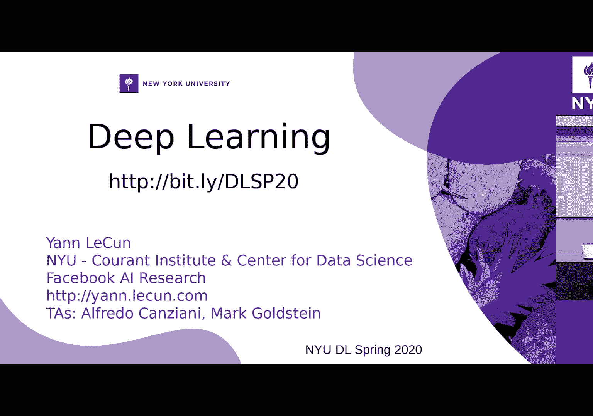

我们是在子弹频道上，所以我的意思是，如果您愿意，我们欢迎您，所以，而不是写在白板上，因为我看不到，而不是写在白板上，因为我看不到，从上侧，我们将要在这里尝试一个新玩具，从上侧。

我们将要在这里尝试一个新玩具，第一次就对了，所以你知道我有点，第一次就对了，所以你知道我有点，上次我用笔记本弄紧时，很紧张，好吧，我们要。

上次我用笔记本弄紧时，很紧张，好吧，我们要，首先从关于线性代数的简短评论开始，我希望我不会，首先从关于线性代数的简短评论开始，我希望我不会。

冒犯了我知道您已经采用线性代数的任何人，冒犯了我知道您已经采用线性代数的任何人，非常强大，但是我还是想给你我的直觉，非常强大，但是我还是想给你我的直觉，观点好吧，只是您知道一张幻灯片不太多。

所以也许您想，观点好吧，只是您知道一张幻灯片不太多，所以也许您想，拿出一些纸和笔，或者您可以随便知道，拿出一些纸和笔，或者您可以随便知道，所以这将是线性和线性代数复习，所以这将是线性和线性代数复习。

好吧，我在等一会儿，让我等待一秒钟，好吧，我在等一会儿，让我等待一秒钟，头好吧，太棒了，好吧，所以我们上一次谈话是神经，头好吧，太棒了，好吧，所以我们上一次谈话是神经，网络在底部的输入。

那么我们就像一个仿射，网络在底部的输入，那么我们就像一个仿射，变换，然后我们有一个隐藏层，所以我要写，变换，然后我们有一个隐藏层，所以我要写，第一个方程式，我们要拥有我的隐藏层，因为我正在写。

第一个方程式，我们要拥有我的隐藏层，因为我正在写，用笔你能看到什么吗，所以，既然我用笔写字，用笔你能看到什么吗，所以，既然我用笔写字，将在变量下方添加下划线，以便，将在变量下方添加下划线，以便。

表示这是向量，这就是我编写向量的方式，所以我的H将成为，表示这是向量，这就是我编写向量的方式，所以我的H将成为，非线性函数f应用于我的Z，Zed将成为我的线性输入，非线性函数f应用于我的Z。

Zed将成为我的线性输入，仿射变换的输出是线性的，所以在这种情况下，仿射变换的输出是线性的，所以在这种情况下，我要在这里写Z等于我的矩阵X X好吧，我们，我要在这里写Z等于我的矩阵X X好吧，我们。

可以想象在这种情况下没有偏见是足够通用的，因为我们可以，可以想象在这种情况下没有偏见是足够通用的，因为我们可以，将其包含在矩阵内并使X的第一项等于B，将其包含在矩阵内并使X的第一项等于B，1。

因此如果此X属于RN且已死亡，则属于RM第一个问题，1，因此如果此X属于RN且已死亡，则属于RM第一个问题，这个矩阵的大小是多少，好极了，所以这个矩阵是，这个矩阵的大小是多少，好极了，所以这个矩阵是。

将成为我们的M倍n，您所拥有的行数应与维度的数量相同-，将成为我们的M倍n，您所拥有的行数应与维度的数量相同-，并且您可以确定要拍摄的尺寸的列数，并且您可以确定要拍摄的尺寸的列数，好吧。

让我们扩大这一权利，所以这里的矩阵等于，好吧，让我们扩大这一权利，所以这里的矩阵等于，你有1 1 a 1 2等等，直到最后一个要大喊，你有1 1 a 1 2等等，直到最后一个要大喊。

谢谢你1和是1n那么你有第二个，谢谢你1和是1n那么你有第二个，将有1 a 2 1 a 2 2，依此类推，直到最后一个2 n对，然后您，将有1 a 2 1 a 2 2，依此类推，直到最后一个2 n对。

然后您，继续下降直到最后一个索引M 1，继续下降直到最后一个索引M 1，好的，所以您有一个和1 A M 2，依此类推，直到阿们，好的，谢谢大家，好的，所以您有一个和1 A M 2，依此类推，直到阿们。

好的，谢谢大家，对，然后我们在这里有X对，所以您有X 1 X 2，依此类推，直到xn，对，然后我们在这里有X对，所以您有X 1 X 2，依此类推，直到xn，对，您比去年反应更快很好，谢谢。

所以我们也可以，您比去年反应更快很好，谢谢，所以我们也可以，用不同的方式重写这个，所以我要写的第一种方式，用不同的方式重写这个，所以我要写的第一种方式，将会是下面的，所以我要在这里有这些1然后我要有。

将会是下面的，所以我要在这里有这些1然后我要有，这是我的2，然后我有最后一个，这将是我的a，然后，然后，这是我的2，然后我有最后一个，这将是我的a，然后，然后，在这里我要乘以列向量，所以我的列向量。

在这里我要乘以列向量，所以我的列向量，我会这样写，所以这个操作的输出是什么，我会这样写，所以这个操作的输出是什么，所以这些是指标，您有一个向量，结果将是一个向量，因此，所以这些是指标，您有一个向量。

结果将是一个向量，因此，我的向量的第一项是什么我不使用点，因为我不是，我的向量的第一项是什么我不使用点，因为我不是，物理学家，实际上我是在做线性代数，所以我应该怎么做，物理学家，实际上我是在做线性代数。

所以我应该怎么做，写，好，那已经转置了，因为那些是行向量，所以我只是，好，那已经转置了，因为那些是行向量，所以我只是，写一个，我只是说正确，所以我有一个1 X的确定，所以没有，写一个，我只是说正确。

所以我有一个1 X的确定，所以没有，换位这里没有圆点，依此类推第二个元素将是两个，换位这里没有圆点，依此类推第二个元素将是两个，X，然后直到最后一个将是D的行，没有点，但是可以确定，X。

然后直到最后一个将是D的行，没有点，但是可以确定，就像有人称该点积而不是叉积，但这就是，就像有人称该点积而不是叉积，但这就是，假设您使用另一种表示法，假设您使用另一种表示法，好的，这将是我的。

所以这个向量有多少个元素，好的，这将是我的，所以这个向量有多少个元素，好吧，所以我们有Z 1 Z 2等等，直到ZM，这是我的最终设定，好吧，所以我们有Z 1 Z 2等等，直到ZM，这是我的最终设定。

我的载体是很好，很棒，所以现在我们要集中一点，我的载体是很好，很棒，所以现在我们要集中一点，关于这件事的含义在这里还可以吗？关于这件事的含义在这里还可以吗？好吧，到目前为止，这是非常琐碎的。

我希望我的意思是让我知道是否可以，好吧，到目前为止，这是非常琐碎的，我希望我的意思是让我知道是否可以，好吧，让我们在这里分析这些家伙之一，所以我想弄清楚是什么，好吧，让我们在这里分析这些家伙之一。

所以我想弄清楚是什么，正确写一个T乘以X的意思，所以我的T将成为我的泛型I，正确写一个T乘以X的意思，所以我的T将成为我的泛型I，让我们假设在这种情况下，当n等于好时，那么ATX是什么，所以ATX将会。

让我们假设在这种情况下，当n等于好时，那么ATX是什么，所以ATX将会，等于什么，所以让我在这里画些东西，以便于，等于什么，所以让我在这里画些东西，以便于，你要明白，所以这将是我的，这些将是我的阿尔法。

你要明白，所以这将是我的，这些将是我的阿尔法，那么在这里，你就像它将成为我的X，这将会成为我的XI，所以，那么在这里，你就像它将成为我的X，这将会成为我的XI，所以。

这是什么这个产品的输出是什么这些是这里，这是什么这个产品的输出是什么这些是这里，看到您可以后悔8/8换位让我们称它为行向量，看到您可以后悔8/8换位让我们称它为行向量，你知道吗，这个操作的输出是什么？

你知道吗，这个操作的输出是什么？这就像一个通用的辅助工具之一，有M个辅助工具，这就像一个通用的辅助工具之一，有M个辅助工具，这是这些mas之一，因此我乘以A的其中之一乘以我的X，这是这些mas之一。

因此我乘以A的其中之一乘以我的X，正确，我们假设只有两个维度，那么，正确，我们假设只有两个维度，那么，标量产品的输出有人可以告诉我，不，不，不，像平常一样，标量产品的输出有人可以告诉我，不，不，不。

像平常一样，标量产品保持不变，所以您有鸡蛋，嘿，您有，标量产品保持不变，所以您有鸡蛋，嘿，您有，这里这部分将是1它会是两个好吧，那么你有，这里这部分将是1它会是两个好吧，那么你有，在这里x1。

现在您拥有x2，所以您如何在此处表达此标量积，在这里x1，现在您拥有x2，所以您如何在此处表达此标量积，好吧，所以我只是写信让我知道你是否清楚，所以我要在这里写一个，好吧。

所以我只是写信让我知道你是否清楚，所以我要在这里写一个，1倍X 1加2倍X 2对，这是定义清楚的对，所以，1倍X 1加2倍X 2对，这是定义清楚的对，所以，远，是，不是，是，是个转置Y角色，远，是。

不是，是，是个转置Y角色，乘以列向量，所以我们假设a是列向量，那么我的角色是x，乘以列向量，所以我们假设a是列向量，那么我的角色是x，着色，所以让我们继续在这里写这些东西，所以什么是1我怎么能。

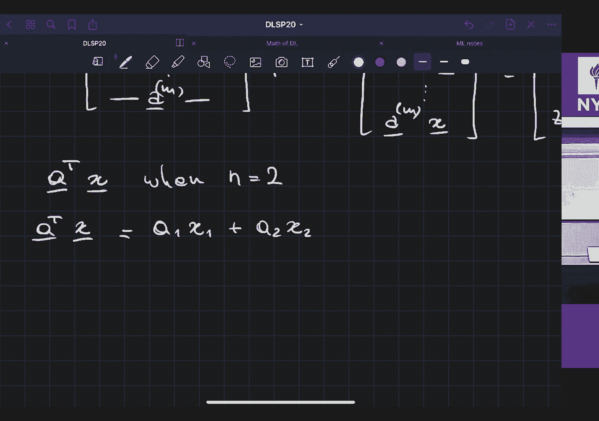

着色，所以让我们继续在这里写这些东西，所以什么是1我怎么能，计算AI 1秒好吧，好吧，我在这里写1，计算AI 1秒好吧，好吧，我在这里写1，是向量的长度乘以余弦alpha，那么X 1。

是向量的长度乘以余弦alpha，那么X 1，否则现在就一样，等待X 1相同的东西是什么不同，否则现在就一样，等待X 1相同的东西是什么不同，信，所以有人说您正在关注的事情让您完全困惑，信。

所以有人说您正在关注的事情让您完全困惑，你不知道这太容易了我不知道这是怎么回事，你不知道这太容易了我不知道这是怎么回事，好的，到目前为止，好的，这将是第二个名词，它将是X，好的，到目前为止，好的。

这将是第二个名词，它将是X，在这里写x cos x我对，然后你有第二个名词，在这里写x cos x我对，然后你有第二个名词，我能听到多少高音正弦，然后，我能听到多少高音正弦，然后，好的，谢谢，好的。

好吧，我要把这两个家伙放在一起，所以你要，好吧，我要把这两个家伙放在一起，所以你要，得到x的余数乘以余弦alpha余弦Phi加，得到x的余数乘以余弦alpha余弦Phi加。

sana正弦alpha和正弦余弦a正弦X对不起，sana正弦alpha和正弦余弦a正弦X对不起，括号的开头是正确的，所以存在余弦，括号的开头是正确的，所以存在余弦，每个人都知道三角学的两个角度之差对吧。

每个人都知道三角学的两个角度之差对吧，对不起，高中的东西，所以这将等于斧乘以余弦，对不起，高中的东西，所以这将等于斧乘以余弦，cos xi减去alpha对，反之亦然，cos xi减去alpha对。

反之亦然，那么，这意味着您可以想到到目前为止的每个要素，这是显而易见的II，那么，这意味着您可以想到到目前为止的每个要素，这是显而易见的II，没有做任何魔术，是的，像这四个摇头一样，这四个，不是这个。

没有做任何魔术，是的，像这四个摇头一样，这四个，不是这个，可能没有任何作用，所以您可以随时考虑，可能没有任何作用，所以您可以随时考虑，将矩阵乘以向量，基本上此操作的每个输出，将矩阵乘以向量。

基本上此操作的每个输出，将要测量，所以好吧，保持这个余弦是多少余弦，将要测量，所以好吧，保持这个余弦是多少余弦，为零，因此这意味着两个矢量是否对齐这两个角度，为零。

因此这意味着两个矢量是否对齐这两个角度，这意味着两个向量之间的夹角为零，这意味着两个向量之间的夹角为零，每当您减去该元素时，此元素的最大值就正确，每当您减去该元素时，此元素的最大值就正确。

当它们与右边相反时，它们的最大负值是，当它们与右边相反时，它们的最大负值是，相反，您将得到最大的负幅值，但是如果您，相反，您将得到最大的负幅值，但是如果您，应用，让我们做一个重做。

您将削减所有这些负面的东西，应用，让我们做一个重做，您将削减所有这些负面的东西，检查正面匹配对，所以神经网络基本上只是，检查正面匹配对，所以神经网络基本上只是，谁会只弄清楚正面比赛，所以当。

谁会只弄清楚正面比赛，所以当，您将矩阵乘以列向量，您将矩阵乘以列向量，在每列的每一列之间执行逐元素对不起标量积，在每列的每一列之间执行逐元素对不起标量积，代表您的内核的矩阵，所以只要您喜欢线性。

代表您的内核的矩阵，所以只要您喜欢线性，内核将是矩阵的整个行，现在您看到了什么，内核将是矩阵的整个行，现在您看到了什么，是该输入在该列上的投影我在该流的输入上，是该输入在该列上的投影我在该流的输入上。

对，因此该产品的每个元素都会告诉您与，对，因此该产品的每个元素都会告诉您与，输入是什么，输入相对于，输入是什么，输入相对于，矩阵的特定行好是不是这应该更像，矩阵的特定行好是不是这应该更像，直觉。

当我们使用这些线性变换时，它们就像，直觉，当我们使用这些线性变换时，它们就像，让您看到输入到不同种类的投影，让您看到输入到不同种类的投影，方向，这样说吧，好的，您可以尝试将其推算为，方向，这样说吧。

好的，您可以尝试将其推算为，高尺寸我想直觉至少可以给你作品，高尺寸我想直觉至少可以给你作品，肯定是在较高维度中的二维和三维中，我认为，肯定是在较高维度中的二维和三维中，我认为，在下一课中。

我们将以类似的方式工作，在下一课中，我们将以类似的方式工作，将会看到投影中的分布如何，将会看到投影中的分布如何，更高维度的空间会很酷，我想这样吧，更高维度的空间会很酷，我想这样吧。

这是我想上课的第一部分哦，还有更多，这是我想上课的第一部分哦，还有更多，所以实际上在这里，这个部分在这里说，我们也可以用不同的方式写，所以实际上在这里，这个部分在这里说，我们也可以用不同的方式写。

也许这是已知的也许是未知的当我第一次看到它时，也许这是已知的也许是未知的当我第一次看到它时，我不知道，所以你知道有时候看这些东西真是太酷了，我不知道，所以你知道有时候看这些东西真是太酷了，再说一遍。

所以让我们回到这里是那里的东西，所以你可以表达，再说一遍，所以让我们回到这里是那里的东西，所以你可以表达，这个Z等于向量a 1在这种情况下a 1将成为第一个。

这个Z等于向量a 1在这种情况下a 1将成为第一个，矩阵确定的一列，这个将与标量相乘，矩阵确定的一列，这个将与标量相乘，x1现在您有矩阵的第二列，所以我有一个2，x1现在您有矩阵的第二列。

所以我有一个2，在X的第二个元素之前，直到最后一个，在X的第二个元素之前，直到最后一个，我再也听不清是M还是nm，还是说你知道手语，我再也听不清是M还是nm，还是说你知道手语，一个不错的权利。

您知道手语，不，您应该学习，这很好，您知道，一个不错的权利，您知道手语，不，您应该学习，这很好，您知道，包含a并写出最后一列乘以您的X，当然因为n X，包含a并写出最后一列乘以您的X，当然因为n X。

大小为n，有n个项目，所以基本上当您，大小为n，有n个项目，所以基本上当您，你知道变换线性吗，知道应用线性算子吗，你知道变换线性吗，知道应用线性算子吗，基本上不能等到矩阵的每一列。

基本上不能等到矩阵的每一列，在一个中，您知道第一列乘以第一个系数，在一个中，您知道第一列乘以第一个系数，向量第二列，第二列乘以第三列乘以第三列，向量第二列，第二列乘以第三列乘以第三列，项目。

因此您可以看到此DN转换的输出是加权和，项目，因此您可以看到此DN转换的输出是加权和，矩阵的各列都可以，所以这是另一种直觉，矩阵的各列都可以，所以这是另一种直觉。

有时您会觉得这些就像当您想要表达您的信号时，有时您会觉得这些就像当您想要表达您的信号时，数据是不同的组合，您知道组成是一种，数据是不同的组合，您知道组成是一种，输入的线性组成还可以，所以这是第一部分。

输入的线性组成还可以，所以这是第一部分，回顾线性代数的第二部分将是更多，回顾线性代数的第二部分将是更多，很酷，我认为到目前为止的问题绝非易事，太容易了，您会感到无聊，很酷。

我认为到目前为止的问题绝非易事，太容易了，您会感到无聊，抱歉，好吧，那我要加快速度，抱歉，好吧，那我要加快速度，好了，让我们来看看如何扩展已经看到的东西，好了，让我们来看看如何扩展已经看到的东西。

现在进行卷积运算，所以卷积运算有时可能会有点，现在进行卷积运算，所以卷积运算有时可能会有点，很奇怪，让我们看看如何扩展卷积，很奇怪，让我们看看如何扩展卷积，好吧，假设我从相同的矩阵开始。

所以我要在这里有四个，好吧，假设我从相同的矩阵开始，所以我要在这里有四个，行，然后三列，所以我的数据必须是如果有的话，行，然后三列，所以我的数据必须是如果有的话，如果我将此乘以一列。

则列向量的大小应为三，如果我将此乘以一列，则列向量的大小应为三，好的，谢谢，让我在这里画出大小正确的列向量，好的，谢谢，让我在这里画出大小正确的列向量，会给你输出四号大小，好极了，会给你输出四号大小。

好极了，但是接下来是您的数据，假设您要收听一些不错的音频，但是接下来是您的数据，假设您要收听一些不错的音频，文件就是您的数据，只是三个简单的长数据，假设您的数据要多长时间，文件就是您的数据。

只是三个简单的长数据，假设您的数据要多长时间，您听了大约三分钟的音乐，您听了大约三分钟的音乐，您三分钟的健康状况有多少个样本，是的，我想是，您三分钟的健康状况有多少个样本，是的，我想是。

要成为我的采样率，假设22可以，2。2万公斤，要成为我的采样率，假设22可以，2。2万公斤，赫兹正确为22赫兹，所以三分钟的音乐有多少采样，赫兹正确为22赫兹，所以三分钟的音乐有多少采样，第二。

您确定是单声道还是立体声，只是在开玩笑吧，所以，第二，您确定是单声道还是立体声，只是在开玩笑吧，所以，您将乘以样本数乘以秒数，您将乘以样本数乘以秒数。

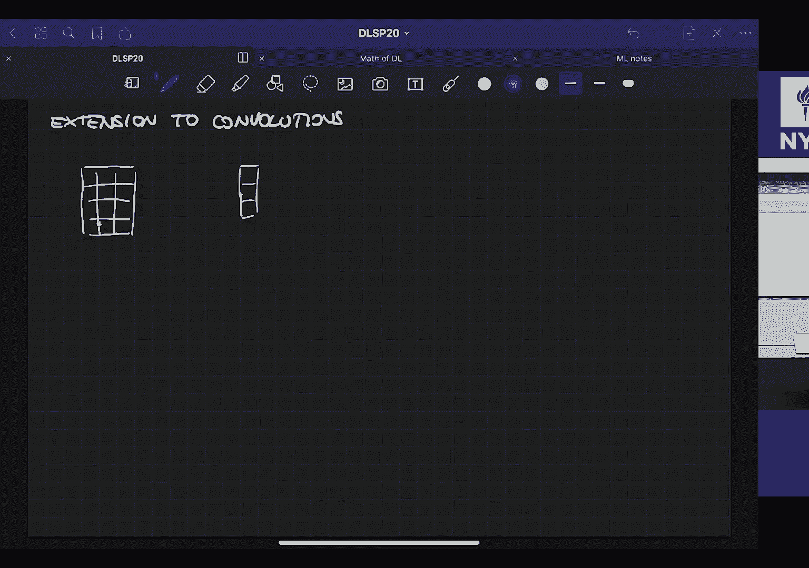

秒数乘以帧速率就可以了，秒数乘以帧速率就可以了，不管怎样，所以这个信号会很长很长，会一直保持下去，不管怎样，所以这个信号会很长很长，会一直保持下去，下降，所以如果我有一个非常长的向量，我必须使用，下降。

所以如果我有一个非常长的向量，我必须使用，矩阵会很宽很宽，好极了，所以这个顶部，矩阵会很宽很宽，好极了，所以这个顶部，继续朝这个方向前进，所以我要问的是，继续朝这个方向前进，所以我要问的是。

我应该在这里放什么，我应该在这里放什么，我应该在这里放些什么，以便我们关心更远的地方，我应该在这里放些什么，以便我们关心更远的地方，不，为什么不这样做，因为我们的数据具有，不，为什么不这样做。

因为我们的数据具有，地方很棒，所以我要去哪里？我要把这里放大，地方很棒，所以我要去哪里？我要把这里放大，零对了，神奇的妈妈好吧，所以我们在这里放一个零，然后其他的是，零对了，神奇的妈妈好吧。

所以我们在这里放一个零，然后其他的是，属性，所以让我重新开始绘制该素材吧，这样我可以，属性，所以让我重新开始绘制该素材吧，这样我可以，大小为三的内核，然后在这里我的数据将非常长，大小为三的内核。

然后在这里我的数据将非常长，对，所以等等，我可以看到没事，所以这里有零，然后说什么，对，所以等等，我可以看到没事，所以这里有零，然后说什么，是我的约会的其他属性，我的自然数据具有平稳性。

是我的约会的其他属性，我的自然数据具有平稳性，表示您希望找到的模式可以重复一遍，表示您希望找到的模式可以重复一遍，一遍又一遍，所以如果我在这里有我的三个值，也许我会，一遍又一遍。

所以如果我在这里有我的三个值，也许我会，想一次又一次地重复使用它们，所以如果这三个值让，想一次又一次地重复使用它们，所以如果这三个值让，我可能会改变颜色，所以您可以看到里面有相同的东西，所以我有。

我可能会改变颜色，所以您可以看到里面有相同的东西，所以我有，三个值，然后我将一步一步使用这三个相同的值，三个值，然后我将一步一步使用这三个相同的值，为了下雨，我继续前进，我不沮丧，我一直这样走。

为了下雨，我继续前进，我不沮丧，我一直这样走，对的，所以我应该在底部放置什么，我应该在此处放置零，对的，所以我应该在底部放置什么，我应该在此处放置零，对，为什么这样，为什么因为数据的局部性，所以放，对。

为什么这样，为什么因为数据的局部性，所以放，周围的零被称为填充，但在这种情况下被称为，周围的零被称为填充，但在这种情况下被称为，稀疏对，所以这就像稀疏，然后复制这个东西，稀疏对，所以这就像稀疏。

然后复制这个东西，一遍又一遍，这就是所谓的会议，我会是财产，一遍又一遍，这就是所谓的会议，我会是财产，的信号，这叫做重量共享，的信号，这叫做重量共享，好吧，太棒了，好吧，我们现在有多少个价值，好吧。

太棒了，好吧，我们现在有多少个价值，我在右侧有参数，好，所以我们在左侧左侧有三个参数，相反，好，所以我们在左侧左侧有三个参数，相反，拥有正确的产品，因此如果右侧比较容易，右侧将会，拥有正确的产品。

因此如果右侧比较容易，右侧将会，总的来说，您一侧有三个参数，而另一侧则有12个参数，总的来说，您一侧有三个参数，而另一侧则有12个参数，好的，使用局部性和螺旋性以及诸如稀疏性之类的东西是很好的，好的。

使用局部性和螺旋性以及诸如稀疏性之类的东西是很好的，和参数共享，但是现在我们只剩下三个参数，和参数共享，但是现在我们只剩下三个参数，这太严格了，我们如何才能有多个多个参数，这太严格了。

我们如何才能有多个多个参数，在大图中缺少这里，有多个通道，所以这是，在大图中缺少这里，有多个通道，所以这是，这里只有一层，然后您将这些东西从，这里只有一层，然后您将这些东西从，从这里的板子开始。

所以您这里有第一个内核，现在他有一些，从这里的板子开始，所以您这里有第一个内核，现在他有一些，第二个内核，比如说听，我在这里有最后一个，所以你有，第二个内核，比如说听，我在这里有最后一个，所以你有。

这些指标的每个平面仅包含一个内核，即，这些指标的每个平面仅包含一个内核，即，复制了多次，现在谁知道此矩阵的名称，所以，复制了多次，现在谁知道此矩阵的名称，所以，被称为三胞胎顶列表矩阵，好。

那么这些裸照指标的主要特征是什么？好，那么这些裸照指标的主要特征是什么？你不会注意到的大事是一个稀疏矩阵好吧好吧，你不会注意到的大事是一个稀疏矩阵好吧好吧，在这里，这第一个项目是第一个家伙的内容，是的。

所以，在这里，这第一个项目是第一个家伙的内容，是的，所以，这是我的线性变换的扩展，这是我的线性变换的扩展，你知道我的信号长于三个样本，因此我必须，你知道我的信号长于三个样本，因此我必须。

使这个矩阵更胖的第二部分可能是因为我不在乎，使这个矩阵更胖的第二部分可能是因为我不在乎，诸如此类的事情在这里我不在乎，诸如此类的事情在这里我不在乎，在这里，如果我看一下这里的要点，那么在这里将大0。

在这里，如果我看一下这里的要点，那么在这里将大0，这样哦，这里的所有东西都会被清理干净，然后，这样哦，这里的所有东西都会被清理干净，然后，最后，我将一遍又一遍地使用相同的内核，因为我，最后。

我将一遍又一遍地使用相同的内核，因为我，假设我的数据是固定的，因此我假设类似的模式，假设我的数据是固定的，因此我假设类似的模式，会一遍又一遍地发生，所以我要用这个，会一遍又一遍地发生，所以我要用这个。

这里写的一个参数共享权重共享，这里写的一个参数共享权重共享，最后，鉴于这一点只给您三个参数，两个参数，最后，鉴于这一点只给您三个参数，两个参数，与我合作将使用几层，以使您知道与众不同。

与我合作将使用几层，以使您知道与众不同，通道，因此这是一个内核，而一个内核是，通道，因此这是一个内核，而一个内核是，矩阵好吧，所以当您有一个完全连接的层时，唯一的区别，矩阵好吧。

所以当您有一个完全连接的层时，唯一的区别，完全连接的层和卷积之间的关系是，完全连接的层和卷积之间的关系是，矩阵的水坝行，那么这里的第一项将会是什么，矩阵的水坝行，那么这里的第一项将会是什么。

所以绿色上校，我们称绿色角落为一个，让我实际上，所以绿色上校，我们称绿色角落为一个，让我实际上，使它发出绿色，因为它是绿色的卡纳，所以你只有它的一倍，使它发出绿色，因为它是绿色的卡纳。

所以你只有它的一倍，从第一个到第三个，然后第二个是，从第一个到第三个，然后第二个是，会是同一个家伙，这里是1，然后您将X移了，会是同一个家伙，这里是1，然后您将X移了，一个等等，这样就可以了。

然后我们要拥有一个，一个等等，这样就可以了，然后我们要拥有一个，成为绿色输出，那么您将获得蓝色输出一层，成为绿色输出，那么您将获得蓝色输出一层，出来，然后又有一个红色，出来，然后又有一个红色。

我们已经走了一层，好吧，iPad的体验很酷，我们已经走了一层，好吧，iPad的体验很酷，是的否我喜欢了还可以的其他问题，再说一次，蓝色圆圈是一个大零，再说一次，蓝色圆圈是一个大零，这就是稀疏性，是的。

不是，是的，是的，绿色，所以我在这里放了很多零，所以我杀死了所有，是的，绿色，所以我在这里放了很多零，所以我杀死了所有，远离一小部分的值，然后我重复相同的三个，远离一小部分的值，然后我重复相同的三个。

值一遍又一遍，因为我希望在其中找到相同的模式，值一遍又一遍，因为我希望在其中找到相同的模式，这是不同的区域，这是一个很大的信号，所以我在这里说，这是不同的区域，这是一个很大的信号，所以我在这里说。

在这种情况下，我将只有三个值，我们从，在这种情况下，我将只有三个值，我们从，12个值，最后我得到3个，实际上很少，所以如果我想，12个值，最后我得到3个，实际上很少，所以如果我想，假设有6个值。

那么如果我想有6个值，就可以，假设有6个值，那么如果我想有6个值，就可以，第二个3在另一架飞机上，只要您，第二个3在另一架飞机上，只要您，将这个矩阵乘以一个向量，就可以进行卷积运算。

将这个矩阵乘以一个向量，就可以进行卷积运算，你说卷积只是一个很多零的矩阵乘法，你说卷积只是一个很多零的矩阵乘法，是的，所以他们要在这里放一个，然后再放一个，是的，所以他们要在这里放一个，然后再放一个。

你有第三个，所以你有三个版本的输入，所以对于，你有第三个，所以你有三个版本的输入，所以对于，在课程的第二部分，我将向您展示更多互动的内容，在课程的第二部分，我将向您展示更多互动的内容，请也参加第二部分。

所以让我们尝试一下，请也参加第二部分，所以让我们尝试一下。

更名后，我将网站更名后，现在有了一些类似的名称，更名后，我将网站更名后，现在有了一些类似的名称。

环境将被称为P PBL，所以pi火炬深度学习而不是，环境将被称为P PBL，所以pi火炬深度学习而不是，睡眠学习迷你课程太长了，让我从运行此课程开始，睡眠学习迷你课程太长了，让我从运行此课程开始，所以。

我的火炬深度学习，因此我们可以进行此Conda激活激活PI火炬深度，我的火炬深度学习，因此我们可以进行此Conda激活激活PI火炬深度，学习，然后让我们不要打开木星笔记本，所以现在。

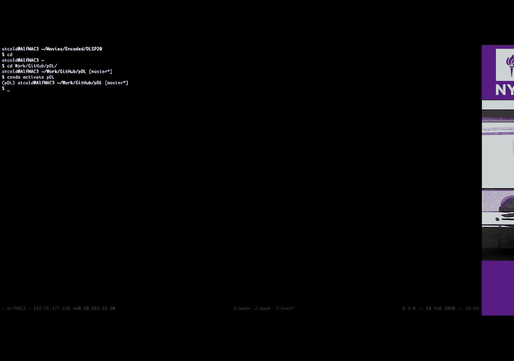

学习，然后让我们不要打开木星笔记本，所以现在。

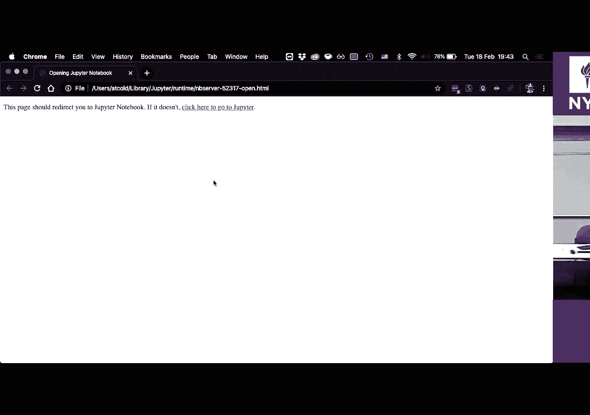

会看着去听角落里的东西，所以我给你看，会看着去听角落里的东西，所以我给你看，现在，我在平板电脑上在纸上进行了卷积运算，现在我开始听，现在，我在平板电脑上在纸上进行了卷积运算，现在我开始听，卷积。

这样您就可以真正体会到这种成分，卷积，这样您就可以真正体会到这种成分，在这里我们说了一种新的内核权利，称为P PBL Python sleep，在这里我们说了一种新的内核权利。

称为P PBL Python sleep，学习，所以如果您进行更新，您将注意到与您相同的过程，学习，所以如果您进行更新，您将注意到与您相同的过程。

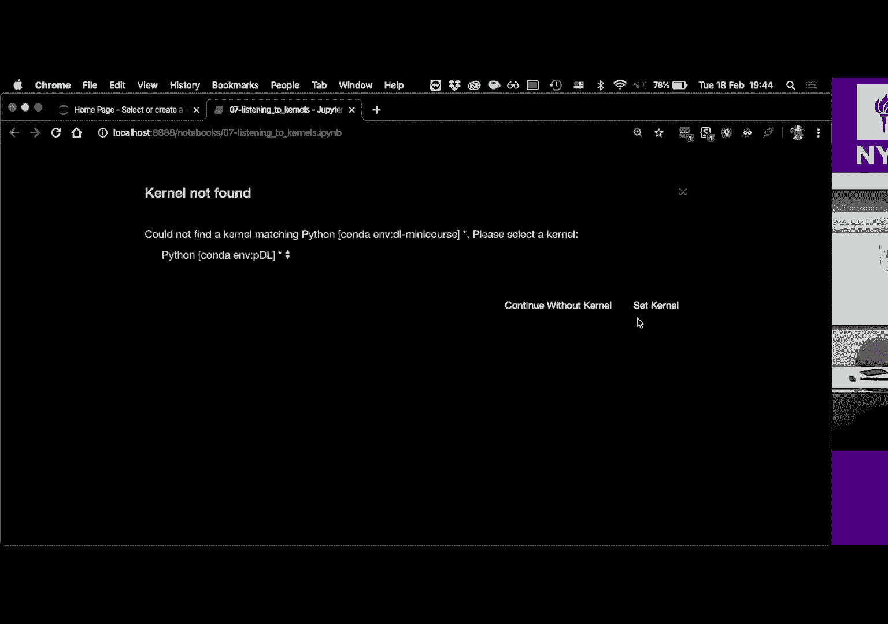

您的系统还不错，因此在这种情况下，我们可以在此处阅读顶部，让我隐藏，您的系统还不错，因此在这种情况下，我们可以在此处阅读顶部，让我隐藏，在这里顶。

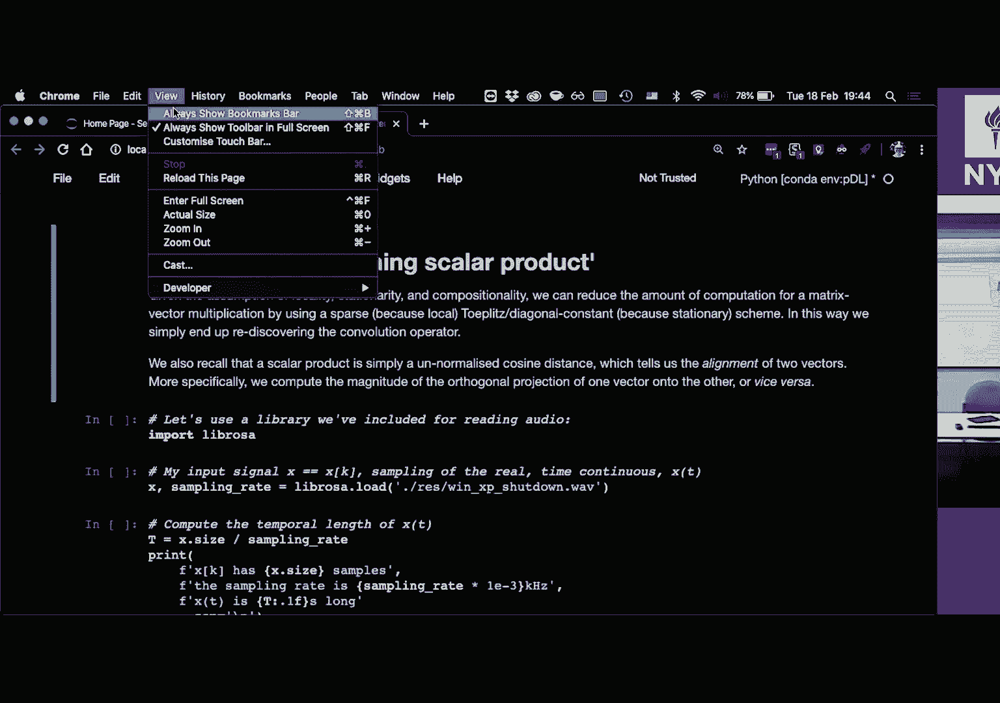

好吧，考虑到当地平稳性和组成的假设，好吧，考虑到当地平稳性和组成的假设，我们可以减少矩阵的计算量，我们可以减少矩阵的计算量，通过使用稀疏向量乘法，因为局部popplets矩阵是因为。

通过使用稀疏向量乘法，因为局部popplets矩阵是因为，通过这种方式的固定方案，我们可以简单地最终重新发现，通过这种方式的固定方案，我们可以简单地最终重新发现，卷积运算符数组此外，我们还可以回想一下。

标量积是。

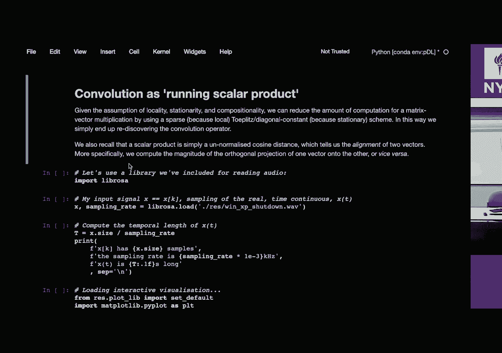

卷积运算符数组此外，我们还可以回想一下，标量积是，简单的归一化余弦距离，告诉我们两个的对齐，简单的归一化余弦距离，告诉我们两个的对齐，向量更具体地说，我们计算，向量更具体地说，我们计算。

两个向量在另一个和另一个上的正交投影的大小，两个向量在另一个和另一个上的正交投影的大小。

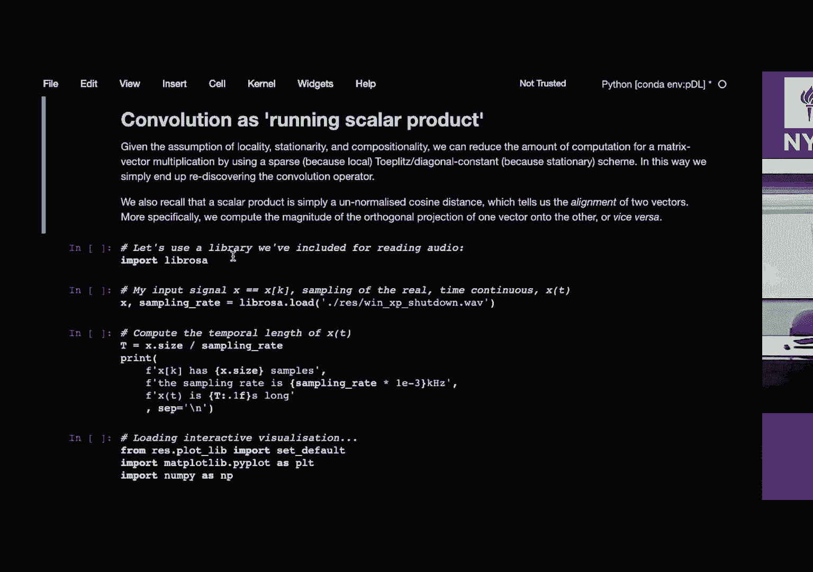

反之亦然，现在让我们弄清楚所有这些，反之亦然，现在让我们弄清楚所有这些，可以用我们的耳朵说得通，所以我将要导入一个，可以用我们的耳朵说得通，所以我将要导入一个，纽约大学的教授在这里做了。

我将要加载我的音频数据，纽约大学的教授在这里做了，我将要加载我的音频数据，我将在X中使用它，然后我的采样等级将是，我将在X中使用它，然后我的采样等级将是，在另一个变量中，所以在这里我只告诉你我要有70。

000。

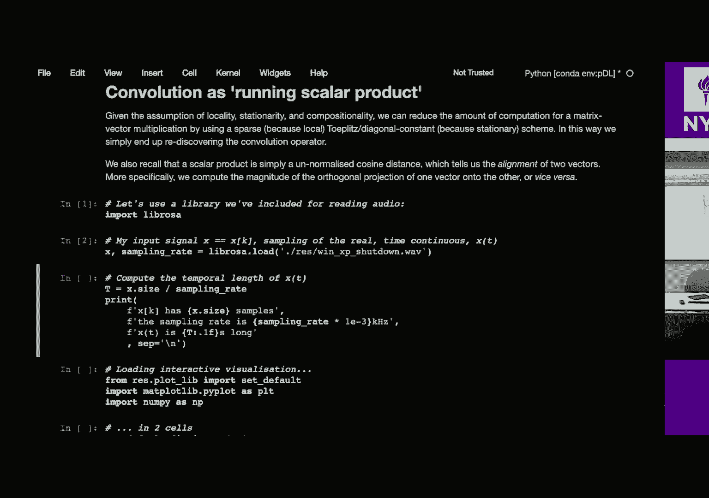

在另一个变量中，所以在这里我只告诉你我要有70，000，在这种情况下进行采样，因为我的单频为22赫兹，然后，在这种情况下进行采样，因为我的单频为22赫兹，然后，我的总时间是三秒钟，所以三秒钟乘以22。

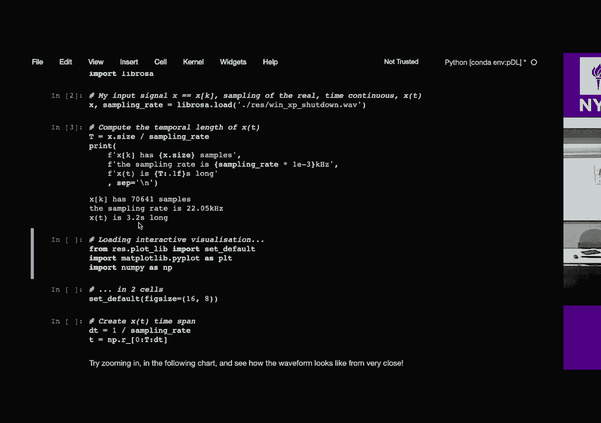

我的总时间是三秒钟，所以三秒钟乘以22，那不是180你在说那是一百八十就是三，那不是180你在说那是一百八十就是三，哦，那是三分钟哦，你是对的，那是三秒钟，所以你实际上是，哦，那是三分钟哦，你是对的。

那是三秒钟，所以你实际上是，纠正我的父亲，所以这是三秒钟，所以乘以22公斤赫兹，你得到17，纠正我的父亲，所以这是三秒钟，所以乘以22公斤赫兹，你得到17。

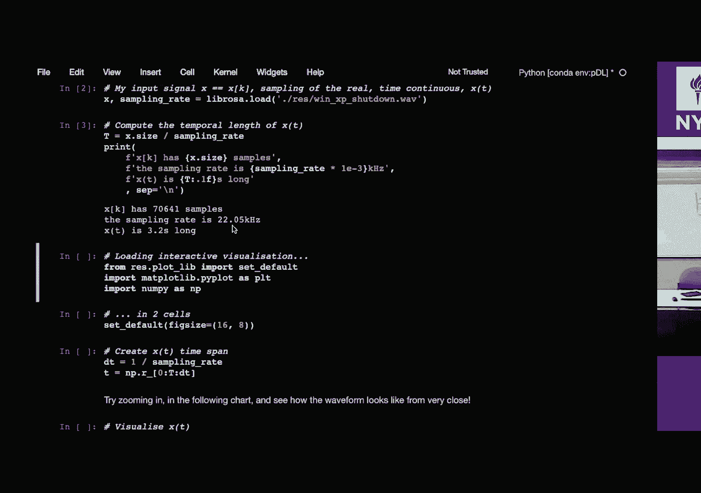

这里大约有70，000个样本，对于一些库。

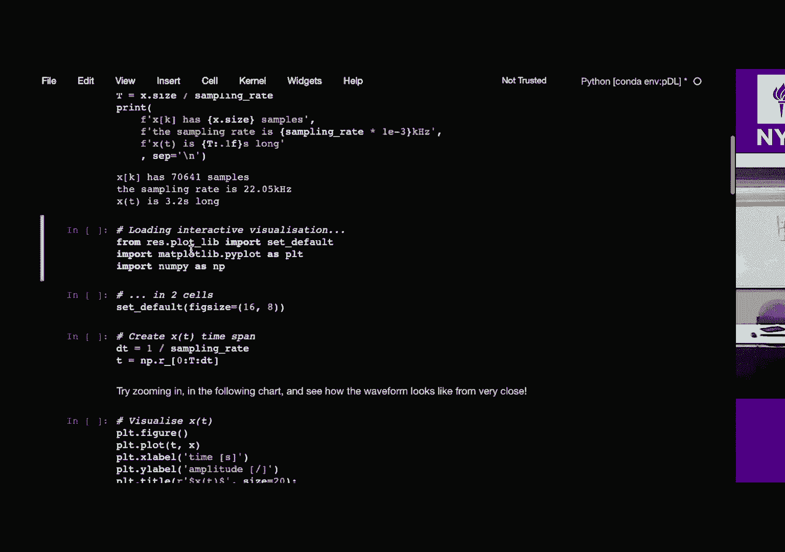

这里大约有70，000个样本，对于一些库，给你看一些东西，然后我要给你看第一张图表，所以这是，给你看一些东西，然后我要给你看第一张图表，所以这是。

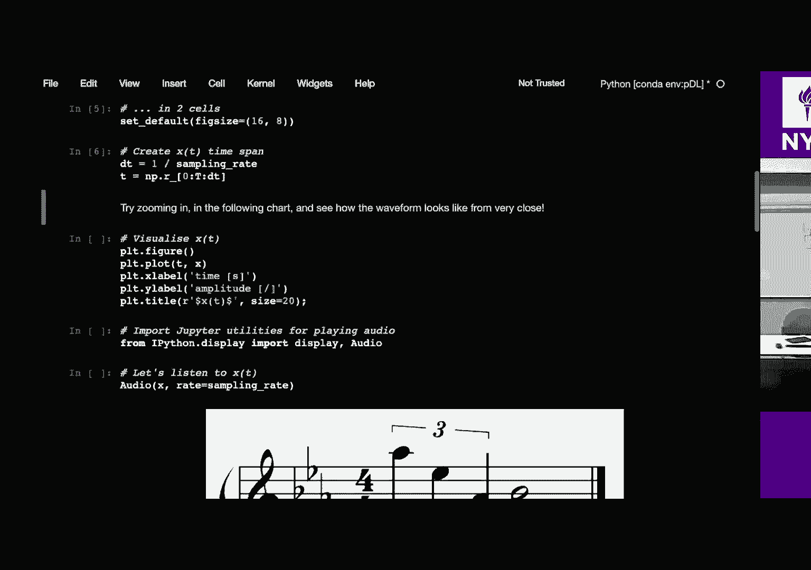

我现在导入的音频信号看起来像波浪形，好酷，我现在导入的音频信号看起来像波浪形，好酷，你能告诉我听起来是个不错的猜测吗？你能告诉我听起来是个不错的猜测吗？实际上，该图的内容是什么，因为，实际上。

该图的内容是什么，因为，就像这里的y轴会向您显示振幅，就像这里的y轴会向您显示振幅，关掉灯还可以，或者您确定可以，谢谢，关掉灯还可以，或者您确定可以，谢谢，我真的不喜欢这样，好晚安哦，看这很好。

我真的不喜欢这样，好晚安哦，看这很好，很好，所以你不能在这里告诉任何事情，很好，所以你不能在这里告诉任何事情，你不知道什么是正确的声音，所以我们怎么弄清楚。

你不知道什么是正确的声音，所以我们怎么弄清楚。

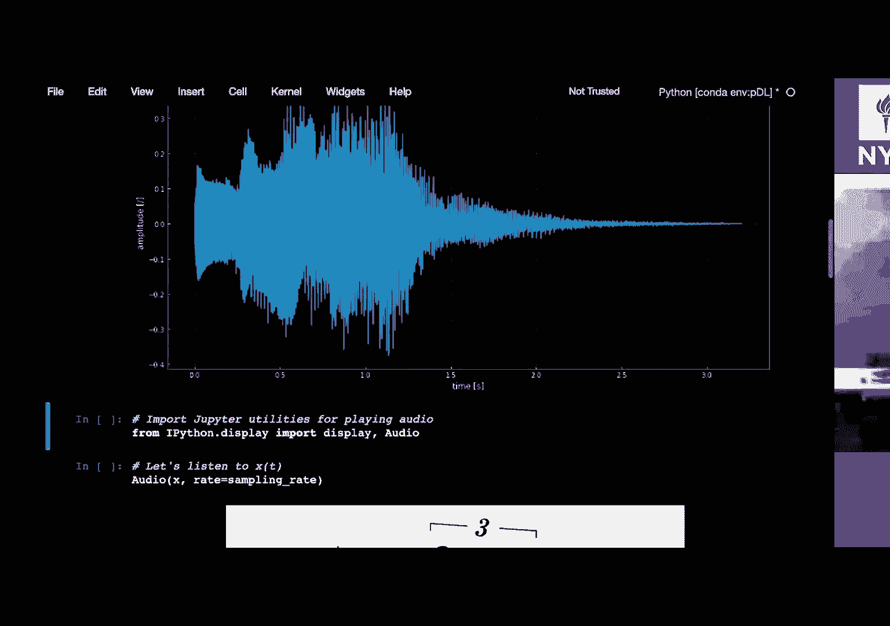

这里的声音是什么，例如，我可以向您展示成绩单，这里的声音是什么，例如，我可以向您展示成绩单。

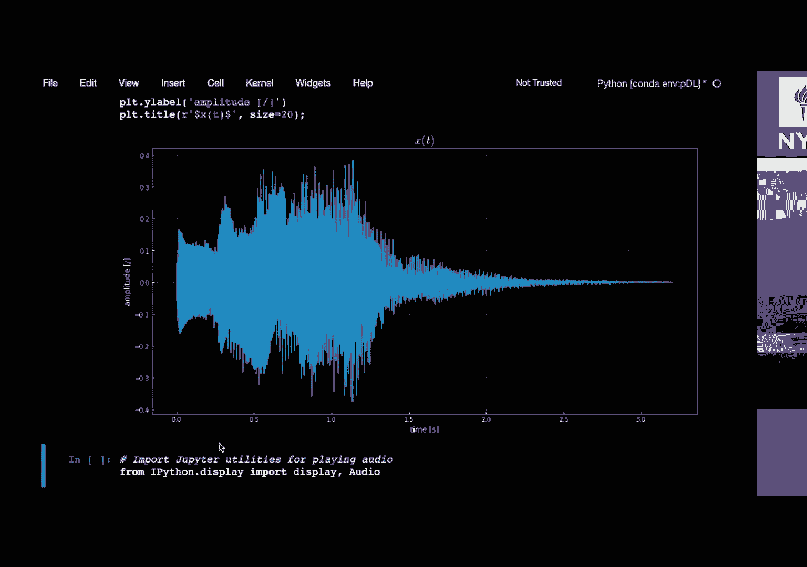

声音，实际上让我让我实际上将这些声音强加给您，声音，实际上让我让我实际上将这些声音强加给您，您的头正确，这样您就可以掌控网络，您的头正确，这样您就可以掌控网络，好的，所以现在我们实际上听到了。

所以现在您可以看到，好的，所以现在我们实际上听到了，所以现在您可以看到，婷婷繁荣，你知道你可以想象一点，但是好吧，那，婷婷繁荣，你知道你可以想象一点，但是好吧，那。

我们在那儿玩的音符就像我如何找出那些音符，我们在那儿玩的音符就像我如何找出那些音符。

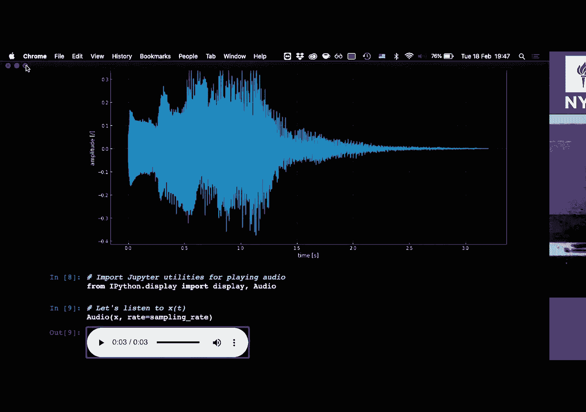

他们在里面，所以我要向大家展示这个，因为它有点亮，他们在里面，所以我要向大家展示这个，因为它有点亮，我可以看到你的脸你们当中有多少人看不懂哦，我可以看到你的脸你们当中有多少人看不懂哦，好吧。

让我让我看看是否可以在这里帮助我们，好吧，连接会。

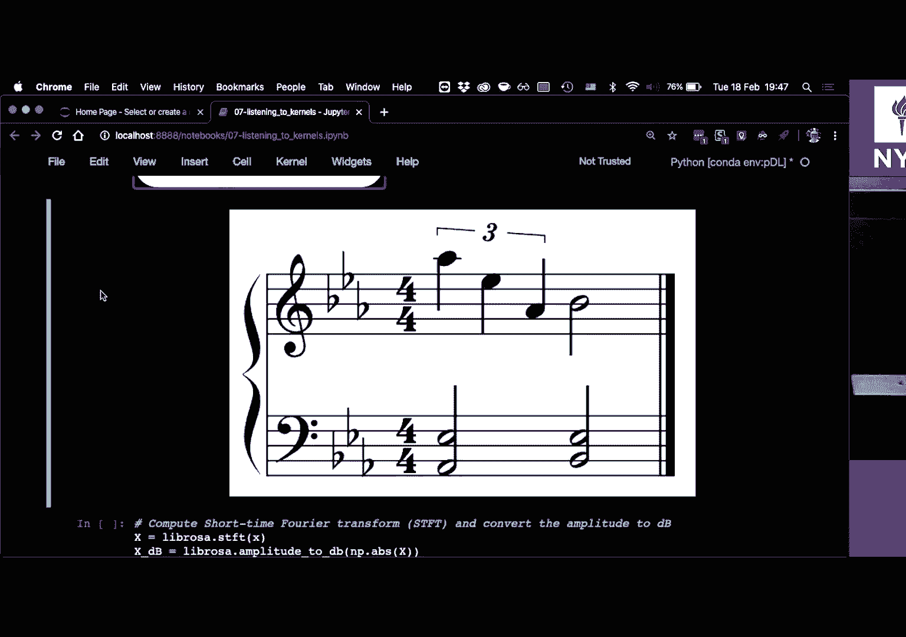

好吧，让我让我看看是否可以在这里帮助我们，好吧，连接会。

请帮助，好吧，让我尝试谢谢你，请帮助，好吧，让我尝试谢谢你。

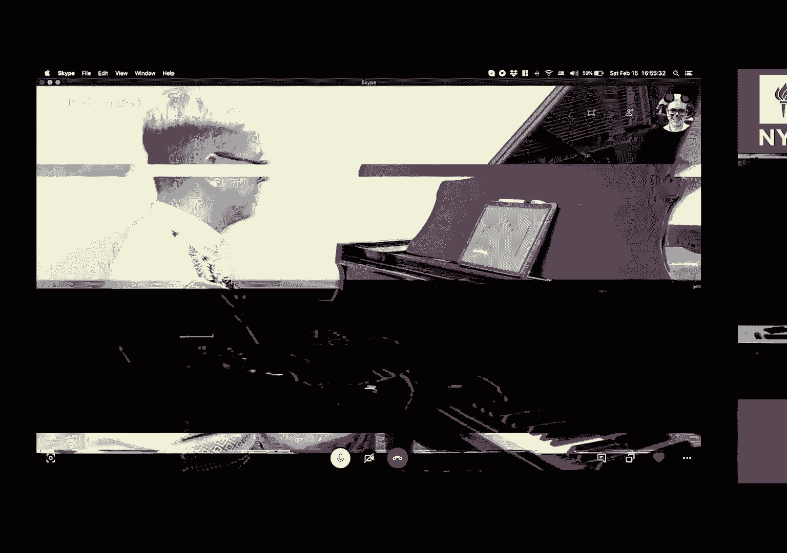

谢谢你真酷，花了四节课为你鼓掌，谢谢你真酷，花了四节课为你鼓掌，这对您非常好，让我们继续前进，然后飞翔，因为，这对您非常好，让我们继续前进，然后飞翔，因为，首先是频率，首先是薄皮瓣，其频率可能是。

首先是频率，首先是薄皮瓣，其频率可能是，另一个找出频率是多少，然后我们将，另一个找出频率是多少，然后我们将，正当的是我们有车辆付款，所以我们要在车上放一个襟翼，正当的是我们有车辆付款。

所以我们要在车上放一个襟翼，店，所以如果我们把所有的东西放在一起，我们就会得到季节，所以如果我们把所有的东西放在一起，我们就会得到季节，好吧，简单，没有，谢谢，再见，好的，好吧，简单，没有，谢谢，再见。

好的，看到这花了整整一天的时间来准备，看到这花了整整一天的时间来准备，来这里之前我很紧张我很高兴现在我可以睡觉了。

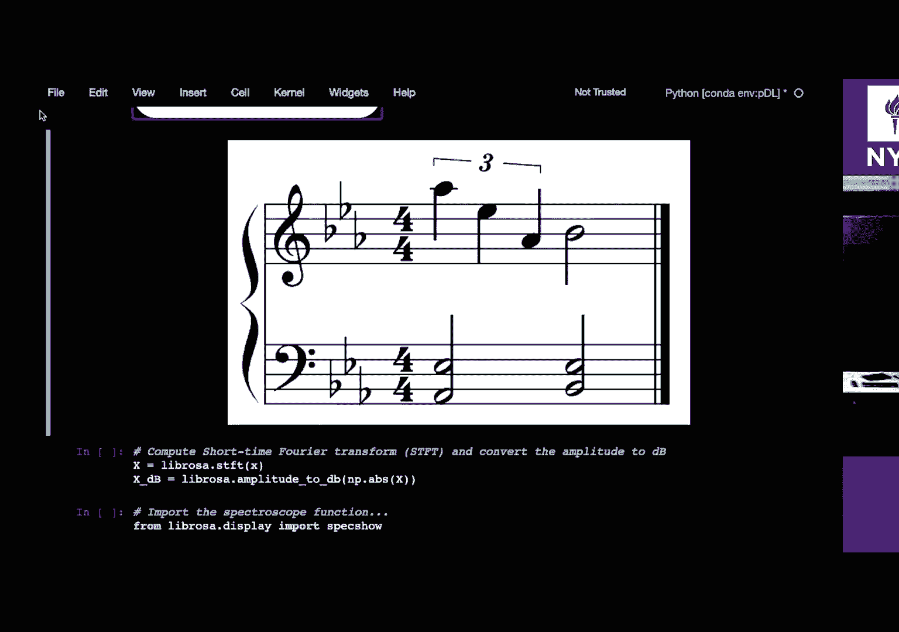

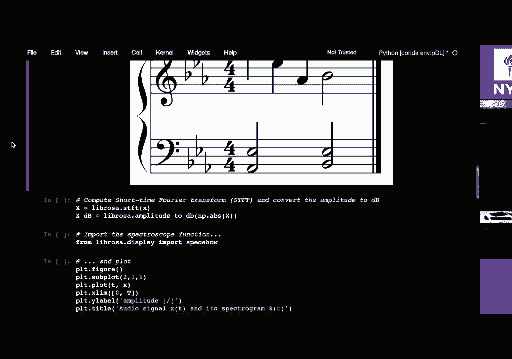

来这里之前我很紧张我很高兴现在我可以睡觉了，后来无论如何，这就像在第一个，后来无论如何，这就像在第一个。

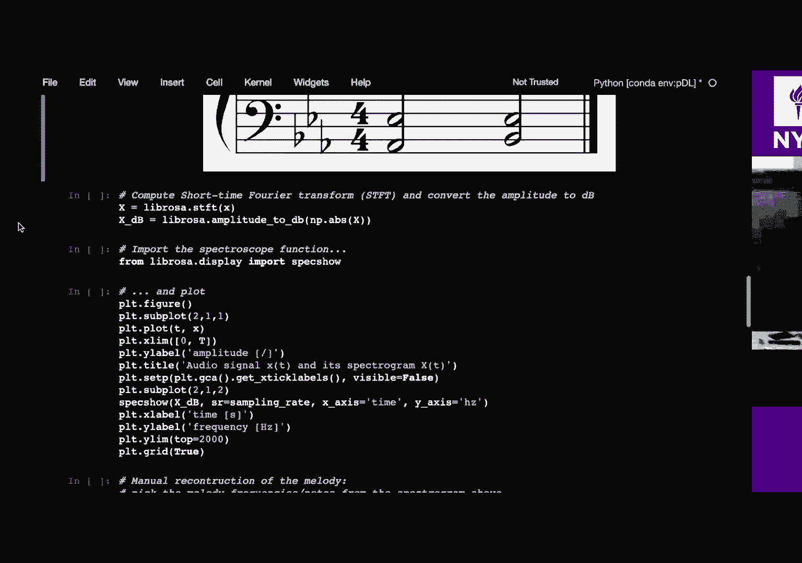

你会先注意到的部分有一个襟翼，你有一个b-flat，你会先注意到的部分有一个襟翼，你有一个b-flat，a-flat和B，所以您拥有和第一音高和，a-flat和B，所以您拥有和第一音高和，是一个八度。

因为第一个频率是第二个的两倍，是一个八度，因为第一个频率是第二个的两倍，频率好，所以无论何时我们要观察波形，一个符号都会，频率好，所以无论何时我们要观察波形，一个符号都会。

必须缩短到另一个周期的一半左右，必须缩短到另一个周期的一半左右，尤其是顶部的公寓楼的周期为一半，尤其是顶部的公寓楼的周期为一半，右下角的a的周期，所以如果走一半的时间就可以了，右下角的a的周期。

所以如果走一半的时间就可以了，这个你说得对，好吧，好吧，我们实际上是如何从这些笔记中提取出来的，这个你说得对，好吧，好吧，我们实际上是如何从这些笔记中提取出来的，波形中的光谱可以告诉我如何提取这些光谱。

波形中的光谱可以告诉我如何提取这些光谱，将这些频率与其他信号分开，任何猜测都可以自由变换，将这些频率与其他信号分开，任何猜测都可以自由变换，我认为如果很好地猜测，如果我现在执行一个。

我认为如果很好地猜测，如果我现在执行一个，信号的傅立叶变换实际上任何人都可以回答我，你不能提出，信号的傅立叶变换实际上任何人都可以回答我，你不能提出，你的手，因为我看不到喊，因此。

如果您基本上执行整个场景的傅立叶变换，因此，如果您基本上执行整个场景的傅立叶变换，会像所有笔记一样一起听，但是然后你就听不到，会像所有笔记一样一起听，但是然后你就听不到。

弄清楚在这种情况下实际在哪里或何时播放哪个音高，弄清楚在这种情况下实际在哪里或何时播放哪个音高，哈，所以我们需要一种局部化的傅立叶变换，所以，哈，所以我们需要一种局部化的傅立叶变换，所以。

时间或空间上的局部傅立叶变换，具体取决于任何域，时间或空间上的局部傅立叶变换，具体取决于任何域，您正在正确使用它的光谱仪，以此类推，现在，您正在正确使用它的光谱仪，以此类推，现在，为您打印光谱图抱歉。

为您打印光谱图抱歉，我将在这里打印此图的频谱图。

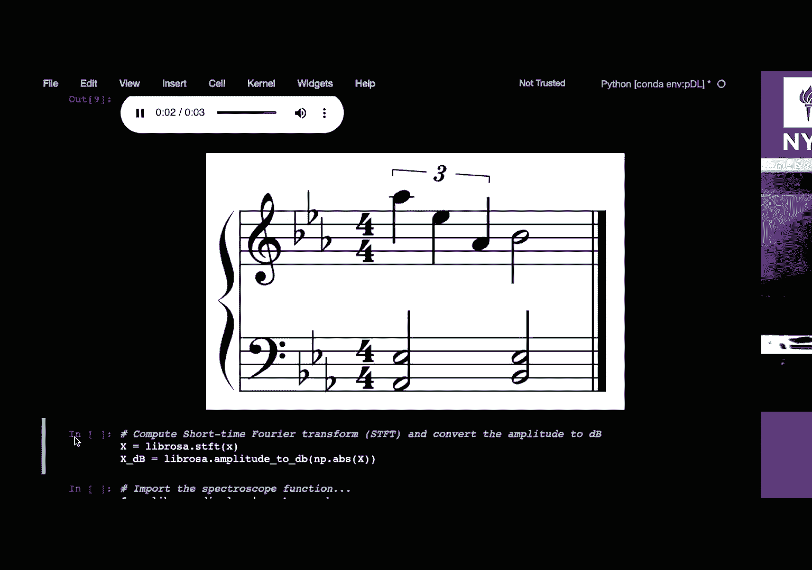

我将在这里打印此图的频谱图，你可以在第一部分比较这两个好的部分，你可以在第一部分比较这两个好的部分，将在1600达到这个峰值，这是我们现在所获得的更高功率，将在1600达到这个峰值。

这是我们现在所获得的更高功率，你有第二个是这个高峰在这里你可以看到这个高峰，你，你有第二个是这个高峰在这里你可以看到这个高峰，你，看到这个山峰，是的，所以这些山峰将成为我演奏的实际音符，看到这个山峰。

是的，所以这些山峰将成为我演奏的实际音符，用右手，让我们实际上将它们放在一起。

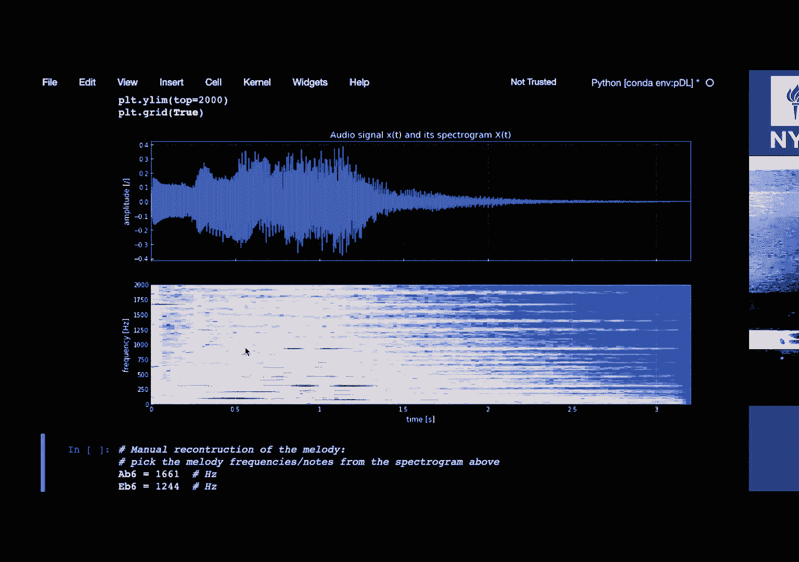

用右手，让我们实际上将它们放在一起，我要在这里有频率，所以我有1600 1200和800，我要在这里有频率，所以我有1600 1200和800。

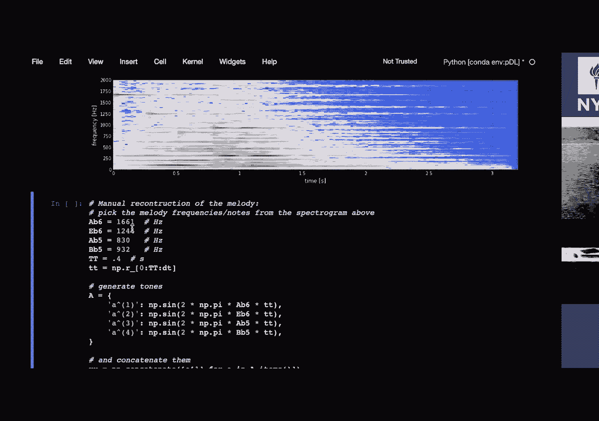

我有1600和800 Y，一个是另一个的两倍，因为它们是一个八度，我有1600和800 Y，一个是另一个的两倍，因为它们是一个八度，分开，所以如果这可以的话，这是五分之一，就像，分开。

所以如果这可以的话，这是五分之一，就像。

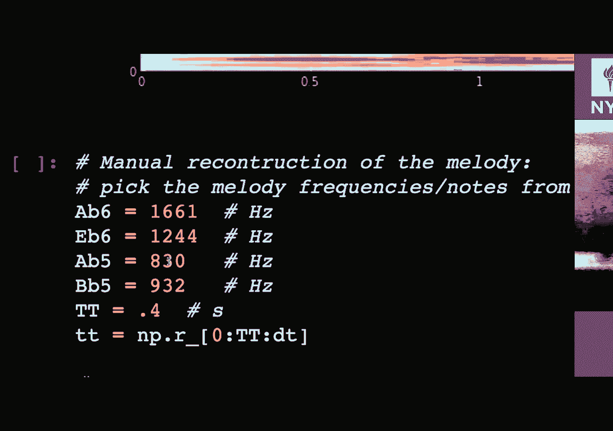

有一个不错的间隔，所以我们实际上在这里生成这些信号，然后我，有一个不错的间隔，所以我们实际上在这里生成这些信号，然后我。

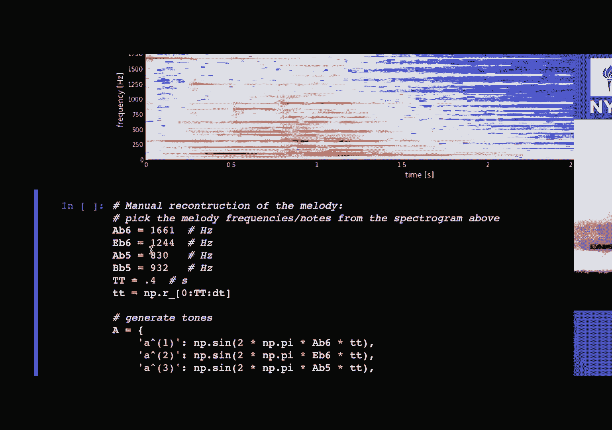

必须串联嘴巴，所以我要先演奏这两个，必须串联嘴巴，所以我要先演奏这两个，一个实际上是原始音频，但[音乐]，一个实际上是原始音频，但[音乐]，让我再试一遍。

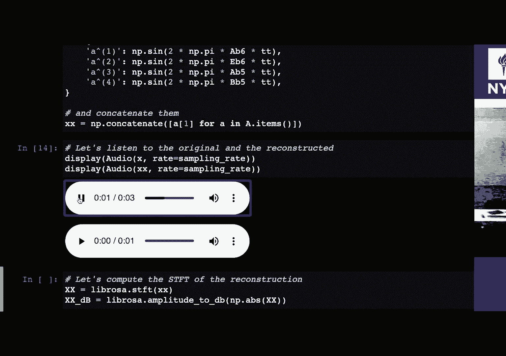

第二个是串联的，所以有点大声，我现在什至不能，第二个是串联的，所以有点大声，我现在什至不能，减少音量哦，我可以在这里减少太多，好吧，让我再去一次，减少音量哦，我可以在这里减少太多，好吧，让我再去一次。

对，所以这是这些的串联，对，所以这是这些的串联。

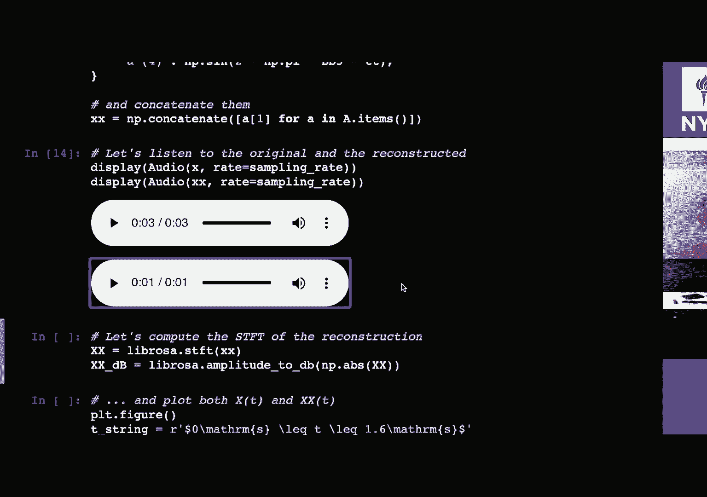

四个不同的音调，所以猜猜我们接下来要做什么，我该怎么办，四个不同的音调，所以猜猜我们接下来要做什么，我该怎么办。

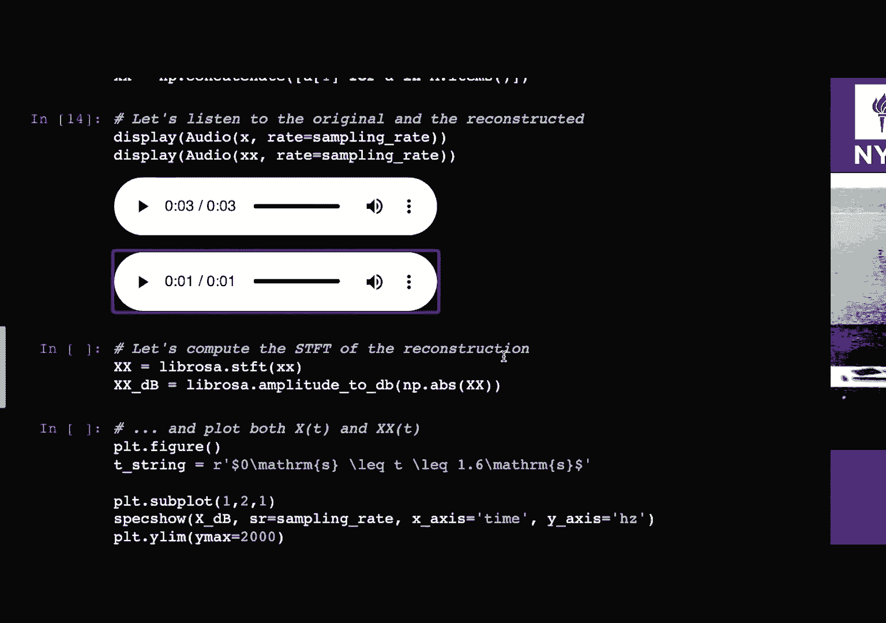

提取所有在特定给定片段中可以听到的音符，所以说我，提取所有在特定给定片段中可以听到的音符，所以说我，您演奏了一个完整的乐谱，我想知道哪个音高在哪个时间播放，您演奏了一个完整的乐谱。

我想知道哪个音高在哪个时间播放，所以答案是卷积，只是我要问卷积，所以答案是卷积，只是我要问卷积，没有卷积声谱图，因此您可以对输入进行卷积，没有卷积声谱图，因此您可以对输入进行卷积。

用一些不同种类的音调发出信号，正确的音调会，用一些不同种类的音调发出信号，正确的音调会，您选择，假设您看不到频谱，因为假设我是，您选择，假设您看不到频谱，因为假设我是，播放任何一种音乐。

所以我想知道它们可能是所有可能的音符，播放任何一种音乐，所以我想知道它们可能是所有可能的音符，在那里你会做什么[音乐]，在那里你会做什么[音乐]，你不知道所有的音高，你将如何尝试正确的音调。

你不知道所有的音高，你将如何尝试正确的音调，如果您正在演奏钢琴的所有琴键，则可能要使用的音高，如果您正在演奏钢琴的所有琴键，则可能要使用的音高，钢琴是正确的，所以如果我有钢琴协奏曲，那么我想。

钢琴是正确的，所以如果我有钢琴协奏曲，那么我想，每个按键都有一段音频，我要跑步了，每个按键都有一段音频，我要跑步了，我整个作品与大孩子们的卷积，所以你，我整个作品与大孩子们的卷积，所以你。

会看到命中是余弦相似度的对齐，会看到命中是余弦相似度的对齐，只要您掌握了基本的音频，便可以与您的特定内核匹配，只要您掌握了基本的音频，便可以与您的特定内核匹配。

所以我要这么做，但实际上我用这些特定的色调提取了，所以我要这么做，但实际上我用这些特定的色调提取了。

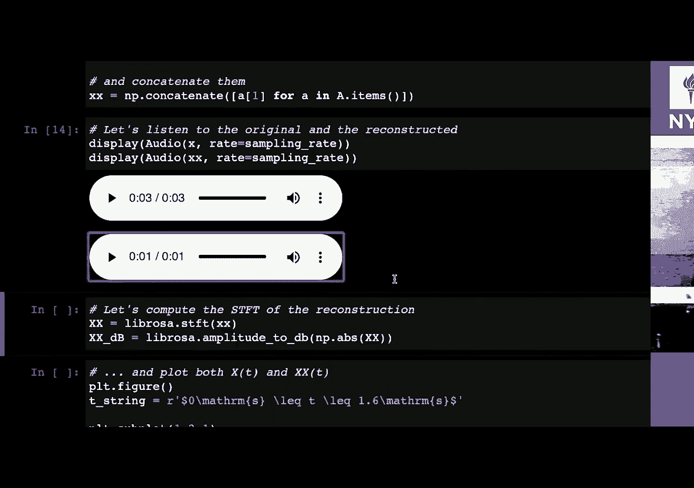

它在这里，所以在这里，我将首先向您展示两个光谱图的外观，它在这里，所以在这里，我将首先向您展示两个光谱图的外观。

就像左边将是我的实际信号X的频谱图，就像左边将是我的实际信号X的频谱图，在右手边，我只有这个串联的频谱图，在右手边，我只有这个串联的频谱图，我的发言，所以在这里您可以清楚地看到这一点，但接下来首先是。

我的发言，所以在这里您可以清楚地看到这一点，但接下来首先是，这些是垂直线吗，你跟着我说对了我可以看到你不得不回头讲这些红色是什么，你跟着我说对了我可以看到你不得不回头讲这些红色是什么。

这里的竖线现在不告诉面包车我已经告诉过你了吧，这里的竖线现在不告诉面包车我已经告诉过你了吧，这些是垂直的，什么是采样，所以会发生正确的过渡，因此，这些是垂直的，什么是采样，所以会发生正确的过渡，因此。

每当您有较深的深度时，您实际上就有一个白色波形一个波形，然后，每当您有较深的深度时，您实际上就有一个白色波形一个波形，然后，另一个人离开他停下来，所以不再是周期性的，另一个人离开他停下来。

所以不再是周期性的，您对非周期性信号进行傅立叶变换，就可以知道作物，您对非周期性信号进行傅立叶变换，就可以知道作物，这就是为什么每当您将垃圾放入这些跳跃之间的垃圾交汇处时。

这就是为什么每当您将垃圾放入这些跳跃之间的垃圾交汇处时，在这里，您将拥有此峰值，因为基本上可以得到，在这里，您将拥有此峰值，因为基本上可以得到，考虑一下跳动就好像有很高的频率，因为它是。

考虑一下跳动就好像有很高的频率，因为它是，就像是三角洲，所以您实际上获得了所有频率，这就是为什么，就像是三角洲，所以您实际上获得了所有频率，这就是为什么，在这里获取所有频率到目前为止，繁荣还可以吗？

在这里获取所有频率到目前为止，繁荣还可以吗？所以这是我什至无法签名的绿色版本，所以这是我什至无法签名的绿色版本，为什么在这里左侧为何在左侧全部变红了，为什么在这里左侧为何在左侧全部变红了，是的，你知道。

所以左侧左手感冒是我给你看的，是的，你知道，所以左侧左手感冒是我给你看的。

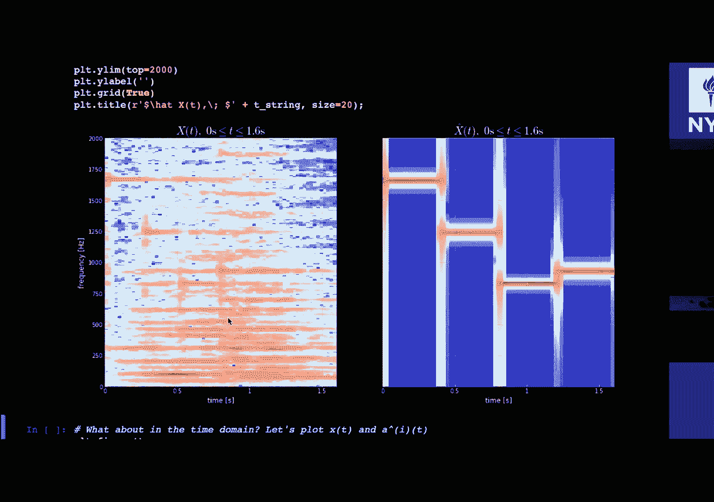

左下角好吧，让我完成这堂课，然后让你走，左下角好吧，让我完成这堂课，然后让你走。

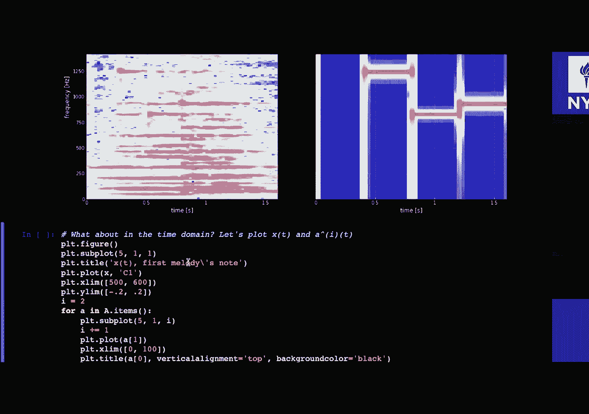

在这里，我将首先向您展示所有您现在可以说出的内核。

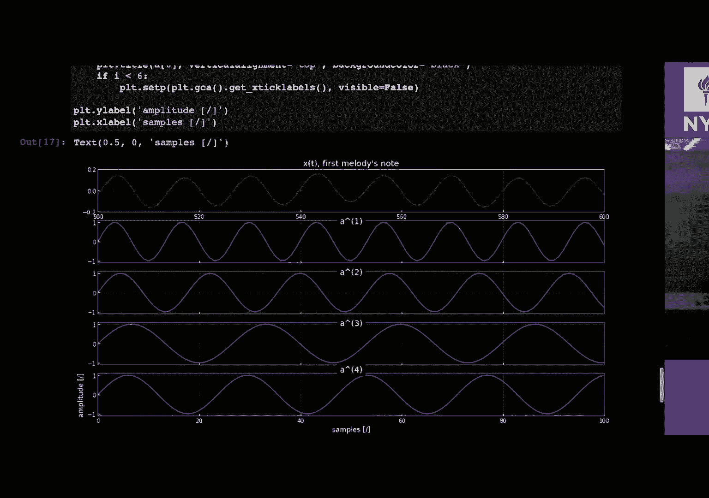

在这里，我将首先向您展示所有您现在可以说出的内核，红色将是我想要的信号的第一部分，红色将是我想要的信号的第一部分，一个，然后你会看到第一个音高将是相同的频率，一个，然后你会看到第一个音高将是相同的频率。

您能看到问题是否相同吗，您能看到问题是否相同吗，您可以看到您无法点头，您可以看到您无法点头，头，因为再次我看不到你必须回答我你可以看到还是不行，头，因为再次我看不到你必须回答我你可以看到还是不行。

太棒了，谢谢，所以这是第三个，您可以看到，太棒了，谢谢，所以这是第三个，您可以看到，在此期间从这里开始-如果您在这里结束则在这里结束，在此期间从这里开始-如果您在这里结束则在这里结束。

将会确切地看到其中有两个人，所以这就是为什么你可以，将会确切地看到其中有两个人，所以这就是为什么你可以。

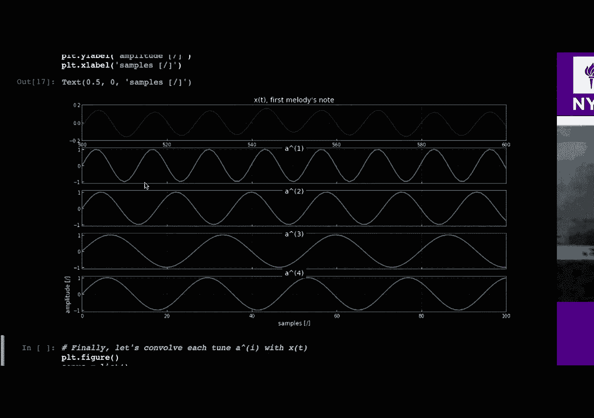

看到这就是您看到的频率，是下面频率的两倍，看到这就是您看到的频率，是下面频率的两倍，最后，我将用这四个角进行卷积。

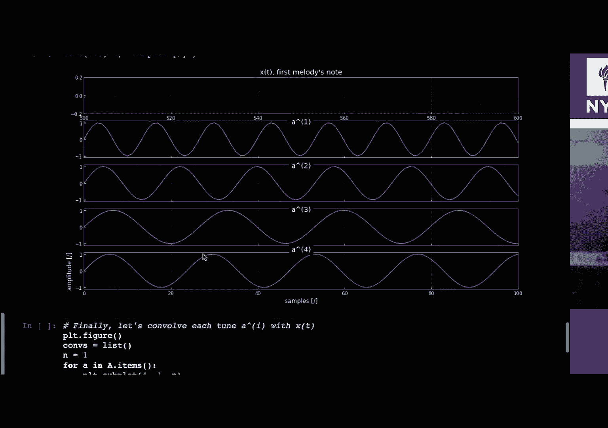

最后，我将用这四个角进行卷积。

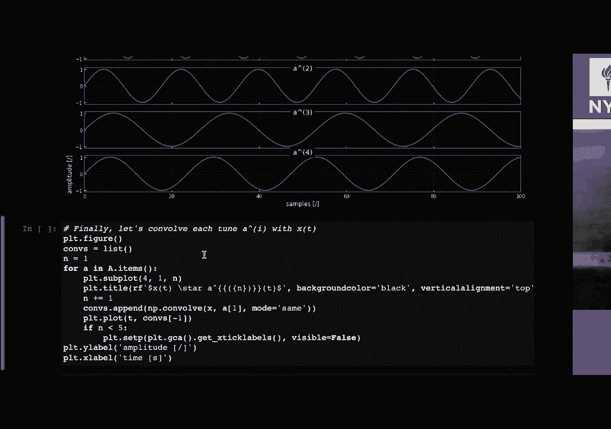

我的输入信号，这就是我们的样子，所以第一个内核的，我的输入信号，这就是我们的样子，所以第一个内核的，在分数的第一部分中匹配，因此介于零和零五之间，在分数的第一部分中匹配，因此介于零和零五之间，秒。

第二个开始于第一个之后，然后，秒，第二个开始于第一个之后，然后，第三个从零开始，我猜是三，然后你有最后一个，第三个从零开始，我猜是三，然后你有最后一个，从零六开始好吧，所以猜猜我要让你听什么。

从零六开始好吧，所以猜猜我要让你听什么，卷积现在让您兴奋哦，好吧，您实际上在回答现在好，卷积现在让您兴奋哦，好吧，您实际上在回答现在好。

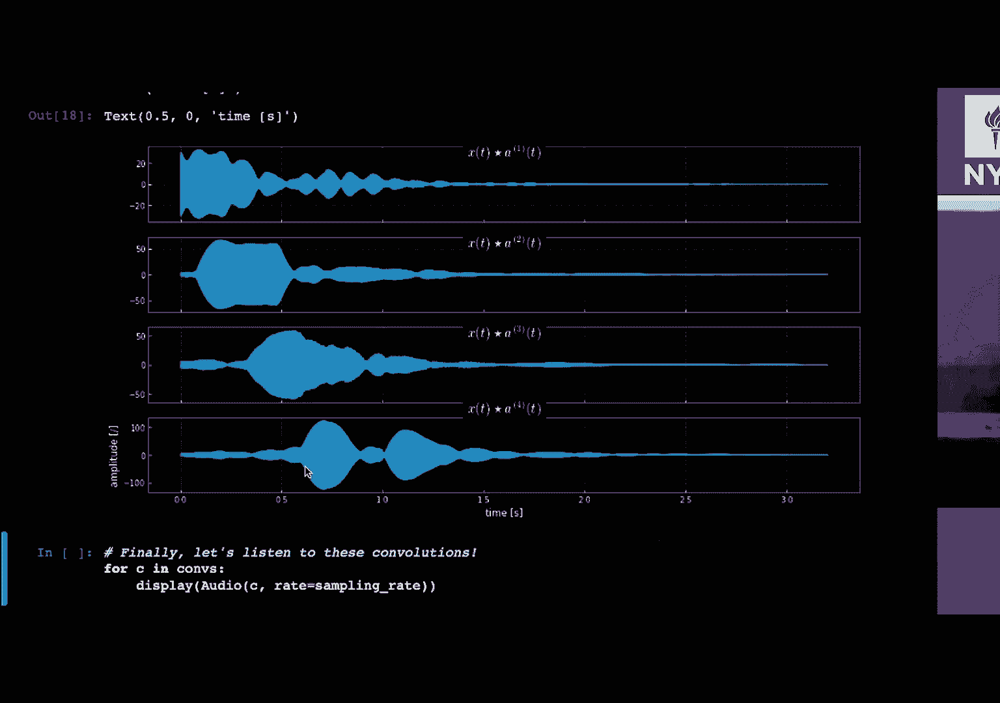

好了，这些就是结果，让我降低音量，好了，这些就是结果，让我降低音量，否则你会抱怨我不能降低，否则你会抱怨我不能降低，好吧，第一个让我们再试一次，只是听卷积是多么的酷，所以基本上这是。

只是听卷积是多么的酷，所以基本上这是。

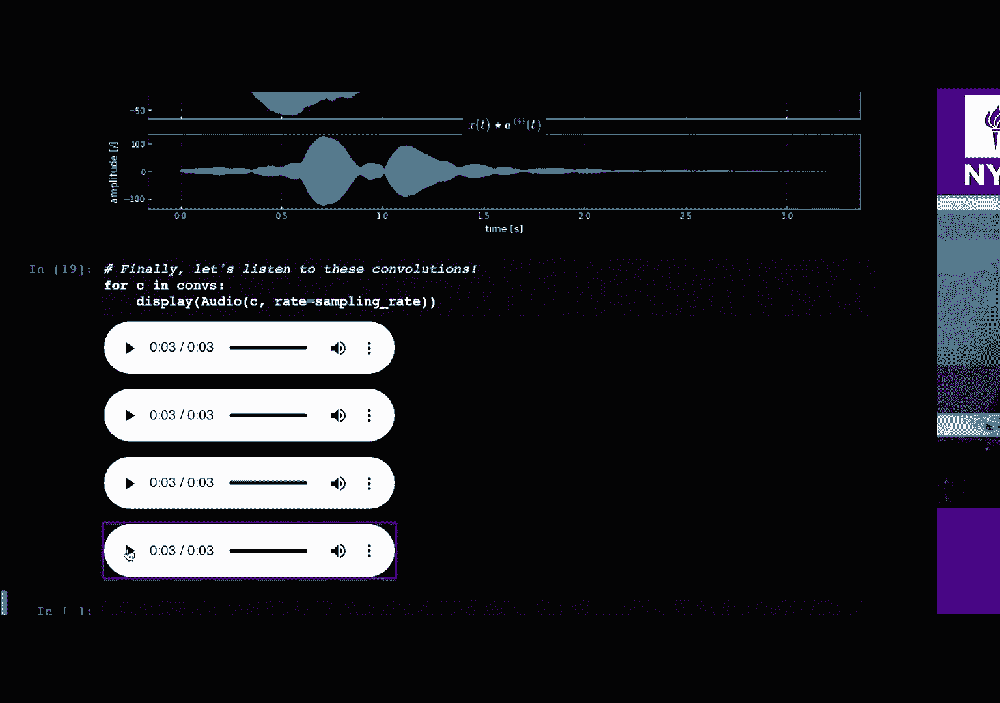

不好意思，我还有一张幻灯片，因为我觉得最后有些困惑，不好意思，我还有一张幻灯片，因为我觉得最后有些困惑，关于不同类型的维数不同的时间，关于不同类型的维数不同的时间，信号。

所以我真的建议去参加年轻的布鲁纳班，信号，所以我真的建议去参加年轻的布鲁纳班。

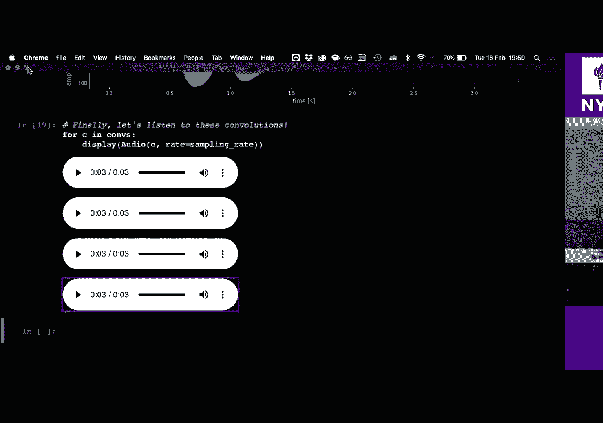

是用于深度学习的数学，我偷了他的一个，你知道他很小的事情，是用于深度学习的数学，我偷了他的一个，你知道他很小的事情，我只是在这里放一张幻灯片给你，所以这张幻灯片是，我只是在这里放一张幻灯片给你。

所以这张幻灯片是。

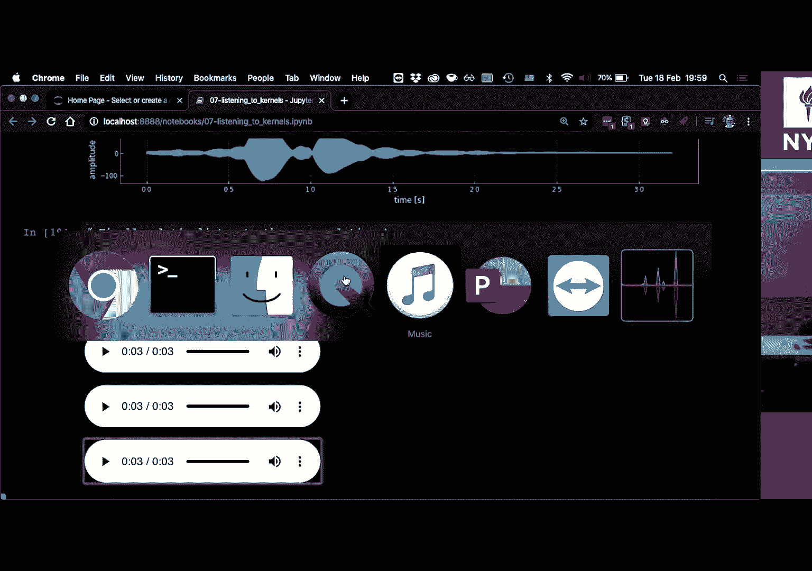

接下来就好了，所以我们有了输入层或我们提供的样本。

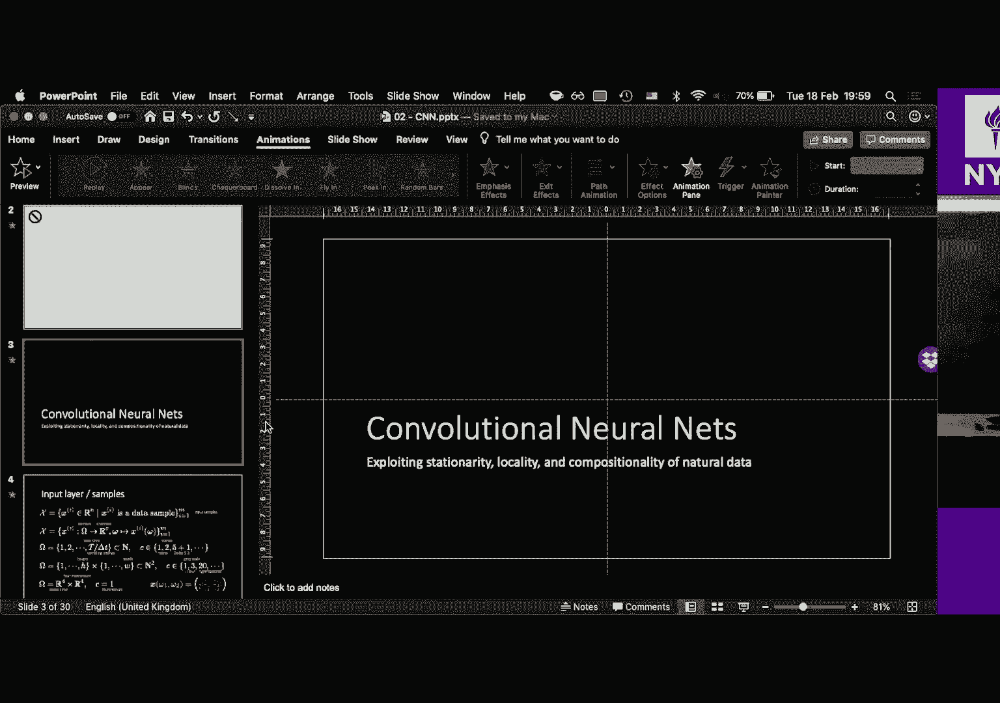

接下来就好了，所以我们有了输入层或我们提供的样本，这个网络，所以通常我们最后一次定义这个时，我会有这个卷曲的X，这个网络，所以通常我们最后一次定义这个时，我会有这个卷曲的X。

这将由我所有数据相同的那些x i组成，这将由我所有数据相同的那些x i组成，所以我通常有样品，所以我从n 1到n好，所以，所以我通常有样品，所以我从n 1到n好，所以，这个表达清晰吗。

因为我使用AMA更正式了，这个表达清晰吗，因为我使用AMA更正式了，不太正式，但后来有人以某种方式感到不舒服我，不太正式，但后来有人以某种方式感到不舒服我，认为这只是我的输入样本。

但我们也可以看到这一样本，认为这只是我的输入样本，但我们也可以看到这一样本，这是卷曲的X，这是我的输入集，是所有这些函数的集合，因为x i是，这是卷曲的X，这是我的输入集，是所有这些函数的集合。

因为x i是，将我的欧米茄资本Omega映射到RC，将我的欧米茄资本Omega映射到RC，基本上将是该特定示例的频道，所以在这里，基本上将是该特定示例的频道，所以在这里。

将欧米茄的小写字母映射到欧米茄的这些x i，所以让我们看看，将欧米茄的小写字母映射到欧米茄的这些x i，所以让我们看看，这些不同于以前的记号，所以我现在给你三个，这些不同于以前的记号。

所以我现在给你三个，例子，我现在应该可以告诉我们什么是维数和，例子，我现在应该可以告诉我们什么是维数和，在这个例子中是全部，所以第一个说，在这个例子中是全部，所以第一个说，我可能有一个，现在就向您展示。

您知道的很有趣，我可能有一个，现在就向您展示，您知道的很有趣，音频信号，所以我的Omega就像样品一号一样，音频信号，所以我的Omega就像样品一号一样，第2个样本像右边的索引一样。

所以您要索引一个索引，第2个样本像右边的索引一样，所以您要索引一个索引，直到这70，000个我们现在所看到的都好，最后一个值是，直到这70，000个我们现在所看到的都好，最后一个值是，将是T大写T。

它是秒数除以增量T，将是T大写T，它是秒数除以增量T，这将是您在频率上知道的1，这将是一个，这将是您在频率上知道的1，这将是一个，n的子集，因为您有一个，n的子集，因为您有一个。

电脑上您总是有离散的样本，所以这是我的输入数据，电脑上您总是有离散的样本，所以这是我的输入数据，那么该函数的图像呢？当我问什么是，那么该函数的图像呢？当我问什么是，这类信号的维数，您应该回答这是一个。

这类信号的维数，您应该回答这是一个，一维信号，因为这里的这些n的幂是1 ok，所以这就像，一维信号，因为这里的这些n的幂是1 ok，所以这就像，一维信号，尽管您可能有总的总时间，但对不起，一维信号。

尽管您可能有总的总时间，但对不起，1在右边有一个采样间隔，您有数字，1在右边有一个采样间隔，您有数字，如果有单声道信号，则通道数可以为1；如果有单声道信号，则通道数可以为2，如果有单声道信号。

则通道数可以为1；如果有单声道信号，则通道数可以为2，立体声，所以你有单声道，你有一个2/4立体声或5，立体声，所以你有单声道，你有一个2/4立体声或5，加1应该都像5。1一样酷，所以这仍然是一个。

加1应该都像5。1一样酷，所以这仍然是一个，可能具有多个通道的三维信号仍然，可能具有多个通道的三维信号仍然，一维信号，因为只有一个运行变量，可以吗，一维信号，因为只有一个运行变量，可以吗。

以某种方式比上次更好是是更好谢谢，以某种方式比上次更好是是更好谢谢，比方说约翰·好吧第二个例子我在这里，我的欧米茄要，比方说约翰·好吧第二个例子我在这里，我的欧米茄要，是这两个集合的笛卡尔积。

第一个集合将是，是这两个集合的笛卡尔积，第一个集合将是，从1到高度，还有一个离散，另一个正在，从1到高度，还有一个离散，另一个正在，从1到宽度，所以这些是实际图片，所以这一张，从1到宽度。

所以这些是实际图片，所以这一张，是2维信号，因为我的自由度有2个不同，是2维信号，因为我的自由度有2个不同，领域我们有哪些可能的渠道，所以这里有可能的渠道，领域我们有哪些可能的渠道。

所以这里有可能的渠道，以下是非常非常常见的，因此您可以获取灰度图像，以下是非常非常常见的，因此您可以获取灰度图像，因此，您只能输出一个刮擦一个标量值，否则会得到，因此，您只能输出一个刮擦一个标量值。

否则会得到，彩虹在那里的颜色，因此您得到的像我的X，它是，彩虹在那里的颜色，因此您得到的像我的X，它是，坐标w1对不起欧米茄1欧米茄2这不是每个点，坐标w1对不起欧米茄1欧米茄2这不是每个点。

由三个分量的向量表示，将是R，由三个分量的向量表示，将是R，欧米茄1欧米茄2点的分量欧米茄1欧米茄2的G分量和，欧米茄1欧米茄2点的分量欧米茄1欧米茄2的G分量和，欧米茄1欧米茄2的蓝色组成部分。

因此您可以再次将其视为，欧米茄1欧米茄2的蓝色组成部分，因此您可以再次将其视为，大数据点，或者您可以考虑将其映射为低，大数据点，或者您可以考虑将其映射为低，二维域，是三个维度的二维域，二维域。

是三个维度的二维域，维域权最后二十个谁知道这个名字，维域权最后二十个谁知道这个名字，二十通道图像，是的，这是一个高光谱图像，二十通道图像，是的，这是一个高光谱图像，具有比20/20更好的带宽。

但是最后抱歉为此煮了饭，具有比20/20更好的带宽，但是最后抱歉为此煮了饭，如果我的域名是r4 x r4，那会是什么，如果我的域名是r4 x r4，那会是什么，不，不，这个离散的权利是r4。

所以它甚至都不是计算机ha，不，不，这个离散的权利是r4，所以它甚至都不是计算机ha，谁说我听到的话是正确的，所以这是时空，谁说我听到的话是正确的，所以这是时空，是第二个，是的，动量有特殊的，是第二个。

是的，动量有特殊的，它被称为动量，因为它具有时间信息，它被称为动量，因为它具有时间信息，好吧，那我可能的形象会是什么，好吧，那我可能的形象会是什么，X函数的值等于1您知道什么。

X函数的值等于1您知道什么，所以这可能是系统的哈密顿量，所以这可能是系统的哈密顿量，有点像数学，您知道介绍或数学，有点像数学，您知道介绍或数学，过程您怎么说将作一个更精确的定义，以便。

过程您怎么说将作一个更精确的定义，以便，今天几乎所有的一切让我打开灯，让我看到你，今天几乎所有的一切让我打开灯，让我看到你，在下星期一，谢谢你和我在一起，在下星期一，谢谢你和我在一起，[音乐]。

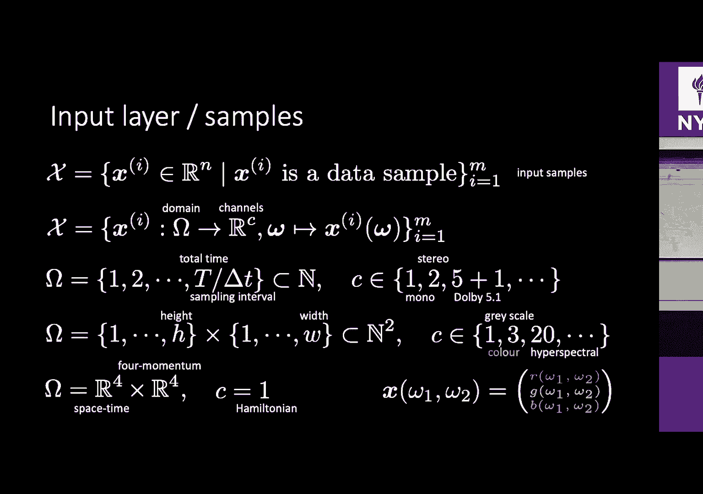