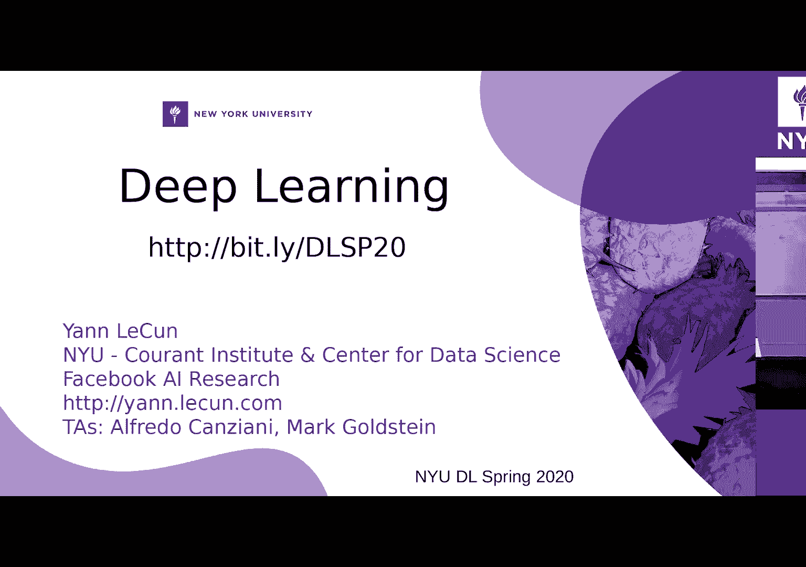
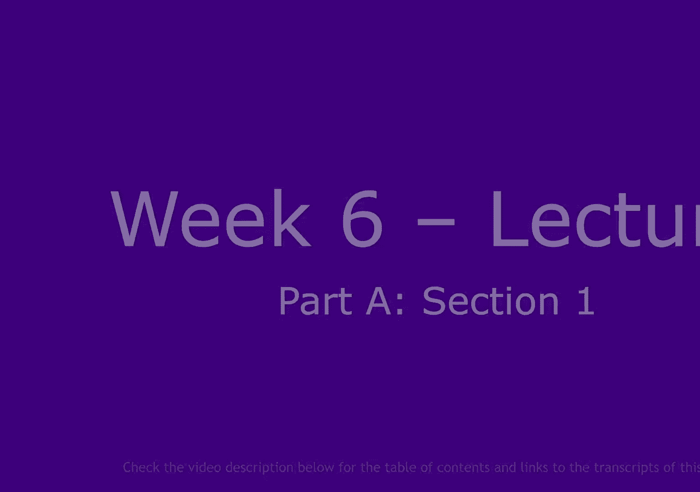
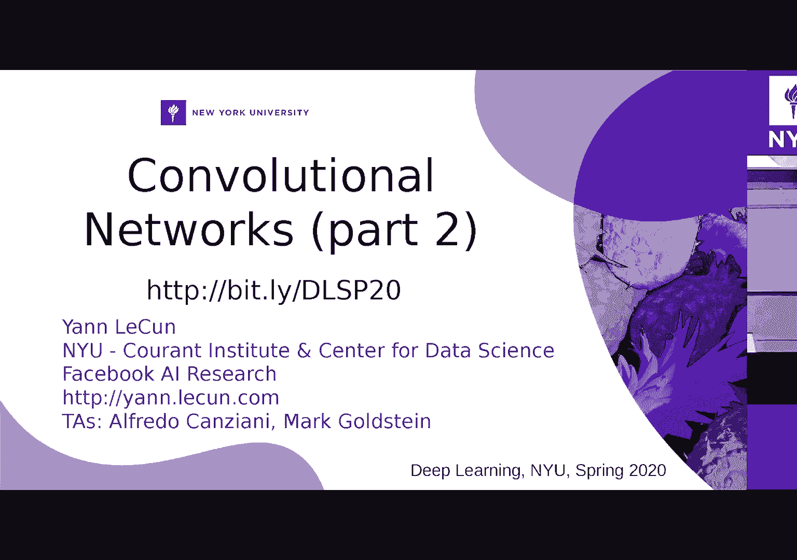
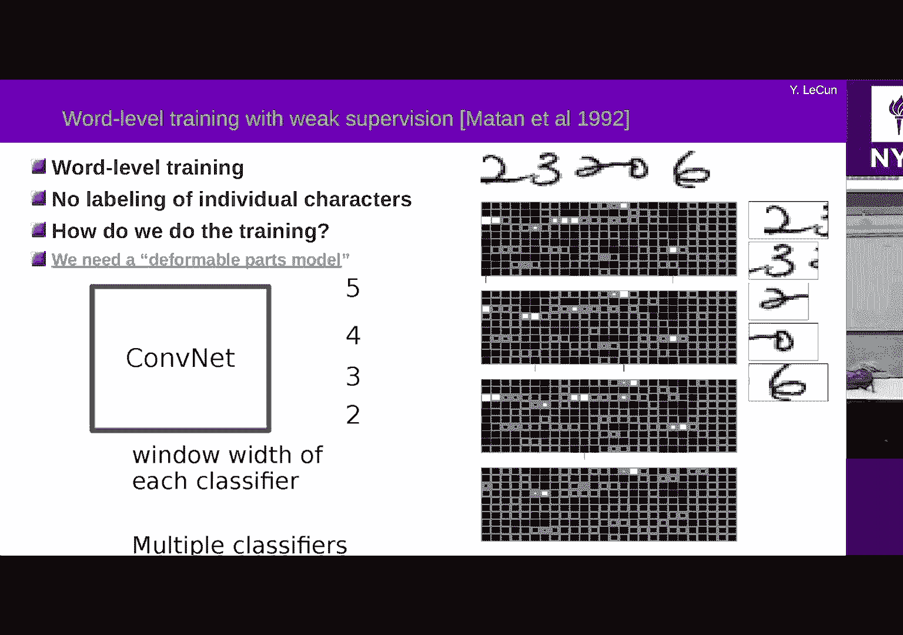

# 【NYU】纽约大学深度学习入门课程（with pytorch）中英文字幕 - P10：10. Week 6 – Lecture - CNN applications, RNN, and attention - 大佬的迷弟的粉丝 - BV1o5411p7AB

所以我想做两件事，谈论一些像一些，所以我想做两件事，谈论一些像一些，我从未经历过的各种方式使用商业网的方法，我从未经历过的各种方式使用商业网的方法，时间，我还将讨论不同类型的架构，时间。

我还将讨论不同类型的架构，其中一些是人们一直在玩的最新设计，其中一些是人们一直在玩的最新设计，有一段时间了，所以是C，所以上次我们谈论，有一段时间了，所以是C，所以上次我们谈论。

关于商业网，我们停止了可以使用商业网的想法，关于商业网，我们停止了可以使用商业网的想法，通过滑动，我们对大图像进行处理，其中包括。

通过滑动，我们对大图像进行处理，其中包括，大图的完成这是非常普通的图像，大图的完成这是非常普通的图像，方法，所以我们将在使用方式上看到更多信息，方法，所以我们将在使用方式上看到更多信息，商业网队。

在某种程度上，我将依靠先生的历史，商业网队，在某种程度上，我将依靠先生的历史，论文和类似的东西来解释所有这些的简单形式，论文和类似的东西来解释所有这些的简单形式，就像我上次说的那样，我有这个例子。

就像我上次说的那样，我有这个例子，图像上有多个字符，您可以拥有一个商业网，图像上有多个字符，您可以拥有一个商业网，输出也是一个系数，就像每天的空气都是卷积一样，因此您可以，输出也是一个系数。

就像每天的空气都是卷积一样，因此您可以，将输出解释为基本上给您每个类别和每个类别的分数，将输出解释为基本上给您每个类别和每个类别的分数，输入中的每个窗口以及该窗口的框架取决于。

输入中的每个窗口以及该窗口的框架取决于，当您为我的特定项目投影时，系统观察到的窗口，当您为我的特定项目投影时，系统观察到的窗口，通过子采样量输出总步数，通过子采样量输出总步数，您在网络中拥有的东西。

因此，如果您有两层通过，您在网络中拥有的东西，因此，如果您有两层通过，例如，您有两个池化层，这就是，例如，您有两个池化层，这就是，两个子采样率之和为4，这意味着每个输出，两个子采样率之和为4。

这意味着每个输出，基本上要看输入和连续输出上的一个窗口，基本上要看输入和连续输出上的一个窗口，要看被四个分开的窗户，要看被四个分开的窗户，像素好吧，这只是所有子采样层的乘积，所以这是，像素好吧。

这只是所有子采样层的乘积，所以这是，很好，但是您必须了解输入中的所有内容，很好，但是您必须了解输入中的所有内容，您是否挑选出彼此重叠的物体等一物，您是否挑选出彼此重叠的物体等一物。

可以做到的叫做正常无最大抑制，这就是人们，可以做到的叫做正常无最大抑制，这就是人们，用于某种物体检测，所以基本上，如果，用于某种物体检测，所以基本上，如果，您在同一位置或多或少有或多或少的输出。

您在同一位置或多或少有或多或少的输出，就像重叠的地方，其中一个告诉你我看见了一只熊，另一只告诉，就像重叠的地方，其中一个告诉你我看见了一只熊，另一只告诉，告诉你我看到一匹马赢了，好吧，这可能是错的。

告诉你我看到一匹马赢了，好吧，这可能是错的，你不能在同一时间在同一时间承受一匹马，你不能在同一时间在同一时间承受一匹马，所谓的“没有最大压制”，您可以看看其中哪个具有，所谓的“没有最大压制”。

您可以看看其中哪个具有，得分最高，您会选择那个，或者您是否发现邻居，得分最高，您会选择那个，或者您是否发现邻居，认出是熊还是马，如果需要当地投票，可以投票。认出是熊还是马，如果需要当地投票，可以投票。

好的，我将详细介绍这个，好的，我将详细介绍这个，因为很好的粗略想法已经在代码中实现了，因为很好的粗略想法已经在代码中实现了，您可以下载，这也是一个成熟的主题，您可以下载，这也是一个成熟的主题。

计算机视觉课程，所以在这里我们只允许我们深入了解如何使用，计算机视觉课程，所以在这里我们只允许我们深入了解如何使用，为这种应用程序运行。

让我们来看看，这又回到了历史上，让我们来看看，这又回到了历史上，在这种情况下，您可以使用神经网络或条件网络来识别字符串，在这种情况下，您可以使用神经网络或条件网络来识别字符串。

相同程序的字符识别多个对象，相同程序的字符识别多个对象，的确如此，如果您有一张包含前两张图片的图片，的确如此，如果您有一张包含前两张图片的图片，三二零六是邮递区号，字元会碰触，所以您不知道。

三二零六是邮递区号，字元会碰触，所以您不知道，如何提前将它们分开，所以您只需将完成应用于，如何提前将它们分开，所以您只需将完成应用于，整个字符串我们事先都不知道，这些字符将带走什么。

整个字符串我们事先都不知道，这些字符将带走什么，所以你在这里看到的是四个不同，所以你在这里看到的是四个不同，集的输出以及广告的这四组不同的输出，集的输出以及广告的这四组不同的输出，网络，每行有十行。

而十个单词对应于十行，网络，每行有十行，而十个单词对应于十行，因此，如果您查看顶部，例如顶部，则顶部，因此，如果您查看顶部，例如顶部，则顶部，白色方块代表得分较高的类别，因此您在左侧看到的是。

白色方块代表得分较高的类别，因此您在左侧看到的是，第二个被识别出来，因此由，第二个被识别出来，因此由，第一列中的输出单元在左侧，第一列中的输出单元在左侧，图像并检测到两个。

因为您知道它们的顺序0 1 2 3，图像并检测到两个，因为您知道它们的顺序0 1 2 3，4等，您会看到一个白色正方形，对应于检测到2和，4等，您会看到一个白色正方形，对应于检测到2和。

然后当窗口移到输入上方时，输入是3或低分3。

然后当窗口移到输入上方时，输入是3或低分3，看到了，然后再来2个，三个角色，三个侦探，看到了，然后再来2个，三个角色，三个侦探，那看到这个2然后没有什么然后0和6现在首先。

那看到这个2然后没有什么然后0和6现在首先，系统看一个相当窄的窗口，或者也许是一个宽窗口，不，我，系统看一个相当窄的窗口，或者也许是一个宽窗口，不，我，认为这是一个宽阔的窗户，所以它看起来很漂亮。

认为这是一个宽阔的窗户，所以它看起来很漂亮，看着左边的两个，例如它实际上看到的两个，看着左边的两个，例如它实际上看到的两个，与它一起的三个的一部分，所以它在窗口中有点不同，与它一起的三个的一部分。

所以它在窗口中有点不同，这里的输出集对应于最后一个内核的不同大小，这里的输出集对应于最后一个内核的不同大小，层，因此第二行第二个块的内核大小为4 in，层，因此第二行第二个块的内核大小为4 in。

下一个是3，x1是2，这允许，下一个是3，x1是2，这允许，系统要做的是查看带有输入的病毒区域，而不必，系统要做的是查看带有输入的病毒区域，而不必，例如，如果您想让侧面的字符太困惑，例如，例如。

如果您想让侧面的字符太困惑，例如，第二个到零在第二个上得分很高，第二个到零在第二个上得分很高，第三张和第四张遮罩，但在顶部地图上得分不高，第三张和第四张遮罩，但在顶部地图上得分不高，第三。

第二和第三是高分，第三，第二和第三是高分，但不在第一张地图上，因为这三种与两者和，但不在第一张地图上，因为这三种与两者和，所以它想真正地在我们的窗口中查看以便能够识别它。

所以它想真正地在我们的窗口中查看以便能够识别它，是的，所以这是白色方块的大小，表示得分基本可以，是的，所以这是白色方块的大小，表示得分基本可以，因此，请看一下，您知道本专栏在这里，您的得分很高，因此。

请看一下，您知道本专栏在这里，您的得分很高，因为它是第一个，第一个世界对应于零类别，但它是，因为它是第一个，第一个世界对应于零类别，但它是，从顶部到顶部得分不高，因为我认为您需要关注。

从顶部到顶部得分不高，因为我认为您需要关注，相当广泛的输入，它会被旁边的东西弄糊涂，所以，相当广泛的输入，它会被旁边的东西弄糊涂，所以，你有类似这样的东西，所以现在你必须要理解并提取。

你有类似这样的东西，所以现在你必须要理解并提取，对该序列的最佳解释，对于邮政编码而言确实如此，但是，对该序列的最佳解释，对于邮政编码而言确实如此，但是，对于几乎所有文本而不是每个字符组合都是如此。

对于几乎所有文本而不是每个字符组合都是如此，有可能，所以当您阅读英文文本时，有可能，所以当您阅读英文文本时，你知道英语词典英语语法，而不是，你知道英语词典英语语法，而不是，字符是可能的。

所以您可以使用一种语言模型来尝试告诉您，字符是可能的，所以您可以使用一种语言模型来尝试告诉您，什么是最可能的字符序列，所以我们在这里看，什么是最可能的字符序列，所以我们在这里看。

考虑到这是英语或其他语言，或者考虑到邮政编码，考虑到这是英语或其他语言，或者考虑到邮政编码，并非所有邮递区号都可以，因此这很容易出错，并非所有邮递区号都可以，因此这很容易出错，更正。

那么我们如何考虑到这一点，更正，那么我们如何考虑到这一点，一会儿我来谈谈，但是在这里我们需要做的就是你，一会儿我来谈谈，但是在这里我们需要做的就是你，知道拿出一致的解释，你知道，知道拿出一致的解释。

你知道，显然是三个，那里显然是在这里，两个或三个零，显然是三个，那里显然是在这里，两个或三个零，另外两个等我将这一系列的分数返回到一致，另外两个等我将这一系列的分数返回到一致，解释。

是最后一层内核的水平宽度的宽度，可以，是最后一层内核的水平宽度的宽度，可以，这意味着当您的背包背投影在输入上时，这意味着当您的背包背投影在输入上时，输入上影响该特定单位的窗口，其大小取决于。

输入上影响该特定单位的窗口，其大小取决于，在哪个单元上，您会看到块的宽度，是的，这是牛角包，在哪个单元上，您会看到块的宽度，是的，这是牛角包，我如何将输入图像除以4，因为实质性问题是4，所以。

我如何将输入图像除以4，因为实质性问题是4，所以，您每四个像素就会得到一列之一，所以请记住我们有这个，您每四个像素就会得到一列之一，所以请记住我们有这个，使用神经网络商业网络的方法，基本上就是您。

使用神经网络商业网络的方法，基本上就是您，每个较大的卷积，通常是最后的卷积，或者也可以是每个卷积，以及，每个较大的卷积，通常是最后的卷积，或者也可以是每个卷积，以及，现在您得到的是多个输出。

所以我在这里代表，现在您得到的是多个输出，所以我在这里代表，您刚刚解决的幻灯片是输出中的此2d数组，它对应，您刚刚解决的幻灯片是输出中的此2d数组，它对应，行对应于类别的位置，每列对应的位置。

行对应于类别的位置，每列对应的位置，对应于输入中的其他位置，我向您展示了那些，对应于输入中的其他位置，我向您展示了那些，此处的示例，这是此处的另一种表示形式，此处的示例，这是此处的另一种表示形式。

您知道标题栏正前方显示的字符，您知道标题栏正前方显示的字符，表示获胜类别，因此我不显示每个分数，表示获胜类别，因此我不显示每个分数，我只是在这里感觉到了获胜的类别，但是每个。

我只是在这里感觉到了获胜的类别，但是每个，输出查看32 x 32窗口，下一个输出查看32 x 32，输出查看32 x 32窗口，下一个输出查看32 x 32，窗口偏移了4像素，好了吗。

那么如何将其转换为已知的字符序列，那么如何将其转换为已知的字符序列，那是3 5或5 3，好的，所以这里有四个的原因是，因为最后一个，好的，所以这里有四个的原因是，因为最后一个，如果您想要这样的玩家。

那么不同的最后一层是不同的，如果您想要这样的玩家，那么不同的最后一层是不同的，不同的最后一层，每层都经过训练以识别十个类别，不同的最后一层，每层都经过训练以识别十个类别，那些最后的失败具有不同的内核。

因此他们本质上看，那些最后的失败具有不同的内核，因此他们本质上看，Windows在输入上的宽度不同，所以您想要一些看为什么窗户的东西，以便他们可以识别，所以您想要一些看为什么窗户的东西。

以便他们可以识别，一种大字符，有些则看着狭窄的窗户，所以它们，一种大字符，有些则看着狭窄的窗户，所以它们，可以识别我们的角色而不会被邻居打扰，可以识别我们的角色而不会被邻居打扰，字符，因此。

如果您先验地知道这里有五个五个字符，字符，因此，如果您先验地知道这里有五个五个字符，因为这是邮政编码，所以您可以使用一些技巧，因为这是邮政编码，所以您可以使用一些技巧，我可以解释的特定技巧。

但我将解释一些一般的技巧，我可以解释的特定技巧，但我将解释一些一般的技巧，如果你想让我不想，实际上至少现在不要谈论这个，如果你想让我不想，实际上至少现在不要谈论这个，好的，这是一个通用技巧。

或者是您知道的那种，好的，这是一个通用技巧，或者是您知道的那种，某种特定的把戏哎呀，我不知道保持你身边变化的方式，某种特定的把戏哎呀，我不知道保持你身边变化的方式，说我有我知道我在这个词中有胖子。

那里是一个，所以那是一个，说我有我知道我在这个词中有胖子，那里是一个，所以那是一个，那些产生得分的数组之一，所以对于每个类别，假设我有，那些产生得分的数组之一，所以对于每个类别，假设我有。

这里有四个类别，每个位置，比分还可以，我说我知道我要五个，比分还可以，我说我知道我要五个，字符出来，我要垂直画一二三四五，字符出来，我要垂直画一二三四五，因为它是一个邮政编码。

所以我现在要问的问题是什么是最好的，因为它是一个邮政编码，所以我现在要问的问题是什么是最好的，我可以在第一个广告位和这个广告位中放入的字符，我可以在第一个广告位和这个广告位中放入的字符。

我要做的是绘制一个数组，在这个数组上我要说，我要做的是绘制一个数组，在这个数组上我要说，数组中每个交点的分数在哪里都很好，数组中每个交点的分数在哪里都很好，在那放一个特定角色的分数是多少。

在那放一个特定角色的分数是多少，给出我在手动网络输出中得到的分数的位置，所以让我们，给出我在手动网络输出中得到的分数的位置，所以让我们，说，所以我要决定的是，因为我的角色更少，说，所以我要决定的是。

因为我的角色更少，在系统的输出五上，然后我查看窗口和分数，在系统的输出五上，然后我查看窗口和分数，由系统产生的，我必须弄清楚我掉了哪一个，由系统产生的，我必须弄清楚我掉了哪一个。

我能做的就是通过这个数组构建这个，我能做的就是通过这个数组构建这个，和，我需要做的就是通过找到一条路径从这里走到这里，我需要做的就是通过找到一条路径从这里走到这里，通过这个数组，如果您愿意的话。

我有五个步骤，通过这个数组，如果您愿意的话，我有五个步骤，每个步骤都对应一个字符和特定项的总分，每个步骤都对应一个字符和特定项的总分，字符串是总体，是该路径中所有分数的总和，字符串是总体。

是该路径中所有分数的总和，换句话说，如果我在这里得到三个实例，那么三个位置，换句话说，如果我在这里得到三个实例，那么三个位置，这个特定类别的分数，类别1可以和0一样高，所以1 2，这个特定类别的分数。

类别1可以和0一样高，所以1 2，3我要说这是同一个人，这是1，如果我有两个人，我在这里，3我要说这是同一个人，这是1，如果我有两个人，我在这里，我有3分吗？我要说那是3分，是的，我只有一个人。

我有3分吗？我要说那是3分，是的，我只有一个人，得分高到2，所以是2，所以这里的路径一定是，得分高到2，所以是2，所以这里的路径一定是，连续我不能从一个位置跳到另一位置，因为那样会。

连续我不能从一个位置跳到另一位置，因为那样会，有点破坏字符的顺序好吗，您是否找到一个，有点破坏字符的顺序好吗，您是否找到一个，通过高分单元格的路径（如果您希望与之相对应）。

通过高分单元格的路径（如果您希望与之相对应），沿这条路径获得高分类别，这是一种表示您是否知道我的方式，沿这条路径获得高分类别，这是一种表示您是否知道我的方式，如果这三个单元格或给我相同的角色。

那就只有一个，如果这三个单元格或给我相同的角色，那就只有一个，字符，我将在此处输出一个与此对应的字符，字符，我将在此处输出一个与此对应的字符，那三个家伙是高分，我留在一个，然后第二，那三个家伙是高分。

我留在一个，然后第二，过渡到第二个字符，所以现在我要填写此图表并，过渡到第二个字符，所以现在我要填写此图表并，这个家伙三分高，所以我要在这里放三个，这个家伙三分高，所以我要在这里放三个。

两三分的高分等等，找到该路径的原理是您可以想到的最短路径算法，找到该路径的原理是您可以想到的最短路径算法，这是一个图形，我可以从左下方的单元格转到右上方，这是一个图形，我可以从左下方的单元格转到右上方。

通过向左或向上和向左移动单元格，通过向左或向上和向左移动单元格，这些过渡有一个成本，而这四个成本中的每一个，这些过渡有一个成本，而这四个成本中的每一个，如果您想要的话，在该位置上的角色也需要付费或得分。

如果您想要的话，在该位置上的角色也需要付费或得分，最底端的一个的总得分将是三个得分的总和，最底端的一个的总得分将是三个得分的总和，可以检测到该位置的位置，并且因为更多，所以所有三个位置。

可以检测到该位置的位置，并且因为更多，所以所有三个位置，当您限制路径时，会提供证据证明存在1，当您限制路径时，会提供证据证明存在1，有5个步骤好，它必须从左下角到右上角，有5个步骤好。

它必须从左下角到右上角，5个步骤，因此必须经过5个步骤，这就是您的选择，5个步骤，因此必须经过5个步骤，这就是您的选择，强制系统基本上给您5个字符，因为，强制系统基本上给您5个字符，因为。

路径只能从左到右，从上到下，路径只能从左到右，从上到下，您按照它们在图像中出现的顺序排列字符，这是一种方法，您按照它们在图像中出现的顺序排列字符，这是一种方法，强加角色的顺序，强加角色，强加角色的顺序。

强加角色，字符串中是否有五个字符是是好的后面是是正确是，字符串中是否有五个字符是是好的后面是是正确是，好吧，我们应该只有一个字符串，您必须已经训练过，好吧，我们应该只有一个字符串，您必须已经训练过。

预先设置系统，以便介于两个或两个字符之间，预先设置系统，以便介于两个或两个字符之间，不管他们是什么，他什么都没说，否则你可以，不管他们是什么，他什么都没说，否则你可以，告诉是的，像这样的系统需要能够。

告诉是的，像这样的系统需要能够，告诉你，这不是以上所有，不是角色，而是其中的一部分，告诉你，这不是以上所有，不是角色，而是其中的一部分，或者我在两个字符的中间，或者我在侧面有两个字符，但是。

或者我在两个字符的中间，或者我在侧面有两个字符，但是，绝对没有中间的东西，这是非最大抑制的一种形式，因此您可以将其视为一种，这是非最大抑制的一种形式，因此您可以将其视为一种，智能手机。

并在每个位置都说喜欢的最大抑制下，智能手机，并在每个位置都说喜欢的最大抑制下，您只能有一个角色，而产生五个角色的顺序，您只能有一个角色，而产生五个角色的顺序，字符必须与它们在图像上出现的顺序相对应。

字符必须与它们在图像上出现的顺序相对应，你不知道该如何使一个变形到另一个变形，那么你怎么样，你不知道该如何使一个变形到另一个变形，那么你怎么样，知道有多少个探测器会看到第二个可能是三个。

知道有多少个探测器会看到第二个可能是三个，我们将决定他们都是一样的，我们将决定他们都是一样的，所以事情是给所有运行计算机科学的人的，而不是所有人，所以事情是给所有运行计算机科学的人的，而不是所有人。

您计算此路径的方式只是您执行的最短路径算法，您计算此路径的方式只是您执行的最短路径算法，动态编程可以，所以找到最短的路径，动态编程可以，所以找到最短的路径，从左到右右，仅通过过渡到，从左到右右。

仅通过过渡到，对角线或对角线，但将成本降至最低，因此，如果您认为每个，对角线或对角线，但将成本降至最低，因此，如果您认为每个，如果您认为其中的一项是用费用或最高分填补的。

如果您认为其中的一项是用费用或最高分填补的，比方说有概率，这只是一条最短的路径，比方说有概率，这只是一条最短的路径，图中的这种算法顺便说一下，这种方法有太多的语音方法，图中的这种算法顺便说一下。

这种方法有太多的语音方法，识别可以以这种方式与神经网络一起工作吗，所以我们有点手，识别可以以这种方式与神经网络一起工作吗，所以我们有点手，从中提取特征，但基本上可以匹配向量序列，从中提取特征。

但基本上可以匹配向量序列，从语音信号中提取到单词模板，然后您可以尝试，从语音信号中提取到单词模板，然后您可以尝试，看看如何扭曲时间以将要识别的单词与，看看如何扭曲时间以将要识别的单词与，模板。

对于每个固定大小的单词，您都有一个模板，模板，对于每个固定大小的单词，您都有一个模板，称为细节DTW动态时间工作，它有更复杂的版本，称为细节DTW动态时间工作，它有更复杂的版本，被称为隐藏马尔可夫模型。

但是非常相似的人仍然这样做，被称为隐藏马尔可夫模型，但是非常相似的人仍然这样做，在某种程度上，好的，所以检测，所以如果您想应用商业网络进行检测，好的，所以检测，所以如果您想应用商业网络进行检测。

效果非常好，而且非常简单，但是您知道，效果非常好，而且非常简单，但是您知道，您需要做的基本上是假设我们要进行人脸检测，您需要做的基本上是假设我们要进行人脸检测，这是一个非常容易的问题。

是计算机视觉开始出现的第一个问题之一，这是一个非常容易的问题，是计算机视觉开始出现的第一个问题之一，很好地解决了识别问题，您收集了一个数据集，很好地解决了识别问题，您收集了一个数据集。

带有面孔的图像和没有面孔的图像，并且您训练商业网络，带有面孔的图像和没有面孔的图像，并且您训练商业网络，使用此输入窗口可以看到20 x 20或30 x 30像素。

使用此输入窗口可以看到20 x 20或30 x 30像素，还有其他的面孔还是好吗，现在您就完成了，还有其他的面孔还是好吗，现在您就完成了，您可以将其应用到图像上，如果有一张脸恰好是30张。

您可以将其应用到图像上，如果有一张脸恰好是30张，30像素的内容将在相应的输出处亮起，30像素的内容将在相应的输出处亮起，没有面孔的时候不亮现在这两个要点，没有面孔的时候不亮现在这两个要点，问题是。

图像的补丁有很多方法可以是非人脸的，问题是，图像的补丁有很多方法可以是非人脸的，在训练期间，您可能没有看过所有的东西，在训练期间，您可能没有看过所有的东西，甚至看到一组代表，所以您的系统将会有很多。

甚至看到一组代表，所以您的系统将会有很多，误报是第一个问题第二个问题在图片中并非全部，误报是第一个问题第二个问题在图片中并非全部，面孔是30 x 30像素，那么您如何处理尺寸变化。

面孔是30 x 30像素，那么您如何处理尺寸变化，手柄尺寸变化非常简单，但是在，手柄尺寸变化非常简单，但是在，现代版本，但并不是完全必要的是，现代版本，但并不是完全必要的是，多尺度方法。

以便拍摄图像并在其上运行检测器，多尺度方法，以便拍摄图像并在其上运行检测器，随时随地触发，您会发现脸很小，然后减小，随时随地触发，您会发现脸很小，然后减小，在这种情况下，按一定比例缩放图像在这里。

我取平方根，在这种情况下，按一定比例缩放图像在这里，我取平方根，两个，您再次将控制网应用到该小图像上，现在，两个，您再次将控制网应用到该小图像上，现在，能够检测原始图像中较大的案例。

能够检测原始图像中较大的案例，因为现在30 x 30像素现在大约是20 x 20像素，因为现在30 x 30像素现在大约是20 x 20像素，大概还可以，但是那里可能有更大的面孔。

因此您可以再次缩放图像，大概还可以，但是那里可能有更大的面孔，因此您可以再次缩放图像，乘以2的平方根，所以现在的图像，乘以2的平方根，所以现在的图像，原始尺寸的大小，您现在又一次处于商业网络之下。

原始尺寸的大小，您现在又一次处于商业网络之下，它会检测原始图像中60 x 60像素的脸部，但是，它会检测原始图像中60 x 60像素的脸部，但是，现在是30 x 30，因为您将尺寸减小了一半。

您可能会认为，现在是30 x 30，因为您将尺寸减小了一半，您可能会认为，很贵，但不是支出是最终规模的一半。很贵，但不是支出是最终规模的一半。合并其他网络的费用总和与，合并其他网络的费用总和与。

最终规模是因为网络的规模就是正方形，最终规模是因为网络的规模就是正方形，一侧的图像大小，因此您可以按比例缩小图像，一侧的图像大小，因此您可以按比例缩小图像，2的平方根您必须运行的网络要小2倍，所以。

2的平方根您必须运行的网络要小2倍，所以，总成本是1加1/2加1/4加1/8加1/16等，这是，总成本是1加1/2加1/4加1/8加1/16等，这是，2通过进行多尺度运算，您浪费了2倍，这很小，可以。

2通过进行多尺度运算，您浪费了2倍，这很小，可以，负担2倍，所以这是一台计算机，负担2倍，所以这是一台计算机，90年代初期的古代人脸检测系统以及您在此处看到的地图。

90年代初期的古代人脸检测系统以及您在此处看到的地图，都是表示相位检测器分数的图，都是表示相位检测器分数的图，我认为这里的检测器是20 x 20像素，因此分辨率非常低，而且非常混乱。

我认为这里的检测器是20 x 20像素，因此分辨率非常低，而且非常混乱，在良好的规模上，您会看到高分区域，但这并不是真的，在良好的规模上，您会看到高分区域，但这并不是真的，非常确定。

但是您在这里看到更多确定的东西，所以在这里您，非常确定，但是您在这里看到更多确定的东西，所以在这里您，在这里看到白色斑点在这里阻止白色斑点在这里同样看到白色。

在这里看到白色斑点在这里阻止白色斑点在这里同样看到白色，这里的blob这里的blob，那些是面对其他的，所以现在就是这样，这里的blob这里的blob，那些是面对其他的，所以现在就是这样。

你需要最大程度地压制以获得那些小的红色方块，你需要最大程度地压制以获得那些小的红色方块，如果您想要获奖地点，可以选择哪种获奖类别，如果您想要获奖地点，可以选择哪种获奖类别。

你的脸在这种情况下被称为相扑抑制，这意味着我有一个，你的脸在这种情况下被称为相扑抑制，这意味着我有一个，高分的白色白色斑点，这意味着可能存在面部，高分的白色白色斑点，这意味着可能存在面部。

在大约20 x 20的下方是另一张脸，在大约20 x 20的下方是另一张脸，在20 x 20的窗口中，这意味着这两个之一是错误的，所以我只是，在20 x 20的窗口中，这意味着这两个之一是错误的。

所以我只是，在20乘20的窗口内取得分最高的一个，并排除所有，在20乘20的窗口内取得分最高的一个，并排除所有，其他人，你会惊讶那个地方那个规模的其他人，我的意思是，其他人。

你会惊讶那个地方那个规模的其他人，我的意思是，以该比例尺附近的位置，也可以以其他比例尺附近的位置，所以您选择，以该比例尺附近的位置，也可以以其他比例尺附近的位置，所以您选择，得分最高的Blob。

如果您想在每个地点，每个规模和任何时候，得分最高的Blob，如果您想在每个地点，每个规模和任何时候，你选择一个，你压制可能与之冲突的另一个，你选择一个，你压制可能与之冲突的另一个。

因为它们在同一地点或同一地点的规模不同，因为它们在同一地点或同一地点的规模不同，规模，但你知道你的身体还可以，所以那是第一个问题，规模，但你知道你的身体还可以，所以那是第一个问题，第二个问题是事实。

正如我所说，有很多不同的方法，第二个问题是事实，正如我所说，有很多不同的方法，从你的脸上，很可能你的训练没有，从你的脸上，很可能你的训练没有，非面孔的东西看起来像面孔，所以人们对此的处理方式是。

非面孔的东西看起来像面孔，所以人们对此的处理方式是，他们进行所谓的负挖矿，因此您需要进行大量的，他们进行所谓的负挖矿，因此您需要进行大量的，图片，当您知道没有脸的事实，然后运行，图片。

当您知道没有脸的事实，然后运行，检测器，并将所有补丁保留在检测器发射的位置，请验证，检测器，并将所有补丁保留在检测器发射的位置，请验证，他们没有面孔，如果没有面孔，您可以将它们添加到底片中。

他们没有面孔，如果没有面孔，您可以将它们添加到底片中，设置好，然后重新训练探测器，然后使用丰富的地雷探测器，设置好，然后重新训练探测器，然后使用丰富的地雷探测器，要进行相同的操作。

请再次浏览大型图像数据集，要进行相同的操作，请再次浏览大型图像数据集，没有脸，每当您的探测器开火时，将其添加为负值，没有脸，每当您的探测器开火时，将其添加为负值，样本，您可以执行此操作四到五次。

最后您将拥有非常强大的功能，样本，您可以执行此操作四到五次，最后您将拥有非常强大的功能，不会成为阴性样品受害者的面部检测器，不会成为阴性样品受害者的面部检测器，在自然图像中看起来像脸的东西不是脸。

在自然图像中看起来像脸的东西不是脸，这真的很好，这是超过15岁的作品，这是我的祖父母，这真的很好，这是超过15岁的作品，这是我的祖父母，结婚买他们的婚礼他们的婚礼，好吧，这是另一个有趣的用法，好吧。

这是另一个有趣的用法，卷积网，这是用于语义分割的所谓，卷积网，这是用于语义分割的所谓，在第一个第一堂课中提到了语义分割，那么什么是，在第一个第一堂课中提到了语义分割，那么什么是。

17分割是为类别中的每个像素分配类别的问题，17分割是为类别中的每个像素分配类别的问题，图片和每个像素都将标有您所属对象的类别，图片和每个像素都将标有您所属对象的类别，很快，请想象一下。

如果您想说驾驶机器人，这将非常有用，很快，请想象一下，如果您想说驾驶机器人，这将非常有用，在自然界中，所以这是我为学生和我工作的机器人项目，在自然界中，所以这是我为学生和我工作的机器人项目。

工作很久以前，您想要的是标记图像，以便，工作很久以前，您想要的是标记图像，以便，指出了机器人可以行驶的区域和障碍物区域，指出了机器人可以行驶的区域和障碍物区域，还表示机器人不在正确的位置。

所以这里是绿色区域，还表示机器人不在正确的位置，所以这里是绿色区域，是机器人可以驱动的东西，红色区域是障碍物，例如，是机器人可以驱动的东西，红色区域是障碍物，例如，几十年来高高的草丛。

所以您训练卷积网的方式，几十年来高高的草丛，所以您训练卷积网的方式，这种语义分割与我刚才描述的非常相似，这种语义分割与我刚才描述的非常相似，您在这种情况下从图像中获取了补丁，我认为补丁是20个。

您在这种情况下从图像中获取了补丁，我认为补丁是20个，40或类似的对不起小事，您知道，40或类似的对不起小事，您知道，中心像素是绿色还是绿色，中心像素是绿色还是绿色，红色好。

正在手动贴标签或已经获得标签，红色好，正在手动贴标签或已经获得标签，以某种方式，您将对此补丁发表评论，并对其进行培训，您知道，以某种方式，您将对此补丁发表评论，并对其进行培训，您知道。

告诉我是绿色还是红色，告诉我这是否是可驾驶区域，告诉我是绿色还是红色，告诉我这是否是可驾驶区域，一旦系统尝试将其应用到整个图像上，您就知道了，一旦系统尝试将其应用到整个图像上，您就知道了，绿色或红色。

具体取决于在此特定情况下的实际位置，绿色或红色，具体取决于在此特定情况下的实际位置，五有超级绿绿紫，五有超级绿绿紫，这是红色物体的脚，它是您知道会被咀嚼的障碍物，这是红色物体的脚。

它是您知道会被咀嚼的障碍物，和超级红色，这似乎是这里的明确障碍，和超级红色，这似乎是这里的明确障碍，现在在此特定项目中使用三种三种颜色，标签分别是，现在在此特定项目中使用三种三种颜色，标签分别是。

实际上是自动收集的，您无需手动标记图像，实际上是自动收集的，您无需手动标记图像，和补丁程序，我们要做的就是绕过机器人，然后通过，和补丁程序，我们要做的就是绕过机器人，然后通过。

立体视觉找出像素是否对应于伸出的物体，立体视觉找出像素是否对应于伸出的物体，或在地面上，所以中间栏显示立体声，或在地面上，所以中间栏显示立体声，标签这些是标签，因此绿色或红色是根据立体计算得出的。

标签这些是标签，因此绿色或红色是根据立体计算得出的，基本上是3D重建的视觉，所以四个您有两个摄像头，基本上是3D重建的视觉，所以四个您有两个摄像头，这两个相机基本上可以估计每个像素的距离。

这两个相机基本上可以估计每个像素的距离，比较补丁比较昂贵，但是可以解决问题，比较补丁比较昂贵，但是可以解决问题，完全可靠，但是可以正常工作，因此我们并非针对您拥有的每个像素，完全可靠，但是可以正常工作。

因此我们并非针对您拥有的每个像素，距相机的深度，这意味着您知道该位置，距相机的深度，这意味着您知道该位置，3d像素，这表示您知道它是伸出地面还是，3d像素，这表示您知道它是伸出地面还是。

因为可以将飞机固定在地面上，所以绿色，因为可以将飞机固定在地面上，所以绿色，像素是基本上你知道的那些在地面和红色附近的像素，像素是基本上你知道的那些在地面和红色附近的像素，那些是向上的。

所以现在您可以尝试完成标签，那些是向上的，所以现在您可以尝试完成标签，以此来预测那些标签，然后您会告诉我为什么要尝试，以此来预测那些标签，然后您会告诉我为什么要尝试，如果可以从立体声和答案中做到这一点。

就可以做到这一点，如果可以从立体声和答案中做到这一点，就可以做到这一点，是立体声的，它可以延伸到十米左右，大约十米远，是立体声的，它可以延伸到十米左右，大约十米远，使用双目视觉和立体视觉。

您可以真正估计距离，使用双目视觉和立体视觉，您可以真正估计距离，非常好，所以唯一的解决方案可以达到约十米，并通过，非常好，所以唯一的解决方案可以达到约十米，并通过，只向你前方十米看不是一个好主意。

就像开车，只向你前方十米看不是一个好主意，就像开车，在雾中，它不是很有效，在雾中，它不是很有效，因此，您用于此目的的是标记图像中的每个像素，因此，您用于此目的的是标记图像中的每个像素。

到地平线上基本上还可以，所以关于这个很酷的事情，到地平线上基本上还可以，所以关于这个很酷的事情，正如我所说的，标签连接在一个，正如我所说的，标签连接在一个，在医学上，而且机器人在运行时也适应了自身。

因为他收集，在医学上，而且机器人在运行时也适应了自身，因为他收集，Osteria可以不断地对其神经网络进行重新标记，Osteria可以不断地对其神经网络进行重新标记，适应机器人在此特定情况下的环境。

适应机器人在此特定情况下的环境，它只会返回最后一层，因此N减去1层，它只会返回最后一层，因此N减去1层，在实验室中对complet进行了固定培训，然后最后一层是。

在实验室中对complet进行了固定培训，然后最后一层是，适应性很强，因为机器人运行着很多要应对的环境，适应性很强，因为机器人运行着很多要应对的环境，从来没有见过，基本上你仍然有远距离，从来没有见过。

基本上你仍然有远距离，视觉输入到comp网络基本上是多种尺度的视图，视觉输入到comp网络基本上是多种尺度的视图，围绕地平线的图像带非常细化，围绕地平线的图像带非常细化，以当今的标准神经网络。

但这就是我们所能承受的，以当今的标准神经网络，但这就是我们所能承受的，视频我不确定它是否会工作，但是我会尝试的，它会工作，视频我不确定它是否会工作，但是我会尝试的，它会工作。

所以我应该告诉你一些他在这里扮演的蓖麻角色，所以我应该告诉你一些他在这里扮演的蓖麻角色，所以，您不希望音频以我们的方式如此定制，所以销售是正确的，所以，您不希望音频以我们的方式如此定制。

所以销售是正确的，耳机，有两个学生和我一起在这个项目上工作两名博士生tRNA，耳机，有两个学生和我一起在这个项目上工作两名博士生tRNA，是Google的大脑，他致力于机器人技术，并是。

是Google的大脑，他致力于机器人技术，并是，深入了解机器人技术Marcus教练是NVIDIA，而我的Grimes是，深入了解机器人技术Marcus教练是NVIDIA，而我的Grimes是。

笨拙的年轻本·本正在发动这不是英特尔，实际上埃里克·艾伦在，笨拙的年轻本·本正在发动这不是英特尔，实际上埃里克·艾伦在，Twitter和更聪明的人仍在与我们合作。

Twitter和更聪明的人仍在与我们合作，在Nvidia从事自动驾驶的大团队，他是，在Nvidia从事自动驾驶的大团队，他是，实际上，与我们合作我们在该项目上的进一步工作是，实际上。

与我们合作我们在该项目上的进一步工作是，一个可以驱动您的机器人，它知道快走的速度，一个可以驱动您的机器人，它知道快走的速度，应该在自然界中自我驱动，所以它有四个，应该在自然界中自我驱动，所以它有四个。

眼睛有两个立体声对到两个立体声摄像机对，它有三个，眼睛有两个立体声对到两个立体声摄像机对，它有三个，电脑在肚子里，所以它是完全自主的，它不会与，电脑在肚子里，所以它是完全自主的，它不会与。

网络或其他任何东西，以及我在左侧的那三台计算机，网络或其他任何东西，以及我在左侧的那三台计算机，当我有一个小马尾好吗，所以这里的系统是神经网络，当我有一个小马尾好吗，所以这里的系统是神经网络，瘫痪了。

所以我们没有打开神经网络，只是使用立体声，瘫痪了，所以我们没有打开神经网络，只是使用立体声，视觉，现在它正在使用神经网络，所以离它很远，视觉，现在它正在使用神经网络，所以离它很远，带有障碍物。

但它看到了障碍物，因此直接进入了它要去的那一侧，带有障碍物，但它看到了障碍物，因此直接进入了它要去的那一侧，瞄准目标背后的GPS坐标，瞄准目标背后的GPS坐标，同样在这里，他想去后面的GPS坐标。

它看起来正确，同样在这里，他想去后面的GPS坐标，它看起来正确，消失了与人之间的战争，他可以通过那个家伙，消失了与人之间的战争，他可以通过那个家伙，就在这里，是Marcos教练。

他拿着发射器没有在驱动机器人，就在这里，是Marcos教练，他拿着发射器没有在驱动机器人，但是握住了秒杀开关，因此，您知道这就是商业网络的样子，因此，您知道这就是商业网络的样子，很小，但达到标准。

并且可以在每个位置每个地方生产，很小，但达到标准，并且可以在每个位置每个地方生产，输入中的第二个补丁是最后一个100 100维向量，输入中的第二个补丁是最后一个100 100维向量。

进入可分为五类的分类器，因此一旦系统，进入可分为五类的分类器，因此一旦系统，您可以对图像中的这五个类别进行分类，您可以对图像中的这五个类别进行分类，图像放到以机器人为中心的地图中，您可以在。

图像放到以机器人为中心的地图中，您可以在，该地图可以弄清楚如何避免障碍物之类的东西，该地图可以弄清楚如何避免障碍物之类的东西，这就是这个东西要做的是一张称为双曲线图的特殊图。

这就是这个东西要做的是一张称为双曲线图的特殊图，但现在就不重要了，因为您知道2007年，但现在就不重要了，因为您知道2007年，电脑运行缓慢，没有GPU，因此我们可以运行该神经元，电脑运行缓慢。

没有GPU，因此我们可以运行该神经元，只能以每秒一帧的速度上网，如您在底部看到的那样，只能以每秒一帧的速度上网，如您在底部看到的那样，每秒更新大约一帧，因此，如果有人走路，每秒更新大约一帧，因此。

如果有人走路，在机器人面前，机器人一秒钟都不会看到它，你会知道吗，在机器人面前，机器人一秒钟都不会看到它，你会知道吗，运行它，这就是为什么我们在顶部有第二个视觉系统的原因，运行它。

这就是为什么我们在顶部有第二个视觉系统的原因，这是立体声，它不使用神经网络测距法，我想我们不，这是立体声，它不使用神经网络测距法，我想我们不，关心这也是学习的控制器，但我们不在乎，这。

关心这也是学习的控制器，但我们不在乎，这，是这里的系统又一次，它的视野被削弱了，他们最多只能看到两个，是这里的系统又一次，它的视野被削弱了，他们最多只能看到两个，指向两米半，所以它很短，但是做得不错。

指向两米半，所以它很短，但是做得不错，这是为了测试这种快速反应的视觉系统，这是为了测试这种快速反应的视觉系统，pierre-simon a跳到它的前面，并且机器人立即停止，因此。

pierre-simon a跳到它的前面，并且机器人立即停止，因此，现在这是具有远距离视野的完整系统，我知道，现在这是具有远距离视野的完整系统，我知道，学生们，对，所以有点放弃，好吧，哎呀好吧。

这叫做语义分割，但是理智的真正形式，好吧，哎呀好吧，这叫做语义分割，但是理智的真正形式，细分是您为每个细分指定一个对象类别，细分是您为每个细分指定一个对象类别，位置，这就是我们在这里讨论的问题所在。

位置，这就是我们在这里讨论的问题所在，像素是建筑物，天空，街道，汽车还是类似的东西，像素是建筑物，天空，街道，汽车还是类似的东西，大约在2010年，几对数据集开始出现，大约在2010年。

几对数据集开始出现，可以训练视觉系统执行此操作的图像，因此它们可以，可以训练视觉系统执行此操作的图像，因此它们可以，这与我描述的基本相同，也是多尺度的，所以您，这与我描述的基本相同，也是多尺度的。

所以您，基本上有一个您完成的输入图像，基本上有一个您完成的输入图像，对于每个类别的对象，您都知道一个输出，对于每个类别的对象，您都知道一个输出，当您返回杰克时，可用的是33，为什么不把成就放在上面。

当您返回杰克时，可用的是33，为什么不把成就放在上面，输入对应于46 x 46的输入窗口，因此它正在使用，输入对应于46 x 46的输入窗口，因此它正在使用，46546像素的上下文。

以便至少对单个像素做出决策，46546像素的上下文，以便至少对单个像素做出决策，那是分母背面的分母，但有46分，但46分是，那是分母背面的分母，但有46分，但46分是，如果您想决定什么像素是不够的。

那还不够，如果您想决定什么像素是不够的，那还不够，人是街道还是山上的云还是某种像素，人是街道还是山上的云还是某种像素，您必须考虑更广泛的背景才能做出决定，因此我们使用。

您必须考虑更广泛的背景才能做出决定，因此我们使用，再次是这种多尺度方法，其中相同图像减少了，再次是这种多尺度方法，其中相同图像减少了，因数2和因数4，然后将其运行到那两个额外的，因数2和因数4。

然后将其运行到那两个额外的，图像到相同的商业网络相同的权重相同的内核相同的一切，图像到相同的商业网络相同的权重相同的内核相同的一切，除了最后一个要素贴图，您将其放大以使它们具有相同的。

除了最后一个要素贴图，您将其放大以使它们具有相同的，尺寸与原始尺寸相同，现在您将这些组合功能地图和，尺寸与原始尺寸相同，现在您将这些组合功能地图和，将它们发送到分类器的几层，现在让分类器。

将它们发送到分类器的几层，现在让分类器，它的决定是在重新缩放的图像上有46 x 46的窗口，因此，它的决定是在重新缩放的图像上有46 x 46的窗口，因此，上下文的有效大小现在是184 x 184窗口。

因为，上下文的有效大小现在是184 x 184窗口，因为，当然，羽衣甘蓝网络基本上会查看整个图像，然后您就可以，当然，羽衣甘蓝网络基本上会查看整个图像，然后您就可以。

用各种方式清理它我不会为此做详细说明，但是它可以工作，用各种方式清理它我不会为此做详细说明，但是它可以工作，很好，所以这就是在我实验室做这个的人的结果，因为他是kemo，很好。

所以这就是在我实验室做这个的人的结果，因为他是kemo，Nvidia的副总裁现在负责所有机器学习基础架构和，Nvidia的副总裁现在负责所有机器学习基础架构和，锦标赛驾驶不足为奇。

所以您知道的系统就是这个，锦标赛驾驶不足为奇，所以您知道的系统就是这个，是顺便看到广场公园的地方，所以这是纽约大学的校园，是顺便看到广场公园的地方，所以这是纽约大学的校园，与其说是完美的。

不如您知道它确定了街道的某些区域，与其说是完美的，不如您知道它确定了街道的某些区域，像沙滩或沙漠，在华盛顿广场公园我所不知道的海滩，像沙滩或沙漠，在华盛顿广场公园我所不知道的海滩。

但是您当时知道这是这类系统，但是您当时知道这是这类系统，培训样本的数量非常少，所以有点，培训样本的数量非常少，所以有点，大约2，000或3，000张图片，就像您运行，拍摄，拍摄，大约2，000或3。

000张图片，就像您运行，拍摄，拍摄，全分辨率图像，您可以将其运行到珠宝的前n个负2层，全分辨率图像，您可以将其运行到珠宝的前n个负2层，可以为您提供未来地图的ComNet，然后将图像缩小两倍。

可以为您提供未来地图的ComNet，然后将图像缩小两倍，再次运行它，您会得到一堆较小的教师图，然后运行，再次运行它，您会得到一堆较小的教师图，然后运行，再次减少5到4，就可以得到更小的未来地图。

再次减少5到4，就可以得到更小的未来地图。小地图，您可以缩放它，就可以对其进行采样，因此相同，小地图，您可以缩放它，就可以对其进行采样，因此相同，与第一个相同的尺寸与第二个相同，您可以堆叠所有这些功能。

与第一个相同的尺寸与第二个相同，您可以堆叠所有这些功能，可以一起映射，您需要注意的联合国要分两层进行分类，可以一起映射，您需要注意的联合国要分两层进行分类，是的，论文被cvpr拒绝了，是的。

论文被cvpr拒绝了，2012年，尽管结果破纪录，而且比，2012年，尽管结果破纪录，而且比，即使在标准硬件上运行，也是5050的最佳竞争方法，但我们也，即使在标准硬件上运行。

也是5050的最佳竞争方法，但我们也，在非常快的特殊硬件上实现，在非常快的特殊硬件上实现，人们不知道当时的商业网络是什么，人们不知道当时的商业网络是什么，评论者基本上是您无法理解他们永远不会使用的方法。

评论者基本上是您无法理解他们永远不会使用的方法，听说可能效果很好，这可能是其中一种说法，听说可能效果很好，这可能是其中一种说法，叫做网，但我鼓励您参加计算机视觉课程以听取，叫做网。

但我鼓励您参加计算机视觉课程以听取，关于这个是的，这没关系，这个数据集这个特别的领导人说，我们，关于这个是的，这没关系，这个数据集这个特别的领导人说，我们，使用是街道图像的集合，这些图像主要由。

使用是街道图像的集合，这些图像主要由，麻省理工学院的安东尼奥·德·阿尔巴（Antonio de alba），他有一种用于标记的工具，所以您。

麻省理工学院的安东尼奥·德·阿尔巴（Antonio de alba），他有一种用于标记的工具，所以您，您知道吗，您可以对对象进行控制，然后，您知道吗，您可以对对象进行控制，然后，对象的标签。

所以如果您愿意，请填满该对象，对象的标签，所以如果您愿意，请填满该对象，大多数细分都是由他的母亲完成的，他的母亲在西班牙，她有很多，大多数细分都是由他的母亲完成的，他的母亲在西班牙，她有很多。

花费时间做这个吧，他的母亲对这个东西贴上标签，对，花费时间做这个吧，他的母亲对这个东西贴上标签，对，还不晚于2000年，现在让我们来谈谈一堆不同的东西，还不晚于2000年。

现在让我们来谈谈一堆不同的东西，正确的架构，所以您知道，正如我之前提到的，解码的想法是，正确的架构，所以您知道，正如我之前提到的，解码的想法是，您具有可以按以下方式组装的模块目录。

您具有可以按以下方式组装的模块目录，和不同的图，并且知道一起做不同的功能，并且所有，和不同的图，并且知道一起做不同的功能，并且所有，深度学习方面的专业知识是设计要执行的架构。

深度学习方面的专业知识是设计要执行的架构，特别是有点像您在早期的时候知道的，特别是有点像您在早期的时候知道的，计算机科学提出了一种编写程序的算法，计算机科学提出了一种编写程序的算法，您知道的一个新概念。

可以将问题简化为一组说明，您知道的一个新概念，可以将问题简化为一组说明，可以在计算机上运行，​​这是一种新的东西，这是，可以在计算机上运行，​​这是一种新的东西，这是，您必须想象同样的问题。

如何减少复杂的功能，您必须想象同样的问题，如何减少复杂的功能，提供不需要的功能模块图或动态图，提供不需要的功能模块图或动态图，完全了解的功能，但是您将要了解其功能是，完全了解的功能。

但是您将要了解其功能是，将通过学习完成，但是架构对，将通过学习完成，但是架构对，我们在商业网看到的第一个过程，我们在商业网看到的第一个过程，重要类别是经常性网络，所以当我们谈论，重要类别是经常性网络。

所以当我们谈论，反向传播有一个很大的条件是，反向传播有一个很大的条件是，模块互连图不能有循环，模块互连图不能有循环，成为一个至少有部分模块顺序的图，成为一个至少有部分模块顺序的图。

这样您就可以以这样的方式计算模块，这样您就可以以这样的方式计算模块，计算模块的输出，其所有输入均可用，但Rakata网，计算模块的输出，其所有输入均可用，但Rakata网。

是您的小组如何处理此问题的方法，因此这里是一个示例，是您的小组如何处理此问题的方法，因此这里是一个示例，递归网络体系结构，您的输入随时间X发生变化，递归网络体系结构，您的输入随时间X发生变化。

穿过第一个神经网络的T的编码器，我们称其为，穿过第一个神经网络的T的编码器，我们称其为，产生输入的表示，让我们吃T的H，产生输入的表示，让我们吃T的H，进入记录层，该循环层是一个函数G，它取决于。

进入记录层，该循环层是一个函数G，它取决于，可训练参数W此可训练参数也适用于编码器，但I，可训练参数W此可训练参数也适用于编码器，但I，没有提到它，而循环层将您带到，没有提到它，而循环层将您带到。

T的帐户H，它是输入的表示形式，但是它也，T的帐户H，它是输入的表示形式，但是它也，考虑到T的Z减去1，这是一种隐藏状态，考虑到T的Z减去1，这是一种隐藏状态，这是我在上一个时间步中放置的输出。

这是我在上一个时间步中放置的输出，好的，这个G函数可以是内部非常复杂的神经网络，好的，这个G函数可以是内部非常复杂的神经网络，有条件的网，不管您想要多么复杂，但是什么，有条件的网，不管您想要多么复杂。

但是什么，重要的是它的输入之一是上一步的输出，重要的是它的输入之一是上一步的输出，T的0减去1，因此这就是为什么此延迟在时间T指示G的输入，T的0减去1，因此这就是为什么此延迟在时间T指示G的输入。

实际上是T的Z减去1，这是它在前一时间的输出，实际上是T的Z减去1，这是它在前一时间的输出，好的，然后我将那个记录模块放到解码器中，好的，然后我将那个记录模块放到解码器中，产生一个确定的输出。

因此它将加热器表示Z转换为输出，产生一个确定的输出，因此它将加热器表示Z转换为输出，所以你要怎么做才能展开循环，所以你要怎么做才能展开循环，所以这基本上是相同的图，但是我已经及时展开了，所以我。

所以这基本上是相同的图，但是我已经及时展开了，所以我，我乘以0我有X等于0，经过编码器会产生H等于0，我乘以0我有X等于0，经过编码器会产生H等于0，然后应用G函数，我从Z任意Z开始。

该Z为0或类似的值，然后应用G函数，我从Z任意Z开始，该Z为0或类似的值，然后应用该函数，我得到0 0，然后进入解码器生成，然后应用该函数，我得到0 0，然后进入解码器生成，输出正常。

然后在时间步1处nada的Z为0我可以使用0作为，输出正常，然后在时间步1处nada的Z为0我可以使用0作为，时间步正常的先前输出，现在输出是1的X和时间1，时间步正常的先前输出。

现在输出是1的X和时间1，通过编码器，我遍历了递归层，现在不再，通过编码器，我遍历了递归层，现在不再，反复执行并通过解码器，然后进行下一个步骤等，确定，反复执行并通过解码器，然后进行下一个步骤等，确定。

涉及时间的网络不再具有管道，这意味着我可以，涉及时间的网络不再具有管道，这意味着我可以，跑回去，所以如果我有一个目标函数说，跑回去，所以如果我有一个目标函数说，输出应该是特定的，或者轨迹应该是一个。

输出应该是特定的，或者轨迹应该是一个，我可以回传梯度的特定输出之一，我可以回传梯度的特定输出之一，它是一个具有特定特征的常规网络，它是一个具有特定特征的常规网络，每个区块共享相同的权重，所以三个实例。

每个区块共享相同的权重，所以三个实例，编码器，它们在两个不同的时间步长处四分之一相同，编码器，它们在两个不同的时间步长处四分之一相同，不同的时间步长，因此它们具有相同的权重，相同的G函数具有。

不同的时间步长，因此它们具有相同的权重，相同的G函数具有，三种解码器的方式相同方式是可以变化的，三种解码器的方式相同方式是可以变化的，知道我必须提前决定，但这取决于您输入的时间长度，知道我必须提前决定。

但这取决于您输入的时间长度，序列基本上是正确的，您知道它可以运行很长时间，序列基本上是正确的，您知道它可以运行很长时间，如您所愿，您将以相同的方式了解整个过程，因此您可以知道，如您所愿。

您将以相同的方式了解整个过程，因此您可以知道，可以重复此操作，然后展开该技术，然后向后传播，可以重复此操作，然后展开该技术，然后向后传播，穿越时光基本上被称为PTT穿越时空道具。

穿越时光基本上被称为PTT穿越时空道具，很明显，这就是全部，很明显，这就是全部，不幸的是，它们至少不能以它们的幼稚形式表现不佳，所以在，不幸的是，它们至少不能以它们的幼稚形式表现不佳，所以在，网络形式。

所以简单的递归网络形式是，网络形式，所以简单的递归网络形式是，编码器是线性的G函数是线性的，可能具有较高的切线或，编码器是线性的G函数是线性的，可能具有较高的切线或，S形或值，解码器也是线性的。

可能是这样，S形或值，解码器也是线性的，可能是这样，定期或类似的权利，所以它可能非常简单，您，定期或类似的权利，所以它可能非常简单，您，有很多问题，一个问题就是所谓的消失，有很多问题。

一个问题就是所谓的消失，梯度问题或爆炸性梯度问题，它来自以下事实：梯度问题或爆炸性梯度问题，它来自以下事实：如果您的序列很长，可以说我每次都不知道50 10个步骤，如果您的序列很长。

可以说我每次都不知道50 10个步骤，向后传播梯度乘以权重矩阵的梯度，向后传播梯度乘以权重矩阵的梯度，每步的G函数都可以，每步的G函数都可以，现在乘以权重矩阵现在想象权重矩阵的值很小。

现在乘以权重矩阵现在想象权重矩阵的值很小，值，这意味着每次您进行渐变时，值，这意味着每次您进行渐变时，乘以该矩阵的转置得到前一时间的梯度，乘以该矩阵的转置得到前一时间的梯度，一步，您得到一个较短的向量。

您得到一个较小的向量，然后继续滚动，一步，您得到一个较短的向量，您得到一个较小的向量，然后继续滚动，向量变得越来越短，这称为，向量变得越来越短，这称为，到第50个时间步时消失的梯度问题。

到第50个时间步时消失的梯度问题，实际上，第一步，如果重量不反而没有任何梯度，实际上，第一步，如果重量不反而没有任何梯度，矩阵真的很大，非线性和递归层，矩阵真的很大，非线性和递归层，不饱和。

如果权重矩阵很大，则梯度可能会爆炸，不饱和，如果权重矩阵很大，则梯度可能会爆炸，每次您将梯度乘以矩阵的转置后，向量，每次您将梯度乘以矩阵的转置后，向量，变大并爆炸，这意味着您的体重将在，变大并爆炸。

这意味着您的体重将在，您执行渐变步骤，否则将需要使用很小的学习率，您执行渐变步骤，否则将需要使用很小的学习率，要工作，所以您必须使用很多技巧才能使这些东西在这里起作用，要工作。

所以您必须使用很多技巧才能使这些东西在这里起作用，另一个问题是为什么您要使用循环网的原因，另一个问题是为什么您要使用循环网的原因，您想使用经常性网的所谓优势，您想使用经常性网的所谓优势。

网络是他们可以记住过去遥远的事物好吗，网络是他们可以记住过去遥远的事物好吗，例如，如果您假设X是您输入的我们的字符，例如，如果您假设X是您输入的我们的字符，字符一个一个地来，我不懂C程序或类似的东西。

字符一个一个地来，我不懂C程序或类似的东西，那个权利，最后，您的系统应该告诉您什么，您知道它读取了一些，最后，您的系统应该告诉您什么，您知道它读取了一些，对应于函数源代码的100个字符，最后。

对应于函数源代码的100个字符，最后，您是否想训练您的系统，以便在语法上生成一个，您是否想训练您的系统，以便在语法上生成一个，正确的程序，如果不行，请减去一个假设问题反复发生，正确的程序，如果不行。

请减去一个假设问题反复发生，篮网不会这样做，至少现在没有我们的技巧，篮网不会这样做，至少现在没有我们的技巧，这是一个问题，就是这个程序，这是一个问题，就是这个程序，必须有平衡的花括号和括号。

因此必须有一种方法，必须有平衡的花括号和括号，因此必须有一种方法，记住有多少个敞开的内裤，以便可以检查，记住有多少个敞开的内裤，以便可以检查，您要关闭它们全部或有多少个大括号，所以所有这些。

您要关闭它们全部或有多少个大括号，所以所有这些，得到正确的关闭，所以它最终必须存储，您基本上知道，得到正确的关闭，所以它最终必须存储，您基本上知道，它的隐藏状态Z必须像存储多少括号和括号一样存储。

它的隐藏状态Z必须像存储多少括号和括号一样存储，如果希望能够在最后告诉所有人都已经，如果希望能够在最后告诉所有人都已经，关闭，所以里面必须有某种计数器，可能会，关闭，所以里面必须有某种计数器，可能会。

明天成为话题，现在，如果程序很长，则意味着您知道Z必须保留，现在，如果程序很长，则意味着您知道Z必须保留，长期的信息和经常性的网络，您知道给您带来希望，长期的信息和经常性的网络，您知道给您带来希望。

也许像这样的系统可以做到这一点，但由于梯度消失了，也许像这样的系统可以做到这一点，但由于梯度消失了，问题，他们实际上至少不不是我刚才提到的那种简单的循环网，问题。

他们实际上至少不不是我刚才提到的那种简单的循环网，描述，所以你必须使用很多技巧，描述，所以你必须使用很多技巧，这些都是您的招数，您知道您的风险投资实验室，但是有很多，这些都是您的招数。

您知道您的风险投资实验室，但是有很多，他们是由像Thomas这样的人出版的，我们切断了，他们是由像Thomas这样的人出版的，我们切断了，为了避免多余的成分，您可以剪切渐变，为了避免多余的成分。

您可以剪切渐变，只要您知道就知道渐变是否太大，只是，只要您知道就知道渐变是否太大，只是，压扁他们只是规范化他们，整合势头不佳，我要说一个好的初始化过程，整合势头不佳，我要说一个好的初始化过程。

您想要中和权重矩阵，以便它们保留标准，您想要中和权重矩阵，以便它们保留标准，或多或少这实际上是一堆关于正交的论文，或多或少这实际上是一堆关于正交的论文，神经网络和可逆递归网络。

但最大的技巧是SC m和gr，神经网络和可逆递归网络，但最大的技巧是SC m和gr，用好吧，那是什么，在我谈论那个之前，我要谈论，用好吧，那是什么，在我谈论那个之前，我要谈论，乘法模块。

所以我想进入的模块基本上就是模块，乘法模块，所以我想进入的模块基本上就是模块，您可以在其中彼此相乘，而不仅仅是，您可以在其中彼此相乘，而不仅仅是，计算输入的加权总和，然后计算输入的乘积。

计算输入的加权总和，然后计算输入的乘积，加权的总和，所以您可以在，加权的总和，所以您可以在，顶部，因此系统的输出只是权重的加权和，顶部，因此系统的输出只是权重的加权和，输入好经典，但权重实际上。

输入好经典，但权重实际上，本身就是权重和输入的加权和，本身就是权重和输入的加权和，所以这里的W IJ是模块权重矩阵中IJ的项，所以这里的W IJ是模块权重矩阵中IJ的项。

考虑本身实际上是三个三阶张量的加权和，考虑本身实际上是三个三阶张量的加权和，u ijk由变量加权数十年，所以基本上您得到的是W IJ，u ijk由变量加权数十年，所以基本上您得到的是W IJ。

是矩阵u K的加权总和，由系数ZK加权，并且，是矩阵u K的加权总和，由系数ZK加权，并且，ZK可以以相同的方式更改输入变量，因此实际上，ZK可以以相同的方式更改输入变量，因此实际上。

就像拥有一个权重矩阵为W的神经网络，其权重矩阵是通过计算得出的，就像拥有一个权重矩阵为W的神经网络，其权重矩阵是通过计算得出的，本身被另一个神经网络，它的一般形式，您不只是将矩阵相乘，而是。

它的一般形式，您不只是将矩阵相乘，而是，复杂函数的神经网络将X变成e变成s泛型，复杂函数的神经网络将X变成e变成s泛型，函数正常，可以为您提供ComNet，而这些神经网络的速率却不是，函数正常。

可以为您提供ComNet，而这些神经网络的速率却不是，您不是直接输入的变量，而是其他神经元的输出，您不是直接输入的变量，而是其他神经元的输出，可能需要考虑其他输入或某些输入。

可能需要考虑其他输入或某些输入，人们称这些架构为超级网络好，有些网络的，人们称这些架构为超级网络好，有些网络的，权重是由另一个网络计算的，但这只是它的一种简单形式，权重是由另一个网络计算的。

但这只是它的一种简单形式，可以是双线性形式或二次形式，所以总体来说，当您，可以是双线性形式或二次形式，所以总体来说，当您，将其全部写下来的SI等于U的J和K的总和IJ k zk XJ这是。

将其全部写下来的SI等于U的J和K的总和IJ k zk XJ这是，曾经把这个双子人称为Sigma Pi装置的是，曾经把这个双子人称为Sigma Pi装置的是，如果您想要一个神经元。

我们将在短短一秒钟内完成，如果您想要一个神经元，我们将在短短一秒钟内完成，可以执行从向量到另一个向量的转换，可以执行从向量到另一个向量的转换，转换是可编程的，就可以进行转换，转换是可编程的。

就可以进行转换，由神经网络计算，但该神经网络的权重为，由神经网络计算，但该神经网络的权重为，本身是另一种神经元的输出，可以弄清楚，本身是另一种神经元的输出，可以弄清楚，转换是一种更一般的形式。

更具体地说是，转换是一种更一般的形式，更具体地说是，如果您想以不同方式通过神经网络路由信号，则非常有用，如果您想以不同方式通过神经网络路由信号，则非常有用，只依赖于数据的方式，因此您实际上就是所提到的。

只依赖于数据的方式，因此您实际上就是所提到的，这个视频，所以注意模块是这个的特殊情况，不是，这个视频，所以注意模块是这个的特殊情况，不是，二次层，它是一种不同的类型，但它是一种特殊的，二次层。

它是一种不同的类型，但它是一种特殊的，基本计算一堆凸曲面组合的体系结构，基本计算一堆凸曲面组合的体系结构，向量x1和x2是向量，w1和w2基本上是标量，并且，系统在此处计算的是x1和x2的加权和。

并由w1加权，系统在此处计算的是x1和x2的加权和，并由w1加权，w2再一次，在这种情况下，我们转到标量，w2再一次，在这种情况下，我们转到标量，输出。

因此可以想象这两个权重w1 w2在0和1之间且总和为1，输出，因此可以想象这两个权重w1 w2在0和1之间且总和为1，这就是所谓的凸线性组合，因此您可以通过更改w1，这就是所谓的凸线性组合。

因此您可以通过更改w1，w2本质上是如果此总和为1，则softmax的输出，w2本质上是如果此总和为1，则softmax的输出，这意味着w2等于1减去w1对，这意味着你是一个。

这意味着w2等于1减去w1对，这意味着你是一个，因此，基本上可以通过更改w1 w2的正确大小来切换，因此，基本上可以通过更改w1 w2的正确大小来切换，输出为x1或x2或两者的线性组合。

输出为x1或x2或两者的线性组合，在两个之间进行插值还可以，您不仅可以拥有X 1和X 2，在两个之间进行插值还可以，您不仅可以拥有X 1和X 2，可以有一大堆X的X向量，而该系统基本上会选择一个。

可以有一大堆X的X向量，而该系统基本上会选择一个，适当的线性组合或焦点称为关注机制，因为，适当的线性组合或焦点称为关注机制，因为，它使神经网络可以将注意力集中在特定的。

它使神经网络可以将注意力集中在特定的，输入并忽略其他人的选择是由另一个人做出的，输入并忽略其他人的选择是由另一个人做出的，变量Z本身可能是其他神经网络的输出，变量Z本身可能是其他神经网络的输出。

例如看exe文件，这已经成为一种非常重要的，例如看exe文件，这已经成为一种非常重要的，现在，该功能已在许多不同的情况下使用，现在，该功能已在许多不同的情况下使用，在STM和jru中，但也用于。

如今几乎所有使用的自然语言处理系统，如今几乎所有使用的自然语言处理系统，变压器架构或所有注意类型都使用，变压器架构或所有注意类型都使用，这种技巧，好吧。

所以你有一个向量Z传递给softmax你得到一堆数字，好吧，所以你有一个向量Z传递给softmax你得到一堆数字，在0和1之间，总和等于1时，将其用作系数来计算的加权和，在0和1之间，总和等于1时。

将其用作系数来计算的加权和，一堆向量X消费税，您得到的加权和就是，一堆向量X消费税，您得到的加权和就是，系数这些系数与数据有关，因为Z与数据有关，系数这些系数与数据有关，因为Z与数据有关，好的。

所以这里有一个示例，说明如何在有此用途时使用它，好的，所以这里有一个示例，说明如何在有此用途时使用它，这里的符号是一个圆圈，中间有点，是，这里的符号是一个圆圈，中间有点，是。

两个向量的分量乘法有人称此为Hadamard乘积，两个向量的分量乘法有人称此为Hadamard乘积，[音乐]反正逐个相乘，[音乐]反正逐个相乘，所以这是门控循环功能模块的一种。

所以这是门控循环功能模块的一种，网队由Kuchar提出，他是这里的教授，它试图，网队由Kuchar提出，他是这里的教授，它试图，尝试解决我经常在循环网络中自然发生的问题。

尝试解决我经常在循环网络中自然发生的问题，提到了您爆炸梯度这一事实，提到了您爆炸梯度这一事实，识别器不会真正记住他们的国家很长时间，他们倾向于，识别器不会真正记住他们的国家很长时间，他们倾向于。

真的很快就忘记了，所以基本上是一个存储单元还可以，真的很快就忘记了，所以基本上是一个存储单元还可以，可以说这是一种经常性网络的第二大家族，可以说这是一种经常性网络的第二大家族，记忆第一个是在STM上。

但之后我将要讨论，记忆第一个是在STM上，但之后我将要讨论，仅仅因为这个简单一点，方程写在，仅仅因为这个简单一点，方程写在，在这里的底部，所以基本上有一个门控向量Z，在这里的底部。

所以基本上有一个门控向量Z，sigmoid函数在非线性函数上的应用，sigmoid函数在非线性函数上的应用，偏置，并且这两个线性层考虑了T的输入X和，偏置，并且这两个线性层考虑了T的输入X和。

他们做过ch子的先前状态不像我做的那样Z，他们做过ch子的先前状态不像我做的那样Z，好吧，所以你用X来计算，好吧，所以你用X来计算，您通过和两个矩阵，您通过一个结果，然后添加您通过它们的结果。

您通过和两个矩阵，您通过一个结果，然后添加您通过它们的结果，通过sigmoid函数，您会得到一堆介于0和1之间的值，因为，通过sigmoid函数，您会得到一堆介于0和1之间的值，因为。

乙状结肠在0和1之间给你一个系数，而你失去那些，乙状结肠在0和1之间给你一个系数，而你失去那些，系数，您会在Z习惯的底部看到公式，系数，您会在Z习惯的底部看到公式，如果Z等于1。

则计算两个输入的线性组合，如果Z等于1，则计算两个输入的线性组合，只看HTML s 1等于0则1减去Z等于1则你，只看HTML s 1等于0则1减去Z等于1则你，在这里看这个表情。

那表情是你知道一些体重，在这里看这个表情，那表情是你知道一些体重，矩阵乘以输入通过双曲正切函数，矩阵乘以输入通过双曲正切函数，可能是一个值，但在这种情况下是双曲线正切，并且结合起来，可能是一个值。

但在这种情况下是双曲线正切，并且结合起来，加上我们现在可以忽略的其他内容，所以基本上，加上我们现在可以忽略的其他内容，所以基本上，Z值的确是告诉系统如果Z等于1则只是复制。

Z值的确是告诉系统如果Z等于1则只是复制，它的先前状态，并忽略输入ok，因此它本质上就像一个内存，它的先前状态，并忽略输入ok，因此它本质上就像一个内存，它只是将其先前的状态复制到其头部。

将任何Z等于0，然后将，它只是将其先前的状态复制到其头部，将任何Z等于0，然后将，当前状态基本上被遗忘了，基本上你会读，当前状态基本上被遗忘了，基本上你会读，输入ok乘以某个矩阵，以便更改以更改状态。

输入ok乘以某个矩阵，以便更改以更改状态，系统，是的，所以逐个分量基本上可以，向量1很好，是的，所以逐个分量基本上可以，向量1很好，[音乐]，就像独立乘法的数量一样，就像独立乘法的数量一样。

是关于产品输入的主观荣誉的派生，是关于产品输入的主观荣誉的派生，它等于该目标函数相对于加法的导数，它等于该目标函数相对于加法的导数，该乘积乘以另一个术语就是简单意义，这是因为。

该乘积乘以另一个术语就是简单意义，这是因为，默认情况下，除非Z是您的Z，否则默认情况下等于，默认情况下，除非Z是您的Z，否则默认情况下等于，因此默认情况下，系统只会复制其先前状态，如果只是您。

因此默认情况下，系统只会复制其先前状态，如果只是您，知道略少于一个，它会将输入的一部分放入状态，知道略少于一个，它会将输入的一部分放入状态，但不会显着改变状态，这意味着状态，但不会显着改变状态。

这意味着状态，保留规范并保留信息权，因为基本上是记忆，保留规范并保留信息权，因为基本上是记忆，您可以连续更改的单元格，好吧，因为您需要零到一之间的东西，这是一个系数，好吧，因为您需要零到一之间的东西。

这是一个系数，所以它必须在零到一之间，这就是我们要做的S形，所以它必须在零到一之间，这就是我们要做的S形，我的意思是您需要一个在0到1之间单调且为，我的意思是您需要一个在0到1之间单调且为。

单调的和可微的我的意思是说有很多S型函数，单调的和可微的我的意思是说有很多S型函数，你知道为什么不行吗？我的意思是说有一些争论要使用别人，但是你，你知道为什么不行吗？我的意思是说有一些争论要使用别人。

但是你，知道以gru的完整形式不会产生很大的变化，知道以gru的完整形式不会产生很大的变化，它也是一个复位门，所以复位门是这个人，所以R是另一个，它也是一个复位门，所以复位门是这个人，所以R是另一个。

向量也可以作为输入和先前状态的线性组合来计算，向量也可以作为输入和先前状态的线性组合来计算，它用于乘以先前的状态，因此如果R为0，则先前的状态，它用于乘以先前的状态，因此如果R为0，则先前的状态。

状态为R 0且Z为1时，系统基本上完全重置为0，因为，状态为R 0且Z为1时，系统基本上完全重置为0，因为，那是0，所以它只看输入，但是基本上是简化的，那是0，所以它只看输入，但是基本上是简化的。

早在1997年问世的版本lsdm long，早在1997年问世的版本lsdm long，您知道曾尝试过的短期记忆，您知道曾尝试过的短期记忆，解决您知道循环网基本上会失去记忆的问题。

解决您知道循环网基本上会失去记忆的问题，太长，因此您默认情况下将它们构建为内存单元，太长，因此您默认情况下将它们构建为内存单元，他们将保留信息，这基本上是相同的想法，他们将保留信息。

这基本上是相同的想法，您知道非常不同的细节在这里没有点，您知道非常不同的细节在这里没有点，产品的圆形中间，但这是相同的，并且，产品的圆形中间，但这是相同的，并且，还有更多的运动部件，基本上看起来像。

还有更多的运动部件，基本上看起来像，实际的销售，所以就像他们知道的人字拖，实际的销售，所以就像他们知道的人字拖，信息，可能会有一些泄漏，您可以将其重置为0，信息，可能会有一些泄漏，您可以将其重置为0。

对1，谢天谢地，通过Facebook Google和，对1，谢天谢地，通过Facebook Google和，其他地方都有非常有效的实现，因此您不必，其他地方都有非常有效的实现，因此您不必。

需要弄清楚如何为此编写CUDA代码或写回弹，需要弄清楚如何为此编写CUDA代码或写回弹，真的很好用，这是您所使用的，但是，真的很好用，这是您所使用的，但是，使用的越来越少。

因为人们使用经常使用的Nets，使用的越来越少，因为人们使用经常使用的Nets，循环网主要用于自然语言处理，例如语音，循环网主要用于自然语言处理，例如语音，识别和语音识别正朝着使用条件网的方向发展。

识别和语音识别正朝着使用条件网的方向发展，庙宇条件网为什么自然语言处理在移动，庙宇条件网为什么自然语言处理在移动，使用所谓的变压器，我们明天会听到很多，使用所谓的变压器，我们明天会听到很多。

知道咀嚼的时候，所以现在可以了，所以什么变压器都可以了，我不会，知道咀嚼的时候，所以现在可以了，所以什么变压器都可以了，我不会，刚才谈论变压器，但是这些关键的变压器有点，刚才谈论变压器。

但是这些关键的变压器有点，泛化，所以如果需要的话，注意的一般用途，泛化，所以如果需要的话，注意的一般用途，那些使用注意力的网，您知道神经元的每个块都使用注意力，那些使用注意力的网。

您知道神经元的每个块都使用注意力，往往效果很好，效果很好，人们有点，往往效果很好，效果很好，人们有点，基本上放弃了LP的所有其他功能，所以问题出在像，基本上放弃了LP的所有其他功能，所以问题出在像。

STM在这方面不是很好，所以最大的变压器要好得多，STM在这方面不是很好，所以最大的变压器要好得多，变压器具有数十亿个参数，其中最大的参数是150亿，变压器具有数十亿个参数，其中最大的参数是150亿。

像那个数量级的t5一样，像那个数量级的t5一样，Google，这是一个巨大的内存，这是因为，Google，这是一个巨大的内存，这是因为，他们可以在变压器中使用的特定类型的体系结构。

他们可以在变压器中使用的特定类型的体系结构，如果您愿意，实际上可以存储很多知识，这就是我们使用的人员，如果您愿意，实际上可以存储很多知识，这就是我们使用的人员，对于您所说的问题解答系统的翻译。

对于您所说的问题解答系统的翻译，系统等，他们将使用变压器，好的，因此，因为SDM有点像您了解的第一种架构，因此，因为SDM有点像您了解的第一种架构，经常性的建筑，那种工作的人试图将它们用于。

经常性的建筑，那种工作的人试图将它们用于，起初您会以为是疯狂的东西，但结果却可以正常工作，还有一个，起初您会以为是疯狂的东西，但结果却可以正常工作，还有一个，翻译的例子就是神经机器翻译。

翻译的例子就是神经机器翻译，有一篇论文是的，那是他在2014年训练的海绵状，有一篇论文是的，那是他在2014年训练的海绵状，STM的巨大多层，所以多层STM是STM，STM的巨大多层。

所以多层STM是STM，您已经请求并折叠了版本，所以在底部，您可以，您已经请求并折叠了版本，所以在底部，您可以，一个STM，它在此处折叠了三个时间步，但必须，一个STM，它在此处折叠了三个时间步。

但必须，展开要翻译的句子长度，展开要翻译的句子长度，法语，然后在STM的每个时间步中都采用隐藏状态，法语，然后在STM的每个时间步中都采用隐藏状态，然后您将其作为第二个STM的输入，我认为他的网络中。

然后您将其作为第二个STM的输入，我认为他的网络中，实际上有四层，所以您可以将其视为STM的堆栈，实际上有四层，所以您可以将其视为STM的堆栈，你知道他们每个人都是经常复发的，但是他们有点。

你知道他们每个人都是经常复发的，但是他们有点，堆叠为神经网络的各层，因此在最后一层的最后一个时间步，堆叠为神经网络的各层，因此在最后一层的最后一个时间步，您在此处有一个向量，旨在表示该向量的全部含义。

您在此处有一个向量，旨在表示该向量的全部含义，句子还可以，所以这可能是一个很大的因素，然后您将其提供给，句子还可以，所以这可能是一个很大的因素，然后您将其提供给，您知道您运行了另一种多层现实SVM。

您知道您运行了另一种多层现实SVM，步数未定，该STM的单词是在，步数未定，该STM的单词是在，目标语言（如果您翻译的话）说德语好，所以这是你知道的时间，目标语言（如果您翻译的话）说德语好。

所以这是你知道的时间，它会以您在STM的前两层运行的状态产生一个，它会以您在STM的前两层运行的状态产生一个，单词，然后将该单词作为输入作为下一步的输入，以便，单词。

然后将该单词作为输入作为下一步的输入，以便，您可以通过此顺序生成正确的序号，您可以通过此顺序生成正确的序号，把那个词反馈给输入并继续前进，所以这是她做的，把那个词反馈给输入并继续前进，所以这是她做的。

对于翻译，您会得到一个巨大的神经网络，您可以尝试一下，这是，对于翻译，您会得到一个巨大的神经网络，您可以尝试一下，这是，这是SK代表需求的一种系统，这是SK代表需求的一种系统。

14是第一个具有性能的神经翻译系统，14是第一个具有性能的神经翻译系统，不基于神经网络和人的更经典方法的竞争对手，不基于神经网络和人的更经典方法的竞争对手，真的很惊讶您获得如此成功的结果。

真的很惊讶您获得如此成功的结果，是的，是短暂的，所以问题是您要在特定场合说的一句话，是的，是短暂的，所以问题是您要在特定场合说的一句话，时间取决于您刚说对的单词，以及是否要求系统。

时间取决于您刚说对的单词，以及是否要求系统，产生一个单词，然后您就不需要那个单词回到系统中，产生一个单词，然后您就不需要那个单词回到系统中，可以用其他与前一个不一致的词来使用。

可以用其他与前一个不一致的词来使用，一个你应该的，但是这并不意味着它不能正常工作，一个你应该的，但是这并不意味着它不能正常工作，因此，这种连续生产非常需要，因此，这种连续生产非常需要，原则上你是对的。

这不是很令人满意，所以存在一个问题，原则上你是对的，这不是很令人满意，所以存在一个问题，这就是句子的全部含义必须被压缩，这就是句子的全部含义必须被压缩，进入解码器的编码器之间的隐藏状态。

进入解码器的编码器之间的隐藏状态，问题第二个问题是，尽管事实是STM已建立，问题第二个问题是，尽管事实是STM已建立，保留信息，它们基本上是它们没有的存储单元，保留信息，它们基本上是它们没有的存储单元。

实际上保留了超过20个单词的信息，所以如果您的句子，实际上保留了超过20个单词的信息，所以如果您的句子，到句子结尾时，您的词数超过20个，到句子结尾时，您的词数超过20个，隐藏状态会忘记它的开始。

所以人们用来做什么，隐藏状态会忘记它的开始，所以人们用来做什么，这是针对这一巨大漏洞的解决方法，被ASTM称为，这是一个完全，这是针对这一巨大漏洞的解决方法，被ASTM称为，这是一个完全。

涉及到LSD的琐碎想法会以相反的方向结束，好吧，涉及到LSD的琐碎想法会以相反的方向结束，好吧，那么您将获得两个代码，它们从头到尾运行SDM。那么您将获得两个代码，它们从头到尾运行SDM。

这个句子是一个向量，第二个因素是运行NST，这个句子是一个向量，第二个因素是运行NST，m在另一个方向上，您将得到第二个向量，即，m在另一个方向上，您将得到第二个向量，即，句子。

您基本上可以将句子的长度加倍而无需，句子，您基本上可以将句子的长度加倍而无需，这样会丢失太多信息，但这不是一个非常令人满意的解决方案，因此，这样会丢失太多信息，但这不是一个非常令人满意的解决方案，因此。

如果您通过ASTM看到的就是事实，如果您通过ASTM看到的就是事实，就像我说的，成功是短暂的，因为事实上，就像我说的，成功是短暂的，因为事实上，在笔尖上发表了一篇由，现在德米特里更好了。

国王英祖和约书亚·本吉奥，现在德米特里更好了，国王英祖和约书亚·本吉奥，9月14日的档案文件称我们可以紧张使用，因此请注意，9月14日的档案文件称我们可以紧张使用，因此请注意，我之前提到的机制。

而不是拥有巨大的网络，我之前提到的机制，而不是拥有巨大的网络，将句子的全部含义压缩到这个小的向量中，将句子的全部含义压缩到这个小的向量中，如果每次都说您知道我们想要，如果每次都说您知道我们想要。

如果我们看一下，会产生一个法语单词，对应一个英语句子，如果我们看一下，会产生一个法语单词，对应一个英语句子，英文句子中该单词正确的位置，所以我们的解码器，英文句子中该单词正确的位置，所以我们的解码器。

一次产生一个法语单词，一次产生一个法语单词，一次产生一个法语单词，一次产生一个法语单词，输入的英语句子中具有等效词的单词将集中其，输入的英语句子中具有等效词的单词将集中其，注意那个词。

然后是法国陌生人的翻译，所以，注意那个词，然后是法国陌生人的翻译，所以，这个单词会很简单，或者您知道它可能会省略或者是一个单词，这个单词会很简单，或者您知道它可能会省略或者是一个单词。

可能是一组正确的单词，因为很多时候您必须将，可能是一组正确的单词，因为很多时候您必须将，一组英语单词变成一组法语单词，说的也一样，一组英语单词变成一组法语单词，说的也一样，如果是德语。

则必须将动词放在末尾，如果是德语，则必须将动词放在末尾，句子，而在英语中可能只是开始，所以基本上，句子，而在英语中可能只是开始，所以基本上，这种关注机制，所以这里的关注模块是我，这种关注机制。

所以这里的关注模块是我，展示了几张幻灯片，这基本上决定了哪个时间，展示了几张幻灯片，这基本上决定了哪个时间，具有其他词在其中的隐藏表示的步骤，具有其他词在其中的隐藏表示的步骤。

输入句子将专注于产生一种表示，输入句子将专注于产生一种表示，将在特定的时间步生成当前单词，所以在这里，将在特定的时间步生成当前单词，所以在这里，第三步，它将产生第三个单词，我们将不得不，第三步。

它将产生第三个单词，我们将不得不，决定哪个输入单词与此相对应，我们将拥有，决定哪个输入单词与此相对应，我们将拥有，这种注意力机制，从本质上讲，我们将有一小块神经元，这种注意力机制，从本质上讲。

我们将有一小块神经元，那将要看这边的输入，那将要看这边的输入，它将会有一个输出，该输出将通过一个，它将会有一个输出，该输出将通过一个，将产生一堆系数，这些系数在0和1之间等于1，将产生一堆系数。

这些系数在0和1之间等于1，他们愿意计算不同状态的线性组合，他们愿意计算不同状态的线性组合，通过将其中一个系数设置为1并将其他系数设置为可以确定时间步长。

通过将其中一个系数设置为1并将其他系数设置为可以确定时间步长，0将把系统的注意力集中在一项特定的工作上，因此，0将把系统的注意力集中在一项特定的工作上，因此，这样做的魔力在于。

决定运行到softmax的神经网络，这样做的魔力在于，决定运行到softmax的神经网络，并确定这些系数实际上可以通过反向弹出进行训练，并确定这些系数实际上可以通过反向弹出进行训练。

只是神经网络中的另一组权重，您不必通过，只是神经网络中的另一组权重，您不必通过，只是弄清楚，这彻底改变了，只是弄清楚，这彻底改变了，神经机器翻译的意义是在几个月内，神经机器翻译的意义是在几个月内。

斯坦福大学通过其他所有方法赢得了一场比赛，斯坦福大学通过其他所有方法赢得了一场比赛，在三个月内，每个从事翻译的大公司基本上，在三个月内，每个从事翻译的大公司基本上，以此为基础部署系统，这样就改变了一切。

然后人们，以此为基础部署系统，这样就改变了一切，然后人们，开始注意注意好吗，开始注意注意好吗，从某种意义上说，然后有一篇论文，谷歌的人用什么标题，从某种意义上说，然后有一篇论文，谷歌的人用什么标题。

注意是您所需要的，而我基本上是一篇解决了很多问题的论文，注意是您所需要的，而我基本上是一篇解决了很多问题的论文，通过每天使用神经网络进行自然语言处理任务，通过每天使用神经网络进行自然语言处理任务。

您在每组神经元上基本上都在通知实施，您在每组神经元上基本上都在通知实施，注意，这就是所谓的“自我关注”，注意，这就是所谓的“自我关注”，变压器是的，您可以拥有数量可观的输入输出，变压器是的。

您可以拥有数量可观的输入输出，你把注意力集中在好吧，我现在要谈论存储网络，你把注意力集中在好吧，我现在要谈论存储网络，[音乐]，所以这源于我认为是由汽车和董事会发起的Facebook工作。

所以这源于我认为是由汽车和董事会发起的Facebook工作，我认为2014年和窦sukhbaatar在2015年或16年称为端到端记忆。

我认为2014年和窦sukhbaatar在2015年或16年称为端到端记忆，networks saina sukhbaatar是一名博士生。

networks saina sukhbaatar是一名博士生，在这里，当我与，在这里，当我与，一堆其他人，Facebook和记住的网络是您想要，一堆其他人，Facebook和记住的网络是您想要。

有一个短期记忆，您希望您的神经网络有一个短期记忆，有一个短期记忆，您希望您的神经网络有一个短期记忆，还是工作记忆好吧，如果您想告诉我，请告诉我，如果我告诉您，还是工作记忆好吧，如果您想告诉我，请告诉我。

如果我告诉您，我告诉你一个故事约翰去厨房约翰拿起牛奶简去了，我告诉你一个故事约翰去厨房约翰拿起牛奶简去了，到厨房，然后约翰去卧室，把牛奶滴到那里，到厨房，然后约翰去卧室，把牛奶滴到那里。

然后回到厨房问牛奶好吗，所以每次，然后回到厨房问牛奶好吗，所以每次，我告诉过你一个句子，你在脑海中更新了某种，我告诉过你一个句子，你在脑海中更新了某种，如果需要的话可以了解世界的状况，因此通过讲故事。

您现在有了，如果需要的话可以了解世界的状况，因此通过讲故事，您现在有了，国家对世界的代表，如果我问你一个关于世界的问题，国家对世界的代表，如果我问你一个关于世界的问题，您可以回答这个问题，好吗。

您可以在短期内存储它，您可以回答这个问题，好吗，您可以在短期内存储它，内存，您还没有存储好，所以这种情况有很多，内存，您还没有存储好，所以这种情况有很多，大脑的不同部分，但是当它是皮质时。

这是两个重要的部分，大脑的不同部分，但是当它是皮质时，这是两个重要的部分，皮层是您长期记忆的地方，您知道所有地方，皮层是您长期记忆的地方，您知道所有地方，你的思想已经完成，所有这些东西。

还有一个单独的你知道，你的思想已经完成，所有这些东西，还有一个单独的你知道，称为海马体的大量神经元，称为海马体的大量神经元，在大脑中部的排列，它们将电线传送到漂亮的，在大脑中部的排列。

它们将电线传送到漂亮的，人们认为在皮质和海马中的许多地方都可以使用，人们认为在皮质和海马中的许多地方都可以使用，作为一种短期记忆，所以它不仅仅可以让您知道相对记得事情，作为一种短期记忆。

所以它不仅仅可以让您知道相对记得事情，短时间流行的理论是，当你，短时间流行的理论是，当你，当你梦到梦乡时，有很多信息在，当你梦到梦乡时，有很多信息在，从海马转移到皮层中凝固，从海马转移到皮层中凝固。

长期记忆，因为老年时海马的容量有限，长期记忆，因为老年时海马的容量有限，就像你真的变老了，海马经常萎缩而你没有，就像你真的变老了，海马经常萎缩而你没有，短时记忆了，所以您不断重复相同的故事，短时记忆了。

所以您不断重复相同的故事，人们好吧，这很普遍，或者您去一个房间做点什么，然后，人们好吧，这很普遍，或者您去一个房间做点什么，然后，当您到达房间时，您忘记了那里的事了，当您到达房间时，您忘记了那里的事了。

到你50岁的时候，所以我不记得我接下来说的话，到你50岁的时候，所以我不记得我接下来说的话，两周前的一周，嗯，好吧，但是无论如何，请记住我的网络，这是想法的记忆，两周前的一周，嗯，好吧，但是无论如何。

请记住我的网络，这是想法的记忆，网络您对存储网络有输入，我们将其称为X并认为，网络您对存储网络有输入，我们将其称为X并认为，作为存储器的地址，好吧，你要做的就是，作为存储器的地址，好吧，你要做的就是。

将此X与一堆向量进行比较，我们将其称为K，所以k1 k2 k3，将此X与一堆向量进行比较，我们将其称为K，所以k1 k2 k3，好吧，所以您比较这两个向量，比较它们的方式是点，好吧。

所以您比较这两个向量，比较它们的方式是点，产品很简单，好吧，现在您有了X所有三个KS的三个点积，好吧，现在您有了X所有三个KS的三个点积，您知道的Rathskeller值是从softmax插入的。

因此得到的是，您知道的Rathskeller值是从softmax插入的，因此得到的是，0和1之间的三个数字加起来等于1，对那些拥有3的数字，0和1之间的三个数字加起来等于1，对那些拥有3的数字。

我将要称为v v1 v2 v3的其他向量，你要做的就是乘以，我将要称为v v1 v2 v3的其他向量，你要做的就是乘以，这些向量由这些标量组成，所以这非常像注意力，这些向量由这些标量组成。

所以这非常像注意力，我们刚才谈到的机制，您总结起来就可以了，所以取X，我们刚才谈到的机制，您总结起来就可以了，所以取X，将X与K中的每一个进行比较，每种情况都称为Keens，将X与K中的每一个进行比较。

每种情况都称为Keens，您会得到一堆系数之间的一堆系数，它们总和为一，然后，您会得到一堆系数之间的一堆系数，它们总和为一，然后，计算值的线性组合，这些值是参与者的价值和总和，计算值的线性组合。

这些值是参与者的价值和总和，他们可以，所以想象一下其中一个键与您要拥有的X完全匹配，他们可以，所以想象一下其中一个键与您要拥有的X完全匹配，这里的系数大而那里的系数小，因此，这里的系数大而那里的系数小。

因此，如果K 2匹配X，则系统基本上是任意曲调，输出基本上是，如果K 2匹配X，则系统基本上是任意曲调，输出基本上是，VV 2好的，所以这是一个可寻址的，VV 2好的，所以这是一个可寻址的。

联想记忆好吧，社交记忆正是您拥有键的方式，联想记忆好吧，社交记忆正是您拥有键的方式，值，如果您输入的内容与键相匹配，则会在此处获得值，这是一种，值，如果您输入的内容与键相匹配，则会在此处获得值。

这是一种，它的软可区分版本，所以你可以向后传播到这个，你可以写到这个，所以你可以向后传播到这个，你可以写到这个，通过更改V向量甚至更改K向量可以改变内存，通过更改V向量甚至更改K向量可以改变内存。

梯度下降的V向量好吧，如果您想要机会记忆，梯度下降的V向量好吧，如果您想要机会记忆，通过传播梯度到这个而成为特别的东西，通过传播梯度到这个而成为特别的东西，将当前活动的V更改为，将当前活动的V更改为。

输出，所以在那些论文中他们做了什么，我的意思是有一系列，输出，所以在那些论文中他们做了什么，我的意思是有一系列，每个网络上的论文，但他们所做的正是我刚才解释的情况，每个网络上的论文。

但他们所做的正是我刚才解释的情况，您在某种程度上向系统讲故事的地方，因此给它一个序列，您在某种程度上向系统讲故事的地方，因此给它一个序列，通过运行神经元将这些句子编码为向量。

通过运行神经元将这些句子编码为向量，没有预先训练的网，你知道你只是把整个训练，没有预先训练的网，你知道你只是把整个训练，系统会找出如何对此进行编码，然后将这些句子写入，系统会找出如何对此进行编码。

然后将这些句子写入，这种类型的内存，然后当您向系统提问时，这种类型的内存，然后当您向系统提问时，在神经网络的输入端包含问题，产生一个新的，在神经网络的输入端包含问题，产生一个新的，X到内存中。

内存返回一个值，然后使用该值和，X到内存中，内存返回一个值，然后使用该值和，网络的先前状态会对您的反应做出反应，网络的先前状态会对您的反应做出反应，这多次，您训练整个网络以产生或答案，这多次。

您训练整个网络以产生或答案，到您的问题，如果您有很多很多方案，很多，到您的问题，如果您有很多很多方案，很多，他们在这种情况下所做的问题或很多答案，他们在这种情况下所做的问题或很多答案。

人为地产生故事问题并回答这个问题，人为地产生故事问题并回答这个问题，真正学会存储故事并回答问题，这非常了不起，真正学会存储故事并回答问题，这非常了不起，这就是内存网络，[音乐]好的，第一步是您计算。

[音乐]好的，第一步是您计算，[音乐] Alpha I等于k AI转置X好了，[音乐] Alpha I等于k AI转置X好了，只是点积就可以了，然后您计算CI或向量CI应该说，只是点积就可以了。

然后您计算CI或向量CI应该说，是将softmax函数应用于Alpha的矢量吗，所以C是，是将softmax函数应用于Alpha的矢量吗，所以C是，在0和1之间，总和为1，那么系统的输出就是。

在0和1之间，总和为1，那么系统的输出就是，CI VI的I，其中VI as是值向量，这就是内存，CI VI的I，其中VI as是值向量，这就是内存，是是是绝对不是真的不是我的意思是你所需要的就是一切。

是是是绝对不是真的不是我的意思是你所需要的就是一切，正确地编码为向量，因此针对您最喜欢的短号运行，您会得到一个向量，正确地编码为向量，因此针对您最喜欢的短号运行，您会得到一个向量，代表图片。

然后您可以进行质量检查，是的，您可以，代表图片，然后您可以进行质量检查，是的，您可以，想象很多这种应用，特别是当我的意思是，想象很多这种应用，特别是当我的意思是，您可以想到，您可以将其视为一种记忆。

然后，您可以想到，您可以将其视为一种记忆，然后，您可以拥有某种需要输入的神经网络，您可以拥有某种需要输入的神经网络，然后为内存产生一个地址，取回一个值，然后保持，然后为内存产生一个地址，取回一个值。

然后保持，增长并最终产生输出，这非常像，增长并最终产生输出，这非常像，好的计算机好吧，这里的新设备是CPU ALU，好的计算机好吧，这里的新设备是CPU ALU，存储器只是外部存储器。

您可以在需要时访问它，但是，存储器只是外部存储器，您可以在需要时访问它，但是，您可以写信给它，如果您希望它是循环网，在这种情况下，您可以，您可以写信给它，如果您希望它是循环网，在这种情况下，您可以。

及时地展开这些家伙所做的事情，然后，然后是，及时地展开这些家伙所做的事情，然后，然后是，那些以为您实际上可以建立某种，那些以为您实际上可以建立某种，与此不同的计算机有一种叫做神经图灵的东西。

与此不同的计算机有一种叫做神经图灵的东西，机器本质上是这种形式，而内存不是这种形式的，机器本质上是这种形式，而内存不是这种形式的，像在普通的图灵机上那样，是一种软胶带，像在普通的图灵机上那样。

是一种软胶带，从内心深处，关于这个有趣的故事是，从内心深处，关于这个有趣的故事是，实际的人将档案在存档网络上放了三天，实际的人将档案在存档网络上放了三天，后来定义人员发表了有关神经图灵机和。

后来定义人员发表了有关神经图灵机和，他们三天后放的原因是他们一直在研究所有图灵，他们三天后放的原因是他们一直在研究所有图灵，机器，按照他们的传统，除非您知道，它们通常会将项目保密，机器，按照他们的传统。

除非您知道，它们通常会将项目保密，直到他们可以大放异彩，但他们在那里集中精力，所以他们把，直到他们可以大放异彩，但他们在那里集中精力，所以他们把，偶尔缺纸，最终，我用纸给另一个人带来了轰动，但这是一年。

最终，我用纸给另一个人带来了轰动，但这是一年，从那以后发生的事情是人们已经采取了，从那以后发生的事情是人们已经采取了，这个模块的想法是，您将输入与键进行比较，从而为您提供，这个模块的想法是。

您将输入与键进行比较，从而为您提供，系数，并且您知道您产生的价值是必不可少的，系数，并且您知道您产生的价值是必不可少的，您知道的神经网络中的模块，基本上就是转换的地方，您知道的神经网络中的模块。

基本上就是转换的地方，因此，变压器基本上就是一个神经网络，其中您的每一组，因此，变压器基本上就是一个神经网络，其中您的每一组，自己就是其中之一，这是一堆回忆，基本上，自己就是其中之一，这是一堆回忆。

基本上，可以多加一点扭曲，但这是基本的基本思想，但是，可以多加一点扭曲，但这是基本的基本思想，但是，你会在一周内听到这个消息哦，两周后，当我们一周还可以的时候，你会在一周内听到这个消息哦，两周后。

当我们一周还可以的时候，还有更多问题，很酷，非常感谢。