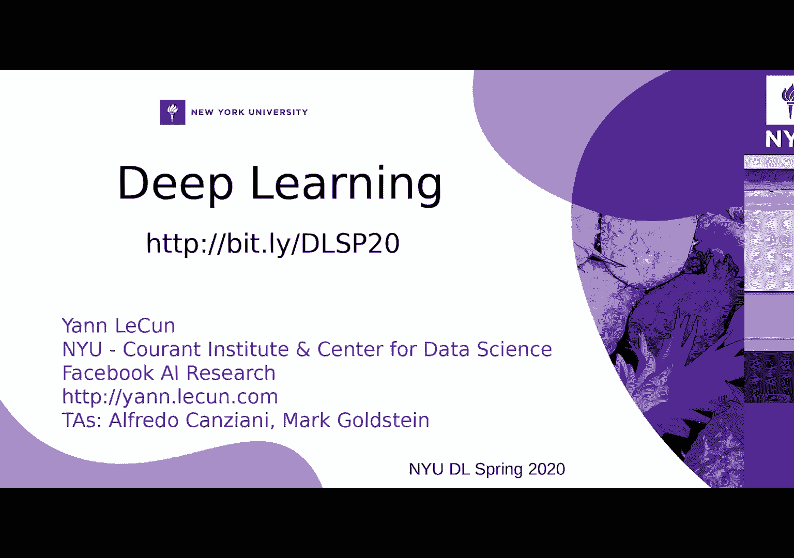
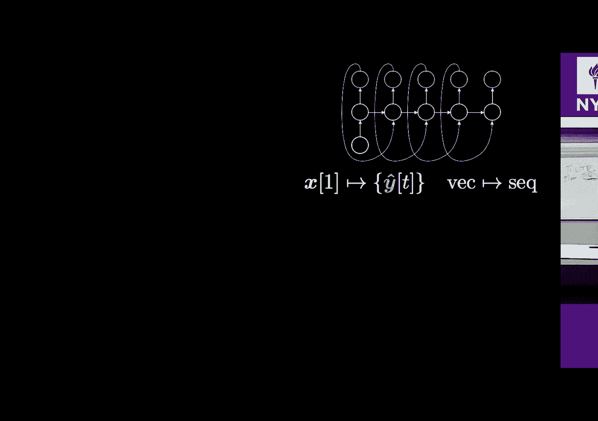

# 【NYU】纽约大学深度学习入门课程（with pytorch）中英文字幕 - P11：11. Week 6 – Practicum - RNN and LSTM architectures - 大佬的迷弟的粉丝 - BV1o5411p7AB

所以今天我们要覆盖很多材料，所以我将尽量避免，所以今天我们要覆盖很多材料，所以我将尽量避免，奔跑，但昨天年轻人彻底地sc住了我，所以年轻人谈到了，奔跑，但昨天年轻人彻底地sc住了我，所以年轻人谈到了。

我今天想讲的同样的事情，所以我要快一点，请慢一点，我今天想讲的同样的事情，所以我要快一点，请慢一点，如果你真的迷失了我就好了，如果你真的迷失了我就好了，所以我会尝试比你先生快一点。

所以我会尝试比你先生快一点，所以今天我们要讨论的是递归神经网络，所以今天我们要讨论的是递归神经网络。

网络是我们可以用来处理的一种架构，网络是我们可以用来处理的一种架构，数据序列是什么序列信号是什么类型的序列，数据序列是什么序列信号是什么类型的序列，时间是时间的组成部分，但我们已经看到了具有时间的数据。

时间是时间的组成部分，但我们已经看到了具有时间的数据，组件他们怎么称呼什么维度什么是维度，组件他们怎么称呼什么维度什么是维度，这样的信号，所以在卷积网络课程中，我们已经看到，这样的信号。

所以在卷积网络课程中，我们已经看到，信号可能是一个信号，该信号基于，信号可能是一个信号，该信号基于，域，而域就是您要映射到的内容，因此临时处理，域，而域就是您要映射到的内容，因此临时处理。

数据的顺序序列基本上是在处理一个数据，数据的顺序序列基本上是在处理一个数据，因为尽管如此，域将只是时间轴，因为尽管如此，域将只是时间轴，还使用RNN来处理您知道的二维数据。

还使用RNN来处理您知道的二维数据，方向好吧好吧，这是图中的经典神经网络，方向好吧好吧，这是图中的经典神经网络，那就是我习惯于在这种情况下画出我代表每个的地方。

那就是我习惯于在这种情况下画出我代表每个的地方，像每一个这样的神经元都是向量，例如X是我的输入向量，像每一个这样的神经元都是向量，例如X是我的输入向量，它像往常一样是粉红色的。

然后我的隐藏层在绿色的中间，它像往常一样是粉红色的，然后我的隐藏层在绿色的中间，然后我有最后一个蓝耳泳道层，即输出网络，然后我有最后一个蓝耳泳道层，即输出网络，对于我的符号，这是我的三层神经网络。

所以如果你们中的一些人，对于我的符号，这是我的三层神经网络，所以如果你们中的一些人，熟悉数字电子，就像在谈论一个，熟悉数字电子，就像在谈论一个，组合逻辑您的当前输出仅取决于当前输入和。

组合逻辑您的当前输出仅取决于当前输入和，就是这样，当我们没有其他输入时，就是这样，当我们没有其他输入时，在谈论我们的男人，我们将谈论一些看起来，在谈论我们的男人，我们将谈论一些看起来，在这种情况下。

我们在右侧的输出取决于，在这种情况下，我们在右侧的输出取决于，当前输入和系统状态，如果您是，当前输入和系统状态，如果您是，数字电子学只是顺序逻辑，而您有一个，数字电子学只是顺序逻辑，而您有一个。

内部状态如果您不知道洋葱是尺寸触发器，内部状态如果您不知道洋葱是尺寸触发器，你知道这是什么触发器，它只是其中的一些非常基本的存储单元，你知道这是什么触发器，它只是其中的一些非常基本的存储单元，不过。

这是数字电子学中唯一的区别，不过，这是数字电子学中唯一的区别，在第二种情况下，您的输出只是输入的函数，在第二种情况下，您的输出只是输入的函数，您有一个输出，它是输入和系统状态的函数，您有一个输出。

它是输入和系统状态的函数，好的，那是最大的不同，香草（vanilla）在美国术语中指的是飞机没有那种味道，香草（vanilla）在美国术语中指的是飞机没有那种味道，美国人抱歉。

我想成为意大利里我能做到的最多美国人，美国人抱歉，我想成为意大利里我能做到的最多美国人，没有味道的冰淇淋会发出愤怒的笑声，没有味道的冰淇淋会发出愤怒的笑声，这是牛奶味吗？我们没有牛奶测试，他们有香草味。

这是牛奶味吗？我们没有牛奶测试，他们有香草味，普通的冰淇淋好吗美国人很抱歉，普通的冰淇淋好吗美国人很抱歉，好吧，哦，让我们看看它以年轻的代名词改变了什么，好吧，哦，让我们看看它以年轻的代名词改变了什么。

所以年轻人在这里画些时髦的小东西，代表了，所以年轻人在这里画些时髦的小东西，代表了，TENS张量到另一个画家之间的映射，从一个矢量到另一个，TENS张量到另一个画家之间的映射，从一个矢量到另一个。

正确的向量，所以您将有输入向量X将被映射，正确的向量，所以您将有输入向量X将被映射，通过这个项目到这个隐藏的表示，以便实际上，通过这个项目到这个隐藏的表示，以便实际上，代表我很好的转变。

所以我的轮换加上这个问题，那么你，代表我很好的转变，所以我的轮换加上这个问题，那么你，让加热器表示您又旋转了一个问题，让加热器表示您又旋转了一个问题，您可以在递归图中类似地获得最终输出。

您可以在递归图中类似地获得最终输出，这些额外的东西，这是一个很好的转换挤压，就像，这些额外的东西，这是一个很好的转换挤压，就像，带有最终转换偏移的延迟模块，现在您有了最后一个。

带有最终转换偏移的延迟模块，现在您有了最后一个，仿射变换和压缩这些东西使噪音还可以，仿射变换和压缩这些东西使噪音还可以，对不起，那么第一种情况是什么第一种情况是一个向量，对不起。

那么第一种情况是什么第一种情况是一个向量，进行排序，因此我们输入一个气泡粉红奇迹，然后您将拥有，进行排序，因此我们输入一个气泡粉红奇迹，然后您将拥有，系统内部状态的这种演变是绿色的，然后作为。

系统内部状态的这种演变是绿色的，然后作为，系统状态不断变化，您可以在每次时间戳记中吐出一个，系统状态不断变化，您可以在每次时间戳记中吐出一个，具体的输出可以是这种架构的一个例子，所以这个。

具体的输出可以是这种架构的一个例子，所以这个。

可能是以下内容，我的输入将是这些图像之一，然后，可能是以下内容，我的输入将是这些图像之一，然后，输出将是代表英语的一系列字符，输出将是代表英语的一系列字符，对输入内容的描述，例如，当我们有一个。

对输入内容的描述，例如，当我们有一个，一群大象，所以最后一群大象走过干草，一群大象，所以最后一群大象走过干草，字段，因此非常非常精细，然后您就可以，字段，因此非常非常精细，然后您就可以。

中心在这里，例如两只狗在草地上玩耍，也许有三只，中心在这里，例如两只狗在草地上玩耍，也许有三只。

但是好吧，他们在草地上玩耍，所以在这很酷，但是好吧，他们在草地上玩耍，所以在这很酷，如果您知道路边的红色摩托车公园，如果您知道路边的红色摩托车公园，看起来更粉红色，或者您知道有点吹粉红色的小女孩。

看起来更粉红色，或者您知道有点吹粉红色的小女孩，那是在吹泡泡，她没在吹什么，那是在吹泡泡，她没在吹什么，然后你也知道了更多错误的例子，所以你有，然后你也知道了更多错误的例子，所以你有。

像是停在停车场的黄色校车，像是停在停车场的黄色校车，好吧，它是CL um，但不是校车，所以它也可能会失败，但是我，好吧，它是CL um，但不是校车，所以它也可能会失败，但是我，也可以做得非常好。

你知道你也可以表现很好，所以这，也可以做得非常好，你知道你也可以表现很好，所以这，是从一个输入向量（例如B）到我的图像的一个，是从一个输入向量（例如B）到我的图像的一个，D的符号序列，例如字符或单词。

D的符号序列，例如字符或单词，到目前为止，我的英语句子还可以，是的，另外一种，到目前为止，我的英语句子还可以，是的，另外一种，可能有以下用法，因此您要按顺序进行，可能有以下用法，因此您要按顺序进行。

两个最终向量还可以，所以我不在乎中间序列就可以了，两个最终向量还可以，所以我不在乎中间序列就可以了，右上角称为自动回归网络，外部回归网络为，右上角称为自动回归网络，外部回归网络为，假设您觉得输入是。

假设您觉得输入是，以前的输出还可以，所以这称为自动回归，以前的输出还可以，所以这称为自动回归，左侧网络上有这种环状部分，左侧网络上有这种环状部分，我要提供几个序列，是的，我要提供几个序列，是的。

那将是英文翻译，所以你有一系列的单词是，那将是英文翻译，所以你有一系列的单词是，要弥补你的最后一句话，那是蓝色，你可以考虑一下，要弥补你的最后一句话，那是蓝色，你可以考虑一下，字典中的索引。

然后每个蓝色都会告诉您哪个词，字典中的索引，然后每个蓝色都会告诉您哪个词，您将选择索引字典，所以这是一辆校车，您将选择索引字典，所以这是一辆校车，好的，哦，是的，一辆黄色的校车你去索引的那儿。

那么你有第二，好的，哦，是的，一辆黄色的校车你去索引的那儿，那么你有第二，索引，您可以确定是黄色，然后是学校框，所以，索引，您可以确定是黄色，然后是学校框，所以，这里的序列将代表单词的序列。

这里的序列将代表单词的序列，模型在另一边，在左边，您将拥有我，模型在另一边，在左边，您将拥有我，继续输入一系列符号，直到最后我要看的是什么，继续输入一系列符号，直到最后我要看的是什么。

我的最终输出可能是这个应用程序的一部分，我的最终输出可能是这个应用程序的一部分，还提到的是不同的，所以让我们看看我是否可以编译我的网络，还提到的是不同的，所以让我们看看我是否可以编译我的网络。

Python还是开放飞行员自己的解释，所以在这种情况下，我有，Python还是开放飞行员自己的解释，所以在这种情况下，我有，我输入我的网络的当前输入将为J等于8580。

我输入我的网络的当前输入将为J等于8580，然后对于X范围为8的一些-J 920等等等等，然后打印该，然后对于X范围为8的一些-J 920等等等等，然后打印该，然后我的网络将被分配给您，只要您知道给我。

然后我的网络将被分配给您，只要您知道给我，25。11万，所以这是程序的最终输出，25。11万，所以这是程序的最终输出，并且我在网络中强制执行，以便能够向我输出正确的输出，并且我在网络中强制执行。

以便能够向我输出正确的输出，请更正您对该程序的解决方案，甚至解决更复杂的问题，请更正您对该程序的解决方案，甚至解决更复杂的问题，例如，我可以提供一系列其他符号，例如，我可以提供一系列其他符号。

八千八百三十七三十七，然后我有C将要，八千八百三十七三十七，然后我有C将要，成为某物，那么如果某物始终是真实的，那么我将打印此东西，成为某物，那么如果某物始终是真实的，那么我将打印此东西，另一个。

然后您知道输出应该是一千二百八十四，另一个，然后您知道输出应该是一千二百八十四，正确，所以您可以训练神经网络来执行这些操作，从而为，正确，所以您可以训练神经网络来执行这些操作，从而为，符号序列。

然后在输出端您只需强制执行最后，符号序列，然后在输出端您只需强制执行最后，目标应该是一个特定的值，这些事情可能会产生噪音，目标应该是一个特定的值，这些事情可能会产生噪音，我最好没事，所以下一步是下一步。

我最好没事，所以下一步是下一步，例如是序列到载体以进行测序，这曾经是标准，例如是序列到载体以进行测序，这曾经是标准，执行长度语言翻译的方法，因此您从一个序列开始，执行长度语言翻译的方法。

因此您从一个序列开始，的符号以粉红色显示，因此您需要输入一系列，的符号以粉红色显示，因此您需要输入一系列，一切都凝结成这样的最终年龄，一切都凝结成这样的最终年龄，这将以某种方式使我的概念正确。

所以我挤了一句话，这将以某种方式使我的概念正确，所以我挤了一句话，句子的时间信息变成一个向量，代表，句子的时间信息变成一个向量，代表，意思是我想发送的消息，然后我得到这个意思，意思是我想发送的消息。

然后我得到这个意思，任何表示以不同语言展开的权利，所以我可以，任何表示以不同语言展开的权利，所以我可以，编码我今天不知道我作为一个单词序列在英语方面非常高兴。

编码我今天不知道我作为一个单词序列在英语方面非常高兴，然后你知道你可以让LG Sonoma到Felicia，然后我在外面讲话，然后你知道你可以让LG Sonoma到Felicia，然后我在外面讲话。

今天的泰国或今天的今天我很累，今天的泰国或今天的今天我很累，金晨走韩雷还是可以的，所以你又有某种编码，金晨走韩雷还是可以的，所以你又有某种编码，然后你有一个压缩的表示，然后像，然后你有一个压缩的表示。

然后像，给定相同的压缩版本就可以解码，所以例如我猜，给定相同的压缩版本就可以解码，所以例如我猜，语言翻译最近，我们看到了变形金刚和很多，语言翻译最近，我们看到了变形金刚和很多，像最近这样的事情。

所以我们将在下一课中介绍，像最近这样的事情，所以我们将在下一课中介绍，认为，但是直到两年前，这里一直是最先进的技术，认为，但是直到两年前，这里一直是最先进的技术，您会看到。

如果您实际检查是否在潜在空间上进行了PCA，您会看到，如果您实际检查是否在潜在空间上进行了PCA，你有单词按语义分组的好，所以如果我们放大，你有单词按语义分组的好，所以如果我们放大，地区。

我们将看到在同一位置的所有地方，地区，我们将看到在同一位置的所有地方，如果您将重点放在12月2月11日，如果您将重点放在12月2月11日，你得到一个不同的地区几天，你得到一个不同的地区几天。

接下来的几英里，以此类推，所以不同的位置会有一些，接下来的几英里，以此类推，所以不同的位置会有一些，具体来说，您知道通用的含义，因此在这种情况下，我们基本上可以看到，具体来说，您知道通用的含义。

因此在这种情况下，我们基本上可以看到，用符号训练这些您知道的网络，它们会在一些，用符号训练这些您知道的网络，它们会在一些，在这种情况下，您知道的特定语义就具有正确的功能，在这种情况下。

您知道的特定语义就具有正确的功能，可以看到好像有一个向量，所以向量将女人和男人联系起来，可以看到好像有一个向量，所以向量将女人和男人联系起来，将会是一个很好的女人的载体-男人，我认为这是一个。

将会是一个很好的女人的载体-男人，我认为这是一个，会等同于女王-国王对，是的，这是正确的，所以你会，会等同于女王-国王对，是的，这是正确的，所以你会，在该嵌入空间中具有相同的距离将应用于。

在该嵌入空间中具有相同的距离将应用于，例如，女性和男性的事物，或者在其他情况下，例如，女性和男性的事物，或者在其他情况下，步入式，步入式游泳和沼泽，所以您始终拥有自己所知道的，步入式，步入式游泳和沼泽。

所以您始终拥有自己所知道的，您可以应用线性变换，以将一种类型的单词转换为，您可以应用线性变换，以将一种类型的单词转换为，另一个或另一个，您将城市与，另一个或另一个，您将城市与，大写都没事。

所以我认为又一大写，大写都没事，所以我认为又一大写，这里的图片很大，因为它很大，不，不，它太大了，这里的图片很大，因为它很大，不，不，它太大了，图片，因为这是概述，好吧，你没有开玩笑吧，这是怎么回事。

图片，因为这是概述，好吧，你没有开玩笑吧，这是怎么回事，缺少这里要寻找的矢量，虽然不好，但是没有，因为您仍然可以使用，缺少这里要寻找的矢量，虽然不好，但是没有，因为您仍然可以使用，另一个，所以你有这个。

向量是正确的序列，另一个，所以你有这个，向量是正确的序列，这是你开始输入内部的东西，你开始输出一些东西，这是你开始输入内部的东西，你开始输出一些东西，对，这可以作为一个例子吗？如果您有诺基亚手机，对。

这可以作为一个例子吗？如果您有诺基亚手机，您使用的是T9，您知道20年前的东西，您使用的是T9，您知道20年前的东西，有关您键入的内容的建议，您输入正确，所以这将是一个，有关您键入的内容的建议。

您输入正确，所以这将是一个，这些建议的类型，就像您得到的这种架构的一种，这些建议的类型，就像您得到的这种架构的一种，输入内容时的建议，或者您可能喜欢，输入内容时的建议，或者您可能喜欢，字幕对，我说过了。

您掌握了一切，字幕对，我说过了，您掌握了一切，下面还是很酷的东西，所以我在这里开始写，下面还是很酷的东西，所以我在这里开始写，土星的环闪闪发光，严酷的冰雪中，两个男人互相看着嗯，土星的环闪闪发光。

严酷的冰雪中，两个男人互相看着嗯，好吧，他们是敌人，但是服务器机器人不好，好吧，坚持，好吧，他们是敌人，但是服务器机器人不好，好吧，坚持，因此，该网络已接受一些科幻小说的培训，因此您可以，因此。

该网络已接受一些科幻小说的培训，因此您可以，输入一些内容，然后让网络开始输出一些建议，输入一些内容，然后让网络开始输出一些建议，你，所以你知道如果你不知道怎么写书，那么你会问吗，你。

所以你知道如果你不知道怎么写书，那么你会问吗，您的计算机可以帮到您，这很酷，或者我真的可以，您的计算机可以帮到您，这很酷，或者我真的可以，喜欢它，这太棒了，我想您应该阅读阅读，我想所以您，喜欢它。

这太棒了，我想您应该阅读阅读，我想所以您，像科学家单独命名那样输入一些信息，像科学家单独命名那样输入一些信息，或提示正确，所以您将最上面的提示放进去，然后您就知道了，或提示正确。

所以您将最上面的提示放进去，然后您就知道了，这个网络开始写关于非常有趣的多角独角兽，这个网络开始写关于非常有趣的多角独角兽，叫角，说独角兽吧，好吧，好酷，快来看看，叫角，说独角兽吧，好吧，好酷。

快来看看，稍后，您可以通过任何方式截取屏幕截图，就像，稍后，您可以通过任何方式截取屏幕截图，就像，让人眼花that乱的糖果，现在让我们知道PTT，让人眼花that乱的糖果，现在让我们知道PTT。

他们不是真的像昨天的PTT所说的，好吧，让我们，他们不是真的像昨天的PTT所说的，好吧，让我们，看看这些东西是如何工作的，所以在左侧我们再次看到了这个向量，看看这些东西是如何工作的。

所以在左侧我们再次看到了这个向量，在表示的中间将输出进行精细转换，然后，在表示的中间将输出进行精细转换，然后，我们有正确的经典方程式，所以让我们看看这是怎么回事，我们有正确的经典方程式。

所以让我们看看这是怎么回事，相似或不相似，并且您看不到任何东西，因此在接下来的两秒钟我，相似或不相似，并且您看不到任何东西，因此在接下来的两秒钟我，需要一分钟，我将关闭灯，然后再打开它们，需要一分钟。

我将关闭灯，然后再打开它们，[音乐]好的，现在您可以看到一些正常的声音，[音乐]好的，现在您可以看到一些正常的声音，所以让我们看看这种新架构的问题是什么，所以让我们看看这种新架构的问题是什么。

你会暗恋自己，所以你在这里藏着，你会暗恋自己，所以你在这里藏着，表示现在将有一个旋转的非线性函数，表示现在将有一个旋转的非线性函数，输入的堆栈版本，附加了以前的配置，输入的堆栈版本，附加了以前的配置。

隐藏层还可以，所以这是一个非常好的紧凑表示法，只是我，隐藏层还可以，所以这是一个非常好的紧凑表示法，只是我，只需将两个向量彼此叠加，然后我将其赋值，只需将两个向量彼此叠加，然后我将其赋值。

我也定义初始条件的偏倚，我的初始H将为0，所以，我也定义初始条件的偏倚，我的初始H将为0，所以，一开始，只要我的T等于1，这个东西就会被解决，一开始，只要我的T等于1，这个东西就会被解决，零的向量。

然后我有这个矩阵WH将是两个单独的，零的向量，然后我有这个矩阵WH将是两个单独的，矩阵，所以有时您会看到一个问题，是x乘以x x w乘以HH，矩阵，所以有时您会看到一个问题，是x乘以x x w乘以HH。

ht减1，但您也可以算出，如果您存入这两个矩阵，ht减1，但您也可以算出，如果您存入这两个矩阵，知道一个与另一个相连，您只需将这两条垂直线，知道一个与另一个相连，您只需将这两条垂直线，完全等效的表示法。

但它看起来与我们，完全等效的表示法，但它看起来与我们，在这里有这样的隐藏层是输入内层的仿射变换，在这里有这样的隐藏层是输入内层的仿射变换，是对输入和先前值进行仿射变换，然后您。

是对输入和先前值进行仿射变换，然后您，最终的输出将再次是我的最终轮换，所以我要，最终的输出将再次是我的最终轮换，所以我要，打开灯，这样就没有魔法了，你还好吧，你和我在一起，打开灯，这样就没有魔法了。

你还好吧，你和我在一起，摇头，其他的怎么样？摇头，其他的怎么样？所以这只是在右边，我随时间展开，这样，所以这只是在右边，我随时间展开，这样，您可以看到事情不是很疯狂，就像这里的循环不是。

您可以看到事情不是很疯狂，就像这里的循环不是，实际上是一个循环，就像，实际上是一个循环，就像，下次再向右走，以便围绕箭头的方向就是这个向右箭头，下次再向右走，以便围绕箭头的方向就是这个向右箭头。

这是一个神经网络，它是dinkley神经网络，在，这是一个神经网络，它是dinkley神经网络，在，长度，而不只是厚度合适，这样您就拥有了网络，长度，而不只是厚度合适，这样您就拥有了网络。

这就是这个方向的输入和输出，但是您可以认为，这就是这个方向的输入和输出，但是您可以认为，是扩展输入，这是扩展输出，而所有这些，是扩展输入，这是扩展输出，而所有这些，中间权重都是共享的。

所以所有这些权重都相同，中间权重都是共享的，所以所有这些权重都相同，权重，然后您使用这种共享的权重，因此它类似于，权重，然后您使用这种共享的权重，因此它类似于，从这个意义上来说，您可以共享该参数。

从这个意义上来说，您可以共享该参数，不同的时域，因为您假设有某种类型的您知道，不同的时域，因为您假设有某种类型的您知道，信号的平稳性是有意义的，所以这是一种卷积，信号的平稳性是有意义的。

所以这是一种卷积，对，你可以看到这是一种卷积，好吧，对，你可以看到这是一种卷积，好吧，您知道一些我们已经看到的理论，所以让我们看看，您知道一些我们已经看到的理论，所以让我们看看，适用于实际示例。

因此在这种情况下，我们只是在阅读此代码，适用于实际示例，因此在这种情况下，我们只是在阅读此代码，这是世界语言模型，您可以在PI火炬示例中找到它，因此，这是世界语言模型，您可以在PI火炬示例中找到它。

因此，你有一个符号序列，我刚刚代表了每个符号，你有一个符号序列，我刚刚代表了每个符号，像字母表中的字母，然后第一部分基本上是，像字母表中的字母，然后第一部分基本上是，以这种方式将其拆分。

这样您就可以在时间上保持垂直，以这种方式将其拆分，这样您就可以在时间上保持垂直，域，但随后我分割了长久长序列，以便现在可以切碎，域，但随后我分割了长久长序列，以便现在可以切碎。

可以使用最好的赌注赌注你怎么说计算，所以你有第一件事，可以使用最好的赌注赌注你怎么说计算，所以你有第一件事，在这种情况下，最好的尺寸是4，然后我会进入，在这种情况下，最好的尺寸是4，然后我会进入。

第一批，然后我将强制网络能够，所以这将是我的，第一批，然后我将强制网络能够，所以这将是我的，在一段时间内的最佳反向传播，我将强制网络，在一段时间内的最佳反向传播，我将强制网络，输出下一个字符序列，确定。

因为我有ABC，我将强制，输出下一个字符序列，确定，因为我有ABC，我将强制，我的网络说D，因为我有GHI，所以我将强制网络，我的网络说D，因为我有GHI，所以我将强制网络。

提出J givin em的轨道，今晚在P戳，然后s，提出J givin em的轨道，今晚在P戳，然后s，网络20对，那么您如何才能真正确保您理解我的意思，网络20对。

那么您如何才能真正确保您理解我的意思，每当您能够预测我的下一个世界时，您实际上就能知道，每当您能够预测我的下一个世界时，您实际上就能知道，您基本上已经知道我在说什么，是的，因此尝试。

您基本上已经知道我在说什么，是的，因此尝试，预测即将到来的单词，您将表现出某种理解力，预测即将到来的单词，您将表现出某种理解力，数据中的时间信息将是什么，所以，数据中的时间信息将是什么，所以。

等我们有了床之后，它是如何工作的，让我们实际了解一下，等我们有了床之后，它是如何工作的，让我们实际了解一下，大概是一个细节，这将是我的第一个输出，大概是一个细节，这将是我的第一个输出，一整批有四个物品。

我整晚都在角落里喂，一整批有四个物品，我整晚都在角落里喂，然后我的神经网络我们对即将到来的样本进行预测，然后我的神经网络我们对即将到来的样本进行预测，我会强迫那个人成为我的BH，好吧，那我要拥有我的。

我会强迫那个人成为我的BH，好吧，那我要拥有我的，第二个输入，我将为当前RNN提供先前的隐藏状态，第二个输入，我将为当前RNN提供先前的隐藏状态，感觉到这些，然后我希望得到输出的第二行，感觉到这些。

然后我希望得到输出的第二行，正确地定位目标，然后依此类推，我得到了下一个状态，对不起下一个输入，正确地定位目标，然后依此类推，我得到了下一个状态，对不起下一个输入，我得到下一个状态。

然后进入神经网络RN n I，我得到下一个状态，然后进入神经网络RN n I，到目前为止，我将尽力使最终目标还可以，到目前为止，我将尽力使最终目标还可以，每个都将是互联网递归神经网络的输出，对吧。

每个都将是互联网递归神经网络的输出，对吧，在您得到h1之前，向您展示方程式，在您得到h1之前，向您展示方程式，输出我将强制输出实际上是我的目标，我的下一个词，输出我将强制输出实际上是我的目标。

我的下一个词，字母顺序正确，所以我有一个单词顺序迫使我的网络，字母顺序正确，所以我有一个单词顺序迫使我的网络，根据前一个单词知道h1将被喂入，预测下一个单词是什么，根据前一个单词知道h1将被喂入。

预测下一个单词是什么，在这里，您将下一个单词，下一个单词和上一个单词卡在一起，在这里，您将下一个单词，下一个单词和上一个单词卡在一起，状态，然后您将对前一个单词进行轮换，并附带一个对不起，状态。

然后您将对前一个单词进行轮换，并附带一个对不起，具有下一个状态的新词具有上一个状态的新词，具有下一个状态的新词具有上一个状态的新词，我们的旋转在这里找到正确的转换，然后您将。

我们的旋转在这里找到正确的转换，然后您将，非线性，所以您总是得到一个新单词，即当前的X，然后您，非线性，所以您总是得到一个新单词，即当前的X，然后您，得到以前的状态只是为了一次查看系统处于什么状态。

得到以前的状态只是为了一次查看系统处于什么状态，输出一个新的输出权，所以我们在这种情况下，我们有一堆，输出一个新的输出权，所以我们在这种情况下，我们有一堆，输入，我有我的第一个输入。

然后我得到第一个输出，我有这个，输入，我有我的第一个输入，然后我得到第一个输出，我有这个，内部存储器被转发，然后该网络现在将知道，内部存储器被转发，然后该网络现在将知道，这里发生了什么。

然后我输入了下一个输入，依此类推，我得到了下一个，这里发生了什么，然后我输入了下一个输入，依此类推，我得到了下一个，输出，我将输出强制为输出，这里是批处理中的值，输出，我将输出强制为输出。

这里是批处理中的值，好吧，现在缺少什么，[音乐]，这是针对PowerPoint绘图约束的所有操作，这是针对PowerPoint绘图约束的所有操作，现在，在这里，我要发送的是这里，我刚刚用，现在，在这里。

我要发送的是这里，我刚刚用，最后的HT，但箭头上有一个斜线，最后的HT，但箭头上有一个斜线，箭头上的斜线是什么，谁能理解斜线的含义是什么，箭头上的斜线是什么，谁能理解斜线的含义是什么。

将会有下一批他们将从那里开始，将会有下一批他们将从那里开始，在这里D等，这将是我的下一批dj pv e KQ v + FL rx对，在这里D等。

这将是我的下一批dj pv e KQ v + FL rx对，所以这里的斜线表示不要反向传播，这样就可以，所以这里的斜线表示不要反向传播，这样就可以，将在保时捷中呼叫点分离，这将停止渐变。

将在保时捷中呼叫点分离，这将停止渐变，要知道你传播回了永远，所以这个说知道，要知道你传播回了永远，所以这个说知道，所以每当我对不起，就没有没有渐变，这样当我输入下一个，所以每当我对不起，就没有没有渐变。

这样当我输入下一个，渐变这里的第一个输入将是这个人在这里，当然，渐变这里的第一个输入将是这个人在这里，当然，没有梯度，这样我们就没有无限长的RN，没有梯度，这样我们就没有无限长的RN，是的，不。

我认为是，是的，不，我认为是，好了，渐变消失了，我们也将它们碰到了，好了，渐变消失了，我们也将它们碰到了，昨天，所以我再次想给目标用户更快一点，所以，昨天，所以我再次想给目标用户更快一点，所以。

让我们看看这对于循环神经通常如何运作，让我们看看这对于循环神经通常如何运作，网络，您有一个输入，您有一个隐藏层，然后有一个输出，网络，您有一个输入，您有一个隐藏层，然后有一个输出。

那么这里的这个价值你如何通过这里得到这些信息什么，那么这里的这个价值你如何通过这里得到这些信息什么，这个R代表什么你还记得隐藏的方程吗，这个R代表什么你还记得隐藏的方程吗，层。

因此新的隐藏层将成为我们之前的隐藏层，层，因此新的隐藏层将成为我们之前的隐藏层，旋转，好吧，我们旋转上一个隐藏层，那么您如何旋转隐藏层，好吧，我们旋转上一个隐藏层，那么您如何旋转隐藏层，层矩阵正确。

因此每次您在图块箭头上看到所有广告时，层矩阵正确，因此每次您在图块箭头上看到所有广告时，旋转现在有一个矩阵，如果您知道该矩阵可以，旋转现在有一个矩阵，如果您知道该矩阵可以，更改最终输出的大小。

所以如果您考虑一下，更改最终输出的大小，所以如果您考虑一下，假设行列式权利如果终端是单一的，那是一个映射，假设行列式权利如果终端是单一的，那是一个映射，如果同一区域大于一个区域，则它们将成为相同区域。

如果同一区域大于一个区域，则它们将成为相同区域，让您知道这个弧度会变得越来越大或越来越小，让您知道这个弧度会变得越来越大或越来越小，比起执行背影时，我将使这些渐变变为零，比起执行背影时。

我将使这些渐变变为零，可以朝这个方向传播，所以这里的问题是，可以朝这个方向传播，所以这里的问题是，将梯度发送回去，这样增益将下降，就像，将梯度发送回去，这样增益将下降，就像，会像这样下去。

然后像这样下去，然后像这样下去，会像这样下去，然后像这样下去，然后像这样下去，方式，也一直沿这种方式下去，以此类推，所以梯度将是，方式，也一直沿这种方式下去，以此类推，所以梯度将是。

始终与H ro中的箭头方向相反在内部具有矩阵，始终与H ro中的箭头方向相反在内部具有矩阵，对，这个矩阵将一次又一次地影响这些梯度的传播方式，这就是，对，这个矩阵将一次又一次地影响这些梯度的传播方式。

这就是，为什么您可以在这里看到，尽管我们提供了一个非常明亮的输入，为什么您可以在这里看到，尽管我们提供了一个非常明亮的输入，迷失了哦，好吧，如果您有一个渐变落在这里，渐变，迷失了哦，好吧。

如果您有一个渐变落在这里，渐变，可以让您知道随着时间的推移会被杀死，所以我们如何解决该问题，我们只需，可以让您知道随着时间的推移会被杀死，所以我们如何解决该问题，我们只需。

在此水平操作中删除矩阵是否有意义否是否，在此水平操作中删除矩阵是否有意义否是否，问题是下一个隐藏状态会让您知道自己的输入，问题是下一个隐藏状态会让您知道自己的输入，内存来自上一步通过矩阵乘法现在。

内存来自上一步通过矩阵乘法现在，矩阵乘法会影响梯度中出现的梯度，矩阵乘法会影响梯度中出现的梯度，其他方向还可以，所以只要您在这里有输出，其他方向还可以，所以只要您在这里有输出，现在有了最后的损失。

您的成绩将与，现在有了最后的损失，您的成绩将与，箭头指向输入，问题是该梯度将，箭头指向输入，问题是该梯度将，通过与这些箭头相反的方向乘以，通过与这些箭头相反的方向乘以，矩阵右移矩阵，这些矩阵也会影响。

矩阵右移矩阵，这些矩阵也会影响，这个梯度的总体范式是什么，将是全部，这个梯度的总体范式是什么，将是全部，杀死它，您的梯度消失了，或者您正在，杀死它，您的梯度消失了，或者您正在。

将要爆炸的梯度将是每当将要，将要爆炸的梯度将是每当将要，得到正确的放大，以便避免，我们必须避免，所以您，得到正确的放大，以便避免，我们必须避免，所以您，可以看到这是一个非常深的网络。

因此经常在我们的网络中，可以看到这是一个非常深的网络，因此经常在我们的网络中，深夜网络实际上是这个词，深夜网络实际上是这个词，深度实际上是及时的，当然他们也面临着同样的问题，深度实际上是及时的。

当然他们也面临着同样的问题，我们在如今仍然像今天一样面对着深度学习，我们在如今仍然像今天一样面对着深度学习，堆叠几层，我们观察到梯度随着，堆叠几层，我们观察到梯度随着，正确的深度。

那么我们如何解决由于深度而丢失的梯度，正确的深度，那么我们如何解决由于深度而丢失的梯度，目前的日子，在我们使用的接收器连接上跳过恒定连接，在我们使用的接收器连接上跳过恒定连接，同样地，当我们顺利下来时。

我们也可以使用跳过连接，同样地，当我们顺利下来时，我们也可以使用跳过连接，及时赶上，让我们看看它是如何工作的，及时赶上，让我们看看它是如何工作的，是的，所以问题在于，梯度仅向后移动，是的，所以问题在于。

梯度仅向后移动，右后方的路径[音乐]，右后方的路径[音乐]，梯度必须与相反的方向相同，梯度必须与相反的方向相同，正确的方向我的意思是您正在计算链式规则，因此，如果您具有。

正确的方向我的意思是您正在计算链式规则，因此，如果您具有，函数的功能，然后您只需使用这些功能即可，函数的功能，然后您只需使用这些功能即可，关键是，只要您有这些渐变回来，它们就不会，关键是。

只要您有这些渐变回来，它们就不会，通过矩阵，因此前向部分也不必，通过矩阵，因此前向部分也不必，通过矩阵意味着内存不能通过矩阵，通过矩阵意味着内存不能通过矩阵，如果您不想在执行演出时产生这种效果。

如果您不想在执行演出时产生这种效果，传播还可以，是的，值得做的更好，我在下一张幻灯片中向您展示，是的，值得做的更好，我在下一张幻灯片中向您展示，[音乐]，向您展示下一张幻灯片，那么我们如何解决这个问题。

向您展示下一张幻灯片，那么我们如何解决这个问题，而不是使用一个递归神经网络，我们将使用递归，而不是使用一个递归神经网络，我们将使用递归，神经网络还可以，所以第一次循环网络酒精就可以了，神经网络还可以。

所以第一次循环网络酒精就可以了，网络将从输入到中间，网络将从输入到中间，状态，那么我还有其他三个网络，每个网络都由，状态，那么我还有其他三个网络，每个网络都由，这三个符号1 2和3好的，请考虑一下。

这三个符号1 2和3好的，请考虑一下，就像表情符号一样，像张口一样好，如果您使用这种，就像表情符号一样，像张口一样好，如果您使用这种，递归神经网络的网络数量是常规网络，递归神经网络的网络数量是常规网络。

输入的例子，我把东西张开，输入的例子，我把东西张开，到这里，我在这里闭着嘴，所以什么也没有前进，那么我会，到这里，我在这里闭着嘴，所以什么也没有前进，那么我会，张开嘴巴，这样历史就可以前进，历史就可以。

张开嘴巴，这样历史就可以前进，历史就可以，向前发送而无需经过神经网络矩阵乘法，向前发送而无需经过神经网络矩阵乘法，它只是通过我们的张开嘴而所有其他输入都变成了张开嘴。

它只是通过我们的张开嘴而所有其他输入都变成了张开嘴，所以隐藏状态不会因新输入而改变，然后在这里，所以隐藏状态不会因新输入而改变，然后在这里，在这里要张开嘴，这样你就可以在这里得到最终的输出。

在这里要张开嘴，这样你就可以在这里得到最终的输出，张开的嘴继续往这里走，这样你在那里又有一个输出，张开的嘴继续往这里走，这样你在那里又有一个输出，然后，如果您执行，最后您将获得最后一张闭合的嘴，然后。

如果您执行，最后您将获得最后一张闭合的嘴，背部支撑，您将拥有张开的嘴巴流过的渐变，而您，背部支撑，您将拥有张开的嘴巴流过的渐变，而您，没有任何类型的矩阵乘法，所以现在让我们找出，没有任何类型的矩阵乘法。

所以现在让我们找出，这些张开的嘴如何表示，如何像在，这些张开的嘴如何表示，如何像在，数学术语是否清楚设计正确，所以现在我们使用开放式和，数学术语是否清楚设计正确，所以现在我们使用开放式和，闭着嘴。

每个嘴都是在这里第一个家伙，闭着嘴，每个嘴都是在这里第一个家伙，将输入连接到隐藏的brn端，所以这些在这里是，将输入连接到隐藏的brn端，所以这些在这里是，门控递归网络仅适用于普通递归神经网络。

门控递归网络仅适用于普通递归神经网络，以一种聪明的方式，使您有乘法互动，而没有，以一种聪明的方式，使您有乘法互动，而没有，到目前为止，矩阵交互是很清楚的，这就像我没有显示的直觉，到目前为止。

矩阵交互是很清楚的，这就像我没有显示的直觉，你怎么样，所以让我们弄清楚是谁做的以及它是如何工作的，你怎么样，所以让我们弄清楚是谁做的以及它是如何工作的，我们现在将看到那些长期的短期记忆或门控循环神经。

我们现在将看到那些长期的短期记忆或门控循环神经，网络，所以我很抱歉，那是伙计，好吧，这是实际上，网络，所以我很抱歉，那是伙计，好吧，这是实际上，实际上，他和他的学生在1997年发明了这种东西，实际上。

他和他的学生在1997年发明了这种东西，一起在这里喝酒好吧，这是反复发作的问题，一起在这里喝酒好吧，这是反复发作的问题，神经网络和左上方，您将在图表中看到，所以我只是，神经网络和左上方。

您将在图表中看到，所以我只是，对这个递归神经网络做一个非常紧凑的版本，对这个递归神经网络做一个非常紧凑的版本，是长期表示的方程式的集合，是长期表示的方程式的集合，内存，它们看起来有点密集。

所以我在这里为您绘制它，好吧，内存，它们看起来有点密集，所以我在这里为您绘制它，好吧，实际经历了这些东西的工作原理，实际经历了这些东西的工作原理，所以我要在这里画一个互动动画，以便您输入。

所以我要在这里画一个互动动画，以便您输入，这里的门将是仿射变换，所以所有这些都是，这里的门将是仿射变换，所以所有这些都是，递归网络写相同的方程式，我在这里给你展示，所以这个输入，递归网络写相同的方程式。

我在这里给你展示，所以这个输入，转换将乘以我的C波浪号，这是我的候选门，转换将乘以我的C波浪号，这是我的候选门，有一个别忘了的门，它正在乘以我以前的单元格值，有一个别忘了的门。

它正在乘以我以前的单元格值，记忆，然后我的Poppa设计师也许不会忘记以前的加号输入ii，记忆，然后我的Poppa设计师也许不会忘记以前的加号输入ii，现在要向您展示它是如何工作的。

然后我将最后隐藏的表示形式，现在要向您展示它是如何工作的，然后我将最后隐藏的表示形式，是我的输出门之间的乘法元素明智乘法，是我的输出门之间的乘法元素明智乘法，我知道细胞的双曲正切形式。

我知道细胞的双曲正切形式，事情是有界的，然后我终于有了我的候选人，事情是有界的，然后我终于有了我的候选人，门就是安妮特（Anette）对，所以您经常会，门就是安妮特（Anette）对，所以您经常会。

调制输出的网络之一调制此的网络是不要忘记，调制输出的网络之一调制此的网络是不要忘记，门，这是输入门，因此，门，这是输入门，因此，记忆和门是一个乘法相互作用，这会忘记输入和，记忆和门是一个乘法相互作用。

这会忘记输入和，不要忘记输入和输出都是S形的，因此它们是，不要忘记输入和输出都是S形的，因此它们是，从0到1，所以我可以乘以0，表示您闭着嘴，或者您可以，从0到1，所以我可以乘以0，表示您闭着嘴。

或者您可以，如果嘴巴张开，请乘以1，如果您考虑拥有我们的，如果嘴巴张开，请乘以1，如果您考虑拥有我们的，内部线性体积小于或小于负5或大于加5，这样，内部线性体积小于或小于负5或大于加5，这样，您使用。

您可以在饱和区域或0或1中使用门，您知道，您使用，您可以在饱和区域或0或1中使用门，您知道，乙状结肠，让我们看看这些东西是如何工作的，乙状结肠，让我们看看这些东西是如何工作的，这是输出。

让我们关闭输出我该怎么办，这是输出，让我们关闭输出我该怎么办，关闭输出，我只是在里面放一个0，所以说我有一个紫色，关闭输出，我只是在里面放一个0，所以说我有一个紫色，内部表示。

请参见我在输出门中放置一个0，输出是，内部表示，请参见我在输出门中放置一个0，输出是，将要乘以0等于0的东西，然后再说，将要乘以0等于0的东西，然后再说，我有一个绿色的我有一个然后我乘以我得到的紫色。

我有一个绿色的我有一个然后我乘以我得到的紫色，紫色，最后我得到相同的值，我可以控制内存，紫色，最后我得到相同的值，我可以控制内存，例如，我可以在这种情况下设置它，我将拥有内部，例如。

我可以在这种情况下设置它，我将拥有内部，记忆中看到这是紫色，然后我在这里有我以前的家伙，记忆中看到这是紫色，然后我在这里有我以前的家伙，是蓝色的我想我这里有零，所以乘法给了我一个。

是蓝色的我想我这里有零，所以乘法给了我一个，零，我这里有一个零，所以乘法将得到一个零，零，我这里有一个零，所以乘法将得到一个零，在大约两个零时，我在内存中得到一个零，所以我只删除了，在大约两个零时。

我在内存中得到一个零，所以我只删除了，内存，你那里的零，否则我可以保持内存，我仍然，内存，你那里的零，否则我可以保持内存，我仍然，做内部的事情，我做了一个新的，但我想知道，做内部的事情，我做了一个新的。

但我想知道，乘法变蓝太阳变蓝，然后我不断发出，乘法变蓝太阳变蓝，然后我不断发出，最后我可以这样写，这样我就可以在输入门中得到1，最后我可以这样写，这样我就可以在输入门中得到1，乘法变成紫色。

然后在不要忘记的地方设置零，乘法变成紫色，然后在不要忘记的地方设置零，我们忘记然后乘法给出，我们忘记然后乘法给出，我零我有些我会变紫色，然后我会得到最后的紫色输出，所以，我零我有些我会变紫色。

然后我会得到最后的紫色输出，所以，在这里，我们控制如何发送，如何在内存中写入，如何重置内存以及，在这里，我们控制如何发送，如何在内存中写入，如何重置内存以及，如何输出好东西，所以我们有所有不同的操作。

看起来像，如何输出好东西，所以我们有所有不同的操作，看起来像，一台计算机-是的，在这种情况下，假设您喜欢，一台计算机-是的，在这种情况下，假设您喜欢，逻辑如何工作。

就像我们在Sigmoid中拥有一个值一样，逻辑如何工作，就像我们在Sigmoid中拥有一个值一样，等于或小于负5或大于负5，以便我们作为，等于或小于负5或大于负5，以便我们作为，切换0 1切换好的。

网络可以选择使用这种操作来，切换0 1切换好的，网络可以选择使用这种操作来，我说得通，我相信这是该网络如何运作的基本原理，我说得通，我相信这是该网络如何运作的基本原理，被放在一起。

网络可以决定做什么它通常想要做的事情，被放在一起，网络可以决定做什么它通常想要做的事情，无论他们想要什么，但这似乎至少可以使他们正常工作，无论他们想要什么，但这似乎至少可以使他们正常工作。

看起来好像一切都可以很好地工作，所以在剩下的门中，看起来好像一切都可以很好地工作，所以在剩下的门中，15分钟的时间，我将向您展示我去过的两个笔记本，15分钟的时间，我将向您展示我去过的两个笔记本。

快一点，因为再次在这里可以看到更多，快一点，因为再次在这里可以看到更多，笔记本好耶，因此，您在这里关心的实际重量和实际梯度将是，因此，您在这里关心的实际重量和实际梯度将是，相对于先前C的正确梯度。

您关心的事情将是，相对于先前C的正确梯度，您关心的事情将是，基本上是相对于先前的电流的偏导数，基本上是相对于先前的电流的偏导数，C的意思是，如果您在这里有原始的首字母C并且，C的意思是。

如果您在这里有原始的首字母C并且，随着时间的流逝，您想更改多个C，而您仍然想更改原始C，随着时间的流逝，您想更改多个C，而您仍然想更改原始C，使梯度一直下降直到第一个C下降。

使梯度一直下降直到第一个C下降，通过该矩阵获得渐变，WC在这里，所以如果您想在此处更改这些权重，则只需，WC在这里，所以如果您想在此处更改这些权重，则只需，不涉及任何矩阵乘法的乘法链。

不涉及任何矩阵乘法的乘法链，这样，当您获得渐变时，它仍然会乘以一，这样，当您获得渐变时，它仍然会乘以一，一直到我们想做的事情好了，我回答了吗，一直到我们想做的事情好了，我回答了吗，你的问题。

因此矩阵会正确改变您的梯度幅度，因此，如果，因此矩阵会正确改变您的梯度幅度，因此，如果，您就像这些最大的特征值一样，每次您都知道0。0001，您就像这些最大的特征值一样，每次您都知道0。0001，乘以。

您就可以确定此向量的范数被正确杀死，因此您就像，乘以，您就可以确定此向量的范数被正确杀死，因此您就像，如果我的忘记门实际上总是等于，如果我的忘记门实际上总是等于，1然后您得到C等于C减去团队导数。

1然后您得到C等于C减去团队导数，关于CT的偏导数的CT导数，关于CT的偏导数的CT导数，关于C减去t减去1 1对，所以相对的部分即，关于C减去t减去1 1对，所以相对的部分即。

你实际上每次都会乘以1的东西，所以输出，你实际上每次都会乘以1的东西，所以输出，渐变输出渐变可以是输入渐变，是的，我会打开，渐变输出渐变可以是输入渐变，是的，我会打开，将是隐式的。

因为它将通过输出的导数应用输出梯度，将是隐式的，因为它将通过输出的导数应用输出梯度，如果这个模块是e1这个模块就对了，如果这个模块是e1这个模块就对了，在这里继续前进，这是其背后的原理，这仅是为了绘图。

在这里继续前进，这是其背后的原理，这仅是为了绘图，目的是我认为这就像开关一样，以便我可以为您做点事情，目的是我认为这就像开关一样，以便我可以为您做点事情，知道您已经打开和关闭以显示它应该如何工作。

知道您已经打开和关闭以显示它应该如何工作，不能那样工作，但仍然可以工作，可以这样工作，是的，所以，不能那样工作，但仍然可以工作，可以这样工作，是的，所以，这就是专业问题的实现，只是您只需垫。

这就是专业问题的实现，只是您只需垫，所有其他同步（如果在序列之前看到零），所有其他同步（如果在序列之前看到零），几个序列是几个不同长度的序列，几个序列是几个不同长度的序列，你只要把它们都对准右边。

你只要把它们都对准右边，然后你在这里放一些零，这样你总是在最后，然后你在这里放一些零，这样你总是在最后，如果您在此处放置两个零，则列上最新元素，那将是一团糟，如果您在此处放置两个零，则列上最新元素。

那将是一团糟，在代码中，如果您将零放在开头，则只是停止执行，在代码中，如果您将零放在开头，则只是停止执行，当您点击最后一个符号时向后传播，因此您从此处开始，当您点击最后一个符号时向后传播。

因此您从此处开始，回到这里，这样你就可以前进，然后返回道具，每当你停下来，回到这里，这样你就可以前进，然后返回道具，每当你停下来，如果您在另一侧垫上，实际上可以到达序列的末尾，如果您在另一侧垫上。

实际上可以到达序列的末尾，在接下来的十分钟内将一滴水滴落在那里，在接下来的十分钟内将一滴水滴落在那里，笔记本，如果您没有其他问题，那么哇，您太安静了，好的，笔记本，如果您没有其他问题，那么哇。

您太安静了，好的，所以我们现在要进行序列分类，所以在这种情况下，所以我们现在要进行序列分类，所以在这种情况下，我要大声地把目标分类，我要大声地把目标分类，元素序列序列元素和目标在本地表示。

元素序列序列元素和目标在本地表示，输入向量只有一个非零位，所以它是一个热编码序列，输入向量只有一个非零位，所以它是一个热编码序列，以B开头，以e开头和结尾，否则以a开头，以B开头，以e开头和结尾。

否则以a开头，从一组abc和d中随机选择的符号是某种噪声，从一组abc和d中随机选择的符号是某种噪声，期望位置t1和t2中的两个元素的位置可以是X，期望位置t1和t2中的两个元素的位置可以是X。

或Y in代表困难级别，例如，序列，或Y in代表困难级别，例如，序列，长度长度在100和110之间随机选择10 t1是随机选择，长度长度在100和110之间随机选择10 t1是随机选择。

10至20之间的Tinto是50至60之间的随机选择，10至20之间的Tinto是50至60之间的随机选择，序列类QRS nu取决于x和y的时间顺序，因此如果，序列类QRS nu取决于x和y的时间顺序。

因此如果，你有XX你可以得到一个Q x，y你得到一个RY，X你得到一个S，你有XX你可以得到一个Q x，y你得到一个RY，X你得到一个S，和YY，所以我们将基于，和YY，所以我们将基于。

X和y或要导入到此类触发器中的任何东西，X和y或要导入到此类触发器中的任何东西，在中间的中间，您可以像您一样在任意位置放置ABCD，在中间的中间，您可以像您一样在任意位置放置ABCD。

知道随机生成的数据到目前为止是否很清楚，所以我们对，知道随机生成的数据到目前为止是否很清楚，所以我们对，您可能具有这些x和y或XX或Y或YX的序列，因此在这种情况下。

您可能具有这些x和y或XX或Y或YX的序列，因此在这种情况下，我首先向您展示第一个输入，所以返回类型是序列的元组，我首先向您展示第一个输入，所以返回类型是序列的元组，两个，这将是此示例生成器的输出。

因此，两个，这将是此示例生成器的输出，因此，让我们看看这是什么东西，所以这就是我要的数据，让我们看看这是什么东西，所以这就是我要的数据，喂给网络，所以我在那里有一二三四五五六七八，喂给网络。

所以我在那里有一二三四五五六七八，每次连续有八个不同的符号为什么我们有八个，每次连续有八个不同的符号为什么我们有八个，有x和yabc和d开头和结尾正确，所以我们有一个热点。

有x和yabc和d开头和结尾正确，所以我们有一个热点，知道八个字符，然后我有一个行序列，这是我的序列，知道八个字符，然后我有一个行序列，这是我的序列，在这种情况下，可以看到符号的集合。

您可以在这里看到我的全零开头，在这种情况下，可以看到符号的集合，您可以在这里看到我的全零开头，为什么全零填充正确，所以在这种情况下序列比，为什么全零填充正确，所以在这种情况下序列比。

期望在床上的最大顺序，期望在床上的最大顺序，然后第一个第一个序列的开头有一个额外的零项，然后第一个第一个序列的开头有一个额外的零项，在这种情况下，您将拥有第二个项目，在这种情况下，您将拥有第二个项目。

是对应的最佳类别，例如我的批次大小为32，是对应的最佳类别，例如我的批次大小为32，那么我将输出4 y 4 QR的输出大小，无论您对QRS有什么好处，那么我将输出4 y 4 QR的输出大小。

无论您对QRS有什么好处，所以我有4个4维目标向量，序列为8，所以我有4个4维目标向量，序列为8，维向量作为输入还可以，所以让我们看一下这个序列的样子，维向量作为输入还可以。

所以让我们看一下这个序列的样子，在这种情况下，它将成为开始的BX CX CBE，所以XX让我们看看XXXX是Q，在这种情况下，它将成为开始的BX CX CBE，所以XX让我们看看XXXX是Q，对。

所以我们有了Q序列，这就是为什么最终目标是Q 1，对，所以我们有了Q序列，这就是为什么最终目标是Q 1，0 0 0，然后您将看到BBXC，所以第二项和倒数第二，0 0 0，然后您将看到BBXC。

所以第二项和倒数第二，是B小写B你可以在这里看到第二项和倒数第二，是B小写B你可以在这里看到第二项和倒数第二，该项目将是可以的，所以现在让我们创建一个循环网络，该项目将是可以的。

所以现在让我们创建一个循环网络，以一种非常快速的方式，所以在这里我可以简单地说我的经常性网络，以一种非常快速的方式，所以在这里我可以简单地说我的经常性网络，火炬和RNN，我将使用真正非线性的阅读器网络。

火炬和RNN，我将使用真正非线性的阅读器网络，然后在另一种情况下，我拥有最后的线性层，我将使用LED，然后在另一种情况下，我拥有最后的线性层，我将使用LED，STM，然后我将拥有最后的内层。

所以我要执行这些人，STM，然后我将拥有最后的内层，所以我要执行这些人，我有自己的训练周期，我将要训练10本书，因此在训练中，我有自己的训练周期，我将要训练10本书，因此在训练中，组。

您可以一直在寻找这五个不同的步骤。第一步是，组，您可以一直在寻找这五个不同的步骤。第一步是，将正确获取模型内部的数据，所以第一步是什么，将正确获取模型内部的数据，所以第一步是什么，第二步。

我们记得五个步骤，第二步，我们记得五个步骤，如果您向网络提供一些数据，那么您会觉得您正在向网络供电，如果您向网络提供一些数据，那么您会觉得您正在向网络供电，您如何计算损失，然后我们有计算步骤来计算。

您如何计算损失，然后我们有计算步骤来计算，损失奇妙的数字三是零现金权，然后数字四是，损失奇妙的数字三是零现金权，然后数字四是，计算关闭是丢失的狗后退丢失的不后退不要计算。

计算关闭是丢失的狗后退丢失的不后退不要计算，关于网络参数的损耗偏导数，关于网络参数的损耗偏导数，在这里最后倒数第五，这是朝相反方向迈出的一步，在这里最后倒数第五，这是朝相反方向迈出的一步，渐变好吧。

这是您始终希望在任何情况下看到的五个步骤，渐变好吧，这是您始终希望在任何情况下看到的五个步骤，如果有人失踪，请训练蓝图，那么您就该死了，所以我们现在尝试，如果有人失踪，请训练蓝图，那么您就该死了。

所以我们现在尝试，RNN和lsdm，您会得到如下所示的内容，RNN和lsdm，您会得到如下所示的内容，所以我们的NN的准确度提高到50％，然后lsdm得到100％好的，好的。

所以我们的NN的准确度提高到50％，然后lsdm得到100％好的，好的，首先，该lsdm与RN n有四个权重，首先，该lsdm与RN n有四个权重，乘以更多的权重，所以我会说这不是一个公平的比较。

因为lsdm，乘以更多的权重，所以我会说这不是一个公平的比较，因为lsdm，简直是针对rnns的正确组合，所以这是两层神经，简直是针对rnns的正确组合，所以这是两层神经，网络。

而另一层则总是处于同一层，网络，而另一层则总是处于同一层，如果Alice TM我们可以考虑拥有两个，如果Alice TM我们可以考虑拥有两个，如此隐藏，所以又一层又两层好，一个隐藏起来导致一组。

如此隐藏，所以又一层又两层好，一个隐藏起来导致一组，参数四组相同的数字，如ok不公平okay反正，参数四组相同的数字，如ok不公平okay反正，让我们进行100次迭代，现在我只进行100次迭代。

让我们进行100次迭代，现在我只进行100次迭代，向您展示它们如何工作以及我何时单击诸如此类的东西，向您展示它们如何工作以及我何时单击诸如此类的东西，我们有时间去做一些事情，现在我的电脑将会。

我们有时间去做一些事情，现在我的电脑将会，再次抱怨好吧，五种操作类型是什么，例如五种，再次抱怨好吧，五种操作类型是什么，例如五种，好吧，现在已经完成了，对不起，我要去做，所以这是，好吧，现在已经完成了。

对不起，我要去做，所以这是，RNN对RNN，最后实际上是100％好的，所以铁，它只是，RNN对RNN，最后实际上是100％好的，所以铁，它只是，让它像更长一点的时间一样更长的时间实际上可以训练另一个。

让它像更长一点的时间一样更长的时间实际上可以训练另一个，好的，在这里您可以看到我们在二十八块钱中得到了100％好的，好的，在这里您可以看到我们在二十八块钱中得到了100％好的，在其他情况下。

我们在大约两倍的时间内获得了2，100％的收益，在其他情况下，我们在大约两倍的时间内获得了2，100％的收益，一次再延长两次，好吧，让我们首先看看它们在这里的表现如何，我，一次再延长两次，好吧。

让我们首先看看它们在这里的表现如何，我，有这个序列BC y dy Dae这是au序列，然后我们问网络，有这个序列BC y dy Dae这是au序列，然后我们问网络。

他实际上的意思是实际上就像您可以贴上标签一样，所以下面我们，他实际上的意思是实际上就像您可以贴上标签一样，所以下面我们，会看到非常可爱的东西，所以在这种情况下，我们使用序列，会看到非常可爱的东西。

所以在这种情况下，我们使用序列，非常非常非常小，所以RNN也可以继续训练，非常非常非常小，所以RNN也可以继续训练，这些小序列，那么首先使用lsdm的意义是什么，这些小序列。

那么首先使用lsdm的意义是什么，所有这些都增加了训练部分的难度，我们将看到，所有这些都增加了训练部分的难度，我们将看到，RN端可能会严重失败，而lsdm仍在继续工作，RN端可能会严重失败。

而lsdm仍在继续工作，下面的可视化部分好了，现在我通过Alice和lsdm训练网络，下面的可视化部分好了，现在我通过Alice和lsdm训练网络，具有80个符号而不是8个或10个符号的中等级别。

具有80个符号而不是8个或10个符号的中等级别，您可以在此处看到此模型实际上如何成功地获得成功，尽管，您可以在此处看到此模型实际上如何成功地获得成功，尽管，就像一个非常大的峰值，我现在要画出。

就像一个非常大的峰值，我现在要画出，单元状态随着时间的推移还可以，所以我将按八十年代的顺序输入，单元状态随着时间的推移还可以，所以我将按八十年代的顺序输入，符号，我将向您展示隐藏状态的价值是什么，符号。

我将向您展示隐藏状态的价值是什么，隐藏状态，在这种情况下，我将向您展示，隐藏状态，在这种情况下，我将向您展示，[音乐]隐藏按住，[音乐]隐藏按住，是的，我要显示的是我要通过双曲正切发送输入，是的。

我要显示的是我要通过双曲正切发送输入，这样，如果您低于负2。5，我将映射到负1，这样，如果您低于负2。5，我将映射到负1，高于2。5，您将被映射到加号1或更少，所以让我们看看这是怎么回事，高于2。5。

您将被映射到加号1或更少，所以让我们看看这是怎么回事，看起来如此，在这种情况下，您可以看到选择了该特定的隐藏层，看起来如此，在这种情况下，您可以看到选择了该特定的隐藏层，在这里的X上，然后变成红色。

直到您正确设置了另一个X，这样，在这里的X上，然后变成红色，直到您正确设置了另一个X，这样，正在可视化LSD的内部状态，因此您可以看到，正在可视化LSD的内部状态，因此您可以看到，单位。

因为在这种情况下，我使用隐藏表示形式，例如，单位，因为在这种情况下，我使用隐藏表示形式，例如，10，因此在这种情况下，单元格的第五个隐藏单元1 2 3 4 5，10，因此在这种情况下。

单元格的第五个隐藏单元1 2 3 4 5，第五单元格实际上是通过观察第一个X触发的，然后，第五单元格实际上是通过观察第一个X触发的，然后，看到其他动作后安静，这让我基本上可以知道，看到其他动作后安静。

这让我基本上可以知道，我的意思是要识别序列是否为ru OPRS好吗，这样做合理吗，我的意思是要识别序列是否为ru OPRS好吗，这样做合理吗，哦，这是我要展示的另一本笔记本，哦。

这是我要展示的另一本笔记本，数据在这种情况下，我要在南角，我要在网络中回显，数据在这种情况下，我要在南角，我要在网络中回显，无论我在说什么，所以如果我说些什么，我会问网络说我是否，无论我在说什么。

所以如果我说些什么，我会问网络说我是否，说些我要问邻居的话我说些我要问好的话安德森，说些我要问邻居的话我说些我要问好的话安德森，好的，所以在这种情况下，我将输入这是第一个序列，好的，所以在这种情况下。

我将输入这是第一个序列，将会是0 1 1 1 1 0，你将在这里拥有相同的0 1 1 1 1 0和I，将会是0 1 1 1 1 0，你将在这里拥有相同的0 1 1 1 1 0和I。

有1 0 1 1 0 1等，所以在这种情况下，如果您想输出一些东西，有1 0 1 1 0 1等，所以在这种情况下，如果您想输出一些东西，经过一些权利，在这种情况下，这是三次，经过一些权利，在这种情况下。

这是三次，在必须要记住某种短期记忆之后，在必须要记住某种短期记忆之后，我刚才说的要记住的地方我刚才说的要记住的地方，我刚才说的要记住的地方我刚才说的要记住的地方，[音乐]我刚才说的是的，如此正确。

[音乐]我刚才说的是的，如此正确，你知道盗版实际上需要某种工作记忆，你知道盗版实际上需要某种工作记忆，而另一种是提示您说的语言模型，而另一种是提示您说的语言模型，我还没说对的话，那是另一种。

我还没说对的话，那是另一种，您实际上必须预测任务在主题演讲中最可能出现的下一个单词是什么，您实际上必须预测任务在主题演讲中最可能出现的下一个单词是什么，不可能永远是对的，但是你永远可以是对的，你知道。

不可能永远是对的，但是你永远可以是对的，你知道，这是没有随机的东西，所以我在这里有我的第一批，然后，这是没有随机的东西，所以我在这里有我的第一批，然后，第二个白色的补丁是相同的相似的东西，这是转移。

第二个白色的补丁是相同的相似的东西，这是转移，时间，然后我们必须对这很长很长的序列进行分块，所以在我开始之前，时间，然后我们必须对这很长很长的序列进行分块，所以在我开始之前，在网络内部发送整个序列。

我正在执行最后，在网络内部发送整个序列，我正在执行最后，在这种情况下目标是正确的东西，如果序列去了，我必须分块，在这种情况下目标是正确的东西，如果序列去了，我必须分块。

这个方向我不得不将我的长序列分成几小块，然后你，这个方向我不得不将我的长序列分成几小块，然后你，必须填充第一个块，跟踪任何隐藏状态，发送一个，必须填充第一个块，跟踪任何隐藏状态，发送一个。

您在其中输入新块，并最初将其作为初始隐藏状态输出，您在其中输入新块，并最初将其作为初始隐藏状态输出，正确的so吟，所以您喂入这个块，您将具有最终的隐藏状态，然后，正确的so吟，所以您喂入这个块。

您将具有最终的隐藏状态，然后，您输入此块，然后按需将这两个作为输入，您输入此块，然后按需将这两个作为输入，内部存储器，现在您将下一个块放入该块中，内部存储器，现在您将下一个块放入该块中，输入内部状态。

您将在这里比较RNN，输入内部状态，您将在这里比较RNN，与分析师TMS一起，我认为所以到最后，您可以看到我们设法，与分析师TMS一起，我认为所以到最后，您可以看到我们设法，实际上。

我们得到的准确度是100％，如果您是，实际上，我们得到的准确度是100％，如果您是，现在开始以一个内存间隔弄乱内存块的大小，现在开始以一个内存间隔弄乱内存块的大小。

您可以通过lsdm看到您可以保留此内存，您可以通过lsdm看到您可以保留此内存，只要您有足够的能力，就可以达到RNN，只要您有足够的能力，就可以达到RNN，你开始忘记过去发生的事情。

你开始忘记过去发生的事情，今天几乎所有的东西，所以保持温暖洗手，我见，今天几乎所有的东西，所以保持温暖洗手，我见，下周再见[音乐]。

