# 【NYU】纽约大学深度学习入门课程（with pytorch）中英文字幕 - P14：14.Week 8 – Lecture Contrastive methods and regularised latent variable models - 大佬的迷弟的粉丝 - BV1o5411p7AB

好的，你们看到了我假设的幻灯片，好的，你们看到了我假设的幻灯片。

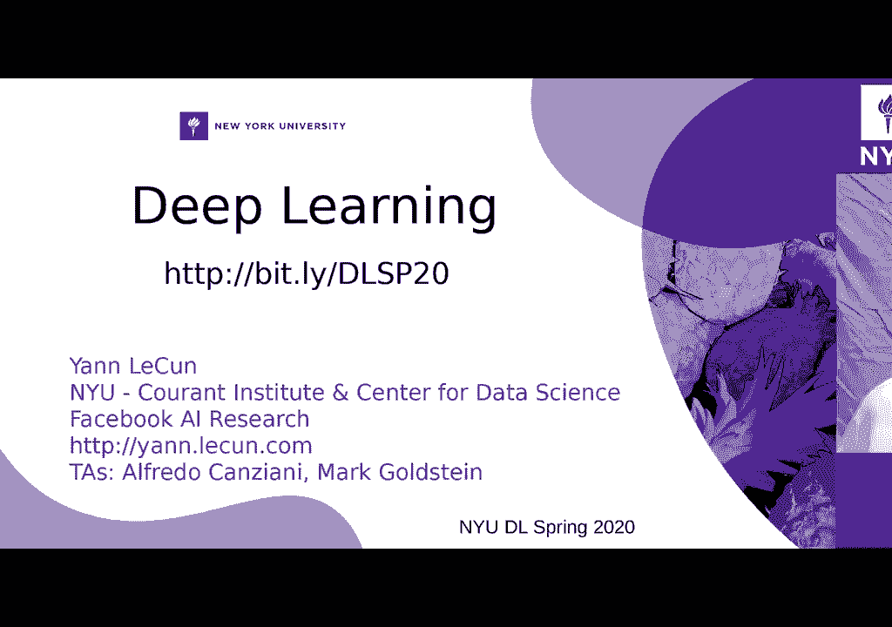

阿尔弗雷多，我看不到你，我看不到其他人，所以是的，阿尔弗雷多，我看不到你，我看不到其他人，所以是的，是的，一切都很好，你也可以做个手势，我可以看到你，是的，一切都很好，你也可以做个手势，我可以看到你。

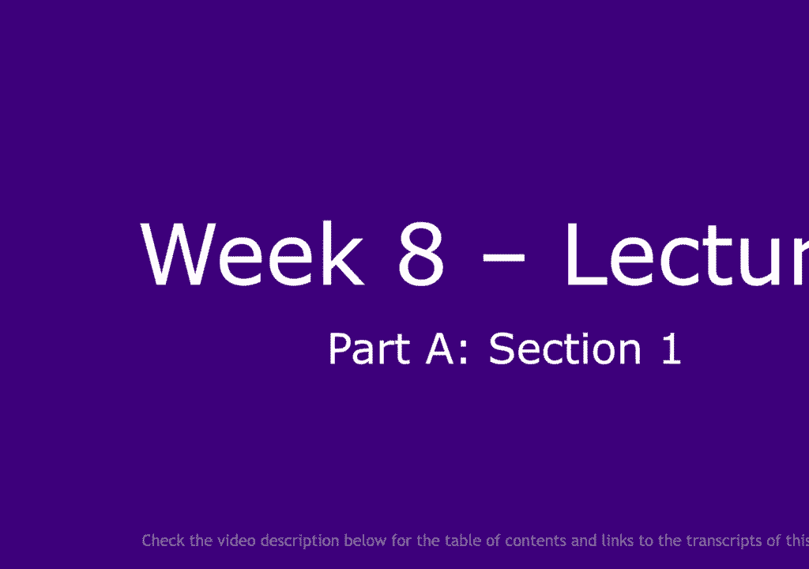

好的，所以，我们要谈谈，好的，所以，我们要谈谈，关于基于能量的模型，并且主要是在，关于基于能量的模型，并且主要是在，细胞监督或无监督学习继续，细胞监督或无监督学习继续，我们上次离开的地方。

所以让我从一点点开始，我们上次离开的地方，所以让我从一点点开始，提醒我们上次离开的地方，提醒我们上次离开的地方。

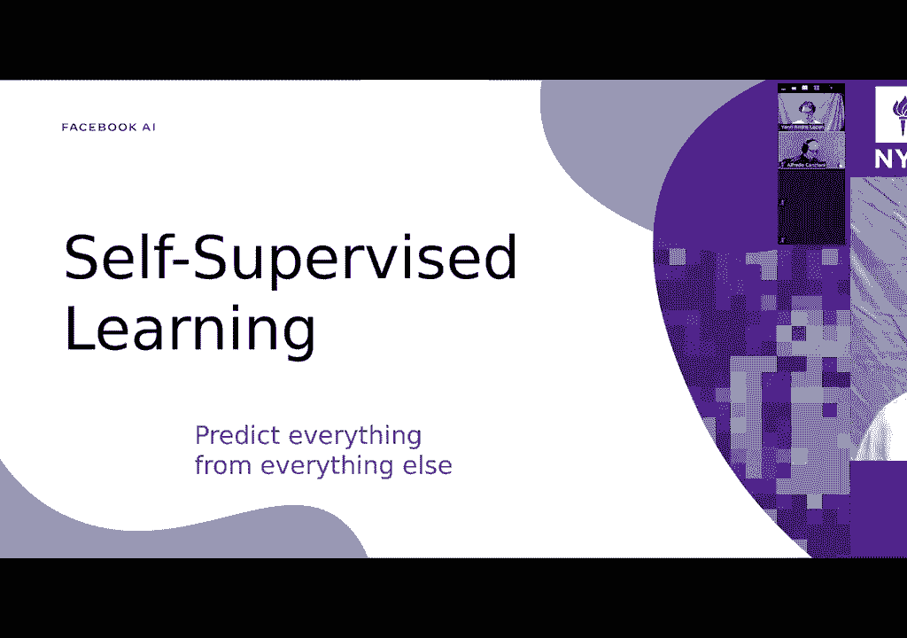

我们把监督学习称为，我们把监督学习称为，基本上是试图从其他事物中预测一切，基本上是试图从其他事物中预测一切，假装一部分输入对系统不可见，而另一部分对系统不可见，假装一部分输入对系统不可见。

而另一部分对系统不可见，部分可见，我们训练系统来预测，部分可见，我们训练系统来预测，可见部分中的不可见部分，当然，可能是视频的任何部分，当然，可能是视频的任何部分，可能还有别的情况，可能还有别的情况。

呃，我们不认为任何东西都可见，呃，我们不认为任何东西都可见，在任何时候，所以我们只是要求系统进行预测，在任何时候，所以我们只是要求系统进行预测，嗯，突然之间没有任何输入，所以我们讨论了这种方法，嗯。

突然之间没有任何输入，所以我们讨论了这种方法，基于能量的模型，基于能量的模型，基本上有一个隐式函数来捕获x之间的依赖关系，基本上有一个隐式函数来捕获x之间的依赖关系，和y或没有x的情况。

和y或没有x的情况，是y的各个分量之间的依存关系，是y的各个分量之间的依存关系，而我们需要隐式函数的原因是，而我们需要隐式函数的原因是，对于x的特定值，可能存在y的多个值，对于x的特定值。

可能存在y的多个值，那是可能的，因此，如果我们有一个从x到y的直接预测，我们只能做一个，因此，如果我们有一个从x到y的直接预测，我们只能做一个，预测并使用隐式函数我们可以使多个。

预测并使用隐式函数我们可以使多个，基本上通过隐含的预测函数，基本上通过隐含的预测函数，对于给定的x值，y的多个值的能量较低，对于给定的x值，y的多个值的能量较低，那有点在左边用，那有点在左边用，基本上。

您可以将其视为某种，基本上，您可以将其视为某种，数据指向的山地景观，数据指向的山地景观，在山谷中，其他一切都在数据中，在山谷中，其他一切都在数据中，能量更高，因此在这种情况下，推理基本上是。

因此在这种情况下，推理基本上是，查找给定x的ay或一组y，它们将xy的f最小化，查找给定x的ay或一组y，它们将xy的f最小化，所以这不是学习，学习在于塑造f，所以这不是学习，学习在于塑造f。

但这只是在讨论推理，因此，但这只是在讨论推理，因此，能够区分推理过程，能够区分推理过程，最小化能量函数来求y，最小化能量函数来求y，然后将损失函数最小化的学习过程，然后将损失函数最小化的学习过程。

能量函数关于参数，能量函数关于参数，能量函数好吧，两种不同的事物，能量函数好吧，两种不同的事物，如果是，无条件的情况下，您没有x，因此只捕获，无条件的情况下，您没有x，因此只捕获。

y之间的相互依赖性我们讨论了潜变量模型，y之间的相互依赖性我们讨论了潜变量模型，而我们谈论潜变量模型的原因是，而我们谈论潜变量模型的原因是，表示呃或构建架构的特定方式，表示呃或构建架构的特定方式。

能量函数以使其具有，能量函数以使其具有，给定x的y的倍数，因此本质上潜变量是，给定x的y的倍数，因此本质上潜变量是，没有人给你值的额外变量z，没有人给你值的额外变量z。

当您看到az时要做的第一件事就是将精力最小化，当您看到az时要做的第一件事就是将精力最小化，关于那个z的函数，现在给你能量，关于那个z的函数，现在给你能量，不再依赖z的函数，不再依赖z的函数，好吧。

或者如果您想对具有潜在性的模型进行推断，好吧，或者如果您想对具有潜在性的模型进行推断，变量我给你一个x，你会发现y和z的组合，变量我给你一个x，你会发现y和z的组合，减少能量，然后你给我，减少能量。

然后你给我，这就是这两种方法的推理过程，这就是这两种方法的推理过程，关于您没有观察到的变量的推论，只是，关于您没有观察到的变量的推论，只是，正如我刚才指出的那样，将其最小化，另一个是将其边缘化。

正如我刚才指出的那样，将其最小化，另一个是将其边缘化，如果您是概率论者，即使在其他情况下也可以，如果您是概率论者，即使在其他情况下也可以，有一个简单的公式可以从一个到另一个。

有一个简单的公式可以从一个到另一个，这基本上是z的所有可能值的对数和指数，并且，这基本上是z的所有可能值的对数和指数，并且，可能很棘手，所以我们不是很做，可能很棘手，所以我们不是很做，经常，好吧。

训练基于能量的模型包括对能量进行参数化，好吧，训练基于能量的模型包括对能量进行参数化，功能和收集当然一堆，功能和收集当然一堆，训练在有条件的情况下采样一堆x和y或只是一堆。

训练在有条件的情况下采样一堆x和y或只是一堆，y在无条件情况下，则由，y在无条件情况下，则由，塑造能量函数，以便您将低能量分配给良好的组合，塑造能量函数，以便您将低能量分配给良好的组合。

x和y的能量以及更高的能量来购买x和y的组合，因此对于给定，x和y的能量以及更高的能量来购买x和y的组合，因此对于给定，观察到x，您试图使y为f，观察到x，您试图使y为f，与x对应的对应y尽可能低。

与x对应的对应y尽可能低，但是然后您还需要使x和y的能量f，但是然后您还需要使x和y的能量f，y的所有其他值都较大，y的所有其他值都较大，如果您是这样，保持此能量函数的平稳可能是一个好主意。

如果您是这样，保持此能量函数的平稳可能是一个好主意，如果y是连续变量，则在连续空间中，如果y是连续变量，则在连续空间中，因为随后我将使推理更容易，您将可以使用，因为随后我将使推理更容易，您将可以使用。

基于梯度下降的方法可能对，基于梯度下降的方法可能对，其他方法，所以有两类学习，其他方法，所以有两类学习，我们上次谈到的算法第一类是对比方法，我们上次谈到的算法第一类是对比方法，基本上是压低。

基本上是压低，训练样本的能量，因此您可以获得训练样本，训练样本的能量，因此您可以获得训练样本，xiyi你把它插入你的能量功能，xiyi你把它插入你的能量功能，然后调整能量函数的参数，使能量。

然后调整能量函数的参数，使能量，下来，你可以做这个，嗯，你知道，下来，你可以做这个，嗯，你知道，如果您的能量函数是某种形式的，如果您的能量函数是某种形式的，只要有其他东西的神经网络。

只要有其他东西的神经网络，因为它是一个微分函数，所以你可以做到，因为它是一个微分函数，所以你可以做到，但是，那么你要做的就是选择，但是，那么你要做的就是选择，数据流之外的其他点，然后推动它们。

数据流之外的其他点，然后推动它们，增强能量，使能量得到正确的吸收，增强能量，使能量得到正确的吸收，形状还可以，所以这些是对比方法，形状还可以，所以这些是对比方法，然后有建筑方法和建筑方法。

然后有建筑方法和建筑方法，基本上包括以如下方式构建xy的f，基本上包括以如下方式构建xy的f，能消耗低能量的空间有限，能消耗低能量的空间有限，也许以某种方式最小化，所以如果您降低能量。

也许以某种方式最小化，所以如果您降低能量，某些点会自动剩下的，某些点会自动剩下的，之所以上升，是因为我们上升，因为可以消耗低能量的物质数量，之所以上升，是因为我们上升，因为可以消耗低能量的物质数量。

是有限的，是有限的。

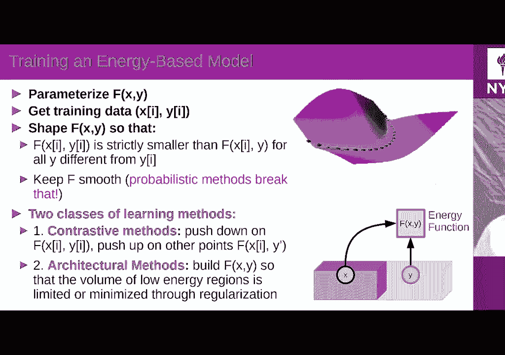

我在这里列出了清单，所以这是一张重要的幻灯片，我在这里列出了清单，所以这是一张重要的幻灯片，您上次看到的方法，其中列出了各种方法，您上次看到的方法，其中列出了各种方法，您可能听说过其中一些是对比性的。

您可能听说过其中一些是对比性的，在架构上，我必须说这两种方法不是，在架构上，我必须说这两种方法不是，必然彼此不兼容，您可以很好地结合使用，必然彼此不兼容，您可以很好地结合使用，这两种。

但是大多数方法只使用一种，这两种，但是大多数方法只使用一种，抛物线包含在内的最大可能性，抛物线包含在内的最大可能性，降低数据点的能量，然后增加，降低数据点的能量，然后增加，y的其他所有值都成比例。

y的其他所有值都成比例，能量到底有多低，如果能量较低，您会更努力地向上推，以便，能量到底有多低，如果能量较低，您会更努力地向上推，以便，最终您会得到正确形状的最大可能性。

最终您会得到正确形状的最大可能性，顺便说一句，它只是在乎能量的差异而并非在意，顺便说一句，它只是在乎能量的差异而并非在意，不在乎能量的绝对值，不在乎能量的绝对值，嗯，这是很重要的一点，然后还有其他方法。

例如对比，嗯，这是很重要的一点，然后还有其他方法，例如对比，散度度量学习比率匹配噪声，散度度量学习比率匹配噪声，对比估计最小概率流，对比估计最小概率流，诸如此类的东西，而生成平均数个网络。

诸如此类的东西，而生成平均数个网络，这也是基于增加能量的想法，这也是基于增加能量的想法，数据流形外部的数据点，然后有类似的方法，我们将使用恐龙自动编码器，然后有类似的方法，我们将使用恐龙自动编码器。

谈一会，就像我们上次看到的一样，谈一会，就像我们上次看到的一样，在自然语言处理系统中非常成​​功，在自然语言处理系统中非常成​​功，例如鸟，基本上是arduino，例如鸟，基本上是arduino。

一种特殊的，然后有建筑方法，一种特殊的，然后有建筑方法，上次我们谈到了pca和k-means，上次我们谈到了pca和k-means，嗯，但是我们要谈一些，嗯，但是我们要谈一些。

今天特别稀疏的编码和称为lista的东西，今天特别稀疏的编码和称为lista的东西，我不会谈论其余的，我不会谈论其余的，所以这又是对我们上次谈论的话题的重提，所以这又是对我们上次谈论的话题的重提，上周。

这是一个非常简单的潜在变量模型，上周，这是一个非常简单的潜在变量模型，无监督学习k均值，我确定你们都听说过，无监督学习k均值，我确定你们都听说过，那里的能量函数就是，那里的能量函数就是。

数据向量和原型矩阵的乘积，数据向量和原型矩阵的乘积，乘以一个潜在的变量向量和那个潜在的，乘以一个潜在的变量向量和那个潜在的，变量向量被约束为单热点向量，也就是说，变量向量被约束为单热点向量，也就是说。

当您选择w的列之一，当您选择w的列之一，用它乘以w，最后得到什么，用它乘以w，最后得到什么，是呃之间的平方距离，是呃之间的平方距离，数据向量和w的最靠近它的uh列，数据向量和w的最靠近它的uh列，嗯。

一旦您对z进行了最小化，这意味着您知道，嗯，一旦您对z进行了最小化，这意味着您知道，寻找哪一列w最接近y，这就是能量，寻找哪一列w最接近y，这就是能量，函数是寻找最接近的原型的推论算法，呃。

函数是寻找最接近的原型的推论算法，呃，只要有原型，能量函数当然为零，只要有原型，能量函数当然为零，并随着您离开原型而二次方增长，并随着您离开原型而二次方增长，直到您靠近另一个原型，在这种情况下，能量。

直到您靠近另一个原型，在这种情况下，能量，当您接近第二个原型时，它再次下降，当您接近第二个原型时，它再次下降，因此，如果您在生成训练样本的数据集上训练k均值，因此。

如果您在生成训练样本的数据集上训练k均值，通过呃偷看这个小螺旋，通过呃偷看这个小螺旋，这里在底部显示了kegel 20 in，这里在底部显示了kegel 20 in，在这种情况下。

您会得到一些小的黑色区域，这些区域表示，在这种情况下，您会得到一些小的黑色区域，这些区域表示，能量函数的最小值，有一个，能量函数的最小值，有一个，嗯，那里的山脊，你知道那种能量，嗯，那里的山脊。

你知道那种能量，就像嗯，你知道能量会下降。

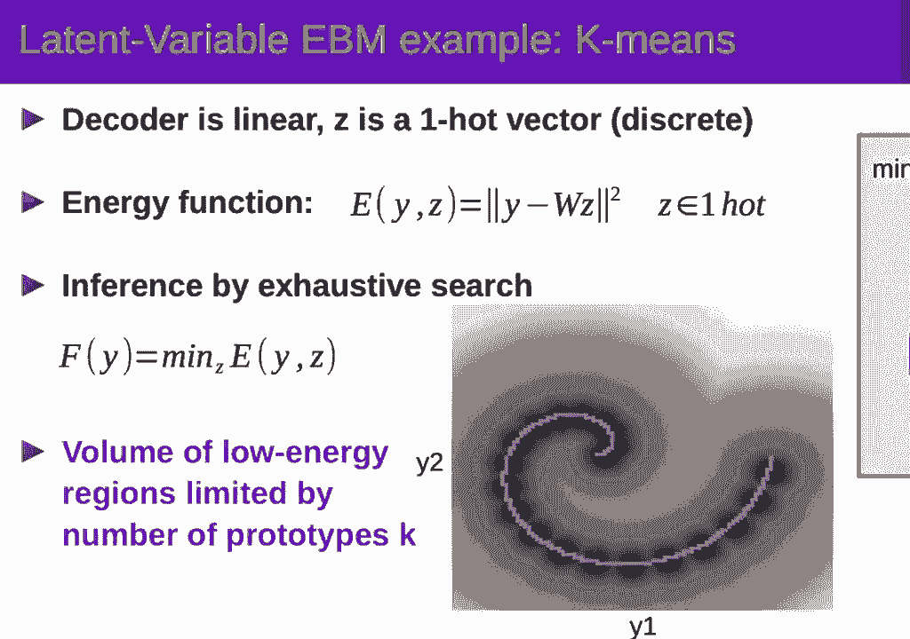

就像嗯，你知道能量会下降，双方都像一个山脊，但是这是一种已经成为一种方法，双方都像一个山脊，但是这是一种已经成为一种方法，在过去的几个月中非常受欢迎，这是最近的。

在过去的几个月中非常受欢迎，这是最近的，关于这方面的第一篇论文实际上可以追溯到很久以前，关于这方面的第一篇论文实际上可以追溯到很久以前，从90年代初到2000年代中期的论文被称为。

从90年代初到2000年代中期的论文被称为，当时的暹罗网络或度量学习，当时的暹罗网络或度量学习，如果您想建立一个基于能量的模型，如果您想建立一个基于能量的模型，通过拥有相同网络的两个副本或。

通过拥有相同网络的两个副本或，两个不同的网络，但通常是同一网络的这两个副本，两个不同的网络，但通常是同一网络的这两个副本，然后您将x馈送到第一个网络，将y馈入第二个网络，然后您将x馈送到第一个网络。

将y馈入第二个网络，你让他们在输出h和h素数上计算一些特征向量，你让他们在输出h和h素数上计算一些特征向量，然后将这两个特征向量与，然后将这两个特征向量与，一些方法，某种计算相似性或不相似性的方法。

一些方法，某种计算相似性或不相似性的方法，向量之间可能是点积也可能是余弦，向量之间可能是点积也可能是余弦，相似之处可能是这种类型的东西，相似之处可能是这种类型的东西，而你要做的是训练系统是。

而你要做的是训练系统是，你用一个数据点训练它基本上是一对，你用一个数据点训练它基本上是一对，x和y um的值，因此您指出了，x和y um的值，因此您指出了，通过基本告诉系统的数据流形。

通过基本告诉系统的数据流形，这是一个样品，告诉我是样品x，这是一个样品，告诉我是样品x，给我另一个基本上有的样品，给我另一个基本上有的样品，与x相同的内容，但有所不同，当然您永远也不会问。

与x相同的内容，但有所不同，当然您永远也不会问，该系统为您提供要生成的样本，该系统为您提供要生成的样本，这些样本并使用它来训练系统，这些样本并使用它来训练系统，有两对正对，所以对兼容，有两对正对。

所以对兼容，彼此之间是基于能量的模型的整体思想，彼此之间是基于能量的模型的整体思想，如果您愿意，则兼容对是或正对，如果您愿意，则兼容对是或正对，由x是图像和y是该图像的变换组成。

由x是图像和y是该图像的变换组成，基本上不会改变其内容，所以它仍然是相同的内容，基本上不会改变其内容，所以它仍然是相同的内容，如果需要图像的基本信息，如果需要图像的基本信息。

这两个网络提取的结果非常相似，这两个网络提取的结果非常相似，因为这些图像相似，而这正是您要做的，因为这些图像相似，而这正是您要做的，您将把这两个图像馈送到那两个网络，您将把这两个图像馈送到那两个网络。

并且您将具有损失函数，该函数表示将能量降至最低，并且您将具有损失函数，该函数表示将能量降至最低，表示最小化h和h素数之间的距离或相似性度量，表示最小化h和h素数之间的距离或相似性度量。

在两个网络um的输出之间，所以这是积极的一面，所以，在两个网络um的输出之间，所以这是积极的一面，所以，一种降低训练样本能量的方法，一种降低训练样本能量的方法，好的，然后您必须生成随机，好的。

然后您必须生成随机，否定样本及其生成方式是，否定样本及其生成方式是，基本上是再次为x选择一个样本，然后选择另一个图像，基本上是再次为x选择一个样本，然后选择另一个图像，知道与我们无关，知道与我们无关。

x如果您希望与它完全不同，则与它不兼容，x如果您希望与它完全不同，则与它不兼容，现在您要做的是将这两个图像馈送到这两个网络，现在您要做的是将这两个图像馈送到这两个网络，并且您尝试将h和h质数彼此推开。

并且您尝试将h和h质数彼此推开，所以基本上你想使h和h素数的相似矩阵c，所以基本上你想使h和h素数的相似矩阵c，对于这两个样本来说还可以，对于这两个样本来说还可以，并且这里的目标函数将考虑在内。

并且这里的目标函数将考虑在内，呃对象是类似部分的能量函数，呃对象是类似部分的能量函数，对和抽取器对的能量函数，对和抽取器对的能量函数，会推低能量函数，而相似的对会推高，会推低能量函数，而相似的对会推高。

不同对的能量函数好吧，不同对的能量函数好吧，所以有很多恩，所以有很多恩，b您知道人们长期以来使用度量学习来做各种事情，b您知道人们长期以来使用度量学习来做各种事情，图像搜索的时间，例如，图像搜索的时间。

例如，像这样的功能识别，像这样的功能识别，但是直到最近几个月，但是直到最近几个月，几件作品表明他们可以使用这些方法，几件作品表明他们可以使用这些方法，学习物体识别的良好功能，学习物体识别的良好功能。

那些真的是第一批产生特色的论文，那些真的是第一批产生特色的论文，以无监督或无监督的方式产生可以与，以无监督或无监督的方式产生可以与，通过监督学习获得的功能，通过监督学习获得的功能。

所以有问题的三篇论文是珍珠，这意味着要保护，所以有问题的三篇论文是珍珠，这意味着要保护，isha mitra和，isha mitra和。

劳伦斯·范·德·马腾（Lawrence Van der Matten）在纽约的Facebook上另外一个叫。

劳伦斯·范·德·马腾（Lawrence Van der Matten）在纽约的Facebook上另外一个叫，kamingha和他的合作者在Menlo Park的Facebook上获得的moko。

kamingha和他的合作者在Menlo Park的Facebook上获得的moko，最近出现的第三个叫做sim clear，最近出现的第三个叫做sim clear。

由来自google janet al的小组和最后一位作者，由来自google janet al的小组和最后一位作者，杰弗里·西顿，所以嗯，还有其他工作，所以嗯，还有其他工作，一种方法，呃。

我想也许有一个问题ii，一种方法，呃，我想也许有一个问题ii，这不是问题，实际上是我的手机正在唤醒，因为我说Google，这不是问题，实际上是我的手机正在唤醒，因为我说Google，哦，我认为还可以。

通过这些功能，我们将进行讨论，哦，我认为还可以，通过这些功能，我们将进行讨论，我们稍后再讨论，这有点相似，我们稍后再讨论，这有点相似，好的，这些是通过moco和，好的，这些是通过moco和。

他们本质上表明即使使用非常大的模型，他们本质上表明即使使用非常大的模型，这基本上是您使用此代码训练的resnet50版本，这基本上是您使用此代码训练的resnet50版本，对比方法，您获得了不错的表现。

对比方法，您获得了不错的表现，我相信这是呃，前五名的表现，我相信这是呃，前五名的表现，imagenet pearl实际上可以正常工作，imagenet pearl实际上可以正常工作，比moco更好。

这是这次的最高精确度um，比moco更好，这是这次的最高精确度um，我们的网络规模如此之大，所以这里有几个，我们的网络规模如此之大，所以这里有几个，场景，主要场景是你把你所有的图像网，场景。

主要场景是你把你所有的图像网，您从您提到的样本中提取了样本，将其扭曲，这给了您，您从您提到的样本中提取了样本，将其扭曲，这给了您，一个正对，通过您的两个网络运行它并训练，一个正对。

通过您的两个网络运行它并训练，网络产生基本上类似的输出，网络产生基本上类似的输出，两个网络实际上对于moco和parallel都是相同的，两个网络实际上对于moco和parallel都是相同的。

相同的是净的，然后取不同的对并推动，相同的是净的，然后取不同的对并推动，使用特定的成本函数使输出彼此远离，使用特定的成本函数使输出彼此远离，一会儿见，然后您必须做很多次，并且必须精打细算。

然后您必须做很多次，并且必须精打细算，您如何缓存负面样本，因为，您如何缓存负面样本，因为，大多数样本在到达输出时的时间已经非常不同，大多数样本在到达输出时的时间已经非常不同，连接到网络。

因此您基本上必须对如何，连接到网络，因此您基本上必须对如何，你会选择好的底片，所以目标函数的类型，你会选择好的底片，所以目标函数的类型，perl使用的被称为噪音，perl使用的被称为噪音，对比估计。

这可以追溯到，对比估计，这可以追溯到，以前的论文不是不是他们的发明，以前的论文不是不是他们的发明，相似度度量是多少，余弦相似度，相似度度量是多少，余弦相似度，在商业网的产出之间进行度量。

在商业网的产出之间进行度量，然后您计算的是这个，基本上像softmax一样，然后您计算的是这个，基本上像softmax一样，计算相似性度量指数的函数，计算相似性度量指数的函数，相似对的两个输出之和。

然后除以，相似对的两个输出之和，然后除以，相似对的指数相似度度量之和与，相似对的指数相似度度量之和与，不相似对的总和，因此您有一个批次，其中有一对相似对，不相似对的总和，因此您有一个批次。

其中有一对相似对，和一堆不相似的对，您可以计算出这种软最大值，和一堆不相似的对，您可以计算出这种软最大值，事情，如果你自己最小化最大成本函数将推动，事情，如果你自己最小化最大成本函数将推动。

相似对的相似度，相似对的相似度，尽可能大的余弦和相似度，尽可能大的余弦和相似度，十进制对的相似性基本上要尽可能小，十进制对的相似性基本上要尽可能小，这个问题，为什么我们分别使用一次，这个问题。

为什么我们分别使用一次，功能，而我们可能直接，功能，而我们可能直接，使用hvivi变换的公式计算法则，使用hvivi变换的公式计算法则，通过取该概率的负对数得到的概率，通过取该概率的负对数得到的概率。

就像l和z会带来什么好处，就像l和z会带来什么好处，使用呃就像不直接取负数，使用呃就像不直接取负数，我们从h那里得到的概率是个好问题，不是，我们从h那里得到的概率是个好问题，不是。

对我来说很清楚为什么我想呃发生了什么事，对我来说很清楚为什么我想呃发生了什么事，人们尝试了很多不同的东西，人们尝试了很多不同的东西，事情，这才是最有效的方法，事情，这才是最有效的方法。

在提示纸中有类似的内容，在提示纸中有类似的内容，他们尝试了不同类型的目标函数，他们尝试了不同类型的目标函数，并发现类似nc的东西实际上效果很好，并发现类似nc的东西实际上效果很好。

所以这是一个经验性的问题，而且我对为什么没有很好的学费，所以这是一个经验性的问题，而且我对为什么没有很好的学费，这个名词除了这个，这个名词除了这个，分母呃，我希望这能回答您的问题，分母呃。

我希望这能回答您的问题，虽然抱歉，我没有任何答案，虽然抱歉，我没有任何答案，为什么使用余弦相似度代替l2范数，为什么使用余弦相似度代替l2范数，而不是l2规范或不是，这是因为，而不是l2规范或不是。

这是因为，你是因为你想规范化两个向量很容易，你是因为你想规范化两个向量很容易，通过使它们非常短或使两个向量非常相似，通过使它们非常短或使两个向量非常相似，不相似。

但可以通过余弦相似度使它们长久保持良好状态，不相似，但可以通过余弦相似度使它们长久保持良好状态，您基本上是在规范化您在计算点积，但是，您基本上是在规范化您在计算点积，但是，您正在标准化该点积。

因此您可以独立进行测量，您正在标准化该点积，因此您可以独立进行测量，向量长度的，所以它强制，向量长度的，所以它强制，该系统可以在没有问题的情况下找到很好的解决方案。

该系统可以在没有问题的情况下找到很好的解决方案，只是不作弊，只是让您知道向量短或，只是不作弊，只是让您知道向量短或，大它也消除了不稳定性，大它也消除了不稳定性，他们可能是在系统中那些对比的设计。

他们可能是在系统中那些对比的设计，功能实际上是相当黑的心，功能实际上是相当黑的心，好吧，所以他们在珍珠中实际所做的就是，好吧，所以他们在珍珠中实际所做的就是，他们不直接将convnet的输出用于。

他们不直接将convnet的输出用于，对于目标功能，他们有不同的负责人，对于目标功能，他们有不同的负责人，因此，基本上非洲大陆的头目f和g不同，因此，基本上非洲大陆的头目f和g不同，这两个网络是不同的。

这两个网络是不同的，这就是他们在这种收缩式学习中所使用的，然后，这就是他们在这种收缩式学习中所使用的，然后，你知道他们用另一个头吗，你知道他们用另一个头吗，分类的最终任务，分类的最终任务，因此。

您可以将这些f和g函数视为一种额外的功能，因此，您可以将这些f和g函数视为一种额外的功能，在网络顶部，在网络顶部，两者是不同的两个网络的两个都很好所以这些是，两者是不同的两个网络的两个都很好所以这些是。

这些是产生的结果，这些是产生的结果，通过呃，通过珍珠，嗯，你可以得到，这就是这个，通过呃，通过珍珠，嗯，你可以得到，这就是这个，特定的实验是您使用以下方法对系统进行预训练的实验。

特定的实验是您使用以下方法对系统进行预训练的实验，在imagenet训练集上进行perl，然后您会做的是，在imagenet训练集上进行perl，然后您会做的是，您重新训练后。

可以使用标记的百分之一来微调系统，您重新训练后，可以使用标记的百分之一来微调系统，样本或标签样本的百分之十，您可以测量，样本或标签样本的百分之十，您可以测量，性能前五位精度或最高点精度。

性能前五位精度或最高点精度，所以这篇论文在一月在档案馆里出现，所以这篇论文在一月在档案馆里出现，嗯，就在几周前，这份呼吁书叫辛克莱（sinclair），嗯，就在几周前。

这份呼吁书叫辛克莱（sinclair），通过channing al um，这是Google的团队，他们，通过channing al um，这是Google的团队，他们。

具有非常复杂的损坏或数据扩充方法来生成，具有非常复杂的损坏或数据扩充方法来生成，类似的对，他们训练很长的时间，类似的对，他们训练很长的时间，在很多tpu上花费时间，它们变得非常有趣。

在很多tpu上花费时间，它们变得非常有趣，结果比珍珠或莫科好得多，结果比珍珠或莫科好得多，使用非常大的模型，他们可以让您知道超过75％的正确率，他们可以让您知道超过75％的正确率。

通过预先训练就可以在imagenet上达到最高点，通过预先训练就可以在imagenet上达到最高点，以细胞监督的方式进行，然后进行微调，只有百分之一，以细胞监督的方式进行，然后进行微调，只有百分之一。

其他样品是的，所以这是呃，其他样品是的，所以这是呃，实际上，上一张幻灯片是另一种情况，实际上，上一张幻灯片是另一种情况，嗯，您只在顶部训练线性分类器，嗯，您只在顶部训练线性分类器，在网络顶部。

这是您与任一人一起训练的场景，在网络顶部，这是您与任一人一起训练的场景，标签样本的百分比或百分之十，标签样本的百分比或百分之十，而且，您会在前五名中获得百分之八十五的收益，其中百分之一，而且。

您会在前五名中获得百分之八十五的收益，其中百分之一，标签，嗯，你知道非常惊人的结果，标签，嗯，你知道非常惊人的结果，在某种程度上，我认为这表明了对比的局限性，在某种程度上，我认为这表明了对比的局限性。

方法，因为大量的计算和训练，方法，因为大量的计算和训练，这绝对是巨大的，这是巨大的，所以这里是，这绝对是巨大的，这是巨大的，所以这里是，您只是在顶部训练线性快速射击的场景，所以。

您只是在顶部训练线性快速射击的场景，所以，您冻结了系统已经产生的功能，您冻结了系统已经产生的功能，使用自我监督学习进行了预训练，然后您，使用自我监督学习进行了预训练，然后您，只需在顶部训练线性分类器。

然后测量性能，只需在顶部训练线性分类器，然后测量性能，经过训练的完整图像网上前五名的总分，经过训练的完整图像网上前五名的总分，整个图像网上的主管，数字确实是，整个图像网上的主管，数字确实是。

令人印象深刻，但我再次认为它显示了极限，令人印象深刻，但我再次认为它显示了极限，收缩方法是对比方法的主要问题，收缩方法是对比方法的主要问题，是有很多很多地方，是有很多很多地方，在高维空间中。

您需要增加能量，在高维空间中，您需要增加能量，确保它实际上更高，确保它实际上更高，而不是数据流形上的任何地方，因此随着您扩大维度，而不是数据流形上的任何地方，因此随着您扩大维度，需要更多负样本的表示。

需要更多负样本的表示。

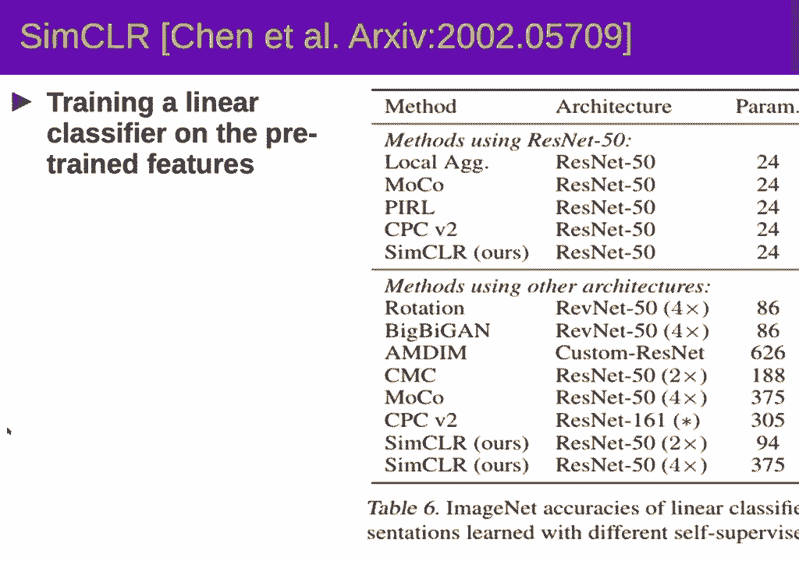

确保能量更高，需要更高的能量，所以，确保能量更高，需要更高的能量，所以，让我们谈谈另一种对比，让我们谈谈另一种对比，所谓的使玩具编码器降噪的方法已经成为。

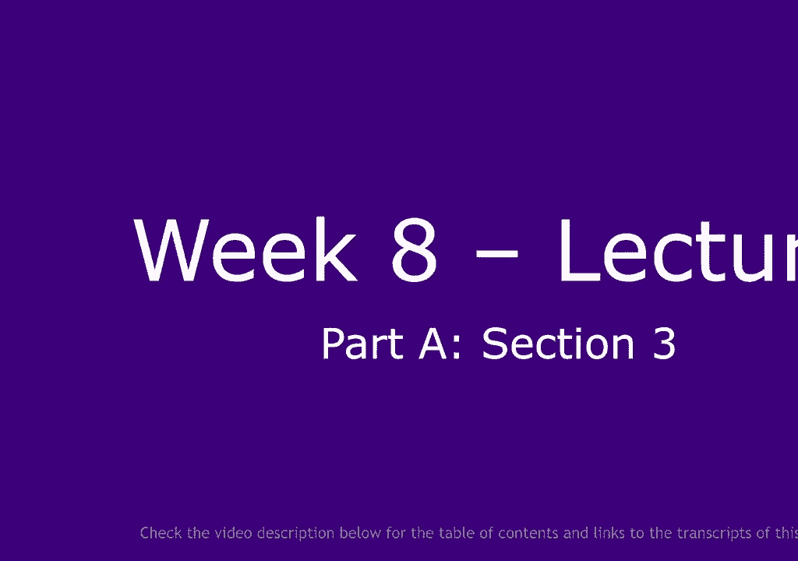

所谓的使玩具编码器降噪的方法已经成为，真的很重要，真的很重要，一年半左右的自然语言处理，一年半左右的自然语言处理，嗯，去噪自动编码器的想法是，嗯，去噪自动编码器的想法是，而生成x的方式是破坏y。

这听起来有点，而生成x的方式是破坏y，这听起来有点，就像我们正在做的相反，就像我们正在做的相反，使用对比方法，但基本上您会获得清晰的图像，为什么，使用对比方法，但基本上您会获得清晰的图像，为什么。

通过删除一部分以某种方式破坏它，通过删除一部分以某种方式破坏它，或者您取了一段文字，然后删除了一些单词，或者您遮罩了，或者您取了一段文字，然后删除了一些单词，或者您遮罩了，它的一部分。

所以特例是带遮罩的自动编码器，它的一部分，所以特例是带遮罩的自动编码器，损坏在于掩盖输入的一部分，损坏在于掩盖输入的一部分，然后通过一个自动编码器运行它，然后通过一个自动编码器运行它。

您基本上知道编码器或预测器，您基本上知道编码器或预测器，一个解码器，您也许知道，您知道漏斗层，一个解码器，您也许知道，您知道漏斗层，知道在文本上下文中可能有uh max。

知道在文本上下文中可能有uh max，不，如果您不知道它是否是图像，然后您计算比较，不，如果您不知道它是否是图像，然后您计算比较，预测输出uh y bar与观察到的uh。

预测输出uh y bar与观察到的uh，数据为什么，数据为什么，所以这个原理是什么，这个原理是，所以这个原理是什么，这个原理是，以下是，你可以感谢阿尔弗雷多的那些，以下是，你可以感谢阿尔弗雷多的那些。

基本上是漂亮的照片，是的，我们上课时看到了，基本上是漂亮的照片，是的，我们上课时看到了，星期二是正确的，所以这基本上是，星期二是正确的，所以这基本上是，只是提醒您获取一个数据点，因此。

只是提醒您获取一个数据点，因此，那些粉红色的点之一正确，而您将其损坏，那些粉红色的点之一正确，而您将其损坏，你得到那些棕点之一，然后训练，你得到那些棕点之一，然后训练，呃自动编码器从棕点到产生粉红色。

呃自动编码器从棕点到产生粉红色，指向原始的粉红色点是什么，指向原始的粉红色点是什么，这意味着现在的能量函数是，这意味着现在的能量函数是，重建误差将等于，重建误差将等于，原始点与粉色点之间的距离为。

原始点与粉色点之间的距离为，平方距离，如果c是欧几里得平方欧几里得，平方距离，如果c是欧几里得平方欧几里得，距离，所以如果您使用c yybar，距离，所以如果您使用c yybar。

认为它经过适当的培训将是，认为它经过适当的培训将是，损坏的点，呃，品牌点和，损坏的点，呃，品牌点和，从何处开始就确定了，从何处开始就确定了，所以基本上它基本上就是训练系统。

所以基本上它基本上就是训练系统，产生一个能量函数，该函数随着您移开而平方增长，产生一个能量函数，该函数随着您移开而平方增长，来自数据流形，很好，所以这是一个例子，来自数据流形，很好，所以这是一个例子。

对比方法，因为您可以增加外部点的能量，对比方法，因为您可以增加外部点的能量，数据流形，基本上你告诉他们，数据流形，基本上你告诉他们，您的能量应该是到数据流形的平方距离。

您的能量应该是到数据流形的平方距离，或至少达到您知道之前使用的程度，或至少达到您知道之前使用的程度，通过腐败，但问题在于，又是在高维连续空间中，但问题在于，又是在高维连续空间中，有很多很多方法可以破坏。

有很多很多方法可以破坏，一段数据，嗯，还不完全清楚您是否能够，一段数据，嗯，还不完全清楚您是否能够，通过向上推很多，通过向上推很多，它在文本中的不同位置，因为文本是，它在文本中的不同位置，因为文本是。

离散的，在图像人中效果不佳，离散的，在图像人中效果不佳，例如在成像绘画的背景下使用了这个，所以腐败，例如在成像绘画的背景下使用了这个，所以腐败，包括遮盖一部分图像，然后训练，包括遮盖一部分图像。

然后训练，系统来重建它，它不起作用的原因是，系统来重建它，它不起作用的原因是，因为人们倾向于在没有潜在变量的情况下训练系统，因为人们倾向于在没有潜在变量的情况下训练系统，在我的小图中，这里有一个小变量。

但是，在我的小图中，这里有一个小变量，但是，实际上在使用的这个版本中，实际上在使用的这个版本中，因为在图像的上下文中没有真正的潜在变量，因为在图像的上下文中没有真正的潜在变量，系统难以梦想。

系统难以梦想，绘画问题的单一解决方案，绘画问题的单一解决方案，这是一种多模式[音乐]，这是一种多模式[音乐]，流形我是说这是一个流形它可能不是，流形我是说这是一个流形它可能不是，仅一点。

这里有很多方法可以完成图像，仅一点，这里有很多方法可以完成图像，填写被遮罩的呃部分，填写被遮罩的呃部分，因此，利用该潜在变量，系统会产生模糊的预测，因此，利用该潜在变量，系统会产生模糊的预测。

没有学到特别好的功能是多模式部分也是原因，没有学到特别好的功能是多模式部分也是原因，为什么我们在螺旋中具有内部紫色区域，因为每个，为什么我们在螺旋中具有内部紫色区域，因为每个。

这些点中的两个在两个分支之间有两个预测，这些点中的两个在两个分支之间有两个预测，螺旋向右旋转，所以这是另一个问题，螺旋向右旋转，所以这是另一个问题，呃，如果你不小心，那你知道，呃，如果你不小心。

那你知道，中间的点，您知道那可能是，中间的点，您知道那可能是，损坏的结果呃一侧的一个点，损坏的结果呃一侧的一个点，歧管或歧管另一侧的粉红色点，歧管或歧管另一侧的粉红色点，中间的那些点不知道去哪里。

因为一半，中间的那些点不知道去哪里，因为一半，训练他们去歧管的一部分的时间，训练他们去歧管的一部分的时间，他们有一半的时间试图去歧管的另一部分，他们有一半的时间试图去歧管的另一部分，因此。

这可能会在能量函数中产生某种平坦的点，因此，这可能会在能量函数中产生某种平坦的点，不好，所以你知道有办法减轻这种情况，但是他们不是，不好，所以你知道有办法减轻这种情况，但是他们不是，完全可以解决。

除非您使用拉丁语，完全可以解决，除非您使用拉丁语，变量模型可以，其他对比方法是，变量模型可以，其他对比方法是，只是为了你自己的利益而过，只是为了你自己的利益而过，诸如对比差异um和其他我不打算做的事情。

诸如对比差异um和其他我不打算做的事情，谈论，但是对比差异是一个非常简单的想法，您选择，谈论，但是对比差异是一个非常简单的想法，您选择，训练样本，您可以降低此时的能量，训练样本，您可以降低此时的能量。

当然，然后从该样本中使用基于梯度的某种，当然，然后从该样本中使用基于梯度的某种，过程中，您会在噪声的作用下沿能量表面向下移动，过程中，您会在噪声的作用下沿能量表面向下移动，从样本开始。

弄清楚如何更改样本，如何更改样本，从样本开始，弄清楚如何更改样本，如何更改样本，y以这样的方式，y以这样的方式，当前基于能量的模型产生的能量比我刚刚产生的能量低。

当前基于能量的模型产生的能量比我刚刚产生的能量低，我只是测量了样本，所以基本上您正在尝试找到，我只是测量了样本，所以基本上您正在尝试找到，输入空间中另一点的能量低于，输入空间中另一点的能量低于。

您刚刚输入的训练点就可以了，所以您可以将其视为，您刚刚输入的训练点就可以了，所以您可以将其视为，一种破坏培训样本的聪明方法，一种破坏培训样本的聪明方法，因为你不是随机的，因为你不是随机的，破坏它。

您可以通过基本上修改它以找到一个点来破坏它，破坏它，您可以通过基本上修改它以找到一个点来破坏它，在空间上，您的模型已经给它带来了低能量，因此它会，在空间上，您的模型已经给它带来了低能量，因此它会。

是您想要提高的一点，因为，是您想要提高的一点，因为，您的模型为它提供了低能量，而您不希望它具有低能量，因此，您的模型为它提供了低能量，而您不希望它具有低能量，因此，你把它推上去，我要呃教授有人尝试过吧。

你把它推上去，我要呃教授有人尝试过吧，与此方法进行对比的绘画方法，与此方法进行对比的绘画方法，如果他们一起做的话，一个人怎么做才能真正起作用？如果他们一起做的话，一个人怎么做才能真正起作用？

所以当您拍摄图像时，喷涂是一种对比方法，所以当您拍摄图像时，喷涂是一种对比方法，你通过阻止它来破坏它，你通过阻止它来破坏它，然后您训练一个神经网络，基本上是一个自动编码器来生成，然后您训练一个神经网络。

基本上是一个自动编码器来生成，完整图像，然后您比较此重建，完整图像，然后您比较此重建，完整的图像和原始的未损坏图像，这就是您的精力，完整的图像和原始的未损坏图像，这就是您的精力，功能还可以。

这是一种对比方法，功能还可以，这是一种对比方法，对，所以如果我们在绘画损失中使用uh nc损失，对，所以如果我们在绘画损失中使用uh nc损失，嗯，那样有用吗？您真的可以使用nc损失，因为，嗯。

那样有用吗？您真的可以使用nc损失，因为，因为您依赖一定数量的事实，因为您依赖一定数量的事实，阴性样本好吧，在这里您可以人工生成，阴性样本好吧，在这里您可以人工生成，阴性样本，所以它实际上是一个完全。

阴性样本，所以它实际上是一个完全，不同的情况，我不认为你会，不同的情况，我不认为你会，你可以用类似nce的东西，你可以用类似nce的东西，或至少没有有意义的方式，好的，这就是为什么空间，好吧，一二。

假设您的数据流形，好吧，一二，假设您的数据流形，是这样的，嗯，但现在您的能量函数是，嗯，但现在您的能量函数是，这样的事情，所以我在这里画低能量的区域，这样的事情，所以我在这里画低能量的区域，我正在画线。

成本相等，所以能量在左下角看起来不错，您有数据，成本相等，所以能量在左下角看起来不错，您有数据，此处指出您的模型对，此处指出您的模型对，那么您的模型就不好了，因为它在右下角，那么您的模型就不好了。

因为它在右下角，能量到没有数据的区域，然后在，能量到没有数据的区域，然后在，在顶部，您拥有数据点，表明您的模型具有很高的能量，在顶部，您拥有数据点，表明您的模型具有很高的能量，好的。

所以这是对比差异如何起作用的，好的，所以这是对比差异如何起作用的，你拿一个训练样本来告诉这个人，并通过梯度，你拿一个训练样本来告诉这个人，并通过梯度，下降，你沿着能量表面下降，下降，你沿着能量表面下降。

到能量不足的程度，现在这是一个训练样本，为什么，到能量不足的程度，现在这是一个训练样本，为什么，您现在获得的是一个对比样本y条，您现在获得的是一个对比样本y条，现在要做的就是更改能量函数的参数。

现在要做的就是更改能量函数的参数，这样您可以使y的能量变小而y bar的能量变大，这样您可以使y的能量变小而y bar的能量变大，可以使用某种损失函数，可以使用某种损失函数。

您知道按下一个会推高另一个会使用损耗函数，您知道按下一个会推高另一个会使用损耗函数，是一种材料，您只需要一种可以做正确的事情，是一种材料，您只需要一种可以做正确的事情，好吧。

所以我在这里描述的是确定性版本的，好吧，所以我在这里描述的是确定性版本的，对比差异，但实际上对比差异有点像，对比差异，但实际上对比差异有点像，你在做什么的概率版本，你在做什么的概率版本。

一种基于梯度的下降，我的意思是这种，一种基于梯度的下降，我的意思是这种，搜索一个低能量点，但是您可以随机进行，搜索一个低能量点，但是您可以随机进行，随机一些噪声，所以一种连续进行此操作的方法。

随机一些噪声，所以一种连续进行此操作的方法，像这样的空间是您随机踢，像这样的空间是您随机踢，您认为这里的数据点有点像大理石，您认为这里的数据点有点像大理石，它将沿着能量表面下降，您可以随机插入。

它将沿着能量表面下降，您可以随机插入，在一些随机的方向说这个，然后让系统跟随梯度，然后让系统跟随梯度，累了就停下来，别等它，累了就停下来，别等它，一直走下去，直到累了才停下来，然后有一个规则。

一直走下去，直到累了才停下来，然后有一个规则，选择是否保持重点，那是您的那条白条，选择是否保持重点，那是您的那条白条，为什么踢是必要的，所以踢是必要的，这样你才能走，为什么踢是必要的，所以踢是必要的。

这样你才能走，跨越你们之间的能量屏障，跨越你们之间的能量屏障，和最低的能量，嗯，嗯，这就是为什么您需要，和最低的能量，嗯，嗯，这就是为什么您需要，现在踢吧，如果你有一个空白的空格，现在踢吧。

如果你有一个空白的空格，连续但离散的呃你仍然可以做这种能量，连续但离散的呃你仍然可以做这种能量，通过基本上执行以下操作来最小化，通过基本上执行以下操作来最小化，模拟退火，如果y是离散变量。

则本质上是uh，模拟退火，如果y是离散变量，则本质上是uh，如果您从中获得能量，则会随机干扰它，如果您从中获得能量，则会随机干扰它，摄动较低，则保持不变；摄动较高，则保持不变，摄动较低，则保持不变；

摄动较高，则保持不变，几率，然后您继续这样做，几率，然后您继续这样做，最终能量会下降，所以这是基于非梯度的，最终能量会下降，所以这是基于非梯度的，优化算法或无梯度优化算法（如果需要）。

优化算法或无梯度优化算法（如果需要），当空间是离散的并且不能使用时，您必须诉诸于此，当空间是离散的并且不能使用时，您必须诉诸于此，我刚刚描述的这种技术的梯度信息，我刚刚描述的这种技术的梯度信息。

踢大理石并进行模拟，踢大理石并进行模拟，降低能量，这被称为“汉密尔顿蒙特”，降低能量，这被称为“汉密尔顿蒙特”，carlo hnc，您也许会在，carlo hnc，您也许会在，其他在其他情况下。

这是另一种产生方式，其他在其他情况下，这是另一种产生方式，阴性样本是的我是意大利蒙特卡洛。

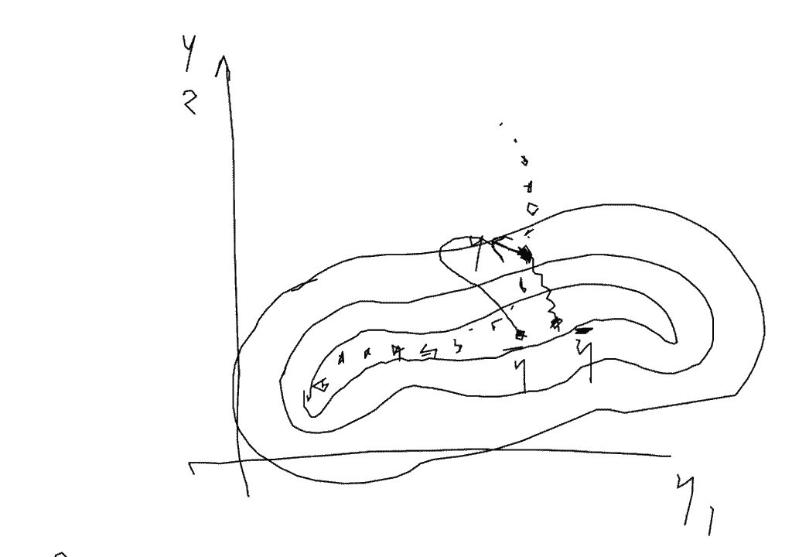

阴性样本是的我是意大利蒙特卡洛，有人有时称这种杂交蒙特卡洛，有人有时称这种杂交蒙特卡洛，所以你们中有些人可能听说过，所以你们中有些人可能听说过，受限轻木机和收据残差机是基于能源的。

受限轻木机和收据残差机是基于能源的，能量非常简单的模型，它写在，能量非常简单的模型，它写在，此处的y和z的能量最底，所以y基本上是，此处的y和z的能量最底，所以y基本上是，输入数据向量，z是呃。

这是一个相关变量，能量，输入数据向量，z是呃，这是一个相关变量，能量，函数为负z转置wy哪里y哪里w，函数为负z转置wy哪里y哪里w，是矩阵，不一定是正方形的，因为z和y可能不同，是矩阵。

不一定是正方形的，因为z和y可能不同，嗯，尺寸，通常z和y都是二进制的，嗯，尺寸，通常z和y都是二进制的，变量，所以我的意思是二进制向量，变量，所以我的意思是二进制向量，因此这些组件是二进制变量。

它们在某种程度上颇受欢迎，因此这些组件是二进制变量，它们在某种程度上颇受欢迎，在2000年代中期，但是您知道我在这里花的时间不多，因为，在2000年代中期，但是您知道我在这里花的时间不多，因为，嗯。

他们有点失宠了，他们不是，嗯，他们有点失宠了，他们不是，他们不是那么受欢迎，只是给您一些参考，他们不是那么受欢迎，只是给您一些参考，嗯，这是什么意思呢？嗯，这是什么意思呢？其中之一被称为持续对比发散。

其中之一被称为持续对比发散，它包括使用一堆颗粒，它包括使用一堆颗粒，嗯，你可以记住这个位置，所以他们有永久的，嗯，你可以记住这个位置，所以他们有永久的，持久的位置，如果你想要的话。

你把一堆的大理石扔进去，持久的位置，如果你想要的话，你把一堆的大理石扔进去，您的能源前景，您不断，您的能源前景，您不断，您会不断使它们滚动下来，可能会有一点噪音或，您会不断使它们滚动下来。

可能会有一点噪音或，或踢，然后保持他们的位置，这样就不会改变，或踢，然后保持他们的位置，这样就不会改变，根据新样品，新训练样品的大理石位置，根据新样品，新训练样品的大理石位置，只要把大理石放在原处。

最终他们会发现能量低，只要把大理石放在原处，最终他们会发现能量低，放置在您的能量表面中，会导致，放置在您的能量表面中，会导致，他们被推高，因为因为那会发生，他们被推高，因为因为那会发生，在训练期间。

在训练期间，但这不能很好地扩展，因此您知道的rbms之类的东西变得非常，但这不能很好地扩展，因此您知道的rbms之类的东西变得非常，在高尺寸内训练非常昂贵，在高尺寸内训练非常昂贵，好吧。

现在基于常规隔离的可行能源，好吧，现在基于常规隔离的可行能源。

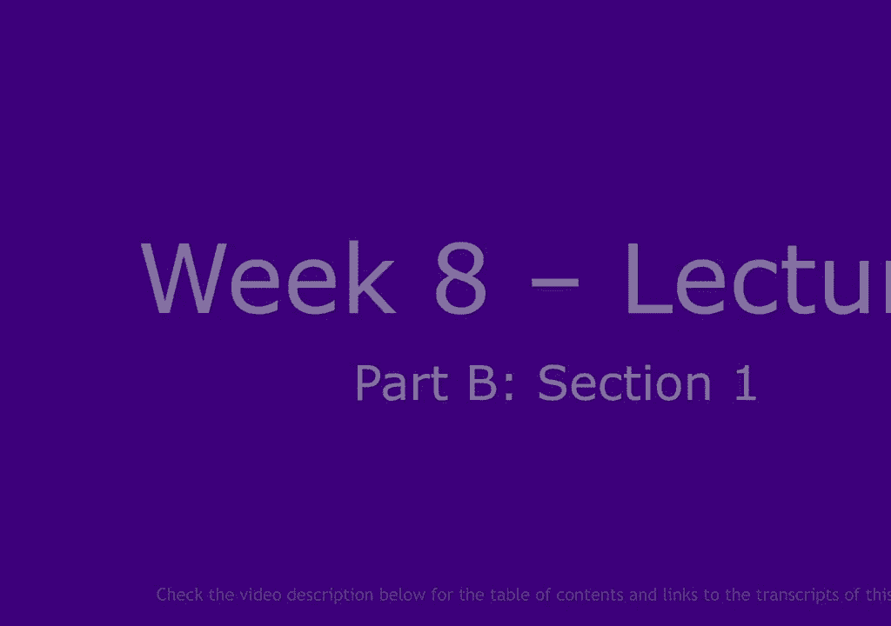

我目前最喜欢的型号，我目前最喜欢的型号。

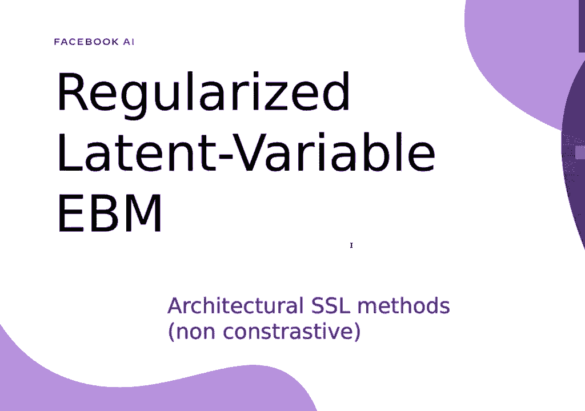

所以我们讨论了通过建立一个预测模型的想法，所以我们讨论了通过建立一个预测模型的想法，潜在变量正确，因此您有观察到的变量x可以将其运行到，潜在变量正确，因此您有观察到的变量x可以将其运行到。

预测变量提取一些表示，预测变量提取一些表示，的观测变量，然后进入解码器，产生，的观测变量，然后进入解码器，产生，预测，但是如果您想让解码器，预测，但是如果您想让解码器，能够做出多个预测。

然后向其提供潜在变量，能够做出多个预测，然后向其提供潜在变量，当您更改此潜在变量的值时，当您更改此潜在变量的值时，预测将在一定范围内有所变化，希望有大量数据，预测将在一定范围内有所变化，希望有大量数据。

在y的空间中的uh是相容的，在y的空间中的uh是相容的，与x，所以这里的架构就是能量的公式，所以这里的架构就是能量的公式，y如左所示，y如左所示，而且你知道c是比较这两个参数的成本函数。

而且你知道c是比较这两个参数的成本函数，将数据向量与将解码器应用于，将数据向量与将解码器应用于，考虑x的预测变量的输出，考虑x的预测变量的输出，解码器还考虑了z，解码器还考虑了z，所以这是问题。

如果z太强大，换句话说，如果z具有，所以这是问题，如果z太强大，换句话说，如果z具有，容量太大，那么他们总是会变成，容量太大，那么他们总是会变成，将产生一个y棒，该棒将完全等于y，将产生一个y棒。

该棒将完全等于y，所以请记住，这里的推论算法是给x和，所以请记住，这里的推论算法是给x和，ay，然后您找到使c最小的az，ay，然后您找到使c最小的az，yy bar的右边就是你。

yy bar的右边就是你，在基于能量的模型中推断潜在变量，在基于能量的模型中推断潜在变量，给定x和y找出使能量最小的z，给定x和y找出使能量最小的z，因此，例如，如果z与y具有相同的尺寸，因此，例如。

如果z与y具有相同的尺寸，解码器功能强大，足以代表身份功能，解码器功能强大，足以代表身份功能，那么对于任何y来说，总是会有az产生y bar，那么对于任何y来说，总是会有az产生y bar，完全等于y。

如果解码器是身份，完全等于y，如果解码器是身份，忽略h的函数参见实体函数，忽略h的函数参见实体函数，从z到uh到y到y bar，然后您只需设置，从z到uh到y到y bar，然后您只需设置。

z等于y并且能量为零，那将是一个可怕的能量，z等于y并且能量为零，那将是一个可怕的能量，基于模型的模型，因为它不会给物体带来高能量，基于模型的模型，因为它不会给物体带来高能量，在数据的多样性之外。

它为所有事物提供了低能量，在数据的多样性之外，它为所有事物提供了低能量，好吧，它为所有事物提供零能量，因此可以防止系统，好吧，它为所有事物提供零能量，因此可以防止系统，降低数据多方面的能量。

降低数据多方面的能量，是限制信息的能力，是限制信息的能力，潜变量z，更准确地说，如果z只能取10个不同的值，更准确地说，如果z只能取10个不同的值，这意味着您要限制z只能取十个。

这意味着您要限制z只能取十个，假设您将za设为维度10的一个热门向量，假设您将za设为维度10的一个热门向量，就像用k表示可以，那么y空间中只有10点，就像用k表示可以，那么y空间中只有10点。

能量为零，因为y等于y条之一，能量为零，因为y等于y条之一，从那十个z之一中产生的，从那十个z之一中产生的，或不是，则能量为零；如果不是，则能量为零，或不是，则能量为零；如果不是，则能量为零。

实际上必须大于零，因为，实际上必须大于零，因为，您从z远离uh，那正是，您从z远离uh，那正是，k均值的想法还可以，但是如果您发现，k均值的想法还可以，但是如果您发现，其他方式来限制z的信息内容。

其他方式来限制z的信息内容，这似乎是一个小的技术子问题，这似乎是一个小的技术子问题，但我认为您如何限制，但我认为您如何限制，这种类型的模型中潜在变量的信息内容，这种类型的模型中潜在变量的信息内容。

是今天人工智能中最重要的问题，是今天人工智能中最重要的问题，好吧，我不是在开玩笑，我认为主要，好吧，我不是在开玩笑，我认为主要，我们面临的问题是如何正确地进行自我监督学习。

我们面临的问题是如何正确地进行自我监督学习，和对比方法已经显示出其局限性，所以我们必须找到，和对比方法已经显示出其局限性，所以我们必须找到，替代品和替代品是正规化的，那里有可变模型。

替代品和替代品是正规化的，那里有可变模型，到目前为止可能还没有其他想法，到目前为止可能还没有其他想法，但是这些是我所知道的仅有的两个，然后是主要的技术问题，但是这些是我所知道的仅有的两个。

然后是主要的技术问题，我们需要解决的是如何限制信息内容，我们需要解决的是如何限制信息内容，潜变量的大小，以便我们限制音量，潜变量的大小，以便我们限制音量，可以消耗低能量的空白空间，因此我们自动使。

可以消耗低能量的空白空间，因此我们自动使，在我们训练的数据流形之外的能量，在我们训练的数据流形之外的能量，系统能量低，我们会自动将能量释放到外部，系统能量低，我们会自动将能量释放到外部，呃更高。

所以我要经历一些，呃更高，所以我要经历一些，实际起作用的系统示例以及人们所做的事情，实际起作用的系统示例以及人们所做的事情，因为在某些情况下您知道20年，因为在某些情况下您知道20年，嗯。

所以这就是您的想法，或者您添加的一个想法，嗯，所以这就是您的想法，或者您添加的一个想法，能量中的调节器，该调节器需要，能量中的调节器，该调节器需要，在空间的一小部分上价值低，在空间的一小部分上价值低。

z，因此系统将优先，z，因此系统将优先，选择在这种限制范围内的z值，选择在这种限制范围内的z值，设置r取小的值，如果z，设置r取小的值，如果z，需要走出那组去做一个很好的重建。

需要走出那组去做一个很好的重建，您在能源方面为此付出了代价，您在能源方面为此付出了代价，好，所以z空间的体积，好，所以z空间的体积，由r决定的基本上限制了，由r决定的基本上限制了。

y的空间可以消耗低能量，并且权衡由uh控制，y的空间可以消耗低能量，并且权衡由uh控制，基本上可以，基本上可以，调整到呃，你知道使占据的空白的体积，调整到呃，你知道使占据的空白的体积。

尽可能低的低能量或不那么小，尽可能低的低能量或不那么小，所以这是r的rnz的几个例子，所以这是r的rnz的几个例子，z的r，其中一些是有用的，因为它们是可微的，z的r，其中一些是有用的。

因为它们是可微的，关于z，其中一些不是那么有用，因为它们没有，关于z，其中一些不是那么有用，因为它们没有，可区分的，所以您必须寻找自己知道的一种，进行离散搜索，以便，可区分的。

所以您必须寻找自己知道的一种，进行离散搜索，以便，一个是盎司的有效尺寸，所以您可以做的是决定，一个是盎司的有效尺寸，所以您可以做的是决定，zapriori具有三维4三维5。

zapriori具有三维4三维5，六维您可以为z的各个维度训练模型，六维您可以为z的各个维度训练模型，有一组维度，您知道一个维度，有一组维度，您知道一个维度，预测会很好，但同时，预测会很好，但同时。

h z的维数将最小化，您会发现什么，h z的维数将最小化，您会发现什么，基本上是您空间中最低的嵌入尺寸，基本上是您空间中最低的嵌入尺寸，因此，例如，假设您的数据集，因此，例如，假设您的数据集。

由很多人在一个人面前做鬼脸的图片组成，由很多人在一个人面前做鬼脸的图片组成，相机，我们知道有效尺寸，相机，我们知道有效尺寸，一个人所有面孔的流形，一个人所有面孔的流形，大约等于60，至少小于100。

因为它的上限是，大约等于60，至少小于100，因为它的上限是，脸部肌肉的数量，因此必须，脸部肌肉的数量，因此必须，尺寸50或60或类似的尺寸，尺寸50或60或类似的尺寸，这样，当您通过卷积网络运行它时。

您将，这样，当您通过卷积网络运行它时，您将，生成该人脸的所有可能的uh实例，生成该人脸的所有可能的uh实例，好吧，这就是那个人的面部表情，好吧，这就是那个人的面部表情，嗯，所以您能做的是。

这真的非常昂贵，嗯，所以您能做的是，这真的非常昂贵，尝试z的所有不同维度的一种方法，尝试z的所有不同维度的一种方法，一种数学上表达的方式，一种数学上表达的方式，是使z的l零范数最小化的方法。

所以实际上它略有不同，是使z的l零范数最小化的方法，所以实际上它略有不同，事情，所以你，你能做什么是你，事情，所以你，你能做什么是你，选择尺寸相对较高的AZ，选择尺寸相对较高的AZ。

但是对于任何给定的样本，您都应将z的分量数最小化，但是对于任何给定的样本，您都应将z的分量数最小化，不是零就可以了，这就是l0范数，它只是，不是零就可以了，这就是l0范数，它只是，非零的组件数量，很难。

非零的组件数量，很难，最小化那个规范，因为它是不可区分的，它是非常离散的，最小化那个规范，因为它是不可区分的，它是非常离散的，所以人们使用的是他们使用称为，所以人们使用的是他们使用称为，这是l1规范。

所以l1规范是，这是l1规范，所以l1规范是，z的绝对值或分量之和，z的绝对值或分量之和，这就是您用于r和z的绝对值之和，这就是您用于r和z的绝对值之和，当您将z添加到能量中时，当您将z添加到能量中时。

系统正在尝试执行的功能是找到，系统正在尝试执行的功能是找到，重构a的az，因为它，重构a的az，因为它，需要最小化y和y bar的c，但还尝试最小化y的数量，需要最小化y和y bar的c。

但还尝试最小化y的数量，它的分量非零，因为这是最小化l1的最佳方法，它的分量非零，因为这是最小化l1的最佳方法，手臂还可以，手臂还可以，这就是所谓的稀疏编码，它的工作原理非常好，我将向您展示。

这就是所谓的稀疏编码，它的工作原理非常好，我将向您展示，我去那里之前的一些例子，我只想提及，我去那里之前的一些例子，我只想提及，那，我们会再谈一点，那，我们会再谈一点，这是向z添加噪声也会限制。

这是向z添加噪声也会限制，盎司的信息内容，我将在一分钟之内再谈。

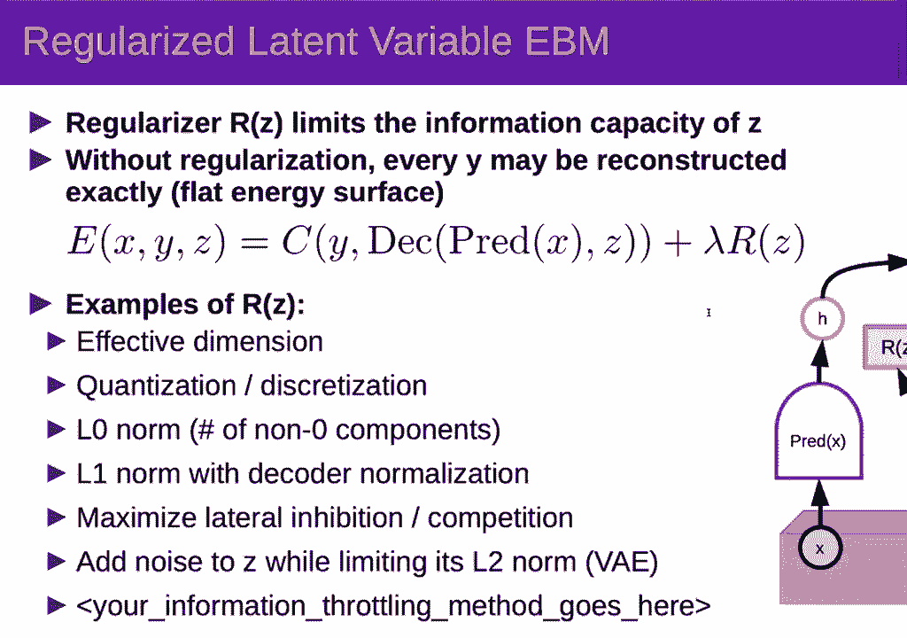

盎司的信息内容，我将在一分钟之内再谈，好吧，这是稀疏编码的概念，所以点编码是，好吧，这是稀疏编码的概念，所以点编码是，基于能量的模型的无条件版本，因此没有x，基于能量的模型的无条件版本，因此没有x。

只有ay和az，能量函数是，只有ay和az，能量函数是，y减去wz，其中w是所谓的字典矩阵，y减去wz，其中w是所谓的字典矩阵，与k均值中的原型矩阵非常相似，与k均值中的原型矩阵非常相似，z是向量。

通常z的尺寸大于y，z是向量，通常z的尺寸大于y，所以你测量y和w之间的平方距离欧几里德距离，所以你测量y和w之间的平方距离欧几里德距离，z所以基本上您的解码器是线性的，它只是一个矩阵。

z所以基本上您的解码器是线性的，它只是一个矩阵，然后将一个项lambda乘以z的l1范数乘以，然后将一个项lambda乘以z的l1范数乘以，这两根柱子就是能量函数，这两根柱子就是能量函数。

稀疏编码还可以，您可以将其视为一种特殊情况，稀疏编码还可以，您可以将其视为一种特殊情况，系统ii显示了我之前显示的体系结构，系统ii显示了我之前显示的体系结构，嗯，除了不是um条件之外，没有x，嗯。

除了不是um条件之外，没有x，现在，这对您有什么帮助，所以alfredo会告诉您，现在，这对您有什么帮助，所以alfredo会告诉您，我在左边显示的图片是不适当的，因为它是。

我在左边显示的图片是不适当的，因为它是，实际上是用稍微不同的模型um生成的，实际上是用稍微不同的模型um生成的，但这是一种很好的图形表示，但这是一种很好的图形表示，稀疏编码尝试做的是近似于。

稀疏编码尝试做的是近似于，分段线性逼近的数据，分段线性逼近的数据，本质上是这样想象，本质上是这样想象，你有这个w矩阵还可以，有人给了你，或者你已经学会了，你有这个w矩阵还可以，有人给了你。

或者你已经学会了，现在以某种方式，如果您决定先验，现在以某种方式，如果您决定先验，z的一定数量的分量不为零，z的一定数量的分量不为零，好吧，z的大多数分量都是零，只是少数分量，好吧。

z的大多数分量都是零，只是少数分量，与z非零，并且您改变那些值，与z非零，并且您改变那些值，组件，您知道在一定范围内要生成的向量集，您知道在一定范围内要生成的向量集，您将要生成的y条的集合。

您将要生成的y条的集合，将会是由，将会是由，w矩阵的对应列对于z的每个值都可以，w矩阵的对应列对于z的每个值都可以，系数非零，您基本上可以计算线性，系数非零，您基本上可以计算线性，w对应列的组合。

w对应列的组合，所以你基本上是在低维，所以你基本上是在低维，y空间的线性子空间，因此y bar将基本上沿着，y空间的线性子空间，因此y bar将基本上沿着，低维空间低维线性子空间。

低维空间低维线性子空间，该空间的尺寸将是z的非零分量的数量，该空间的尺寸将是z的非零分量的数量，好吧，当您找到z时，对于特定的y，好吧，当您找到z时，对于特定的y，使许多组件的能量最小化。

使许多组件的能量最小化，将会是非零的，并且当您缓慢移动y时，这些非零，将会是非零的，并且当您缓慢移动y时，这些非零，组件将改变价值，但您将继续保持，组件将改变价值，但您将继续保持，相同的线性子空间。

直到y改变为止，相同的线性子空间，直到y改变为止，太多了，突然之间您需要一个，太多了，突然之间您需要一个，现在，不同的非零z集合进行最佳重构，现在，不同的非零z集合进行最佳重构，您可以切换到其他平面。

因为现在有不同的z，您可以切换到其他平面，因为现在有不同的z，z分量变为非零um，所以现在您再次移动y，z分量变为非零um，所以现在您再次移动y，再次，z中的系数保持变化，除了那些，再次。

z中的系数保持变化，除了那些，保持零的零，突然间它再次切换，保持零的零，突然间它再次切换，去另一个，所以它很好地象征着，去另一个，所以它很好地象征着，左边的图片，您会看到，左边的图片，您会看到。

数据的资金流大致由一堆，数据的资金流大致由一堆，在这种情况下，线性子空间是线um，在这种情况下，线性子空间是线um，表示2d中实际的稀疏编码是因为，表示2d中实际的稀疏编码是因为，在2D中退化。

所以一个问题是我们如何训练，在2D中退化，所以一个问题是我们如何训练，这样的系统，以便训练这样的系统，这样的系统，以便训练这样的系统，实际上，我们的损失函数只是平均值，实际上，我们的损失函数只是平均值。

我们的模型为训练样本提供的能量，我们的模型为训练样本提供的能量，因此，损失函数只是平均能量，基本上是平均f，因此，损失函数只是平均能量，基本上是平均f，并记住y的f等于uh y和z的z上的最小值。

并记住y的f等于uh y和z的z上的最小值，好吧，我们将取所有训练样本中f的平均值，好吧，我们将取所有训练样本中f的平均值，并将参数的平均值最小化，并将参数的平均值最小化，模型的参数。

这些参数是w矩阵中的系数，模型的参数，这些参数是w矩阵中的系数，再次被称为字典矩阵，所以我们如何做这个样本y，再次被称为字典矩阵，所以我们如何做这个样本y，我们找到可以使能量最小的z可以将两个项的和。

我们找到可以使能量最小的z可以将两个项的和，看到这里，然后我们迈出了一步，看到这里，然后我们迈出了一步，w下降，因此我们计算了，w下降，因此我们计算了，关于w的能量非常简单，因为它是二次函数。

关于w的能量非常简单，因为它是二次函数，w，我们随机走一步，w，我们随机走一步，基本上是正确的渐变，现在我们取下一个y，基本上是正确的渐变，现在我们取下一个y，再次针对z最小化，然后针对z的值计算。

再次针对z最小化，然后针对z的值计算，相对于w的梯度，并在负梯度中迈出一步，相对于w的梯度，并在负梯度中迈出一步，如果您只是这样做，现在就继续这样做是行不通的，如果您只是这样做。

现在就继续这样做是行不通的，它不起作用，因为结果是w，它不起作用，因为结果是w，keep会越来越大，z会越来越小，keep会越来越大，z会越来越小，和较小，但问题实际上不会，和较小，但问题实际上不会。

系统不会真正解决问题，系统不会真正解决问题，因此您需要对w矩阵进行归一化处理，使其不会增长，因此您需要对w矩阵进行归一化处理，使其不会增长，无限期地允许z相应缩小，无限期地允许z相应缩小。

而这样做的方法是，基本上，而这样做的方法是，基本上，w矩阵的每次更新都将平方和归一化，w矩阵的每次更新都将平方和归一化，w的每一列中的一列中的术语，w的每一列中的一列中的术语，正确。

因此在每次更新后标准化w的列，正确，因此在每次更新后标准化w的列，这将防止w中的项爆炸，而z中的项从，这将防止w中的项爆炸，而z中的项从，缩小，将迫使系统实际，缩小，将迫使系统实际。

找到一个合理的矩阵w而不是仅仅使z，找到一个合理的矩阵w而不是仅仅使z，短一点好吧，所以这是稀疏编码，短一点好吧，所以这是稀疏编码，为此的学习算法是由，为此的学习算法是由，1997年。

两名计算神经科学家布鲁诺·奥尔森和大卫·菲尔德，1997年，两名计算神经科学家布鲁诺·奥尔森和大卫·菲尔德，所以可以回溯很长时间，所以这是稀疏的问题。

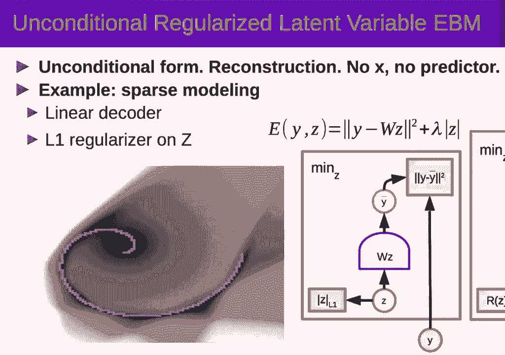

所以可以回溯很长时间，所以这是稀疏的问题，编码推理算法是一种，编码推理算法是一种，哎呀，你需要付出的代价是。

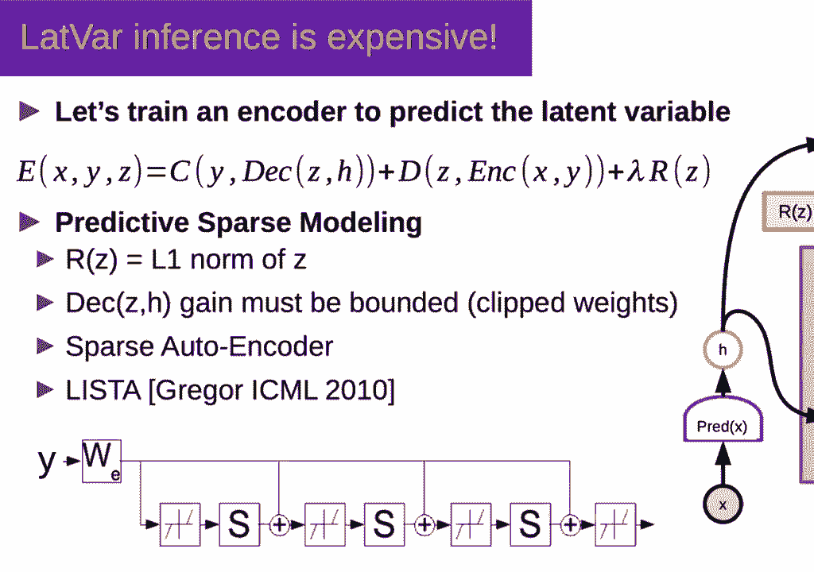

哎呀，你需要付出的代价是，你知道对于给定的y是要最小化这两个项的和，你知道对于给定的y是要最小化这两个项的和，其中l是2，另一个是1，其中l是2，另一个是1，应用数学方面的论文很多。

应用数学方面的论文很多，嗯，解释如何有效地做到这一点，嗯，解释如何有效地做到这一点，特别是一种这样做的算法称为esta，这意味着，特别是一种这样做的算法称为esta，这意味着，迭代收缩和阈值算法。

迭代收缩和阈值算法，一分钟后我会告诉你什么，一分钟后我会告诉你什么，但它基本上包含着基本上是交替的一种，但它基本上包含着基本上是交替的一种，相对于第一项z的z的sp最小化。

相对于第一项z的z的sp最小化。

然后第二个术语交替出现，所以这是，然后第二个术语交替出现，所以这是，东方算法的快速版本称为，东方算法的快速版本称为，叫做fista，在这里在底部，叫做fista，在这里在底部，嗯。

实际上我意识到我错过了复活节的参考，嗯，实际上我意识到我错过了复活节的参考，算法这不是我在这里显示的任何参考，算法这不是我在这里显示的任何参考，嗯，第一作者是Bull deboulid，嗯。

第一作者是Bull deboulid，无论如何，这是您以z开头为零的算法，无论如何，这是您以z开头为零的算法，然后在这里应用这个迭代，然后在这里应用这个迭代，第二个最后一个公式，因此放在括号中。

第二个最后一个公式，因此放在括号中，括号中的东西基本上是平方的梯度步，括号中的东西基本上是平方的梯度步，误差平方重建误差，因此，如果您计算梯度或，误差平方重建误差，因此，如果您计算梯度或，平方重建误差。

然后您执行渐变步骤，平方重建误差，然后您执行渐变步骤，基本上得到这个公式，其中一个是l，基本上得到这个公式，其中一个是l，这是渐变步长，这是渐变步长，好的，所以我们基本上用，好的，所以我们基本上用。

平方重建误差的负梯度，平方重建误差的负梯度，然后您要做的下一个操作是收缩操作，然后您要做的下一个操作是收缩操作，所得z向量的每个分量，所得z向量的每个分量，然后将它们全部缩小到零，所以基本上。

然后将它们全部缩小到零，所以基本上，如果z的分量为正，则将其减去一个常数，如果z的分量为正，则将其减去一个常数，从它，如果它是负数，则添加一个缺点相同的常数，从它，如果它是负数。

则添加一个缺点相同的常数，但如果您太接近零，您就，但如果您太接近零，您就，单击为零，好吧，基本上这是一个你知道的函数，单击为零，好吧，基本上这是一个你知道的函数，在零附近平坦。

然后像上面的身份函数一样增长，在零附近平坦，然后像上面的身份函数一样增长，某个阈值，并且在某个阈值以下，某个阈值，并且在某个阈值以下，好吧，如果您继续迭代此算法，它将缩小为零，好吧。

如果您继续迭代此算法，它将缩小为零，l和lambda的正确值，l和lambda的正确值，z向量将收敛到，z向量将收敛到。

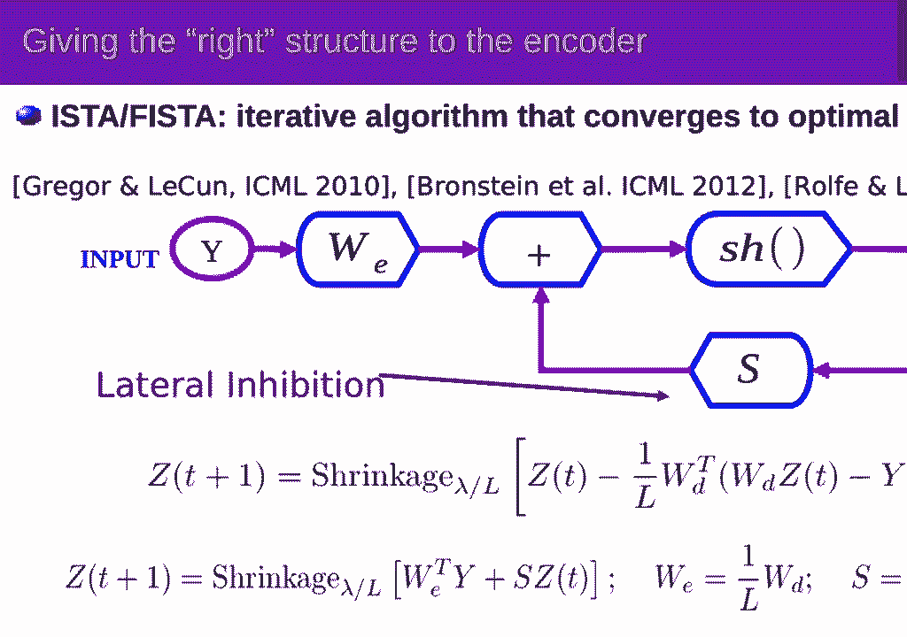

最小的能量最小化问题，最小的能量最小化问题，关于z的yz的能量e，这表明呃。

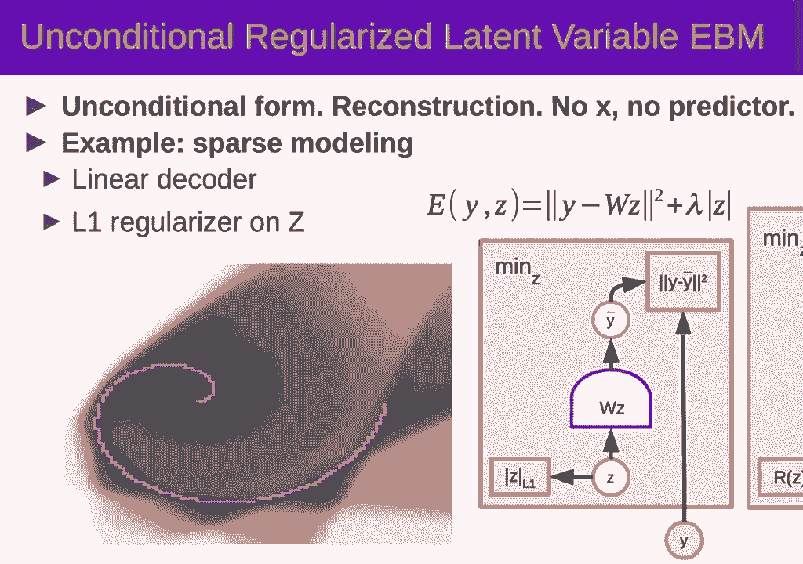

关于z的yz的能量e，这表明呃，现在记住这一点，这里是这个算法的问题，现在记住这一点，这里是这个算法的问题，有点贵，如果你想运行这个，有点贵，如果你想运行这个。

在一张图片上或您知道一张图片的所有色块或类似内容，在一张图片上或您知道一张图片的所有色块或类似内容，这你将无法做到这一点，这你将无法做到这一点，在大图像上实时显示，所以这是一个主意，这个主意是。

在大图像上实时显示，所以这是一个主意，这个主意是，基本训练神经网络来预测，基本训练神经网络来预测，能量最小化问题的解决方案是什么，能量最小化问题的解决方案是什么，好吧，所以你在右边看到这个图，好吧。

所以你在右边看到这个图，嗯，我们现在在哪里训练一个采用y值的编码器，嗯，我们现在在哪里训练一个采用y值的编码器，可以忽略依赖x的那一块吧，可以忽略依赖x的那一块吧，让x通过预测变量进行预测。

让x通过预测变量进行预测，h，然后h进入解码器的锚点，您可以忽略此部分，h，然后h进入解码器的锚点，您可以忽略此部分，现在在无条件版本中，您只需输入编码器的y，现在在无条件版本中，您只需输入编码器的y。

它会预测z变量的最佳值是什么，它会预测z变量的最佳值是什么，称为Z栏，然后z变量本身进入解码器，就知道，然后z变量本身进入解码器，就知道，也被正则化，然后产生重建，也被正则化，然后产生重建。

然后您在这里再次找到z，然后您在这里再次找到z，使能量最小化的价值，但我们要，使能量最小化的价值，但我们要，呃，但现在的能量仍然是yy的两项c之和，呃，但现在的能量仍然是yy的两项c之和。

bar和z的r，但是我们要做的是，bar和z的r，但是我们要做的是，将训练编码器预测z的最佳值，将训练编码器预测z的最佳值，通过最小化获得，并且该编码器将由，通过最小化获得，并且该编码器将由。

最小化这个这个z和z bar的d，最小化这个这个z和z bar的d，它会将z视为目标值，然后通过，它会将z视为目标值，然后通过，靠背支柱，你知道更大的下降，靠背支柱，你知道更大的下降。

做出尽可能接近z的预测，做出尽可能接近z的预测，好的，这就是这种想法的一种形式，这种想法的另一种形式稍微复杂一些，这种想法的另一种形式稍微复杂一些，是，当您针对z的z进行最小化时，是。

当您针对z的z进行最小化时，关于z的能量，您考虑到以下事实：关于z的能量，您考虑到以下事实：基本上不希望z与z bar相距太远，基本上不希望z与z bar相距太远。

您的能量函数现在具有三个项它具有重构误差，您的能量函数现在具有三个项它具有重构误差，正则化，但也有区别，正则化，但也有区别，uh z bar来自编码器的预测，uh z bar来自编码器的预测。

以及z变量的当前值，因此，以及z变量的当前值，因此，现在将能量函数写在xyz的e中，现在将能量函数写在xyz的e中，等于将y与，等于将y与，解码器应用于z这是无条件的，解码器应用于z这是无条件的。

版本在这里，然后您有第二个术语是，版本在这里，然后您有第二个术语是，这个d函数用来测量z和，这个d函数用来测量z和，应用于y的编码器不应有x并且，应用于y的编码器不应有x并且，那么您也可以将z正规化。

所以基本上您是在告诉，那么您也可以将z正规化，所以基本上您是在告诉，系统为重构的潜在变量找到一个值，系统为重构的潜在变量找到一个值，如果r if a是一个错误范数，或者不是不太好，那将是稀疏的。

如果r if a是一个错误范数，或者不是不太好，那将是稀疏的，没有太多的信息，但是离任何东西都不远，没有太多的信息，但是离任何东西都不远，是编码器预测了一个特定的想法，是编码器预测了一个特定的想法。

lista意味着学习自我，将塑造，lista意味着学习自我，将塑造，自动编码器的体系结构，使其看起来非常类似于列表算法，自动编码器的体系结构，使其看起来非常类似于列表算法，所以如果我们回到列表算法。

所以如果我们回到列表算法，嗯公式倒数第二个嗯，嗯公式倒数第二个嗯，你知道看起来像呃，你知道一些向量用矩阵更新，你知道看起来像呃，你知道一些向量用矩阵更新，这就像是神经网络的线性阶段。

这就像是神经网络的线性阶段，然后一些非线性恰好是收缩，这是一种，然后一些非线性恰好是收缩，这是一种，如果您想要的话是双倍价值，您要何时结婚，如果您想要的话是双倍价值，您要何时结婚，另一个值下降了。

所以如果你看图，另一个值下降了，所以如果你看图，整个整个东方算法的这个看起来像这样，整个整个东方算法的这个看起来像这样，我在上面绘制的框图以y开头，我在上面绘制的框图以y开头，乘以某个矩阵然后缩小。

乘以某个矩阵然后缩小，结果，然后给您下一个z对其应用其他矩阵，结果，然后给您下一个z对其应用其他矩阵，您先前缩小的z的先前值，然后，您先前缩小的z的先前值，然后，再次将矩阵相乘，添加到您之前缩小的值。

再次将矩阵相乘，添加到您之前缩小的值，再等等，所以在这里我们有两个矩阵，再等等，所以在这里我们有两个矩阵，如果您将我们定义为lwd以上，则在底部，如果您将我们定义为lwd以上，则在底部。

如果您将s定义为身份减去lwd，如果您将s定义为身份减去lwd，转置wd，其中wd是解码矩阵，转置wd，其中wd是解码矩阵，然后这个图基本上实现了，然后这个图基本上实现了，恩，好吧。

我的一个固件发布了文档卡尔·格里格，恩，好吧，我的一个固件发布了文档卡尔·格里格，不得不说好为什么我们不为什么我们不认为这是经常性的，不得不说好为什么我们不为什么我们不认为这是经常性的，神经网络。

为什么我们不训练那些矩阵w，神经网络，为什么我们不训练那些矩阵w，和s以便给我们一个很好的近似值，和s以便给我们一个很好的近似值，最优密码的尽快处理，最优密码的尽快处理，好的。

所以我们基本上将要建立我们的编码器网络，好的，所以我们基本上将要建立我们的编码器网络，在ista上复制的这种架构，在ista上复制的这种架构，而且我们知道有一个解决方案，而且我们知道有一个解决方案，嗯。

系统基本上从中获悉该值，嗯，系统基本上从中获悉该值，与我们对应的那个，他们应该是嗯，但实际上，与我们对应的那个，他们应该是嗯，但实际上，系统会学到其他东西，所以这是，系统会学到其他东西，所以这是。

它在左下角的另一种表示形式我们有收缩，它在左下角的另一种表示形式我们有收缩，函数，然后此s矩阵，然后添加，函数，然后此s矩阵，然后添加，你知道的y乘以我们的s，你知道的y乘以我们的s，基质再次收缩等。

所以这是，基质再次收缩等，所以这是，循环网，我们要尝试我们要训练，循环网，我们要尝试我们要训练，和我们在一起，但是这次复活节的目的是，和我们在一起，但是这次复活节的目的是。

你能重复一下我认为我错过了重点的目标是什么，你能重复一下我认为我错过了重点的目标是什么，所以训练这个编码器的目的，所以训练这个编码器的目的，好的，所以在此图中此图中的编码器在此处，好的。

所以在此图中此图中的编码器在此处，编码器的架构是您在左下角看到的，编码器的架构是您在左下角看到的，好的，您正在训练的目标，好的，您正在训练的目标，是z和z bar的d的平均值，所以过程是。

是z和z bar的d的平均值，所以过程是，在没有x的情况下，但是如果有x的话就没有多大的意义，在没有x的情况下，但是如果有x的话就没有多大的意义，差异，所以对于这个特定的y，求a的值，差异。

所以对于这个特定的y，求a的值，z使能量最小，并且能量是，z使能量最小，并且能量是，yy bar rz和d或zz bar的三个项c好的，所以找到az，yy bar rz和d或zz bar的三个项c好的。

所以找到az，重建um的容量最小，但不是，重建um的容量最小，但不是，离编码器的输出太远，离编码器的输出太远，好的，一旦有了z计算梯度，好的，一旦有了z计算梯度，能量相对于解码器的权重。

能量相对于解码器的权重，编码器和预测器的数量（如果有），编码器和预测器的数量（如果有），通过备份，所以有趣的是，通过备份，所以有趣的是，您将为编码器获得的唯一梯度是d的梯度。

您将为编码器获得的唯一梯度是d的梯度，z和z bar的大小还可以，因此编码器将进行自我训练以将其最小化，z和z bar的大小还可以，因此编码器将进行自我训练以将其最小化，换句话说，z和z栏将，换句话说。

z和z栏将，训练自己以预测z以及尽可能多的最优z，训练自己以预测z以及尽可能多的最优z，通过最小化获得解码器将要，通过最小化获得解码器将要，训练自己，当然要重建y以及，训练自己，当然要重建y以及。

以及给定的z以及，以及给定的z以及，如果您有预测变量，则将获得该预测变量的梯度，并且，如果您有预测变量，则将获得该预测变量的梯度，并且，尝试尝试产生一种您知道有帮助的优势。

尝试尝试产生一种您知道有帮助的优势，那很明显是，谢谢，那很明显是，谢谢，好的，那就是架构，基本上只是一个，好的，那就是架构，基本上只是一个，漂亮的花园品种循环网，这在某种意义上确实很好。

漂亮的花园品种循环网，这在某种意义上确实很好，当你经历，当你经历，你知道这个ista算法的迭代，你知道这个ista算法的迭代，或这个或这个火车神经网络，或这个或这个火车神经网络。

基本上可以估算出该解决方案的工作原理是，您可以训练，基本上可以估算出该解决方案的工作原理是，您可以训练，例如产生最佳解决方案的系统，例如产生最佳解决方案的系统，经过三轮迭代之后，它才知道最优值，因为。

经过三轮迭代之后，它才知道最优值，因为，它已经完成了ista的训练，但是当您训练它时，它会训练，它已经完成了ista的训练，但是当您训练它时，它会训练，本身只需三次迭代即可生成该值的最佳近似值。

本身只需三次迭代即可生成该值的最佳近似值，我们看到的是，经过三轮迭代，它产生了很多，我们看到的是，经过三轮迭代，它产生了很多，更好，比我们在三个迭代中产生的ista近似。

比我们在三个迭代中产生的ista近似，因此，您在此处看到的是数量作为的迭代次数的函数，因此，您在此处看到的是数量作为的迭代次数的函数，ista或此列表算法是，ista或此列表算法是，重建错误是正确的。

所以通过训练编码器来预测，重建错误是正确的，所以通过训练编码器来预测，您实际获得的优化结果，您实际获得的优化结果，比实际运行优化相同数量的优化结果更好，比实际运行优化相同数量的优化结果更好，迭代。

所以加速推理很多，迭代，所以加速推理很多。

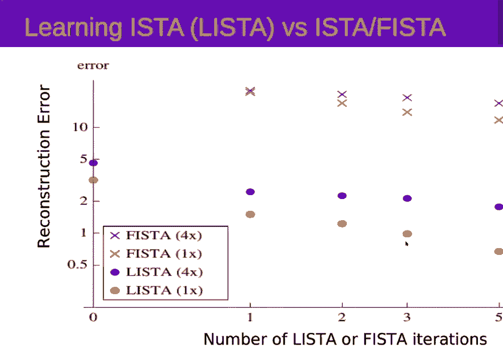

因此，这就是香料编码给您带来的好处，无论有无，因此，这就是香料编码给您带来的好处，无论有无，编码器实际上你会得到几乎相同的结果，编码器实际上你会得到几乎相同的结果，在这里，当您训练mnist时。

这些都是，在这里，当您训练mnist时，这些都是，基本上是线性解码器，这里的z向量具有代码空间，基本上是线性解码器，这里的z向量具有代码空间，大小为256，所以您采用此256向量，大小为256。

所以您采用此256向量，乘以矩阵，就可以重建一个数字，乘以矩阵，就可以重建一个数字，您在这里看到的是此矩阵的各列，您在这里看到的是此矩阵的各列，表示为图片好，所以每一列的尺寸都与，表示为图片好。

所以每一列的尺寸都与，mnist位在w的每一列上，因此您可以，mnist位在w的每一列上，因此您可以，将它们分别表示为图像，这是256 uh，将它们分别表示为图像，这是256 uh，w的列。

您所看到的基本上是，w的列，您所看到的基本上是，字符的部分像小笔触，字符的部分像小笔触，原因是您基本上可以重建任何字符，原因是您基本上可以重建任何字符，在这个数字中，由一个小的线性组合，在这个数字中。

由一个小的线性组合，这些笔画的数量还可以，所以，这些笔画的数量还可以，所以，很漂亮，因为该系统基本上可以找到，很漂亮，因为该系统基本上可以找到，物体的组成部分完全不受监督，物体的组成部分完全不受监督。

这就是您想要不受监督的运行所需要的，这就是您想要不受监督的运行所需要的，您知道其他哪些其他组件或它们可以解释的部分，您知道其他哪些其他组件或它们可以解释的部分，我的数据看起来像什么，所以对于。

我的数据看起来像什么，所以对于，嗯，无尽的嗯，它也很好用，嗯，无尽的嗯，它也很好用，嗯，自然的图像补丁这里应该有动画，但是，嗯，自然的图像补丁这里应该有动画，但是，您显然没有看到它，因为它是pdf。

您显然没有看到它，因为它是pdf，嗯，结果是这个，所以动画显示了学习算法，嗯，结果是这个，所以动画显示了学习算法，发生，所以这里又是这些专栏，发生，所以这里又是这些专栏。

l1的稀疏编码系统的解码矩阵的估计，l1的稀疏编码系统的解码矩阵的估计，经过自然图像斑块训练的正则化，经过自然图像斑块训练的正则化，我说那些自然的图像补丁已经被美白了。

我说那些自然的图像补丁已经被美白了，意味着它们已经以某种方式归一化了，意味着它们已经以某种方式归一化了，消除均值和归一化变体的种类，消除均值和归一化变体的种类，你会得到一个很好的所谓的gabor过滤器。

你会得到一个很好的所谓的gabor过滤器，您知道各种方向的小型边缘检测器，您知道各种方向的小型边缘检测器，位置和大小，因此被发明的原因，位置和大小，因此被发明的原因，神经科学家认为这看起来很像你。

神经科学家认为这看起来很像你，在视觉皮层的主要区域观察，在视觉皮层的主要区域观察，当你在电极上戳电极时，当你在电极上戳电极时，大多数动物的视觉皮层，你会发现，大多数动物的视觉皮层，你会发现。

图案是否最大程度地响应了它们实际对定向边缘的响应，图案是否最大程度地响应了它们实际对定向边缘的响应，这也是训练卷积网时观察到的，这也是训练卷积网时观察到的，在imagenet上，第一层功能看起来也很像。

在imagenet上，第一层功能看起来也很像，除非它们是有条件的，否则这些不是卷积的，而是经过训练的，除非它们是有条件的，否则这些不是卷积的，而是经过训练的，在呃，你知道图像补丁，但这里没有条件，在呃。

你知道图像补丁，但这里没有条件，所以这很好，因为它告诉您的是，所以这很好，因为它告诉您的是，无监督学习算法，我们在质上基本相同，无监督学习算法，我们在质上基本相同。

我们将为您提供的功能知道您需要训练很多，我们将为您提供的功能知道您需要训练很多。

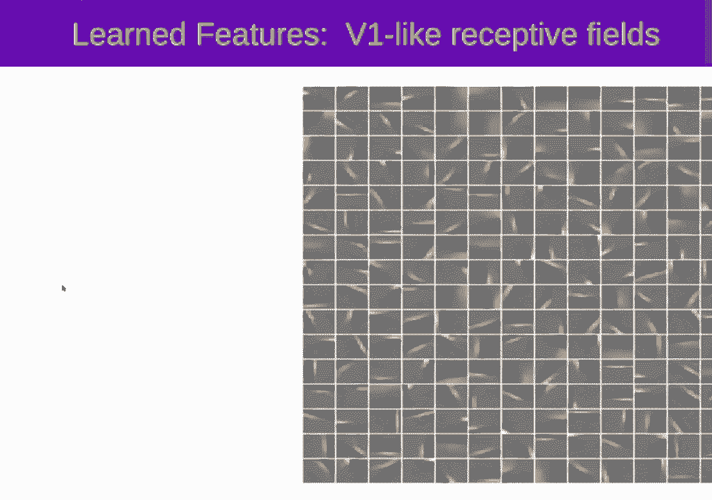

监督卷积网，以便给您提示，监督卷积网，以便给您提示，所以这是卷积版本，所以卷积版本基本上。

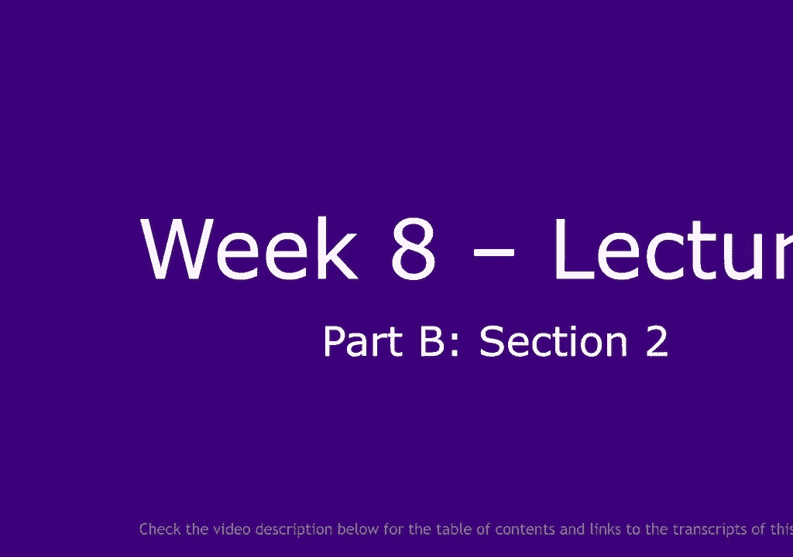

所以这是卷积版本，所以卷积版本基本上，说你有形象，顺便说一下，您要做的就是拍摄功能图，您要做的就是拍摄功能图，好吧，让我们在这里说四点，但可能会更多，然后您将，好吧，让我们在这里说四点，但可能会更多。

然后您将，您将把每个特征图与，您将把每个特征图与，嗯，有内核，所以我不知道功能图，嗯，有内核，所以我不知道功能图，我们称这个为zk好吧，我们称这个为zk好吧，我们这里有一个内核，嗯，我们称其为zi。

因为我要，我们这里有一个内核，嗯，我们称其为zi，因为我要，使用k作为内核ki，这将是一个，使用k作为内核ki，这将是一个，重建，而我们的重建将仅仅是，而我们的重建将仅仅是，我的总和，zi和ki卷积好。

所以这是不同的，zi和ki卷积好，所以这是不同的，来自原始稀疏涂层，其中y bar等于，来自原始稀疏涂层，其中y bar等于，aw矩阵的一列的总和，aw矩阵的一列的总和，嗯，乘以不是标量的系数zi。

乘以不是标量的系数zi，对，所以常规的稀疏编码um您具有列的加权和，对，所以常规的稀疏编码um您具有列的加权和，权重是zi的标量系数，权重是zi的标量系数，在卷积稀疏编码中，它再次是线性运算，但是。

在卷积稀疏编码中，它再次是线性运算，但是，现在字典矩阵是一堆合成内核，现在字典矩阵是一堆合成内核，而潜在变量是一堆特征图，而潜在变量是一堆特征图，并且您正在对每个特征图进行卷积。

并且您正在对每个特征图进行卷积。

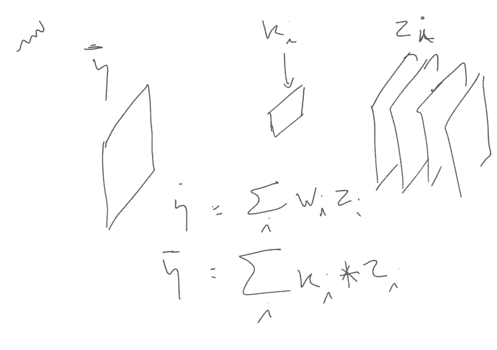

每个内核和一些结果，这就是你得到的，所以这里有，这就是你得到的，所以这里有，这是具有解码器和编码器的系统之一，这是具有解码器和编码器的系统之一，非常简单，这里基本上只是一个单层，非常简单。

这里基本上只是一个单层，具有非线性的网络，然后有一个，具有非线性的网络，然后有一个，简单的层之后，基本上就是对角层，之后改变，简单的层之后，基本上就是对角层，之后改变，收益，但它非常非常简单，收益。

但它非常非常简单，编码器中的滤波器以及编码器和解码器看起来非常，编码器中的滤波器以及编码器和解码器看起来非常，相似，所以基本上编码器只是一个卷积，相似，所以基本上编码器只是一个卷积，那么在那种情况下。

我认为它是双曲正切的，那么在那种情况下，我认为它是双曲正切的，然后基本上等于对角线，然后基本上等于对角线，刚改变比例的层，然后是解码器，刚改变比例的层，然后是解码器，那么对约束的稀疏，那么对约束的稀疏。

在代码上，然后解码器只是一个卷积线性解码器，在代码上，然后解码器只是一个卷积线性解码器，重建只是平方距离，重建只是平方距离，如果您强加只有一个过滤器，则该过滤器看起来像，如果您强加只有一个过滤器。

则该过滤器看起来像，左上方的只是中央环绕型滤镜，左上方的只是中央环绕型滤镜，如果允许两个滤镜，您会得到两个形状怪异的滤镜，如果允许两个滤镜，您会得到两个形状怪异的滤镜，如果让四个过滤器，这是第三行。

你会得到，如果让四个过滤器，这是第三行，你会得到，方向的边缘水平和垂直，但您得到两个，方向的边缘水平和垂直，但您得到两个，每个滤镜有两个极性，您可以获得八个滤镜，每个滤镜有两个极性，您可以获得八个滤镜。

在八种八种不同方向的定向边缘，在八种八种不同方向的定向边缘，通过16个滤镜，您可以获得更多方向，并且还可以获得中央环绕声，通过16个滤镜，您可以获得更多方向，并且还可以获得中央环绕声。

然后随着过滤器数量的增加，您会变得更加多样化，然后随着过滤器数量的增加，您会变得更加多样化，不仅是边缘检测器，而且还有光栅，不仅是边缘检测器，而且还有光栅，各种方向的探测器中心环绕。

各种方向的探测器中心环绕，等，这很有趣，因为这是您所看到的，等，这很有趣，因为这是您所看到的，在视觉皮层中，这再次表明您可以真正学习，在视觉皮层中，这再次表明您可以真正学习。

现在这里完全不受监督的良好功能，现在这里完全不受监督的良好功能，如果您采用这些功能，这将是一个附带新闻，如果您采用这些功能，这将是一个附带新闻，您将它们插入卷积网络中，然后，您将它们插入卷积网络中。

然后，您倾向于在某些任务上不一定得到，您倾向于在某些任务上不一定得到，与从头开始在imagenet上进行训练相比，您知道更好的结果，与从头开始在imagenet上进行训练相比，您知道更好的结果。

但是在某些情况下，这有助于提高性能，但是在某些情况下，这有助于提高性能，特别是在标签样本数量不多或，特别是在标签样本数量不多或，类别的数量很小，因此通过纯粹的监督您，类别的数量很小。

因此通过纯粹的监督您，基本上得到简并的特征，基本上得到简并的特征，这是另一个例子，这是另一个例子，再次是卷积空间编码，这里的解码内核，再次是卷积空间编码，这里的解码内核，彩色图像的解码内核是。

彩色图像的解码内核是，九乘九呃卷积应用于图像，九乘九呃卷积应用于图像，在左边看到的是这里的稀疏代码，在左边看到的是这里的稀疏代码，嗯，我不知道64个呃特征图，嗯，我不知道64个呃特征图，嗯。

您会看到z向量非常稀疏，嗯，您会看到z向量非常稀疏，如果您仅在此选择一些白色或黑色或非灰色的组件，如果您仅在此选择一些白色或黑色或非灰色的组件，想要，这是因为稀疏，想要，这是因为稀疏。

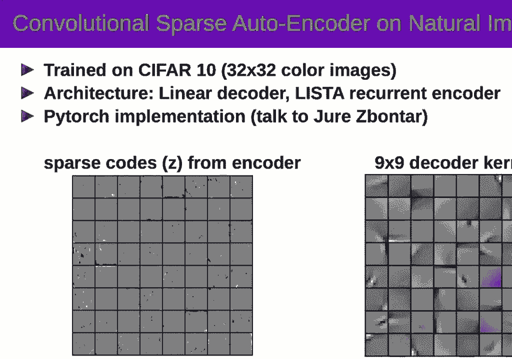

好吧，在最后几分钟，我们将谈论。

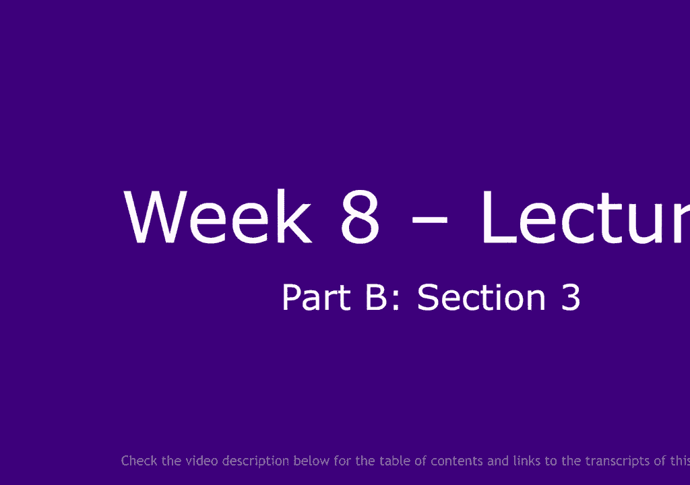

好吧，在最后几分钟，我们将谈论，可变自动编码器，我想您已经从呃那里听到了一些，可变自动编码器，我想您已经从呃那里听到了一些。

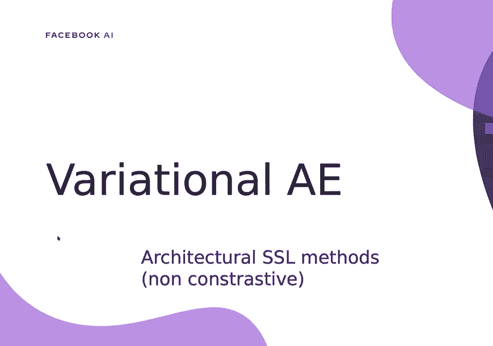

明天我们将用泡沫覆盖这个明天，明天我们将用泡沫覆盖这个明天，代码和一切正确，所以明天将是一个小时，代码和一切正确，所以明天将是一个小时，就是这个权利，但是这里是UM的预览，就是这个权利。

但是这里是UM的预览，编码器可以正常工作，因此变化的路由颜色是，编码器可以正常工作，因此变化的路由颜色是，基本上与我先前展示的架构相同，基本上与我先前展示的架构相同，嗯，基本上，是另一个编码器忽略了。

嗯，基本上，是另一个编码器忽略了，条件部分现在以x为条件的部分，条件部分现在以x为条件的部分，嗯，这可能是双色的有条件版本，但现在我们只是，嗯，这可能是双色的有条件版本，但现在我们只是。

将拥有常规版本的编码器，将拥有常规版本的编码器，因此，这是一个自动编码器，您可以将变量，因此，这是一个自动编码器，您可以将变量，y您将其运行到编码器上，它可能是多层神经网络，y您将其运行到编码器上。

它可能是多层神经网络，卷积网络，无论您想要什么，它都会为稀疏预测，卷积网络，无论您想要什么，它都会为稀疏预测，代码z bar是能量函数中的一项，代码z bar是能量函数中的一项。

测量这个欧几里得平方欧几里德距离的平方，测量这个欧几里得平方欧几里德距离的平方，在z潜在变量和z条之间，在z潜在变量和z条之间，还有一个这是另一个成本函数，还有一个这是另一个成本函数。

这实际上是z bar的l2范数，这实际上是z bar的l2范数，实际上，更多的自治z会更多，实际上，更多的自治z会更多，更准确，但没有多大区别，更准确，但没有多大区别，然后z经过解码器，该解码器重建y。

然后z经过解码器，该解码器重建y，那就是你的重建错误了，那就是你的重建错误了，与以前的区别，所以看起来非常类似于，与以前的区别，所以看起来非常类似于，我们刚才谈到的自动编码器，除了这里没有稀疏性。

我们刚才谈到的自动编码器，除了这里没有稀疏性，没有稀疏性的原因是因为变分编码器使用了另一种方式，没有稀疏性的原因是因为变分编码器使用了另一种方式，限制代码的信息内容，限制代码的信息内容。

基本上通过使代码嘈杂来实现，基本上通过使代码嘈杂来实现，所以，这就是您计算z的方式不是，所以，这就是您计算z的方式不是，相对于z的能量函数最小，相对于z的能量函数最小，但是根据分布随机采样z。

但是根据分布随机采样z，对数是，对数是，基本上将其链接到z bar的成本，基本上将其链接到z bar的成本，编码器产生z轴，然后有一个能量函数，编码器产生z轴，然后有一个能量函数。

如果要在z和z bar之间测量距离，如果要在z和z bar之间测量距离，您认为这是概率分布的对数，您认为这是概率分布的对数，因此，如果此距离是平方欧几里德距离，则意味着，因此。

如果此距离是平方欧几里德距离，则意味着，z的分布将是，z的分布将是，条件高斯，均值是z bar可以，条件高斯，均值是z bar可以，所以我们要做的是对z的随机值进行采样。

所以我们要做的是对z的随机值进行采样，根据该分布，基本上是一个平均值为z bar的高斯，根据该分布，基本上是一个平均值为z bar的高斯，好的，这意味着向z bar添加了一些高斯噪声，好的。

这意味着向z bar添加了一些高斯噪声，这就是rz的内容，您可以运行到，这就是rz的内容，您可以运行到，解码器，所以当您训练这样的系统时，解码器，所以当您训练这样的系统时，系统想要做的基本上是。

使z轴尽可能大使z轴向量尽可能大，使z轴尽可能大使z轴向量尽可能大，这样高斯噪声对z的影响将尽可能小，这样高斯噪声对z的影响将尽可能小，相对而言，如果，相对而言，如果，z上的噪声为1，然后使z条向量。

z上的噪声为1，然后使z条向量，非常非常长的时间，就像呃，它不是呃，那么噪音的重要性，非常非常长的时间，就像呃，它不是呃，那么噪音的重要性，关于z会是0。1，所以如果您训练，关于z会是0。1。

所以如果您训练，这样的自动编码器，而忽略了您的噪音，这样的自动编码器，而忽略了您的噪音，通过反向传播呃，你会得到的是吧棒矢量，通过反向传播呃，你会得到的是吧棒矢量，越来越大，编码器的权重也会越来越大。

越来越大，编码器的权重也会越来越大，更大，z-bar向量将变得更大，更大，z-bar向量将变得更大，大，那么可变自动编码器的诀窍是什么，那么可变自动编码器的诀窍是什么，嗯，这个z从哪里来的快速问题是。

一个潜在变量永远不会，嗯，这个z从哪里来的快速问题是，一个潜在变量永远不会，观察到我们是一个潜在变量，观察到我们是一个潜在变量，采样，我们并未将其最小化，采样，我们并未将其最小化，因此，在以前的案例中。

我们将z变量权最小化，因此，在以前的案例中，我们将z变量权最小化，相对于找到z的变量使能量最小，相对于找到z的变量使能量最小，使C uh的总和最小化，使C uh的总和最小化。

d和r所以在这里我们不会最小化，d和r所以在这里我们不会最小化，我们正在采样，我们将能量视为分布的对数，我们正在采样，我们将能量视为分布的对数，分布，我们从中采样z，分布，我们从中采样z，分布很好。

请想象我们的编码器产生以下几点，分布很好，请想象我们的编码器产生以下几点，训练样本好，所以这是z向量z轴向量，训练样本好，所以这是z向量z轴向量，通过编码器[音乐]，通过编码器[音乐]，嗯。

你知道在某个时候训练，嗯，你知道在某个时候训练，z的这个u采样的作用基本上是，z的这个u采样的作用基本上是，将这些训练样本中的一个放入模糊的球中，将这些训练样本中的一个放入模糊的球中，好吧，因为呃。

我们采样了，所以我们增加了噪声，所以基本上，好吧，因为呃，我们采样了，所以我们增加了噪声，所以基本上，我们已经将单个代码向量变成了，我们已经将单个代码向量变成了，模糊球现在解码器需要能够。

模糊球现在解码器需要能够，从输入中重建输入，从输入中重建输入，不管输入什么代码，所以如果其中两个模糊球呃，不管输入什么代码，所以如果其中两个模糊球呃，相交，则有可能，相交，则有可能。

解码器基本上弄错了并且混淆了两个样本，解码器基本上弄错了并且混淆了两个样本，将一个样本与另一个混淆，所以训练，将一个样本与另一个混淆，所以训练，系统，如果您添加模糊球，您就会知道，系统。

如果您添加模糊球，您就会知道，您的代码中的每一个模糊球就是那些模糊球，您的代码中的每一个模糊球就是那些模糊球，会彼此飞走，正如我之前所说的那样，你知道我以前在，正如我之前所说的那样，你知道我以前在。

不同的方式会使编码器的权重很大，不同的方式会使编码器的权重很大，代码向量变得很长，基本上它们远离，代码向量变得很长，基本上它们远离，彼此之间的距离，这些可见光的噪音不再重要，彼此之间的距离。

这些可见光的噪音不再重要，好吧，如果易熔物不相交，在这里，好吧，如果易熔物不相交，在这里，系统将能够完美地重构您向其扔出的每个样本，系统将能够完美地重构您向其扔出的每个样本，我的问题是又有几张幻灯片。

但还是在同一张幻灯片上，我的问题是又有几张幻灯片，但还是在同一张幻灯片上，主题是几张幻灯片，所以当您指的是什么时，主题是几张幻灯片，所以当您指的是什么时，当您说比较时，这里的功能退化，当您说比较时。

这里的功能退化，自我监督和正常的超级完全监督，自我监督和正常的超级完全监督，我明白了，嗯，这是一个很好的问题，我所说的是，我明白了，嗯，这是一个很好的问题，我所说的是，ii在不同的转折之前说过的事实是。

如果，ii在不同的转折之前说过的事实是，如果，你训练一个分类器，你训练一个分类器，在很少有的问题上取得成就，在很少有的问题上取得成就，类别假设相位检测您只有两个类别，类别假设相位检测您只有两个类别。

您从商业网络中脱出的面孔的表示非常退化，您从商业网络中脱出的面孔的表示非常退化，从某种意义上说，它们并不代表所有图像，从某种意义上说，它们并不代表所有图像，正确的权利，他们会将许多不同的图像折叠成。

正确的权利，他们会将许多不同的图像折叠成，相同的表示形式的共同点，相同的表示形式的共同点，因为系统唯一要做的就是区分，因为系统唯一要做的就是区分，从面孔到你知道有非面孔的面孔等等。

从面孔到你知道有非面孔的面孔等等，并不需要真正地产生的良好表示，并不需要真正地产生的良好表示，整个空间，呃，它只需要告诉你，整个空间，呃，它只需要告诉你，如果是一张脸或另一张脸，例如，您将获得的功能。

如果是一张脸或另一张脸，例如，您将获得的功能，两个不同的阶段可能会完全相同，因此，两个不同的阶段可能会完全相同，因此，所以你不这样做，这就是我退化功能的意思，所以你不这样做，这就是我退化功能的意思。

您想要的是基本上具有的功能，您想要的是基本上具有的功能，嗯，对于不同的对象，特征向量是不同的，嗯，对于不同的对象，特征向量是不同的，是否训练他们与众不同，如果您，是否训练他们与众不同，如果您。

例如在imagenet上进行训练，您有1000个类别，例如在imagenet上进行训练，您有1000个类别，因此，因为您有很多类别，所以获得的功能是，因此，因为您有很多类别，所以获得的功能是。

相当多样化，它们涵盖了大量可能的图像空间，相当多样化，它们涵盖了大量可能的图像空间，我的意思是他们仍然相当专业，但是他们并不完全，我的意思是他们仍然相当专业，但是他们并不完全，退化，因为您有许多类别。

退化，因为您有许多类别，而且您有很多样本，您有更多的样本和更多的类别，而且您有很多样本，您有更多的样本和更多的类别，实际上，您的功能越好，实际上，您的功能越好，呃，如果您考虑的话，可以使用自动编码器。

呃，如果您考虑的话，可以使用自动编码器，是一个神经网络，每个训练样本都在其中，是一个神经网络，每个训练样本都在其中，是自己的类别，因为您基本上是在告诉，是自己的类别，因为您基本上是在告诉。

系统会为每个样本显示不同的输出，系统会为每个样本显示不同的输出，所以您基本上是在训练一个系统，以代表不同对象中的每个对象，所以您基本上是在训练一个系统，以代表不同对象中的每个对象，方式。

但可以通过另一种方式退化，方式，但可以通过另一种方式退化，因为系统可以学习身份功能，因为系统可以学习身份功能，并编码您想要的任何东西，如果您认为同样是网络，并编码您想要的任何东西，如果您认为同样是网络。

公制学习系统对比方法moco pearl和，公制学习系统对比方法moco pearl和，嗯，似乎很清楚，我是在告诉你关于呃，有点，嗯，似乎很清楚，我是在告诉你关于呃，有点，他们尝试做的一些相同的事情。

他们尝试做的一些相同的事情，通过告诉系统来学习非退化特征，通过告诉系统来学习非退化特征，你知道这里是两个我都知道的对象这里是两个我，你知道这里是两个我都知道的对象这里是两个我，知道不同。

所以请确保您产生不同，知道不同，所以请确保您产生不同，我知道的对象的特征向量是，我知道的对象的特征向量是，在语义上是不同的，这是一种，在语义上是不同的，这是一种，嗯，您知道要确保获得要素特征向量表示。

嗯，您知道要确保获得要素特征向量表示，因实际不同而有所不同，因实际不同而有所不同，嗯，但是你不能通过训练，嗯，但是你不能通过训练，对两类问题或十类问题有信心，对两类问题或十类问题有信心。

您需要尽可能多的课程，您需要尽可能多的课程，所以基本上是使用自我监督学习的免费培训，所以基本上是使用自我监督学习的免费培训，有助于使功能更通用，有助于使功能更通用，并减少问题的退化，好吧。

让我们回到变分，并减少问题的退化，好吧，让我们回到变分，双色，所以再等等，如果您用，双色，所以再等等，如果您用，那些模糊的球他们会彼此飞走，那些模糊的球他们会彼此飞走。

而您真正想要的是您希望这些可见光基本上，而您真正想要的是您希望这些可见光基本上，围绕某种数据流形聚集，所以您，围绕某种数据流形聚集，所以您，想要让它们尽可能地彼此靠近，想要让它们尽可能地彼此靠近。

以及如何做到这一点，您可以通过，以及如何做到这一点，您可以通过，本质上是用弹簧将所有这些连接到原点，本质上是用弹簧将所有这些连接到原点，好的，所以基本上春天要把所有这些观点都指向，好的。

所以基本上春天要把所有这些观点都指向，原点尽可能靠近原点，原点尽可能靠近原点，因此，系统将尝试打包，因此，系统将尝试打包，那些模糊球越接近原点，那些模糊球越接近原点，这将使它们相互渗透。

这将使它们相互渗透，但当然如果它们相互渗透得太多，但当然如果它们相互渗透得太多，如果两个球体的两个非常不同的呃样本，如果两个球体的两个非常不同的呃样本，互穿太多，那么这两个样本将被混淆，互穿太多。

那么这两个样本将被混淆，通过解码器，重建能量将变大，通过解码器，重建能量将变大，所以系统最终要做的只是让，所以系统最终要做的只是让，如果两个样本非常相似，则两个球面重叠，如果两个样本非常相似。

则两个球面重叠，因此，基本上，通过这样做，系统会发现某种，因此，基本上，通过这样做，系统会发现某种，你知道歧管的表示，你知道歧管的表示，那些代码向量沿着一个流形，如果有一个，那些代码向量沿着一个流形。

如果有一个，这是自动编码器的版本的基本思想，现在您可以得出，这是自动编码器的版本的基本思想，现在您可以得出，数学并没有多大用处，数学并没有多大用处，你知道其实更容易理解，你知道其实更容易理解。

但这基本上就是最终的结果，所以有一点，但这基本上就是最终的结果，所以有一点，嗯，那还有更多的技巧，嗯，那还有更多的技巧，在双色概念的变化中，你会得到一些细节。在双色概念的变化中，你会得到一些细节。明天。

你可以适应那些模糊球的大小，明天，你可以适应那些模糊球的大小，所以基本上您可以让编码器计算出最佳尺寸，所以基本上您可以让编码器计算出最佳尺寸，每个方向的螺栓，而您要做的就是确保球不会太小。

而您要做的就是确保球不会太小，所以你放了一个惩罚函数，所以你放了一个惩罚函数，使那些球的大小变化，使那些球的大小变化，在每个维度上，如果您想尽可能地接近它们，在每个维度上，如果您想尽可能地接近它们。

变小一点，如果愿意，他们可以变大，但是，变小一点，如果愿意，他们可以变大，但是，使它们与众不同有一定的成本，使它们与众不同有一定的成本，所以现在这个技巧就解决了这个问题。

所以现在这个技巧就解决了这个问题，是为了调整这个春天的相对重要性，是为了调整这个春天的相对重要性，如果弹簧太大，强度是，如果弹簧太大，强度是，如果春天太强，那么可见光都会塌陷，如果春天太强。

那么可见光都会塌陷，中心和系统将无法，中心和系统将无法，如果太弱，就可以正确地重建，然后模糊球，如果太弱，就可以正确地重建，然后模糊球，会彼此飞走，系统将能够，会彼此飞走，系统将能够，重建一切。

让您拥有，重建一切，让您拥有，在两者之间取得平衡，这就是，在两者之间取得平衡，这就是，可变自动编码器的困难，如果您，可变自动编码器的困难，如果您，将弹簧的强度增加太多，将弹簧的强度增加太多。

这是在系统中称为羽衣甘蓝发散的术语，这是在系统中称为羽衣甘蓝发散的术语，高斯之间的分歧基本上就是高斯吧，高斯之间的分歧基本上就是高斯吧，嗯，它崩溃了，好吧，嗯，它崩溃了，好吧。

你知道所有可见光基本上都到达了中心，系统，你知道所有可见光基本上都到达了中心，系统，实际上没有对其建模，我对其中一个存在疑问，实际上没有对其建模，我对其中一个存在疑问，以前的讲座实际上是这样，没问题。

是的，所以当，以前的讲座实际上是这样，没问题，是的，所以当，您通常在谈论呃线性化，您通常在谈论呃线性化，在说，一个接一个地堆叠线性层，在说，一个接一个地堆叠线性层，没有非线性基本上是多余的。

因为我们可以，没有非线性基本上是多余的，因为我们可以，有一个线性层可以做到这一点，但我记得你也提到过，有一个线性层可以做到这一点，但我记得你也提到过，您可能有一个特殊原因，您可能有一个特殊原因。

想要这样做，在此之后您只需堆叠线性层，想要这样做，在此之后您只需堆叠线性层，你说的很好，有一个原因，但是你没有进入那个原因，所以我是，你说的很好，有一个原因，但是你没有进入那个原因，所以我是。

想知道在那之后是否有什么重要的事情，所以。

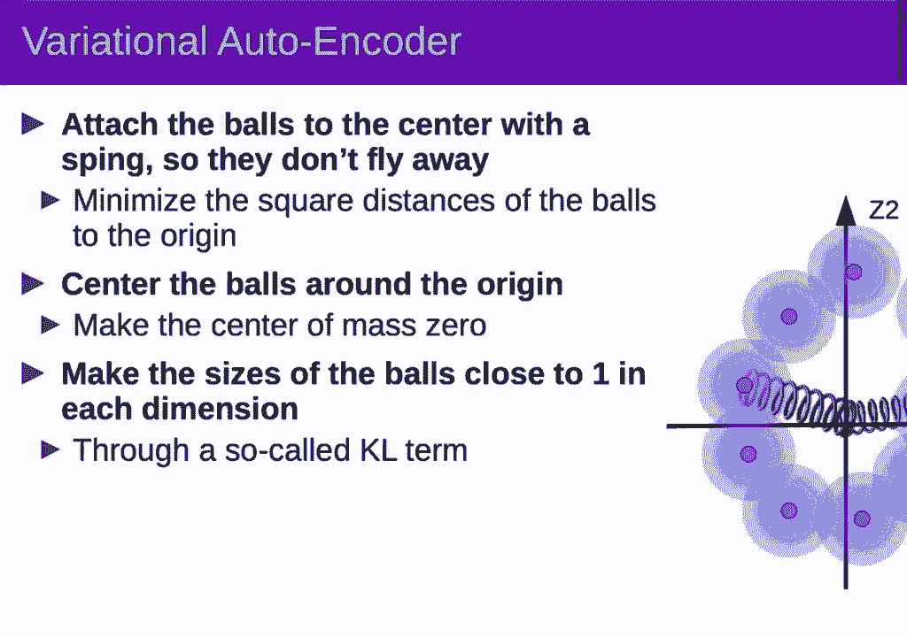

想知道在那之后是否有什么重要的事情，所以，我描述的情况是想象你有你知道的，我描述的情况是想象你有你知道的，一些大的神经网络，它会产生一个你知道的特征，一些大的神经网络，它会产生一个你知道的特征。

一定大小的向量，那么您的输出就非常大，一定大小的向量，那么您的输出就非常大，因为也许你有很多类别，因为也许你有很多类别，也许您正在对语音进行音素分类，也许您正在对语音进行音素分类，识别系统。

所以这里的类别数是，识别系统，所以这里的类别数是，知道10000或类似的东西，好吧，我必须慢慢画，所以如果你的特征向量是，好吧，我必须慢慢画，所以如果你的特征向量是，本身就像10000矩阵。

从这里到这里，本身就像10000矩阵，从这里到这里，将是一亿对，这可能有点太多，所以人们做的是他们说我们要去，这可能有点太多，所以人们做的是他们说我们要去，将该矩阵分解为两个乘积。

将该矩阵分解为两个乘积，瘦矩阵，这里的中间尺寸可能是，这里的中间尺寸可能是，我不知道你有一千好，我不知道你有一千好，输入10k，输出10k，然后中间，输入10k，输出10k，然后中间，是1k对。

所以如果您没有中间的，是1k对，所以如果您没有中间的，那么您拥有的参数数是10到8。那么您拥有的参数数是10到8。如果你有中间一个是2倍，如果你有中间一个是2倍，呃10到你知道7好吧，所以你得到。

呃10到你知道7好吧，所以你得到，10。如果你做到100，那就知道10，10。如果你做到100，那就知道10，到6。因此变得更易于管理，因此基本上您的排名较低，到6。因此变得更易于管理。

因此基本上您的排名较低，因式分解，所以这里的整体矩阵，因式分解，所以这里的整体矩阵，可以称w不会是，可以称w不会是，两个较小的矩阵u和v，两个较小的矩阵u和v，并且因为u和v uh是中间维度。

并且因为u和v uh是中间维度，u和v的值较小，说100则等级，u和v的值较小，说100则等级，对应矩阵w的值会更小，对应矩阵w的值会更小，有些人没有实际指定尺寸，有些人没有实际指定尺寸。

通过做所谓的核规范最小化，通过做所谓的核规范最小化，这是等效的，但是我不想进入这个，但是，这是等效的，但是我不想进入这个，但是，在那种情况下，您可能想要，在那种情况下，您可能想要。

将矩阵分解成两个矩阵的乘积以保存参数，将矩阵分解成两个矩阵的乘积以保存参数，本质上是您的保存计算，还有另一个，本质上是您的保存计算，还有另一个，嗯，有趣的现象是，嗯，有趣的现象是，学习和概括都更好。

学习和概括都更好，呃，当你做这种分解的时候，呃，当你做这种分解的时候，即使现在针对该矩阵的优化变为，即使现在针对该矩阵的优化变为，非凸，实际上使用收敛速度更快，非凸，实际上使用收敛速度更快。

随机梯度有一张纸被一系列，随机梯度有一张纸被一系列，nadav如果您对此感兴趣，nadav如果您对此感兴趣，纳达夫·科恩，我认为他来自2018年，他是sanjeev的合著者，我认为他来自2018年。

他是sanjeev的合著者，呃，来自普林斯顿的极光，呃，来自普林斯顿的极光，nadav是桑吉瓦拉的一名博士后，他们对此发表了一系列论文，nadav是桑吉瓦拉的一名博士后，他们对此发表了一系列论文，嗯。

这解释了为什么甚至线性网络，嗯，这解释了为什么甚至线性网络，实际上收敛更快，他们也使用它来，实际上收敛更快，他们也使用它来，嗯，基本研究某种非凸的学习动力，基本研究某种非凸的学习动力，优化以及泛化属性。

优化以及泛化属性，在变化阶编码器中进行匹配有多么重要，在变化阶编码器中进行匹配有多么重要，具有匹配的编码器架构和，具有匹配的编码器架构和，解码器没有理由两者，解码器没有理由两者。

与之匹配的架构通常就是这样，与之匹配的架构通常就是这样，解码比编码容易得多，所以如果以稀疏为例，解码比编码容易得多，所以如果以稀疏为例，我在稀疏编码中谈到的um编码，我在稀疏编码中谈到的um编码。

编码器是所列编码器中的一种，编码器是所列编码器中的一种，实际上很复杂，而解码器是线性的，实际上很复杂，而解码器是线性的，好吧，这是一种特殊情况，因为，好吧，这是一种特殊情况，因为，该代码是高维且稀疏的。

该代码是高维且稀疏的，如此高维的稀疏代码，你知道，如此高维的稀疏代码，你知道，基本上任何地方的维稀疏代码都可以，基本上任何地方的维稀疏代码都可以，准线性一种使函数线性化的方法基本上是。

准线性一种使函数线性化的方法基本上是，使用a在高维空间中表示此输入变量，使用a在高维空间中表示此输入变量，非线性转换我们已经讨论过了，我们讨论过，非线性转换我们已经讨论过了，我们讨论过。

知道什么是好的功能和好的功能，知道什么是好的功能和好的功能，通常一致的扩展尺寸，通常一致的扩展尺寸，非线性表示，并使该表示稀疏，非线性表示，并使该表示稀疏，原因是现在使函数线性化。

原因是现在使函数线性化，您可能会拥有非常复杂的编码器和非常简单的，您可能会拥有非常复杂的编码器和非常简单的，解码器可能是线性的，只要您，解码器可能是线性的，只要您，如果您有一个低维代码。

则代码现在是高维的，如果您有一个低维代码，则代码现在是高维的，所以中间层的另一个编码器很窄，所以中间层的另一个编码器很窄，代码层很窄，那么做起来可能会很复杂，代码层很窄，那么做起来可能会很复杂。

解码可能会变得非常非线性，解码可能会变得非常非线性，现在可以执行解码，所以现在您可能需要多层，现在可以执行解码，所以现在您可能需要多层，再也没有理由认为，再也没有理由认为，解码器应类似于编码器的架构。

解码器应类似于编码器的架构，现在有你知道可能有他们可能，现在有你知道可能有他们可能，好的，说实际上可能有充分的理由，好的，说实际上可能有充分的理由，好的，事实上，有些型号我还没有谈论过，好的，事实上。

有些型号我还没有谈论过，因为它们不是经过验证的，而是被称为呃堆积的，因为它们不是经过验证的，而是被称为呃堆积的，自动编码器基本上您在哪里有这个主意，自动编码器基本上您在哪里有这个主意，有。

有重构错误的自动编码器，有重构错误的自动编码器，我实际上要擦除它并使它看起来像，我实际上要擦除它并使它看起来像，这个你知道我们讨论过的自动编码器，这个你知道我们讨论过的自动编码器。

在这里制作潜在变量的成本，在这里制作潜在变量的成本，与编码器的输出不同，所以这是，与编码器的输出不同，所以这是，AZ条形图，如果您要确定，则为AZ，这是在输入中绘制的另一个编码器，AZ条形图。

如果您要确定，则为AZ，这是在输入中绘制的另一个编码器，一种有趣的方式，所以这是y，这是y酒吧，一种有趣的方式，所以这是y，这是y酒吧，现在在底部我可以在上面堆叠另一个这些家伙。

现在在底部我可以在上面堆叠另一个这些家伙，好吧，现在我必须叫这个z1，好吧，现在我必须叫这个z1，我将其称为z2 [Music]，我将其称为z2 [Music]，等等，好吧，我要叫y bar。

这我要叫y，好吧，我要叫y bar，这我要叫y，现在，关于有趣的事情是什么，我将称其为底部x，现在，关于有趣的事情是什么，我将称其为底部x，现在更改名称，现在，如果您看了看，就会忽略系统的正确部分。

现在，如果您看了看，就会忽略系统的正确部分，看你去y的左边部分，那看起来非常，看你去y的左边部分，那看起来非常，就像一个经典的识别器，其中x是输入y柱是，就像一个经典的识别器，其中x是输入y柱是。

输出的预测，y是期望的输出，输出的预测，y是期望的输出，还有一个成本函数可以衡量两者之间的差异，还有一个成本函数可以衡量两者之间的差异，好吧，从y到x的另一个分支，好吧，从y到x的另一个分支。

有点像解码器，其中y是代码，有点像解码器，其中y是代码，但是您会一直在中间编写代码，因为这有点像，但是您会一直在中间编写代码，因为这有点像，堆叠的自动编码器正确，因此每一层每一对，堆叠的自动编码器正确。

因此每一层每一对，编码器解码器有点像自动编码器，编码器解码器有点像自动编码器，然后将它们堆叠在一起，而您想要的是，然后将它们堆叠在一起，而您想要的是，找到一种训练系统的方式，找到一种训练系统的方式。

如果您没有样品标签，就不知道为什么，如果您没有样品标签，就不知道为什么，例如，您只是将其训练为自动编码器，例如，您只是将其训练为自动编码器，但是如果你确实有ay，那么你就可以钳住，但是如果你确实有ay。

那么你就可以钳住，呃到它的期望值，然后这个系统变成现在，呃到它的期望值，然后这个系统变成现在，预测器，识别器和自动编码器的组合，预测器，识别器和自动编码器的组合，现在这张照片有点问题。

现在这张照片有点问题，许多不同的问题，第一个问题是，许多不同的问题，第一个问题是，如果再次，例如z1是否具有足够的容量，如果再次，例如z1是否具有足够的容量，嗯，您只训练未标记的样本，系统只会，嗯。

您只训练未标记的样本，系统只会，通过z1传递信息，它将完全忽略，通过z1传递信息，它将完全忽略，顶层，因为其中没有足够的容量，顶层，因为其中没有足够的容量，z1做完美的重建，所以要知道。

z1做完美的重建，所以要知道，只需将所有信息放入z1，然后将所有其他z2和y，只需将所有信息放入z1，然后将所有其他z2和y，常数，因为系统不需要，常数，因为系统不需要，他们再次如此，您将需要规范化。

他们再次如此，您将需要规范化，正则化z以防止其捕获所有信息，正则化z以防止其捕获所有信息，对于其他层也一样，也许现在另一件事是，对于其他层也一样，也许现在另一件事是，你知道这个东西需要是线性非线性的。

这取决于，你知道这个东西需要是线性非线性的，这取决于，各个z的相对大小，如果从低点开始，各个z的相对大小，如果从低点开始，尺寸到高尺寸，您需要非线性的东西，尺寸到高尺寸，您需要非线性的东西。

但是如果您从高维度转到低维度，但是如果您从高维度转到低维度，您可能可以使用像稀疏编码这样的线性方法来实现，您可能可以使用像稀疏编码这样的线性方法来实现，嗯，所以您会看到系统可能有，嗯。

所以您会看到系统可能有，呃，你知道线性和非线性的交替，呃，你知道线性和非线性的交替，如果需要的话，处于相反的阶段，如果需要的话，处于相反的阶段，因为您需要从高维到低维的线性。

因为您需要从高维到低维的线性，然后非线性从低维到高维，然后非线性从低维到高维，然后再次线性回到低维，然后再次线性回到低维，反之亦然，这是你知道人们一直在提议这样的事情，但不是。

这是你知道人们一直在提议这样的事情，但不是，真的对他们进行了大规模的培训，真的对他们进行了大规模的培训，所以围绕这些事情有很多公开的问题，所以围绕这些事情有很多公开的问题，呃，如果你好奇我已经写过一篇。

呃，如果你好奇我已经写过一篇，我和我以前的学生一起工作过，叫uh jake zhao，我和我以前的学生一起工作过，叫uh jake zhao，um是一个叫做堆叠的系统，um是一个叫做堆叠的系统。

自动编码器，这是一个有点这种类型的系统，但是还有一些额外的变量，这是一个有点这种类型的系统，但是还有一些额外的变量，往这边走，往这边走，这基本上是交换机在池中的位置，我不想去。

这基本上是交换机在池中的位置，我不想去，进入细节，但是如果您寻找有关堆叠的论文，进入细节，但是如果您寻找有关堆叠的论文，在自动编码器中，您会通过杰克找到两篇论文，在自动编码器中。

您会通过杰克找到两篇论文，和我自己以及密歇根州的一群追随者论文，和我自己以及密歇根州的一群追随者论文，密歇根大学基本上对它进行了改进，并且，密歇根大学基本上对它进行了改进，并且。

在imagenet上对他们进行了培训，并获得了不错的成绩，所以这些都是，在imagenet上对他们进行了培训，并获得了不错的成绩，所以这些都是，您可以用来进行自我监督学习的架构。

您可以用来进行自我监督学习的架构，只是为了澄清弹簧的参数是针对kl发散项，只是为了澄清弹簧的参数是针对kl发散项，没错，是的，所以杀手versions，没错，是的，所以杀手versions。

损失中的术语，我们将看到，损失中的术语，我们将看到，明天伙计们，所以我们要经历，明天伙计们，所以我们要经历，等式和所有这些呃细节，所以没错，我涵盖了这个，等式和所有这些呃细节，所以没错，我涵盖了这个。

明天，所以我希望明天见，明天，所以我希望明天见，以及视频，如果带宽支持的话，以及视频，如果带宽支持的话，我会像这样把这个录音，我会像这样把这个录音，我实际上有空时立即在线上课。

我实际上有空时立即在线上课，我将其添加到Nyu流媒体平台，我将其添加到Nyu流媒体平台，然后你知道我会尽力清理它，然后你知道我会尽力清理它，尽我所能，您也知道稍后再将其上传到youtube，尽我所能。

您也知道稍后再将其上传到youtube，好的，再次感谢您，嗯，待在家里，保持温暖，我明天见，好的，再次感谢您，嗯，待在家里，保持温暖，我明天见。

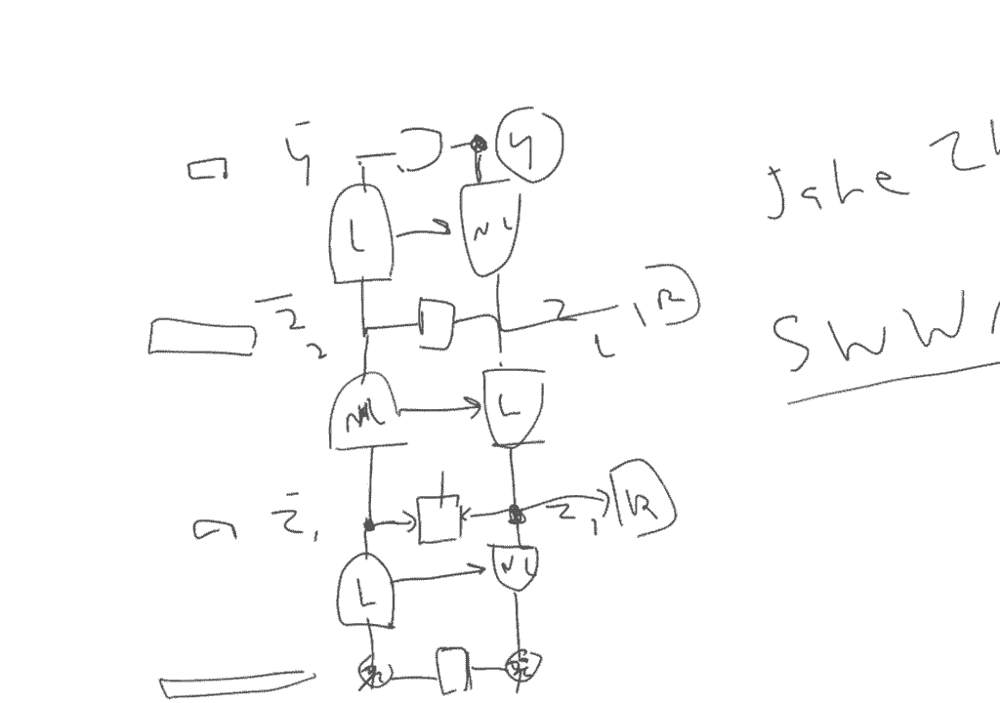

