# 【NYU】纽约大学深度学习入门课程（with pytorch）中英文字幕 - P1：1. Week 1 – Lecture - History, motivation, and evolution of Deep Learning - 大佬的迷弟的粉丝 - BV1o5411p7AB

好吧，首先我要有一个非常坦白的表白，好吧，首先我要有一个非常坦白的表白，实际上不是由我而是由这两个家伙经营，实际上不是由我而是由这两个家伙经营。

Alfredo kanjyani和Margo Stein是Neymar，另一位TAS在这里，您会，Alfredo kanjyani和Margo Stein是Neymar，另一位TAS在这里，您会。

与他们交谈远不止您会与我交谈，这是第一件事，与他们交谈远不止您会与我交谈，这是第一件事，我要说的另一件事是，如果您对这堂课有疑问，我要说的另一件事是，如果您对这堂课有疑问，在课程结束时不要问他们。

因为我必须在，在课程结束时不要问他们，因为我必须在，上飞机课，但我等不及下周好了，让我们开始吧，上飞机课，但我等不及下周好了，让我们开始吧。

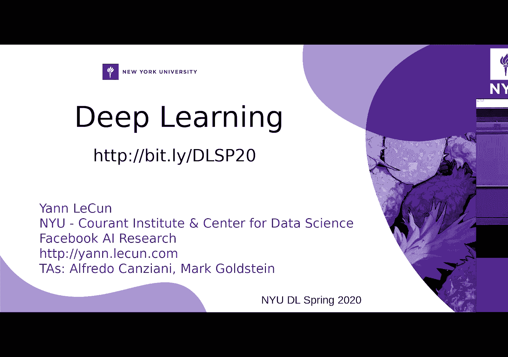

在一些非常基本的课程信息中，您可以找到一个网站，在一些非常基本的课程信息中，您可以找到一个网站，可以看到我将尽我所能将幻灯片的PDF发布到网站上，可以看到我将尽我所能将幻灯片的PDF发布到网站上。

可能就在讲座开始之前，可能就在讲座开始之前，通常会讲课，但是上课时应该在那里，通常会讲课，但是上课时应该在那里，所以至少通过考试我可以上课，星期一晚上我要去上九堂课，星期一晚上我要去上九堂课。

每个星期二晚上还有一次实践会议，届时会，每个星期二晚上还有一次实践会议，届时会，运行，以便他们解决一些您知道的实际问题，运行，以便他们解决一些您知道的实际问题，你知道数学的复习你知道数学是必要的。

你知道数学的复习你知道数学是必要的，和基本概念一些有关如何使用手电筒的教程以及其他，和基本概念一些有关如何使用手电筒的教程以及其他，软件工具，这将是三场客座讲座的名称，软件工具。

这将是三场客座讲座的名称，客座讲师尚未定稿，但将会涉及诸如自然，客座讲师尚未定稿，但将会涉及诸如自然，语言处理计算机视觉单元主管学习类似的东西，语言处理计算机视觉单元主管学习类似的东西，将会有期中考试。

或者至少我们认为有，将会有期中考试，或者至少我们认为有，参加其中一个您知道您在三月左右进行的会议以及评估，参加其中一个您知道您在三月左右进行的会议以及评估，将在期中和最终项目中完成，您可以。

将在期中和最终项目中完成，您可以，知道两个人在一起，我们两个或三个或两个，知道两个人在一起，我们两个或三个或两个，我们还没有决定，我们会看到该项目可能与，我们还没有决定，我们会看到该项目可能与。

我们正在讨论有监督驾驶和自动驾驶的结合，我们正在讨论有监督驾驶和自动驾驶的结合，与各种各样的人收集数据之类的东西，好吧，让我谈一点，与各种各样的人收集数据之类的东西，好吧，让我谈一点，大约。

所以这是第一堂课，真的很广泛，大约，所以这是第一堂课，真的很广泛，关于什么是深度运行的真正介绍，以及您可以做什么，关于什么是深度运行的真正介绍，以及您可以做什么，无法做到这一点将作为对整个事情的介绍。

因此，无法做到这一点将作为对整个事情的介绍，因此，如果您想上课，我们将走遍整个弧线，如果您想上课，我们将走遍整个弧线，肤浅的用语，以便您对所有主题都有一个广泛的高级想法，肤浅的用语。

以便您对所有主题都有一个广泛的高级想法，我们正在谈论，每当我谈论其特定主题时，您都会，我们正在谈论，每当我谈论其特定主题时，您都会，看到它适合这种整体情况，但在此之前有一个，看到它适合这种整体情况。

但在此之前有一个，该课程的前提条件是您知道自己需要熟悉，该课程的前提条件是您知道自己需要熟悉，机器学习或至少基本的体质学习，机器学习或至少基本的体质学习。

谁在这里与战士tensorflow玩过训练过的神经网络，谁在这里与战士tensorflow玩过训练过的神经网络，还没做完，所以要害羞好吧，所以大多数人都很好，但是我不是，还没做完，所以要害羞好吧。

所以大多数人都很好，但是我不是，假设您知道所有有关此的信息，特别是我要，假设您知道所有有关此的信息，特别是我要，假设您了解很多您知道的深层底层技术，假设您了解很多您知道的深层底层技术。

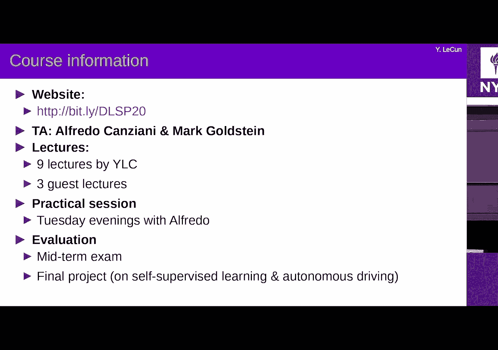

好的，所以这是课程计划，具体取决于你告诉我我可以，好的，所以这是课程计划，具体取决于你告诉我我可以。

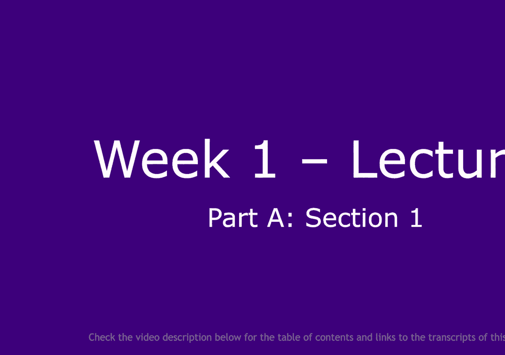

解决这个问题，您知道您在某些部分上走得更快，解决这个问题，您知道您在某些部分上走得更快，认为太明显了，因为您之前或其他人曾玩过这个游戏，认为太明显了，因为您之前或其他人曾玩过这个游戏，因此。

主管在您的诚实计划中向我介绍的就是我，因此，主管在您的诚实计划中向我介绍的就是我，今天要谈论的是当你不能做什么时深度学习可以做什么，今天要谈论的是当你不能做什么时深度学习可以做什么。

深度学习的优点是没有新的表示形式，所以现在让我们来谈谈，深度学习的优点是没有新的表示形式，所以现在让我们来谈谈，下周大约是反向传播和基本架构，下周大约是反向传播和基本架构，组件之类的事实。

例如您是用模块构建神经网络的事实，组件之类的事实，例如您是用模块构建神经网络的事实，彼此连接，您可以计算出自动梯度，彼此连接，您可以计算出自动梯度，差异化，然后这些各种类型的架构损失功能，差异化。

然后这些各种类型的架构损失功能，您知道激活功能的不同模块技巧，例如重量共享和，您知道激活功能的不同模块技巧，例如重量共享和，我们将市场乘法互动与注意门控联系在一起。

我们将市场乘法互动与注意门控联系在一起，像这样的权利，是否有特定的宏体系结构像，像这样的权利，是否有特定的宏体系结构像，牛津连体网络超级网络是正确的，所以我们将深入探讨，牛津连体网络超级网络是正确的。

所以我们将深入探讨，快速进入，如果您已经玩过其中一些游戏，那是合适的，快速进入，如果您已经玩过其中一些游戏，那是合适的，然后会有一两次讲座我还没有完全讲完，然后会有一两次讲座我还没有完全讲完。

尚未决定商业网及其应用，其中之一可能，尚未决定商业网及其应用，其中之一可能，最终成为客座讲座，然后更具体地讲深度学习，最终成为客座讲座，然后更具体地讲深度学习，在特殊情况下有用的架构，例如。

在特殊情况下有用的架构，例如，随时间反向传播的递归神经网络，随时间反向传播的递归神经网络，您尝试编写当前神经网络的方式以及，您尝试编写当前神经网络的方式以及，递归神经网络可用于控制之类的东西。

您知道思考时间很长，递归神经网络可用于控制之类的东西，您知道思考时间很长，系列之类的东西，然后再结合复发和门控，系列之类的东西，然后再结合复发和门控，乘法互动，例如让您控制循环单元和STM，然后。

乘法互动，例如让您控制循环单元和STM，然后，像真的使用乘法交互之类的东西，像真的使用乘法交互之类的东西，他们的架构，例如存储网络，变压器，适配器等，他们的架构，例如存储网络，变压器，适配器等。

是一种非常流行的最新架构，是一种非常流行的最新架构，诸如LP和其他区域之类的东西，然后是关于图神经的一些知识，诸如LP和其他区域之类的东西，然后是关于图神经的一些知识，网，我将不多谈论这件事。

因为还有另一个，网，我将不多谈论这件事，因为还有另一个，John Brunner可以选择的课程，他在图表上花费了大量时间，John Brunner可以选择的课程，他在图表上花费了大量时间，神经网络。

然后他们将谈论我们如何获得这些深度学习系统，神经网络，然后他们将谈论我们如何获得这些深度学习系统，工作以及各种使他们工作的技巧，工作以及各种使他们工作的技巧，神经网络中发生的优化的类型，所以您的类型。

神经网络中发生的优化的类型，所以您的类型，知道我们使用的课程学习几乎总是关于，知道我们使用的课程学习几乎总是关于，优化和深度学习几乎总是基于梯度的优化，优化和深度学习几乎总是基于梯度的优化。

并且关于凸中的凸有一些优化规则，并且关于凸中的凸有一些优化规则，情况很容易理解，但当，情况很容易理解，但当，培训是随机的，大多数深度学习系统就是这种情况，培训是随机的，大多数深度学习系统就是这种情况。

他们在深度学习中也不太了解，因为成本，他们在深度学习中也不太了解，因为成本，函数不是不凸的，它具有局部极小值和几个点，函数不是不凸的，它具有局部极小值和几个点，以及类似的事情，因此了解，以及类似的事情。

因此了解，目标函数我说理解很重要，但是，目标函数我说理解很重要，但是，这里最大的秘密是没有人真正了解，这很重要，这里最大的秘密是没有人真正了解，这很重要，明白没有人知道还可以，但是有一些技巧。

明白没有人知道还可以，但是有一些技巧，通过直觉和一点点的结合，通过直觉和一点点的结合，理论分析和实证搜索等初始化技巧，理论分析和实证搜索等初始化技巧，归一化技巧和正则化技巧，例如辍学，分级，分级。

归一化技巧和正则化技巧，例如辍学，分级，分级，修剪更多用于优化，例如动量平均HDD托盘，修剪更多用于优化，例如动量平均HDD托盘，各种使HDD瘫痪的方法，其中许多方法不起作用，然后发生某些事情。

各种使HDD瘫痪的方法，其中许多方法不起作用，然后发生某些事情，有点异国情调的目标流行和拉格朗日，有点异国情调的目标流行和拉格朗日，后部的配方，然后我将切换到我最喜欢的主题，后部的配方。

然后我将切换到我最喜欢的主题，基于能量的模型，所以这是许多，基于能量的模型，所以这是许多，学习他们是否受到监督的不同方法，学习他们是否受到监督的不同方法，进行监督，以及它们是否涉及推理之类的事物。

进行监督，以及它们是否涉及推理之类的事物，寻找变量的值，没人告诉你，但是，寻找变量的值，没人告诉你，但是，系统应该推断出您的过程，因此可能是，系统应该推断出您的过程，因此可能是。

被认为是通过神经网络实现推理的一种方式，被认为是通过神经网络实现推理的一种方式，因此您可以将神经网络中的推理视为一个过程，因此您可以将神经网络中的推理视为一个过程。

具有一些针对某些变量进行了优化的能量函数，具有一些针对某些变量进行了优化的能量函数，而您从优化中获得的价值就是那些，而您从优化中获得的价值就是那些，您试图找到的变量，所以有一些常见的观点。

您试图找到的变量，所以有一些常见的观点，神经网络只是一个将其输出作为函数进行计算的函数，神经网络只是一个将其输出作为函数进行计算的函数，它的输入，因此您只需遍历神经网络就可以得到输出，但这就是。

它的输入，因此您只需遍历神经网络就可以得到输出，但这就是，在某种意义上讲，您只能产生一种相当限制性的推理形式，在某种意义上讲，您只能产生一种相当限制性的推理形式，给定输入一个输出，但通常有多个可能。

给定输入一个输出，但通常有多个可能，给定输入的答案，那么您如何表示这个问题，给定输入的答案，那么您如何表示这个问题，在给定多个答案的地方键入，在给定多个答案的地方键入，输入，对此的一个答案是。

您使那些答案成为一些能量的最小值，输入，对此的一个答案是，您使那些答案成为一些能量的最小值，函数，您的推理算法将查找这些变量的值，函数，您的推理算法将查找这些变量的值，最小化此目标函数。

因此可能会有多个最小值，最小化此目标函数，因此可能会有多个最小值，这意味着您是您的模型，对于给定的模型可能会产生多个输出，这意味着您是您的模型，对于给定的模型可能会产生多个输出，输入好。

所以基于能量的模型有点像，输入好，所以基于能量的模型有点像，特殊情况下所有这些基于能量的模型都是，特殊情况下所有这些基于能量的模型都是，您知道的概率模型贝叶斯方法图形模型。

您知道的概率模型贝叶斯方法图形模型，桥接网和诸如此类的能量方法更普遍，桥接网和诸如此类的能量方法更普遍，所以不太具体，所以特殊情况包括，所以不太具体，所以特殊情况包括。

就像过去人们习惯称其为结构预测的人一样，就像过去人们习惯称其为结构预测的人一样，在所谓的监督运行中的应用，在所谓的监督运行中的应用，接下来的几节讲座的主题，因此在监督下跑步是非常活跃的。

接下来的几节讲座的主题，因此在监督下跑步是非常活跃的，今天的研究主题，可能会变成真的，今天的研究主题，可能会变成真的，在未来占主导地位已经在一年的时间里成为主导。

在未来占主导地位已经在一年的时间里成为主导，在自然语言处理中使用，并在过去几个月中仅用了三个月，在自然语言处理中使用，并在过去几个月中仅用了三个月，有几篇论文表明有监督的运行方法确实有效。

有几篇论文表明有监督的运行方法确实有效，在计算机视觉方面也非常好，所以我猜我猜，在计算机视觉方面也非常好，所以我猜我猜，在接下来的几个月里，有监督的跑步将接管世界，在接下来的几个月里。

有监督的跑步将接管世界，年，所以我认为在本堂课中听说这很有用，所以，年，所以我认为在本堂课中听说这很有用，所以，就像我不打算浏览这份清单，但是有，就像我不打算浏览这份清单，但是有。

您可能听说过的一些事情，例如自动编码器的降噪版本，您可能听说过的一些事情，例如自动编码器的降噪版本，自动编码器伯特，你知道那些变压器吗，自动编码器伯特，你知道那些变压器吗，经过自然语言处理训练的架构。

经过自然语言处理训练的架构，进行自我监督运行，并且有特殊的降噪处理，进行自我监督运行，并且有特殊的降噪处理，自动编码器，您可能会有很多这些东西，自动编码器，您可能会有很多这些东西。

听说没有意识到他们是种种，都可以在，听说没有意识到他们是种种，都可以在，这种基于能量的方法的上下文，我认为这也是产生的，这种基于能量的方法的上下文，我认为这也是产生的，通过虚拟网络。

我相信你们中很多人都听说过，通过虚拟网络，我相信你们中很多人都听说过，然后还有一个监督学习，所以您知道我们如何获得，然后还有一个监督学习，所以您知道我们如何获得，真正变得非常智能的机器。

就像它们不是超级机器，真正变得非常智能的机器，就像它们不是超级机器，聪明，他们现在还不是很聪明，他们可以解决非常狭窄的问题，聪明，他们现在还不是很聪明，他们可以解决非常狭窄的问题。

超人的表现有时会很好地解决问题，但没有机器，超人的表现有时会很好地解决问题，但没有机器，有任何常识和我们拥有的最智能的机器，有任何常识和我们拥有的最智能的机器，可能不如家猫那么常识。

所以我们如何达到猫水平，可能不如家猫那么常识，所以我们如何达到猫水平，首先是智力，然后是人类的智力，我不假装，首先是智力，然后是人类的智力，我不假装，得到答案，但我知道一些有趣的想法，得到答案。

但我知道一些有趣的想法，在监督运行的背景下进行讨论，我有一些应用程序，在监督运行的背景下进行讨论，我有一些应用程序，任何问题，所以这是您的课程计划，可以动态更改，任何问题，所以这是您的课程计划。

可以动态更改，那就是任何问题的意图，好的，是的，有作业，好的，所以您可以在此处查看Alfredo的后续报道，因为您讲得非常好，好的，所以您可以在此处查看Alfredo的后续报道，因为您讲得非常好。

大声地说，这最后的项目实际上将是一场比赛，大声地说，这最后的项目实际上将是一场比赛，团队之间的关系，所以这就像排行榜一样，团队之间的关系，所以这就像排行榜一样，为此的准备工作基本上将是实践。

为此的准备工作基本上将是实践，熟悉深入运行所需的所有技术，熟悉深入运行所需的所有技术，一般性的，但对于最终项目尤其是中期的权利，一般性的，但对于最终项目尤其是中期的权利。

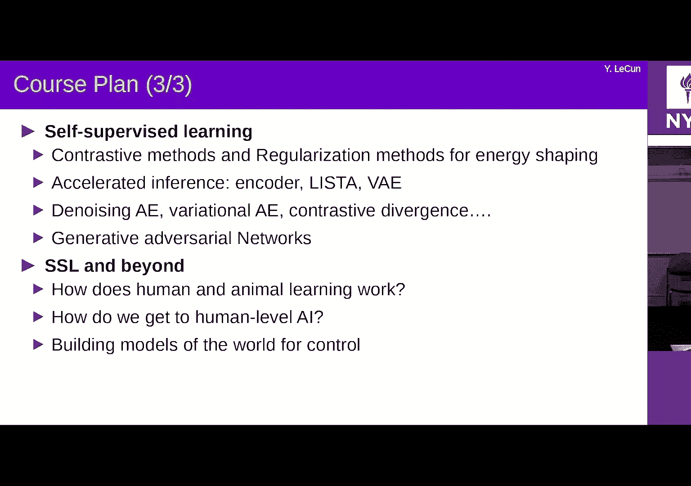

显然还可以，所以您可能也知道，这会让您很无聊，显然还可以，所以您可能也知道，这会让您很无聊，你们中一些已经玩过这些东西的人，但这是从，你们中一些已经玩过这些东西的人，但这是从。

深度学习的基础是人们对大脑的观察所启发，但，深度学习的基础是人们对大脑的观察所启发，但，灵感只是一种灵感，不是企图不复制，灵感只是一种灵感，不是企图不复制，大脑，因为关于大脑的很多细节都是无关紧要的。

大脑，因为关于大脑的很多细节都是无关紧要的，我们不知道它们是否真的与人类智能有关，所以，我们不知道它们是否真的与人类智能有关，所以，灵感是从概念上讲的，与，灵感是从概念上讲的，与，您知道飞机受鸟类启发。

但飞行的基本原理，您知道飞机受鸟类启发，但飞行的基本原理，鸟类和飞机基本相同，但细节极为复杂，鸟类和飞机基本相同，但细节极为复杂，不同的是，它们都有翅膀，船通过推动自己而产生漂移，不同的是。

它们都有翅膀，船通过推动自己而产生漂移，可以飞行，但您知道飞机没有羽毛，也没有拍打翅膀，所以，可以飞行，但您知道飞机没有羽毛，也没有拍打翅膀，所以，相同的想法有点相同，其历史可以追溯到。

相同的想法有点相同，其历史可以追溯到，现在几乎消失或至少更改名称的字段，现在几乎消失或至少更改名称的字段，如果您想要有关历史的专家，则称为主权亚历克斯，如果您想要有关历史的专家，则称为主权亚历克斯。

控制论就坐在那儿。在这里，乔的水平举起你的手，所以乔，控制论就坐在那儿。在这里，乔的水平举起你的手，所以乔，实际上是哲学家，他对他感兴趣，他实际上有一个，实际上是哲学家，他对他感兴趣，他实际上有一个。

在哪个媒体部门从事关于AI历史的研讨会，在哪个媒体部门从事关于AI历史的研讨会，文化和沟通，所以纳粹的嗯，他知道关于你的一切知道，文化和沟通，所以纳粹的嗯，他知道关于你的一切知道。

控制论的历史始于40年代，当时有两位先生，控制论的历史始于40年代，当时有两位先生，McCulloch和Pitt的照片在这里右上角，他们想出了，McCulloch和Pitt的照片在这里右上角。

他们想出了，您当时认识别人或对逻辑感兴趣的想法，您当时认识别人或对逻辑感兴趣的想法，但是神经科学是非常新生的，但是神经科学是非常新生的，愈，他们得到的想法是，如果神经元基本上处于阈值，愈。

他们得到的想法是，如果神经元基本上处于阈值，然后通过将神经元彼此连接来打开或关闭单位，然后通过将神经元彼此连接来打开或关闭单位，可以建立布尔电路，基本上可以用，可以建立布尔电路，基本上可以用，神经元。

所以他们说你知道大脑基本上是一个逻辑推理，神经元，所以他们说你知道大脑基本上是一个逻辑推理，机器机器，因为神经元是二进制的，所以这个想法，机器机器，因为神经元是二进制的，所以这个想法。

想法是神经元计算其输入的加权和，然后，想法是神经元计算其输入的加权和，然后，将加权总和与阈值进行比较（如果阈值等于阈值），将加权总和与阈值进行比较（如果阈值等于阈值），如果低于则关闭，这是如何简化视图。

如果低于则关闭，这是如何简化视图，真正的神经元的工作非常非常简单，您可以将模型卡在，真正的神经元的工作非常非常简单，您可以将模型卡在，几十年来，实际上是几十年，几十年来，实际上是几十年，几十年的傻瓜。

然后你知道准同时唐纳德·赫布谁，几十年的傻瓜，然后你知道准同时唐纳德·赫布谁，大脑中神经元的想法可能是大脑学习的古老观念，大脑中神经元的想法可能是大脑学习的古老观念，通过修改之间的连接强度。

通过修改之间的连接强度，被称为突触的神经元，您对现在的情况有所了解，被称为突触的神经元，您对现在的情况有所了解，称为“ hebbian学习”，即如果两个神经元一起发射，则它们。

称为“ hebbian学习”，即如果两个神经元一起发射，则它们，连接他们的联系增加了，如果他们不一起开火，也许，连接他们的联系增加了，如果他们不一起开火，也许，减少这不是学习算法的主意，但有点像。

减少这不是学习算法的主意，但有点像，也许是第一个想法，然后由这些人Norbert提出了控制论，也许是第一个想法，然后由这些人Norbert提出了控制论，维纳在这里，这就是整个想法，即拥有这样的系统。

维纳在这里，这就是整个想法，即拥有这样的系统，有传感器，可以有执行器，也可以有反馈回路，有传感器，可以有执行器，也可以有反馈回路，可以让您知道自我调节系统以及背后的理论是什么。

可以让您知道自我调节系统以及背后的理论是什么，这个你知道，我们现在认为这是理所当然的，但是你知道的想法，这个你知道，我们现在认为这是理所当然的，但是你知道的想法，你有类似的东西，例如，嗯。

你知道你开车正确，你有类似的东西，例如，嗯，你知道你开车正确，你转动车轮，有一个所谓的PID控制器，实际上，你转动车轮，有一个所谓的PID控制器，实际上，与方向盘成比例地转动方向盘。

与方向盘成比例地转动方向盘，这是一种反馈机制，基本上可以测量，这是一种反馈机制，基本上可以测量，方向盘测量汽车方向盘的位置，然后测量，方向盘测量汽车方向盘的位置，然后测量，进行汽车车轮校正之间存在差异。

进行汽车车轮校正之间存在差异，它们与方向盘匹配，而方向盘是一种反馈机制，它们与方向盘匹配，而方向盘是一种反馈机制，这个的稳定性和关于这个的规则基本上都来自，这个的稳定性和关于这个的规则基本上都来自。

最初是由于这项工作导致了一位以弗兰克为名的绅士，最初是由于这项工作导致了一位以弗兰克为名的绅士，罗森布拉特（Rosenblatt）基本想像一下可以修改权重的学习算法。

罗森布拉特（Rosenblatt）基本想像一下可以修改权重的学习算法，非常简单的神经网络，以及您在此处底部看到的两张图片，非常简单的神经网络，以及您在此处底部看到的两张图片，这是弗兰克·罗森布拉特。

这是感知器，这是一个物理类似物，这是弗兰克·罗森布拉特，这是感知器，这是一个物理类似物，计算机，它不是三行Python程序，而是现在的，计算机，它不是三行Python程序，而是现在的。

拥有巨大机器的人知道电线和光学传感器，因此您可以展示它，拥有巨大机器的人知道电线和光学传感器，因此您可以展示它，图片，这是非常低的分辨率，然后有了它，你会知道我们可以，图片，这是非常低的分辨率。

然后有了它，你会知道我们可以，它具有可以计算加权总和的神经元，并且权重可以是，它具有可以计算加权总和的神经元，并且权重可以是，调整和重量是电位器电位器有马达，调整和重量是电位器电位器有马达，在他们身上。

他们可以旋转学习算法，所以有，在他们身上，他们可以旋转学习算法，所以有，机电，他为此而在这里持有的是八个模块，机电，他为此而在这里持有的是八个模块，您可以用电动电位计来计算重量。

您可以用电动电位计来计算重量，电位计就可以了，所以有一些关于神经电位的历史，电位计就可以了，所以有一些关于神经电位的历史，网来自另一段有趣的历史，那就是，网来自另一段有趣的历史，那就是。

通过基本模拟来尝试构建智能机器，通过基本模拟来尝试构建智能机器，神经元网络诞生于40年代，神经元网络诞生于40年代，50年代后期，并在1960年代后期完全死亡，当时人们，50年代后期。

并在1960年代后期完全死亡，当时人们，意识到人们可以通过运行算法和架构，意识到人们可以通过运行算法和架构，当时建议你可以做很多事情，你知道你可以做一些基本的事情，当时建议你可以做很多事情。

你知道你可以做一些基本的事情，模式识别非常简单，但您可以在1969年到，模式识别非常简单，但您可以在1969年到，或1968年和1984年，我会说基本上世界上没有人在做，或1968年和1984年。

我会说基本上世界上没有人在做，神经网络，除了少数孤立的研究人员（主要在日本），神经网络，除了少数孤立的研究人员（主要在日本），因为日本是其自身相对封闭的生态系统，因为日本是其自身相对封闭的生态系统。

资助研究人员，如果您愿意，他们不会听同一种时尚，资助研究人员，如果您愿意，他们不会听同一种时尚，然后他们感觉到1985年大约随着背影的出现再次起飞，然后他们感觉到1985年大约随着背影的出现再次起飞。

传播，因此反向传播是用于训练多层的算法，传播，因此反向传播是用于训练多层的算法，你们中许多人都知道的神经网络，人们正在寻找某种东西，你们中许多人都知道的神经网络，人们正在寻找某种东西，像这样在60年代。

基本上没有找到它，以及他们的原因，像这样在60年代，基本上没有找到它，以及他们的原因，没发现是因为他们使用了错误的神经元，没发现是因为他们使用了错误的神经元，使二元神经元凹陷，恢复传播到工作的方式是。

使二元神经元凹陷，恢复传播到工作的方式是，使用连续可微化的激活函数，使用连续可微化的激活函数，连续的，而人们只是没有您知道使用的想法，连续的，而人们只是没有您知道使用的想法，连续的神经元。

所以他们不认为您可以训练那些系统，连续的神经元，所以他们不认为您可以训练那些系统，梯度下降，因为现在事物不可微分了，梯度下降，因为现在事物不可微分了，另一个原因是，如果您的神经网络具有二进制。

另一个原因是，如果您的神经网络具有二进制，您永远不需要做的神经元您永远不需要计算乘法，您永远不需要做的神经元您永远不需要计算乘法，永远不需要将两个数字相乘，只需要添加数字就可以了。

永远不需要将两个数字相乘，只需要添加数字就可以了，神经元是活动的，您只需将权重加到它不活动的加权总和上，神经元是活动的，您只需将权重加到它不活动的加权总和上，如果您有连续的神经元，请不要做任何事情。

如果您有连续的神经元，请不要做任何事情，通过获得权重的方式激活神经元，通过获得权重的方式激活神经元，总而言之，在1980年代之前，两个数字特别相乘，总而言之，在1980年代之前，两个数字特别相乘。

任何种类的价格昂贵的计算机上的浮点数都是，任何种类的价格昂贵的计算机上的浮点数都是，非常慢，因此有动力不使用连续神经元，非常慢，因此有动力不使用连续神经元，出于这个原因，所以后蛙不早于中期出现的原因。

出于这个原因，所以后蛙不早于中期出现的原因，80年代是因为那时候您知道计算机变得足够快，可以执行14，80年代是因为那时候您知道计算机变得足够快，可以执行14，点乘法几乎没有人这样想，但这就是。

点乘法几乎没有人这样想，但这就是，你知道那种读物实际上是有效的，你知道那种读物实际上是有效的，发生了，因此在1985年到1995年之间对神经网络产生了兴趣，发生了。

因此在1985年到1995年之间对神经网络产生了兴趣，在1995年持续了大约10年，它再次死于机器学习领域的人们，在1995年持续了大约10年，它再次死于机器学习领域的人们。

基本上出于我不是的原因而放弃了使用神经网络的想法，基本上出于我不是的原因而放弃了使用神经网络的想法，现在要进入，一直持续到2000年或2010年后期，所以当，现在要进入。

一直持续到2000年或2010年后期，所以当，在2009年2010年左右，人们意识到可以使用多层神经网络，在2009年2010年左右，人们意识到可以使用多层神经网络。

用背部道具训练并获得语音识别方面的改进，用背部道具训练并获得语音识别方面的改进，不是从图像网开始的，而是从语音识别开始的，大约是2010年，不是从图像网开始的，而是从语音识别开始的，大约是2010年。

在每个主要专业发表第一篇论文后的18个月内，在每个主要专业发表第一篇论文后的18个月内，语音识别的参与者已经部署了商业语音识别，语音识别的参与者已经部署了商业语音识别，使用神经网络的系统。

因此如果您使用的是Android手机，并且正在使用，使用神经网络的系统，因此如果您使用的是Android手机，并且正在使用，Android手机在2012年左右使用的所有其他语音识别功能。

Android手机在2012年左右使用的所有其他语音识别功能，神经网络，可能是第一种真正真正广泛的部署，神经网络，可能是第一种真正真正广泛的部署，现代形式的深度学习，如果您想在2012年底进入2013。

现代形式的深度学习，如果您想在2012年底进入2013，在计算机视觉中发生了同样的事情，在计算机视觉中发生了同样的事情，社区非常了解深度学习坐标，尤其是工作，社区非常了解深度学习坐标，尤其是工作。

比他们以前使用并开始切换的方式要好，比他们以前使用并开始切换的方式要好，使用商业网并基本上放弃所有以前的技术，以便，使用商业网并基本上放弃所有以前的技术，以便，引起了计算机视觉领域的第二次革命。

然后三年，引起了计算机视觉领域的第二次革命，然后三年，大约在2016年左右，自然语言处理中也发生了同样的事情，大约在2016年左右，自然语言处理中也发生了同样的事情。

在语言翻译和诸如2015-16这样的事情中，现在我们将看到，在语言翻译和诸如2015-16这样的事情中，现在我们将看到，它尚未发生，但我们将看到事物发生了同样的革命，它尚未发生。

但我们将看到事物发生了同样的革命，例如机器人和控制，您知道很多应用领域，但，例如机器人和控制，您知道很多应用领域，但，我可以做到这一点，所以你们都知道什么是有监督的跑步，我可以做到这一点。

所以你们都知道什么是有监督的跑步，确实是绝大多数而不是绝大多数的90％，确实是绝大多数而不是绝大多数的90％，深度学习的应用以监督运行为主要，深度学习的应用以监督运行为主要。

受监管的主要事情是收集一堆东西的过程，受监管的主要事情是收集一堆东西的过程，比方说图像示例的输入和输出对，比方说图像示例的输入和输出对，如果您想进行图像识别或一堆音频片段，请选择一个类别。

如果您想进行图像识别或一堆音频片段，请选择一个类别，在那里转录一堆文本，在那里转录一堆文本，语言以及其他语言的转录等，您将一个示例提供给，语言以及其他语言的转录等，您将一个示例提供给。

在机器上产生输出的机器，如果输出正确，您什么也不做，在机器上产生输出的机器，如果输出正确，您什么也不做，否则，如果输出不正确，您就不会做很多事情，那么请调整参数，否则，如果输出不正确。

您就不会做很多事情，那么请调整参数，的机器认为它是某种功能的参数化，的机器认为它是某种功能的参数化，您以某种方式调整该函数的参数，以使输出，您以某种方式调整该函数的参数，以使输出，更接近您希望的时候。

这是一个非技术术语，更接近您希望的时候，这是一个非技术术语，监督学习的全部内容就是，如果系统不支持，则显示汽车图片，监督学习的全部内容就是，如果系统不支持，则显示汽车图片。

说带有参数的汽车正在神经网络中运行，说带有参数的汽车正在神经网络中运行，是您知道的权重，您可以在其中计算加权总和，是您知道的权重，您可以在其中计算加权总和，模拟的神经元调整旋钮，使输出更接近when。

模拟的神经元调整旋钮，使输出更接近when，您赢得了神经网络的诀窍，是如何确定朝哪个方向，您赢得了神经网络的诀窍，是如何确定朝哪个方向，关于调节旋钮的多少，以便使输出更接近一个，关于调节旋钮的多少。

以便使输出更接近一个，您想要那是梯度竞争并且，您想要那是梯度竞争并且，反向传播即将到来，但在我们做到这一点之前。

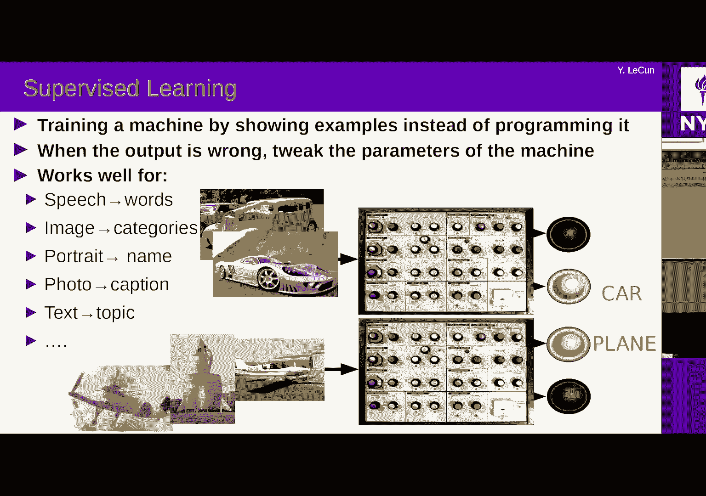

反向传播即将到来，但在我们做到这一点之前，历史再次出现，因此出现了一系列用于分类的基本模型。

历史再次出现，因此出现了一系列用于分类的基本模型，你知道从感知器开始，还有另一个竞争模型，你知道从感知器开始，还有另一个竞争模型，ADA线位于右上方，它们基于相同的，ADA线位于右上方，它们基于相同的。

基本架构是计算机的加权输入加权总和，基本架构是计算机的加权输入加权总和，阈值，如果它高于阈值转弯，如果阈值以下，则打开，阈值，如果它高于阈值转弯，如果阈值以下，则打开，你看到的是另一行。

伯尼·维多（Bernie Widow）是，你看到的是另一行，伯尼·维多（Bernie Widow）是，tweet是在调整，实际上又是一台物理模拟计算机，所以就像，tweet是在调整。

实际上又是一台物理模拟计算机，所以就像，像感知器一样，在许多方面您要知道的要小得多，并且，像感知器一样，在许多方面您要知道的要小得多，并且，原因，并告诉你这是因为感知实际上是两个，原因。

并告诉你这是因为感知实际上是两个，一层神经网络，其中第二层是可训练的两层神经网络，一层神经网络，其中第二层是可训练的两层神经网络，具有自适应权重，但实际上大多数时候第一层都是固定的，具有自适应权重。

但实际上大多数时候第一层都是固定的，在大多数实验中，它是随机确定的，您想，在大多数实验中，它是随机确定的，您想，将图像的输入像素随机连接到您会知道的神经元，将图像的输入像素随机连接到您会知道的神经元。

基本具有随机权重的阈值神经元，基本具有随机权重的阈值神经元，这就是他们所说的关联层，基本上就变成了，这就是他们所说的关联层，基本上就变成了，模式识别系统概念设计的基础，模式识别系统概念设计的基础。

接下来的四个十年我想说四个十年，所以，接下来的四个十年我想说四个十年，所以，模型是一种输入，您可以通过功能运行它，模型是一种输入，您可以通过功能运行它，提取器应该提取相关的特征。

提取器应该提取相关的特征，输入将对任务有用，因此您想识别人脸可以吗，输入将对任务有用，因此您想识别人脸可以吗，侦测眼睛如何很好地侦测眼睛可能有黑眼圈，侦测眼睛如何很好地侦测眼睛可能有黑眼圈。

像这样的事情，您想识别一辆汽车，您知道所有，像这样的事情，您想识别一辆汽车，您知道所有，它们是一种黑暗的圆形物体，等等，这里的问题等等，它们是一种黑暗的圆形物体，等等，这里的问题等等。

特征提取器产生的是特征的向量，这些特征可能是，特征提取器产生的是特征的向量，这些特征可能是，数字，或者它们可以打开或关闭，所以这只是数字，向量和，数字，或者它们可以打开或关闭，所以这只是数字，向量和。

在这种情况下，您需要将该向量提供给可训练的分类器，在这种情况下，您需要将该向量提供给可训练的分类器，感知器或简单的神经网络，它将仅仅是计算，感知器或简单的神经网络，它将仅仅是计算。

加权总和将其与阈值进行比较，问题是您必须，加权总和将其与阈值进行比较，问题是您必须，设计特征提取器，从而获得模式识别的全部文献，设计特征提取器，从而获得模式识别的全部文献，至少可以感觉到相同的模式识别。

并且可以感知很多计算机视觉，至少可以感觉到相同的模式识别，并且可以感知很多计算机视觉，至少计算机视觉中对识别感兴趣的部分集中在，至少计算机视觉中对识别感兴趣的部分集中在。

这部分功能提取器您如何设计一个功能提取器，这部分功能提取器您如何设计一个功能提取器，您想做的特定问题我不知道Google的性格如何，您想做的特定问题我不知道Google的性格如何，识别在Google和。

识别在Google和，您如何使用各种算法技巧来提取它们，如何处理，您如何使用各种算法技巧来提取它们，如何处理，您知道如何将图像规格化的图像，您知道如何将图像规格化的图像，您是否将它们骨架化。

并从背景中对其进行细分，所以整个，您是否将它们骨架化，并从背景中对其进行细分，所以整个，文学致力于这一点，很少有，文学致力于这一点，很少有。

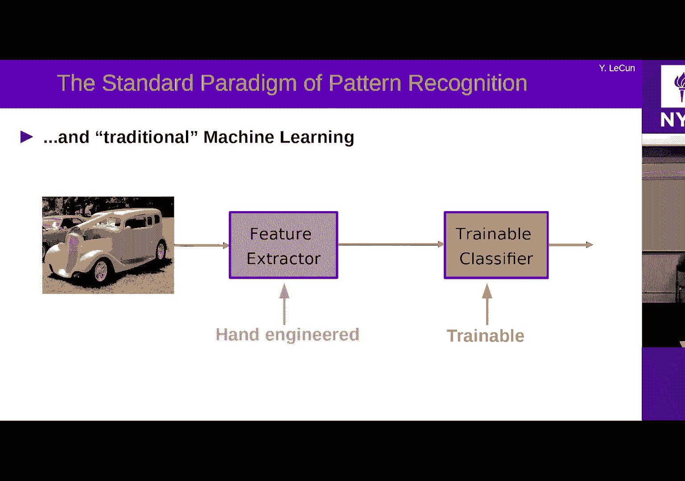

而我们要深化的是这个想法，而不是，而我们要深化的是这个想法，而不是，具有这种两阶段的模式识别过程，其中一个阶段，具有这种两阶段的模式识别过程，其中一个阶段，是手动构建的，其中输入的表示是，是手动构建的。

其中输入的表示是，您知道的结果实际上是一些手工工程程序的深层思想，您知道的结果实际上是一些手工工程程序的深层思想，学习是您从头到尾地学习了整个任务，所以基本上，学习是您从头到尾地学习了整个任务。

所以基本上，建立您的模式识别系统或您想使用的任何功能，建立您的模式识别系统或您想使用的任何功能，它是级联还是一系列模块，它是级联还是一系列模块，所有这些模块都有可调参数，它们都有某种。

所有这些模块都有可调参数，它们都有某种，它们中的非线性好，然后堆叠它们，然后堆叠多层，它们中的非线性好，然后堆叠它们，然后堆叠多层，他们，这就是为什么它被称为深修剪，所以深的唯一原因，他们。

这就是为什么它被称为深修剪，所以深的唯一原因，世界和深度学习是存在多层的事实，世界和深度学习是存在多层的事实，还可以，然后您就可以端对端地训练整个过程，还可以，然后您就可以端对端地训练整个过程，因此。

这里的复杂性当然是因为参数位于，因此，这里的复杂性当然是因为参数位于，第一个盒子你怎么知道如何转动它们，以便你知道输出，第一个盒子你怎么知道如何转动它们，以便你知道输出，更接近您想要的输出。

这就是反向传播的作用，更接近您想要的输出，这就是反向传播的作用，对你来说，为什么所有这些模块都必须是非线性的，这是因为如果你有，对你来说，为什么所有这些模块都必须是非线性的，这是因为如果你有。

到连续的模块，它们都是线性的，您可以将它们折叠成一个，到连续的模块，它们都是线性的，您可以将它们折叠成一个，单线性权两个线性函数的乘积或，单线性权两个线性函数的乘积或，两个线性函数是一个线性函数。

取向量x矩阵，两个线性函数是一个线性函数，取向量x矩阵，将其乘以第二个矩阵，就好像您已经预先计算了，将其乘以第二个矩阵，就好像您已经预先计算了，这两个矩阵，然后将输入向量乘以该复合矩阵，这两个矩阵。

然后将输入向量乘以该复合矩阵，如果这些层是线性的，那么没有多层是没有意义的，如果这些层是线性的，那么没有多层是没有意义的，实际上是一点，但这是手动点，因此，由于它们必须是非线性的。

所以最简单的多层体系结构是什么，因此，由于它们必须是非线性的，所以最简单的多层体系结构是什么，您可以想象其中的参数可以调整重量，您可以想象其中的参数可以调整重量，神经网络并且是非线性的。

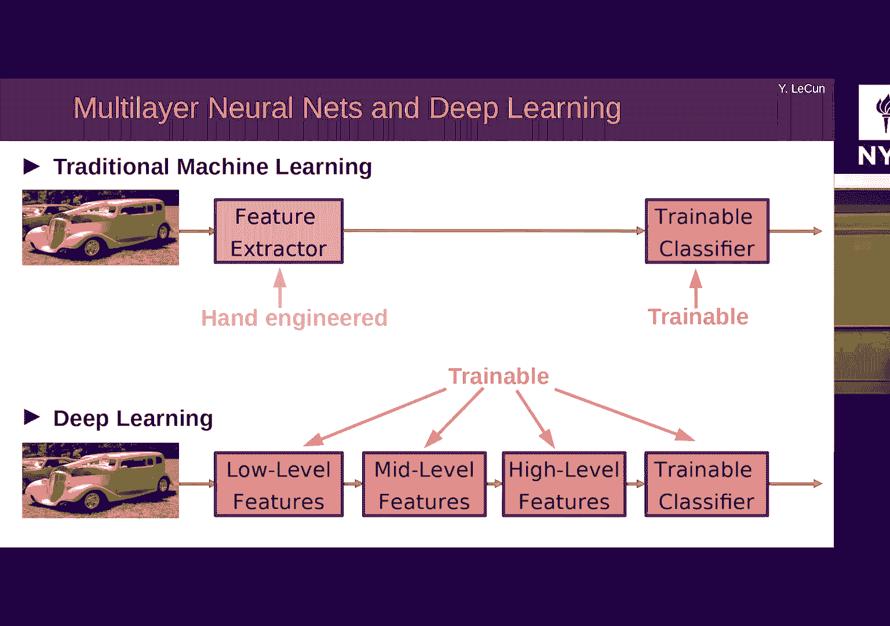

然后您的眼睛很快就必须看起来像这样，所以，然后您的眼睛很快就必须看起来像这样，所以，输入输入可以表示为矢量，图像只是以下内容的列表，输入输入可以表示为矢量，图像只是以下内容的列表，数字将其视为向量。

您现在就知道它是图像，数字将其视为向量，您现在就知道它是图像，音频，无论您的传感器或数据集为您提供了什么，音频，无论您的传感器或数据集为您提供了什么，是一个向量，将该向量乘以矩阵，该矩阵中的系数。

是一个向量，将该向量乘以矩阵，该矩阵中的系数，是可调参数，然后在您使用正确的结果向量时，是可调参数，然后在您使用正确的结果向量时，将矩阵乘以向量，即可得到向量，并通过该向量的每个分量，将矩阵乘以向量。

即可得到向量，并通过该向量的每个分量，向量通过一个非线性函数，如果你想简单，向量通过一个非线性函数，如果你想简单，可能的非线性函数使用顶部所示的内容，可能的非线性函数使用顶部所示的内容，在这里。

您中哪些人叫工程中最有价值的人，在这里，您中哪些人叫工程中最有价值的人，将此半波整流称为数学中的人们将此称为正向分量，将此半波整流称为数学中的人们将此称为正向分量，您可以称它为好。

因此将此非线性函数应用于，您可以称它为好，因此将此非线性函数应用于，现在通过将输入向量乘以矩阵得到的向量，现在通过将输入向量乘以矩阵得到的向量，您会得到一个新矢量，其中有很多零，因为无论何时小部件。

您会得到一个新矢量，其中有很多零，因为无论何时小部件，歌曲小于零，但如果您通过该值，则为零，歌曲小于零，但如果您通过该值，则为零，然后重复该过程，将向量x权重矩阵传递给结果，然后重复该过程。

将向量x权重矩阵传递给结果，点智慧非线性将结果乘以它乘以，点智慧非线性将结果乘以它乘以，通过非线性的结果矩阵，这是基本的神经网络，通过非线性的结果矩阵，这是基本的神经网络，现在基本上还可以。

为什么它被称为神经网络，因为，现在基本上还可以，为什么它被称为神经网络，因为，取一个向量，然后将一个向量乘以一个矩阵即可计算出每个向量，取一个向量，然后将一个向量乘以一个矩阵即可计算出每个向量。

您实际上可以计算输出的分量，您实际上可以计算输出的分量，矩阵中相应行的输入，所以这个小符号，矩阵中相应行的输入，所以这个小符号，这里有很多矢量分量进入这一层，这里有很多矢量分量进入这一层。

您将矩阵计算机的行与这些值的加权和相加，您将矩阵计算机的行与这些值的加权和相加，权重是矩阵行中的值，权重是矩阵行中的值，给您一个加权总和，然后对每行进行一次加权总和，给您一个加权总和。

然后对每行进行一次加权总和，结果正确，因此矩阵相乘后的单位数为，结果正确，因此矩阵相乘后的单位数为，将等于矩阵的行数和列数，将等于矩阵的行数和列数，矩阵的乘积当然必须等于输入的大小。

矩阵的乘积当然必须等于输入的大小，好吧，所以我更正式地指导了战略运作，好吧，所以我更正式地指导了战略运作，实际上，您将通过它比较系统的输出，实际上，您将通过它比较系统的输出，产生。

所以正确的你应该输入你通过神经网络运行，你会得到一个，产生，所以正确的你应该输入你通过神经网络运行，你会得到一个，输出，您将把此输出与目标输出进行比较，您可以，输出，您将把此输出与目标输出进行比较。

您可以，具有目标函数的损耗模块，可计算距离差异，具有目标函数的损耗模块，可计算距离差异，惩罚任何你想称呼的分歧，惩罚任何你想称呼的分歧，好吧，有各种各样的名称，然后您将计算平均值，好吧。

有各种各样的名称，然后您将计算平均值，因此，这个成本函数的输出就是一个标量，因此，这个成本函数的输出就是一个标量，计算距离，例如目标之间的欧几里得距离，计算距离，例如目标之间的欧几里得距离。

向量和没有人产生您放置的d平面的向量，向量和没有人产生您放置的d平面的向量，系统产生，然后您可以计算该成本函数的平均值，系统产生，然后您可以计算该成本函数的平均值，只是一个标量。

您在一个训练集上就将其平均化，所以训练，只是一个标量，您在一个训练集上就将其平均化，所以训练，集合由一堆成对的输入和输出组成，计算平均值，集合由一堆成对的输入和输出组成，计算平均值，在整个训练集中。

您要最小化的功能，在整个训练集中，您要最小化的功能，相对于系统参数，运球旋钮的平均水平还可以，相对于系统参数，运球旋钮的平均水平还可以，所以您想找到最小化平均值的参数值。

所以您想找到最小化平均值的参数值，您想要的输出与是之间的误差是的，我把您的平均值，您想要的输出与是之间的误差是的，我把您的平均值，训练样本集，因此，我敢肯定，您知道这里的绝大多数人都有，因此，我敢肯定。

您知道这里的绝大多数人都有，直观了解什么是梯度下降法，直观了解什么是梯度下降法，最小化这是为了正确计算梯度，就像您在，最小化这是为了正确计算梯度，就像您在，山你迷失在山上，这是一个非常平坦的山，但是有。

山你迷失在山上，这是一个非常平坦的山，但是有，雾，这是夜晚，你想去村庄和山谷，所以，雾，这是夜晚，你想去村庄和山谷，所以，你能做的最好的事情就是你转身，看看哪条路倒了，你能做的最好的事情就是你转身。

看看哪条路倒了，您朝着最陡的下降方向走了一步，所以此搜索，您朝着最陡的下降方向走了一步，所以此搜索，下降的方向称为计算梯度或，下降的方向称为计算梯度或，从技术上讲是一个负梯度好吧，那么您就需要逐步降低。

从技术上讲是一个负梯度好吧，那么您就需要逐步降低，向负梯度方向下移，如果您继续这样做，并且，向负梯度方向下移，如果您继续这样做，并且，您的步伐足够小，以至于当您迈出一步时，您不会，您的步伐足够小。

以至于当您迈出一步时，您不会，跳到山的另一边，然后最终你会收敛到，跳到山的另一边，然后最终你会收敛到，如果该值是凸的，则为山谷，这意味着如果没有任何湖泊，如果该值是凸的，则为山谷。

这意味着如果没有任何湖泊，中间没有高山湖泊，您知道那里的最低限度是，中间没有高山湖泊，您知道那里的最低限度是，您将陷入该最小值，该值可能会更低，但您，您将陷入该最小值，该值可能会更低，但您，觉得不好。

所以这就是凸度很重要的原因，觉得不好，所以这就是凸度很重要的原因，概念，但这是另一个概念，它是随机的，概念，但这是另一个概念，它是随机的，梯度，我敢肯定，你们中的很多人都听说过，梯度，我敢肯定。

你们中的很多人都听说过，更详细地讲，您正在计算的目标函数是许多平均值，更详细地讲，您正在计算的目标函数是许多平均值，许多样本，您可以在其梯度上计算目标函数，许多样本，您可以在其梯度上计算目标函数。

通过将整个训练集的值取平均值来得到整个训练集，但是，通过将整个训练集的值取平均值来得到整个训练集，但是，事实证明，只采集一个样本或一小部分样本更为有效，事实证明，只采集一个样本或一小部分样本更为有效。

示例计算此示例造成的错误，谢谢您击败，示例计算此示例造成的错误，谢谢您击败，该误差相对于参数的梯度，并小幅步进，该误差相对于参数的梯度，并小幅步进，然后输入一个新样本，您将获得另一个。

然后输入一个新样本，您将获得另一个，误差值和梯度的另一个值（可能在，误差值和梯度的另一个值（可能在，不同的方向，因为这是一个不同的示例，请采取措施，不同的方向，因为这是一个不同的示例，请采取措施，方向。

如果你继续这样做，你会，方向，如果你继续这样做，你会，降低成本，但以一种嘈杂的方式，将会有很多，降低成本，但以一种嘈杂的方式，将会有很多，波动，所以这里显示的就是这样的一个例子，这就是Socastee。

波动，所以这里显示的就是这样的一个例子，这就是Socastee，梯度应用于二维的一个非常简单的问题，梯度应用于二维的一个非常简单的问题，两个权重，它看起来会说我的周期性，因为示例总是，两个权重。

它看起来会说我的周期性，因为示例总是，以相同的顺序显示，不是您应该做的就是捕捉，以相同的顺序显示，不是您应该做的就是捕捉，渐变，但是如您所见，路径确实不稳定，为什么人们使用此，渐变，但是如您所见。

路径确实不稳定，为什么人们使用此，有多种原因，其中一个原因是，根据经验它收敛很多，有多种原因，其中一个原因是，根据经验它收敛很多，速度更快，特别是在您的训练量很大的情况下，以及其他原因，速度更快。

特别是在您的训练量很大的情况下，以及其他原因，最终您会获得更好的概括性，因此，如果您，最终您会获得更好的概括性，因此，如果您，在您知道的另一套系统上衡量系统的性能，在您知道的另一套系统上衡量系统的性能。

假设大家都知道训练集，测试集和验证的概念，假设大家都知道训练集，测试集和验证的概念，设置，但是如果您测试性能，这次是在另一个设置上，设置，但是如果您测试性能，这次是在另一个设置上。

如果使用Kassie梯度并且如果您使用，如果使用Kassie梯度并且如果您使用，实际使用真正的真实梯度下降，实际使用真正的真实梯度下降，问题是是，否，情况更糟，因此计算出，问题是是，否，情况更糟。

因此计算出，整个数据集在计算上是不可行的，我的意思是你可以做到这一点，整个数据集在计算上是不可行的，我的意思是你可以做到这一点，比您知道的贵得多的话，您的噪点会更慢，所以让我，比您知道的贵得多的话。

您的噪点会更慢，所以让我，告诉你为什么我的意思是这是我们再次谈论的话题，告诉你为什么我的意思是这是我们再次谈论的话题，谈论优化，但让我告诉您，我给您提供了一套，谈论优化，但让我告诉您，我给您提供了一套。

一百万次训练样本实际上是同一训练的一百次重复，一百万次训练样本实际上是同一训练的一百次重复，10，000个样本可以，所以我的实际样本是一万次训练，10，000个样本可以，所以我的实际样本是一万次训练。

样本，我代表了一百次，我大声说你知道我，样本，我代表了一百次，我大声说你知道我，打乱它，我告诉你这是我的训练集，其中包含一百万次训练，打乱它，我告诉你这是我的训练集，其中包含一百万次训练，样本，因此。

如果您执行完整的梯度，则将计算相同的值，样本，因此，如果您执行完整的梯度，则将计算相同的值，你要花一百倍的工作比必要的多，你要花一百倍的工作比必要的多，不知道还好吧，所以这只因为重复才起作用，但是它也。

不知道还好吧，所以这只因为重复才起作用，但是它也，也可以在机器学习中更正常的情况下工作，也可以在机器学习中更正常的情况下工作，样本中有很多多余的样本，样本中有很多多余的样本，样本彼此非常相似。

所以如果存在，样本彼此非常相似，所以如果存在，您的系统具有泛化能力，则意味着讽刺性梯度，您的系统具有泛化能力，则意味着讽刺性梯度，会更有效率，因为如果您不使用Cassegrain，那会很好，会更有效率。

因为如果您不使用Cassegrain，那会很好，您将无法利用我们看不到的优势，那就是，您将无法利用我们看不到的优势，那就是，噪音对您有益的一种情况，不用注意公式，噪音对您有益的一种情况，不用注意公式。

不要让我们不要害怕，因为我们将在后面再讲到这一点。不要让我们不要害怕，因为我们将在后面再讲到这一点。细节，但为什么反向传播称为反向传播，这又是，细节，但为什么反向传播称为反向传播，这又是。

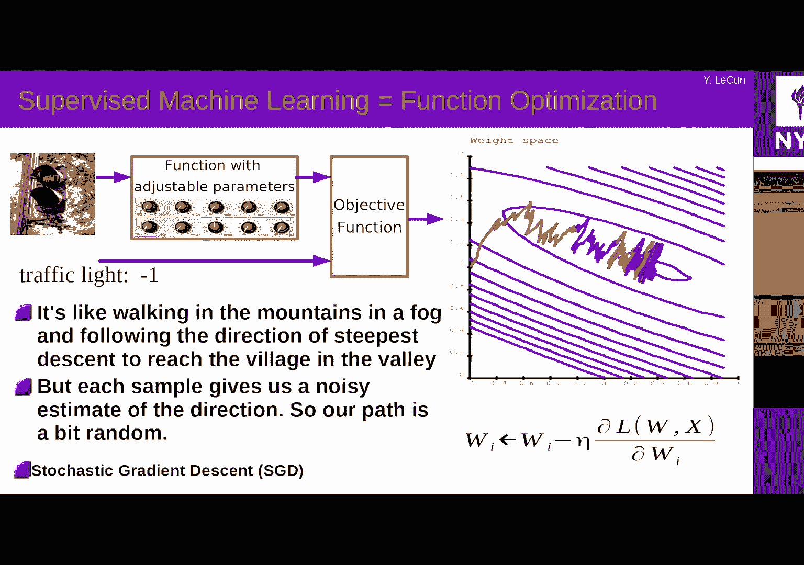

是非常非正式的，基本上是链式规则的实际应用。

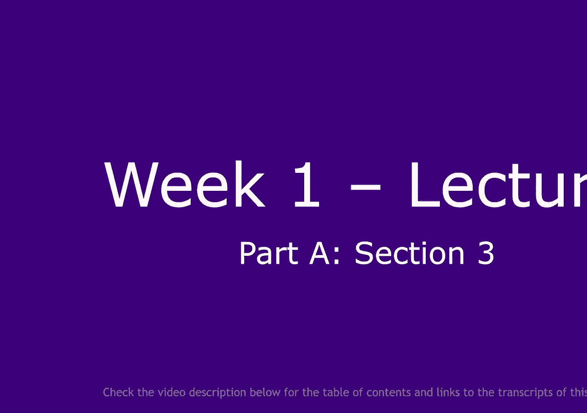

是非常非正式的，基本上是链式规则的实际应用，您可以想到我之前向您展示过的一类新主管，您可以想到我之前向您展示过的一类新主管，彼此堆叠的模块，您可以将其视为，彼此堆叠的模块，您可以将其视为，函数的组成。

你们都知道微积分的基本规则，函数的组成，你们都知道微积分的基本规则，如何计算由另一个函数组成的函数的导数，如何计算由另一个函数组成的函数的导数，很好，您知道由G组成的f的导数是F的导数，很好。

您知道由G组成的f的导数是F的导数，在X的G点处乘以G在点X处的导数，在X的G点处乘以G在点X处的导数，您得到两个导数的乘积，所以这是同一件事，您得到两个导数的乘积，所以这是同一件事。

除了函数而不是标量函数是向量，除了函数而不是标量函数是向量，函数，它们将向量作为输入，将先前的向量作为输出，函数，它们将向量作为输入，将先前的向量作为输出，实际上，他们通常将多维数组作为输入，实际上。

他们通常将多维数组作为输入，多维数组作为输出，但没有关系，基本上什么是，多维数组作为输出，但没有关系，基本上什么是，在以下类型的功能模块的情况下，此链式规则的一般化，在以下类型的功能模块的情况下。

此链式规则的一般化，具有多个输入，多个输出，您可以将它们视为正确的函数，并且，具有多个输入，多个输出，您可以将它们视为正确的函数，并且，基本上，如果您盲目地应用它们，它就是同一个世界，基本上。

如果您盲目地应用它们，它就是同一个世界，您所申请的规则，就像您申请正导数一样，除非他达到，您所申请的规则，就像您申请正导数一样，除非他达到，偏导数，但是你知道你最终看到的是，偏导数。

但是你知道你最终看到的是，如果要计算输出之间差异的导数，则可以，如果要计算输出之间差异的导数，则可以，想要，但是得到的是目标函数的价值，想要，但是得到的是目标函数的价值，尊重网络内部的任何变量。

那么您就必须退一步，尊重网络内部的任何变量，那么您就必须退一步，你知道向后传播导数，并在途中将事物相乘，你知道向后传播导数，并在途中将事物相乘，下周关于此的一切都将更加正式，您只知道为什么。

下周关于此的一切都将更加正式，您只知道为什么，这就是所谓的传播，因为它适用于多层。

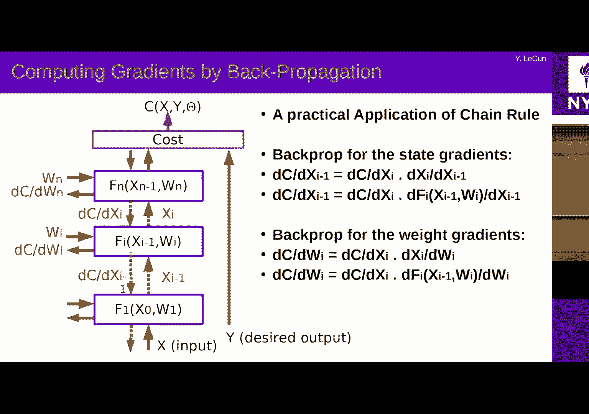

这就是所谓的传播，因为它适用于多层，我之前显示的关于该神经网络的图片很好，但是如果。

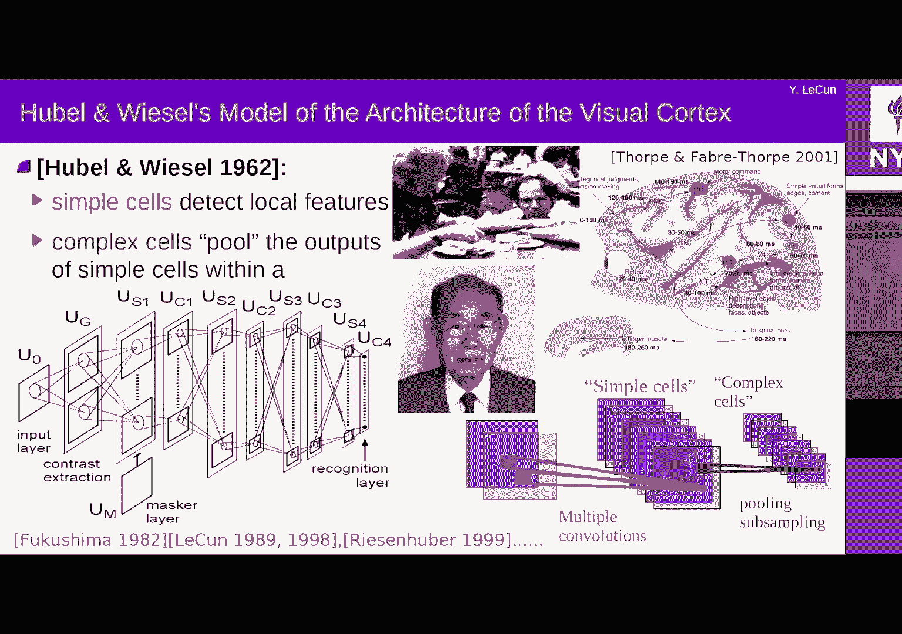

我之前显示的关于该神经网络的图片很好，但是如果，输入实际上是正确的图像，因此图像甚至相对较低，输入实际上是正确的图像，因此图像甚至相对较低，分辨率图像通常就像您知道侧面有几百个像素。

分辨率图像通常就像您知道侧面有几百个像素，好吧，让我们说256 x 256，以随机示例为例，好看汽车图片250，好吧，让我们说256 x 256，以随机示例为例，好看汽车图片250，56，所以它有65。

536像素乘以3，因为您有RG和B分量，56，所以它有65，536像素乘以3，因为您有RG和B分量，因为您知道每个像素都有三个值，所以您知道，因为您知道每个像素都有三个值，所以您知道，大约二十万个值好。

所以这里的向量是两个向量，大约二十万个值好，所以这里的向量是两个向量，十万个成分（如果有矩阵）将相乘，十万个成分（如果有矩阵）将相乘，向量，这个矩阵必须有二十万行列，向量，这个矩阵必须有二十万行列。

对不起，取决于您有多少单位，对不起，取决于您有多少单位，在第一层，将会有二十万个，在第一层，将会有二十万个，即使是二十万，这也是一个巨大的矩阵，即使是二十万，这也是一个巨大的矩阵，十万。

所以您知道第一层有压缩，十万，所以您知道第一层有压缩，那已经是很多非常非常大的矩阵十亿，所以不是真的，那已经是很多非常非常大的矩阵十亿，所以不是真的，可以将其视为一个完整的矩阵，如果。

可以将其视为一个完整的矩阵，如果，您想处理诸如图像之类的东西是对，您想处理诸如图像之类的东西是对，矩阵的结构，因此它不是一个完整的矩阵，矩阵的结构，因此它不是一个完整的矩阵。

知道将所有事物连接到至少对于一个不切实际的事物，知道将所有事物连接到至少对于一个不切实际的事物。

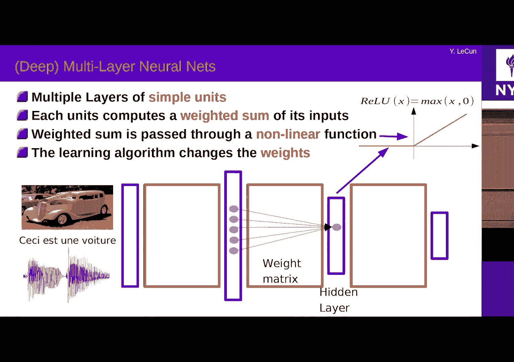

很多实际应用，这就是从中获得灵感的地方，很多实际应用，这就是从中获得灵感的地方，大脑回来了，在神经科学领域有一些经典著作，大脑回来了，在神经科学领域有一些经典著作，1960年代。

这里的高层绅士在霍巴和维塞尔时实际上是想，1960年代，这里的高层绅士在霍巴和维塞尔时实际上是想，为此在70年代获得诺贝尔奖，但他们的员工从50年代后期开始，为此在70年代获得诺贝尔奖。

但他们的员工从50年代后期开始，60年代初，他们所做的是在，60年代初，他们所做的是在，您知道各种动物的视觉皮层猫猴很好您知道，您知道各种动物的视觉皮层猫猴很好您知道，我认为它们非常像猫。

他们试图弄清楚其中的神经元，我认为它们非常像猫，他们试图弄清楚其中的神经元，视觉皮层在做什么，他们发现的是，所以首先，视觉皮层在做什么，他们发现的是，所以首先，好吧，这是人的大脑，但我的意思是。

这种指控是从很晚以后才开始的，好吧，这是人的大脑，但我的意思是，这种指控是从很晚以后才开始的，哺乳动物视觉系统的组织方式与您进入信号的方式类似，哺乳动物视觉系统的组织方式与您进入信号的方式类似。

眼睛撞击视网膜时，您的神经元层数，眼睛撞击视网膜时，您的神经元层数，视网膜在感光器之前，如果您，视网膜在感光器之前，如果您，希望他们无法压缩它，因为您无法了解人眼，希望他们无法压缩它。

因为您无法了解人眼，一亿像素，所以一亿像素，一亿像素，所以一亿像素，相机百万像素相机，但问题是您不能拥有一亿，相机百万像素相机，但问题是您不能拥有一亿，纤维从您的眼睛出来，因为否则您的视神经会。

纤维从您的眼睛出来，因为否则您的视神经会，这么大，你将无法移动眼睛，所以前面的神经元，这么大，你将无法移动眼睛，所以前面的神经元，您的视网膜进行压缩，但不进行JPEG压缩，但是，您的视网膜进行压缩。

但不进行JPEG压缩，但是，压缩，这样您就可以将信号压缩到100万根光纤，压缩，这样您就可以将信号压缩到100万根光纤，有100万根纤维从您的双眼中流出，这使您，有100万根纤维从您的双眼中流出。

这使您，了解这么大的视神经，这意味着您知道您可以携带信号，了解这么大的视神经，这意味着您知道您可以携带信号，睁开你的眼睛，这实际上是进化所造成的一个错误，睁开你的眼睛，这实际上是进化所造成的一个错误。

脊椎动物无脊椎动物实际上不像脊椎动物那样，脊椎动物无脊椎动物实际上不像脊椎动物那样，这是一个很大的错误，因为电线收集了您的信息，这是一个很大的错误，因为电线收集了您的信息，来自视网膜。

因为处理神经元的神经元，来自视网膜，因为处理神经元的神经元，信号在视网膜前面，电线必须在它的前面，信号在视网膜前面，电线必须在它的前面，您的视网膜，因此如果您想遮挡部分视线，则必须，您的视网膜。

因此如果您想遮挡部分视线，则必须，在视网膜上打一个洞，穿过大脑，所以有一个盲人，在视网膜上打一个洞，穿过大脑，所以有一个盲人，在您的视野中，因为那是您的视神经穿过的地方，在您的视野中。

因为那是您的视神经穿过的地方，您的视网膜，所以如果您有这样的相机，这有点荒谬，您的视网膜，所以如果您有这样的相机，这有点荒谬，电线从前面出来，然后您就知道在传感器上挖了一个孔，电线从前面出来。

然后您就知道在传感器上挖了一个孔，把电线拉回去，如果电线从右后方伸出来会更好，把电线拉回去，如果电线从右后方伸出来会更好，vertibird在椎骨上弄错了，所以对了，所以你就知道像乌贼和。

vertibird在椎骨上弄错了，所以对了，所以你就知道像乌贼和，章鱼实际上有电线从后面露出来，尽管如此，但无论如何，章鱼实际上有电线从后面露出来，尽管如此，但无论如何，因此信号从您的眼睛传到了称为“。

因此信号从您的眼睛传到了称为“，实际上位于您大脑下方的外侧膝状核，就像，实际上位于您大脑下方的外侧膝状核，就像，它的基础是做一点对比度归一化，它的基础是做一点对比度归一化，再一次，你知道她在讲课。

然后传到你的脑后，再一次，你知道她在讲课，然后传到你的脑后，主要的视觉皮层区域称为v1，在人类中称为v1，主要的视觉皮层区域称为v1，在人类中称为v1，还有一个叫做腹侧层次v1 v2 v4的东西。

还有一个叫做腹侧层次v1 v2 v4的东西，从后面到侧面以及在我们的颞，从后面到侧面以及在我们的颞，皮质在这里，这是对象类别的代表，因此当您，皮质在这里，这是对象类别的代表，因此当您，四处走走。

你会看到你的祖母，你有一堆神经元在发射，四处走走，你会看到你的祖母，你有一堆神经元在发射，代表您的祖母在这方面，无论您做什么，代表您的祖母在这方面，无论您做什么，奶奶穿着，你知道如果她在哪里，奶奶穿着。

你知道如果她在哪里，闭塞或如果您看到祖母会激发这些神经元，闭塞或如果您看到祖母会激发这些神经元，类别级别的事物，而这些事物已被，类别级别的事物，而这些事物已被，对必须开颅数周的患者进行的实验。

对必须开颅数周的患者进行的实验，还有你知道的人戳电极，让他们看电影和，还有你知道的人戳电极，让他们看电影和，意识到这是已知的，如果詹妮弗·安妮斯顿（Jennifer Aniston）在电影中。

意识到这是已知的，如果詹妮弗·安妮斯顿（Jennifer Aniston）在电影中，它只为珍妮弗·安妮斯顿（Jennifer Aniston）开启，所以以某种方式。

它只为珍妮弗·安妮斯顿（Jennifer Aniston）开启，所以以某种方式，您知道的视觉环境可以进行模式识别，并且似乎具有，您知道的视觉环境可以进行模式识别，并且似乎具有，这种分层结构，多层结构。

这种分层结构，多层结构，视觉过程本质上是前馈过程的想法，视觉过程本质上是前馈过程的想法，您识别视频对象的过程非常快速，大约需要，您识别视频对象的过程非常快速，大约需要，180秒。

几乎没有时间让信号从视网膜传递到，180秒，几乎没有时间让信号从视网膜传递到，它所需要的信息时间皮质是几毫秒的延迟，它所需要的信息时间皮质是几毫秒的延迟，每个神经元必须经历的毫秒数。

每个神经元必须经历的毫秒数，时间到，因为您知道整个系统都会遇到一些峰值，时间到，因为您知道整个系统都会遇到一些峰值，没有时间可以让您知道经常性的联系，并且您知道，没有时间可以让您知道经常性的联系。

并且您知道，等并不意味着没有记录连接，而是大量的记录，但是，等并不意味着没有记录连接，而是大量的记录，但是，某种程度上，如果没有它们，就会完成快速识别，所以这被称为，某种程度上，如果没有它们。

就会完成快速识别，所以这被称为，前馈腹侧通路，这位先生在鹿岛邦子（Kuniko Kashima）身上，前馈腹侧通路，这位先生在鹿岛邦子（Kuniko Kashima）身上。

从70年代的黎刹（Rizal）汲取灵感的想法，并建立了一个神经网络，从70年代的黎刹（Rizal）汲取灵感的想法，并建立了一个神经网络，在计算机上建立模型的想法是，首先要有层，但也要有层。

在计算机上建立模型的想法是，首先要有层，但也要有层，人类视觉发现单个神经元仅对一个，人类视觉发现单个神经元仅对一个，一小部分视野，因此它们在v1和，一小部分视野，因此它们在v1和。

他们意识到v1中的这个神经元只对基序起反应，他们意识到v1中的这个神经元只对基序起反应，出现在视野中很小的区域，或者旁边没有人，出现在视野中很小的区域，或者旁边没有人。

它将对第一个右边的另一个区域做出反应，因此，它将对第一个右边的另一个区域做出反应，因此，神经元似乎以所谓的原始主题方式组织起来，这意味着，神经元似乎以所谓的原始主题方式组织起来，这意味着。

邻近神经元对视野中的邻近区域有反应，邻近神经元对视野中的邻近区域有反应，他们还意识到，所有对相同反应的神经元，他们还意识到，所有对相同反应的神经元，在视野中的某个区域，它们似乎在特定位置打开了四个边缘。

在视野中的某个区域，它们似乎在特定位置打开了四个边缘，方向，因此如果一个神经元的感受野具有边缘，它将打开，方向，因此如果一个神经元的感受野具有边缘，它将打开，一条垂直边缘，如果边缘全部倾斜，则在其旁边。

一条垂直边缘，如果边缘全部倾斜，则在其旁边，在每个边缘旁边旋转等，所以他们有了这个，在每个边缘旁边旋转等，所以他们有了这个，v1的图片基本上是定向取向选择性，因此神经元。

v1的图片基本上是定向取向选择性，因此神经元，看一个局部场，然后对方向和那组神经元做出反应，看一个局部场，然后对方向和那组神经元做出反应，对多个方向做出反应的结果会在整个视野中复制。

对多个方向做出反应的结果会在整个视野中复制，所以这个福岛人我很好说了为什么我不建立一个神经元。

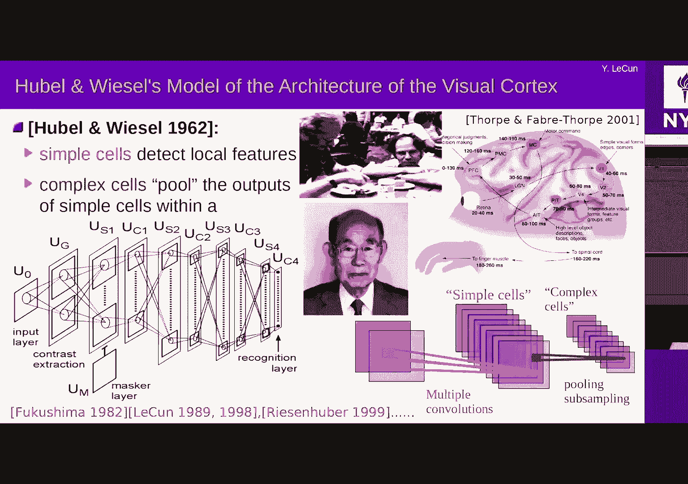

所以这个福岛人我很好说了为什么我不建立一个神经元，我不会告诉你，这一定要坚持我的系统。

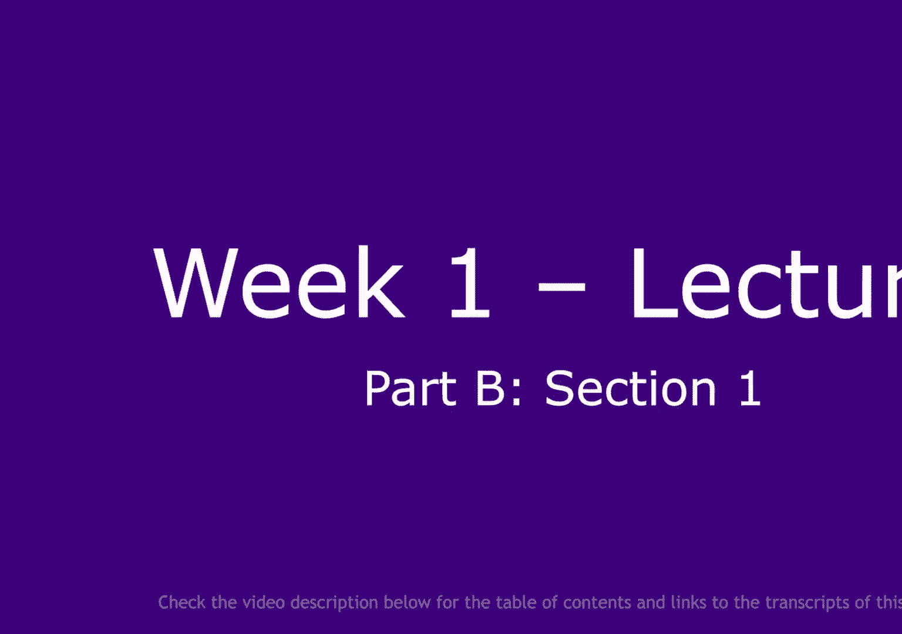

我不会告诉你，这一定要坚持我的系统，提取面向特征，但我将使用某种无监督的学习，提取面向特征，但我将使用某种无监督的学习，算法来训练它，所以它不是在端到端地训练他的系统，算法来训练它。

所以它不是在端到端地训练他的系统，以某种无监督的方式逐层训练它，我不是，以某种无监督的方式逐层训练它，我不是，将要讨论的细节，然后他使用了另一个概念，将要讨论的细节，然后他使用了另一个概念。

这些神经元在整个视野中复制的概念，这些神经元在整个视野中复制的概念，然后为城市视觉代码使用另一种概念称为复杂，然后为城市视觉代码使用另一种概念称为复杂，如此复杂的自我细胞是拉动一堆简单活动的单位。

如此复杂的自我细胞是拉动一堆简单活动的单位，是那些定向定向选择单元的细胞，它们，是那些定向定向选择单元的细胞，它们，以这样的方式拉动它们：以这样的方式拉动它们：一点点它将激活不同的简单单元格，但是由于。

一点点它将激活不同的简单单元格，但是由于，它集成了所有这些简单单元的输出，将保持激活状态，它集成了所有这些简单单元的输出，将保持激活状态，直到边缘超越了这样的领域，我将复杂的，直到边缘超越了这样的领域。

我将复杂的，在表示中建立一点位移不变性，在表示中建立一点位移不变性，边缘一点，它不会改变激活之一的活动，边缘一点，它不会改变激活之一的活动，这些复杂的单元格，这就是我们现在所说的完成并引入。

这些复杂的单元格，这就是我们现在所说的完成并引入，在网上完成的比赛中，这基本上是导致我中期的原因。

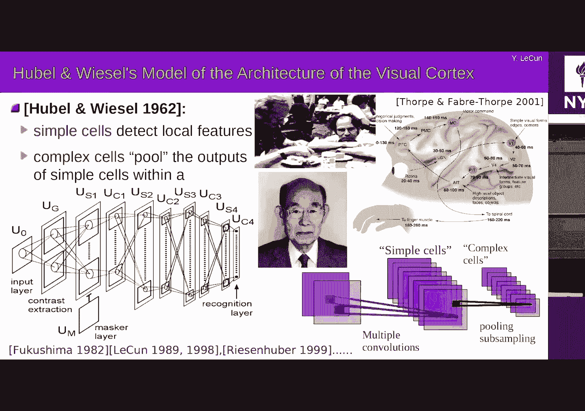

在网上完成的比赛中，这基本上是导致我中期的原因，80年代或八十年代后期想出了商业网，所以基本上，80年代或八十年代后期想出了商业网，所以基本上，连接是本地的网络，它们会在视觉上复制，连接是本地的网络。

它们会在视觉上复制，字段，并且您会穿插一些用于检测的要素检测图层，字段，并且您会穿插一些用于检测的要素检测图层，这些具有拉动操作的重点功能，我们将在下面讨论，这些具有拉动操作的重点功能。

我们将在下面讨论，在三周之内完成，所以我要去，在三周之内完成，所以我要去，深入到每一个细节，但它在视觉和，深入到每一个细节，但它在视觉和，福岛我可以得到基本上每个神经元都在一层的指针。

福岛我可以得到基本上每个神经元都在一层的指针，计算输入的一小部分的加权和，该加权和使用，计算输入的一小部分的加权和，该加权和使用，这些权重，但是这些权重在所有的神经元中复制，这些权重。

但是这些权重在所有的神经元中复制，层使用相同的权重集，这样的权重或，层使用相同的权重集，这样的权重或，听力，所以我们使用后置支撑，我们能够训练像这样的神经网络。

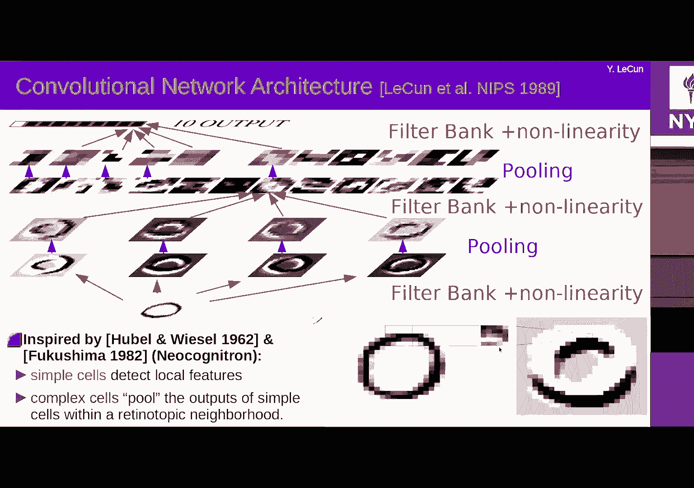

听力，所以我们使用后置支撑，我们能够训练像这样的神经网络，识别并恢复数字，这是从80年代后期到90年代初，识别并恢复数字，这是从80年代后期到90年代初。

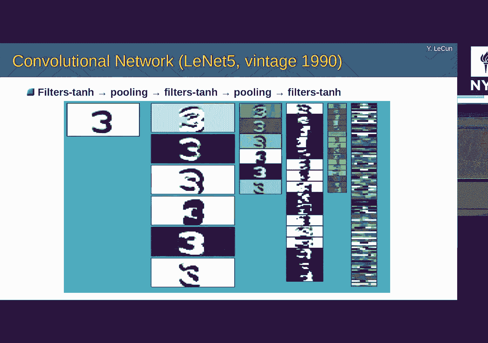

这就是我，那时我大约你的年龄，也许比我大三十岁，这就是我，那时我大约你的年龄，也许比我大三十岁，这个视频和这是我在贝尔实验室工作时的电话号码，这个视频和这是我在贝尔实验室工作时的电话号码，工作了。

这是一个新的球衣号码，我按下了一个键，这是神经网络，工作了，这是一个新的球衣号码，我按下了一个键，这是神经网络，在带有特殊加速器卡的386 PC上运行，可以识别那些。

在带有特殊加速器卡的386 PC上运行，可以识别那些，角色运行的人与我刚刚向您展示的人非常相似的人，角色运行的人与我刚刚向您展示的人非常相似的人，这件事的动画，您知道吗，可以识别任何样式的字符。

这件事的动画，您知道吗，可以识别任何样式的字符，包括非常奇怪的样式，甚至包括陌生人的样式，所以这是，包括非常奇怪的样式，甚至包括陌生人的样式，所以这是，当时有点新，因为当字符识别或，当时有点新。

因为当字符识别或，模式识别一般来说，我们仍处于提取模型中，模式识别一般来说，我们仍处于提取模型中，功能，然后我们将您的分类器放在顶部，这可能，功能，然后我们将您的分类器放在顶部，这可能。

基本训练整个过程，就像从头到尾学习整个任务一样，基本训练整个过程，就像从头到尾学习整个任务一样，基本上，该神经网络的前几层将扮演，基本上，该神经网络的前几层将扮演，一个特征提取器。

但它是根据数据进行训练的，因此我们使用，一个特征提取器，但它是根据数据进行训练的，因此我们使用，字符识别是因为这不是唯一的原因，字符识别是因为这不是唯一的原因，我们有数据唯一有足够数据的测试是。

我们有数据唯一有足够数据的测试是，语音识别的字符识别语音识别，语音识别的字符识别语音识别，实验取得了一些成功，但并没有很快实现，实验取得了一些成功，但并没有很快实现，我们可以使用那些条件网。

而不仅仅是识别单个字符，我们可以使用那些条件网，而不仅仅是识别单个字符，但可以算作一组字符，因此一次可以有多个字符，但可以算作一组字符，因此一次可以有多个字符，因为网络的这种条件性质，我将回到。

因为网络的这种条件性质，我将回到，在三个基本上允许您使用这些系统的讲座中，在三个基本上允许您使用这些系统的讲座中，应用于大图像，然后他们将打开他们看到的任何图像，应用于大图像。

然后他们将打开他们看到的任何图像，他们的视野，无论他们看到什么形状，都无法识别，他们的视野，无论他们看到什么形状，都无法识别，基本上，如果您有大图像，则可以训练它来自一个，基本上，如果您有大图像。

则可以训练它来自一个，小输入窗口，然后在整个图像上滑动，小输入窗口，然后在整个图像上滑动，它的意思是检测到您训练它检测到的物体，因此在这里，它的意思是检测到您训练它检测到的物体，因此在这里。

您知道的系统能够同时进行分割和，您知道的系统能够同时进行分割和，识别，您早就知道模式识别人员会，识别，您早就知道模式识别人员会，有一个明确的程序可以将单个对象与其，有一个明确的程序可以将单个对象与其。

然后彼此发送背景，然后发送每个单独的对象角色，然后彼此发送背景，然后发送每个单独的对象角色，例如识别器，但是您可以同时在，例如识别器，但是您可以同时在，同时您知道自己是否非常有效，就不必建立新的特殊。

同时您知道自己是否非常有效，就不必建立新的特殊，为其编程，因此尤其可以应用于事物的自然图像。

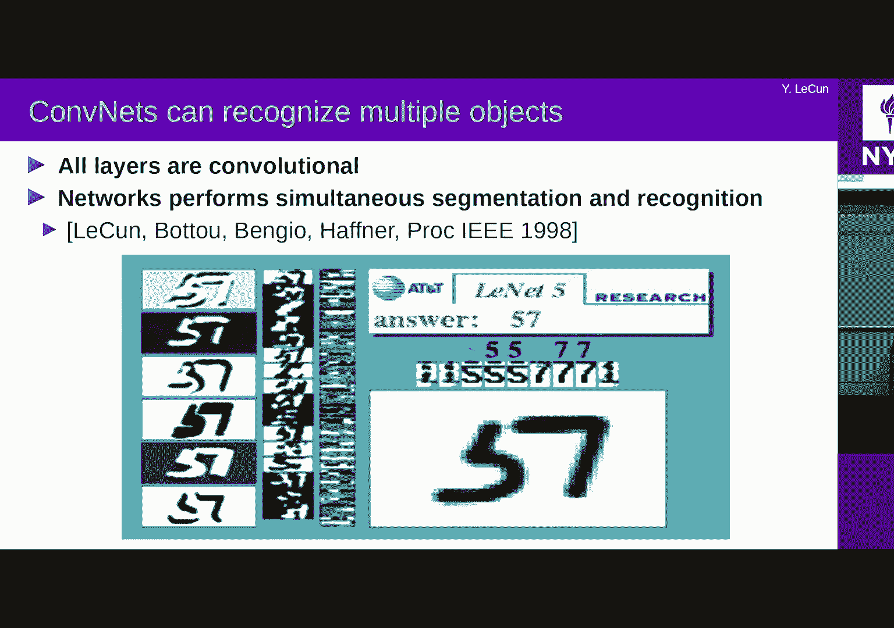

为其编程，因此尤其可以应用于事物的自然图像，像人脸相位检测，行人检测一样，像人脸相位检测，行人检测一样，正确的做法是训练一个商业网络来区分图像，正确的做法是训练一个商业网络来区分图像，你有一张脸和个人。

你没有一张脸，你有一张脸和个人，你没有一张脸，加入数千个示例，然后进入该窗口，加入数千个示例，然后进入该窗口，只要打开它，就在图像上滑动它，当然会有一张脸，只要打开它，就在图像上滑动它，当然会有一张脸。

可能比窗口大，所以您设置样本图像使其变小，可能比窗口大，所以您设置样本图像使其变小，然后再次滑动您的网络，然后再次缩小网络，然后再次滑动您的网络，然后再次缩小网络，再次联网，现在您可以检测脸部。

无论大小如何，再次联网，现在您可以检测脸部，无论大小如何，特别是您可以使用它来驱动机器人，所以这已经完成了，特别是您可以使用它来驱动机器人，所以这已经完成了，在深度跑步之前很流行，所以这是一个例子。

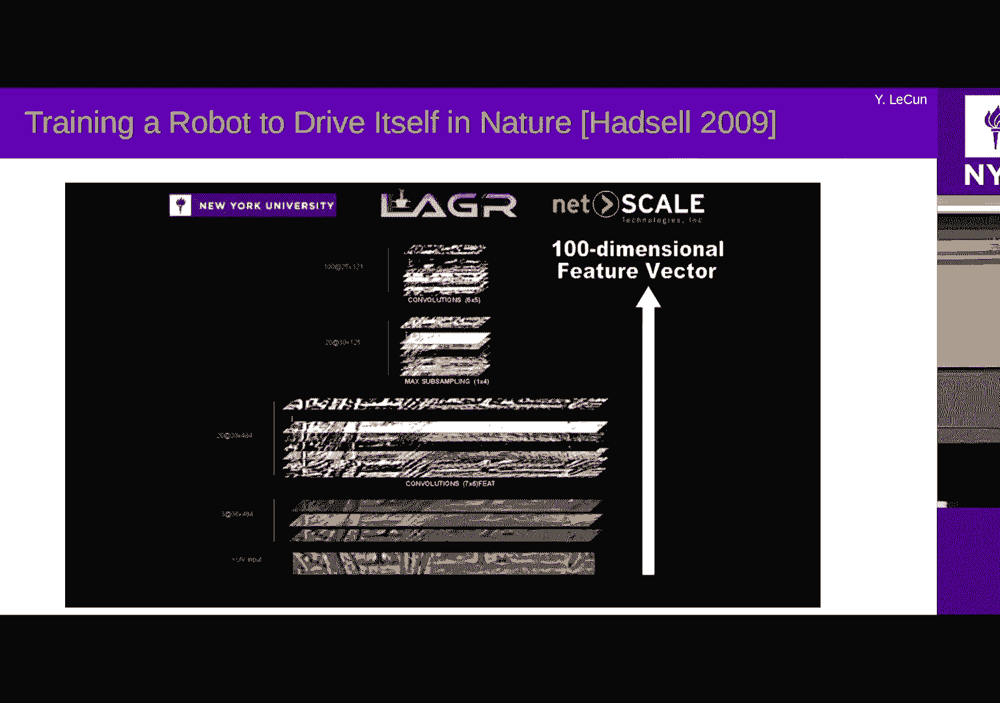

在深度跑步之前很流行，所以这是一个例子，网络是一个商业网络，它应用于来自。

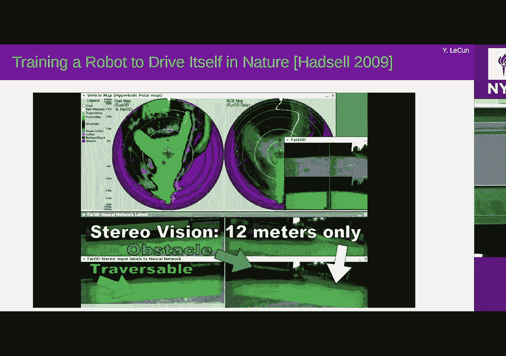

网络是一个商业网络，它应用于来自，一个你知道正在运行的机器人的相机，它正在尝试，一个你知道正在运行的机器人的相机，它正在尝试。

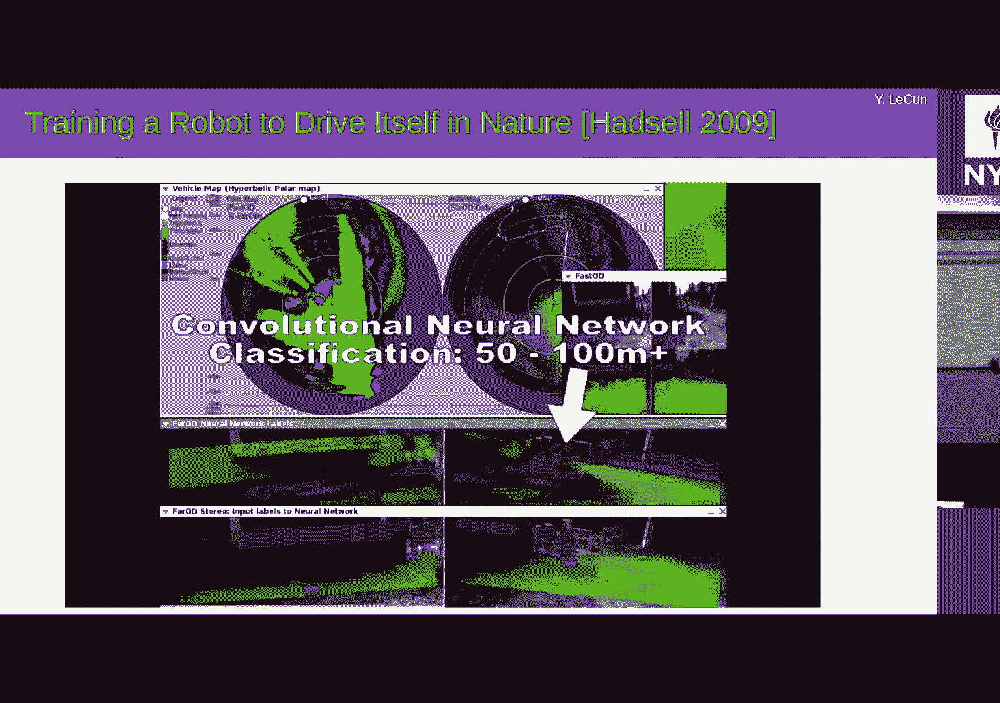

对小窗口（例如40 x 40像素左右）的每个窗口进行分类，对小窗口（例如40 x 40像素左右）的每个窗口进行分类。

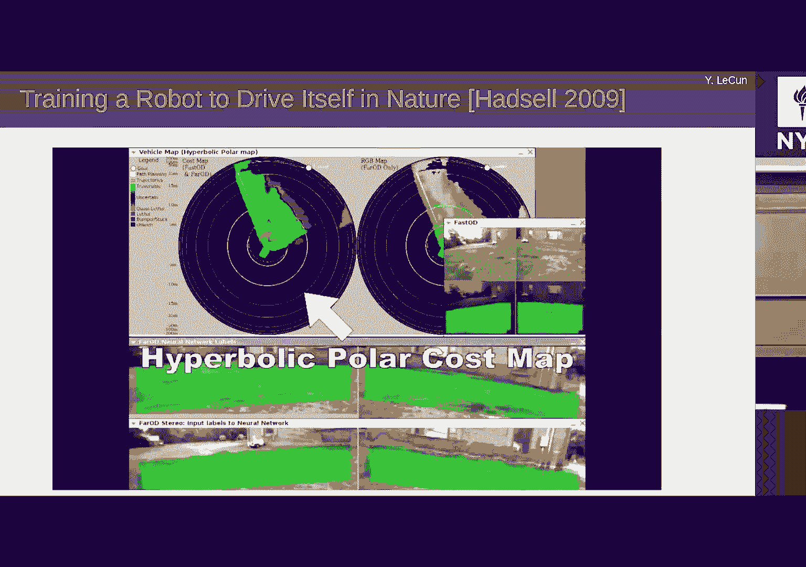

关于该窗口中的中心像素是否在地面上很高兴，关于该窗口中的中心像素是否在地面上很高兴，还是障碍物，所以无论分类为地面上的，还是障碍物，所以无论分类为地面上的。

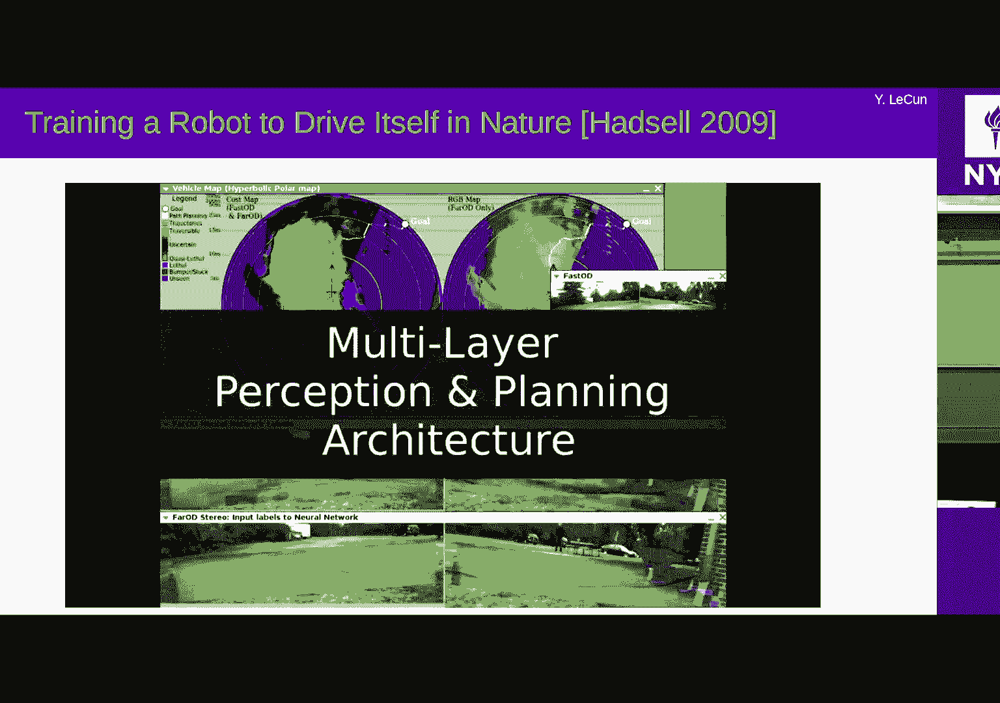

绿色如果它位于障碍物上，则归为障碍物的颜色为红色或紫色，绿色如果它位于障碍物上，则归为障碍物的颜色为红色或紫色，脚的障碍物，您可以将其映射到您看到的地图上，脚的障碍物，您可以将其映射到您看到的地图上。

在顶部，然后在此地图中进行规划以达到特定目标，然后，在顶部，然后在此地图中进行规划以达到特定目标，然后。

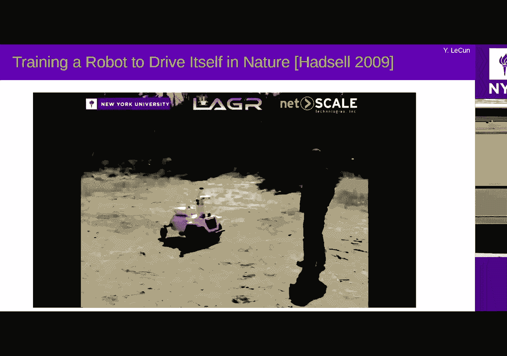

用这个来导航，所以这是两位前博士生。

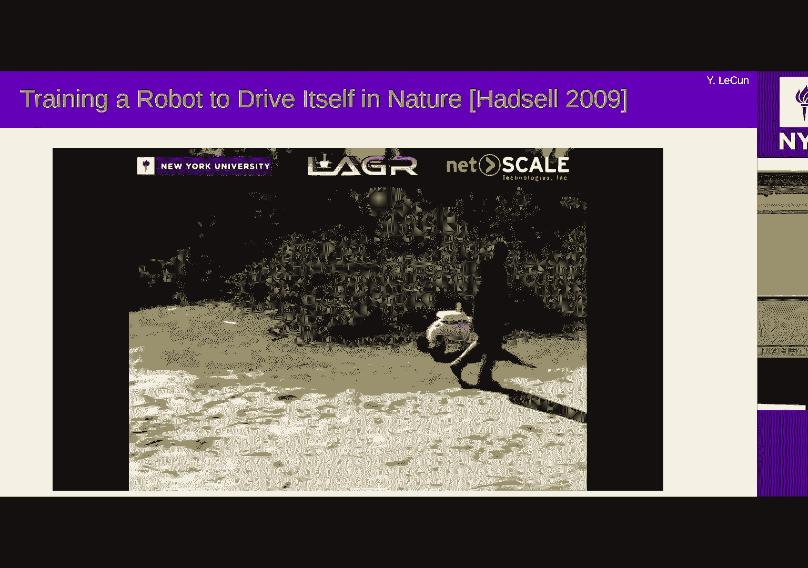

用这个来导航，所以这是两位前博士生，右边混乱的并购，或者讨厌这个可怜的机器人，右边混乱的并购，或者讨厌这个可怜的机器人，确信机器人不会摔断腿，因为他们实际上写了，确信机器人不会摔断腿。

因为他们实际上写了，编码并对其进行了培训Pierce M＆A是Google Brain的研究科学家。

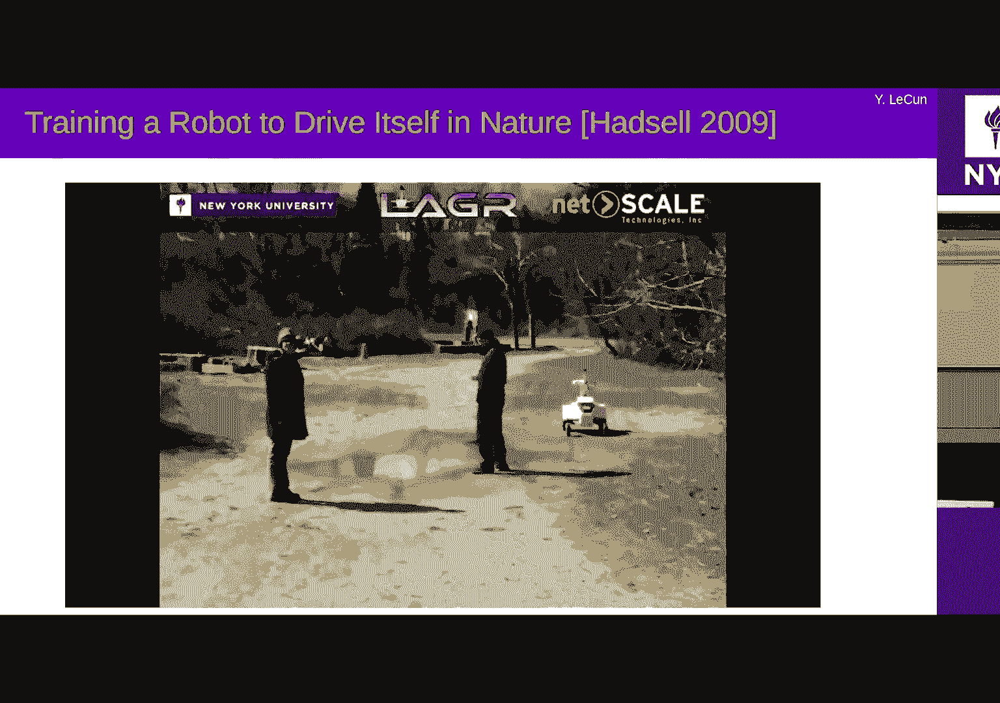

编码并对其进行了培训Pierce M＆A是Google Brain的研究科学家，加州从事机器人技术的直接销售是机器人研究负责人，加州从事机器人技术的直接销售是机器人研究负责人。

机器人研究总监我确实发现它们做得很好，所以类似的想法，机器人研究总监我确实发现它们做得很好，所以类似的想法。

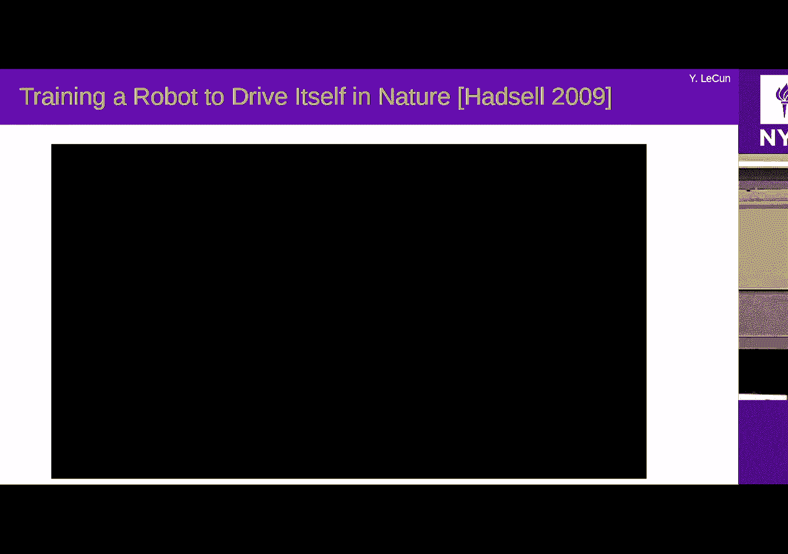

可以用于所谓的语义分割，所以语义分割是，可以用于所谓的语义分割，所以语义分割是，您可以再次使用这种滑动窗口方法的想法，您可以再次使用这种滑动窗口方法的想法，训练商业网以使用窗口作为。

训练商业网以使用窗口作为。

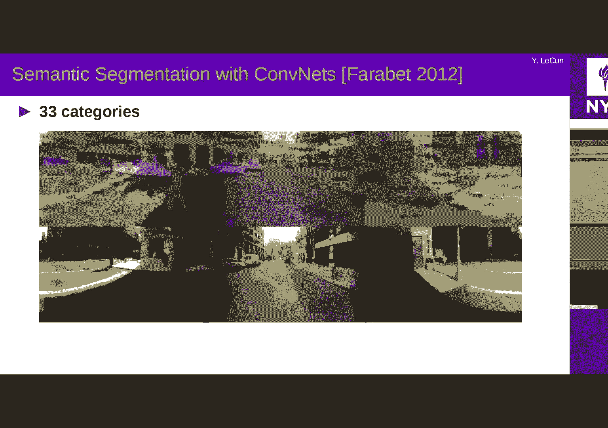

上下文，但在这里不仅仅是尝试对障碍进行分类工头障碍是。

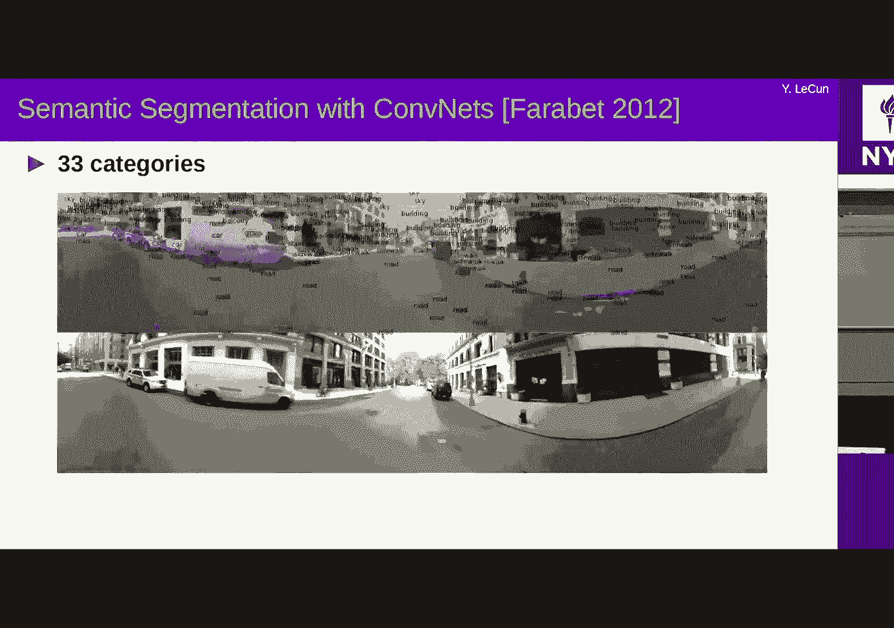

上下文，但在这里不仅仅是尝试对障碍进行分类工头障碍是，试图将类似30个类别的东西分类，试图将类似30个类别的东西分类，华盛顿的地方，我认为这是华盛顿广场公园，你知道吗，华盛顿的地方。

我认为这是华盛顿广场公园，你知道吗，它了解道路，人，植物和树木等，它了解道路，人，植物和树木等，发现您知道华盛顿广场公园中部的沙漠不是，发现您知道华盛顿广场公园中部的沙漠不是，没有我知道的海滩。

所以当时它并不完美，没有我知道的海滩，所以当时它并不完美，最先进的系统，尽管这样做是最好的，最先进的系统，尽管这样做是最好的，我四处奔波进行语义分割，例如尝试，我四处奔波进行语义分割，例如尝试。

向人们传福音要深入开展工作，那是在2010年左右，所以在此之前，向人们传福音要深入开展工作，那是在2010年左右，所以在此之前，那种深刻的革命，当一位教授从，那种深刻的革命，当一位教授从。

以色列坐在我的演讲中，他是理论家，但是，以色列坐在我的演讲中，他是理论家，但是，确实被这种潜在的应用所打动，他，确实被这种潜在的应用所打动，他，刚要休假并为一家名为Mobileye的公司工作。

刚要休假并为一家名为Mobileye的公司工作，是当时在以色列的一家初创公司，从事自动驾驶工作，是当时在以色列的一家初创公司，从事自动驾驶工作，他听到我的讲话几个月后，他开始在mobileiron工作。

他听到我的讲话几个月后，他开始在mobileiron工作，完全移动，我知道你应该尝试在其他方面完成此任务，完全移动，我知道你应该尝试在其他方面完成此任务，这真的很好，工程师们会说是的，不，我们不相信。

这真的很好，工程师们会说是的，不，我们不相信，那东西我们是一种方法，所以他树他实现了它并亲自尝试了，那东西我们是一种方法，所以他树他实现了它并亲自尝试了，从他们拥有的所有基准中击败地狱，突然之间整个。

从他们拥有的所有基准中击败地狱，突然之间整个，公司改用商务夜，他们是第一家公司，公司改用商务夜，他们是第一家公司，真正地为汽车设计了视觉系统，您可以将其保持在，真正地为汽车设计了视觉系统。

您可以将其保持在，高速公路，如果有行人或骑自行车的人可能会摔断，高速公路，如果有行人或骑自行车的人可能会摔断，过一会儿，我会回到这个问题上，他们基本上是使用这个，过一会儿，我会回到这个问题上。

他们基本上是使用这个，技术语义分割与我为，技术语义分割与我为，下雪之前的机器人这是一个向左害羞的人，下雪之前的机器人这是一个向左害羞的人，还必须意识到一个事实，那就是80年代的人们。

还必须意识到一个事实，那就是80年代的人们，有兴趣使用某种方式来实现特殊类型的硬件，有兴趣使用某种方式来实现特殊类型的硬件，可以非常快地在边缘运行，这些只是其中的一些示例，可以非常快地在边缘运行。

这些只是其中的一些示例，实际上已经实现的神经网络芯片，我与，实际上已经实现的神经网络芯片，我与，它们，但它们是由与我一样的小组成员实施的，它们，但它们是由与我一样的小组成员实施的。

在新泽西州的贝尔实验室，所以这在1980年代是一个热门话题，在新泽西州的贝尔实验室，所以这在1980年代是一个热门话题，那么当然，有趣的是，您将死在，那么当然，有趣的是，您将死在，90年代中期。

人们不再对此进行研究，直到几年前，90年代中期，人们不再对此进行研究，直到几年前，神经网络加速器是船舶行业芯片设计中最热门的话题，神经网络加速器是船舶行业芯片设计中最热门的话题。

您可以参加任何有关计算机体系结构的会议，您知道芯片像秒，您可以参加任何有关计算机体系结构的会议，您知道芯片像秒，这是大型固态电路会议的一半，这是大型固态电路会议的一半，关于神经网络加速器，我致力于。

关于神经网络加速器，我致力于，这些事情还可以，所以当我发生了一些事情，这些事情还可以，所以当我发生了一些事情，告诉您2010 13 15左右语音识别中的图像识别自然。

告诉您2010 13 15左右语音识别中的图像识别自然，语言处理，而且现在还在继续，我们现在处于中间，语言处理，而且现在还在继续，我们现在处于中间，其他主题和所发生的事情，我很伤心地说这没有发生过。

其他主题和所发生的事情，我很伤心地说这没有发生过，在我的实验室中，但与我们的朋友一起，我们从yoshua bengio和geoff开始，在我的实验室中，但与我们的朋友一起。

我们从yoshua bengio和geoff开始，早在2000年初，我们就知道你知道那深深的罗妮，早在2000年初，我们就知道你知道那深深的罗妮，工作真的很好，我们知道整个社区，工作真的很好。

我们知道整个社区，通过解雇神经网络犯了一个错误，他褐变，所以我们没有，通过解雇神经网络犯了一个错误，他褐变，所以我们没有，使用“深度学习”一词，但几年后我们发明了它，使用“深度学习”一词。

但几年后我们发明了它，2003年左右或2004年，如果您希望我们聚在一起，我们便开始了一场阴谋，2003年左右或2004年，如果您希望我们聚在一起，我们便开始了一场阴谋。

我们说我们只是要尝试击败一些记录和一些数据，我们说我们只是要尝试击败一些记录和一些数据，设置了新的一些新算法，而不必总是训练非常大的算法，设置了新的一些新算法，而不必总是训练非常大的算法，神经网络。

这样将并将收集非常庞大的数据集，神经网络，这样将并将收集非常庞大的数据集，将向世界展示这些东西确实有效，将向世界展示这些东西确实有效，因为没有人真正相信它，而且那种成功超越或，因为没有人真正相信它。

而且那种成功超越或，或最狂野的梦，尤其是在2012年，杰夫·塞顿（Geoff Tipon）在杰克（xq Jeske）有一个学生，或最狂野的梦，尤其是在2012年。

杰夫·塞顿（Geoff Tipon）在杰克（xq Jeske）有一个学生，他花了很多时间在GPU上实施完备网络，他花了很多时间在GPU上实施完备网络，当时他们不是意大利人，但他们开始成为。

当时他们不是意大利人，但他们开始成为，真正的高性能，所以非常擅长于黑客攻击，真正的高性能，所以非常擅长于黑客攻击，然后他们就可以训练更大的神经网络，然后他们就可以训练更大的神经网络。

任何人以前都可以做的共同官方网络，所以他们用它来训练，任何人以前都可以做的共同官方网络，所以他们用它来训练，数据表示图像上的数据集是一堆自然的图像，数据表示图像上的数据集是一堆自然的图像，照片。

系统应该能够识别照片中的主要对象，照片，系统应该能够识别照片中的主要对象，在1000个不同类别中，训练集有130万个样本，在1000个不同类别中，训练集有130万个样本，这很大。

所以他们所做的就是建造了这个非常大的，这很大，所以他们所做的就是建造了这个非常大的，非常深的完井网几乎与我们以前使用的模型相同，非常深的完井网几乎与我们以前使用的模型相同。

在GPU上实现并运行了几个星期，在GPU上实现并运行了几个星期，因此，它们在很大程度上击败了最佳竞争系统的性能，因此，它们在很大程度上击败了最佳竞争系统的性能，利润率。

所以这是图像网的错误率可以追溯到2010年，所以2010年，利润率，所以这是图像网的错误率可以追溯到2010年，所以2010年，大约前5位错误的发生率为28％，因此，如果。

大约前5位错误的发生率为28％，因此，如果，正确的类别不在1000好的前五名中，所以有点像，正确的类别不在1000好的前五名中，所以有点像，2011年的错误度量是系统的百分之二十五点八。

2011年的错误度量是系统的百分之二十五点八，能够做到这一点实际上非常大，有点，能够做到这一点实际上非常大，有点，有条件的网络，但是没有经过训练，我的意思是只有最后一层是，有条件的网络。

但是没有经过训练，我的意思是只有最后一层是，经过训练，然后Jeff和他的团队将其降低到16％的百分之四，经过训练，然后Jeff和他的团队将其降低到16％的百分之四，然后这是计算机视觉社区的分水岭。

然后这是计算机视觉社区的分水岭，人们说，好的，你知道了，现在我们知道这件事是可行的，整个，人们说，好的，你知道了，现在我们知道这件事是可行的，整个，社区从基本上拒绝每篇包含神经网络的论文开始。

社区从基本上拒绝每篇包含神经网络的论文开始，在2011年和2012年拒绝所有无条件引爆的论文，在2011年和2012年拒绝所有无条件引爆的论文，在2016年，所以现在是新的宗教权利。

您的计算机无法获取论文，在2016年，所以现在是新的宗教权利，您的计算机无法获取论文，视觉会议，除非您以某种方式使用普通的眼睛并且错误率下降了，视觉会议，除非您以某种方式使用普通的眼睛并且错误率下降了。

很快就下来，你知道人们发现各种各样的非常可爱，很快就下来，你知道人们发现各种各样的非常可爱，使这些事情更好地工作的建筑技巧以及您想要的，使这些事情更好地工作的建筑技巧以及您想要的，看到里面有层数的膨胀。

所以我的，看到里面有层数的膨胀，所以我的，从20世纪90年代开始的90年代的有条件网有大约7层，从20世纪90年代开始的90年代的有条件网有大约7层，然后我不知道下一个网12年后的vgg。

然后我不知道下一个网12年后的vgg，在19岁的Google安妮特（Annette）时我不知道有多少，因为如果去，在19岁的Google安妮特（Annette）时我不知道有多少，因为如果去，您数了一下。

然后对象识别的主力军成为了标准骨干，您数了一下，然后对象识别的主力军成为了标准骨干，人们将其称为50层，它称为ResNet 50，但您知道一些，人们将其称为50层，它称为ResNet 50。

但您知道一些，有些网络有100层左右，所以我会在几年前尝试，有些网络有100层左右，所以我会在几年前尝试，这张图表一起显示了每个斑点在哪里，这张图表一起显示了每个斑点在哪里。

网络架构和X轴就是您进行数十亿次操作的次数，网络架构和X轴就是您进行数十亿次操作的次数，需要做计算输出，好吧，这些东西真的很大，需要做计算输出，好吧，这些东西真的很大。

y轴的连接是imagenet上精度最高的一个，因此不是，y轴的连接是imagenet上精度最高的一个，因此不是，与我之前向您展示的性能指标相同，因此是最好的系统，与我之前向您展示的性能指标相同。

因此是最好的系统，今天大约是84，而Blob的大小就是内存占用率，因此，今天大约是84，而Blob的大小就是内存占用率，因此，您需要存储以存储重量的数以百万计的浮子数。

您需要存储以存储重量的数以百万计的浮子数，现在的体重值人们非常聪明地压缩这些东西，现在的体重值人们非常聪明地压缩这些东西，就像您知道如何量化他们以及Google Facebook和。

就像您知道如何量化他们以及Google Facebook和，其他各种只能优化这些网络的地方，其他各种只能优化这些网络的地方，压缩东西以便它们可以快速运行，因为给您一个粗略的印象。

压缩东西以便它们可以快速运行，因为给您一个粗略的印象，例如，可以想像Facebook在其上完成的运行次数，例如，可以想像Facebook在其上完成的运行次数，每天有几百亿台服务器，所以有一个巨大的。

每天有几百亿台服务器，所以有一个巨大的，鼓励优化为此所需的计算量，因此当，鼓励优化为此所需的计算量，因此当。

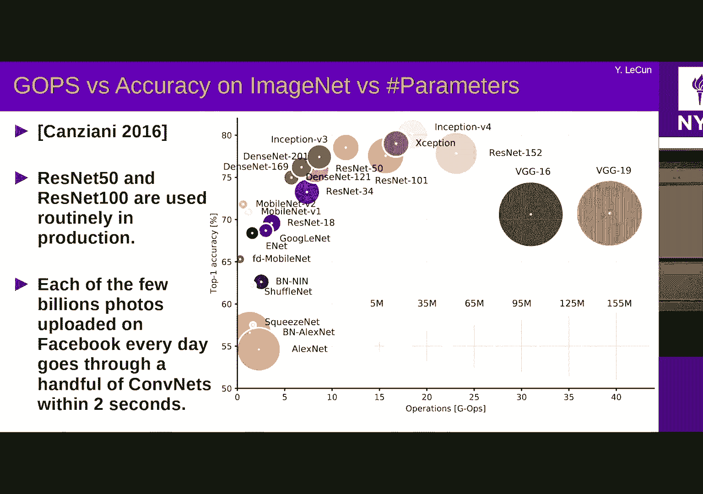

有条件网络之所以如此成功的原因之一是，它们利用了。

有条件网络之所以如此成功的原因之一是，它们利用了，自然数据的属性是组合性，因此组合性是，自然数据的属性是组合性，因此组合性是，C由对象组成的属性对象由部分组成，C由对象组成的属性对象由部分组成。

零件由子零件组成子零件实际上是图案的组合，零件由子零件组成子零件实际上是图案的组合，和图案是轮廓或右边缘或纹理的组合，这些是，和图案是轮廓或右边缘或纹理的组合，这些是，只是像素的组合还可以。

所以所谓的合成，只是像素的组合还可以，所以所谓的合成，您知道的密钥，特别是一层中的对象的佣金，您知道的密钥，特别是一层中的对象的佣金，下一层的层次结构表单对象，因此如果可以省略。

下一层的层次结构表单对象，因此如果可以省略，网络体系结构中的层次结构组成，您可以，网络体系结构中的层次结构组成，您可以，它会在您知道的一层上学习适当的功能组合，它会在您知道的一层上学习适当的功能组合。

下一步的功能是真正的深度运行，下一步的功能是真正的深度运行，学习代表世界并利用世界的结构，学习代表世界并利用世界的结构，世界上存在组织的事实是，世界上存在组织的事实是。

世界是由布朗的管家守护程序的名字组成的一个电台，世界是由布朗的管家守护程序的名字组成的一个电台，大学说，所以他有点像爱因斯坦的名言，大学说，所以他有点像爱因斯坦的名言，爱因斯坦说。

关于世界最不可理解的是，世界，爱因斯坦说，关于世界最不可理解的是，世界，就像世界上所有复杂的事物中一样容易理解，就像世界上所有复杂的事物中一样容易理解，知道世界可能非常复杂，以至于我们拥有。

知道世界可能非常复杂，以至于我们拥有，无法理解它，这看起来像是我们能够进行的阴谋，无法理解它，这看起来像是我们能够进行的阴谋，至少了解世界的一部分。

所以斯图尔特·盖曼（Stewart Gaiman）的恶魔版，至少了解世界的一部分，所以斯图尔特·盖曼（Stewart Gaiman）的恶魔版，这是世界是组成的或有上帝，因为你需要。

这是世界是组成的或有上帝，因为你需要，如果世界不存在，就能够理解它的超自然事物，如果世界不存在，就能够理解它的超自然事物，合成的，所以导致了诸如此类的不可思议的进步，合成的。

所以导致了诸如此类的不可思议的进步，如您所知，计算机视觉能够可靠地实现，如您所知，计算机视觉能够可靠地实现，您知道技术人员能够为每个对象生成蒙版，您知道技术人员能够为每个对象生成蒙版，精确的口罩。

然后甚至找出姿势，然后进行实际操作，精确的口罩，然后甚至找出姿势，然后进行实际操作，在移动平台上的时间，您知道我的意思是进度已经，在移动平台上的时间，您知道我的意思是进度已经，一切都令人难以置信。

其中大多数都是基于，一切都令人难以置信，其中大多数都是基于，两种基本的体系结构家族，即所谓的“单程对象”，两种基本的体系结构家族，即所谓的“单程对象”，检测识别架构，称为视网膜网特征金字塔。

检测识别架构，称为视网膜网特征金字塔，网络有各种各样的名称，所以您可以网，然后是另一种类型的面具，网络有各种各样的名称，所以您可以网，然后是另一种类型的面具，他们都是CNN的真实来源吗。

他们都是CNN的真实来源吗，Facebook或起源于他们的人是，Facebook或起源于他们的人是。

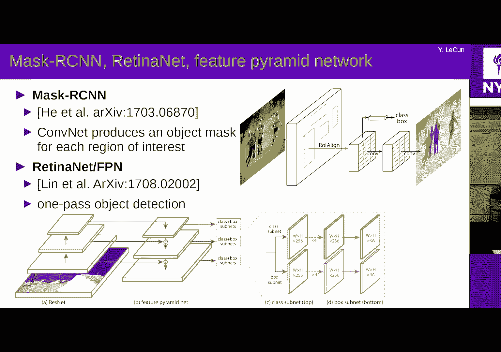

现在在Facebook上，他们有时会在来到Facebook之前就想到了这一点，但是，现在在Facebook上，他们有时会在来到Facebook之前就想到了这一点，但是，你知道那些事情真的很好。

你知道他们可以做类似的事情，你知道那些事情真的很好，你知道他们可以做类似的事情，检测部分被遮挡的物体，然后您会画出一个遮罩，检测部分被遮挡的物体，然后您会画出一个遮罩，每个对象基本上就是我们的神经元。

其复杂之处在于，每个对象基本上就是我们的神经元，其复杂之处在于，输入是图像，但输出也是图像，实际上输出是一个整体，输入是图像，但输出也是图像，实际上输出是一个整体，一束图像，每个类别一个，对于每个类别。

我将，一束图像，每个类别一个，对于每个类别，我将，该类别的对象也可以执行即时操作，该类别的对象也可以执行即时操作，细分，因此，如果您有一堆形状，它可以告诉您您知道，细分，因此，如果您有一堆形状。

它可以告诉您您知道，不仅是这个地区便宜，而且他们实际上挑出了个人，不仅是这个地区便宜，而且他们实际上挑出了个人，形状，将它们分开，它将正确计算床单并掉落，形状，将它们分开，它将正确计算床单并掉落。

睡着了，这就是你应该做的，一旦你入睡，你就会数芯片，睡着了，这就是你应该做的，一旦你入睡，你就会数芯片，对，深度学习的好处是，很多社区，对，深度学习的好处是，很多社区。

已经接受了必须公开进行研究的整个概念，因此，已经接受了必须公开进行研究的整个概念，因此，您可能会知道的很多我们将要谈论的东西，您可能会知道的很多我们将要谈论的东西，该类不仅是发布的。

而且您知道用代码发布的是，该类不仅是发布的，而且您知道用代码发布的是，不只是编码，它实际上是经过预先训练的模型，您可以下载并，不只是编码，它实际上是经过预先训练的模型，您可以下载并。

运行所有开放源代码或免费使用，所以这是真的，我是说人们没有，运行所有开放源代码或免费使用，所以这是真的，我是说人们没有，用于以这种方式进行研究，特别是在工业界，甚至在学术界人士，用于以这种方式进行研究。

特别是在工业界，甚至在学术界人士，不习惯用来分发代码，但是深度运行有点，不习惯用来分发代码，但是深度运行有点，某种程度上促使人们更加开放的种族，某种程度上促使人们更加开放的种族，研究。

所以我所说的所有这些都有很多应用，研究，所以我所说的所有这些都有很多应用，知道潜水艇这实际上是来自手机I和手机I的视频，知道潜水艇这实际上是来自手机I和手机I的视频，在此过程中。

很早就使用完成来自动驾驶，在此过程中，很早就使用完成来自动驾驶，指出在2015年，他们设法成功完成了芯片上的网络，指出在2015年，他们设法成功完成了芯片上的网络，他们为其他目的而设计的产品，并出售了。

他们为其他目的而设计的产品，并出售了，特斯拉技术或第一个自动驾驶特斯拉技术的开始，特斯拉技术或第一个自动驾驶特斯拉技术的开始，在没有驾驶协助的情况下驾驶或释放毒品，在没有驾驶协助的情况下驾驶或释放毒品。

在高速公路和变更车道上排队，在高速公路和变更车道上排队，系统，那很酷，所以要有一点条件，系统，那很酷，所以要有一点条件，您知道的筹码就在它的后面，它向外看，并且在，您知道的筹码就在它的后面，它向外看。

并且在，从那以后的后视镜，你知道四五年前，从那以后的后视镜，你知道四五年前，许多公司已经广泛采用了这种技术，许多公司已经广泛采用了这种技术，动员到现在，它已被英特尔收购，他们有70或80，动员到现在。

它已被英特尔收购，他们有70或80，这些视觉系统的市场份额，但有很多，这些视觉系统的市场份额，但有很多，那些实际上使用这些东西的公司和汽车制造商，那些实际上使用这些东西的公司和汽车制造商，在欧洲国家。

即使是低端汽车，每张卡都具有，在欧洲国家，即使是低端汽车，每张卡都具有，在基于该视觉系统的基础上完成的，在基于该视觉系统的基础上完成的，紧急类型的高级紧急制动系统或自动紧急状态。

紧急类型的高级紧急制动系统或自动紧急状态，制动系统EBS被部署在法国的每辆汽车中，例如，如果使用，制动系统EBS被部署在法国的每辆汽车中，例如，如果使用，大约有百分之四十的车祸，所以并不是每辆车上都有。

大约有百分之四十的车祸，所以并不是每辆车上都有，因为您知道人们会长时间保管汽车，但这意味着，因为您知道人们会长时间保管汽车，但这意味着，是它可以挽救生命，因此是深度跑步的非常积极的应用。

是它可以挽救生命，因此是深度跑步的非常积极的应用。

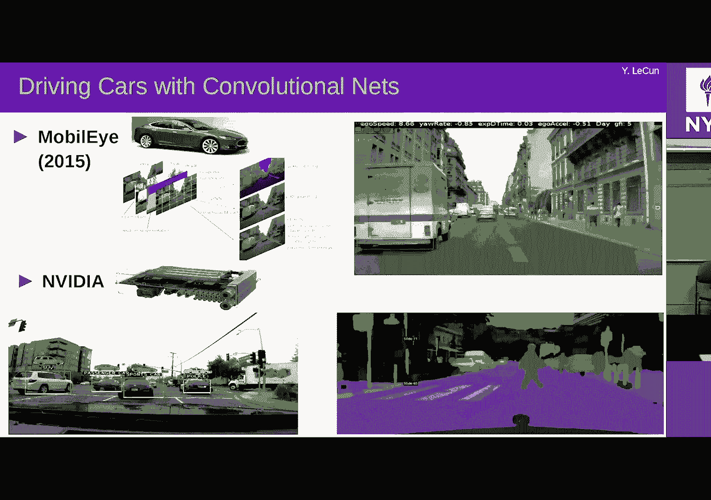

当然，另一大类应用是医学成像，所以这是，当然，另一大类应用是医学成像，所以这是，如今放射学中最难的话题是如何使用AI，如今放射学中最难的话题是如何使用AI，这意味着用于放射学的商业网是由。

这意味着用于放射学的商业网是由，我们在纽约大学的一些同事分析了MRI图像，因此有一个，我们在纽约大学的一些同事分析了MRI图像，因此有一个，商业网的最大优势在于，他们无需查看屏幕即可。

商业网的最大优势在于，他们无需查看屏幕即可，特别要看MRI，才能看他们不需要的MRI，特别要看MRI，才能看他们不需要的MRI，将其切成2d图像，他们可以查看整个3d值，这是一个属性，将其切成2d图像。

他们可以查看整个3d值，这是一个属性，这个东西使用的是一家公司，这是一个3d商业网络，这个东西使用的是一家公司，这是一个3d商业网络，MRI图像的整个体积，然后生成，您知道它使用了非常。

MRI图像的整个体积，然后生成，您知道它使用了非常，与我之前在对称分割中展示的技术类似，它，与我之前在对称分割中展示的技术类似，它，产生它基本上打开输出，产生它基本上打开输出，无论哪里有图片。

您都知道这里的股骨，但您知道它可以，无论哪里有图片，您都知道这里的股骨，但您知道它可以。

嗯，所以这是它产生的一种结果，它在3d中的效果比在3d中更好，嗯，所以这是它产生的一种结果，它在3d中的效果比在3d中更好。

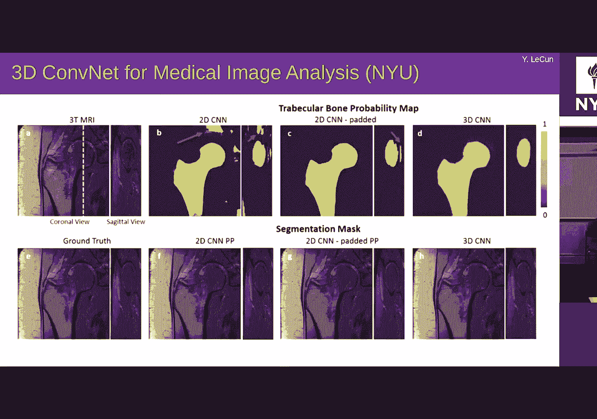

二维切片或您可以将其打开以在乳房X线照片中检测到恶性肿瘤，二维切片或您可以将其打开以在乳房X线照片中检测到恶性肿瘤，这是DES而不是3e，这您知道医学上的其他各种项目，这是DES而不是3e。

这您知道医学上的其他各种项目，成像技术在科学和物理学中可以很好地应用。

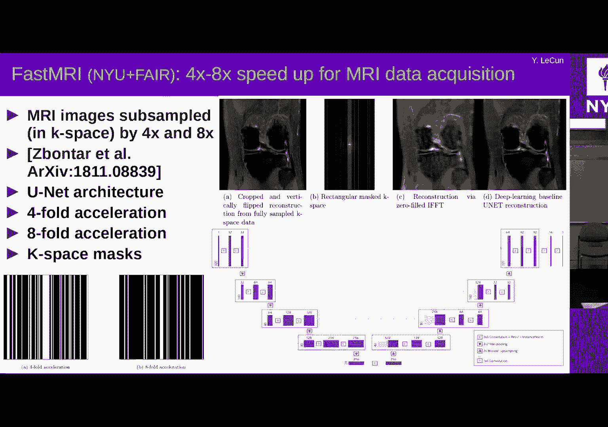

成像技术在科学和物理学中可以很好地应用，生物信息学，你知道我们将要回到的一切，所以这是，生物信息学，你知道我们将要回到的一切，所以这是，深度学习中的虚拟奥秘不是完全的奥秘，是因为。

深度学习中的虚拟奥秘不是完全的奥秘，是因为，人们有一个站在名单上方的人，但从某种意义上说，这是个谜，人们有一个站在名单上方的人，但从某种意义上说，这是个谜，我们对所有事物都没有很好的理论。

为什么它们如此出色，我们对所有事物都没有很好的理论，为什么它们如此出色，理论家多年前在我尝试时提出的一个大问题，理论家多年前在我尝试时提出的一个大问题，说服世界，向往深处是个好主意，他们会告诉。

说服世界，向往深处是个好主意，他们会告诉，我为什么只用两层就可以近似任何函数，我为什么只用两层就可以近似任何函数，更多，我将在稍后再讲到这有什么特别之处，更多，我将在稍后再讲到这有什么特别之处。

联合官方网，我谈到了自然图像或，联合官方网，我谈到了自然图像或，通常，自然数据也适用于语音和信号值，通常，自然数据也适用于语音和信号值，自然信号，但似乎有些人为地训练我们如何训练，自然信号。

但似乎有些人为地训练我们如何训练，尽管我们正在最小化的目标函数是，尽管我们正在最小化的目标函数是，非常不凸面，我们可能有很多局部最小值，这是一个很大的批评，非常不凸面，我们可能有很多局部最小值。

这是一个很大的批评，人们投掷神经网络的人从未玩过神经网络，人们投掷神经网络的人从未玩过神经网络，过去，网被扔掉神经网，就像你知道的那样，过去，网被扔掉神经网，就像你知道的那样，无法保证您的算法会收敛。

因为您知道它太可怕了，无法保证您的算法会收敛，因为您知道它太可怕了，我不会使用它，最后一个是为什么我们训练的方式，我不会使用它，最后一个是为什么我们训练的方式。

神经网络打破了统计学中每本教科书告诉您的一切，神经网络打破了统计学中每本教科书告诉您的一切，统计资料中的教科书会告诉您是否有n个数据点，统计资料中的教科书会告诉您是否有n个数据点，超过n个参数。

因为您将过度拟合，超过n个参数，因为您将过度拟合，你知道你可能会经常看眼睛，你可能会先洗手间，但是，你知道你可能会经常看眼睛，你可能会先洗手间，但是，是等效的，但是您拥有什么保证，并且神经网络正常。

是等效的，但是您拥有什么保证，并且神经网络正常，网络广泛私有化，我们用数亿亿美元来训练神经网络，网络广泛私有化，我们用数亿亿美元来训练神经网络，常规参数，他们正在使用生产和培训数量，常规参数。

他们正在使用生产和培训数量，样品距离那是如何工作的，但是可以正常工作，样品距离那是如何工作的，但是可以正常工作，所以我们今天可以和DP Ani一起做的事情，您知道我们可以拥有更安全的汽车。

所以我们今天可以和DP Ani一起做的事情，您知道我们可以拥有更安全的汽车，有更好的医学分析医学图像分析系统，我们可以拥有，有更好的医学分析医学图像分析系统，我们可以拥有，相当不错的语言翻译。

远非完美但有用的愚蠢聊天机器人，相当不错的语言翻译，远非完美但有用的愚蠢聊天机器人，您知道非常好的信息搜索，检索和过滤Google以及，您知道非常好的信息搜索，检索和过滤Google以及，如今。

Facebook完全是围绕您学习的深度学习构建的，如今，Facebook完全是围绕您学习的深度学习构建的，耗尽它们，它们崩溃了，您知道很多能源应用，耗尽它们，它们崩溃了，您知道很多能源应用。

管理与生产及各种物料制造环境，管理与生产及各种物料制造环境，保护，但我们没有真正没有的智能机器，保护，但我们没有真正没有的智能机器，具有常识的机器我们没有智能的个人助理我们没有。

具有常识的机器我们没有智能的个人助理我们没有，你知道智能聊天机器人吗，我们没有麻烦的机器人，你知道我的意思，你知道智能聊天机器人吗，我们没有麻烦的机器人，你知道我的意思。

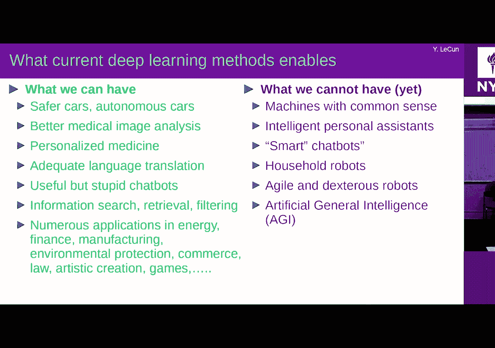

很多事情我们不知道如何正确做，这就是为什么我们仍然做，很多事情我们不知道如何正确做，这就是为什么我们仍然做，好的研究，那么深入的研究实际上是关于运行表示形式的，但是。

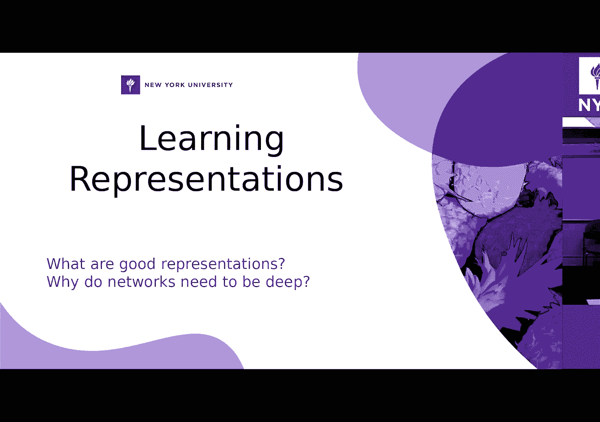

好的研究，那么深入的研究实际上是关于运行表示形式的，但是，我们应该事先知道我们所代表的是什么，我们应该事先知道我们所代表的是什么，模式识别模型的传统部分，但是，模式识别模型的传统部分，但是。

表示形式实际上是关于您知道您拥有原始数据并返回的，表示形式实际上是关于您知道您拥有原始数据并返回的，转化为某种有用的形式，理想情况下，您希望将其转化为，转化为某种有用的形式，理想情况下。

您希望将其转化为，有用的表格，无论您要做什么，都可以，有用的表格，无论您要做什么，都可以，一般的方式还可以，这还不是很清楚，但这至少意味着你，一般的方式还可以，这还不是很清楚，但这至少意味着你。

想要将其转换为对您正在执行的任务有用的表示形式，想要将其转换为对您正在执行的任务有用的表示形式，构想，在过去的几十年中，关于如何，在过去的几十年中，关于如何，对自然数据进行预处理，以便产生良好的。

对自然数据进行预处理，以便产生良好的，它，我将仔细阅读这份洗衣单的详细信息，但是，它，我将仔细阅读这份洗衣单的详细信息，但是，比如计算空间做随机投影，所以随机投影，比如计算空间做随机投影，所以随机投影。

实际上，您知道自己像一个会定期抬起头的怪物，实际上，您知道自己像一个会定期抬起头的怪物，就像每五年一次，每次他弹出时，您都必须在头上敲打它，就像每五年一次，每次他弹出时，您都必须在头上敲打它。

这就是感知器背后的想法，所以第一次失败，这就是感知器背后的想法，所以第一次失败，感知器是一层随机投影，这意味着您，感知器是一层随机投影，这意味着您，在投影中运行是一个随机矩阵，您知道它的输出较小。

在投影中运行是一个随机矩阵，您知道它的输出较小，尺寸和输入尺寸，在右端有某种非线性，尺寸和输入尺寸，在右端有某种非线性，因此，考虑具有非线性的单层神经网络，但权重为，因此，考虑具有非线性的单层神经网络。

但权重为，随机的，所以您可以将其视为随机的预测，并且很多人，随机的，所以您可以将其视为随机的预测，并且很多人，正在定期重新发现那个轮子，声称它很棒，正在定期重新发现那个轮子，声称它很棒。

因为您不必进行多层培训，所以我从，因为您不必进行多层培训，所以我从，感知器，然后你知道他在60年代回来，然后他回来了，感知器，然后你知道他在60年代回来，然后他回来了，再次在1980年代。

然后他又回来了，现在他回来了，那里有一个，再次在1980年代，然后他又回来了，现在他回来了，那里有一个，整个社区在亚洲大多数地区，因为它们需要分层神经网络，整个社区在亚洲大多数地区。

因为它们需要分层神经网络，第一层是随机的，他们称其为极限学习机，第一层是随机的，他们称其为极限学习机，这很荒谬，但是存在，它们不是极端的，我的意思是，这很荒谬，但是存在，它们不是极端的，我的意思是。

他们非常愚蠢，但是你知道。

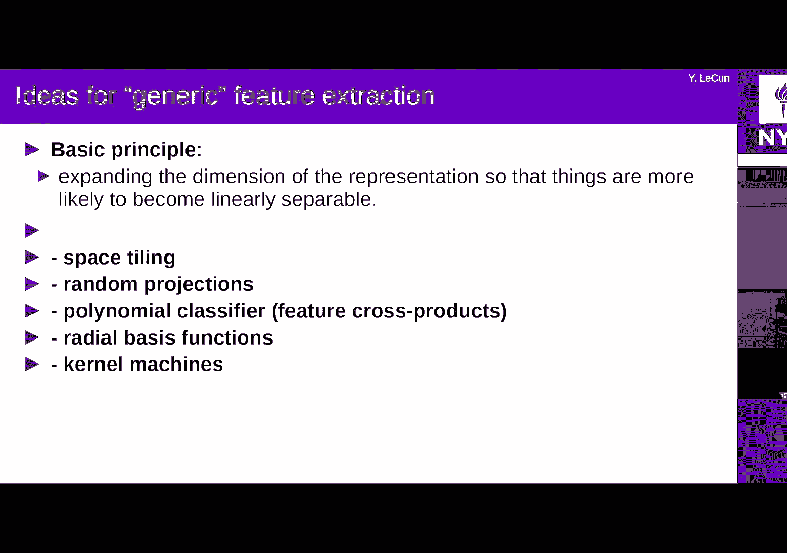

是的，所以我提到的是世界的组成性，是的，所以我提到的是世界的组成性。

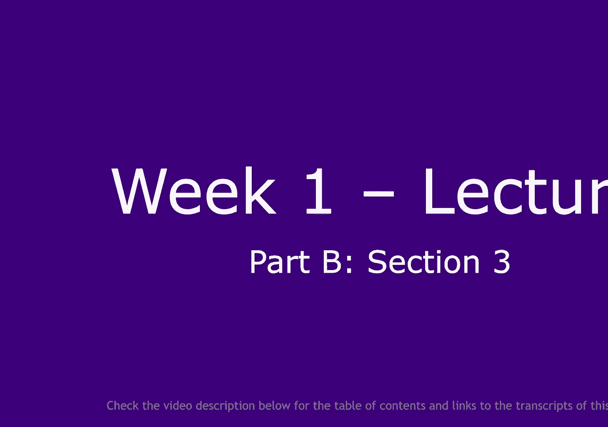

知道从像素到边缘再到图案上的文本，可以使您拥有文本中的对象，知道从像素到边缘再到图案上的文本，可以使您拥有文本中的对象，字符单词团体条款句子演讲故事，字符单词团体条款句子演讲故事，同样，您有单个样本。

您知道频谱带声音电话，同样，您有单个样本，您知道频谱带声音电话，音素词等你总是有这种心，音素词等你总是有这种心，好的，因此这里有很多尝试可以消除关于“深层”的整个想法，好的。

因此这里有很多尝试可以消除关于“深层”的整个想法，首先学习好第一件事，这就是事情，首先学习好第一件事，这就是事情，几十年来，我从大多数理论家那里听说过，但是很多人，几十年来，我从大多数理论家那里听说过。

但是很多人，而且您必须了解它们，因为它们将在五年后回归，而且您必须了解它们，因为它们将在五年后回归，当人们说我们的深切渴望糟透了为什么不使用超级虚拟机好吗。

当人们说我们的深切渴望糟透了为什么不使用超级虚拟机好吗，所以这里是超级向量机，这里左上方的支持向量机是，所以这里是超级向量机，这里左上方的支持向量机是，而且我敢肯定。

你们中的许多人已经听说过内核机器和超级虚拟机，而且我敢肯定，你们中的许多人已经听说过内核机器和超级虚拟机，知道这是什么的机器，即使这是一个大概的想法，知道这是什么的机器，即使这是一个大概的想法，好吧。

几只不知道它是什么超级战斗机但还不知道的人，好吧，几只不知道它是什么超级战斗机但还不知道的人，害羞，是的，我的意思是，如果您知道像大多数人还没有那样还可以，害羞，是的，我的意思是。

如果您知道像大多数人还没有那样还可以，举手要么可以一直挺酷的谁有，举手要么可以一直挺酷的谁有，不知道这是什么不要害羞没事吧，不知道这是什么不要害羞没事吧，好的，所以这是超级否决机支持向量机是两个，好的。

所以这是超级否决机支持向量机是两个，层神经网络并不是人们不喜欢的神经元，层神经网络并不是人们不喜欢的神经元，用这种方式制定，但实际上您可以这样想，它是两层的，用这种方式制定，但实际上您可以这样想。

它是两层的，神经网络，此处由该函数表示的第一层K，神经网络，此处由该函数表示的第一层K，第一个值中的每个单位将输入向量X与，第一个值中的每个单位将输入向量X与，训练样本X眼睛还好。

所以您拿训练样本就卖给您，训练样本X眼睛还好，所以您拿训练样本就卖给您，一千，所以你有一千个消费税，我等于一千，一千，所以你有一千个消费税，我等于一千，而且你有一些功能，kayla将会比较X和XI。

而且你有一些功能，kayla将会比较X和XI，比较两个函数的示例是您将X之间的点积，比较两个函数的示例是您将X之间的点积，和XI，您将结果通过指数减平方或，和XI，您将结果通过指数减平方或。

从而得到高斯响应，它是X之间的距离的函数，从而得到高斯响应，它是X之间的距离的函数，和XI好吧，这是比较两个向量的一种方法，无关紧要，和XI好吧，这是比较两个向量的一种方法，无关紧要。

然后您从K函数得出的分数进行比较，然后您从K函数得出的分数进行比较，输入每个样本，您可以计算出它们和您所要计算的加权和，输入每个样本，您可以计算出它们和您所要计算的加权和。

可以学习其他权重的alpha值，所以它是一个两层神经网络，可以学习其他权重的alpha值，所以它是一个两层神经网络，第二层是可训练的，第一个值是固定的，第二层是可训练的，第一个值是固定的，在某种程度上。

您可以认为第一层是在，在某种程度上，您可以认为第一层是在，无监督方式，因为它使用训练集中的数据，但仅，无监督方式，因为它使用训练集中的数据，但仅，使用X而不使用Y它以最愚蠢的方式使用数据。

使用X而不使用Y它以最愚蠢的方式使用数据，假设您存储了每个X并将每个X用作权重，假设您存储了每个X并将每个X用作权重，神经元，如果您想要的话，那就是超级激活的原因，您可以编写一个，神经元。

如果您想要的话，那就是超级激活的原因，您可以编写一个，一千本关于可爱数学背后的书籍，但最底层，一千本关于可爱数学背后的书籍，但最底层，线是两层神经网络，其中第一层训练非常，线是两层神经网络。

其中第一层训练非常，无监督的超级愚蠢方式，第二层只是线性分类器，无监督的超级愚蠢方式，第二层只是线性分类器，所以基本上是美化的平板电脑匹配，因为它基本上比较，所以基本上是美化的平板电脑匹配。

因为它基本上比较，所有训练样本的输入向量，所以它不起作用，所有训练样本的输入向量，所以它不起作用，如果您想做的那样，那么您知道计算机视觉中是否包含原始图像（如果X是图像），如果您想做的那样。

那么您知道计算机视觉中是否包含原始图像（如果X是图像），X眼首先是imagenet的一百万张图像，X眼首先是imagenet的一百万张图像，您将不得不将其与一百万张图像进行比较，或者如果可能的话。

则可能少一些，您将不得不将其与一百万张图像进行比较，或者如果可能的话，则可能少一些，你很聪明，如何训练，这将是非常昂贵和那种，你很聪明，如何训练，这将是非常昂贵和那种，比较而言，您所做的基本上是。

解决问题的最终方法是您将获得的加权和真的，解决问题的最终方法是您将获得的加权和真的，蛋糕上的樱桃我实际上经常使用类比，所以您可以近似，蛋糕上的樱桃我实际上经常使用类比，所以您可以近似。

你可以用荆棘表明你可以近似任何函数，你可以用荆棘表明你可以近似任何函数，您可以通过调整K函数和alpha来尽可能地接近自己，所以他，您可以通过调整K函数和alpha来尽可能地接近自己，所以他。

跟当局谈话，他们会告诉你为什么你需要深度学习，跟当局谈话，他们会告诉你为什么你需要深度学习，用内核机器近似我想要的任何功能，用内核机器近似我想要的任何功能，Sun可能很大。

没有人告诉您可以使用的内核功能，Sun可能很大，没有人告诉您可以使用的内核功能，使用和这样不能解决问题，您可以使用两层神经，使用和这样不能解决问题，您可以使用两层神经，可以，所以这是右上角。

第一层是非线性函数，可以，所以这是右上角，第一层是非线性函数，f通过输入矢量应用于u0矩阵的乘积，然后是第二个，f通过输入矢量应用于u0矩阵的乘积，然后是第二个，层乘以第二个矩阵，然后将其传递给另一个。

层乘以第二个矩阵，然后将其传递给另一个，非线性还可以，所以，非线性还可以，所以，再次进行两个线性和非线性运算，您可以证明，再次进行两个线性和非线性运算，您可以证明，条件。

您可以使用类似以下内容来近似所需的任何功能，条件，您可以使用类似以下内容来近似所需的任何功能，假设您在中间有足够大的向量，那么，假设您在中间有足够大的向量，那么，如果第一层可能足够高。

则来自第一层的尺寸，如果第一层可能足够高，则来自第一层的尺寸，无限，您可以根据需要接近任意函数，无限，您可以根据需要接近任意函数，通过使这一层达到无穷大，再一次与理论家交谈，他们。

通过使这一层达到无穷大，再一次与理论家交谈，他们，告诉你为什么需要图层我可以用两个来近似，告诉你为什么需要图层我可以用两个来近似，层，但有一个论点是这样做可能会非常非常昂贵，层。

但有一个论点是这样做可能会非常非常昂贵，分为两层，对于你们中的某些人来说，这听起来可能很熟悉，分为两层，对于你们中的某些人来说，这听起来可能很熟悉，可能不是，但是假设我想设计一个逻辑电路，那么当您。

可能不是，但是假设我想设计一个逻辑电路，那么当您，设计逻辑电路正好有n个门和/或门和/或与非门，设计逻辑电路正好有n个门和/或门和/或与非门，对，你可以用Nan来做所有的事情，对。

你可以用Nan来做所有的事情，右边的负数，如果可以显示任何布尔函数都可以，右边的负数，如果可以显示任何布尔函数都可以，写成一堆ORS在一堆你知道的一堆AND上，然后。

写成一堆ORS在一堆你知道的一堆AND上，然后，这种猩猩的类型，称为脱节范式DNF，这种猩猩的类型，称为脱节范式DNF，函数可以分为两层，问题在于大多数函数，函数可以分为两层，问题在于大多数函数。

您在中间需要的术语数量是，您在中间需要的术语数量是，输入，例如，如果我给你n位并要求您构建电路，输入，例如，如果我给你n位并要求您构建电路，告诉我输入字符串中的位数是否为偶数或。

告诉我输入字符串中的位数是否为偶数或，奇怪，这是一个简单的布尔函数，输出的数量为一或零，奇怪，这是一个简单的布尔函数，输出的数量为一或零，如果需要的话，所需的门实际上在中间是指数的，如果需要的话。

所需的门实际上在中间是指数的，如果您允许自己在log n层中进行操作，则分为两层，其中n是数字，如果您允许自己在log n层中进行操作，则分为两层，其中n是数字，输入位数，那么它是线性的。

所以您可以从指数复杂度转到，输入位数，那么它是线性的，所以您可以从指数复杂度转到，线性复杂度，如果您允许自己使用多个图层，就好像您，线性复杂度，如果您允许自己使用多个图层，就好像您，知道什么时候写程序。

我会告诉你编写程序的方式是只有两个顺序，我会告诉你编写程序的方式是只有两个顺序，运行程序所必需的步骤，因此基本上您的程序具有，运行程序所必需的步骤，因此基本上您的程序具有，您可以拥有两个连续的指令。

您可以运行尽可能多的指令，您可以拥有两个连续的指令，您可以运行尽可能多的指令，想要在您的程序中使用，但它们必须并行运行大多数，而您，想要在您的程序中使用，但它们必须并行运行大多数，而您。

只允许两个连续的步骤好，并且您所拥有的指示类型，只允许两个连续的步骤好，并且您所拥有的指示类型，就像您知道组合在一起是非线性的，就像您知道组合在一起是非线性的，简单的事情不像整个子程序。

所以对于大多数问题，简单的事情不像整个子程序，所以对于大多数问题，您必须在第一个中计算的中间值数量，您必须在第一个中计算的中间值数量，这将是输入大小的指数，只有很小的一部分，这将是输入大小的指数。

只有很小的一部分，您将能够解决的一些问题，您将能够解决的一些问题，实习生的指数数量，但如果您允许程序运行多个步骤，实习生的指数数量，但如果您允许程序运行多个步骤，然后突然之间。

您就会知道我们可以更简单地运行，然后突然之间，您就会知道我们可以更简单地运行，速度较慢，但​​所需的内存少得多，所需的东西少很多，速度较慢，但​​所需的内存少得多，所需的东西少很多，资源。

以便我们设计计算机的人们我们的孩子知道您可以设计的这项权利，资源，以便我们设计计算机的人们我们的孩子知道您可以设计的这项权利，例如，一个将两个二进制数相加的电路，例如，一个将两个二进制数相加的电路。

一种简单的方法是先将前两位，一种简单的方法是先将前两位，添加它们，然后在第二对第二位传播进位，添加它们，然后在第二对第二位传播进位，您知道进位的位数，这会给您第二位，您知道进位的位数，这会给您第二位。

结果然后携带，您知道传播携带，然后执行此操作，结果然后携带，您知道传播携带，然后执行此操作，顺序正确，所以问题在于这需要花费时间，顺序正确，所以问题在于这需要花费时间，与您要添加的其他数字的大小成正比。

与您要添加的其他数字的大小成正比，电路设计师有一种基本上可以预先计算进位的方法，电路设计师有一种基本上可以预先计算进位的方法，代码提前进行，因此所需的步骤数，代码提前进行，因此所需的步骤数。

做一个加法实际上不是n比它还好，但是那是，做一个加法实际上不是n比它还好，但是那是，以电路复杂性的巨大增加为代价，以电路复杂性的巨大增加为代价，就像芯片上的面积一样，就像芯片上的面积一样。

所以这种在时间和空间之间或在深度和与以及与种类之间的交换，所以这种在时间和空间之间或在深度和与以及与种类之间的交换，时间是已知的，所以我们称之为深度模型，所以您知道了两层神经元，时间是已知的。

所以我们称之为深度模型，所以您知道了两层神经元，当de在一个层中有一个时，即使从技术上讲，我也不会那么深，当de在一个层中有一个时，即使从技术上讲，我也不会那么深，使用背景。

但是您知道它并不真正地学习复杂，使用背景，但是您知道它并不真正地学习复杂，表示形式，这是日元的深度运行层次结构的想法，表示形式，这是日元的深度运行层次结构的想法，肯定在D下，除非您学习复杂的内核。

然后再学习其他内核，肯定在D下，除非您学习复杂的内核，然后再学习其他内核。

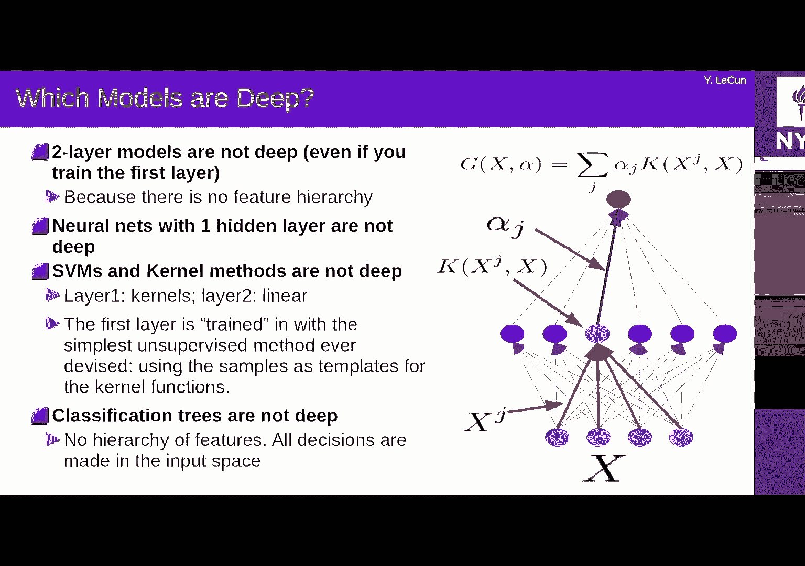

通用汽车公司了，那么什么是好的功能，哪些是好的代表，所以这里是。

通用汽车公司了，那么什么是好的功能，哪些是好的代表，所以这里是，我喜欢一个例子，有一个叫做流形假设的东西，我喜欢一个例子，有一个叫做流形假设的东西，自然数据的事实，因此，如果我和您一起为这个房间拍照。

自然数据的事实，因此，如果我和您一起为这个房间拍照，千像素分辨率的相机，在3倍分辨率下为100万像素，千像素分辨率的相机，在3倍分辨率下为100万像素。

留下的一百万个价值您可以将其视为具有三百万个向量的向量，留下的一百万个价值您可以将其视为具有三百万个向量的向量，具有300万个分量的所有可能向量中的分量，具有300万个分量的所有可能向量中的分量。

其中有多少对应于我们可以告诉我们的自然图像，其中有多少对应于我们可以告诉我们的自然图像，当我们看到图片是自然图像还是不存在模型时，当我们看到图片是自然图像还是不存在模型时，我们的视觉系统告诉我们。

这看起来像您的真实影像，我们的视觉系统告诉我们，这看起来像您的真实影像，我们可以分辨出不是这样的像素组合数量，我们可以分辨出不是这样的像素组合数量，实际上，我们会认为我们认为自然图像的东西很小，实际上。

我们会认为我们认为自然图像的东西很小，所有可能的图像集合中的一小部分一小部分，所有可能的图像集合中的一小部分一小部分，合并无意义图像中的随机像素，并且有合并的方法，合并无意义图像中的随机像素。

并且有合并的方法，像素变成看起来像自然图像的事物，所以流形部分是，像素变成看起来像自然图像的事物，所以流形部分是，这就是您所知道的事物对我们来说很自然，这就是您所知道的事物对我们来说很自然。

高维环境空间内的高维表面，它将，高维环境空间内的高维表面，它将，使自己信服的示例想象我拍了很多，使自己信服的示例想象我拍了很多，做鬼脸的人，所以这个人在，做鬼脸的人，所以这个人在，白色背景。

她的头发不动，她有点动摇头，而你，白色背景，她的头发不动，她有点动摇头，而你，知道张大脸等那个人的所有图像，所以我拍了一个很长的视频，知道张大脸等那个人的所有图像，所以我拍了一个很长的视频。

该人的所有图像集都生活在一个低维度，该人的所有图像集都生活在一个低维度，表面，所以我要问的是那个表面的尺寸是多少，表面，所以我要问的是那个表面的尺寸是多少，不论大小，好吗，是的，是的。

您之前可能已经听过很多话，不论大小，好吗，是的，是的，您之前可能已经听过很多话，但是，好吧，对于那些谁还没听说过的人，但是，好吧，对于那些谁还没听说过的人，你有一个答案又一个镜头好吗。

你有一个答案又一个镜头好吗，任何猜测，不，我会害羞，类似多个提案，任何猜测，不，我会害羞，类似多个提案，笔记本电脑掉下来但知道的人可以指着你或其他东西，笔记本电脑掉下来但知道的人可以指着你或其他东西。

好吧，任何主意，是，没主意，好吧，好吧，任何主意，是，没主意，好吧，你准备好了吗，你听到他说了什么，你准备好了吗，你听到他说了什么，线性意味着什么是一维空间，一维，线性意味着什么是一维空间，一维。

子空间好，还有其他建议吗，好吧，我要拍摄百万像素的图像，所以周围的空间是3，好吧，我要拍摄百万像素的图像，所以周围的空间是3，百万个尺寸，它们不会改变，并且人可以移动您的头部，百万个尺寸，它们不会改变。

并且人可以移动您的头部，知道转过身这样的事情，但我并没有真正动过整个身体，知道转过身这样的事情，但我并没有真正动过整个身体，你只会看到脸主要集中在千个，你只会看到脸主要集中在千个，好的。

这是一个很好的猜测，动力的关键还是表面积，好的，这是一个很好的猜测，动力的关键还是表面积，正确的人，所以它受占据其他人的像素数的限制，正确的人，所以它受占据其他人的像素数的限制，可以肯定的是。

这是一个上限，是的，当然这些像素，可以肯定的是，这是一个上限，是的，当然这些像素，我不会采用所有可能的值，所以这是白色的制高点，我不会采用所有可能的值，所以这是白色的制高点，这个想法好吧。

所以基本上就像您说的那样，这个想法好吧，所以基本上就像您说的那样，面对人的肌肉数正确度数，面对人的肌肉数正确度数，你在那个人身上观察到的自由就是，你在那个人身上观察到的自由就是。

接口独立的可移动肌肉的数量正确，所以这3，接口独立的可移动肌肉的数量正确，所以这3，自由度，因为您可以这样倾斜头部，自由度，因为您可以这样倾斜头部，或那是三个，然后有翻译，或那是三个，然后有翻译。

方式就是这样，也许您向上或向下的是六个，然后，方式就是这样，也许您向上或向下的是六个，然后，正确的表情，所以你可以微笑你可以知道p嘴吗，正确的表情，所以你可以微笑你可以知道p嘴吗，可以正确地做各种事情。

而您可以做到这一点，显然是为什么，可以正确地做各种事情，而您可以做到这一点，显然是为什么，当你知道我的意思是，你闭上眼睛你会微笑，当你知道我的意思是，你闭上眼睛你会微笑，无论你有没有独立的肌肉。

舌头都数不清，无论你有没有独立的肌肉，舌头都数不清，舌头上的肌肉，大概五十多一点，舌头上的肌肉，大概五十多一点，不管它小于100还可以，所以如果要，不管它小于100还可以，所以如果要。

参数化所有这些图片从一张图片移动到另一张图片所占据的表面，参数化所有这些图片从一张图片移动到另一张图片所占据的表面，另一个是少于100个参数的曲面，另一个是少于100个参数的曲面。

该点在该表面上的位置当然是高度非线性的表面，该点在该表面上的位置当然是高度非线性的表面，它不像这个美丽的卡拉比丘流形耳，但它是一个，它不像这个美丽的卡拉比丘流形耳，但它是一个，尽管如此。

答案当然是在侧面，所以你知道。

尽管如此，答案当然是在侧面，所以你知道，因此，您想要的是一个理想的特征提取器，能够解开，因此，您想要的是一个理想的特征提取器，能够解开，解释您所观察的内容正确的因素，因此与众不同。

解释您所观察的内容正确的因素，因此与众不同，你知道我的脸部表情不只是我在移动肌肉，而且在移动我的脸，你知道我的脸部表情不只是我在移动肌肉，而且在移动我的脸，绕着每个人又是一个独立的变化因素。

绕着每个人又是一个独立的变化因素，我们也移动了我的眼镜，你知道灯光可能会改变，我们也移动了我的眼镜，你知道灯光可能会改变，这是另一组您知道变量的变量，而您想要的是，这是另一组您知道变量的变量。

而您想要的是，基本代表每个代表的代表，基本代表每个代表的代表，变化的因素，所以如果有一个标准可以满足学习的要求，变化的因素，所以如果有一个标准可以满足学习的要求，表示是在寻找独立的解释因素。

表示是在寻找独立的解释因素，您正在查看的数据的变化和底线是，您正在查看的数据的变化和底线是，没有人知道如何做到这一点，但这将是最终目标，没有人知道如何做到这一点，但这将是最终目标，仅代表。

我们基本上就可以了，我再拿两个。

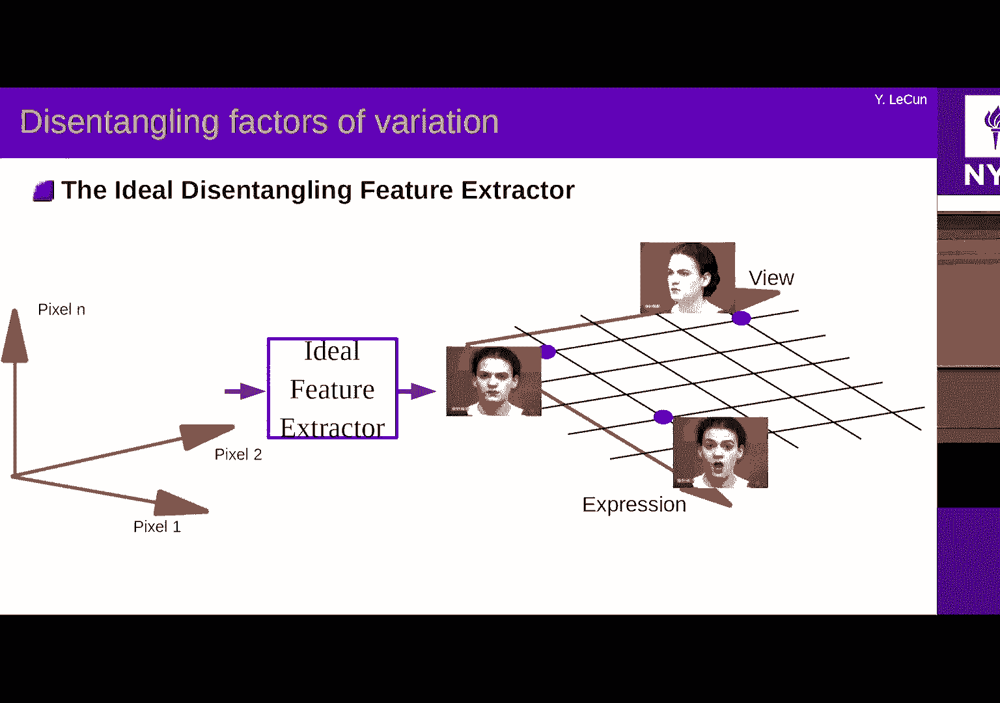

仅代表，我们基本上就可以了，我再拿两个。

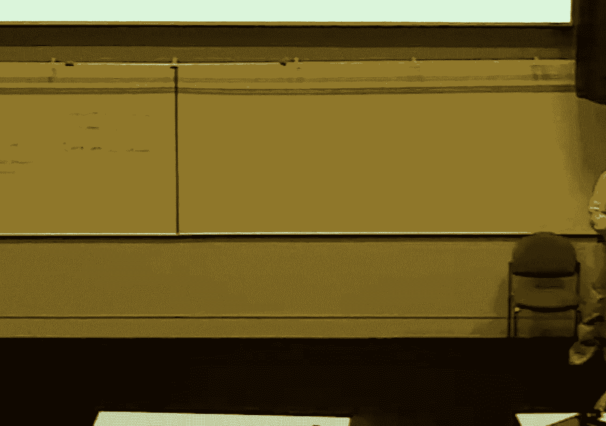

问题是否有，是的，好的，问题是是否存在某种预处理，例如PC air，是的，好的，问题是是否存在某种预处理，例如PC air，可以找到这些向量，所以如果歧管是，可以找到这些向量，所以如果歧管是，线性的。

如果您假设所有这些示例或面都占据了曲面，线性的，如果您假设所有这些示例或面都占据了曲面，是一个平面，则PCA将找到该平面主体的尺寸，是一个平面，则PCA将找到该平面主体的尺寸，组件分析是对的。

但是不是线性的，不幸的是，对我来说是的，组件分析是对的，但是不是线性的，不幸的是，对我来说是的，让我举一个例子，如果你带我和我长得像我的大儿子，让我举一个例子，如果你带我和我长得像我的大儿子。

而你让我们在同一位置的同一张脸，而你让我们在同一位置的同一张脸，即使我们不一样，我们图像之间的距离也会相对较小，即使我们不一样，我们图像之间的距离也会相对较小，现在的人，如果你拿我的脸。

而且我的脸偏移了20像素，现在的人，如果你拿我的脸，而且我的脸偏移了20像素，我和我之间的距离比我和儿子之间的距离改变了，我和我之间的距离比我和儿子之间的距离改变了，所以这意味着你知道我的脸庞。

你知道一些，所以这意味着你知道我的脸庞，你知道一些，我儿子在那个空间里是复杂的歧管，它是非常不同的歧管，我儿子在那个空间里是复杂的歧管，它是非常不同的歧管，不会与我相交但是这两个那两个人非常接近。

不会与我相交但是这两个那两个人非常接近，彼此，并且比我男人的任何两个样本彼此更接近，彼此，并且比我男人的任何两个样本彼此更接近，您从他的歧管中效仿了示例，因此PC不会告诉您，您从他的歧管中效仿了示例。

因此PC不会告诉您，基本上没有问题，这是该表面不存在的另一个原因是，基本上没有问题，这是该表面不存在的另一个原因是，不是一架飞机，你现在看着我，我想像那是一个，不是一架飞机，你现在看着我。

我想像那是一个，线性歧管我的一维歧管一直旋转360，线性歧管我的一维歧管一直旋转360，好吧，歧管在拓扑上与圆相同，但不是平坦的，好吧，歧管在拓扑上与圆相同，但不是平坦的，不可能是无法对齐的。

因此PCA找不到它，不可能是无法对齐的，因此PCA找不到它，好吧，下周我要感谢你。