# 【NYU】纽约大学深度学习入门课程（with pytorch）中英文字幕 - P20：20.Week 11 – Lecture_ PyTorch activation and loss functions - 大佬的迷弟的粉丝 - BV1o5411p7AB

all right so we're going to talk about，two or three topics today and the first。

one is going to be kind of a review of，some of the functions that exist inside。

torch and kind of when and how to use，them so the first the first set of。

topics is about activation functions and。

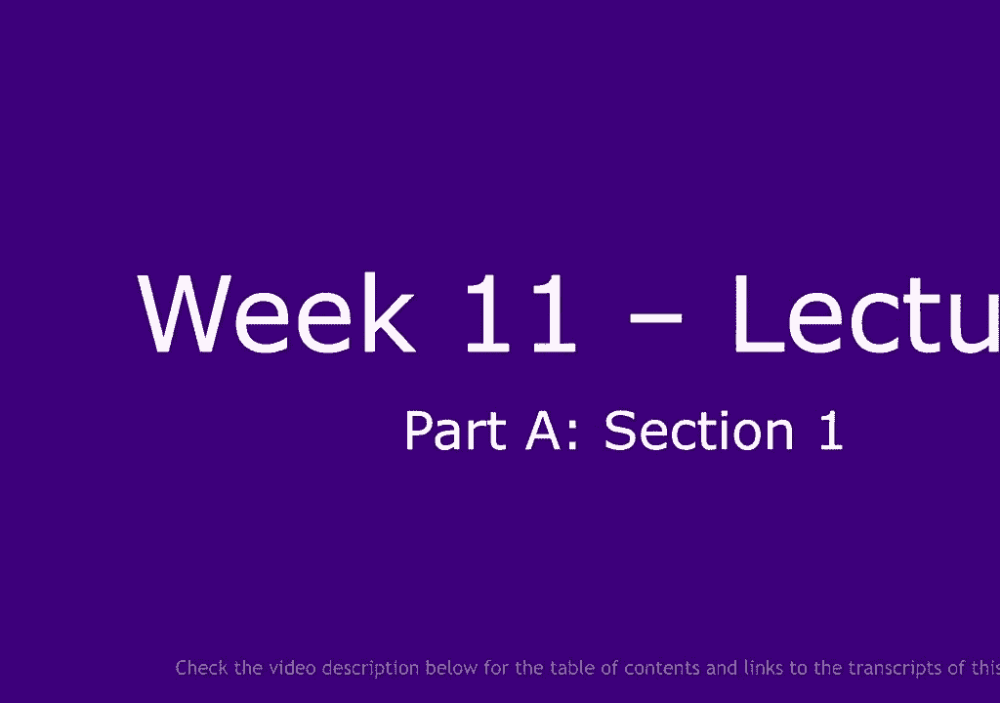

there is a whole bunch of them defined，in in tight torch and they basically。

come from you know various papers that，people have written where they claim。

that this or that particular objective。

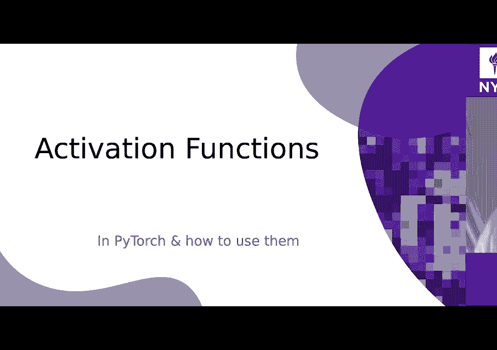

function or activation function works，better for their problem so of course。

everybody knows the value that's very，standard one but there's lots of。

variations of values these values where，the the the bottom part is not constant。

and set to zero they can be allowed to，change either only with the positive。

slope or force to be to have a negative，slope or sometimes being random in the。

case of the randomized VQ value so they，have you know a nice named likely key。

value pair you revalue random value etc，so the key value is one where you allow。

the bottom part to have negative so and，that kind of prevents the issue that。

sometimes pops up that you know when，radio is off it doesn't get any gradient。

so here here you get a chance for that，system that function to actually。

propagate gradient and perhaps do，something useful can go all the way to。

kind of compete full ratification of the，signal kind of like an absolute value，value it's well yeah。

the previous the previous activation was，is user using the discriminatory in。

again such that we always have gradients，going backwards for the generator and。

also these activation was necessary in，order to train the very skinny network I。

show at the beginning of the class，because again having like a very very。

skinny network it was basically，impossible to get gradients flowing back。

because we were like ending up in one of，the quadrants without you know where。

everything was zero out and then nothing，would have been actually trained if you，wouldn't have。

use you know this activation function，that allows me to get some kind of。

gradients even if we are in the regions，where we are trying to suppress the。

output so yeah right so a prelude is，it's similar except now the the slope。

and they get your side can be just about，anything and okay what's what's。

interesting about those all those，functions that we just saw is that they。

are scale invariant in the sense that，they you know you can multiply the。

signal by two and the output will not be，changed，yeah I mean it would be multiplied by。

two but otherwise unchanged so they are，equivalent to scale there's no sort of。

intrinsic scale in those in those，functions right because there's only one。

non-linearity and it's a sharp one so，now we're getting into functions where。

the scale matters so the amplitude of，the incoming signal will affect the type。

of non the type of non-linearity that，you're going to get and one of those is。

the the soft press so soft rice it's，sort of a differentiable version of。

radio if you want it's it's kind of the，soft version of positive part and it's，usually。

permit rised as you can see at the top，here，whatever Bay dialog 1 plus X financial。

beta X so it's it's kind of like the log，some exponential that we've been using a。

lot for service purpose except here one，of the terms in the sum is equal to 1。

which is kind of like exponential zero，if you want so that looks like kind of a。

function that so synthetic ly is the，identity function for large policy。

values and asymptotically zero for，negative values so the approximate sir。

value it has a scale parameter though，this this beta parameter the larger beta。

the more the function will look like a，value so the cake will be kind of the。

corner will be kind of sharper if petah，goes to infinity but that that function，has a scale。

now you can prioritize those functions，in in various ways and this is sort of a，another example of。

kind of a soft version of value if you，want where we're here you use value as a。

basis and then you add a small constant，to it that kind of makes it smooth you。

know I can't tell you that，any of those has any particular，advantage over the others it really。

depends on the only problem but they，they all have kind of similar properties。

if you want this also you can make sort，of continuously closer to value that's。

yet ok so when when difference here in，this case is that this guy actually goes。

negative right so unlike the value that，has its minimum at zero this it's。

horizontal asymptote at zero this guy，goes below zero and that may or may or。

may not be advantageous depending on the，application you have sometimes it's。

advantageous because it allows the，system to basically make the average of。

the output zero which is advantageous，for certain types of for grading design。

convergence the weights that are，connected to units like this will see。

both both positive and negative values，which will then converge faster than if。

you only see positive values so it's，been the same here and it's just kind of。

a differently you know a different，permutation of kind of the same thing if。

you want with different properties so of，course there's tons of variations of。

this you know with various parameters，with different properties and you know。

some of them that have particular，properties that can relate them to。

Gaussian distributions for example this，is not the cumulative distribution of a。

Gaussian but okay so those those were，things that have one kinks in them and。

if the kink is sharp there's no scale if，the King has some scale in it there is。

some scale but it's still sort of a，single kick non-linearity now we're。

getting into nonlinearities I have two，kings okay so this one is basically a，saturating value。

I know sure white saturates at six you，know why not but，why not parameterize this a little。

better so here's a smooth function that，you're familiar with because it's used。

in in recurrent Nets in gated recurrent，Nets and then STM，in soft max you know basically this is a。

a two-way soft max you can think of it，this way and this is just a function。

that goes kind of smoothly between 0 & 1，it's sometimes called a Fermi Dirac。

function as well because it derives from，some work in physics it's equal physics。

and then there is the hyperbola tangent，that we also talked about it's basically。

identical to the sigmoid except it's，centered so it goes between minus 1 and。

plus 1 and it's a little you know it's，twice the amplitude and the gain is a。

little different but it plays the same，role，the advantage of hyperbolic tangent is。

that the output is you can expect the，output to not have zero mean but get。

close to having zero mean and again，that's advantageous for the weights that。

follow because they see positive and，negative values and they tend to。

converge faster that's the case so I，used to be a big fan of those。

unfortunately if you stack a lot of，sigmoids in many layers you know in a。

neural net you you you can tend to not，learn very efficiently you have to be。

very careful about normalization if you，want the system to to converge if you。

have many layers so in that sense the，the single kick functions are better for。

deeper networks so it's signed this is，basically a bit like the sigmoid except。

that it's it doesn't get to the，asymptotes as fast so it doesn't get。

stuck towards the asymptotes as quickly，so one problem with hyperbolic tangent。

and and the sigmoid is that we get close，to the asymptotes the the gradient goes。

to zero fairly quickly and so if the，weights of a unit become too large they。

kind of saturate this unit and the，gradients get very small and then the，the unit doesn't run very。

very quickly anymore it's a problem that，exists both sorry both in sigmoids and。

hyperbole tension and so such sign is a，function of that was proposed by your。

venue and so these collaborators and it，kind of saturates slower and so it。

doesn't have the that same problem I，mean it has the problem also but not to。

the same extent okay and this is kind of，the opposite heart tangent hard 10h I。

don't know if it deserves that name but，it's basically just a ramp okay。

and that works surprisingly well，particularly if your weights are somehow。

kept within a kind of small value so the，the units don't saturate too much it's。

surprising how well it works and you，know people use this and service context。

but that's sort of you know non-standard，so hard threshold is very rarely used。

because you can't really propagate，gradient to it okay and this is really。

what kept people from inventing back，prop in the 60s and 70s which is that。

they were using binary neurons and so，they didn't think of the whole idea of。

gradients because of that okay those，other functions are rarely used in the。

context of neural nets or at least for，kind of activation function in a。

traditional neuron that they used mostly，for sometimes for things like sparse。

coding so one step in sparse coding，consists in to compute the value of the。

latent variable consistent shrinking all，the values in the latent variable is the。

agent vector by some value and you do，this with a shrink function a shrinkage。

function this is kind of a soft version，of shrinkage function the hard version。

is here I mean it's called soft shrink，soft shrink but it actually has corners。

in it the reason it's called soft shrink，is because there is a hard shrink that。

looks different did that show you in a，minute，so this basically just changes variable。

by a constant toward zero right，and if he goes below zero it connect its。

client at zero if it if it's brought too，long and so if the this is basically。

just the identity function to which you，subtract hyperbola tangent to make it。

look like a shrink shrink basically，design if we if we try to get the。

whatever value close to zero and they，actually are forced to zero basically。

right right so small values are forced，to zero others are shrunk toward zero。

but you know it's a large enough they're，not going to get to zero so again that's。

used mostly as you know you can think of，it as a step of gradient for an l1，criterion。

okay so if you have a variable you have，an l1 cost function on it and you take a。

step in the negative gradient of the one，so every one cost is an absolute value。

this will cause the variable to kind of，go towards zero by a constant which is。

the slope of that at one criterion and，to kind of stay at zero you know coming。

from either side it doesn't kind of，overshoot if you want and so that that's。

an on-ear function you use and that's，one of the steps in the East algorithm。

that is used for inference in in sparse，coding but again it's it's really used。

in sort of regular neural nets unless，your encoder is kind of used as kind of。

a estimation of sparse coding this is，the hard shrink so hard shrink basically。

clients every value smaller than lambda，to zero okay so if a value is smaller。

than lambda or larger than - from there，sort of between minus lambda lambda when。

lambda is some constant is just set it，to zero again it's used for things like。

you know certain types of sparse coding，but rarely as an activation function in。

the night so log sigmoid is mostly used，in cost functions not really as an。

activation function either but it's a，useful function to have if you want to。

plug this into into a loss function and，we'll see we'll see that ten minute。

so something we've seen this is the same，as softmax except you have minus signs。

so this is sort of more so that so those，are multi-dimensional nonlinearities all。

right you you have a vector in and you，get a vector out which is at same size。

as the input vector and we know about，softmax is you know exponential X I。

divided by sum over J exponential X J，this is such min where you put a minus。

sign in front of the X so you view the，X's if you want as energies instead of。

scores as penalties instead of scores，it's a good way of turning a bunch of。

numbers to something that looks a bit，like a probability distribution which。

means numbers between 0 and 1 that's 1，to 1 and that's the softmax which we all。

know so locks off max again it's not，very much used as a non-linearity within。

the neural net but it's used a lot at，the output as kind of one piece of a。

loss function it will see this in a，minute ok so those questions yes we have。

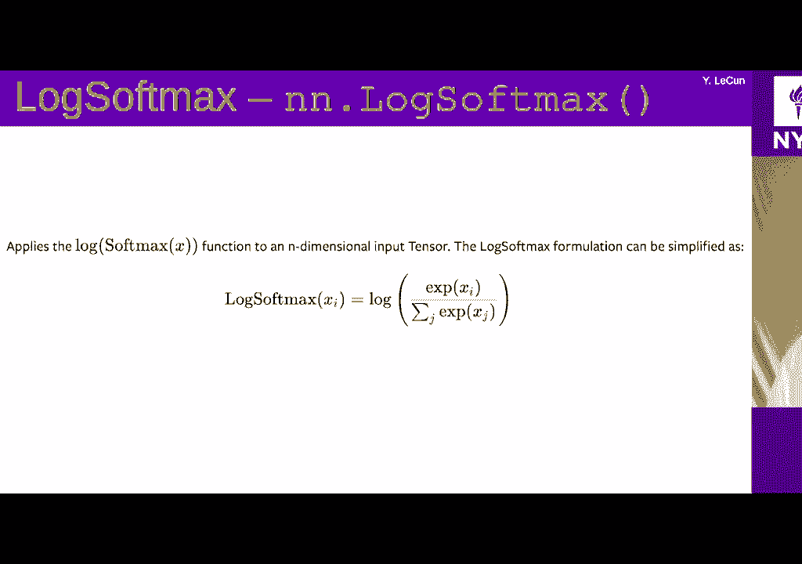

a question so for pre low I'm not sure I。

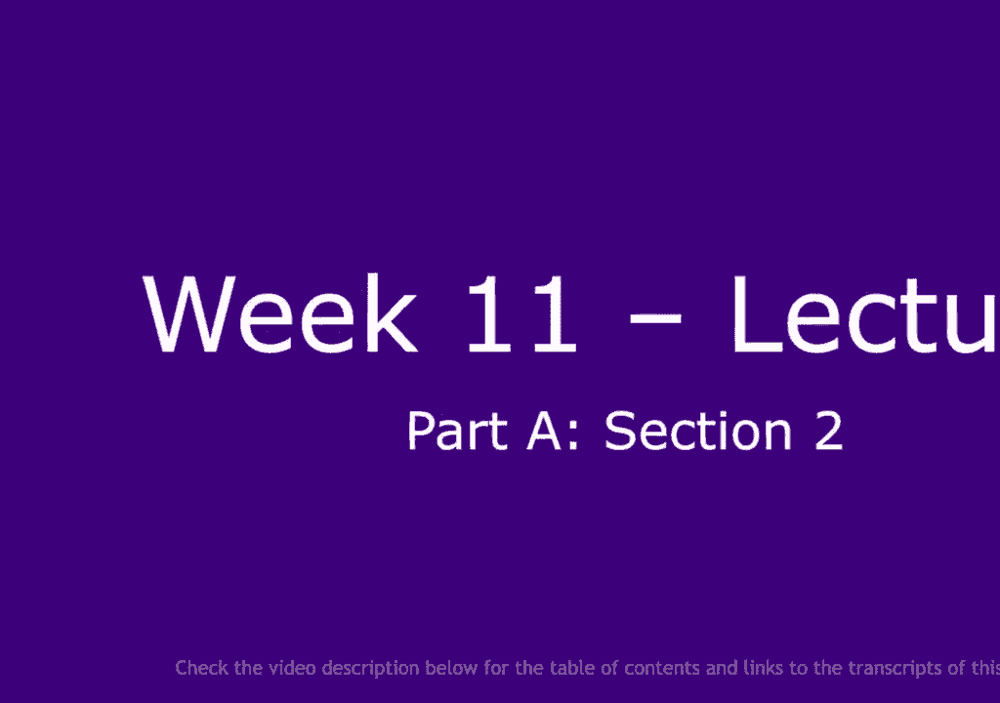

understand number one why we want the，same value for all channels and number。

two how learning a it would actually be，advantages you could have a different a。

for different channels so different，units can have a different a it could be。

you could use it this as a as a，parameter very every unit or not you。

could be shared that's gonna up to you，it could be shared at the level or a。

feature map it accomplished on that or，it could be share all future maps or it。

could be individual to every unit if you，really want to preserve the coalitional。

nature of a commercial net you probably，want to have the same a for every unit。

in the future that but you think you can，have different aids for different。

feature Maps okay well it's the second，question why learning actually a。

specific value would be advantages like，why are we learning a you can learn it。

or not you can fix it the the reason for，fixing it would be you know not。

necessarily to kind of have sort of more，powerful non-linearity but to kind of。

ensure that the non-linearity gives you，a non 0 gradient even if it's even if。

it's in the negative region so you know，runnable not nor lib not renewable so to。

make it learnable allows the system to，basically turn a non-linearity into。

either the linear mapping which of，course is not particularly interesting。

but why not value or something like a，full rectification okay where a would be。

minus 1 in the in the negative part，which you know can be it can be，interesting for certain types of。

application so for example if you have，accomplish on that that has an edge。

detector an edge detector as a priority，right it's it's got press coefficients。

on one side minus coefficients on the，other side and so it's gonna react so if。

you have an edge in an image that goes，from say dr。 bright the you know the。

composition will react positively to，this one but if you have another edge。

from from you know in the opposite，direction then the the react the the。

filter will react negatively now if you，want your filter to react to an edge。

regardless of its priority you rectify，it okay so that would be kind of just。

absolute value now you could of course，bake this in you know how to use a。

prelude you can just use the absolute，value probably a better idea is to use a。

square actually so you take the square，of square non-linearity it's not。

implemented as kind of a neural net，non-linearity but you know in the。

functional form of by torture just right，square and that's it hope answered the，question。

any other question on this topic I have，a question it seems to me like these。

nonlinearities are trying to basically，make a linear function nonlinear and the。

tweak in the in the lines denote like，the change in that function so they can。

we think of this as if we want to model，of curve in the line should we have，learnable。

on both like before before the 0 and，after the 0 on the x-axis like well so。

yeah I mean there is diminishing return，so the question is you know how complex。

do you want your non-linearity to be so，you could imagine of course primate。

rising an entire nonlinear function you，know with sprite parameters or busy。

curves or something like this right or I，don't know chebyshev polynomials you。

know I mean you can probably try any any，mapping you want right you can imagine。

those those parameters could be part of，the learning process however you know。

what is the advantage of doing this，versus just you know having more units。

in your in your system and relying on，the fact that multiple units will be。

added in the end to approximate the，function you want generally it really。

depends on what like if you want to to，do regression in a fairly low。

dimensional space so perhaps you want，some parameterize nonlinearities that。

might help you might have like you might，want to have a collection of different。

nonlinearities with maybe things like，like gbj polynomials if you want to do。

good approximation approximations but，for like you know high dimensional tasks。

like image recognition or things like，this you just want a non-linearity and。

it works better if the non-linearity is，monotonic otherwise it creates all kinds。

of issues because you could have two，points that will produce the same output。

and so it's you land videos for the，system to learn the right function there。

so you want it it's it's much better if，the function is monotonic and almost all。

the functions here are monotonic except，if you have a negative a here in the in。

the prelude case there's big advantage，to having monotonic functions but in。

principle you could probably try as you，know any function you want people are。

played with this you know they're not，very popular because mostly they don't。

seem to be bringing a huge advantage in，in the kind of applications that people。

use a large neural nets for other，questions another question is going to。

be keen commercial smooth yeah，I should never have any application with，the choice so funny。

yeah teas made of bacon packed the only，thing I'm aware of is using a single。

function silica double King for DPL，networks healthily in better well so。

here's a party with double kick double，kick has a built-in scale in it which。

means if you're it's a waste of the，incoming layer are multiplied by two or。

the signal amplitude is multiplied by 2，the result on the output would be。

completely different right yeah because，you will be you know the signal would be。

more in the non-linearity so so you'll，get completely different behavior of。

your layer whereas if you have a，function with only one King if you。

multiply the input by two with the，output it's also multiplied by two in a。

modulo bias but the signal device is，fine so what I mean to ask you something。

of a situation with a choice of，activation function made a big，difference in the performance of the。

model except for the in networks using，today move instead of sigmoid there is。

no sort of general answer to this like，if you're going to use attention you。

have to use softmax I mean you have no，choice right I mean it's not like you。

have to use shaft softmax but you want，to have something where you get。

coefficients right to to kind of focus，the attention of the system on or to。

kind of spread the attention of the，system and not allow it to cheat which。

is to pay attention to multiple things，at one time you have to have some sort。

of normalization of the of the，coefficients that come out of the。

attention system right so so normally in，most attention systems like in。

transformers and stuff the the，coefficients are passed through softmax。

so you get a bunch of coefficients that，are between 0 & 1 & 7 to 1 and so that。

causes the system to have to pay，attention to you know a small number of。

things right you can only concentrate，the coefficients on a small number of。

items and it has to spread it right，there are other ways to do normalization。

you you can do and in fact is something，that's wrong with softmax normalization。

for for for transformers or for，attention which is that if you want a。

coefficient coming out with softmax to，be close to zero，you need the input to be close to minus。

infinity okay or to be considerably，smaller than the largest one right when。

you go into the softmax when I put the，largest input is going to cause the。

corresponding output to be the to be，large if you want that I'd put to be。

close to one and all the other ones to，be close to zero you basically want this。

input to be extremely large and all the，other ones to be large and negative okay。

now that you know that that can be a，problem when the what you are computing。

the input are our dot products because，the result is that you know the easiest。

way for a system to to produce a small，dot product is to have two vectors that。

are orthogonal to each other which gives，the dot product is zero if you insist。

that the dot product should be very very，small，then either you have to make the so you。

have to make the two vectors basically，point in opposite directions and you。

have to make them very long and that's，not so great and so using softmax for。

attention basically limits the the the，contrast that you're gonna have between。

two coefficients which is not，necessarily a good thing，so you know same thing for ASTM gates。

gated recurrent Nets etc you you need，Sigma it's there because you need。

coefficients there are between 0 and 1，you know that either，we set the memory cell or make it a。

fast-food so that it keeps it so it's，previous memory or kind of right the the。

new input in it so there it's nice to，have，an output that varies continuously。

between zero and one there you have no，choice so I mean I don't think you can。

say just you know in generic term you，know this this non-linearity is better。

than this other one there are certain，cases where it learns better though。

certain cases where it relieves you from，having to initialize properly the。

certain cases where it works better if，you have lots of layers like you know。

single click functions work better if，you have lots of layers better than。

Sigma large functions there's no kind of，logical answer I had a question just。

regarding the general differences，between a nonlinear activation that has。

kinks versus a smooth nonlinear，activation yeah is there sort of any。

general reason or rule to why we would，prefer to have kinks in the function or。

not it's a matter of scale invariant of，scale equivariance so if the kick is。

hard again you multiply the input by 2，the output is multiplied by 2 but。

otherwise unchanged okay if you have a，smooth transition if you multiply the。

input by let's say 100 the output now，will look like you had a hard kick okay。

because the the smooth part now it's，become shrunk by a factor of 100 if you。

divide the input by 100 now the the cake，becomes a very very smooth sort of。

convex functions okay so it changes the，behavior but by changing the scale the。

input you change the behavior of the of，the unit and that might be a problem。

sometimes because when you when you，train a multi-layer neural net and you。

have two layers that are one after the，other you don't have a good control for。

like how big the weights of this layer，are relative to that other way so。

imagine you have a two layer Network，where you don't have a non-linearity in。

the middle so the system is completely，linear right if the network has arrived。

at the solution you can multiply the，incoming the the first layer weight。

matrix by two divide the second weight，matrix by two，and overall the network will have。

exactly the same output okay you won't，have changed anything and what that。

means is that when you do training there，is nothing that forces the system to。

have a particular scale for the weight，matrices all right，so now if you put a non-linearity in the。

middle and you still don't have it，because train for the system to kind of。

you know have scales for the first leg，of weight versus the second leg away。

that you know you'd better have a，non-linearity that doesn't care about。

scale okay so if you have non-linearity，that does care about scales about scale。

then your network doesn't have a choice，of what size weight matrix it can use in。

the first layer because that will，completely change the behavior and you。

may want to have large weights for some，other reason which will saturate the。

non-linearity and then kind of create，you know vanishing gradient issues so I。

it's not entirely clear you know what，why is it that you know did networks。

work better with single King functions，but it's probably due to that scale。

invariance property let's get a quick，variance property now there would be。

other ways of fixing this fixing this，problem which would be to basically set。

a heart scale on the weights of every，layer so you couldn't like normalize the。

weights of the layers so that the the，the variance that of things that go into。

unit you know it's always constant in，fact that's a little bit with batch。

normalization does so the various，normalization schemes they do that to。

some extent you know they could mean at，zero and and the variance is constant so。

so now the variance of the amplitude of，the output doesn't depend on the size of。

the weights because it's not wise so you，know that is partially why things like。

like like that norm and good norm and，things like this help is because they。

can fix the scale a little bit but then，if you fix the scale then with something。

like that norm you don't the system now，doesn't have any way of choosing which。

part of the non-linearity it's going to，use in the to cake function system。

okay so things like group normalization，or batch normalization are incompatible。

with kin sigmoids if you want share a，sigmoid you don't want normalization。

just before it see that provides some，really good intuition thank you okay I。

have one more question I noticed in a，soft malfunction some people use the。

temperature coefficient so in what cases，would we want to use their temperature。

and why would we use it well to so to，some extent the temperature is redundant。

with incoming weights so if you have，weighted sounds coming into your softmax。

you know having a data parameter in your，softmax equal to two instead of one it's。

the same as just making your waste twice，as big it has exactly the same effect。

okay so that beta parameter is redundant，with the size of the weights but again。

if you were or the size of the weighted，sum the variance of the weighted stones。

if you want but again if you have a，batch normalization in there then the。

temperature parameter matters because，now the input variances are fixed so so。

now the the temperature matters，temperature basically new controls how，hard the the you know the the。

distribution on the output will be so，with a very very large beta you。

basically will have one of the outputs，equal to one and all the other ones。

really close to zero I mean very close，to one and very close to zero where beta。

is small then this software in the limit，of beta equal to zero it's more like an。

average actually that you get like soft，max behaves a little bit like an average。

so you know beta goes infinity at it so，behaves a bit like AG Max and there goes。

to zero it behaves of it like reckon，average so so if you have some sort of。

normalization before the softmax then，tuning is parameter allows you to。

control this could have hardness and，what people do sometimes in certain。

scenarios is that they start with a，relatively low beta so that the the。

numbers that are produced are kind of，soft so you get gradients everywhere you。

know it's kind of well-behaved in terms，of gradient，and then as running proceeds if you want。

kind of harder decisions in your，attention mechanism or whatever you。

increase data and so that makes the，system kind of make harder decisions it。

doesn't run as well anymore but it's you，know presumably after a few iterations。

it's kind of in the right ballpark so，you can sort of sharpen the the。

decisions there but can be increasing，data it's useful for example in a。

mixture of mixture of experts and you，know self attention systems are kind of。

you can think of as sort of a form of a，weird form of mixture of experts so a。

mixture of experts you know you have，multiple sub networks and their outputs。

are can linearly combine with，coefficients that are the output of the。

softmax itself could you know controlled，by another neural net so if you want。

kind of a soft mixture you have a low，beta and as you increase their to。

infinity basically you're going to，select one of the experts and ignore all。

the other ones there might be useful for，example if you want to train a mixture。

of experts or an attention mechanism but，in the end you want to save computation。

by just determining which expert do I，need to compute and just not computing。

the other ones so in that case you want，those coefficients to be basically。

either one or zero and and you can train，the system progressively to do this by。

increasing increasing data this is，called the physicists have a name for。

this because it uses kind of tricks or，various other things that's called。

annealing it has the same meaning as so，annealing comes from metalwork right you。

you're making a steel or something and，you make a sword or something right and。

you heat it up and then you you you you，you cool it and depending on whether you。

cool it quickly or slowly you'll you，change the crystal no crystalline。

structure of the of the metal so this，idea of annealing of progressively。

lowering the temperature correspond to，this increasing this beta beta is like。

an inverse temperature it's akin to an，inverse temperature any other question。

I think we are good all right okay so。

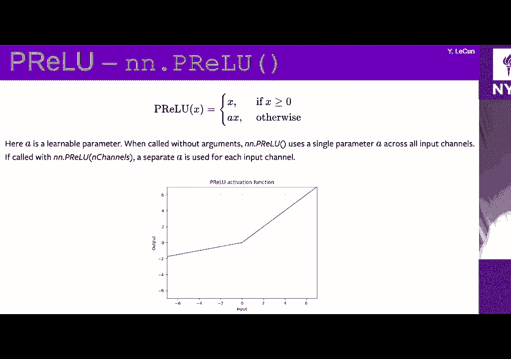

next topic is lost functions so PI torch。

has a whole bunch of loss functions as。

you might have seen and of course there，are things are simple ones like like。

mean square error so I don't need to，explain to you what it is you know。

compute the square of the error between，the desired output Y and actually I put。

X and if it's already bet with n samples，then you have you know n losses one for。

each of the samples in the batch and you，can you can tell this last function to。

either keep that vector or to kind of，reduce it by academia or some okay。

pretty simple mmm here's a different，loss that's the everyone knows so this。

is basically the absolute value of the，difference between between the desired。

output and the actual output and you，want to use this to do what's called。

robust regression so if you want small，errors to count a lot and large errors。

to count but you know not as much as if，you use the square，perhaps because you have noise in your。

data so you know that you have a bunch，of data points you're trying to kind of。

train and know on that to something to，kind of you know fit a curve or you know。

do regression but you know that you have，a few outliers so you have a few points。

there are you know very far away from，what they should be just because you。

know the system as noise or something or，the data was collected with with some。

noise so you want the system to be，robust to that noise you don't want the。

cost function to increase too quickly as，the points are far away from you know。

the kind of the general curve so at one，loss will be more robust now the problem。

with that one loss is that it's not，differentiable at the bottom and so you。

know you have to kind of be careful when，you get to the bottom of how you how you。

do the the gradient that's basically，done with this soft shrink essentially，that's that's the。

everyone knows now to correct for that，people have come up with various ways of。

kind of making the l1 notes for bus for，large losses but then still smooth at。

the bottom kind of behaving like squad，error at the bottom so an example of。

this is is this particular function，smooth say one loss it's basically a one。

far away and it's sort of l2 nearby and，that presents sometimes that's called a。

Google loss some people call this also，elastic Network because it's an old。

paper from the 1980s or 1990s that kind，of proposed this this kind of objective。

function for different purpose so that's，useful that was advertised by was。

gaerste confess our CNN paper for and，it's used quite a bit in Cuba division。

for survivors purposes again it's for，protecting against outliers sharper。

jesus also sharper results now when we，do like image prediction sharper than。

using the MSE not particularly I mean，it's it's just like the MSE for small。

errors okay so that doesn't make any，difference but it it doesn't。

or maybe I misunderstood what your point，was sorry I was trying to compare the l1。

versus the in the l2 that the l2 gives，us like usually blurry blurry。

predictions whenever we try to do，prediction by using like the l2。

minimizing the l2 weather whereas like，people are minimizing the l1 in order to。

have like sharper overall predictions，okay so if you take if you take a bunch。

of points okay if you take a bunch of，y-values okay and you ask the question。

what value so you take a bunch of points，on on why okay yeah you ask the question。

what value of y minimizes，the squirrel Ellis the answer is that。

it's the average of all the whites okay，okay so if you so if for a single X you。

have a whole bunch of wise which means，you have noise in your data your system。

will want to produce the average of all，the ways that you're observing okay and。

if the Y you're observing is not a，single value but is I don't know an。

image the average of a bunch of images，is a blurry image okay，that's why you get those very effects。

now with air one the value of y that，minimizes the l1 norm the l1 distance so。

basically the sum of the absolute values，of the differences between the value。

you're considering and all the points，all the white points that's the median。

okay so it's it's a given point all，right uh-huh and I see media and of。

course it's not blurry it's just an，image although it's kind of difficult to。

define in multiple dimensions but so one，problem with this loss is that it has a。

scale right so here the transition here，is at point five but why should it be at。

point five you know it could be it，depends what the scale of your of your。

errors are okay negative exactly who，lost this is really not the negative of。

likelihood loss I'm not sure why it's，called this way by torch but basically。

here imagine that you have an X vector，coming out okay and you your loss。

function is there is one correct X okay，so imagine each X correspond to a score。

for lies a multi-class classification，right so you have a desired class which。

is one particular index in that vector，okay now what you want is you want to。

make that score as large as possible，okay if those scores are likelihoods。

then this is minimum negative log，likelihood if those scores are log，likelihoods and this is maximum。

likelihood or minimum negative log，likelihood，okay but there is nothing in this module。

that actually specifies that the elds，have to be log likelihoods so this is。

just you know make my desired component，as large as possible that's it。

if you put negative signs in front so，now you you can interpret the axis as。

energies as opposed to scores okay，they're not called six-course they're。

like they're like penalties if you want，but it's the same so the formula here。

says you know just pick the X that，happens to be the correct one for one。

sample in the batch and make that score，as large as possible now this particular。

one allows you to give a different way，to different to different categories。

which is W those w's it's a it's a，weight vector that gives a way to each。

of the each of the categories it's，useful in a lot of cases particularly if。

you have widely different frequencies，for the for the categories you might。

want to increase the weight of samples，for which you have a small number of。

examples I mean for categories for which，you have a small number of samples。

however I'm actually not a big fan of，this of this I think it's a much better。

idea to just increase the frequency of，the of the samples from the classes for。

the class I have you know that appears，rarely so that you equalize the。

frequency the frequencies of the classes，when you train it's much better because。

it exploits stochastic gradient in a，better way okay so so the bottom line of。

that is if you have let me actually draw，a picture of this so let's say you have。

a problem where you have tons of samples，for category one and then the small。

number of samples for category two in a，tiny number of samples for category。

three you could so let's say you know，here you have I don't know a thousand。

samples and here you have，500 samples and you have I don't know，200 samples right so you could do is。

using this this kind of weight function，you could give this a weight of of 1 and。

this guy weight of 2 and this guy weight，of 5 and then you can equalize the。

weights if you want it's really better，to make sure that the way it's。

normalized to 1 that would be probably a，better idea but what I recommend is not。

that what I recommend is when you pick，your samples you basically pick one。

sample from class 1 and then one sample，from class 2 and super from class 3 and。

then you know you keep doing this during，your training session and when you get。

to the end of class 3 you go back to the，beginning ok so you keep going here but。

here you go back to the first sample，keep going here go back and now you have。

the second sample ok and now you get to，the end of class to go back to the start。

ok so the next sample is going to be，here here and here and then the next one。

here here and here here here and then，this guy wraps around again etc right so。

you basically have equal probability，equal frequencies for all the categories。

but just going through those kind of，circular buffers more often for。

categories for which you have fewer，samples ok once you should absolutely。

never do is equalize the frequencies by，by just not using all the samples in。

categories that are frequent I mean，that's horrible you should never let any。

data on the floor it's never any reason，to leave that on the floor ok now here's。

a problem with this the problem with，this is that after you've trained your。

your neuron that to do this you know one，that does not know about the relative。

likelihood the relative frequencies of，the samples and so let's say this is a。

system that those medical diagnoses it，doesn't know that the common cold is。

a way more frequent than you know lung，cancer or something right so what you。

need to do in the end is do a pass a few，passes perhaps where you can fine tune。

your system so that with the actual，frequencies of the categories and the。

effect of this is going to be for the，system to adapt the biases at the output。

layer so that the likelihood of you know，diagnosis corresponds to the the。

frequency of it right it's gonna favor，things that are more frequent the reason。

why I don't want to do this during the，entire training is because if you train。

a multi-layer net the the the system，basically never develops the right。

features for rare cases and they have，spoken about this already in the class。

in in past weeks to kind of recycle the，example of medical school you you don't。

spend when you go to medical school you，don't spend time studying the food that。

is proportional to the frequency of the，food with respect to very rare diseases。

for example right you spend basically，the same time studying all the diseases。

in fact you spend more time studying，complicated one which usually tend to be。

rarer and that's because you need to，develop the features for it okay and。

then you need to kind of correct for the，fact that you know those rare diseases。

are rare so you don't do that that you，know you don't suspect the diagnosis for。

rare diseases very often because you，know it's rare okay so that's all for。

for weights question tributo so you'll，be using this a lot of course and cross。

country pillows is a kind of merging of，two things merging of lot softmax。

function and negative low likelihood，loss okay and so and the reason why you。

want to have this is for numerical，reasons，so the locks off max is you know。

basically the softmax followed by log，right so you first compute the softmax。

then you do the log if you do softmax，and then log and you back propagate。

through this you might have gradients in，the middle between the log and the。

softmax that end up being infinite so，for example if if the the maximum value。

of one of the stars max is close to one，and some of the other ones are close to。

zero you take the log you get something，that's close to minus infinity you back。

propagate through the log you get，something that's close to infinity okay。

because the the slope of vlog goes to，zero is very very close to infinity but。

now you multiply this by a soft max that，is saturated so it's multiplied by。

something that's very close to zero so，in the end you get a reasonable number。

but because the intermediate numbers are，close to infinity or 0 you multiply plus。

something that's close to plus infinity，by something that's close to 0 you get。

numerical issues so you don't want to，separate log and soft max you want to do。

lots of Max in one in one go it，simplifies the formula it makes the。

whole thing much more stable numerically，and for similar reasons you also want to。

merge lots of Max and get you really，good loss so basically if you have locks。

off Max and you get you've，log-likelihood loss it says I got a，bunch of weighted sums and a percent。

through soft max I'm going to take the，log of those and then I want to make the。

the output of the log short max for the，correct class as large as possible okay。

that's what the negative load actually，lost does it wants to make the score of。

the correct class as large as possible，we saw that just a minute ago right when。

you back propagate through the blocks，off max as a consequence it's going to。

make the score of all the other classes，as small as possible，right because of the normalization and。

so that you know that's why sometimes，the the whole idea of sort of building a。

network by you know modules，sometimes there is an advantage instead，of merging in modules into。

single wine by end right so so the cross，entropy does in fact this explains a。

little bit you know those numerical，simplifications so the loss you know。

takes an X Factor and a category a，desired category a class okay and。

computes the negative log of the softmax，applied to the vector of scores but the。

one that's on the numerator numerator，here is the the X of the index of the。

correct class okay so that's that's your，loss the negative log of exponential the。

score of the correct class divided by，the sum of the Exponential's all the。

scores okay you can think of the X's as，negative energies okay it's completely。

equivalent now when you do the math and，you simplify your the log and the。

Exponential's gonna simplify and so you，just get the score of the correct class。

the negative score of the correct class，okay so to make that small you make the。

score large and then press the log of，the sum of the Exponential's of the。

scores of all the other class to make，that small you make all the edges small。

negative as far as fat you know as，negative as possible okay so this will。

make the score of the correct class，large like this core of everything else。

small again like in the aisle you can，you can have a weight per category also。

there is a physical interpretation right，of the cross entropy right okay so why。

is it called course entropy because it，is the cross entropy between two，distributions。

it's the KL divergence really between，two distributions，it doesn't appear clearly here in this。

formula but think of the softmax applied，to the X vector as a distribution okay。

so take the X Factor's this course，rather than to a softmax you get a bunch。

of numbers between 0 & 1 that's 1 2，and now you have a desired distribution。

and the desired distribution the target，distribution if you want is one in which。

all the wrong categories had zero and，the correct category has one okay now。

compute the KL divergence between those，two distributions okay so it's the sum。

over indices of the correct probability，okay which is zero for except for one。

term times the ratio between the log of，the the probability that the system。

produces and the correct probability，which is one okay so all of those terms。

you know reduce to kind of a single term，which is just the one for which the。

correct probability term is one okay so，we end up with this with this term it's。

just a negative log of the softmax，output for the correct class okay we can。

use this as a cross entropy between the，distribution produced by the system and。

the one hot vector corresponding to the，desired distribution if you want okay so。

now there is a there would be another，can a more sophisticated version of this。

which would be the actual KL divergence，between the distribution produced by the。

system and a distribution that you，propose whatever it is a target。

distribution which now is not binary，it's not the one hard vector anymore but。

it's just a vector of numbers and that's，called the KL divergence in fact it's。

we'll see it in a minute so Kerala，vergence is a kind of you know it's not。

a distance because it's not symmetric，but it's a sort of a divergence between。

between distributions discrete，distributions okay so this one is a bit。

of a kind of a extension if you want of，lakhs of Max and it's a version of it。

that is applicable for very very large，categorization so if you have many many。

many categories what you might want to，do is kind of cut some corners you don't。

want to compute the giant softmax over，million categories or maybe even more so。

there you can sort of basically ignore，the ones that are small and you know。

kind of use tricks to kind of you know，improve the speed of the of the。

computation and this is what this does，I'm not going to go into the details。

exactly what it does because actually I，don't know the details but but it's。

basically an efficient approximation，softmax for a very very large number of。

categories so this is a special case of。

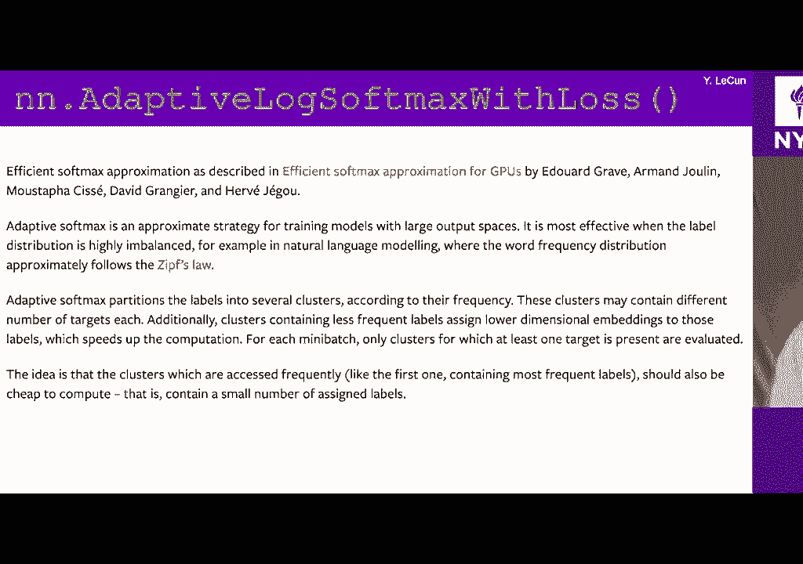

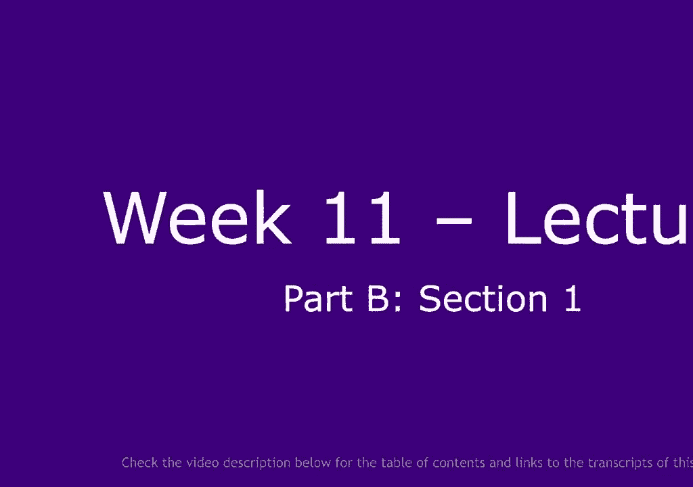

course entropy when you only have two，categories and in that case it kind of。

reduces to something simple so this does，not include stuff max this is just a。

quest entropy when you have two，categories and as I as I said before the。

the the cross entropy loss is the sum of，our categories of the probability I mean。

some of our indices or some of our，categories of the probability for the。

target the target probability for that，category times the ratio between the log。

of the probability for of produced by，the system divided by the probability of。

the target category and if you work it，out for two categories necessarily one。

score is one minus the other one if you，have two exclusive categories and and it，comes down to this。

okay now this presupposes that x and y，is x and y are kind of probabilities。

they have to be between strictly between，0 & 1，I mean not strictly but well kind of。

strictly because otherwise the logs，gonna blow up here is the KL divergence。

process I was to tell you about earlier，so here it's the，I mean it it's it's real turn here in a。

funny form but it's basically the here，again it's it sort of assumes this is。

another one I was telling you about，earlier actually this one is also a。

simplified one when you have a a one hot，distribution for the target so why is。

it's a category but it has the，disadvantage of not being merged with。

something like softmax or log softmax so，it may reach I mean it may have kind of。

numerical issues again it assumes x and，y are you know distributions。

this is values personal loss okay so，this version of binary choice entropy。

here takes scores that haven't gone，through sigmoid so this one does not。

assume that X the x's are between 0 & 1，it just takes you know values whatever。

they are and it it passes them to a，sigmoid to make sure there are between 0。

& 1 strictly ok and so that is more，likely to be a numerically stable it's a。

bit the same ideas kind of emerging，locks off max and you get your lucky。

hood very yeah same thing here that's，what I was talking okay margin losses so。

this is sort of a important category of，losses those losses basically say if I。

have in this case two inputs the last，function here says I want one input to。

be larger than the other one by at least，two margin okay so imagine the two。

inputs or scores for two categories you，want the score for the correct category。

to be larger than the score for the，incorrect category but it hits some。

margin that you passed through the，system and that's the the formula you。

see down there so it's basically a him，okay and it takes the difference between。

the two scores and so why is a binary，variable this plus one or minus one and。

it controls whether you want X to be，larger than x1 to be larger than x2 or。

whether you want x2 to be larger than x1，okay we basically give you two scores。

and you tell it which one you want to be，the larger score and then the cost。

function says you know if this one is，larger than that one by at least a。

margin then the cost is zero if it's if，if it's smaller than the margin or if。

it's in the other direction and the cost，increases linearly okay so that's called。

a hingeless okay so that's very useful，for a number of different things we've。

we've seen an example of this in so yeah，for example so this is sort of a margin。

ranking class so you have two values but，there are sort of is a simplified。

version of it I mean there's a simpler，version of it which I don't have here。

for some reason we only have an X okay，so basically the loss is max of 0 and。

minus X times the margin and it just，wants to make to make X smaller than the。

margin right and so this is sort of a，special case where you have a ranking。

between two scores of two categories so，here is how you would use this for。

classification you would basically run，your classifier you would get scores ok。

idea so before you do any non-linearity，weighted sums and then you know the。

correct category so you say I want this，correct category to have a high score。

and then what you do is you take another，category that has the most offending。

score so either another category so a，category that is incorrect that has a。

higher score than the correct one or，that has a lower score but the lowest。

score is too close ok so you take the，the category that whose core is the。

closest to the to the correct one or who，score is higher than the correct one and。

you feed those two scores to the last，function like this so basically it's。

going to push up the score in the，correct category push down the score the。

incorrect category until the difference，is that eastern margin equal to the。

margin okay that's you know a perfectly，good way of training something in the。

context of an energy-based model for，example that's the sort of things you。

might want to do you might want to say X，1/4 minus x1 is the energy I mean X you。

know minus X 1 will be the energy of the，correct answer and minus X 2 would be。

the energy of the incorrect answer like，an a contrastive term an incorrect。

answer and you want to push down the，energy of the correct answer which are。

the energy of incorrect answer so that，the difference is at least some margin。

okay can use this kind of laws for that，the to play Clause is gonna be。

refinement on this so this is used a lot，for metric learning for the kind of。

Sammys nets that each n was each and，mister I was talking about last week and。

and there the idea is let's say I have a，distance so let's say I have three。

samples I have one sample and another，sample is very similar to it I've run。

them through to commercial Nets I get，two vectors I compute the distance。

between those two vectors D of a IP I，for example okay I want to make this。

distance as small as possible because，that's the core example and then I take。

two samples that I know are semantically，different ok the image of a cat and。

whatever table and I want to make the，vector as far away from each other so I。

compute the distance I want to make this，distance large alright now I can insist。

that the first is done B zero and it can，insist that the second distance be。

larger than the margin that would be，kind of a margin loss type type thing。

but what I can do is one of those，triplet margin notes where I say the。

only thing I care about is that the，distance that I get for the good。

is smaller than the distance that I get，for the bad pit I don't care if the。

distance is small I just wanted to be，smaller than the distance for the bad。

pair okay and that's what those ranking，goes to a bunch of those were I mean one。

of the first I think that was proposed，was by Chisholm Weston and Sammy bengio。

back when Jaden Weston was today Google，and they used this to train kind of an。

image search system for Google so back，then I'm not sure is true anymore but。

back then you would type a query on，Google Google would encode that query。

into a vector then we compare this to a，whole bunch of vectors describing images。

that I've been previously indexed and，and then would kind of retrieve the。

images whose vector were close to the，one that that you had and the way you。

train those those the networks that，compute those vectors in that case back。

then it was in your networks actually as，you train them with those trip pillows。

okay so you said good hits for my search，should should have a distance between。

the vectors that is smaller than any bad，hit and I don't care if the distance is。

small I just wanted to be smaller than，for that it's any question that's kind。

of a graphical explanation of this where，P is a positive sample so it's you know。

similar to a so a is the sample you，considered P is kind of a positive。

sample and N is a negative sample，contrast example you want to push anyway。

and bring P closer and as soon as P is，closer than n by some margin you you。

stop pushing and pulling your soft，versions of this and in fact you can。

think of nce the the kind of loss，function that hn was talking about as。

kind of a soft version of that where you，basically you have a bunch of positives。

and bunch of negatives or you have one，positive and bunch of negatives and。

you run them through softmax and you say，I want this the you know e to the minus。

distance for the correct one to be，smaller than you know e to the minus the。

other one so it kind of you pushes the，positive closer to you and pushes the。

other ones further to you but now with，some sort of stuff maxi that sort of。

exponential decay as opposed to sort of，a hard margin so in PI torch you have。

things that allow you to have multi，labels so this allows you to basically。

give multiple correct outputs so instead，of you know this is a ranking Mouse but。

it's serving sitting that there is only，one correct category and you know you。

you you want a high score for the，correct category and that's core for。

everything else here you can have a，number of categories for which you want。

high scores and then all the other ones，will get pushed away，all right we'll get the scores will be。

pushed down so here it's a it's a hinge，loss but you do a sum of those this。

hinge loss overall categories and and，for each category if the category is a。

desired one you push it up if it's a non，desire one you push it down which is。

what this video formula says and of，course you have the soft version of this。

which I'm not going to go into the，details of and the multi margin version。

of it so this pushing and pulling for，metric learning for embedding for Sammis。

nets that I would say telling you about，it's actually kind of all implemented if。

you want in one of those engine vending，laws so engine 30 loss is a loss for。

Siamese nets that kind of pushes things，are semantically similar to you and push。

away things that are not okay so the Y，variable indicates whether the pair you。

are or whether the score you are giving，to the system is one that should be。

pushed up a window should be pushed down，and it it chooses the hinge loss that，makes the score。

positive if Y is plus one and it makes a，score negative by some margin Delta if，if Y is minus one。

very often when you are doing，Siamese Nets the way you compute the。

similarity between two vectors is not，through Euclidean distance between。

cosine distance so the one minus the，cosine between the of the angle between。

the two vectors this is basically a，normalized Euclidean distance if you。

want you can think of it this way the，advantage of this is that whenever you。

can push the distance whenever your two，vectors and you want to make the。

distance as large as possible there's a，very easy way for the system to get away。

with it by making the the two vectors，very large very long you know not。

pointing in the same direction and make，them very very long so now the distance。

would be large but of course that's not，what you want you don't want the system。

to just make the the vectors bigger you，wanted to actually rotate the vector in。

the right direction so you you normalize，the vectors and then computer normalize。

Euclidean distance and that's basically，what this does and what this does is。

that it for positive cases it tries to，make the vectors as aligned with each。

other as possible and for negative pairs，it tries to make the cosine smaller than。

the particular margin the margin in that，case which should probably be something。

that kind of is close to zero so you，want the the cosine you know in a high。

dimensional space there's a lot of space，near the equator of the sphere of the。

high dimensions here okay so all your，points now are normalized so this here。

what you want is samples that are，symmetrically similar to you should be。

close to you the samples that are，dissimilar should be orthogonal you。

don't want them to be Oppo opposed，because there is only one point in the。

South Pole whereas on the equator is a，very very high large space the entire。

sphere minus one dimension basically，okay so you can make the margin just you。

know some small so small positive value，and and then you get the entire equator。

essentially of this here which contains。

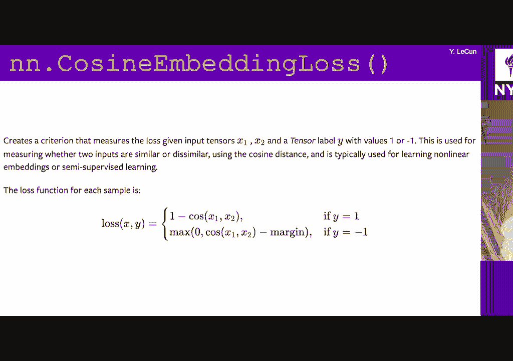

you almost the entire volume of the，sphere and I dimension，since you see loss this is a little more。

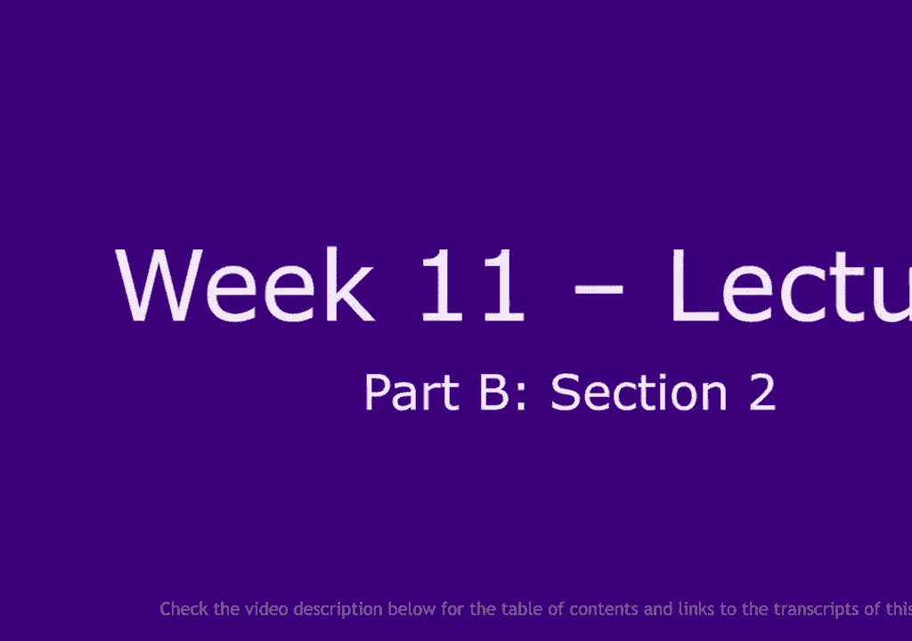

complicated because that's a task that，is basically uses structure prediction。

what's called structure prediction so，this is I sort of briefly talked about。

it very quickly a few weeks ago was，something very similar to this so this。

is it also is applicable when you your，output is a sequence of vectors and。

scores where the vectors correspond to，scores of categories okay and so you。

have so your system computes a vector of，such score so imagine for example speech。

recognition system speech recognition，system every 10 milliseconds gives you a。

vector of probabilities for what the，sound being pronounced right now is and。

the number of categories usually is，quite large on the order of a few。

thousand okay so give you basically a，softmax vector of a size you know。

typically three thousand let's say one，of those every 10 milliseconds all right。

and what you like you know you have a，desired output and the desired output is。

what word was being pronounced and a，word that's being pronounced that。

corresponds to kind of a particular，sequence of sounds if you want that you。

might you might know so what you need，now is a course that basically is row if。

that sequence looks like like that，sequence but what you might allow is for。

the input sequence to repeat some of the，sounds if you want right so so for。

example you know my my cost to make the，target might be the word seven they say。

and it's pronounced really quickly 7 so，you basically have you know a very small。

number of samples of each sound in the，sequence but then perhaps the the person。

who is pronouncing the the word now that，user as a training sample pronounced it。

very slowly like seven right so now the，the first the first takes you know。

several several frames of 10，milliseconds that should all be mapped，to the the same。

instance of the earth in the indian foot，and i do that picture before but i gonna。

do it again right so the you have let's，see you have a sequence of scores coming。

out of soft max's let's say it's，actually better if there are energies。

but firstly TC they need to be and then，you have the target sequence and i think。

of this as some sort of matrix and each，entry in that matrix basically measures。

the distance between the two vectors，that are here okay so when i'm treating。

the matrix indicates how this vector，looks like that vector for example with。

the course entropy or something like，that okay or is quite error it doesn't。

matter what the last function is so now，if this is the word seven pronounced。

slowly okay and this has perhaps only，one instance of each sound you want all。

of those you know you would want all of，those vectors corresponding to the e to。

be mapped to that vector here okay so，you want to compute that cost of you。

know confusing that those all of those I，mean，map matching those ease to that to that。

e now of course here the system could，use the correct answer so you don't have。

much of a problem but if the target is，seven but the word that was pronounced。

here or the output that was produced by，the system does not correspond to seven。

that's that's that's when you run into，into trouble so，here what you do is you find the best。

mapping from the input sequence to the，output sequence okay so the s gets。

mapped to the s the e to the e the V to，the V the east to the e and the end to。

the N so you get this kind of path if，you want that think of this as a path in，the graph。

and the way you determine this is，basically by using a dynamic programming。

algorithm the short path algorithm that，figures out how do I get from here to。

here you know path that minimizes the，sum of the distance distances between。

the the all the vectors of the distances，between the vectors of you know all the。

points are going through ok so there's a，optimization respect to a latent。

variable if you want okay and CGC，basically decide for you right so you。

give it two sequences and it computes，the distance between them and you know。

kind of the best kind of mapping between，the two by allowing basically to to map。

multiple input vectors to kind of a，single one on the output it cannot。

expand it it can only kind of reduce if，you want and then that's done in a way。

that you can back propagate gradient to，it we'll come back to this two more。

things like this at the end if you can，oops so this is what this the target is。

assumed to be many-to-one the alignment，of the input to the target is assumed to。

be miniature when which leave is the，length of the target sequence such that。

it must be smaller than the length of，the input that's for the reason I just。

explained okay so it's basically，differentiable time-warping you could。

think of it this way or sort of a module，that does that any time marking or。

dynamic programming and it's still，differentiable the idea for this goes。

back in the early 90s in the Lobo two，species actually that's very old very a。

good paper or resource to learn more，about that dynamic programming algorithm。

there actually that's kind of what I'm，gonna talk about next I may not have。

time to go through it but，I'll try to okay but basically the last。

part of the energy based model tutorial，okay，so the initial base model tutorial the。

2006 paper that we give you a reference，a link to a tutorial on energy based。

models the this the second part is all，about this kind of stuff essentially。

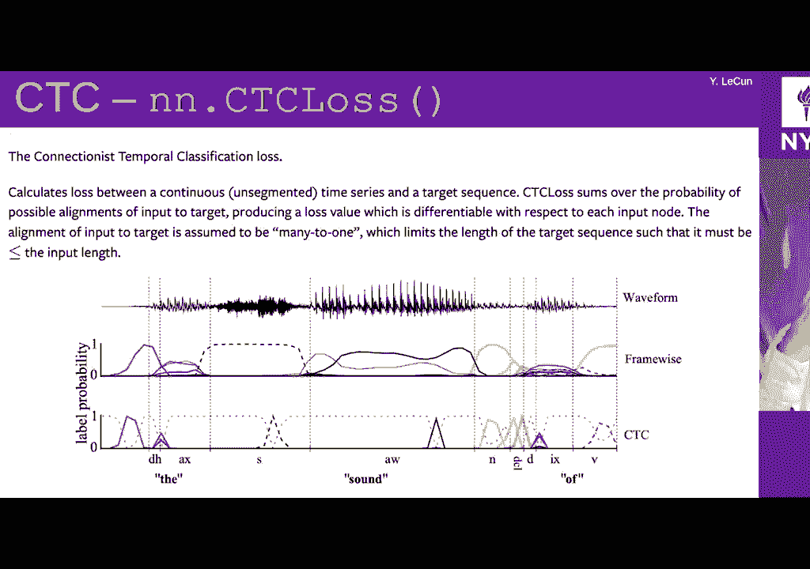

okay so it's more energy based models，but now in getting more of a supervised。

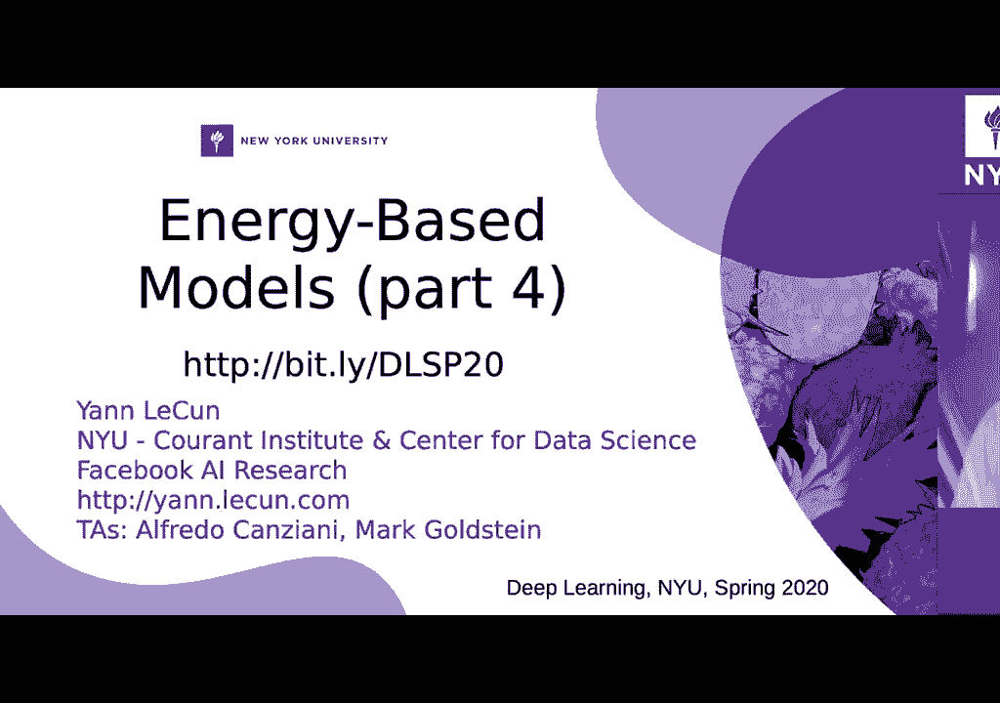

context if you want，so preliminary so before I get to this I，want to come back to the sort of more。

general formulation of energy based，models and the idea that so if you want。

to kind of define energy based models in，the proper way these are the conditional。

versions you have a a training set a，bunch of pairs x y y I for I equals 1 to。

P you have a loss function also the last，functional L of ENS so it takes the。

energy function computed by the system，okay and the training set and it gives。

you a scalar value now you can you can，think of this as a functional functional。

is a function of a function ok but in，fact because the energy function itself。

is parametrized by parameter W you can，turn this functional into a loss。

function which is not just a function of，W another function of the energy。

function okay and of course the the set，of energy functions is called epsilon。

here it's family tries by the parameter，W which is taken within the set so。

training consistent of course minimizing，the the loss function or with respect to。

W and finding the W that minimizes it，and and so one question you might ask。

yourself you know I went to a whole，bunch of objective function loss。

functions here and the question is if，you are in an energy based framework。

what loss functions are good ones and，what all functions are bad ones how do。

you characterize a loss function that，actually will do something useful for，you ok。

so here is a general formulation of the，last function it's it's an average over。

training samples so here I'm kind of，assuming that it's invariant under。

permutation of the samples so an average，is as good as any other aggregation。

go-getting function so it's the average，of our training samples of a person for。

loss function capital L and it takes the，desired answer Y which could be just a。

category or it could be a whole image or，whatever and it takes the energy。

function where X the X variable X I is，is equal to X I the ice training sample。

the Y variable is undetermined okay so e，of W Y and X I is basically the entire。

shape of the energy function for values，of Y over values of Y for a given X okay。

X equal to X I and you can have a，regularizer if you want okay so here。

this is a loss functional again again of，course we have to design this loss。

function all so that it makes the energy，of correct answers small and the energy。

of incorrect answers large in some ways，right ok now we're going to go through a。

bunch of different types of loss，functions so one thing we could do is。

say my loss function is just going to be，the energy of the correct answer so I'm。

gonna place myself in the context of，energy based model my system produces。

scores I interpret those scores as，energies so high is bad good is good。

that means low is good as opposed to，positive scores and what I'm just going。

to do is define my energy functional as，unfortunately the energy function of the。

function of Y as simply the energy that，my model gives to the correct answer。

okay so basically I give it an X and I，give it the correct answer Y and as a。

system what energy do you give to that，pair and then I try to make that energy。

as small as possible okay so you have，this landscape of energy。

is here now we honor I showed you this，slide in the context of unsupervised。

super Ronnie here I'm showing to you in，the context of supervised Ronnie so。

imagine that one of the variables is X，and the other variable is y okay and the。

blue beads are training samples and you，want to make the energy of the blue。

beads as far as possible so you're，pulling down on the blue beads but。

you're not doing anything else and so as，a result depending on the architecture。

or your network if your network is not，designed properly or if it's designing a。

bit in no particular way it could very，well be that the energy function is。

going to become flat everywhere okay，you're just trying to make the energy of。

the correct answer small are you not，telling the system the energy of。

everything else should be higher and so，the system might just collapse。

all right so energy loss is not good in，that sense but there are certain。

situations where it's applicable because，if the shape of the energy function is。

such that it cannot make the you can，only make the energy of a single answer。

small all the other ones being larger，then you need to have a quadratic term。

okay and we've seen this in the context，of supervised learning people are。

completely lost about the loss，functional right okay so this is a，function Al and it's a function of。

another function e okay，so it's called a functional because it's。

a function of a function right it's not，a function of a point it's a function of。

a function now if that second function，is permit rised by a parameter W then。

you can say that the last function is，actually a function of that parameter W。

now it becomes a regular function okay，that's what I had can you can you write，it down。

it's basically written here okay you can，either write the functional as if I can。

find it as L of e and s so that's a，functional because it's a function of e。

which itself is a function okay but e，itself is a function of W and so if I。

write the last function directly as a，function of W now it's just a regular，function。

okay yeah I mean I asked the question，that was asked in the chat I yeah I was。

kind of you I know before that you know，for okay we've seen the negative log。

likelihood loss before I talked about，this so this is a loss function that。

tries to make the energy of the correct，answer so look at the rectangle in red。

tries to make the energy of the correct，answer as low as possible and then you。

have the second term whatever beta log，sum over all why's of e to the minus。

beta e of WI X and this one is trying to，make the energy of all Y's for this。

given X as large as possible okay，because the best way to make this term。

small is to make those energies large，because they enter in there as a。

negative of negative its financial okay，so this has this kind of pushing down on。

the correct answer pushing up on，incorrect answer behavior and we've seen。

before we just talked about margin loss。

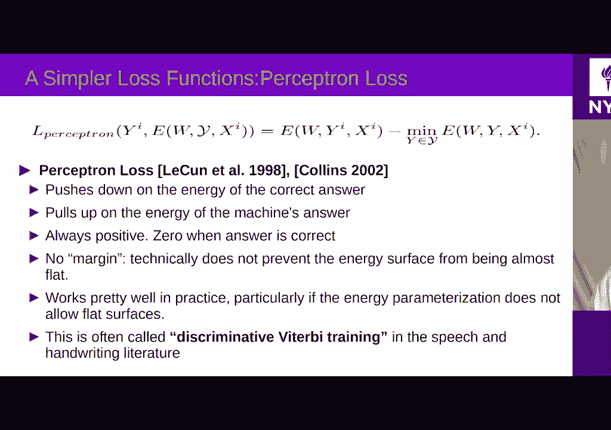

and and other types of losses here is，something that's called a perceptron。

loss because it's basically very similar，to I mean it's exactly the same as the。

loss that was used for the perceptron 60，years ago over 60 years ago so this one。

says I want to make the energy of the，correct answer small and the same time I。

want to make the energy of the smallest，the smallest energy for all answers as。

large as possible okay so pick the Y，that has the smallest energy in your。

system make that as large as you can the，same time picks the correct energy make。

that as small as you can now there is a，point at which the，answer with the correct energy is going。

to equal to the correct answer and so，that difference can never be negative。

okay because the first term is，necessarily one term in that minimum and。

so the difference is at best zero and，for every other cases is in spot this。

trick is positive it's only zero when，the system gives you the correct answer。

okay but this objective function does，not prevent the system from giving the。

very same energy to every answer okay so，in that sense it's a bad energy it's a。

bad loss function so bad a loss function，because it it says I want the energy of。

the correct answer to be small I want，the energy of all the other answers to。

be large but I don't insist that there，is any difference between them so the。

system can choose to make every answer，the same energy and that's a class okay。

so the spectrum loss is not good it's，actually only good for linear systems。

but it's not good for as a objective，function for nonlinear systems so here。

is a way to design an objective function，that will always be good and you you。

take the energy of the correct answer，and you take the energy of the most。

offending incorrect answer which means，the value of y that is incorrect but at。

the same time is the lowest energy of，all the incorrect answers okay and your。

system will work if that difference is，negative in other words if the energy of。

the correct answer is smaller than the，energy of the most of any correct answer。

but at least some quantity some margin，okay so as long as your objective。

function will you design it ensures that，the energy of the correct answer is。

smaller than the energy of the most of，any correct answer by at least a margin。

nonzero margin then you'll find your，loss function is good okay so things。

like kyndra's are good the heat loss，basically says and we talked about this。

just just before I want the energy of，the correct answer to be smaller than。

the energy of the most offending，incorrect，which is denoted why I bar here but at。

least M okay this is what this house，function does it's a hinge loss and it。

wants to push down the energy of this，guy below the energy of that guy by at。

least this margin so this has a margin M，and this will you know if you train a。

system with this loss a well and he can，run the task he will run the task and。

probably produce the good answers the，heat loss the soft hinge loss which is。

in the context of Nigeria's models is，expressed this way basically instead of。

feeling the difference between the，energies of the correct answer and the。

most offending incorrect one into a，hinge it sits it feeds it to a soft。

hinge okay which we talked about to 30，minutes ago and there this was also very。

margin the modulation will be how how to，pick em say that question would be how。

to pick em it's arbitrary，you can set n to 1 you can set m to 1/10。

I mean it's kind of arbitrary because it，will just determine the size of the。

weights of your last layer that's all it，does okay so it's basically up to you。

yeah so the soft hinge loss has an，infinite margin it wants the difference。

between those two energies to be，infinite but the the Stroop sort of。

decreases exponentially so it's it's，never going to get there because you。

know the gradients get very small as the，difference increases here's another。

example of a margin loss the square loss，the square the square square square loss。

okay so this is it also tries to make，the energy of the correct answer squared。

as small as possible and then it has a，square hinge to push away to push up the。

energy of the most offending incorrect，answers okay and again that works and。

this is very similar to the kind of laws，that people use inside these nets and。

stuff like that that you've heard about，there's a whole menagerie of such losses。

which I'm not going to go through，there's actually a whole table here。

which is also in this paper the tutorial，energy these models and what's indicated。

on the on the right side is whether they，have a margin or not so the energy loss。

does not have a margin it doesn't push，up anything so no margin it doesn't it's。

not it doesn't work always you have to，design the machine so that this just may。

work for that that system the perceptual，noise does not work in general it only。

works it works if you have a linear，parameterization of your energy as a。

function of the parameters but that's a，special case and that's the case for the。

perceptron and then some of them have a，finite margin like the hinge loss and so。

on then I have an infinite margin like，the log the soft hinge if you want much。

of how much of those losses some of，those were used were invented in the。

context of discriminative learning for，speech recognition systems but not they。

were invented before people in machine，learning actually got interested in this。

position would be like how you find the，Y bar so if you have like a discreet。

code we can find simply like you know，the minimum value but otherwise are we。

running gradient descent right so if Y，is continuous then there is no kind of。

clear definition for what is the most，offending incorrect answer okay you will。

have to define some sort of distance，around the correct answer above which。

you consider an answer to be incorrect，okay so for example you are in a。

continuous energy landscape is one-one，training sample here you want to make。

that the energy of that training sample，small easy enough compute the energy。

through your neural net push it down，back propagate update the weight so that。

the energy goes down easy enough now the，incorrect answer if you if you take an。

answer that just kind of epsilon outside，of that and you push up you know you。

your energy surface might be a little，stiff because it's completely computed。

by a paralyzed neural net so that may，not be possible so you probably want to。

have a incorrect answer that's you know，quite a bit outside that you're gonna。

you know push up and so that's how you，define you know the the whole question。

is how you define the contrasts each，sample that you gonna push up and and。

the at all of those objective functions，here those loss functions use a single。

you know Y bar negative sample but there，is no single simple single correct way。

of picking this Y bar you can imagine，you know particularly in the kind of in。

the sort of continuous case or in the，case where Y is either very very large。

or continuous and high dimensional，there's no simple way to pick to pick y。

bar you know a lot of discussions we've，had about contrasting methods that I。

shan't talk to that first time use nets，and that we talked about before where。

basically how do you pick a y bar in the，South supervised case so supervised do。

not have an X right and you know this，many ways you can you can pick it up。

it's only obvious how to pick it up in，kind of small cases I just want to point。

out the formula here at the bottom so，this is a kind of you can think of this。

as sort of a general form of of sort of，hinge type contrasted losses where you。

have an H function here think of it as a，hinge for some type okay and instead of。

that hinge you have the energy of the，correct answer so that's the energy of。

WY ixi so this is your training sample，as the energy of the system gives to the。

training sample the second term is the，energy of some other answer Y ok for the。

same X training sample and then there is，a margin but that margin C is actually a，function of。

why I and why and you might imagine the，margin is actually also a function of X。

and X I so basically you determine a，margin as a function of the distance。

between the between the Y's okay，and you feed that to let's say a hinge。

now the thing is this loss function is，summed over all wise here is a discreet。

song because Y is discrete but you could，imagine an integral okay so this kind of。

loss says you know I have an energy for，my correct answer，I have energies for every other answer。

in my space and I want to push out the，energy of all other answers but the。

amount by which I want to make them，higher the margin depends on the。

distance between between y and y y bar，or in this case between y I which is。

this and Y which is the other the other，wise okay so you can imagine that this。

margin will come you know we become，smaller and smaller as the 2y is gonna。

get closer to each other in this case，you don't push up too much four things。

are too close and you you push up in，proportion to the distance of of the Y。

you know whatever distance you you think，is appropriate this is of course a more。

difficult loss function to to optimize，and out of time so I might talk about。

the structure prediction issue that I，said I was going to talk about at a。

later time any more question，[Music]，the contrast method you'll what though。

as the cell supervised learning papers，the are you usually dump take the random。

take it and and images as a negative，examples do you have any idea be used。

these functions anyone's tried，experimented with ease either use what。

kind of function these loss functions，that you explain to us now。

so most most of them use the basically，the negative log likelihood loss here。

which in this panel is called NLM mi，okay so NCE that you you heard about。

from your shine that's for Jones right，there trying to make the distance。

between the samples as small as possible，and then the contrastive term is you。

know it's basically your log softmax of，the distances so when you compute the。

log softmax you think of distance of a，distance as an energy and then you。

compute the log softmax of those，energies you get this formula here in。

the second lashline called mi random，what is a negative example so that we。

use proximal well so basically you can't，compute this integral over all Y so or。

this sum if y is discrete and so you，basically approximate the Sun by you。

know a few terms that you pick randomly，right yeah let's go take a look。

I mean basically if you want to do this，properly you have to pick those samples。

according to the rule of Monte Carlo，sampling but it doesn't matter I mean。

that's that's why I hard- mining is hard，okay that's why what makes the。

difference between moco world seemed，clear etc is how you pick those negative。

samples that's why I said there is no，kind of in cases where the white space。

is is high dimensional is there's no you，know predefined way of taking negative，samples。

essentially it's only classification，that is easy as other people。

other losses yeah I mean there are a lot，of people using the square square or the。

the the syringe you know with the，difference of energies so some of the。

systems are used by at least at some，point the the system that deep phase。

which is the the face recognition system，that used by Facebook to to tag people。

it used a convolutional net trained in，supervised mode with a certain number of。

categories basically images from I don't，know million people or something but。

then there was a fine-tuning phase that，use metric running basically Chinese。

nets where you show two photos of the，same person and you say those are the。

same person and then two photos of，different people and you push them apart。

and that used they tried different，objective functions but I think they。

were using the square square laws at，some point maybe the squares financial。

and now entirely sure what they're using，now but you know it's one of those what。

topics you covered in the next lecture，okay so we're gonna have two guest。

lectures so next which is Michael Lewis，Michael Lewis is a research scientist at。

Facebook where research in Seattle and，he is a specialist of natural language。

processing and translation so it's gonna，you know tell you all the interesting。

tidbits about sequence to sequence about，transformers about NLP and about。

translation okay and you know he knows a，lot you know much better the details。

about this and I do so he's the right，person to talk about this we're gonna。

have another guest lecture is going to，be exactly what I saw he he's you know。

one of the world specialist of graph，neural nets and so this is the the whole。

idea of you know how do you apply your，nets you know you can think of an image。

as a function on a regular grid okay，every pixel is a location on a regular。

grid you can think of an image as a，function on that grid okay，so a grid is a graph of a particular。

type and the image is just a function on，the graph you can think of I don't know。

a video as you know a regular 3d grid，where you have space and time and you。

know most natural signals you can think，of them as functions on kind of regular。

graphs okay what about the case where，the function you're interested in is not。

on a is not on the euclidean graph if，you want so let's imagine for example。

you take a photo with a panoramic camera，okay 360 camera right so it's a camera。

that basically takes a spherical image，okay so now your your pixels live on the。

sphere how do you go to the convolution，on us here okay so you want to run your。

commercial net on this image that now，lives on the sphere，you can't use the standard ways of。

completing correlations so you have to，figure out how to compute coalition's on。

the sphere right so that's an example，now here's something a little more。

complicated imagine now that you have a，3d scanner and you're capturing I don't。

know a dancer you know someone kind of，in front of a 3d scanner and that person。

has a particular pose they'd say like，this okay，and and then you take another 3d picture。

3d data from another person and that，other person is you know in another post。

that person has a different body shape，she's in a different body pose and now。

what you want is you want to be able to，map one on to the other you want to be。

able to say like you know what is the，hand in the first person what is where。

is the hand in the second person so what，you have to do now is basically have a。

neural net that takes into account a 3d，mesh that represents the geometry of a。

hand and trainee to tell you it's a hand，so that when you apply it to the hand。

itself it's a hand when you apply to the，other parts of the body and tells you。

it's something else but the data you，have is not an image it's a 3d mesh。

okay the match may have different，resolutions the triangles make here。

occur at different places so how you，define your coalitions on the domain。

like this that is independent of the，resolution of the mesh and only kind of。

depends on the shape so that you can，classify your hand regardless of the。

orientation the size the conformation，and the body shape of the person you。

know things like that right，so here's another example that's perhaps。

more interesting you you want to do you，want to train something like like a。

Siamese net but you want to train this，aim is not to tell you whether when。

molecule is going to stick to another，molecule right so you give two molecules。

to your neural net and your neural net，produces two vectors if those two。

molecules stick together it gives you，two vectors whose distance is small okay。

and if they don't stick together then，the distance is large okay so you can。

think of the distance as kind of the，negative free energy of the binding the。

binding energy of the two you know the，two the two molecules right or the you。

know the the free energy you know minus，a constant each one so so you would。

train this as a sign is net but then the，problem is how you represent a molecule。

to a network knowing that it's the same，network you're going to apply to this。

molecule on that molecule and the two，molecules don't have the same shape they。

don't have the same length，they don't have the same number of atoms。

they don't have the same like how do you，represent a molecule the best way to。

represent a molecule is as a graph it's，basically a graph whose structure。

changes with the molecule and this graph，is annotated by the identity of the。

atoms at each site maybe by the location，in 3d space for their relative location。

maybe by the angle of the bounds between，two successive atoms or the binding。

energy of that particular bond or things，like this so so the best way to，represent a molecule is by。

by representing as a graph basically and，there's a here's another example perhaps。

more relevant to something like Facebook，let's say let's say I want to kind of。

infer or let's say Amazon or something I，want to infer what type of let's let's。

say an Amazon right and I have a，customer and that customer has bought a。

whole bunch of different things and that，customer has commented a whole bunch of。

different things I could think of kind，of encoding this as a vector but it。

would be a vector of of variable size，because you know people buy different。

numbers of things and stuff like that so，I would need to so find a way to。

aggregate that data so that everybody，can be represented by the same fixed。

size vector but what if instead I，represent the the person and although。

all the things that that person has，bought and all the you know reviews that。

person etc as a graph essentially and，then I represent what I feed to the。

neural net is the graph with values on，the nodes and perhaps the arcs if I have。

a way of representing a graph so that，you can connect a neuron that。

independently of the shape of the graph，then I can do this kind of application。

and so this is what graph neural nets，are about it's a very very hot topic at。

the moment it's extremely promising for，a lot of applications particularly in。

biomedicine you know in chemistry in，material science but also in social。

science for social network analysis and，you know all kinds of all kinds of。

applications computer graphics you know，okay good stuff so it's it's really cool。

exactly it's really one of the one of，the experts on this topic so I'm really。

happy that he accepted to give us a talk，it's not gonna be easy for them for him。

because he was in Singapore so he's，gonna be fine the morning for him that's。

right well I'm giving a lecture in a，couple days in in Hong Kong so I think。

so actually he's from Nanyang，Technological illogical university and。

university NTU right until you into you，yeah yeah correct alright so that was it，sorry。

there was one more questions yeah，was really interesting professor I had。

one no question I was reading this term，called normalizing flows yeah and I。

don't understand what they are could you，just give some intuition into why why。

people are excited about it，right so nominally flows so it's not a。

key to have a lot of experience with but，you know I've read the papers。

it's so was proposed by the nino Rezende，and check here at defined a while ago。

and a while back maybe five years ago or，so and it's a sort of a density。

estimation method so it's a little bit，like like Gans it has a bit of the same。

spirit as Gans the and it get it gets，inspiration from ICA independent。

component analysis although it's not，kind of explicit in the original paper。

but here's the basic idea，this guy is you want to train a neuron。

that to transform a known distribution，from which you can sample into a。

distribution that happens to be the，distribution of your data okay so let's。

imagine that you have a latent variable，z that you sample from a Gaussian。

distribution and you run it through a，function or uniform distribution over a。

domain okay you ready to a function，implemented by an overnight and you want。

to train this new on that so that the，distribution you get at the output is。

the one you want that corresponds to，your data okay，and so the let me give you a very simple。

example so let's say let's say I have a，variable Z and I've observed variable Y。

and I sample my variable Z with the，uniform distribution okay between say，zero and one，okay。

and what I want on the output is I don't，know say Gaussian it's kind of stupid to。

want to get in but it's say I want to，guess because I could sample from a。

Gaussian easily so what I need to do is，kind of transform this uniform。

distribution into a Gaussian by a，mapping and the mapping is going to be a。

function like it's gonna be if function，okay zero is here kind of like this if。

you want okay and and this is the，inverse of the integral of the Gaussian。

distribution okay so if I take the，derivative of this function okay so I。

don't it let me kind of draw this it's a，little difficult to see but if I map。

okay the derivative of this function，here will indicate how much I stretch a。

little piece here into a piece here，right so the larger the derivative the。

more I stretch right if the slope here，is 1 then this piece of the distribution。

here is not going to stretch it's going，to be kind of passed unchanged okay and。

the larger the district the the slope，the more I stretch the distribution I。

stretch a little piece here and，therefore I kind of distribute all the。

samples that fall into this little，location here are stretched time over a。

large region right and so what I need to，do is design this function in such a way。

that it stretches my input distribution，so that that distribution get。

transformed into the output distribution，I want alright so there is a formula。

that says so in multi dimension it's a，little more complicated than this but it。

says that the the distribution you're，going to get on Y is going to be equal，to the。

distribution that you started with in Z，multiplied by the inverse of the。

determinant of the Jacobian of this F，function so this is f minus 1 so it's。

actually the original formula is this，one but those two things are equal okay。

so if you take so this is for a，multi-dimensional vector function right。

so it has a Jacobian to map Z 2 y and so，if you take the determinant of the。

inverse Jacobian of that function which，is a scalar value indicates by how much。

the distribution gets stretched or，compressed in that case at Q so in that。

case here is the it's the compression，ratio it's the inverse of the derivative。

so it's the compression right and so the，more you compress here the model the。

probability will be high more P of Y，will be large the density P of Y for。

this Y will be large for a given Q so，this is for y equals f of Z okay。

so the big question of homology flow，methods is its how you how you do this。

right given a number of samples of P of，Y and given that you sample your。

distribution Q when you have your，distribution Q you sample from it you。

know how do you kind of minimize an，objective function that knowing that。

that you know the P you get that the，output is equal to the Q you put at the。

input multiplied by this inverse，determinant of the Jacobian of the F。

function what you have to find is the F，function so basically have to。

differentiate so basically compute a，distance between those you know。

divergence KL divergence for example，between py and the thing on the right。

side of the of the equal sign and you，have to differentiate this with respect。

to the parameters of F so you have to，basically propagate through the inverse。

gradient of the Jacobian of F right it's，not easy，very often what people do is that they。

write f as a succession a very simple F，that only modify the the distribution。

just a little bit so f very often is you，know something like the identity plus。

some deviation the bit like ResNet if，you want and then you stack lots and。

lots of layers of that and the problem，becomes simpler because when the when。

those those functions do a little bit of，modification then the a lot of those。

kind of issues can it becomes become，simple the the determinant here kind of。

simplifies okay that's a very sort of AD，try K level description of normalizing。

flow there is yeah interesting papers，about this in recent recent years on。

even recent months on so using this for，like particle physics and stuff like。

that Cramer at NYU is actually a kind of，a specialist of that thank you so much。

right any other question，okay that was it great thank you very，much everyone。

yeah see you tomorrow guys all right，bye-bye。

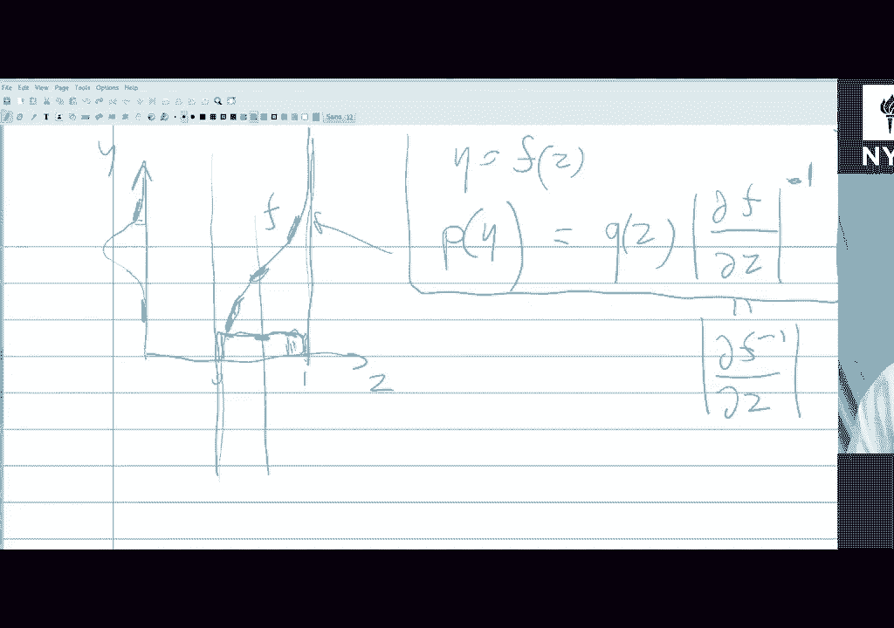