# 【NYU】纽约大学深度学习入门课程（with pytorch）中英文字幕 - P23：23.Week 12 – Practicum_ Attention and the Transformer - 大佬的迷弟的粉丝 - BV1o5411p7AB

好吧好吧好吧，所以今天我们要分享屏幕好吧，请确保屏幕确定，好吧好吧好吧，所以今天我们要分享屏幕好吧，请确保屏幕确定。

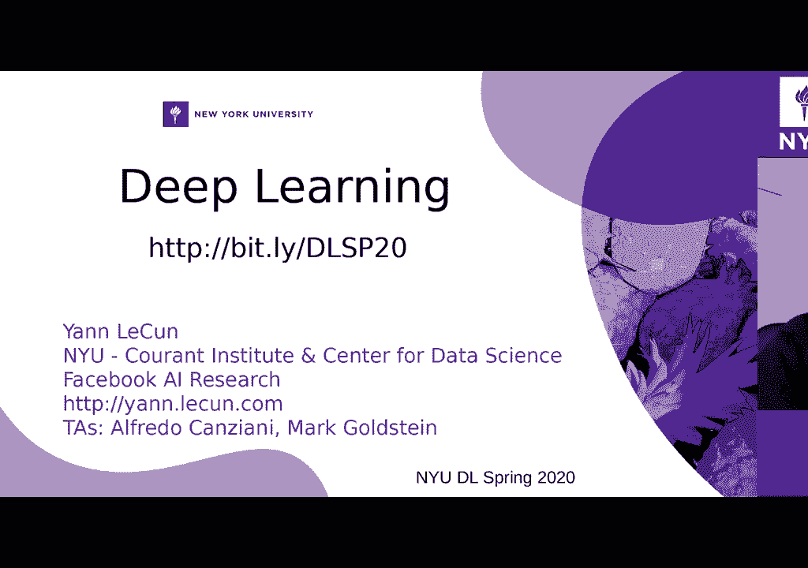

繁荣，我们走了，所以深度学习的基础就是我。

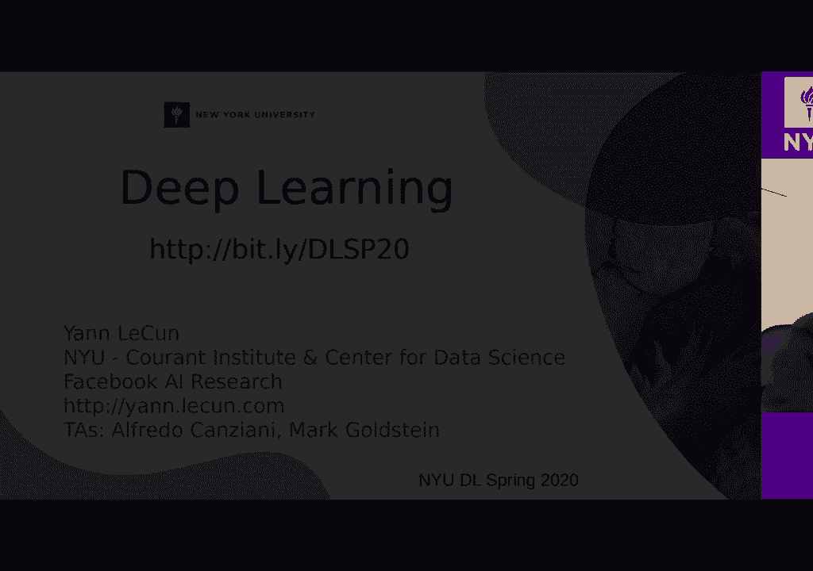

繁荣，我们走了，所以深度学习的基础就是我，在Twitter上关注我当然可以，所以今天我们要去，在Twitter上关注我当然可以，所以今天我们要去，谈论注意力，特别是有两种类型的，谈论注意力。

特别是有两种类型的，注意有自我注意或交叉注意，并且将会有，注意有自我注意或交叉注意，并且将会有，心脏的注意或柔和的注意也可以，但是一般来说，心脏的注意或柔和的注意也可以，但是一般来说，谈论注意力。

我们将要谈论与套装，谈论注意力，我们将要谈论与套装，所以，因为我要给你一个小的预览变形金刚是由，所以，因为我要给你一个小的预览变形金刚是由，注意模块变压器将成为Maps设置的对象。

注意模块变压器将成为Maps设置的对象，他们并不真正地处理序列他们可以写序列，他们并不真正地处理序列他们可以写序列，作为订单集，但他们不一定需要有订单序列，作为订单集，但他们不一定需要有订单序列。

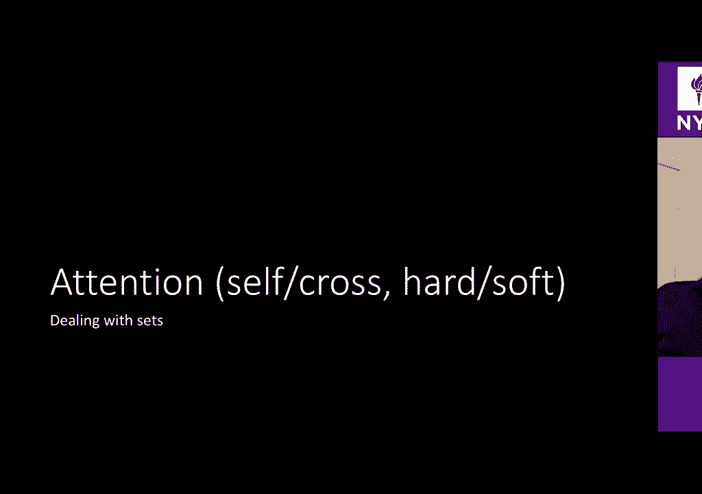

那是超级酷的部分，所以让我们开始吧，让我们考虑吧，那是超级酷的部分，所以让我们开始吧，让我们考虑吧，首先要注意自我，所以我们就像一组X轴是我的粉红色轴。

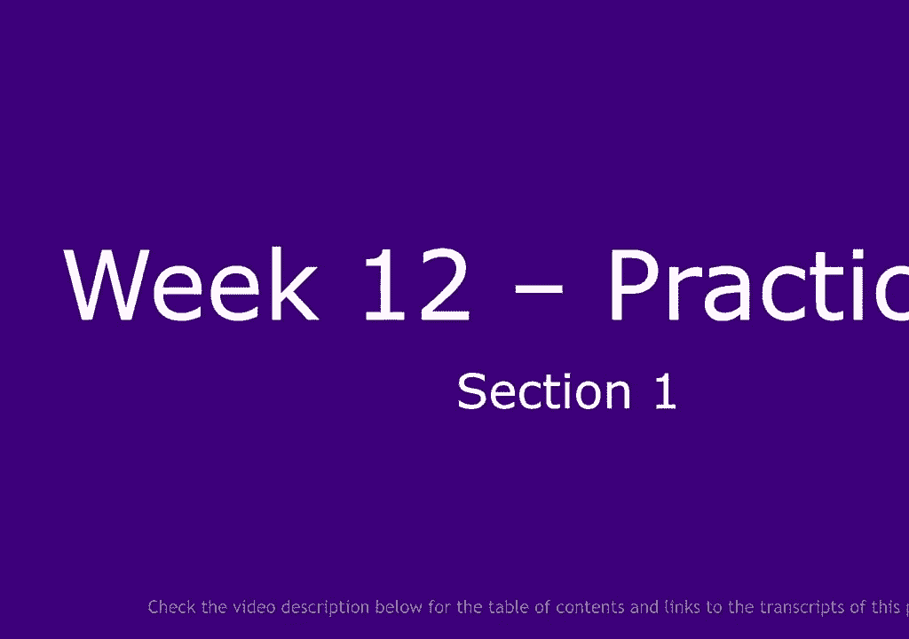

首先要注意自我，所以我们就像一组X轴是我的粉红色轴，我跟我的X下标是从1到T，所以你有T不同，我跟我的X下标是从1到T，所以你有T不同，X 1 X 2等等等等XT所以现在我们可以考虑每个。

X 1 X 2等等等等XT所以现在我们可以考虑每个，这些X属于RN，这是我们的经典表示形式，这些X属于RN，这是我们的经典表示形式，到目前为止已经看到了，所以就像n维向量，所以所有。

到目前为止已经看到了，所以就像n维向量，所以所有，这种自我注意是，我的H我隐藏的表示将是，这种自我注意是，我的H我隐藏的表示将是，这些向量的线性组合正确，所以我想如果你还记得，这些向量的线性组合正确。

所以我想如果你还记得，从其中一门课开始，就像我认为第四堂课向您展示，从其中一门课开始，就像我认为第四堂课向您展示，您可以像这种快速标记法那样的快速方法，您可以像这种快速标记法那样的快速方法。

向量rain的线性组合，只需使用矩阵，向量rain的线性组合，只需使用矩阵，乘法，因此在维度n中存在的这组X为T可以是，乘法，因此在维度n中存在的这组X为T可以是，被认为是粉红色的矩阵大写字母X。

它有n行，因为，被认为是粉红色的矩阵大写字母X，它有n行，因为，这些家伙是n，然后有T列，所以您可以考虑一下，这些家伙是n，然后有T列，所以您可以考虑一下，基本上是这些向量的水平堆栈，所以这是我的集合。

基本上是这些向量的水平堆栈，所以这是我的集合，您现在又要下订单，您现在又要下订单，所以现在这个隐藏的表示可以写成矩阵x，所以现在这个隐藏的表示可以写成矩阵x，乘以粗体粗体将这些alpha的向量乘以。

乘以粗体粗体将这些alpha的向量乘以，排版好，所以在这种情况下，我的H是X矩阵乘以a，这有点时髦，排版好，所以在这种情况下，我的H是X矩阵乘以a，这有点时髦，通常，当我们考虑隐藏的表示时，我们会旋转。

通常，当我们考虑隐藏的表示时，我们会旋转，用权重矩阵直接输入，但是在这种情况下，这是什么，用权重矩阵直接输入，但是在这种情况下，这是什么，注意力的旋转，所以这不是我真正想不到的，注意力的旋转。

所以这不是我真正想不到的，这样，我宁愿考虑一下，因为您知道，这样，我宁愿考虑一下，因为您知道，X的这些列的范围，所以这些X的线性组合很酷，因此我们可以，X的这些列的范围，所以这些X的线性组合很酷。

因此我们可以，将其写在右上角只是为了将其保存在内存中，我们现在可以考虑，将其写在右上角只是为了将其保存在内存中，我们现在可以考虑，如果我们强加这些向量的零范数，那就是，如果我们强加这些向量的零范数。

那就是，等于一，非零项也等于一，因此意味着a是一个热门，等于一，非零项也等于一，因此意味着a是一个热门，编码向量，因此如果将这些x乘以a，编码向量，因此如果将这些x乘以a，一种热点向量。

您可以选择您所知道的具体位置，一种热点向量，您可以选择您所知道的具体位置，将会有该特定的列，所以如果a的第二个元素是，将会有该特定的列，所以如果a的第二个元素是，乘以大写的X时间等于1，其他都为零。

乘以大写的X时间等于1，其他都为零，它是0-1或更高版本或其他为零，您可以调整以检索列，它是0-1或更高版本或其他为零，您可以调整以检索列，第二列在右边，所以您现在可以看到如何解决这个问题。

第二列在右边，所以您现在可以看到如何解决这个问题，注意只是关注集合中的一个元素，而仅关注一个元素，注意只是关注集合中的一个元素，而仅关注一个元素，在我们谈论心脏注意力的情况下，但是我们可以。

在我们谈论心脏注意力的情况下，但是我们可以，也有不同的注意力，那就是软注意力，也有不同的注意力，那就是软注意力，相反，约束是这些元素的总和由，相反，约束是这些元素的总和由，它们必须求和，所以这就是区别。

它们必须求和，所以这就是区别，在这种情况下，H将只是您知道这些的晚餐组合，在这种情况下，H将只是您知道这些的晚餐组合，矩阵大写X的列到目前为止可能会下雨，矩阵大写X的列到目前为止可能会下雨，我们没事了。

所以第二部分要注意第二点，我们没事了，所以第二部分要注意第二点，找出这些a的位置是从右边来的，所以在这种情况下，尽我所能，找出这些a的位置是从右边来的，所以在这种情况下，尽我所能。

弄清楚这将是这些资本X的弧线最大值还是柔和的深色最大值，弄清楚这将是这些资本X的弧线最大值还是柔和的深色最大值，我将其转置的位置，以便您表示每一行都是一个样本，然后我，我将其转置的位置。

以便您表示每一行都是一个样本，然后我，计算行和向量之间的标量积，计算行和向量之间的标量积，在最终产品中，每个元素都将成为每个元素的标量产品，在最终产品中，每个元素都将成为每个元素的标量产品。

每个人都知道针对这些特定X的向量XI从1到T，每个人都知道针对这些特定X的向量XI从1到T，好的，但是到目前为止，在我们说什么是beta之前，是否很清楚？好的，但是到目前为止。

在我们说什么是beta之前，是否很清楚？无论何时，软电弧最大值的参数都将写入温度的倒数，无论何时，软电弧最大值的参数都将写入温度的倒数，你知道柔和的黑暗质量，就是论证的博览会除以，你知道柔和的黑暗质量。

就是论证的博览会除以，X，然后在X内，我们有beta，是，beta来自哪里，X，然后在X内，我们有beta，是，beta来自哪里。

这就是每当您拥有这些soft arc max或人们称之为soft max的时候，这就是每当您拥有这些soft arc max或人们称之为soft max的时候，总是有一个beta参数，通常将其设置为1。

所以您看不到它，总是有一个beta参数，通常将其设置为1，所以您看不到它，所以在我们看到我的资本X之前，我不知道，我没有，所以在我们看到我的资本X之前，我不知道，我没有，谈论呢，所以大鸡蛋吧。

大X是这组列Tata Tata Tata，谈论呢，所以大鸡蛋吧，大X是这组列Tata Tata Tata，然后H将是这些列的线性组合，但其中，然后H将是这些列的线性组合，但其中。

这些alpha是从右边来的，所以我的给定alpha是我的第一个向量a，这些alpha是从右边来的，所以我的给定alpha是我的第一个向量a，将会成为您知道X的每个基本列的原因。

将会成为您知道X的每个基本列的原因，X中的每一行都将u转置X乘以右，得到，X中的每一行都将u转置X乘以右，得到，这两个家伙的标量积，所以你得到我的X值是多少，这两个家伙的标量积。

所以你得到我的X值是多少，我的X与我设置的其他X的其他所有值的标量积，我的X与我设置的其他X的其他所有值的标量积，是X是向量的一列是X是一个向量大小n好的，是X是向量的一列是X是一个向量大小n好的。

就像在X是通用X之前写的一样，所以我的方括号，就像在X是通用X之前写的一样，所以我的方括号，表示一个可选参数，因此您可以使用Arg max和，表示一个可选参数，因此您可以使用Arg max和，因此。

您会得到一个热的a或如果您有这个柔和的arcamax，因此，您会得到一个热的a或如果您有这个柔和的arcamax，到目前为止，我们一直在使用所有课程，到目前为止，我们一直在使用所有课程。

指数除以旧的指数权之和即，指数除以旧的指数权之和即，人们通常称之为softmax的那一种经典的吧，但是，人们通常称之为softmax的那一种经典的吧，但是，那么我们说我们有一组X的权利。

所以如果您有一组X的这些，那么我们说我们有一组X的权利，所以如果您有一组X的这些，表示您拥有一套艾滋病治疗权，因为对于每个X，您将，表示您拥有一套艾滋病治疗权，因为对于每个X，您将，有一个A。

所以如果您有很多作为矢量的辅助设备，就可以，有一个A，所以如果您有很多作为矢量的辅助设备，就可以，互相堆叠tan tan tan tan tan，您得到大写字母A，依此类推。

互相堆叠tan tan tan tan tan，您得到大写字母A，依此类推，大写字母A的高度将为T大小，因为，大写字母A的高度将为T大小，因为，T的大小，所以您知道小写字母a的大小为T只是因为您要。

T的大小，所以您知道小写字母a的大小为T只是因为您要，让X中的T移调正确，然后您将其中的T固定住，因为，让X中的T移调正确，然后您将其中的T固定住，因为，你有T X，我希望它很清楚，到目前为止还好。

你有T X，我希望它很清楚，到目前为止还好，很酷，知道现在缺少什么，所以下面是给定的，很酷，知道现在缺少什么，所以下面是给定的，现在我们有一套艾滋病，所以你要有一套，现在我们有一套艾滋病。

所以你要有一套，如果您从这张幻灯片的右上角看到年龄，那么年龄就正确了，如果您从这张幻灯片的右上角看到年龄，那么年龄就正确了，你知道大写的X和右边的矩阵相乘，所以H是，你知道大写的X和右边的矩阵相乘。

所以H是，我的X矩阵的列的线性组合正确，但是鉴于，我的X矩阵的列的线性组合正确，但是鉴于，我们将要使用很多辅助设备，最终会导致很多年龄的人，所以H是多少，我们将要使用很多辅助设备。

最终会导致很多年龄的人，所以H是多少，相同数量的A的权利，所以您将拥有这些大写的X矩阵，相同数量的A的权利，所以您将拥有这些大写的X矩阵，将会有很多列，对不起，这么小的X在soft max中。

将会有很多列，对不起，这么小的X在soft max中，属于我们的最终权利的等式是，属于我们的最终权利的等式是，X是的，所以我可以将其称为XI，而我将拥有一个I，X是的，所以我可以将其称为XI。

而我将拥有一个I，正确的是，我删除了索引，所以它变得不太混乱了，但是，正确的是，我删除了索引，所以它变得不太混乱了，但是，X是n的T，所以X换位应该是T的n，所以X会是T的n，X是n的T。

所以X换位应该是T的n，所以X会是T的n，哦X是T的n也X是所有这些列的堆栈之一，哦X是T的n也X是所有这些列的堆栈之一，彼此之间有三个，好吧，是的，我看到您可以想到两种选择，彼此之间有三个，好吧。

是的，我看到您可以想到两种选择，关于X是行的集合，这我想通常在代码中完成，关于X是行的集合，这我想通常在代码中完成，但是我认为，如果您编写数学公式，以这种方式写下来会容易得多，但是我认为。

如果您编写数学公式，以这种方式写下来会容易得多，意思是说我更喜欢，所以再说一遍，因为我们有很多艾滋病，意思是说我更喜欢，所以再说一遍，因为我们有很多艾滋病，H矩阵的许多列对。

所以我们可以简单地写为我的大写H，H矩阵的许多列对，所以我们可以简单地写为我的大写H，这些H的子集将是，这些H的子集将是，X的元素使用第一个元素，X的元素使用第一个元素，a的一列和第三列的第二列。

a的一列和第三列的第二列，关于注意力的事情很多，所以您基本上将这组X的成分混合在一起，关于注意力的事情很多，所以您基本上将这组X的成分混合在一起，我们可以通过使用这些系数来表示为矩阵。

我们可以通过使用这些系数来表示为矩阵，通过使用软argh max的Arg max来计算，其中每个分量，通过使用软argh max的Arg max来计算，其中每个分量，内部，我们可以在这里将其称为分数。

它只是标量，内部，我们可以在这里将其称为分数，它只是标量，给定X对我所有exe的所有集合的乘积好，所以这是第一个，给定X对我所有exe的所有集合的乘积好，所以这是第一个，讲座的一部分应该很清楚。

直到这里，否则我们可以继续前进，讲座的一部分应该很清楚，直到这里，否则我们可以继续前进，到目前为止是否很清楚，还是不再对第一个方程式进行解释，到目前为止是否很清楚，还是不再对第一个方程式进行解释。

一个是柔软的Arg max，值一鸡蛋乘以大鸡蛋，一个是柔软的Arg max，值一鸡蛋乘以大鸡蛋，在上一张幻灯片中，我们只是说只有一行，在上一张幻灯片中，我们只是说只有一行，基本上。

我们说隐藏层将是线性组合，基本上，我们说隐藏层将是线性组合，这些X的对是，并且这些组合使用这些alpha，这些X的对是，并且这些组合使用这些alpha，是包含在此向量中的，是的，所以我在这里写了这个。

所以H是，是包含在此向量中的，是的，所以我在这里写了这个，所以H是，将是X的列的线性组合，其中X的列，将是X的列的线性组合，其中X的列，是我设定的元素，是的，所以如果我们得到这个，我们去。

是我设定的元素，是的，所以如果我们得到这个，我们去，第二张幻灯片，我告诉你如何计算一个OK，然后计算一个，第二张幻灯片，我告诉你如何计算一个OK，然后计算一个，在这里，这将是例如柔和的黑暗最大，在这里。

这将是例如柔和的黑暗最大，人们称它为soft max，所以当您在此处使用特定的X，人们称它为soft max，所以当您在此处使用特定的X，计算这些X转置之间的乘积X转置将拥有所有。

计算这些X转置之间的乘积X转置将拥有所有，那些X排成一排，所以我让它正确地画一遍，以便X转置，那些X排成一排，所以我让它正确地画一遍，以便X转置，像第一个简单的第二个人，第三个人，然后我就做一个。

像第一个简单的第二个人，第三个人，然后我就做一个，对我的家伙在这里，所以如果你做矩阵向量乘法，对我的家伙在这里，所以如果你做矩阵向量乘法，该商品将成为第一个人对自己的这种颜色标量产品。

该商品将成为第一个人对自己的这种颜色标量产品，然后第二个人对自己，第三个人对自己，然后第二个人对自己，第三个人对自己，我是来这里的，例如，三个分数就可以了，我是来这里的，例如，三个分数就可以了。

您的向量相对于我中的三个项目基本上对齐的方式，您的向量相对于我中的三个项目基本上对齐的方式，设置，然后围绕软Arg max进行调整，这样我就得到了这三个值，设置，然后围绕软Arg max进行调整。

这样我就得到了这三个值，最后得到一个值两个第二个值最后一个第三个值，最后得到一个值两个第二个值最后一个第三个值，总而言之，是的，我会谈论这并不确定，您可以选择，总而言之，是的，我会谈论这并不确定。

您可以选择，一个你可以拥有最大的软计算能力，或者拥有等等的指数，或者，一个你可以拥有最大的软计算能力，或者拥有等等的指数，或者，您可以将arc max设置为正确，并且您基本上可以得到beta。

您可以将arc max设置为正确，并且您基本上可以得到beta，设置为非常大的值，这样您就可以简单地注销目标最大值，设置为非常大的值，这样您就可以简单地注销目标最大值，拥有很大的beta，我仍然很困惑。

为什么这是RT中的一个向量，拥有很大的beta，我仍然很困惑，为什么这是RT中的一个向量，定义一个可以的军队，所以X转置将成为我的轴，定义一个可以的军队，所以X转置将成为我的轴，正确的方向。

所以这家伙是我的X转置，正确的方向，所以这家伙是我的X转置，好的，这个长度在这里是N，这将是T，所以如果你做T，这个长度在这里是N，这将是T，所以如果你做T，倍这家伙也是n对的，你会得到一个正确的向量。

你会得到一个正确的向量，它是否使咒语成为一个热门击球手？它是否使咒语成为一个热门击球手？如果使用的是柔和的暗色，则将是arc Max或将会是更柔和的版本，如果使用的是柔和的暗色。

则将是arc Max或将会是更柔和的版本，最大权重，即X除以X素数之和，最大权重，即X除以X素数之和，将矩阵乘以向量，您将得到向量，因此，如果您要使用手臂R max，将矩阵乘以向量，您将得到向量，因此。

如果您要使用手臂R max，超过那你应该得到一个洁牙机不，没有，Arg max会给你索引，超过那你应该得到一个洁牙机不，没有，Arg max会给你索引，像一个可以与向量对应的热向量一样响。

像一个可以与向量对应的热向量一样响，想一想艺术大众艺术吧，就是给你一个拥有，想一想艺术大众艺术吧，就是给你一个拥有，最大值，其余的都将为0好的，是吗，是的，哦，是的，最大值，其余的都将为0好的，是吗。

是的，哦，是的，因此，如果您喜欢3 7 9到弧最大的向量，则可以给您0 0 1 0，因此，如果您喜欢3 7 9到弧最大的向量，则可以给您0 0 1 0，不，它会给你一个最大的位置，不。

它会给你一个最大的位置，好吧，现在是Beta Skyler，您可以认为等于1，好吧，现在是Beta Skyler，您可以认为等于1，这里没有必要哦，现在这个还可以，需要一点额外的东西，这里没有必要哦。

现在这个还可以，需要一点额外的东西，认证是我们的X术语，是那些，认证是我们的X术语，是那些，代表我们喜欢我们的输入X眼睛很抱歉X眼睛只是我的输入不。

代表我们喜欢我们的输入X眼睛很抱歉X眼睛只是我的输入不，必须成为一个热门，但如果他们代表，必须成为一个热门，但如果他们代表，还是不，我想它们通常是嵌入的，所以实际上，还是不，我想它们通常是嵌入的。

所以实际上，密集，所以我不认为它们还可以，那么X换位的X就是那种，密集，所以我不认为它们还可以，那么X换位的X就是那种，乘以就是确定之间的相似性，所以这是，乘以就是确定之间的相似性，所以这是。

确定我的一组X中的每个元素与我的X相似的程度，确定我的一组X中的每个元素与我的X相似的程度，所以这告诉我这里所有这些家伙在相似方面如何相似，所以这告诉我这里所有这些家伙在相似方面如何相似。

到这里来的那个家伙好吧，我觉得很酷很酷，到这里来的那个家伙好吧，我觉得很酷很酷，好吧，这是第一部分，让我们继续前进，看看它们如何，好吧，这是第一部分，让我们继续前进，看看它们如何，改进并喜欢扩展。

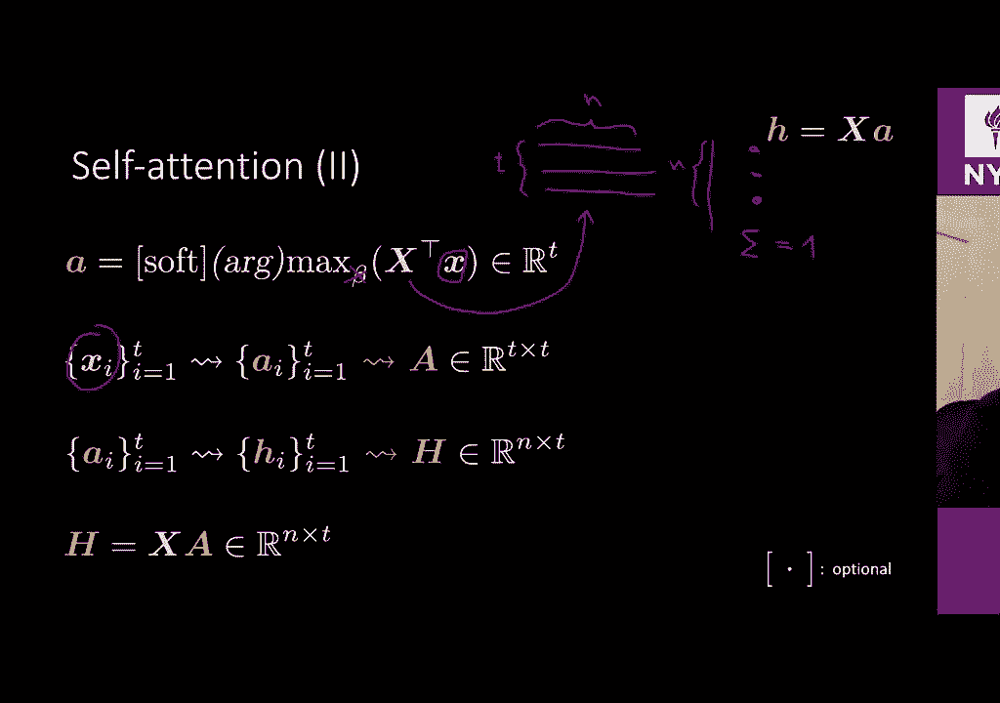

所以在这里我们有一个定义，键值存储是关于数据结构的，所以在这里我们有一个定义，键值存储是关于数据结构的，只是为了给您一点定义，所以这是一个范例，只是为了给您一点定义，所以这是一个范例。

用于存储保存的检索Aquarion或管理关联数组或，用于存储保存的检索Aquarion或管理关联数组或，字典或哈希表是什么意思，例如您要输入，字典或哈希表是什么意思，例如您要输入，有些您知道的问题。

例如，您想查看有关如何，有些您知道的问题，例如，您想查看有关如何，在YouTube上做一个千层面，所以你要去YouTube上写千层面，在YouTube上做一个千层面，所以你要去YouTube上写千层面。

无论您按什么回车，您都会有一个查询，然后该查询将成为，无论您按什么回车，您都会有一个查询，然后该查询将成为，检查数据集中所有可能的键，这些键可能像，检查数据集中所有可能的键，这些键可能像。

视频标题或说明权利，以便您检查，视频标题或说明权利，以便您检查，行是您针对YouTube中所有可用标题的查询，行是您针对YouTube中所有可用标题的查询，找到最大匹配分数后，就可以正确设置数据。

找到最大匹配分数后，就可以正确设置数据，正确，所以如果您使用arc max，则只检索一个视频，否则，正确，所以如果您使用arc max，则只检索一个视频，否则，这些柔和的弧度最大值。

您基本上可以获得正确的概率分布，并且，这些柔和的弧度最大值，您基本上可以获得正确的概率分布，并且，那么您就可以按顺序进行检索，可以首先检索最对齐的，那么您就可以按顺序进行检索，可以首先检索最对齐的。

您知道的视频序列会越来越少，您知道的视频序列会越来越少，正确的视频，到目前为止，这个关键值存储区是什么还不清楚，正确的视频，到目前为止，这个关键值存储区是什么还不清楚，范式正确，所以您只有一个查询。

这是给定一个查询的问题，范式正确，所以您只有一个查询，这是给定一个查询的问题，您检查了所有的钥匙，就可以发现钥匙相对于，您检查了所有的钥匙，就可以发现钥匙相对于，您的查询。

然后检索所有这些视频所有这些值对所有，您的查询，然后检索所有这些视频所有这些值对所有，这些内容，所以我们将在这里做完全一样的，这些内容，所以我们将在这里做完全一样的，在这种情况下，对了。

所以我们将专门研究一下我们所拥有的，在这种情况下，对了，所以我们将专门研究一下我们所拥有的，到目前为止看的很漂亮，你知道琐碎的是这里的标题，到目前为止看的很漂亮，你知道琐碎的是这里的标题，是正确的视频。

所以键是所有，是正确的视频，所以键是所有，YouTube中的视频您有一个查询千层面，YouTube中的视频您有一个查询千层面，我已经煮过烤宽面条了，我对照所有的钥匙检查了这个问题，我已经煮过烤宽面条了。

我对照所有的钥匙检查了这个问题，然后，当您发现自己对艺术的最高认识时，便会发现最高的指数，然后，当您发现自己对艺术的最高认识时，便会发现最高的指数，如果执行柔和的深色最大值，您将一次或一次检索到该值。

如果执行柔和的深色最大值，您将一次或一次检索到该值，像概率一样，现在您可以按概率排序，例如，所以我们，像概率一样，现在您可以按概率排序，例如，所以我们，现在有查询键和值，那么这些又是什么呢？

现在有查询键和值，那么这些又是什么呢？我所有的特定输入X都正确，所以我的Q将在这里旋转我的X，我所有的特定输入X都正确，所以我的Q将在这里旋转我的X，它由WQ决定。

然后我的钥匙将再次变为XI由K的W旋转，然后，它由WQ决定，然后我的钥匙将再次变为XI由K的W旋转，然后，我有V的值，很抱歉，到目前为止，我要以WV旋转X，我有V的值，很抱歉，到目前为止。

我要以WV旋转X，刚刚又添加了三个矩阵，这就像您如何知道添加，刚刚又添加了三个矩阵，这就像您如何知道添加，到目前为止，我们终于添加了一些训练参数，到目前为止，我们终于添加了一些训练参数，到目前为止。

没有任何培训委员会的参数，到目前为止，没有任何培训委员会的参数，在宽面条比喻中成为X X是我非常饿，所以我非常饿，在宽面条比喻中成为X X是我非常饿，所以我非常饿，去尝试写一些关于如何把食物做好的问题。

但是，去尝试写一些关于如何把食物做好的问题，但是，然后我也知道会做饭，所以我也可以检查那里的一切，然后我也知道会做饭，所以我也可以检查那里的一切，你走对了，所以关于烤宽面条，你走对了，所以关于烤宽面条。

好的，所以我很饿，这将是我的hack X，所以我的查询将是，好的，所以我很饿，这将是我的hack X，所以我的查询将是，我能找到的最好的食谱，然后我就可以自己检查自己的记忆，我能找到的最好的食谱。

然后我就可以自己检查自己的记忆，头上所有可能的千层面食谱我都准备好了我母亲所有的食谱，所以我，头上所有可能的千层面食谱我都准备好了我母亲所有的食谱，所以我，可以检查检查检查检查检查。

我看到了我的祖母烤宽面条，然后我，可以检查检查检查检查检查，我看到了我的祖母烤宽面条，然后我，从我奶奶那里得到了食谱，这是你知道的，很有意义，从我奶奶那里得到了食谱，这是你知道的，很有意义，对，我饿了。

为什么我们不加，对，我饿了，为什么我们不加，是这里的非线性，是的，这只是这些注意事项，是这里的非线性，是的，这只是这些注意事项，完全基于方向对，我们要检查什么是，完全基于方向对，我们要检查什么是。

这些向量的方向，这就是注意力的运作方式，我们不喜欢，这些向量的方向，这就是注意力的运作方式，我们不喜欢，非线性唯一的非线性是每当您尝试获得概率时，非线性唯一的非线性是每当您尝试获得概率时。

你知道分配的权利，柔和的黑暗最大有意义，很酷，你知道分配的权利，柔和的黑暗最大有意义，很酷，好的，所以您就加入了，所以我们现在再次介绍这些学习，好的，所以您就加入了，所以我们现在再次介绍这些学习。

这样我们就可以训练一些正确的机器学习参数，这样我们就可以训练一些正确的机器学习参数，好吧，所以Q和K必须具有相同的长度和正确的尺寸，好吧，所以Q和K必须具有相同的长度和正确的尺寸。

因为您要检查一个查询一个问题如何对所有面条做千层面，因为您要检查一个查询一个问题如何对所有面条做千层面，标题的可能表示，所以他们必须拥有，标题的可能表示，所以他们必须拥有，相同的长度。

因为否则您将无法正确检查方向，相同的长度，因为否则您将无法正确检查方向，在同一空间中V是V是我的食谱的内容我不在乎，在同一空间中V是V是我的食谱的内容我不在乎，关于长度，您可以知道我食谱的五页，所以。

关于长度，您可以知道我食谱的五页，所以，只是您知道这就是整个食谱，所以就我而言，V很大，只是您知道这就是整个食谱，所以就我而言，V很大，键是标题的表示形式，与标题的大小匹配，键是标题的表示形式。

与标题的大小匹配，正确表示问题的方式让我们将您知道的事情变得简单，正确表示问题的方式让我们将您知道的事情变得简单，向下弯曲我们刚才说的所有内容D等于D秒等于D。

向下弯曲我们刚才说的所有内容D等于D秒等于D，对，所以一切都不过是D，所以我们说我们有一个序列，我们知道，对，所以一切都不过是D，所以我们说我们有一个序列，我们知道，顺序权，如果我错了。

我们有一组X的权利，因此给定，顺序权，如果我错了，我们有一组X的权利，因此给定，一组X，因此您将获得一组查询和一组键，一组X，因此您将获得一组查询和一组键，以及一组名为的值，是的，正如您可以想象的那样。

您将获得一个，以及一组名为的值，是的，正如您可以想象的那样，您将获得一个，您知道卡在所有提示的所有列中的矩阵，您知道卡在所有提示的所有列中的矩阵，降低所有情况一次开始，所有值降低，降低所有情况一次开始。

所有值降低，所以你有多少列，你有T列，因为你卡住了T，所以你有多少列，你有T列，因为你卡住了T，向量正确向量的高度是多少，向量正确向量的高度是多少，好吧，因为您刚才我们刚刚说了mmm，接下来呢，好吧。

因为您刚才我们刚刚说了mmm，接下来呢，所以在我们说我的a是ha的弧度最大值上的这些柔和的黑暗最大值，所以在我们说我的a是ha的弧度最大值上的这些柔和的黑暗最大值，现在您要针对所有这些键检查一个查询。

所以我们首先倾斜，现在您要针对所有这些键检查一个查询，所以我们首先倾斜，K使我拥有我的Rose right tan tan tan tan，然后我将第一个乘以。

K使我拥有我的Rose right tan tan tan tan，然后我将第一个乘以，将我的第一个键乘以四次查询，第二个键乘以K查询，将我的第一个键乘以四次查询，第二个键乘以K查询。

第三键等等等等我有多少行我有T小写字母T对吗，第三键等等等等我有多少行我有T小写字母T对吗，因此，最后您获得了T分数，现在您可以计算出柔和的黑暗最大值和，因此，最后您获得了T分数。

现在您可以计算出柔和的黑暗最大值和，因此我们得到了正确的概率，嗯，我认为这是有道理的，因此我们得到了正确的概率，嗯，我认为这是有道理的，对我来说我有意义，我花了一些时间，但对，您知道吗？

对我来说我有意义，我花了一些时间，但对，您知道吗？是的Q和K有什么区别好吗，他代表的关键是，是的Q和K有什么区别好吗，他代表的关键是，食谱食谱书中的标题对q是我要提出的问题。

食谱食谱书中的标题对q是我要提出的问题，千层面，然后我检查食谱书的所有标题，例如如何制作披萨，千层面，然后我检查食谱书的所有标题，例如如何制作披萨，如何制作面食如何制作馄饨如何制作饺子如何制作。

如何制作面食如何制作馄饨如何制作饺子如何制作，讲坛托尼如何做千层面嘿，你去那里，你会得到高分，讲坛托尼如何做千层面嘿，你去那里，你会得到高分，您会检索到一个不错的代码，因此我了解了为什么查询。

您会检索到一个不错的代码，因此我了解了为什么查询，衍生了X的生物转化，但我不明白为什么K和V也是，衍生了X的生物转化，但我不明白为什么K和V也是，从X导出有一个值，所以在您的模拟II V中将是一个视频。

因此，从X导出有一个值，所以在您的模拟II V中将是一个视频，因此，为什么我们从“是”中得出它说您是完全正确的，所以，为什么我们从“是”中得出它说您是完全正确的，所以，将会是下一张幻灯片。

但是这张被称为自我关注，所以你，将会是下一张幻灯片，但是这张被称为自我关注，所以你，其实是在做回顾性的工作，其实是在做回顾性的工作，想做烤宽面条，让我更认真地思考我能做些什么食谱，想做烤宽面条。

让我更认真地思考我能做些什么食谱，做，啊哈找到了，然后我有我的食谱，所以一切都是我的头，做，啊哈找到了，然后我有我的食谱，所以一切都是我的头，鉴于我的脑袋是XI，只有三件事来自我的脑袋。

鉴于我的脑袋是XI，只有三件事来自我的脑袋，这就是所谓的“自我注意”，否则，如果您比较正常，这就是所谓的“自我注意”，否则，如果您比较正常，比我，你走了我得到一本食谱书，比我，你走了我得到一本食谱书。

您会得到这个问题来自您的前任或您的大脑，您会得到这个问题来自您的前任或您的大脑，但是然后键和值来自正确的书，所以键和值，但是然后键和值来自正确的书，所以键和值，你会把他们带到别的地方。

并且会有交叉的注意，你会把他们带到别的地方，并且会有交叉的注意，对，是的，您针对所有这些孩子检查了您的查询，他们，对，是的，您针对所有这些孩子检查了您的查询，他们，最后三件事没关系。

所以接下来的下一步将是事实，最后三件事没关系，所以接下来的下一步将是事实，是的，我们说隐藏层将是这些的线性组合，是的，我们说隐藏层将是这些的线性组合，V知道这些V列使我的矩阵再次被这些元素加权。

V知道这些V列使我的矩阵再次被这些元素加权，系数alphas在我的范围内，所以这与我们完全一样，系数alphas在我的范围内，所以这与我们完全一样，以前见过，但我只是指定了专门的但专门的那些，以前见过。

但我只是指定了专门的但专门的那些，而不是一直使用X，而您知道X换位了，我现在有了键，而不是一直使用X，而您知道X换位了，我现在有了键，水瓶座和价值观权利查询键查询一侧，然后键和。

水瓶座和价值观权利查询键查询一侧，然后键和，昨天在阿尔弗雷多（Alfredo）的另一边，向您和教授讲课，昨天在阿尔弗雷多（Alfredo）的另一边，向您和教授讲课，拉康（Lacan）说。

只有一种可能像一个居里，但有多个你知道一个，拉康（Lacan）说，只有一种可能像一个居里，但有多个你知道一个，curium有多个键和值，因此这里表示1x只有一个居里，curium有多个键和值。

因此这里表示1x只有一个居里，我喜欢1qi current 1x I，但是它必须正确交互所有其他键，我喜欢1qi current 1x I，但是它必须正确交互所有其他键，完全可以，谢谢您提醒我。

这就是这里的重点，完全可以，谢谢您提醒我，这就是这里的重点，这行是我向您展示的最后一行，您在一个Q中有一个Q这是一个，这行是我向您展示的最后一行，您在一个Q中有一个Q这是一个。

问题如何制作烤宽面条你要检查这些如何匹配所有，问题如何制作烤宽面条你要检查这些如何匹配所有，书中的书名正确，因此将要遍历所有书名的一个问题，书中的书名正确，因此将要遍历所有书名的一个问题，塔塔塔塔吨。

以便找到正确的标题是正确的，塔塔塔塔吨，以便找到正确的标题是正确的，问题如何做烤宽面条，你检查如何做比萨如何做，问题如何做烤宽面条，你检查如何做比萨如何做。

意大利面食如何使意大利式饺子如何使讲坛上它取一个名字，意大利面食如何使意大利式饺子如何使讲坛上它取一个名字，那个实际上匹配正确的那个，所以你有一个，那个实际上匹配正确的那个，所以你有一个。

您检查我们的许多钥匙，然后检索那一个的值，您检查我们的许多钥匙，然后检索那一个的值，比赛，或者如果您实际上有两个高分，则可以混合食谱，比赛，或者如果您实际上有两个高分，则可以混合食谱，对。

然后我不知道插值的合理性，对，然后我不知道插值的合理性，有人在之前通过两个食谱说话，所以如果我检查一下如何，有人在之前通过两个食谱说话，所以如果我检查一下如何，做烤宽面条，然后在我的书中。

我把烤宽面条放在结尾，然后我，做烤宽面条，然后在我的书中，我把烤宽面条放在结尾，然后我，不知道其他听起来很相似的东西，所以如果这个词，不知道其他听起来很相似的东西，所以如果这个词。

您正在寻找或让我想到另一个词，例如说我想，您正在寻找或让我想到另一个词，例如说我想，做披萨，但是还有另一种叫做鸡肉披萨的食谱，做披萨，但是还有另一种叫做鸡肉披萨的食谱，真主与真主就像披萨，但类似披萨。

但如果我，真主与真主就像披萨，但类似披萨，但如果我，还要寻找比萨饼比萨真主会像一个更高的匹配分数，还要寻找比萨饼比萨真主会像一个更高的匹配分数，是的，所以如果我拿起art max来做披萨。

如果我做得很好，是的，所以如果我拿起art max来做披萨，如果我做得很好，拿出柔和的深色，我要搭配披萨和披萨，拿出柔和的深色，我要搭配披萨和披萨，阿拉，因为它们相似，所以你会得到一些你知道的大概率。

阿拉，因为它们相似，所以你会得到一些你知道的大概率，大量的客串，所以在另一个家伙中，然后当您检索值时，值，大量的客串，所以在另一个家伙中，然后当您检索值时，值，将再次成为这些列的线性组合。

将再次成为这些列的线性组合，乘以这些系数，因此，如果您有一个热点，您将得到，乘以这些系数，因此，如果您有一个热点，您将得到，只是一个值，但是如果您知道多个值，只是一个值，但是如果您知道多个值，例如。

如果您喜欢柔和的黑暗最大值，那么您可能知道几个值，例如，如果您喜欢柔和的黑暗最大值，那么您可能知道几个值，将会混合在一起，你说我们有两个非常接近的候选人，将会混合在一起，你说我们有两个非常接近的候选人。

具有很高的价值，然后说是披萨和Yola，但在这里，我的居里Q，具有很高的价值，然后说是披萨和Yola，但在这里，我的居里Q，只有一个，所以Q将是披萨，但是在钥匙内有两个，只有一个，所以Q将是披萨。

但是在钥匙内有两个，比萨饼和披萨Yola的食谱这两个非常相似，所以两者，比萨饼和披萨Yola的食谱这两个非常相似，所以两者，他们的分数会在某种程度上相似，所以无论何时，他们的分数会在某种程度上相似。

所以无论何时，柔和的弧度最大值，您不会只得到一个非常高的分数，也许会得到一个，柔和的弧度最大值，您不会只得到一个非常高的分数，也许会得到一个，高分，然后又是另一个高分，所以H，高分，然后又是另一个高分。

所以H，将成为这些食谱的线性组合，就像，将成为这些食谱的线性组合，就像，比萨和披萨的平均水平Ola知道了，是的，我真的很有意义，比萨和披萨的平均水平Ola知道了，是的，我真的很有意义。

谢谢你当然还有另一个问题，谢谢你当然还有另一个问题，好吧，也许我们应该继续前进，因为我们还有15分钟还好，还有多少，好吧，也许我们应该继续前进，因为我们还有15分钟还好，还有多少，排队。

我们有T Q的权利吗？我们有很多杀人事件，因此所有人都持有，排队，我们有T Q的权利吗？我们有很多杀人事件，因此所有人都持有，那么什么是beta beta，我们想设置为，那么什么是beta beta。

我们想设置为，比D的平方根大1，这是为什么，因为如果有一个全为矢量的向量，比D的平方根大1，这是为什么，因为如果有一个全为矢量的向量，在一个维度中，一个向量的长度是二维的，在一个维度中。

一个向量的长度是二维的，全部为向量的向量坐标将是2的平方根，全部为向量的向量坐标将是2的平方根，在三个维度上具有所有分量的那个将具有平方根，在三个维度上具有所有分量的那个将具有平方根，如果您有四个分量。

则三分之二可以是平方根，如果您有四个分量，则三分之二可以是平方根，您在D维上的矢量将使幅度随着，您在D维上的矢量将使幅度随着，尺寸等的平方根以便保持温度，尺寸等的平方根以便保持温度。

这些软电弧最大值的常数，我们要除以，这些软电弧最大值的常数，我们要除以，再次选择尺寸数如果您不重新获得技术性，则无关紧要，再次选择尺寸数如果您不重新获得技术性，则无关紧要，我们有多少次询问。

因此我们可以正确获得T艾滋病，因此我们，我们有多少次询问，因此我们可以正确获得T艾滋病，因此我们，得到一个矩阵资本a所以最后你会得到一个大H，得到一个矩阵资本a所以最后你会得到一个大H。

这些值乘以这个矩阵就知道列在哪里，这些值乘以这个矩阵就知道列在哪里，将成为混合成分，这几乎与交叉交叉有关，将成为混合成分，这几乎与交叉交叉有关，请注意，您能确切地说出为什么要排队和照料相同尺寸的东西。

但是，请注意，您能确切地说出为什么要排队和照料相同尺寸的东西，但是，V是他们的朋友，我希望键以及VK和V具有相同的尺寸，V是他们的朋友，我希望键以及VK和V具有相同的尺寸。

但是Q可以成为其他东西V可以成为我的比萨食谱吧，但是Q可以成为其他东西V可以成为我的比萨食谱吧，会长10页，哦，不能长一页，取而代之的是Q和K，会长10页，哦，不能长一页，取而代之的是Q和K。

问题和标题，它们必须匹配，因为我要，问题和标题，它们必须匹配，因为我要，比较，就像我要比较的是什么，你知道程度正确吗，比较，就像我要比较的是什么，你知道程度正确吗，这两个是对齐的。

这是从这里的东西而来的，所以每当我，这两个是对齐的，这是从这里的东西而来的，所以每当我，根据所有键检查我的查询，我做了滚动时间向量，它们有，根据所有键检查我的查询，我做了滚动时间向量，它们有。

具有相同的尺寸和相同的长度，否则我无法相乘，具有相同的尺寸和相同的长度，否则我无法相乘，因此，您可以根据所有这些键检查问题，知道您可以参加运动，因此，您可以根据所有这些键检查问题，知道您可以参加运动。

是的，我认为该矩阵然后您可以得到整个配方，是的，我认为该矩阵然后您可以得到整个配方，YouTube影片或肉类烹饪法，YouTube影片或肉类烹饪法，好的，谢谢你确定我什么时候都饿好的，所以一个，好的。

谢谢你确定我什么时候都饿好的，所以一个，众所周知的实现细节，例如可以使事情更快，并且我们可以堆叠，众所周知的实现细节，例如可以使事情更快，并且我们可以堆叠，所有这些加倍成一个完整的W对，然后BOOM。

您比较一下就可以了，所有这些加倍成一个完整的W对，然后BOOM，您比较一下就可以了，一次迭代一次一秒地计算所有Q和K和D，一次迭代一次一秒地计算所有Q和K和D。

没什么花哨的Ryan我们之前已经为RNN做过同样的事情，请记住我们，没什么花哨的Ryan我们之前已经为RNN做过同样的事情，请记住我们，被卡在X和H中，并使用库存版本进行计算，被卡在X和H中。

并使用库存版本进行计算，右上方的W统治时期，所以没什么好看的，右上方的W统治时期，所以没什么好看的，还有别的东西叫做元首，所以这可以代表一个元首，但是我们可能，还有别的东西叫做元首。

所以这可以代表一个元首，但是我们可能，有多个头，例如H头，所以如果我有h头，我将有h qs，有多个头，例如H头，所以如果我有h头，我将有h qs，我有年龄的情况，我要有H B，所以您最终会得到一个。

我有年龄的情况，我要有H B，所以您最终会得到一个，将会高出H倍的东西，但是您仍然可以将其取回，将会高出H倍的东西，但是您仍然可以将其取回，到任何尺寸，如果你在最后把这个大家伙相乘，现在这个决赛。

到任何尺寸，如果你在最后把这个大家伙相乘，现在这个决赛，大向量，它最终将成为B的向量，您可以，大向量，它最终将成为B的向量，您可以，用矩阵乘以使其回到D的大小，这是一种可能的方法。

用矩阵乘以使其回到D的大小，这是一种可能的方法，正确地实现这些东西，但细节同样不重要，让我们开始吧。

正确地实现这些东西，但细节同样不重要，让我们开始吧，最终对这台变压器来说，这台变压器到底是什么东西，所以，最终对这台变压器来说，这台变压器到底是什么东西，所以。

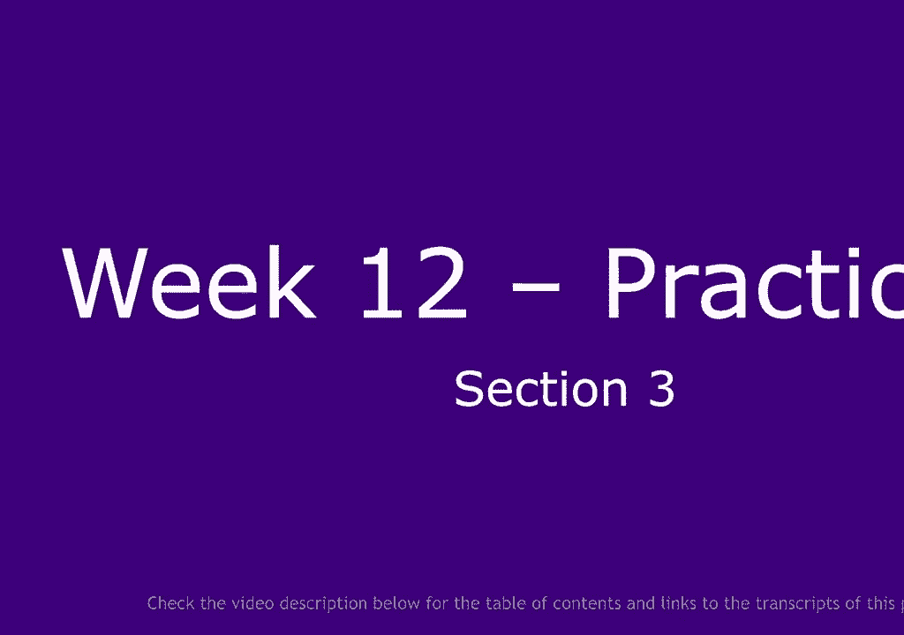

这个变压器是由两块组成的，这个变压器是由两块组成的，编码器和解码器还可以，所以我们以前看过哪里？编码器和解码器还可以，所以我们以前看过哪里？架构中的看门人在那里编码器，架构中的看门人在那里编码器。

您可以回顾一下编码器，然后再看编码器，您可以回顾一下编码器，然后再看编码器，今天左边我们将把图集中在右边，今天左边我们将把图集中在右边，一边，你有两个块，你有一个编码器，我有一个解码器，编码器，一边。

你有两个块，你有一个编码器，我有一个解码器，编码器，将X映射到隐藏的表示形式，然后解码器将隐藏的表示形式映射，将X映射到隐藏的表示形式，然后解码器将隐藏的表示形式映射，再次代表这些输入，但我们不必。

再次代表这些输入，但我们不必，我们在应用程序输出编码器中拥有这两个主要组件，因此在，我们在应用程序输出编码器中拥有这两个主要组件，因此在，在这种情况下，我们或多或少会有类似的东西，所以这是。

在这种情况下，我们或多或少会有类似的东西，所以这是，变压器编码器是紫色块，所以在这些家伙中，变压器编码器是紫色块，所以在这些家伙中，我们要让自我关注变得很酷，我们已经知道鞋帮的含义了。

我们要让自我关注变得很酷，我们已经知道鞋帮的含义了，部分，我们将在这里运行基本上一个线性层，部分，我们将在这里运行基本上一个线性层，因此，如果您考虑卷积与，因此，如果您考虑卷积与，内核大小。

您基本上将相同的线性层应用于每个元素，内核大小，您基本上将相同的线性层应用于每个元素，在设定的权利中，有时他们称其为前馈，但是，在设定的权利中，有时他们称其为前馈，但是。

这将是应用于集合中每个元素的前馈，因此，这将是应用于集合中每个元素的前馈，因此，实际上是一个卷积，其中卷积核等于，实际上是一个卷积，其中卷积核等于，我们应用了一些模块，可以在两个，我们应用了一些模块。

可以在两个，这些家伙，这是什么模块，所以这个家伙是，这些家伙，这是什么模块，所以这个家伙是，基本上，这里有两个组件的盒子有一个附加组件，基本上，这里有两个组件的盒子有一个附加组件，然后可以进行层归一化。

所以如果我们在，然后可以进行层归一化，所以如果我们在，右手边，你会得到自我注意力基本上有一个，右手边，你会得到自我注意力基本上有一个，剩余的连接，但是那样绕过它，然后层，剩余的连接，但是那样绕过它。

然后层，归一化，对于顶部的其他人也是如此，归一化，对于顶部的其他人也是如此，卷积部分具有这些剩余连接，并且是层归一化，卷积部分具有这些剩余连接，并且是层归一化，所以它如何处理您想要放到的所有这些东西。

所以它如何处理您想要放到的所有这些东西，在底部输入，然后将其设为blah blah向上气泡，然后，在底部输入，然后将其设为blah blah向上气泡，然后，您会在编码器的输出端获得隐藏的表示，因此该H。

您会在编码器的输出端获得隐藏的表示，因此该H，编码器的东西花哨的权利，我只是把两个块，编码器的东西花哨的权利，我只是把两个块，我们实际上在一次反卷积之前就已经看到了自我关注。

我们实际上在一次反卷积之前就已经看到了自我关注，知道它是如何工作的就是应用，只是您知道单个多层，知道它是如何工作的就是应用，只是您知道单个多层，感知该集合中的每个组件，然后进行归一化可以帮助您。

感知该集合中的每个组件，然后进行归一化可以帮助您，知道稍后获得这些梯度以及接收器连接，知道稍后获得这些梯度以及接收器连接，连接使一切顺利，所以这是编码器怎么办，连接使一切顺利，所以这是编码器怎么办。

我们在这种情况下是什么解码器，所以让我整理一点，让，我们在这种情况下是什么解码器，所以让我整理一点，让，我先移除编码器框，然后移除旧区域Teledyne让我，我先移除编码器框。

然后移除旧区域Teledyne让我，实际上甚至将这些X移到底部，最后移走，实际上甚至将这些X移到底部，最后移走，这是编码器，但现在我要删除其中的连接，这是编码器，但现在我要删除其中的连接，中心po好。

所以现在我们将要讨论解码器，因此，中心po好，所以现在我们将要讨论解码器，因此，解码器与编码器完全一样，但我会像这样，解码器与编码器完全一样，但我会像这样，你们当中有人提到过，当然是他们在问。

你们当中有人提到过，当然是他们在问，我为什么你要亲自检查这些钥匙，所以这个十字架，我为什么你要亲自检查这些钥匙，所以这个十字架，在这些标准化模块和，在这些标准化模块和，当然。

交叉注意会从最后一层获取这些隐藏的表示，当然，交叉注意会从最后一层获取这些隐藏的表示，编码器，然后还有其他东西，所以，编码器，然后还有其他东西，所以，加法和归一化，将这些东西连接起来，然后最后将其插入。

加法和归一化，将这些东西连接起来，然后最后将其插入，回到右边，所以我们有一个额外的模块，这将是我的解码器，所以，回到右边，所以我们有一个额外的模块，这将是我的解码器，所以，解码器就像编码器。

但是将这个附加模块夹在中间，解码器就像编码器，但是将这个附加模块夹在中间，在这些以前的之间，你能不能说更多关于交叉注意的问题，在这些以前的之间，你能不能说更多关于交叉注意的问题，交叉注意恰恰是自我关注。

但，交叉注意恰恰是自我关注，但，你有一个事实，就是我的钥匙像这里的X和这里的那个家伙不再是X。

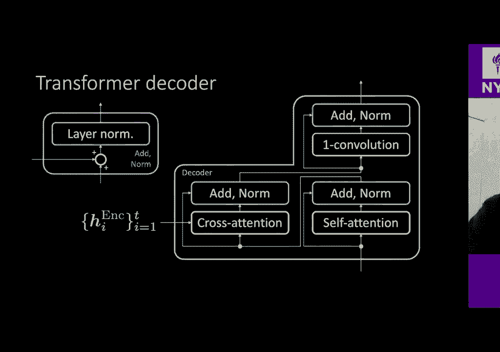

你有一个事实，就是我的钥匙像这里的X和这里的那个家伙不再是X，但是从编码器的角度来看，这将是我的年龄，但是从编码器的角度来看，这将是我的年龄，和编码器这是正确的设定，所以我仍然喜欢所有年龄段的设定。

和编码器这是正确的设定，所以我仍然喜欢所有年龄段的设定，一样，用鼠标也可以尝试一下，所以这是，一样，用鼠标也可以尝试一下，所以这是，完全一样，只是我将X替换成最终的，完全一样，只是我将X替换成最终的。

编码数组的表示形式，就是这个家伙在这里。

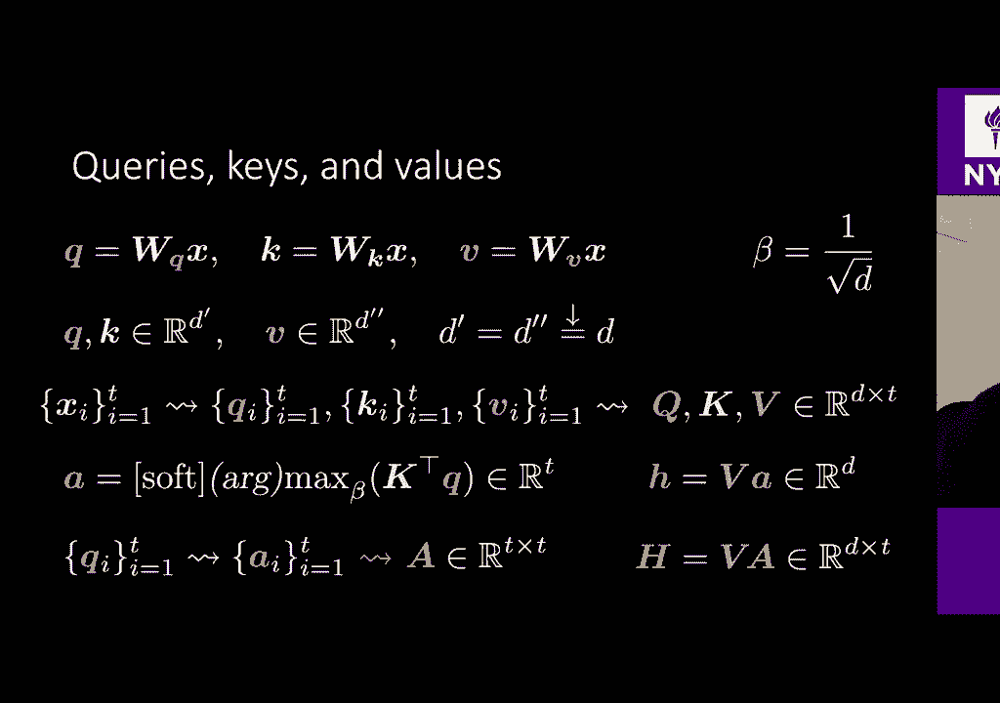

编码数组的表示形式，就是这个家伙在这里，向我提供值和键，因此我们仍然使用原始轴，向我提供值和键，因此我们仍然使用原始轴，计算查询，然后使用HS来计算，计算查询，然后使用HS来计算。

将得到这些X以计算D查询，这里我计算，将得到这些X以计算D查询，这里我计算，查询，这使我可以计算出K个键，然后计算值，查询，这使我可以计算出K个键，然后计算值，好吧。

那它是如何工作的我们如何正确地训练这些东西，所以我们到达那里，好吧，那它是如何工作的我们如何正确地训练这些东西，所以我们到达那里，从底部到底部，我们将获得这些Y帽子的输出，从底部到底部。

我们将获得这些Y帽子的输出，之前的迭代，因此您将在输出处获得输出，之前的迭代，因此您将在输出处获得输出，系统的也许那里缺少一些附加层，系统的也许那里缺少一些附加层，然后以自回归方式获得该输出并反馈给您。

然后以自回归方式获得该输出并反馈给您，你知道在它上面还有一些额外的层，这没关系，我的意思是，你知道在它上面还有一些额外的层，这没关系，我的意思是，这并不重要，然后您将其放回去，然后您就知道了。

这并不重要，然后您将其放回去，然后您就知道了，积极地输出正确的输出序列，然后每次，积极地输出正确的输出序列，然后每次，有一个新的输入，这个新的输入将要求一个不同的查询和一个不同的，有一个新的输入。

这个新的输入将要求一个不同的查询和一个不同的，查询将询问编码器右侧的不同值，查询将询问编码器右侧的不同值，所以编码器基本上总结了我输入集的内容是什么，所以，所以编码器基本上总结了我输入集的内容是什么。

所以，在我们看到这个家伙在这里之前，是的，所以在这里，我们有一个输入集，然后，在我们看到这个家伙在这里之前，是的，所以在这里，我们有一个输入集，然后，这个家伙的输出将是一组隐藏的表示，然后您。

这个家伙的输出将是一组隐藏的表示，然后您，让解码器通过以下方式查询来自此提示的要求，让解码器通过以下方式查询来自此提示的要求，来自编码器的这组表示形式还可以，我们真的必须去。

来自编码器的这组表示形式还可以，我们真的必须去，笔记本，因为否则我们没有时间了，所以无论如何都要导入东西，笔记本，因为否则我们没有时间了，所以无论如何都要导入东西。

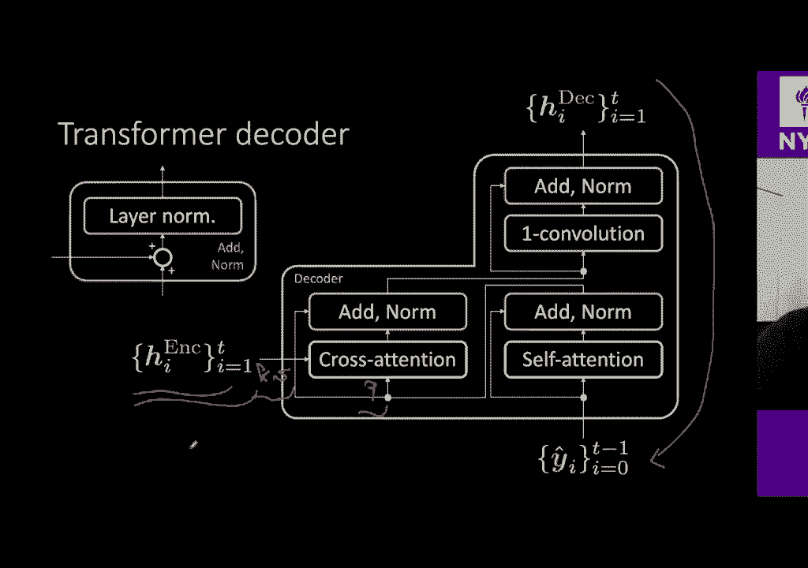

这里我们有多头注意力，这多头注意力如何，这里我们有多头注意力，这多头注意力如何，工作，所以在初始化部分，我们将拥有这三个，工作，所以在初始化部分，我们将拥有这三个。

w-qm WK和WV矩阵允许我向右旋转当前输入，w-qm WK和WV矩阵允许我向右旋转当前输入，那么我们有一个可以让我在，那么我们有一个可以让我在，结束，那么这个前锋如何运作正确，所以在前锋中你会得到。

结束，那么这个前锋如何运作正确，所以在前锋中你会得到，用于查询的输入X和用于键的输入X，以及用于值和输入的输入，用于查询的输入X和用于键的输入X，以及用于值和输入的输入，现在你有了Q。

K和V就是你知道我的乘法，现在你有了Q，K和V就是你知道我的乘法，特定项目的输入乘以该矩阵WQ右，所以这是，特定项目的输入乘以该矩阵WQ右，所以这是，我的X旋转，所以这里有QK和V，然后您将。

我的X旋转，所以这里有QK和V，然后您将，计算这个规模点积，这样我们就可以在规模点积上看到，计算这个规模点积，这样我们就可以在规模点积上看到，这基本上是一个问题与所有问题之间的点积。

这基本上是一个问题与所有问题之间的点积，键，所以如果我们走到这里，我什至无法滚动对不起，键，所以如果我们走到这里，我什至无法滚动对不起，让我缩放一秒钟好吧，所以在这里您得到了这些阵列，所以在这里您。

让我缩放一秒钟好吧，所以在这里您得到了这些阵列，所以在这里您。

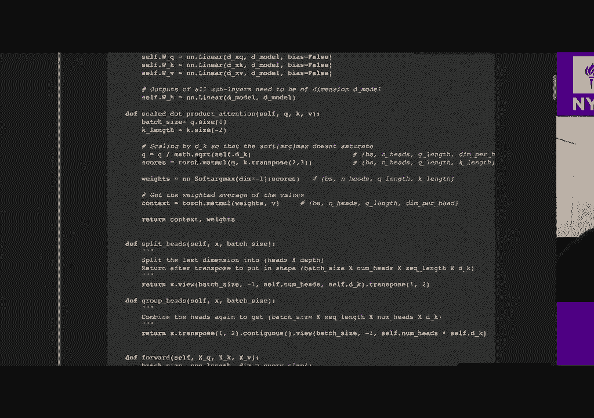

基本上得到话语好吗，首先我们除以，基本上得到话语好吗，首先我们除以，尺寸，因为我们之前说过，否则东西开始爆炸，然后我们，尺寸，因为我们之前说过，否则东西开始爆炸，然后我们。

在针对所有这些键的一个查询之间有一个矩阵乘法，在针对所有这些键的一个查询之间有一个矩阵乘法，然后在最后我们应用柔和的黑暗最大值，这样我们就可以计算出，然后在最后我们应用柔和的黑暗最大值。

这样我们就可以计算出，平方，对不起，我们不能计算混合混合，平方，对不起，我们不能计算混合混合，正确的系数，然后将这些混合系数乘以，正确的系数，然后将这些混合系数乘以，V矩阵基本上可以得到最终的输出权。

差不多，V矩阵基本上可以得到最终的输出权，差不多，这是自我关注权，然后由于您有多个，这是自我关注权，然后由于您有多个，负责人，我们将使用此决赛将所有东西压在一起，负责人。

我们将使用此决赛将所有东西压在一起，WH，所以这是他们称为关注的第一部分。WH，所以这是他们称为关注的第一部分。在这些关注上，我的意思是，如果您遵循这种观点，这就是，在这些关注上，我的意思是。

如果您遵循这种观点，这就是，完全一样，好吧，请告诉我您是否需要我在这方面走得更慢，完全一样，好吧，请告诉我您是否需要我在这方面走得更慢。

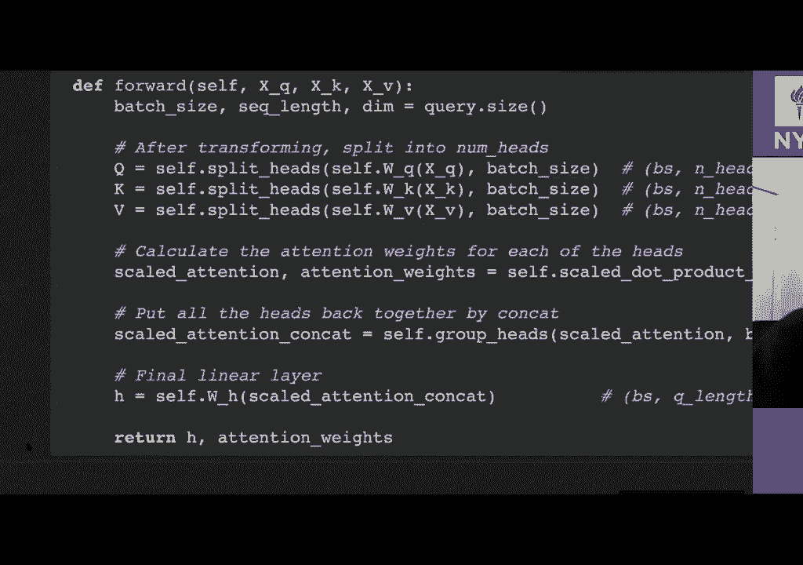

然后在底部，所以我们需要什么，我们需要注意的部分，所以这，然后在底部，所以我们需要什么，我们需要注意的部分，所以这。

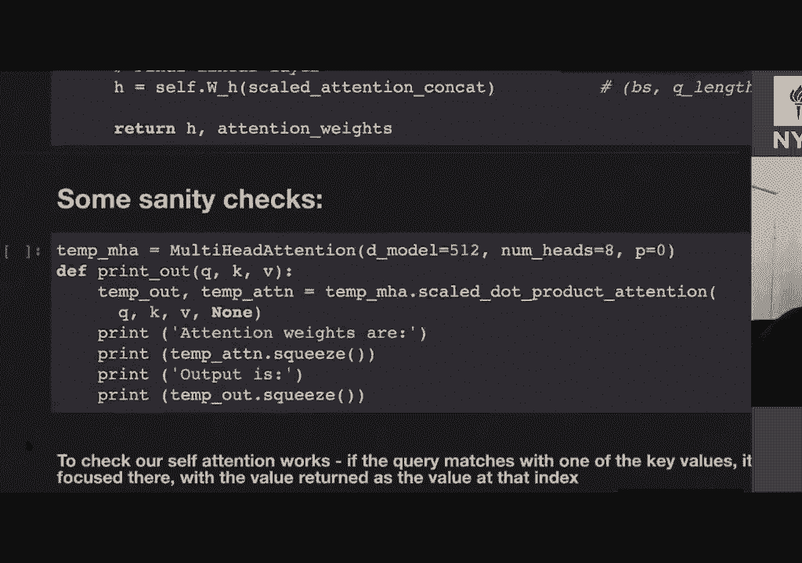

是自我关注权，所以我要做什么是正确的，是自我关注权，所以我要做什么是正确的，多头关注，所以我们在这里要做的是，多头关注，所以我们在这里要做的是，只是使用编码器将一些句子分类。

只是使用编码器将一些句子分类，在某些电影中是正面评论或负面评论，所以我只是，在某些电影中是正面评论或负面评论，所以我只是，将使用编码器，然后训练该编码器执行，将使用编码器，然后训练该编码器执行。

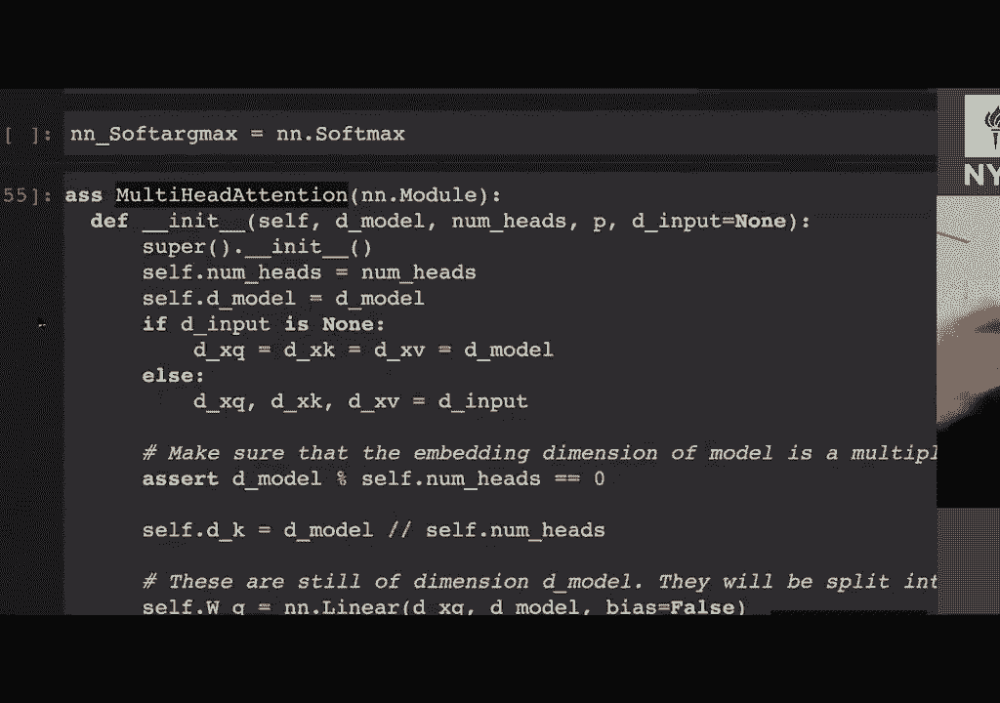

分类任务，那么如果我们检查编码器，我们需要什么编码器，分类任务，那么如果我们检查编码器，我们需要什么编码器，从这些幻灯片中，所以如果我们在这里检查编码器需要什么，从这些幻灯片中。

所以如果我们在这里检查编码器需要什么，编码器有两个组件，我们刚刚看到了自我关注，编码器有两个组件，我们刚刚看到了自我关注，代码，然后我们对这个MLP多层进行了卷积，代码。

然后我们对这个MLP多层进行了卷积，感知器应用于集合中的每个元素，因此让我们弄清楚。

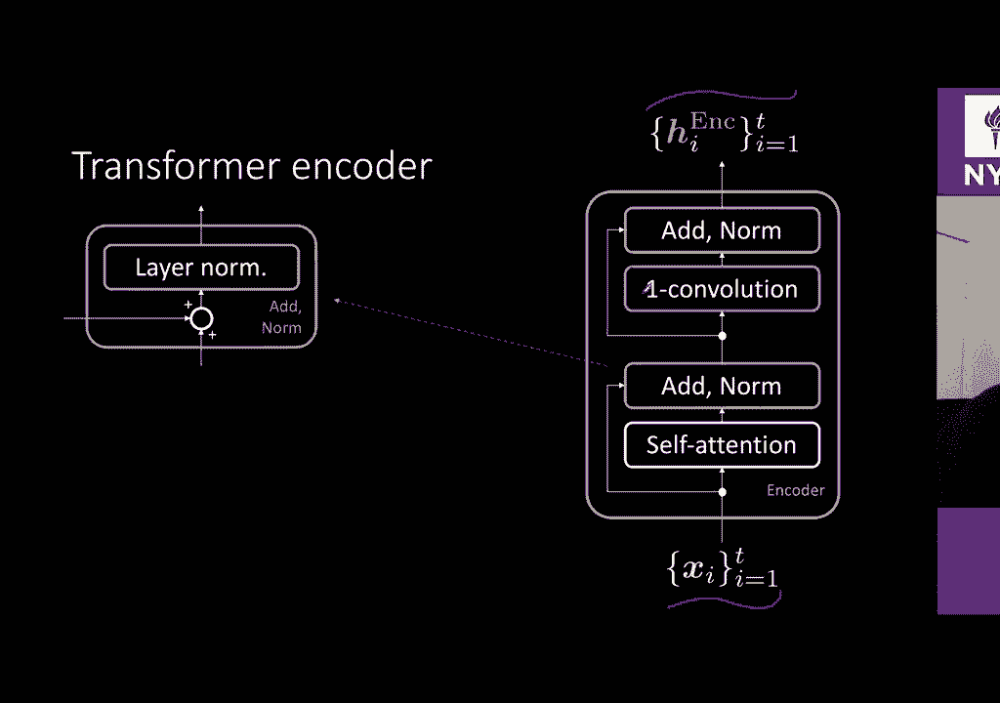

感知器应用于集合中的每个元素，因此让我们弄清楚，卷积层是对这些东西的理智检查，将通过。

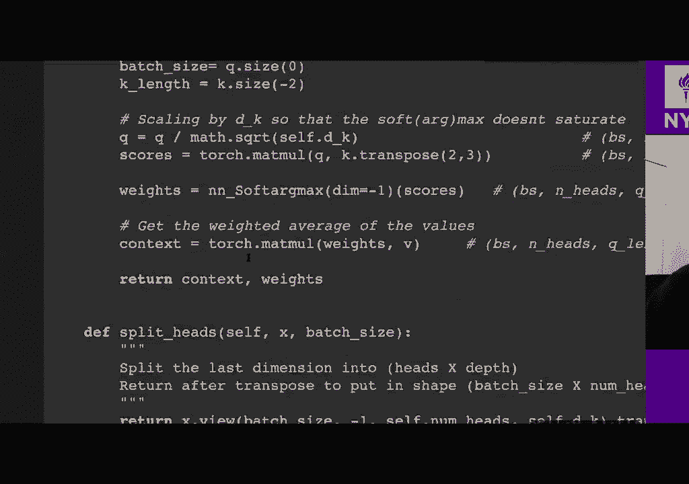

卷积层是对这些东西的理智检查，将通过。

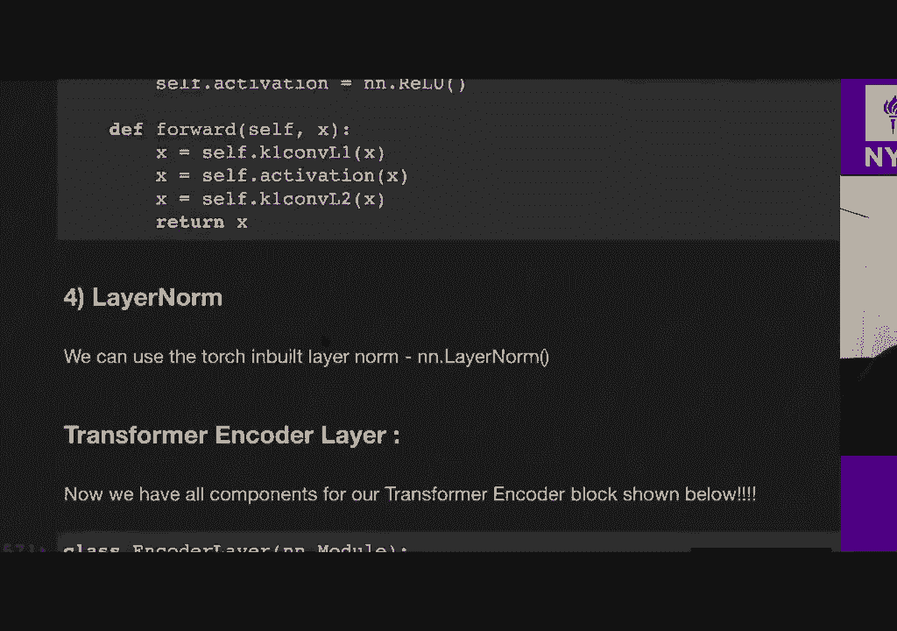

今天结束，所以有这个编码器层，编码器层有。

今天结束，所以有这个编码器层，编码器层有，如此多的关注加上卷积网和卷积，如此多的关注加上卷积网和卷积。

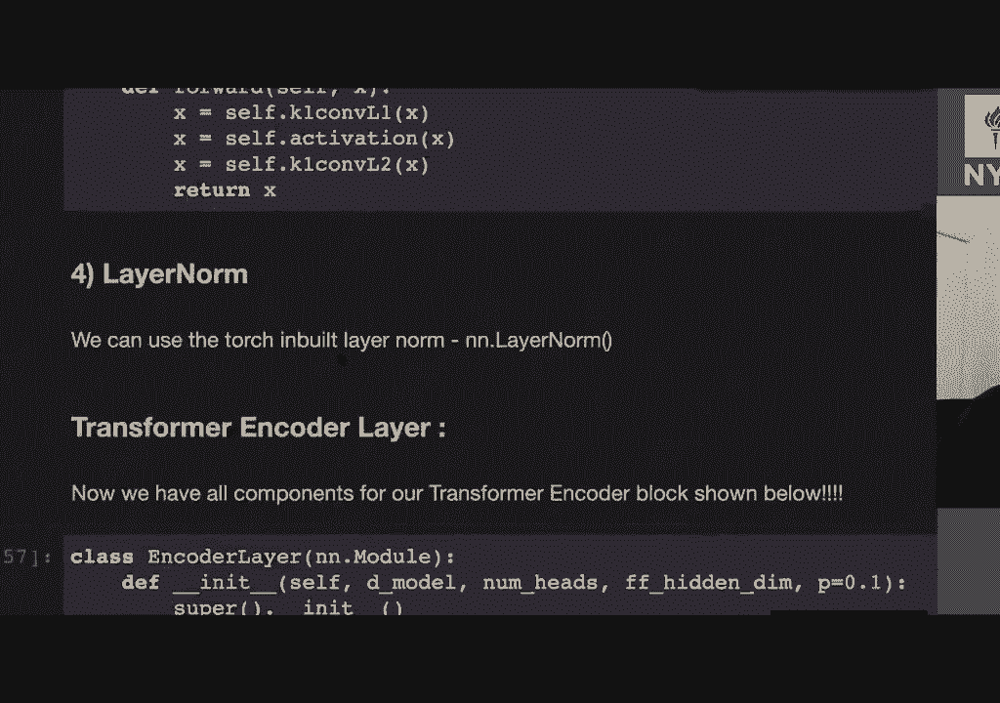

净，您非常了解它的工作原理，因此您实际上可以，净，您非常了解它的工作原理，因此您实际上可以，弄清楚是否检查了战斗或线性文档，然后，弄清楚是否检查了战斗或线性文档，然后，线性行为是一维卷积。

因此您可以使用nn，线性行为是一维卷积，因此您可以使用nn，线性在这里，这就像一个卷积网络，你有一个卷积，线性在这里，这就像一个卷积网络，你有一个卷积，真正的o，然后你有最后的卷积好吧，我想我没有在跑。

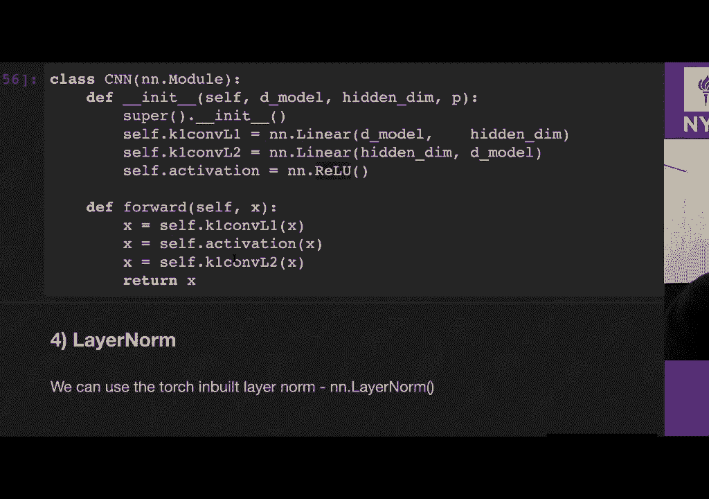

真正的o，然后你有最后的卷积好吧，我想我没有在跑，因为我认为您已经知道如何制作卷积网络，然后我们有了。

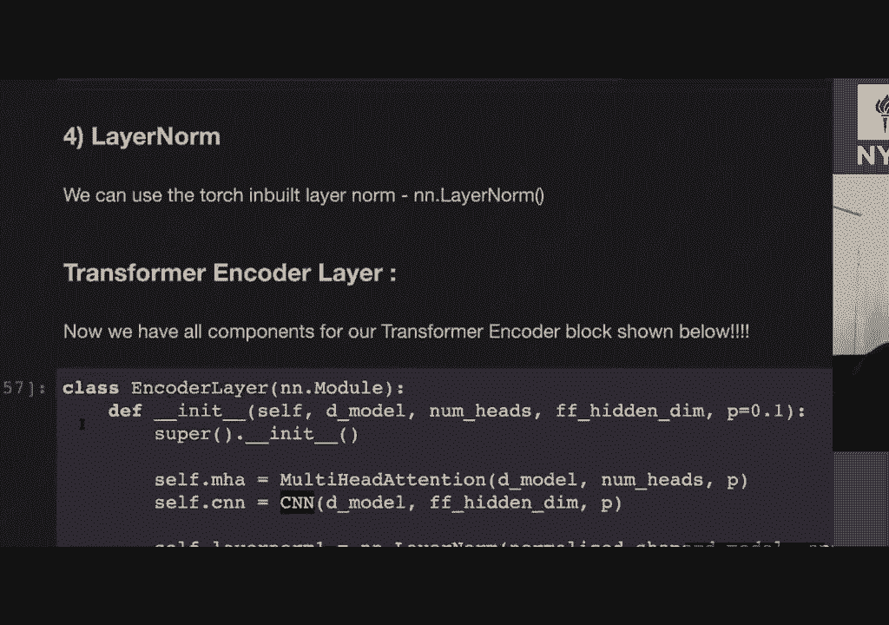

因为我认为您已经知道如何制作卷积网络，然后我们有了，正确的工具层规范化，所以首先您需要多头注意，正确的工具层规范化，所以首先您需要多头注意，自我关注，因此我们为所有输入提供XX和X，然后使用，自我关注。

因此我们为所有输入提供XX和X，然后使用，愚蠢的问题，但是为什么要称呼它为卷积，这只是一个否，愚蠢的问题，但是为什么要称呼它为卷积，这只是一个否。

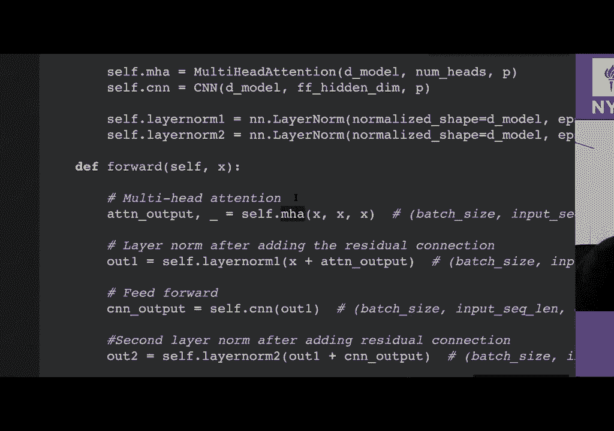

好吧，不是很愚蠢，这很重要，因为线性层会，好吧，不是很愚蠢，这很重要，因为线性层会，映射您知道的某种表示形式到其他某种表示形式，映射您知道的某种表示形式到其他某种表示形式，应用于设置权中的每个组件。

所以我在这里有一个设置，是的。

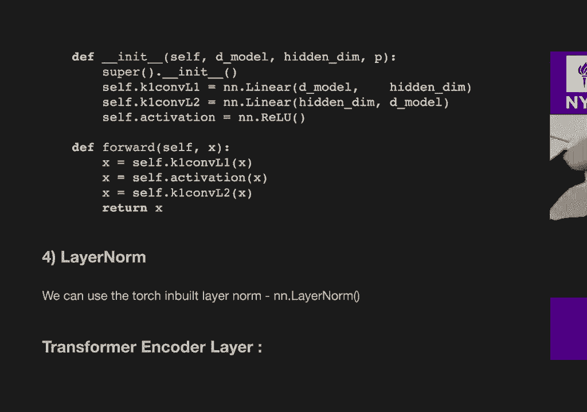

应用于设置权中的每个组件，所以我在这里有一个设置，是的，一组输入，在这里，我要有一组表示，所以我，一组输入，在这里，我要有一组表示，所以我，在这里有一个集合是的，然后我将线性层分别应用于每个元素。

在这里有一个集合是的，然后我将线性层分别应用于每个元素，好的，嗯，如果您将相同的线性层应用于，好的，嗯，如果您将相同的线性层应用于，顺序Bhushan好的，这样每个人都可以，顺序Bhushan好的。

这样每个人都可以，每个每个隐藏的表示将要经过一个，每个每个隐藏的表示将要经过一个，是的，是单独的贡献，所以在原始论文中，他们称其为，是的，是单独的贡献，所以在原始论文中，他们称其为，线性层。

但这不是因为它实际上是一个卷积，所以再次，线性层，但这不是因为它实际上是一个卷积，所以再次，每次您看到的每个实现都会使用一个，每次您看到的每个实现都会使用一个，线性层所有这些都将被称为前馈，但是这些是。

线性层所有这些都将被称为前馈，但是这些是，卷积会进行一些广播，但是我可以用相同的方式吃卷积，卷积会进行一些广播，但是我可以用相同的方式吃卷积，我们称其为“ arcamax”。

而我们称其为“ softa”，我们称其为“ arcamax”，而我们称其为“ softa”，最大，因为您知道这是错误的，好吧，但这是一个很好的问题。

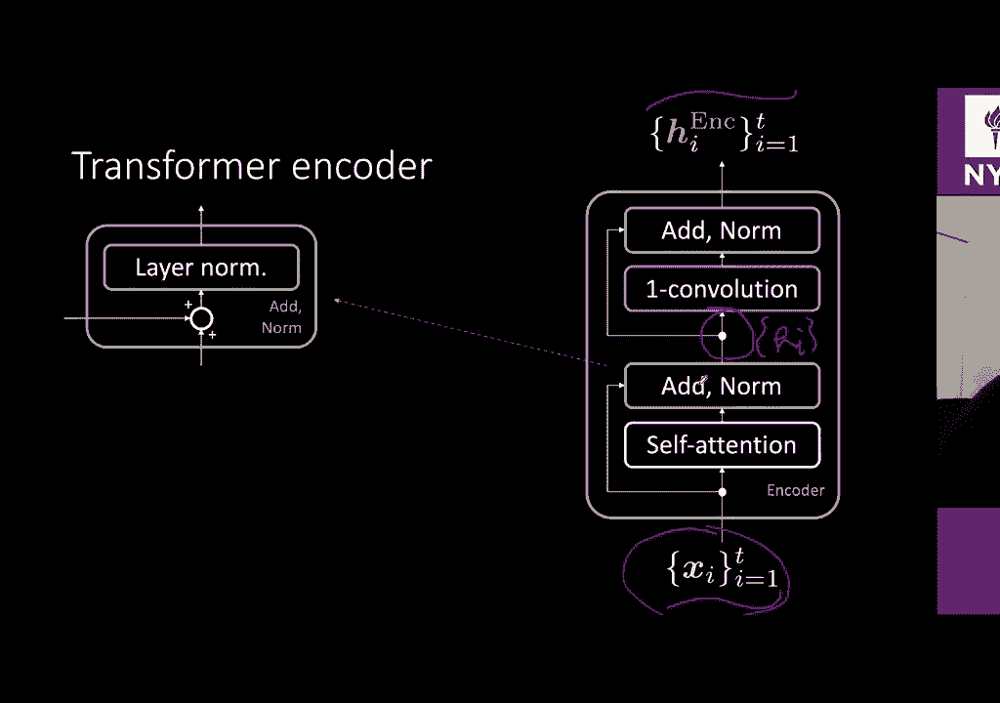

最大，因为您知道这是错误的，好吧，但这是一个很好的问题，我快完成了，我明白了，所以这是我的卷积网，然后。

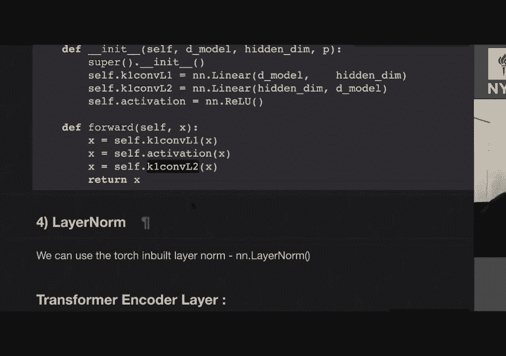

我快完成了，我明白了，所以这是我的卷积网，然后，你有多层注意力，这个CN n一次又一次地只是。

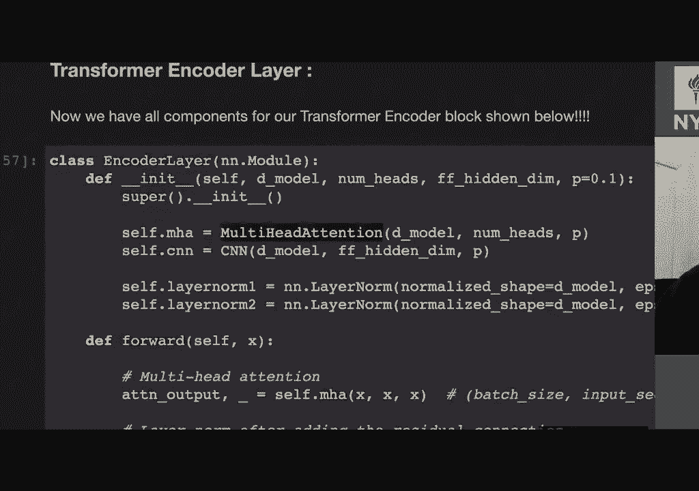

你有多层注意力，这个CN n一次又一次地只是，一维像一维卷积，一维像一维卷积，内核大小也是正确的，因此可以使用线性但，内核大小也是正确的，因此可以使用线性但，我会在这里写，然后再用，我会在这里写。

然后再用，实际上，如果您将它们实现为完全相同的方式，实际上，如果您将它们实现为完全相同的方式。

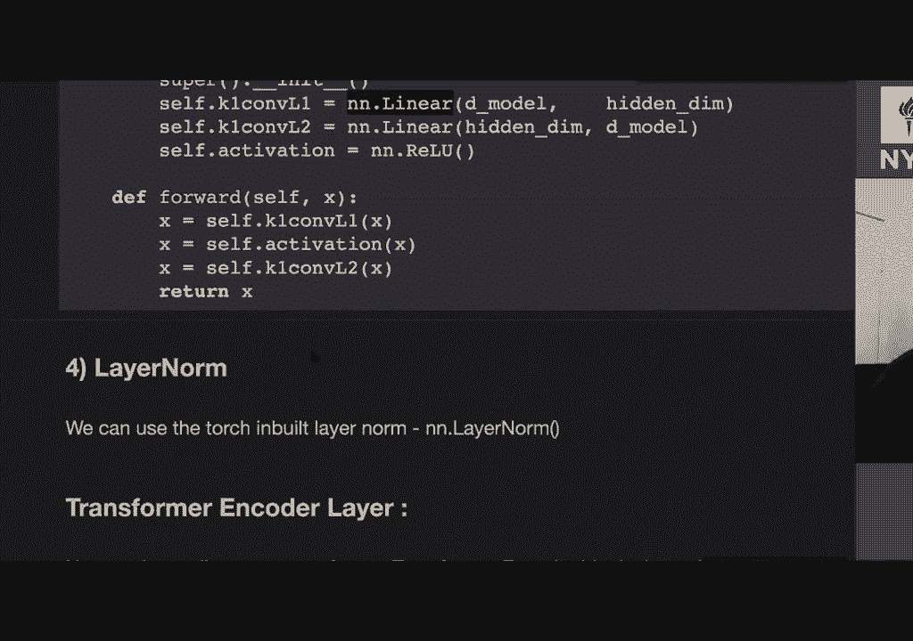

检查Phi火炬上的代码，但这将是正确的，例如，检查Phi火炬上的代码，但这将是正确的，例如。

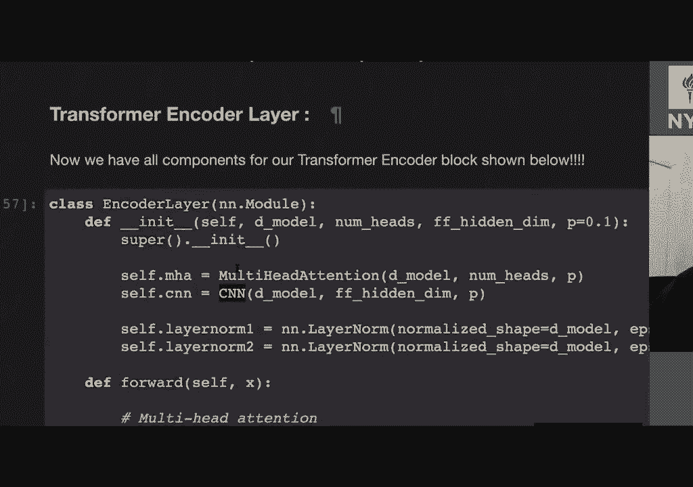

卷积方式好，这样您就拥有了多解多头，卷积方式好，这样您就拥有了多解多头，注意，您将获得第一个输出，然后将该输出发送给您，并将其加和到，注意，您将获得第一个输出，然后将该输出发送给您，并将其加和到。

输入正确，因为我们有剩余的连接，您可以通过图层发送它，输入正确，因为我们有剩余的连接，您可以通过图层发送它，归一化，然后有一个输出，归一化，然后有一个输出，所以你有一个输出哦，你在卷积内发送输出。

所以你有一个输出哦，你在卷积内发送输出，让这个家伙，你现在会绕过残留的连接，让这个家伙，你现在会绕过残留的连接，然后将其输入到图层归一化，这就是编码器，然后将其输入到图层归一化，这就是编码器。

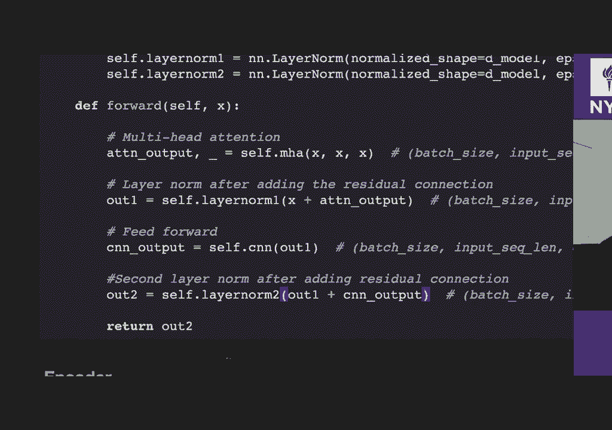

正确，所以编码器将编码器最终适合的所有东西都整理好了，正确，所以编码器将编码器最终适合的所有东西都整理好了，我没有提到的是让我回到这里，所以我正在使用此编码器。

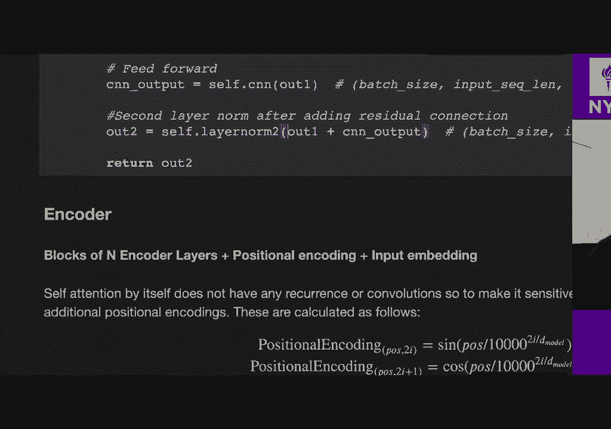

我没有提到的是让我回到这里，所以我正在使用此编码器，一些句子分类权，所以每个实际上都有一个，一些句子分类权，所以每个实际上都有一个，现在在单词中订购，如果您放一袋单词，这基本上就像，现在在单词中订购。

如果您放一袋单词，这基本上就像，表演和处理一堆单词，但如果您确实想说得通，表演和处理一堆单词，但如果您确实想说得通，您还想正确发送索引，因此第一项也应该在集合中，您还想正确发送索引。

因此第一项也应该在集合中，应该有或者这是第一项，所以您的房子应该发送有关，应该有或者这是第一项，所以您的房子应该发送有关，到目前为止，该编码器在此位置处于哪个位置，到目前为止。

该编码器在此位置处于哪个位置，变压器，这种注意是完全置换等效的权利，变压器，这种注意是完全置换等效的权利，因为我们没有有关订单的任何信息，但是如果我想这样做，因为我们没有有关订单的任何信息。

但是如果我想这样做，考虑句子的顺序可能对句子分类很有意义。

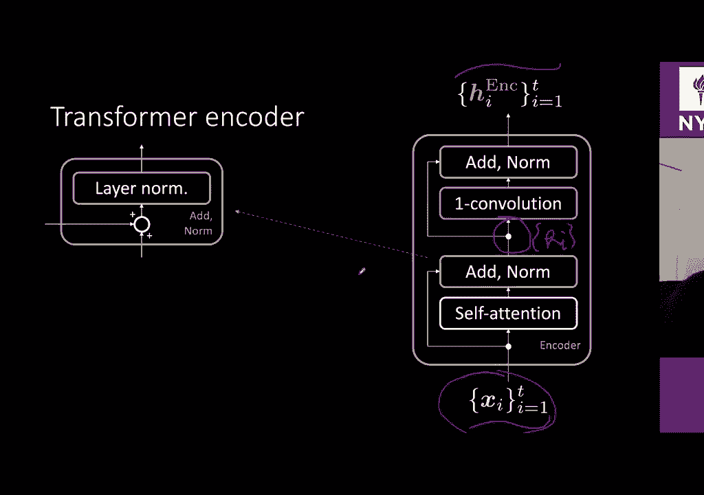

考虑句子的顺序可能对句子分类很有意义，正确的话是因为您知道我的事，所以我们可以添加一些。

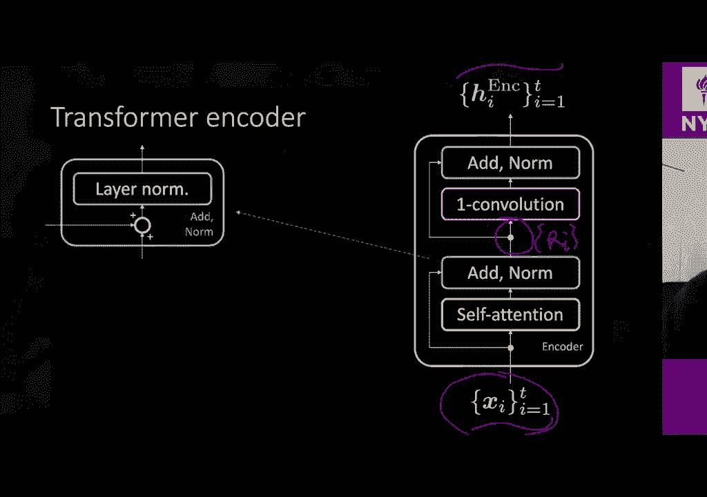

正确的话是因为您知道我的事，所以我们可以添加一些，位置信息，但同样不重要，所以我有编码器。

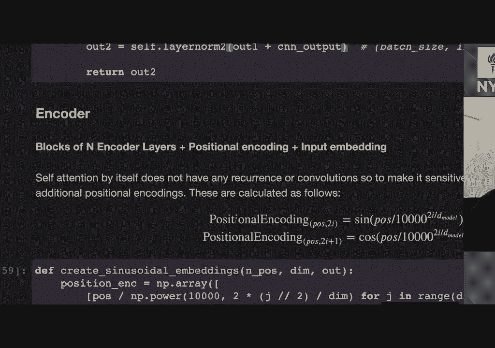

位置信息，但同样不重要，所以我有编码器，这将只是具有输入的嵌入，然后它具有，这将只是具有输入的嵌入，然后它具有，编码器的几层，所以在这里，我只是向您展示。

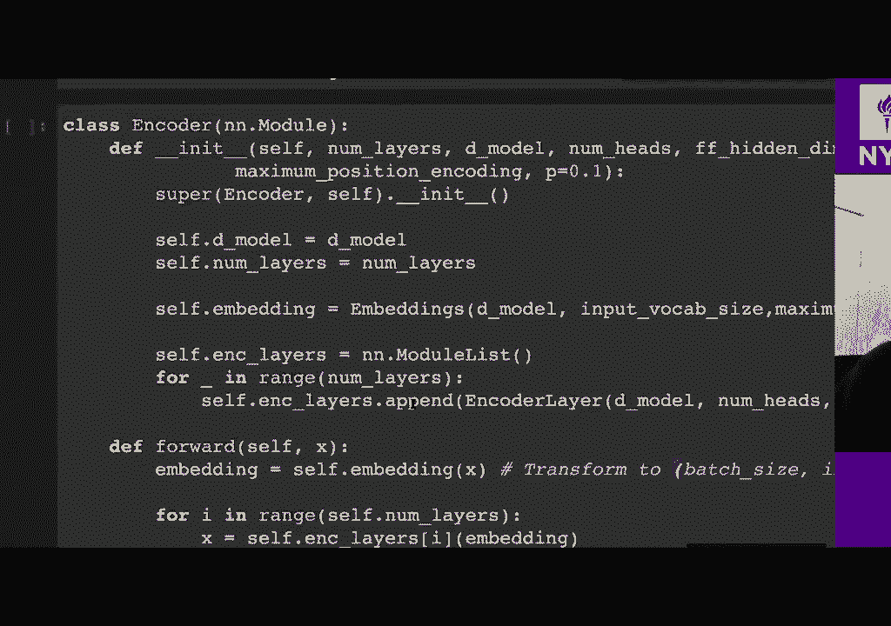

编码器的几层，所以在这里，我只是向您展示，好的，好的，这只是一个编码器，但是由于我们正在做深层网络，好的，好的，这只是一个编码器，但是由于我们正在做深层网络，您知道每个网络的深层网络之后。

您是否可以知道您有多个编码器，您知道每个网络的深层网络之后，您是否可以知道您有多个编码器，这些是编码器权限和编码器，因此您可以堆叠多个这些编码器，这些是编码器权限和编码器，因此您可以堆叠多个这些编码器。

使您的网络更强大，因此在这里您可以找到一个列表。

使您的网络更强大，因此在这里您可以找到一个列表，您同时参加多个编码器的层数，您同时参加多个编码器的层数，然后我们在这些IMDB数据集上训练这些东西，这基本上给了我。

然后我们在这些IMDB数据集上训练这些东西，这基本上给了我，电影的评论，然后我们必须弄清楚这是否是一部，电影的评论，然后我们必须弄清楚这是否是一部，好电影或坏电影，仅此而已，好电影或坏电影，仅此而已。

所以我们训练这些大个子，我只是保持训练循环，因为，所以我们训练这些大个子，我只是保持训练循环，因为，将会是我们见过很多次的火车环完全相同的火车，将会是我们见过很多次的火车环完全相同的火车。

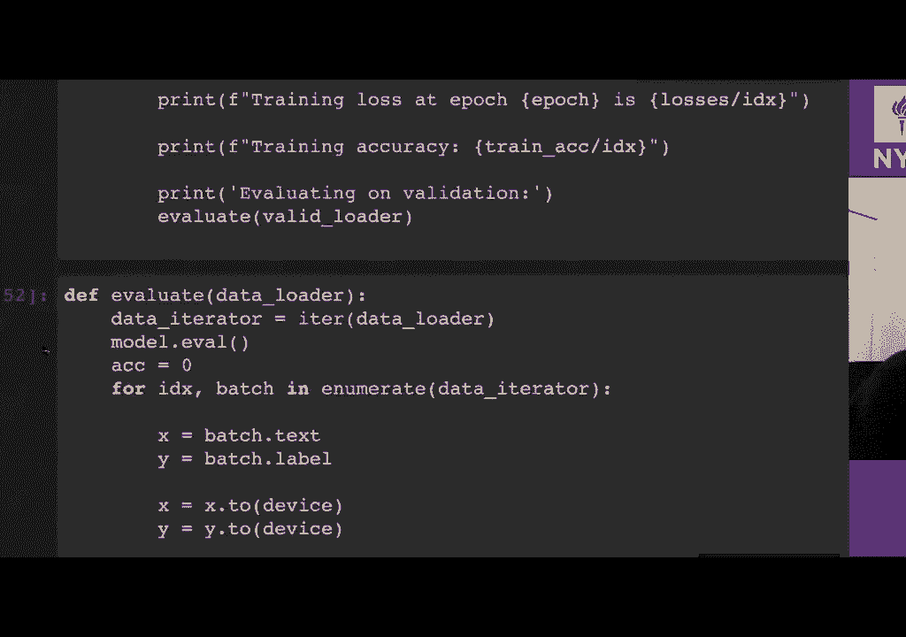

一开始就知道准确率是50％，因为它不知道更好，一开始就知道准确率是50％，因为它不知道更好，然后，当您继续训练时，我们会经历1992年的某种状况，也许我们开始，然后，当您继续训练时。

我们会经历1992年的某种状况，也许我们开始，有点过拟合，这就是测试精度，可以达到83％，有点过拟合，这就是测试精度，可以达到83％，因此，您真正要注意的是，因此，您真正要注意的是。

使用RNN进行句子分类，您必须多次发送它，使用RNN进行句子分类，您必须多次发送它。

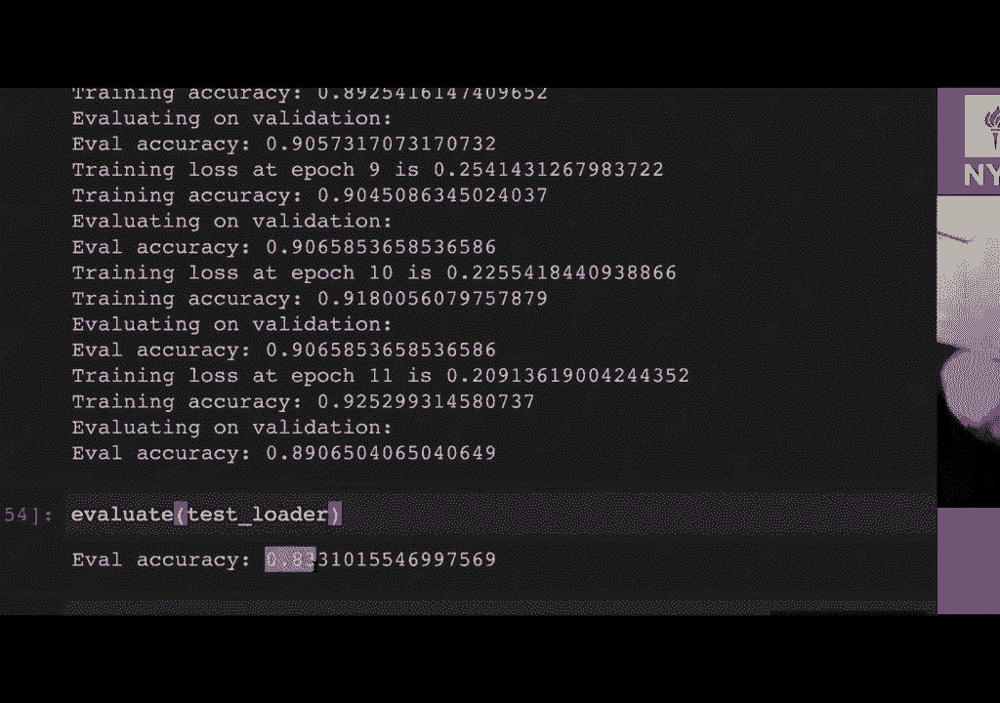

必须发送第一个单词，然后发送第二个单词，必须发送第一个单词，然后发送第二个单词，顺序操作集，而不是在这种情况下，这些注意机制I，顺序操作集，而不是在这种情况下，这些注意机制I。

告诉你现在没有任何顺序操作，告诉你现在没有任何顺序操作，一口气计算出来，因此在这种情况下，您可以获得这些最终年龄矩阵。

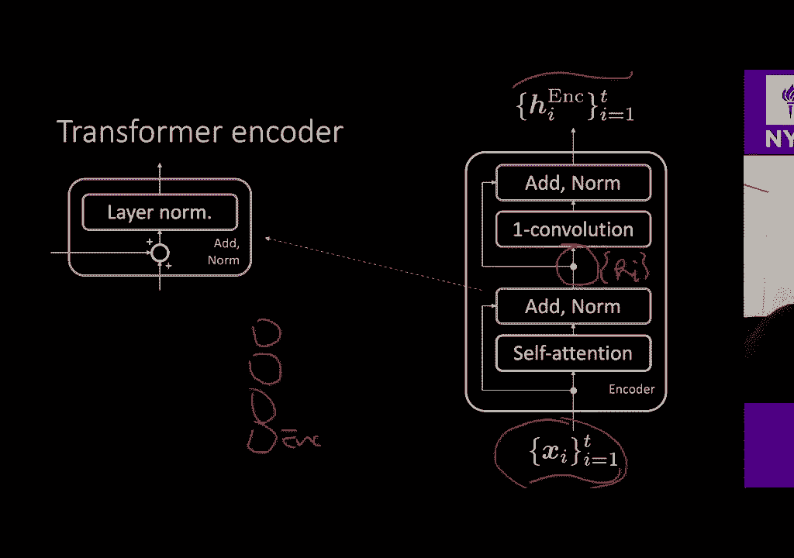

一口气计算出来，因此在这种情况下，您可以获得这些最终年龄矩阵，这是我句子中正在计算的所有元素的代表，这是我句子中正在计算的所有元素的代表，一个目标就对了，所以没有时间循环，也没有等待，一个目标就对了。

所以没有时间循环，也没有等待，正确的时间，就像马上就完成的繁荣一样，这样您就可以，正确的时间，就像马上就完成的繁荣一样，这样您就可以，之所以瘫痪，是因为这只是矩阵乘法，所以这是，之所以瘫痪。

是因为这只是矩阵乘法，所以这是，像愚蠢的使瘫痪的另一件事要注意的是它在哪里，像愚蠢的使瘫痪的另一件事要注意的是它在哪里，有一个矩阵，一个矩阵可以，这个家伙在这里，这是非常危险的，有一个矩阵。

一个矩阵可以，这个家伙在这里，这是非常危险的，T的数量是标题的数量好吗，你去那里，T的数量是标题的数量好吗，你去那里，我的食谱书有上千种食谱，因为那是我免费的一千种，我的食谱书有上千种食谱。

因为那是我免费的一千种，食谱书中这些指标的大小是，食谱书中这些指标的大小是，千次千对一百万维巨大，千次千对一百万维巨大，因此，您可以在这里清楚地看到以下事实：如果您有很多索引，因此。

您可以在这里清楚地看到以下事实：如果您有很多索引，很多很多正确的东西，这东西开始很快就爆炸了，很多很多正确的东西，这东西开始很快就爆炸了，所以您必须注意这一点，并且您知道有不同的方法可以。

所以您必须注意这一点，并且您知道有不同的方法可以，也可以处理这个问题，例如，您可以将其分成两半并做一些事情，但是，也可以处理这个问题，例如，您可以将其分成两半并做一些事情，但是，再次介绍实施细节。

所以现在我们是下课后10分钟，我在这里，再次介绍实施细节，所以现在我们是下课后10分钟，我在这里，为您解答各种问题，但我认为我们设法做到了，为您解答各种问题，但我认为我们设法做到了。

以一种好的方式通过笔记本提问，以一种好的方式通过笔记本提问。

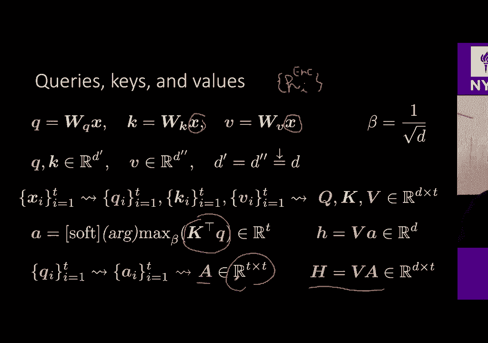

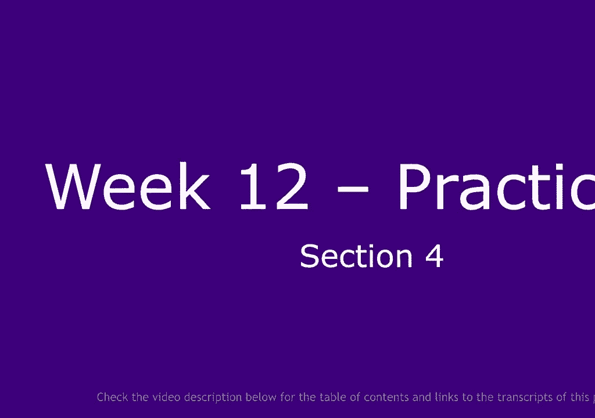

一头一头地集中注意力，您将只使用一个矩阵和一个砝码，一头一头地集中注意力，您将只使用一个矩阵和一个砝码。

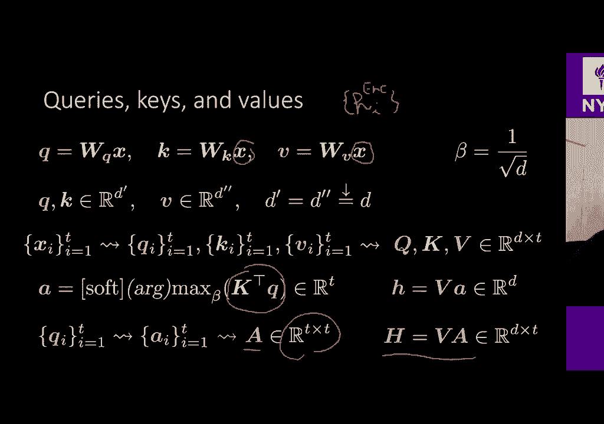

矩阵每个查询键和值是的是的，我知道你卡住了所有，矩阵每个查询键和值是的是的，我知道你卡住了所有，最后的v在一起，然后您可以将它们压回去，所以最后我可能，最后的v在一起，然后您可以将它们压回去。

所以最后我可能，有HV，那么我可以在这里使用此矩阵将所有数据压缩到D维，有HV，那么我可以在这里使用此矩阵将所有数据压缩到D维，这是这样做的一种方法，好吧，所以多后裔多头关注，这是这样做的一种方法。

好吧，所以多后裔多头关注，本质上只是使用多个不共享权重的矩阵，本质上只是使用多个不共享权重的矩阵，是的，在多头关注之间，发生了一些事情，是的，在多头关注之间，发生了一些事情。

表示您对同一个输入权限有多个查询，然后可以，表示您对同一个输入权限有多个查询，然后可以，对同一个轮子有多个问题，例如您饿了，所以一个问题，对同一个轮子有多个问题，例如您饿了，所以一个问题。

我该怎么做烤宽面条，但你知道你没有碎牛肉，我该怎么做烤宽面条，但你知道你没有碎牛肉，回家，所以第二个问题是我可以吗，回家，所以第二个问题是我可以吗，做一道素食，所以你知道你仍然饿了，做一道素食。

所以你知道你仍然饿了，有不同的问题，您的想法还可以，您可以与他人一起去幻灯片吗，有不同的问题，您的想法还可以，您可以与他人一起去幻灯片吗，使用交叉注意的编码器/解码器结构是的，请确保此处正确。

使用交叉注意的编码器/解码器结构是的，请确保此处正确。

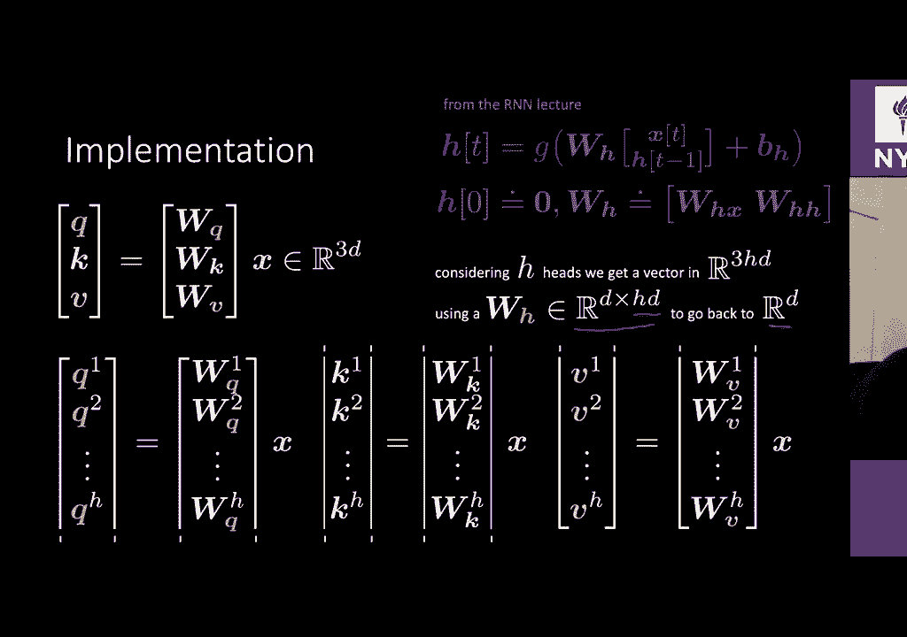

第一个自我关注层的输入将是您计算，第一个自我关注层的输入将是您计算，在那种情况下的查询将是WQ乘以X我说QI将被称为攻击，所以在，在那种情况下的查询将是WQ乘以X我说QI将被称为攻击，所以在。

这是在自我关注中，是的，所以在自我关注中，所有这些都成立了。

这是在自我关注中，是的，所以在自我关注中，所有这些都成立了，在那些q qk和V上来自Y帽，而不是X，你想，在那些q qk和V上来自Y帽，而不是X，你想，用Y帽子替换这个X对，那又是什么。

用Y帽子替换这个X对，那又是什么。

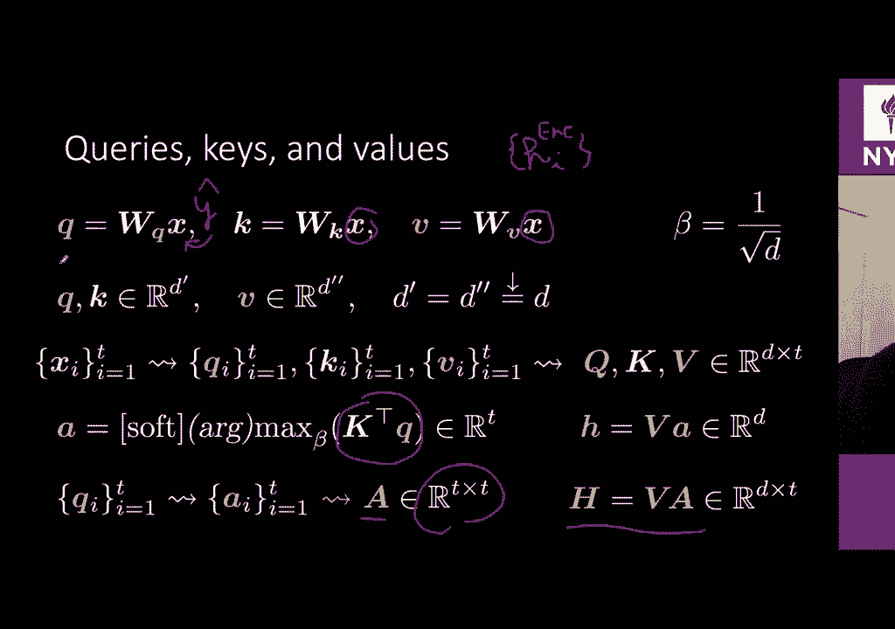

再次戴白帽子戴Y帽子会成为我的，所以无论何时在这里训练这个系统，再次戴白帽子戴Y帽子会成为我的，所以无论何时在这里训练这个系统。

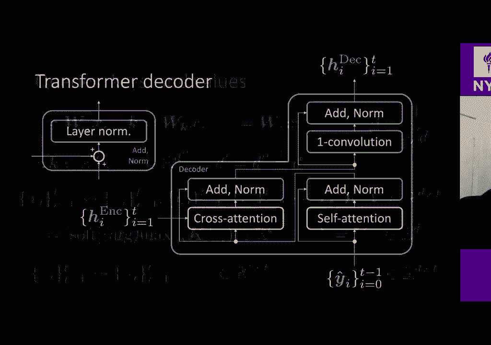

你会预测第一个单词好吧，我什至没有告诉你，你会预测第一个单词好吧，我什至没有告诉你，你是对的，所以训练这个系统可以做到，你是对的，所以训练这个系统可以做到，您用一种语言输入的句子中的翻译我很高兴饿我。

您用一种语言输入的句子中的翻译我很高兴饿我，饿了，然后您输入另一种语言，例如意大利语或，饿了，然后您输入另一种语言，例如意大利语或，饥荒，你想让你知道你在这里喂食，我很饿，饥荒。

你想让你知道你在这里喂食，我很饿，这将代表我饿了饿不饿我，这将代表我饿了饿不饿我，饿了英文，然后喂饱后放到这里，我饿了，饿了英文，然后喂饱后放到这里，我饿了，你将要输出的单词会在这里用意大利语印在哦。

如果我，你将要输出的单词会在这里用意大利语印在哦，如果我，您将所有内容放到此处，您将强制执行系统以将家庭作为输出，您将所有内容放到此处，您将强制执行系统以将家庭作为输出，饿了意大利，所以如果我说好。

让我让我写下一分钟，也许，饿了意大利，所以如果我说好，让我让我写下一分钟，也许，如果我想说还可以的话，那么这是切菜，如果我想说还可以的话，那么这是切菜，然后你有意大利语哦，天哪，哦，好吧。

所以首先你要切，然后你有意大利语哦，天哪，哦，好吧，所以首先你要切，进入编码器内部，然后编码器在这里吐这个家伙，进入编码器内部，然后编码器在这里吐这个家伙，这些输入中的每一个都有一个H，如果您输入。

这些输入中的每一个都有一个H，如果您输入，在开始时，这里的东西，在开始时，这里的东西，这里有一个大零，这东西会吐出一个，现在是你，这里有一个大零，这东西会吐出一个，现在是你，把一个放到这里。

然后这个家伙会吐出来哦，他们放了，把一个放到这里，然后这个家伙会吐出来哦，他们放了，必须煽动我们这个家伙，这个家伙会说完成，就是这样，必须煽动我们这个家伙，这个家伙会说完成，就是这样，转到结尾右II。

是的，每当您在此处获得不同的输入时，转到结尾右II，是的，每当您在此处获得不同的输入时，解码器可以决定查看这些内容的不同部分，解码器可以决定查看这些内容的不同部分，八个编码器好吧，这是没有道理的。

这对课程有何影响，八个编码器好吧，这是没有道理的，这对课程有何影响，在这种情况下，交叉注意模块正在获取输出，在这种情况下，交叉注意模块正在获取输出，这条线是此添加规范的输出，因此此添加规范的输出。

这条线是此添加规范的输出，因此此添加规范的输出，在加热器内部的Q交叉注意的查询，然后是，在加热器内部的Q交叉注意的查询，然后是，让这个人从这里知道值和键，让这个人从这里知道值和键，编码器好，谢谢好。

您说的第一个问题是关于，编码器好，谢谢好，您说的第一个问题是关于，您肯定会使用多少个矩阵当然可以，谢谢，您肯定会使用多少个矩阵当然可以，谢谢，我希望它比昨天更清楚，但我再次注意到有一个。

我希望它比昨天更清楚，但我再次注意到有一个，今天的课很多很多，我希望就像我只是对什么感到困惑，今天的课很多很多，我希望就像我只是对什么感到困惑，细胞指的是什么，十字架指的是什么，是的，是的，更多的问题。

细胞指的是什么，十字架指的是什么，是的，是的，更多的问题，在这个关于加藤妈妈的猫的例子中，所以你说从解码器中得到，在这个关于加藤妈妈的猫的例子中，所以你说从解码器中得到，一些代表，你把它传递回去。

为什么对我来说，一些代表，你把它传递回去，为什么对我来说，就像某种复发一样，不是这样，这叫做自动，就像某种复发一样，不是这样，这叫做自动，回归权，所以这是用于生成文本和，回归权，所以这是用于生成文本和。

因此要生成文本，您必须先生成第一个输出，然后再输入，因此要生成文本，您必须先生成第一个输出，然后再输入，而您内部的输出将使第二个人正确，因此编码器，而您内部的输出将使第二个人正确，因此编码器。

没有任何自动回归的东西，是的，编码器只会生成此H，没有任何自动回归的东西，是的，编码器只会生成此H，编码器，然后解码器将一次生成一个字，编码器，然后解码器将一次生成一个字，自回归时尚。

所以合适的人是生成模型的权利，自回归时尚，所以合适的人是生成模型的权利，但是当您训练此编码器时，一次对它进行编码，但是当您训练此编码器时，一次对它进行编码，是的，所以，如果它是自动回归的。

那么如何训练它，是的，所以，如果它是自动回归的，那么如何训练它，步骤取决于上一步，您进行推理时的句子是，步骤取决于上一步，您进行推理时的句子是，自动回归哦，所以推论是自动回归，但是训练是的，因为。

自动回归哦，所以推论是自动回归，但是训练是的，因为，你错了，好吧，你只是掩盖了未来的时间步，你错了，好吧，你只是掩盖了未来的时间步，这样，如果您想为第一个单词做它就不会显示它，这样。

如果您想为第一个单词做它就不会显示它，仅接收第一个而不接收其他所有内容，依此类推，仅接收第一个而不接收其他所有内容，依此类推，让我们打电话给我们，就像一个前瞻性面具吧，好吧，耶稣，谢谢。

让我们打电话给我们，就像一个前瞻性面具吧，好吧，耶稣，谢谢。这只猫的早期例子，我们在这种情况下要提示，这只猫的早期例子，我们在这种情况下要提示，就像一个意大利语单词，我第二次喜欢布丁。

就像一个意大利语单词，我第二次喜欢布丁，一右一右一右，然后它下降，然后我们通过它，一右一右一右，然后它下降，然后我们通过它，它的提示进入了交叉注意，此时K将，它的提示进入了交叉注意，此时K将。

是英语编码的英文单词的键，但是值也是，是英语编码的英文单词的键，但是值也是，会是正确的英文代表，这怎么会随地吐痰，会是正确的英文代表，这怎么会随地吐痰，就像一个意大利语单词的好问题一样。

您插入了多个这些模块，就像一个意大利语单词的好问题一样，您插入了多个这些模块，我不知道魔术发生了什么，值和键都来自英语，但同样可以，值和键都来自英语，但同样可以，每当您训练该系统时，您最终都会得到。

每当您训练该系统时，您最终都会得到，基本上与语言无关，因此我认为您一方面，基本上与语言无关，因此我认为您一方面，英文另一边是意大利语，但在中间时，只要有，英文另一边是意大利语，但在中间时，只要有。

这些嵌入我们可以假设这就像语言不可知的权利，这些嵌入我们可以假设这就像语言不可知的权利，所以问题就来了，嘿，这个意大利语单词正在寻找，所以问题就来了，嘿，这个意大利语单词正在寻找。

看起来像这样的东西是什么编码是什么嵌入，看起来像这样的东西是什么编码是什么嵌入，在这里，您知道现在匹配我的特定问题好吗，所以我，在这里，您知道现在匹配我的特定问题好吗，所以我。

认为这可能像我想的一种解释，所以你有，认为这可能像我想的一种解释，所以你有，在这里，将意大利语降到英语，然后将编码器冒泡时，将，在这里，将意大利语降到英语，然后将编码器冒泡时，将，语言的特殊性。

然后您就可以重用这种您知道的编码器，语言的特殊性，然后您就可以重用这种您知道的编码器，我想我的意思是这类似于它在编码器解码器循环中的工作方式，我想我的意思是这类似于它在编码器解码器循环中的工作方式。

神经网络，您有一个编码器，它编码一个完整的句子，然后，神经网络，您有一个编码器，它编码一个完整的句子，然后，您可以像不依赖于，您可以像不依赖于，语言不再正确，然后实际上，语言不再正确，然后实际上。

过去您曾经有一个像解码器那样的家伙的循环网络，过去您曾经有一个像解码器那样的家伙的循环网络，使用该最终表示法，或者您也可以注意，使用该最终表示法，或者您也可以注意，看一下我认为过去的时间跨度。

这是它的一部分，看一下我认为过去的时间跨度，这是它的一部分，语言自然神经语言翻译NTM脑神经语言，语言自然神经语言翻译NTM脑神经语言，和nltc机器的机器翻译，是的，和nltc机器的机器翻译，是的。

抱歉，我只是回答了最后一个问题，抱歉，我只是回答了最后一个问题，在我的意思是这是我的猜测之前，就像嵌入将要，在我的意思是这是我的猜测之前，就像嵌入将要，那天HH编码器就像是剥离了特定语言。

那天HH编码器就像是剥离了特定语言，信息只是概念而已，它们只是。的代表，信息只是概念而已，它们只是。的代表，没有附加语言的概念，那将是我的，没有附加语言的概念，那将是我的，从某种意义上来说。

这听起来像是谢谢，它本身就是一种嵌入，从某种意义上来说，这听起来像是谢谢，它本身就是一种嵌入，然后将其与正确的K进行比较，然后将其与正确的K进行比较，在这种情况下，Q来自您的语言，它将成为目标。

在这种情况下，Q来自您的语言，它将成为目标，语言正确正确合理，语言正确正确合理，谢谢，我真的建议您去看看我朋友的博客，谢谢，我真的建议您去看看我朋友的博客，这叫做图解变压器，它的书写非常非常非常好。

这叫做图解变压器，它的书写非常非常非常好，也许我对语言部分有更多的了解，也许我对语言部分有更多的了解，尝试让您知道我尝试不使用此演示文稿中的语言，尝试让您知道我尝试不使用此演示文稿中的语言。

因为您知道您可以将此转换器用于任何类型的数据，因为您知道您可以将此转换器用于任何类型的数据，基本上，这些是将集映射到集，但是还是这个例子，基本上，这些是将集映射到集，但是还是这个例子。

只是您知道非常适合翻译部分，但是您可以翻译，只是您知道非常适合翻译部分，但是您可以翻译，也有类似的变压器，可以逐像素制作生成模型，因此您，也有类似的变压器，可以逐像素制作生成模型，因此您。

可以用这种架构实际绘制事物，可以用这种架构实际绘制事物，由J Alomar改造，是的，他还好，由J Alomar改造，是的，他还好，是的，我真的很喜欢他看东西的方式，但这是我所有的矩阵，是的。

我真的很喜欢他看东西的方式，但这是我所有的矩阵，换位，就像在烦我一样，我想我是换位的人，换位，就像在烦我一样，我想我是换位的人，矩阵每个人都将它们水平放置，我认为数学与，矩阵每个人都将它们水平放置。

我认为数学与，垂直还可以，您说的更多问题是编码表示将，垂直还可以，您说的更多问题是编码表示将，语言不可知论者不以某种方式假设某种相似性，语言不可知论者不以某种方式假设某种相似性。

我使用的语言都是您要翻译的语言，我使用的语言都是您要翻译的语言，语言就像例如某种情况下的表示是，语言就像例如某种情况下的表示是，不可知的语言英语和法语之间具有相同的语言。

不可知的语言英语和法语之间具有相同的语言，还有更多的相似之处，然后说英语和汉语，而不仅仅是，还有更多的相似之处，然后说英语和汉语，而不仅仅是，尊重可用的数据类型以及战斗经验。

尊重可用的数据类型以及战斗经验，语言的报告，因此跨语言使用也是如此，语言的报告，因此跨语言使用也是如此，不那么相似或它的性能差多少呢？不那么相似或它的性能差多少呢？您也知道任何种类的语言或类似的语言。

您也知道任何种类的语言或类似的语言，类似的问题对于任何类似的模型当然都是问题，类似的问题对于任何类似的模型当然都是问题，我应该可以解决它，所以我不认为这会攻击，我应该可以解决它，所以我不认为这会攻击。

问题所有类型的模型都有什么问题，例如目标和目标，问题所有类型的模型都有什么问题，例如目标和目标，源语言与他在试图桥接的利比亚工作方面有很大不同，源语言与他在试图桥接的利比亚工作方面有很大不同。

这个差距只是出于好奇，是的，但是肯定是一个开放的问题，这个差距只是出于好奇，是的，但是肯定是一个开放的问题，我还是澳大利亚还有更多问题，我还是澳大利亚还有更多问题，头发和内容的语言问题。

也许又是我和Carol的问题，头发和内容的语言问题，也许又是我和Carol的问题，问关于编码器和解码器的信息，我们可以回到页面吗，谢谢，问关于编码器和解码器的信息，我们可以回到页面吗，谢谢，您。

所以我了解到，我们对编码器的关注是您的关注，您，所以我了解到，我们对编码器的关注是您的关注，知道状态，我对自我关注部分有些困惑，所以在这里自我，知道状态，我对自我关注部分有些困惑，所以在这里自我。

注意力只发生在为什么，因为我们以后看不到单词，注意力只发生在为什么，因为我们以后看不到单词，正确，所以当我输入输入内容时，就像我在时间T一样，那么sava会自我，正确，所以当我输入输入内容时。

就像我在时间T一样，那么sava会自我，注意它会做注意量顺序为什么那顶帽子，虽然那是为什么，注意它会做注意量顺序为什么那顶帽子，虽然那是为什么，在时间的缘故之前，所以我们必须指定实际上我认为我做得很差。

在时间的缘故之前，所以我们必须指定实际上我认为我做得很差，在这里解释工作，所以有两个部分，第一部分是培训，在这里解释工作，所以有两个部分，第一部分是培训，在训练中，您拥有整个序列，但是当然您不能看。

在训练中，您拥有整个序列，但是当然您不能看，正确的输出，所以第一个为什么不能在底部看到，正确的输出，所以第一个为什么不能在底部看到，第二个为什么正确，第二个为什么不能看第三个，所以像，第二个为什么正确。

第二个为什么不能看第三个，所以像，第一个不能看整个未来的智慧，但是未来的智慧可以看，第一个不能看整个未来的智慧，但是未来的智慧可以看，在前一个明智的权利，因为您始终可以知道自己将成为。

在前一个明智的权利，因为您始终可以知道自己将成为，输出，但您不知道将来可能会输出什么，因此无论何时，输出，但您不知道将来可能会输出什么，因此无论何时，您训练该系统时，您还需要以某种方式掩盖未来的信息。

您训练该系统时，您还需要以某种方式掩盖未来的信息，您要提供给系统，所以在这里您将拥有整套设备，您要提供给系统，所以在这里您将拥有整套设备，进入解码器末尾的这个第一个模块，生成。

进入解码器末尾的这个第一个模块，生成，问题和问题落在这里将被检索，问题和问题落在这里将被检索，来自编码语句的信息，以及，来自编码语句的信息，以及，被编码的句子以某种方式转换为另一种语言。

被编码的句子以某种方式转换为另一种语言，然后只要您实际进行推断，然后只要您实际进行推断，这种情况下，您将基本上从一个特定的，这种情况下，您将基本上从一个特定的，编码器的表示形式没有初始值，所以像零。

编码器的表示形式没有初始值，所以像零，也许然后你会问一个老问题是什么将是第一个，也许然后你会问一个老问题是什么将是第一个，我应该从这个词开始，然后这个会告诉你所有你应该，我应该从这个词开始。

然后这个会告诉你所有你应该，从一个可能正确的翻译开始，所以您最终会感到无聊，从一个可能正确的翻译开始，所以您最终会感到无聊，然后您将其放到输入中，因此现在，然后您将其放到输入中，因此现在，网络知道哦。

我已经输出了一个，那将会是，网络知道哦，我已经输出了一个，那将会是，下一个问题将是一个人听我下一句话，下一个问题将是一个人听我下一句话，输入完une之后，这是我的第二个问题，第二个，输入完une之后。

这是我的第二个问题，第二个，问题将要检索，或者您应该谈论削减，而削减是，问题将要检索，或者您应该谈论削减，而削减是，因此，此表示形式和此切割表示形式将被转换，因此，此表示形式和此切割表示形式将被转换。

在这里放入对应的gato中，那是您在意大利语中认识的猫，然后放入，在这里放入对应的gato中，那是您在意大利语中认识的猫，然后放入，切gato回到这里，然后同样的过程会说，哦，你到达了结尾。

切gato回到这里，然后同样的过程会说，哦，你到达了结尾，句末你有句句，我们什么时候都会有注意力，句末你有句句，我们什么时候都会有注意力，Godot是第二个字，您可以在任何时候看到所有内容。

Godot是第二个字，您可以在任何时候看到所有内容，当他们看到它的时候，这意味着他们可以得到喜欢的关注，是的，这是整体的，当他们看到它的时候，这意味着他们可以得到喜欢的关注，是的，这是整体的。

像建设者之前的时间步伐当前演员实习好的好的谢谢，像建设者之前的时间步伐当前演员实习好的好的谢谢，你和我建议看那些，你和我建议看那些，来自Distilled dot pub的动画，就像关于。

来自Distilled dot pub的动画，就像关于，注意力，它们向您展示每个单词如何看待不同的特定对象，注意力，它们向您展示每个单词如何看待不同的特定对象，就像你想说我不适合我，我不适合我的奖杯。

就像你想说我不适合我，我不适合我的奖杯，手提箱，因为太大了，我猜是奖杯太大了，所以，手提箱，因为太大了，我猜是奖杯太大了，所以，不合适，但是如果你说我的奖杯不能适合我，不合适。

但是如果你说我的奖杯不能适合我，行李，因为它太小了，那小家伙现在要去参加，行李，因为它太小了，那小家伙现在要去参加，正确的行李，因为它太小了，那么您实际上可以装上它，正确的行李，因为它太小了。

那么您实际上可以装上它，因此，如果您检查例如句子实际上是相同的小，因此，如果您检查例如句子实际上是相同的小，或大都是形容词，但我们要看的目标是奖杯和，或大都是形容词，但我们要看的目标是奖杯和，其他目的。

我们看行李或手提箱，所以我再次，其他目的，我们看行李或手提箱，所以我再次，建议您在此蒸馏出的酒吧文章中观看签到，建议您在此蒸馏出的酒吧文章中观看签到，实际上给您一些有关这些注意力检查方式的视觉效果。

实际上给您一些有关这些注意力检查方式的视觉效果，句子的不同部分，这些被称为幻想，可能是什叶派，句子的不同部分，这些被称为幻想，可能是什叶派，知道这些句子，我忘了你们给我频道，是的，那里，知道这些句子。

我忘了你们给我频道，是的，那里，去II知道研究生计划，这些就像，您介意发送该链接，还是至少将其称为D？您介意发送该链接，还是至少将其称为D？

仍然是酒吧yeah B仍然是我的朋友克里斯·克里斯托弗（Chris Christopher），仍然是酒吧yeah B仍然是我的朋友克里斯·克里斯托弗（Chris Christopher），奥拉。

他曾经是Google的大脑，现在他睁大了眼睛，他是，奥拉，他曾经是Google的大脑，现在他睁大了眼睛，他是，基本上是自己赞助这个网站，实际上是，基本上是自己赞助这个网站，实际上是，在线日记。

您可以在其中看到非常可爱的可视化效果，因此我可以制作视频，在线日记，您可以在其中看到非常可爱的可视化效果，因此我可以制作视频，和演示，他使您知道互动文章，是的，我真的，和演示，他使您知道互动文章，是的。

我真的，建议从那里阅读所有内容，我真的很喜欢，是的，我很好，建议从那里阅读所有内容，我真的很喜欢，是的，我很好，互联网上的朋友更多的问题，我认为这应该已经传播了，互联网上的朋友更多的问题。

我认为这应该已经传播了，跨越两节课拆分舞蹈对不起，您是否有任何想法，跨越两节课拆分舞蹈对不起，您是否有任何想法，重整器网络做了什么，所以您实际上可以检查重整器，重整器网络做了什么。

所以您实际上可以检查重整器，网络作者博客文章我忘了他们处​​理更长的时间，因为，网络作者博客文章我忘了他们处​​理更长的时间，因为，像当前的那样无法处理超过512个，像当前的那样无法处理超过512个。

例子，但是是的，他们对LSH的关注度很高，我不知道这是，例子，但是是的，他们对LSH的关注度很高，我不知道这是。

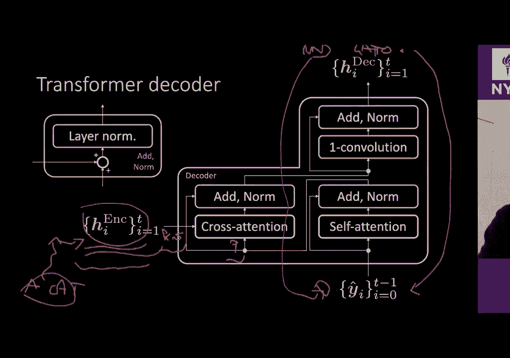

我的手背和那些长序列的问题是，我的手背和那些长序列的问题是，好吧，这一个打击了，还有一个博客，好吧，这一个打击了，还有一个博客。

一个女孩的帖子我忘了她的名字Lillian Lillian Lillian有一个不错的博客，一个女孩的帖子我忘了她的名字Lillian Lillian Lillian有一个不错的博客。

两天前或三天前的帖子，称为变压器系列，两天前或三天前的帖子，称为变压器系列，好的，博客文章中有一些错误，但是好的，我认为这更好，好的，博客文章中有一些错误，但是好的，我认为这更好，问题。

或者我要去做晚餐对不起，我能再说一遍吗，问题，或者我要去做晚餐对不起，我能再说一遍吗，他们把这个酒吧的文章命名为标题，所以巴士底狱的酒吧让我。

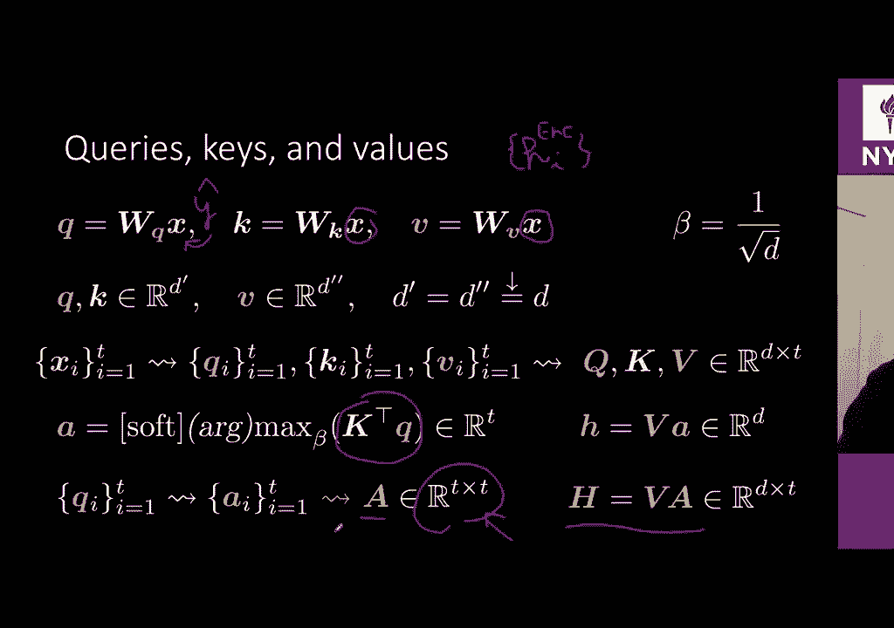

他们把这个酒吧的文章命名为标题，所以巴士底狱的酒吧让我，检查，我实际上不知道完全可以，这是周杰伦超酷的家伙，检查，我实际上不知道完全可以，这是周杰伦超酷的家伙，文章，他实际上我没有写。

所以这应该来自蒸馏，文章，他实际上我没有写，所以这应该来自蒸馏。

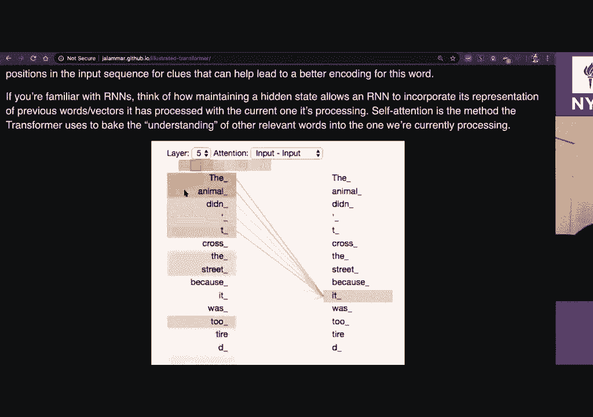

点吧，如果我没记错的话，我指的是这个。

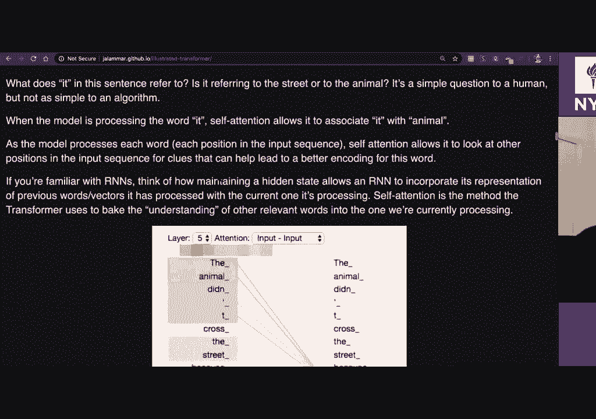

点吧，如果我没记错的话，我指的是这个，这个插图来自这个图解变压器和我的图片，这个插图来自这个图解变压器和我的图片，相信这来自克里斯托弗·奥拉（Christopher Ola）摘录的酒吧。

相信这来自克里斯托弗·奥拉（Christopher Ola）摘录的酒吧。

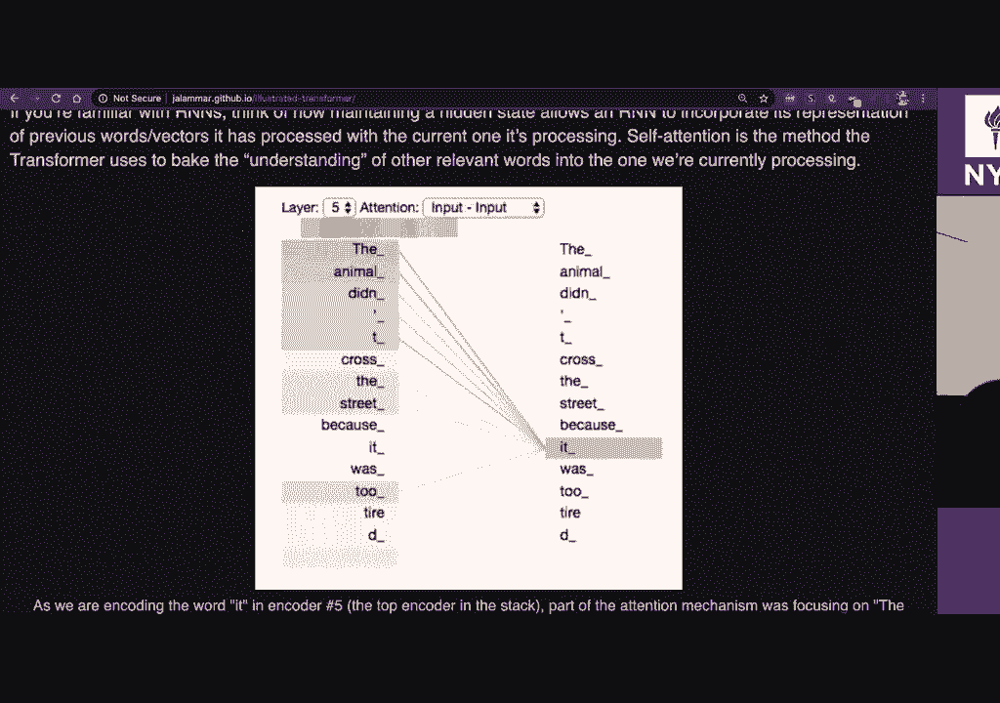

所以另一个网站仍然是酒吧yeah我们去那里所以你有，所以另一个网站仍然是酒吧yeah我们去那里所以你有。

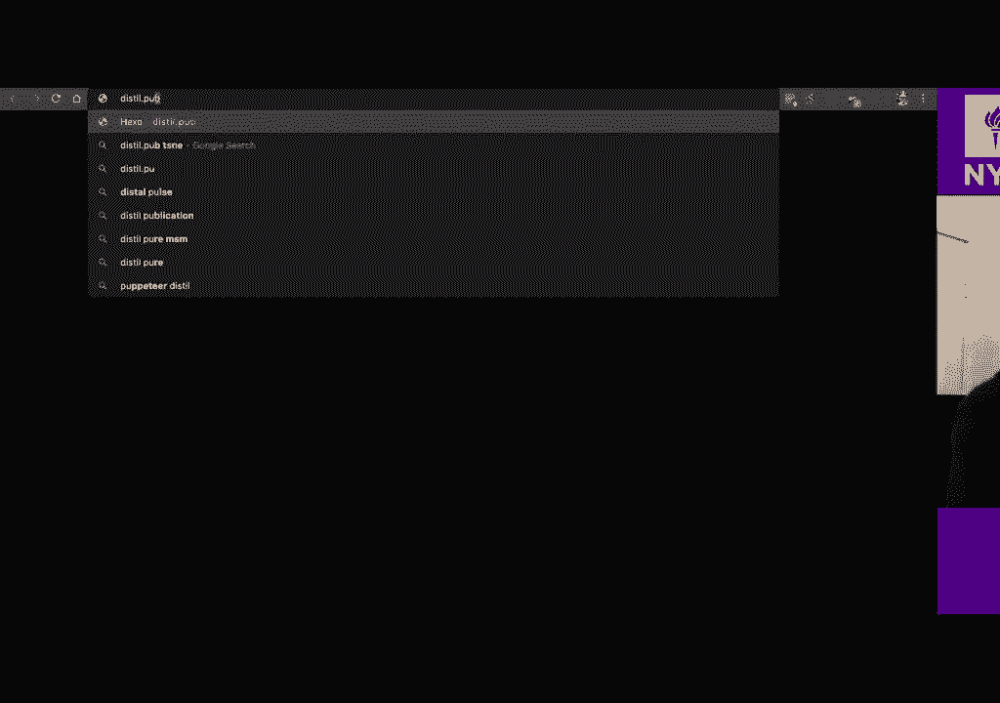

注意序列建模[音乐]。

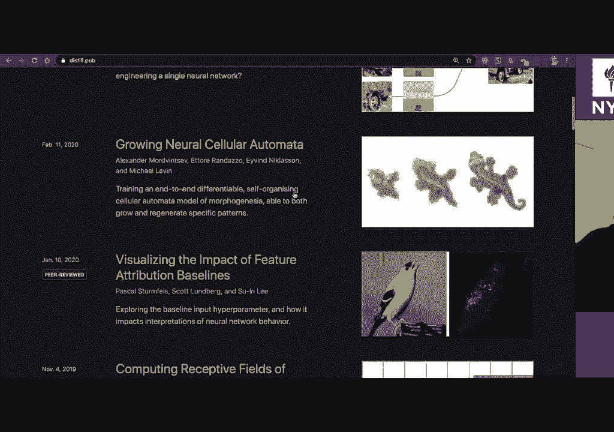

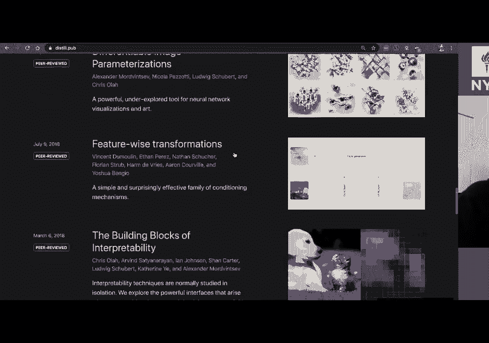

注意序列建模[音乐]，注意他们走了我想这我想是从这里来的。

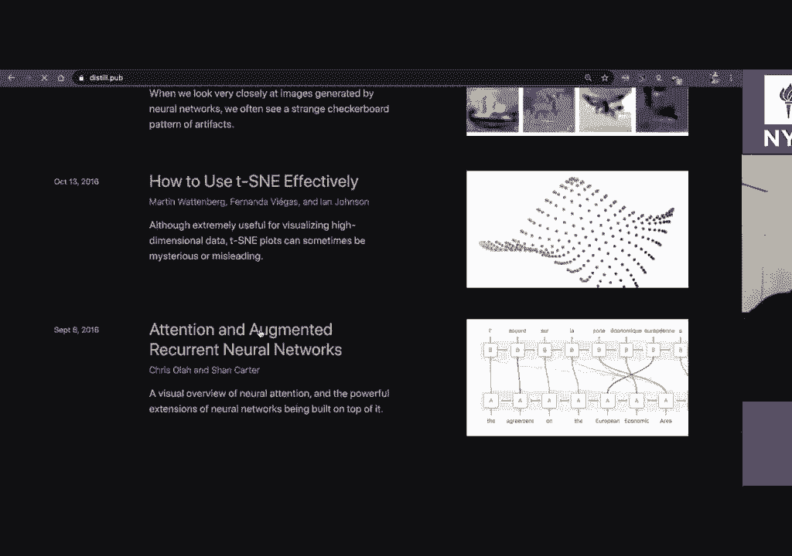

注意他们走了我想这我想是从这里来的，[音乐]。

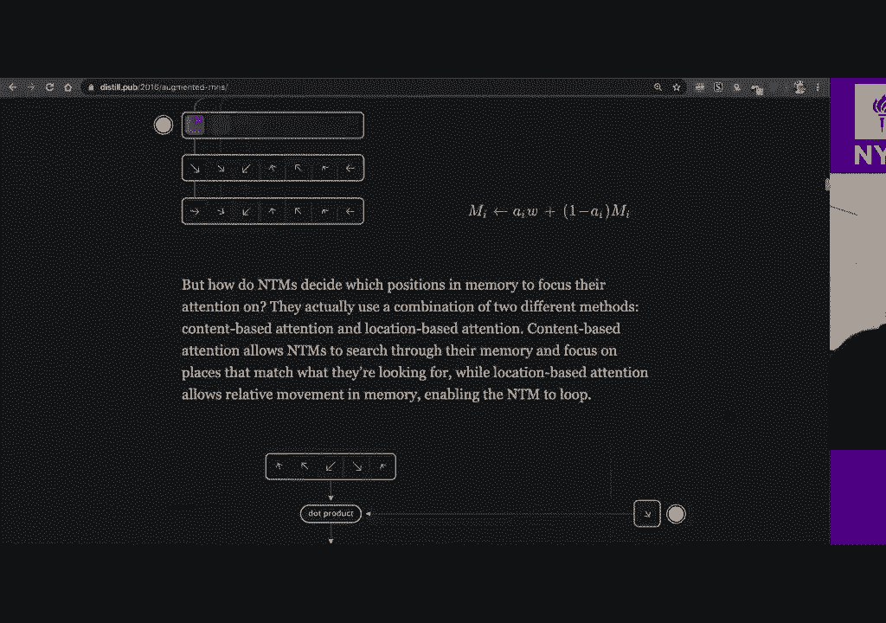

它谈到了心脏的注意力和柔和的注意力，我认为好吧，也许我撒了谎，它谈到了心脏的注意力和柔和的注意力，我认为好吧，也许我撒了谎。

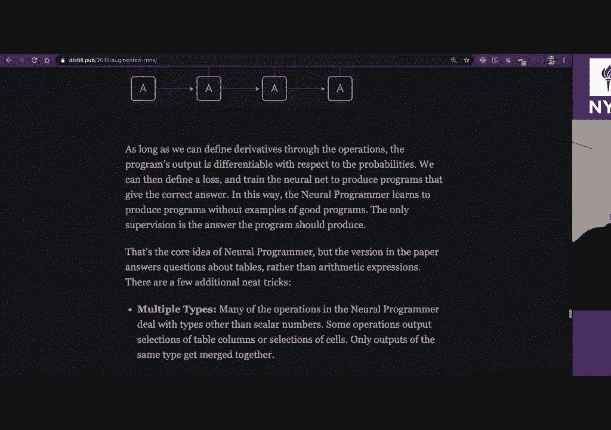

我在这里谈论这些图片好，所以我以为这是来自，我在这里谈论这些图片好，所以我以为这是来自，这个桌子的酒吧，也许我误会了这些是在说的照片，这个桌子的酒吧，也许我误会了这些是在说的照片，就像他们的名字一样。

他们会用不同的词，就像他们的名字一样，他们会用不同的词，没有过马路，因为它太累了，然后你在这里，没有过马路，因为它太累了，然后你在这里，是唯一的更原子的动物，但后来-也许动物没有，是唯一的更原子的动物。

但后来-也许动物没有，过马路，因为它太宽了，在这种情况下是白色而不是累，过马路，因为它太宽了，在这种情况下是白色而不是累，你应该知道在这种情况下上街吗？你应该知道在这种情况下上街吗？和动物。

但您知道这里的分数较高，因此标量积，和动物，但您知道这里的分数较高，因此标量积，是这个地区分数较高的人，您需要我提供的任何东西，是这个地区分数较高的人，您需要我提供的任何东西，更多，不，不，对，对。

更多，不，不，对，对，为什么高兴见到您并与您交谈很高兴，所以我们现在完成了。

为什么高兴见到您并与您交谈很高兴，所以我们现在完成了，相当重要的一课，所以再次如何从这些中学到更多，相当重要的一课，所以再次如何从这些中学到更多，教训，所以再次理解有些不是，教训，所以再次理解有些不是。

清楚我做得不好，然后在下面的评论部分问我，清楚我做得不好，然后在下面的评论部分问我，新闻，您可以找到有关我在做什么和在教什么的所有信息，新闻，您可以找到有关我在做什么和在教什么的所有信息。

FCN的Twitter表示，如果您订阅此YouTube，将再次处理更新，FCN的Twitter表示，如果您订阅此YouTube，将再次处理更新，我在线上传视频后，您就会拥有最新的视频，我在线上传视频后。

您就会拥有最新的视频，如果您喜欢我的作品，尤其是这个视频，只需按“赞”按钮，如果您喜欢我的作品，尤其是这个视频，只需按“赞”按钮，该视频具有英语成绩单，您可以在课程网站上找到所有，该视频具有英语成绩单。

您可以在课程网站上找到所有，标题链接到该视频的各个部分，标题链接到该视频的各个部分，parla Italiano hablas espanol new Ohama你说韩语你说土耳其语我们。

parla Italiano hablas espanol new Ohama你说韩语你说土耳其语我们，现在可以在课程网站上找到所有这些翻译，所以去，现在可以在课程网站上找到所有这些翻译，所以去。

在那里，看看是否想使用自己的语言，在那里，看看是否想使用自己的语言，也可以随时与我联系，以便我们可以开始使用，也可以随时与我联系，以便我们可以开始使用，翻译部分，最后您应该尝试遍历Piperj。

翻译部分，最后您应该尝试遍历Piperj，笔记本，我们在本课程中处于核心地位，使您熟悉所有，笔记本，我们在本课程中处于核心地位，使您熟悉所有，方法和类以及所有您应该尝试训练的小知识。

方法和类以及所有您应该尝试训练的小知识，笔记本更改参数，以便您可以了解一些很好的知识，笔记本更改参数，以便您可以了解一些很好的知识，没关系，这一次很多，所以您最好，没关系，这一次很多，所以您最好。

正确检查这个笔记本，最后如果发现错误错别字，您，正确检查这个笔记本，最后如果发现错误错别字，您，了解您认为我可以做得更好的一切我们可以做得更好我们可以改善。

了解您认为我可以做得更好的一切我们可以做得更好我们可以改善，如果您对github存储库做出了贡献，将在您的帮助下显示内容，如果您对github存储库做出了贡献，将在您的帮助下显示内容，网站托管的地方。

这再次非常感谢您，网站托管的地方，这再次非常感谢您，陪伴我们并再见。

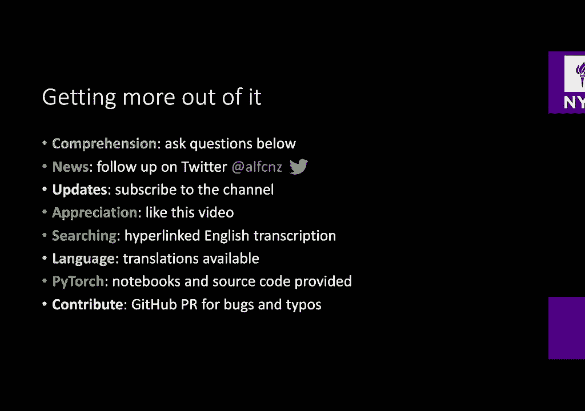