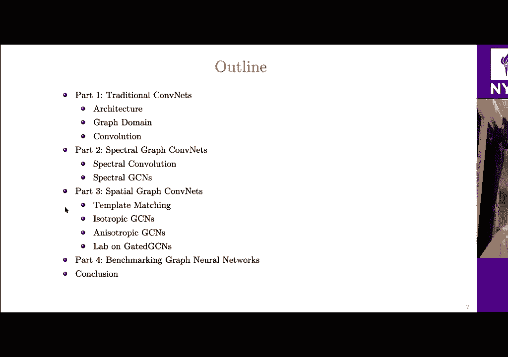
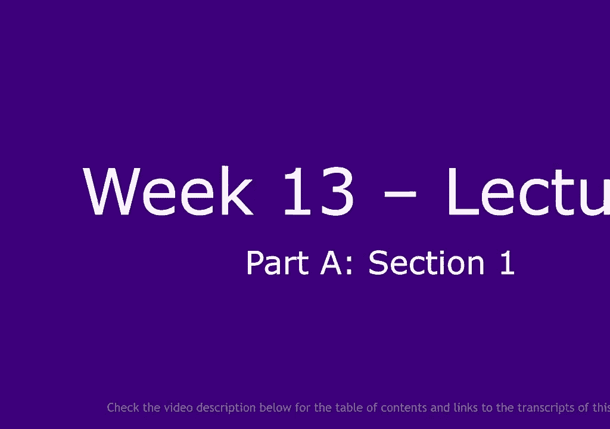
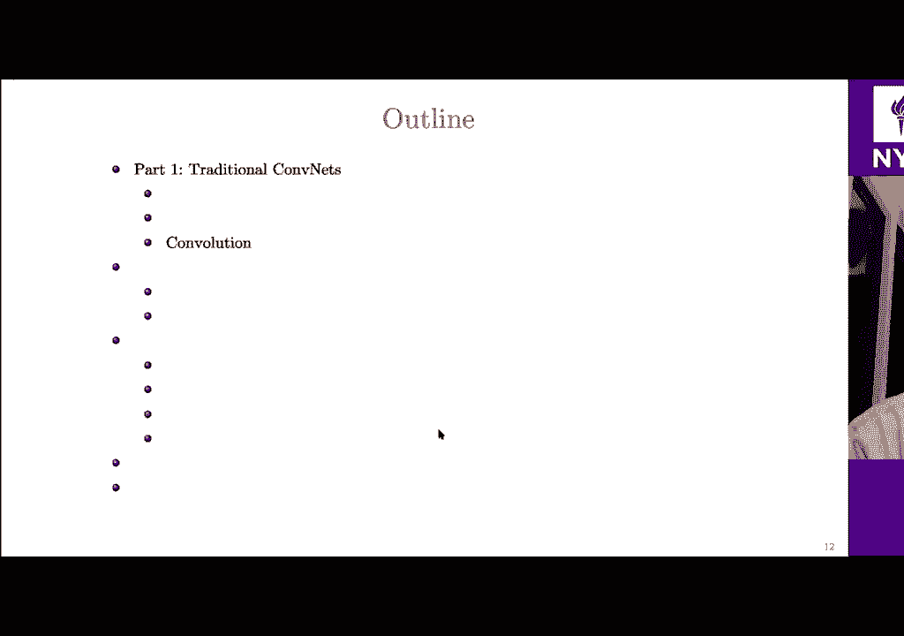
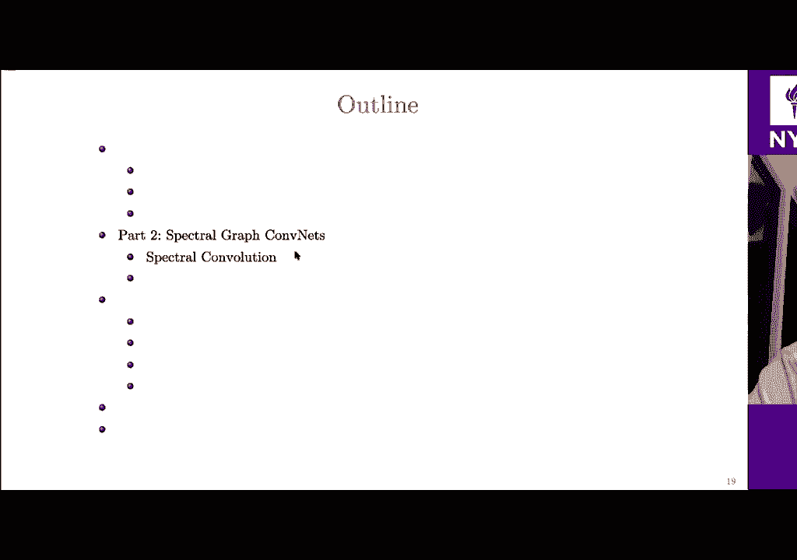
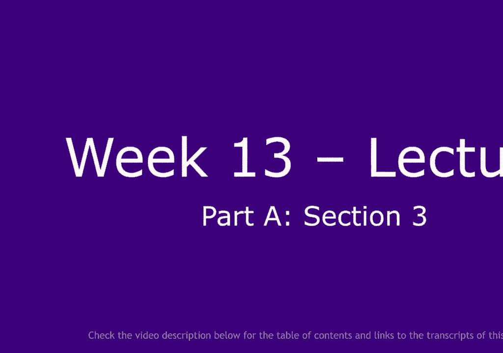
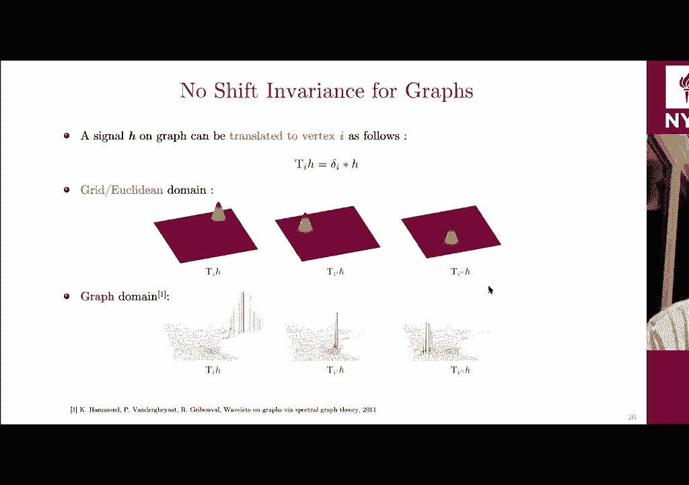
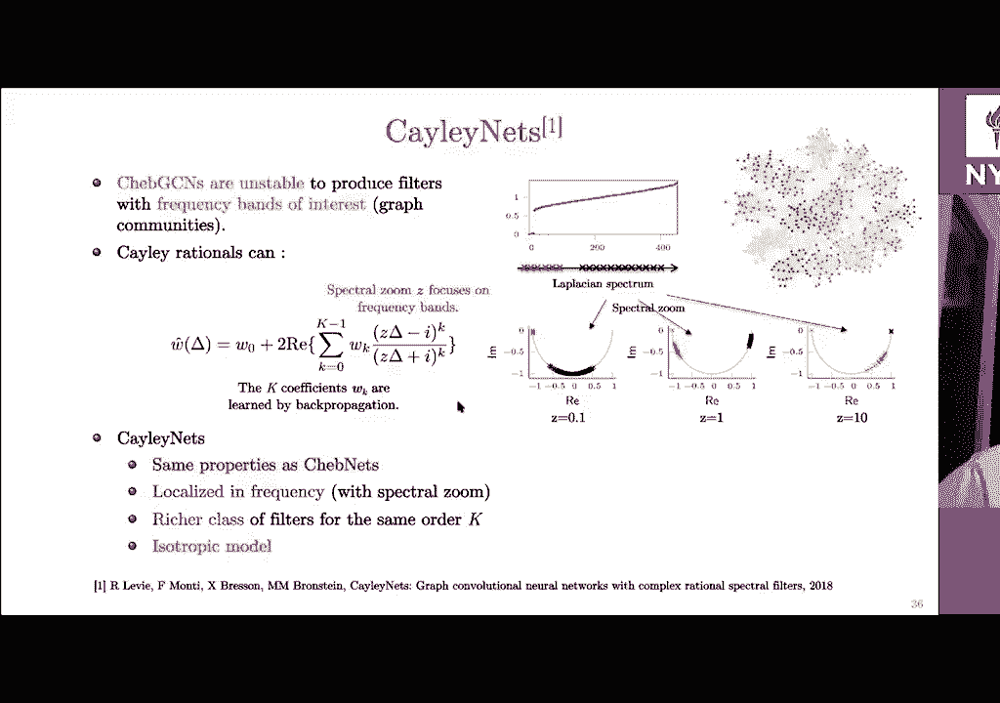
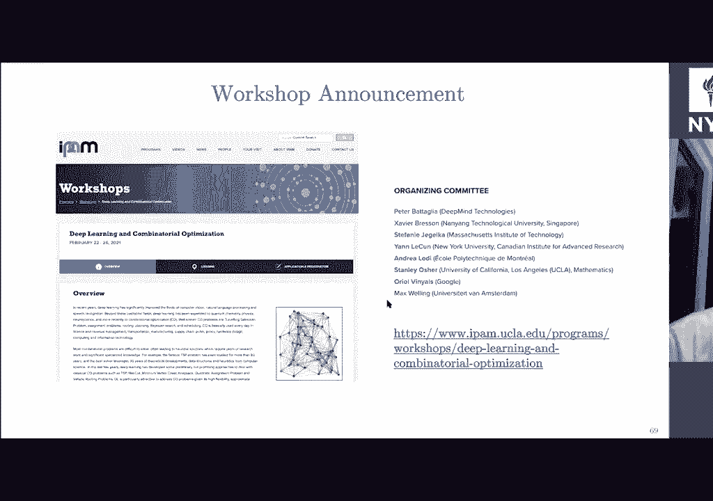
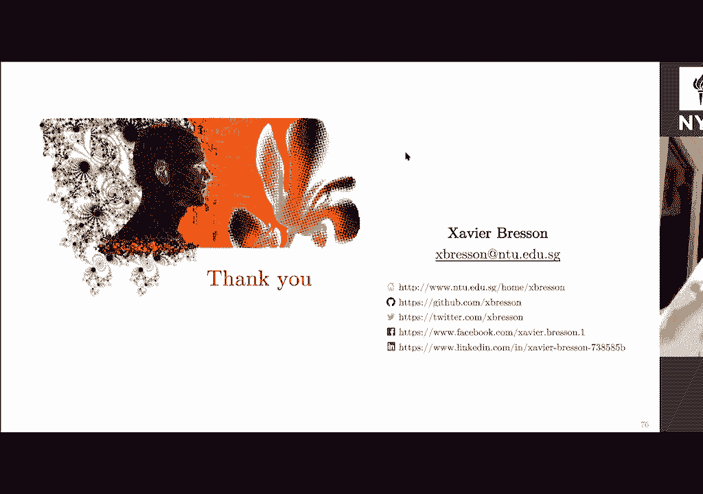

# 【NYU】纽约大学深度学习入门课程（with pytorch）中英文字幕 - P24：24.Week 13 – Lecture_ Graph Convolutional Networks (GCNs) - 大佬的迷弟的粉丝 - BV1o5411p7AB

所以欢迎大家，并参加有关传统图形的讲座，所以欢迎大家，并参加有关传统图形的讲座，网路好，所以这是，网路好，所以这是，演讲，所以我首先会快速，演讲，所以我首先会快速，传统协调架构，然后我，传统协调架构。

然后我，将介绍图表，我也将，将介绍图表，我也将，提醒卷积的定义将其扩展到两个图，然后我将，提醒卷积的定义将其扩展到两个图，然后我将，代表两类图形坐标，代表两类图形坐标，第一个是我称为让我们的频谱图。

第二个是，第一个是我称为让我们的频谱图，第二个是，空间图问题，我们将讨论一些有关，空间图问题，我们将讨论一些有关，基准图神经网络，最后我将得出结论，基准图神经网络，最后我将得出结论。

好吧，让我们从传统的约谈开始，好吧，让我们从传统的约谈开始，所以我们都知道坐标是计算机视觉的突破，所以我们都知道坐标是计算机视觉的突破。

因此，当您参加Imagenet竞赛时，您会知道，因此，当您参加Imagenet竞赛时，您会知道，使用合并时的图像分类任务um，使用合并时的图像分类任务um，呃他们几乎减少了两倍的误差。

呃他们几乎减少了两倍的误差，的分类是在2012年，基本上已经结束，的分类是在2012年，基本上已经结束，和手工艺品的特点，我们将范式转移到手工艺品学习，和手工艺品的特点，我们将范式转移到手工艺品学习。

系统，现在对于这个非常具体的任务，我们，系统，现在对于这个非常具体的任务，我们，都知道我们要去超人表演，都知道我们要去超人表演，座标也是语音的突破，座标也是语音的突破，和自然语言处理。

所以当您想翻译自己时可以使用facebook，和自然语言处理，所以当您想翻译自己时可以使用facebook，也使用坐标，因此内容功能强大，也使用坐标，因此内容功能强大，实际解决高维问题的架构。

实际解决高维问题的架构，学习问题，所以我们都知道维数的诅咒，学习问题，所以我们都知道维数的诅咒，因此，如果您有一张图片，假设是1 000 x 1 000像素，那么你有1张，因此，如果您有一张图片。

假设是1 000 x 1 000像素，那么你有1张，一百万个变量可以将图像视为一百万个空间中的一个点，一百万个变量可以将图像视为一百万个空间中的一个点，尺寸，对于每个尺寸，如果按，尺寸，对于每个尺寸。

如果按，通过使用10个样本来使用um，那么您有10个，通过使用10个样本来使用um，那么您有10个，拥有一百万个可能的图像，所以这些空间是，拥有一百万个可能的图像，所以这些空间是，真的很大。

这当然是问题，真的很大，这当然是问题，你能找到这么大的信息针吗，你能找到这么大的信息针吗，干草堆，所以契约非常强大，干草堆，所以契约非常强大，基本上，这些信息是最好的表示形式，基本上。

这些信息是最好的表示形式，您的图像数据，以解决问题，您的图像数据，以解决问题，当然我们还不知道一切，当然我们还不知道一切，是的，我们还不了解卷积网络的所有知识，这是一个奇迹，是的。

我们还不了解卷积网络的所有知识，这是一个奇迹，以及它们有多强大，这也很令人兴奋，因为，以及它们有多强大，这也很令人兴奋，因为，这打开了许多研究领域，以更好地了解并开发新的，这打开了许多研究领域。

以更好地了解并开发新的，架构还可以，所以当您使用卷积网络时，架构还可以，所以当您使用卷积网络时，做一个假设和主要假设，做一个假设和主要假设，使用的是您的数据，因此图像，视频，语音是合成的。

使用的是您的数据，因此图像，视频，语音是合成的，这意味着它是模式的形式，这意味着它是模式的形式，当地的，所以你知道这是城市构想的贡献，当地的，所以你知道这是城市构想的贡献，如果您位于该神经元的这一层。

则该神经元将连接到，如果您位于该神经元的这一层，则该神经元将连接到，上一层中的一些神经元，并非所有神经元都可以，所以这是，上一层中的一些神经元，并非所有神经元都可以，所以这是，本地接收场um假设。

那么你也有，本地接收场um假设，那么你也有，平稳的特性，所以基本上你有一些，平稳的特性，所以基本上你有一些，相似且相似的模式um，相似且相似的模式um，在您的图片域中共享，这样就好，在您的图片域中共享。

这样就好，黄色呃黄色补丁和蓝色补丁所以它们都是，黄色呃黄色补丁和蓝色补丁所以它们都是，彼此相似最后一个属性是文章，因此您，彼此相似最后一个属性是文章，因此您，假设您的数据是分层的，假设您的数据是分层的。

您的低级功能将是，您的低级功能将是，结合在一起形成中等水平的特征，结合在一起形成中等水平的特征，这个中等功能将再次出现，这个中等功能将再次出现，彼此结合形成越来越高，彼此结合形成越来越高。

这样的抽象特征，所以任何修道院都以相同的方式工作，这样的抽象特征，所以任何修道院都以相同的方式工作，所以架构的第一部分是提取，所以架构的第一部分是提取，这些常规功能，然后第二部分将解决您的。

这些常规功能，然后第二部分将解决您的，您知道的特定任务，例如分类，您知道的特定任务，例如分类，推荐等等，这就是我们所说的，推荐等等，这就是我们所说的，了解端到端系统和第一部分，了解端到端系统和第一部分。

是学习功能的第二部分是解决您的任务，是学习功能的第二部分是解决您的任务，好的，好的，让我们更准确地了解什么是数据域，好的，好的，让我们更准确地了解什么是数据域，因此，如果您基本上有图像量或视频，例如。

因此，如果您基本上有图像量或视频，例如，可以看到此图像，如果放大此图像，可以看到此图像，如果放大此图像，你有一个二维网格好吧，你有一个二维网格，你有一个二维网格好吧，你有一个二维网格。

这是此图像域的结构，这是此图像域的结构，在此网格的顶部，您具有一些功能，在此网格的顶部，您具有一些功能，因此，例如在彩色图像的情况下，因此，例如在彩色图像的情况下，红色，绿色和蓝色这三个特征，红色。

绿色和蓝色这三个特征，好吧，如果我正在研究自然语言处理，例如，好吧，如果我正在研究自然语言处理，例如，句子中将有一系列单词和，句子中将有一系列单词和，基本上，您可以看到您知道是一维网格，基本上。

您可以看到您知道是一维网格，在此网格的顶部，对于网格的每个节点，您将有一个单词，在此网格的顶部，对于网格的每个节点，您将有一个单词，好，所以一个词可以用，好，所以一个词可以用，整数，例如语音也一样。

整数，例如语音也一样，所以你在这里看到的是气压的变化，所以你在这里看到的是气压的变化，和您知道的一样，就像您获得的支持是一个学位，和您知道的一样，就像您获得的支持是一个学位，每个网格的每个节点。

每个网格的每个节点，气压值还可以，这是一个实数，气压值还可以，这是一个实数，所以嗯，我认为很明显，我们所有人都一直在使用网格和沙粒，所以嗯，我认为很明显，我们所有人都一直在使用网格和沙粒，如您所知。

它是非常强大的常规特殊结构，如您所知，它是非常强大的常规特殊结构，对于这个，对于这个结构，这很好，对于这个，对于这个结构，这很好，因为我们可以从数学上定义自信的操作，例如。

因为我们可以从数学上定义自信的操作，例如，卷积和拉动，而且在实践中也非常快，卷积和拉动，而且在实践中也非常快，所以一切都很好，现在让我们来看看，所以一切都很好，现在让我们来看看，新的新数据。

例如社交网络，新的新数据，例如社交网络，好吧，所以您想做自己的任务，例如要做，好吧，所以您想做自己的任务，例如要做，广告或提出建议，以便，广告或提出建议，以便，我要去的社交网络会很清楚，但是。

我要去的社交网络会很清楚，但是，我要告诉你，如果你做两个笔记，例如，我要告诉你，如果你做两个笔记，例如，您知道您有这个用户，假设这个用户i和j，您知道您有这个用户，假设这个用户i和j。

和其他所有您看到的不是网格，和其他所有您看到的不是网格，好的，所以连接是所有用户之间的成对连接，好的，所以连接是所有用户之间的成对连接，它们没有形成网格，它们具有非常特殊的连接方式，它们没有形成网格。

它们具有非常特殊的连接方式，这基本上是一个图，所以，嗯，你如何定义你的图，这基本上是一个图，所以，嗯，你如何定义你的图，会看到用户之间的联系，所以，会看到用户之间的联系，所以，如果我用户我用户j是朋友。

那么您将知道连接，然后，如果我用户我用户j是朋友，那么您将知道连接，然后，为此，您将使用所谓的邻接矩阵，为此，您将使用所谓的邻接矩阵，这只是要记录之间的所有连接或非连接总数。

这只是要记录之间的所有连接或非连接总数，在您的社交网络中记笔记，然后，在您的社交网络中记笔记，然后，在您的网络顶部，每个您的用户，在您的网络顶部，每个您的用户，将具有功能，例如您知道，将具有功能。

例如您知道，邮件中有图片，有视频，因此它们构成了您知道的某些功能，邮件中有图片，有视频，因此它们构成了您知道的某些功能，d维空间，例如，在神经科学的大脑分析中，例如，在神经科学的大脑分析中。

了解非常有趣，您知道基本的关系，了解非常有趣，您知道基本的关系，在大脑的结构和功能之间，所以它们真的很，在大脑的结构和功能之间，所以它们真的很，彼此相连，了解我们也非常基础，彼此相连。

了解我们也非常基础，想例如预测神经退行性疾病不同，想例如预测神经退行性疾病不同，疾病的各个阶段，因此这对于，疾病的各个阶段，因此这对于，我们需要了解大脑和大脑，我们需要了解大脑和大脑，如果你看一下大脑。

那大脑是组成的，如果你看一下大脑，那大脑是组成的，所谓的感兴趣区域还可以，这个感兴趣的区域，所谓的感兴趣区域还可以，这个感兴趣的区域，一个感兴趣的区域，该区域未连接到所有区域，一个感兴趣的区域。

该区域未连接到所有区域，实际上，它们在大脑中的其他区域仅与其他一些区域相连，实际上，它们在大脑中的其他区域仅与其他一些区域相连，地区，就这样，您可以再次看到，地区，就这样，您可以再次看到，与网格无关。

所以这个特殊的连接，与网格无关，所以这个特殊的连接，在大脑的不同区域之间，它们可以通过，在大脑的不同区域之间，它们可以通过，结构性的MRI信号，然后您还有一个，结构性的MRI信号，然后您还有一个。

区域i与区域j和以及之间的邻接矩阵，区域i与区域j和以及之间的邻接矩阵，在这里，您拥有强大的连接能力，这取决于有多少，在这里，您拥有强大的连接能力，这取决于有多少。

连接您必须连接多少根光纤才能连接区域铁区域j，连接您必须连接多少根光纤才能连接区域铁区域j，好的，然后在该图的顶部，所以如果您查看区域i，好的，然后在该图的顶部，所以如果您查看区域i。

那么您将拥有知道功能的激活，那么您将拥有知道功能的激活，激活，这基本上是一个时间序列，您可以在这里看到，激活，这基本上是一个时间序列，您可以在这里看到，可以用，可以用，功能性磁共振，好吧。

我要向您展示的最后一个例子是量子化学，好吧，我要向您展示的最后一个例子是量子化学，因此，例如，任务是设计，因此，例如，任务是设计，药物和材料的新分子，所以您再次看到了这种联系，药物和材料的新分子。

所以您再次看到了这种联系，原子之间与网格无关，原子之间与网格无关，好吧，这取决于您如何连接，好吧，这取决于您如何连接，你的原子，然后你就会知道分子，你的原子，然后你就会知道分子，所以嗯。

所以原子之间的联系称为键，所以嗯，所以原子之间的联系称为键，嗯，你知道不同种类的债券，他们可以成为，嗯，你知道不同种类的债券，他们可以成为，单键，双键，芳族键，你也有，你也有不同，单键，双键，芳族键。

你也有，你也有不同，能源等功能以及您可以使用的许多其他功能，能源等功能以及您可以使用的许多其他功能，来自化学um，用于图的节点，因此它们，来自化学um，用于图的节点，因此它们，是原子。

而您又可能拥有不同的特征，例如，是原子，而您又可能拥有不同的特征，例如，如果是原子，则为氢，如果是原子，则为氢，危害所有这些类型的人，危害所有这些类型的人，3d坐标由您负责，依此类推，您可能会有。

3d坐标由您负责，依此类推，您可能会有，多种功能好吧，嗯，不是吧，多种功能好吧，嗯，不是吧，清单实际上是给你的例子，清单实际上是给你的例子，图形域的范围，因此您也了解计算机图形学，图形域的范围。

因此您也了解计算机图形学，使用3d网格，您可能还需要分析，使用3d网格，您可能还需要分析，交通网络和汽车密度，也许我不知道，交通网络和汽车密度，也许我不知道，训练你也知道基因调控网络。

训练你也知道基因调控网络，你有知识图和世界的关系，你有知识图和世界的关系，您知道您想在哪里推荐的用户产品，您知道您想在哪里推荐的用户产品，了解您想给计算机带来更多常识，了解您想给计算机带来更多常识。

视觉机器，所以您想了解您之间的关系，视觉机器，所以您想了解您之间的关系，您也知道的对象，例如，您也知道的对象，例如，您想检测高能物理粒子，所以您，您想检测高能物理粒子，所以您，有字符。

捕获不是您所知道的常规网格结构，有字符，捕获不是您所知道的常规网格结构，对于所有这一切，您会看到有一个，对于所有这一切，您会看到有一个，分母呃，这基本上可以代表，分母呃，这基本上可以代表。

所有这些um问题作为图形，所有这些um问题作为图形，好的，这是我要的命令设置，好的，这是我要的命令设置，说出所有这些呃问题的数学命令设置，说出所有这些呃问题的数学命令设置。

所以这些图形让我们称之为它好吧，它们是由三个，所以这些图形让我们称之为它好吧，它们是由三个，实体，因此第一个实体将是一组顶点，实体，因此第一个实体将是一组顶点，因此通常您将一组顶点从一个索引到n。

因此通常您将一组顶点从一个索引到n，n是图中的节点数，n是图中的节点数，好的，例如这将是索引1，好的，例如这将是索引1，两个三个，依此类推，那么您将基本了解一组边，两个三个，依此类推。

那么您将基本了解一组边，是音符之间的连接，是音符之间的连接，最后，您将得到一个邻接矩阵a，最后，您将得到一个邻接矩阵a，您的边缘连接强度好吗，您的边缘连接强度好吗，好的，那么您就具有图形功能，例如。

对于每个节点，不是i还是j，好的，那么您就具有图形功能，例如，对于每个节点，不是i还是j，您将拥有一些节点功能，因此，您将拥有一些节点功能，因此，基本上是维数dv的矢量，基本上是维数dv的矢量。

同样也有可能你会得到，同样也有可能你会得到，你可以获得h特征，它将成为向量，你可以获得h特征，它将成为向量，维数如此，例如对于分子，维数如此，例如对于分子，节点特征可能知道原子类型，而边缘特征可能是。

节点特征可能知道原子类型，而边缘特征可能是，债券类型给你一个例子，最后你也可以有一些图，债券类型给你一个例子，最后你也可以有一些图，您可以拥有的整个图形的所有功能都正常。

您可以拥有的整个图形的所有功能都正常，一些功能，所以它再次是维数的向量，一些功能，所以它再次是维数的向量，dj并且在uh的情况下，dj并且在uh的情况下，可能是分子能量的化学，可能是分子能量的化学。

好吧，这是嗯，我会说图的一般定义，好吧，这是嗯，我会说图的一般定义，好吧，现在我要做的是谈论卷积，好吧，现在我要做的是谈论卷积。

问题是如何将卷积扩展到图，问题是如何将卷积扩展到图。

好的，首先让我提醒您，使用卷积的经典方法，好的，首先让我提醒您，使用卷积的经典方法，当我们使用confinets进行计算机可视化时，当我们使用confinets进行计算机可视化时，假设我有这张图片。

也许这是一些你知道的，假设我有这张图片，也许这是一些你知道的，在第L层隐藏了呃功能，我将与，在第L层隐藏了呃功能，我将与，某些模式或内核，某些模式或内核，那我当然会通过反向传播学习，然后我会得到一些。

那我当然会通过反向传播学习，然后我会得到一些，激活好，所以这是功能，激活好，所以这是功能，下一层，以便给您一些维度，下一层，以便给您一些维度，因此例如n1和2将是像素数，因此例如n1和2将是像素数。

在x和y方向上，而d是维数，在x和y方向上，而d是维数，每个像素的uh，所以如果这是彩色图像，则维数，每个像素的uh，所以如果这是彩色图像，则维数，三种颜色是三个，如果这，三种颜色是三个，如果这。

就像是中间的隐藏功能，也许你，就像是中间的隐藏功能，也许你，有100个您知道内核的尺寸通常很小，有100个您知道内核的尺寸通常很小，内核，因为您想知道本地接收字段，因此可能是，内核。

因为您想知道本地接收字段，因此可能是，您知道三乘三像素的内核或五乘一五乘五和，您知道三乘三像素的内核或五乘一五乘五和，当然，您之所以这么做，是因为您需要尊重他人，当然，您之所以这么做。

是因为您需要尊重他人，输入特征后的输入维数，输入特征后的输入维数，好吧，也许对于这个，所以你看到那个呃，所以你要转换这个，好吧，也许对于这个，所以你看到那个呃，所以你要转换这个，具有此功能的图像。

具有此功能的图像，方向，以便您基本上可以识别出您知道的，方向，以便您基本上可以识别出您知道的，在图像的这个方向上排成一行，在图像的这个方向上排成一行，所以这只是一个例子，我们现在就使用填充。

所以这只是一个例子，我们现在就使用填充，嗯，是的，是相同的尺寸，绝对是防止填充的，所以，嗯，是的，是相同的尺寸，绝对是防止填充的，所以，您基本上不会缩小图片的大小，您基本上不会缩小图片的大小，对，是的。

所以我们如何在数学上定义，对，是的，所以我们如何在数学上定义，卷积，所以第一个定义是，卷积，所以第一个定义是，将卷积视为匹配的模板好吗，将卷积视为匹配的模板好吗，所以模板匹配，所以这里的定义是数学定义。

所以模板匹配，所以这里的定义是数学定义，卷积，所以您要做的是，卷积，所以您要做的是，您将要使用模板，您将要使用图像，您将要使用模板，您将要使用图像，然后您将对整个索引求和，然后您将对整个索引求和。

wj的图像域omega还可以，这将是一种产品，wj的图像域omega还可以，这将是一种产品，在向量wj和向量hi减去g之间，在向量wj和向量hi减去g之间，好的，这是卷积的纯粹定义，好的。

这是卷积的纯粹定义，而我们通常在计算机视觉中所做的就是我们不减去，而我们通常在计算机视觉中所做的就是我们不减去，我们采取加好，我们称之为，因为当我们这样做时，我们采取加好，我们称之为。

因为当我们这样做时，有相关性的定义，这是你知道的，因为，有相关性的定义，这是你知道的，因为，更加像模板一样，更加像模板一样，匹配好吧，所以如果我减去j或我，它不会改变任何东西，匹配好吧。

所以如果我减去j或我，它不会改变任何东西，在学习意义上加上j，因为您要做的唯一一件事就是翻转，在学习意义上加上j，因为您要做的唯一一件事就是翻转，上下左右，上下左右，您的内核，当您学习时。

它基本上不会改变任何东西，您的内核，当您学习时，它基本上不会改变任何东西，好的，但这是相关性的定义，所以它确实是，好的，但这是相关性的定义，所以它确实是，模板匹配，然后我将采取，模板匹配，然后我将采取。

记号ij好的，所以基本上，是的，非常，记号ij好的，所以基本上，是的，非常，重要的是，当我们进行卷积运算时，重要的是，当我们进行卷积运算时，我们正在使用具有紧凑支持的内核的各个层。

我们正在使用具有紧凑支持的内核的各个层，像3x3一样，当我们这样做时，我们的支持非常小，像3x3一样，当我们这样做时，我们的支持非常小，整个域就是图像域，我们只是对，整个域就是图像域，我们只是对。

节点的邻居我还可以，这非常，节点的邻居我还可以，这非常，重要，这非常重要，因为突然之间，重要，这非常重要，因为突然之间，总和不超过整个像素，总和不超过整个像素，um，然后进行卷积的复杂度为，um。

然后进行卷积的复杂度为，实际上是节点数的顺序，实际上是节点数的顺序，图像中像素的数量，因此，图像中像素的数量，因此，完整的数据很容易计算，所以您要做的是，完整的数据很容易计算，所以您要做的是。

你要采用你的图案，你要切成薄片，你要采用你的图案，你要切成薄片，您的图案，因此将被切片，因为n个位置，您的图案，因此将被切片，因为n个位置，然后您会知道三乘三的标量积，然后您会知道三乘三的标量积，元素。

你会知道的，元素，你会知道的，um向量是维向量的乘积，um向量是维向量的乘积，您会发现执行此操作的复杂性只是，您会发现执行此操作的复杂性只是，n d的三倍三倍，所以完成的是n，n d的三倍三倍。

所以完成的是n，再一次，如果您有GPU，则所有操作都可以并行完成，再一次，如果您有GPU，则所有操作都可以并行完成，您在此位置进行的计算是独立的，您在此位置进行的计算是独立的，参加您在此地点进行的比赛。

参加您在此地点进行的比赛，一切都是线性复杂度，好吧，这样做吧，一切都是线性复杂度，好吧，这样做吧，因此，如果您想使用模板匹配进行卷积，那么在一天结束时，因此，如果您想使用模板匹配进行卷积。

那么在一天结束时，您只需要在模板之间计算这个标量积，您只需要在模板之间计算这个标量积，在呃你的图片之间，我会说你的图片补丁好了，在呃你的图片之间，我会说你的图片补丁好了，嗯，好了，这很重要，嗯，好了。

这很重要，在图形是网格的情况下，这是用于标准卷积的，在图形是网格的情况下，这是用于标准卷积的，在计算机视觉中，如果您看着的话，在计算机视觉中，如果您看着的话，知道您的模板在这里还可以。

所以您会看到我要给，知道您的模板在这里还可以，所以您会看到我要给，一些节点排序j1 g2 j3等等，到g9，一些节点排序j1 g2 j3等等，到g9，这个节点的排序实际上非常重要。

这个节点的排序实际上非常重要，好吧，因为有史以来我不是说这个意思，所以对于，好吧，因为有史以来我不是说这个意思，所以对于，示例节点g3将始终位于同一位置，示例节点g3将始终位于同一位置，位置。

所以它总是会在右上角，位置，所以它总是会在右上角，模式的一角好吧，这就是非常重要的原因，模式的一角好吧，这就是非常重要的原因，这非常重要，让我转到下一张幻灯片，这非常重要，让我转到下一张幻灯片。

所以为什么它很重要是当我进行卷积运算时，所以为什么它很重要是当我进行卷积运算时，再次匹配，我将采用我的模式，我，再次匹配，我将采用我的模式，我，会在我的图片域上切片图案，这样，会在我的图片域上切片图案。

这样，也许在这里，我把它放在这里，这也是，也许在这里，我把它放在这里，这也是，我的位置我的位置，我的位置我的位置，所以当我要做模板之间的匹配时，所以当我要做模板之间的匹配时，内核和映像我将要做的是。

内核和映像我将要做的是，该索引，因此索引g3将始终与您知道的匹配，该索引，因此索引g3将始终与您知道的匹配，图片中此索引处的信息，图片中此索引处的信息，好吧，这非常重要，因此当您拥有网格时，节点，好吧。

这非常重要，因此当您拥有网格时，节点，无论位置如何，排序节点的位置总是相同的，无论位置如何，排序节点的位置总是相同的，在您的图片中进行匹配时，在您的图片中进行匹配时，在索引g3和此索引中的图像之间。

在索引g3和此索引中的图像之间，总是比较相同的信息，您总是在，总是比较相同的信息，您总是在，图案的右上角和，图案的右上角和，图像补丁角的类型还可以，所以这个，图像补丁角的类型还可以，所以这个，呃。

您看到这个匹配分数，它们是相同的信息，呃，您看到这个匹配分数，它们是相同的信息，好，所以现在非常重要，让我们看一下图形发生了什么，好，所以现在非常重要，让我们看一下图形发生了什么，好的。

所以问题是我们可以扩展此模板匹配的定义，好的，所以问题是我们可以扩展此模板匹配的定义，图，主要有两个问题，因此，图，主要有两个问题，因此，第一个问题基本上是在您没有的图形上。

第一个问题基本上是在您没有的图形上，笔记的任何顺序都可以，所以在图表上，笔记的任何顺序都可以，所以在图表上，您的笔记没有给定的位置，所以举个例子，您的笔记没有给定的位置，所以举个例子。

我有这个呃图形模板好，所以有四个注释，我有这个呃图形模板好，所以有四个注释，这种连接，我在这里有这个顶点，事情就是为了这个，这种连接，我在这里有这个顶点，事情就是为了这个，顶点，我对位置一无所知，顶点。

我对位置一无所知，我唯一知道的是索引还可以，所以也许这是，我唯一知道的是索引还可以，所以也许这是，索引号三为此，然后当我，如果我，索引号三为此，然后当我，如果我，想要使用模板机定义，我要做的是。

想要使用模板机定义，我要做的是，我需要将您知道的这个索引与其他索引相匹配，我需要将您知道的这个索引与其他索引相匹配，在图域中，所以这是我的图，假设这是为了，在图域中，所以这是我的图，假设这是为了。

节点i和它们是节点i的邻居，节点i和它们是节点i的邻居，对于这个邻居，这是相同的索引j3，对于这个邻居，这是相同的索引j3，但在这里我的意思是我该如何匹配您知道此信息。

但在这里我的意思是我该如何匹配您知道此信息，信息，当我不知道它们是否匹配时，信息，当我不知道它们是否匹配时，彼此成熟，因为在图上您没有任何，彼此成熟，因为在图上您没有任何，您不知道是不是因为笔记的顺序。

您不知道是不是因为笔记的顺序，您不知道的任何信息的右上角，您不知道的任何信息的右上角，所以在图上，您不知道哪里在哪里哪里在哪里哪里在哪里，所以在图上，您不知道哪里在哪里哪里在哪里哪里在哪里，在右边。

左边在哪里，所以当您进行此匹配时，在右边，左边在哪里，所以当您进行此匹配时，在这个特征向量和这张图片之间，在这个特征向量和这张图片之间，向量实际上，这种匹配通常没有任何意义，好吗，向量实际上。

这种匹配通常没有任何意义，好吗，你你不知道你互相比较好吗，你你不知道你互相比较好吗，而且索引完全是任意的，而且索引完全是任意的，好的，所以您可以在此处输入值3但可以在此处，好的。

所以您可以在此处输入值3但可以在此处，值2或值12。您没有，值2或值12。您没有，这是不是您知道的任何好信息，这是不是您知道的任何好信息，所以基本上是因为您在图表上没有任何注释的顺序。

所以基本上是因为您在图表上没有任何注释的顺序，您无法选择模板匹配的定义，您无法选择模板匹配的定义，您不能直接使用它，所以我们需要做其他事情，您不能直接使用它，所以我们需要做其他事情。

好的第二个问题与图形的模板匹配，好的第二个问题与图形的模板匹配，如果模板中的节点数过多，会发生什么，如果模板中的节点数过多，会发生什么，与您知道的节点数不匹配，与您知道的节点数不匹配，在您的图表中。

例如，在这里，我有四个节点，在您的图表中，例如，在这里，我有四个节点，在这里我有四个节点，也许我可以找到一种比较的方法，在这里我有四个节点，也许我可以找到一种比较的方法，两套节点中的两个，但在这里我有。

两套节点中的两个，但在这里我有，嗯，我有七个节点，所以我要如何将七个节点与四个节点进行比较，嗯，我有七个节点，所以我要如何将七个节点与四个节点进行比较，所以你也知道一个未解决的问题，好。

所以第三个数学定义是使用模板匹配，好，所以第三个数学定义是使用模板匹配，定义卷积现在第二个定义是使用，定义卷积现在第二个定义是使用，卷积定理，所以um的卷积定理，卷积定理，所以um的卷积定理。

傅立叶基本上是两个卷积的傅立叶变换，傅立叶基本上是两个卷积的傅立叶变换，函数是傅立叶的点积，函数是傅立叶的点积，变换，这就是您在这里看到的，所以傅立叶变换，变换，这就是您在这里看到的，所以傅立叶变换。

函数w和函数h的卷积是，函数w和函数h的卷积是，f和点两次相乘的傅立叶变换，f和点两次相乘的傅立叶变换，h的傅立叶变换，然后对变换进行逆变换，h的傅立叶变换，然后对变换进行逆变换，你回到你的卷积真好。

你回到你的卷积真好，好吧，我们有一个非常好的公式来对w和，好吧，我们有一个非常好的公式来对w和，h，但事情在一般情况下，h，但事情在一般情况下，进行傅立叶变换是n平方复杂度，我们回到。

进行傅立叶变换是n平方复杂度，我们回到，但是，如果您的域名像图片网格一样，但是，如果您的域名像图片网格一样，特定的结构，那么您可以将复杂度降低到n，特定的结构，那么您可以将复杂度降低到n。

使用您的日志n uh，您知道uh快速傅立叶变换还可以，所以，使用您的日志n uh，您知道uh快速傅立叶变换还可以，所以，问题是我们可以扩展这个定义吗，问题是我们可以扩展这个定义吗，卷积定理到图。

所以问题是我们如何重新定义一个，卷积定理到图，所以问题是我们如何重新定义一个，四个图的傅立叶变换还可以，四个图的傅立叶变换还可以，关键是如何使其快速好起来，所以请记住，关键是如何使其快速好起来。

所以请记住，在模板匹配的情况下，在模板匹配的情况下，我们有线性复杂度，所以我们如何在，我们有线性复杂度，所以我们如何在，紧凑内核的线性时间，这就是，紧凑内核的线性时间，这就是，两个开放的问题好吧。

所以基本上我们将使用，两个开放的问题好吧，所以基本上我们将使用，将卷积的这两个定义设计为两个类，将卷积的这两个定义设计为两个类，图神经网络，所以这将是模板机，图神经网络，所以这将是模板机。

用于空间图檐口和转换旋转我要，用于空间图檐口和转换旋转我要，将其用于频谱图网，这是下一个，将其用于频谱图网，这是下一个，我现在要谈的下一部分，我现在要谈的下一部分。

好的，让我们来谈谈如何进行谱卷积，好的，让我们来谈谈如何进行谱卷积。

所以我有一本书我很喜欢，所以我有一本书我很喜欢，呃，范忠忠的书是，呃，范忠忠的书是，光谱理论，所以一切都很好，光谱理论，所以一切都很好，谐波分析图形组合问题与优化。谐波分析图形组合问题与优化。

所以我真的建议你认识人们看书，所以我真的建议你认识人们看书，他们想对这些有更多的了解，他们想对这些有更多的了解，这些问题，那么我们如何进行频谱卷积，这些问题，那么我们如何进行频谱卷积。

所以我们将使用四个步骤，所以第一步是，所以我们将使用四个步骤，所以第一步是，将是定义图形应用程序的第二步，将是定义图形应用程序的第二步，将定义傅立叶函数，然后我们将，将定义傅立叶函数，然后我们将。

傅立叶变换并最终卷积，傅立叶变换并最终卷积，定理好，那么图的位置是什么，定理好，那么图的位置是什么，图计算这是光谱的核心运算符，图计算这是光谱的核心运算符，图论还可以，所以请记住我们如何定义图。

图论还可以，所以请记住我们如何定义图，有一组顶点，一组边，然后我们有，有一组顶点，一组边，然后我们有，邻接矩阵，因此如果图具有n个顶点，邻接矩阵，因此如果图具有n个顶点，邻接矩阵是一个n矩阵。

邻接矩阵是一个n矩阵，所以我们将简单地定义laplacian，所以我们将简单地定义laplacian，也将是一个n×n矩阵作为恒等式，也将是一个n×n矩阵作为恒等式，减去邻接矩阵，我们将进行归一化。

减去邻接矩阵，我们将进行归一化，通过使用每个节点的度数邻接矩阵，因此d为，通过使用每个节点的度数邻接矩阵，因此d为，基本上是对角矩阵，对角线的每个元素，基本上是对角矩阵，对角线的每个元素。

对角线基本上是节点的度数，对角线基本上是节点的度数，好的，我们正在做，这称为归一化位置，好的，我们正在做，这称为归一化位置，好吧，这就是我会说这是默认情况下的定义，好吧。

这就是我会说这是默认情况下的定义，我们用于图的laplacian，所以我们可以解释这个，我们用于图的laplacian，所以我们可以解释这个，运算符，所以laplacian是这个组合，所以，运算符。

所以laplacian是这个组合，所以，一个是基本上所有零的矩阵，一个是基本上所有零的矩阵，一个代表了之间的联系，一个代表了之间的联系，边缘正确，嗯，是的，例如，嗯，我会说，边缘正确，嗯，是的，例如。

嗯，我会说，那正是定义，所以如果不是用户我就是，那正是定义，所以如果不是用户我就是，与用户j的朋友，那么您将拥有，与用户j的朋友，那么您将拥有，邻接矩阵的值将等于ij，邻接矩阵的值将等于ij。

如果两个用户不是朋友，那么您将获得零值，但，如果两个用户不是朋友，那么您将获得零值，但，有时候，您拥有真正的价值，例如对于大脑，有时候，您拥有真正的价值，例如对于大脑，连接图aij的值是。

连接图aij的值是，这两个区域之间的联系基本上就是我们，这两个区域之间的联系基本上就是我们，表示连接区域i和区域j的光纤数量，以便，表示连接区域i和区域j的光纤数量，以便，二进制也可以是连续值。

二进制也可以是连续值，如果它是非定向图，也是对称的，如果它是非定向图，也是对称的，否则，是的，通常是对称的，你想要，否则，是的，通常是对称的，你想要，您出于数学原因想要对称，您出于数学原因想要对称，嗯。

但您可能没有，所以这是归一化的海拔，但是如果，嗯，但您可能没有，所以这是归一化的海拔，但是如果，你有随机游走的拉普拉斯，那么这是不对称的，你有随机游走的拉普拉斯，那么这是不对称的，好吧，嗯，这是不同的。

好吧，嗯，这是不同的，应用程序的定义，所以在拉普拉斯式的情况下，应用程序的定义，所以在拉普拉斯式的情况下，有趣的是，在连续设置中，您只有一个定义，有趣的是，在连续设置中，您只有一个定义，应用程序。

称为laplace Beltrami运算符，应用程序，称为laplace Beltrami运算符，在离散设置中，您可以有多个定义，您可以自己定义，在离散设置中，您可以有多个定义，您可以自己定义。

应用程序的定义取决于假设，应用程序的定义取决于假设，你将要使用的我明白，你将要使用的我明白，谢谢，好的，我们可以解释该应用程序，因此该应用程序是，谢谢，好的，我们可以解释该应用程序，因此该应用程序是。

只是衡量平滑度而已，只是衡量平滑度而已，上图上的函数的关系，所以这没什么别的，那么你会看到，上图上的函数的关系，所以这没什么别的，那么你会看到，你看，所以我正在做我要回复功能的详细说明，你看。

所以我正在做我要回复功能的详细说明，我在图表上没事，我正在看发生了什么，我在图表上没事，我正在看发生了什么，在顶点我，如果我扩展这个定义，在顶点我，如果我扩展这个定义，我将得到hi减去邻里平均值的值。

好了，我将得到hi减去邻里平均值的值，好了，所以基本上，如果您的信号是平稳的，您就知道它是否变化不大，所以基本上，如果您的信号是平稳的，您就知道它是否变化不大，那么这个差异将很小，那么这个差异将很小。

如果您知道您的信号有很多振荡，如果您知道您的信号有很多振荡，很多，那么差异将非常高，所以laplacian就是别的，很多，那么差异将非常高，所以laplacian就是别的。

以及函数在图上的a上的平滑度的度量，以及函数在图上的a上的平滑度的度量，好的，现在让我们定义傅立叶函数，好的，现在让我们定义傅立叶函数，让我们以拉普拉斯矩阵为例，让我们以拉普拉斯矩阵为例。

让我们对线性代数进行特征分解，让我们对线性代数进行特征分解，图形操作，以便在进行本征分解时，图形操作，以便在进行本征分解时，将拥有你将要分解你的，将拥有你将要分解你的，拉普拉斯矩阵分为三个矩阵。

因此您有一个phi，拉普拉斯矩阵分为三个矩阵，因此您有一个phi，转置lambda和五个，所以这个，转置lambda和五个，所以这个，大小为n×n的矩阵5实际上是laplacian。

大小为n×n的矩阵5实际上是laplacian，每列和laplacian的特征向量都可以，每列和laplacian的特征向量都可以，特征向量被称为傅立叶函数，特征向量被称为傅立叶函数，好吧。

著名的傅立叶函数，这当然是正交的，好吧，著名的傅立叶函数，这当然是正交的，嗯，所以当你做产品时，嗯，所以当你做产品时，如果两个基数相同，那么您将得到一个基数，然后得到，如果两个基数相同。

那么您将得到一个基数，然后得到，如果它们是正交的，则为零；如果它们不同，则这也是，如果它们是正交的，则为零；如果它们不同，则这也是，可逆矩阵这个家伙，所以这个矩阵是，可逆矩阵这个家伙，所以这个矩阵是。

拉普拉斯特征值的对角矩阵，拉普拉斯特征值的对角矩阵，所以lambda 1到数字n，我们知道对于归一化，所以lambda 1到数字n，我们知道对于归一化，这些值之间绑定的应用程序。

这些值之间绑定的应用程序，零和二之间，所以这是最大值，零和二之间，所以这是最大值，你可以让这个人知道他们的拉普拉斯特征值，你可以让这个人知道他们的拉普拉斯特征值，作为图的频谱还可以，所以如果你拍一张图。

作为图的频谱还可以，所以如果你拍一张图，如果我计算拉普拉斯算子，这里有27个节点，如果我计算拉普拉斯算子，这里有27个节点，特征值，如果我把它们放进去，我就有图的签名，特征值，如果我把它们放进去。

我就有图的签名，称图的频谱还可以，对于，称图的频谱还可以，对于，每个图都还可以，在这里您还可以，这就是，每个图都还可以，在这里您还可以，这就是，我说这是在做再次分解，所以如果你，我说这是在做再次分解。

所以如果你，取您的拉普拉斯矩阵，然后将其应用于，取您的拉普拉斯矩阵，然后将其应用于，k的向量phi，则将得到，k的向量phi，则将得到，特征值λ乘以相同向量，特征值λ乘以相同向量。

phi of k okay，所以这是um的定义，phi of k okay，所以这是um的定义，本征分解还可以，所以您会看到傅立叶函数，本征分解还可以，所以您会看到傅立叶函数，比拉普拉斯特征向量。

比拉普拉斯特征向量，好吧，让我举例说明这些呃傅立叶函数，所以我们实际上，好吧，让我举例说明这些呃傅立叶函数，所以我们实际上，已经知道您的功能了，如果您愿意，已经知道您的功能了，如果您愿意，例如。

这里取一个度，然后计算傅立叶函数，例如，这里取一个度，然后计算傅立叶函数，你这样你会得到phi零，然后你会得到phi之一，你这样你会得到phi零，然后你会得到phi之一，这是一个光滑的phi 2。

慕斯少了一点，这是一个光滑的phi 2，慕斯少了一点，和phi 3等，依此类推，这是，和phi 3等，依此类推，这是，众所周知，这是余弦函数和半弧线，我们使用它，众所周知，这是余弦函数和半弧线。

我们使用它，知道图像压缩，所以如果我们采取，知道图像压缩，所以如果我们采取，图像，然后将图像投影在傅立叶函数上，然后将图像，图像，然后将图像投影在傅立叶函数上，然后将图像，将是转型将是稀疏的。

将是转型将是稀疏的，所以你只知道最高的系数就可以压缩，所以你只知道最高的系数就可以压缩，所以这是我们已经使用了非常，所以这是我们已经使用了非常，对于图域来说，很长一段时间对于图来说，这是非常有趣的。

对于图域来说，很长一段时间对于图来说，这是非常有趣的，所以你看到这是一张图，我在这里计算，所以你看到这是一张图，我在这里计算，前四个呃你知道图的傅立叶函数，前四个呃你知道图的傅立叶函数，因此。

您会看到phi呃，您仍然知道在正数之间存在振荡，因此，您会看到phi呃，您仍然知道在正数之间存在振荡，和负值与正和相同，和负值与正和相同，负值，这里也是um，有趣的是，负值，这里也是um，有趣的是。

振荡呃取决于图的拓扑，振荡呃取决于图的拓扑，好吧，所以它与，好吧，所以它与，图的几何形状，例如枢纽等社区，我们知道，图的几何形状，例如枢纽等社区，我们知道，因此，例如，如果您想捕获k个社区，因此，例如。

如果您想捕获k个社区，图很好的算法是适用，图很好的算法是适用，如果您这样做，则第一个关键傅立叶函数的k均值，如果您这样做，则第一个关键傅立叶函数的k均值，有一些我们称为光谱仪理论的东西。

有一些我们称为光谱仪理论的东西，这是一部庞大的文学作品，这是一部庞大的文学作品，而且，如果您想了解更多有关此内容的信息，请参阅，而且，如果您想了解更多有关此内容的信息，请参阅。

范看起来专业关于光谱仪聚类和，范看起来专业关于光谱仪聚类和，使用所有这些傅立叶函数的概念，使用所有这些傅立叶函数的概念，好吧，好吧，现在让我向您介绍傅立叶变换吧，为此，我，好吧，好吧。

现在让我向您介绍傅立叶变换吧，为此，我，如果要为您的系列进行傅立叶级数，如果要为您的系列进行傅立叶级数，没什么别的，那么你就定义了一个函数h，没什么别的，那么你就定义了一个函数h，你的图，然后你将分解。

你的图，然后你将分解，功能使用傅立叶函数好吧，所以我把我的函数嗨项目，功能使用傅立叶函数好吧，所以我把我的函数嗨项目，我的函数在每个傅立叶函数上，我的函数在每个傅立叶函数上，k的phi。

我将使您知道此傅立叶级数的这个系数，k的phi，我将使您知道此傅立叶级数的这个系数，这将是我的函数phi的标量乘以k好的，这将是我的函数phi的标量乘以k好的，时间和n乘以大小之一。

时间和n乘以大小之一，n好的，这样做，您就知道将我的功能投影到，n好的，这样做，您就知道将我的功能投影到，傅里叶函数给我傅里叶变换，好吧，傅里叶函数给我傅里叶变换，好吧，傅立叶变换是，傅立叶变换是。

傅立叶级数没什么其他的了，那么你基本上知道，傅立叶级数没什么其他的了，那么你基本上知道，傅立叶变换时间的线性组合，傅立叶变换时间的线性组合，傅立叶函数好了，我可以重写，傅立叶函数好了，我可以重写。

矩阵向量表示中的所有内容，矩阵向量表示中的所有内容，这些人做um phi乘以傅立叶变换，这是，这些人做um phi乘以傅立叶变换，这是，实际上是您的变换的逆过程，所以让我总结一下。

实际上是您的变换的逆过程，所以让我总结一下，如果我在傅立叶函数上投影h，我将进行傅立叶变换，如果我在傅立叶函数上投影h，我将进行傅立叶变换，变换好吧，所以我采用傅立叶函数的矩阵，变换好吧。

所以我采用傅立叶函数的矩阵，乘以h，所以这是n乘n乘n，这是n乘以1，所以这是n乘，乘以h，所以这是n乘n乘n，这是n乘以1，所以这是n乘，好的，嗯，如果我愿意，好的，嗯，如果我愿意，傅立叶逆变换。

傅立叶逆变换，好吧，所以我要用phi的h的傅里叶变换，这个家伙是，好吧，所以我要用phi的h的傅里叶变换，这个家伙是，在这里好吧，所以我只是把phi转置h，在这里好吧，所以我只是把phi转置h。

而且我们知道这个基础是正交的，所以这个家伙实际上是，而且我们知道这个基础是正交的，所以这个家伙实际上是，身份函数，很抱歉，身份矩阵还可以，所以，身份函数，很抱歉，身份矩阵还可以，所以，这是能量矩阵。

所以我回到h，所以变换的逆函数，这是能量矩阵，所以我回到h，所以变换的逆函数，是傅里叶变换的是h显然还可以，所以您可以做一件事，是傅里叶变换的是h显然还可以，所以您可以做一件事。

观察到的是傅立叶变换和逆，观察到的是傅立叶变换和逆，傅立叶变换可以在一行代码中完成，傅立叶变换可以在一行代码中完成，只要取你的向量h乘以这个，只要取你的向量h乘以这个，矩阵，就是这样，同样也要对，矩阵。

就是这样，同样也要对，您进行变换，然后取信号，然后乘以该矩阵，即，您进行变换，然后取信号，然后乘以该矩阵，即，基本上只是线性运算，只是将矩阵乘以向量，基本上只是线性运算，只是将矩阵乘以向量。

这就是您如何进行傅立叶变换逆变换，这就是您如何进行傅立叶变换逆变换，图表，好吧，让我们做卷积定理，好吧，让我们做卷积定理，所以卷积定理又是傅立叶变换，所以卷积定理又是傅立叶变换。

um的傅立叶变换卷积的自由变换，um的傅立叶变换卷积的自由变换，将是的傅立叶变换的点积，将是的傅立叶变换的点积，每个信号都好，所以我们说我有卷积，嗯，所以我要，每个信号都好，所以我们说我有卷积，嗯。

所以我要，首先进行w的傅立叶变换，然后，首先进行w的傅立叶变换，然后，这将是大小为n乘以1的向量，这将是大小为n乘以1的向量，然后我将点乘以另一个向量，该向量是傅立叶，然后我将点乘以另一个向量。

该向量是傅立叶，好的，我们如何获得免费，好的，我们如何获得免费，只需通过phi移置w和phi移置h和，只需通过phi移置w和phi移置h和，然后我要进行傅立叶逆变换，然后我要进行傅立叶逆变换。

回到空间域，所以我乘以矩阵五，回到空间域，所以我乘以矩阵五，好吧，到了n，这就是我在这里写的，好吧，到了n，这就是我在这里写的，好吧，我有phi，我有um w hat，这是一个傅立叶变换，我，好吧。

我有phi，我有um w hat，这是一个傅立叶变换，我，有这个，我要改变它，我要，有这个，我要改变它，我要，将其更改为此行这行是什么um不应该有phi转置。

将其更改为此行这行是什么um不应该有phi转置，之前，对不起，在帽子上不应该有一个5的转置，对不起，在帽子上不应该有一个5的转置，没有逆傅立叶变换就可以了，没有逆傅立叶变换就可以了，所以你做phi。

然后乘以phi的傅立叶变换，所以你做phi，然后乘以phi的傅立叶变换，换位w我称之为帽子w，换位w我称之为帽子w，所以我要使用很多，嗯，我会回到这个，所以我要使用很多，嗯，我会回到这个。

然后这里有h的傅立叶变换，它只是phi，然后这里有h的傅立叶变换，它只是phi，转置h可以，所以这个家伙，转置h可以，所以这个家伙，好吧，这家伙实际上就是我们所说的光谱函数，好吧。

这家伙实际上就是我们所说的光谱函数，好吧，光谱滤波器，所以这个家伙是n乘以n的向量，好吧，光谱滤波器，所以这个家伙是n乘以n的向量，好的，我在写我在这里写，好的，我在写我在这里写。

所以你看到这是一个n个元素的向量，所以你看到这是一个n个元素的向量，这实际上是光谱函数，这实际上是光谱函数，um在特征值uh处求值，um在特征值uh处求值，lambda 1在这里，所以这是这里。

lambda 1在这里，所以这是这里，那么你有第二个帽子，这是这里的值，那么你有第二个帽子，这是这里的值，等等等等，然后我要重写这个，等等等等，然后我要重写这个，知道我要把这个放在对角线上，所以我会做。

知道我要把这个放在对角线上，所以我会做，此向量的对角线，因此将创建一个矩阵，此向量的对角线，因此将创建一个矩阵，大小n乘n好，我把这个家伙，大小n乘n好，我把这个家伙，回到这里，所以我要改变观点。

回到这里，所以我要改变观点，此向量n乘以一和该向量的两倍，此向量n乘以一和该向量的两倍，由矩阵矢量乘一，由矩阵矢量乘一，它将是对角矩阵，其中包含，它将是对角矩阵，其中包含，家伙乘以这个向量。

家伙乘以这个向量，所以这与这两行是完全一样的，但是我想这样做，所以这与这两行是完全一样的，但是我想这样做，因为我想摆脱括号，所以我没有，因为我想摆脱括号，所以我没有，括号了，我就知道矩阵，括号了。

我就知道矩阵，乘法好吧，这就是我得到的，乘法好吧，这就是我得到的，嗯，那么我要做的是，我们知道当您应用一个，嗯，那么我要做的是，我们知道当您应用一个，如果有一些特征值就可以了，如果有一些特征值就可以了。

正交基础，那么你可以把它放进去，正交基础，那么你可以把它放进去，它在里面，这就是我在这里所做的，我将phi和phi转置到里面，它在里面，这就是我在这里所做的，我将phi和phi转置到里面。

这个家伙正是应用程序的定义，这个家伙正是应用程序的定义，好的，当我再次做构图时，好的，当我再次做构图时，是phi清洗程序文件转置好了吗，所以，是phi清洗程序文件转置好了吗，所以。

我所拥有的基本上是光谱函数，我所拥有的基本上是光谱函数，我申请了应用程序呃运算符，我申请了应用程序呃运算符，这是n×n uh矩阵，并在向量n处加一，因此在，这是n×n uh矩阵，并在向量n处加一。

因此在，最后，我将得到一个n乘以一个向量，所以你看到了，最后，我将得到一个n乘以一个向量，所以你看到了，如果您想这样做，那么现在很重要，所以如果您想这样做，如果您想这样做，那么现在很重要。

所以如果您想这样做，图w和h上两个函数的卷积，图w和h上两个函数的卷积，你要做的是，你将采取，你要做的是，你将采取，w的频谱函数，将其应用于，w的频谱函数，将其应用于，呃，到laplacian。

然后乘以h，呃，到laplacian，然后乘以h，好的，这是频谱卷积的呃的定义。好的，这是频谱卷积的呃的定义。问题是，这在实践中非常昂贵，问题是，这在实践中非常昂贵，这样做为什么会很昂贵。

这是因为矩阵phi是一个，这样做为什么会很昂贵，这是因为矩阵phi是一个，全矩阵好吧，它包含n个n个傅立叶函数，全矩阵好吧，它包含n个n个傅立叶函数，而且它们不是零好吧，所以它是一个密集的矩阵。

您将要支付，而且它们不是零好吧，所以它是一个密集的矩阵，您将要支付，n平方的价格，您没有任何fft，因为，n平方的价格，您没有任何fft，因为，对于通用图形，您没有ftf的东西，所以这是，对于通用图形。

您没有ftf的东西，所以这是，这是很多，为什么它是一个，这是很多，为什么它是一个，很多，因为n记住，这是您的节点数，很多，因为n记住，这是您的节点数，域，所以如果你有，如果你有一个大的，域。

所以如果你有，如果你有一个大的，图表，例如，如果您有网络，那么您知道数十亿美元，图表，例如，如果您有网络，那么您知道数十亿美元，的节点n等于十亿，因此您需要做b，的节点n等于十亿，因此您需要做b。

和平方这将是一个巨大的计算，和平方这将是一个巨大的计算，你真的不能做到，我可以总结一下，所以h将是一个定义的函数，我可以总结一下，所以h将是一个定义的函数，在图形中的每个顶点上，呃和w相反，它将像一个。

在图形中的每个顶点上，呃和w相反，它将像一个，内核还是他，但是w将是一个函数，内核还是他，但是w将是一个函数，像这样，w是一个频谱函数，像这样，w是一个频谱函数，是频谱函数，因此您正在工作，是频谱函数。

因此您正在工作，在您正在使用的频率空间中的频率空间中，在您正在使用的频率空间中的频率空间中，这是一个频谱函数，所以例如，这是一个频谱函数，所以例如，如果您知道图像处理的知识，例如，如果您想。

如果您知道图像处理的知识，例如，如果您想，如果想对图像进行去噪，如果想对图像进行去噪，你知道的是你知道噪音通常在，你知道的是你知道噪音通常在，信号图像的高频部分，信号图像的高频部分。

可以做的就是可以设计一个光谱滤波器，可以做的就是可以设计一个光谱滤波器，高频将为零，而您要，高频将为零，而您要，保存，您知道保存的频率低，保存，您知道保存的频率低，您的几何图形，这就是您知道要进行过滤。

您的几何图形，这就是您知道要进行过滤，您知道信号中包含的频率，您知道信号中包含的频率，好吧好吧，但是没有帽子的WD还是个小家伙吧，好吧好吧，但是没有帽子的WD还是个小家伙吧，是一个很小的呃过滤器。

所以没有帽子，是一个很小的呃过滤器，所以没有帽子，是特殊的过滤器，是的，这是一个很小的权利，是特殊的过滤器，是的，这是一个很小的权利，完全是这样，如果您有网格w将是，完全是这样，如果您有网格w将是。

你知道三乘三，呃三乘三，你知道，你知道三乘三，呃三乘三，你知道，例如，现在我看到补丁了，好吧，好吧，好吧，例如，现在我看到补丁了，好吧，好吧，好吧，谢谢，是的，嗯，所以在图的上下文中，是这样，谢谢。

是的，嗯，所以在图的上下文中，是这样，我们要知道的一个小问题是您没有任何财产，我们要知道的一个小问题是您没有任何财产，偏移值um，所以如果您有网格并且如果，偏移值um，所以如果您有网格并且如果。

用卷积和定理u来回移动，用卷积和定理u来回移动，您的函数，例如，函数在网格上是侵略性的，您的函数，例如，函数在网格上是侵略性的，不会改变功能的形状，不会改变功能的形状，但在图上因为您知道不规则结构。

但在图上因为您知道不规则结构，如果您在高斯周围移动，那么您将拥有不同的形状，如果您在高斯周围移动，那么您将拥有不同的形状，好吧，这是你走时会失去的东西，好吧，这是你走时会失去的东西，到图表。

但实际上实际上绝对没有效果，所以它不是，到图表，但实际上实际上绝对没有效果，所以它不是，真的很重要，这只是您失去的数学特性，真的很重要，这只是您失去的数学特性。

当您查看图表时，还存在另一个问题，当您查看图表时，还存在另一个问题，我到这里来的另一个问题是，你能问一下，你提醒我们什么是，我到这里来的另一个问题是，你能问一下，你提醒我们什么是。

实际上这里的总体目标是定义这些目标的目的。

实际上这里的总体目标是定义这些目标的目的，我认为这些图的卷积或光谱对应，我认为这些图的卷积或光谱对应，嗯，也许不是，如果我们可以提醒大家这将会是，嗯，也许不是，如果我们可以提醒大家这将会是，是的。

所以我正在尝试演讲的目标，是的，所以我正在尝试演讲的目标，是定义一个卷积图卷积网好，是定义一个卷积图卷积网好，所以在图的情况下我需要重新定义卷积，并且有两个，所以在图的情况下我需要重新定义卷积。

并且有两个，定义卷积的方法可以使用模板进行卷积，定义卷积的方法可以使用模板进行卷积，匹配，也可以用图谱理论进行卷积，匹配，也可以用图谱理论进行卷积，所以我在这里正在做的是，我在重新定义卷积的情况下。

所以我在这里正在做的是，我在重新定义卷积的情况下，光谱理论，然后我将使用这个定义，光谱理论，然后我将使用这个定义，卷积定义图卷积网，所以我的目标是，卷积定义图卷积网，所以我的目标是。

只是在图的情况下定义卷积，只是在图的情况下定义卷积，所以我可以设计图形卷积节点吗，听起来不错，所以我可以设计图形卷积节点吗，听起来不错，好吧，让我们现在开始去吧，好吧，现在第一部分就好了，我定义了。

好吧，让我们现在开始去吧，好吧，现在第一部分就好了，我定义了，频谱卷积现在我要使用，频谱卷积现在我要使用，频谱卷积定义gcn，好吧好吧，所以我称之为香草光谱gcn的第一个模型是，好吧好吧。

所以我称之为香草光谱gcn的第一个模型是，januka和他的合作者实际上介绍了，januka和他的合作者实际上介绍了，所以约翰·布伦纳·扎哈姆巴和，所以约翰·布伦纳·扎哈姆巴和。

2014年的弓箭手大满贯，我认为这是第一次，2014年的弓箭手大满贯，我认为这是第一次，智商大会，他们做了什么，你知道简单的想法吗，智商大会，他们做了什么，你知道简单的想法吗，做吧，让我们让我们吧。

你知道，做吧，让我们让我们吧，你知道，定义图谱卷积层，定义图谱卷积层，所以我们知道您知道什么是标准卷积层，所以您，所以我们知道您知道什么是标准卷积层，所以您，下一层的激活加一，这是您的非线性。

下一层的激活加一，这是您的非线性，激活，例如，这是um，然后我要进行空间，激活，例如，这是um，然后我要进行空间，筛选，以便模板wl卷积hm okay，筛选，以便模板wl卷积hm okay。

所以这是特殊的领域，所以这是特殊的领域，域，然后我要去做，域，然后我要去做，记住，我刚才定义的是在，记住，我刚才定义的是在，频谱域就可以了，所以这就是频谱滤波器，频谱域就可以了，所以这就是频谱滤波器。

申请，然后乘以hl，申请，然后乘以hl，好吧，所以这个家伙是一个我可以分解这个家伙，我会得到，好吧，所以这个家伙是一个我可以分解这个家伙，我会得到，傅立叶矩阵乘以谱函数，傅立叶矩阵乘以谱函数。

我将特征值应用于phi转置hm，我将特征值应用于phi转置hm，好的，这是我的，这是我的光谱滤波器，好的，这是我的，这是我的光谱滤波器，好吧，所以我不能直接在这里工作好吧，我可以直接在这里工作，好吧。

所以我不能直接在这里工作好吧，我可以直接在这里工作，这是我要学习的东西，这是我要学习的东西，我将实际学习该功能，我将实际学习该功能，什么是第一，所以我要去学习光谱滤波器，我要，什么是第一。

所以我要去学习光谱滤波器，我要，可以通过反向传播学习它，所以我不需要，可以通过反向传播学习它，所以我不需要，你知道手工制作的光谱滤光片我不需要那样做，你知道手工制作的光谱滤光片我不需要那样做。

这将通过传播学到，所以实际上，这将通过传播学到，所以实际上，一个很棒的主意，这是第一个频谱技术，一个很棒的主意，这是第一个频谱技术，但是它有一些限制，所以第一个限制是您没有，但是它有一些限制。

所以第一个限制是您没有，对过滤器特殊本地化的任何保证，对过滤器特殊本地化的任何保证，恩，所以请记住，恩，我们想要我们想要拥有本地接待区，恩，所以请记住，恩，我们想要我们想要拥有本地接待区。

因为这是能够提取的很好的特性，因为这是能够提取的很好的特性，呃，你知道多刻度um多刻度功能，这是刻度模式，呃，你知道多刻度um多刻度功能，这是刻度模式，从您的信号中得到，这样您就不会拥有这个保证。

从您的信号中得到，这样您就不会拥有这个保证，第二件事是，您需要学习多少参数，第二件事是，您需要学习多少参数，所以你需要学习n个参数，所以你需要学习n个参数，当您有数字n时，该做一个，当您有数字n时。

该做一个，参数，如果图形较大则再次显示，参数，如果图形较大则再次显示，就像你喜欢的网络或脸书一样，就像你喜欢的网络或脸书一样，那么这将是数十亿个要学习的参数，那么这将是数十亿个要学习的参数。

这是针对每一层的，因此它将变得非常巨大，而且学习，这是针对每一层的，因此它将变得非常巨大，而且学习，复杂度将为n平方，因为您的phi是一个密集矩阵，复杂度将为n平方，因为您的phi是一个密集矩阵。

所以我们需要改善这一点，所以嗯，所以简和他的合作者，所以我们需要改善这一点，所以嗯，所以简和他的合作者，他们改善了改进的真实属性，因此，他们改善了改进的真实属性，因此，第一个属性还可以，我们如何本地化。

第一个属性还可以，我们如何本地化，空间过滤器还可以，为此，他们建议的是，空间过滤器还可以，为此，他们建议的是，获取um本地化的特殊过滤器，以便，获取um本地化的特殊过滤器，以便。

本地化的东西您需要做的是计算，本地化的东西您需要做的是计算，光滑的光谱滤光片像这样非常光滑的东西，光滑的光谱滤光片像这样非常光滑的东西，好吧，为什么要为什么要平滑频谱滤波器，好吧。

为什么要为什么要平滑频谱滤波器，这是因为如果您在频率空间上很平滑，这是因为如果您在频率空间上很平滑，那么你将被定位在太空领域，那么你将被定位在太空领域，好吧，这是物理学上的知识。

你知道艾森伯格的实体原理，好吧，这是物理学上的知识，你知道艾森伯格的实体原理，你会看到你知道与个人身份，你会看到你知道与个人身份，如果让我们说k等于1，如果k等于1，则您拥有，如果让我们说k等于1。

如果k等于1，则您拥有，频谱函数uh的一阶导数，如果，频谱函数uh的一阶导数，如果，希望它很小，所以您将有一个，希望它很小，所以您将有一个，平滑函数，对于k等于1的情况，您看到的是，平滑函数。

对于k等于1的情况，您看到的是，这将是您的空间过滤器的方差，所以如果这是，这将是您的空间过滤器的方差，所以如果这是，如果方差很小，则意味着，如果方差很小，则意味着，你将要有一个小的。

你将要有一个特殊的过滤器，你将要有一个小的，你将要有一个特殊的过滤器，小巧的支撑架就可以了，小巧的支撑架就可以了，在频率空间中，您将被本地化，在频率空间中，您将被本地化，在空间空间中，所以您需要平滑度。

在空间空间中，所以您需要平滑度，频谱特征的平滑度，因此您也可以考虑，频谱特征的平滑度，因此您也可以考虑，嗯，狄拉克三角洲的变化对，所以我们，嗯，狄拉克三角洲的变化对，所以我们。

如果我们在时域的伊拉克有一个增量，那么在频率上，如果我们在时域的伊拉克有一个增量，那么在频率上，我们将基本上拥有一个平面，我们将基本上拥有一个平面，正确地进行转换，所以还有另一种看待呃的方法。

正确地进行转换，所以还有另一种看待呃的方法，如果有人不太了解Parseval身份，是的，如果有人不太了解Parseval身份，是的，完全正确，所以您如何获得，完全正确，所以您如何获得，平滑的光谱滤波器。

这样的想法还可以，我们可以简单地，平滑的光谱滤波器，这样的想法还可以，我们可以简单地，分解，您知道光谱滤波器是一个，分解，您知道光谱滤波器是一个，平滑核的线性组合还可以，平滑核的线性组合还可以。

选择光滑的核作为样条，选择光滑的核作为样条，因为样条曲线很好，所以紧凑的支持就可以使您知道，因为样条曲线很好，所以紧凑的支持就可以使您知道，而且它们很平滑，基本上这个想法还可以，现在让我们学习。

而且它们很平滑，基本上这个想法还可以，现在让我们学习，k系数uh的向量，这是肌肉节点的情况，k系数uh的向量，这是肌肉节点的情况，好的，您可以通过传播学习该系数，但是突然之间您知道，好的。

您可以通过传播学习该系数，但是突然之间您知道，一切都很好，因为您在空间中进行了本地化，一切都很好，因为您在空间中进行了本地化，而且您将要学习的参数数量将是，而且您将要学习的参数数量将是，关键参数，例如。

这里是九，关键参数，例如，这里是九，好吧，记得在呃之前，好吧，记得在呃之前，卷积的总和，所以你有一个三乘三，这是九个参数，卷积的总和，所以你有一个三乘三，这是九个参数，这样就可以相同。

您可以拥有9个参数来了解自己，这样就可以相同，您可以拥有9个参数来了解自己，您将学习九种样条函数的组合，您将学习九种样条函数的组合，就是这样，因此您有恒定数量的参数需要更早学习，就是这样。

因此您有恒定数量的参数需要更早学习，所以这很好，但我们仍然知道，所以这很好，但我们仍然知道，phi矩阵，所以我们的学习复杂性，phi矩阵，所以我们的学习复杂性，仍然二次方还可以，好吧，所以问题是嗯。

我们如何学习，好吧，所以问题是嗯，我们如何学习，在线性时间内还可以，因此我们如何了解图形尺寸，在线性时间内还可以，因此我们如何了解图形尺寸，n所以二次复杂性问题，n所以二次复杂性问题。

直接来自使用拉普拉斯向量，直接来自使用拉普拉斯向量，好吧，所以您会看到，那令人讨厌的事情，好吧，所以您会看到，那令人讨厌的事情，在这个频谱卷积中不是这个对角矩阵，在这个频谱卷积中不是这个对角矩阵。

不是这个向量，是这个家伙，好吧，这是phi，不是这个向量，是这个家伙，好吧，这是phi，矩阵，因为它是一个完整的矩阵，它是一个密集的矩阵，矩阵，因为它是一个完整的矩阵，它是一个密集的矩阵。

然后是n个元素的平方，所以这就是价格，然后是n个元素的平方，所以这就是价格，我们需要付款，所以我们知道如果我们想避免，我们需要付款，所以我们知道如果我们想避免，我们需要避免本征分解的二次复杂度。

我们需要避免本征分解的二次复杂度，嗯和好吧，我们可以避免自然位置，而直接，嗯和好吧，我们可以避免自然位置，而直接，可以学习应用程序的功能，所以这就是我们在，可以学习应用程序的功能，所以这就是我们在。

2007年2016年。2007年2016年。功能只是要知道单项式，功能只是要知道单项式，就是应用程序的功能，所以我们只有一个总和，就是应用程序的功能，所以我们只有一个总和，传播学到的一些参数。

传播学到的一些参数，wk和laplacian到k的幂，所以当我们这样做时，wk和laplacian到k的幂，所以当我们这样做时，呃首先有什么是好的，那是，呃首先有什么是好的，那是。

呃我们要有完全本地化的过滤器，呃我们要有完全本地化的过滤器，在k-hop支持中，所以如果我们将应用程序，在k-hop支持中，所以如果我们将应用程序，光谱um是指空间滤波器，光谱um是指空间滤波器。

将在k-hop的支持下精确定位，将在k-hop的支持下精确定位，那么什么是一个希望的邻居，那么什么是一个希望的邻居，例如，假设您有这个，例如，假设您有这个，图，在这里我要放置一个热源，因此该值将为1。

图，在这里我要放置一个热源，因此该值将为1，如果我将应用程序应用于此热量，则在该节点处，对于所有其他节点，则为0，如果我将应用程序应用于此热量，则在该节点处，对于所有其他节点，则为0。

源然后信号将是信号的支持，源然后信号将是信号的支持，增加一跳，所以每个呃基本上每个节点，增加一跳，所以每个呃基本上每个节点，一跳就可以达到，一跳就可以达到，并且如果您从中跳了两次，您将。

并且如果您从中跳了两次，您将，您将到达第二跳呃邻居，这是您的范围呃，您将到达第二跳呃邻居，这是您的范围呃，这里的橙色节点还可以，因此如果您应用，这里的橙色节点还可以，因此如果您应用，申请两次。

这将是您的支持，申请两次，这将是您的支持，申请k次申请，您将获得k-hops的支持，申请k次申请，您将获得k-hops的支持，因此，您完全可以控制空间的大小，因此，您完全可以控制空间的大小。

过滤器还可以，所以这是第一点，过滤器还可以，所以这是第一点，第二点让我告诉你你得到了，第二点让我告诉你你得到了，学习复杂性好吧，所以再次让你有卷积，学习复杂性好吧，所以再次让你有卷积，你有谱卷积定义。

我在这里使用，你有谱卷积定义，我在这里使用，作为应用程序的频谱卷积um单项式，然后我，作为应用程序的频谱卷积um单项式，然后我，要取代这个家伙，所以k的拉普拉斯能力，要取代这个家伙。

所以k的拉普拉斯能力，向量x的向量h，向量x的向量h，k好的，xk实际上是由您的递归方程式给出的，k好的，xk实际上是由您的递归方程式给出的，好的，所以递归总是好的，所以它由这个递归方程给出，好的。

所以递归总是好的，所以它由这个递归方程给出，这是应用程序乘以向量，这是应用程序乘以向量，xk减1且xk等于零只是原始的uh函数h，xk减1且xk等于零只是原始的uh函数h，好的，所以当我这样做的时候。

你会看到这个序列，好的，所以当我这样做的时候，你会看到这个序列，k的x是通过矩阵相乘生成的，k的x是通过矩阵相乘生成的，因此运算和向量xk减1。因此运算和向量xk减1。所以这样做的复杂度是边的数量。

所以这样做的复杂度是边的数量，好吧，你做的就是知道k次，所以边数，好吧，你做的就是知道k次，所以边数，乘以k，对于实图而言，它是uh，乘以k，对于实图而言，它是uh，现实世界中的图基本上它们都是稀疏的。

现实世界中的图基本上它们都是稀疏的，好吧，因为稀疏是结构性的，所以请记住例如，好吧，因为稀疏是结构性的，所以请记住例如，对于网络而言，该网站拥有数十亿个网页，但对于每个，对于网络而言。

该网站拥有数十亿个网页，但对于每个，网页平均连接到另外50个，网页平均连接到另外50个，网页，因此将50到10亿做个比较，网页，因此将50到10亿做个比较，所以通常对大脑来说也是一样，它非常稀疏。

所以通常对大脑来说也是一样，它非常稀疏，传输网络也一样，所以一切，传输网络也一样，所以一切，每个自然图通常都是稀疏的，因为稀疏是结构，每个自然图通常都是稀疏的，因为稀疏是结构，好的。

所以边的数量是一些值乘以n，所以在，好的，所以边的数量是一些值乘以n，所以在，一天结束了，您有线性复杂度，因为，一天结束了，您有线性复杂度，因为，对于稀疏的现实世界图，好吧，好吧，所以你看到这里是我。

对于稀疏的现实世界图，好吧，好吧，所以你看到这里是我，使用拉普拉斯算子，我从不做任何本征分解，使用拉普拉斯算子，我从不做任何本征分解，精心设计的，嗯，所以有一点，精心设计的，嗯，所以有一点。

有时我看到的困惑，有时我看到的困惑，是这样，所以我称之为频谱，你知道gcn，是这样，所以我称之为频谱，你知道gcn，但这是可能会被误导，因为我不这样做，但这是可能会被误导，因为我不这样做。

像您一样的任何频谱呃操作，我也不会再使用任何，像您一样的任何频谱呃操作，我也不会再使用任何，与应用程序合成，我再也没有任何特征向量，与应用程序合成，我再也没有任何特征向量，值是这样，即使我使用一天结束。

值是这样，即使我使用一天结束，你知道光谱理论来定义这个gcn um，你知道光谱理论来定义这个gcn um，在一天结束时，所有的计算都在特殊域中使用，在一天结束时，所有的计算都在特殊域中使用，操作好吧。

我不使用任何我不选择的，操作好吧，我不使用任何我不选择的，我使用的计算的频谱域，我使用的计算的频谱域，特殊领域中的所有事物，所以即使我们称其为光谱gcn，特殊领域中的所有事物。

所以即使我们称其为光谱gcn，我们不会选择您在实践中知道的，我们不会选择您在实践中知道的，分解所以只有一个一对一的命令，分解所以只有一个一对一的命令，好的，我想做的最后一条评论是，好的。

我想做的最后一条评论是，条件层再次这只是线性运算，因此您只需乘以，条件层再次这只是线性运算，因此您只需乘以，用向量将矩阵向量化，所以你就是，用向量将矩阵向量化，所以你就是，做手术，所以这是GPU友好的。

做手术，所以这是GPU友好的，问题是，在这里您正在做稀疏线性代数和现有的，问题是，在这里您正在做稀疏线性代数和现有的，GPU没有为此优化，所以这是我，GPU没有为此优化，所以这是我。

认为当今图神经的局限性之一，认为当今图神经的局限性之一，网络，我们需要为图神经网络配备专门的眼镜，网络，我们需要为图神经网络配备专门的眼镜，需要具有适合于稀疏性的硬件，需要具有适合于稀疏性的硬件。

这些操作中的呃，我们今天没有这个，所以，这些操作中的呃，我们今天没有这个，所以，呃，如果我们想让它与石墨烯网络相距甚远，我们需要，呃，如果我们想让它与石墨烯网络相距甚远，我们需要，拥有这个这个专用硬件。

拥有这个这个专用硬件，关于tpus，您知道tpus是否可以处理吗？关于tpus，您知道tpus是否可以处理吗？同样，它们是针对全盘优化的，您知道线性的，同样，它们是针对全盘优化的，您知道线性的。

像全矩阵这样的运算，像全矩阵这样的运算，专门为此，但如果你想做稀疏，专门为此，但如果你想做稀疏，线性代数需要特殊的硬件来完成，线性代数需要特殊的硬件来完成，谢谢谢谢，谢谢谢谢，好吧。

我们该如何实施um该如何实施，好吧，我们该如何实施um该如何实施，例如我们有一个信号，我们在上定义了一个函数，例如我们有一个信号，我们在上定义了一个函数，图，所以n是图的顶点数，而d是，图。

所以n是图的顶点数，而d是，特征的uh的维uh对，特征的uh的维uh对，每个具有特征向量的节点，每个具有特征向量的节点，尺寸好，所以我们怎么做，所以我们有xk，尺寸好，所以我们怎么做，所以我们有xk。

而我们要做的就是我们要去做一个，而我们要做的就是我们要去做一个，调整材质以进行线性运算，以便，调整材质以进行线性运算，以便，xk将被安排在一个矩阵中，您知道um x bar的大小。

xk将被安排在一个矩阵中，您知道um x bar的大小，大约有k次，所以我们就为您重塑，大约有k次，所以我们就为您重塑，知道这个xk是nd的1倍，知道这个xk是nd的1倍，我们有k乘以nd，然后乘以。

我们有k乘以nd，然后乘以，通过我们将通过反向传播学习的向量，其大小为k，通过我们将通过反向传播学习的向量，其大小为k，好的，我们会做手术，好的，我们会做手术，你一遍，你重塑，你得到n遍，你一遍。

你重塑，你得到n遍，所以这就是我如何实现它，所以这就是我如何实现它，用pi火炬或张量流将是相同的，用pi火炬或张量流将是相同的，这就是你做光谱卷积的方法，这就是你做光谱卷积的方法，再次说明。

属性是过滤器已精确定位，再次说明，属性是过滤器已精确定位，您有恒定数量的参数要学习，所以这是关键，您有恒定数量的参数要学习，所以这是关键，你知道这是这个ka参数，你需要学习，你知道这是这个ka参数。

你需要学习，反向传播，您的学习复杂度呈线性，反向传播，您的学习复杂度呈线性，学习的复杂性但是东西，学习的复杂性但是东西，很好，我在这里使用单项式um基础，很好，我在这里使用单项式um基础，好吧。

所以我正在使用laplacian的幂为零laplacian的幂为1，好吧，所以我正在使用laplacian的幂为零laplacian的幂为1，力量2力量3等等，好吧，这就是我在这里使用的。

力量2力量3等等，好吧，这就是我在这里使用的，而且事情是单项式碱不稳定，而且事情是单项式碱不稳定，出于优化考虑，因为这个基础，出于优化考虑，因为这个基础，你知道不是太正交，所以如果你改变一个系数，那么。

你知道不是太正交，所以如果你改变一个系数，那么，您将更改您的近似值，您将更改您的近似值，函数，因此如果您想学习，则需要正交性，函数，因此如果您想学习，则需要正交性，稳定性很好。

那么您就可以使用自己喜欢的，稳定性很好，那么您就可以使用自己喜欢的，正交基础，但您最喜欢的正交，正交基础，但您最喜欢的正交，基础必须有一个递归方程，所以，基础必须有一个递归方程，所以。

这是您唯一需要的东西，这是您唯一需要的东西，您的自主基础以建立关系方程式，因为这是，您的自主基础以建立关系方程式，因为这是，具有线性复杂度的关键，因此我们使用，具有线性复杂度的关键，因此我们使用。

一个契比雪夫多项式，所以这是非常，一个契比雪夫多项式，所以这是非常，在信号处理领域众所周知，所以我们将与您近似，在信号处理领域众所周知，所以我们将与您近似。

通过cheby uh jb Chef chebyshev了解光谱卷积uh，通过cheby uh jb Chef chebyshev了解光谱卷积uh，厨师功能再次适用于h的功能可以。

厨师功能再次适用于h的功能可以，由xk表示，xk由此递归给出，由xk表示，xk由此递归给出，等式好了，所以比，等式好了，所以比，以前，但实际上这只是在做一次，以前，但实际上这只是在做一次。

您的精心制作乘以vec，您的精心制作乘以vec，矢量在一天结束时还可以，矢量在一天结束时还可以，复杂度仍然是线性的，您什么都不会改变，复杂度仍然是线性的，您什么都不会改变，嗯。

这次您在学习过程中保持稳定，嗯，这次您在学习过程中保持稳定，好吧，所以我们做的事情与mnist进行了完整性检查，好吧，所以我们做的事情与mnist进行了完整性检查，嗯，所以你看到这就是数字，嗯。

所以你看到这就是数字，顶点，所以对于mnist，该图是标准网格，顶点，所以对于mnist，该图是标准网格，好吧，我们使用k最近邻网格来做到这一点，好吧，我们使用k最近邻网格来做到这一点。

而且您会看到um具有线性复杂度，好吧，这是，而且您会看到um具有线性复杂度，好吧，这是，顶点数和，而您有这个，顶点数和，而您有这个，嗯，你有线性复杂度，所以这很好，嗯，你有线性复杂度，所以这很好。

对于准确性，您可以看到99％的准确性，对于准确性，您可以看到99％的准确性，相比标准的N5好吧，乍得，相比标准的N5好吧，乍得，基本上是任意图的战斗，我们有相同的线性，基本上是任意图的战斗。

我们有相同的线性，当然，学习的复杂性um的复杂性常数比，当然，学习的复杂性um的复杂性常数比，比标准呃比标准网，比标准呃比标准网，所以大约是20或30。所以要小得多，所以大约是20或30。所以要小得多。

学习这一点，但您会知道任意图的约，学习这一点，但您会知道任意图的约，那就是那是你的意思，另一个限制是，那就是那是你的意思，另一个限制是，嗯，这是一个各向同性的模型，所以让我谈谈我，嗯。

这是一个各向同性的模型，所以让我谈谈我，各向异性和各向异性，所以如果你看的话，你知道标准，各向异性和各向异性，所以如果你看的话，你知道标准，复杂的话，您将要产生像这样的各向异性滤波器，复杂的话。

您将要产生像这样的各向异性滤波器，所以你看到这个过滤器是各向同性的，所以你看到这个过滤器是各向同性的，它朝这个方向行，我们可以得到各向异性，它朝这个方向行，我们可以得到各向异性，具有标准坐标的过滤器。

因为我们正在使用，具有标准坐标的过滤器，因为我们正在使用，一个网格，在一个网格上，我们知道方向，我们知道方向，一个网格，在一个网格上，我们知道方向，我们知道方向，哪里在哪里哪里在哪里哪里在哪里。

哪里在哪里哪里在哪里哪里在哪里，对对对记住我们知道节点的顺序，对对对记住我们知道节点的顺序，在网格上，我们知道，但这对于图形是不同的，在网格上，我们知道，但这对于图形是不同的，我们没有方向的概念。

我们不知道方向在哪里，我们没有方向的概念，我们不知道方向在哪里，哪里向上哪里向下哪里左侧还是右侧，哪里向上哪里向下哪里左侧还是右侧，所以这是我们目前唯一能做的，所以这是我们目前唯一能做的。

是我们只能计算各向同性滤波器，是我们只能计算各向同性滤波器，各向同性过滤器意味着过滤器的值，各向同性过滤器意味着过滤器的值，在各个方向上都会一样，在各个方向上都会一样，嗯，连续四个周期，同样半径的周期。

可以，嗯，连续四个周期，同样半径的周期，可以，好吧，这就是我们可以得到的，好吧，这就是我们可以得到的，使用芯片网时只能获得各向同性滤波器，使用芯片网时只能获得各向同性滤波器。

因为我们在任意图上都没有方向的概念，因为我们在任意图上都没有方向的概念，我会回到我要回到各向同性与各向异性，我会回到我要回到各向同性与各向异性，稍后，好的，所以我们所做的也是很快，我没有，我没有，好的。

所以我们所做的也是很快，我没有，我没有，现在是时候了，哇，时间到了，所以我需要加快一点，所以，现在是时候了，哇，时间到了，所以我需要加快一点，所以，我们确实做了扩容，我们确实做了扩容，一个图到多个图。

这样您就可以知道，一个图到多个图，这样您就可以知道，从一维信号处理扩展到二维图像处理，从一维信号处理扩展到二维图像处理，所以扩展在数学上很简单，所以扩展在数学上很简单，要做，我们做到了，例如，推荐系统。

要做，我们做到了，例如，推荐系统，因为我们有电影用户和图形用户，因为我们有电影用户和图形用户，因此，就像我之前所说的那样，您可以使用自己喜欢的，因此，就像我之前所说的那样，您可以使用自己喜欢的，呃。

你知道正交呃多项式的基础，呃，你知道正交呃多项式的基础，恩，所以我们使用恩kylie网，因为恩，chebychev不稳定，无法本地化，恩，所以我们使用恩kylie网，因为恩，chebychev不稳定。

无法本地化，感兴趣的频段，基本上是图社区，感兴趣的频段，基本上是图社区，我们用一个更强大的东西，你知道更强大，我们用一个更强大的东西，你知道更强大，频谱函数还可以，这很整洁，所以现在。

频谱函数还可以，这很整洁，所以现在，让我转到此类的Uh图，让我转到此类的Uh图，我称之为特殊图的大洲，然后用于本课程，我称之为特殊图的大洲，然后用于本课程。

我要回去匹配的模板，你知道卷积的定义，所以，我要回去匹配的模板，你知道卷积的定义，所以，我们如何进行图的钳位匹配，所以请记住那个主要问题，我们如何进行图的钳位匹配，所以请记住那个主要问题，um。

当您想对图形进行模板匹配时，主要问题是，um，当您想对图形进行模板匹配时，主要问题是，您没有任何节点排序或定位，您没有任何节点排序或定位，为您的模板好吧，我们没有任何位置，所以，为您的模板好吧。

我们没有任何位置，所以，基本上，只有我们拥有的，基本上，只有我们拥有的，笔记的索引就这样，但是索引还不够，笔记的索引就这样，但是索引还不够，使您知道节点之间的信息匹配，使您知道节点之间的信息匹配，嗯。

那么我们如何设计模板匹配不变，嗯，那么我们如何设计模板匹配不变，节点重新参数化还可以，因此您有一个该索引的图，节点重新参数化还可以，因此您有一个该索引的图，该节点可能是六个，该节点可能是六个。

这是完全任意的，我可以有一个带数字的索引，这是完全任意的，我可以有一个带数字的索引，例如122，所以我希望能够，例如122，所以我希望能够，独立于索引的模板匹配，独立于索引的模板匹配，这个节点的好吧。

所以我怎么做，所以最简单的，这个节点的好吧，所以我怎么做，所以最简单的，您可以做的事情实际上只有一个，您知道模板，您可以做的事情实际上只有一个，您知道模板，向量来进行匹配。

所以您不知道w j1 wg2 wj3，向量来进行匹配，所以您不知道w j1 wg2 wj3，你没有这个，你只有一个向量，你没有这个，你只有一个向量，w并且您正在对此向量进行匹配。

w并且您正在对此向量进行匹配，与您图表上的所有其他您知道的功能好吧，这就是，与您图表上的所有其他您知道的功能好吧，这就是，您可以执行的最简单的模板功能匹配，您可以执行的最简单的模板功能匹配。

这是按节点重新参数化的环境，这是按节点重新参数化的环境，实际上，此属性将用于大多数图神经网络，实际上，此属性将用于大多数图神经网络，今天好，所以这是数学，今天好，所以这是数学，定义嗯，所以我要去做。

定义嗯，所以我要去做，模板向量之间的乘积，模板向量之间的乘积，w在第l层，所以这是d乘以1，而我在节点j处有向量，w在第l层，所以这是d乘以1，而我在节点j处有向量，这也是维数好的，我将达到标量。

所以在这里，这也是维数好的，我将达到标量，所以在这里，这仅是一项功能，您当然必须获得更多，这仅是一项功能，您当然必须获得更多，因此，您将不使用矢量d，而是使用a，因此，您将不使用矢量d，而是使用a。

矩阵d到d，这样您就可以知道，矩阵d到d，这样您就可以知道，d每个节点的功能都可以，然后我就这样了，d每个节点的功能都可以，然后我就这样了，节点ii上的表示可以将所有内容放入向量。

节点ii上的表示可以将所有内容放入向量，表示好吧，这是我的嗯，这是我的激活，表示好吧，这是我的嗯，这是我的激活，在层a加1上，它在m个顶点的图上定义，并且具有d，在层a加1上，它在m个顶点的图上定义。

并且具有d，尺寸还可以，并且可以重写为，尺寸还可以，并且可以重写为，邻接矩阵a，所以这是n×n矩阵，这是我在，邻接矩阵a，所以这是n×n矩阵，这是我在，L层，所以这是n by d你知道，L层。

所以这是n by d你知道，矩阵，这是我要回头学习的模板，矩阵，这是我要回头学习的模板，通过d传播d大小，这样您就可以做这个产品了吗，通过d传播d大小，这样您就可以做这个产品了吗，d得到n，好吧。

现在基于图的模板匹配，我将定义，好吧，现在基于图的模板匹配，我将定义，uh空间gcn的两类是各向同性gcn，uh空间gcn的两类是各向同性gcn，和各向异性gcn，所以让我们从各向同性gcn开始。

和各向异性gcn，所以让我们从各向同性gcn开始，所以这实际上是一个相当悠久的历史，所以这实际上是一个相当悠久的历史，好吧，嗯，特殊gcn的最简单配方是由，好吧，嗯，特殊gcn的最简单配方是由，嗯。

几乎和他的合著者一样，所以他在2009年才进入深度学习，嗯，几乎和他的合著者一样，所以他在2009年才进入深度学习，革命，然后是呃托马斯，革命，然后是呃托马斯，基思·麦克斯韦林（英语：

keith maxwelling），基思·麦克斯韦林（英语：keith maxwelling），以及2016年的弓箭手大满贯和罗布·弗格斯（Rob Fergus）。

以及2016年的弓箭手大满贯和罗布·弗格斯（Rob Fergus）。他们称之为vennina图组合网络的网络，好吧，这是，他们称之为vennina图组合网络的网络，好吧，这是。

与我之前在这里所定义的完全一样，我知道了gb，与我之前在这里所定义的完全一样，我知道了gb，矩阵使我有平均值，矩阵使我有平均值，好吧，我只是在附近做平均值，但是这是，好吧，我只是在附近做平均值。

但是这是，完全是我之前使用的方程式，完全是我之前使用的方程式，嗯，你会看到这个方程是um它可以处理，嗯，你会看到这个方程是um它可以处理，无需排序，因此这完全不同于另一个或，无需排序。

因此这完全不同于另一个或，再次参数化，如果该指数可能是6，而我更改为122，再次参数化，如果该指数可能是6，而我更改为122，在h的计算中不会改变任何东西，在h的计算中不会改变任何东西，在下一层。

它不会改变您也可以处理的任何东西，在下一层，它不会改变您也可以处理的任何东西，一个大小不同的社区，好吧，不管你有没有，一个大小不同的社区，好吧，不管你有没有，四个节点的邻域或10个节点的邻域不会。

四个节点的邻域或10个节点的邻域不会，改变或不改变任何东西，改变或不改变任何东西，您通过使用图神经网络设计获得了本地接收场，您通过使用图神经网络设计获得了本地接收场，只需要看一下邻居就可以了。

就这样就给了你，只需要看一下邻居就可以了，就这样就给了你，你有重量共享，好吧，你有重量共享，这意味着，你有重量共享，好吧，你有重量共享，这意味着，对于所有功能，您将使用，对于所有功能，您将使用。

无论在图形上的位置如何，无论在图形上的位置如何，好吧，这是一个卷积性质，这个公式也是独立的，好吧，这是一个卷积性质，这个公式也是独立的，图的大小，因为所有操作都在本地完成，图的大小。

因为所有操作都在本地完成，好的，您只使用您知道的本地信息，好的，您只使用您知道的本地信息，对于下一层的下一层，您可以有一个10节的图形，也可以，对于下一层的下一层，您可以有一个10节的图形，也可以。

有一个100亿个节点的图，有一个100亿个节点的图，关心，所以您也可以并行执行所有操作，关心，所以您也可以并行执行所有操作，但这仅限于各向同性能力，因此w，但这仅限于各向同性能力，因此w。

对所有邻居都是一样的，所以又是各向同性的，对所有邻居都是一样的，所以又是各向同性的，模型，它会为所有邻居提供相同的值，但是最后，模型，它会为所有邻居提供相同的值，但是最后，这个模型可以代表的那天。

这个模型可以代表的那天，嗯，这个嗯，嗯，这个嗯，因此，下一层的激活基本上是一个功能，因此，下一层的激活基本上是一个功能，当前层的激活，当前层的激活，嗯，我在节点i及其附近的索引，嗯。

我在节点i及其附近的索引，这是我们要做的唯一一件事，这是我们要做的唯一一件事，是改变功能的实例化，是改变功能的实例化，函数的关系，然后您将获得所有图形族，函数的关系，然后您将获得所有图形族，神经网络。

因为您知道在这里决定其他功能，但是，神经网络，因为您知道在这里决定其他功能，但是，一切都基于这个方程式，一切都基于这个方程式，你有你的核心节点，然后你有邻里，你有你的核心节点，然后你有邻里。

决定下一层的激活方式，决定下一层的激活方式，好吧，我时间不多了，所以我不会花太多时间，好吧，我时间不多了，所以我不会花太多时间，但是您可以显示的是，但是您可以显示的是。

我刚刚向您展示的游标gcn实际上是，我刚刚向您展示的游标gcn实际上是，chebnet的简化，因此如果您截断了，chebnet的简化，因此如果您截断了，通过使用前两个厨师函数进行链接，最后您将获得。

通过使用前两个厨师函数进行链接，最后您将获得，具有相同的方程式，所以这就是关系，具有相同的方程式，所以这就是关系，嗯好吧，所以一个有趣的嗯gcn是图贤哲，嗯好吧，所以一个有趣的嗯gcn是图贤哲。

这是威廉介绍的，而李和尤里·莱斯科维克又介绍了，这是威廉介绍的，而李和尤里·莱斯科维克又介绍了，让我们回到香草gcn，让我们假设邻接，让我们回到香草gcn，让我们假设邻接，矩阵的边的值为1。

矩阵的边的值为1，好，所以我有这个方程，所以事情就是这个方程，我是，好，所以我有这个方程，所以事情就是这个方程，我是，要对待你知道中心顶点我，要对待你知道中心顶点我，和具有相同模板权重的邻域。

和具有相同模板权重的邻域，好的，但是我可以区分出您知道我可以有一个模板，好的，但是我可以区分出您知道我可以有一个模板，对于中央节点w1，我可以有一个模板，对于中央节点w1，我可以有一个模板，这样做。

希望一个邻里可以，这样做，希望一个邻里可以，您已经提高了很多，您知道您的官方图表的性能，您已经提高了很多，您知道您的官方图表的性能，神经网络，所以你可以从这里到这里，神经网络，所以你可以从这里到这里。

再次为中央节点提供一些模板，再次为中央节点提供一些模板，以及邻里的模板，以及邻里的模板，好的，但这仍然是各向同性的呃同位素gcn好的，因为您是，好的，但这仍然是各向同性的呃同位素gcn好的，因为您是。

用相同的体重对待所有邻居，用相同的体重对待所有邻居，嗯，这是平均值，但您可以更改，可以取总和，也可以，嗯，这是平均值，但您可以更改，可以取总和，也可以，最大限度地利用，您还可以采取更多措施。

最大限度地利用，您还可以采取更多措施，像lstm一样详细阐述现在可以了，人们最近都在尝试，像lstm一样详细阐述现在可以了，人们最近都在尝试，增进理论理解，增进理论理解，gcn的uh。

所以有um图同构ii认为同构，gcn的uh，所以有um图同构ii认为同构，网络由yuri leskovec引入，在2018年，所以我们的想法是我们可以设计出一种能够与众不同的架构，在2018年。

所以我们的想法是我们可以设计出一种能够与众不同的架构，不是同构的图，所以您知道同构，不是同构的图，所以您知道同构，基本上是图之间等价性的量度，所以这两个，基本上是图之间等价性的量度，所以这两个。

图彼此同构，当然您要对它们进行处理，图彼此同构，当然您要对它们进行处理，同样的方法，但是如果您不是同构的，那么您尤其希望以，同样的方法，但是如果您不是同构的，那么您尤其希望以，不同的方式好。

所以有一个图神经，不同的方式好，所以有一个图神经，基于这个基于这个网络，基于这个基于这个网络，定义，但这仍然是各向同性的，定义，但这仍然是各向同性的，gcn好的，所以现在我要谈的是，gcn好的。

所以现在我要谈的是，各向异性gcn，所以再一次，嗯，所以我回到我所说的，各向异性gcn，所以再一次，嗯，所以我回到我所说的，标准短号可以生产之前，标准短号可以生产之前，各向异性滤光片。

因为在网格上有方向的概念，所以，各向异性滤光片，因为在网格上有方向的概念，所以，您在这个方向上有这个um各向同性滤波器，您在这个方向上有这个um各向同性滤波器。

gcn像chemnet kylie净单板gcn图圣人和基因，gcn像chemnet kylie净单板gcn图圣人和基因，他们计算各向同性滤波器，所以您有这种，他们计算各向同性滤波器，所以您有这种。

您在此过程中学习的过滤器，但是它们是，您在此过程中学习的过滤器，但是它们是，各向同性，但我们知道各向同性非常强大，各向同性，但我们知道各向同性非常强大，对，所以我们如何才能将麻醉品中的茴香脑石墨烯回收。

对，所以我们如何才能将麻醉品中的茴香脑石墨烯回收，这样就可以自然地获得各向同性，这样就可以自然地获得各向同性，如果您有边缘特征um，例如您正在化学，如果您有边缘特征um，例如您正在化学。

你知道分子的键特征可以不同，你知道分子的键特征可以不同，你知道单双芳键吗，你知道单双芳键吗，所以自然就会得到各向同性，所以自然就会得到各向同性，gcm，如果我们要设计um的各向同性机制，gcm。

如果我们要设计um的各向同性机制，希望这种机制相对于节点参数化是独立的，希望这种机制相对于节点参数化是独立的，为此，我们可以使用例如h度和，为此，我们可以使用例如h度和。

所以那是我们提议的莫奈边缘门提出的，所以那是我们提议的莫奈边缘门提出的，um in getty gcn或注意力机制，um in getty gcn或注意力机制，在获取和想法是我在这里作为插图。

在获取和想法是我在这里作为插图，好吧，所以在这里，你要去对待你的邻居，好吧，所以在这里，你要去对待你的邻居，以相同的方式可以，因此使用相同的模板，以相同的方式可以，因此使用相同的模板。

但是你想用不同的方式对待邻居，但是你想用不同的方式对待邻居，如果这是j1，则您需要的重量与j2的重量不同，如果这是j1，则您需要的重量与j2的重量不同，您想要什么，例如，如果您要分析，您想要什么，例如。

如果您要分析，您知道有人群的图表，您知道有人群的图表，嗯，例如不同，我不知道这是否是政治，嗯，例如不同，我不知道这是否是政治，共和党人和民主党人，所以你不想知道拥有，共和党人和民主党人。

所以你不想知道拥有，对同一群人进行相同的分析，对同一群人进行相同的分析，所以你想要各向异性很重要，所以你想要各向异性很重要，好吧，第一个处理内窥镜检查的模特是莫妮特，所以他，好吧。

第一个处理内窥镜检查的模特是莫妮特，所以他，由federico monty michael bronstein和他们的合著者介绍。

由federico monty michael bronstein和他们的合著者介绍，当时的想法是使用gmm这样的高斯混合模型，当时的想法是使用gmm这样的高斯混合模型，并学习高斯混合的参数。

并学习高斯混合的参数，这里他们有华盛顿模型，他们通过使用，这里他们有华盛顿模型，他们通过使用，图的uh度，图的uh度，嗯，还有门，所以它是由，嗯，还有门，所以它是由。

彼得·韦里科维奇（Peter Vevelovic）和恩·约书亚（Johhua Banjo），彼得·韦里科维奇（Peter Vevelovic）和恩·约书亚（Johhua Banjo）。

基本上是利用注意力机制开发的，基本上是利用注意力机制开发的，由Jimmy Badeno Yeshua Banjo提出，由Jimmy Badeno Yeshua Banjo提出，邻里指控功能正常。

这就是您所看到的，邻里指控功能正常，这就是您所看到的，在这里，所以你有你要，在这里，所以你有你要，连接在一起，这是一个多头的um Wiki和体系结构，在这里您，连接在一起。

这是一个多头的um Wiki和体系结构，在这里您，有这个重量，基本上是柔软的，有这个重量，基本上是柔软的，邻里最大数量，邻里最大数量，soft max在附近，所以一些信息，一些注释将是。

soft max在附近，所以一些信息，一些注释将是，通过soft softmax给出的信息比您所知道的其他信息更重要，通过soft softmax给出的信息比您所知道的其他信息更重要。

我们在um和thomas laurent um之间使用um和我在2017年使用的是一个简单的呃，我们在um和thomas laurent um之间使用um和我在2017年使用的是一个简单的呃，年龄。

你得到的机制是，年龄，你得到的机制是，你知道这是一种软注意力的过程，你知道这是一种软注意力的过程，与表演复仇者的稀疏注意力机制相比，与表演复仇者的稀疏注意力机制相比，在这里。

我们所做的还明确使用了边缘特征，在这里，我们所做的还明确使用了边缘特征，实际上，最近我们发现这对于边缘处理非常重要，实际上，最近我们发现这对于边缘处理非常重要，预测任务（如果有明确的解释任务）。

预测任务（如果有明确的解释任务），这对于保持正常状态很重要，所以这就是我们使用的模型，这对于保持正常状态很重要，所以这就是我们使用的模型，嗯好吧，那好吧，所以如果我拿变压器，嗯好吧，那好吧。

所以如果我拿变压器，如果我写下图表的方程式，如果我写下图表的方程式，变压器的版本，这是我会没事的，所以您认识到，变压器的版本，这是我会没事的，所以您认识到，这里的值这里你有查询这里。

这里的值这里你有查询这里，关键，这里有softmax，但是softmax是在，关键，这里有softmax，但是softmax是在，一个热邻里的邻里好吧，这就是这里，我在，一个热邻里的邻里好吧。

这就是这里，我在，将使um um与以下变压器建立连接，将使um um与以下变压器建立连接，呃vesmani和他们以及他的合作者，呃vesmani和他们以及他的合作者，那么什么是变压器，所以是标准变压器。

那么什么是变压器，所以是标准变压器，实际上是呃图常规网络的特例，实际上是呃图常规网络的特例，当图完全连接好之后，当图完全连接好之后，这是一个完全连接的图，因此您可以采用任何节点，这是一个完全连接的图。

因此您可以采用任何节点，我和这个节点将要连接到图中的所有其他节点，我和这个节点将要连接到图中的所有其他节点，并包括好吧，所以如果你看这个方程，并包括好吧，所以如果你看这个方程，我刚刚写的方程式。

在你知道附近是否，我刚刚写的方程式，在你知道附近是否，这次不是单跳街区，而是整个图，这次不是单跳街区，而是整个图，然后您将了解标准方程，然后您将了解标准方程，如果你做nlp和变压器，你会发现。

如果你做nlp和变压器，你会发现，好吧，我们上周看到了这个，所以恰好这就是一个不错的选择，好吧，我们上周看到了这个，所以恰好这就是一个不错的选择，连接，这是一个过渡，所以您可以看到，连接，这是一个过渡。

所以您可以看到，串联，所以这是多头的，您拥有softmax，串联，所以这是多头的，您拥有softmax，查询键和值，然后权重，查询键和值，然后权重，嗯，作为会议负责人，所以我在数学上做的唯一一件事就是。

嗯，作为会议负责人，所以我在数学上做的唯一一件事就是，让使用你的邻居知道所有的联系，让使用你的邻居知道所有的联系，当我这样做的时候，有一个问题，那就是做什么意味着什么，当我这样做的时候，有一个问题。

那就是做什么意味着什么，你知道全连接图的图卷积网，我认为，你知道全连接图的图卷积网，我认为，在这种情况下，谈论变得没什么用，在这种情况下，谈论变得没什么用，图形，因为当您将每个数据连接到所有其他数据时。

图形，因为当您将每个数据连接到所有其他数据时，那么您就不再了解特定的图形结构，那么您就不再了解特定的图形结构，因为图真正有趣的是图是，因为图真正有趣的是图是，稀疏结构就像大脑连接一样。

稀疏结构就像大脑连接一样，呃，你知道社交网络有什么有趣的，呃，你知道社交网络有什么有趣的，不是所有东西都可以彼此连接，不是所有东西都可以彼此连接，节点之间只有稀疏连接，节点之间只有稀疏连接。

所以我认为在这种情况下，最好谈论一下集合，所以我认为在这种情况下，最好谈论一下集合，而不是谈论图形，而且我们知道我们知道变压器是，而不是谈论图形，而且我们知道我们知道变压器是。

设置神经网络从某种意义上说，设置神经网络从某种意义上说，而不是你知道看着你知道一个完全连通的图，而不是你知道看着你知道一个完全连通的图，与呃与功能，我们应该看的东西更多是一套，与呃与功能。

我们应该看的东西更多是一套，功能和变压器真的很不错，功能和变压器真的很不错，知道要处理uh个特征向量集，知道要处理uh个特征向量集，嗯，好吧，所以我在这里放了一个实验室。嗯，好吧。

所以我在这里放了一个实验室。所以这个实验室是基于um，所以这是gcn门，所以这个实验室是基于um，所以这是gcn门，我要提出的模型，这是ggl，所以这是深图，我要提出的模型，这是ggl，所以这是深图。

图书馆，所以它是由zanzen和uh的nyu上海开发的，图书馆，所以它是由zanzen和uh的nyu上海开发的，这是指向实验室的链接，因此，如果单击此链接，您将进入，这是指向实验室的链接，因此。

如果单击此链接，您将进入，直接到实验室吧，这是使用，直接到实验室吧，这是使用，google google collab，所以您只需要一个您知道的gmail帐户即可。

google google collab，所以您只需要一个您知道的gmail帐户即可，访问它，您将能够运行它，访问它，您将能够运行它，在谷歌云上，我放在这里我真的把你知道，在谷歌云上。

我放在这里我真的把你知道，您需要开发的唯一最有趣的呃函数，您需要开发的唯一最有趣的呃函数，嗯gcm所以嗯所以也许明天是明天明天我们要成为，嗯gcm所以嗯所以也许明天是明天明天我们要成为，遍历一切好吧。

完美吧，好吧，所以在这里，遍历一切好吧，完美吧，好吧，所以在这里，嗯，我再次你知道我在代码上加了一些注释，嗯，我再次你知道我在代码上加了一些注释，是的，也是的，也了解dgl呃dga的工作原理。

所以您可能，是的，也是的，也了解dgl呃dga的工作原理，所以您可能，明天是，是，很好，好的，让我，明天是，是，很好，好的，让我，现在我要回答这个问题，让我谈谈基准测试，现在我要回答这个问题。

让我谈谈基准测试，图神经网络，所以最近我们有基准测试论文，图神经网络，所以最近我们有基准测试论文，网络，为什么我们要进行此匹配标记，因为，网络，为什么我们要进行此匹配标记，因为，如果您看一下。

就会知道大多数已发布的um，如果您看一下，就会知道大多数已发布的um，gcn论文um的大部分工作实际上都使用了像quora这样的小数据集。

gcn论文um的大部分工作实际上都使用了像quora这样的小数据集，rtu数据集和仅一项任务分类，rtu数据集和仅一项任务分类，当我知道我开始做一些实验时，我才意识到，当我知道我开始做一些实验时。

我才意识到，如果您使用gcn或不使用，如果您使用gcn或不使用，在统计上您将获得相同的性能，在统计上您将获得相同的性能，因为小数据集的标准偏差很高，因为小数据集的标准偏差很高，所以这件事是嗯。

我们无法识别出你知道的嗯嗯gcm，所以这件事是嗯，我们无法识别出你知道的嗯嗯gcm，呃我们需要我们需要其他东西，呃我们需要我们需要其他东西，而且最近也有，你知道一个新的，而且最近也有，你知道一个新的。

gcm的理论开发，问题是您知道多好，gcm的理论开发，问题是您知道多好，他们在实践中重要的是要有一些好的，他们在实践中重要的是要有一些好的，数学上的证明，但您知道我们需要能够证明，数学上的证明。

但您知道我们需要能够证明，这是很有用的，我认为也是基准，这是很有用的，我认为也是基准，在许多领域取得进步非常重要，就像您知道的，在许多领域取得进步非常重要，就像您知道的。

我通过image lee进行了Imagenet的深度学习课程，但问题是我，我通过image lee进行了Imagenet的深度学习课程，但问题是我，追加销售实际上是人们真正付出的时间。

追加销售实际上是人们真正付出的时间，归功于基准um，所以我们引入了这种开放式，归功于基准um，所以我们引入了这种开放式，基准测试基础设施就在github上，基准测试基础设施就在github上。

它基于pi火炬和dgl，我们向您介绍了六个，它基于pi火炬和dgl，我们向您介绍了六个，针对四个基本图形问题的新中等规模数据集，针对四个基本图形问题的新中等规模数据集，就像你知道图分类图回归不是分类。

就像你知道图分类图回归不是分类，边缘分类，我认为如果您涵盖了这四个基本要素，边缘分类，我认为如果您涵盖了这四个基本要素，您已经非常了解性能的问题，您已经非常了解性能的问题。

您的gcn可以花更多的时间来谈论，您的gcn可以花更多的时间来谈论，这四个基本图形问题，我认为我们没有提到它们，这四个基本图形问题，我认为我们没有提到它们，到目前为止，我想是的，但是我想说的是。

到目前为止，我想是的，但是我想说的是，基本上，您知道的任何卷积网的第一部分，基本上，您知道的任何卷积网的第一部分，如何提取强大的功能，其余的就很容易，如何提取强大的功能，其余的就很容易，不。

如果你想做回归，你只是，不，如果你想做回归，你只是，如果要进行分类，请使用mlp，应将mlp与，如果要进行分类，请使用mlp，应将mlp与，交叉熵，我想的是，我的意思是我可以，交叉熵，我想的是。

我的意思是我可以，花更多的时间做那件事，但我现在提出的是，我想更多，花更多的时间做那件事，但我现在提出的是，我想更多，知道呃比做更有趣，知道呃比做更有趣，这些家伙，但是你能再给我一个小时吗，这些家伙。

但是你能再给我一个小时吗，可以做到这一点，我是在指出我想我，可以做到这一点，我是在指出我想我，现在了解如何建立基本的图形表示，现在了解如何建立基本的图形表示，但是，那么您基本上会喜欢这个功能，但是。

那么您基本上会喜欢这个功能，每个节点，但是如何从每个节点的此功能转到最终节点，每个节点，但是如何从每个节点的此功能转到最终节点，任务，所以也许我们可以提一下，这样我们就可以确定某人，任务。

所以也许我们可以提一下，这样我们就可以确定某人，所以基本上你会做什么，例如，如果呃，那么你有功能，所以基本上你会做什么，例如，如果呃，那么你有功能，正是这样，您可以提取每个节点的卷积特征，正是这样。

您可以提取每个节点的卷积特征，然后突然之间，如果您想进行图分类，然后突然之间，如果您想进行图分类，所以你会做些什么，所以你会做些什么，您知道此功能节点上的功能，例如，您知道此功能节点上的功能，例如。

最常见的一种是求平均值，所以就求平均值，最常见的一种是求平均值，所以就求平均值，功能节点，然后在顶部使用mlp，然后您将执行，功能节点，然后在顶部使用mlp，然后您将执行，您的图形的分类呃，这将是。

您的图形的分类呃，这将是，总是相同的图结构，或者您有不同的图，总是相同的图结构，或者您有不同的图，像不同数量的节点这样的结构，像不同数量的节点这样的结构，如果使用均值，它会完全独立于，如果使用均值。

它会完全独立于，节点右对右相同，如果您这样做，节点右对右相同，如果您这样做，如果您执行最大操作数，则总和为零，如果您执行最大操作数，则总和为零，与节点数无关[音乐]，与节点数无关[音乐]，是的。

所以我们有这个，嗯，这个媒介说，是的，所以我们有这个，嗯，这个媒介说，实际上，这种中等大小就足够了，实际上，这种中等大小就足够了，图神经网络的性能，因此我们使新用户更容易了解您，图神经网络的性能。

因此我们使新用户更容易了解您，添加新的新图形图形模型以及新数据，添加新的新图形图形模型以及新数据，设置，这是到的链接，设置，这是到的链接，回购，所以现在让我解释神经图，回购，所以现在让我解释神经图。

网络管道，因此是标准图神经网络，网络管道，因此是标准图神经网络，管道由三层组成，因此第一层将是，管道由三层组成，因此第一层将是，输入层，它将进行嵌入，输入层，它将进行嵌入，输入节点和边缘特征。

输入节点和边缘特征，一系列的kraftner网络层，最后您有了，一系列的kraftner网络层，最后您有了，一个任务层，因此会有一个预测层，一个任务层，因此会有一个预测层。

图节点和边任务现在让我详细介绍您知道的，图节点和边任务现在让我详细介绍您知道的，这三层中的每一层，因此，对于输入层um，再次让我们知道输入节点，因此，对于输入层um，再次让我们知道输入节点，边缘功能。

所以它来自可以成为您的应用程序，边缘功能，所以它来自可以成为您的应用程序，知道一个节点功能，例如您知道推荐的um，知道一个节点功能，例如您知道推荐的um，产品推荐系统，它将使您了解以下功能。

产品推荐系统，它将使您了解以下功能，您的产品，所以您要做的就是，您的产品，所以您要做的就是，采取这个嗯这个原始功能，你会让你，采取这个嗯这个原始功能，你会让你，知道嵌入线性介质，您将获得d的向量。

知道嵌入线性介质，您将获得d的向量，如果我们有一些边缘特征，我们可以做相同的尺寸，如果我们有一些边缘特征，我们可以做相同的尺寸，输入边缘特征的嵌入，我们将得到一个向量，输入边缘特征的嵌入。

我们将得到一个向量，尺寸，因此基本上是嵌入的输出，尺寸，因此基本上是嵌入的输出，层将是um for h，它将是一个矩阵，层将是um for h，它将是一个矩阵，特征的尾注和d尺寸，特征的尾注和d尺寸。

因为边缘将是e的矩阵，因为边缘将是e的矩阵，乘以特征数，然后我们将给出，乘以特征数，然后我们将给出，我们将为您提供嵌入层的输出，它将是，我们将为您提供嵌入层的输出，它将是，图神经网络层的输入。

图神经网络层的输入，好的，这是这里，那么我们要做的就是应用我们喜欢的，那么我们要做的就是应用我们喜欢的，绘制法线层数l倍，所以我们有，绘制法线层数l倍，所以我们有，um节点和边缘表示。

um节点和边缘表示，在第l层，它将通过unn层，它将为您提供节点，在第l层，它将通过unn层，它将为您提供节点，h和e在下一层的表示，我们将做，h和e在下一层的表示，我们将做，你知道我会多次给你。

你知道我会多次给你，知道图网络的输出，知道图网络的输出，层，这将再次是一个矩阵，层，这将再次是一个矩阵，节点和边缘的尾注和d尺寸在变化，节点和边缘的尾注和d尺寸在变化，成为e的矩阵，e是边数乘以。

成为e的矩阵，e是边数乘以，维度好，所以这是我们图的输出，维度好，所以这是我们图的输出，以及所有网络层，最后是最后一层，以及所有网络层，最后是最后一层，这是你知道的基于任务的呃层。

这是你知道的基于任务的呃层，如果我们在图上做一些预测，如果我们在图上做一些预测，发生了什么事，我们将带你知道，发生了什么事，我们将带你知道，kraftner网络层的输出，我们将取平均值。

kraftner网络层的输出，我们将取平均值，关于图的所有节点都可以，所以这将给我们一个，关于图的所有节点都可以，所以这将给我们一个，尺寸图的表示，然后我们将给出，尺寸图的表示，然后我们将给出。

到一个mlp多层感知器，它将使我们知道，到一个mlp多层感知器，它将使我们知道，如果我们进行一些图形退化，则分数可能是分散的，如果我们进行一些图形退化，则分数可能是分散的，就像你知道化学性质的估计。

就像你知道化学性质的估计，如果我们试图对您知道的分类，也可以是分类，如果我们试图对您知道的分类，也可以是分类，某些类别的分子，某些类别的分子，我们也可以让您知道点头预测，所以我们要做的是。

我们也可以让您知道点头预测，所以我们要做的是，将在输出的节点表示，将在输出的节点表示，图神经网络，我们将其提供给mlp，我们，图神经网络，我们将其提供给mlp，我们，将获得节点i的分数，该分数可以是。

将获得节点i的分数，该分数可以是，回归或可以是ak维向量，回归或可以是ak维向量，分类我们还可以知道边缘水平，分类我们还可以知道边缘水平，预测，因此我们在节点i和，预测，因此我们在节点i和。

节点j它将是串联的，节点j它将是串联的，你知道节点i而不是j的图形神经网络uh表示，你知道节点i而不是j的图形神经网络uh表示，我们将其提供给mlp，然后再次为链接打分，我们将其提供给mlp。

然后再次为链接打分，在节点i和j之间，可以是回归或分类，在节点i和j之间，可以是回归或分类，好吧，因为我快没时间了，所以，好吧，因为我快没时间了，所以，图分类任务图回归，图分类任务图回归，抱歉。

这是针对分子的，所以我们在这里，抱歉，这是针对分子的，所以我们在这里，预测你知道分子，预测你知道分子，溶解度，这里有表格，所以这是，溶解度，这里有表格，所以这是，就像您知道不可知的gcn。

所以我们不使用任何图形，就像您知道不可知的gcn，所以我们不使用任何图形，结构越低越好，在这里，结构越低越好，在这里，是各向同性的gcn，这是各向异性的gcn，所以，是各向同性的gcn。

这是各向异性的gcn，所以，通常您会在大多数实验中看到，通常您会在大多数实验中看到，各向异性gcn比各向同性做得更好，各向异性gcn比各向同性做得更好，gcn，因为您当然在定向属性上使用了一些，gcn。

因为您当然在定向属性上使用了一些，所以这是用于图回归这是用于图分类，所以这是用于图回归这是用于图分类，图像的超级节点，您要分类，图像的超级节点，您要分类，图像属于您之一的类之一，图像属于您之一的类之一。

h分类，所以这是组合优化问题，h分类，所以这是组合优化问题，tsp这样旅行商的问题，所以你有一个图，然后你想，tsp这样旅行商的问题，所以你有一个图，然后你想，知道这个边缘是否属于解决方案。

知道这个边缘是否属于解决方案，因此，如果它属于解决方案，则为一类，如果不属于该解决方案，因此，如果它属于解决方案，则为一类，如果不属于该解决方案，这是零类，我们看到这里您需要显式，这是零类。

我们看到这里您需要显式，边缘功能，因此您会发现，与，边缘功能，因此您会发现，与，天真棒是通过使用显式um，天真棒是通过使用显式um，边缘功能好，所以我在这里使用，边缘功能好，所以我在这里使用。

这个组合的例子来宣布研讨会，所以这也是，这个组合的例子来宣布研讨会，所以这也是，明年我们与简组织的活动，明年我们与简组织的活动，[音乐]，举办关于深度学习与组合优化相结合的研讨会。

举办关于深度学习与组合优化相结合的研讨会，我认为这是非常有趣的定向研究。

我认为这是非常有趣的定向研究，好的结论嗯，所以我们将公约概括为关于。

好的结论嗯，所以我们将公约概括为关于，为此，我们需要重新设计一个，为此，我们需要重新设计一个，图上的卷积歌剧运算符，所以我们这样做，图上的卷积歌剧运算符，所以我们这样做，模板匹配导致特殊的gcn类。

模板匹配导致特殊的gcn类，我们还通过频谱卷积做到了这一点，我们还通过频谱卷积做到了这一点，每光谱gcm的光谱卷积，我们具有从，每光谱gcm的光谱卷积，我们具有从，现实世界中的图形我们有GPU实现。

但是，现实世界中的图形我们有GPU实现，但是，没有针对我们今天拥有的GPU进行优化，我们可以进行通用学习，没有针对我们今天拥有的GPU进行优化，我们可以进行通用学习，能力，所以这是最近的理论著作，能力。

所以这是最近的理论著作，我们可以对多个图形执行此操作，对于可以，我们可以对多个图形执行此操作，对于可以，动态更改您知道的应用程序，所以我很高兴，动态更改您知道的应用程序，所以我很高兴，现在。

我不再需要证明为什么，现在，我不再需要证明为什么，我们正在向任何人绘制常规网络图，因此越来越多，我们正在向任何人绘制常规网络图，因此越来越多，更多的应用程序，呃，我们看到了，更多的应用程序，呃。

我们看到了，上个星期实际上是这个星期，上个星期实际上是这个星期，iclear会议，所以um让您知道的关键字，iclear会议，所以um让您知道的关键字，最多的改进是图神经网络，最多的改进是图神经网络。

并且你可以让你知道你现在拥有你，并且你可以让你知道你现在拥有你，了解有关图形网络的研讨会和教程，网址为：了解有关图形网络的研讨会和教程，网址为：许多顶级的深度学习和AI会议。

许多顶级的深度学习和AI会议，这是um关于图形的第一个教程，这是um关于图形的第一个教程，我们在2017年和cdpr上组织的深度学习，我们在2017年和cdpr上组织的深度学习。

而且如果您想让一些材料看起来更多，那么我们有，而且如果您想让一些材料看起来更多，那么我们有，ipam研讨会um在2018年组织并进行了后续活动，ipam研讨会um在2018年组织并进行了后续活动。

在2019年，为此我们有视频讲座，在2019年，为此我们有视频讲座，如果您想进一步了解这个内容，那么，谢谢迈克尔·作家，所以您，如果您想进一步了解这个内容，那么，谢谢迈克尔·作家，所以您。

锯班卓琴迈克尔·布朗斯坦felicia monty chattana joshi，锯班卓琴迈克尔·布朗斯坦felicia monty chattana joshi。

呃g威利哟狮子座托马斯劳伦斯阿切尔猛击仅迈克尔，呃g威利哟狮子座托马斯劳伦斯阿切尔猛击仅迈克尔，达菲早点玩所以谢谢，达菲早点玩所以谢谢，谢谢你，这真是令人印象深刻，我想这里的每个人都被你惊呆了，谢谢你。

这真是令人印象深刻，我想这里的每个人都被你惊呆了，幻灯片的质量和您的解释，我们，幻灯片的质量和您的解释，我们，真的很喜欢，就像我在这里收到很多私人消息一样，真的很喜欢，就像我在这里收到很多私人消息一样。

就像每个人都非常兴奋，就像每个人都非常兴奋，嗯，实际上，如果您有几个问题，嗯，实际上，如果您有几个问题，还有一些时间，嗯，我们还没有谈到生成，还有一些时间，嗯，我们还没有谈到生成，模特儿。

您有什么话要说吗，模特儿，您有什么话要说吗，例如，我们可以生成我不知道的新蛋白质，例如，我们可以生成我不知道的新蛋白质，因为我不知道，因为我不知道，我们现在可以找到一种治愈方法。

我们现在可以找到一种治愈方法，只是你知道实际上喜欢你怎么说，只是你知道实际上喜欢你怎么说，对当前世界的问题是的，所以绝对如此，社区，对当前世界的问题是的，所以绝对如此，社区，也正在研究图形生成模型。

因此您有两个，也正在研究图形生成模型，因此您有两个，指示第一个方向，您可以在，指示第一个方向，您可以在，递归的方式，所以你要做的就是，递归的方式，所以你要做的就是，被创造出来后。

您知道您的分子原子原子好了，因此您创造了自己。

被创造出来后，您知道您的分子原子原子好了，因此您创造了自己，从一个原子开始，那么你有一个下一个候选，从一个原子开始，那么你有一个下一个候选，原子以及两个原子之间的下一个约束。

原子以及两个原子之间的下一个约束，而且您可以做到，您知道这是一种LSTM风格，而且您可以做到，您知道这是一种LSTM风格，第二个方向就是做到这一点，第二个方向就是做到这一点，一次就可以了。

所以您需要一个可以，一次就可以了，所以您需要一个可以，可以预测呃。的长度或大小是多少，可以预测呃。的长度或大小是多少，你的分子，然后，你的分子，然后，然后是什么连接，所以您有两个方向可以在。

然后是什么连接，所以您有两个方向可以在，递归的方式，也可以一次完成，递归的方式，也可以一次完成，所以他们是不同的，所以社区，所以他们是不同的，所以社区，今天以递归方式更有趣，今天以递归方式更有趣。

和ii在一张照片上有一篇论文，基本上他们是在表演，和ii在一张照片上有一篇论文，基本上他们是在表演，同样，我的意思是，我不，我什么也没看到，同样，我的意思是，我不，我什么也没看到，差异，但是您可以做到。

所以这是唯一的，差异，但是您可以做到，所以这是唯一的，你是怎么治疗的，问题是你的分子，你是怎么治疗的，问题是你的分子，可以有不同的尺寸，这是关键，可以有不同的尺寸，这是关键，嗯，这是关键吧[音乐]，嗯。

这是关键吧[音乐]，我会在这里说挑战，那么您如何处理不同的尺寸，我会在这里说挑战，那么您如何处理不同的尺寸，但是我们有不同的选择，与化学反应非常有趣的是，与化学反应非常有趣的是，我想做的是图神经网络。

我想做的是图神经网络，从某种意义上讲太灵活了，好吧，所以你需要什么，从某种意义上讲太灵活了，好吧，所以你需要什么，从网络标准出发，从网络标准出发，嗯，这就是您所知道的网格结构，嗯。

这就是您所知道的网格结构，好，这样您就可以获得有关该结构的很多信息，好，这样您就可以获得有关该结构的很多信息，网格，但是您再也没有在图表中丢失，网格，但是您再也没有在图表中丢失。

你知道节点的顺序和所有的一切，你知道节点的顺序和所有的一切，所以我们需要找到一种方法让您知道，所以我们需要找到一种方法让您知道，图神经网络做到这一点的一种方法是，图神经网络做到这一点的一种方法是，架构。

例如您想要结合的架构，架构，例如您想要结合的架构，呃，例如，如果你做化学，你想结合施罗丁格，呃，例如，如果你做化学，你想结合施罗丁格，你知道的方程式就像汉密尔顿能量，所以人们。

你知道的方程式就像汉密尔顿能量，所以人们，这样做是为了更好地约束您了解您的图神经网络，这样做是为了更好地约束您了解您的图神经网络，石墨烯网络在某种意义上是嗯，石墨烯网络在某种意义上是嗯。

你知道太多的灵活性，你需要找到一种方法，你知道太多的灵活性，你需要找到一种方法，为了增加更多的通用性，您知道约束，为了增加更多的通用性，您知道约束，是的，实际上是关于普遍约束的问题，是的。

实际上是关于普遍约束的问题，你的普遍学习能力是什么意思，你的普遍学习能力是什么意思，是的，所以这是最近在rafale网络上的作品，因此人们受到了训练，是的，所以这是最近在rafale网络上的作品。

因此人们受到了训练，从某种意义上说，您正在尝试分类，从某种意义上说，您正在尝试分类，您的神经网络那里有很多出版物神经网络，您的神经网络那里有很多出版物神经网络，所以如何对它们进行分类。

所以您需要找到像您一样的数学属性，所以如何对它们进行分类，所以您需要找到像您一样的数学属性，知道各向同性特性各向异性特性，知道各向同性特性各向异性特性，最近你知道理论上的工作，最近你知道理论上的工作。

同构，您知道手工艺神经网络的um可暴露性，同构，您知道手工艺神经网络的um可暴露性，取决于一类理论，取决于一类理论，您知道图是从两百多年前开始的，所以我们，您知道图是从两百多年前开始的，所以我们。

对图了解很多，我们想根据图对图进行分类，对图了解很多，我们想根据图对图进行分类，一些数学性质，所以这就是我想要的，一些数学性质，所以这就是我想要的，提到嗯，你可以设计图，提到嗯，你可以设计图。

神经网络具有某些特殊的数学特性，神经网络具有某些特殊的数学特性，让我们来看看谢谢，你们可以随意问，让我们来看看谢谢，你们可以随意问，如果你太害羞我也可以写信给我，如果你太害羞我也可以写信给我。

意思是我不害羞，我可以读呃，我有一个问题，谢谢你，所以，意思是我不害羞，我可以读呃，我有一个问题，谢谢你，所以，这个伟大的演讲很多，你提到你创造了一个像，这个伟大的演讲很多，你提到你创造了一个像。

基准数据集像这样的类型，人们可以，基准数据集像这样的类型，人们可以，对不同的图神经网络进行基准测试，对不同的图神经网络进行基准测试，嗯，但是我觉得很多这样的网络也可以学习，嗯。

但是我觉得很多这样的网络也可以学习，一些类似于图形中的表示形式，并且许多下游任务可能是，一些类似于图形中的表示形式，并且许多下游任务可能是，就像我在基准数据中认为的无监督设置。

就像我在基准数据中认为的无监督设置，设置您只是或多或少地使用准确性，设置您只是或多或少地使用准确性，所以就像您有标签地面真相标签，所以，所以就像您有标签地面真相标签，所以，它更多地是在监督下。

所以您对我们如何，它更多地是在监督下，所以您对我们如何，基准，例如在无人监督的情况下图形网络的性能，基准，例如在无人监督的情况下图形网络的性能，设置，或者我不知道像半监督设置，设置。

或者我不知道像半监督设置，或通过衡量他们在某些方面的表现，或通过衡量他们在某些方面的表现，常见的下游任务或应用程序，呃，我想听听您的想法，常见的下游任务或应用程序，呃，我想听听您的想法，谢谢你。

所以我认为这是最重要的之一，谢谢你，所以我认为这是最重要的之一，jan和自我监督的最喜欢的主题，jan和自我监督的最喜欢的主题，是的，是的，你可以告诉我我被洗了，是的，是的，你可以告诉我我被洗了。

班上的学生真的很好，是的，所以这就是为什么我问，班上的学生真的很好，是的，所以这就是为什么我问，当然不，我是说嗯当然是一个重要的问题嗯是，当然不，我是说嗯当然是一个重要的问题嗯是，你想有效地学习。

就不要太多，你想有效地学习，就不要太多，标签能够很好地进行预测，因此可以自我监督，标签能够很好地进行预测，因此可以自我监督，嗯，学习是做到这一点的一种方法，嗯，学习是做到这一点的一种方法，想嗯。

你也可以用图形来做到这一点，你可以，想嗯，你也可以用图形来做到这一点，你可以，您可以隐藏图形信息的一部分，然后，您可以隐藏图形信息的一部分，然后，可以预测这些隐藏的信息以使您知道。

可以预测这些隐藏的信息以使您知道，一个演示文稿，所以我想现在我很难，一个演示文稿，所以我想现在我很难，关注您最近的所有最近的GCN工作，关注您最近的所有最近的GCN工作，但是我想如果你用谷歌搜索。

但是我想如果你用谷歌搜索，关于这个想法可能已经是一两篇论文了，关于这个想法可能已经是一两篇论文了，我的意思是gcn没什么特别的，所以您可以应用类似的想法，我的意思是gcn没什么特别的。

所以您可以应用类似的想法，自我监督学习gcn，所以我们不把它放在，自我监督学习gcn，所以我们不把它放在，在基准测试中，但这是一个好主意，所以，在基准测试中，但这是一个好主意，所以。

这也许是我们实际上可以做到的，这也许是我们实际上可以做到的，呃，所有自我监督的学习实际上都是利用某种图，呃，所有自我监督的学习实际上都是利用某种图，结构正确，所以当您这样做，结构正确，所以当您这样做。

自我监督以文本形式运行，例如，您认为自己采取了，自我监督以文本形式运行，例如，您认为自己采取了，单词的顺序，你会学到你知道的，单词的顺序，你会学到你知道的，在遗漏的单词中间的一个单词，无论它们是什么。

呃，都有一个图形，在遗漏的单词中间的一个单词，无论它们是什么，呃，都有一个图形，结构和图结构就是一个单词出现多少次，结构和图结构就是一个单词出现多少次，呃，您知道另一个字词有一段距离，所以，呃。

您知道另一个字词有一段距离，所以，嗯，你知道想象你拥有所有的话，然后你，嗯，你知道想象你拥有所有的话，然后你，呃，你说你知道在这种情况下，你知道在单词之间画一个图，呃，你说你知道在这种情况下。

你知道在单词之间画一个图，所以这将是一个非常简化的版本，但制作一个图，所以这将是一个非常简化的版本，但制作一个图，表示这个单词出现在多少次，表示这个单词出现在多少次，距离那个呃三个距离。

距离那个呃三个距离，对了，然后您就获得了另一个距离图，对了，然后您就获得了另一个距离图，一个和另一个用于距离2等，这样就构成了一个图，一个和另一个用于距离2等，这样就构成了一个图，这是一张图。

表明您在白色环境中知道两个词，这是一张图，表明您在白色环境中知道两个词，七个同时出现，你可以想到的，七个同时出现，你可以想到的，恩，你知道一个文本，基本上就是线性图，恩，你知道一个文本。

基本上就是线性图，你知道你带走的邻居，你知道你带走的邻居，在一个你知道当你训练一个变压器基本上你知道粘，在一个你知道当你训练一个变压器基本上你知道粘，该图中的邻域对，所以当您进行度量学习时。

该图中的邻域对，所以当您进行度量学习时，呃，正在谈论的东西的类型，呃，正在谈论的东西的类型，嗯，您知道使用对比训练时，您有两个样本，嗯，您知道使用对比训练时，您有两个样本，相似。

而您知道的两个样本不相似，相似，而您知道的两个样本不相似，这基本上是一个图，它是您正在使用的相似图，这基本上是一个图，它是您正在使用的相似图，您是说您要告诉系统这里有两个链接的示例。

您是说您要告诉系统这里有两个链接的示例，嗯，因为我知道它们很相似，这里有两个我不知道的样品，嗯，因为我知道它们很相似，这里有两个我不知道的样品，链接是因为我知道它们是不同的。

并且我正在尝试查找嵌入的图形，链接是因为我知道它们是不同的，并且我正在尝试查找嵌入的图形，本质上你可以想到那些神经网络正在学习一个图，本质上你可以想到那些神经网络正在学习一个图，嵌入节点，以便链接到。

嵌入节点，以便链接到，图具有相似的向量，并且节点不相同，图具有相似的向量，并且节点不相同，向量，所以有非常非常强的联系，向量，所以有非常非常强的联系，在自我监督的跑步和呃之间，你知道那种图。

在自我监督的跑步和呃之间，你知道那种图，培训集的视图，我不认为它已被利用或，培训集的视图，我不认为它已被利用或，被很多人意识到了，所以可能会有，被很多人意识到了，所以可能会有，要做的事情真的很有趣。

我不知道您对此有何看法，要做的事情真的很有趣，我不知道您对此有何看法，你有吗，是的，这是完全相关的，你有吗，是的，这是完全相关的，到你在图上知道的你没有任何，到你在图上知道的你没有任何，没定位。

你在说什么，正是这样，我们该怎么办，没定位，你在说什么，正是这样，我们该怎么办，让您知道音符之间的位置，让您知道音符之间的位置，与您的特定应用程序相关，并且您想在，与您的特定应用程序相关，并且您想在。

自我监督的方式，因为这样您就会学习，自我监督的方式，因为这样您就会学习，知道所有可能的情况，您知道配置，并且您不需要，知道所有可能的情况，您知道配置，并且您不需要，有标签可以做到这一点，是的，重点是。

有标签可以做到这一点，是的，重点是，如果您会比较就会知道，如果您会比较就会知道，嗯，所以基本上，您如何提取位置编码，然后您将要做，嗯，所以基本上，您如何提取位置编码，然后您将要做。

您知道这是一项了不起的工作，那就是，您知道这是一项了不起的工作，那就是，图神经网络中最重要的问题，图神经网络中最重要的问题，适用于nlp和许多其他应用程序，适用于nlp和许多其他应用程序，谢谢你。

一个问题刚到这里，所以你可以强调一下，谢谢你，一个问题刚到这里，所以你可以强调一下，图中最重要的部分，我想我们可能会注意，图中最重要的部分，我想我们可能会注意，去那里有点快，有人迷路了，去那里有点快。

有人迷路了，是的，所以图注意力网络是由，是的，所以图注意力网络是由，约书亚·班卓琵琶·彼得实际上会哭，嗯，约书亚·班卓琵琶·彼得实际上会哭，嗯，也许你知道你想看的第一部作品。

也许你知道你想看的第一部作品，嗯，但是你也可以像呃一样带你知道变形金刚，嗯，但是你也可以像呃一样带你知道变形金刚，标准变压器，然后您就可以知道图表了，标准变压器，然后您就可以知道图表了，版本是很简单的。

版本是很简单的，乘以乘以，乘以乘以，紧急情况代理矩阵正确，是这样，紧急情况代理矩阵正确，是这样，您已经可以使用间谍触摸变压器做到这一点，所以有一个面具，您已经可以使用间谍触摸变压器做到这一点。

所以有一个面具，恰好是负无穷，是的，如果您把负无穷大，恰好是负无穷，是的，如果您把负无穷大，使用soft max，您将准确地得到零，所以我想明天我将展示这些，使用soft max，您将准确地得到零。

所以我想明天我将展示这些，所以他们是的，所以你已经可以，所以他们是的，所以你已经可以，做图很容易知道变压器，做图很容易知道变压器，与间谍接触，但事实是它将是一个完整的矩阵，与间谍接触。

但事实是它将是一个完整的矩阵，是的，所以它要带你去，要用很多你的，是的，所以它要带你去，要用很多你的，gm内存，因为有很多值，gm内存，因为有很多值，您不需要的，如果您想扩展到，您不需要的。

如果您想扩展到，较大的图，那么您需要利用一些东西，较大的图，那么您需要利用一些东西，稀疏性，例如dgn或python几何，是的，所以，稀疏性，例如dgn或python几何，是的，所以，上周。

我们从头开始进行了编码，因此我们实际上看到了，上周，我们从头开始进行了编码，因此我们实际上看到了，内部的所有操作，然后也许我们可以只添加一个，内部的所有操作，然后也许我们可以只添加一个。

额外的矩阵只是像这样，额外的矩阵只是像这样，蒙版部分，以便我们可以从中获取图卷积网，蒙版部分，以便我们可以从中获取图卷积网，我们已经编写的代码，所以我认为，我们已经编写的代码，所以我认为，明天的连接。

还有更多，明天的连接，还有更多，问题来了，那里有任何应用程序吗，问题来了，那里有任何应用程序吗，Chebnet可能比space gcn更好，Chebnet可能比space gcn更好，嗯所以。

我会说它们是你们所知的各向同性的一部分，我会说它们是你们所知的各向同性的一部分，嗯，这是课程，我是的，这就是我所说的，你知道各向同性的呃gcns，嗯，这是课程，我是的，这就是我所说的。

你知道各向同性的呃gcns，所以嗯，对我来说，我当然会，所以嗯，对我来说，我当然会，取决于您的数据，您将取决于您的任务，取决于您的数据，您将取决于您的任务，知道您是否有某些任务需要您的数据。

知道您是否有某些任务需要您的数据，你知道各向同性的这种信息，那么化学网将做一个非常，你知道各向同性的这种信息，那么化学网将做一个非常，好的，现在确定，如果您有信息，好的，现在确定，如果您有信息。

主题很重要的地方，例如对于社交网络，主题很重要的地方，例如对于社交网络，你不希望你知道以同样的方式对待人，你不希望你知道以同样的方式对待人，你不想以同样的方式对待邻居，那么就不会做一个。

你不想以同样的方式对待邻居，那么就不会做一个，做得好，所以这实际上取决于您的任务，做得好，所以这实际上取决于您的任务，如果各向同性非常重要，那么各向同性非常重要，那么您，如果各向同性非常重要。

那么各向同性非常重要，那么您，应该使用net，因为您知道的chemnet使用的是um，应该使用net，因为您知道的chemnet使用的是um，有关您的图的所有信息都以同位素方式显示。

有关您的图的所有信息都以同位素方式显示，如果您使用的是gcn单板gcn，就知道，如果您使用的是gcn单板gcn，就知道，双子星座的前两个近似项，双子星座的前两个近似项，是的，在那里我们可以学习边缘。

我们可以学习表示形式，是的，在那里我们可以学习边缘，我们可以学习表示形式，对于边缘，以便他们区分邻居正确，对于边缘，以便他们区分邻居正确，否否否这是um否这是各向同性的，否否否这是um否这是各向同性的。

哦，好吧，好吧，各向同性我的意思是，哦，好吧，好吧，各向同性我的意思是，如果嗯，如果您有纯各向同性，那么您会知道图形问题，那么您，如果嗯，如果您有纯各向同性，那么您会知道图形问题，那么您。

应该使用化学药品，否则更好，应该使用化学药品，否则更好，当然要使用正离子，当然要使用正离子，真的，我还有很多问题，嘿，我有一个问题，谢谢你的演讲，真的，我还有很多问题，嘿，我有一个问题，谢谢你的演讲。

嗯，我想知道很多这些方法需要，嗯，我想知道很多这些方法需要，现有的邻接矩阵，例如，像您这样的一些问题，现有的邻接矩阵，例如，像您这样的一些问题，您是否不知道存在图结构，但您不知道。

您是否不知道存在图结构，但您不知道，您知道基础连接是否可以解决任何工作，您知道基础连接是否可以解决任何工作，这个问题是的，绝对如此，到目前为止，大多数作品，这个问题是的，绝对如此，到目前为止。

大多数作品，专注于已经知道了，专注于已经知道了，图结构和和当然是你，图结构和和当然是你，有时候有时候您只是拥有数据，例如您知道自己，有时候有时候您只是拥有数据，例如您知道自己，有一套功能，而您想。

有一套功能，而您想，了解到您知道一些图结构非常非常非常非常困难，了解到您知道一些图结构非常非常非常非常困难，所以嗯，有一些你知道的作品，所以嗯，有一些你知道的作品，所以他们试图同时学习一些图形结构。

所以他们试图同时学习一些图形结构，试图学习你知道另一个演示文稿，所以，试图学习你知道另一个演示文稿，所以，那很有希望那很有趣，那很有希望那很有趣，这也是我现在想做的，但是我可以告诉你。

这也是我现在想做的，但是我可以告诉你，这很难做到，尤其是因为如果你，这很难做到，尤其是因为如果你，如果您让邻接矩阵为变量，如果您让邻接矩阵为变量，那你就是n平方好吧，你有n平方，那你就是n平方好吧。

你有n平方，未知的参数，所以要学习，所以，嗯，这并不容易，但是，是的，未知的参数，所以要学习，所以，嗯，这并不容易，但是，是的，所以我会说这些技术，所以我会说这些技术，有很多自然的图形都可以。

有很多自然的图形都可以，不需要建立任何图形，这已经使您知道了，不需要建立任何图形，这已经使您知道了，如果你能给我很多好的工具，如果你能给我很多好的工具，也许你在想什么，也许你在想什么。

记住您要使用的应用程序，知道何时需要，记住您要使用的应用程序，知道何时需要，同时学习图表吧，也许我们可以谈谈，同时学习图表吧，也许我们可以谈谈，关于它，所以我当然可以告诉你，关于它。

所以我当然可以告诉你，嗯嗯，你知道会纠正我的，但是，嗯嗯，你知道会纠正我的，但是，缩放实际上是在进行预测蛋白功能预测的工作，缩放实际上是在进行预测蛋白功能预测的工作，你知道蛋白质功能预测。

你知道蛋白质功能预测，基本上，所以基础图将是，基本上，所以基础图将是，例如接触图或不同类型的接近图，例如接触图或不同类型的接近图，蛋白质上的位点，而您在大多数情况下没有这个意思，蛋白质上的位点。

而您在大多数情况下没有这个意思，如果你不这样做，那是你所要做的事情之一，如果你不这样做，那是你所要做的事情之一，您必须进行预测，以便可以将其视为某种相关，您必须进行预测，以便可以将其视为某种相关。

你知道图变量，让我们看看也许你还有其他想法，你知道图变量，让我们看看也许你还有其他想法，是的，我认为实际上更具体，是的，我认为实际上更具体，问题是，其中一些图形您知道边缘，问题是。

其中一些图形您知道边缘，而你，你知道一些边缘，但是你，而你，你知道一些边缘，但是你，在蛋白质功能预测中不了解其他，在蛋白质功能预测中不了解其他，您可以想像像两种具有共同功能的蛋白质。

您可以想像像两种具有共同功能的蛋白质，他们之间的边缘嗯，但他们可能没有相同的，他们之间的边缘嗯，但他们可能没有相同的，函数，所以您不知道边缘权重的种类，并且有点像，函数，所以您不知道边缘权重的种类。

并且有点像，人为标签不准确，所以您知道它们连接在，人为标签不准确，所以您知道它们连接在，某种方式，但您不知道边缘权重，并且您知道，某种方式，但您不知道边缘权重，并且您知道，还有其他蛋白质应该连接。

但您没有标签，还有其他蛋白质应该连接，但您没有标签，所以我想这更多是一个图形完成问题，但是，所以我想这更多是一个图形完成问题，但是，这个很容易，如果有的话就知道了，这个很容易，如果有的话就知道了。

半图聚类问题，如果您，半图聚类问题，如果您，已经有一些标签，只有几个标签，而您有一些，已经有一些标签，只有几个标签，而您有一些，围绕这个结构，你可以生活，围绕这个结构，你可以生活。

如果你绝对没有边缘结构，如果你绝对没有边缘结构，然后您需要学习非常困难的图形，然后您需要学习非常困难的图形，我知道了，谢谢。嘿，我有一个关于呃的问题，我知道了，谢谢。嘿，我有一个关于呃的问题。

实际训练时会拆分数据，实际训练时会拆分数据，图神经网络um，因为它是呃，图神经网络um，因为它是呃，就像你能谈谈一些你想考虑的事情吗，就像你能谈谈一些你想考虑的事情吗，实际将数据拆分为训练和验证时。

实际将数据拆分为训练和验证时，嗯，就像您可能想让训练数据中的所有节点都一样，嗯，就像您可能想让训练数据中的所有节点都一样，让它真正暴露于一切，让它真正暴露于一切，在图形数据um中的um中。

您可能会遇到以下情况：在图形数据um中的um中，您可能会遇到以下情况：数据集中的不同类型的边不平衡吗？数据集中的不同类型的边不平衡吗？讨论什么时候才是重要的，其中有哪些注意事项，讨论什么时候才是重要的。

其中有哪些注意事项，拆分数据培训很抱歉，我不确定我是否了解，拆分数据培训很抱歉，我不确定我是否了解，问题，所以您正在谈论呃，训练集不平衡吧，问题，所以您正在谈论呃，训练集不平衡吧，是的。

如果您喜欢大型关系，也喜欢，是的，如果您喜欢大型关系，也喜欢，数据集正确，嗯，您可以谈论一些，数据集正确，嗯，您可以谈论一些，在您拆分数据时的注意事项，在您拆分数据时的注意事项，尝试训练图网络。

以便针对数据集um的条件，尝试训练图网络，以便针对数据集um的条件，所以你可能知道数百万个小图，所以你可能知道数百万个小图，很好，我的意思是因为这个图神经网络是独立的，很好。

我的意思是因为这个图神经网络是独立的，图的大小，所以嗯，这不是学习一些问题，图的大小，所以嗯，这不是学习一些问题，良好的石墨烯表示，现在没有问题了，良好的石墨烯表示，现在没有问题了。

如果您的数据集不平衡，我不知道，所以也许您可以，如果您的数据集不平衡，我不知道，所以也许您可以，也许将一些标准技术应用于，也许将一些标准技术应用于，这样做，所以你也可以知道交叉熵，例如，这样做。

所以你也可以知道交叉熵，例如，您可以根据每堂课的大小来加权交叉熵，您可以根据每堂课的大小来加权交叉熵，所以这也许是你可以做的，但是我，所以这也许是你可以做的，但是我，从来没有你对此想得太多。

从来没有你对此想得太多，好的，谢谢您还有其他问题了，好的，谢谢您还有其他问题了，东西写在这里，但如果你是，东西写在这里，但如果你是，我实际上有一个问题，首先，非常感谢您参加本次讲座，我实际上有一个问题。

首先，非常感谢您参加本次讲座，时间，特别是对您来说，那么您如何处理，时间，特别是对您来说，那么您如何处理，节点没有像我要运行一个小尺寸一样的尺寸，节点没有像我要运行一个小尺寸一样的尺寸。

简单的香草图卷积网络，但我的节点，简单的香草图卷积网络，但我的节点，甚至对facebook来说都是一样的，甚至对facebook来说都是一样的，然后页面，我想要不同的尺寸，那么您如何看待，然后页面。

我想要不同的尺寸，那么您如何看待，像非常简单的图神经一样的图，像非常简单的图神经一样的图，网络，那与它无关，网络，那与它无关，图神经网络，如果向量的维数不同，图神经网络，如果向量的维数不同。

可能您需要将所有内容放在一起，可能您需要将所有内容放在一起，尺寸，然后您需要使用一些指标功能，尺寸，然后您需要使用一些指标功能，当您拥有信息时又像没有信息时一样，当您拥有信息时又像没有信息时一样，信息。

这将在计算损失和，信息，这将在计算损失和，然后，当您向后传播时，如果您没有任何功能，然后，当您向后传播时，如果您没有任何功能，信息，您将不会使用它，但ii认为他没有任何可利用的信息，信息。

您将不会使用它，但ii认为他没有任何可利用的信息，用图神经网络做，好的谢谢，坚持你在写我在读很多书，坚持你在写我在读很多书，所以也许我不明白这个问题，但我会读，所以也许我不明白这个问题，但我会读。

反正大声呃有没有可以在多个，反正大声呃有没有可以在多个，紧急矩阵一起，例如双向图，我不知道，紧急矩阵一起，例如双向图，我不知道，这意味着如果问题是关于超图，这意味着如果问题是关于超图，因此。

您知道连接节点的年龄可能超过一个，因此，您知道连接节点的年龄可能超过一个，这方面的一些工作，这是对自然的延伸，这方面的一些工作，这是对自然的延伸，数学上的扩展，这样您就可以做到，数学上的扩展。

这样您就可以做到，没有限制去超图，没有限制去超图，很好，现在有一些数据集，很好，现在有一些数据集，为此，为此任务，因此，如果有一个应用程序，为此，为此任务，因此，如果有一个应用程序，所以学生会很有趣。

是的，已经有，所以学生会很有趣，是的，已经有，数据集和文件好吧，另一个问题是，数据集和文件好吧，另一个问题是，记下一个人的特征是否有意义，记下一个人的特征是否有意义，并进行图形分类或以人为注释并执行。

并进行图形分类或以人为注释并执行，节点分类，我不知道我不知道，所以经常你知道有人问我，我不知道我不知道，所以经常你知道有人问我，我可以给这个数据做一个图吗，我可以给这个数据做一个图吗。

所以这真的取决于任务，我想已经准备好了，所以这真的取决于任务，我想已经准备好了，当什么时候有用或什么时候没用时，您会知道一些好处，当什么时候有用或什么时候没用时，您会知道一些好处。

关系um因为你知道什么图，关系um因为你知道什么图，它只是成对的集合，您知道呃或成对的连接，所以，它只是成对的集合，您知道呃或成对的连接，所以，就是这样，问题是什么时候，就是这样，问题是什么时候。

与解决您的任务有关有时，与解决您的任务有关有时，相关的有时候不是，所以这真的取决于，相关的有时候不是，所以这真的取决于，很明显，但这实际上取决于数据，很明显，但这实际上取决于数据，和您要解决的任务。

是的，是的，和您要解决的任务，是的，是的，学生对你的回答感到满意，我认为除非有更多问题，否则我们将没有任何问题，我认为除非有更多问题，否则我们将没有任何问题，来吧，不，是的，外面开始变得明亮，来吧，不。

是的，外面开始变得明亮，那里正是在这里注意到，那里正是在这里注意到，太阳升起了，嗯，很好，我想，太阳升起了，嗯，很好，我想，就是这样，非常感谢你，就像，就是这样，非常感谢你，就像。

我的意思是真的那些非常漂亮，这些幻灯片非常漂亮，我的意思是真的那些非常漂亮，这些幻灯片非常漂亮，iii必须从教导这个世界的方式中学到很多东西，iii必须从教导这个世界的方式中学到很多东西，是的。

再次感谢你这么早就醒了，是的，再次感谢你这么早就醒了，我的意思是我认为这是一个令人着迷的主题，因为您知道我一直在，我的意思是我认为这是一个令人着迷的主题，因为您知道我一直在，在一开始就参与其中，嗯。

我认为它打开了一个全新的门，在一开始就参与其中，嗯，我认为它打开了一个全新的门，机器学习和神经网络的应用，机器学习和神经网络的应用，你知道这是一个新世界它是完全不同的世界。

你知道这是一个新世界它是完全不同的世界，您的博士生顾问一直在努力，您知道，您的博士生顾问一直在努力，您知道，图形信号处理很长时间，所以这很自然，图形信号处理很长时间，所以这很自然，我想为他和你过渡。

我想为他和你过渡，嗯，我知道我想我们还没有看到结局，我们会吧，嗯，我知道我想我们还没有看到结局，我们会吧，我们将对由此产生的结果感到惊讶，我的意思是，我们将对由此产生的结果感到惊讶，我的意思是。

在高能物理领域，这确实已经是一件引人入胜的工作，在高能物理领域，这确实已经是一件引人入胜的工作，你知道社交化学吗，你知道社交化学吗，网络，您的应用程序，您有点引用了所有大牌，网络，您的应用程序。

您有点引用了所有大牌，在您知道您是否对此主题感兴趣，如果您正在听此，在您知道您是否对此主题感兴趣，如果您正在听此。

尤里·莱斯科维奇（yuri leskovitch）是除了xavier之外您还知道的知名人物之一，尤里·莱斯科维奇（yuri leskovitch）是除了xavier之外您还知道的知名人物之一，显然。

但是你知道的恩和让·布纳，显然，但是你知道的恩和让·布纳，因为他是这里的教授，他在这方面谈到，因为他是这里的教授，他在这方面谈到，在这个过程中，米哈伊尔·布隆斯坦（呃）也是他的重要贡献者，在这个过程中。

米哈伊尔·布隆斯坦（呃）也是他的重要贡献者，真的很有趣，对这个主题的贡献，真的很有趣，对这个主题的贡献，也有几种不同的方法，也有几种不同的方法，嗯，你今天谈论的话题，嗯，你今天谈论的话题，嗯。

就像您知道的那样，将图神经网络用于3d网格和呃，嗯，就像您知道的那样，将图神经网络用于3d网格和呃，用于计算机图形学之类的东西，用于计算机图形学之类的东西，同意，我认为我认为这也是一个您知道的领域。

同意，我认为我认为这也是一个您知道的领域，你们之间来回走动，你们之间来回走动，知道数学和应用，所以如果你看，知道数学和应用，所以如果你看，例如这种蛋白质的东西非常非常困难，但同时。

例如这种蛋白质的东西非常非常困难，但同时，我们可以从数学方面学到很多东西，我们可以从数学方面学到很多东西，我们可以做到，这非常令人兴奋，因为如果您想要的话，您既想要又想要，我们可以做到，这非常令人兴奋。

因为如果您想要的话，您既想要又想要，为了能够进行科学发现，您需要，为了能够进行科学发现，您需要，你知道，嗯，是由一些现实世界的难题所驱动，然后，你知道，嗯，是由一些现实世界的难题所驱动，然后。

同时拥有这些新工具的同时，您知道，同时拥有这些新工具的同时，您知道，图形神经网络，这也是我们更好的一种方式，图形神经网络，这也是我们更好的一种方式，了解您知道神经网络为何如此出色。

了解您知道神经网络为何如此出色，这就是你知道的方向，这就是你知道的方向，看来您知道他们每天都像是一个新问题，看来您知道他们每天都像是一个新问题，方向，所以馅饼很大，适合所有人，方向，所以馅饼很大。

适合所有人，让年轻的学生前来享受，你知道这个地方，让年轻的学生前来享受，你知道这个地方，研究，很好，再次感谢您，祝您愉快，很好，再次感谢您，祝您愉快，是的，再次感谢，非常感谢你们，再见，再见，再见。

你们见，是的，再次感谢，非常感谢你们，再见，再见，再见，你们见。