# 【NYU】纽约大学深度学习入门课程（with pytorch）中英文字幕 - P26：26.Week 14 – Lecture- Structured predict - 大佬的迷弟的粉丝 - BV1o5411p7AB

uh okay there's a number of topics i，uh okay there's a number of topics i。

uh okay there's a number of topics i，want to talk about today uh this is our。

want to talk about today uh this is our，last lecture and i want to keep some。

last lecture and i want to keep some，time at the end for，time at the end for。

like you know random questions on random，like you know random questions on random。

topics that you might want to ask，topics that you might want to ask。

you know maybe sort of general questions，you know maybe sort of general questions。

in general about like approaches to，in general about like approaches to。

machine learning ai deep learning etc uh，machine learning ai deep learning etc uh。

you know maybe questions really，you know maybe questions really。

you know kind of you know maybe that may，you know kind of you know maybe that may。

be a little more philosophical but，be a little more philosophical but。

um but let me start with uh something，um but let me start with uh something。

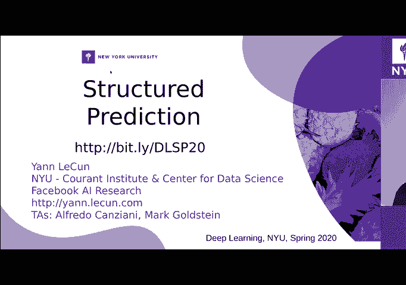

more concrete so，more concrete so，um i want to talk about structure。

um i want to talk about structure，prediction i alluded to this topic a。

prediction i alluded to this topic a，number of times during the，number of times during the。

previous lectures but i think not enough，previous lectures but i think not enough，in depth for。

in depth for，for most people to understand so i want，for most people to understand so i want。

to come back to this，to come back to this，so structure prediction is basically。

so structure prediction is basically，the problem of uh predicting a variable。

the problem of uh predicting a variable，that itself is not just like a single。

that itself is not just like a single，category or，category or，uh you know a single object but。

uh you know a single object but，basically a sort of，basically a sort of。

a combinatorial object so for for，a combinatorial object so for for，example things like a sentence。

example things like a sentence，you're doing speech recognition you're。

you're doing speech recognition you're，doing handwriting recognition you're。

doing handwriting recognition you're，doing natural language，doing natural language。

generation or translation and，generation or translation and，what you need to output is a sort of。

what you need to output is a sort of，grammatically correct，grammatically correct。

consistent sequence of symbols，consistent sequence of symbols。

and there is no you can't say that there，and there is no you can't say that there，is a，is a。

a finite number of possibilities of the，a finite number of possibilities of the，output because the。

output because the，the length of the output might be，the length of the output might be。

variable uh but even if it's，variable uh but even if it's，if the length is has a maximum and the。

if the length is has a maximum and the，number is in principle finite，number is in principle finite。

because it's combinatorial um there's no，because it's combinatorial um there's no。

way to kind of enumerate all possible，way to kind of enumerate all possible。

different outputs and so to express the，different outputs and so to express the。

the type constraint that the output has，the type constraint that the output has。

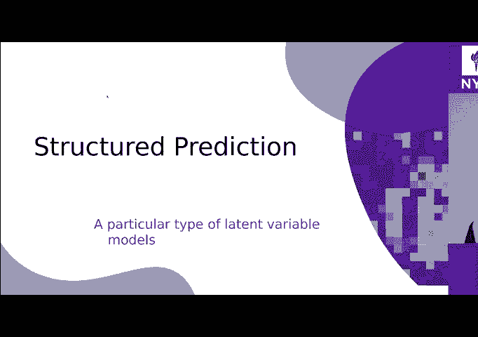

to reflect that's that's，to reflect that's that's，what's called structural prediction and。

what's called structural prediction and，this uh，this uh，you know there's a lot of work on this。

you know there's a lot of work on this，going back uh，going back uh。

uh to basically the early days of speech，uh to basically the early days of speech。

recognition so this is not a recent，recognition so this is not a recent，problem，problem。

um and in fact the the i'm going to，um and in fact the the i'm going to。

start by a little bit of history uh in，start by a little bit of history uh in，my mind the。

my mind the，the first model to do structural，the first model to do structural，prediction，prediction。

combined with things like neural，combined with things like neural。

networks uh trained discriminatively，networks uh trained discriminatively。

was this speech recognition model for uh，was this speech recognition model for uh，four words。

four words，by uh javier de la cruz ii back in the，by uh javier de la cruz ii back in the。

early 90s 1991，early 90s 1991，and there was kind of similar work about。

and there was kind of similar work about，the same time by joshua banjo and about。

the same time by joshua banjo and about，a year or two later by patrick hefner。

a year or two later by patrick hefner，so these are people who worked on。

so these are people who worked on，discriminative training，discriminative training。

for systems are supposed to produce a，for systems are supposed to produce a，sequence of symbols。

sequence of symbols，uh from uh uh you know a signal that，uh from uh uh you know a signal that。

says speech，says speech，or handwriting and where once the the，or handwriting and where once the the。

first step basically，first step basically，is a neural net uh here，is a neural net uh here。

uh in this this neural net i wrote td，uh in this this neural net i wrote td。

and n this means time data neural net is，and n this means time data neural net is。

basically a temporal convolutional net，basically a temporal convolutional net。

uh so this is the you know the first，uh so this is the you know the first，model i i can。

model i i can，i can find of uh，i can find of uh，structural prediction uh sort of。

structural prediction uh sort of，hybridized with with neural nets if you。

hybridized with with neural nets if you，want，want，so the problem that uh the idler。

so the problem that uh the idler，currently ubuntu are trying to solve was。

currently ubuntu are trying to solve was，recognizing words using a neural net。

recognizing words using a neural net，and to some extent the modern approaches。

and to some extent the modern approaches，are kind of，are kind of，similar to this but in in some ways。

similar to this but in in some ways，so the speech signal is represented as a。

so the speech signal is represented as a，sequence of acoustic vectors，sequence of acoustic vectors。

so those are uh you know you you you，so those are uh you know you you you，slice the signal into。

slice the signal into，little chunks and then on one of the，little chunks and then on one of the。

chunks you do a for your transform which，chunks you do a for your transform which，uh，uh。

fredo has explained to you and you turn，fredo has explained to you and you turn。

it into basically a feature vector and，it into basically a feature vector and。

you have one of those vectors，you have one of those vectors，it's typically 30 dimensions or so maybe。

it's typically 30 dimensions or so maybe，40。40。and you want one of those vectors every。

and you want one of those vectors every，10 milliseconds so，10 milliseconds so。

so about 100 times per second so you，so about 100 times per second so you。

have a sequence of 40 dimensional，have a sequence of 40 dimensional，vectors，vectors。

uh uh about 100 per second and you you，uh uh about 100 per second and you you。

you run this through a convolutional net，you run this through a convolutional net。

a temporal convolutional net and at the，a temporal convolutional net and at the，output of it。

output of it，uh what you get is a sequence of feature，uh what you get is a sequence of feature。

vectors you can think of it this way，vectors you can think of it this way。

uh in modern systems those feature，uh in modern systems those feature，vectors are actually uh。

vectors are actually uh，kind of soft max factors that indicate a。

kind of soft max factors that indicate a，category but in that case it wasn't。

category but in that case it wasn't，um and those can be at the same，um and those can be at the same。

rate or they can be slower so if the if，rate or they can be slower so if the if，the neural net has。

the neural net has，if the conversion that has temporal sep，if the conversion that has temporal sep。

sampling you're not going to get，sampling you're not going to get。

10 of those feature vectors per second，10 of those feature vectors per second。

you might get you know 25，you might get you know 25，um you know two and a half or something。

um you know two and a half or something，right oh i'm sorry，right oh i'm sorry。

at the input there is a hundred so if，at the input there is a hundred so if。

you have a sub sampling by a factor of，you have a sub sampling by a factor of，four，four。

you will get 25 feature vectors per，you will get 25 feature vectors per，second not 100。

second not 100。or something like that now here's the，or something like that now here's the。

problem the problem is you want to，problem the problem is you want to。

recognize which word was just pronounced，recognize which word was just pronounced。

and different people will pronounce，and different people will pronounce。

the same word at different speeds and so，the same word at different speeds and so。

what you need to do，what you need to do，is uh what's called dynamic time wiping。

is uh what's called dynamic time wiping，and i explained this uh already in the。

and i explained this uh already in the，in the past，in the past，so let's imagine that you've recorded。

so let's imagine that you've recorded，this person you don't want to do。

this person you don't want to do，uh speaker independent speech，uh speaker independent speech。

recognition for now just speaker，recognition for now just speaker。

specific so you've recorded that person，specific so you've recorded that person。

saying uh uh you know let's say the，saying uh uh you know let's say the。

the ten digits uh uh spoken digits，the ten digits uh uh spoken digits。

like zero one two three four five etc，like zero one two three four five etc。

because you're only interested in，because you're only interested in，recognizing uh，recognizing uh。

uh spoken digits isolated spoken digits，uh spoken digits isolated spoken digits，maybe this is。

maybe this is，a system that is supposed to uh you know，a system that is supposed to uh you know，dial。

dial，a number uh on your phone right so it，a number uh on your phone right so it。

just needs to recognize sequences of，just needs to recognize sequences of，digits，digits。

or perhaps it's a very simple speech，or perhaps it's a very simple speech。

recognition system that tries to spot，recognition system that tries to spot。

the the wake up word for uh you know，the the wake up word for uh you know。

amazon alexa or something like this，amazon alexa or something like this。

so the only thing the system is supposed，so the only thing the system is supposed。

to recognize is alexa or hey google，to recognize is alexa or hey google。

or you know something like that right a，or you know something like that right a，wake up word。

wake up word，um so uh the system may have a bunch of，um so uh the system may have a bunch of。

uh pre-recorded templates that，uh pre-recorded templates that，correspond to uh，correspond to uh。

sequences of future vectors uh that were，sequences of future vectors uh that were。

produced by uh someone，produced by uh someone，speaking each of the words um。

speaking each of the words um，and now the way you want to train the。

and now the way you want to train the，system is that you would like to。

system is that you would like to，train the neural net at the same time as。

train the neural net at the same time as，the template so that the overall system。

the template so that the overall system，recognizes the words uh as best as。

recognizes the words uh as best as，possible this is a classification。

possible this is a classification，problem，problem，but there is a latent variable in it and。

but there is a latent variable in it and，the latent variable is how，the latent variable is how。

how are you going to time warp the，how are you going to time warp the。

sequence of future vectors so that it，sequence of future vectors so that it，matches the length。

matches the length，of those templates and again i'm kind of，of those templates and again i'm kind of。

repeating myself because i talked a，repeating myself because i talked a，little bit about this before。

little bit about this before，so you do this with damage time wiping。

so you do this with damage time wiping，and what that consists of，and what that consists of。

is that you line up all the feature，is that you line up all the feature，vectors，vectors。

along the bottom here of this so this is，along the bottom here of this so this is。

think of this as a matrix，think of this as a matrix，you line up all the future vectors uh at。

you line up all the future vectors uh at，the uh at the input so that you get the。

the uh at the input so that you get the，the sequence of future vectors are here。

the sequence of future vectors are here，and then you put the sequence of。

and then you put the sequence of，template vectors so，template vectors so。

uh future vectors coming out of the，uh future vectors coming out of the，template on this axis。

template on this axis，and then each entry in the matrix，and then each entry in the matrix。

is an indication of the distance between，is an indication of the distance between，the feature vector。

the feature vector，here and the feature vector there okay，here and the feature vector there okay。

so you get this probability matrix with，so you get this probability matrix with。

uh distances between feature vectors，uh distances between feature vectors，essentially，essentially。

um and the best uh the best way to map，um and the best uh the best way to map。

the sequence of each vector into another，the sequence of each vector into another。

one to to see if they fit，one to to see if they fit，is to basically view this matrix as kind。

is to basically view this matrix as kind，of a，of a，a set of nodes in a graph and what you。

a set of nodes in a graph and what you，want is go from the，want is go from the。

lower left hand corner of that graph to，lower left hand corner of that graph to。

the upper right hand corner，the upper right hand corner，by going through a path that。

by going through a path that，minimizes the sum of the distances along。

minimizes the sum of the distances along，the past，the past，okay uh so obviously you're going to。

okay uh so obviously you're going to，have to go，have to go，horizontally you know more steps than。

horizontally you know more steps than，you go vertically so，you go vertically so。

on a few occasions you're going to，on a few occasions you're going to。

diagonally in a few occasions you're，diagonally in a few occasions you're。

going to go vertically up but on many，going to go vertically up but on many。

occasions you're probably going to go，occasions you're probably going to go，horizontally。

horizontally，to the to the right and that would be，to the to the right and that would be。

the situation where，the situation where，you have multiple feature vectors here。

you have multiple feature vectors here，that are essentially identical that。

that are essentially identical that，match，match，the single feature vector in the。

the single feature vector in the，template okay so for example，template okay so for example。

you pronounce the word seven very slowly，you pronounce the word seven very slowly，the uh，the uh。

uh initially it's gonna be you know，uh initially it's gonna be you know。

repeated multiple times because you you，repeated multiple times because you you。

stick on it for like a quarter of a，stick on it for like a quarter of a，second so，second so。

you're gonna have 25 instances of this，you're gonna have 25 instances of this。

and all of this will be mapped to，and all of this will be mapped to。

maybe a single feature actor here that，maybe a single feature actor here that，corresponds to this。

corresponds to this，sound up um so，sound up um so，finding this path that best warps the。

finding this path that best warps the，the the sequence into the template。

the the sequence into the template，sequence，sequence，is like minimizing with respect to a。

is like minimizing with respect to a，related variable z okay，related variable z okay。

so it's like you have an energy function，so it's like you have an energy function。

and you're minimizing this energy，and you're minimizing this energy，function，function。

with respect to the relative variable，with respect to the relative variable。

the latent variable is the path，the latent variable is the path。

in that graph um so now what you have is，in that graph um so now what you have is。

the best warping that matches the，the best warping that matches the。

sequence of future vector to the first，sequence of future vector to the first，template，template。

now you keep doing it with doing the，now you keep doing it with doing the。

with with doing this with all the，with with doing this with all the，templates，templates。

okay so for every template every word，okay so for every template every word，you know from zero。

you know from zero，one two three to nine you have the best，one two three to nine you have the best。

way to warp，way to warp，the the the feature vector to that，the the the feature vector to that。

template，template，um and uh and now you can，um and uh and now you can。

if your system has been trained you you，if your system has been trained you you，pick，pick。

the the category of the word template，the the category of the word template，with a smaller distance。

with a smaller distance，okay as simple as that that's for，okay as simple as that that's for。

classification now how about training so，classification now how about training so，for training。

for training，um this is a latent variable model，um this is a latent variable model。

essentially and what you need to do，essentially and what you need to do，is you need to make the。

is you need to make the，energy for the correct answer as small。

energy for the correct answer as small，as possible，as possible，and make sure the energy for the。

and make sure the energy for the，incorrect answers are larger，incorrect answers are larger。

okay so um so let's imagine the correct，okay so um so let's imagine the correct，answer is，answer is。

is oops sorry，is oops sorry，is this word here the second last one。

is this word here the second last one，that correspond to zero one two three。

that correspond to zero one two three，the category three for example，the category three for example。

okay so we know the correct answer is，okay so we know the correct answer is。

three so what we need to do now is，three so what we need to do now is。

uh basically change the word template，uh basically change the word template。

here a little bit so that it gets closer，here a little bit so that it gets closer。

to the the feature vector sequence，to the the feature vector sequence。

and then change the feature vector，and then change the feature vector。

sequence so that it gets closer to the，sequence so that it gets closer to the，template，template。

right you can think of this dtw uh，right you can think of this dtw uh。

distance this dynamic time warping，distance this dynamic time warping，distance as a kind of distance。

distance as a kind of distance，uh which involves minimization with。

uh which involves minimization with，respect to a path but in the end it's。

respect to a path but in the end it's，some sort of distance or divergence。

some sort of distance or divergence，and what you need to do is and that's。

and what you need to do is and that's，basically your energy so what you need。

basically your energy so what you need，to do is make that distance smaller。

to do is make that distance smaller，for the correct answer okay so the。

for the correct answer okay so the，energy of the correct answer goes down。

energy of the correct answer goes down，uh and simultaneously you need to make。

uh and simultaneously you need to make，sure the energy of all the e correct。

sure the energy of all the e correct，answers get，answers get，uh are larger okay so you might need to。

uh are larger okay so you might need to，push them away，push them away。

so you might need to have an objective，so you might need to have an objective。

function that is going to，function that is going to，uh take the templates for the wrong。

uh take the templates for the wrong，words and somehow push them away。

words and somehow push them away，from the current sequence of features。

from the current sequence of features，okay so that's how you learn the。

okay so that's how you learn the，templates，templates，um and then simultaneously uh you。

um and then simultaneously uh you，you need to you you're gonna have kind。

you need to you you're gonna have kind，of a combination of gradients that are。

of a combination of gradients that are，gonna back propagate through this dtw。

gonna back propagate through this dtw，one，one，um one is going to try to make that a。

um one is going to try to make that a，sequence of feature vector，sequence of feature vector。

uh such that once you go the time wiping，uh such that once you go the time wiping。

it gets closer to the correct，it gets closer to the correct，word template but also uh。

word template but also uh，change it so that it gets away from the。

change it so that it gets away from the，the other templates the the templates。

the other templates the the templates，for the other categories，for the other categories。

okay um so that is simply，okay um so that is simply，back propagating through the uh you know。

back propagating through the uh you know，through the dynamic time marking and the。

through the dynamic time marking and the，dynamic time marking really is a switch。

dynamic time marking really is a switch，it's a giant switch right，it's a giant switch right。

it basically tells you uh those values，it basically tells you uh those values，here，here。

on the along the path matter because uh，on the along the path matter because uh。

they are the ones that indicate whether，they are the ones that indicate whether。

my input vector matches my template，my input vector matches my template，vector okay，vector okay。

all the other ones that my pass is is，all the other ones that my pass is is。

not taking are irrelevant they don't，not taking are irrelevant they don't，matter，matter。

so the distance is just the sum of those，so the distance is just the sum of those。

values so when i back propagate i just，values so when i back propagate i just，get，get。

uh for each vector here a gradient that，uh for each vector here a gradient that，corresponds to。

corresponds to，uh the gradient of uh you know basically，uh the gradient of uh you know basically，the。

the，the distance uh to the corresponding，the distance uh to the corresponding。

so for the correct template this is，so for the correct template this is。

so for the correct template this is，going to cause，going to cause。

all those vectors to get closer to the，all those vectors to get closer to the。

corresponding vector in the template，corresponding vector in the template。

and all those vectors to move away from，and all those vectors to move away from。

the corresponding vector in the，the corresponding vector in the。

bad templates that you decide to push，bad templates that you decide to push。

away and then you can just back prop and，away and then you can just back prop and。

get those gradients all the way through，get those gradients all the way through。

now i'm kind of explaining the mechanics，now i'm kind of explaining the mechanics，of it，of it。

but you don't actually have to think，but you don't actually have to think，about it you know。

about it you know，conceptually it's just a，conceptually it's just a，conceptually it's just a。

energy-based model with lithium variable，energy-based model with lithium variable。

and you just compute the gradient of，and you just compute the gradient of。

your energy with respect to，your energy with respect to，uh you know to everything in your in。

uh you know to everything in your in，your network，your network。

uh for you know values related variables，uh for you know values related variables，that depend on。

that depend on，you know the position of the of uh of，you know the position of the of uh of。

this switch here you can think of this，this switch here you can think of this。

switch as the one that tells you，switch as the one that tells you，which of the answers is correct。

which of the answers is correct，and so it's nothing more than an，and so it's nothing more than an。

energy-based model，energy-based model，okay now there's a question um so。

okay now there's a question um so，why am i introducing this before talking。

why am i introducing this before talking，about structure prediction because this。

about structure prediction because this，is a very simple，is a very simple。

form of structure prediction，form of structure prediction，particularly if now the problem is not。

particularly if now the problem is not，to recognize a single word，to recognize a single word。

but it is to recognize a sequence of，but it is to recognize a sequence of，words right so。

words right so，a word is a sequence of sounds uh but a，a word is a sequence of sounds uh but a。

sentence is a sequence of words，sentence is a sequence of words，and so therefore also a sequence of。

and so therefore also a sequence of，sounds right so i could，sounds right so i could。

build uh a collection of possible，build uh a collection of possible，sequences，sequences。

which are grammatically correct，which are grammatically correct。

sequences of words which correspond to，sequences of words which correspond to。

some grammatically correct sequences of，some grammatically correct sequences of，sounds，sounds。

and then this kind of dynamic time，and then this kind of dynamic time。

marking if you want will sort of find，marking if you want will sort of find。

among all the possible uh sequences of，among all the possible uh sequences of，uh，uh。

of symbols or or or sounds or words，of symbols or or or sounds or words。

we'll find the one that has the lowest，we'll find the one that has the lowest，energy，energy。

okay that this future vector is closest，okay that this future vector is closest。

okay so that's the general problem with，okay so that's the general problem with。

okay so that's the general problem with，sequence labeling，sequence labeling。

um and it can be formulated uh，um and it can be formulated uh，um and it can be formulated uh。

at a general level uh in this way um，at a general level uh in this way um。

now i'm i'm kind of uh i kind of set the，now i'm i'm kind of uh i kind of set the。

stage a little bit and now i'm going to，stage a little bit and now i'm going to。

talk about something that you're not，talk about something that you're not。

going to see immediately is connected，going to see immediately is connected。

but um it's gonna come up at the end，but um it's gonna come up at the end。

okay so let's say you have a learning，okay so let's say you have a learning，system，system。

that is uh composed of an input x okay，that is uh composed of an input x okay，it gets an input x。

it gets an input x，and it's an energy model in which the，and it's an energy model in which the。

energy is a sum of three terms in this，energy is a sum of three terms in this，case so those those。

case so those those，uh blue squares here are basically，uh blue squares here are basically，factors。

factors，in a factor graphs they're energy terms，in a factor graphs they're energy terms。

additive energy terms in your energy，additive energy terms in your energy，function，function。

uh and your output is uh is a sequence，uh and your output is uh is a sequence。

in this case a sequence of four symbols，in this case a sequence of four symbols。

and those symbols um do not all，and those symbols um do not all。

uh contribute to all the terms in the，uh contribute to all the terms in the。

energy so basically your energy function，energy so basically your energy function，the first term。

the first term，takes into account the first two output，takes into account the first two output。

[Music]，[Music]，symbols or or variables in your in your，symbols or or variables in your in your。

output in your sequence of output，output in your sequence of output。

the second one take the second two the，the second one take the second two the，third one takes the。

third one takes the，the third and fourth okay now imagine，the third and fourth okay now imagine，that。

that，um this were a sequence of words，um this were a sequence of words。

and your system was supposed to do，and your system was supposed to do。

something like speech recognition or，something like speech recognition or。

something so x is the speech signal，something so x is the speech signal。

uh in the blue boxes you have neural，uh in the blue boxes you have neural。

nets and various other things there，nets and various other things there。

might be another neural net that looks，might be another neural net that looks，at x，at x。

x and then produces future vectors that，x and then produces future vectors that。

go into those boxes but，go into those boxes but，uh that's the detail for now um and。

uh that's the detail for now um and，um what those blue boxes would would。

um what those blue boxes would would，have to，have to，uh implement is basically grammatical。

uh implement is basically grammatical，constraints so，constraints so。

uh you know in english certain words can，uh you know in english certain words can。

follow others but not，follow others but not，uh others right so you rarely have two。

uh others right so you rarely have two，two verbs that follow each other。

two verbs that follow each other，um and so you could implement this in。

um and so you could implement this in，this uh，this uh，energy term that would make you pay a。

energy term that would make you pay a，price for，price for，uh you know making a verb follow another。

uh you know making a verb follow another，verb all right or，verb all right or。

having uh i don't know you know two，having uh i don't know you know two。

prepositions you can have two objectives，prepositions you can have two objectives。

that follow each other，that follow each other，you know things like that right so。

you know things like that right so，basically those would you know implement。

basically those would you know implement，sort of basic grammatical rules。

sort of basic grammatical rules，and you can think of this as kind of a。

and you can think of this as kind of a，language model right so i know what word。

language model right so i know what word，came before，came before。

uh tell me what work and can come after，uh tell me what work and can come after。

and i can train this on the corpus of，and i can train this on the corpus of，text，text。

to learn this energy function so，to learn this energy function so。

you know it's a it would be a very basic，you know it's a it would be a very basic。

crude language model，crude language model，so this type of model would implement a。

so this type of model would implement a，very cool language model，very cool language model。

by just you know taking the previous，by just you know taking the previous。

word and then telling you what the the，word and then telling you what the the，next word，next word。

what next words are possible making you，what next words are possible making you。

pay a price for picking a word that is，pay a price for picking a word that is，not，not。

uh not correct um，uh not correct um，okay so um how you do inference this is。

okay so um how you do inference this is，just a，just a，basically an energy model here which in。

basically an energy model here which in，this case doesn't actually have a。

this case doesn't actually have a，lithium variable but，lithium variable but。

basically i give you an x and you have，basically i give you an x and you have。

to find the sequence of y that minimizes，to find the sequence of y that minimizes，the energy。

the energy，but in this case because the energy is，but in this case because the energy is。

the sum of three terms，the sum of three terms，the efficient way to find the sequence。

the efficient way to find the sequence，of y's that minimize the energy that may。

of y's that minimize the energy that may，not require，not require，a completely exhaustive search or。

a completely exhaustive search or，gradient descent or something like this。

gradient descent or something like this，okay i'm going to place myself in a。

okay i'm going to place myself in a，situation where why，situation where why。

the y's are actually discrete okay so，the y's are actually discrete okay so。

this thing's like words or，this thing's like words or，and so this applies to uh。

and so this applies to uh，and so this applies to uh，you know this situation where the the。

you know this situation where the the，variables you need to infer are all。

variables you need to infer are all，outputs，outputs，which means they're going to be visible。

which means they're going to be visible，on the training set and you can train。

on the training set and you can train，your system to kind of infer them。

your system to kind of infer them，correctly but it could also be another。

correctly but it could also be another，situation where，situation where。

uh you know some of the variables are，uh you know some of the variables are。

observed like x here on the left，observed like x here on the left。

and y is observed during training on the，and y is observed during training on the。

right but then all the intermediate，right but then all the intermediate。

variables are never observed there are，variables are never observed there are。

latent variables they need to you need，latent variables they need to you need，to minimize over。

to minimize over，um as well but again here this factor，um as well but again here this factor。

graph is factorized in the sense that，graph is factorized in the sense that。

the energy is a sum of of different，the energy is a sum of of different，terms that，terms that。

only take subsets of the variables into，only take subsets of the variables into。

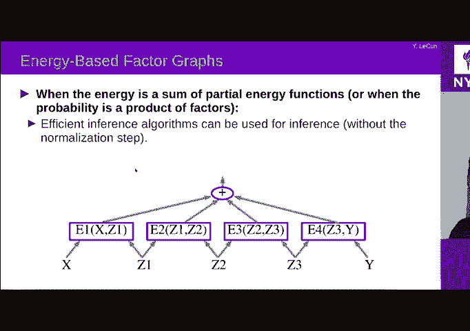

all right okay so let's say uh let's，all right okay so let's say uh let's。

all right okay so let's say uh let's。

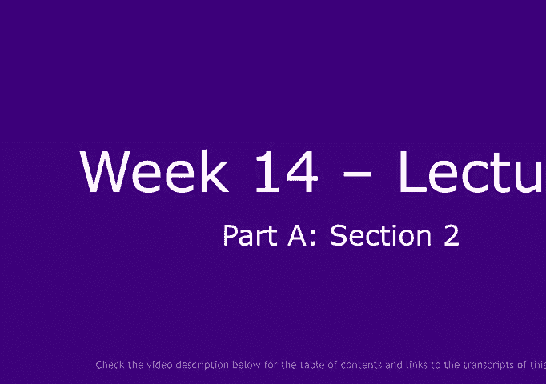

take a very concrete example now，take a very concrete example now。

energy here in this case is a sum of，energy here in this case is a sum of。

energy here in this case is a sum of，four terms，four terms，four energy terms okay。

four energy terms okay，uh the first two uh depend on x，uh the first two uh depend on x。

the observation the last one depend uh，the observation the last one depend uh。

the last two depend on y which is the，the last two depend on y which is the。

variable you need to predict which，variable you need to predict which。

you're given during training but not，you're given during training but not，during tests，during tests。

and then two other nodes are our latent，and then two other nodes are our latent，variable nodes okay。

variable nodes okay，and let's say uh x is some high，and let's say uh x is some high。

dimensional variable we don't care what，dimensional variable we don't care what。

it is because we just observe it，it is because we just observe it，and z1 is binary z2 is binary。

and z1 is binary z2 is binary，y1 is binary and y2 is ternary so we can。

y1 is binary and y2 is ternary so we can，take three values zero one two。

take three values zero one two，okay now uh，okay now uh，if you count how many possible。

if you count how many possible，configurations of z one z two y one y。

configurations of z one z two y one y，two they are，two they are，there are basically uh。

there are basically uh，uh uh 24 right uh two，uh uh 24 right uh two。

times two times two times three right，times two times two times three right，that's that's 24。

that's that's 24，uh different possible configurations of，uh different possible configurations of。

values so if you wanted to do，values so if you wanted to do，exact inference uh you might have to try。

exact inference uh you might have to try，all 24 of those configurations。

all 24 of those configurations，and then compute the energy of all 24 of。

and then compute the energy of all 24 of，those configurations and then pick the。

those configurations and then pick the，one with the lowest energy，one with the lowest energy。

to do inference right and in fact those，to do inference right and in fact those。

those 24 configurations correspond to，those 24 configurations correspond to。

uh 24 times three evaluations，uh 24 times three evaluations，of those energy terms right because we。

of those energy terms right because we，have three energy terms，have three energy terms。

so we'll have to compute 96 different，so we'll have to compute 96 different。

energies to be able to do this，energies to be able to do this，okay and this is a small example where。

okay and this is a small example where，the sequence is short and the，the sequence is short and the。

the the variables are binary okay this，the the variables are binary okay this，goes exponentially。

goes exponentially，with the number of with the length of，with the number of with the length of。

the sequence uh，the sequence uh，and uh uh，and uh uh，uh sorry with the the number of uh。

uh sorry with the the number of uh，possible values of the of the，possible values of the of the。

of the z's uh and the length of the，of the z's uh and the length of the，sequence so if you have。

sequence so if you have，you know uh uh，you know uh uh，you know n possibilities for each of the。

you know n possibilities for each of the，variables and the length is l you know。

variables and the length is l you know，it's n to the l right exponential in the。

it's n to the l right exponential in the，okay but the thing is there is a more。

okay but the thing is there is a more，okay but the thing is there is a more。

efficient way of figuring out，efficient way of figuring out，what is the configuration of lowest。

what is the configuration of lowest，energy，energy，and it's due to the fact that you have。

and it's due to the fact that you have，those kind of local this local structure。

those kind of local this local structure，right so uh z1 can only take two values。

right so uh z1 can only take two values，okay and z2 can only also only take two。

okay and z2 can only also only take two，values，values，so this energy term here can only take。

so this energy term here can only take，four values it's ever going to see。

four values it's ever going to see，only four different values because it。

only four different values because it，can only see，can only see，zero zero zero one one zero one one。

zero zero zero one one zero one one，right，right，so you could imagine could be。

so you could imagine could be，pre-computing those four values，pre-computing those four values。

okay this guy is also going to see only，okay this guy is also going to see only。

four values right so you can，four values right so you can，you can because this is binary and that。

you can because this is binary and that，binary that's binary，binary that's binary。

so you can pre-compute those four values，so you can pre-compute those four values，okay，okay。

so that's another four evaluation of an，so that's another four evaluation of an。

objective function that we're up to，objective function that we're up to，eight，eight。

and this guy has six different values，and this guy has six different values。

because this variable is binary this one，because this variable is binary this one，ternary so it's。

ternary so it's，two by two times three so now you have，two by two times three so now you have。

six different configurations，six different configurations，so by pre-computing the four here the。

so by pre-computing the four here the，four here and the six here，four here and the six here。

um uh you you have computed all the，um uh you you have computed all the。

and that's kind of represented here at，and that's kind of represented here at。

and that's kind of represented here at，the bottom so，the bottom so，this is called a trellis and it's。

this is called a trellis and it's，basically a graph that has a source node。

basically a graph that has a source node，and a target node，and a target node。

and every path in a graph corresponds to，and every path in a graph corresponds to，a particular。

a particular，assignment of of the variables okay，assignment of of the variables okay。

so for example if i go through this path，so for example if i go through this path。

okay it means y1 equals z1 equals 1，okay it means y1 equals z1 equals 1，z2 equals 0 y1 equals 1。

z2 equals 0 y1 equals 1，and y2 equals 2 let's say okay，and y2 equals 2 let's say okay。

and if i add up the the terms，and if i add up the the terms，on each arc i get the overall energy。

on each arc i get the overall energy，each arc is，each arc is，is uh basically annotated by the。

is uh basically annotated by the，energy term the value of the energy that。

energy term the value of the energy that，corresponds to this configuration。

corresponds to this configuration，so for example this arc here is，so for example this arc here is。

this energy and that's the value of this，this energy and that's the value of this，energy term for。

energy term for，okay uh，okay uh，okay uh，so each of these args is a value of。

so each of these args is a value of，this energy term each of these rx is the。

this energy term each of these rx is the，value of that energy term，value of that energy term。

etc and now the，etc and now the，finding the the best lowest energy。

finding the the best lowest energy，configuration，configuration，of z1 z2 y1 y2 simply consists in。

of z1 z2 y1 y2 simply consists in，finding the shortest path in this graph。

finding the shortest path in this graph，okay and，okay and，to do this i only have to evaluate。

to do this i only have to evaluate，uh four times four terms of energy here。

uh four times four terms of energy here，four terms here and six terms here and。

four terms here and six terms here and，that's，that's，it okay so that's uh，it okay so that's uh。

14 i don't know why i said 16 here or 16，14 i don't know why i said 16 here or 16。

because of the first two，because of the first two，but uh so that's a lot less than。

but uh so that's a lot less than，but uh so that's a lot less than，96 okay and that's because。

96 okay and that's because，the energy is the sum of terms and you。

the energy is the sum of terms and you，can use those kind of efficient。

can use those kind of efficient，algorithms，algorithms，uh to do the inference okay so this is a。

uh to do the inference okay so this is a，simple case where the output is a。

simple case where the output is a，sequence，sequence，and when the output is a sequence there。

and when the output is a sequence there，is a simple algorithm，is a simple algorithm。

and it's basically shoulder space in a，and it's basically shoulder space in a。

graph right in a in a trellis，graph right in a in a trellis，so that's just dynamic programming uh um。

so that's just dynamic programming uh um，and it's very simple it's efficient you。

and it's very simple it's efficient you，know it's uh，know it's uh。

it's nice so to train a system like this，it's nice so to train a system like this。

what you need to tell it is you need to，what you need to tell it is you need to。

tell it here is the correct，tell it here is the correct，configuration of y1 y2 i don't know what。

configuration of y1 y2 i don't know what，z1z2 is because it's a latent variable。

z1z2 is because it's a latent variable，so find me the path that goes to the。

so find me the path that goes to the，correct，correct，uh combination of y1 y2，uh combination of y1 y2。

okay so you know that let's say y1 equal，okay so you know that let's say y1 equal，1 and y2 equal 2。

1 and y2 equal 2。so you know that the correct path，so you know that the correct path。

has to include this link，has to include this link，right and so there's only a subset of。

right and so there's only a subset of，path，path，for the the previous ones that are。

for the the previous ones that are，possible right you can't go to y one。

possible right you can't go to y one，equals zero because，equals zero because。

that would be incorrect uh，that would be incorrect uh，so basically only this this guy survives。

so basically only this this guy survives，and then the other paths you can take。

and then the other paths you can take，whatever you want as long as you get to。

whatever you want as long as you get to，that point so you can just find the one。

that point so you can just find the one，that minimizes the energy here。

that minimizes the energy here，so minimizing energy with respect to z1。

so minimizing energy with respect to z1，z2 so that，z2 so that，uh y1 and y2 take the right value okay。

uh y1 and y2 take the right value okay，constraining where when，constraining where when。

where you to take the the right value，where you to take the the right value。

and the way you train the system now is，and the way you train the system now is。

that you migrate and descent you back，that you migrate and descent you back。

you back propagate the gradient of the，you back propagate the gradient of the，overall energy。

overall energy，okay for this particular y and this，okay for this particular y and this。

particular x and the z that you obtain，particular x and the z that you obtain，by minimizing。

by minimizing，you back propagate uh the，you back propagate uh the。

the the gradient of of this energy with，the the gradient of of this energy with。

respect to the parameters of all those，respect to the parameters of all those，energy terms。

energy terms，and you try to make that smaller right，and you try to make that smaller right。

you know you have the correct y the，you know you have the correct y the，correct，correct。

x and whatever z value uh，x and whatever z value uh，z mistake try to make that energy。

z mistake try to make that energy，lower by tweaking the parameters，lower by tweaking the parameters。

at the same time uh you have to make，at the same time uh you have to make。

sure the energy of incorrect answers for，sure the energy of incorrect answers for。

y1 and y2 that are incorrect，y1 and y2 that are incorrect，is higher right so you take other values。

is higher right so you take other values，of y1 y2，of y1 y2，uh including y1 equals zero and y2。

uh including y1 equals zero and y2，equals whatever it wants，equals whatever it wants。

okay and for all of those other，okay and for all of those other，configurations of y1y2。

configurations of y1y2，you want to make sure whatever energy，you want to make sure whatever energy。

you you get by minimizing over z，you you get by minimizing over z。

is higher than whatever you got for the，is higher than whatever you got for the，correct one。

correct one，okay so your loss function is going to，okay so your loss function is going to。

be something where，be something where，you take the energy of the correct。

you take the energy of the correct，answer you try to make it lower and then。

answer you try to make it lower and then，you take the energies of incorrect。

you take the energies of incorrect，answers and you try to make them，answers and you try to make them。

larger okay that's discriminative，larger okay that's discriminative。

uh training for structure prediction，uh training for structure prediction。

structural prediction because the，structural prediction because the，structure here is。

structure here is，uh represented by this uh，uh represented by this uh。

you know sequence of of costs okay but，you know sequence of of costs okay but。

conceptually at a high level it's no，conceptually at a high level it's no，different from。

different from，everything we talked about before when，everything we talked about before when。

we have a latin variable，we have a latin variable，and when we train with a criterion that。

and when we train with a criterion that，says i want to make the energy of the。

says i want to make the energy of the，correct time so small and the energy of。

correct time so small and the energy of，all the other answers higher okay。

all the other answers higher okay，any question at this point um i had a。

any question at this point um i had a，question so，question so，based on this diagram it seems like。

based on this diagram it seems like，this this，this this，network only really takes discrete。

network only really takes discrete，values，values，um and my understanding was that。

um and my understanding was that，back propagation doesn't isn't really。

back propagation doesn't isn't really，effective if you，effective if you。

just have only working with discrete，just have only working with discrete，values，values。

so i'm wondering if i'm missing，so i'm wondering if i'm missing，something or if that's like。

something or if that's like，how how you connect those things，how how you connect those things。

right okay so uh in this case z1 z2 y1，right okay so uh in this case z1 z2 y1。

y2 are not variables that，y2 are not variables that，that you learn okay they're labels。

that you learn okay they're labels，essentially，essentially，okay they're discrete so one way to are。

okay they're discrete so one way to are，discrete just like uh，discrete just like uh。

you know the the class the category at，you know the the class the category at。

the output of the continent is discrete，the output of the continent is discrete。

except you have two of them but whatever，except you have two of them but whatever。

z1 z2 are basically of the same nature，z1 z2 are basically of the same nature，the discrete variables。

the discrete variables，they're not things you're going to learn。

they're not things you're going to learn，by grading descent they're just latent。

by grading descent they're just latent，variable you you have to，variable you you have to。

to minimize over to do inference right，to minimize over to do inference right。

let's not talk about learning for now，let's not talk about learning for now。

once your system is trained right i give，once your system is trained right i give，you an x and by。

you an x and by，energy minimization you find z1 z2 y1 y2，energy minimization you find z1 z2 y1 y2。

that minimizes the energy，that minimizes the energy，okay and because you've trained the。

okay and because you've trained the，correct y1y2，correct y1y2，to have the lowest energy among all。

to have the lowest energy among all，possible configurations of y2，possible configurations of y2。

you're going to get the correct one okay，you're going to get the correct one okay，now，now。

uh for training the the training takes，uh for training the the training takes，place，place。

uh you know uh basically affects the，uh you know uh basically affects the。

parameters of each of those，parameters of each of those，factors inside those factors there are。

factors inside those factors there are，parameters you know，parameters you know。

w a w b w c w d which i i didn't，w a w b w c w d which i i didn't。

represent here and the way you train the，represent here and the way you train the，system is you。

system is you，you say you know at the gradient of the，you say you know at the gradient of the。

energy of the correct answer，energy of the correct answer，uh with respect to those parameters i'm。

uh with respect to those parameters i'm，going to tweak the parameters so that。

going to tweak the parameters so that，energy goes down，energy goes down。

that's continuous uh differentiable，that's continuous uh differentiable。

okay and then simultaneously i have the，okay and then simultaneously i have the。

energy of bad answers，energy of bad answers，i'm going to back propagate gradients。

i'm going to back propagate gradients，and according to my loss function i'm。

and according to my loss function i'm，going to push up the energy of those。

going to push up the energy of those，so that my energy my loss function goes。

so that my energy my loss function goes，down，down，okay my training objective goes down。

okay my training objective goes down，not my energy right now，not my energy right now。

so so now the what i'm explaining it，so so now the what i'm explaining it。

down there with the trellis，down there with the trellis，is the fact that because those variables。

is the fact that because those variables，are discrete，are discrete。

you can't use gradient descent to infer，you can't use gradient descent to infer，them，them。

okay and so you have to infer them by，okay and so you have to infer them by。

combinatorial search essentially and，combinatorial search essentially and。

the first solution i i mentioned with，the first solution i i mentioned with。

the 96 factor evaluations，the 96 factor evaluations，uh basically is exhaustive search right。

uh basically is exhaustive search right，try every combination of z one z two y。

try every combination of z one z two y，one y two，one y two，and we and figure out which one has the。

and we and figure out which one has the，lowest energy，lowest energy。

but uh but the whole point of this is，but uh but the whole point of this is，that this is wasteful。

that this is wasteful，in the sense that because the energy，in the sense that because the energy。

decomposes into terms that only take，decomposes into terms that only take，subsets of variables。

subsets of variables，you can actually decompose this into uh，you can actually decompose this into uh。

you can reduce this to finding the，you can reduce this to finding the，shortest paths in a graph。

shortest paths in a graph，where the transitions in this graph，where the transitions in this graph。

are are annotated by the energies that，are are annotated by the energies that，correspond to the。

correspond to the，value of the variables of the two，value of the variables of the two。

corresponding nodes，corresponding nodes，okay now this is a slightly more general。

okay now this is a slightly more general，form of what i told you，form of what i told you。

about earlier uh so this this model here，about earlier uh so this this model here。

with the dynamic time marking，with the dynamic time marking，uh is very much the same right you you。

uh is very much the same right you you，you know the z1 z2 here are basically。

you know the z1 z2 here are basically，the paths in the dynamic time marking。

the paths in the dynamic time marking，uh module the y，uh module the y。

is which of the word template matches，is which of the word template matches，okay，okay。

and the training consists in just you，and the training consists in just you。

know doing gradient descent to make the，know doing gradient descent to make the。

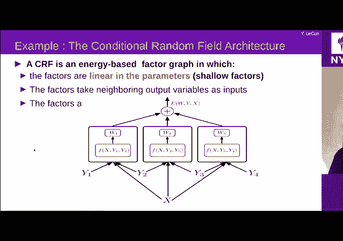

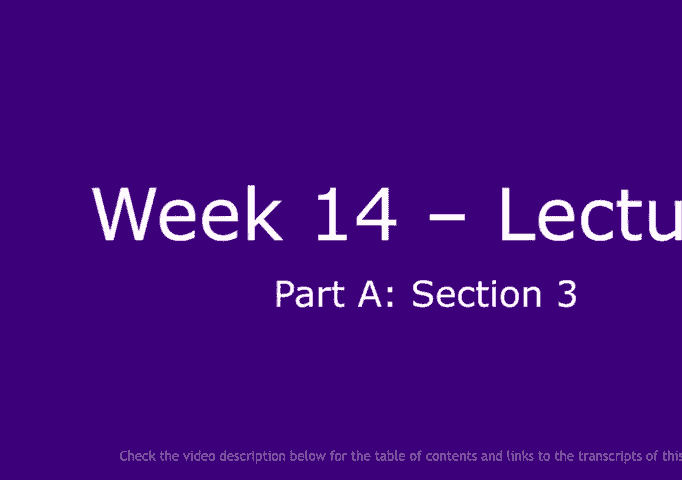

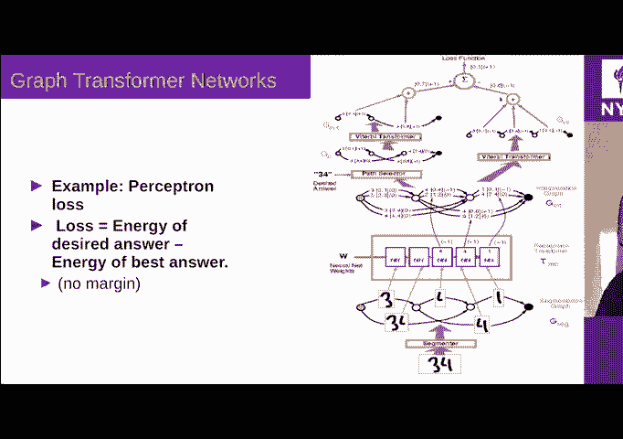

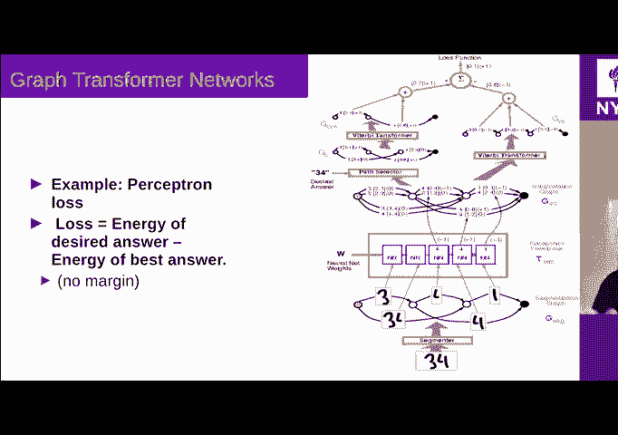

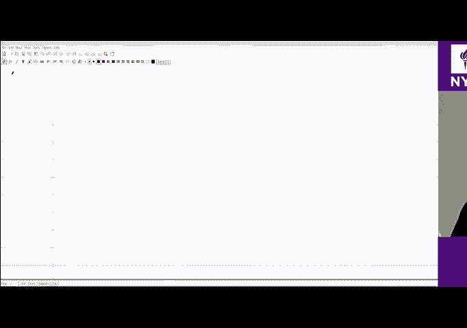

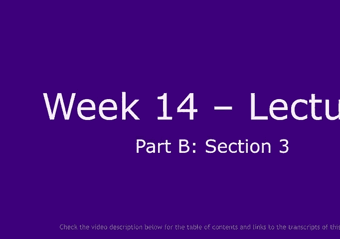

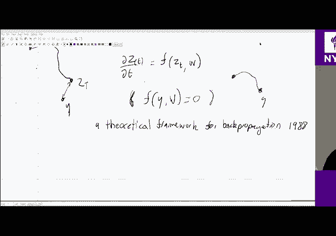

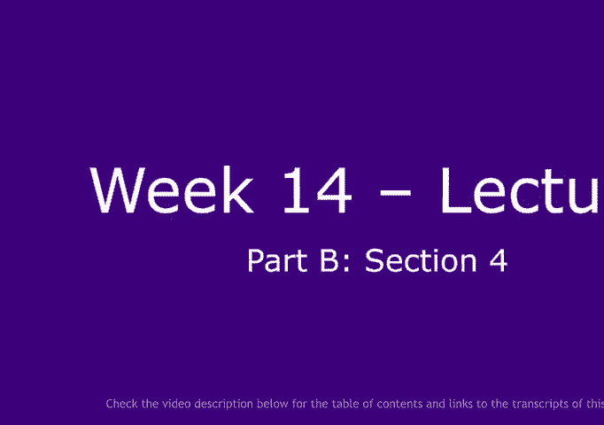

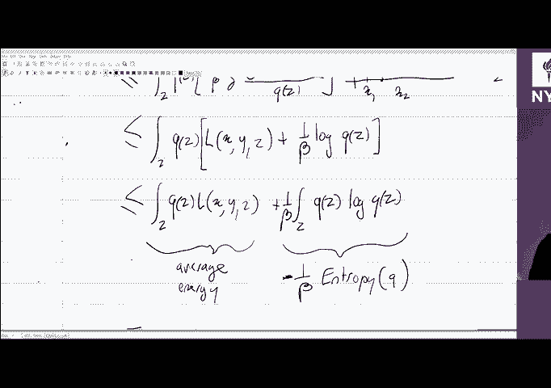

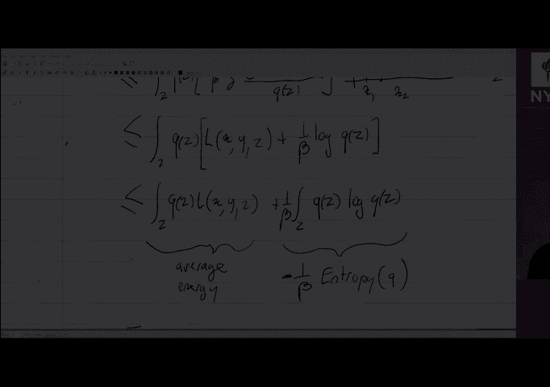