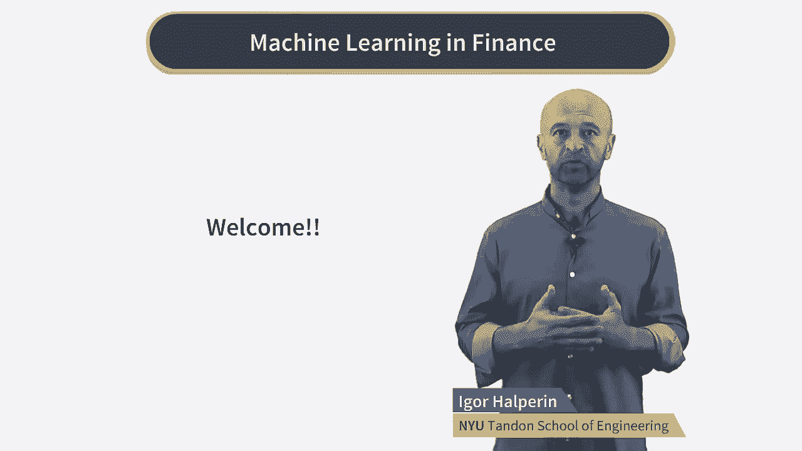
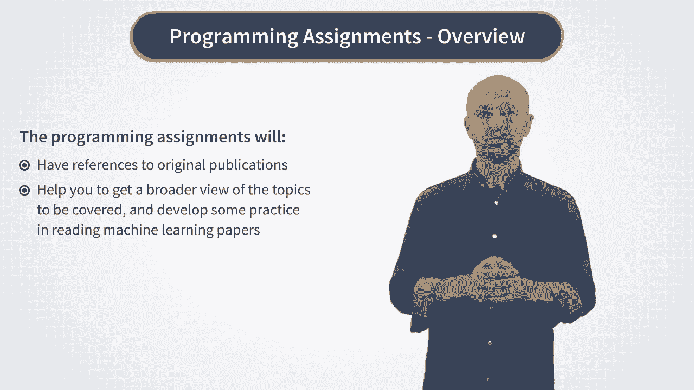

# P1：Introduction - Introduction to the Specialization - 兰心飞侠 - BV14P4y1u7TB

您好，欢迎来到 Coursera 的金融机器学习专业。

我的名字是伊戈尔·哈尔佩林，我是纽约大学坦顿工程学院的研究教授。我将成为你这个专业的导师。稍后我会多谈谈我自己，但首先我想谈谈你将从这个专业中得到什么。首先是关于这个专业本身。简而言之。这是机器学习的专业化，专注于机器学习限制的影响。这与通常使用的其他课程不同，广泛的工业应用来教授机器学习。关于这个专业化的第二个非常重要的一点是关于它的目标受众。

我假设你要么是金融专业人士。

或计划在不久的将来成为一名金融专业人士。

因此，这个专业是为从业者设计的，或未来从事或计划从事金融工作的从业者，并想从头开始学习机器学习，而是利用金融问题来发展你的技能。然而，金融就是关于数字和预测的。那么。我们为什么不从一开始就使用财务数据来学习，机器学习，而不是使用与财务数据无关的示例。

我想说的第三点是关于，本专业中的示例和作业。因为这是从业者的专业化，我尽力避免，与他们的现实生活无关的无意义的练习。例如，我们不会做诸如预测股票价格之类的事情，或为此目的的股票指数预测。原因是即使您可能遇到过很多博客，或讨论机器学习在此类问题上的应用的研究论文，他们没有实际的答案。因此，为了最大限度地发挥它对您的作用，我们只会在这个专业中寻找实际有用的例子。那么。你将从这个专业中得到什么？首先，您将对这两个核心概念有很好的理解，和最重要的机器学习算法从头开始。其次，您将不会以抽象的方式学习所有这些，而是​​以非常实际的方式学习。我们将着手处理许多不同类型的财务数据和，使用多种机器学习算法来处理相同的数据。您不仅会学习经典的机器学习算法，还会学习，对使用神经网络有扎实的理解和实践经验；包括，特别是。

最近风靡业界的所谓深度神经网络。结果，您将对财务数据产生良好的直觉，以及不同的算法如何对这些数据执行。您将知道如何应用 Python 机器学习包，例如 scikit-learn 或。TensorFlow 为量化交易中的应用构建机器学习模型，资产管理、银行和其他金融领域。您将能够通过以下产品组合给您的潜在雇主留下深刻印象，有趣且相关的项目，机器学习在实际问题中的应用。更重要的是。您将能够利用您的知识来构建，使用您学习的库的新机器学习模型，如果您的企业需要它们。而这最后一件事，我提到过把我带到最后但是，不仅仅是你从这个专业中学到的一部分。机器学习是一个非常活跃的领域。今天在学校教授的前沿方法明天就会过时。因此，工业从业者在，机器学习应该能够理解为从业者，机器学习论文，我们将能够实施它们。学习它的最好方法是阅读机器学习论文。因此，我们的编程作业通常会引用。

可用于深入挖掘我们将涵盖的主题的原始出版物。此外，我将提供对原始出版物的参考，和每周一次的区域主义者，这两者都应该有所帮助，您可以更广泛地了解要涵盖的主题，并开发一些编辑机器学习论文的实践。所以。这将是，之后你的三个主要收获，完成金融机器学习的专业化。

