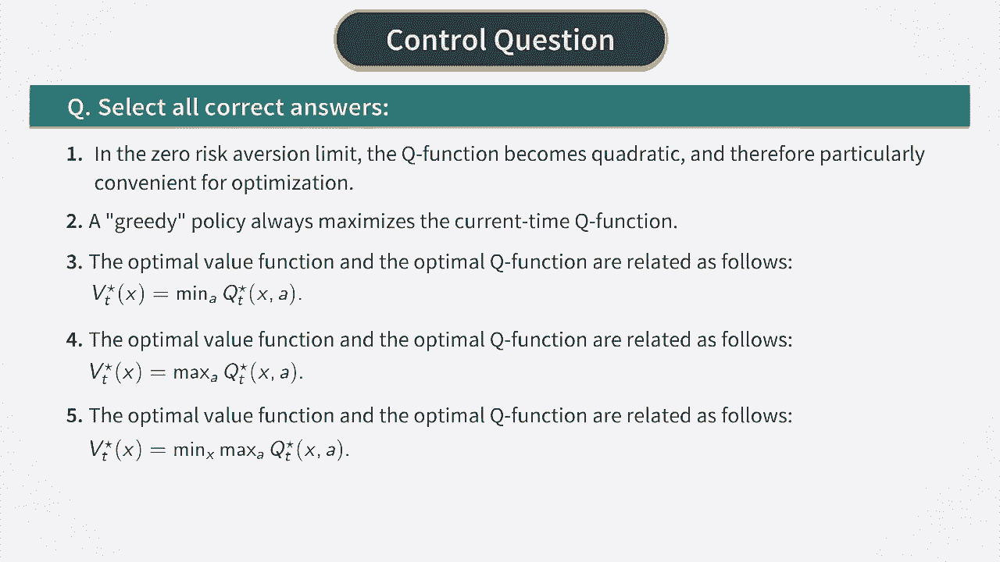

# P16：MDP for BSM - Action-Value Function - 兰心飞侠 - BV14P4y1u7TB

 Now， let's talk about how we can compute the optimal policy in this model。 We already know that the optimal policy， Pi*， is a policy that maximizes the value function V_t。 And the optimal value function V* satisfies the Bellman-Optimality equation， shown here。 If we know the dynamics， then this equation can be solved using methods such as value iteration。

 that we reviewed in our previous course。 But especially for treating the second。 and more interesting case， when the dynamics are unknown。 it turns out that another version of the value function is more useful for such tasks。 This another version is called the action value function。

 The action value function Q at time t is a function of two arguments， rather than one argument x_t。 as was the case for value function V of x_t。 The first argument in the Q function is the same x_t。 while the second argument is the time t action at。 The Q function is determined as an expectation of the same expression。

 that determines the value function V， but this time it's conditioned on the first action at to be specifically equal A。 while all subsequent actions at will follow policy pi。 Now by using the same trick of splitting the last term here。 into the time t term and as some over future values of t。

 we can obtain the Bellman equation for the action value function。 Now this equation holds for the Q function for any policy pi。 but we are more interested in finding the optimal policy pi star。 This is defined in the same way as before。 The optimal policy pi star should maximize the action value function。

 as shown in the last equation here。 Now the Bellman equation for the Q function relates it not with itself。 but rather with the value function V。 But if we look at the optimal Q function Q star。 we can obtain a Bellman equation that involves only this function。 To this end。 let's note that we actually have two equations here。

 The first one is an equation for Q star that is obtained by replacing pi by pi star。 in the Bellman equation for the Q function。 But there is also a second equation here that says that the optimal value function V star。 is obtained from Q star when its second argument， AT， is chosen optimally。 So if we substitute the second of these equations into the first one。

 we obtain an equation that contains only Q star。 This is called the Bellman-Optimality equation for the action value function。 and it plays a central role in reinforcement learning。 The Bellman-Optimality equation is a backward equation。 that should be solved backwards in time starting from time capital T minus 1。

 We also have a terminal condition for Q star in terms of the distribution of the。 portfolio value pi T at maturity T。 The optimal action at time T is therefore given by a value of AT that maximizes the Q function。 This is sometimes referred to as a greedy policy。 This picks a current action that maximizes the Q function without worrying how the section will impact。 or the actions in the future。 Now if we substitute the explicit form of the word function R into the Bellman-Optimality equation。

 we get this equation。 What this equation shows is that the Q function is quadratic in action AT。 Therefore it's easy to maximize with respect to AT。 We can also check what happens with this formula if we take the limit of risk version lambda going to zero。 In this limit we get the first equation shown here。

 But now we can replace the optimal Q function with minus the portfolio value。 whose expectation is exactly the mean option price C hat as we discussed earlier。 Therefore by using this and flipping the overall sign。 the first equation can be written as the second one。

 But the second equation is something that we already saw。 It's a recursive relation for the mean option price that has a right black-shulls limit。 when the time steps delta T are very small。 Therefore we see that our formulas reduce to the black-shulls model。 when both the risk version lambda and time steps delta T vanish。 。

