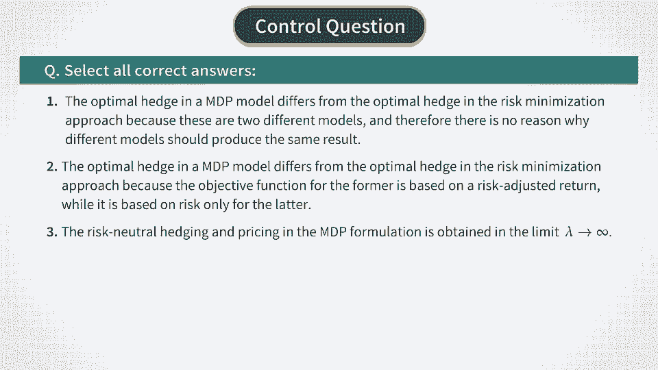

# P17：MDP for BSM - Optimal Action From Q Function - 兰心飞侠 - BV14P4y1u7TB

 All right， now after we verified that our formulas correctly。 reproduce the black-shulls model in the limit of zero lambda， and vanishing time steps。 let's go back to a more general case， when lambda and delta t are both non-zero。 So let's look again at the Bellman-Eptimality equation， that we obtained。

 One thing that stands out here is that because they reward， Rt is quadratic in at。 the Q function is also quadratic in at， as can be seen in this equation。 Therefore。 it means that the Q function can be maximized， analytically。 We just have to compute the derivative of the Q function。

 with respect to at and equated to zero to find the optimal， action at。 This is very easy to do as the whole expression is quadratic， in 18。 So by differentiating it。 we get the second expression shown， here。 This should be set to zero and solved for 18 in order to find。 the optimal action。 So by doing this simple rearrangement， we get our resulting。

 expression for the optimal hedge。 It should already look familiar to us。 The optimal hedge is given by a ratio of two conditional， expectations。 One involving the next step portfolio value， pi sub t plus， one。 and another one involving the square of the increments， delta as t。

 We had a very similar expression in our discrete time， black-shoules model。 Let me remind you this expression。 We wrote it before as a ratio of conditional covariance。 and conditional variance。 But you can also rewrite it as a ratio of two conditional。 expectations as shown in the second form of the second， equation on this slide。

 So the only difference between these two expressions is in。 the second term in the numerator of the first formula。 We can note several interesting things about this， additional term。 First。 let's look at them from a mathematical perspective。 If we take small time steps。

 then the expectation of delta as， t will be proportional to the difference of mu minus r。 This means that we can make the second term in the numerator。 vanish if we either set mu equal to r or we take a formal。 limit of lambda going to infinity in this expression。 In this case。

 the optimal hedge obtained by maximization of， the Q function will coincide with the optimal hedge obtained。 in our discrete time black-shoules model。 So this is a formal mathematical statement。 But what about a financial interpretation of these results？ To answer this question。 we can go back to our model， formulation。 Let's recall that we defined the value function V_t as a sum of。

 expected portfolio value and a sum of discounted variances of， the hedge portfolio at re-h times。 As a consequence of this specification， the expected， reward in our formulation has two terms。 Proportional to the expected drift and variance of the hedge。 portfolio as shown in the second equation here。 When we maximize this expression with respect to A_t。

 mathematically it's identical to the setting of Markovitz， portfolio analysis。 which maximizes risk adjusted， portfolio returns for the case of stock analysis。 So the objective function here looks simultaneously at the。 risk and retrains of the hedge portfolio。 And clearly。

 this is different from the discrete time black-shoules， model。 where we only looked at the risk of the hedge， portfolio。 But if we want to benchmark our model formulation against the， discrete time black-shoules model。 we can simply zero out， this additional term by setting their mu equal to R or。

 alternatively by taking the limit of lambda going to infinity。 Both limits will achieve the same goal。 That is they will enforce a pure risk-based view of the。 hedging and therefore will be consistent with our previous， discrete time black-shoules model。 So our hedge formula reproduces the pure risk-based hedge of the， discrete time black-shoules model。

 but it can also be used， when we not only looking at the risk in the option。 For example。 if options are used as investment vehicles， then we would need to look at both risk and retrains of。 options。 The classical black-shoules model is not able to address this。 case as it directly goes to the continuous time limit where， everything。

 including all stocks and all options， has the， same risk-creature return R。 Therefore。 when people try to have a framework for speculation。 with options starting with the black-shoules model， they have。 to rely on various ad hoc modifications of the original， model。

 But here we do not need any such ad hoc modifications because， our setting here is more general。 And in the general case， it optimizes a risk-adjusted。 return of the hedge portfolio rather than just risk。 So a pure hedge-based hedging of the classical black-shoules。

 model is just a special case here which can be reproduced by。 setting mu equal to R in the optimal hedge formula。 。 。

 。 。 you， [BLANK_AUDIO]。

