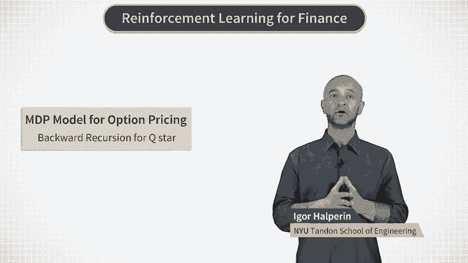
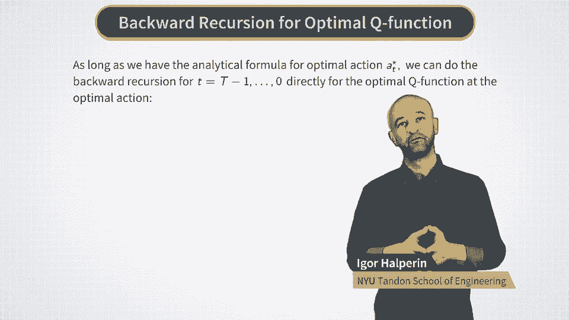
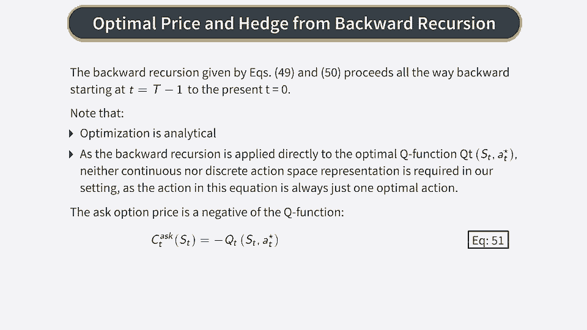
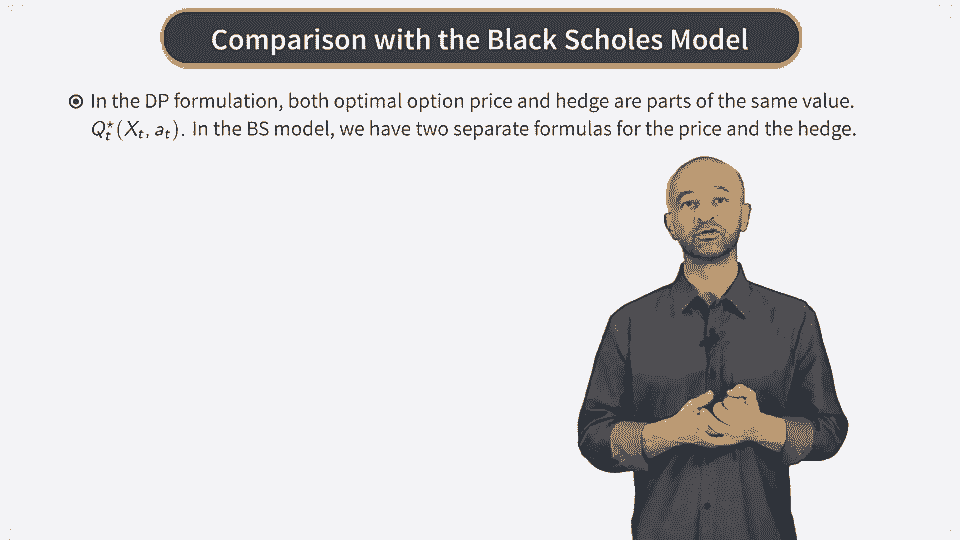
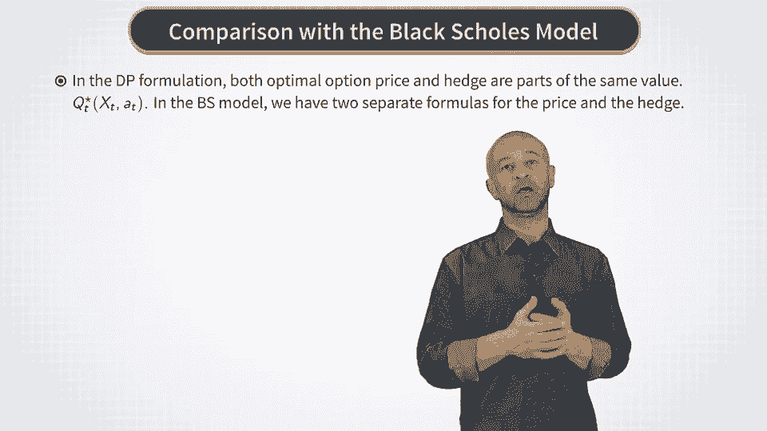
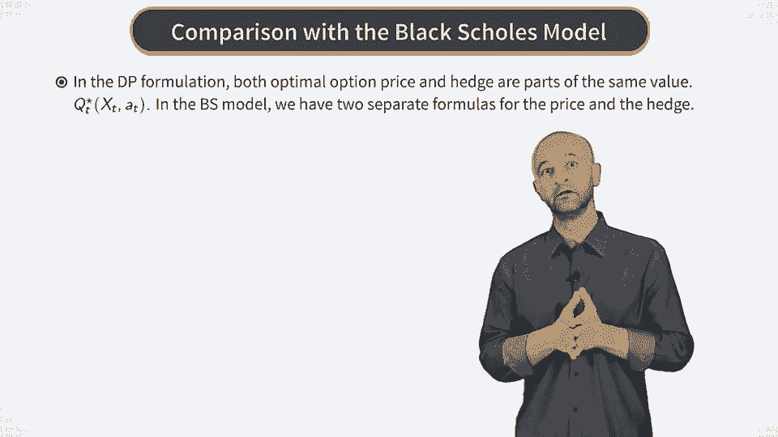
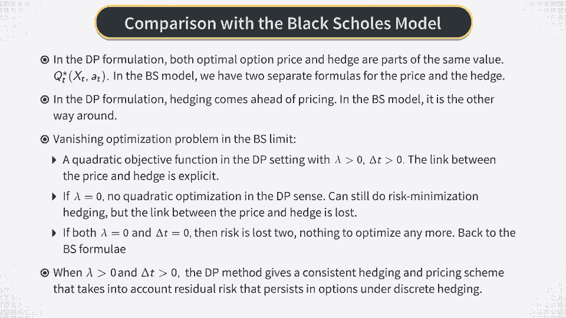
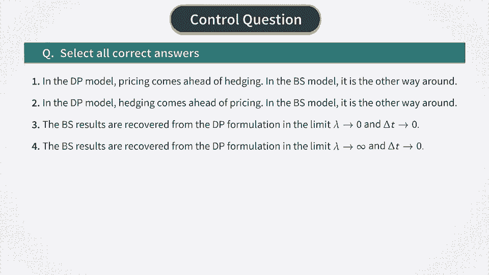

# P18：MDP for BSM - Backward Recursion for Q Star - 兰心飞侠 - BV14P4y1u7TB

 Now after we looked at how the optimal action or hedge is computed。

 we can put our two main formulas together in order to produce an algorithmic solution to the problem of hedging and pricing of our option。

 So we have the recursive relation for the optimal Q function， which holds for any value of 18。

 It's given by the first equation here。 But we already computed the optimal action A star for the current time step T。

 which is given by the second equation here。

 So we can substitute the second equation into the first one to get a recursive relation for the optimal Q function。

 Q star， evaluated directly at the optimal action A star。

 This is very convenient as it does not require extra storage to keep the values of Q star for other values of actions。

 If our ultimate goal is to evaluate Q star at time T equal zero。

 that is now directly at the optimal action A star。

 such the coercion of the Q star and A star is all we need。

 And this is indeed all we need if we want to find the optimal price and hedge of the option now at time T equals zero。

 This is because Q star with the A equal to A star is the same thing as V star as we saw before。

 But V star is exactly the negative optimal option price。

 according to our definition of the value function V。 Therefore。

 we recursively run these two formulas starting from time capital T minus one。

 then capital T minus two and so on， till the current time T equal zero。

 And at each time we first compute the optimal action A star from the second equation and then plug it in the right hand side of the first equation。

 This gives us a simple recursive algorithm to compute both the optimal hedge A zero star and optimal Q function Q zero star at A star。

 And after flipping the sign， the last number gives the option price。 So to summarize this procedure。

 we say the following。 We proceed with the backwards recursion all the way back to time T equal zero to get the optimal hedge and price of the option。

 The whole calculation is semi-analytical because the optimization problem solved at each time step is quadratic。

 And therefore can be solved semi-analytically as we just did above。

 The other point is that normally algorithms of dynamic programming and reinforcement learning require summary presentation of an action space。

 More to this they usually differ in whether they apply to a discrete action case or a continuous action space or to both。

 But in our setting because of availability of the analytical formula for the optimal hedge A star。

 we can apply backward recursion to the Q star function evaluated directly at the value of the optimal hedge A star。

 Because we carry only one value of AT in this calculation， which is the optimal value。

 there is no need to have any representation of the action space in this setting。

 So we just obtained an algorithmic solution in our discrete time MDP model for the optimal option price and hedge。

 Let's now compare it with the classical black-shulls model。

 The first thing we can note is that in our formulation both the hedge and the price are parts of the same expression for Q star。

 And this is different from the black-shulls model where we have two separate formulas for the price and the hedge。

 Moreover， in the black-shulls model we first compute the option price by solving the black-shulls equation and only then we compute the option hedge。

 by differentiating this price with respect to the stock price。

 But in our MDP formulation， the order of these operations is exactly the opposite。

 In each time step C we first compute the optimal hedge and then plug it into the Q star function to roll it backward in time。

 This is intuitive and in fact corresponds to the market practice of working with options that are imbalanced infrequently。

 for example once a month。 For such options， risk is clearly present because it can't be hedged away。

 And the option price is decided based on the analysis of such risk。

 But if we follow the black-shulls model it assumes that we can hedge continuously in time。

 This means that by following the black-shulls model and re-hedging every second or a millisecond we can completely eliminate any risk in option。

 To achieve this we only need to keep exactly the amount of the black-shulls delta of the stock in our hedge portfolio at every millisecond。

 This means that in the continuous time limit hedging becomes trivial and the only non-trivial part of the whole problem is pricing。

 which is solved using the black-shulls equation。 We can break this disappearance of risk in a black-shulls model in two steps。

 First， if we keep both lambda and delta t larger than zero。

 we have the MDP problem with the quadratic risk and the direct link between the objective function。

 option price and optimal hedge。 Now if we set lambda to zero but still keep delta t finite then there is no direct link between the option price and optimal hedge anymore。

 As there is no proper objective function that would relate them。

 But risk is still there and we still can do quadratic risk hedge in this setting。

 And finally when both lambda and delta t are zero we are back to the black-shulls model that claims that options have no risk at all because it all can be hedged away if only we can hedge all the time。

 This is of course totally unrealistic and losing any track of actual risk in option is the price paid for the beauty of the black-shulls equation。

 On the other hand discrete time formulations similar to one I presented here do not have closed form expressions for option price but they are much more realistic because they explicitly model risk in options。

 And both lambda and delta t are larger than zero the MDP formulation gives a consistent hedging and pricing formulation that takes the residual risk and options into account。

 We just saw a simple algorithm that does that。

 So let's pause here for a minute and then see in the next video how we can implement this algorithm。

 [BLANK_AUDIO]。

