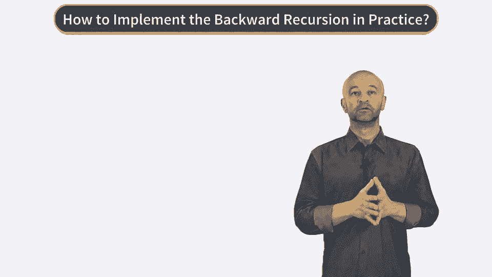
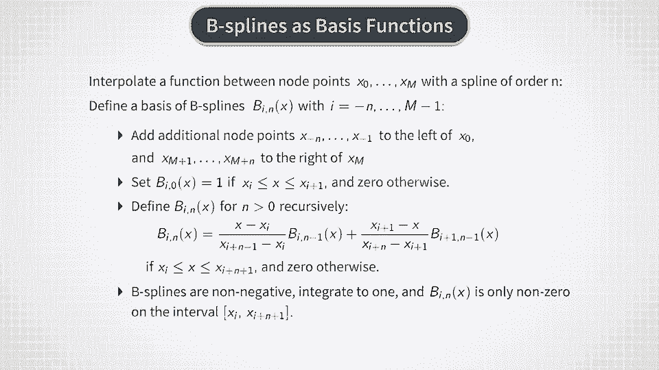
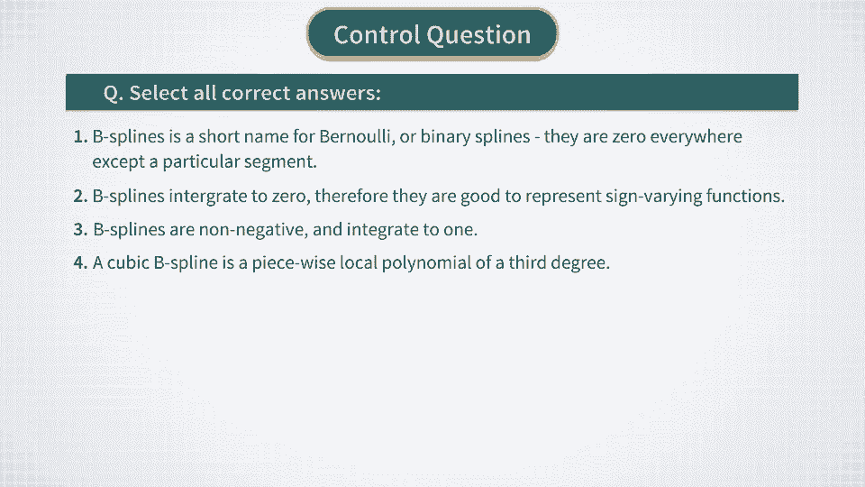

# P19：蒙特卡洛 - 基函数 - 兰心飞侠 - BV14P4y1u7TB

在上节课中，我们推导了MDP期权定价模型中最优对冲和定价问题的算法解。

为了提醒您这些方程，它们在这里再次给出。

所以反向递归算法表示我们必须从时间点T减去1开始，向回执行这里显示的两个方程，直到当前时间T。

但正如我们在多个场合已经注意到的，这些关系涉及不同的条件期望。那么问题是，我们应该如何计算这些条件期望？现在，我想提醒您，这里我们假设一个蒙特卡洛设置，其中在时间点团队下，我们之前称之为F sub T的信息条件集由所有蒙特卡洛路径组成，直到时间点团队为止。因此，使用这种条件期望的定义，剩下要学习的就是如何计算它们。

让我们首先看看如何在离散状态设置中计算这样的期望值。我们在上节课提到过，如果我们想要使用马尔可夫链逼近布莱克-斯科尔斯模型，我们可以对MDP模型进行离散化。在这种设置下，我们会有一个有限的状态变量X团队的不同可接受值XM，其中N的取值范围为1到M，M是我们离散状态设置中的状态数。

然后我们将在这个节点上得到一些QN的值。这些值也可以看作是离散值参数X团队的离散值函数。现在我们可以使用这里显示的无索引符号，将其写成X的离散值函数。我们简单地将所有QN乘以X和XN的**克罗内克符号**的值求和。当X等于XN时，这个值等于1，否则等于0。

这个公式简单地为QX的每个可能的X值生成一个恒等式。但使用这个公式的好处是，现在它对任何输入X都有效，类似于线性代数中对向量的所有元素有效的向量值表达式。我们现在可以在这个求和式中用更具提示性的符号phi N of X代替delta符号。

它将delta符号的两个参数分开。因此，phi N of X的计算方式与delta符号相同。但现在我们可以将其解释为X特征的**独热编码**。这怎么运作呢？

让我们考虑M的一个固定值，并为这个M考虑phi N of X函数。现在，对于给定的输入X，除非X与节点值XN匹配，否则这个函数的值为零。具有这种**独热编码**的函数可以称为**独热基函数**。现在，QX的整个求和可以解释为这些基函数的展开。

你可能会想，既然这种展开非常稀疏，那么研究它的意义何在？事实上，在整个求和中，只有一个值是非零的。这个说法当然是正确的。但以这种方式写出来的主要目的是，它现在可以推广到连续状态的形式。我们所需要做的，对于一个连续状态的情况，就是我们假设的设定。

这里是将我们在离散状态下使用的类似delta峰值的基函数替换掉。现在有了平滑的版本。这里你可以看到我们将用到的一组12个基函数。这并不是连续空间公式的唯一选择，但它是一个非常方便的选择，能满足我们的需求，因此我们将继续使用它。

这些基函数被称为B样条。让我们简单讨论一下这些B样条是如何构建的。B样条在插值问题中非常有用，当我们想通过一个连续和平滑的阶数为n的样条函数，在节点点X0到Xm之间插值某个函数时。

利用这些样条，操作是通过插入节点点来完成的。首先，添加额外的节点点，X子- n到X子-1位于X0的左侧，节点X子m+1到X子m+m位于Xm点的右侧。接着，我们递归地定义一组B样条，B子i和n的X。为此，首先我们取n等于0，并设置B-i的n的X等于1，当X在Xi和Xi+1之间的区间时，如果不是则设为0。

然后，我们通过这里展示的精度公式定义了B子i和n大于0的值。这个公式适用于X在区间Xi到Xi+n+1之间。这个区间外，B样条B，i，n为0。如你从公式中看到的，如果我们取n等于3，那么B-i和n就是非负的三次多项式。

这些B样条被称为三次B样条，接下来我们将使用它们。所以B样条非常有用，因为它们是非负的。它们的积分为1，并且只在区间Xi到Xi+n+1上非零。因此，它们为非负量提供了很好的基础。如果所有系数都是非负的。

整个表达式将是非负的，因为基函数本身是非负的。

所以B样条提供了一个非常好的基函数选择，但这不是唯一的选择。文献中也考虑了其他规格。例如，我们可以使用傅里叶余弦基函数或小波基函数。一个更困难的问题是，如何选择一组基函数，当我们不仅仅有一个，而是有多个股票时。

当我们考虑多资产组合时，我们将处理这些更复杂的设置。但目前我们将继续关注单一股票组合和单一标的期权，因为这将暂时占据我们的精力。

[BLANK_AUDIO]。

