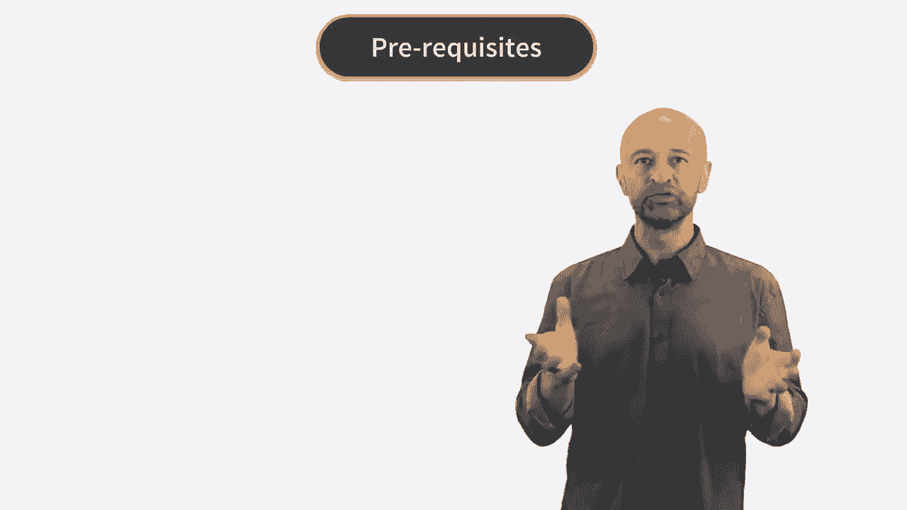
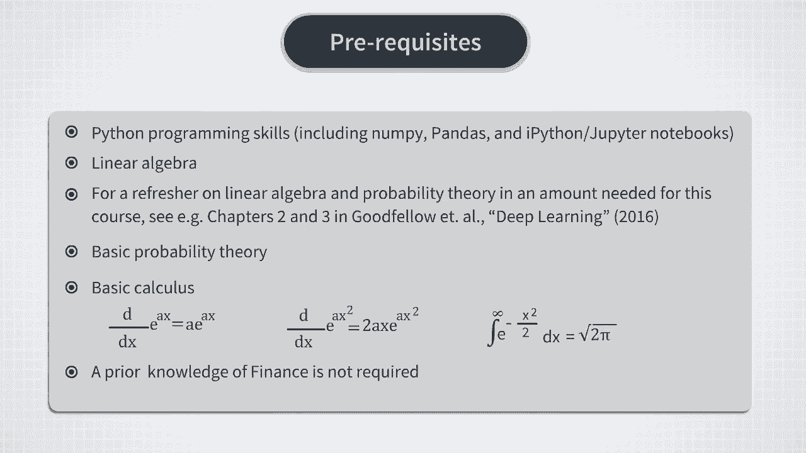
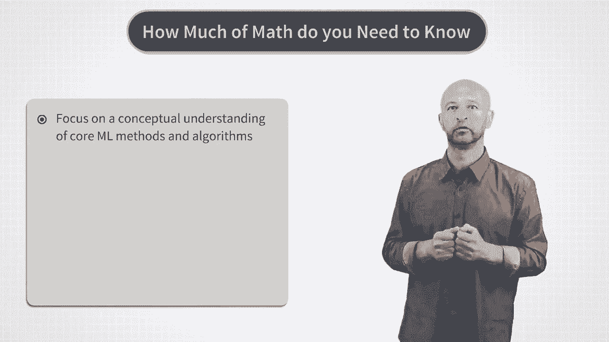
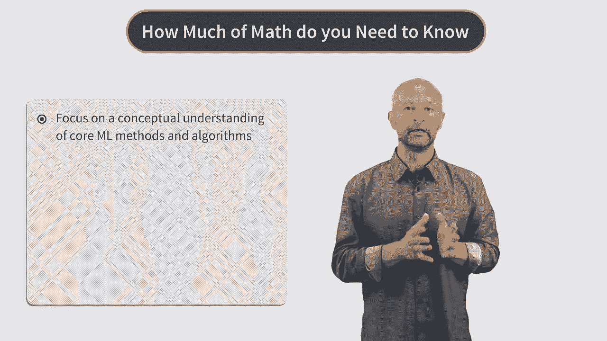
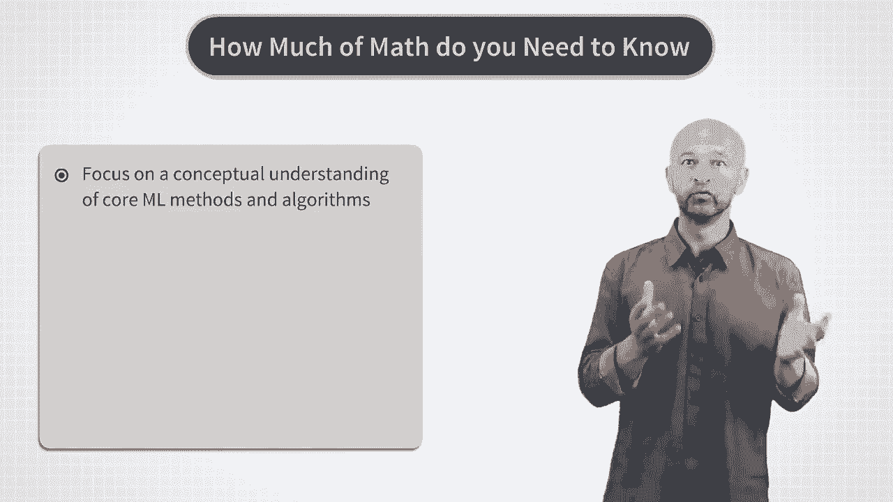
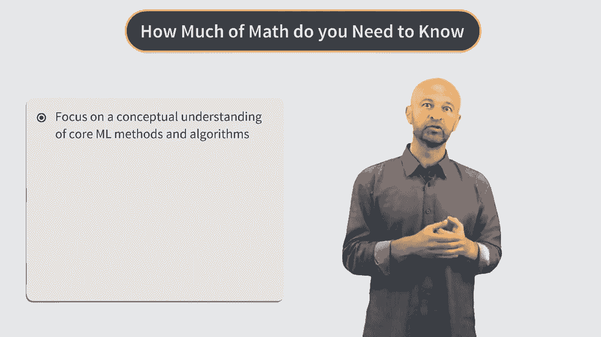
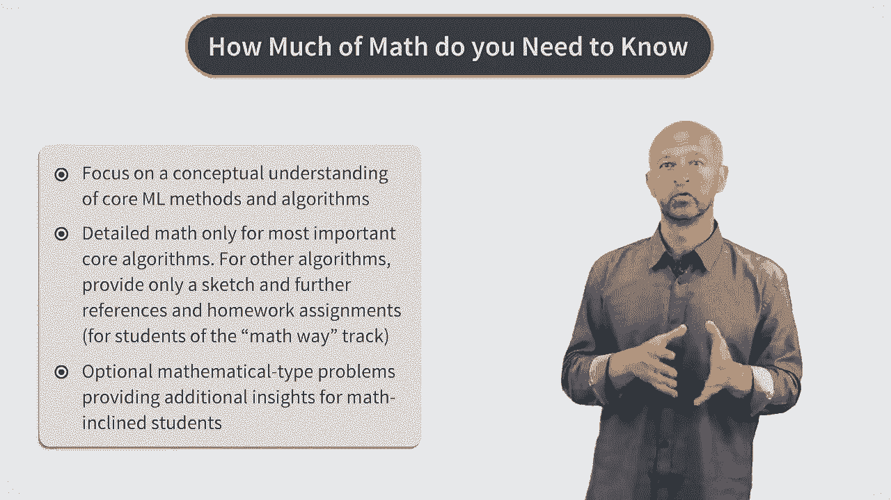
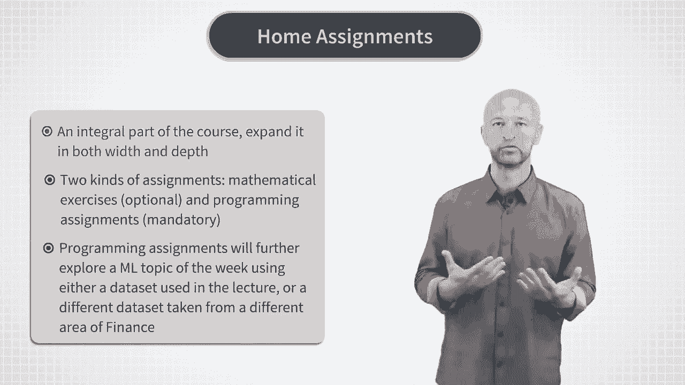
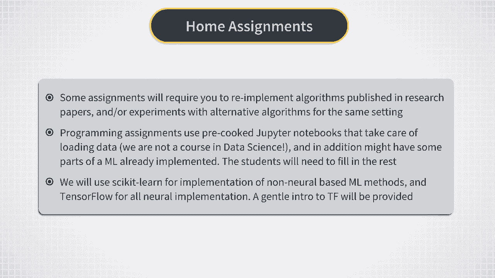
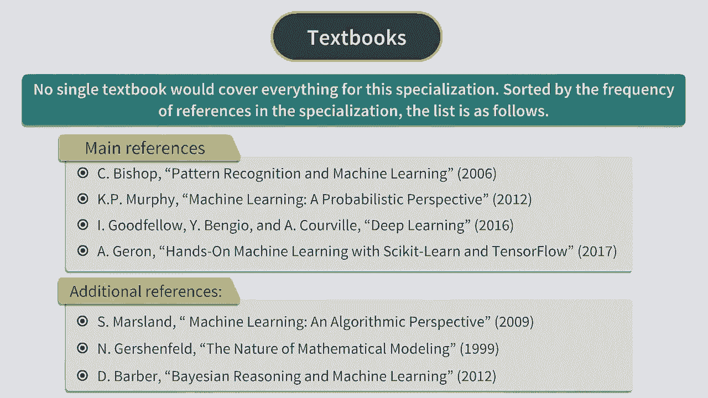

# P2：Introduction - Prerequisites - 兰心飞侠 - BV14P4y1u7TB

现在我来谈一谈这套课程需要的先修知识，我们从编程部分谈起，你应该会一些python。

用过或者至少见过jupyter notebook，如果你不熟悉jupyter notebook，请参考本周末尾的参考阅读，你也应该熟悉python的其他模块，例如numpy和pandas。

你可以不会tensorflow，因为随着课程进行我们会逐渐介绍tensorflow，现在来聊一聊数学部分的先修知识，以下是你应该掌握的，首先，机器学习会用到大量线性代数，所以你应该对矩阵运算。

特征值分解、矩阵的逆，和其他相关概念有所了解，你也应该掌握基本的概率论知识，例如，你应该熟悉正态分布、指数分布，二项分布；基本的定理，例如贝叶斯定理，也应该掌握基本的统计学知识，最后，在数学方面。

你也应该掌握基本的微积分，例如复合函数求导，所以，你能看得懂像这样、这样、这样的式子，如果你看不懂，请复习微积分。

就像我崇拜的一位物理学家，Alessandro曾经说，数学不应该阻止你去解决你想解决的问题，相反，你一旦掌握了它，它应该能够帮助你解决问题，顺带一提，“你需要掌握多少数学才能做机器学习”。

这个问题在很多论坛中很热门。

最近我读到一篇很有趣的文章，是由一名在机器学习领域工作的前物理学家写的，我强烈建议读一读这篇文章。

这里是链接，从我的角度来看，我同意他文章中的每一句话，物理学家就是这样应用数学去解决问题的，总结起来，大致是这样：当你遇到一个新的机器学习模型，无论是10个小时的讲座，还是书还是原始论文。

从摘要部分开始，如果你对摘要所说的，这个模型感兴趣并且想深入了解，浏览论文的主要式子，并确保你明白它们是什么意思，先不要管如何推导，先盯着式子，一边看一边琢磨，比如看看式子左边是什么意思。

右边是一个什么形式，比如是指数形式还是对数形式？

接着假设所有式子都是正确的，假设文章中提到的式子的应用方式也是正确的。

你可以开始直接尝试应用这个模型了，首先先用你理解的数据来测试这个模型，比如用随机生成数据，或常数数据，来看这个模型生成的结果是否靠谱，如果OK，接下来给模型输入，实际你想探索的数据，当你得到结果以后。

你可能喜欢或不喜欢这个结果，但更重要的是你会注意到模型的一些特别行为，你对模型的这些行为有自己的疑问，只有在这之后，你再重新回去理解文章中的数学部分，长话短说，如果你从数学开始看，不如先继续看别的。

之后如果需要的话再回来仔细钻研，这是对于这门课和以后的学习提出的一些实际的建议，当然，除非你有足够多的时间都看一遍，如果你没有的话，（实际上工作中你往往没有），按照我刚刚说到的方法去做能够节省很多时间。

最后，我们来说一说金融方面的先修知识，这部分没什么可说的，因为实际上，这门课不要求任何金融的先修知识，这套课程所有的金融概念和问题，都会有详细的解释。

Okay这个就是我想说的大部分内容了，也是一个大致的介绍，现在，我们用一些文献来结束这个视频。

关于机器学习有很多优秀的教科书，但是没有专门为金融所写的机器学习书籍，所以我结合了很多资源，例如Bishop、，Murphy、Goodfellow，还有Geron最近的一本新书。

另外几本我很喜欢的书还有，Marsland和Gershenfeld的书，除了教科书，我也用了论文，我自己的研究，业界文章，博客，维基百科，论坛帖子等等，总而言之，任何我觉得。

对于这门课有用的资源我都很推荐，因此，每次在课程中提到相关内容，我都会提到原始的参考文献，你可以读一读他们来加深理解，并且，我经常保留原始论文的注释，或者只是进行了小小的改动，因此如果你需要的话。

你总是可以去读原始论文，这就是在介绍部分，所有我想说的了，在接下来的视频中，开始第一节课，希望你觉得有帮助、有意思，如果你觉得我讲得太快或太慢，太深或太浅，有些主题没有讲到或者讲得太多了。

或者有一些其他有趣的主题可以讲，你可以在课程论坛上分享你的观点，祝你好运，并且。

