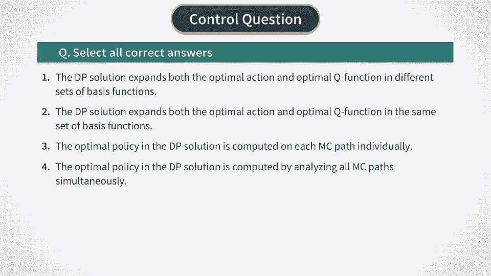

# P20：蒙特卡罗 - 使用蒙特卡罗进行最佳对冲 - 兰心飞侠 - BV14P4y1u7TB

现在，在我们介绍了基函数并看到它们如何构建之后，让我们回到原始问题，即如何使用蒙特卡罗实现最优Q函数的回溯递归。我们之前提到，条件期望中的条件FT应被理解为对所有蒙特卡罗路径的全集进行条件化。现在，我们获得了一种很好的方法来计算这样的期望，这种方法使用了基函数的方式。

假设我们定义了一组基函数，phi n(x)，其中参数x为当前状态变量的值。我们可以选择并且实际上会选择我们在上一视频中讨论的这些点作为这些函数。但我们将保持符号的通用性，以便其他基函数也可以使用。

如果需要，phi n(x)也可以被选用。特别地，我们可以将一些股票价格的外部风险因子纳入我们的基函数集合中。例如，我们可以包括标准普尔500指数的价格或波动性指数（如VIX）作为描述市场状态的风险因子。换句话说，我们的股票头寸可以影响特定股票的价格。

我们还可以使用这些因子与股票价格的组合。这可以捕捉股票价格和因子之间的相互作用效应。简而言之，在选择基函数时有很大的自由度，因此我们将继续使用一般形式。这样，我们的问题中有两个未知函数。

最优动作A* of x和最优Q函数Q* of x。如果我们的基函数集合phi n(x)足够具有代表性，我们可以用它来近似这两个函数A* of x和Q* of x。分别地，我们将两者表示为同一集合phi n(x)的展开式。此外，由于我们的问题是时间依赖的，我们使这些展开式的系数随时间变化。

所以我们有两个展开式，分别为最优动作和最优Q函数的系数phi n，t和omega n，t。现在，期权定价和对冲问题就转化为寻找这些系数。总体来说，我们总共有2M个未知系数。因此，如果我们有，比如说12个基函数。

那么这意味着M等于12，在这种情况下，我们将有24个未知系数需要计算。这将原本的无限维函数优化（用于A* of x和Q* of x）简化为一个有限维度的优化问题，只有少量参数。

现在，回溯递归应重新表述为一个方案，用来计算系数phi、t和omega n。t，t通过从时间T-1开始反向推导来计算。我们从计算最佳动作的系数phi和t开始。为此，让我们再次查看我们之前推导的Q函数的回溯递归公式。

如我们之前所提到的，这个关系的右侧是A*t的二次函数。因此，它也将是K-fissian的phi和t的二次函数。为了通过蒙特卡洛计算这些系数，我们对这个关系做了几件事。首先，我们在这里代入A*t的展开式，然后将所有期望值替换为蒙特卡洛平均值，并且去掉所有与A*t无关的项。

然后我们翻转整个表达式的符号，将A*t的最大化问题转化为最小化问题。这为我们提供了phi的目标函数gt，如这里所示，我们应该最小化它以找到最优的phi和t系数。现在，值得高兴的是，因为这是phi和t的二次函数。

它可以通过半解析方法来最小化。通过对这个表达式对某个phi和m t的导数取零并重新排列项，我们得到一个关于K-fissian的phi和t的线性方程组，如这里所示。它以一个m×m维度的平方矩阵A和一个长度为m的向量B的形式定义，这些都是通过这两个公式计算得出的。矩阵A是正定的，或者可以通过正则化使其变为正定，如我们稍后讨论的那样。

因此，它有一个逆矩阵。所以，K-fissian的phi和t的解仅仅是矩阵A的逆与向量B的乘积。因此，整个计算与之前的解析公式一样简单，但现在我们有了一个可计算的最优行动A*的表达式，而不是一个涉及两个条件期望的理论公式。我们实际上可以更详细地将我们的结果表达式与之前的解析公式进行比较。

我们再次将其写成矩阵A的逆与向量B的乘积。需要注意的一点是，由于涉及到矩阵求逆，可能最好为矩阵A添加一个正则化项，以防止可能的数值不稳定。一个最简单的实际调整方法是像这里一样，向矩阵A中添加一个单位矩阵并加上一个小的正则化参数epsilon。

另一个需要注意的点是，得到的表达式与我们之前的最优对冲的解析公式非常相似。实际上，两个公式中的分子和分母非常相似，唯一的区别是在这些表达式中基函数的存在。这些基函数在这个公式中正好做到了我们想要它们做的事情。也就是说。

他们对我们需要计算最优对冲的整个蒙特卡洛路径集合进行了条件化。现在，我们的phi和t的公式为我们提供了最优行动A*的解，当它被代入到A*的基函数展开式中时，得到时间步t时的最优解。

因此，我们的下一个任务是找到一种方法来计算系数omega和t，这些系数决定了最优Q函数。让我们在下一个视频中继续这个任务。

[BLANK_AUDIO]。

