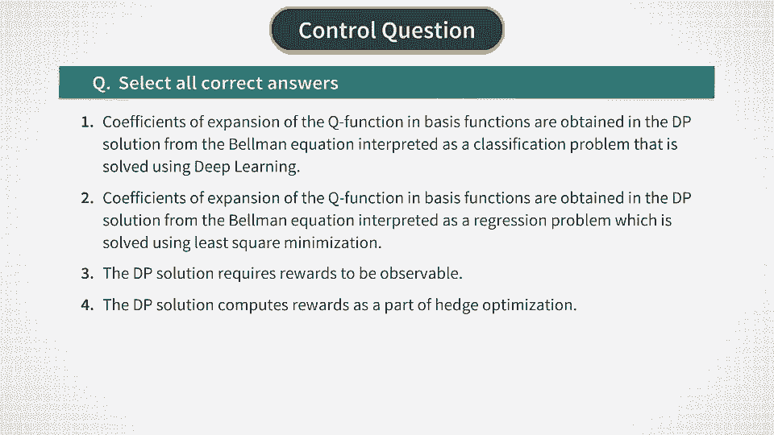

# P21：Monte Carlo - Optimal Q Function With Monte-Carlo - 兰心飞侠 - BV14P4y1u7TB

 Now after we found the coefficients phi and t of the optimal action A t star， at time t。

 we turn to the problem of finding coefficients omega and t for the optimal Q function。 To this end。

 let's take another look at the Bellman-Optimality equation that we derived earlier。

 To find coefficients omega and t， we consider this equation for the optimal action A star。

 rather than for a general value of action A t。 First， let's note that we can interpret this。

 equation as a regression of the optimal function Q t star on the sum of the reward R t and discounted。

 next step optimal Q function evaluated at the optimal action， as shown in the second equation here。

 We can check that these two formulations are equivalent if we take expectations in both。

 sides of the second equation。 Now to use it as a regression to find parameters omega and t。

 we need to know instantaneous rewards R t that enter this expression。 This is easy to do as we。

 know the theoretical expression for the reward。 It's given by the increment of the portfolio value。

 which is equal to gamma times pi sub t plus 1 minus pi t and minus a risk premium part。

 equal to lambda times variance of pi t。 As we saw before， the reward R t can also be written more。

 explicitly as a quadratic function of the time t action A t。 Therefore， as we go backwards in time。

 in the process of backward recursion， once we compute the optimal action A t star， we plug this。

 into the formula for the reward to compute the optimal reward。 That is the reward evaluated at。

 the optimal action。 So now we know the dependent variable for our regression， which is equal to。

 the sum of the optimal reward and the discounted next step optimal Q function。

 The predictor in this， expression， which stands in the right hand side。

 is the time t optimal Q function。 Now by substituting here the extension of Q star in basis functions。

 coefficients omega and t become regression parameters in this regression。 To find them。

 we proceed as we always do with regression and look for coefficients omega and t that minimize。

 the squared loss function F t of omega shown here。 Again， because this is a quadratic function of。

 coefficients omega and t， this minimization can be performed semi analytically。

 We introduce another， time-dependent pair of a matrix CT with elements Cmn and vector dt with elements dn and。

 matrix CT will have dimension m times m and vector dt will have lengths m。

 The solution of the regression problem for coefficients omega and t can then be given in the vector form。

 as the inverse of the matrix CT multiplied by the vector dt。 Again， because we deal here with the。

 matrix inversion in practice it might be a good idea to regularize matrix C by adding an identity。

 matrix with a small regularization parameter epsilon before inverting the matrix。 The solution。

 is then given by the inverse of this regularized matrix multiplied by dt。

 And this completes all calculations we have to do at each time-step team。 We have exactly two。

 such calculations。 One linear regression to find the optimal action and another linear regression to。

 find the optimal Q function at the optimal action。 Therefore。

 for t time-steps we will have the total， of two times t linear regressions。

 We have to compute in order to price and hedge an option。 Let's now summarize the whole procedure。

 In the backward recursion we start with time capital T。

 minus 1 and go back all the way to time t equals 0。 And at each time-step t we do the following。

 First we compute the matrix AT and the vector BT。 Then we compute coefficients。

 phi and t that determine the optimal action AT star。

 Then we use this value to compute instantaneous， rewards that correspond to this optimal action。

 After that we compute the matrix CT and the vector。

 DT and this produces coefficients omega and t and has the optimal Q function evaluated at the optimal。

 action。 The computed optimal Q function for this time-step is then used as the next step optimal Q。

 function for the next time moment t minus 1 of the backward recursion。 When we run this backward。

 recursion all the way to time t equals 0 the last optimal action will give us the optimal。

 hedge of the option now and the optimal price will be given by the negative of the optimal Q function。

 with the optimal action as the second argument。 So we have a complete solution to the whole problem。

 We can use this solution when the dynamics are known。 In fact this Monte Carlo dynamic programming。

 solution does not require a full knowledge of model dynamics as long as sample parts of。

 the underlying stock are available。 The only additional thing needed to implement。

 the dynamic programming Monte Carlo based backward recursion that we presented here。

 is the knowledge of risk aversion parameter lambda and the value of the stock drift mu。

 In the next week we will see how the backward recursion can be implemented using reinforcement。

 learning methods that do not assume that we know lambda。 Let me now conclude with the new。

 illustration of performance of dynamic programming approach to option pricing。 Let's see what is。

 shown here。 This example applies the dynamic programming approach to price put option。

 with the initial stock price of $100 and the strike of $100 which is known as。

 an at the money or ATM option。 The risk aversion rate lambda is set here to 0。001。

 The stock volatility is 15% and option maturity T is 1 year。 The stock drift is taken here to be。

 5% and the risk free rate is 3%。 Now the top left figure shows a random leachous in 10 parts of。

 the Monte Carlo simulation for the stock price。 The top right figure shows corresponding values。

 of the state variable Xt。 As expected the evolution of the state variable Xt doesn't show a drift。

 You can also know that for a particular pass shown on the left for the stock price。

 the drift of ST even though it's there is not quite visible but this is just a visual effect。

 Pass of ST do have a drift but pass of Xt do not。 The left figure in the middle row shows。

 optimal actions obtained on these paths and figure on the right shows the corresponding。

 values of the replicating portfolio。 Finally the left figure in the bottom row shows rewards obtained。

 from taking optimal actions and the right figure shows the optimal Q function。

 As you can see it converges at time 0 to the value of 4。9 and while the black shows price is 4。53。

 you can want to check convergence to the black shows option price you can do it by making the。

 risk aversion rate smaller and hedging frequency larger。 This actually will be a part of your。

 homework for this week along with the actual implementation of this dynamic programming scheme。

 And on this note I would like to wrap up this week but obviously not before we make a quick stop。

 here for some questions and see you the next week。

 [BLANK_AUDIO]。

